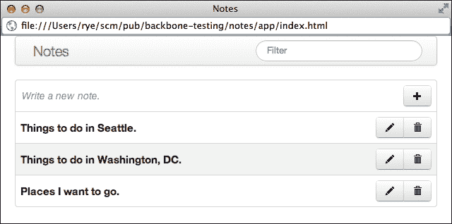
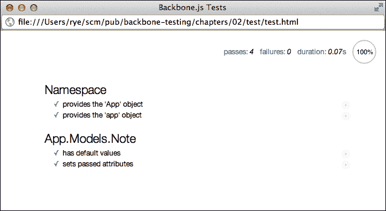

# 第二章：创建 Backbone.js 应用程序测试计划

现在我们已经建立了一个基本的测试基础设施，我们将把注意力转向集成 Backbone.js 应用程序并制定测试开发策略。在本章中，我们将通过以下主题创建测试计划：

+   回顾 Backbone.js 开发的一些基本概念

+   选择要测试的 Backbone.js 应用程序

+   检查相关的测试概念和方法，以指导测试计划的创建和执行

+   评估在完整或部分隔离状态下要测试的 Backbone.js 应用程序部分

+   识别测试多个相互作用的 Backbone.js 应用程序部分

+   将 Backbone.js 应用程序集成到我们的测试基础设施中，并编写和运行一些入门级应用程序测试

# Backbone.js 复习

虽然本书假设读者对 Backbone.js、Underscore.js 和 jQuery 有相当熟悉的程度，但我们仍将简要介绍 Backbone.js 应用程序开发的基础知识。

Backbone.js 提供了构建和开发 JavaScript 网络应用程序的抽象和有用功能。Backbone.js 通过一种可以粗略认为是**模型-视图-控制器**（**MVC**）的范式，将应用程序代码分为以下主题：

+   数据建模和检索

+   显示渲染和用户交互

+   将数据和处理逻辑代理到适当绑定和操作数据模型和用户界面的方式

### 注意

Backbone.js 并不完全遵循传统的 MVC 方法，导致一些观察者称其为**MV**框架。一个 MV*应用程序有一个模型和一个视图，但连接模型和视图的不是控制器。有关 MVC 和不同 MV*方法的更详细讨论，请参阅 Addy Osmani 的《Developing Backbone.js Applications》以及文章《Journey Through The JavaScript MVC Jungle》（[`coding.smashingmagazine.com/2012/07/27/journey-through-the-javascript-mvc-jungle/`](http://coding.smashingmagazine.com/2012/07/27/journey-through-the-javascript-mvc-jungle/))。

为了实现这一点，Backbone.js 提供了一套核心库组件：

+   **事件**：`Backbone.Events`模块使 JavaScript 对象能够发出和响应事件，包括内置的 Backbone.js 类事件以及自定义应用程序事件。

+   **模型**：`Backbone.Model`类提供了一个可以与后端同步、验证数据更改并向 Backbone.js 应用程序的其他部分发出事件的包装器。模型是 Backbone.js 应用程序中的基本数据单元。

+   **集合**：`Backbone.Collection`类将一组模型封装在一个有序列表中。集合提供事件、后端同步以及许多辅助方法，用于操作和修改底层模型集合。

+   **模板**：Backbone.js 将模板库的选择权留给开发者（本书我们将使用 Underscore.js 模板）。其他流行的模板替代方案包括 Handlebars ([`handlebarsjs.com/`](http://handlebarsjs.com/))、Mustache ([`github.com/janl/mustache.js/`](https://github.com/janl/mustache.js/)) 和 EJS ([`embeddedjs.com/`](http://embeddedjs.com/))。

+   **视图**：`Backbone.View` 对象是绑定模型、集合、模板与浏览器环境和 DOM 之间的粘合剂。Backbone.js 故意保持对视图必须做什么的不可知性，但一个典型的视图会引用一个集合或模型，通过模板将数据与用户界面耦合，并调解用户交互和后端服务器事件。为了阐明可能令人困惑的术语，`Backbone.View` 更类似于传统的 MVC 控制器，而 Backbone.js 模板则像 MVC 视图。

+   **路由器**：Backbone.js 程序通常作为单页应用程序开发，其中整个 HTML 页面源和 JavaScript 库在单个页面加载中下载。`Backbone.Router` 维护应用程序的内部状态并管理浏览器历史记录。路由器通过 URL 哈希片段（`#app-page`）提供客户端路由，允许将不同的视图链接到、书签和导航，就像传统的网页一样。

在接下来的章节中，我们将分别和一起测试这些组件，因此确保对基础知识有扎实的掌握非常重要。核心文档位于 [`backbonejs.org`](http://backbonejs.org)，它是了解概念、API 以及应用程序开发提示和技巧的良好起点。对于更深入地了解 Backbone.js 主题，有许多优秀的在线和印刷资源，包括：

+   由 *Addy Osmani* 编写的 *Developing Backbone.js Applications*，这是一本 Creative-Commons-licensed 的书籍，在 GitHub 上的开源社区的帮助下开发。本书讨论了创建 Backbone.js 应用程序的理论、架构和基础知识（[`github.com/addyosmani/backbone-fundamentals`](https://github.com/addyosmani/backbone-fundamentals)）。

+   *Derick Bailey 的博客*，这是一个经常更新并包含许多 Backbone.js 文章的博客，由 `Backbone.Marionette` 的创造者撰写（[`lostechies.com/derickbailey/category/backbone/`](http://lostechies.com/derickbailey/category/backbone/))。

+   官方的 Backbone.js 维基页面，该页面汇集了博客文章、教程和工作示例（[`github.com/documentcloud/backbone/wiki/Tutorials%2C-blog-posts-and-example-sites`](https://github.com/documentcloud/backbone/wiki/Tutorials%2C-blog-posts-and-example-sites)）。

# 选择一个 Backbone.js 应用程序进行测试

设计和实施测试计划本质上是一项实践练习，通过将测试经验和技巧应用于实际应用——无论是刚刚开始的项目还是需要更好测试覆盖的现有应用——我们可以更好地实现整体应用可靠性的目标。

如果您已经在开发 Backbone.js 应用程序，您可能可以跳到本章的下一节。我们想要识别的一个潜在问题是现有应用程序的复杂性，特别是那些具有最少或没有现有测试的应用程序。复杂的依赖关系、非模块化设计和高度耦合的应用程序组件可能需要大量的模拟和存根来允许基本的测试框架集成。最终，围绕遗留应用程序编写的测试基础设施可能与围绕模块化、解耦应用程序（如 Notes）编写的测试基础设施大不相同。因此，您可能希望将我们的参考应用程序作为学习工具使用。

我们提供了一个小型参考 Backbone.js 应用程序，用于与本书一起使用，简单命名为 Notes。Notes 是一个在线笔记管理器，允许用户使用 Markdown 语言（[`daringfireball.net/projects/markdown/`](http://daringfireball.net/projects/markdown/））创建、查看和编辑笔记。您可以在 [http://backbone-testing.com/notes/app/](http://backbone-testing.com/notes/app/) 尝试该应用程序的在线演示。

Notes 的完整源代码作为示例仓库的一部分提供（有关下载说明，请参阅*前言*）。我们实际上提供了 Notes 应用程序的两种版本，它们共享大部分底层代码。具体如下：

+   **本地应用程序**：示例仓库中的 `notes/` 目录包含一个由 HTML5 localStorage（[`developer.mozilla.org/en-US/docs/DOM/Storage#localStorage`](https://developer.mozilla.org/en-US/docs/DOM/Storage#localStorage)）支持的应用程序，用于在浏览器中进行持久、客户端存储。该应用程序可以从基于 `file://` 的 URL 运行，而无需网络连接，并将用于本书中的大多数示例。

+   **服务器应用程序**：示例仓库中的 `notes-rest/` 目录包含一个由 MongoDB 数据库支持并由 Node.js 网络服务器（位于 `notes-rest/server.js`）提供服务的应用程序。示例仓库包含有关安装和运行后端服务器的进一步说明。

## 熟悉 Notes 应用程序

Notes 应用程序最初向用户展示现有笔记标题列表，并提供编辑/删除单个笔记的按钮。页面还提供了一个**写新笔记**输入表单用于创建笔记，以及一个简单的搜索框，用户可以通过标题过滤显示的笔记。



注意事项列表

点击笔记标题，例如 **华盛顿特区要做的事情**，将激活单个笔记视图并显示带有渲染 HTML（标题、项目符号列表等）的笔记：


单个笔记视图

单个笔记编辑器提供标题和 Markdown 文本数据的表单输入。对标题或文本的任何更改都将立即保存到后端数据存储中，并可供查看：


单个笔记编辑表单

## 笔记应用程序的结构

`notes/app/index.html` 网页中的 JavaScript `script` 标签说明了程序文件和应用程序的整体结构：

```js
<!-- JavaScript Core Libraries -->
<script src="img/underscore.js"></script>
<script src="img/jquery.js"></script>
<script src="img/backbone.js"></script>
<script src="img/backbone.localStorage.js"></script>
<script src="img/bootstrap.js"></script>
<script src="img/showdown.js"></script>

<!-- JavaScript Application Libraries -->
<script src="img/namespace.js"></script>
<script src="img/config.js"></script>
<script src="img/note.js"></script>
<script src="img/notes.js"></script>
<script src="img/templates.js"></script>
<script src="img/note-nav.js"></script>
<script src="img/note-view.js"></script>
<script src="img/note.js"></script>
<script src="img/notes-item.js"></script>
<script src="img/notes-filter.js"></script>
<script src="img/notes.js"></script>
<script src="img/router.js"></script>

<!-- Bootstrap and start application. -->
<script src="img/app.js"></script>
```

如果长长的 JavaScript 库和应用文件列表看起来令人畏惧，请不要担心。随着我们对每个应用组件的测试，我们将逐一介绍它们。本书中的示例可以独立存在，无需查看笔记应用程序的完整源代码。同时，下载、运行和测试笔记应用程序是一项有用的练习，尤其是在你进入本书的后续章节并希望看到整个测试集合作为一个单一包组合在一起时。

在 JavaScript 库中，我们从熟悉的 Backbone.js（v1.0.0）、Underscore.js（v1.4.4）和 jQuery（v2.0.2）的核心开始。`notes/app/js/lib/` 中的附加供应商库包括：

+   **Backbone.localStorage**：这允许我们将模型数据保存到 `notes/app/` 示例应用程序的 `localStorage` 数据库中——[`github.com/jeromegn/Backbone.localStorage`](https://github.com/jeromegn/Backbone.localStorage)

+   **Bootstrap**：这是一个流行的用户界面布局和组件库——[`twitter.github.io/bootstrap/`](http://twitter.github.io/bootstrap/)

+   **Showdown**：这可以将 Markdown 文本（例如，`## 标题`）转换为格式化的 HTML（例如，`<h2>标题</h2>`）——[`github.com/coreyti/showdown`](https://github.com/coreyti/showdown)

在应用结构和事件流方面，笔记的关键组件可以大致按层次结构如下呈现：

```js
app
  App.Routers.Router
    App.Views.Notes
      App.Views.NotesFilter
      App.Views.NotesItem
      App.Collections.Notes
      App.Templates

    App.Views.Note
      App.Views.NoteNav
      App.Views.NoteView
      App.Models.Note
      App.Templates
```

应用程序 `app` 引导各种应用部分并启动路由器 `App.Routers.Router`。路由器将哈希片段路由到列表视图 `App.Views.Notes` 或单个笔记视图 `App.Views.Note`。这两个视图都使用来自 `App.Templates` 的 Underscore.js 模板字符串。列表视图 `App.Views.Notes` 包含两个额外的视图对象用于过滤和显示列表项，以及笔记集合。单个笔记视图 `App.Views.Note` 包含两个视图对象用于菜单栏导航操作和渲染标记，以及一个笔记模型。

深入应用文件，`notes/app/js/app/` 目录分解为模块组，从一些辅助工具开始：

+   `namespace.js`: 这为我们的应用程序类（`App`）和实例（`app`）设置了一个全局命名空间。

+   `config.js`: 这为应用程序实例设置配置变量，我们将在一些测试中覆盖这些变量。

应用程序有一个单一的模式和集合来抽象笔记数据：

+   `App.Models.Note` (`models/note.js`): 这是一个表示笔记的模型类。

+   `App.Collections.Notes` (`collections/notes.js`): 这是一个封装`App.Models.Note`模型实例的集合，表示笔记列表。

所有视图模板都维护在一个文件中：

+   `App.Templates` (`templates/templates.js`): 这是一个对象字面量，包含用于渲染各种视图的 HTML 部分的 Underscore.js 模板字符串。

单个笔记页面有三个视图对象——一个包含子视图（`App.Views.NoteView`）的父视图（`App.Views.Note`），用于渲染笔记，以及一个用于与导航栏交互的辅助视图（`App.Views.NoteNav`）。

+   `App.Views.NoteNav` (`views/note-nav.js`): 这是一个辅助视图，用于控制笔记导航栏选项**查看**、**编辑**和**删除**，并监听/触发与其他视图交互的事件。

+   `App.Views.NoteView` (`views/note-view.js`): 这是一个子视图，用于将笔记 Markdown 数据渲染为 HTML。

+   `App.Views.Note` (`views/note.js`): 这是一个表示单个`App.Models.Note`模型用于查看、编辑和删除的父视图。它包含子视图`App.Views.NoteView`和辅助视图`App.Views.NoteNav`。

主页上的笔记列表具有类似的视图组合。

+   `App.Views.NotesFilter` (`views/notes-filter.js`): 这是一个用于管理筛选表单输入和根据筛选查询隐藏/显示笔记的辅助视图。

+   `App.Views.NotesItem` (`views/notes-item.js`): 这是一个子视图，用于在主页上渲染单个笔记列表条目。

+   `App.Views.Notes` (`views/notes.js`): 这是一个包含`App.Collections.Notes`集合、`App.Views.NotesFilter`视图和多个`App.Views.NotesItem`视图实例的父视图，允许用户通过标题浏览可用的笔记，并通过点击操作按钮调用特定的笔记操作（例如编辑或删除）。

最后，我们有路由器和应用程序实例：

+   `App.Routers.Router` (`routers/router.js`): 这是应用程序路由器，它处理主页和单个笔记页面的路由。

+   `app.js`: 这是 Backbone.js 应用程序实例，它实例化了`App.Views.Notes`和`App.Routers.Router`实例并启动路由历史。应用程序实例在功能上类似于 C 和 Java 等语言中的`main`函数入口点。

这些组件构成了本书中测试示例的基础。同时，Notes 应用程序的具体代码、类和对象作为测试目标并不特殊或独特——任何具有标准模型、视图、模板和路由器的 Backbone.js 应用程序都应足够。

### 小贴士

许多其他 Backbone.js 应用程序作为测试和开发实践的学习工具可用，其中许多已在 Backbone.js 示例网站维基页面上进行了记录。一个特别受欢迎的项目是 TodoMVC ([`todomvc.com/`](http://todomvc.com/))，它使用 Backbone.js 提供了一个简单的任务管理器。TodoMVC 还提供了使用其他 JavaScript 框架（包括 AngularJS、Knockout.js、Meteor 和 Derby）的相同应用程序的示例，这使得在 Backbone.js 世界之外尝试流行的前端框架成为可能。

# 测试范式和方法

关于软件测试和开发方法，存在众多相互竞争和补充的理论。了解测试方法的世界为任何希望改进构建、实施和管理测试方式的开发者提供了一个极好的背景。为了简洁起见，本书中我们将仅介绍两种特别适用于 Backbone.js 测试的范式——测试驱动开发（TDD）和行为驱动开发（BDD）。

测试驱动开发是一个先编写测试然后才编写实际代码的过程。这种方法的优点包括：

+   将测试作为开发过程中的首要任务

+   鼓励将代码编写成小型模块单元

+   防止对代码实现细节的了解过度影响测试

测试驱动开发（TDD）和一般的软件测试原则在许多资源中都有涉及；关于这个主题的一个推荐参考是 Steve Freeman 和 Nat Pryce 所著的 *Growing Object-Oriented Software, Guided by Tests* ([`www.amazon.com/Growing-Object-Oriented-Software-Guided-Tests/dp/0321503627`](http://www.amazon.com/Growing-Object-Oriented-Software-Guided-Tests/dp/0321503627))。

### 注意

为了提高可读性，我们通常先展示代码然后是测试。然而，这并不一定是代码和测试的开发顺序。尽管我们的示例如此，但我们强烈建议您将 TDD 实践融入您的软件开发过程中。

行为驱动开发（Behavior-Driven Development，简称 BDD）是对测试驱动开发（Test-Driven Development，简称 TDD）的一种改进。它是由*Dan North*([`dannorth.net/introducing-bdd/`](http://dannorth.net/introducing-bdd/))开发的，其核心是使用应用期望的*行为*来指定和描述测试。换句话说，BDD 测试关注的是*应用*应该做什么，而不是测试代码在测试什么，这导致开发者理想上更多地思考整个应用，而不是内部测试细节。要了解更多关于 BDD 的原则和应用，[`behaviour-driven.org/`](http://behaviour-driven.org/)网站是一个很好的起点。

### 小贴士

**BDD 和 TDD 作为库配置选项**

BDD 和 TDD 范式在测试术语中非常普遍，以至于许多测试库都采用了 BDD 或 TDD 术语来指定 API 和配置。例如，在第三章*测试断言、规范和套件*中，我们将探讨 Mocha 的`bdd`和`tdd`API 接口。为了避免任何混淆，最好将测试库模式视为只是配置选项，这些选项可能与我们已经讨论过的范式有或没有严格的关系。

# 测试概念、方法和规划

在跳入测试的深水区之前，有一个关于我们应该测试什么以及为什么的测试计划是有意义的。术语**测试计划**被大量使用，有众多可能的解释，因为过程、文献和实践已经普遍存在并且持续演变了几十年。现代测试计划的范围从随意的、主要是非正式的实践到正式的、100 页的文档，需要在不同阶段获得管理层批准，这并不令人惊讶。

### 注意

关于应用于现代 JavaScript 应用程序的测试计划实践的更详细讨论，请参阅由*Yuxian Eugene Liang*编写的*《JavaScript 测试入门指南》*([`www.packtpub.com/javascript-testing-beginners-guide/book`](http://www.packtpub.com/javascript-testing-beginners-guide/book))。

由于 Backbone.js 应用程序通常是在迭代开发周期中创建的，通常没有太多的额外正式性，我们将采取相当实际的方法，创建一个测试计划，该计划仅识别测试类别并将它们应用于正在测试的应用程序。虽然实际的规划文档或维基是最佳实践，但并非绝对必要。主要观点是能够在开发过程中识别适合给定代码或功能的测试。

我们将专注于测试计划范围内的几个许多重叠的概念：

+   **单元测试**：单元测试将应用程序的某些部分（单个函数、类和模块）隔离出来进行测试。一些前端单元测试的解释还进一步要求测试执行快速且没有任何 I/O（网络、磁盘等）。

+   **部分集成测试**：集成测试通常涉及测试整个应用程序堆栈——前端、Web 服务器、后端数据存储以及其中的一切。在这本书中，我们不会走那么远，而是将编写结合多个应用程序部分（例如，集合和视图）的前端测试，并验证它们是否正确交互。

单元测试采取狭窄的视角，通常由开发人员用来为当前正在工作的代码片段定义一组所需的行为。然后，代码被开发以匹配单元测试断言。部分集成测试采取更高层次的视角，将应用程序拼凑在一起，并检查各个组件是否构成一个功能整体。在一个典型的 Backbone.js 应用程序中，单元测试可能会创建一个单独的模型并测试仅模型方法。相比之下，部分集成测试可能会创建一个包含多个子视图和集合的视图，并验证集合数据的变化是否修改了子视图的显示。

其他我们在这本书中不会明确介绍，但值得熟悉并整合到整体开发和测试过程中的概念包括：

+   **完全集成测试**：完全集成测试包含整个应用程序（通常使用已知测试数据初始化），模拟用户通过前端的行为，并验证应用程序响应是否从后端传播到用户界面。对于一个 Backbone.js 应用程序，这包括将浏览器窗口指向应用程序的 HTML 页面，并像真实用户一样运行应用程序。

+   **回归测试**：回归测试隔离并暴露应用程序中报告的缺陷。测试首先编写来验证缺陷是否重现，之后修复源代码。测试作为整体测试套件的一部分继续运行，以确保缺陷不会再次出现。

+   **可用性测试**：可用性测试包括许多不同的形式，重点是获取反馈，揭示需要用户界面或用户体验改进的应用程序部分。

+   **性能/负载测试**：性能测试验证应用程序在给定用例中是否保持最小响应时间。负载测试检查当程序的不同部分受到压力时，应用程序是否仍然能够满足性能目标。

+   **验收测试**：验收测试构成了客户验证应用程序是否满足其要求的标准。一组验收测试可以包括之前提到的任何测试类别。

现在我们对这些各种测试概念有了简要的介绍，我们将为我们的 Backbone.js 应用程序制定一个非正式的测试计划。我们将检查我们 Backbone.js 应用的各个部分，确定需要测试的内容，我们应该应用哪种类型的测试，以及我们需要在应用中验证的行为。对于仍处于开发阶段或早期设计阶段的程序部分，我们将进行相同的练习，但重点是我们期望应用程序在开发完成后表现出的行为。

# 测试单个 Backbone.js 组件

Backbone.js 应用程序非常适合进行测试分离。Backbone.js 提供了一些核心组件，它们大多避免了相互依赖。本节的目标是确定可以单独进行单元测试的 Backbone.js 应用程序的不同部分，并开始思考我们应该测试每个组件的哪些特性。许多组件可以单独实例化，而其他组件在测试中可能需要一些额外的模拟或修补帮助。

## 模型

Backbone.js 模型通常是独立实体，可以通过简单的 `new MyModel({foo: 123})` 调用进行实例化。因此，我们可以在测试中创建独立的模型对象，而不需要引用任何其他对象。我们的模型测试应包括以下断言：

+   对象可以使用提供的和/或默认值进行实例化

+   数据可以与后端数据存储（例如，`localStorage` 或 REST 服务器）同步

+   自定义和内置事件在适当的状态变化时触发和/或被消费

+   验证逻辑能够准确区分属性数据的正确性

## 集合

集合通常对模型有一个单一依赖，在类定义中声明为 `model: MyModel`。我们可以在测试中直接实例化集合，或者模拟 `model` 属性以实现进一步的测试隔离。典型的集合规范应验证以下内容：

+   可以使用或不需要模型对象数组来创建集合对象

+   模型对象可以被添加和移除出集合

+   在容器和模型变化时触发事件

+   数据与后端适当同步

## 模板

虽然模板不是实际的 Backbone.js 组件，但有一些传统的模板开发技术用于 Backbone.js 集成，我们将观察这些技术。模板通常没有依赖关系，可以在测试代码中单独使用。

模板测试的具体内容很大程度上取决于所使用的引擎（例如，Underscore.js 或 Handlebars）。一个合理的测试起点将确认以下内容：

+   模板对象使用提供的数据渲染适当的 HTML 输出

+   复杂数据结构，如数组和对象，在模板输出中被正确插值

## 视图

视图通常是 Backbone.js 组件中依赖性最多的。视图可以包含模型、集合、模板、路由和子/辅助视图引用的组合。因此，我们将在测试中模拟或修补依赖项以隔离视图和/或提供部分依赖项。

对于所有应用程序视图，我们希望验证：

+   视图可以渲染目标 HTML，将模型数据绑定到模板字符串

+   带有`el`属性的视图对象在创建时被添加到 DOM 中

+   视图方法正确绑定到 DOM 和 Backbone.js 事件，并做出适当的响应

+   视图包含的对象（例如，子视图和模型）在视图移除时被正确处理

## 路由器

路由器通常包含几个顶级视图，并且可能有集合或模型引用。为了单元测试的目的，我们通常会模拟依赖项以轻松测试路由行为，而无需考虑应用程序的其他部分。我们的路由器测试需要断言：

+   URL 路由与适当的视图或其他操作准确匹配

+   路由器在导航事件后正确维护浏览器历史记录

## 工具

工具包括任何实际上不是核心 Backbone.js 类或对象的辅助代码。由于工具是临时创建的，并且没有实际约束，因此它们通常可以很容易地进行单元测试，前提是它们与支持测试一起开发，并考虑到支持测试。

# 测试应用程序交互和事件

Backbone.js 应用程序被最终用户作为一个统一的整体使用，并且尽可能的，我们应该有测试基础设施验证整体应用程序的功能和行为，这些功能和行为跨越单个 Backbone.js 组件。

## 部分集成

虽然单元测试是现代软件开发的基础，但我们必须从单元测试树隐喻地转移到部分集成测试的森林，以确保至少某些应用程序的部分能够和谐且可靠地协同工作。在实践中，这仅仅意味着我们在之前讨论的测试中改变模拟或移除组件依赖的程度。

集成测试可以通过许多方式与应用程序部分交互，包括：

+   通过创建一个包含集合和子视图的父视图，调用 DOM 事件，并检查集合数据和子视图显示的适当更改

+   通过在 Backbone.js 视图中填写和提交表单输入

+   通过直接将模型添加到集合中并在监听视图中触发事件

## 事件

所有 Backbone.js 类都扩展了`Backbone.Events`基类，并且通常将事件作为第一级通信手段发出和消费。我们希望测试我们的应用程序组件在应用程序执行期间正确触发并对各种预期事件做出反应。我们通常会利用工具，如间谍、存根和模拟，来测试我们想要测试的事件逻辑，同时不影响其他应用程序状态。

我们还需要仔细编写测试代码，以正确设置和拆除测试环境，以便我们可以在每个测试中对起始事件监听器状态做出合理的假设。例如，如果多个测试在未清理的情况下向共享对象添加自定义监听器，其他测试可能会由于监听器回调交互而意外失败。

我们将在所有 Backbone.js 组件中测试的事件行为包括是否：

+   对象响应自定义/内置事件

+   对象正确地发出事件

+   在销毁事件（如对象或视图移除）中，事件监听器被正确清理

# 测试应用程序的初步尝试

现在我们已经可以识别出我们想要测试的 Backbone.js 组件的各个方面，让我们开始规划并编写测试命名空间实用工具和 Backbone.js 模型的测试。对于每个组件，我们将检查应用程序用例和预期行为，然后编写测试以验证我们的期望。

## 命名空间

Notes 应用程序的起点是一个命名空间实用工具，它提供了两个全局变量来组织我们的应用程序类（`App`）和实例（`app`）。在 `notes/app/js/app/namespace.js` 示例应用程序文件中，我们将创建两个命名空间对象字面量，并带有类/应用程序属性：

```js
// Class names.
var App = App   || {};
App.Config      || (App.Config = {});
App.Models      || (App.Models = {});
App.Collections || (App.Collections = {});
App.Routers     || (App.Routers = {});
App.Views       || (App.Views = {});
App.Templates   || (App.Templates = {});

// Application instance.
var app = app || {};
```

我们想要测试这些辅助对象的预期行为是它们包含其他应用程序组件所依赖的正确属性。因此，`chapters/02/test/js/spec/namespace.spec.js` 测试文件只需要几个规范来覆盖这些对象。第一个规范 `提供 'App' 对象` 断言 `App` 是一个具有所有不同分组名称（`Models`、`Views` 等）属性的 JavaScript 对象：

```js
describe('Namespace', function () {
  it("provides the 'App' object", function () {
    // Expect exists and is an object.
    expect(App).to.be.an("object");

    // Expect all namespace properties are present.
    expect(App).to.include.keys(
      "Config", "Collections", "Models",
      "Routers", "Templates", "Views"
    );
  });
```

第二个规范 `提供 'app' 对象` 仅检查全局 `app` 变量是否存在为一个对象：

```js
  it("provides the 'app' object", function () {
    expect(app).to.be.an("object");
  });
});
```

## 笔记模型

接下来，我们将实际进入 Backbone.js 类，从提供单个笔记数据的 `notes/app/js/app/models/note.js` 文件开始，该文件位于 Notes 应用程序中：

```js
App.Models.Note = Backbone.Model.extend({
  defaults: function () {
    return {
      title: "",
      text: "*Edit your note!*",
      createdAt: new Date()
    };
  }
});
```

该模型有三个字段：`title`、`text` 和 `createdAt`。由于我们的示例 Notes 应用程序使用在集合类中配置的 `localStorage`，我们不需要提供后端同步声明（例如，`urlRoot` 属性或 `url` 函数）以持久化模型数据。因为我们的模型本质上只包含一个 `defaults` 声明，所以我们需要测试的行为仅仅是默认和修改后的属性按预期工作。

我们为模型编写的测试文件 `chapters/02/test/js/spec/models/note.spec.js` 包含两个规范。第一个规范使用默认值创建一个 `App.Models.Note` 对象，并使用 `get()` 验证每个属性：

```js
describe("App.Models.Note", function () {
  it("has default values", function () {
    // Create empty note model.
    var model = new App.Models.Note();

    expect(model).to.be.ok;
    expect(model.get("title")).to.equal("");
    expect(model.get("text")).to.equal("*Edit your note!*");
    expect(model.get("createdAt")).to.be.a("Date");
  });
```

第二个规范 `sets passed attributes` 测试了一个使用提供的 `title` 和 `text` 值创建的模型：

```js
  it("sets passed attributes", function () {
    var model = new App.Models.Note({
      title: "Grocery List",
      text: "* Milk\n* Eggs\n*Coffee"
    });

    expect(model.get("title")).to.equal("Grocery List");
    expect(model.get("text")).to.equal("* Milk\n* Eggs\n*Coffee");
  });
});
```

# 运行应用程序测试

在有了 Backbone.js 应用程序文件和初步的应用程序测试后，我们需要将所有内容集成到我们在第一章中创建的测试驱动程序中，*设置测试基础设施*。我们将通过向`chapters/02/test/js/spec`添加规范并将应用程序库从`notes/app/js/app`复制到`chapters/02/app/js/app`来继续使用现有的应用程序目录结构。

### 注意

Notes 应用程序位于`notes/app`目录中，这是我们讨论应用程序组件的基础位置。同时，章节代码示例旨在保持独立。因此，我们保持我们的布局规则，即应用程序代码放在`chapters/NUMBER/app`中，测试放在`chapters/NUMBER/test`中。

因此，可下载的示例链接文件，如`chapters/02/app/js/app/namespace.js`到`notes/app/js/app/namespace.js`。因此，在本书中，我们将交替使用任一完整路径作为前缀来讨论文件，如`namespace.js`。

在`chapters/02/test/test.html`测试驱动程序页面中，我们将添加引用我们的库、应用程序文件和测试的`script`标签：

```js
<!-- JavaScript Test Libraries. -->
<script src="img/mocha.js"></script>
<script src="img/chai.js"></script>
<script src="img/sinon.js"></script>

<!-- JavaScript Core Libraries -->
<script src="img/underscore.js"></script>
<script src="img/jquery.js"></script>
<script src="img/backbone.js"></script>
<script src="img/backbone.localStorage.js"></script>
<script src="img/bootstrap.js"></script>
<script src="img/showdown.js"></script>

<!-- JavaScript Application Libraries -->
<script src="img/namespace.js"></script>
<script src="img/note.js"></script>

<!-- Set up Mocha and Chai -->
<script>
  var expect = chai.expect;
  mocha.setup("bdd");

  window.onload = function () {
    mocha.run();
  };
</script>

<!-- Include our specs. -->
<script src="img/namespace.spec.js"></script>
<script src="img/note.spec.js"></script>

```

在上一文件中突出显示的标签行说明我们现在已经添加了核心供应商库（Underscore.js、Backbone.js 等）、应用程序库以及我们的两个规范文件。打开`chapters/02/test/test.html`将给我们测试报告：



测试报告

在我们的测试报告完成后，我们现在已经锻炼和测试了特定的 Backbone.js 组件，并将所有内容连接到整体测试基础设施中。

# 摘要

在本章中，我们回顾了 Backbone.js 应用程序的基础知识，并介绍了 Notes 应用程序作为本书测试示例的有用但可选的伴侣。然后，我们回顾了一些相关的高级测试概念，并深入探讨了在 Backbone.js 应用程序中我们想要测试的具体内容——作为独立的应用程序部分以及作为整体的一部分。最后，我们编写了我们的第一个应用程序单元测试，并将测试基础设施从第一章，*设置测试基础设施*扩展到执行我们的测试报告器。

现在，你应该能够对现有的或正在开发中的 Backbone.js 应用程序进行分析，分析其组件，并创建一个抽象的测试基础设施轮廓，稍后用实际的测试和套件填充。

在下一章中，我们将学习 Chai 断言、基本的 Mocha 测试结构（规范和套件）、测试设置/清理/配置，以及如何在异步应用程序环境中确定性地验证行为。我们还将通过在学习测试技术的过程中为我们的 Backbone.js 应用程序编写更多的测试来广泛增加我们的测试覆盖率。
