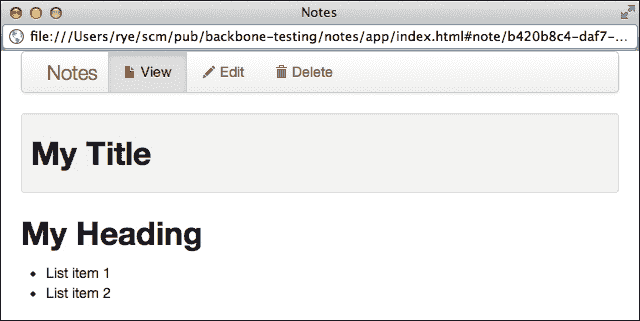
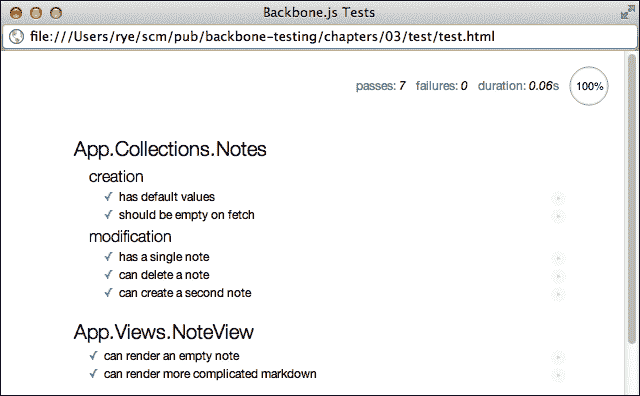

# 第三章。测试断言、规范和套件

在将 Backbone.js 应用程序集成到我们正在发展的测试基础设施中，并且有一个粗略的测试计划进行中，我们现在将开始扩展我们应用程序的测试覆盖率。在本章中，我们将介绍一些基本的测试工具，并在以下主题中测试 Backbone.js 应用程序的更多部分：

+   概述 Mocha 和 Chai 测试库的接口和风格

+   介绍 Chai 断言库 API

+   配置 Mocha 运行器和 Backbone.js 应用程序以进行测试

+   将 Mocha 规范聚合到测试套件中并准备测试状态

+   从 Backbone.js 集合规范开始编写 Mocha 测试规范

+   测试异步应用程序代码

+   为 Backbone.js 视图编写规范和 HTML 测试固定装置

+   应对软件/测试开发中的陷阱，并学习如何编写可测试的代码

# 选择适合的测试风格

Mocha 和 Chai 都为编写测试提供了不同的库接口。这方便开发者为不同的项目选择合适的测试范式或风格，同时仍然利用相同的底层功能。

## Mocha 测试接口

Mocha 目前为测试套件和规范提供四个接口：

+   **行为驱动开发**（**BDD**）接口：此接口使用与 Ruby RSpec 框架推广的类似测试构造（[`rspec.info/`](http://rspec.info/))。

+   **测试驱动开发**（**TDD**）接口：此接口使用更传统的单元测试关键字，如 `suite` 和 `test`。

+   **exports** 接口：此接口利用 Node.js/CommonJS 开发者熟悉的模块格式，将测试功能实现为 `module.exports` 对象的属性。

+   **QUnit** 风格的接口：此接口使用来自流行的 QUnit 测试框架的平面声明范式（[`qunitjs.com/`](http://qunitjs.com/))。在此风格中，套件是在测试之前和与测试相同的级别上声明的，而不是像其他接口那样包含测试。

## Chai 断言风格

Chai 提供两种断言风格：

+   **BDD** 风格：此风格允许使用 `expect` 函数或 `should` 对象原型扩展启用断言的点符号链，例如 `expect("foo").to.be.a("string").and.equal("foo")`。

+   **assert** 风格：此风格使用附加到 `assert` 对象的单个函数断言，例如：

    ```js
    assert.isString("foo");
    assert.strictEqual("foo", "foo");
    ```

虽然 `expect` 和 `assert` 在功能上等效，但 BDD 构造 `expect` 和 `should` 之间有一些重要的区别。本质上，因为 `should` 会修补对象原型，所以它不适用于某些类型的实际值（例如 `null` 和 `undefined`），并且与 Internet Explorer 9 不兼容。因此，我们的 Chai BDD 示例将使用 `expect` 而不是 `should`。

# 尝试一些不同的风格

让我们看看 Mocha 和 Chai 两个最常见接口的示例——BDD 和 TDD。

## Mocha 和 Chai BDD 接口

Mocha BDD 接口提供了四个主要功能单元：

+   `before()`: 这是一个在套件中的所有测试运行之前只发生一次的设置。Mocha 还提供了一个`beforeEach()`函数，它在套件中的每个测试之前运行。

+   `after()`: 这是一个在套件中所有测试运行后只发生一次的设置，与在每次测试之前运行的`afterEach()`替代方案。

+   `describe()`: 这指定了一个测试套件，可以嵌套在其他`describe()`函数中。

+   `it()`: 这定义了一个包含一个或多个断言的单个测试函数。

Chai 的 BDD 风格使用`expect`或`should`来创建点符号断言链。

我们可以创建一个基本的测试文件`chapters/03/test/js/spec/bdd.spec.js`，它使用所有这些组件。我们使用`describe()`命名套件，使用`before()`/`after()`添加/删除函数，并通过`it()`规范声明进行测试。我们使用`and`辅助函数将两个 Chai 断言链式连接起来，产生一个复合断言，其读起来自然为“期望`hello()`的结果是一个字符串，并且等于文本'hello world'”：

```js
describe("BDD example", function () {
  // Runs once before all tests start.
  before(function () {
    this.hello = function () {
      return "Hello world!";
    };
  });

  // Runs once when all tests finish.
  after(function () {
    this.hello = null;
  });

  it("should return expected string result", function () {
    expect(this.hello()).to
      .be.a("string").and
      .equal("Hello world!");
  });
});
```

我们的测试驱动网页（示例中的`chapters/03/test/test-bdd.html`）将 Chai 的`expect`函数添加到全局命名空间中以便使用，并配置 Mocha 使用 BDD 风格。相关的配置片段是：

```js
<script>
  var expect = chai.expect;
  mocha.setup("bdd");

  window.onload = function () {
    mocha.run();
  };
</script>

<script src="img/bdd.spec.js"></script>
```

## Mocha TDD 和 Chai 断言风格

Mocha TDD 接口对相同的基本单元使用不同的名称：

+   `suiteSetup()`和`setup()`: 这些是`before()`和`beforeEach()`的别名

+   `suiteTeardown()`和`teardown()`: 这些是`after()`和`afterEach()`的别名

+   `suite()`: 这指定了一个测试套件（在 BDD 中为`describe()`）

+   `test()`: 这定义了一个单个测试函数（在 BDD 中为`test()`）

Chai 断言风格通常与 TDD 风格的测试相关联，并提供了一个具有单个函数断言的断言对象。

我们的 TDD 测试文件`chapters/03/test/js/test/tdd.js`提供了与 BDD 版本相同的测试设置和断言系列：

```js
suite("TDD example", function () {
  // Runs once before all tests start.
  suiteSetup(function () {
    this.hello = function () {
      return "Hello world!";
    };
  });

  // Runs once when all tests finish.
  suiteTeardown(function () {
    this.hello = null;
  });

  test("expected string result", function () {
    assert.isString(this.hello());
    assert.strictEqual(this.hello(), "Hello world!");
  });
});
```

驱动网页只在两行配置上有所不同：

```js
<script>
  var assert = chai.assert;
  mocha.setup("tdd");

  window.onload = function () {
    mocha.run();
  };
</script>

<script src="img/tdd.js"></script>
```

在浏览器中打开`chapters/03/test/test-tdd.html`应显示与上一个 BDD 示例完全相同的测试结果。

## 决定项目风格

Mocha 和 Chai 中的风格选项为开发者提供了在利用相同底层测试基础设施的同时选择测试范例的很大灵活性。在这本书中，我们出于几个原因更喜欢 Mocha 和 Chai 的 BDD 风格：

+   Chai `expect`断言链以自然语言格式读取，通常可以免除单独的测试注释的需要。

+   Mocha BDD 接口组件简化了诸如“这是一个数字计算器”和“它应该求和两个数字”等行为的叙述性描述。

+   BDD 接口在现代 JavaScript 测试生态系统中非常流行，并鼓励开发者描述被测试代码的*行为*，而不仅仅是识别内部细节。

尽管如此，如果你更喜欢其他风格，请使用最自然的感觉。本书中的所有测试代码示例都可以在 Mocha 和 Chai 接口之间进行翻译。

# Chai 断言库之旅

Chai 测试库提供了一套强大的断言和辅助工具，以帮助测试的可读性和组织。

Chai 对 `expect` 的自身单元测试（在 [`github.com/chaijs/chai/blob/master/test/expect.js`](https://github.com/chaijs/chai/blob/master/test/expect.js)）提供了一个很好的起点，从该起点可以探索 API。Chai 方便地使用 Mocha 作为其测试框架（配置了 TDD 接口）。因此，整个测试套件应该非常熟悉。

在本节中，我们将使用一系列断言来介绍 Chai BDD API 的大部分内容。断言示例被累积到本章的单个驱动文件中——`chapters/03/test/test-chai.html`。

### 注意

Chai 为本节中将要讨论的许多断言提供了别名。例如，深度相等断言 `eql` 也可用作 `eqls` 和 `deep.equal`。有关别名完整列表，请参阅 Chai API 文档。

## 链接对象和断言

Chai 的 BDD 接口公开了可以链式组合以使测试断言更易于理解的对象。我们将通过文件 `chapters/03/test/js/spec/chai-chains.spec.js` 中的基本示例进行说明。

作为入门示例，断言 `expect("foo").to.be.a("string")` 使用了链式对象 `to` 和 `be`，它们简单地代理到最后一个断言。通过这种方式，Chai 允许我们添加任何链式对象 `to`、`be`、`been`、`is`、`that`、`and`、`have`、`with`、`at` 和 `of`，以形成更易于阅读的断言语句。`a` 和 `an` 既可以作为断言链，也可以作为比较函数。

我们可以使用这些语句创建语言链断言，例如：

```js
expect("foo").a("string");
expect("foo").to.be.a("string");
expect("foo").to.have.been.a("string");
expect("foo").that.is.a("string");

// Chains can be repeated (or be nonsensical).
expect("foo").to.to.to.to.a("string");
expect("foo").and.with.at.of.a("string");
```

由于所有语句都是等效的，前一个代码中突出显示的语言链展示了表达相同断言的许多不同方式。

Chai 还提供了修改最终断言的语言链对象：

+   `not`：这否定任何后续的断言。例如：

    ```js
    expect("foo").to.not.equal("bar");

    // Let's get literary.
    expect("Hamlet").to.be.not.to.be.an("object");
    ```

+   `deep`：这设置了深度检查的深度标志。原始的相等检查执行一个身份测试，它断言两个变量在进程内存中是相同的对象。使用深度标志，Chai 相反地断言两个变量具有相同的属性值，即使它们是不同的底层对象。例如，`expect({foo: "bar"}).to.equal({foo: "bar"})` 在对象身份测试中失败，而 `expect({foo: "bar"}).to.deep.equal({foo: "bar"})` 则成功。

最后，大多数其他 Chai BDD 断言语句都是可链式的。以下示例使用 `and` 辅助函数将几个断言链组合在一起：

```js
expect("foo")
  .to.be.a("string").and
  .to.equal("foo").and
  .to.have.length(3).and
  .to.match(/f[o]{2}/);
```

使用这些基本语言链和辅助工具，我们为编写可读的断言语句打下了基础。

### 小贴士

当为了开发者的理解以及编写简洁的测试代码时，将断言链在一起是一种良好的实践。同时，单独的 `expect()` 语句通常更为合适。

## 基本值断言

Chai 提供了各种断言属性来检查输入值（请参阅 `chapters/03/test/js/spec/chai-values.spec.js`）:

+   `ok`: 值是真值（有关 JavaScript 的条件真值和相等性的宽容概念快速介绍，请参阅 [`www.sitepoint.com/javascript-truthy-falsy/`](http://www.sitepoint.com/javascript-truthy-falsy/)）

    ```js
    expect("foo").to.be.ok;
    expect(true).to.be.ok;
    expect(false).to.not.be.ok;
    ```

+   `exist`: 值既不是 `null` 也不是 `undefined`

    ```js
    expect(false).to.exist;
    expect(null).to.not.exist;
    expect(undefined).to.not.exist;
    ```

+   `true`: 值正好是 `true`

    ```js
    expect("foo").to.not.be.true;
    expect(true).to.be.true;
    ```

+   `false`: 值正好是 `false`

    ```js
    expect("").to.not.be.false;
    expect(false).to.be.false;
    ```

+   `null`: 值正好是 `null`。

    ```js
    expect(null).to.be.null;
    ```

+   `undefined`: 值正好是 `undefined`

    ```js
    expect(undefined).to.be.undefined;
    expect(null).to.not.be.undefined;
    ```

+   `arguments`: 值是特殊的 JavaScript `arguments` 对象，它包含当前函数的参数列表

    ```js
    expect(arguments).to.be.arguments;
    expect([]).to.not.be.arguments;
    ```

## 比较值

Chai 提供了各种比较函数来评估输入值（请参阅 `chapters/03/test/js/spec/chai-comparisons.spec.js`）:

+   `equal`: 严格（`===`）相等

    ```js
    expect("foo").to.equal("foo");
    expect({foo: "bar"}).to.not.equal({foo: "bar"});
    ```

+   `eql`: 深度相等——等同于 `deep.equal`

    ```js
    expect("foo").to.eql("foo");
    expect({foo: "bar"}).to.eql({foo: "bar"});
    ```

+   `above`: 实际值大于预期值

    ```js
    expect(1).to.not.be.above(1);
    expect(5).to.be.above(2);
    ```

+   `least`: 实际值大于或等于预期值

    ```js
    expect(1).to.be.at.least(1);
    expect(5).to.be.at.least(2);
    ```

+   `below`: 实际值小于预期值

    ```js
    expect(1).to.not.be.below(1);
    expect(1).to.be.below(2);
    ```

+   `most`: 实际值小于或等于预期值

    ```js
    expect(1).to.be.at.most(1);
    expect(1).to.be.at.most(2);
    ```

+   `within`: 实际值在预期值的范围内

    ```js
    expect(1).to.be.within(0, 2);
    ```

+   `closeTo`: 实际值在预期值的范围内

    ```js
    expect(1.2).to.be.closeTo(1, 0.2);
    expect(1.2).to.not.be.closeTo(1, 0.0);
    ```

+   `match`: 实际字符串值与预期正则表达式匹配

    ```js
    expect("foo").to.match(/^f[o]+/);
    ```

+   `string`: 实际字符串值包含预期的子字符串

    ```js
    expect("foo bar").to.have.string("foo");
    ```

+   `satisfy`: 评估函数将实际值作为参数，如果断言应该通过则返回 `true`

    ```js
    expect(42).to.satisfy(function (value) {
      return value === 6 * 7;
    });
    ```

## 对象和数组验证

Chai 提供了一些针对对象和数组的定制化断言（请参阅 `chapters/03/test/js/spec/chai-objects.spec.js`）:

+   `a`: 当作为函数调用时，这会基于 JavaScript 的原生 `typeof` 测试检查对象类型，并额外支持正确推断对象和数组。注意，当 `a`（或 `an`）用作对象属性时，它作为语言链起作用。

    ```js
    expect("foo").is.a("string");
    expect("foo").is.not.a("number");
    expect({foo: "bar"}).is.an("object");
    ```

+   `instanceof`: 检查对象是否是预期构造函数的实例。

    ```js
    var Foo = function () {},
      Bar = function () {};

    expect(new Foo()).is.an.instanceof(Foo);
    expect(new Bar()).is.not.an.instanceof(Foo);
    ```

+   `property`: 检查对象中是否存在预期属性，以及可选地，该属性值是否与预期值匹配。当与 `deep` 语言链一起使用时，可以通过点或数组符号导航对象结构。

    ```js
    expect({foo: "bar"}).to.have.property("foo", "bar");

    // Deep checking - object, and array.
    expect({foo: {bar: "baz"}})
      .to.have.deep.property("foo.bar", "baz");
    expect({foo: ["bar", "baz"]})
      .to.have.deep.property("foo[1]", "baz");
    ```

+   `ownProperty`: 使用 JavaScript 的 `hasOwnProperty` 测试检查对象上是否存在直接属性，而无需在对象的原型链上查找继承属性。

    ```js
    expect({foo: "bar"}).to.have.ownProperty("foo");
    ```

+   `length`: 检查数组或对象的 `length` 属性（例如字符串）。

    ```js
    expect(["bar", "baz"]).to.have.length(2);
    expect("foo").to.have.length(3);
    ```

+   `contain`：检查对象是否在数组中或字符串中的子串。请注意，`contain`（和`include`）可以作为带有`keys`的语言链的替代使用。

    ```js
    expect(["bar", "baz"]).to.contain("bar");
    expect("foo").to.contain("f");
    ```

+   `keys`：检查对象是否包含所有预期的属性名称。当与`include`或`contain`语言链结合使用时，断言仅验证预期属性名称的子集。

    ```js
    // Exact matching of all keys.
    expect({foo: 1, bar: 2}).to.have.keys(["foo", "bar"]);

    // Exclusion of any keys.
    expect({foo: 1, bar: 2}).to.not.have.keys(["baz"]);

    // Inclusion of some keys.
    expect({foo: 1, bar: 2}).to.include.keys(["foo"]);
    expect({foo: 1, bar: 2}).to.contain.keys(["bar"]);
    ```

## 错误

Chai 还可以检查异常代码的功能，特别是捕获和验证程序异常。

`throw` 断言接受一个函数作为输入，该函数在调用时预期会抛出异常。然后，结果错误与构造函数类（例如，`Error`）或消息字符串/正则表达式（例如，`/message/`）进行匹配。请注意，传递给断言的是函数引用（例如，`bad`），而不是被调用的函数（例如，`bad()`）。这使 Chai 能够在内部调用函数，捕获任何异常，并验证结果：

```js
var bad = function () {
  throw new Error("My error message");
};

expect(bad)
  .to.throw(Error).and
  .to.throw(/message/).and
  .not.to.throw("no message match");
```

# 准备应用程序和测试以运行

现在我们已经掌握了 Chai 断言库 API，是时候编写和组织测试了。虽然我们意外地覆盖了大部分材料，但 Mocha 测试基础设施的简洁核心包括：

+   **测试运行器**：配置总体测试运行和报告

+   **测试套件**: 一个或多个组织单元，将许多规格/测试分组在一起

+   **设置**/**清理**: 为每个测试或套件运行设置状态

+   **规格说明**: 编写测试函数

从最高级别开始，我们查看我们的测试驱动网页。如前所述，这是我们的核心应用程序库、测试库和测试规格设置和包含的地方。本章其余部分的所有 Backbone.js 应用程序测试都包含在 `chapters/03/test/test.html` 驱动网页中。

## Mocha 测试运行器

Mocha 的 `setup()` 函数控制所有测试套件和规格执行的总体参数和环境。该函数应在测试驱动网页中执行开始之前（例如，`mocha.run()`）调用一次：

```js
mocha.setup("bdd");

window.onload = function () {
  mocha.run();
};
```

默认设置对于 Backbone.js 测试来说相当可用，我们在这本书的几乎所有测试中都使用了之前的代码。然而，还有许多其他选项可用，这些选项在 [`visionmedia.github.io/mocha/`](http://visionmedia.github.io/mocha/) 中进行了描述。以下是一个任意的样本：

```js
mocha.setup({
  ui: "bdd",          // BDD UI.
  reporter: "html",   // HTML reporter.
  timeout: 4000,      // 4s test timeout.
  slow: 1000          // A "slow" test is > 1s
});
```

## 重新配置应用程序以进行测试

Backbone.js 应用程序通常需要特定的测试友好配置，以便使测试环境可预测并避免覆盖真实数据。后端信息（例如，主机地址和端口）在开发和测试阶段通常不同。因此，将所有这些信息抽象到一个公共文件中是一个好的做法，这样我们就可以轻松地在中央位置切换值：

### 小贴士

创建可工作的测试环境的一种替代和补充方法是使用 Sinon.JS 等库来伪造配置细节和依赖项。这里可以帮助我们的 Sinon.JS 抽象是存根和模拟，两者都可以在测试期间替换对象方法的行为。（我们将在第五章“第五章。测试存根和模拟”中详细介绍和讨论这些概念。）

在以下数据存储配置示例中，我们可以使用 Sinon.JS 存根用测试特定的模拟代码替换整个数据存储。存根将允许我们使用正常的应用程序配置，同时确保我们不会修改真实的数据存储。作为这种方法的一个额外好处，存根和模拟外部依赖项通常可以使测试运行得更快，尤其是如果伪造替换了一个相对较慢的应用程序行为（例如，网络通信）。

在笔记应用中，我们要求集合有一个唯一的 `localStorage` 名称，我们在配置文件 `notes/app/js/app/config.js` 中指定它：

```js
App.Config = _.extend(App.Config, {
  // Local Storage Name
  storeName: "notes"
});
```

此代码将 `App.Config` 命名空间填充为 `App.Config.storeName`，然后我们将其用于 `notes/app/js/app/collections/notes.js` 中的 `App.Collections.Notes` 集合：

```js
App.Collections.Notes = Backbone.Collection.extend({
  model: App.Models.Note,

  // Sets the localStorage key for data storage.
  localStorage: new Backbone.LocalStorage(App.Config.storeName)
});
```

使用这种设置，实时应用将数据保存到 `localStorage` 中的 `notes` 存储。然而，在我们的测试中，我们希望添加、删除和修改笔记数据，而不覆盖我们开发友好的数据存储。因此，通过在我们的应用程序测试驱动程序页面中添加额外的配置指令，我们可以使用 Underscore.js 的 `extend()` 函数将测试专用存储名称设置为 `notes-test`：

```js
<script src="img/namespace.js"></script>
<script src="img/config.js"></script>
<script>
  // Test overrides (before any app components).
  App.Config = _.extend(App.Config, {
    storeName: "notes-test" // localStorage for tests.
  });
</script>
<script src="img/note.js"></script>
<script src="img/notes.js"></script>
```

通过首先包含 `config.js` 然后覆盖特定值，我们使测试期间可用的其他未修改的配置值。使用这种方案，我们现在有一个完全独立的 Backbone.js 测试数据存储，我们可以更改它而不会影响我们的开发环境。

## 将主题和规范组织到测试套件中

将测试代码组织到主题和应用程序组件中是开发整体测试架构的重要步骤。为此，Mocha 提供了 `describe()` 测试套件函数来分组逻辑集合的测试规范。

例如，在 `App.Collections.Notes` 中，我们可能从两个测试子组开始：

+   创建空集合并验证初始默认状态的测试

+   使用新的 `App.Models.Note` 对象修改集合的测试

将此列表转换为一系列嵌套的 Mocha 测试套件将给我们：

```js
describe("App.Collections.Notes", function () {

  describe("creation", function () {
    // Tests.
  });

  describe("modification", function () {
    // Tests.
  });
});
```

这里我们有两种级别的 `describe()` 语句，尽管 Mocha 允许更深的套件嵌套。

## 启动和关闭测试

尽管我们试图将测试规范的行为隔离作为一般做法，但测试通常有共同的设置和拆解需求。例如，如果一组规范都测试同一个对象，那么最合理的方法可能是创建该对象一次，并与所有规范共享。

### 提示

**Mocha 中的上下文/成员变量**

Mocha 允许测试代码将值附加到 `this` 上下文对象，以便在测试运行的其它部分使用。这允许我们在不需要声明和管理全局或更高作用域变量的情况下，在测试之间共享变量。此功能的常见用途是在一组测试的 `before()` 设置语句中添加一个变量，例如 `this.myCollection`，然后在组的 `after()` 语句中移除它。

Mocha 提供了 `before()`, `beforeEach()`, `after()`, 和 `afterEach()` 函数来帮助我们管理测试状态。如前所述，`before()`/`after()` 函数在每个套件中的所有测试之前和之后各运行一次。`beforeEach()`/`afterEach()` 函数在每个套件中的每个测试之前和之后运行。

通过这四个构造，我们可以为我们的 Mocha 测试创建细微的状态管理。设置/拆解函数在测试套件的级别上操作。这意味着嵌套的测试套件可以提供它们自己的附加设置/拆解函数。例如，Mocha 将忠实地运行每个 `before()` 语句，在执行第一个测试之前，它将深入到 `describe()` 语句中。

### 注意

使用设置/拆解函数的另一个好理由是它们**总是**运行——即使测试规范失败或抛出异常也是如此。这防止单个测试失败影响运行中其他测试的数据状态，并导致虚假的测试失败。

Backbone.js 集合测试通常受益于使用设置和拆解辅助函数来创建初始数据状态。通常，这意味着添加一些起始记录（当从单独的数据文件加载时称为数据固定），并在测试修改集合后，将数据存储恢复到原始状态。

在测试驱动页面上，我们已配置 `App.Collections.Notes` 类使用仅测试的数据存储。`Backbone.localStorage` 适配器有一个内部方法 `_clear()`，它清除与集合关联的底层浏览器存储，我们将使用它来在测试中重置我们的数据状态。结果的数据沙盒已准备好以下测试场景：

+   在套件设置中清除任何现有的集合数据，为单个集合添加一个上下文变量，并在拆解时移除该集合

+   在 `modification` 套件中，向集合添加一个初始的 `App.Models.Note` 对象，并在每个测试后清除集合

测试套件的设置和拆解函数的实现如下：

```js
describe("App.Collections.Notes", function () {

  before(function () {
    // Create a reference for all internal suites/specs.
    this.notes = new App.Collections.Notes();

    // Use internal method to clear out existing data.
    this.notes.localStorage._clear();
  });

  after(function () {
    // Remove the reference.
    this.notes = null;
  });

  describe("creation", function () {
    // Tests.
  });

  describe("modification", function () {

    beforeEach(function () {
      // Load a pre-existing note.
      this.notes.create({
        title: "Test note #1",
        text: "A pre-existing note from beforeEach."
      });
    });

    afterEach(function () {
      // Wipe internal data and reset collection.
      this.notes.localStorage._clear();
      this.notes.reset();
    });

    // Tests.

  });
});
```

之前代码片段中突出显示的行说明了整体测试套件中所有测试的 `before()`/`after()` 调用以及子套件 `modification` 的 `beforeEach()`/`afterEach()` 调用。

# 编写 Mocha 测试规范

在其他所有内容都就绪的情况下，我们最终转向编写测试规范。Mocha BDD 规范使用 `it()` 函数声明，该函数具有以下函数签名：

```js
it(description, callback);
```

按照惯例，描述字符串是对测试中预期行为的陈述，回调函数执行测试。例如，假设我们有一个空的 `this.notes` 集合变量，对 `App.Collections.Notes` 中的默认值进行测试可以像以下这样简单：

```js
it("has default values", function () {
  expect(this.notes).to.be.ok;
  expect(this.notes).to.have.length(0);
});
```

## 测试中的异步行为

尽管基本的测试规范相当简单，但在测试异步应用程序代码时会出现流程控制复杂性。鉴于 Backbone.js 应用程序的行为通常是异步/事件驱动的，我们需要有一个坚实且直接的测试方法。

幸运的是，Mocha 提供了一个异步测试函数参数，用于表示测试是异步的。如果在测试回调中提供了一个参数（按照惯例命名为 `done`），Mocha 将延迟测试完成，直到 `done` 被调用或测试超时。

我们可以在 Backbone.js 集合中测试的一种异步行为是，在集合上调用 `fetch()` 方法后，会触发 `reset` 事件。在这里，我们创建一个空的 `App.Collections.Notes` 对象，获取其后端数据，并确认事件已触发。在所有这些都被验证后，我们添加一个调用 `done()` 的操作来表示测试成功完成。如果 `reset` 事件从未触发，则不会调用 `done()`，测试将超时：

```js
it("should be empty on fetch", function (done) {
  var notes = new App.Collections.Notes();

  // "reset" event fires on successful fetch().
  notes.once("reset", function () {
    expect(notes).to.have.length(0);

    // Async code has completed. Signal test is done.
    done();
  });

  notes.fetch({ reset: true });
});
```

使用额外的 `done` 参数，我们现在可以在测试完成之前在单个规范中运行一系列异步断言。

## 一些 Backbone.js 集合测试

既然我们可以编写异步规范，我们将完成 Notes 集合的测试套件。考虑到 第二章 中 Backbone.js 集合的测试目标，即 *创建 Backbone.js 应用程序测试计划*（即修改模型、触发事件和同步数据），我们将为 `App.Collections.Notes` 创建以下规范（此处以概要形式展示）：

```js
describe("App.Collections.Notes", function () {

  describe("creation", function () {
    it("has default values");
    it("should be empty on fetch");
  });

  describe("modification", function () {
    it("has a single note");
    it("can delete a note");
    it("can create a second note");
  });
});
```

在应用程序开发期间创建一个空白的测试概要是一个很好的练习和实践。例如，作为测试驱动开发过程的一部分，我们可以首先编写 `describe` 和 `it` 声明而不使用回调，以指定相关应用程序组件的程序行为世界。一旦我们满意地认为概要近似于组件的预期用例，我们就可以继续填写测试和编写应用程序代码。

有助于，Mocha 将没有函数的 spec 声明（如前一个代码片段所示）视为挂起的测试。挂起的 spec 与普通测试在 Mocha HTML 测试报告中以不同的颜色区分。有了挂起的测试，开发者可以更容易地扫描测试报告以查找未完成的 spec，然后实现必要的测试和应用程序代码。

考虑到这一点，让我们实现规范以完成测试文件 `chapters/03/test/js/spec/collections/notes.spec.js`：

### 注意

为了简洁和可读性，我们从以下代码（以及本书的其他地方）中省略了一些 spec 函数。`App.Collections.Notes` 和其他笔记测试套件的完整 spec 实现可在本书的配套代码示例中找到。

```js
describe("App.Collections.Notes", function () {

  before(function () {
    // Create a reference for all internal suites/specs.
    this.notes = new App.Collections.Notes();

    // Use internal method to clear out existing data.
    this.notes.localStorage._clear();
  });

  after(function () {
    // Remove the reference.
    this.notes = null;
  });

  describe("creation", function () {

    it("has default values", function () {
      expect(this.notes).to.be.ok;
      expect(this.notes).to.have.length(0);
    });

    it("should be empty on fetch", function (done) {
      // ... implemented in previous example ...
    });

  });

  describe("modification", function () {

    beforeEach(function () {
      // Load a pre-existing note.
      this.notes.create({
        title: "Test note #1",
        text: "A pre-existing note from beforeEach."
      });
    });

    afterEach(function () {
      // Wipe internal data and reset collection.
      this.notes.localStorage._clear();
      this.notes.reset();
    });

    it("has a single note", function (done) {
      var notes = this.notes, note;

      // After fetch.
      notes.once("reset", function () {
        expect(notes).to.have.length(1);

        // Check model attributes.
        note = notes.at(0);
        expect(note).to.be.ok;
        expect(note.get("title")).to.contain("#1");
        expect(note.get("text")).to.contain("pre-existing");

        done();
      });

      notes.fetch({ reset: true });
    });

    it("can delete a note", function (done) {
      var notes = this.notes, note;

      // After shift.
      notes.once("remove", function () {
        expect(notes).to.have.length(0);
        done();
      });

      // Remove and return first model.
      note = notes.shift();
      expect(note).to.be.ok;
    });

    it("can create a second note", function (done) {
      // ... omitted ...
    });

  });
});
```

这个最后的测试文件使用本章中讨论的所有不同的 Mocha 和 Chai 部分，提供了一个合理的框架。我们可以通过打开浏览器到驱动页面 `chapters/03/test/test.html` 来看到我们的测试在行动。

# 测试和支持 Backbone.js 视图

现在我们已经为 Backbone.js 模型和集合创建了测试套件，我们将转向扩展我们的测试覆盖率到 Backbone.js 视图。

## 笔记应用单条笔记视图

我们将要检查的第一个 Backbone.js 视图是 `App.Views.NoteView`。这个视图负责将 `App.Models.Note` 的 Markdown 数据渲染成完整的 HTML，如下面的截图所示：



视图渲染的 Markdown

图像的底层模型数据包括以下属性：

+   `标题`:

    ```js
    My Title
    ```

+   `text`：

    ```js
    ## My Heading
    * List item 1
    * List item 2
    ```

`text` 属性数据转换为 HTML 的方式如下：

```js
<h2 id="myheading">My Heading</h2>
<ul>
  <li>List item 1</li>
  <li>List item 2</li>
</ul>
```

`App.Views.NoteView` 负责执行这个转换。`notes/app/js/app/views/note-view.js` 文件首先提供了一个 `initialize` 函数，该函数设置模型监听器以重新渲染或清理视图，然后启动 `render()`。`render` 函数使用 Showdown 库将模型的 `text` Markdown 数据转换为 HTML，然后将完成的数据传递给视图模板：

```js
App.Views.NoteView = Backbone.View.extend({

  template: _.template(App.Templates["template-note-view"]),

  converter: new Showdown.converter(),

  initialize: function () {
    this.listenTo(this.model, "change", this.render);
    this.listenTo(this.model, "destroy", this.remove);
    this.render();
  },

  // Convert note data into Markdown.
  render: function () {
    this.$el.html(this.template({
      title: this.model.get("title"),
      text: this.converter.makeHtml(this.model.get("text"))
    }));
    return this;
  }
});
```

这个视图包括一个 Underscore.js 模板（`notes/app/js/app/templates/templates.js` 中的 `App.Templates["template-note-view"]`），它将 `title` 和 `text` 数据插入到 HTML 中：

```js
App.Templates["template-note-view"] =
  "<div class=\"well well-small\">" +
  "  <h2 id=\"pane-title\"><%= title %></h2>" +
  "</div>" +
  "<div id=\"pane-text\"><%= text %></div>";
```

使用 `App.Views.NoteView.render()` 将模型数据渲染成 HTML 表单，我们得到以下结果 HTML：

```js
<div class="well well-small">
  <h2 id="pane-title">My Title</h2>
</div>
<div id="pane-text">
  <h2 id="myheading">My Heading</h2>
  <ul>
    <li>List item 1</li>
    <li>List item 2</li>
  </ul>
</div>
```

现在我们已经介绍了一个简单的视图来工作，我们将检查如何测试其行为。

## 为视图测试创建 HTML 固定数据

到目前为止，我们编写的 Backbone.js 应用程序测试并不与网页的 DOM 或 HTML 接口。这简化了我们的测试环境，因为应用程序的网页（例如，`index.html`）与我们测试驱动页面（例如，`test.html`）非常不同。然而，Backbone.js 视图几乎总是涉及大量的 DOM 交互。

为了达到这个目的，我们需要一个 HTML 测试固定元素——在测试驱动页面中的一个或多个 DOM 元素，我们可以在测试期间与之交互和修改。同时，我们不想让固定 HTML 在驱动页面的测试代码中造成混乱。因此，我们在`chapters/03/test/test.html`驱动页面中为我们的应用程序视图测试创建了一个单独的、隐藏的`div`元素：

```js
<body>
  <div id="mocha"></div>

  <!-- Test Fixtures. -->
  <div id="fixtures"style="display: none; visibility: hidden;"></div>

```

现在，我们的测试可以在 jQuery 中引用`$("#fixtures")`并获取对固定容器的访问权限。然后，测试可以添加所需元素以练习任何期望的视图/DOM 交互。

### 小贴士

**高级 HTML 固定元素**

在本章中，我们只是触及了 HTML 固定元素的表面。存在更复杂的固定方案和库，例如在 iframe 中沙盒化应用 HTML 代码以避免测试代码交叉污染，以及从外部应用程序文件中加载 HTML 固定元素代码。两个与 Mocha 兼容的、有潜力的管理库是 jsFixtures ([`github.com/kevindente/jsFixtures`](https://github.com/kevindente/jsFixtures)) 和 js-fixtures ([`github.com/badunk/js-fixtures`](https://github.com/badunk/js-fixtures))。

## 遍历视图测试套件

让我们逐步查看`chapters/03/test/js/spec/views/note-view.spec.js`中的代码，这是`App.Views.NoteView`的测试套件。回忆一下第二章中 Backbone.js 视图测试的目标，即*创建 Backbone.js 应用程序测试计划*，我们将检查视图是否使用模型和模板渲染适当的 HTML，将 HTML 结果绑定到预期的 DOM 位置，并且与应用程序事件正确交互。

### 小贴士

**为示例编写自己的测试**

为了使本书的叙述更加流畅，我们将遵循一个一般方案：首先展示一个 Backbone.js 应用程序组件，然后通过测试来阐述特定的课程、技巧或工具。不幸的是，这与推荐的测试驱动开发过程相反，后者首先编写描述应用程序行为的测试，然后编写实现代码，并迭代直到整体行为正确。

对于您与本书的工作，我们强烈建议您在本书展示测试示例之前，设计和实现您自己的测试来测试示例应用程序组件。在编写自己的测试后，您可以继续阅读本书的示例，以检查您的作品并识别额外的测试想法和技术。

测试套件以一个`describe`声明和设置/清理代码开始。在套件执行开始时，创建一个视图测试用例（`$("<div id='note-view-fixture'></div>")`）并存储在`this.$fixture`中。每个测试的设置（`beforeEach()`/`afterEach()`）将新的`this.$fixture`测试用例绑定到 HTML 测试用例持有者`$("#fixtures")`，并创建一个带有`App.Models.Note`模型的`App.Views.NoteView`对象。在套件中的所有测试完成后，测试用例持有者`$("#fixtures")`将被清空：

```js
describe("App.Views.NoteView", function () {

  before(function () {
    // Create test fixture.
    this.$fixture = $("<div id='note-view-fixture'></div>");
  });

  beforeEach(function () {
    // Empty out and rebind the fixture for each run.
    this.$fixture.empty().appendTo($("#fixtures"));

    // New default model and view for each test.
    //
    // Creation calls `render()`, so in tests we have an
    // *already rendered* view.
    this.view = new App.Views.NoteView({
      el: this.$fixture,
      model: new App.Models.Note()
    });
  });

  afterEach(function () {
    // Destroying the model also destroys the view.
    this.view.model.destroy();
  });

  after(function () {
    // Remove all subfixtures after test suite finishes.
    $("#fixtures").empty();
  });
```

在这些变量和 DOM 元素可用的情况下，我们可以使用 jQuery 测试默认模型是否渲染了预期的 HTML。请注意，因为其`initialize`函数调用了`render`，实例化一个`App.Views.NoteView`对象会将渲染后的 HTML 添加到我们的 DOM 测试用例中：

```js
  it("can render an empty note", function () {
    var $title = $("#pane-title"),
      $text = $("#pane-text");

    // Default to empty title in `h2` tag.
    expect($title.text()).to.equal("");
    expect($title.prop("tagName").toLowerCase()).to.equal("h2");

    // Have simple default message.
    expect($text.text()).to.equal("Edit your note!");
    expect($text.html()).to.contain("<p><em>Edit your note!</em></p>");
  });
```

第二个规范更改了模型的属性`title`和`text`以渲染更复杂的 HTML。

困难的部分是在模型监听器调用`render()`并更新 DOM 之后等待，以检查新的 HTML 值。我们在这里的技术是观察`render()`已经监听模型事件`change`，并在此事件上添加一个额外的单次`once()`监听器来检查 HTML。

然而，请注意，这是一种处理测试行为异步性质脆弱的方法。渲染代码可能需要更多的时间来完成，从而破坏测试。更好的解决方案是在`render()`函数调用完成后等待，然后再运行测试代码——这是一种我们可以更方便地使用 Sinon.JS 间谍、存根和模拟来执行的技术，这些将在后续章节中详细讨论：

```js
  it("can render more complicated markdown", function (done) {
    this.view.model.once("change", function () {
      var $title = $("#pane-title"),
        $text = $("#pane-text");

      // Our new (changed) title.
      expect($title.text()).to.equal("My Title");

      // Rendered Markdown with headings, list.
      expect($text.html())
        .to.contain("My Heading</h2>").and
        .to.contain("<ul>").and
        .to.contain("<li>List item 2</li>");

      done();
    });

    // Make our note a little more complex.
    this.view.model.set({
      title: "My Title",
      text: "## My Heading\n" +
            "* List item 1\n" +
            "* List item 2"
    });
  });
});
```

# 聚合并运行应用程序测试

完成集合和视图测试的测试驱动页面，我们在`chapters/03/test/test.html`中集成必要的脚本包含和 HTML 测试用例（在以下代码片段的相关部分中显示）：

```js
<head>
  <!-- ... snipped ... -->

  <!-- Test libraries. -->
  <script src="img/mocha.js"></script>
  <script src="img/chai.js"></script>
  <script src="img/sinon.js"></script>

  <!-- JavaScript Core Libraries -->
  <script src="img/underscore.js"></script>
  <!-- ... snipped ... -->

  <!-- JavaScript Application Libraries -->
  <script src="img/namespace.js"></script>
  <script src="img/config.js"></script>
  <script>
    // Test overrides (before any app components).
    App.Config = _.extend(App.Config, {
      storeName: "notes-test" // localStorage for tests.
    });
  </script>
  <script src="img/note.js"></script>
  <script src="img/notes.js"></script>
  <script src="img/templates.js"></script>
  <script src="img/note-view.js"></script>

  <!-- Test Setup -->
  <script>
    var expect = chai.expect;
    mocha.setup("bdd");

    window.onload = function () {
      mocha.run();
    };
  </script>

  <!-- Tests. -->
  <script src="img/notes.spec.js"></script>
  <script src="img/note-view.spec.js"></script>
</head>
<body>
  <div id="mocha"></div>

  <!-- Test Fixtures. -->
  <div id="fixtures"
       style="display: none; visibility: hidden;"></div>
</body>
```

打开网络浏览器到`chapters/03/test/test.html`，我们可以看到集合和视图的完整测试报告：



测试报告

# 测试开发技巧、窍门和提示

当我们继续探索 Backbone.js 应用程序的理论和实践时，创建测试架构和编写良好的测试规范更多的是一种艺术，而不是精确的科学。许多经验教训只能通过经验来学习，尤其是在你的应用程序遇到错误和开发失误时。同时，我们可以从一些技术和建议开始：

## 隔离和排除测试

应用程序开发是一次保证会包括无法解释的错误、突然的应用程序崩溃和复杂的测试失败的旅程。当这些陷阱发生时，了解如何调试问题并继续前进的方向是很重要的。

在软件开发过程中，一个常见的场景是应用程序的更改破坏了一个或多个现有的单元测试。在这种情况下，一个良好的实践是逐个运行测试套件，修复测试，然后再继续进行其他测试。Mocha 提供了两个途径来帮助解决这个问题：

+   **Grep**：正如我们在 第一章 中讨论的，*设置测试基础设施*，你可以在测试报告 HTML 页面上点击单个测试，或者直接导航到一个带有 grep 查询参数的测试页面 URL，例如 `test.html?grep=PATTERN`。

+   **仅限使用**：另一个选择是临时修改你的 Mocha 测试规范，使用 `only` 辅助函数仅运行单个测试，跳过所有其他测试和套件。让我们看看一个例子：

    ```js
    it("doesn't run this test", function () {
      expect(true).to.be.true;
    });

    it.only("runs this test", function () {
      expect(false).to.be.false;
    });
    ```

在这种场景的另一面，有时我们希望在仍然使用其余的测试基础设施的同时忽略一些失败的测试。在这种情况下，我们会转向 `skip`。

+   **跳过**：`skip` 修饰符会从测试运行中省略单个规范，并且可以应用于多个规范。跳过的测试也被视为挂起的，可以在 Mocha HTML 测试报告中通过视觉区分：

    ```js
    it.skip("doesn't run this test", function () {
      expect(true).to.be.true;
    });

    it("runs this test", function () {
      expect(false).to.be.false;
    });
    ```

## 编写可测试的应用程序代码

除了编写测试的实际方面之外，开发测试基础设施同样重要的一个组成部分是编写可测试的应用程序代码。关于可测试 JavaScript 代码的主题相当广泛——我们在这里只介绍这个问题，并从开发与支持其测试协同工作的应用程序代码的一般目标开始。

在 *Mark Ethan Trostler* 的书籍 *Testable JavaScript* 中可以找到对这一主题的全面处理，该书涵盖了诸如应用程序代码复杂性、基于事件的架构和调试等主题。[`shop.oreilly.com/product/0636920024699.do`](http://shop.oreilly.com/product/0636920024699.do)。同时，还可以考虑一些通用的 JavaScript 应用程序指南，如 *Nicholas Zakas* 的 *Maintainable JavaScript* ([`shop.oreilly.com/product/0636920025245.do`](http://shop.oreilly.com/product/0636920025245.do)) 和 *Douglas Crockford* 的开创性作品 *JavaScript: The Good Parts* ([`shop.oreilly.com/product/9780596517748.do`](http://shop.oreilly.com/product/9780596517748.do))。

一些 Backbone.js 应用程序开发提示和可测试代码的良好实践包括：

+   **解耦组件并限制依赖**：许多 Backbone.js 组件对其他组件有可选的依赖。例如，一个 Backbone.js 视图可以可选地在视图类中声明一个模型（例如，`model: Foo`）或模型对象可以在实例化视图时传递给视图（例如，`new View({model: foo})`）。后一种技术通常为将模拟或测试友好的模型注入视图代码提供了更多机会。相同的逻辑也适用于 Backbone.js 视图中的 `el` 属性——通过视图对象实例提供值通常比在视图类定义中提供值更适合测试。

+   **隔离配置信息**：任何纯配置数据都应该有自己的应用程序文件，并便于覆盖特定配置。典型的例子包括后端服务器的主机和端口信息、日志级别，以及在笔记应用程序的情况下，`localStorage` 数据存储的名称。之前覆盖 `notes/app/js/app/config.js` 的例子提供了如何创建配置文件以及为测试目的覆盖值的良好介绍。

+   **分解大型函数**：试图做所有事情的单一函数通常很难测试。将大型函数分解成更小的部分，测试它们，然后将较小的函数聚合到你的应用程序中。

+   **避免隐藏状态**：使用闭包和匿名函数等技术，JavaScript 允许类和代码拥有不可更改且对应用程序和测试的其他部分不可访问的状态。例如，如果一个类有一个内部计数器，请将其作为成员变量而不是闭包包装的变量。虽然这是一个有争议的话题，但通常更倾向于为了测试（和应用）使用而暴露一些内部状态。同时，我们的测试应该关注应用程序的*行为*，并避免故意使用不属于应用程序整体预期功能的内部状态。

请注意，这些提示是启发式方法，而不是铁的规则。许多开发情况可能会倾向于做与这些建议相反的事情。希望这些建议中的一些能帮助你使早期应用程序决策更容易随着时间的推移而适应。

# 摘要

在本章中，我们深入探讨了 Chai 和 Mocha 测试框架，从测试接口的概览开始。我们研究了 Chai 中可用的多种断言语句，然后检查了创建带有设置/清理、应用程序配置和 Backbone.js 组件测试规范的完整 Mocha 测试套件。最后，我们回顾了调试技巧和指南，以使软件开发周期更加适合测试。

到目前为止，我们的应用程序已经对一些 Backbone.js 模型、集合和视图开始了测试覆盖。在后续章节中介绍新主题的同时，我们将继续覆盖 Backbone.js 应用程序的不同部分，并最终构建一个汇总所有工作的最终应用程序测试集合。

在下一章中，我们将更加熟悉 Sinon.JS 库。我们将使用测试间谍来验证程序行为，并内省在 Backbone.js 应用程序中函数是如何被调用以及如何响应的。
