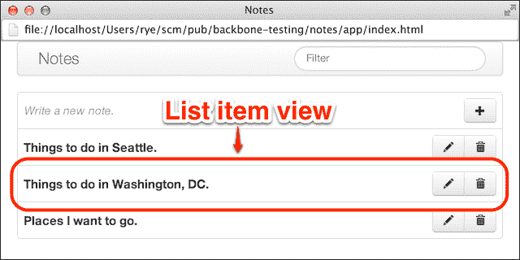

# 第五章。测试存根和模拟

随着 Sinon.JS 集成到我们的测试基础设施中，我们现在对 Backbone.js 应用程序中的方法和动作有了更深入的了解。当我们转向测试剩余的应用程序组件时，我们将超越在测试期间仅仅 *观察* 方法，并实际上 *替换* 方法行为。

Sinon.JS 在这方面也为我们提供了保障——该库为功能行为修改提供了坚实的支持。具体来说，我们可以利用其强大的存根和模拟抽象来减少 Backbone.js 组件的依赖性和测试期间的跨应用程序副作用。在本章中，我们将通过以下主题来探索这些和其他 Sinon.JS 功能：

+   使用 Sinon.JS 存根替换函数行为并在测试中隔离 Backbone.js 组件

+   介绍 Sinon.JS 模拟，它以单个抽象来监视、存根和验证应用程序行为

+   为我们 Backbone.js 应用程序的剩余组件编写测试，并决定给定测试场景中适当的 Sinon.JS 工具

+   调查其他上下文有用的 Sinon.JS 测试辅助工具

+   在 Backbone.js 集合测试中伪造远程后端服务器

# 使用 Sinon.JS 存根替换方法行为

到目前为止，我们已经能够通过巧妙的设计类和一些手动伪造来处理我们的 Backbone.js 测试依赖项。然而，我们很快就会达到一个需要更可靠和一致的方法的点。

我们将寻求使用存根提供一种简单直接且可预测的方法，以在任何 Backbone.js 组件中替换方法行为，从而减少意外的应用程序副作用和依赖问题。在测试期间临时替换现有方法的能力提供了巨大的灵活性，尤其是在以下情况下：

+   Backbone.js 应用程序处于早期开发阶段，并非所有计划中的组件都已存在。存根允许我们在测试中编写缺失功能的模拟等效代码，这些代码在真实应用程序代码编写后可以删除。即使应用程序代码已经实现，存根仍然可能适用于原始规范的一部分，具体取决于正在测试的行为类型。

+   应用程序代码对 UI 和/或其他事件的时机敏感。

+   应用程序依赖于外部资源，如数据库或云服务。

+   Backbone.js 组件具有过于复杂，无法手动在测试中交换的应用程序依赖性和/或交互。

## 开始使用存根

为了开始，让我们将一些存根集成到上一章中的对象字面量中：

```js
var obj = {
  multiply: function (a, b) { return a * b; },
  error: function (msg) { throw new Error(msg); }
};
```

在接下来的规范中，我们将向您展示两种不同的方法使用 Sinon.JS 占位 `obj.multiply()`。在第一次调用（`sinon.stub(obj, "multiply").returns(5)`）中，我们使用 `returns` 方法始终返回一个硬编码的值。第二个占位符采用不同的方法，插入一个替换函数（而不是相乘）。在两种情况下，测试完成后都调用 `restore()` 以防止 `obj` 被永久修改：

```js
it("stubs multiply", function () {
  // Stub with a hard-coded return value.
  sinon.stub(obj, "multiply").returns(5);
  expect(obj.multiply(1, 2)).to.equal(5);
  obj.multiply.restore();

  // Stub with a function.
  sinon.stub(obj, "multiply", function (a, b) {
    return a + b;
  });
  expect(obj.multiply(1, 2)).to.equal(3);
  obj.multiply.restore();
});
```

将注意力转向接下来的代码片段中的 `obj.error()`，我们在对象方法上创建一个空的占位符以防止真实函数抛出异常。我们不需要替换函数或 `returns` 值，因为我们只想 *避免* 默认行为。此外，我们使用 `sinon.test` 沙盒助手来自动在测试函数内部创建的任何占位符上调用 `restore()`：

```js
it("stubs error", sinon.test(function () {
  this.stub(obj, "error");
  expect(obj.error).to.not.throw();
}));
```

如前述代码片段所示，我们现在可以轻松地用不同的代码和/或返回值替换任意方法。

## 占位 API

Sinon.JS 占位符实现了整个间谍 API，并提供了一些额外的方法，可以在测试期间用新代码和行为替换现有的应用程序函数。占位的第一步是创建一个占位对象，并可能替换一个或多个对象方法：

+   `sinon.stub()`: 这创建了一个没有指定行为的匿名占位符。

+   `sinon.stub(obj, methodName)`: 这用一个空函数占位单个对象的方法。这本身就足以替换我们看到的 `obj.error()` 代码中的底层代码执行。或者，您还可以进一步调用占位 API 方法来修改占位符的返回、回调或其他行为。

+   `sinon.stub(obj, methodName, fn)`: 这使用在 `fn` 参数中提供的替换函数占位单个对象的方法。

+   `sinon.stub(obj)`: 这将用占位符替换对象中的 *所有* 方法。

一旦我们有了占位对象，我们就可以根据给定的测试情况添加相应的伪造行为和响应。其中一些方法适用于同步（非回调）函数响应：

+   `stub.returns(obj)`: 当调用时，这个占位符将返回值 `obj`。

+   `stub.throws()`: 当调用时，这个占位符将抛出一个 `Error 对象` 异常。如果 `throws()` 被带有类型字符串（例如，`"TypeError"`）或错误对象（例如，`new TypeError()`）调用，将使用特定的错误。

Sinon.JS 还支持在占位方法中异步回调：

+   `stub.yields(arg1, arg2, ...)`: 占位方法的第一参数必须是一个回调函数，占位符将使用参数 `arg1`、`arg2` 等调用该函数。在下面的代码片段中，我们将占位 `obj.async()` 并使用 `yield()` 将伪造的参数 `1` 和 `2` 注入回调：

    ```js
    it("stubs with yields", function (done) {
      var obj = {
        async: function (callback) { callback("a", "b"); }
      };

      sinon.stub(obj, "async").yields(1, 2);

      // Verify stub calls with (1, 2), *not* ("a", "b").
      obj.async(function (first, second) {
        expect(first).to.equal(1);
        expect(second).to.equal(2);

        obj.async.restore();
        done();
      });
    });
    ```

+   `stub.yieldsOn(context, arg1, arg2, ...)`: 这与 `stub.yields()` 等效，除了它还会在调用回调时将 `context` 参数作为特殊变量 `this` 注入。

+   `stub.yieldsTo(property, arg1, arg2, ...)`: 这与 `stub.yields()` 方法类似，但期望的底层方法的回调是一个具有与 `property` 参数值匹配的属性名的对象。

+   `stub.yieldsToOn(property, context, arg1, arg2, ...)`: 这是 `stub.yieldsOn()` 和 `stub.yieldsTo()` 的组合，它使用一个对象回调属性和上下文变量。

+   `stub.callsArgWith(index, arg1, arg2, ...)`: `stub.yields*` 方法集合利用了被模拟方法的第一个参数。然而，异步回调可能发生在其他参数位置。`stub.callsArgWith()` 方法允许我们指定要使用的回调参数的索引以及传递给函数的参数。

+   `stub.callsArg*`: 除了 `stub.callsArgWith()` 方法外，`stub.callsArg(index)`、`stub.callsArgOn(index, context)` 和 `stub.callsArgOnWith(index, context, arg1, arg2, ...)` 方法都接受一个名为 `index` 的第一个参数，该参数指定了在包装方法中要调用的回调函数的索引，并且它们的工作方式与之前提到的 `yields*` 对应方法类似。

这组桩功能足以覆盖大多数 Backbone.js 测试场景。同时，回顾完整的 Sinon.JS 桩 API 文档（[`sinonjs.org/docs/#stubs`](http://sinonjs.org/docs/#stubs)）以了解额外的方法和辅助工具是值得的。

# 使用 Sinon.JS 模拟进行行为伪造和验证

本书将要介绍的最后一个测试双重抽象是测试模拟（mock）。模拟可以替换桩（stubs）的功能，像间谍（spies）和桩一样观察方法调用，并且还可以验证函数行为。本质上，模拟是伪造和测试方法的“一站式”解决方案。

## 决定何时使用模拟

那么，我们应该在何时使用模拟？Sinon.JS 模拟 API 文档（[`sinonjs.org/docs/#mocks`](http://sinonjs.org/docs/#mocks)）从模拟的适当使用案例开始：

> “模拟应该仅用于测试中的方法。在每次单元测试中，应该有一个单元正在被测试。如果你想控制你的单元是如何被使用的，并且喜欢提前声明期望（而不是事后断言），那么请使用模拟。”

文档警告说，在许多情况下应**避免**使用模拟：

> “模拟内置了可能会使你的测试失败的期望。因此，它们强制实施实现细节。一般来说，如果你不会为某个特定的调用添加断言，那么不要模拟它。相反，使用桩。通常，你不应该在单个测试中拥有超过一个模拟（可能包含多个期望）。”

本书倾向于使用 Sinon.JS 模拟桩（stubs）的原因是前面讨论的，以及以下原因：

+   Chai 和 Sinon-Chai 适配器库允许我们编写简洁、表达性强且易于阅读的桩测试断言。

+   Sinon.JS 模拟期望 API 比使用 Chai 断言对桩 API 的使用灵活性低。

同时，模拟也是存根。因此，测试可以将预编程的 Sinon.JS 模拟期望与随后的 Chai 存根断言混合匹配。最终，在我们完成本章中存根和模拟的细节审查后，我们将抽象的选择留给开发者和具体的测试场景。

## 模拟 API

Sinon.JS 模拟([`sinonjs.org/docs/#mocks-api`](http://sinonjs.org/docs/#mocks-api))实现了间谍和存根 API，并额外提供了验证应用程序行为的期望。我们将从对核心模拟方法的简要讨论开始：

+   `sinon.mock(obj)`: 这个方法模拟`obj`的所有方法，并返回一个模拟对象

+   `mock.expects(methodName)`: 这个方法为模拟对象的指定方法创建一个期望

+   `mock.verify()`: 这个方法检查并验证是否所有期望都得到了满足，在断言失败时抛出异常

+   `mock.restore()`: 这个方法撤销并移除正在测试的底层对象的所有模拟修改

在我们模拟了一个对象之后，通常的工作流程是调用一个或多个方法的`mock.expects()`，并为后续的`mock.verify()`调用配置期望。对于完整的期望列表，请参阅[`sinonjs.org/docs/#expectations`](http://sinonjs.org/docs/#expectations)。一些有用的期望方法包括以下内容：

+   `expectation.atLeast(num)`, `expectation.atMost(num)`, 和 `expectation.exactly(num)`: 这些模拟方法应该分别至少/最多/恰好被调用`num`次

+   `expectation.never()`, `expectation.once()`, `expectation.twice()`, 和 `expectation.thrice()`: 这些是用于指定模拟方法被调用次数的常用断言辅助工具

+   `expectation.withArgs(arg1, arg2, ...)` 和 `expectation.withExactArgs(arg1, arg2, ...)`: 每次对模拟方法的调用至少/恰好包含期望中指定的参数

+   `expectation.on(obj)`: 这个模拟方法应该以`obj`作为上下文（`this`）变量被调用

+   `expectation.verify()`: 这个方法对特定的期望运行断言（与`mock.verify()`不同，后者确认*所有*期望）

在下面的代码片段中，我们在`obj`周围创建我们的`mock`对象，并声明期望`multiply`将被调用两次到四次，并且每次调用的第一个参数将是`2`。然后我们使用适当的参数三次调用`multiply`。最后，一个单独的`mock.verify()`调用检查是否所有模拟期望都得到了满足：

```js
// Our (now very familiar) object under test.
var obj = {
  multiply: function (a, b) { return a * b; },
  error: function (msg) { throw new Error(msg); }
};

it("mocks multiply", function () {
  // Create the mock.
  var mock = sinon.mock(obj);

  // The multiply method is expected to be called:
  mock.expects("multiply")
    .atLeast(2)    // 2+ times,
    .atMost(4)     // no more than 4 times, and
    .withArgs(2);  // 2 was first arg on *all* calls.

  // Make 3 calls to `multiply()`.
  obj.multiply(2, 1);
  obj.multiply(2, 2);
  obj.multiply(2, 3);

  // Verify **all** of the previous expectations.
  mock.verify();

  // Restore the object.
  mock.restore();
});
```

# 使用存根和模拟测试 Backbone.js 组件

在将存根和模拟添加到我们的测试基础设施后，我们准备好处理本书中将要涵盖的 Backbone.js 应用程序的剩余组件：`App.Views.NotesItem`视图和`App.Routers.Router`路由器。对于跟随代码示例的开发者，我们将将这些应用程序组件的规范集成到测试驱动页面`chapters/05/test/test.html`中。

## 确保存根和模拟实际上已绑定

Sinon.JS 的一个初步问题可能会让开发者感到困惑，那就是确保在测试期间间谍、存根和模拟实际上绑定到了 Backbone.js 应用程序对象预期的方法上。

让我们从简单的 Backbone.js 视图`MyView`开始。该视图有一个名为`foo()`的自定义方法，该方法绑定到两个事件监听器，`wrapped`和`unwrapped`。这两个监听器在功能上是等效的，除了`wrapped`将调用包裹在一个函数中（`function () { this.foo(); }`），而`unwrapped`绑定的是真正的（或“裸露的”）`this.foo`方法：

```js
var MyView = Backbone.View.extend({

  initialize: function () {
    this.on("wrapped", function () { this.foo(); });
    this.on("unwrapped", this.foo);
  },

  foo: function () {
    return "I'm real";
  }

});
```

虽然非常相似，但在使用 Sinon.JS 伪造时，事件监听器有一个重要的区别；一旦调用`initialize()`，裸露的方法引用，如传递给`unwrapped`的，就不能被 Sinon.JS 后来伪造。其根本原因在于 Sinon.JS 只能更改视图对象上的属性，而不能直接更改方法引用。

让我们考察一个实例化`MyView`对象并随后对`foo`进行存根的测试。当我们触发`wrapped`监听器时，我们的存根被调用并返回伪造的值`I'm fake`。然而，触发`unwrapped`监听器从未调用存根，而是调用了真正的`foo`方法。注意，我们使用 Sinon.JS 的`reset()`方法清除任何记录的函数调用信息，并将间谍、存根或模拟恢复到其原始状态：

```js
it("stubs after initialization", sinon.test(function () {
  var myView = new MyView();

  // Stub prototype **after** initialization.
  // Equivalent to:
  // this.stub(myView, "foo").returns("I'm fake");
  this.stub(MyView.prototype, "foo").returns("I'm fake");

  // The wrapped version calls the **stub**.
  myView.foo.reset();
  myView.trigger("wrapped");
  expect(myView.foo)
    .to.be.calledOnce.and
    .to.have.returned("I'm fake");

  // However, the unwrapped version calls the **real** function.
  myView.foo.reset();
  myView.trigger("unwrapped");
  expect(myView.foo).to.not.be.called;
}));
```

解决这个问题的方法是在对象实例化之前进行存根。在下面的代码片段中，在调用`new MyView()`之前创建存根，正确地将存根连接到了`wrapped`和`unwrapped`监听器：

```js
it("stubs before initialization", sinon.test(function () {
  // Stub prototype **before** initialization.
  this.stub(MyView.prototype, "foo").returns("I'm fake");

  var myView = new MyView();

  // Now, both versions are correctly stubbed.
  myView.foo.reset();
  myView.trigger("wrapped");
  expect(myView.foo)
    .to.be.calledOnce.and
    .to.have.returned("I'm fake");

  myView.foo.reset();
  myView.trigger("unwrapped");
  expect(myView.foo)
    .to.be.calledOnce.and
    .to.have.returned("I'm fake");
}));
```

对于单个测试，如前两个代码片段所示，跟踪 Backbone.js 对象初始化和存根的顺序相对简单。然而，在测试套件的设置和清理过程中，特别是当对象在稍后模拟或存根的地方实例化时，保持绑定是很重要的。此外，这个问题可以在 Backbone.js 应用程序的多个地方体现出来，如下所示：

+   **视图事件**：视图可以声明一个`events`属性，通过方法的字符串名称将 UI 事件绑定到方法。当 Backbone.js 初始化新的视图对象时，这内部表现得类似于裸露的函数引用。以下是一个此类声明的示例：

    ```js
    events: {
      "click #id": "foo"
    }
    ```

+   **路由器路由**：类似地，路由器通常声明一个`routes`属性，将哈希/URL 片段绑定到路由器对象上的命名方法。

最重要的是始终考虑如何将 Sinon.JS 存根绑定到正在测试的 Backbone.js 组件。有时在 Backbone.js 应用组件中避免裸函数引用可能更容易，而在其他时候，最好重新编写测试代码，以便在组件初始化之前绑定存根。在笔记应用中，我们将在这章剩余的测试中使用这两种方法。

## 笔记列表项视图

在本书中我们将讨论和测试的最后一个笔记视图是列表项视图。当用户导航到笔记应用的首页时，他们会被展示一个以标题标识的笔记列表。`App.Views.NotesItem`视图负责渲染每个单独的笔记行，并允许用户查看、编辑或删除笔记。以下截图展示了单个列表项视图的渲染输出：



笔记列表项视图

列表项的标题文本可以点击以查看单个笔记的渲染 Markdown。列表项还包含两个操作按钮，一个带有铅笔图标用于编辑，另一个带有垃圾桶图标用于删除。

列表项模板字符串在`notes/app/js/app/templates/templates.js`中的`App.Templates`的`template-notes-item`属性中声明：

```js
App.Templates["template-notes-item"] =
  "<td class=\"note-name\">" +
  "  <div class=\"note-title note-view\"><%= title %></div>" +
  "</td>" +
  "<td class=\"note-action\">" +
  "  <div class=\"btn-group pull-right\">" +
  "    <button class=\"btn note-edit\">" +
  "      <i class=\"icon-pencil\"></i>" +
  "    </button>" +
  "    <button class=\"btn note-delete\">" +
  "      <i class=\"icon-trash\"></i>" +
  "    </button>" +
  "  </div>" +
  "</td>";
```

模板在表格行内渲染两个`td`单元格，一个用于笔记标题，另一个用于编辑/删除按钮。

### 列表项视图

`App.Views.NotesItem`视图在`notes/app/js/app/views/notes-list.js`中定义。类定义从用于渲染`tr`标签的 DOM 属性开始，一个`notes-item`类和一个与笔记模型标识符对应的`id`属性：

```js
App.Views.NotesItem = Backbone.View.extend({

  id: function () { return this.model.id; },

  tagName: "tr",

  className: "notes-item",

  template: _.template(App.Templates["template-notes-item"]),
```

列表项的标题和编辑/删除按钮上的点击事件绑定到它们各自的方法，即`viewNote`、`editNote`和`deleteNote`。就我们之前关于 Sinon.JS 绑定的讨论而言，请注意所有的事件回调都有函数包装器，这允许我们在测试期间任何时候创建可以被存根的`App.Views.NotesItem`对象：

```js
  events: {
    "click .note-view":   function () { this.viewNote(); },
    "click .note-edit":   function () { this.editNote(); },
    "click .note-delete": function () { this.deleteNote(); }
  },
```

在`initialize`方法中，视图存储了一个路由引用，并设置了监听器，以响应模型事件重新渲染或删除视图。`render`方法以相当传统的方式将模型数据绑定到模板：

```js
  initialize: function (attrs, opts) {
    opts || (opts = {});
    this.router = opts.router || app.router;

    this.listenTo(this.model, {
      "change":   function () { this.render(); },
      "destroy":  function () { this.remove(); }
    });
  },

  render: function () {
    this.$el.html(this.template(this.model.toJSON()));
    return this;
  },
```

转到单个列表项可以执行的操作，`viewNote`和`editNote`方法在查看或编辑模式下导航到单个笔记视图。`deleteNote`函数删除底层的笔记模型，然后触发事件，清理并从所有笔记列表中删除视图：

```js
  viewNote: function () {
    var loc = ["note", this.model.id, "view"].join("/");
    this.router.navigate(loc, { trigger: true });
  },

  editNote: function () {
    var loc = ["note", this.model.id, "edit"].join("/");
    this.router.navigate(loc, { trigger: true });
  },

  deleteNote: function () {
    // Destroying model triggers view cleanup.
    this.model.destroy();
  }
});
```

### 测试列表项视图

我们希望在测试套件文件`chapters/05/test/js/spec/views/notes-item.spec.js`中验证的`App.Views.NotesItem`视图行为包括以下内容：

+   视图渲染笔记列表表中的单行 HTML，并显示笔记的标题和操作按钮

+   它将点击事件绑定到适当的笔记操作（例如，编辑）并导航到适当的单个笔记页面以阅读或编辑笔记

+   当用户删除笔记时，它正确地清理了对象状态

测试套件从 `before()` 设置方法开始，我们在其中创建了一个 `App.Views.NotesItem` 对象，该对象包含一个假的具有 `navigate` 存根的路由器对象字面量（包含一个 `navigate` 存根）和一个真实的 `App.Models.Note` 模型。在 `afterEach()` 方法中，我们重置 `navigate` 存根，以便每个规范都得到一个没有之前记录的函数信息的存根。`after()` 清理函数移除正在测试的视图。

再次，考虑到 Sinon.JS 方法中的绑定问题，我们注意到 `this.view` 是在 `before()` 设置中为整个测试套件创建的。这意味着存根、间谍和/或模拟将仅适用于包装的 `App.Views.NotesItem` 视图方法。同时，如果现有的 `App.Views.NotesItem` 测试套件不适合我们需要的所有测试双倍绑定，我们可以轻松地创建一个额外的套件，在实例化之前模拟类原型，以在测试所需的应用程序行为时提供额外的灵活性：

```js
describe("App.Views.NotesItem", function () {

  before(function () {
    this.navigate = sinon.stub();
    this.view = new App.Views.NotesItem({
      model: new App.Models.Note({ id: "0", title: "title" })
    }, {
      router: { navigate: this.navigate }
    });
  });

  afterEach(function () {
    this.navigate.reset();
  });

  after(function () {
    this.view.remove();
  });
```

第一个嵌套测试套件检查底层模型的 `destroy` 事件是否触发 `view.remove()` 方法，清理视图。我们存根 `view.remove()` 以防止在调用时实际从测试环境中移除视图。然后，我们触发所需的模型事件，以便我们可以验证存根被调用了一次：

```js
  describe("remove", function () {
    it("is removed on model destroy", sinon.test(function () {
      // Empty stub for view removal to prevent side effects.
      this.stub(this.view, "remove");
      this.view.model.trigger("destroy");
      expect(this.view.remove).to.be.calledOnce;
    }));
  });
```

在接下来的两个规范中，我们处理了一个类似场景，验证笔记模型的 `change` 事件将触发视图上的 `render()` 调用。我们在两个规范中都做出相同的断言，在一个规范中使用存根，在另一个规范中使用模拟来展示如何使用任何抽象编写相同的函数规范。`renders on model change w/ stub` 规范使用存根来验证视图的行为：

```js
  describe("render", function () {
    // One way to verify is with a stub.
    it("renders on model change w/ stub", sinon.test(function () {
      this.stub(this.view);
      this.view.model.trigger("change");
      expect(this.view.render).to.have.been.calledOnce;
    }));
```

在 `renders on model change w/ mock` 规范中，我们依赖于模拟，使用 Sinon.JS 的 `once()` 预期修改器和 `mock.verify()` 来做出相同的断言，而不是在存根上使用 Chai 断言：

```js
    // Here is another way to do the same check with a mock.
    it("renders on model change w/ mock", sinon.test(function () {
      var exp = this.mock(this.view).expects("render").once();
      this.view.model.trigger("change");
      exp.verify();
    }));
  });
```

在接下来的两个规范中，我们检查用户点击列表项标题（用于查看）或铅笔按钮（用于编辑）的场景。我们需要检查这两个点击是否调用适当的视图函数并导致路由器导航到预期的单个笔记页面。在随后的代码片段中，我们通过断言路由器的 `navigate` 存根已用适当的参数调用来验证此行为：

```js
  describe("actions", function () {
    it("views on click", function () {
      this.view.$(".note-view").click();

      expect(this.navigate)
        .to.be.calledOnce.and
        .to.be.calledWith("note/0/view");
    });

    it("edits on click", function () {
      this.view.$(".note-edit").click();

      expect(this.navigate)
        .to.be.calledOnce.and
        .to.be.calledWith("note/0/edit");
    });
```

最后，我们确保点击垃圾桶按钮会触发底层笔记模型被销毁。我们存根模型的 `destroy` 方法以验证它被调用，并防止模型实际被修改：

```js
    it("deletes on click", sinon.test(function () {
      // Empty stub for model destroy to prevent side effects.
      this.stub(this.view.model, "destroy");
      this.view.$(".note-delete").click();

      expect(this.view.model.destroy).to.be.calledOnce;
    }));
  });
});
```

总的来说，我们对 `App.Views.NotesItem` 的测试展示了如何用模拟和存根替换方法行为，从而简化我们的测试并限制程序方法的副作用。

## 笔记应用程序路由器

我们将在 Notes 应用程序中测试的最后一个 Backbone.js 组件是路由器，`App.Routers.Router`。路由器负责管理客户端页面位置（URL 或 hash 片段）并将路由绑定到视图、事件和动作。

为了本章的目的，我们将使用`chapters/05/test/js/spec/routers/router.js`中可用的`App.Routers.Router`类的简化版本，而不是真实的笔记路由文件（在`notes/app/js/app/routers/router.js`中的代码示例中找到）。

### 注意

虽然真实的 Backbone.js 路由器不是最复杂的生物，但它有足够的复杂依赖和应用逻辑，足以在文本中省略完整实现，尤其是在我们只需要介绍一些路由器的测试技巧时。

同时，我们不会因为存在组件依赖而回避测试。因此，我们在代码示例的`notes/test/js/spec/routers/router.spec.js`中为真实的`App.Routers.Router`组件提供了一个全面的测试套件。我们鼓励您审查完整路由及其相应的测试套件的实现。

Notes 应用程序包含两个路由，分别对应笔记列表页面和单个笔记页面。我们在简化的`App.Routers.Router`类中包含这种行为：

```js
App.Routers.Router = Backbone.Router.extend({

  routes: {
    "": "notes",
    "note/:id/:action": "note",
  },

  // Show notes list.
  notes: function () {
    // ... omitted ...
  },

  // Common single note edit/view.
  note: function (noteId, action) {
    // ... omitted ...
  }

});
```

我们的测试应该检查路由规范是否绑定到正确的路由器方法，以及 URL / hash 片段是否正确解析为路由器方法的参数。我们在测试套件文件`chapters/05/test/js/spec/routers/router.spec.js`中验证这种行为。

我们的设置逻辑首先在路由器的`note`和`notes`方法周围创建占位符。然后我们实例化一个路由器对象并启动历史记录（这启用了实际的路由）。我们的设置以将匿名间谍绑定到每个`route`事件（在任何路由被激活时触发）结束。

### 注意

总是关注 Sinon.JS 绑定问题，请注意，我们必须在实例化路由器对象之前占位路由器原型，因为路由器对象的`routes`属性将路由绑定到方法名字符串，而不是到包装函数。

```js
describe("App.Routers.Router", function () {

  // Default option: Trigger and replace history.
  var opts = { trigger: true, replace: true };

  beforeEach(function () {
    // Stub route methods.
    sinon.stub(App.Routers.Router.prototype, "note");
    sinon.stub(App.Routers.Router.prototype, "notes");

    // Create router with stubs and manual fakes.
    this.router = new App.Routers.Router();

    // Start history to enable routes to fire.
    Backbone.history.start();

    // Spy on all route events.
    this.routerSpy = sinon.spy();
    this.router.on("route", this.routerSpy);
  });
```

我们的拆解逻辑会停止历史记录并回滚占位符：

```js
  afterEach(function () {
    Backbone.history.stop();

    App.Routers.Router.prototype.note.restore();
    App.Routers.Router.prototype.notes.restore();
  });
```

第一个规范检查我们是否可以通过在期望的路由`"note/1/edit"`上调用路由器的`navigate`方法来导航到单个笔记进行编辑。我们断言这调用了我们占位符的`note`方法（我们已占位）并带有提取的参数`"1"`和`"edit"`。我们还通过`routerSpy`事件监听器确认相同类型的信息：

```js
  it("can route to note", function () {
    this.router.navigate("note/1/edit", opts);

    // Check router method.
    expect(App.Routers.Router.prototype.note)
      .to.have.been.calledOnce.and
      .to.have.been.calledWithExactly("1", "edit");

    // Check route event.
    expect(this.routerSpy)
      .to.have.been.calledOnce.and
      .to.have.been.calledWith("note", ["1", "edit"]);
  });
```

我们的第二个规范验证我们是否可以导航到主页，然后导航到单个笔记页面，然后返回主页。我们使用与上一个规范类似的验证逻辑，依赖于`notes`占位符（在`""`主页路由上调用两次）和`routerSpy`间谍（在所有三个路由上调用）：

```js
  it("can route around", function () {
    // Bounce between routes.
    this.router.navigate("", opts);
    this.router.navigate("note/1/edit", opts);
    this.router.navigate("", opts);

    // Check router method.
    expect(App.Routers.Router.prototype.notes)
      .to.have.been.calledTwice.and
      .to.have.been.calledWithExactly();

    // Check route event.
    expect(this.routerSpy)
      .to.have.been.calledThrice.and
      .to.have.been.calledWith("notes");
  });

});
```

这些路由测试与 Backbone.js 视图测试中的事件测试并没有太大的不同——两者都将字符串（一个路由或一个 UI 事件）绑定到组件方法（通过字符串名称或函数）。总的来说，我们在本章中学到的 Sinon.JS 模拟和存根方法通常适用于任何类型的 Backbone.js 组件。

## 运行视图和路由测试

现在我们已经有了 `App.Views.NotesItem` 和 `App.Routers.Router` 的测试套件，我们可以将它们集成到一个测试驱动页面上。在之前的 `chapters/04/test/test.html` 驱动页面上（增加了一些突出显示的内容），我们的最终驱动页面 `chapters/05/test/test.html` 包含以下相关部分：

```js
<head>
  <!-- ... snipped ... -->

  <!-- JavaScript Application Libraries -->
  <script src="img/namespace.js"></script>
  <script src="img/config.js"></script>
  <script>
    // Test overrides (before any app components).
    App.Config = _.extend(App.Config, {
      storeName: "notes-test" // localStorage for tests.
    });
  </script>
  <script src="img/note.js"></script>
  <script src="img/notes.js"></script>
  <script src="img/templates.js"></script>
  <script src="img/note-nav.js"></script>
  <script src="img/note-view.js"></script>
  <script src="img/note.js"></script>
  <script src="img/notes-item.js"></script>

  <!-- The shortened, teaching router for Chapter 05 -->
  <script src="img/router.js"></script>

  <!-- ... snipped ... -->

  <!-- Tests. -->
  <script src="img/notes-item.spec.js"></script>
  <script src="img/router.spec.js"></script>
</head>
```

### 提示

到目前为止，我们在供应商库和我们的 Backbone.js 应用程序组件之间积累了大量 JavaScript 文件。虽然这对于测试（有时甚至是被期望的）是可以接受的，但在生产应用程序中使用像 Google Closure Compiler ([`developers.google.com/closure/compiler/`](https://developers.google.com/closure/compiler/)) 或 UglifyJS ([`github.com/mishoo/UglifyJS2`](https://github.com/mishoo/UglifyJS2)) 这样的工具来连接和优化 JavaScript 文件是一种良好的实践。

我们现在可以导航到浏览器窗口中的 `chapters/05/test/test.html` 来运行测试。

### 注意

如果你正在从代码示例中运行报告，结果中会出现一些本书未讨论的额外视图规范。

你可能会注意到，在路由测试中对 `navigate` 方法的调用实际上修改了浏览器位置，添加了哈希片段。虽然这不会影响测试的正确性，但这有点出乎意料。采用另一种方法，Backbone.js 库测试套件通过创建一个假的 `Location` 对象来替代真实的浏览器导航栏，从而绕过这个问题。有关更多详细信息，请参阅 [`github.com/documentcloud/backbone/blob/master/test/router.js`](https://github.com/documentcloud/backbone/blob/master/test/router.js)。

# 查找 Notes 应用程序的其余组件

在完成之前的视图和路由测试后，我们现在已经完成了将在本书中展示的基于 localStorage 的 Notes 应用程序的应用程序和测试代码。然而，Notes 应用程序中还有一些其他部分，我们无法在本书的范围内进行讨论。

幸运的是，每个组件（以及它们的相关测试文件）都可以作为本书可下载代码示例的一部分找到。在示例中可以找到的 Notes 应用程序的其余部分如下：

+   `App.Views.NotesFilter` (`notes/app/js/app/views/notes-filter.js`): 这个视图控制过滤输入框和显示的笔记列表中笔记行的可见性。这个视图的测试文件可以在 `notes/test/js/spec/views/notes-filter.spec.js` 中找到。

+   `App.Views.Notes` (`notes/app/js/app/views/notes.js`): `App.Views.Notes` 视图包含 `App.Views.NotesItem` 和 `App.Views.NotesFilter` 视图，负责从集合中获取笔记数据并渲染笔记的完整列表。相应的测试文件位于 `notes/test/js/spec/views/notes.spec.js`。

+   `App.Routers.Router` (`notes/app/js/app/routers/router.js`): 这是 Notes 的 Backbone.js 路由的完整实现。其测试文件可在 `notes/test/js/spec/routers/router.spec.js` 中找到。

+   `app` (`notes/app/js/app/app.js`): `app` 对象控制 Notes 应用程序的整体功能。它实例化所有顶级应用程序组件；例如，`App.Views.Notes` 视图、`App.Routers.Router` 路由器和 `App.Collections.Notes` 集合。它还启动一个初始集合 `fetch` 操作以导入现有的笔记数据。我们不为此文件包含规范，因为创建和启动实际应用程序通常包含在完整集成测试的范围内——这是我们提到的 第二章，*创建 Backbone.js 应用程序测试计划*，我们鼓励您在本书之外学习。

+   `notes/test/test.html`: 这是所有 Notes 应用程序测试套件和规范的测试驱动页面。此页面汇总了我们在本书中讨论的所有 Notes 规范以及省略的视图的规范，以及完整的路由实现。

这些额外的文件将我们在本书中学到的基本原理应用于不同的应用程序代码和场景。因此，审查剩余的 Notes 应用程序文件将为您提供一个更全面的 Backbone.js 应用程序和测试基础设施的图景，该基础设施遵循我们建议的测试原则。总的来说，我们希望这些代码示例能够传达本书中涵盖的主题，并可能为您在测试开发教育中提供一些想法和下一步行动。

# 更多 Sinon.JS 测试辅助工具

Sinon.JS 提供了许多有用的工具，超出了核心测试替身抽象（间谍、存根和模拟）。我们已经在 第四章 中介绍了 `sinon.test` 包装器，*测试间谍*，本章我们将探讨一些同样方便的辅助工具。

### 小贴士

一些测试辅助工具，如计时器和服务器，在使用 Internet Explorer 网络浏览器时可能需要使用 IE 特定的 Sinon.JS 库。有关更多详细信息，请参阅相关的 Sinon.JS 文档部分。

## 模拟计时器

Sinon.JS 可以修补时间和日期间隔，以帮助在测试中管理异步事件和回调。Sinon.JS 伪造计时器覆盖了原生 JavaScript 函数，如 `setTimeout` 和 `Date` 类。一旦伪造，测试代码必须通过 API `tick(ms)` 函数手动推进时间，该函数模拟程序中任何基于时间的异步事件的时间流逝。有关完整 API 参考，请参阅 [`sinonjs.org/docs/#clock`](http://sinonjs.org/docs/#clock)。

假计时器对于测试 Backbone.js 应用程序非常有用。例如，如果某些 UI 代码有一个延迟的 jQuery 效果，需要 200 毫秒才能完成，包含此行为的测试将不得不等待这么长时间，从而减慢整个测试套件的运行速度。此外，原生 JavaScript 中的计时器并不完全可预测。（例如，请参阅 John Resig 的 *JavaScript 时间精度* [`ejohn.org/blog/accuracy-of-javascript-time`](http://ejohn.org/blog/accuracy-of-javascript-time)。）使用 Sinon.JS 伪造计时器，我们可以在测试中 *同步* 和 *可预测* 地模拟 jQuery 效果的 200 毫秒推进，而无需任何延迟。

## 假服务器

Sinon.JS 还可以修补程序的一些通信内部，并覆盖 **XMLHttpRequest** (**XHR**) 以及其他相关机制。典型的 Backbone.js 应用程序使用 XHR 将模型和集合同步到后端数据存储，如数据库或云服务，这使得此功能对我们的测试基础设施特别相关。Sinon.JS 提供的整个 XHR 伪造功能范围在 [`sinonjs.org/docs/#server`](http://sinonjs.org/docs/#server) 中讨论。

### 假服务器 API

Sinon.JS 提供的第一个 API 是 `FakeXMLHttpRequest`；这是一个围绕 XHR 接口的低级抽象，提供了对请求、响应、标题和其他细节的精细控制。有关完整 API 列表，请参阅 [`sinonjs.org/docs/#FakeXMLHttpRequest`](http://sinonjs.org/docs/#FakeXMLHttpRequest)。

Sinon.JS 还提供了一个高级 API，形式为假服务器，为现代 JavaScript 网络应用程序中的常见用例提供了一个更简单的接口。在本章中，我们将使用后者接口，因为更简单的接口仍然非常适合我们的 Backbone.js 应用程序测试需求。

Sinon.JS 假服务器 API 文档可在 [`sinonjs.org/docs/#fakeServer`](http://sinonjs.org/docs/#fakeServer) 找到。API 的一个有用子集包括以下内容：

+   `sinon.fakeServer.create()`: 这将创建一个假服务器对象，并伪造 XHR 接口以进行测试。

+   `server.respondWith(response)`: 这将配置服务器对所有请求响应一个响应对象。响应可以采取各种形式，但我们将使用的是一个包含 HTTP 状态码、标题字典和 JSON 响应字符串的数组。默认响应是 `[404, {}, ""]`。

+   `server.respondWith(method, url, response)`: 这将配置服务器以响应对象响应与指定 HTTP 方法和方法匹配的请求。`respondWith` 有进一步的变体，可以使用正则表达式进行 URL 匹配。

+   `server.respond()`: 在服务器配置完成并开始测试后，任何对 `respond()` 的调用都会导致模拟服务器立即发出预安排的响应对象。

+   `server.autoRespond = true`: 模拟服务器将自动响应服务器请求，无需调用 `respond()`。默认情况下，模拟服务器将在响应前等待 10 毫秒。可以将不同的等待时间分配给 `server.autoRespondAfter` 配置变量。

+   `server.restore()`: 这将撤销模拟的 XHR 接口。

### 在 Backbone.js 应用程序中模拟远程后端

本书所介绍的笔记应用没有外部后端，而是依赖于 HTML5 localStorage 来存储集合数据。虽然它是一个有用的教学工具，但大多数现实世界的 Backbone.js 应用确实拥有远程后端存储。因此，本书的配套代码示例包括了一个作为 Node.js Express ([`expressjs.com`](http://expressjs.com)) 应用程序提供的笔记版本，并使用 MongoDB ([`www.mongodb.org`](http://www.mongodb.org)) 后端数据库。您可以在代码示例仓库的 `notes-rest/` 目录中找到完整的应用程序及其测试套件。

基于 localStorage 的 `notes/app` 和基于 MongoDB 的 `notes-rest/app` Backbone.js 应用程序之间的主要区别在于 `App.Collections.Notes` 集合实现。`notes-rest/app` 版本，可在 `notes-rest/app/js/app-rest/collections/notes.js` 中找到，如下定义集合类：

```js
App.Collections.Notes = Backbone.Collection.extend({

  model: App.Models.Note,

  url: "/api/notes"

});
```

URL `/api/notes` 指向由 Node.js Express 服务器提供的后端 REST 接口（代码示例中的 `notes-rest/server.js`），该接口与 MongoDB 数据存储进行交互。

我们对新 `App.Collections.Notes` 集合的测试将依赖于模拟服务器来拦截所有的远程后端调用，并用我们期望的测试数据替换网络响应。

### 小贴士

本节中的集合测试模拟了整个后端，这意味着测试根本不使用 Node.js 或 MongoDB 服务器。这提供了测试运行速度极快和给我们提供可预测响应的优势。然而，测试场景如果试图测试整个应用程序（例如，完整的集成测试）可能需要测试基础设施在真实后端服务器和数据存储上运行。

在查看测试套件文件 `notes-rest/test/js/spec-rest/collections/notes.spec.js` 中的 `beforeEach` 设置调用时，我们创建了一个空集合和一个自动响应后端请求的模拟服务器。`afterEach` 调用将恢复正常的 XHR 操作：

```js
describe("App.Collections.Notes", function () {

  beforeEach(function () {
    this.server = sinon.fakeServer.create();
    this.server.autoRespond = true;
    this.notes = new App.Collections.Notes();
  });

  afterEach(function () {
    this.server.restore();
  });
```

以下规范检查集合是否可以从后端获取并填充数据。我们配置伪造服务器以对 GET 请求返回单个笔记的 JSON 序列化数据。然后，我们在`reset`事件上设置一个回调来验证集合具有预期的长度，并且已将数据反序列化为笔记模型：

```js
  describe("retrieval", function () {

    it("has a single note", function (done) {
      var notes = this.notes, note;

      // Return a single model on GET.
      this.server.respondWith("GET", "/api/notes", [
        200,
        { "Content-Type": "application/json" },
        JSON.stringify([{
          id: 1,
          title: "Test note #1",
          text: "A pre-existing note from beforeEach."
        }])

      ]);

      // After fetch.
      notes.once("reset", function () {
        expect(notes).to.have.length(1);

        // Check model attributes.
        note = notes.at(0);
        expect(note).to.be.ok;
        expect(note.get("title")).to.contain("#1");
        expect(note.get("text")).to.contain("pre-existing");

        done();
      });

      notes.fetch({ reset: true });
    });

  });
```

本规范说明了请求可以如何被伪造——我们只需为特定的伪造 URL 调用一次`this.server.respondWith()`设置即可，Backbone.js 集合并不知道它实际上并没有与远程数据存储进行通信。有关使用 Sinon.JS 伪造服务器的附加集合测试，请参阅本书配套代码示例中的`notes-rest/test/js/spec-rest/collections/notes.spec.js`文件，这些示例可以从测试驱动页面`notes-rest/test/test.html`运行。

# 摘要

在本章中，我们学习了如何应用 Sinon.JS 存根、模拟和其他伪造来隔离 Backbone.js 组件，减少测试复杂性，并增强可预测的测试行为。我们还完成了本书中将要讨论的所有参考笔记应用程序的应用程序测试。花点时间回顾一下到目前为止的进展，我们现在已经涵盖了创建测试基础设施和应用基本测试概念到所有各种 Backbone.js 应用程序组件的基础知识。

但是，这实际上只是实质性测试旅程的开始；本书中展示的测试只是那些对于一个完整的生产级 Backbone.js 应用程序所期望的测试的一个子集。我们希望你现在拥有了提供完整测试支持的必要工具、开发技术和起点，以支持你的 Backbone.js 应用程序。

在下一章中，我们将致力于通过测试自动化扩展我们的测试能力和用例。我们将超越在本地浏览器中手动运行测试套件，并引入可以在不同环境中（如命令行或构建服务器）执行测试且无需网络浏览器的测试工具。
