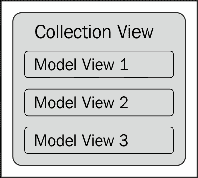
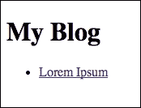
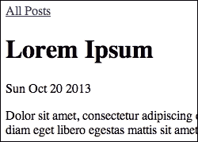
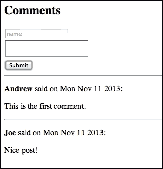

# 第一章. 构建一个简单的博客

我们将假设您在 Backbone 方面的经验非常有限；实际上，即使您以前从未使用过 Backbone，您也应该能够很好地跟随。在本章中，我们将构建一个非常简单的博客应用程序。作为一个博客，它将具有非常少的功能；将会有供观众阅读和评论的帖子。然而，它将向您介绍 Backbone 库中的每个主要功能，让您熟悉词汇，并了解这些功能通常是如何一起工作的。

到本章结束时，您将知道如何：

+   使用 Backbone 的模型、集合和视图组件

+   创建一个 Backbone 路由器来控制用户在屏幕上看到的所有内容

+   使用 Node.js（以及 Express.js）编程服务器端以创建我们 Backbone 应用的后端

那么让我们开始吧！

# 设置应用程序

每个应用程序都需要设置，因此我们将从这里开始。为您的项目创建一个文件夹——我将称之为 `simpleBlog`——然后在其中创建一个名为 `package.json` 的文件。如果您之前使用过 Node.js，您知道 `package.json` 文件描述了项目；列出项目主页、仓库和其他链接；并且（对我们来说最重要的是）概述了应用程序的依赖项。

下面是 `package.json` 文件的样子：

```js
{
  "name": "simple-blog",
  "description": "This is a simple blog.",
  "version": "0.1.0",
  "scripts": {
    "start": "nodemon server.js"
  },
  "dependencies": {
    "express": "3.x.x",
    "ejs"    : "~0.8.4",
    "bourne" : "0.3"
  },
  "devDependencies": {
    "nodemon": "latest"
  }
}
```

### 小贴士

**下载示例代码**

您可以从您在 [`www.packtpub.com`](http://www.packtpub.com) 的账户中下载您购买的所有 Packt 书籍的示例代码文件。如果您在其他地方购买了这本书，您可以访问 [`www.packtpub.com/support`](http://www.packtpub.com/support) 并注册，以便将文件直接通过电子邮件发送给您。

这是一个相当基础的 `package.json` 文件，但它包含了所有重要的部分。`name`、`description` 和 `version` 属性应该是自解释的。`dependencies` 对象列出了此项目运行所需的所有 npm 包：键是包的名称，值是版本。由于我们正在构建 ExpressJS 后端，我们需要 `express` 包。`ejs` 包用于我们的服务器端模板，而 `bourne` 是我们的数据库（关于这一点稍后会有更多介绍）。

`devDependencies` 属性与 `dependencies` 属性类似，但不同的是，这些包仅对在项目上工作的人是必需的。它们不是使用项目所必需的。例如，构建工具及其组件，如 Grunt，将是开发依赖项。我们想要使用一个名为 `nodemon` 的包。这个包在构建 Node.js 后端时非常方便：我们可以在编辑器中编辑 `server.js` 的同时，在后台运行 `nodemon server.js` 命令。`nodemon` 包会在我们保存文件更改时重启服务器。唯一的问题是，我们实际上不能在命令行上运行 `nodemon server.js` 命令，因为我们打算将 `nodemon` 作为本地包安装，而不是全局进程。这就是我们的 `package.json` 文件中的 `scripts` 属性发挥作用的地方：我们可以编写简单的脚本，几乎就像命令行别名一样，为我们启动 `nodemon`。正如你所看到的，我们创建了一个名为 `start` 的脚本，它运行 `nodemon server.js`。在命令行中，我们可以运行 `npm start`；npm 知道在哪里找到 `nodemon` 二进制文件，并为我们启动它。

因此，现在我们有了 `package.json` 文件，我们可以安装我们刚刚列出的依赖项。在命令行中，切换到当前目录到项目目录，并运行以下命令：

```js
npm install

```

你会看到所有必要的包都将被安装。现在我们准备好开始编写代码了。

# 从服务器开始

我知道你可能迫不及待地想要开始实际的 Backbone 代码，但对我们来说，从服务器代码开始更合理。记住，好的 Backbone 应用程序将拥有强大的服务器端组件，所以我们不能完全忽略后端。

我们将首先在我们的项目目录中创建一个 `server.js` 文件。以下是它的开始部分：

```js
var express = require('express');
var path    = require('path');
var Bourne  = require("bourne");
```

如果你使用过 Node.js，你就知道可以使用 `require` 函数来加载 Node.js 组件（`path`）或 npm 包（`express` 和 `bourne`）。现在我们已经在我们的应用程序中有了这些包，我们可以开始如下使用它们：

```js
var app      = express();
var posts    = new Bourne("simpleBlogPosts.json");
var comments = new Bourne("simpleBlogComments.json");
```

这里的第一个变量是 `app`。这是我们基本的 Express 应用程序对象，当我们调用 `express` 函数时就会得到它。我们将在文件中大量使用它。

接下来，我们将创建两个`Bourne`对象。正如我之前所说的，`Bourne`是我们将在本书的项目中使用的数据库。这是一个专门为本书编写的简单数据库。为了尽可能简化服务器端，我想使用文档数据库系统，但我想使用无服务器（例如，SQLite）的，这样您就不必同时运行应用程序服务器和数据库服务器。我想出的，`Bourne`，是一个小包，它从 JSON 文件中读取并写入；该 JSON 文件的路径是我们传递给构造函数的参数。它绝对不适合比小型学习项目更大的任何东西，但应该非常适合这本书。在现实世界中，您可以使用优秀的文档数据库之一。我推荐 MongoDB：它很容易入门，并且有一个非常自然的 API。Bourne 不是 MongoDB 的直接替代品，但它非常相似。您可以在[Bourne 的简单文档](https://github.com/andrew8088/bourne)中查看。

所以，正如您在这里可以看到的，我们需要两个数据库：一个用于我们的博客文章，另一个用于评论（与大多数数据库不同，Bourne 每个数据库只有一个表或集合，因此需要两个）。

下一步是为我们的应用编写一些配置：

```js
app.configure(function(){
  app.use(express.json());
  app.use(express.static(path.join(__dirname, 'public')));
});
```

这是一个非常简单的 Express 应用配置，但对我们这里的用途来说已经足够了。我们在应用中添加了两层中间件；它们是“小程序”，HTTP 请求在到达我们自定义函数（我们尚未编写）之前将运行通过。我们在这里添加了两层：第一层是`express.json()`，它解析 Backbone 将发送到服务器的 JSON 请求体；第二层是`express.static()`，它将从作为参数给出的路径静态服务文件。这允许我们从`public`文件夹中提供客户端 JavaScript 文件、CSS 文件和图像。

您会注意到这两个中间件组件都被传递给`app.use()`，这是我们用来选择使用这些组件的方法。

### 小贴士

您会注意到我们正在使用`path.join()`方法来创建公共资产文件夹的路径，而不是简单地使用`__dirname`和`'public'`。这是因为 Microsoft Windows 需要分隔符为反斜杠。`path.join()`方法将正确处理代码运行的任何操作系统。哦，还有`__dirname`（开头有两个下划线）只是一个变量，表示此脚本所在的目录路径。

下一步是创建一个路由方法：

```js
app.get('/*', function (req, res) {
  res.render("index.ejs");
});
```

在 Express 中，我们可以创建一个路由，该路由调用与所需 HTTP 动词（get、post、put 和 delete）相对应的方法。这里，我们调用 `app.get()` 并向其传递两个参数。第一个是路由；它是域名之后的部分 URL。在我们的例子中，我们使用了一个星号，这是一个通配符；它将匹配以正斜杠开始的任何路由（即所有路由）。这将匹配对应用程序发出的每个 GET 请求。如果 HTTP 请求与路由匹配，那么第二个参数，即一个函数，将被调用。

这个函数接受两个参数；第一个是来自客户端的请求对象，第二个是我们将用来发送响应的响应对象。这些通常被简称为 `req` 和 `res`，但这只是一种约定，你可以随意命名它们。

因此，我们将使用 `res.render` 方法，该方法将在服务器端渲染模板。现在，我们传递了一个单一参数：模板文件的路径。实际上，这仅仅是路径的一部分，因为 Express 默认假设模板保存在名为 `views` 的目录中，这是我们将会使用的约定。Express 可以根据文件扩展名猜测要使用的模板包；这就是为什么我们不需要在任何地方选择 EJS 作为模板引擎。如果我们有想要插入到模板中的值，我们将作为第二个参数传递一个 JavaScript 对象。我们稍后会回来做这件事。

最后，我们可以启动我们的应用程序；我将选择使用端口 `3000`：

```js
app.listen(3000);
```

我们稍后将在 `server.js` 文件中添加更多内容，但这是我们开始的起点。实际上，在这个阶段，你可以在命令行中运行 `npm start` 并在浏览器中打开 `http://localhost:3000`。你会得到一个错误，因为我们还没有创建视图模板文件，但你可以看到我们的服务器正在运行。

# 创建模板

所有网络应用程序都将有一些类型的模板。大多数 Backbone 应用程序将在前端模板上投入大量精力。然而，我们需要一个单独的服务器端模板，所以让我们构建它。

虽然你可以选择不同的模板引擎，但许多人（以及随后的教程）使用 Jade ([`jade-lang.com/`](http://jade-lang.com/))，这是 Node.js 版本的 Ruby 模板引擎 Haml ([`haml.info/`](http://haml.info/))。然而，正如你已经知道的，我们正在使用 EJS ([`github.com/visionmedia/ejs`](https://github.com/visionmedia/ejs))，它与 Ruby 的 ERB 类似。基本上，我们是在 `<%=` `%>` 标签内写入带有模板变量的常规 HTML。

如我们之前所见，Express 将在 `views` 文件夹中寻找一个 `index.ejs` 文件，所以让我们创建这个文件，并在其中放入以下代码：

```js
<!DOCTYPE html>
<html>
  <head>
    <title> Simple Blog </title>
  </head>
  <body>
    <div id="main"></div>
      <script src="img/jquery.js"></script>
      <script src="img/underscore.js"></script>
      <script src="img/backbone.js"></script>
      <script src="img/app.js"></script>
  </body>
</html>
```

到目前为止，如果你还在运行服务器（记得命令行中的`npm start`），你应该能够加载`http://localhost:3000`而不会出现错误。页面将会是空的，但你应该能够查看源代码并看到我们刚刚编写的 HTML 代码。这是一个好兆头；这意味着我们成功地将东西从服务器发送到了客户端。

# 添加公共文件夹

由于 Backbone 是一个前端库，我们需要向客户端提供它。我们已经设置了 Express 应用来静态地提供`public`目录中的文件，并在`index.ejs`文件中添加了几个脚本标签，但我们还没有创建这些内容。

因此，在你的项目目录中创建一个名为`public`的目录。现在下载 Underscore 的最新版本([`underscorejs.org`](http://underscorejs.org))、Backbone([`backbonejs.org`](http://backbonejs.org))和 jQuery([`jquery.com`](http://jquery.com))，并将它们放入这个文件夹。这本书写完之后，这些库的新版本很可能已经发布。由于这些项目的更新可能会改变它们的工作方式，最好坚持以下版本：

+   Backbone: 版本 1.1.2

+   Underscore: 版本 1.6.0

+   jQuery: 版本 2.0.3

我在这里要提到的是，我们包括了 Underscore 和 jQuery，因为 Backbone 依赖于它们。实际上，它主要依赖于 Underscore，但包括 jQuery 确实给了我们一些额外的特性，我们会很高兴拥有。如果你需要支持旧版本的 Internet Explorer，你还将需要包括`json2.js`库([`github.com/douglascrockford/JSON-js`](https://github.com/douglascrockford/JSON-js))，并切换到 jQuery 1 版本（jQuery 2 不支持旧版本的 IE）。

### 注意

到目前为止，我们将要在本书中构建的每个应用都将使用相同的设置。在本书的下载文件中，你可以通过复制模板文件夹并从那里开始来开始每一章。

# 开始编写 Backbone 代码

一旦你在`public`文件夹中有这三个文件，你就可以开始创建`app.js`文件了。在我们大多数的 Backbone 应用中，大部分的工作将会在这里完成。现在其他所有东西都已经就绪，我们可以开始编写应用特定的代码。

## 创建模型和集合

在构建 Backbone 应用时，我最先喜欢思考的是这个：我将处理哪些数据？这是我的第一个问题，因为 Backbone 是一个非常数据驱动的库：用户将看到和工作的几乎所有内容都会以某种方式与数据相关。这在我们在创建的简单博客中尤其如此；每个视图要么是用于查看数据（如帖子），要么是用于创建数据（如评论）。你的应用程序将处理的数据的各个部分（如标题、日期和文本）通常会被组合成所谓的**模型**：我们博客中的帖子、日历应用中的事件或地址簿中的联系人。你明白了。

首先，我们的博客将有一个单一模型：帖子。因此，我们创建了适当的 Backbone 模型和集合类。我们的模型代码片段如下：

```js
var Post = Backbone.Model.extend({});
var Posts = Backbone.Collection.extend({
  model: Post,
  url: "/posts"
});
```

这五行代码实际上有很多内容。首先，所有主要的 Backbone 组件都是全局变量`Backbone`的属性。这些组件中的每一个都是一个类。JavaScript 实际上并没有真正的类；基于原型的函数在 JavaScript 中充当类的角色。它们还有一个`extend`方法，这允许我们创建子类。我们向这个`extend`方法传递一个对象，该对象内部的所有属性或方法都将成为我们正在创建的新类的一部分，以及我们正在扩展的类的属性和方法。

### 小贴士

我想在本书的早期就提到，你会在 Backbone 应用之间看到很多类似的代码，这仅仅是惯例。这也是我喜欢 Backbone 的原因之一；有一套强大的惯例可以使用，但你完全可以轻松地跳出这个框。在整个书中，我将尽我所能向你展示不仅常见的惯例，还有如何打破它们。

在这段代码中，我们创建了一个模型类和一个集合类。目前我们实际上根本不需要扩展模型类；一个基本的 Backbone 模型就足够了。然而，对于集合类，我们将添加两个属性。首先，我们需要将这个集合与适当的模型关联起来。我们这样做是因为集合实例基本上就是一个模型实例的华丽数组。第二个属性是`url`：这是集合在服务器上的位置。这意味着如果我们向`/posts`发起 GET 请求，我们将得到数据库中所有帖子的 JSON 数组。这也意味着我们可以向`/posts`发送 POST 请求并将新帖子存储到我们的数据库中。

在这个阶段，现在我们已经在前端有了数据处理类，我想回到`server.js`文件中创建我们集合所需的路由。所以，在文件中，添加以下代码片段：

```js
app.get("/posts", function (req, res) {
  posts.find(function (results) {
    res.json(results);
  });
});
```

首先，我要提到，这个`app.get`调用必须在我们之前的`/*`路由之上。这是因为 Express 按顺序通过我们的路由发送请求，并在找到匹配项时停止（默认情况下是这样的）。由于`/posts`将匹配`/posts`和`/*`，我们需要确保它首先命中`/posts`路由。

接下来，你会想起我们之前创建的`posts`数据库实例。在这里，我们只使用回调调用它的`find`方法，这将传递一个包含数据库中所有记录的数组给回调。然后，我们可以使用响应对象的`json`方法将这个数组作为 JSON 发送回去（`Content-Type`头将是`application/json`）。就这样！

当我们在`server.js`文件中时，我们为相同的路由添加了 POST 方法：这是浏览器中的帖子数据将进入并保存到我们的数据库的地方。以下是为`post()`方法提供的代码片段：

```js
app.post("/posts", function (req, res) {
  posts.insert(req.body, function (result) {
    res.json(result);
  });
});
```

`req`对象有一个`body`属性，它代表我们的帖子数据。我们可以直接将其插入到`posts`数据库中。当 Backbone 以这种方式将模型保存到服务器时，它期望响应是它发送的模型，并添加了一个 ID。我们的数据库会为我们添加 ID，并将更新后的模型传递给回调，所以我们只需要将其作为响应发送给浏览器，就像我们在使用`res.json`发送所有帖子时的上一个方法一样。

当然，没有表单来向数据库添加帖子这并不是很有用，对吧？我们很快就会构建一个表单来创建新的帖子，但现在我们可以手动将一个帖子添加到`simpleBlogPosts.json`文件中；这个文件可能还不存在，因为我们还没有写入任何数据，所以你必须创建它。只需确保你创建的文件有正确的名称，即与我们在`server.js`文件中传递给`Bourne`构造函数的参数相同的名称。我将在该文件中放入以下代码：

```js
[
  {
    "id": 1,
    "pubDate": "2013-10-20T19:42:46.755Z",
    "title": "Lorem Ipsum",
    "content": "<p>Dolor sit amet . . .</p>"
  }
]
```

当然，你可以使`content`字段更长；你明白了这个意思。这是将被发送到我们的`Posts`集合实例的 JSON 字段，并成为一组`Post`模型实例（在这种情况下，仅有一个实例）。

# 进行快速而简单的测试

到目前为止，我们已经编写了足够的代码来测试这些功能。在你的浏览器中转到`http://localhost:3000`，打开一个 JavaScript 控制台；我更喜欢 Chrome 和开发者工具，但你可以使用任何你想要的。现在尝试以下行：

```js
var posts = new Posts();
posts.length // => 0

```

我们可以创建一个`Posts`集合实例；正如你所见，它默认是空的。我们可以通过运行以下行从服务器加载数据：

```js
posts.fetch();

```

集合实例的`fetch`方法将向服务器发送一个 GET 请求（实际上，如果你的浏览器工具允许你查看网络请求，你会看到一个到`/posts`的 GET 请求）。它将合并从服务器接收到的模型与集合中已有的模型。给一点时间来获取响应，然后运行以下行：

```js
posts.length // => 1
var post = posts.get(1);
post.get("title"); // Lorem Ipsum

```

每个集合实例都有一个 `get` 方法；我们传递一个 ID，它将返回具有该 ID 的模型实例（注意，这是数据库中的 `id` 字段，而不是集合中的索引号）。然后，每个模型实例都有一个 `get` 方法，我们可以用它来获取属性。

# 编写一些视图

在我们本章创建的简单应用中，我们编写的 Backbone 代码的大部分将位于视图中。我认为可以说视图是 Backbone 应用中最具挑战性的部分，因为几乎可以做任何事情都有很多种方式。

重要的是要理解一个 `Backbone.View` 实例和满屏的 Web 应用并不是同一回事。浏览器中的一个视图实际上可能是许多 Backbone 视图。我们想要创建的第一个视图是所有帖子的列表；这些将是链接到单个帖子页面的链接。我们可以用两种方式来做这件事：作为一个大视图或者作为多个较小视图的组合。在这个例子中，我们将使用多个视图。下面是如何分解的：每个列表项将由其自己的视图实例生成。然后，列表项周围的包装器将是另一个视图。你可以想象它看起来像这样：



## 帖子列表视图类

让我们从子视图开始。我们将这个类命名为 `PostListView`。视图的命名可能有点棘手。通常，我们会为集合和模型各有一个视图，我们只需在它们的名称末尾添加 `View`，例如，`PostView` 和 `PostsView`。然而，一个模型或集合将会有多个视图。我们即将编写的视图是用来列出我们的模型。这就是为什么我们称之为 `PostListView`：

```js
var PostListView = Backbone.View.extend({
  tagName: "li",
  template: _.template("<a href='/posts/{{id}}'>{{title}}</a>"),
  render: function () {
    this.el.innerHTML = this.template(this.model.toJSON());
    return this;
  }
});
```

就像 `Backbone.Model` 和 `Backbone.Collection` 一样，我们通过扩展 `Backbone.View` 来创建一个视图类。在扩展对象中有三个属性组成了我们的 `PostListView`。首先看看 `template` 属性；这个属性持有视图将要渲染的模板。创建模板有很多种方法；在这种情况下，我们使用 Underscore 的 `template` 函数；我们向 `_.template` 传递一个字符串，它返回一个函数，我们可以用它来生成正确的 HTML。看看这个模板字符串：它是带有双大括号内变量的常规 HTML。

接下来，让我们看看 `render` 方法。按照惯例，这是我们调用以实际渲染视图的方法。每个视图实例都有一个名为 `el` 的属性。这是视图实例的基本元素：这个视图的所有其他元素都放在它里面。默认情况下，这是一个 `div` 元素，但我们已经将 `tagName` 属性设置为 `li`，这意味着我们将得到一个列表项。顺便说一句，还有一个 `$el` 属性，它是一个包装 `el` 属性的 jQuery 对象；这只有在我们的应用程序中包含 jQuery 时才有效。

因此，在我们的 `render` 函数内部，我们需要填充这个元素。在这种情况下，我们将通过分配 `innerHTML` 属性来完成这个操作。为了获取 HTML 输出，我们使用我们刚刚编写的模板。这是一个函数，所以我们需要调用它，并传递 `this.model.toJSON()`。`this.model` 部分来自我们实例化这个视图的时候：我们将传递一个模型。每个模型都有一个 `toJSON` 方法，它返回一个只包含模型属性的原始对象。由于我们的模型将具有 `id` 和 `title` 属性，将这些传递给我们的模板函数将返回一个字符串，其中包含我们在模板字符串中写入的值。

我们通过返回视图实例来结束 `render` 函数。再次强调，这只是一个约定。正因为如此，我们可以使用这样的约定：通过 `view.render().el` 获取这个视图的元素；这将渲染视图并获取 `el` 属性。当然，没有理由我们不能直接从 `render` 中返回 `this.el`。

这里还有一件事需要解决，但它与 Underscore 和 Backbone 有关。如果你之前使用过 Underscore 的 `template` 函数，你知道花括号不是它的正常定界符。我已经从默认的 `<%=` `%>` 定界符切换过来，因为那些是我们服务器端模板引擎的定界符。要更改 Underscore 的定界符，只需将以下代码片段添加到我们的 `app.js` 文件顶部：

```js
_.templateSettings = {
  interpolate: /\{\{(.+?)\}\}/g
};
```

当然，你意识到我们可以将定界符设置为任何我们想要的，只要正则表达式可以匹配它。我喜欢花括号。

## `PostsListView` 类

现在我们有了列表项的视图，我们需要包裹这些列表项的父视图：

```js
var PostsListView = Backbone.View.extend({
  template: _.template("<h1>My Blog</h1><ul></ul>"),
  render: function () {
    this.el.innerHTML = this.template();
    var ul = this.$el.find("ul");
    this.collection.forEach(function (post) {
      ul.append(new PostListView({ 
        model: post 
      }).render().el);
    });
    return this;
  }
});
```

就视图而言，这很简单，但我们可以从中学习一些新东西。首先，你会注意到我们的模板实际上没有使用任何变量，所以我们实际上没有必要使用模板。我们可以直接将那个 HTML 字符串赋值给 `this.el.innerHTML`；然而，我喜欢做这个小模板舞步，因为将来我可能需要将模板字符串改为包含一些变量。

注意 `render` 函数的第二行：我们正在查找一个 `ul` 元素；就是我们刚刚作为根元素 `this.el` 的子元素创建的那个 `ul` 元素。然而，我们不是使用 `this.el`，而是使用 `this.$el`。

接下来，我们正在遍历我们将与这个视图关联的集合中的每个项目（当我们实例化它时）。对于集合中的每个帖子，我们将创建一个新的 `PostListView` 类。我们传递一个 `options` 对象，将视图的模型设置为当前帖子。然后，我们渲染视图并返回视图的元素。然后，我们将这个元素附加到我们的 `ul` 对象上。

我们将以返回视图对象结束。

# 使用我们的视图

我们几乎准备好在浏览器中实际显示一些内容了。我们的第一步是回到 `server.js` 文件。我们需要将数据库中的帖子数组发送到我们的 `index.ejs` 模板。我们通过以下代码片段来完成这个操作：

```js
app.get('/*', function (req, res) {
  posts.find(function (err, results) {
    res.render("index.ejs", { posts: JSON.stringify(results) });
  });
});
```

正如我们在`/posts`路由中所做的那样，我们调用`posts.find`。一旦我们得到结果，我们就像之前一样渲染视图。但这次，我们传递一个包含我们想要在模板内部使用的值的对象。在这种情况下，那就是帖子。我们必须通过`JSON.stringify`运行结果，因为我们不能向浏览器提供实际的 JavaScript 对象；我们需要对象的字符串表示形式（JSON 形式）。

现在，在`views`文件夹的`index.ejs`文件中，我们可以使用这些帖子。在之前创建的其他脚本标签下创建一个新的脚本标签。这次，它将是一个内联脚本：

```js
<script>
  var posts = new Posts(<%- posts %>);
  $("#main").append(new PostsListView({ 
    collection: posts 
  }).render().el);
</script>
```

第一行创建我们的帖子集合；请注意我们使用模板标签的方式。这就是如何将我们的`posts`数组插入到模板中。顺便说一句，那里没有打字错误；你可能期望有一个`<%=`的打开标签，但那个打开标签会转义字符串中的任何可能的字符，这会破坏我们 JSON 代码中的引号。所以我们使用`<%-`，它不会转义字符。

下一行应该是相当直接的。我们使用 jQuery 找到我们的主元素，并附加一个新`PostsListView`实例的元素。在`options`对象中，我们将为此视图设置集合。然后我们渲染它并找到要附加的元素。

现在，确保你的服务器正在运行，然后在浏览器中转到`http://localhost:3000`。你应该会看到以下截图：



你正在使用 Backbone 的三个主要组件——集合、模型和视图——来创建一个迷你应用程序！那太棒了，但我们才刚刚开始。

# 创建一个路由器

勇敢地点击我们刚刚渲染的链接。你会发现 URL 会改变，页面也会刷新，但内容仍然是相同的。这是因为我们在应用程序的工作方式上做出了一个选择，即我们创建了一个通配符路由，它匹配我们服务器的每个 GET 请求。这意味着`/`、`/posts/1`和`/not/a/meaningful/link`会显示相同的内容。这通常被称为**单页**Web 应用程序，也就是说，尽可能多的操作是在客户端完成的，JavaScript 负责繁重的工作，而服务器上不使用不同的语言。使用这种应用程序，整个应用程序可以仅使用一个永远不会改变的 URL 来运行。然而，这使得很难保存应用程序的部分。因此，我们想要确保我们的应用程序使用良好的 URL。为此，我们需要创建一个如下所示的 Backbone 路由器：

```js
var PostRouter = Backbone.Router.extend({
  initialize: function (options) {
    this.posts = options.posts;
    this.main  = options.main;
  },
  routes: {
    '': 'index',
    'posts/:id': 'singlePost'
  },
  index: function () {
    var pv = new PostsListView({ collection: this.posts }
    this.main.html(pv.render().el);
  },
  singlePost: function (id) {
    console.log("view post " + id);
  }
});
```

这是我们的`PostRouter`的第一个版本。当我们开始时，你应该看到一个熟悉的模式：我们扩展了组件`Backbone.Router`。下一个重要的部分是`initialize`方法。我们从未在我们的模型、集合或视图中添加这样的方法，但它们都可以有一个`initialize`方法。这是我们的路由器的构造函数。按照古老的 Backbone 约定，我们期望得到一个单一的`options`参数。我们期望这个对象有两个属性：`posts`和`main`。这些应该是帖子集合和`div#main`元素，分别。我们将这些分配为路由器实例的属性。

### 注意

从技术上讲，`initialize`函数不是构造函数。它是一个由构造函数调用的函数。要完全替换默认行为，写一个名为`constructor`的方法，而不是`initialize`。

下一个重要的部分是`routes`对象。在这个对象中，键是路由，值是当使用这些路由时要调用的路由器方法。所以，相同的页面将从服务器加载，然后客户端路由器将查看确切请求了哪个 URL，并显示正确的内容。

第一条路由是一个空字符串；这是`/`路由（但最佳实践是在前面不包含斜杠，这样路由器就可以同时与 hash URL 和 pushState API 一起工作）。当我们加载这个路由时，我们将运行路由器的`index`函数。

这个函数做什么？它看起来很熟悉；它就像我们在`index.ejs`文件中作为快速测试放入的内容。它创建我们的`PostsListView`实例并将其放在页面上。注意，我们正在使用我们刚刚创建的`this.posts`和`this.main`属性。

我们在这里创建的另一个路由是`/posts/:id`，它运行`singlePost`函数。该路由的冒号标签部分将捕获斜杠后面的内容，并将其作为参数传递给路由方法。目前，我们在`singlePost`方法中做的只是向控制台记录一条消息，但还有更多内容要来。

现在我们已经编写了一个路由器，我们需要开始使用它。你知道`index.ejs`文件中的内联脚本吗？用以下代码替换其内容：

```js
var postRouter = new PostRouter({
  posts: new Posts(<%- posts %>),
  main: $("#main")
});
Backbone.history.start({pushState: true});
```

再次，我们正在创建`posts`集合和主`<div>`元素的引用。然而，这一次，它们是路由器的属性。实际上，我们不需要对路由器实例做任何事情，只需创建它。但是，我们必须开始历史跟踪：这就是最后一行所做的事情。记住，我们正在使用单页应用，所以我们的 URL 不是服务器上的实际路由。这曾经是通过 URL 中的 hash 来完成的，但现在更好的、更现代的方法是使用`pushState` API，这是一个浏览器 API，允许你在不实际更改页面内容的情况下更改浏览器地址栏中的 URL。所以，这就是我们在`options`对象中所做的，我们将`pushState`设置为`true`。

如果你浏览到`http://localhost:3000/`，你会看到我们的帖子列表。现在，点击帖子链接，嗯，页面仍然重新加载。然而，在新链接上，你看到没有页面内容，但控制台中有一条日志记录。所以，路由器正在工作，但它没有停止重新加载。当页面重新加载时，路由器看到新的路由并运行正确的方法。

现在的问题是，我们如何防止页面刷新，但仍然改变 URL？为了做到这一点，我们必须阻止我们点击的链接的默认行为。为了做到这一点，我们需要将以下几部分添加到我们的`PostListView`（在`app.js`文件中）：

```js
events: {
  'click a': 'handleClick'
},
handleClick: function (e) {
  e.preventDefault();
  postRouter.navigate($(e.currentTarget).attr("href"), 
    {trigger: true});
}
```

`events`属性在这里很重要，因为它处理在视图的基本元素中发生的任何 DOM 事件。此对象中的键应遵循`eventName selector`模式。当然，`eventName`可以是任何 DOM 事件。选择器应该是一个 jQuery 可以匹配的字符串。这个选择器的一部分美在于它只匹配此视图内的元素，所以你通常不需要让它非常具体。在我们的例子中，只需`'a'`就足够了。

每个`events`属性的值是在此事件发生时调用的方法的名称。下一步是将此方法作为此视图的另一个属性编写；它接收 jQuery 事件对象作为参数。在`handleClick`方法内部，我们调用`e.preventDefault`以阻止默认行为发生。由于这是一个锚点元素，默认行为是切换到链接到的页面。相反，我们在我们的 Backbone 应用程序内部执行此导航：这就是下一行。

我们在这里做的事情并不是一个完全好的主意，但暂时可以工作。我们正在引用`postRouter`变量，这个变量不是在这个文件中创建的；实际上，它是在这个文件在客户端加载后创建的。我们可以这样做到这一点，因为此函数只有在`postRouter`变量创建之后才会被调用。然而，在一个更严肃的应用程序中，我们可能希望有更好的代码解耦。然而，对于我们的技术水平来说，这是可以接受的。

我们正在调用路由器的`navigate`方法。第一个参数是要导航到的路由：我们从这个锚点元素中获取这个值。我们还传递一个`options`对象，将`trigger`设置为`true`。如果我们不触发导航，浏览器地址栏中的 URL 将会改变，但其他什么都不会改变。由于我们正在触发导航，如果存在适当的路由方法，它将被调用。在我们的例子中，有一个`singlePost`方法，所以你应该在浏览器的 JavaScript 控制台中看到我们的消息被打印出来。

# 查看帖子

现在我们有了帖子页面的正确 URL，让我们为单个帖子创建一个视图：

```js
var PostView = Backbone.View.extend({
  template: _.template($("#postView").html()),
  events: {
    'click a': 'handleClick'
  },
  render: function () {
    var model = this.model.toJSON();
    model.pubDate = new Date(Date.parse(model.pubDate)).toDateString();
    this.el.innerHTML = this.template(model);
    return this;
  },
  handleClick: function (e) {
    e.preventDefault();
    postRouter.navigate($(e.currentTarget).attr("href"),
      {trigger: true});
    return false;
  }
});
```

这个视图应该标志着你在 Backbone 学习中的一个重要里程碑：你理解了你在代码中看到的大多数约定。你应该认识到视图的所有属性，以及大多数方法的内容。我想在这里指出，比你可能意识到的有更多的约定在进行。例如，`template`属性仅在`render`方法内部引用，所以你可以给它取一个不同的名字，或者像以下代码行所示，将其放在`render`方法内部：

```js
var template = _.template($("#postView").html());
```

即使是`render`方法，也只有在渲染视图时我们才使用它。将其称为`render`是一种约定，但如果你不这样做，实际上并不会有什么问题。Backbone 内部永远不会调用它。

### 小贴士

你可能会想知道，如果我们不必这样做，为什么我们还要遵循这些 Backbone 约定。我认为部分原因是因为它们是非常合理的默认值，并且因为这让阅读其他人的 Backbone 代码变得容易得多。然而，这样做的一个很好的理由是，有许多第三方 Backbone 组件依赖于这些约定。当使用它们时，约定变成了必须满足的期望，以便事物能够正常工作。

然而，在这个视图中有一些事情对你来说可能是新的。首先，我们不是将模板文本直接放在一个字符串中传递给`_.template`，而是将其放在`index.ejs`文件中，并使用 jQuery 将其拉入。这将是常见的一种做法；这样做很方便，因为大多数应用程序都会有更大的模板，而在 JavaScript 字符串中管理大量的 HTML 是很困难的。所以，在你的`index.ejs`文件中，与你的“实际”脚本标签相关的地方，放入以下代码：

```js
<script type="text/template" id="postView">
  <a href='/'>All Posts</a>
  <h1>{{title}}</h1>
  <p>{{pubDate}}</p>
  {{content}}
</script>
```

在你的脚本标签中添加一个`type`属性是很重要的，这样浏览器就不会尝试将其作为 JavaScript 执行。这个`type`的具体值并不重要；我使用`text/template`。我们还给它添加了一个`id`属性，这样我们就可以从 JavaScript 代码中引用它。然后，在我们的 JavaScript 代码中，我们使用 jQuery 获取元素，然后使用`html`方法获取其内容。

这个视图的另一个不同之处在于，我们没有直接将`this.model.toJSON()`传递给`render`方法。相反，我们将它保存到`model`变量中，这样我们就可以格式化`pubDate`属性。当作为 JSON 存储时，日期看起来并不美观。我们使用一些内置的`Date`方法来修复这个问题，并将其重新分配给模型。然后，我们将更新的`model`对象传递给`render`方法。

如果你想知道为什么我们再次使用`events`和`handleClick`来覆盖锚点动作，请注意我们模板中的**所有帖子**链接；这将在我们的帖子内容上方显示。然而，我希望你能注意到这个模式的缺陷：这将破坏我们帖子内容中可能存在的所有链接，这可能会导致链接跳出我们的博客。这也是为什么，正如我之前所说的，这种视图更改的模式并不那么好；我们将在未来的章节中探讨改进。

现在我们已经创建了视图，我们可以更新我们的路由器中的 `singlePost` 方法：

```js
singlePost: function (id) {
  var post = this.posts.get(id);
  var pv = new PostView({ model: post });
  this.main.html(pv.render().el);
}
```

我们不是仅仅将 ID 记录到控制台，而是在我们的 `this.posts` 集合中找到具有该 ID 的帖子。然后，我们创建一个 `PostView` 实例，将其作为模型传递给它。最后，我们用帖子视图的渲染内容替换 `this.main` 元素的内容。

如果你现在进行简单的点击测试，你应该能够访问我们的主页，点击帖子的标题，并看到以下内容：



你应该感到自豪！你刚刚构建了一个完整的 Backbone 应用程序（尽管功能极低，但毕竟是一个应用程序）。

# 创建新帖子

现在我们能够显示帖子了，让我们创建一个表单来创建新帖子。重要的是要认识到我们只是创建一个表单。没有用户账户和认证，只有一个任何人都可以用来创建新帖子的表单。我们将从模板开始，将其放在 `index.ejs` 文件中：

```js
<script type="text/template" id="postFormView">
  <a href="/">All Posts</a><br />
  <input type="text" id="postTitle" placeholder="post title" />
  <br />
  <textarea id="postText"></textarea>
  <br />
  <button id="submitPost"> Post </button>
</script>
```

这是一个非常基本的表单，但足够用了。所以现在，我们需要创建我们的视图；使用以下代码：

```js
var PostFormView = Backbone.View.extend({
  tagName: 'form',
  template: _.template($("#postFormView").html()),
  initialize: function (options) {
    this.posts = options.posts;
  },
  events: {
    'click button': 'createPost'
  },
  render: function () {
    this.el.innerHTML = this.template();
    return this;
  },
  createPost: function (e) {
    var postAttrs = {
      content: $("#postText").val(),
      title: $("#postTitle").val(),
      pubDate: new Date()
    };
    this.posts.create(postAttrs);
    postRouter.navigate("/", { trigger: true });
    return false;
  }
});
```

它相当大，但你应该能够理解大部分内容。我们首先通过 `tagName` 属性将视图设置为 `<form>` 元素。我们在 `template` 属性中获取我们刚刚创建的模板。在 `initialize` 方法中，我们接受一个 `Posts` 集合作为选项并将其分配为一个属性，就像我们在路由器中做的那样。在 `events` 属性中，我们监听按钮的点击事件。当发生这种情况时，我们调用 `createPost` 方法。渲染这个视图相当简单。实际上，这里的真正复杂性在于 `createPost` 方法，但即使那样也很简单。我们创建一个包含我们帖子所有属性的 `postAttrs` 对象：表单的内容和文本以及我们添加的日期。

在创建这个 `postAttrs` 对象之后，我们将其传递给 `Posts` 集合的 `create` 方法。这实际上是一个便利方法，它会创建 `Post` 模型实例，将其保存到服务器，并将其添加到集合中。如果我们想“手动”完成这个操作，我们会做类似以下代码的事情：

```js
var post = new Post(commentAttrs);
this.posts.add(post);
post.save();
```

每个 Backbone 模型构造函数都接受一个对象，这是一个属性哈希。我们可以使用 `add` 方法将那个模型添加到集合中。然后，每个模型实例都有一个 `save` 方法，它将模型发送到服务器。

### 注意

在这种情况下，在保存之前将模型添加到集合中很重要，因为我们的模型类本身不知道要 POST 到服务器的服务器路由。如果我们想能够保存不在集合中的模型实例，我们必须给模型类一个 `urlRoot` 属性：

```js
urlRoot: "/posts",
```

最后，我们导航回主页。

下一步是为路由器添加一个新路由。在路由器类的 `routes` 属性中，添加以下行：

```js
'posts/new': 'newPost'
```

然后，我们添加 `newPost` 方法，它非常简单：

```js
newPost: function () {
  var pfv = new PostFormView({ posts: this.posts });
  this.main.html(pfv.render().el);
},
```

就这样！就像我说的，这并不是在合适的博客中真正进行博客发布的方式，但它展示了我们如何将模型数据发送回服务器。

# 添加评论

让我们更进一步，添加一些（非常原始的）评论功能。

再次强调，我们应该从考虑数据开始。在这种情况下很明显：我们的基本数据对象，如果你愿意的话，就是评论。然而，我们还需要考虑我们的数据如何与其他应用程序中的数据交互，也就是说，我们拥有的每个帖子都需要能够连接多个评论。Backbone 没有任何关于模型和集合之间关系的约定，所以我们将自己想出一些方法。

我们从模型和集合开始，如下面的代码所示：

```js
var Comment = Backbone.Model.extend({});
var Comments = Backbone.Collection.extend({
  initialize: function (models, options) {
    this.post = options.post;
  },
  url: function () {
    return this.post.url() + "/comments";
  }
});
```

你还记得 `initialize` 函数吗？当我们实例化集合时，它将会运行。传统上，它接受两个参数：一个模型数组和一个选项对象。我们期望一个评论集合与单个帖子相关联，并且我们将通过选项获取该帖子。

在我们的 `Posts` 集合中，`url` 是一个字符串属性；然而，如果需要更动态的 URL，它也可以是一个返回字符串的函数。这正是我们为 `Comments` 集合所需要的，因为 URL 依赖于帖子。正如你所看到的，评论集合的服务器位置是帖子的 URL 加上 `/comments`。因此，对于 ID 为 1 的帖子，它是 `/posts/1/comments`。对于 ID 为 42 的帖子，它是 `/posts/42/comments`，依此类推。

### 注意

模型实例上的 `url` 方法会检查我们的模型类是否有 `urlRoot` 属性；如果有，它将使用该属性。否则，它将使用其集合的 `url` 属性。在任何情况下，它都会将其 `id` 属性附加到 `url` 属性上，以获取其自己的唯一 URL。

下一步是将 `Comments` 集合松散地连接到 `Post` 模型。我们需要在我们的 `Post` 模型中添加一个 `initialize` 方法，如下所示：

```js
var Post = Backbone.Model.extend({
  initialize: function () {
    this.comments = new Comments([], { post: this });
  }
});
```

我说“松散地”，是因为这里实际上没有帖子与其评论之间的实际关系（除了在 `options` 对象中设置 `post: this` 以帮助设置当前 URL 之外）；所有这些只是每当创建帖子时创建一个新的 `Comments` 集合。重要的是要意识到这个 `comments` 属性与其他模型属性不同。具体来说，它是对象的常规 JavaScript 属性，而不是帖子模型本身的属性。我们无法使用模型的 `get` 方法来获取它。

## 提供评论服务

下一步是准备服务器以发送和接收评论。向客户端发送评论实际上相当简单；请参见这里：

```js
app.get("/posts/:id/comments", function (req, res) {
  comments.find(
    { postId: parseInt(req.params.id, 10) },
    function (err, results) {
      res.json(results);
    }
  );
});
```

就像在 Backbone 路由的路由中一样，我们可以在 Express 路由中使用冒号目标风格的标记来获取变量。然而，这些变量不会以函数参数的形式出现，而是作为请求对象 `req.param` 的一个子属性来获取。

我们正在使用我们之前创建的`comments`数据库对象。数据库有一个`find`方法，它接受一个查询对象作为第一个参数。在这种情况下，我们只想找到所有具有匹配 URL 中`id`参数的`postId`属性的评论记录。由于`id`参数是一个字符串，我们需要使用`parseInt`将其转换为数字。当我们得到记录时，我们将它们作为 JSON 发送回，就像我们处理帖子一样。

那么关于保存评论呢？这些评论将作为请求体 POST 回服务器，并且它们被 POST 到相同的 URL，你可以在下面的代码中看到：

```js
app.post("/posts/:id/comments", function (req, res) {
  comments.insert(req.body, function (err, result) {
    res.json(result);
  });
});
```

由于我们正在将请求体解析为 JSON（参见我们添加的中间件），我们可以直接将其插入到我们的数据库中。在我们的回调中，我们取一个`result`参数并将其作为 JSON 发送回客户端。这是很重要的，因为 Backbone 模型上的`id`属性应该在服务器上设置。我们的数据库会自动完成这个操作，所以发送回的结果是我们接收到的同一个对象，但有一个新的`id`属性。这是 Backbone 期望的响应。

## 评论视图

现在，我们准备创建评论视图。这可以通过许多方式完成，但我们将使用三个视图类来完成。第一个是显示单个评论。第二个是创建新评论的表单。第三个将这两个视图包装起来并添加一些重要的功能。

第一个是最简单的，所以我们从这里开始：

```js
var CommentView = Backbone.View.extend({
  template: _.template($("#commentView").html()),
  render: function () {
    var model = this.model.toJSON();
    model.date = new Date(Date.parse(model.date)).toDateString();
    this.el.innerHTML = this.template(model);
    return this;
  }
});
```

我们正在格式化日期，就像之前一样，用于帖子。同时，我们再次将模板内容放在一个脚本标签中。这是要放入`index.ejs`文件的脚本标签：

```js
<script type="text/template" id="commentView">
  <hr />
  <p><strong>{{name}}</strong> said on {{date}}: </p>
  <p>{{text}}</p>
</script>
```

很直接，不是吗？

接下来是`CommentFormView`类。这是观众将用来向帖子添加评论的表单。这次我们将从以下代码开始使用模板：

```js
<script type="text/template" id="commentFormView">
  <input type="text" id="cmtName" placeholder="name" /><br />
  <textarea id="cmtText"></textarea><br />
  <button id="submitComment"> Submit </button>
</script>
```

没有什么特别的：一个用于名称的文本框，一个用于文本的文本区域，以及一个提交按钮。一个非常基本的表单，你同意。现在我们有了类本身：

```js
var CommentFormView = Backbone.View.extend({
  tagName: "form",
  initialize: function (options) {
    this.post = options.post;
  },
  template: _.template($("#commentFormView").html()),
  events: {
    'click button': 'submitComment'
  },
  render: function () {
    this.el.innerHTML = this.template();
    return this;
  },
  submitComment: function (e) {
    var name = this.$("#cmtName").val();
    var text = this.$("#cmtText").val();
    var commentAttrs = {
      postId: this.post.get("id"),
      name: name,
      text: text,
      date: new Date()
    };
    this.post.comments.create(commentAttrs);
    this.el.reset();
  }
});
```

这个表单视图很长，但与另一个表单非常相似，即创建帖子的表单。`tagName`属性将视图的基本元素设置为表单。由于这个表单创建的评论需要与帖子相关联，我们在`initialize`方法中通过`options`对象设置帖子为一个属性。

### 注意

在这个视图中，我们不是创建一个`post`属性，而是可以使用`model`属性。正如你可能已经注意到的，这是一个特殊命名的属性，当它是`options`对象的一部分时，会自动分配（因此我们不需要`initialize`方法）。然而，这个属性通常是显示在这个视图中的模型。由于我们在这里不是使用这个，我更喜欢创建一个自定义属性，这样阅读这段代码的人就不会误解这个视图中的帖子模型的目的。

当然，我们需要捕获**提交**按钮的`click`事件。当发生这种情况时，将运行`submitComment`方法。这个方法的前一部分很简单；我们从文本框和文本区域获取值。然后，我们创建一个具有四个属性的`commentAttrs`对象：这个评论所属帖子的 ID、评论者的名字、文本以及评论的创建日期和时间（目前）。

在创建这个`commentAttrs`对象之后，我们将其传递给帖子的评论集合的`create`方法，就像我们在`PostFormView`中所做的那样。`submitComment`方法中的最后一行是一个内置的 DOM 方法，用于重置表单；它清除所有字段。

最后一个视图是`CommentsView`，它将这两个视图类组合在一起，如下所示：

```js
var CommentsView = Backbone.View.extend({
  initialize: function (options) {
    this.post = options.post;
    this.post.comments.on('add', this.addComment, this);
  },
  addComment: function (comment) {
    this.$el.append(new CommentView({ 
      model: comment 
    }).render().el);
  },
  render: function () {
    this.$el.append("<h2> Comments </h2>");
    this.$el.append(new CommentFormView({ 
      post: this.post 
    }).render().el);
    this.post.comments.fetch();
    return this;
  }
});
```

就像`CommentFormView`一样，当它被创建时，这个视图将获得一个`Post`实例。在`render`方法中，我们首先将一个标题追加到视图元素，然后渲染并追加我们的评论表单。所有这些都应该看起来相对熟悉，但其余的都是新的。`render`方法中的倒数第二行调用了帖子的评论集合的`fetch`方法。这向服务器发送一个 GET 请求，并用从服务器返回的评论填充集合。

现在，回顾一下`initialize`方法；最后一行是我们第一次看到的 Backbone 的事件能力。当我们执行不同的任务和调用 Backbone 对象的不同的方法时，会触发不同的事件，我们可以监听这些事件并在它们发生时做出反应。在这种情况下，我们正在监听评论集合的`add`事件。这个事件发生在我们向这个集合添加新模型时。如果你思考一下我们编写的代码，你会看到有两个地方我们向这个集合添加模型：

+   当在`CommentFormView`的`submitComment`方法中调用`comments.create`时

+   当在这个视图的`render`方法中调用`comments.fetch`时

因此，每当我们将一个模型添加到我们的集合中时，我们希望调用`this.addComment`方法。请注意，我们在`on`方法中传递了第三个参数：`this`。这是我们要调用的函数的上下文。默认情况下，在由`on`方法调用的函数内部，`this`将没有值，因此我们希望告诉它使用这个视图实例作为上下文。

`addComment`方法接受新添加的评论作为参数（集合对象和`options`对象也传递给响应`add`事件的函数，但在这里我们不需要它们）。然后我们可以为这个模型创建一个`CommentView`实例，并将其元素追加到我们的视图元素中。

好吧，现在一切都准备好了。你可以继续尝试，也就是说，加载一个帖子页面并添加一些评论。每次，你应该看到评论出现在表单下方。然后，如果你刷新页面，你做出的评论将再次出现在帖子下方。你可能注意到评论加载有一点延迟。这是因为我们并没有在页面初始加载时加载它们。相反，它们是在 `CommentsView` 渲染期间加载的。当然，这只是在页面加载后的毫秒级，但你可能会看到短暂的闪烁。你将在屏幕上看到以下内容：



# 摘要

这就带我们结束了第一章。如果你在这之前并没有深入挖掘 Backbone，我希望你现在开始对库的基本知识感到舒适。

在本章中，我们简要地回顾了 Backbone 的所有主要组件。我们看到了模型和集合是如何成为我们的数据记录的家，以及它们如何驱动网络应用。我们创建了一些视图，一些用于显示单个模型实例，一些用于显示集合，还有一些用于显示其他页面组件或包装其他视图。我们创建了一个路由器，并使用它来引导我们网络应用上的几乎所有流量。我们甚至尝到了 Backbone 强大的事件 API 的一点点味道。

除了 Backbone API 的细节之外，我希望你还能掌握一些更大的想法。其中之一是 `options` 对象，因为几乎每个 Backbone 组件构造函数都将 `options` 对象作为最后一个参数，许多与服务器交互的函数也是如此。有一些魔法属性名——例如 `model` 或 `collection`——Backbone 会自动处理，但你也可以传递自己的选项并在类内部处理它们。

本章的另一个重要收获是在编码时如何在传统和选择之间取得平衡。与其他类似的库相比，Backbone 非常轻量级和灵活，并且强制执行的编码模式非常少。好处是 Backbone 强烈支持的少数传统实际上是非常棒的想法，值得遵循。当然，这只是程序员的个人观点，但我发现 Backbone 在遵循传统和自由编码之间的平衡几乎是完美的。当我们下一章构建一个照片分享应用时，我们将了解更多关于这种平衡的内容。
