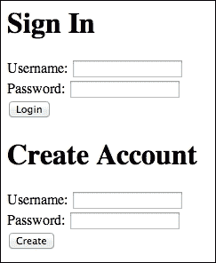
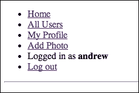
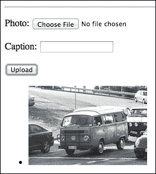
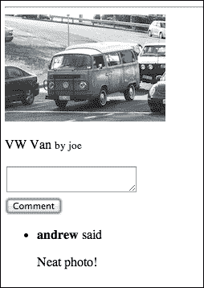

# 第二章：构建照片分享应用

你已经很好地理解了最基础的 Backbone 特性。我认为你已经准备好提升水平，构建一些更大、更复杂的东西。所以在本章中，我们将构建一个类似 Instagram 的克隆应用；用户将能够创建账户、上传照片、关注其他用户，并在照片上评论。我们将使用上一章中用到的许多特性，但也会探讨一些新的特性。我们将涵盖以下主题：

+   用户账户如何影响 Backbone 应用

+   编写自己的模型同步函数

+   模型的其他用途

+   通过 AJAX 上传文件

# 创建用户账户

我们将从上一章第一部分创建的应用模板开始。因此，在本书附带代码的下载中，找到 `template` 文件夹并复制它。当然，你需要安装必要的 Node.js 包；所以，在终端中运行 `npm install`。

与上一章中我们编写的应用相比，这个应用具有更重要的服务器组件；我们希望能够创建用户账户并允许用户登录和登出。实际上，这正是我们需要开始的。有一个非常棒的 Node.js 包叫做 Passport ([`passportjs.org/`](http://passportjs.org/))，它使得认证变得简单。我们将首先安装这个库，以及我们将用于加密用户密码的 `bcrypt` 包。使用以下命令进行操作：

```js
npm install passport --save
npm install passport-local --save
npm install bcrypt --save

```

`--save` 标志将把这些包添加到 `package.json` 文件中。

对于这些设置，有几十行代码，所以我们将它们放在一个单独的文件中。在项目文件夹中创建一个 `signin.js` 文件。第一步是引入我们需要的库：

```js
var bcrypt = require("bcrypt");
var LocalStrategy = require("passport-local").Strategy;
var salt = bcrypt.genSaltSync(10);
```

在 Passport 术语中，策略是一种认证方法。我们正在本地进行认证，而不是使用 Twitter 或 Facebook。当我们加密用户的密码时，将使用 `salt` 变量；在加密中，这是一个好习惯，以确保我们的用户密码安全存储。

接下来，我们将创建我们的 `strategy` 对象，如下所示：

```js
exports.strategy = function (db) {
  return new LocalStrategy(function (username, password, done) {
    db.findOne({ username: username }, function (err, user) {
      if (!user) {
        done(null, false, { message: "Incorrect username." });
      } else if(!bcrypt.compareSync(password,user.passwordHash)) {
        done(null, false, { message: "Incorrect password." });
      } else {
        done(null, user);
      }
    });
  });
};
```

首先，我们正在给一个 `exports` 对象赋值。这是一个可以从文件中导出的 Node.js 模块对象。当我们从 `server.js` 文件中引入这个文件时，`exports` 对象的任何属性都将成为 `require` 调用返回的对象的属性。

现在，关于这里的代码：这可能会让你觉得有些奇怪，但请稍等。我们无法直接创建 `strategy` 方法，因为我们需要在 `strategy` 对象内部使用数据库。因此，我们创建了一个函数，该函数将接受数据库并返回一个 `strategy` 对象。`strategy` 对象的构造函数接受一个执行认证的函数，该函数接受三个参数：用户名、密码和一个回调函数，我们称之为 `done`。

在函数内部，我们根据我们接收到的参数搜索数据库中的用户。在回调内部，我们首先检查用户是否存在；如果不存在，我们通过传递三个参数来调用`done`方法。第一个是发生的任何错误：这可以是`null`，因为没有错误。第二个是`false`；将是一个用户对象，但我们传递`false`，因为没有用户。最后一个参数是我们可以向用户显示的消息。

然而，如果我们确实找到了一个用户，我们需要匹配我们给出的密码。当我们开始在数据库中创建用户时，我们将使用`bcrypt`包将明文密码转换为哈希值，这样我们就不存储明文版本。然后，在这里，我们可以使用`bcrypt.compareSync`方法来比较结果；它接受我们正在比较的密码和从数据库中获取的用户对象的`user.passwordHash`属性。最后，如果比较没有失败，我们将通过在`done`方法中发送用户对象来验证用户。

这一开始可能很多，但开始认证很重要。我们还需要`serialize`和`deserialize`方法；这些将由 Passport 的会话功能使用，以在页面刷新期间保持用户对象可用。这些方法：

```js
exports.serialize = function (user, done) {
  done(null, user.id);
};

exports.deserialize = function (db) {
  return function (id, done) {
    db.findOne({ id: id }, function (user) {
      done(null, user);
    });
  };
};
```

`serialize`方法将只发送用户的 ID；在`deserialize`方法中，我们使用与`strategy`对象相同的技巧，因为我们需要在`deserialize`函数内部使用数据库。我们返回一个函数，它接受 ID，并将用户对象发送到`done`方法。

模块的一个最后部分；在创建用户账户时，我们需要将明文密码转换为哈希版本。为此，我们将使用`bcrypt.hashSync`方法：

```js
exports.hashPassword = function (password) {
  return bcrypt.hashSync(password, salt);
};
```

我们的功能将接受单个参数——明文密码——并将其哈希化。不要忘记将我们创建的`salt`对象作为`hashSync`方法的第二个参数传递。

现在，我们已经准备好进入`server.js`文件并开始那里的工作。我们首先引入 Passport 库和我们的`signin.js`文件，如下面的代码所示：

```js
var passport = require("passport");
var signin   = require("./signin");
```

如果你不太熟悉请求本地 Node.js 模块，我们可以直接将相对路径传递给`require`函数，就像你在这里看到的那样。我们不需要包含`.js`扩展名。

我们还需要创建我们将需要用于应用程序的数据库实例；我们这样做：

```js
var users = new Bourne("users.json");
var photos = new Bourne("photos.json");
var comments = new Bourne("comments.json");
```

接下来，我们需要设置我们放在`signin.js`文件中的护照功能。使用以下代码来完成这个任务：

```js
passport.use(signin.strategy(users));
passport.serializeUser(signin.serialize);
passport.deserializeUser(signin.deserialize(users));
```

我们将创建策略的函数传递给`passport.use`。然后，我们设置`serialize`和`deserialize`函数。注意，`strategy`和`deserialize`函数接受`users`数据库作为参数，并返回正确的函数。

下一步是为应用程序准备中间件。在我们的上一个应用程序中，我们不需要很多中间件，因为我们没有在服务器上做很多操作。但这次，我们必须管理用户的会话。所以，这就是我们有的：

```js
app.configure(function () {
  app.use(express.urlencoded());
  app.use(express.json());
  app.use(express.multipart());
  app.use(express.cookieParser());
  app.use(express.session({ secret: 'photo-application' }));
  app.use(passport.initialize());
  app.use(passport.session());
  app.use(express.static('public'));
});
```

所有额外的中间件组件——我们之前章节中没有使用的——都用于管理用户会话。实际上，Express 的大多数中间件都来自 Connect 库 ([`github.com/senchalabs/connect`](https://github.com/senchalabs/connect))；这里可能看起来我们添加了很多中间件组件，但事实是它们被分解成许多小块，这样你可以选择你需要的。你可以在 Connect 网站上了解更多关于每个单独组件的信息 ([`www.senchalabs.org/connect/`](http://www.senchalabs.org/connect/))，但以下是这个应用程序中我们没有使用过的中间件组件：

+   `urlencoded`: 此方法解析 `x-ww-form-urlencoded` 请求体，并将解析后的对象作为 `req.body` 提供

+   `multipart`: 此方法解析 `multipart/form-data` 请求体，并将解析后的对象作为 `req.body` 和 `req.files` 提供

+   `cookieParser`: 此方法解析 cookie 头部，并将数据作为 `req.cookies` 提供

+   `session`: 此方法使用给定选项设置会话存储

+   `passport.initialize`: 此方法设置 Passport

+   `passport.session`: 此方法使用 Passport 设置持久登录

现在这些组件都已就绪，我们可以开始编写一些路由了。我们将从与用户登录和登出具体相关的路由开始。以下是登录路由：

```js
app.get("/login", function (req, res) {
  res.render("login.ejs");
});
```

第一个很简单；在 `/login` 路由中，我们将渲染 `login.ejs` 模板。关于此文件内容的更多内容很快就会介绍。然而，你可能会猜到那个页面上将有一个表单。用户将输入他们的用户名和密码；当他们提交表单时，数据将回传到这个 URL。因此，我们需要在相同的 URL 上接受 POST 请求。所以，这里是有 `post` 方法版本：

```js
app.post('/login', passport.authenticate('local', {
  successRedirect: '/',
  failureRedirect: '/login'
}));
```

你会注意到这个路由有一些不同；我们并没有编写自己的函数。相反，我们调用 `passport.authenticate` 函数。如你之前所见，我们正在使用本地策略，所以这是第一个参数。之后，我们有一个包含两个属性的对象。它定义了用户根据是否认证将重定向到的路由。显然，如果用户成功登录，他们将被发送到根路由；否则，他们将被送回登录页面。`get` 方法在以下代码中给出：

```js
app.get("/logout", function (req, res) {
  req.logout();
  res.redirect('/');
});
```

这个也很简单：要登出，我们只需调用 Passport 添加到请求对象的 `logout` 方法，然后再次重定向到根路由。

现在，让我们处理 `login.ejs` 文件。这必须放在 `view` 文件夹中：

```js
<h1> Sign In </h1>
<form method="post" action="/login">
  <p>Username: <input name='username' type='text' /></p>
  <p>Password: <input name='password' type='password' /></p>
  <button> Login </button>
</form>
<h1> Create Account </h1>
<form method="post" action="/create">
  <p>Username: <input name='username' type='text' /></p>
  <p>Password: <input name='password' type='password' /></p>
  <button> Create </button>
</form>
```

我们这里有两组表单：一组用于登录，另一组用于创建用户。实际上，它们几乎完全相同，但它们将被提交到不同的路由。我们已经为第一个编写了路由，但我们还没有为新用户创建路由。那么，下一步是什么？

```js
app.post('/create', function (req, res, next) {
  var userAttrs = {
    username: req.body.username,
    passwordHash: signin.hashPassword(req.body.password),
    following: []
  };
  users.findOne({ username: userAttrs.username }, function (existingUser) {
    if (!existingUser) {
      users.insert(userAttrs, function (user) {
        req.login(user, function (err) {
          res.redirect("/");
        });
      });
    } else {
      res.redirect("/");
    }
  });
});
```

在这个路由的函数中，我们首先创建`userAttrs`对象。我们将从`req.body`对象中获取用户名和密码，确保使用`hashPassword`方法对密码进行散列。我们还将包括一个名为`following`的空数组；我们将在这个数组中存储他们关注的用户 ID 列表。

接下来，我们将搜索我们的数据库以查看是否有其他用户使用了那个用户名。如果没有，我们可以插入我们刚刚创建的用户属性对象。一旦我们存储了用户，我们可以通过使用 Passport 提供的`req.login`方法来设置会话。一旦他们登录，我们可以将他们重定向回根路由。

这样基本上就完成了我们的用户账户功能。我应该指出的是，我在生产应用中省略了一些重要的部分；例如，如果用户在登录时输入了错误的用户名或密码，或者尝试使用已存在的用户名创建用户账户，系统将不会显示任何有用的消息。用户只会被重定向回表单。当然，这以及其他重要的账户相关功能（如更改密码）也可以实现；但我们想专注于 Backbone 代码。这正是你在这里的原因，对吧？

正如我们所见，一旦用户登录，系统会将其重定向回根路由。实际上，我们还没有根路由的方法，所以现在让我们创建它，如下面的代码所示：

```js
app.get('/*', function (req, res) {
  if (!req.user) {
    res.redirect("/login");
    return;
  }
  res.render("index.ejs", {
    user: JSON.stringify(safe(req.user))
  });
});
```

实际上，这不仅仅是根路由；它将收集许多路由。第一步是检查`req.user`对象，以查看用户是否已登录。还记得我们编写的`deserialize`方法吗？Passport 将在幕后使用它来确保这个`req.user`对象正好是我们数据库中的记录。如果没有设置，我们将用户发送到`/login`路由。否则，事情可以继续。

目前，我们保持得很简单；我们只是渲染`index.ejs`模板。我们发送到那里的唯一数据是用户。我们已经知道为什么需要将其包裹在`JSON.stringify`中，但`safe`函数是什么？这是我们即将编写的：这里的想法是我们不希望将整个用户记录发送回浏览器；我们希望删除一些分类属性，例如`passwordHash`。以下是`safe`函数：

```js
function safe(user){
  var toHide = ['passwordHash'], clone = JSON.parse(JSON.stringify(user));

  toHide.forEach(function (prop) {
    delete clone[prop];
  });
  return clone;
}
```

这非常基础；我们有一个要删除的属性名称数组。我们首先克隆`user`参数。然后，我们遍历`toHide`变量，并在克隆上删除这些属性。最后，我们返回安全的`user`对象。

好吧，服务器端的代码真的开始整合了。我们终于准备好将注意力转向客户端代码。我们将从`index.ejs`文件开始。

# 创建我们的应用程序导航

我们已经从模板中得到了这个基本版本。然而，我们需要调整底部的脚本标签。在`backbone.js`标签之后，但在`app.js`标签之前，你想要添加以下行：

```js
<script>var USER = <%- user %>;</script>
```

这是当前登录用户的`user`对象。我们将在应用程序组件内部需要使用一些其属性，这就是为什么我们需要在`app.js`文件之前加载它。

说到`app.js`文件，这是我们下一个要关注的地方。这次，我们将从一个路由器开始：

```js
var AppRouter = Backbone.Router.extend({
  initialize: function (options) {
    this.main = options.main;
    this.navView = new NavView();
  },
  routes: {
    '': 'index'
  },
  index: function () {
    this.main.html(this.navView.render().el);
  }
});
```

这与我们的前一个应用程序中的路由器非常相似。我们将在应用程序内部使用任何选项——例如 DOM 元素、模型或集合——都将传递给路由器构造函数。正如你所见，我们已经为`main`元素（用户显示的所有内容的母元素）做好了准备。我们还将创建一个`navView`属性。你可能已经猜到了，这将显示一些导航；我们的应用程序将包含几个重要的链接，我们希望让用户能够轻松地浏览。我们将在下一个视图中编写这个。

### 注意

你可能会想知道为什么我们将`USER`设为一个全局变量而不是路由器的一个属性。毕竟，正如我们上次看到的，那些属性是来自服务器的数据，我们需要在浏览器上的视图中使用，对吧？实际上并没有什么理由不能这样做，但我更喜欢这种方式，因为我们的应用程序并不是真正关于操作用户记录的。虽然我们会有一个`User`类，但这只是为了方便。用户记录不会在客户端创建或修改。

在我们的`routes`对象中，我们正在设置我们的索引路由。现在，我们将在那个`index`方法中只渲染导航，但这是一个好的开始。

让我们编写导航视图。这是我们应用程序中最简单的视图，它是由以下代码创建的：

```js
var NavView = Backbone.View.extend({
  template: _.template($("#navView").html()),
  render: function () {
    this.el.innerHTML = this.template(USER);
    return this;
  }
});
```

这段代码是相当标准的视图代码。注意我们正在使用`USER`对象作为这个模板的数据。以下是模板内容，它将放在`index.ejs`文件中：

```js
<script type="text/template" id="navView">
  <ul>
    <li><a href="/">Home</a></li>
    <li><a href="/users">All Users</a></li>
    <li><a href="/users/{{id}}">My Profile</a></li>
    <li><a href="/upload">Add Photo</a></li>
    <li>Logged in as <strong>{{ username }}</strong></li>
    <li><a href="/logout">Log out</a></li>
  </ul>
  <hr />
</script>
```

我们已经有了足够的内容来尝试一下。在`index.ejs`文件中，确保我们通过以下代码创建并启动路由器：

```js
var r = new AppRouter({ 
  main: $("#main")
});
Backbone.history.start({ pushState: true });
```

启动服务器（`npm start`）并前往`http://localhost:3000`。你应该会看到以下截图：



在底部的表单中输入用户名和密码，然后创建一个新的用户账户。当你点击**创建**按钮时，你将被发送到一个类似于以下屏幕的页面：



太好了！一切都在按计划进行。

当你构建这个应用时，你会遇到一些令人烦恼的事情；每次你做出更改，`nodemon`都会重新启动服务器，并且保持你登录状态的会话将会消失。每次你都需要重新登录。为了解决这个问题，我在`server.js`文件的顶部添加了以下代码：

```js
var requser = {
  username: "andrew",
  id: 1
};
```

然后，在所有使用`req.user`的地方，使用`requser`代替。在这个地方进行搜索和替换很容易，并且它将使你在服务器刷新时保持登录状态。我将在接下来的代码片段中继续使用`req.user`。然而，这个便利的技巧并不完美。当我们到达关注其他用户的功能时，你必须删除这个`requser`变量，否则事情将不会变得有意义。

# 上传照片

接下来，让我们解决文件上传问题。这是一个照片分享网站，因此这是最重要的功能之一。让我们先创建一个用于上传表单的视图：

```js
var AddPhotoView = Backbone.View.extend({
  tagName: "form",
  initialize: function (options) {
    this.photos = options.photos;
  },
  template: _.template($("#addPhotoView").html()),
  events: {
    "click button": "uploadFile"
  },
  render: function () {
    this.el.innerHTML = this.template();
    return this;
  },
  uploadFile: function (evt) {
    evt.preventDefault();
    var photo = new Photo({
      file: $("#imageUpload")[0].files[0],
      caption: $("#imageCaption").val()
    });
    this.photos.create(photo, { wait: true });
    this.el.reset();
  }
});
```

我们从一个`initialize`函数开始，该函数将一个名为`photos`的属性分配给我们从`options`对象中获取的内容。这个`photos`对象实际上是一个集合，所以你可能想知道为什么我们不在`options`对象中将其称为`collection`；正如你所知，Backbone 会自动为我们处理这个分配。我们不这样做的原因是，这样可以使这个视图不是用于显示这个集合；它需要这个集合出于另一个原因（即，为了添加一个`Photo`模型实例）。你可以把这看作是语义问题，但我希望从 Backbone 惯例中的这一变化能让阅读代码的人停下来寻找原因。

`template`、`events`和`render`属性是自解释的。我们正在拉入的模板非常简单：一个接受文件和标题的小表单。这是模板的代码：

```js
<script type="text/template" id="addPhotoView">
  <p>Photo: <input type="file" id="imageUpload" /></p>
  <p>Caption: <input type="text" id="imageCaption" /></p>
  <button> Upload </button>
</script>
```

当按下那个按钮时，会调用`uploadFile`方法。在那里，我们将取消表单提交的默认行为，并使用数据创建一个`Photo`模型实例（即将推出）。`caption`属性很明显，但`file`属性稍微复杂一些。我们首先获取文件输入元素，然后获取名为`files`的数组属性中的第一个项目。这是我们通过 AJAX 上传文件所需的数据。然后，我们通过将其传递给集合的`create`方法来保存这个对象。你可能对`{ wait: true }`部分感到好奇。稍后我会解释这一点；当它有意义时，我会解释它。

最后，我们将清除表单，这样他们就可以上传另一张照片（如果他们想的话）。

在我们真正使这个功能工作之前，还有一些其他部分需要构建。最明显的是，我们需要照片模型和照片集合。在上一个应用中，我们的模型相当简单，但这个更复杂；这是模型类的代码：

```js
var Photo = Backbone.Model.extend({
  urlRoot: "/photos",
  sync: function (method, model, options) {
    var opts = {
      url: this.url(),
      success: function (data) {
        if (options.success) {
          options.success(data);
        }
      }
    };

    switch (method) {
      case "create":
        opts.type = "POST";
        opts.data = new FormData();
        opts.data.append("file", model.get('file'));
        opts.data.append("caption", model.get('caption'));
        opts.processData = false;
        opts.contentType = false;
        break;
      default:
        opts.type = "GET";
    }
    return $.ajax(opts);
  }
});
```

如你所知，`urlRoot` 对象是这个模型将在服务器上 GET 和 POST 的路由的基础，但这里的大问题是 `sync` 方法。通常，所有模型和集合都使用 `Backbone.sync` 方法。这是我们每次从服务器读取或写入一个或多个模型时都会调用的方法。如果我们需要做一些不同的操作，我们可以在模型级别重写这个方法，这正是这里的情况。Backbone 不支持开箱即用的 AJAX 文件上传，因此我们需要编写一个 `sync` 函数来完成这个任务。

这里的技巧是我们不能仅仅编写一个用于创建新照片记录的文件上传功能。这是因为这个方法是用于读取、更新和删除这个模型实例的方法。正如你所见，`sync` 方法接受三个参数：第一个是我们即将执行的操作（创建、读取、更新和删除），第二个是 `model` 实例，第三个是 `options` 对象。

由于我们将使用 jQuery 来执行 AJAX 调用，我们只需要设置我们自己的 `options` 对象。这就是我们开始的方式。当然，它需要一个 URL，所以我们调用这个模型类的 `url` 方法。我们还需要定义一个 `success` 回调。重要的是这个回调调用 `options` 对象的 `success` 方法；这个方法将处理一些幕后的重要操作。无论我们调用什么方法，这些属性都很重要。

然后，我们有一个 `switch` 语句；这是针对方法的不同之处。在 `create` 的情况下，我们希望将类型设置为 `POST`。我们将 `data` 属性设置为一个新的 `FormData` 实例；这是我们发送文件数据的方式。我们只是附加了放在模型上的 `file` 属性；我们也可以附加标题。

我们还需要设置 `processData` 和 `contentType` 为 `false`。这样，我们可以确保文件数据以我们期望的方式到达服务器，以便我们可以将其保存到文件中。

我们在这里也设置了一个默认情况，将类型设置为 GET。我们并没有为更新或删除操作准备这个方法，因为这不是我们正在构建的应用程序的一部分。如果我们需要这些功能，我们就必须扩展它。

最后，我们只需要通过使用 `$.ajax` 并传递我们的 `options` 对象来执行 AJAX 调用。

我们还需要一个 `Photos` 集合。目前，我们会保持简单。我们将使用以下代码创建它：

```js
var Photos = Backbone.Collection.extend({
  model: Photo
});
```

`sync` 方法允许我们将我们的图片发送到服务器，但我们还没有准备好处理传入数据的路由，所以这是我们下一个优先级：

```js
app.post("/photos", function (req, res) {
  var oldPath = req.files.file.path,
      publicPath = path.join("images", requser.id + "_" + (photos.data.length + 1) + ".jpg"),
      newPath = path.join(__dirname, "public", publicPath);

  fs.rename(oldPath, newPath, function (err) {
    if (!err) {
      photos.insert({
        userId: requser.id,
        path: "/" + publicPath,
        caption: req.body.caption,
        username: requser.username
      }, function (photo) {
        res.send(photo);
      });
    } else {
      res.send(err);
    }
  });
});
```

正如你所见，我们正在向 `/photos` 发送数据。由于这个函数将要存储一个需要从浏览器中可查看的图片，我们需要将其放在 `public` 文件夹中。请创建一个名为 `images` 的文件夹在 `public` 文件夹内，这是我们将会放置图片的地方。

我们从几个路径开始。首先，有`oldPath`；这是请求时文件临时存储的路径。然后是`publicPath`：这是我们将在浏览器中查看照片的路径；它只是`images`加上文件名。我们将根据用户的 ID 和数据库中照片的数量给图片一个唯一的名称。第三，是`newPath`，这是我们将在当前位置相对存储图片的地方。

要在 Node.js 中处理此类文件，我们需要使用文件系统模块，所以请将以下行添加到文件顶部：

```js
var fs = require("fs");
```

然后，我们可以使用`rename`方法移动文件。如果一切顺利，没有错误，我们可以在`photos`数据库中存储这张图片的记录。请注意，我们不是存储`file`属性，而是只存储`path`属性。一旦我们将这个对象发送回浏览器，它将替换我们之前有的属性。一旦我们存储了照片，我们将它作为确认操作已完成的消息发送回浏览器。

接下来，回到`app.js`文件中的客户端代码。我们需要一个路由来访问上传表单。如果你回顾我们的导航视图，你会看到我们想要创建的路由是`/upload`。你可以在`AppRouter`中的`routes`对象中添加以下行：

```js
'upload': 'upload',
```

然后，让我们通过以下方式创建`upload`函数：

```js
upload: function () {
  var apv = new AddPhotoView({ photos: this.userPhotos }),
    photosView = new PhotosView({ collection: this.userPhotos });
  this.main.html(this.navView.render().el);
  this.main.append(apv.render().el);
  this.main.append(photosView.render().el);
}
```

我们实际上在这里做的比你预想的要多一些；我们正在渲染第二个视图：一个`PhotosView`实例。不过在我们到达那里之前，请注意我们正在使用一个`userPhotos`属性；我们必须将其添加到路由器中。在`AppRouter`类的`initialize`函数中添加以下行：

```js
this.userPhotos = options.userPhotos;
```

这使我们能够访问我们传递给路由器的任何`userPhotos`集合。然后，在`index.ejs`文件中，我们实例化路由器时，这一行将创建该集合：

```js
userPhotos: new Photos()
```

好的，现在我们创建`PhotosView`类：

```js
var PhotosView = Backbone.View.extend({
  tagName: 'ul',
  template: _.template($("#photosView").html()),
  initialize: function () {
    this.collection.on("add", this.addPhoto, this);
  },
  render: function () {
    this.collection.forEach(this.addPhoto, this);
      return this;
  },
  addPhoto: function (photo) {
    this.$el.append(this.template(photo.toJSON()));
  }
});
```

这是`PhotosView`类。请注意，我们将`tagName`属性设置为`ul`；然后，在`render`函数内部，我们只是遍历集合并调用`addPhoto`函数，该函数渲染模板并将结果放入列表中。这次，我们不是使用`template`函数来渲染整个视图，而是使用它来渲染集合中的每个模型。此外，请注意，在`initialize`函数中，我们正在监听每当新照片被添加到集合时，我们可以将它们添加到列表中。现在是时候回忆一下我们在创建`create`调用时添加的`{ wait: true }`选项。当我们告诉 Backbone 这样等待时，它不会在模型从服务器收到回复之前触发这个`add`事件。在这种情况下，这是很重要的，因为我们否则将没有我们图像的公开路径。这个类的最后一部分是模板；当然，以下代码应该放在`index.ejs`文件中：

```js
<script type="text/template" id="photosView">
  <a href="/photo/{{id}}"></a>
</script>
```

现在应该都准备好了！你可以访问`http://localhost:3000/upload`，选择一个文件，输入一个标题，然后点击**上传**按钮。文件将被上传，你会在表单下方看到它。恭喜！你刚刚上传了你的第一张照片。以下截图显示了照片可能的样子：



### 注意

在构建这个应用程序时，我使用了来自[`unsplash.com`](http://unsplash.com)的照片；这是一个免费高分辨率照片的绝佳来源。

# 从服务器发送照片到客户端

在我们开始处理另一个特定页面之前，我们需要一个从服务器获取照片的路由。这些照片需要放入`Photos`集合中，但如果你稍微思考一下，你会意识到我们可能会得到几组不同的照片。例如，我们可以获取一个用户的全部照片，或者获取当前用户关注的用户的全部照片。所以，深呼吸，这里是那个路由的代码：

```js
app.get(/\/photos(\/)?([\w\/]+)?/, function (req, res) {
  var getting = req.params[1],
      match;

  if (getting) {
    if (!isNaN(parseInt(getting, 10))) {
      photos.findOne({ id: parseInt(getting, 10) },
        function (photo) { res.json(photo); });
    } else {
      match = getting.match(/user\/(\d+)?/);
      if (match) {
        photos.find({ userId: parseInt(match[1], 10) }, 
          function (photos) { res.json(photos); });
      } else if (getting === "following") {
        var allPhotos = [];
        req.user.following.forEach(function (f) {
          photos.find({ userId: f }, function (photos) {
            allPhotos = allPhotos.concat(photos);
          });
        });
        res.json(allPhotos);
      } else {
        res.json({});
      }
    }
  } else {
    res.json({});
  }
});
```

是的，这是一个难题。让我们从路由开始；我们使用一个正则表达式来匹配我们想要捕获的路由，而不是字符串。这个正则表达式几乎匹配以`/photos`开头的任何内容。我们感兴趣的以下模式是：

+   `/photos/11`：ID 为 11 的照片

+   `/photos/following`：登录用户关注的所有用户的照片

+   `/photos/user/2`：ID 为 2 的用户的照片

路由的捕获组被放入`req.params`中，所以`req.params[1]`是第二个捕获组。我们将它放入`getting`变量中，然后我们必须进一步检查。假设它存在，我们首先检查它是否是一个数字（通过解析它并通过`isNaN`传递它）。如果是数字，这是最简单的情况，我们找到具有该 ID 的照片并将其发送回去。

如果它不是一个数字，我们将`getting`变量与另一个正则表达式进行匹配，以查看它是否匹配`user/ID`。如果是，我们将返回所有匹配`userId`的照片。

最后，如果`getting`变量是字符串`following`，我们将遍历当前用户的`following`数组，并从每个这些用户那里获取照片，将他们的照片推入`allPhotos`数组，然后我们将其返回。

在任何时刻，如果我们遇到我们没有预料到的模式，我们只需返回一个空的 JSON 对象。

# 创建个人资料页面

现在我们有了这个路由可用，我们可以做更多的事情。比如个人资料页面？如果你再次查看导航视图，你会看到我们创建了一个**我的个人资料**链接，它带我们到`/users/1`（或你的 ID 号码）。当然，这意味着我们可以用它来做的不仅仅是我们的个人资料页面。如果我们使代码足够通用，它将适用于任何用户。

首先，我们需要一种从服务器获取用户数据的方式（记住，这可能不是登录用户的个人资料）。我们将通过以下代码使用一个模型来完成这项工作：

```js
var User = Backbone.Model.extend({
  url: function () {
    return '/user-' + this.get('id') + '.json';
  }
});
```

URL 与我们通常的做法不同，但它展示了 Backbone 的灵活性；我们可以使 URL 看起来像指向 JSON 文件的路径。当然，如果我们需要向这个 URL 发送数据以保存用户（尤其是因为模型通常在保存之前没有 ID），这就不会那么好了。然而，既然我知道我们不需要这样做，我们可以玩这个，并这样去做。正如你可能想象的那样，服务器端代码非常简单，如下面的代码所示：

```js
app.get("/user-:id.json", function (req, res) {
  users.findOne({ id : parseInt(req.params.id, 10) }, 
    function (user) {
      res.json(safe(user));
    });
});
```

现在，我们可以获取用户了，让我们通过以下代码将个人资料页面路由添加到路由器中：

```js
'users/:id': 'showUser',
```

现在，将以下方法添加到路由器中：

```js
showUser: function (id) {
  var thiz = this,
      user,
      photos;

  id = parseInt(id, 10);

  function render() {
    var userView = new UserView({ 
      model: user.toJSON(), 
      collection: photos 
    });
    thiz.main.html(thiz.navView.render().el);
    thiz.main.append(userView.render().el);
  }

  if (id === USER.id) {
    user = new User(USER);
    photos = this.userPhotos;
    render();
  } else {
    user = new User({ id: id });
    photos = new Photos({ url: "/photos/user/" + id });
    user.fetch().then(function () {
      photos.fetch().then(render);
    });
  }
},
```

再次，让我们做一些不同的事情。这里的情况是：如果用户正在查看自己的页面，就没有必要再次从服务器获取他们的用户和照片数据；我们可以使用浏览器中已有的数据。为了查看用户是否正在查看自己的个人资料，我们比较路由中的 ID（作为参数获取）和`USER`对象上的 ID。如果用户正在查看另一个用户的个人资料，我们创建一个用户模型和照片集合，只包含足够的数据：模型只需要`id`，集合只需要`url`。然后，我们可以让他们两者都从服务器获取所需的其他数据。在这两种情况下，`fetch`方法返回一个 jQuery 延迟对象。如果你不熟悉 JavaScript 中的延迟或承诺，可以将它们视为等待数据准备的一种方式；我们调用延迟的`then`方法，传递一个在数据准备就绪时调用的函数。我们将在后面的章节中更多地使用承诺。

等等，我们能否直接将 URL 传递给一个集合对象？通常不行。我们需要在我们的`Photos`集合类中添加一个`initialize`方法，如下所示：

```js
initialize: function (options) {
  if (options && options.url) {
    this.url = options.url;
  }
}
```

很聪明，对吧？这样，我们可以使用我们想要的任何 URL。这就是为什么我们为这个类创建了 URL 灵活的后端。

在这两种情况下，我们随后调用我们的内部`render`方法。关于这个函数有一些需要注意的地方。尽管它位于我们的路由方法内部，但它仍然会在全局命名空间中运行；这就是为什么我们创建`thiz`变量，以便在`render`函数中使用。当然，在一种情况下我们按程序调用它，在另一种情况下我们作为回调调用它，但将完成相同的事情；我们将渲染`UserView`实例。以下是该类的代码：

```js
var UserView = Backbone.View.extend({
  template: _.template($("#userView").html()),
  render: function () {
    this.el.innerHTML = this.template(this.model.toJSON());
    var ul = this.$("ul");
    this.collection.forEach(function (photo) {
      ul.append(new PhotoView({ 
        model: photo 
      }).render().el);
    });
    return this;
  }
});
```

非常简单；它只是一个用户名和你的照片列表。我们甚至可以重用我们之前制作的`PhotoView`类来显示单个照片。注意我们使用`this.$`方法；它允许我们在元素内部搜索并创建这些元素的 jQuery 对象，但它将搜索限制在这个视图实例的`el`属性内部。最后，这是模板：

```js
<script type="text/template" id="userView">
  <h1>{{username}}</h1>
  <ul></ul>
</script>
```

如果你尝试运行它，你可能会注意到一个问题；在查看当前用户的个人资料时，将不会显示任何照片。这是因为我们正在使用路由器的`userPhotos`属性，它只是一个空的集合。当我们加载页面时，我们也应该加载用户的照片数据。这并不难做。首先，回到你的`server.js`文件中，在`/*`路由函数中，将`res.render`调用替换为以下代码：

```js
photos.find({ userId: req.user.id }, function (err, photos) {
  res.render("index.ejs", {
    user: JSON.stringify(safe(req.user)),
    userPhotos: JSON.stringify(photos)
  });
});
```

然后，在`index.ejs`文件中，使用你的模板定界符将其放置在路由实例化的位置：

```js
userPhotos: new Photos(<%- userPhotos %>)
```

现在，你应该能在你的个人资料页面上看到你自己的照片，因为我们是从服务器加载照片。

# 创建个人照片页面

我们现在已经使用了两次`PhotoView`类；它创建了一个链接，你可能还记得，为每个照片创建一个单独的页面。让我们创建这个页面。这次，我们从路由开始。首先，将此路由添加到`routes`属性：

```js
'photo/:id': 'showPhoto',
```

然后，这里有一个`showPhoto`方法与之相关联：

```js
showPhoto: function (id) {
  var thiz = this,
    photo = new Photo({ id : parseInt(id, 10) });

  photo.fetch().then(function () {
    var comments = new Comments({ photo: photo }),
    var photoView = new PhotoPageView({ 
      model: photo, 
      collection: comments 
    });

    comments.fetch().then(function () {
      thiz.main.html(thiz.navView.render().el);
      thiz.main.append(photoView.render().el);
    });
  });
},
```

正如我们处理`showUser`函数一样，我们通过创建一个带有`id`的`Photo`实例来获取照片数据，然后调用`fetch`方法。然而，我们还在这个照片的基础上创建了一个`Comments`集合。然后，我们创建一个`PhotoPageView`实例，它既有模型（照片）又有集合（评论）。一旦我们从服务器获取了评论，我们就渲染它。所以这里是视图：

```js
var PhotoPageView = Backbone.View.extend({
  template: _.template($("#photoPageView").html()),
  initialize: function () {
    this.collection.on("add", this.showComment, this);
  },
  events: {
    'click button': 'addComment'
  },
  render: function () {
    this.el.innerHTML = this.template(this.model.toJSON());
    this.collection.forEach(this.showComment.bind(this));
    return this;
  }
});
```

如你所能猜到的，这并不是全部。在`initialize`函数中，我们设置了一个事件，每当集合中添加了新的评论时，就会调用`showComment`方法。这也是我们在`render`方法中使用的方法，用于显示已存在的每个评论。然后，我们有一个事件：一个按钮点击事件，触发`addComment`方法。在我们到达这些方法之前，你可能还想看看按钮以及模板的其余部分；以下是模板的代码，你应该将其添加到`index.ejs`文件中：

```js
<script type="text/template" id="photoPageView">
  
  <p> {{caption}} <small> by {{username}}</small></p>
  <div>
    <textarea id="commentText"></textarea><br />
    <button> Comment </button>
  </div>
  <ul></ul>
</script>
```

那么，我们现在就添加这些方法，好吗？我们先处理较长的那个。以下是为`addComment`函数编写的代码：

```js
addComment: function () {
  var textarea = this.$("#commentText"),
      text = textarea.val(),
      comment = {
        text: text,
        photoId: this.model.get("id"),
        username: USER.username
      };
  textarea.val("");
  this.collection.create(comment);
},
```

这与我们的`AddPhotoView`类中的`addPhoto`方法非常相似。我们创建一个包含文本框中的文本、我们评论的相片的 ID 和评论者用户名的属性对象。然后，我们通过集合的`create`方法将它们发送到服务器。

当我们这样做时，我们的`add`事件将被触发，并且会调用`showComment`方法。以下是该方法：

```js
showComment: function (comment) {
  var commentView = new CommentView({ model: comment });
  this.$("ul").append(commentView.render().el);
}
```

再次强调，魔法在其他地方。你想要看到的是以下代码中显示的`CommentView`实例：

```js
var CommentView = Backbone.View.extend({
  tagName: "li",
  template: _.template($("#commentView").html()),
  render: function () {
    this.el.innerHTML = this.template(this.model.toJSON());
    return this;
  }
});
```

它非常简单；甚至它的模板也很简单。它的模板代码如下：

```js
<script type="text/template" id="commentView">
  <p><strong>{{username}}</strong> said</p>
  <p>{{text}}</p>
</script>
```

在所有这些过程中，我们太兴奋了，完全忽略了一个重要的因素：我们还没有`Comment`模型或`Comments`集合。不用担心。我们通过以下代码创建这些：

```js
var Comment = Backbone.Model.extend();
var Comments = Backbone.Collection.extend({
  model: Comment,
  initialize: function (options) {
    this.photo = options.photo;
  },
  url: function () {
    return this.photo.url() + '/comments';
  }
});
```

注意`Comments`集合的`url`函数。它接受分配为属性的相实例的`url`，并在末尾追加`/comments`。因此，在我们的`server.js`文件中，我们需要为这个路由创建 GET 和 POST 方法，如下面的代码所示：

```js
app.get('/photos/:id/comments', function (req, res) {
  comments.find({ photoId: parseInt(req.params.id, 10) }, 
    function (comments) {
      res.json(comments);
    });
});
```

GET 路由将返回所有具有`photoId`属性与 URL 参数匹配的照片。以下是 POST 路由：

```js
app.post('/photos/:id/comments', function (req, res) {
  var comment = {
    text: req.body.text,
    photoId: req.body.photoId,
    username: req.body.username
  };
  comments.insert(comment, function (data) {
    res.json(data);
  });
});
```

此路由将获取属性，创建一个对象，将其存储在`comments`数据库中，并以 JSON 格式返回保存的版本。

评论功能到此结束！你应该能够访问单个照片页面，输入评论，点击按钮，然后看到你的评论出现在下方。更好的是，当你刷新页面时，评论仍然会保留。下面的截图显示了它可能的样子：



# 关注用户

这引出了我们应用程序中最复杂的功能：关注其他用户。我们希望用户能够选择他们想要关注的用户，并且这些用户的照片能够显示在主页上。

我们将从`/users`路由开始。将以下行添加到路由器的`routes`对象中：

```js
'users': 'showUsers',
```

现在，让我们创建`showUsers`函数：

```js
showUsers: function () {
  var users = new Users(),
      thiz  = this;
  this.main.html(this.navView.render().el);
  users.fetch().then(function () {
    thiz.main.append(new UserListView({ 
      collection: users 
    }).render().el);
  });
},
```

我们还没有`Users`集合类；这是下一步。然而，您可以看到我们将在这里获取所有用户，然后渲染一个`UserListView`实例。

`Users`集合非常直接，如下面的代码所示：

```js
var Users = Backbone.Collection.extend({
  model: User,
  url: '/users.json'
});
```

此外，我们还需要在服务器端设置相应的部分，如下面的代码所示：

```js
app.get("/users.json", function (req, res) {
  users.find(function (users) {
    res.json(users.map(safe));
  });
});
```

现在，我们可以查看`UserListView`实例。实际上，它也是我们的包装视图之一，只是用来组合一系列单个模型视图，如下面的代码所示：

```js
var UserListView = Backbone.View.extend({
  tagName: "ul",
  render: function () {
    this.collection.forEach(function (model) {
      this.$el.append((new UserListItemView({ 
        model: model 
      })).render().el);
    }, this);
    return this;
  }
});
```

如您从这段代码中可以看到的，我们真正感兴趣的是`UserListItemView`实例。这可能是您今天（或至少在这一章中）看到的最大视图。我们将逐部分分析，如下面的代码所示：

```js
var UserListItemView = Backbone.View.extend({
  tagName: "li",
  template: _.template('<a href="/users/{{id}}">{{username}}</a>'),
  events: {
    'click .follow': 'follow',
    'click .unfollow': 'unfollow'
  },
  render: function () {
    this.el.innerHTML = this.template(this.model.toJSON());
    if (USER.username === this.model.get("username")) {
      this.$el.append(" (me)");
    } else {
      this.update();
    }
    return this;
  }
});
```

这只是一个开始。正如您从事件中可以看到的，我们将有关注和取消关注按钮，它们将触发相应的方法。`render`函数首先渲染模板，我们将将其内联，因为它很小。

渲染之后还会发生更多有趣的事情。首先，我们检查我们正在为创建列表项的用户是否是当前登录用户；如果是，我们将在其末尾添加文本`(me)`。否则，我们将调用`update`方法。

`update`方法实际上非常基础。它的目标是检查当前用户是否正在关注我们为列表项创建的用户。如果他们已经关注了该用户，我们将添加一个**取消关注**按钮；否则，我们将使用**关注**按钮。当点击这些按钮之一时，此方法也会被调用，因此我们将在适当的时候移除按钮：

```js
update: function () {
  if (USER.following.indexOf(this.model.get("id")) === -1) {
    this.$("#unfollow").remove();
    this.$el.append("<button id='follow'> Follow </button>");
  } else {
    this.$("#follow").remove();
    this.$el.append("<button id='unfollow'> Unfollow </button>");
  }
}
```

实际上很简单。如果视图的用户 ID 在当前用户的 `following` 数组中，我们就移除一个 **取消关注** 按钮，并添加一个 **关注** 按钮。否则，我们移除 **关注** 按钮，并添加一个 **取消关注** 按钮。在这个时候，我们可以加载 `/users` 页面，我们将有一个带有关注按钮的用户列表。然而，点击它们不会做任何事情。我们需要编写那些 `follow` 和 `unfollow` 函数（在 `UserListItemView` 类中）。

这两个函数几乎完全相同，如下面的代码所示：

```js
follow: function (evt) {
  var thiz = this,
    f = new Follow({ userId: thiz.model.id });
  f.save().then(function (user) {
    USER.following = user.following;
    thiz.update();
  });
},
unfollow: function (evt) {
  var thiz = this,
    f = new Follow({ id: thiz.model.id });
  f.destroy().then(function (user) {
    USER.following = user.following;
    thiz.update();
  });
},
```

在这两种情况下，我们创建一个新的 `Follow` 模型实例。当目标是保存 `following` 数组时，我们设置 `userId` 属性；当目标是删除 `following` 数组时，我们设置 `id` 属性。在 `follow` 函数的情况下，我们保存该模型；在服务器端，这将把用户添加到当前用户的 `following` 数组中。在 `unfollow` 函数的情况下，我们删除模型；在服务器端，这将从 `following` 数组中移除用户。同样，在这两种情况下，调用服务器的那个方法将返回一个延迟对象。我们将传递 `then` 方法，这是一个函数，它将使用来自服务器的 `following` 数组重置 `USER` 对象上的 `following` 数组。在这两种情况下，我们随后将调用 `update` 方法来修正按钮。

最后一步是创建 `Follow` 模型。实际上，我们在这里不需要使用 Backbone 模型；我们只需要两个 AJAX 请求。然而，我们可以通过使用模型类来巧妙地完成所有艰苦的工作。以下是为 `Follow` 模型编写的代码：

```js
var Follow = Backbone.Model.extend({
  urlRoot: '/follow'
});
```

实际上就是这样。我们可以以两种方式使用这个类。如果我们给一个 `Follow` 实例一个 `userId` 属性，我们就可以调用 `save` 方法将其 POST 到 `/follow`。或者，如果我们创建一个带有 `id` 属性的 `Follow` 实例，我们可以调用 `destroy` 方法发送一个 DELETE 请求到 `/follow/id`。

在服务器端，事情要复杂一些。首先，让我们看看 POST 路由：

```js
app.post("/follow", function (req, res) {
  var id = parseInt(req.body.userId, 10);
  if (req.user.following.indexOf(id) === -1) {
    req.user.following.push(id);
    users.update({ id: req.user.id }, req.user, function (err, users) {
      res.json(safe(users[0]));
    });
  } else {
    res.json(safe(req.user));
  }
});
```

我们首先找出 ID 是否在用户的 `following` 列表中。如果不是，我们将将其推入数组，并更新数据库中的用户记录。然后，我们将发送回更新的用户记录。即使用户已经关注了所选用户，我们也会发送用户数据回。

DELETE 路由与 POST 路由类似：

```js
app.delete("/follow/:id", function (req, res) {
  var id = parseInt(req.params.id, 10),
    index = req.user.following.indexOf(id);
  if (index !== -1) {
    req.user.following.splice(index, 1);
    users.update({ id: req.user.id }, req.user, function (err, users) {
      res.json(safe(users[0]));
    });
  } else {
    res.json(safe(req.user));
  }
});
```

如果当前用户正在关注此用户，我们将使用 JavaScript 的 `splice` 方法从数组中移除项目（此方法会修改数组，所以我们不会将其重新分配给 `req.user.following`）。然后，我们将更新数据库中的用户记录，并将更新的用户作为 JSON 发送回（我们发送 `users[0]` 因为 `update` 函数给 `callback` 函数一个数组，但在这个情况下，该数组应该只有一个记录）。

现在一切就绪，我们的 `/users` 路由将会有工作的关注/取消关注按钮。我们可以关注几个其他用户。

# 显示关注用户的照片

我们该如何处理关注的用户？我们想在主页上显示关注用户的照片。首先，在 `server.js` 文件中，我们需要能够获取当前用户关注的所有用户的照片。我们将为此编写一个单独的函数：

```js
function followingPhotos(user, callback) {
  var allPhotos = [];
  user.following.forEach(function (f) {
    photos.find({ userId: f }, function (err, photos) {
      allPhotos = allPhotos.concat(photos);
    });
  });
  callback(allPhotos);
}
```

这看起来熟悉吗？它与我们在照片获取路由中的一些代码几乎完全相同，你知道的，那个正则表达式路由。由于我们将此代码放入了一个函数中，因此你可以替换该函数中相应的行，使其看起来如下所示：

```js
} else if (getting === "following") {
 followingPhotos(req.user, function (allPhotos) {
 res.json(allPhotos);
 });
} else {
```

服务器端的最后一步是将这些关注者的照片发送到客户端，我们将在主页上显示它们。让我们用我们刚刚编写的函数包裹之前的 `res.render` 调用：

```js
followingPhotos(req.user, function (followingPhotos) {
  photos.find({ userId: req.user.id }, function (photos) {
    res.render("index.ejs", {
      user: JSON.stringify(safe(req.user)),
      userPhotos: JSON.stringify(photos),
 followingPhotos: JSON.stringify(followingPhotos)
    });
  });
});

```

现在，在 `index.ejs` 文件中，我们可以将 `followingPhotos` 添加到我们的路由器选项对象中：

```js
followingPhotos: new Photos(<%- followingPhotos %>)
```

我们必须在 `AppRouter` 类中使用该属性，所以请将以下行添加到 `initialize` 方法中：

```js
this.followingPhotos = options.followingPhotos;
```

最后一步是将此代码用于路由器的 `index` 方法；现在该方法的整体结构应如下所示：

```js
index: function () {
 var photosView = new PhotosView({ 
 collection: this.followingPhotos 
 });
  this.main.html(this.navView.render().el);
 this.main.append(photosView.render().el);
},
```

现在，如果你访问主页，你将能够看到你关注的用户的照片！太棒了！

# 摘要

在本章中，我们已经覆盖了很多内容，所以在继续之前，让我们回顾一下我们的步骤。

我希望你们从本章中带走的最重要的事情之一是数据是如何从服务器发送到客户端的。在这里，我们使用了两种不同的方法：首先，我们使用服务器端模板将它们放入 HTML 响应中，并作为响应的一部分发送。其次，我们使用客户端的 `fetch` 命令，为这些数据创建一个完全独立的 HTTP 请求。第一种方法的优势是，单个“数据块”没有自己的 HTTP 头；而且，由于它们是初始请求的一部分，用户在使用应用程序时永远不会等待数据。第二种方法的优势是我们永远不会从服务器加载比所需更多的数据；当我们需要时，请求它很容易。这对于像这样的应用程序尤为重要，因为单个用户可能随着时间的推移发布数百张照片，人们可能会关注很多用户；你不想一开始就加载所有数据。我们在这里混合使用，这样你就可以了解两种方法是如何工作的。

然而，你应该注意，这种混合使用实际上导致我们在大多数情况下加载了比必要更多的数据。这是因为我们在不使用这些数据的情况下（例如，在用户的列表页面上）也会加载当前用户的照片和他们关注的照片。我们实际上编写了所有的骨干代码，以便我们可以覆盖默认的锚点标签行为，并使用路由器的`navigate`方法导航整个应用程序；不需要页面刷新。这可能是一个很好的练习：尝试实现使用骨干导航而不是刷新页面的功能。如果你卡住了，请回顾上一章的代码。

除了数据加载技术之外，我们发现骨干模型和集合类实际上非常灵活，可以以“非传统”的方式使用。我希望你发现，当你从骨干中去除魔法，并确切了解它在做什么时，你可以更有效地使用它。这些想法在我们下一章构建实时数据仪表板时将非常有用。
