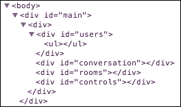
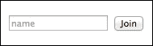
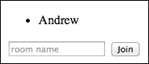
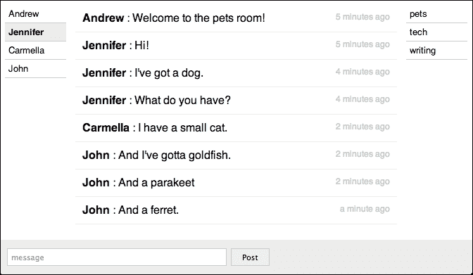

# 第五章：构建聊天应用

到目前为止，我们构建的所有应用都使用了普通的 Backbone。这并不是说我们没有使用辅助库，而是我们还没有使用任何扩展 Backbone 自身的库。然而，这样的库确实存在；Backbone GitHub 维基上有一个完整的列表（[`github.com/jashkenas/backbone/wiki/Extensions%2C-Plugins%2C-Resources`](https://github.com/jashkenas/backbone/wiki/Extensions%2C-Plugins%2C-Resources)）。在本章中，我们将使用这些库之一来简化构建这个应用的过程。

我们将关注以下想法：

+   使用第三方库使大型应用更容易处理

+   在服务器和客户端之间进行实时通信

# 概述应用

在我们开始之前，让我们明确我们要构建的内容。它将是一个在线聊天应用；用户将访问网站，选择一个昵称，选择一个房间，然后与其他房间成员聊天。这里不会有真实的用户账户；你可以通过简单地提供一个名字加入，有点像更简单的 IRC 版本。如果其他人正在使用那个名字，你必须选择另一个。用户还可以创建新的房间。

在本章中，我们将使用一些新的工具：Socket.IO 和 Marionette。**Socket.IO** ([`socket.io`](http://socket.io)) 是一个实时通信库，它允许客户端快速且容易地与服务器通信。将其视为客户端和服务器之间的发布和订阅系统（类似于 Backbone 的 `trigger` 和 `listenTo` 方法）；你可以在维基百科上了解更多关于这种设计模式的信息（[`en.wikipedia.org/wiki/Publish_and_subscribe`](https://en.wikipedia.org/wiki/Publish_and_subscribe)）。我们将使用这个库来使我们的聊天应用实时功能更容易编写。

然而，**Marionette** ([`marionettejs.com`](http://marionettejs.com)) 则更有趣。它将自己定位为 Backbone.js 的复合应用库，旨在简化大型 JavaScript 应用的构建。这个想法是；正如你可能从所有前面的章节中注意到的，我们在 Backbone 应用中编写的很多代码在每个应用中都是重复的。例如，我们既有模型视图也有集合视图。通常，集合视图会遍历集合中的模型，并为每个模型渲染一个视图，将它们放入一个容器元素中。由于这是一个常见的模式，Marionette 为我们封装了所有这些，并允许我们只写几行代码就能完成所有这些。然而，Marionette 还提供了其他一些工具，使管理大型应用变得更容易。在本章中，我们将探讨其中的一些。

# 设置应用

我们必须从一点服务器端代码开始这个应用程序。我们将使用 Express 作为我们的主要服务器；然而，我们还想使用 Socket.IO，因此我们必须设置它。将模板复制以启动新项目。然后，在项目目录中，继续安装所有我们的包，然后使用 npm 安装 Socket.IO，如下所示：

```js
npm install
npm install socket.io --save

```

现在，为了使 Express 和 Socket.IO 顺利协作，我们需要在 `server.js` 文件中做一些不同的操作。首先，我们需要引入 Node.js 的 `http` 库和 `socket.io`。以下是方法：

```js
var http = require('http');
var socketio = require('socket.io');
```

然后，我们必须将我们的 Express 应用程序（`app` 对象）封装在 Node.js 服务器对象中，如下所示：

```js
var server = http.createServer(app);
```

现在我们有了服务器。要使用 Socket.IO 使一切正常工作，最后一步是创建一个监听我们服务器的 Socket.IO 实例。我们这样做：

```js
var io = socketio.listen(server);
```

目前在 `server.js` 文件中，你将看到调用 `app.listen` 函数的代码。然而，由于我们现在正在将 Express 应用封装在 Node.js 服务器对象中，我们需要在那个对象上调用 `listen`。因此，请移除 `app.listen` 调用，并用以下代码替换：

```js
server.listen(3000);
```

到目前为止，你应该能够启动服务器（`npm start`），然后访问 `http://localhost:3000` 并看到我们的空白页面。

# 准备我们的模板

下一步将带我们进入 `views/index.ejs` 文件。Marionette 当然是一个客户端库，但 Socket.IO 也有一个客户端组件；因此，我们需要为它们两个都添加脚本标签。将这些标签放在 `backbone.js` 标签的下方：

```js
<script src="img/backbone.marionette.js"></script>
<script src="img/socket.io.js"></script>
```

即使我们没有在 `socket.io.js` 中放置任何内容，Socket.IO 在后端也会将正确的文件发送到那个路由。然而，我们确实需要下载 Marionette。如果你访问 Marionette 下载页面（[`marionettejs.com/#download`](http://marionettejs.com/#download)），你会看到有几个版本可供选择。Marionette 库使用两个主要组件：`Backbone.Wreqr` 和 `Backbone.BabySitter`（这两个组件都是由制作 Marionette 的同一群好人构建的）。你可以单独下载 Wreqr、BabySitter 和 Marionette，或者将它们捆绑在一起。确保你下载捆绑版本并将其放置在 `public` 目录中。

此外，我们将把我们的应用程序拆分成许多更小的部分，并将它们放在各自的文件中，类似于我们在前两章中所做的那样。对于我们创建的每个文件，你都会想要在 `views/index.ejs` 文件中为其添加一个脚本标签。在这种情况下，顺序很重要，我们将会看到为什么顺序很重要以及如何正确排序它们。

# 关于 Socket.IO 的一些话

Socket.IO 使得在服务器和客户端之间发送和接收数据变得非常容易。正如我们所见，这是 Backbone 最重要的一部分；将我们的模型发送到服务器和从服务器接收。相对而言，用 Socket.IO 替换 `Backbone.sync` 函数（如我们在第二章 Building a Photo-sharing Application 中所述）会更容易一些。例如，我们可能会做如下所示的事情：

```js
var SOCKET = io.connect('http://localhost:3000');

Backbone.sync = function (method, model, options) {
  var success = function (data) {
    if (options.success) options.success(data, null, null);
    model.trigger('sync', model, data, options);
  };

  var data;
  if (method === 'create' || method === 'update') {
    data = model.toJSON();
  } else {
    data = { id: model.get('id') };
  }
  socket.emit(method, data, success);
};
```

如果你之前没有使用过 Socket.IO，这段代码现在可能不太容易理解；但请在本章末尾再次查看，它应该会变得清晰。虽然我们可以使用 Socket.IO 以这种方式编写 Backbone 应用程序，但这里我们不会这样做。为了获得我们聊天应用程序的实时特性，我们不能使用与服务器通信的常规 Backbone 方法，如 `save` 和 `create`；我们需要自己动手。Backbone 的一个优点是，这将顺利工作；如果我们决定使用 Backbone 来构建一个实际上并不在其 *正常* 使用范围内的应用程序，Backbone 不会产生额外的摩擦。然而，你应该知道你可以使用 Socket.IO 来同步一个常规 Backbone 应用程序。

# 创建模块

本章的大部分代码都将放入模块中，Marionette 将为我们提供这些模块。但我们需要从一些应用程序准备代码开始。之前，我们看到了如何将我们应用程序的所有组件放入一个单独的全局变量中。Marionette 通过给我们一个 `Application` 类来更进一步，它不仅仅是一个我们可以挂载我们自己的类的对象。正如你将看到的，它提供了许多其他有趣的功能。

因此，我们首先从常规的 `app.js` 文件开始。以下是我们将首先放入该文件的代码：

```js
_.templateSettings = {
  interpolate: /\{\{(.+?)\}\}/g
};

var App = new Backbone.Marionette.Application();
App.on('initialize:after', function () {
  Backbone.history.start({ pushState: true });
});
```

我们已经熟悉了 Underscore 的模板设置，所以其他行是你应该关注的。第一行是我们为应用程序创建单个全局变量的方式。Marionette 给我们的所有特殊类和组件都通过 `Backbone.Marionette` 命名空间提供，在这里，我们将创建一个 `Backbone.Marionette.Application` 的实例。

Marionette 应用程序对象的工作方式是，我们将最终使用 `App.start()` 启动应用程序。当我们这样做时，我们添加到应用程序中的任何初始化器（使用 `App.addInitializer` 方法）都将被执行。我们还没有添加任何初始化器，但稍后我们会这样做。

在代码的最后部分，我们正在监听`initialize:after`事件。Marionette 在应用程序生命周期的许多点上触发许多不同的事件，这是其中之一。正如你可能猜到的，这个事件是在我们设置的初始化器全部运行之后触发的。一旦应用程序初始化完成，我们可以通过启动 Backbone 的历史机制来启动路由器，就像我们之前做的那样。

现在我们已经有一个基本的应用程序对象，我们可以创建模块。一般来说，在任何编程语言或库中，模块是将相关代码组合成一个单元的方式；内部细节被隐藏起来，只有我们选择的片段可以从模块外部访问。这正是 Marionette 使用它们的方式。

我们的第一个模块将会非常简单；它是 Socket 模块。该文件将是`public/socket.js`。以下是这个文件的代码：

```js
App.module('Socket', function (Socket) {
  Socket.io = io.connect('http://localhost:3000');
});
```

这是 Marionette 创建模块的方式。我们调用`App.module`方法；它接受两个参数。第一个是模块的名称。通过这个名称，模块将作为我们`App`对象的一个属性提供。由于我们在这里将其命名为`Socket`，我们将在其他地方通过`App.Socket`访问这个模块。

第二个参数是一个函数；当然，在这个函数中我们创建模块。你可能会期望从这个函数返回的任何对象都将成为我们的模块，但实际上并非如此。相反，`App.module`函数将传递一个参数给我们的函数；我们将称之为`Socket`。这个对象将成为我们的属性。我们将其作为属性设置的所有内容都将从`App`对象中访问。因此，在我们所有的其他模块中，我们可以调用`App.Socket.io`属性。然而，我们刚刚创建的这个属性究竟是什么呢？

我们添加到`index.ejs`文件中的脚本将给我们一个全局的`io`对象，我们可以与之交互。我们通过调用`connect`方法并传递我们想要连接的 URL 来创建我们的连接。由于我们正在本地服务器上运行端口 3000，这是我们连接的路径；如果你要在公共应用中使用它，你将想要在那里放置你应用的公共 URL。因此，这是我们连接对象，正如我们刚才看到的，我们将能够从其他模块访问它。

# 创建用户

接下来，我们将创建用户。与我们的某些先前应用不同，这些用户并不是可以登录的用户账户。相反，一个用户只是当前正在使用我们的聊天应用的人；他们需要提供的只是昵称。因此，用户集合实际上只是一个当前使用的昵称列表。

因此，创建一个`public/user.js`文件，并从以下代码开始：

```js
App.module('User', function (User) { 
  var UserModel = Backbone.Model.extend({});

  User.Collection = Backbone.Collection.extend({
    model: UserModel,
    initialize: function () {
      var thiz = this;
      App.Socket.io.on('user:join', function (user) {
        thiz.add(user);
      });

      App.Socket.io.on('user:leave', function (user) {
        thiz.findWhere(user).destroy();
      });
    }
  });
});
```

这就是我们开始的方式。首先，我们创建一个基本的 `UserModel` 类（我们不能简单地将其命名为 `User`，因为这会覆盖我们的模块变量）。然后，我们创建一个集合类。正如我们之前所做的那样，我们给它一个模型类。在集合的 `initialize` 函数中，事情开始变得有趣。记住，我们在这里不是使用正常的通道与服务器通信，因此，我们需要设置一种方式来发现其他用户何时加入或离开网站。我们将在服务器上使用 Socket.IO 来发射一个 `user:join` 事件，每当有用户加入网站时；该事件将发送新用户的数据到客户端，它是一个具有名称属性的对象，例如 `{ name: 'Andrew' }`。我们可以使用 `App.Socket.io.on` 来监听这个事件；这个方法接受我们正在监听的事件的名称和一个函数，每次事件发生时都会运行这个函数。正如你所看到的，每次有用户加入，我们都会将该用户添加到集合中。

我们还需要知道何时有用户离开。我们将监听 `user:leave` 事件；当发生这种情况时，我们将使用集合的 `findWhere` 方法来找到那个 `UserModel` 实例，然后销毁它，从集合中移除。Backbone 集合的 `findWhere` 方法将返回第一个与我们传递给它的属性哈希匹配的模型。由于我们将在服务器端确保每个名称都是唯一的，我们可以确信我们正在销毁正确的用户。

最后要指出的一点是，我们将把 `UserModel` 类保留在模块内部，但我们将通过将其放在 `User` 对象上来使 `Collection` 类公开。这是因为我们永远不会直接使用模型类（只通过集合），因此我们可以将其隐藏。没有必要让这个模块外部的代码访问比我们需要的更多这个模块的功能。

现在我们已经创建了模型和集合类，让我们为它们创建视图。这些视图也放在 `User` 模块中。视图看起来是这样的：

```js
var ItemView = Backbone.Marionette.ItemView.extend({
  tagName: 'li', 
  template: '#user'
});

User.CollectionView = Backbone.Marionette.CollectionView.extend({
  tagName: 'ul',
  itemView: ItemView
});
```

在这里，我们使用了 Marionette 给我们的两个方便的视图类：`Backbone.Marionette.ItemView` 和 `Backbone.Marionette.CollectionView`。我们通常创建特定的视图来渲染单个模型或集合，这些类为我们封装了常见的代码。首先，我们创建一个 `ItemView` 类。我们只需要给它提供 `tagName` 和 `template` 属性。这两个属性我们通常都会使用；然而，你会发现 `template` 属性有些不同。我们不是通过 jQuery 获取模板文本并使用 Underscore 将其转换为模板函数，我们只需要将模板设置为选择器字符串。在这里，我们将将其设置为 `#user`。当然，我们将把这个模板放在 `index.ejs` 文件中，以下是一些代码行：

```js
<script type='text/template' id='user'>
  {{ name }}x
</script>
```

简单的模板确实。然而，它展示了 Marionette 提供的扩展如何使复杂的应用程序变得更简单。

`User.CollectionView`甚至更简单。我们不必给它一个`tagName`，但我们可以，而且由于我们的`ItemView`实例是列表项，所以将`CollectionView`的元素做成列表是有意义的。然后，我们只需要说明`itemView`是什么。在我们的例子中，这是我们刚刚创建的`ItemView`类。`Marionette.CollectionView`的工作方式是它会遍历集合，为每个项目创建一个`itemView`，并将其附加到集合的元素上。

因此，这是我们第一个模块。我们将在这个应用程序中创建更多模块，但`User`模块是一个典型的 Marionette 模块的好例子。

我们在这里创建了三个文件（`app.js`、`socket.js`和`users.js`），所以让我们将它们添加到`index.ejs`文件中。确保`app.js`排在第一位。我们将使用以下代码添加这三个文件：

```js
<script src="img/app.js"></script>
<script src="img/socket.js"></script>
<script src='/users.js'></script>
```

# 构建布局

下一步是布局。这不是我们在之前的应用程序中做过的事情，但 Marionette 给了我们这个功能。这个功能允许我们组织和操作屏幕上同时显示的许多视图。在一个大型应用程序中，这可能会变得复杂，Marionette 有两个类使这变得更简单：`Region`和`Layout`。一个区域基本上是屏幕上的一个区域，一个我们可以用来轻松显示和隐藏视图或布局的对象。布局基本上是一组区域。

我们将为我们的布局类创建一个`Layout`模块。以下是我们整个`public/layout.js`文件的内容：

```js
App.module('Layout', function (Layout, App) {
  Layout.Layout = Backbone.Marionette.Layout.extend({
    template: '#appLayout',
    regions: {
      users: '#users',
      rooms: '#rooms',
      conversation: '#conversation',
      controls: '#controls' 
    }
  });

  Layout.MainRegion = Backbone.Marionette.Region.extend({
    el: '#main'
  });
});
```

第一个类是我们应用程序的布局。把它想象成一个视图类，但没有模型或集合来显示。相反，它给我们提供了访问几个区域的方法。就像`ItemView`一样，`template`属性是一个模板的选择器。模板如下：

```js
<script type='text/template' id='appLayout'>
  <div id='users'></div>
  <div id='conversation'></div>
  <div id='rooms'></div>
  <div id='controls'></div>
</script>
```

如您所见，我们有四个主要区域，这些是区域。我们有一个用户列表，一个房间列表，实际的聊天对话，以及一个用户将登录并输入消息的控制区域。在我们的`Layout`类中，我们有一个`regions`属性，它定义了我们的布局区域。每个都是一个选择器，指向我们的模板中的四个`<div>`元素中的每一个。当我们创建这个`Layout`类的实例时，我们将能够单独控制这些区域的内容。

之后是`MainRegion`类，这是一个`Marionette Region`。这次，我们不再设置`tagName`，而是设置`el`属性。当我们这样做时，该类将使用现有的 DOM 元素而不是创建一个新的。这只是一个我们将在其中渲染布局的区域。实际上，这是我们下一步；让我们的`App`对象意识到这个主要区域。在`app.js`中，我们需要添加之前讨论过的`addInitialize`方法的调用。这可以通过以下方式完成：

```js
App.addInitializer(function () {
  App.addRegions({
    main: App.Layout.MainRegion
  });
});
```

我们的`App`对象有一个`addRegions`方法，它接受一个对象作为参数。属性名称是区域的名称，值是我们使用的区域类。在这里，我们将创建一个单独的区域`main`，使用我们的`MainRegion`类。请注意，由于我们在`layout.js`中将`main`分配为`Layout`的属性，我们可以通过`App.Layout.MainRegion`来访问它。

# 启动路由器

毫无疑问，本章应用程序中最复杂的部分是路由器，并且对于更高级的应用程序，这通常也是情况。因此，Marionette 推荐的模式是将 Backbone 路由器的功能分成两部分。第一部分仍然被称为路由器；它的任务是根据当前路由决定应该做什么。然后，有一个控制器实际执行路由器决定的操作。Marionette 有`Marionette.AppRouter`类用于路由功能。有趣的是，Marionette 没有提供控制器框架。所需的所有东西只是一个具有正确方法的基本对象。我们将创建一个构造函数，并将所有方法放在原型上。所以，让我们在`public`中创建`router.js`并开始吧。

由于 Marionette 建议将大多数传统的 Backbone 路由器的工作转移到控制器上，因此路由器本身非常简单。以下是它是如何启动的：

```js
App.module('Router', function (Router) {
  var Router = Backbone.Marionette.AppRouter.extend({
    initialize: function () {
      App.layout = new App.Layout.Layout();
      App.main.show(App.layout);
    },
    appRoutes: {
      '': 'index'
    }
  });
});
```

我们将这个包裹在`Router`模块中。然后，我们使用 Marionette 的`AppRouter`类；正如许多其他 Backbone 类一样，我们创建一个`initialize`函数，该函数将在我们创建路由器实例时运行。这就是我们渲染布局的地方。我们创建`Layout`类的新实例，并将其传递给`main`区域的`show`方法。正如您将在控制器中看到的，这是 Marionette 渲染布局和视图的方式。我们从不自己调用`render`方法。相反，我们将布局或视图实例传递给区域的`show`方法。

此外，请注意，我们将布局实例作为我们的`App`模块的一个属性：`App.layout`。这就是我们如何在控制器内部通过`App.layout.users`或`App.layout.controls`来访问我们的四个区域。由于这些是区域，它们将具有`show`方法，我们可以向其中传递我们想要渲染的视图。

最后，而不是`routes`属性，我们的`AppRouter`将有一个`appRoutes`属性。这就像正常路由器的`routes`方法一样工作，只不过我们调用的方法将在控制器上而不是在路由器本身上。我们将从一个简单的`index`路由开始。

现在，让我们从控制器开始。这也位于我们创建的`Router`模块内部。控制器可以像这样启动：

```js
function Controller () {
  this.users = new App.User.Collection();
}
Controller.prototype.index = function () {
  App.layout.users.show(new App.User.CollectionView({
    collection: this.users
  }));
};
```

还有更多内容即将到来，但这是我们目前可以用我们已编写的代码做到的。在构造函数中，我们将创建一个`users`属性。这是将管理我们用户列表的集合。由于我们的路由器将寻找一个名为`index`的方法，我们将将其添加到`Controller`函数的`prototype`中。这个方法简单地创建一个`App.User.CollectionView`实例，并在我们布局的`users`区域中渲染它。

在我们加载页面之前，我们需要实例化路由器。在`Router`模块的底部，添加以下代码：

```js
App.addInitializer(function () {
  var r = new Router({
    controller: new Controller()    
  });
});
```

在这里，我们实例化我们的路由器，传递一个新`Controller`对象作为选项对象中的一个属性。路由器将使用此对象作为我们应用程序的控制器。

要使一些我们可以实际运行的代码，最后一步是向`index.ejs`文件中添加几行代码。这可以按照以下方式完成：

```js
<script src='/layout.js'></script>
<script src='/router.js'></script>
<script>
  App.start();
</script>
```

我们添加我们的布局和路由模块，然后，在底部，我们启动应用程序。记住，即使我们稍后添加其他脚本标签，`router.js`脚本应该是最后一个加载的，因为它几乎引用了所有其他文件。

现在，你可以运行`npm start`来启动服务器并加载浏览器中的`http://localhost:3000`。在这个时候，你将看不到页面上有任何东西；然而，打开开发者工具，你会看到事情开始成形。我们可以在以下屏幕截图中看到这一点：



你可以看到我们的布局已经被渲染，并且我们的`User.CollectionView`实例的`<ul>`元素是存在的。尽管我们没有渲染任何内容，但这是一个重要的步骤。我们编写了很多看似分散和无关的代码，但它们都汇集在一起，为我们应用程序的谦逊开端做出了贡献。现在，我们的基础设施已经工作，我们可以开始考虑具体的功能。

# 让用户加入乐趣

我们的第一个重要功能将是允许用户选择一个屏幕名并加入聊天室。我们需要一个带有表单的视图，用户可以在其中提交他们的名字。然而，作为这部分的一部分，我们需要一种方式来询问服务器这个名字是否已经被占用。

对于所有这些，我们回到`User`模块，并向`User.CollectionView`添加一个方法，使用以下代码：

```js
addUser: function (name, callback, context) {
  App.Socket.io.emit('join', name, function (joined) {
    if (joined) App.name = name;
    callback.call(context joined);
  });
}
```

这个方法接受用户想要使用的`name`以及一个`callback`函数。在方法内部，我们使用另一个 Socket.IO 方法：`emit`。这是我们在本类`initialize`方法中较早看到的`App.Socket.io.on`方法的反面。`on`方法用于监听事件，而`emit`实际上使事件发生。`emit`方法至少需要一个参数；我们正在触发的事件的名称。然后我们可以传递尽可能多的后续参数；这些是与事件相关联的数据。如果服务器正在监听此事件，它将接收到这些参数。我们传递用户的名字和一个函数。名字是有意义的；如果服务器要告诉我们这个名字是否已被使用，我们需要发送这个名字。然而，函数是有一点不同的。我们在服务器端接收这个函数，但当我们从服务器调用这个函数（记住！）时，它将在浏览器这里执行。这不仅非常酷，而且非常有用。在服务器上，我们将传递一个布尔值给这个函数；如果用户可以使用这个名字并且已被添加到当前用户列表中，则为`true`；如果名字已被使用，则为`false`。

如果用户成功加入了聊天室，我们将设置他们的屏幕名字作为我们`App`对象的属性，这样我们就可以在其他地方访问它。然后，我们将调用传递给`addUser`方法的`callback`函数，并将`joined`值传递给它。`context`参数实际上是一个很好的细节。我不是很喜欢每次进入回调函数时都要将`this`的值放入变量中，所以当我有这个选择时，我会创建接受上下文作为最后一个参数的函数。这样，我就可以在函数内部按需使用`this`。

在设置好这些之后，让我们转到`server.js`文件。我们还没有编写任何 Socket.IO 特定的代码，但现在我们将开始编写。首先，将以下内容添加到`server.js`中：

```js
var users = {};
io.sockets.on('connection', function (socket) {
});
```

我们从一个`users`对象开始；目前它是空的，但随着用户的加入，它将被使用。由于我们并没有创建实际的用户账户，因此这个记录不需要持久化；一个普通对象就足够了。

之前，我们创建了`io`对象。这个对象有一个`sockets`对象，上面有一个`on`方法，我们可以使用它来监听来自浏览器的连接。如你所见，我们正在监听`connection`事件。当建立新的连接时，这里的回调函数将被执行。新的 socket（与浏览器的连接）是这个函数的参数。

在这个回调函数内部，我们将首先监听`User.CollectionView`类的`addUser`方法所发出的`join`事件。将以下内容添加到那个回调函数中：

```js
socket.on('join', function (name, response) {
  if (userExists(name)) {
    response(false); 
  } else {
    response(true);
    users[socket.id] = { name: name };
    io.sockets.emit('user:join', { name: name });
  }
});
```

记住，当我们发出`join`事件时，我们发送了名字和一个函数。你可以在服务器上看到这些参数，作为当此事件发生时将被调用的函数的参数。在这个函数中，我们使用一个名为`userExists`的函数来检查用户是否存在，而这个函数我们还没有编写。如果用户已经存在，我们将调用那个`response`函数（记住，这是在客户端执行的）并传递`false`（因为用户不能使用那个名字加入）。然而，如果用户当前不存在，我们将响应`true`。然后，我们将用户添加到`users`对象中。我们可以使用唯一的`socket.id`作为键。最后，我们将发出`user:join`事件，传递一个基本用户对象作为与该事件关联的数据。所有当前连接的客户端（包括发送加入事件的客户端）都将接收到此事件。记住，在我们的`User.Collection`类的`initialize`方法中，我们正在监听这个事件。这就是客户端如何了解新用户加入聊天室的方式。

你可能会想知道为什么我们不能直接查看集合中的用户来检查一个名字是否已被使用，而不是每次有新用户尝试加入时都询问服务器。毕竟，如果集合是当前连接用户的列表，它应该知道名字是否已被使用。但问题是，在某些我们尚未涉及的场景中，用户会在服务器有机会将当前用户列表发送到集合之前尝试加入。

这是我们必须添加的。当一个新的套接字连接时，我们需要发送当前连接用户的列表给它。这可以按以下方式完成：

```js
Object.keys(users).forEach(function (id) {
  socket.emit('user:join', users[id]);
});
```

`Object.keys`方法接受一个对象并返回其键的数组。我们可以遍历我们的`users`对象中的所有用户，并为每个用户发出`user:join`事件。这个事件与我们之前发出的`user:join`事件有一个重要的区别。在`join`事件监听器中，我们使用`io.sockets.emit`，它将事件发送到所有套接字。这里，我们使用`socket.emit`。这样，只有那个套接字会接收到这些事件。

在放置好这段代码后，我们就准备好编写允许我们的用户加入聊天室的视图了。我们将这段代码放入我们的`User`模块中：

```js
User.LogInView = Backbone.Marionette.ItemView.extend({
  tagName: 'form',
  template: '#form',
  model: new Backbone.Model({ 
    placeholder: 'name',
    button: 'Join' 
  }),
  events: {
    'click button': 'addUser'
  },
  ui: {
    'input': 'input'
  },
  addUser: function (e) {
    e.preventDefault();
    var name = this.ui.input.val();
    this.collection.addUser(name, function (joined) {
      if (joined) {
        this.trigger('user-added');
      } else {
        this.ui.input.val('');
      }
    }, this);
    return false;
  }
});
```

在这里，我们创建了一个`Marionette.ItemView`类，这样我们就不必自己编写`render`方法。在创建这个类的实例时，我们直接在这里将`model`放入类定义中（这在普通的 Backbone 视图中也是可能的；这并不特别针对 Marionette）。我们这样做是因为模板的原因。通常，显示表单的视图没有模型，但这个视图有模型，因为我们想为多个视图使用这个模板。我们将使用 ID 为`form`的模板。模板如下：

```js
<script type='text/template' id='form'>
  <input type='text' placeholder='{{placeholder}}' />
  <button> {{button}} </button>
</script>
```

这非常基础。它只有一个输入元素和一个按钮。占位文本和按钮文本需要来自模型，这就是为什么我们向这个类定义添加了一个具有正确属性的简单 Backbone 模型。

`events` 属性并不新颖或特殊。当我们点击按钮时，我们将调用这个类的 `addUser` 方法。另一方面，`ui` 属性是 Marionette 视图特有的；我们经常需要在视图方法中引用视图的特定元素，而 `ui` 属性是访问它们的快捷方式。键是我们引用元素的名称，值是元素的选择器。在这种情况下，我们找到输入元素并将其命名为 `input`。你可以在 `addUser` 方法中看到它的使用。我们不需要用 `this.$("input")` 搜索输入元素，我们可以直接引用 `this.ui.input`；它甚至是一个 jQuery 对象。

在 `addUser` 函数中，我们首先阻止表单的默认提交。然后，我们获取用户在文本框中输入的任何名称，并将其发送到集合的 `addUser` 方法。在我们的回调函数中，如果用户成功加入了聊天室，我们将在该视图中触发 `user-added` 事件。这是 Backbone 在 Socket.IO 中发出事件的等效操作（这不是 Marionette 特有的；你同样可以在纯 Backbone 应用程序中触发和监听事件）。稍后，我们将监听此事件。如果用户未能成功加入，我们将清除输入元素，以便他们可以尝试一个新的名称。

现在，回到 `router.js` 文件中的 `Controller.prototype.index` 方法。我们需要渲染一个 `LogInView` 实例，如下所示：

```js
var loginView = new App.User.LogInView({
  collection: this.users
});	
App.layout.controls.show(loginView);
```

注意，这就是 `addUser` 方法中的集合来源。有了这段代码，事情开始变得有趣。如果你打开 `http://localhost:3000`，你会看到一个文本框和一个按钮。输入一个名称并点击 **加入**；然后名称将出现在上面的列表中。现在，魔法开始了。在另一个浏览器标签中打开网站。你会看到第一个名称已经在列表中。继续添加另一个；它也会出现在列表中。现在，回到第一个窗口。你会看到它也接收到了第二个名称。这不是很神奇吗！这有两个原因。首先，Socket.IO 确保每个新用户都被添加到每个连接浏览器的用户集合中。然后，Marionette 的 `CollectionView` 将立即渲染添加到集合中的新模型，这就是为什么它出现在列表中，而无需我们进行任何手动渲染或监视集合的变化。

然而，这里有一个小问题。如果你关闭第二个窗口并回到第一个窗口，你会发现两个名称仍然在列表中。当用户关闭网站时，我们需要从集合中移除一个名称。

这是在 `server.js` 中完成的。当一个 socket 从服务器断开连接时，我们得到一个断开连接的事件；所以让我们监听这个事件（在 `connection` 事件回调中）。我们可以这样做：

```js
socket.on('disconnect', function () {
  if (users[socket.id]) {
    io.sockets.emit('user:leave', users[socket.id]);
    delete users[socket.id]; 
  }
});
```

当此套接字断开连接时，我们检查用户的对象以查看是否为该 Socket ID 有条目。记住，如果用户从未尝试加入聊天室（也许他们加载了页面然后关闭了它），他们将不会有条目；这就是我们检查的原因。如果他们确实有，我们将向所有套接字发出 `user:leave` 事件，然后从我们的用户哈希中删除该条目。

现在，我们知道我们的用户集合正在监听 `user:leave` 事件，当它发生时，用户将从集合中移除。相应地，Marionette 将更新 `User.CollectionView`。现在，如果你再次在浏览器中进行快速测试，你会看到当你关闭第二个浏览器窗口时，第二个名字将从第一个窗口中消失。聪明，不是吗？

在离开用户模块之前，让我们添加一个新功能。稍后，我们将为我们的应用程序编写一些 CSS；所以让我们在列表中突出显示用户的自己的名字。在 `User` 模块中的 `ItemView` 类中，让我们添加一个名为 `onRender` 的方法。此方法将在视图渲染后被调用。下面是这个方法的示例：

```js
onRender: function () {
  if (this.model.get('name') === App.name) {
    this.el.className = "highlight";
  }
}
```

这非常快速且简单。如果我们为渲染此视图所使用的模型与浏览器中的用户名相同，则将类 `highlight` 添加到该元素。

# 加入房间

一旦用户选择了他们的屏幕名，下一步就是选择一个房间。这比选择名字要复杂一些，因为他们可以从现有房间的列表中选择，或者他们可以通过输入一个新名字来创建一个新的房间。如果用户输入了现有房间的名字，他们将进入现有房间，因为我们显然不能有多个同名房间。所有这一切中棘手的部分是，虽然我们称之为房间，但它们实际上更像标签。它们只存在于聊天消息的属性上；它们并没有独立存储。当用户创建一个新房间时，直到他们在该房间中写下第一条消息之前，该房间实际上没有记录。如果他们创建了一个房间然后关闭了页面，该房间就不存在了。所有这一切都会使跟踪房间变得有些棘手，但我们喜欢接受挑战，对吧？

在 `public` 中打开一个新的文件，`rooms.js`。就像我们的 `user.js` 文件一样，这将有一个模型、集合、模型视图、集合视图和表单视图。以下代码显示了我们是怎样从这个文件开始的：

```js
App.module('Room', function (Room) {
  var RoomModel = Backbone.Model.extend({
    url: function () {
      return '/room/' + this.get('name');
    }
  });
});
```

我们将模块命名为 `Room`，并从 `RoomModel` 开始。此模型有一个单独的方法；它返回房间的 URL。计划是最终允许用户通过将其包含在 URL 中直接进入他们选择的房间。这使得特定房间更容易被收藏。当然，他们仍然需要在实际看到房间之前输入他们的屏幕名，但将省略“选择一个房间”的步骤。我们将使用此方法获取给定房间模型的路由。接下来，我们编写集合，如下所示：

```js
Room.Collection = Backbone.Collection.extend({
  model: RoomModel,
  initialize: function () {
    App.Socket.io.on('room:new', this.getRoom.bind(this));
  },
  getRoom: function(room) {
    return this.findWhere({ name: room }) || this.add({ name: room });
  }
});
```

就像在我们的`User.Collection`类中一样，这里的`initialize`方法监听一个事件。在这种情况下，是`room:new`事件。当这个事件发生时，我们将调用这个类的`getRoom`方法。这个方法可能看起来不像你预期的样子。在这个上下文中，它的目的是如果房间尚未存在于集合中，则将其添加到集合中。你可能期望它看起来像以下代码：

```js
addRoom: function (room) {
  if (!this.findWhere({ name: room }).length) {
    this.add({ name: room });
  }
}
```

然而，稍后我们还需要一个方法，该方法接受一个房间名称，要么返回该名称的现有房间，要么创建一个新的房间，这正是`getRoom`方法所做的事情。实际上，`getRoom`中的逻辑与这个示例`addRoom`方法完全相同。如果房间不存在，就添加它。所以我们的`getRoom`方法是一举两得。

让我们暂时转到`server.js`。当一个新套接字连接时，我们需要将现有房间的列表发送到这个房间集合。在运行新套接字连接时调用的函数内部，添加以下代码：

```js
db.find(function (err, records) {
  var rooms = {};
  records.forEach(function (record) { rooms[record.room] = 0; });
  Object.keys(rooms).forEach(function (room) {
    socket.emit('room:new', room);
  })
});
```

在前面的代码中，我们正在查找我们数据库中的所有记录；这些记录是聊天消息。我们需要做的是将这些消息数组转换为它们所在的房间列表。尽管我们还没有任何消息，但每一条消息都将有一个`room`属性。我们遍历每个模型，并将一个属性添加到一个可丢弃的`rooms`对象中。由于一个对象不能有多个同名属性，结果将是一个对象，其键是现有房间的唯一列表。然后，我们可以使用`Object.keys`获取仅包含这些键的数组；最后，我们将遍历这个数组，并为每个房间发出`room:new`事件。正如我们刚才看到的，`Room.Collection`实例将在浏览器端捕获这些事件并填充列表。

现在我们有了我们的模型和集合，我们可以按照以下方式制作它们各自的视图：

```js
var RoomView = Backbone.Marionette.ItemView.extend({
  tagName: 'li',
  template: '#room',
  events: {
    'click a': 'chooseRoom'
  },
  chooseRoom: function (e) {
    e.preventDefault();
    Backbone.history.navigate(this.model.url(), { trigger: true });
  }
});

Room.CollectionView = Backbone.Marionette.CollectionView.extend({
  tagName: 'ul',
  itemView: RoomView
});
```

在这个例子中，`RoomView`类是项目视图。它将是一个列表项元素；模板的 ID 是`room`。以下是该模板：

```js
<script type='text/template' id='room'>
  <a href='/room/{{ name }}'>{{ name }}</a>
</script>
```

如您所见，房间列表将是链接；然后在视图中，我们将监听这些锚点元素之一上的点击。当发生这种情况时，我们将阻止页面的默认重新加载，并使用 Backbone 导航到房间的 URL。这次，我们不是从路由器中拉取方法，而是使用`Backbone.history.navigate`方法。在我们查看的所有更改路由的方法中，这显然是最好的一个（当然，了解其他方法也很好）。

`Room.CollectionView`类非常基础。我们只是将包装元素设置为列表，并指向项目视图。

这就是我们显示现有房间列表所需的所有内容。然而，如果用户想要创建一个新的房间，我们需要一个视图来处理这个需求。所以，以下是那个视图：

```js
Room.CreateRoomView = Backbone.Marionette.ItemView.extend({
  tagName: 'form',
  template: '#form',
  model: new Backbone.Model({ 
    placeholder: 'room name', 
    button: 'Join' 
  }),
  events: {
    'click button': 'createRoom'
  },
  ui: {
    'input': 'input'
  },
  createRoom: function (e) {
    e.preventDefault();
    var name = this.ui.input.val().toLowerCase()
          .replace('/ /g, '_').replace(/\W/g, ''),
        room = this.collection.getRoom(name);
    Backbone.history.navigate(room.url(), { trigger: true });
    return false;
  }
});
```

`Room.CreateRoomView`类将使用我们在`Login View`中使用的相同表单模板，所以整个类看起来相当相似。我们在这里添加模型，这样我们就可以设置模板的占位文本和按钮文本。当按钮被点击时，我们将调用`createRoom`方法。这个方法将阻止默认的表单提交，然后从输入元素中获取文本。由于我们的房间名称将用于 URL 中，我们需要先替换所有空格为下划线，然后删除所有其他非单词字符。然后，我们将房间名称传递给集合的`getRoom`函数。正如我们所知，这将返回一个房间（要么是新建的，要么是具有该名称的现有房间）。然后，我们将导航到该房间的 URL。

现在我们有了这些类，我们可以使用它们。首先，在`index.ejs`中添加`Room`模块：

```js
<script src='/rooms.js'></script>
```

然后，在`router.js`中的`Controller`函数中，添加以下代码行。它将是我们的应用程序用来跟踪房间的集合对象：

```js
this.rooms = new App.Room.Collection();
```

现在，转到我们控制器的`index`函数；我们已经编写了其中的一部分，但这里是整个新改进的版本：

```js
Controller.prototype.index = function () {
  App.layout.users.show(new App.User.CollectionView({ 
    collection: this.users 
  }));
  App.layout.rooms.show(new App.Room.CollectionView({ 
    collection: this.rooms 
  }));

  var loginView = new App.User.LogInView({
    collection: this.users
  });
  App.layout.controls.show(loginView);
  loginView.on('user-added', function () {
    App.layout.controls.show(new App.Room.CreateRoomView({ 
      collection: this.rooms 
    }));
  }, this);
};
```

如前所述，我们渲染用户列表和登录表单。然而，我们还在布局的`rooms`区域中渲染我们的新房间集合。然后，我们在登录表单上监听`user-added`事件。记住，当用户成功加入网站时，该事件将被触发。当发生这种情况时，我们将在`controls`区域渲染不同的视图；创建新房间的视图。我们不能忘记给这个视图提供集合，以便它可以添加新房间。Backbone 的`on`方法将上下文变量作为第三个参数，因此我们可以在回调函数中使用`this`。

现在，如果你测试我们的应用程序，你会看到在你输入屏幕名称后，表单将改变并要求输入房间名称，如下面的截图所示：



当然，没有可供选择的房间名称列表，因为我们还没有存储任何消息，但如果你查看 DOM，你会看到等待的空`<ul>`元素。输入一个房间名称并点击按钮，应该发生两件事。首先，房间名称应该出现在屏幕上的列表中。其次，URL 将更改为房间路由。

这个 URL 更改意味着我们需要向我们的`Router`类中添加一个路由。在`appRoutes`属性中，添加以下代码行：

```js
'room/:room': 'room'
```

这意味着我们需要在我们的控制器原型上创建一个`room`方法。在我们编写这个方法之前，考虑一下这个问题；如果选择房间将用户发送到房间路由，那么用户也可能直接访问这个路由。如果他们这样做，房间将被选择，但用户没有选择屏幕名。这意味着这个方法将必须检查屏幕名的存在，如果没有提供屏幕名，我们将在显示房间之前获取一个。

首先，因为这个路由可能会直接加载（而不是通过 Backbone 通过房间链接），我们需要渲染用户列表和房间列表。由于我们将在我们最终创建的所有路由中首先做这件事，让我们将其移动到一个辅助函数中：

```js
Controller.prototype.showUsersAndRooms = function () {
  App.layout.users.show(new App.User.CollectionView({
    collection: this.users 
  }));
  App.layout.rooms.show(new App.Room.CollectionView({
    collection: this.rooms 
  }));
};
```

控制器原型上的`showUsersAndRooms`方法在正确的区域渲染这些视图。

让我们再写一个辅助函数。正如我们之前所想的那样，如果用户还没有选择一个屏幕名，我们需要显示我们在`index`路由中显示的相同视图：`logInView`。所以让我们写一个`showLogin`函数：

```js
Controller.prototype.showLogin = function () {
  var loginView = new App.User.LogInView({
    collection: this.users
  });
  App.layout.controls.show(loginView);
  return loginView;
};
```

我们将创建`loginView`，在`controls`区域显示它，然后返回视图。我们返回它是因为调用这个辅助函数的路由函数可能希望监听那个`user-added`事件。有了这两个辅助函数，我们真的可以清理`index`函数，如下所示：

```js
Controller.prototype.index = function () {
  this.showUsersAndRooms();
  this.showLogin().on('user-added', function () {
    App.layout.controls.show(new App.Room.CreateRoomView({ 
      collection: this.rooms 
    }));
  }, this);
};
```

然而，创建这些辅助函数的原因是它们在我们需要创建的房间路由函数中也将非常有用：

```js
Controller.prototype.room = function (room) {
  this.showUsersAndRooms();
  App.room = this.rooms.getRoom(room);
  if (!App.name) {
    this.showLogin().on('user-added', function () { 
      // render chat room conversation
    });
  } else {
    // render chat room conversation
  }
};
```

我们首先渲染用户和房间列表。然后，我们在全局`App`对象上设置一个属性，用于显示用户选择的房间。然后，我们检查`App.name`是否已设置。如果用户是从`index`路由（或通过点击列表中的链接切换房间）来的，`App.name`将会被设置。如果没有设置，我们将显示登录表单。如果设置了名字，或者设置名字之后（由我们监听的`user-added`事件确定），我们需要渲染聊天室对话。为了做到这一点，我们需要创建`Chat`模块。

# 构建聊天模块

要创建`Chat`模块，我们将在`public`目录下创建一个`chat.js`文件。再次，我们将从模型和集合类开始：

```js
App.module('Chat', function (Chat) {
  var Message = Backbone.Model.extend({});

  Chat.Collection = Backbone.Collection.extend({
    model: Message,
    initialize: function (models, options) {
      var thiz = this;
      App.Socket.io.emit('room:join', options.room, this.add.bind(this)); 

      App.Socket.io.on('message:new', function (data) {
        if (data.room === options.room) {
          thiz.add(data);
        }
      });
    }
  });
});
```

`Message`模型非常简单，但`Chat.Collection`类要有趣一些。首先，请注意，这个函数接受两个参数：`models`和`options`。我们实际上并不期望收到任何模型，但这是 Backbone 约定，集合接收这两个参数。因此，我们将遵循这个约定。我们期望`options`对象包含这些消息所在的房间名称。一旦我们有了这个名称，我们就可以发出带有两个参数的`room:join`事件：房间的名称和一个回调函数。这个函数是这个集合的`add`方法。我们期望服务器调用回调函数，并传递当前房间中所有消息的列表。然后，对于在集合创建后创建的所有消息，服务器将发出`message:new`事件。我们将在这里捕获这个`message:new`事件，如果新消息的房间与这个`Chat.Collection`实例对应的房间相同，我们将将其添加到集合中。

此外，我们还会添加项目和集合视图，就像我们之前做的那样。以下是它是如何工作的：

```js
var MessageView = Backbone.Marionette.ItemView.extend({
  tagName: 'li',
  template: '#message'
});

Chat.CollectionView = Backbone.Marionette.CollectionView.extend({
  tagName: 'ul',
  itemView: MessageView,
  onRender: function () {
    setTimeout(this.render.bind(this), 60000);
  }
});
```

`MessageView`很简单：一个用于渲染消息模板的列表项元素。以下是该模板：

```js
<script type='text/template' id='message'>
  <strong> {{ user }} </strong>: 
  {{ text }}
  <span> {{ moment(date).fromNow() }} </span>
</script>
```

每条消息都将包含用户名、消息文本以及消息创建的日期和时间。请注意，我们没有直接显示日期值。相反，我们使用 Moment 库将日期转换为类似于`10 分钟前`的字符串。就像我们在之前的应用程序中所做的那样，我们可以继续下载 Moment（[`momentjs.com`](http://momentjs.com)）并将适当的脚本标签添加到`index.ejs`中。

`CollectionView`以一种有趣的方式使用了`onRender`函数。在视图渲染后，这个函数将设置一个超时，以便在 60 秒后再次调用`render`方法。这样做是为了确保我们的消息视图中的*时间前*时间戳会更新。

此模块的最后一个视图是`Chat.CreateMessageView`视图：

```js
Chat.CreateMessageView = Backbone.Marionette.ItemView.extend({
  tagName: 'form',
  template: '#form',
  model: new Backbone.Model({ 
    placeholder: 'message', 
    button: 'Post' 
  }),
  events: {
    'click button': 'addMessage'
  },
  ui: {
    'input': 'input'
  },
  addMessage: function (e) {
    e.preventDefault();
    App.Socket.io.emit('message:new', { 
      user: App.name,
      text: this.ui.input.val(), 
      room: App.room.get('name'),
      date: new Date()
    });
    this.ui.input.val('').focus();
    return false;
  }
});
```

这与我们之前的两个表单视图非常相似。我们有一个用于设置占位符和按钮文本的模型。然后，当我们点击按钮时，我们运行`addMessage`方法。这个方法将阻止表单提交，并向服务器发出`message:new`事件。作为数据，我们获取用户的姓名、输入元素中的文本、用户当前所在的房间名称以及当前日期和时间。所有这些数据都发送到服务器。然后，我们清除输入元素，并使其聚焦于下一条消息。

现在我们已经完成了`chat.js`，将其添加到`index.ejs`文件中。

那么服务器上会发生什么？嗯，这就是我们监听`message:new`事件的地方：

```js
socket.on('message:new', function (data) {
  db.insert(data, function (msg) {
    io.sockets.emit('message:new', msg);

    db.find({ room:data.room }, function (msgs) {
      if (msgs.length === 1) {
        io.sockets.emit('room:new', data.room);
      }
    });
  });
});
```

当这种情况发生时，我们将数据插入数据库。一旦成功保存，我们将向所有连接的客户端发出`message:new`事件。那些查看此消息所在房间的用户将几乎立即看到它。我们还搜索数据库中相同房间的记录。如果一个用户已经开始了一个新的聊天室，那么将只有一个带有该房间名称的消息（我们刚刚保存的那个）。然而，这也意味着所有其他客户端的`Room.Collection`对象中还没有这个房间。因此，我们将向他们所有人发送一个带有房间名称的`room:new`事件。

# 回到控制器

在创建`Chat`模块后，我们可以回到控制器，我们想要为所选房间渲染聊天。让我们为这个功能创建一个辅助函数：

```js
Controller.prototype.showChat = function () {
  App.layout.controls.show(new App.Chat.CreateMessageView());
  App.layout.conversation.show(new App.Chat.CollectionView({
    collection: new App.Chat.Collection([], { 
      room: App.room.get('name') 
    })
  }));
};
```

在`controls`区域，我们放置`Chat.CreateMessageView`。然后，在`conversation`区域，我们渲染一个`Chat.CollectionView`实例。现在，在我们的`Controller.prototype.room`方法中，我们可以调用这个`showChat`方法：

```js
Controller.prototype.room = function (room) {
  this.showUsersAndRooms();
  App.room = this.rooms.getRoom(room);
  if (!App.name) {
    this.showLogin().on('user-added', this.showChat.bind(this));
  } else {
    this.showChat();
  }
};
```

现在，这个路由已经完成。一旦我们有一个名字，我们将显示聊天消息。

# 添加一些其他路由

目前，我们有两个路由。然而，我们还想添加一些。接下来，我们将添加一个`/user/:name`路由，这样用户就可以跳过登录步骤。例如，我可以直接访问`http://localhost:3000/user/Andrew`，我就不需要登录；我可以选择一个房间。虽然这可能不实用或不现实，但我认为这是一个有趣的功能，而且很容易添加。

在路由器类中，添加以下路由：

```js
'user/:user': 'user'
```

现在，让我们将这个方法在控制器中编写如下：

```js
Controller.prototype.user = function (user) {
  this.showUsersAndRooms();

  this.users.addUser(user, function (joined) {
    if (joined) {
      App.layout.controls.show(new App.Room.CreateRoomView({
        collection: this.rooms 
      }));
    } else {
      Backbone.history.navigate('', { trigger: true });
    }
  }, this);
};
```

首先，我们将调用我们的`showUsersAndRooms`辅助方法来显示用户和房间的列表。然后，我们将调用用户集合的`addUser`方法。记住，这个方法将决定用户是否可以使用他们选择的屏幕名。由于屏幕名是 URL 的一部分，我们将其作为函数的参数获取。在回调函数中，如果用户成功加入，我们将显示`CreateRoomView`，他们可以在其中开始一个新的房间（或者他们也可以点击房间列表中的一个房间）。否则，我们将将他们重定向到根路由，他们可以在那里选择一个未使用的屏幕名。

因此，我们使来我们应用程序的人可以选择他们的屏幕名或直接从 URL 中选择房间。为什么我们不更进一步，允许用户同时做这两件事？我们可以使两种方式都起作用：

```js
/room/Pets/name/Andrew
/name/Andrew/room/Pets
```

在路由器中，将以下代码行添加到`appRoutes`属性中：

```js
'room/:room/user/:user': 'room_user',
'user/:user/room/:room': 'user_room'
```

我们将从`room_user`方法开始：

```js
Controller.prototype.room_user = function (room, user) {
  this.showUsersAndRooms();
  App.room = this.rooms.getRoom(room);

  this.users.addUser(user, function (joined) {
    if (joined) {
      this.showChat(room);
    } else {
      Backbone.history.navigate(App.room.url(), { trigger: true });
    }
  }, this);
};
```

我们首先再次调用`showUsersAndRooms`。然后，我们通过 URL 中给出的名称获取房间模型。最后，我们尝试登录用户。如果他们成功加入，我们将显示他们选择的聊天室。如果他们需要选择另一个屏幕名，我们将将他们重定向到该房间的 URL。

在此基础上，`user_room`方法只是简单地交换了参数的顺序：

```js
Controller.prototype.user_room = function (user, room) {
  this.room_user(room, user);
};
```

有了这些，我们就已经放置了所有需要的功能！我们的应用几乎完成了。现在它只需要一点装饰。

# 编写 CSS

由于样式化不是本书的主要目的，所以我们将其放在了最后；如果你不感兴趣，可以跳到章节概述。

虽然我们的应用现在运行得非常好，但它确实对眼睛不太友好。让我们来修复这个问题。首先，我们将从`index.ejs`文件中的`<head>`元素链接到一个样式表，如下所示：

```js
<link rel="stylesheet"  href="/style.css" />
```

现在，在`public`目录下创建一个名为`style.css`的文件。我们将从一些通用的样式开始：

```js
body {
  font-family: sans-serif;  
  padding: 0;
  margin: 0;
}

ul {
  margin: 0;
  padding: 0;
  list-style-type: none;
}
```

这实际上只是一个微小的重置；我们在本应用中使用了多个`<ul>`元素，所以这一点很重要。

接下来的几行代码主要是为了样式化用户列表：

```js
#users, #rooms {
  float: left;
  width: 13%;
  margin: 1%;
  font-size: 80%;
}

#users li {
  padding: 5px;
  border-bottom: 1px solid #ccc;
}
.highlight {
  font-weight: bold;
  background: #ececec;
}
```

用户和房间列表将分别位于左侧和右侧的侧边栏。我们将设置它们的宽度和边距，稍微缩小字体大小，然后将它们浮动到左侧。然后我们对用户列表项进行一些基本的样式化。你会记得我们为登录用户在用户视图中添加了`highlight`类；我们在这里定义这个类。

然后，我们用这些行来样式化房间列表：

```js
#rooms li {
  padding: 0;
  border-bottom: 1px solid #ccc;
}
#rooms li a {
  text-decoration: none;
  color: #000;
  display: block;
  padding: 5px;
}
#rooms li a:hover {
  background: #ececec;
}
```

然后，我们为用户列表提供一些样式；由于列表项内部有锚点元素，所以它稍微复杂一些。当然，我们添加了一些基本的悬停样式。

接下来，我们为对话本身添加样式：

```js
#conversation {
  float: left;
  width:68%;
  margin: 1%;
  margin-bottom: 60px;
}

#conversation li {
  padding: 10px;
  border-bottom: 1px solid #ececec;
}
#conversation li span {
  color: #ccc;
  font-size: 75%;
  float: right;
}
```

`conversation`区域位于中间，在两个侧边栏之间，因此它也很重要，需要将其浮动到左侧。我们样式化的`<span>`元素是显示消息日期和时间的地方，所以我们稍微缩小了文本，并将其移动到右边。

最后，我们为控件添加样式：

```js
#controls {
  background: #ececec;
  padding: 10px;
  position: fixed;
  bottom: 0;
  width: 100%;
}

#controls input {
  border: 1px solid #ccc;
  padding: 5px;
  width: 300px;
}

#controls button {
  border: 1px solid #ccc;
  background: #efefef;
  padding: 5px 15px;
}
```

CSS 样式的最后一部分是`control`区域。这是所有表单将被显示的地方。在这里我们做了一些不同的事情。我们使用了一个固定位置来将其附着到屏幕的底部。现在，对话可以无限延长，但消息表单始终可见。

现在，代码已经完成。以下是在使用中的最终应用的截图：



# 概述

我希望你觉得这一章很有趣。我们在这里探讨的最大想法是使用 Marionette 而不是普通的 Backbone 来构建我们的应用。正如你所看到的，当使用为大型应用设计的框架时，会有更多你可能称之为脚手架代码的东西。基于应用对象，使用模块，分割路由器和控制器，这些都使得应用有更多的可移动部分。这里的关键是，我们构建的应用实际上并不能称为大型应用，所以你可能认为使用 Marionette 并不真的那么有意义。然而，如果你参与过任何大型项目，你就会知道，涉及的代码越多，你就越会欣赏 Marionette 这样的框架为你提供的结构。那个额外的边界层当然不是必需的，但我认为你会发现它可能非常有帮助，并且随着项目的增长和变化，它可以帮助保持大型项目的管理。

本章的另一个重要概念是 Socket.IO。在这个应用中，我们完全忽略了 Backbone 为我们提供的内置同步通道，但正如我之前提到的，这并不是唯一的方法。现在是一个很好的时机去回顾使用 Socket.IO 实现`Backbone.sync`的方式，甚至可以构建一个小型应用来测试它。从我们使用 Socket.IO 的方式中可以吸取的更大的一点是，Backbone 只是一个工具，并没有一种正确的方式来使用它。不要忽视 Backbone 社区的传统和建议，但也不必害怕根据你的意愿调整它，看看会发生什么。在下一章中，当我们创建一个播客订阅应用时，我们会做更多类似的事情。
