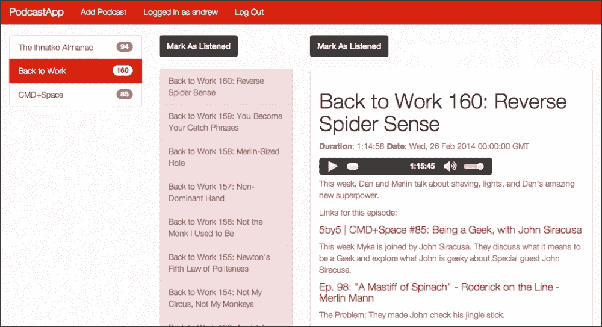
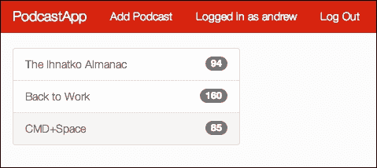
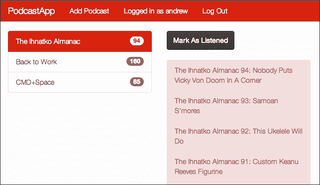

# 第六章。构建播客应用

在本章中，会有一个有趣的转折。我们迄今为止构建的所有应用在客户端代码方面都很重，但在服务器端却很轻。事实是，你将要构建的 Web 应用程序并不总是这样的。通常，你既需要在后端也需要在客户端进行大量的工作；而我们在这里将要构建的应用程序就是这样。

因此，在本章中，我们将关注以下想法：

+   构建既注重服务器端又注重客户端的应用程序

+   复制一些 Marionette 的功能，而不使用 Marionette

+   在存储之前解析和简化数据文件

# 我们在建造什么？

在本章中，我们将构建一个播客收听应用。如您所知，播客源与常规博客的 RSS 源非常相似。主要区别在于字段；因此，尽管我们正在构建一个基本的播客 **捕获器**，但其中很多可以用于构建常规的 RSS 阅读器。所以，我们将拥有以下内容：人们可以为我们的应用创建账户，然后订阅播客源。我们将加载所有现有剧集，用户可以在我们的应用中收听它们，并查看节目笔记和链接。每次用户打开应用程序时，他们订阅的每个播客都会检查是否有新剧集。他们可以收听剧集，或者只是标记为已收听。

现在让我们看看完成的项目：



也许听起来或看起来并不多，但还有很多工作要做，让我们开始吧。

# 构建用户账户

我们将从用户账户开始。您会记得，在 第二章，*构建照片分享应用* 中，当我们构建照片分享应用时，我们创建了一个 `signin.js` 文件；我们在这里也会用到它。我们可以通过以下步骤来设置：

1.  将模板目录复制以创建一个新的项目，然后将 `signin.js` 文件复制到新目录中。您需要在 `server.js` 文件的顶部添加以下行：

    ```js
    var signin   = require("./signin");
    ```

1.  现在，如您所回忆的那样，这需要安装一些额外的 Node.js 包。请在终端中使用以下命令安装 `passport`、`passport-local` 和 `bcrypt`：

    ```js
    npm install bcrypt passport passport-local --save
    ```

1.  `bcrypt` 和 `passport-local` 包在 `sigin.js` 文件中使用，但在 `server.js` 文件中我们需要引入 `passport`；我们还将创建 `users` 数据库，如下所示：

    ```js
    var passport = require("passport");
    var users    = new Bourne("users.json");
    ```

1.  然后，我们需要确保我们的 express 应用程序已配置好以支持这一点。这是我们之前在照片分享应用中看到的完整的 `configure` 块：

    ```js
    app.configure(function () {
      app.use(express.urlencoded());
      app.use(express.json());
      app.use(express.multipart());
      app.use(express.cookieParser());
      app.use(express.session({ secret: 'podcast-app' }));
      app.use(passport.initialize());
      app.use(passport.session());
      app.use(express.static('public'));
    });
    ```

1.  接下来，我们配置 `passport` 以使用我们在 `signin.js` 文件中的方法：

    ```js
    passport.use(signin.strategy(users));
    passport.serializeUser(signin.serialize);
    passport.deserializeUser(signin.deserialize(users));
    ```

1.  我们需要创建登录、登出和创建用户账户的路线。如果用户正在获取`/login`路由，我们将渲染`login.ejs`（即将推出）文件。一旦他们输入用户名和密码，结果将通过 POST 请求保存到`/login`路由，其中将进行身份验证。然后，要在`/logout`登出，我们将调用`passport`添加到请求对象中的`logout`方法，并重定向回根路由。因此，以下是这些路由：

    ```js
    app.get("/login", function (req, res) {
      res.render("login.ejs");
    });

    app.post('/login', passport.authenticate('local', {
      successRedirect: '/',
      failureRedirect: '/login'
    }));

    app.get("/logout", function (req, res) {
      req.logout();
      res.redirect('/');
    });
    ```

1.  与用户账户相关的最后一个路由是`/create`路由；这是用于创建新账户的路由。代码很多，但非常基础。我们创建一个包含用户名和散列密码的属性对象。然后，我们检查用户是否存在。如果存在，我们将返回根路由。否则，我们将创建用户账户并重定向到根路由，区别在于我们现在已登录。以下是为`/create`路由的代码：

    ```js
    app.post('/create', function (req, res, next) {
      var userAttrs = {
        username: req.body.username,
        passwordHash: signin.hashPassword(req.body.password)
      };
      users.findOne({ username: userAttrs.username }, 
        function (existingUser) {
          if (!existingUser) {
            users.insert(userAttrs, function (err, user) {
              req.login(user, function (err) {
                res.redirect("/");
              });
            });
          } else {
            res.redirect("/");
          }
        });
    });
    ```

1.  此部分的最后一击是`login.ejs`文件，位于`views`目录中。正如您将看到的，我们将再次使用 Twitter Bootstrap 的所有额外类和包装元素。然而，这次，我们将不使用默认版本。您可以去 Bootswatch（[`bootswatch.com`](http://bootswatch.com)）找到基于 Bootstrap 的其他主题；所有相同的类，但不同的样式。这样，您可以从 Bootswatch 中选择您喜欢的任何主题，并为您的应用程序获得不同的外观，但您不需要更改任何 HTML 代码。我将选择 Simplex 主题（[`bootswatch.com/simplex`](http://bootswatch.com/simplex)），但如果您更喜欢，您可以选择不同的一个。下载 CSS 文件并将其添加到`public`目录中。正如以下模板所示，我们还将有自己的样式表，即`public`目录中的`style.css`，进行一些自定义。我们稍后会添加到这个文件中。

    这是`login.ejs`文件中应该包含的内容：

    ```js
    <!DOCTYPE html>
    <html>
    <head>
      <title></title>
        <link rel="stylesheet"  href="/bootstrap.min.css" />
        <link rel="stylesheet"  href="/style.css" />
    </head>
    <body>
    <div class='container'>
    <div class='row'>
      <h1> Sign In </h1>
      <form method="post" action="/login">
        <div class='form-group'>
          <label>Username</label>
          <input name='username' type='text' class='form-control' />
        </div>
        <div class='form-group'>
          <label>Password</label>
          <input name='password' type='password' class='form-control' />
        </div>
        <button class='btn btn-primary'> Login </button>
      </form>

      <h1> Create Account </h1>
      <form method="post" action="/create">
        <div class='form-group'>
          <label>Username</label>
          <input name='username' type='text' class='form-control' />
        </div>
        <div class='form-group'>
          <label>Password</label>
          <input name='password' type='password' class='form-control' />
        </div>
        <button class='btn btn-primary'> Create </button>
      </form>
    </div>
    </div>
    </body>
    </html>
    ```

1.  下一步是根/通配符路由。如果用户已登录，我们将渲染`index.ejs`文件；否则，我们必须重定向到`/login`。这是根路由的一个很好的初始版本；如果`req.user`值未设置，我们将重定向到登录页面。否则，我们将渲染索引模板。以下是此路由的代码：

    ```js
    app.get('/*', function (req, res) {
      if (!req.user) {
        res.redirect("/login");
        return;
      }
      res.render('index.ejs', { 
        username: req.user.username
      });
    });
    ```

# 订阅和存储播客

与我们之前的应用程序相比，这个应用程序在需要存储的数据方面略有不同。以前，我们总是只存储从用户那里获得的数据。这次，用户将只给我们一个 URL——播客源路径——我们必须从那里获取所有数据。然后，稍后，我们需要检查相同的源以获取更新。这需要我们做更多的工作。

你可能会想我们如何获取这些播客数据。当然，我们只能从两个地方获取这些数据：客户端和服务器。两者都是可能的；然而，如果我们选择在服务器端获取这些数据，事情将会更加顺利。原因如下：在客户端准备数据需要我们首先获取源（这比简单的请求要复杂一些，因为它是跨域请求）；然后，我们必须解析它以获取所需的播客和剧集数据，然后再将数据发送回服务器进行存储。这可能需要相当长的时间，尤其是如果播客有很多剧集的话。如果用户在处理过程中关闭了应用程序，所有或部分数据将会丢失，事情可能会变得一团糟。在服务器端做所有这些工作会更好，因为即使用户关闭了浏览器标签，处理也可以继续。所以，我们将重点关注数据处理。

现在，获取播客数据将涉及相当多的代码，因此我们将创建一个专门的 Node.js 模块来处理播客。所以，在项目目录中创建一个 `podcasts.js` 文件，然后我们开始吧。

首先，我们将在本模块中使用另外两个 Node.js 包：

+   **xml2js** ([`www.npmjs.org/package/xml2js`](https://www.npmjs.org/package/xml2js)) 将允许我们将播客源 XML 转换为 JSON；这不会是一个很漂亮的 JSON，但它将是可用的。

+   **q** ([`www.npmjs.org/package/q`](https://www.npmjs.org/package/q)) 是一个异步承诺库。

因此，通过执行以下命令来安装这两个包：

```js
npm install q xml2js --save

```

### 注意

如果你之前没有使用过承诺（promises），你可以这样理解：在 JavaScript 中，你通常会在函数调用时传递一个回调函数，以便在数据准备就绪后运行该函数；**承诺**是一个封装预期数据的对象。你可以传递这个承诺对象，并对其添加多个回调函数，所有这些回调函数将在数据就绪时运行。你甚至可以在数据就绪后添加回调函数（当然，这些会立即运行）。对于承诺的详细介绍和解释，我推荐你阅读 Matt Greer 的优秀文章 *JavaScript Promises ... In Wicked Detail* ([`mattgreer.org/articles/promises-in-wicked-detail/`](http://mattgreer.org/articles/promises-in-wicked-detail/))。它将解释它们的优点以及如何使用它们。

在 `podcasts.js` 文件中，我们需要引入以下库：

```js
var http        = require('http');
var Bourne      = require('bourne');
var Q           = require('q');
var parseString = require('xml2js').parseString;
var pcdb = new Bourne('podcasts.json');
var epdb = new Bourne('episodes.json');
```

我们需要 Node.js 的原生 `http` 库，以便我们可以请求播客源文件。此外，我们还将创建两个 Bourne 数据库：一个用于播客，另一个用于剧集。我们甚至不需要从 `server.js` 文件中访问这些数据库。

以下是我们将要编写的第一个获取实际源文件的函数：

```js
function get (url) {
  var deferred = Q.defer();
  var req = http.get(url, function (res) {
    var xml = '';
    res.on('data', function (chunk) {
      xml += chunk;
    });
    res.on('end', function () {
      deferred.resolve(xml);
    });
  });
  return deferred.promise;
};
```

该方法接收一个 URL 并将其传递给 `http.get` 方法。我们提供给该方法的回调函数会接收到一个响应对象。我们可以在该对象上监听 `data` 事件，并将数据连接成一个字符串，我们将其命名为 `xml`。然后，当请求完成时（由 `end` 事件表示），我们使用 XML 字符串解析方法中创建的 `deferred` 对象。方法结束时，我们返回 `deferred` 对象的 `promise` 对象。现在，我们可以像以下代码所示使用这个方法：

```js
get('http://podcast.com/feed.xml').then(function (xml) {
  // use the xml
});
```

我们返回的 `promise` 对象有一个 `then` 方法。我们传递给 `deferred` 对象的 `resolve` 方法的值将被作为参数传递给我们在请求完成后传递给 `then` 方法的函数。因此，这就是我们获取播客的 XML 数据的方式。现在，我们需要将其转换为 JSON 并获取我们想要的值。`parse` 函数看起来是这样的：

```js
function parse(xml) {
  var deferred = Q.defer();
  parseString(xml, function (err, result) {
    var rss = result.rss.channel[0];
    var episodes = rss.item.map(function (item) {
      return {
        title:       item.title[0],
        duration:    item['itunes:duration'][0],
        audio:       item.enclosure[0].$.url,
        link:        item.link[0],
        description: item['content:encoded'][0], 
        pubDate:     item.pubDate[0],
        listened:    false
      };
    });

    var info = {
      title: rss.title[0],
      link:  rss.link[0],
      image: rss['itunes:image'][0].$.href,
      lastUpdated: +new Date()
    };

    deferred.resolve({ info: info, episodes: episodes });
  });
  return deferred.promise;
}
```

`parse` 函数接收 XML 输入。我们将 XML 输入传递给 `xml2js` 的 `parseString` 函数以将其转换为 JSON。然后，我们可以开始从结果中提取我们想要的数据。不幸的是，`xml2js` 并没有给我们一个很干净的 JSON 结构来工作；几乎每个值都是一个数组，但大多数只有一个值。这就是为什么我们在每种情况下都获取数组的第一元素。当元素有属性而不是子元素时，`xml2js` 使用一个名为 `$` 的属性。一旦我们获取了关于播客的一般信息和每个剧集的数据，我们将它们放入一个对象中，该对象将用于解决另一个承诺。

现在我们已经有了这两个方法，我们可以创建一个 `Podcast` 构造函数，作为一个方便的包装器来管理单个播客。这个构造函数需要以两种方式工作，以便在 `server.js` 文件中最为有用。如果我们传递给它一个 URL，它将假设我们正在创建一个新的播客记录，并将获取并存储数据。然而，如果我们传递给它一个数字，它将假设这个数字是已存储播客的 ID，并从数据库中获取该播客。由于存储和获取这些数据将是异步操作，我们将使用承诺来等待合适的行动时机。

因此，`Podcast` 构造函数是一个相当大的函数；我们将逐部分进行解析。我们将从以下代码开始：

```js
function Podcast(feed, userId) {
  var self      = this;
  var info      = Q.defer();
  var episodes  = Q.defer();
  this.info     = info.promise;
  this.episodes = episodes.promise;
  this.ready    = Q.all([this.info, this.episodes]);
}
```

`feed`参数将是之前讨论过的 URL 或 ID。`userId`参数将是订阅此播客的用户的 ID。然后，我们将创建两个延迟对象，分别称为`info`和`episodes`。我们将它们的承诺作为我们将使用此函数创建的对象的属性，以便在它们准备好时使用。我们还将创建一个`ready`属性；这是一个承诺对象，当我们将它传递到数组中的所有承诺都解决时，它将解决。这为在`info`和`episodes`承诺都准备好时做某事提供了一个方便的方法。您可以在以下代码中看到这一点，这是`Podcast`函数的下一部分：

```js
if (typeof feed === 'string') {
  get(feed).then(parse).then(function (data) {
    data.info.userId = userId;
    data.info.feed = feed;

    pcdb.insert(data.info, function (err, data) {
      info.resolve(data);
    });

    self.info.then(function (record) {
      data.episodes.forEach(function (e) {
        e.podcastId = record.id;
      });

      epdb.insertAll(data.episodes, function (err, records) {
        episodes.resolve(records);            
      });
    });
  });
}
```

如果`feed`参数的类型是字符串，我们知道我们正在创建一个新的播客记录。我们将获取并解析该源，使用我们之前创建的方法。然后，我们将源 URL 和`userId`参数添加到我们获取的数据的`info`属性中。现在这个`info`属性已经准备好存储在数据库中。我们将它在`pcdb`播客数据库中存储。在回调中，我们将解决`info`延迟对象，因为`info`属性现在已经存储（这意味着我们的播客记录在我们的数据库中有一个 ID）。

承诺的一个美妙之处在于我们可以对它们有多个`then`调用。因此，尽管我们创建了`this.info`承诺用于播客对象外部，我们也可以在内部等待其解决。这是下一步。当`info`承诺解决时，我们需要存储这些剧集。您可以看到为什么等待播客记录存储很重要；我们需要将播客的 ID 作为`podcastID`属性添加到每个剧集对象中。

完成这些操作后，我们可以将所有记录插入到`episodes`数据库中，然后使用它们来解决`episodes`承诺。

如果`feed`参数不是一个字符串，我们这样做：

```js
else {
  pcdb.findOne({ id: feed }, function (err, record) {
    info.resolve(record);
  });

  epdb.find({ podcastId: feed }, function (err, records) {
    episodes.resolve(records);
  });
}
```

如果`feed`参数不是一个字符串，那么我们之前已经创建了此播客记录，我们需要找到它。我们首先通过该 ID 找到播客，并解决`info`承诺。然后，我们找到所有具有该`podcastID`属性的剧集，并使用它们来解决`episodes`承诺。信不信由你，这就是我们为`Podcast`构造函数需要做的全部。

接下来，我们需要能够检查源以获取新剧集。为此，我们需要一个`update`方法。这个方法有点长且复杂，实际上并没有做太多复杂的事情。以下是外部结构：

```js
Podcast.prototype.update = function () {
  var deferred = Q.defer();
  this.ready.spread(function (info, oldEpisodes) {
    function resolve () {
      epdb.find({ podcastId: info.id }, function (err, records) {
        deferred.resolve(records);                       
      });
    }

    var now = +new Date();
    if (now - info.lastUpdated > 86400000) {
      // update the podcast
    } else {
      resolve();
    }
  });
  return deferred.promise;
};
```

我们等待 `this.ready` 的承诺被解决；如您所回忆的，这意味着我们正在等待 `info` 和 `episodes` 都被解决。这个承诺有一个 `spread` 方法，它将把这些承诺解决后的值展开，使得每个值都作为一个单独的参数被接收。如您所见，这些是 `info` 和 `oldEpisodes` 参数。然后，我们创建一个 `resolve` 函数，我们将在这个方法内部的好几个地方使用它。这个函数将简单地找到这个播客的所有剧集，并用它们来解决延迟。因此，`update` 方法的承诺将返回这个播客的所有剧集，而不仅仅是新的剧集。

现在，我们将在用户每次加载应用程序时调用这个 `update` 方法。然而，大多数播客大约每周更新一次，所以每次加载页面时检查新剧集是没有必要的。因此，我们将每天检查一次。当我们订阅一个播客时，我们使用一元加运算符（开始处的单个加号，它是将 `Date` 对象转换为时间戳的快捷方式）将 `lastUpdated` 属性设置为当前日期和时间作为 Unix 时间戳。在这里，我们获取当前时间戳减去以获取差异。如果差异超过 86,400,000（这是一天中的毫秒数），这意味着我们过去一天没有更新这个播客，所以我们将进行更新。否则，我们将调用 resolve，它将只使用当前的剧集。

那么，如果我们想进行更新呢？以下代码将替换 `// update the podcast` 注释：

```js
get(info.feed).then(parse).then(function (data) {
  if (data.episodes.length > oldEpisodes.length) {
    var oldTitles = oldEpisodes.map(function (e) { 
      return e.title; 
    }),
    newEpisodes = data.episodes.filter(function (e) { 
      return oldTitles.indexOf(e.title) === -1; 
    });

    epdb.insertAll(newEpisodes, resolve);
  } else {
    resolve();
  }
  pcdb.update({ id: info.id }, { lastUpdated: now });
});
```

如您所见，我们首先获取并解析 XML 提要。然后，我们检查检索到的剧集列表是否大于当前剧集列表。如果是这样，我们知道我们有新的剧集需要存储。下一步是确定这些剧集是什么。我们首先从当前存储的剧集获取标题，并将它们放入 `oldTitles`。下一步是找到所有标题不在该数组中的剧集；我们只是使用数组的 `filter` 方法。然后，我们可以将所有剩余的剧集插入到剧集数据库中，并调用 `resolve` 方法。如果没有新的剧集，我们仍然会调用 `resolve` 方法。最后一步是更新播客记录上的 `lastUpdated` 属性。

对于 `Podcast` 类，我们需要的就这些了。然而，由于我们预计用户会订阅多个播客，让我们创建一个简单的 `Podcasts` 类来包含这种行为：

```js
function Podcasts (id) {
  this.id = id;
}

Podcasts.prototype.all = function () {
  var d = Q.defer();
  pcdb.find({ userId: this.id }, function (err, records) {
    d.resolve(records);
  });
  return d.promise;
};

Podcasts.prototype.get = function (feed) {
  return new Podcast(feed, this.id);
};

Podcasts.prototype.updateEpisode = function (id, update, cb) {
  epdb.update({ id: id }, update, cb);
};

module.exports = Podcasts;
```

当我们创建一个`Podcasts`实例时，我们将传递用户的 ID。然后，`all`方法将返回一个包含该用户所有播客的 promise，而`get`方法将返回单个播客实例。`updateEpisode`方法是一个快速更新单个剧集的方法；我们只会使用这个来标记剧集已收听。最后，在真正的 Node.js 模块形式中，我们通过导出`Podcasts`类来结束。这就是我们从`server.js`文件中需要访问的所有内容。

说到`server.js`文件，让我们暂时回到那里。首先，使用以下代码行引入你的`podcasts.js`文件：

```js
var Podcasts = require('./podcasts');
```

然后，在通配符路由中，我们想要获取当前用户的播客。这是该路由的完成版本：

```js
app.get('/*', function (req, res) {
  if (!req.user) {
    res.redirect("/login");
    return;
  }
  req.user.podcasts = new Podcasts(req.user.id);
  req.user.podcasts.all().then(function (records) {
    res.render('index.ejs', { 
      podcasts: JSON.stringify(records),
      username: req.user.username
    });
  });
});
```

如果用户已登录，我们可以在用户对象上创建一个`podcasts`属性。这是一个新的`Podcasts`对象，它接收用户 ID 作为参数。然后，我们获取用户的播客并将这些记录发送到`index.ejs`文件，包括我们之前发送的用户名。

# 准备`index.ejs`

我们已经创建了`login.ejs`模板，它将在用户登录之前显示。一旦用户登录，我们将渲染`index.ejs`文件。这是我们开始的地方：

```js
<!DOCTYPE html>
<html>
<head>
  <title> PodcastApp </title>
  <link rel="stylesheet"  href="/bootstrap.min.css" />
  <link rel="stylesheet"  href="/style.css" />
</head>
<body>
<div class='container-fluid' id='main'>
  <div class='row'>
    <div id='podcasts' class='col-md-3'></div> 
    <div id='episodes' class='col-md-3'></div> 
    <div id='episode' class='col-md-6'></div> 
  </div>
</div>
<script src="img/jquery.js"></script>
<script src="img/underscore.js"></script>
<script src="img/backbone.js"></script>
<script src="img/bootstrap.min.js"></script>

<script src="img/models.js"></script>
<script src="img/views.js"></script>
<script src="img/router.js"></script>
</body>
</html>
```

就像我们在之前的应用程序中所做的那样，我们将把所有内容都放在`<div id='#main'>`元素内。这次，然而，我们将给它一个 Bootstrap 类：`container-fluid`。非常神奇的是，仅仅通过应用正确的 Bootstrap 类，我们的应用程序就变得相当响应；我们不需要做任何额外的工作。这次，我们在主要的`<div>`元素中开始添加一些内容。我们的应用程序将有三个列：第一个将列出播客，第二个将列出所选播客的剧集，第三个将显示单个剧集的详细信息。

在底部，我们将引入所有的脚本标签；除了默认的（jQuery、Underscore 和 Backbone）之外，我们还有 Bootstrap 的 JavaScript 组件。这对于我们稍后添加的导航是必要的。然后，我们有我们自己的三个文件：`models.js`、`views.js`和`router.js`。

# 创建我们的模型和集合

我们将从`models.js`文件开始。这里我们将展示两种类型的数据：播客和剧集。因此，我们将为每种类型创建一个模型和集合。让我们从剧集开始：

```js
var Episode = Backbone.Model.extend({
  urlRoot: '/episode',
  listen: function () {
    this.save({ listened: true });
  }
});
var Episodes = Backbone.Collection.extend({
  model: Episode,
  initialize: function (models, options) {
    this.podcast = options.podcast;
  },
  url: function () {
    return this.podcast.url() + '/episodes';
  },
  comparator: function (a, b) {
    return +new Date(b.get('pubDate')) - +new Date(a.get('pubDate'));
  }
});
```

我们的模型类被命名为`Episode`；我们给它一个根 URL 和一个`listen`方法。`listen`方法将通过将`listened`属性设置为 true 并将更新保存到服务器来标记剧集已收听。你可能还记得，当我们订阅播客时，我们默认将每个剧集的`listened`设置为`false`。

然后，集合类被命名为 `Episodes`。一个集合的剧集需要与一个播客相关联，因此我们将从传递给 `initialize` 方法的 `options` 对象中获取那个 `podcast` 实例。注意，我们在集合上设置了一个 `url` 方法。通常，你会在模型类或集合类上设置一个 `url` 方法，但不会同时设置两个。然而，我们在这里需要两个不同的 URL。集合 URL 将用于获取播客的所有剧集。模型 URL 将在我们标记剧集为已听时使用。集合类的最后一部分是 `comparator`。我们希望我们的剧集以正确的顺序显示，最新剧集位于列表顶部，因此我们将使用发布日期作为比较。通常，我们会从值 B 减去值 A，但通过反转这个顺序，我们可以将最新剧集放在顶部。

播客类甚至更简单，如下面的代码所示：

```js
var Podcast = Backbone.Model.extend({
  episodes: function () {
    return this.episodes || (this.episodes = new Episodes([], { podcast: this }));
  }
});

var Podcasts = Backbone.Collection.extend({
  model: Podcast,
  url: '/podcasts',
});
```

`Podcast` 模型类的 `episodes` 方法相当有趣。正如我们之前看到的，每个 `Podcast` 实例都将有一个相关的 `Episodes` 集合。这个方法将返回那个集合。我们在这一行方法中所做的是，如果存在，则返回 `this.episodes` 属性。如果不存在，我们将创建它、分配它并返回它，所有这些都在一行中完成。

# 构建导航

现在，我们准备开始构建我们的用户界面；我们可以通过执行以下步骤来完成：

1.  打开公共目录下的 `views.js` 文件。我们将从一些辅助代码开始。你对第一部分很熟悉，但 `tmpl` 函数是新的。它只是一个小的辅助函数，我们将用它来获取我们的模板。我们将使用这个方法为几乎每一个视图。以下是代码：

    ```js
    _.templateSettings = {
      interpolate: /\{\{(.+?)\}\}/g
    };

    function tmpl(selector) {
      return _.template($(selector).html());
    }
    ```

1.  很有趣，我们不会为第一个视图使用 `tmpl` 函数；第一个视图是导航视图。我们不是创建一个 `template` 属性并选择一个 `tagName` 属性，而是设置 `el` 属性。我们使这个属性成为页面上已存在元素的选择器，这个元素将成为这个视图的元素。当我们点击 **添加播客** 链接时，我们希望显示一个表单。要显示这个表单，我们将导航到 `/podcasts/new` 路由。这是整个类的代码：

    ```js
    var NavView = Backbone.View.extend({
      el: '#navbar',
      events: {
        'click #addPodcast': 'addPodcast'
      },
      addPodcast: function (e) {
        e.preventDefault();
        Backbone.history.navigate('/podcasts/new', 
          { trigger: true });
        return false;
      }
    });
    ```

1.  现在，我们需要创建具有 ID `navbar` 的元素，因为这个视图期望它。其中很多只是为了 Bootstrap，但你可以看到我们有 **添加播客** 和 **登出** 链接。其代码如下：

    ```js
    <nav id='navbar' class="navbar navbar-inverse navbar-fixed-top" role="navigation">
      <div class="container-fluid">
        <div class="navbar-header">
          <button type="button" class="navbar-toggle" data-toggle="collapse" data-target="#navbar-tools">
            <span class="sr-only">Toggle navigation</span>
            <span class="icon-bar"></span>
            <span class="icon-bar"></span>
            <span class="icon-bar"></span>
          </button>
          <a class="navbar-brand" href="#">PodcastApp</a>
        </div>

        <div class="collapse navbar-collapse" id="navbar-tools">
          <ul class="nav navbar-nav">
            <li><a id='addPodcast' href="#">Add Podcast</a></li>
            <li><p class="navbar-text">Logged in as <%= username %></p></li>
            <li><a href='/logout'>Log Out</a></li>
          </ul>
        </div>
      </div>
    </nav>
    ```

由于这已经在页面上，我们不需要在任何地方插入它；我们只需在类中实例化路由器。我们很快就会这样做，但截图是提前看看我们这样做后的样子：


再说一件事：这个导航栏将固定在屏幕顶部，所以我们需要将其他所有内容向下推一点，这样在用户滚动之前，内容就不会被隐藏在其后面。这非常简单；从 `public` 目录打开你的 `style.css` 文件，并添加以下代码行：

```js
body { padding-top: 60px; }
```

# 显示播客

下一步将是显示用户订阅的播客列表。我们从 `PodcastListView` 类开始，它将显示集合。以下是该类：

```js
var PodcastListView = Backbone.View.extend({
  className: 'list-group',
  initialize: function (options) {
    this.current = options.current || null;
    this.listenTo(this.collection, 'add', this.render);
  },
  render: function () {
    if (this.collection.length === 0) {
      this.el.innerHTML = "<a class='list-group-item'>No Podcasts</a>";
      return this;
    }
    this.el.innerHTML = '';
    this.collection.forEach(this.renderItem, this);
    return this;
  },
  renderItem: function (model) {
    model.set({ current: this.current === model.get('id') });
    var v = new PodcastListItemView({ model: model });
    this.el.appendChild(v.render().el);
  }
});
```

对于 Bootstrap，我们将 `list-group` 类添加到视图的元素中。在 `initialize` 方法中，我们将检查 `options` 对象中的 `current` 值。如果用户点击列表中的某个播客以显示剧集，我们将想要突出显示该播客，因此 `current` 将是所选播客的 ID（如果已选择）。然后，我们还将监听显示的集合中的新添加项。如果添加了新项，我们将再次调用 `render` 方法。`render` 方法会查找几种不同的场景。如果集合为空（最初将是这种情况），我们将只显示 **没有播客**。否则，我们将清除元素并使用 `renderItem` 方法渲染每个模型。`renderItem` 方法在每个模型上设置一个 `current` 属性；如果这个模型是当前的，它将是 `true`；否则，它将是 `false`。然后，我们将创建一个新的 `PodcastListItemView` 实例，渲染它并将其附加到元素上。现在，我们准备好这个视图；这是它的代码：

```js
var PodcastListItemView = Backbone.View.extend({
  tagName: 'a',
  className: 'list-group-item',
  template: tmpl('#podcastItem'),
  initialize: function () {
    this.model.episodes().on('count', this.displayCount, this);   
  },
  events: {
    'click': 'displayEpisodes'
  },
  render: function () {
    this.el.innerHTML = this.template(this.model.toJSON());
    this.el.href = this.model.url();
    this.$el.addClass( this.model.get('current') ? 'active': '');
    this.displayCount();
    return this;
  }
});
```

这个视图的元素是一个带有 `list-group-item` 类的锚标签。我们获取 `podcastItem` 模板，它相当简单。将以下代码添加到 `index.ejs` 文件中：

```js
<script type='text/template' id='podcastItem'>
  {{ title }} <span class='badge'></span>
</script>
```

在这个 `initialize` 方法中，我们将获取这个播客模型的剧集集合并监听 `count` 事件；当它发生时，我们将调用 `displayCount` 方法。但在我们编写该方法之前，我们将渲染视图。首先，我们将渲染模板。然后，我们将设置此元素的 `href` 属性（记住，它是一个锚点）；这将是为播客实例的 URL。如果是当前播客，我们将向元素添加活动类。最后，我们将调用 `displayCount` 方法。以下是该方法：

```js
displayCount: function (evt) {
  var eps = this.model.episodes();
  eps.fetch().done(function () {
    var count = eps.pluck('listened')
      .filter(function (u) { return !u; }).length;
    this.$('.badge').text(count);
  }.bind(this));
}
```

在这个方法中，我们获取播客的剧集集合并从服务器获取数据。当数据到达时，我们从每个剧集模型中提取 `listened` 属性的值；这将是一个布尔值数组。然后，我们过滤掉所有 `true` 值，这样我们只剩下 `false` 值。结果数组的长度是尚未收听的播客数量。然后，我们将那个数字放入模板的徽章元素中。

最后一点；如果你之前没有见过 `.bind(this)` 的技巧，这个技巧只是保持函数内部 `this` 的值与函数外部相同。

最后，看看`events`属性。当这个视图的元素被点击时，我们将重定向到模型的 URL，如下所示：

```js
displayEpisodes: function (evt) {
  evt.preventDefault();
  Backbone.history.navigate(this.model.url(), { trigger: true });
  return false;
}
```

# 创建布局

在这些视图就绪后，我们几乎准备好开始路由器了。打开`public`目录中的`router.js`文件。现在，在上一章中，我们使用了 Marionette，它为我们提供了区域和布局来管理我们的视图去哪里。我们现在没有它们，但既然它们非常有用，为什么不自己创建它们呢？我们可以用以下代码创建它：

```js
function Region(selector) {
  this.el = $(selector); 
}
Region.prototype.show = function (views) {
  if (!_.isArray(views)) { views = [views]; }
  this.el.empty();
  views.forEach(function (view) {
    this.el.append(view.render().el); 
  }.bind(this));
};
```

当我们创建一个区域时，我们将传递一个选择器。然后，`show`方法将接受一个或多个视图。如果我们只传递一个视图，我们将将其包裹在一个数组中。然后，我们将循环并将每个视图附加到元素上。请注意，我们在这里调用`render`方法并获取视图的元素，所以我们只需要将视图实例传递给此方法。

如果复制区域很容易，创建自己的布局将变得轻而易举；我们将使用以下代码来创建我们的布局：

```js
var layout = {
  podcasts: new Region('#podcasts'),
  episodes: new Region('#episodes'),
  episode:  new Region('#episode')
};
```

# 开始路由器

现在，我们准备好开始路由器了。以下是我们`router.js`文件的`Router`代码；我们可以从这里开始：

```js
var Router = Backbone.Router.extend({
  routes: {
    '': 'index'
  },
  initialize: function (options) {
    this.podcasts = options.podcasts;
    this.nav = new NavView();
  },
  index: function () {
    layout.podcasts.show(new PodcastListView({ 
    collection: this.podcasts 
  }));
  }
});
```

当路由器创建时，我们将接受一个`podcasts`集合。我们还将创建我们的`NavView`实例；记住，因为这个元素已经在页面上，所以我们不需要附加它们。我们准备好使用`index`方法接受根路由；当发生这种情况时，我们将使用我们的`layout.podcasts`区域来显示一个`PodcastListView`实例。

要使用这个路由器，让我们向`index.ejs`文件添加另一个脚本标签：

```js
<script>
  var r = new Router({
    podcasts: new Podcasts(<%- podcasts %>)
  });
  Backbone.history.start({ pushState: true });
</script>
```

# 订阅新播客

我们已经有了显示播客所需的所有功能；现在，让我们创建一个用于订阅新播客的表单。正如我们之前确定的，在我们的`Podcast`模块中，我们只需要从用户那里获取播客源 URL。因此，让我们创建我们的`NewPodcastView`类。首先，这是这个视图的模板：

```js
<script type='text/template' id='newPodcast'>
  <form class='form-inline'>
    <div class="form-group">
      <input type="text" placeholder="feed url" class="form-control">
    </div>
    <button class='btn btn-primary'> Add </button>
  </form>
</script>
```

如您所见，这是一个简单的表单，包含一个文本输入和一个按钮。有了这个，我们现在可以编写实际的视图：

```js
var NewPodcastView = Backbone.View.extend({
  className: 'list-group-item',
  template: tmpl('#newPodcast'),
  events: {
    'click button': 'addPodcast'
  },
  render: function () {
    this.el.innerHTML = this.template();
    return this;
  },
  addPodcast: function (e) {
    e.preventDefault();
    var feed = this.$el.find('input').val();
    this.$el.addClass('loading').text('Loading Podcast . . . ');
    this.collection.create({ feed: feed }, { 
      wait: true,
      success: this.remove.bind(this)
    });
    Backbone.history.navigate('/');
    return false;
  }
});
```

我们将给元素添加一个`list-group-item`类并获取模板。渲染非常简单，我们正在监听按钮的点击。当发生这种情况时，我们将从字段获取源并替换表单为文本**加载中**。然后，我们在与这个视图关联的播客集合中创建一个新的播客。我们需要的唯一属性是源。现在，记住我们的`PodcastListView`类将监听添加到这个集合中的新模型。然而，我们需要它等待数据已存储在服务器上，以便它有一个 ID 和可以计数的剧集。因此，我们将添加`wait`选项到这个创建调用中。此外，在请求成功完成后，我们将调用这个视图的`remove`方法来从 UI 中移除它。最后，我们将导航回主页路由（不会触发它，请注意，因为没有必要；我们只是移除了表单）。

当服务器正在获取数据时，我们在视图的元素上添加 `loading` 类。打开 `public` 目录中的 `style.css` 文件，并添加以下样式：

```js
@keyframes pulse {
  0% {
    background: #fff;
    color: #000;
  }
  100% {
    background: #b81e0d;
    color: #fff;
  }
}

.loading {
  animation: pulse 1s ease-in-out infinite alternate;
}
```

我们在这里使用了一些 CSS3；当服务器正在工作时，元素将从红色脉冲到白色。请注意，我正在使用标准的 CSS3 语法。然而，在撰写本书时，一些浏览器仍然需要专有前缀，因此您必须为要支持的浏览器添加代码。当然，有许多工具可以帮助您完成这项工作；Compass ([`compass-style.org/`](http://compass-style.org/)) 是一个很好的起点。

现在，我们将更新路由器以添加播客的路由。首先，使用以下代码行将路由添加到路由对象中：

```js
'podcasts/new': 'newPodcast'
```

然后，我们需要编写 `newPodcast` 方法：

```js
newPodcast: function () {
  var pv = new PodcastListView({ collection: this.podcasts });
  layout.podcasts.show(pv);
  pv.$el.append(new NewPodcastView({ 
    collection: this.podcasts 
  }).render().el);
}
```

这很简单；就像我们在 `index` 方法中所做的那样，我们将创建并渲染一个新的 `PodcastListView` 实例。然而，我们保留对视图的引用，并将我们的表单附加到它上；这样，表单就会像列表中的另一个条目一样显示。

订阅播客的最后一步是服务器代码。我们需要管理当用户保存新的源时发生的 POST 请求。在 `server.js` 文件中，添加以下代码：

```js
app.post('/podcasts', function (req, res) {
  var podcast = req.user.podcasts.get(req.body.feed);
  podcast.info.then(res.json.bind(res));
});
```

我们可以使用用户的 `podcasts` 对象通过源获取新的播客。我们等待 `info` promise 准备就绪，并将数据发送回客户端。现在，我们可以成功订阅播客。试试看；启动应用程序，创建用户账户，并订阅几个播客。结果应该类似于以下截图：



# 显示剧集列表

现在我们能够订阅播客了，让我们来显示播客列表。我们有 `Episode` 模型和 `Episodes` 集合。我们将从集合视图 `EpisodesView` 开始：

```js
var EpisodesView = Backbone.View.extend({
  className: 'list-group',
  initialize: function (options) {
    this.region = options.region; 
  },
  render: function () {
    this.collection.forEach(function (model) {
      var v = new EpisodeListItemView({ 
        model: model,
        layout: this.region
      });
      this.el.appendChild(v.render().el);
    }, this);
    return this;
  }
});
```

再次强调，这个元素将具有类 `list-group`。你会在 `initialize` 方法中注意到，我们期望 `region` 是 `options` 对象属性之一。请记住这一点，我们稍后会用到它。

在 `render` 方法中，我们遍历集合并显示一个 `EpisodeListItemView` 实例。请注意，我们传递了 `region`；那里我们需要它。让我们接下来创建这个类：

```js
var EpisodeListItemView = Backbone.View.extend({
  className: 'list-group-item',
  events: {
    'click': 'displayEpisode'
  },
  initialize: function (options) {
    this.layout = options.layout;
    this.listenTo(this.model, 'change:listened', this.markAsListened);
  },
  render: function () {
    this.el.innerText = this.model.get('title');
    if (!this.model.get('listened')) {
      this.$el.addClass('list-group-item-danger');
    }
    return this;
  },
  markAsListened: function () {
    this.$el.removeClass('list-group-item-danger');
  },
  displayEpisode: function (evt) {
    evt.preventDefault();
    this.layout.show(new EpisodeView({ model: this.model }));
    return false;
  }
});
```

正如我们在之前的列表项视图中所做的那样，我们将给这个元素赋予类 `list-group-item`。这里没有模板；我们只需将这个模型的标题设置为元素的文本。然后，如果这个剧集尚未收听，我们将添加一个类来突出显示它，标记为已收听。在 `initialize` 方法中，请注意我们正在监听 `listened` 属性的变化。当这个变化发生时，我们将调用 `markAsListened` 方法，这将移除该类，使视图不再突出显示。

最后一个方法是`displayEpisode`，它将调用区域的`show`方法，传递一个`EpisodeView`实例作为这个视图显示的模型。这不仅仅是一个标题，因为我们在这里展示的；它将是整个模型。这就是我们传递区域的原因。由于我们没有改变 URL，我们必须在这里改变页面的内容。所以，这就是我们做的。

列表中的剧集还有一个部分：它上面的工具栏。只有一个工具：**标记所有为已听**，这是一个简单的按钮。它的代码如下：

```js
var EpisodesToolsView = Backbone.View.extend({
  className: 'btn-tools btn-group',
  events: {
    'click #mark': 'mark'
  },
  render: function () {
    this.el.innerHTML = "<button id= 'mark' class="btn btn-default">Mark As Listened</button>";
    return this;
  },
  mark: function (evt) {
    this.collection.forEach(function (model) {
      model.listen();
    });
    this.collection.trigger('count');
  }
});
```

再次，我们从`className`属性开始；`render`方法非常简单。在`events`属性中，我们等待点击`#mark`按钮。当发生这种情况时，我们调用`mark`函数，它将遍历集合并将它们全部标记为已听。然后，我们在集合上触发`count`事件；我们在`PodcastListItemView`类中监听这个事件的发生，我们将更新播客计数。

注意，我们使用的类之一是`btn-tools`类。这是我们自己的创造之一，非常简单；它只是让工具栏底部有更多的空间：

```js
.btn-tools {
  margin-bottom: 20px;
}
```

这个过程的最后一步是为标记剧集为已听的服务器组件。这是要添加到`server.js`文件的路线：

```js
app.put('/episode/:id', function (req, res) {
  req.user.podcasts.updateEpisode(parseInt(req.params.id, 10),
    req.body, function (err, data) {
      res.json(data);  
    });
});
```

现在，我们准备好显示我们的剧集列表。在`router.js`文件的 router 中，添加以下路由：

```js
'podcasts/:id': 'podcast'
```

现在来看那个`podcast`方法，这是它的代码：

```js
podcast: function (id) {
  layout.podcasts.show(new PodcastListView({ 
    collection: this.podcasts, 
    current: parseInt(id, 10) 
  }));
  var podcast = this.podcasts.get(id);
  var episodes = podcast.episodes();
  episodes.fetch();
  layout.episodes.show([
    new EpisodesToolsView({
      model: podcast,
      collection: episodes
    }),
    new EpisodesView({
      collection: episodes,
      layout: layout.episode 
    })
  ]);
}
```

我们首先渲染播客列表，因为有可能这个页面会直接加载。注意，这次我们设置了`current`选项，以便它在列表中突出显示。然后，我们从服务器获取该播客的剧集。接下来，在`episodes`区域，我们显示`EpisodesToolsView`和`EpisodesView`视图。

从服务器获取剧集，通过`episodes.fetch()`，我们需要另一个服务器路由，如下面的代码所示：

```js
app.get('/podcasts/:id/episodes', function (req, res) {
  var podcast = req.user.podcasts.get(parseInt(req.params.id, 10));
  podcast.update().then(res.json.bind(res));
});
```

我们将获取`Podcast`对象，然后调用`update`方法来检查是否有新剧集。当返回时，我们将它们作为 JSON 发送到客户端。

在这里设置好之后，我们现在可以查看剧集列表，如下面的截图所示：



现在，剩下要做的就是显示单个播客剧集。

# 显示剧集

单个剧集将在`EpisodeView`类中显示。让我们从模板开始：

```js
<script type='text/template' id='episodeView'>
  <div class='btn-group btn-tools'>
    <button id='markOne' class="btn btn-default">Mark As Listened</button>
  </div>
  <div class="panel panel-default">
    <div class="panel-body">
      <h1>{{title}}</h1>
      <p>
        <strong>Duration</strong>: {{duration}}
        <strong>Date</strong>: {{pubDate}} 
      </p> 
      <audio controls='true' src="img/{{audio}}"></audio>
      {{description}}
    </div>
  </div>
</script>
```

我们从顶部的工具开始：一个**标记为已听**按钮。然后，我们显示剧集的详细信息：标题、时长和日期。接下来是`audio`元素；这使得用户能够在我们的应用程序中直接收听播客变得非常容易。在我们的例子中，我们只有一个音频源；然而，当使用`audio`元素时，你通常会想添加多个不同格式的源（MP3、OGG 等），以实现最大的浏览器和操作系统覆盖。在`audio`元素下方，我们将显示描述，这将是对该剧集的节目笔记。以下是类名：

```js
var EpisodeView = Backbone.View.extend({
  template: tmpl('#episodeView'),
  events: {
    'click #markOne': 'listen' 
  },
  render: function () {
    this.el.innerHTML = this.template(this.model.toJSON()); 
    this.$('audio')[0].addEventListener('play', this.listen.bind(this), false);
    return this;
  },
  listen: function (evt) {
    this.model.listen();
    this.model.collection.trigger('count');
  }
});
```

这个视图的大部分是标准的视图代码；我们获取模板，并用模型数据渲染模板。我们还有一个`listen`方法，当用户点击**标记为已听**按钮时会被调用。唯一的区别是我们不能使用`events`属性来监听`audio`元素上的`play`事件，因为`audio`元素事件与 Backbone 的工作方式有关。因此，我们获取元素并使用`addEventListener`方法来监听该事件。

这是最后一部分。现在，你应该能够查看和播放播客的剧集。它看起来就像以下截图所示：


# 摘要

这就结束了本章的内容。在本章中，我们做的大部分事情你可能已经从之前的实践中熟悉了，但也有一些要点你不应该忽视。主要方面是强大的服务器组件。很容易忘记 Backbone 应用程序后面总是有服务器代码，而且通常这些代码会远不止渲染一个主模板和传递 JSON 数据的一堆路由。通常会有大量的逻辑、数据处理和其他细节需要在服务器上处理。正如我们所看到的，通常可以在客户端或服务器上执行这些逻辑——我们可以在任何一个位置捕获 RSS 源并处理它。当你构建自己的应用程序时，关于在哪里执行过程做出良好的决策是很重要的。在客户端执行某事通常要快得多（无需等待请求/响应），但在服务器上你可能拥有更多的能力和权限，所以时间延迟可能可以忽略不计。每个情况的决定都会不同，而且通常不会有唯一的正确选择。

我们做的另一件有趣的事情是重新创建了一些 Marionette 的行为。这再次提醒我们，Backbone 只是 JavaScript，没有理由你不能编写自己的代码来让它更容易使用。没有必要做任何花哨的事情；正如我们所看到的，像我们的区域和布局这样简单的东西真的可以清理你的路由器。

只剩下最后一章了，我们将有一些乐趣并构建一个游戏。
