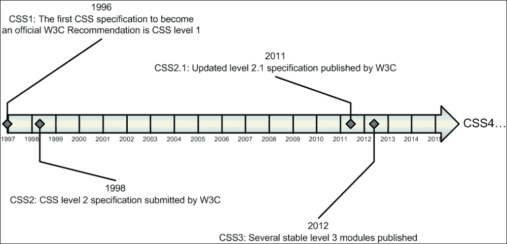
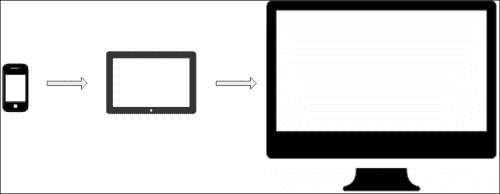
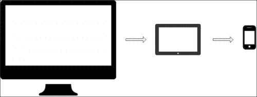
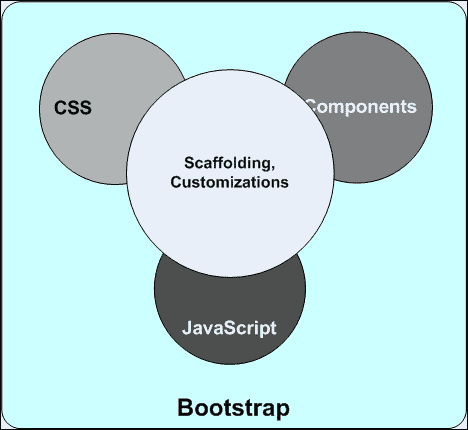

# 第一章：CSS 和 Bootstrap 的演变

HTML、CSS 和 JavaScript——作为当今不断发展和不断要求的 Web 2.0 和 Web 3.0 世界的网络开发者，这三个是最重要的工具。随着移动世界及其需求每天都在增长，你将需要开发网站和网页将面临更多的挑战。幸运的是，随着需求的增加，行业也提供了所有新的引擎和机制来满足需求。

本章将涵盖以下主题：

+   介绍 CSS3

+   理解移动优先哲学

+   学习响应式设计的基础

+   介绍 Bootstrap 作为响应式设计框架

这本书的目的是理解和熟练使用 Bootstrap。由于 Bootstrap 主要基于 CSS3，我们将花几分钟时间看看 CSS 的演变：



1996 年末，官方 CSS1 规范发布；一些关键方面包括文本颜色、背景、边距、边框、填充的能力、定位、各种字体属性、各种文本属性、间距、对齐等。

CSS2 规范于 1998 年发布，包括元素定位、z-index、字体阴影和双向文本等众多功能。

然而，CSS3 是一个重大的转变，目前是最新版本。它增加了一系列强大的功能，并推动了技术的移动优先哲学。其中一些非常关键的内容包括媒体查询、选择器、层叠和继承、模板布局、命名空间、MathML、灵活和网格布局、转换和过渡等。

### 小贴士

CSS3 的一些模块仍在考虑和提案阶段；许多移动设备和桌面电脑的旧版浏览器不支持 CSS3 标签。Bootstrap 使用它们，并且大量基于 CSS3 和 HTML5；因此，作为开发者，你必须确保在使用 Bootstrap 时，你正在构建一个面向未来的网站，但与此同时，你的网站可能不会与旧版浏览器兼容，除非你在这一方面采取了额外的预防措施。

# 移动优先哲学

作为一名经验丰富的网络开发者，你必须意识到移动优先哲学至今，如果你还没有，那么现在是醒悟的时候了。

让我们考虑以下几个事实（所有都是近似值）：

+   全球有超过 10 亿的手机用户，并且还在增加

+   超过 25%的互联网用户仅通过移动设备访问；他们很少使用桌面浏览器上网

+   地球上超过 90%的人都有手机，超过 50%的人拥有智能手机

+   超过 50%的手机用户将移动设备作为他们主要的互联网来源，而不是桌面电脑

+   超过 70%的平板电脑用户每周都会从平板电脑上在线购物

+   到 2015 年和 2016 年，预计手机和平板电脑的互联网使用量将超过桌面电脑

因此，如果不是现在，那么在接下来的几年内，我们将不仅为桌面机器开发网站，更多的是为移动设备开发。

这就是移动优先的方法，它与诸如渐进增强、优雅降级和响应式网页设计等术语并行。

在渐进增强中，你为手机设计和发展你的网站，这是所有设备中空间最小的。然后，你升级你的网站和内容以匹配平板电脑的可用空间，以及为桌面屏幕设计的完整网站，这意味着你是在自下而上地设计网站。



另一方面，在优雅降级的情况下，你采取相反的方法——传统的自上而下的方法。在那里，你为桌面用户设计一个完整的网站，然后通过删除一些可选内容并重新设计所有 CSS 样式和 JavaScript 来适应移动设备，使其逐渐与各种移动设备兼容。



渐进增强方法正日益流行，超过优雅降级——将移动优先哲学作为当今网页设计最关键的因素之一。

然而，响应式网页设计技术在两种策略中都是常见且必要的——无论你选择渐进增强还是优雅降级。此外，作为一名网页开发者，这是你想要掌握的最重要技能之一。

这彻底改变了整个网页设计和开发范式。当然，主要影响在于你如何构建 CSS 类和样式，以及为移动设备设计网站是 CSS 开发者的责任，而不是网站程序员的。CSS3 在这里提供了帮助。正如我们所见，随着响应式网站设计需求的增加，CSS 的力量也在增强。大多数 CSS3 功能和规范都与你需要开发响应式网站的需求相一致。

# 响应式设计基础

简而言之，响应式网页设计意味着设计和构建你的网站，使其几乎在所有设备上都能正确渲染，无论设备大小、浏览器、屏幕尺寸等。

如我们之前讨论的，最佳的方法是首先为最小的屏幕尺寸设计网站，然后逐步向上扩展。为了实现响应式和良好的用户体验，需要遵循一些非常基本的步骤。

### 小贴士

以下要点只是为了使基本概念更加清晰，并准备好你的基础知识。稍后我们将详细看到如何使用 Bootstrap 构建和生成一个完整的响应式网站。

## 设置视口

视口是用户访问的设备或监视器上网页的可见区域。视口的大小随设备而变化——对于手机来说，它非常小；对于平板电脑来说，它稍微大一些；对于台式电脑来说，它比平板电脑大；对于电视来说，它更大。

针对和优化各种设备的页面必须在文档的`head`部分包含一个`meta`视口元素。`meta`视口元素使浏览器理解如何控制页面尺寸和缩放以渲染不同的页面元素。

例如，

```js
<meta name="viewport" content="width=device-width, initial-scale=1">
```

`meta`视口值`width=device-width`指示浏览器在渲染页面时匹配屏幕宽度为设备无关像素。HTML5 引入了这个`meta`标签，使网络开发者能够控制浏览器屏幕的大小，并按大小渲染网页内容。这是响应式网页设计的基础。

## 将内容大小调整到视口

不论用户正在使用的设备或浏览器是什么，没有人喜欢水平滚动条。因此，你需要确保所有内容和元素都调整到你所拥有的屏幕实际空间内——只有垂直滚动条。

当你设置了页面内容在可用的视口中时，也需要创建和结构化你的内容，以便适应可用的空间。例如，如果你在一个宽度为 600 像素的屏幕上放置一个图像，那么在 320 像素的屏幕上，你将面临一个水平滚动条来查看整个图像，即使你已经在`head`部分添加了`meta viewport`元素。

因此，一个适当的可响应式设计需要所有网页内容也能自动适应屏幕视口大小。

## 使用媒体查询实现响应式

市面上有各种各样的移动设备。那么，你该如何确保你的页面在所有设备和浏览器上都能高效渲染，而不牺牲任何用户体验呢？当然，你不能为不同的设备编写不同的代码，然后动态地找出要执行哪个代码库。

CSS 媒体查询即将到来——这些是简单的过滤器，用于根据设备的特性和属性更改 HTML 元素的样式。考虑以下示例：

```js
<link rel="stylesheet" media="print" href="print.css">
<link rel="stylesheet" media="(max-width: 800px)" href="max800.css">
<link rel="stylesheet" media="(max-width: 320px)" href="max320.css">
<link rel="stylesheet" media="(orientation: portrait)" href="prt.css">
<link rel="stylesheet" media="(orientation: landscape)" href="lnd.css">
```

## 响应式设计模式

在响应式网页设计中，以下是一些已建立并被广泛采用的模式：

+   **流体设计**：这是响应式设计中最受欢迎且最简单的方法。在这个模式中，大屏幕的多列布局在较小屏幕上渲染为单列，且顺序完全相同。

+   **列降级**：在这个模式中，页面也渲染为单列，但是块顺序被改变。这意味着，如果在大屏幕上，内容块按照顺序首先可见，那么在小屏幕上，该块可能被渲染为第二或第三。

+   **布局调整器**：这是一个复杂但强大的模式，在较小屏幕的情况下，整个屏幕内容的布局都会被改变。这意味着你需要为大型、中型和小型屏幕开发不同的页面布局。

## 导航模式

在设计响应式网页时，以下是一些你应该注意的事项。这些基本上是在开发移动友好和响应式网站时你应该关注的重大导航元素：

+   菜单栏

+   导航/应用栏

+   页脚

+   主要容器外壳

+   图片

+   标签页

+   HTML 表单和元素

+   警报和弹出窗口

+   嵌入式音频和视频等

    ### 提示

    你可以看到，为了创建一个完全响应式的设计，你需要关注很多元素和方面。虽然所有这些都可以通过使用 CSS3 中的各种特性和技术来实现，但如果没有一个可以帮助你完成这一点的框架，当然这不是一个容易解决的问题。确切地说，你需要一个前端框架来处理所有技术响应式设计实施中的痛点，并让你专注于品牌和应用设计。

现在，我们介绍 Bootstrap，它将帮助你以更优化和高效的方式设计和开发响应式网页设计。

# 介绍 Bootstrap

简而言之，Bootstrap 是一个前端框架，用于在移动优先的新标准下更快、更简单地开发网络。它使用 HTML、CSS 和 JavaScript。2010 年 8 月，Twitter 将 Bootstrap 作为开源软件发布。

行业中可供选择的类似前端框架相当多，但 Bootstrap 可以说是其中最受欢迎的。从 2012 年起，Bootstrap 就是 GitHub 上星标最多的项目，这一点显而易见。

到目前为止，你一定已经明白了为什么和在哪里需要使用 Bootstrap 进行网络开发；不过，为了回顾一下，这里简要列出以下几点：

+   移动优先的方法

+   响应式设计

+   自动浏览器支持和处理

+   容易适应并开始使用

## Bootstrap 包含的内容

以下图表展示了 Bootstrap 的整体结构：



### CSS

Bootstrap 自带了基本的 HTML 元素样式、全局 CSS 类、高级网格模式的类，以及大量的增强和扩展 CSS 类。

例如，这是 Bootstrap CSS 中配置`HTML`全局元素的方式。

```js
html {
  font-family: sans-serif;
  -webkit-text-size-adjust: 100%;
  -ms-text-size-adjust: 100%;
}
```

这是标准`HR`HTML 元素的风格化方式：

```js
hr {
  height: 0;
  -webkit-box-sizing: content-box;
  -moz-box-sizing: content-box;
  box-sizing: content-box;
}
```

这是 Bootstrap 中引入的新类的一个示例：

```js
.glyphicon {
  position: relative;
  top: 1px;
  display: inline-block;
  font-family: 'Glyphicons Halflings';
  font-style: normal;
  font-weight: normal;
  line-height: 1;
  -webkit-font-smoothing: antialiased;
  -moz-osx-font-smoothing: grayscale;
}
```

### 组件

Bootstrap 提供了一套丰富的可重用和内置组件，如面包屑、进度条、警报和导航栏。这些组件是专门为特定目的技术定制 CSS 类。

例如，如果你想在你页面上创建一个面包屑，你只需在 HTML 中使用 Bootstrap 的`breadcrumb`类添加一个`DIV`标签：

```js
<ol class="breadcrumb">
  <li><a href="#">Home</a></li>
  <li><a href="#">The Store</a></li>
  <li class="active">Offer Zone</li>
</ol>
```

在背景（样式表）中，这个 Bootstrap 类被用来创建你的`breadcrumb`：

```js
.breadcrumb {
  padding: 8px 15px;
  margin-bottom: 20px;
  list-style: none;
  background-color: #f5f5f5;
  border-radius: 4px;
}
.breadcrumb > li {
  display: inline-block;
}
.breadcrumb > li + li:before {
  padding: 0 5px;
  color: #ccc;
  content: "/\00a0";
}
.breadcrumb > .active {
  color: #777;
}
```

### 注意

请注意，这些代码块集合仅仅是片段；我们将在后面的章节中详细探讨所有这些功能和特性。

### JavaScript

Bootstrap 框架提供了一系列现成的 JavaScript 插件。因此，当你需要创建弹出窗口、标签页、轮播图或工具提示等时，你只需使用这些预包装的 JavaScript 插件之一。

例如，如果你需要在你的页面上创建一个标签控制，你可以使用以下方法：

```js
<div role="tabpanel">
  <ul class="nav nav-tabs" role="tablist">
    <li role="presentation" class="active"><a href="#recent" aria-controls="recent" role="tab" data-toggle="tab">Recent Orders</a></li>
    <li role="presentation"><a href="#all" aria-controls="al" role="tab" data-toggle="tab">All Orders</a></li>
    <li role="presentation"><a href="#redeem" aria-controls="redeem" role="tab" data-toggle="tab">Redemptions</a></li>
  </ul>

  <div class="tab-content">
    <div role="tabpanel" class="tab-pane active" id="recent"> Recent Orders</div>
    <div role="tabpanel" class="tab-pane" id="all">All Orders</div>
    <div role="tabpanel" class="tab-pane" id="redeem">Redemption History</div>
  </div>
</div>
```

要激活（打开）一个标签，你编写以下 JS 代码：

```js
$('#profileTab li:eq(1) a').tab('show');
```

### 小贴士

通过观察这里这条 JavaScript 语句的语法，你可能已经猜到 Bootstrap JS 插件是建立在 jQuery 之上的。因此，为 Bootstrap 编写的 JS 代码也都是基于 jQuery 的。我们将在后面的章节中进一步探讨这一点。

### 自定义

尽管 Bootstrap 提供了大多数（如果不是全部）标准功能和特性以支持响应式网页设计，但在某些情况下，你可能希望自定义和扩展框架。自定义的一个非常基本的要求就是部署你自己的品牌和颜色组合（主题），而不是 Bootstrap 默认的主题。可能会有几种情况，你希望改变框架的默认行为。

Bootstrap 提供了非常简单和稳定的平台定制方式。我们将在后面的章节中进一步探讨这一点。

### 小贴士

当你使用 Bootstrap CSS 时，所有全局和基本的 HTML 元素都会自动变为响应式的，并且会根据浏览网页的客户端设备正确地表现。

内置组件也被设计成响应式的，作为开发者，你不需要担心这些高级组件在不同设备和不同客户端代理上的行为。

# 摘要

我们简要地回顾了 CSS 的发展历史。我们看到了网页门户和页面的设计方法是如何向以移动端优先的方法转变，并且将变得更加成熟。

我们还涵盖了响应式网页设计的基础知识，并意识到需要一个前端框架来帮助我们开发响应式网页。

在这个背景下，我们介绍了 Bootstrap 框架，并简要地看到了 Bootstrap 的组成部分。

在下一章中，我们将深入探讨 Bootstrap，了解其结构，并查看如何使用 Bootstrap。我们还将简要讨论一些 CSS 预处理器工具和语言。
