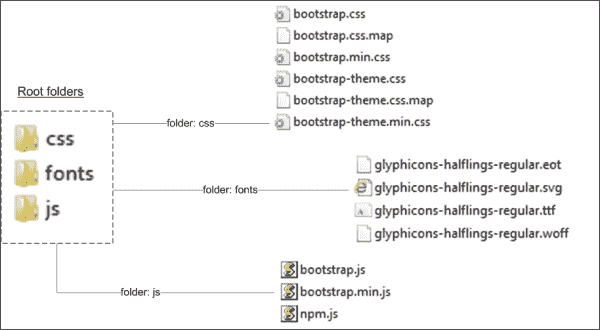
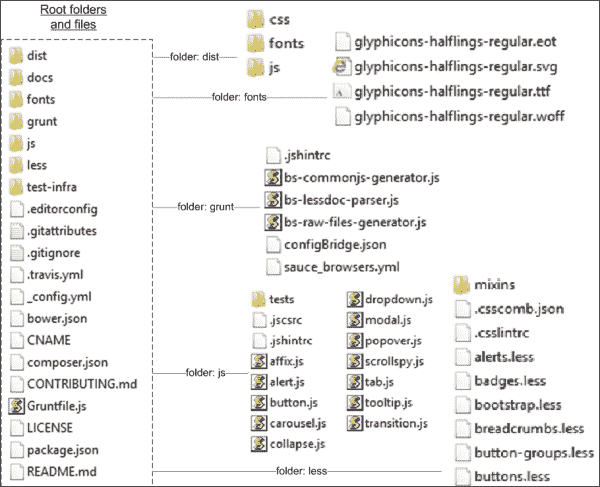
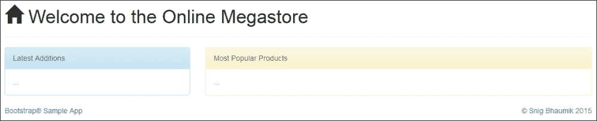
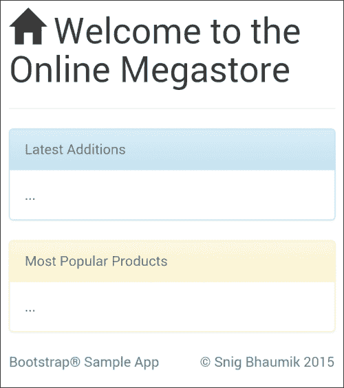
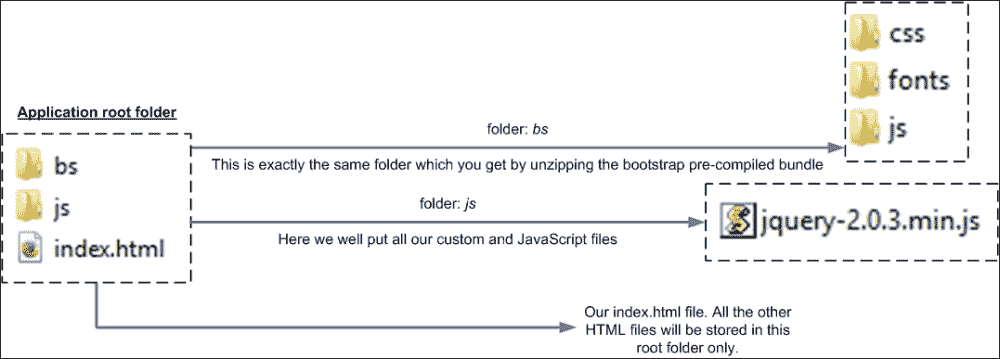

# 第二章：Bootstrap 入门

在上一章中，我们了解了为什么以及在哪里需要使用 Bootstrap。我们还知道了 Bootstrap 由哪些主要成分组成。在本章中，我们将下载并开始使用 Bootstrap。重要的是，我们将开始开发我们自己的简单 Web 应用程序，并使用 Bootstrap 的所有主要功能。

在本章中，我们将涵盖以下主题：

+   如何下载 Bootstrap

+   理解 Bootstrap 文件结构

+   CSS 预处理器的基本介绍

+   使用示例 Web 应用程序开始使用 Bootstrap

# 获取 Bootstrap

Bootstrap 是一个开源软件（在 MIT 许可下发布），完整源代码可以免费获取。

你可以通过两种方式下载 Bootstrap。

+   获取预编译捆绑包：

    1.  导航至 [`github.com/twbs/bootstrap/releases/download/v3.3.1/bootstrap-3.3.1-dist.zip`](https://github.com/twbs/bootstrap/releases/download/v3.3.1/bootstrap-3.3.1-dist.zip)。

    1.  这将下载编译并压缩的 `bootstrap-3.3.1-dist.zip` 文件，其中包含所有打包的 CSS、JavaScript 和字体文件。

        ### 小贴士

        本书的结构是基于 Bootstrap 版本 3.3.1，这是写作时的最新版本。

+   获取完整源代码：

    1.  导航至 [`github.com/twbs/bootstrap/archive/v3.3.1.zip`](https://github.com/twbs/bootstrap/archive/v3.3.1.zip)。

    1.  这将下载 Bootstrap 的完整源代码捆绑包。在使用之前，你必须安装和编译源代码。

        ### 小贴士

        在后面的章节中，我们将看到如何设置 Bootstrap 源代码的开发环境以及如何编译和生成可分发文件。

        如果你打算构建 Bootstrap 的开发环境并自定义框架，则需要下载完整源代码。否则，你可以使用预先编译好的可分发捆绑包。

# Bootstrap 文件结构

现在我们已经下载了 Bootstrap 的两种版本，让我们来看看下载的存档包含什么。然而，对于你的使用，你可以下载其中任何一个。

## 预编译捆绑包

预编译和可分发捆绑包包含三个文件夹。以下是文件夹及其内容的快照。



### 文件夹：css

这个文件夹包含了所有的 Bootstrap CSS 文件。在开发过程中，您可以使用完整的 CSS 文件（非压缩版本）；然而，在生产部署中，始终建议使用压缩版本——例如 `bootstrap.min.css` 和 `bootstrap-theme.min.css`。然而，使用 Bootstrap 主题是可选的，因为原始的 Bootstrap CSS 已经包含了颜色和其他样式标签。话虽如此，始终建议使用主题文件，因为它为您提供了一个干净的方式来覆盖原始 Bootstrap 的颜色组合和主题。因此，当您想要实现自己的颜色方案和品牌时，您会覆盖并更改主题文件，而不是原始的 Bootstrap CSS 文件。

### folder: fonts

这个文件夹包含了 Bootstrap 使用的所有自定义字体。其中一个主要用途是生成 Bootstrap 中使用的 Glyphicons。

### 小贴士

我们将在稍后看到如何以及在哪里使用这些 Glyphicons。

### folder: js

Bootstrap 的所有 JavaScript 组件和插件都存储在这个文件夹中。同样，您应该使用压缩版本——`bootstrap.min.js` 文件用于生产部署。

如您所知，Bootstrap JS 插件使用 jQuery，因此在使用这些 JavaScript 扩展之前，您必须在您的 HTML 页面中包含 jQuery。

### 小贴士

默认情况下，这个 JS 文件包含了 Bootstrap 提供的所有 JavaScript 插件，但是如果您只想使用一些选定的插件，您也可以包含特定的 JS 文件。我们将在后面的章节中更深入地探讨这一点。

## 源代码包

这里是源代码包中包含的文件和文件夹。



如您所见，源代码包相当全面，包含了大量内容。

然而，以下是最重要的。

### rfolder: dist

这是收集所有最终可分发文件的文件夹。如果您看到这个文件夹的内容与我们在上一节中看到的可分发包相同。

当我们在后面的章节中构建 Bootstrap 的开发环境时，我们将看到编译后的输出文件将存储在这个文件夹中。

### folder: fonts

Bootstrap 中使用的所有字体的源文件夹和文件。

### folder: grunt

Bootstrap 使用 Grunt 来执行所有与构建、编译和打包相关的任务。这个文件夹包含了所有相关和必需的文件。

### 小贴士

我们将在后面的章节中详细说明如何使用 Grunt 编译 Bootstrap。

### folder: js

所有 Bootstrap JavaScript 插件的源文件都存储在这里。

### folder: less

Bootstrap 使用 CSS 预处理器 LESS 进行编译、定制和打包。这个文件夹包含了生成最终 CSS 文件的所有 LESS 文件。

### 小贴士

在源代码包中还有其他文件和文件夹，然而，当我们讨论 Bootstrap 的 `Dev` 环境时，我们将更深入地探讨这些内容。

## CSS 预处理器

你可能已经注意到我们刚刚提到了 Bootstrap 源代码包中的 LESS 文件。在这个背景下，在继续深入 Bootstrap 之前，我们将简要讨论这种新的 CSS3 语言和技术。

CSS 预处理器是一个程序，它接受一些预处理的代码并将它们转换为浏览器理解的经典 CSS 代码。这种模式已被创新，以使 CSS 更具动态性、生产性、多用途性、效率和组织性。

传统上，CSS 不是一个编程语言（它现在仍然不是），你在一个语言中享受的所有那些功能（如 .NET、Java 或 PHP）都简单地不存在。在 CSS 中编码一直是“写两次”（WET），现在有了预处理器，我们也可以进行“不要重复自己”（DRY）编程了。

为了更好地理解场景，让我们举一些基本的例子。

这里是一个我们习惯编写的标准 CSS 段落：

```js
.text-large {
  font-family: Arial, sans-serif, verdana;
  font-weight: bold;
  font-size: 18px;
  text-transform: uppercase;
  line-height: 1.4em;
  color: #ccc;
}

.text-medium {
  font-family: Arial, sans-serif, verdana;
  font-weight: bold;
  font-size: 14px;
  text-transform: uppercase;
  line-height: 1.2em;
  color: #ccc;
}

.text-small {
  font-family: Arial, sans-serif, verdana;
  font-weight: bold;
  font-size: 12px;
  text-transform: uppercase;
  line-height: 1.0em;
  color: #ccc;
}
```

很明显，许多这些属性都是重复的。当我们想要更改一个属性（例如 `color`）时，这更加痛苦——我们需要在三个地方都进行更改。

现在进入预处理器语言。我们的新代码将是：

```js
.text {
  font-family: Arial, sans-serif, verdana;
  font-weight: bold;
  text-transform: uppercase;
  color: #ccc;
}

.text-large {
  .text;
  font-size: 18px;
  line-height: 1.4em;
}

.text-medium {
  .text;
  font-size: 14px;
  line-height: 1.2em;
}

.text-small {
  .text;
  font-size: 12px;
  line-height: 1.0em;
}
```

所以我们做的就是创建了一个包含所有常见属性的类，并将其包含在所有需要的地方。因此，如果我想更改 `color`，我只需在 `.text` 类中更改一次，其他所有地方都会更新。

这大大提高了你 CSS 开发和维护的可重用性和效率。我们之前只看到了一个 CSS 预处理器语言的语法——LESS。还有一些其他类似的语言，如 Sass、Stylus、Turbine 和 Switch CSS。尽管 **Syntactically Awesome Stylesheets** （Sass）和 LESS 是其中最受欢迎的。

这些语言提供了许多有趣和强大的功能。以下是一些重要功能的介绍。

### 小贴士

请注意，除非明确提及，以下所有语法都是 LESS 预处理器语言的。

## 变量

现在，你还可以在预处理的代码中定义变量。例如，

```js
@color-main: #444;
@color-nav: #333;
@color-text: #222;
@color-foot: #111;
body {
  color: @color-main;
}
div {
  color: @color-text;
}
.navigation {
  color: @color-nav;
}
.footer {
  color: @color-foot;
}
```

## 混入

根据维基百科，"混入（mixin）是一个包含来自其他类的方法组合的类。" 在 CSS 的情况下，这大大增强了可重用性，因为你在那里定义了一个类和一组规则，并在多个实例中重用这组规则。

早期的第一个代码段（包含 `.text`、`.text-large` 和其他类的那个）是 LESS 编写的混入示例。在那里我们只定义了 `.text` 类一次，并在多个地方使用了它。

## 操作

趣味的是，现在你还可以使用 CSS 预处理器进行数学运算。例如，在 LESS 中，你编写以下代码：

```js
@color-main: #111;
.header {
  color: @color-main * 3;
}
```

生成的 CSS 代码将简单地如下所示：

```js
.header {
color: #333;
}
```

## 嵌套

考虑这个代码段：

```js
h1 {
  font-family: Arial,sans-serif,verdana;
  font-size: 12px;
  font-weight: bold;
  line-height: 1.4em;
  a {
    color: black;
    &:hover {
      text-decoration: none;
    }
  }
}
```

这肯定比编写以下代码看起来更有组织和结构：

```js
h1 {
  font-family: Arial,sans-serif,verdana;
  font-size: 12px;
  font-weight: bold;
  line-height: 1.4em;
}
h1 a {color:black;}
h1 a:hover {text-decoration:none;}
```

第一个是您会在 LESS 中编写的预处理器代码，第二个是生成（或处理）的 CSS 代码，准备在浏览器中渲染——这与我们以前通常编写的内容没有区别。

由于每个预处理器都是另一种语言，它们都有自己的语法和编写代码的方式——这并不是你熟悉的 CSS 语法。然而，在处理（即编译）之后，它们都会生成浏览器可以理解的标准化和相同的 CSS 代码。

### 注意

本书的内容范围不包括 CSS 预处理器完整的安装和工作指南，因此我们将仅限于 Bootstrap 的上下文。

Bootstrap 支持 Sass 和 LESS；在本书中，我们将使用 LESS 来介绍 Bootstrap。在后续章节中，我们将看到这些功能如何在 Bootstrap 的各个地方被使用。

# 如何使用 Bootstrap

如你所猜，要使用 Bootstrap，你需要在 HTML 页面中包含所有的 CSS 和 JavaScript 文件。一种方法是在下载 Bootstrap 后包含 CSS 和 JavaScript 文件，另一种方法是直接使用 Bootstrap 的 CDN 文件。

### 注意

CDN 代表内容分发（或分发）网络。它是一个由多个地点的分布式服务器组成的庞大系统。目标是向最终用户提供高性能和高可用性的内容。

如果下载了 Bootstrap 的本地副本，我们将在 HTML 的 HEAD 部分添加以下内容：

```js
<link rel="stylesheet" href="bootstrap.min.css">
<link rel="stylesheet" href="bootstrap-theme.min.css">
<script src="img/bootstrap.min.js"></script>
```

此外，在 Bootstrap 的 CDN 的情况下：

```js
<link rel="stylesheet" href="https://maxcdn.bootstrapcdn.com/bootstrap/3.3.1/css/bootstrap.min.css">
<link rel="stylesheet" href="https://maxcdn.bootstrapcdn.com/bootstrap/3.3.1/css/bootstrap-theme.min.css">
<script src="img/bootstrap.min.js"></script>
```

这是我们的第一个使用 Bootstrap 的 HTML 页面：

```js
<!DOCTYPE html>
<html lang="en">
  <head>
    <title>Welcome to the Online Megastore</title>
    <meta name="viewport" content="width=device-width, initial-scale=1">
    <link href="bs/css/bootstrap.min.css" rel="stylesheet">
    <link href="bs/css/bootstrap-theme.min.css" rel="stylesheet">
    <script type="text/javascript" src="img/jquery-2.0.3.min.js"></script>
    <script type="text/javascript" src="img/bootstrap.min.js"></script>
  </head>
  <body>
    <div class="container">
      <div class="page-header"><h1><span class="glyphicon glyphicon-home"></span>&nbsp;Welcome to the Online Megastore</h1></div>
      <div class="row">
        <div class="col-xs-12 col-sm-12 col-md-4 col-lg-4">
          <div class="panel panel-info">
            <div class="panel-heading">Latest Additions</div>
            <div class="panel-body">...</div>
          </div>
        </div>
        <div class="col-xs-12 col-sm-12 col-md-8 col-lg-8">
          <div class="panel panel-warning">
            <div class="panel-heading">Most Popular Products</div>
            <div class="panel-body">...</div>
          </div>
        </div>
      </div>
    </div>
    <div id="footer">
      <div class="container"> 
        <div class="text-muted pull-left"><a href="http://www.packtpub.com" target="_blank">Bootstrap&reg; Sample App</a></div>
        <div class="text-muted pull-right">&copy; <a href="http://about.me/snig" target="_blank">Snig Bhaumik</a> 2015</div>
      </div>
    </div>
  </body>
</html>
```

在桌面屏幕上，输出将如下所示：



当然，这可能不是一个非常令人印象深刻的网页，但我们仍然开始使用 Bootstrap 的基本类创建网页。

然而，更重要的是，以下是在移动屏幕上同一页面的视图：



正如你可能注意到的，这两个块已经自动调整并垂直渲染，而在桌面端，它们是水平渲染的。

在本书中，我们将创建一个示例基本在线商店应用程序。在后续的每一章中，我们将探索和学习更多关于 Bootstrap 各个功能的特点；并将在这个应用程序中添加更多功能。

最后，我们将使用 Bootstrap 创建一个完整简单且响应式的应用程序用户体验。在这里，我们开始创建应用程序的基础结构。

## 应用程序文件夹结构

首先，这是我们的应用程序文件夹结构：



### 注意

请记住，我们只限于创建应用程序的 HTML/客户端部分；当然，服务器端或数据交易部分超出了本书的范围。

我们将在应用中使用所有下载的文件副本，而不是使用任何 CDN 链接。

`bs` 文件夹是预编译捆绑包的未压缩和未修改版本。在这个文件夹中，我们包含了 Bootstrap 所需的所有文件，准备使用。因此，在 HTML 代码中，我们以以下方式引用了 CSS 和 JS 文件：

```js
<link href="bs/css/bootstrap.min.css" rel="stylesheet">
<link href="bs/css/bootstrap-theme.min.css" rel="stylesheet">
<script type="text/javascript" src="img/bootstrap.min.js"></script>
```

`js` 文件夹用于存放所有自定义（我们应用特定的文件）和其他第三方 JavaScript 文件。我们不应该在 Bootstrap 文件夹中合并任何其他 JS 或 CSS 文件；这就是为什么我们创建了一个单独的文件夹来存储所有这些文件，除了 Bootstrap。在这种情况下，我们在这里添加了 jQuery 脚本文件（`jquery-2.0.3.min.js`）。

### 小贴士

顺便提醒一下，Bootstrap 使用并依赖于 jQuery 来实现其所有 JavaScript 插件。因此，我们在引用 Bootstrap JS 文件之前添加了 jQuery。

`index.html` 文件是我们简单应用的首页——在早期的文本中，你看到了这个文件的代码。我们将根据应用的需求在此位置添加更多 HTML 文件。

# 概述

在本章中，我们了解了市场上可用的 CSS 预处理器；我们还了解了一些使用这些预处理器工具和语言的特点和优势。

我们学习了如何下载 Bootstrap 框架，以及 Bootstrap 包中可用的各种风味。我们了解到，文件和文件夹都包含在每个分发的包中。

最后，我们学习了如何创建一个包含并使用 Bootstrap 的简单网页。

我们已经开始创建一个示例网络应用，并使用 Bootstrap CSS 创建了我们的第一个页面。我们还建立了一个基础结构，我们将在这个基础上开发示例网络应用。

在下一章中，我们将探索 Bootstrap 提供的所有 CSS 类和功能，并使用这些类为我们的网络应用添加更多功能。
