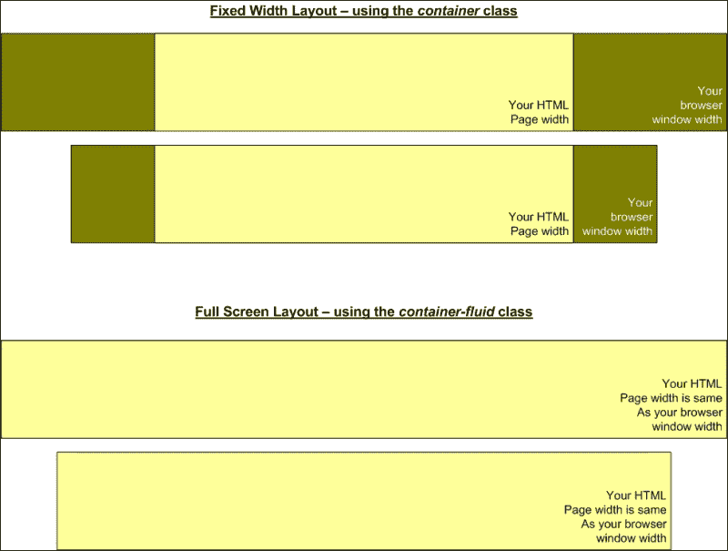
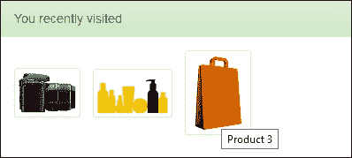
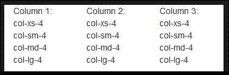
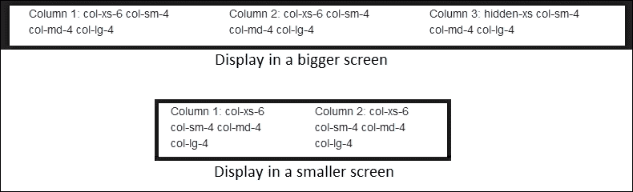
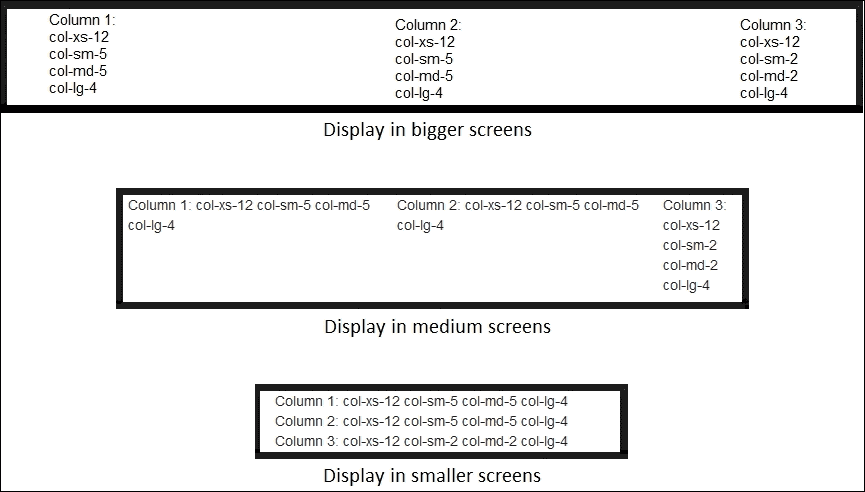
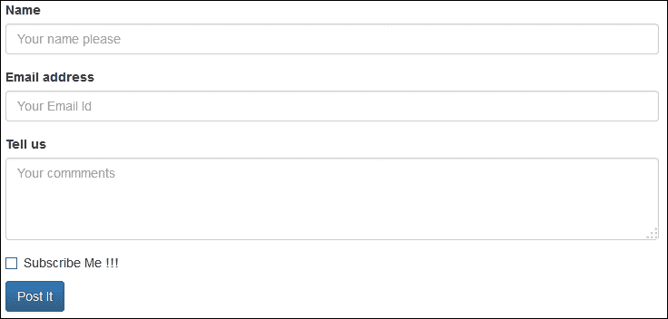
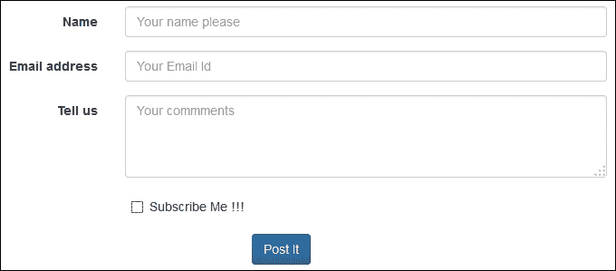
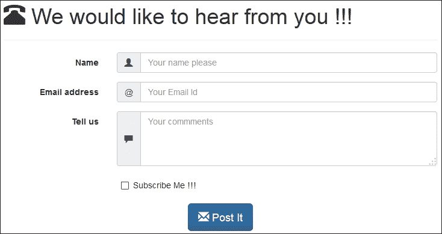
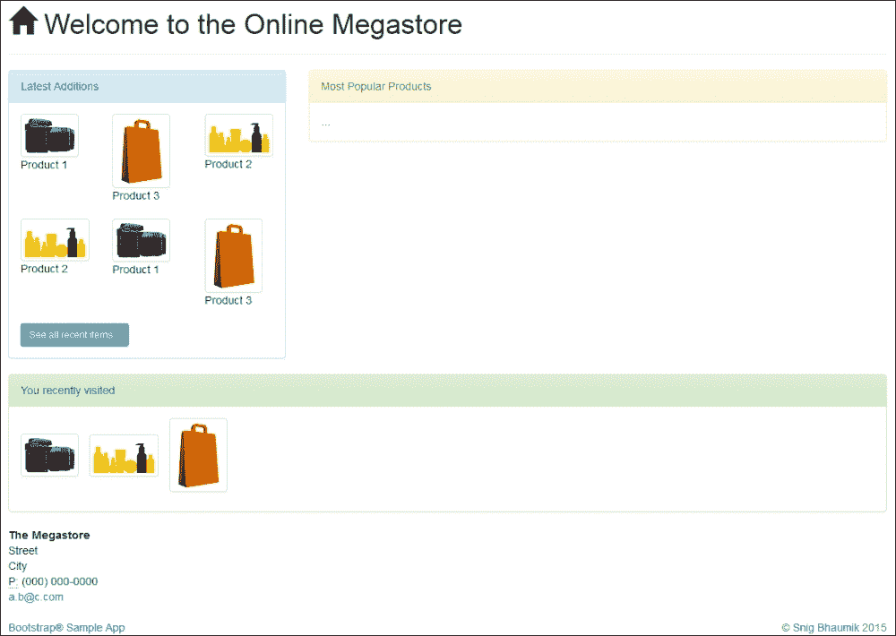
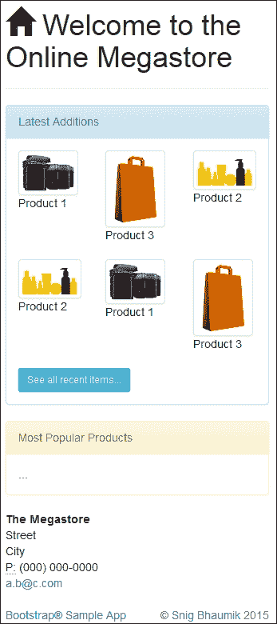

# 第三章：使用 Bootstrap CSS 创建响应式布局

使用 Bootstrap 时的基本想法和规则是，你不应该创建自己的 CSS 类和样式；相反，你应该始终利用和适应框架提供的类。这样，你将能够利用 Bootstrap 提供的全部功能和潜力。为此，你必须了解框架提供的所有类。当然，你可以根据你的需求和品牌更新和扩展这些类；我们将在稍后看到如何做到这一点。

在本章中，我们将介绍 Bootstrap 所配备的多数主要 CSS 类。我们将涵盖以下内容：

+   Bootstrap 的 HTML 文件结构

+   基本 HTML 元素

+   Bootstrap 中响应式类别的详细信息

+   处理图片

+   理解 Bootstrap 中的至关重要的网格系统

+   构建数据输入表单

# Bootstrap 的基本 HTML 结构

在本节中，我们将探讨当你使用 Bootstrap 作为前端框架时基本的 HTML 文件结构。

## head 部分

只为了回顾，你的 HTML 文件必须标记为 HTML5 `doctype`。因此，你总是在文件的开始处包含这个：

```js
<!DOCTYPE html>
<html lang="en">
  ...
</html>
```

第二个重要的事情是，你必须在你的 head 部分包含 `meta viewport` 标签。例如：

```js
<meta name="viewport" content="width=device-width, initial-scale=1">
```

然后，你当然会包含 Bootstrap CSS 和 JS 文件。因此，你的 HTML 文件的简约 head 部分看起来如下：

```js
<!DOCTYPE html>
<html lang="en">
  <head>
    <title>…</title>
    <meta name="viewport" content="width=device-width, initial-scale=1">
    <link href="bs/css/bootstrap.min.css" rel="stylesheet">
    <link href="bs/css/bootstrap-theme.min.css" rel="stylesheet">

    <script type="text/javascript" src="img/jquery-2.0.3.min.js"></script>
    <script type="text/javascript" src="img/bootstrap.min.js"></script>
  </head>

  <body>
    …
  </body>
</html>
```

## 正文部分

你所有的 HTML 正文部分必须放置在具有 `container` 或 `container-fluid` 类的 `div` 元素内部：

```js
  <body>
    <div class="container">
...
    </div>
  </body>
```

`container` 类确保你的页面将以响应式固定宽度样式渲染。而 `container-fluid` 类则将你的页面渲染为响应式全宽度设计。因此，如果你想让你的页面在屏幕中间具有固定宽度，而不考虑浏览器窗口的宽度，那么请使用 `container` 类。另一方面，如果你想让你的页面始终占用整个屏幕，你需要使用 `container-fluid` 类。以下图表说明了这一点：



# 基本 HTML 元素

如你所预期，所有标准 HTML5 元素在 Bootstrap 中都被考虑并进行了样式化。因此，你只需简单地使用任何基本 HTML 元素，这些元素将被渲染为 Bootstrap 特定的样式和行为。

例如，从 H1 到 H6 的所有标题标签都可以直接使用。你只需简单地写：

```js
<h1>This is a Heading</h1>
```

趣味的是，如果你想在其他任何元素中使用相同的标题样式，你可以简单地使用提供的 `.h1 CSS` 类。

所有以下标准 HTML5 元素都包含在 Bootstrap 的响应式样式集中：

+   段落 – `<p>`

+   突出显示 – `<mark>`

+   删除文本 – `<del>`

+   插入文本 – `<ins>`

+   删除线 – `<s>`

+   下划线 – `<u>`

+   粗体 – `<strong>` 或 `<b>`

+   斜体 – `<em>` 或 `<i>`

+   缩写 – `<abbr>`

+   地址 – `<address>`

+   引用块 – `<blockquote>`

+   列表 – `<ul>`, `<ol>`, `<li>`

+   描述列表 – `<dl>`, `<dd>`

+   代码 – `<code>`, `<samp>`, `<kbd>`, `<var>`

+   表格 – `<table>`, `<thead>`, `<tbody>`, `<tr>`, `<td>`

+   表单元素 – `<form>`, `<label>`, `<text>`, `<textarea>`, `<password>`, `<datetime>`, `<number>`, `<email>`, `<date>`, `<month>`, `<week>`, `<time>`, `<tel>`, `<color>`, `<url>`, `<search>`, `<input>`, `<button>`

# 响应式类

由于 Bootstrap 的主要重点是创建最小努力优化的移动网站，因此该框架提供了一些类来控制你的桌面和移动网站版本。

## 理解基础知识

Bootstrap 使用四个不同的标记来控制和提及元素和设备尺寸。以下表格列出了这些标记并详细说明了它们：

| 标记名称 | 目标设备/屏幕尺寸 | 元素 |
| --- | --- | --- |
| `xs` | 适用于超小设备，例如宽度<768px 的手机。示例类名：`.hidden-xs` | 将渲染具有超小尺寸的元素。例如，在按钮的情况下，字体大小将是 12px，行高将是 1.5，填充将是 1px 5px。使用：`.btn-xs` |
| `sm` | 适用于小设备，例如宽度≥768px 且<992px 的平板电脑和手机。示例类名：`.hidden-sm` | 将渲染具有小尺寸的元素。例如，在按钮的情况下，字体大小将是 12px，行高将是 1.5，填充将是 5px 10px。使用：`.btn-sm` |
| `md` | 适用于中等尺寸设备，例如宽度≥992px 且<1200px 的桌面。示例类名：`.hidden-md` | 默认尺寸 |
| `lg` | 适用于大设备，例如宽度≥1200px 的大桌面显示器和电视。示例类名：`.hidden-lg` | 将渲染具有大尺寸的元素。例如，在按钮的情况下，字体大小将是 18px，行高将是 1.33，填充将是 10px 16px。使用：`.btn-lg` |

## 控制跨设备的元素显示

如果你在你的 HTML 代码中添加一个带有 CSS 类`.hidden-sm`的`div`元素，这个`div`元素将在所有小设备（宽度≥768px 且<992px 的设备）中隐藏；而在所有其他设备（那些不在这个定义的宽度范围内的设备）中显示。Bootstrap 会自动检测客户端设备的尺寸和分辨率，并相应地渲染元素。

以下表格列出了这些类及其对应的渲染效果：

| 类名 | 超小设备，例如宽度<768px 的手机 | 小设备，例如宽度≥768px 且<992px 的平板电脑和手机 | 中等尺寸设备，例如宽度≥992px 且<1200px 的桌面 | 大设备，例如宽度≥1200px 的大桌面显示器和电视 |
| --- | --- | --- | --- | --- |
| `.hidden-xs` | ✗ | ✓ | ✓ | ✓ |
| `.hidden-sm` | ✓ | ✗ | ✓ | ✓ |
| `.hidden-md` | ✓ | ✓ | ✗ | ✓ |
| `.hidden-lg` | ✓ | ✓ | ✓ | ✗ |

例如，查看以下代码：

```js
<div class="hidden-xs">This DIV will be hidden in extra small devices, and will be displayed in all other devices.</div>
```

同样，如果您希望您的`div`元素仅在大型设备上显示，而在较小设备上不显示（当您不希望在手机上渲染大型媒体文件时，这是一个非常常见的用例），您只需使用类`.visible-lg-block`：

| 类名 | 非常小的设备，例如宽度小于 768px 的手机 | 小型设备，例如宽度在 768px 至 992px 之间的平板电脑和手机 | 中等尺寸设备，例如宽度在 992px 至 1200px 之间的桌面电脑 | 大型设备，例如宽度大于等于 1200px 的大桌面显示器和电视 |
| --- | --- | --- | --- | --- |
| `.visible-xs-block`, `.visible-xs-inline`, `.visible-xs-inline-block` | ✓ | ✗ | ✗ | ✗ |
| `.visible-sm-block`, `.visible-sm-inline`, `.visible-sm-inline-block` | ✗ | ✓ | ✗ | ✗ |
| `.visible-md-block`, `.visible-md-inline`, `.visible-md-inline-block` | ✗ | ✗ | ✓ | ✗ |
| `.visible-lg-block`, `.visible-lg-inline`, `.visible-lg-inline-block` | ✗ | ✗ | ✗ | ✓ |

例如，请看以下代码：

```js
<div class="visible-lg-block">This DIV will be displayed only in large devices, and will be hidden in all other devices.</div>
```

因此，您可以通过使用前面的类来控制您的 HTML 元素的可视性，根据最终用户使用的目标设备。在先前的例子中，`div`元素仅在大型设备上显示，而在任何较小或中等设备上都不会显示。

如果您希望您的 HTML 元素在中等和大型设备上显示，但在较小设备上不显示，您可以添加类`.visible-md-block`和`.visible-lg-block`。

# 渲染图片

如您所知，根据可用空间和屏幕大小控制图片渲染是一个挑战，尤其是在响应式网站上。

Bootstrap 再次提供了解决方案——您只需将`.img-responsive`类添加到您的`IMG HTML`元素中，这就足够了。

### 提示

重要的是要注意，除了图片之外，当您在页面中包含 Bootstrap CSS 时，大多数其他 HTML 元素会自动响应用户设备。然而，在图片的情况下，您需要手动添加此类。

这只是给您的图片添加以下 CSS 样式：

```js
.img-responsive
{
display: block;
max-width: 100%;
height: auto;
}
```

因此，图片将根据其容器元素的宽度全宽显示，图片的高度将根据其宽高比进行缩放，这不受图片实际大小的影响。

### 注意

如您所见，响应式图片类消耗了容器元素的 100%宽度，至于如何正确地构建父元素结构，则取决于您。

例如，如果您使用硬编码的大小固定父元素的宽度，那么拥有这个`.img-responsive`类的整个目的就被取消了。您始终需要确保您在页面上的 HTML 元素上没有设置任何固定宽度，以便使您的网页正确响应。

也有一些实用类，对于您的图片样式非常有用。例如，如果您希望您的图片以柔和的圆角（iOS 设计之后最受欢迎的模式）渲染，您可以使用类`.img-rounded`。它只是给图片添加一个 6px 的边框半径：

```js
.img-rounded {
border-radius: 6px;
}
```

如果您想将图片渲染为圆形（或椭圆形，取决于图片的宽高比），则使用类`.img-circle`：

```js
.img-circle {
border-radius: 50%;
}
```

最后，如果您想为图片添加一个小边框，请使用类`.img-thumbnail`。

```js

```

### 小贴士

一个例外是`.img-thumbnail`类；如果您使用`.img-thumbnail`类，则不需要包含`.img-responsive`类，因为大多数响应式样式都包含在缩略图类本身中。

## 在示例应用程序中显示响应式图片

让我们现在在我们的购物车 Web 应用程序中添加一些产品图片。以下是代码：

```js
<ul class="list-inline">
  <li></li>
  <li></li>
  <li></li>
</ul>
```

输出将类似于以下截图：



请注意以下要点：

+   我们使用了 UL 的`.list-inline`类来在单行中显示产品图片

+   然而，在非常窄的手机屏幕上，图片将会垂直堆叠。

+   **您最近访问**的标题并非来自前面的代码；我们将在接下来的章节中很快看到完整的代码。

# 网格系统

设计响应式网站的基本规则之一是尽可能去除传统的 HTML 表格，并使用流体 div 元素。

Bootstrap 网格系统的基本架构是将屏幕水平划分为最多 12 列（逻辑上）。Bootstrap 提供了类来创建每种设备尺寸的列组合 - 如下矩阵所示：

| 类名 | 描述 |
| --- | --- |
| .col-xs-1, .col-sm-1, .col-md-1, .col-lg-1 | 用于在相应设备尺寸中占用一列的类。 |
| .col-xs-2, .col-sm-2, .col-md-2, .col-lg-2 | 用于在相应设备尺寸中占用两列的类。 |
| .col-xs-3, .col-sm-3, .col-md-3, .col-lg-3 | 用于在相应设备尺寸中占用三列的类。 |
| .col-xs-4, .col-sm-4, .col-md-4, .col-lg-4 | 用于在相应设备尺寸中占用四列的类。 |
| .col-xs-5, .col-sm-5, .col-md-5, .col-lg-5 | 用于在相应设备尺寸中占用五列的类。 |
| .col-xs-6, .col-sm-6, .col-md-6, .col-lg-6 | 用于在相应设备尺寸中占用六列的类。 |
| .col-xs-7, .col-sm-7, .col-md-7, .col-lg-7 | 用于在相应设备尺寸中占用七列的类。 |
| .col-xs-8, .col-sm-8, .col-md-8, .col-lg-8 | 用于在相应设备尺寸中占用八列的类。 |
| .col-xs-9, .col-sm-9, .col-md-9, .col-lg-9 | 用于在相应设备尺寸中占用九列的类。 |
| .col-xs-10, .col-sm-10, .col-md-10, .col-lg-10 | 在相应设备大小中用于占用十个列的类。 |
| .col-xs-11, .col-sm-11, .col-md-11, .col-lg-11 | 在相应设备大小中用于占用十一个列的类。 |
| .col-xs-12, .col-sm-12, .col-md-12, .col-lg-12 | 在相应设备大小中用于占用所有十二列的类。 |

我们将举几个示例场景来说明这一点。在我们的第一个场景中，假设我们想要创建三个等宽的列——无论所有设备大小如何。这个代码如下：

```js
<div class="row">
  <div class="col-xs-4 col-sm-4 col-md-4 col-lg-4">
    Column 1: col-xs-4 col-sm-4 col-md-4 col-lg-4
  </div>
  <div class="col-xs-4 col-sm-4 col-md-4 col-lg-4">
    Column 2: col-xs-4 col-sm-4 col-md-4 col-lg-4
  </div>
  <div class="col-xs-4 col-sm-4 col-md-4 col-lg-4">
    Column 3: col-xs-4 col-sm-4 col-md-4 col-lg-4
  </div>
</div>
```

这里是输出（在所有设备上可见）：



在我们的第二个场景中，假设我们只想在较小屏幕上显示前两列，第三列将不会显示，而在较大屏幕上我们保持相同的设计。我们的代码如下：

```js
<div class="row">
  <div class="col-xs-6 col-sm-4 col-md-4 col-lg-4">
    Column 1: col-xs-6 col-sm-4 col-md-4 col-lg-4
  </div>
  <div class="col-xs-6 col-sm-4 col-md-4 col-lg-4">
    Column 2: col-xs-6 col-sm-4 col-md-4 col-lg-4
  </div>
  <div class="hidden-xs col-sm-4 col-md-4 col-lg-4">
    Column 3: hidden-xs col-sm-4 col-md-4 col-lg-4
  </div>
</div>
```

因此，输出如下：



在第三个场景中，假设在较小屏幕上我们需要所有列都垂直排列。在中等屏幕上，前两列应占用更多空间，而在大屏幕上它们应该是相等的。以下是我们的代码：

```js
<div class="row">
  <div class="col-xs-12 col-sm-5 col-md-5 col-lg-4">
    Column 1: col-xs-12 col-sm-5 col-md-5 col-lg-4
  </div>
  <div class="col-xs-12 col-sm-5 col-md-5 col-lg-4">
    Column 2: col-xs-12 col-sm-5 col-md-5 col-lg-4
  </div>
  <div class="col-xs-12 col-sm-2 col-md-2 col-lg-4">
    Column 3: col-xs-12 col-sm-2 col-md-2 col-lg-4
  </div>
</div>
```

输出如下：



如您所见，三列的宽度（和可见性）正由类根据目标设备和屏幕大小自动控制。

要创建一个一列宽度的占位符，您使用`.col-*-1`类；对于两列宽度，您使用`.col-*-2`类；依此类推。对于一个占用所有 12 列空间的占位符，您使用`.col-*-12`类。这里的`*`代表您要针对的相应设备大小（如`xs`、`sm`、`md`和`lg`）。

这里最重要的一个点就是列的总大小必须始终为 12——如果小于 12，则会有一些空间未被使用，如果大于 12，则最后一个占位符将被换行。

这也是为什么在第一个场景中，我们为所有设备大小使用了具有四列大小的类，如`col-xs-4`、`col-sm-4`等。由于我们有三个占位符在一行中，每个占位符的大小变为`4`（3X4=12）。

在第二个场景中，对于超小设备，我们使前两个占位符每个都使用`col-xs-6`，而第三个占位符被隐藏（6+6=12）。

在第三个场景中，我们使第一个占位符在最小设备上跨越整个宽度（`col-xs-12`）。对于中等设备，我们使前两列占用大部分空间（5+5+2=12）。而对于大设备，所有占位符都是相等的。

因此，您可以看到，Bootstrap 的网格系统使您能够轻松地为所有设备大小创建表格布局，而且无需任何额外的复杂 CSS/JavaScript 编码。

# 构建数据输入表单

**表单**是网页的组成部分——无论何时您需要从用户那里捕获任何信息，您都需要在页面上创建一个网络表单。Bootstrap 提供了多种方式来设计和创建适用于移动设备和桌面的 HTML 表单。

让我们为我们的网络应用程序创建一个 *联系我们* 表单。以下是我们的代码：

```js
<form>
  <div class="form-group">
    <label for="yourName" class="control-label">Name</label>
    <input type="text" class="form-control" id="yourName" placeholder="Your name please">
  </div>
  <div class="form-group">
    <label for="yourEmail" class="control-label">Email address</label>
    <input type="email" class="form-control" id="yourEmail" placeholder="Your Email Id">
  </div>
  <div class="form-group">
    <label for="yourComments" class="control-label">Tell us</label>
    <textarea class="form-control" id="yourComments" placeholder="Your commments" rows="3"></textarea>
  </div>
  <div class="checkbox">
    <label><input type="checkbox">Subscribe Me !!!</label>
  </div>
  <button type="submit" class="btn btn-primary">Post It</button>
</form>
```

下面是表单可能的样子：



## 使表单水平排列

假设现在我们想要将标签水平地与控件并排显示。执行此操作的代码如下：

```js
<form class="form-horizontal">
  <div class="form-group">
    <label for="yourName" class="col-sm-3 control-label">Name</label>
    <div class="col-sm-9">
      <input type="text" class="form-control" id="yourName" placeholder="Your name please">
    </div>
  </div>
  <div class="form-group">
    <label for="yourEmail" class="col-sm-3 control-label">Email address</label>
    <div class="col-sm-9">
      <input type="email" class="form-control" id="yourEmail" placeholder="Your Email Id">
    </div>
  </div>
  <div class="form-group">
    <label for="yourComments" class="col-sm-3 control-label">Tell us</label>
    <div class="col-sm-9">
      <textarea class="form-control" id="yourComments" placeholder="Your commments" rows="3"></textarea>
    </div>
  </div>
  <div class="col-sm-9 col-sm-offset-3">
    <div class="checkbox">
      <label><input type="checkbox">Subscribe Me !!!</label>
    </div>
  </div>
  <div class="clearfix">&nbsp;</div>
  <div class="col-sm-12 text-center">
    <button type="submit" class="btn btn-primary">Post It</button>
  </div>
</form>
```

输出结果如下所示：



## 完成联系我们页面

让我们通过为每个文本控件添加一些上下文图标来进一步美化表单。我们将在应用程序中创建一个完整的 *联系我们* 页面。以下是代码：

```js
<!DOCTYPE html>
<html lang="en">
  <head>
    <title>Contact Us</title>
    <meta name="viewport" content="width=device-width, initial-scale=1">
    <link href="bs/css/bootstrap.min.css" rel="stylesheet">
    <link href="bs/css/bootstrap-theme.min.css" rel="stylesheet">

    <script type="text/javascript" src="img/jquery-2.0.3.min.js"></script>
    <script type="text/javascript" src="img/bootstrap.min.js"></script>
  </head>

  <body>
    <div class="container">
      <div class="page-header"><h1><span class="glyphicon glyphicon-phone-alt"></span>&nbsp;We would like to hear from you !!!</h1></div>

      <form class="form-horizontal">
        <div class="form-group">
          <label for="yourName" class="col-sm-3 control-label">Name</label>
          <div class="col-sm-9">
            <div class="input-group">
              <span class="input-group-addon glyphicon glyphicon-user"></span>
              <input type="text" class="form-control" id="yourName" placeholder="Your name please">
            </div>
          </div>
        </div>
        <div class="form-group">
          <label for="yourEmail" class="col-sm-3 control-label">Email address</label>
          <div class="col-sm-9">
            <div class="input-group">
              <span class="input-group-addon">@</span>
              <input type="email" class="form-control" id="yourEmail" placeholder="Your Email Id">
            </div>
          </div>
        </div>
        <div class="form-group">
          <label for="yourComments" class="col-sm-3 control-label">Tell us</label>
          <div class="col-sm-9">
            <div class="input-group">
              <span class="input-group-addon glyphicon glyphicon-comment"></span>
              <textarea class="form-control" id="yourComments" placeholder="Your commments" rows="3"></textarea>
            </div>
          </div>
        </div>
        <div class="col-sm-9 col-sm-offset-3">
          <div class="checkbox">
            <label><input type="checkbox">Subscribe Me !!!</label>
          </div>
        </div>
        <div class="clearfix">&nbsp;</div>
        <div class="col-sm-12 text-center">
          <button type="submit" class="btn btn-primary btn-lg"><span class="glyphicon glyphicon-envelope"></span>&nbsp;Post It</button>
        </div>
      </form>
    </div>
  </body>
</html>
```

下面是页面可能的样子：



现在我们来看看幕后发生了什么：

+   `.form-group` 类用于封装组内的多个控件——就像我们对标签和相应的文本框所做的那样。

+   `.control-label` 和 `.form-control` 类分别用于设置标签和表单元素的样式。

+   如果您想要创建一个具有水平标签和控件的表单——请使用 `.form-horizontal` 类，并将标签和控件放置为网格列。`.control-group` 类将作为表单中的每一行。

+   使用 `.input-group` 类可以将多个控件关联在一起。

+   您可以使用 `.form-inline` 类创建内联表单，而不是使用 `form-horizontal` 类。

+   您可以为控件使用 `disabled` 或 `readonly` 状态——Bootstrap 将自动关联必要的样式，但是，所有控件都必须添加 `.form-control` 类。

+   使用 `.has-success`、`.has-warning`、`.has-error` 类来反映各种验证状态。

+   为了控制大小，您可以使用 `.input-lg`、`.input-sm` 类。为了控制一组的大小，您可以使用 `.form-group-lg` 或 `.form-group-sm` 类。

+   为了显示任何帮助文本，您可以在单独的标签中使用 `.help-block` 类。这将使文本在新的一行中显示。

+   我们使用 `.btn-primary` 类来设置按钮样式。除此之外，其他可用的类包括 `.btn-success`、`.btn-warning`、`.btn-info`、`.btn-danger` 和 `.btn-link`。

+   我们已经使用 `Glyphicons` 来美化表单。这个概念在后面的章节中会详细介绍。

# 其他实用类

Bootstrap 提供了多种其他实用 CSS 类，您可以在多种场合和目的中使用：

+   对于应遵循 Web 可访问性标准的网站（[`www.w3.org/WAI/`](http://www.w3.org/WAI/)），内容必须与屏幕阅读器和其他等效设备兼容。为此，您使用 `.sr-only` 和 `.sr-only-focusable` 类。这将确保内容对于普通人和屏幕不会被渲染；然而，它将被屏幕阅读器读出。

+   对于显示或隐藏内容，您应该分别使用 `.show` 和 `.hide` 类。

+   对于内容的水平对齐，可用的类有 `.pull-left` 和 `.pull-right`。

+   Bootstrap 提供了五种不同的前景颜色类 – `.text-primary`、`.text-danger`、`.text-warning`、`.text-info` 和 `.text-success`。同样地，对于背景，您有 `.bg-primary`、`.bg-danger`、`.bg-warning`、`.bg-info` 和 `.bg-success`。

+   对于创建表格，您会使用标准的 `<table>` 标签；然而，除了这个之外，我们还应该使用 `.table` 类来设置元素。为了在表格和单元格周围渲染边框，使用的是 `.table-bordered` 类；而对于显示交替颜色的行，您应该使用 `.table-striped` 类。同样地，为了在鼠标悬停时改变行的颜色，您会使用 `.table-hover` 类。

+   重要的是，为了创建响应式表格，您应该使用 `.table-responsive` 类。请注意，这个类只影响小于 768px 的设备上的显示，对于更大的设备则没有效果。

# 封装一切

我们现在使用本章讨论的类和样式重写我们的示例应用程序主页。

### 注意

完整的源代码可以从 Packt Publishing 网站下载。

在桌面上，页面现在看起来是这样的：



对于屏幕尺寸较小的设备，页面看起来如下：



# 摘要

在本章中，我们学习了 Bootstrap 框架提供的 CSS 类和功能。当然，这并不涵盖 Bootstrap 在 CSS 方面提供的所有类和功能，一个章节可能不足以涵盖 Bootstrap 提供的所有功能范围。然而，我们仍然涵盖了几乎所有的主要功能；接下来章节中我们将继续介绍其他功能。我们还在我们的示例应用程序中添加了一个新的页面，即“联系我们”，并用一些新的布局和漂亮的区域重新设计了主页。

在下一章中，我们将学习 Bootstrap 一起提供的打包组件。
