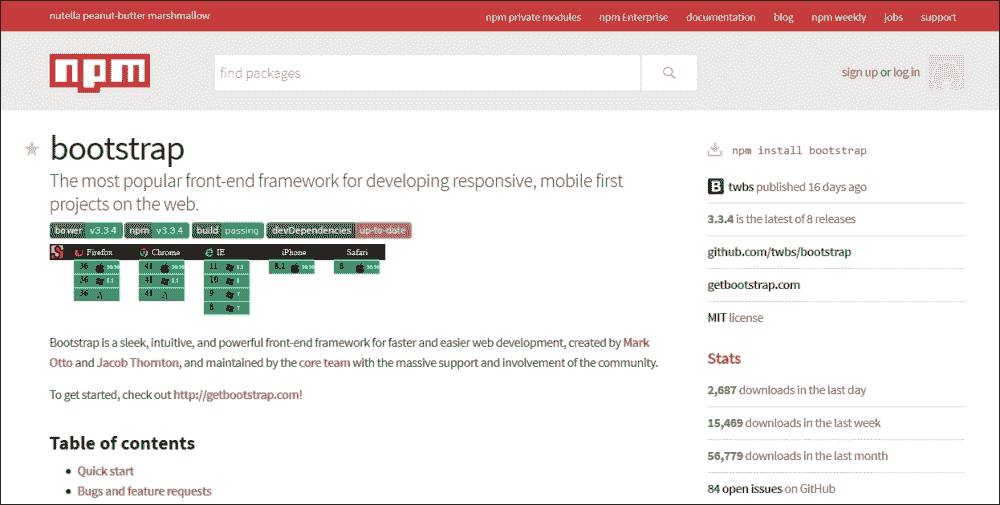

# 第六章 编译和构建 Bootstrap

到目前为止，我们已经讨论了 Bootstrap 的基础知识，了解了其架构，并探索了 Bootstrap 的所有功能和特性。

我们还使用各种 Bootstrap 组件创建了一个简单的 Web 应用程序。然而，我们使用了 Bootstrap 的 CSS 和 JS 文件，并没有更改或更新任何文件。尽管 JavaScript 文件的更新非常罕见，你也不会找到任何正常理由去更改 JS 文件中的内容，但覆盖 CSS 文件是非常常见的，在大多数情况下，当你使用 Bootstrap 作为前端框架进行最终生产使用时，这是非常必要的。你当然需要更改颜色、字体等等，以满足客户品牌指南。

尽管更新`bootstrap.css`文件并输入自己的颜色、字体名称等看起来非常简单，但你可能想象得到，这绝对不是建议的方法。

正如我们之前简要讨论过的，Bootstrap 广泛使用了**LESS**预处理器，覆盖 Bootstrap CSS 类值的正确方法是在 LESS 文件中更改这些变量。编译和构建 Bootstrap 实际上意味着编译这些 LESS 文件，生成可分发 CSS 文件，以及生成最终的 JavaScript 文件。

在本章中，我们将探讨如何为 Bootstrap 建立编译和构建环境。在下一章中，我们将探索如何使用这个开发环境更新 LESS 变量，以覆盖 Bootstrap 的默认外观和感觉。以下是本章将涵盖的主要要点：

+   构建 Bootstrap 所需的工具列表，如何安装和配置这些工具

+   如何安装 Bootstrap 源代码

+   如何使用这些工具编译和构建 Bootstrap

    ### 注意

    在这里，我们将使用各种工具来编译和构建 Bootstrap。然而，我们不会深入讨论这些工具，而是主要关注如何使用这些工具来构建 Bootstrap。

# 必需的工具

你将需要以下工具：

+   Node.js

+   Grunt

可选地，你也可以使用 Bower；然而，在我们的案例中，我们将讨论涉及和使用 node.js 的步骤。

## Node.js

**Node.js**是一个开源的服务器和网络应用程序运行时环境。简单来说，node.js 是一个服务器端 JavaScript 运行时环境。

整个框架基于 JavaScript 语言——它是用 JavaScript 编写的，在 JavaScript 运行时环境中执行；在 node.js 上开发的应用程序也是基于 JavaScript 的。它使用 Google V8 JavaScript 引擎来执行最终应用程序代码。

除了 node.js，捆绑包中还包括一个重要的组件，即**节点包管理器**（**npm**）。该组件用于查找、提取和安装 JavaScript 应用程序的所有依赖项。换句话说，它管理整个依赖项安装过程，这样你就不必找出运行和执行特定软件包所需的其他元素。

因此，我们将使用 npm 引擎来获取 Bootstrap 的源代码和所有相关软件。我们首先安装 node.js，npm 引擎将随它一起安装。

### 注意

npm 相对于 Bower 有一些优势。例如，npm 通过使用嵌套依赖项来避免依赖项冲突。而另一方面，Bower 仅针对前端进行了优化。

### 安装 node.js

如果你使用 64 位 Windows，你可以从[`nodejs.org/dist/v0.12.1/x64/node-v0.12.1-x64.msi`](http://nodejs.org/dist/v0.12.1/x64/node-v0.12.1-x64.msi)获取最新的 node.js 安装程序。

然而，对于其他发行版，请访问[`nodejs.org/download/`](https://nodejs.org/download/)。在那里你可以找到各种 Windows、Linux 和 Mac 安装程序包。下载后，在你的机器上安装 node.js。安装完成后，确保 node.js 安装文件夹包含在 Windows 可执行路径中。这是因为我们稍后将会使用 npm 的**命令行界面**（**CLI**）。让我们测试我们的安装：

1.  打开 Windows 命令提示符。

1.  输入`npm`，然后按*Enter*。如果你看到以下屏幕，说明一切正常：

## Grunt

如他们的网站所建议的，Grunt 是 JavaScript 任务运行器。几乎就像 Apache Ant 一样，你将一个长长的任务列表放入其中，然后引擎逐个执行这些任务。在基于 JavaScript 的框架和应用程序的情况下，我们使用 Grunt。

就像在 Ant 的情况下，我们有`build.xml`文件；在 Grunt 的情况下，我们有`Gruntfile.js`文件——其中列出了所有要执行的任务，这意味着这是配置 Grunt 项目的文件。

在我们当前的范围内，我们不需要了解 Grunt 和 Grunt 文件的完整架构，我们只是使用这个引擎来编译和构建 Bootstrap。

然而，首先我们必须安装 Grunt。为了编译和构建 Bootstrap 的目的，我们只需要`grunt-cli`模块，而不是完整的 Grunt 任务运行器。这是 Grunt 的 CLI 模块。

### 安装 Grunt-cli

好处是，无需手动下载。我们已经在早期部分下载并安装了 npm，现在其余的安装将由 npm 处理和管理。以管理员权限打开 Windows 命令提示符。

### 小贴士

然而，拥有管理员权限是可选的；如果你无法管理，可以继续使用正常的命令提示符。

输入以下命令：

```js
npm install -g grunt-cli

```

你应该会看到一个类似于以下截图的输出：


如你所见，`grunt-cli` 模块已被安装在我的 `C:\Users\Snig\AppData\Roaming\npm\node_modules` 文件夹中。`grunt.cmd` 命令文件被安装在 `C:\Users\Snig\AppData\Roaming\npm` 文件夹中。

在你的屏幕上检查这个输出，并标记 `grunt-cli` 已安装的文件夹。检查你的 Windows `path` 变量，如果这个文件夹已被添加到路径中，如果没有，你必须手动将这个文件夹添加到你的路径中。

### 提示

使用管理员权限（如前所述）打开 Windows 命令提示符仅用于更新此系统路径。

另一种方法当然是在你计划安装 Bootstrap 源代码、编译和构建的本地文件夹中安装 `grunt-cli`，这意味着你的 Bootstrap 开发文件夹。

假设，在我们的例子中，这个文件夹是 `D:\Bootstrap`。这将是我们下载和安装 Bootstrap、编译和构建它的开发文件夹。在下一章中，我们只在这个文件夹中自定义 Bootstrap。

为了在这个本地文件夹中安装 `grunt-cli`，我们运行以下命令：

```js
npm install --prefix D:\Bootstrap grunt-cli

```

然而，我们将继续使用第一种方法安装 Grunt，使用 `–g` 选项。此选项确保包以全局模式安装。

### 注意

关于使用 npm 安装包的更多选项和信息，请参阅 [`docs.npmjs.com/cli/install`](https://docs.npmjs.com/cli/install)。

一切完成后，你可以通过在 Windows 命令提示符中执行 Grunt 命令来测试安装，如下面的截图所示：


我们遇到这个错误是因为我们在没有配置 grunt 项目的文件夹中执行了 grunt，这意味着这个文件夹中没有 `Gruntfile.js` 文件。

# 安装 Bootstrap

我们现在将安装 Bootstrap，获取 Bootstrap 源代码，并为创建 Bootstrap 的开发环境做准备。按照以下步骤操作：

1.  打开 Windows 命令提示符并导航到 `D:\Bootstrap` 文件夹。

1.  执行以下命令：

    ```js
    npm install bootstrap

    ```

1.  你将得到以下输出：

如你所猜，Bootstrap 3.3.4 版本已被下载和安装。现在，让我们看看我们的安装文件夹：

+   你已经创建了一个名为 `node_modules` 的新文件夹

+   在 `node_modules` 文件夹中，已创建了一个名为 `bootstrap` 的新文件夹

+   在这个新文件夹中，你已经获取了 Bootstrap 源代码包

注意，之前的命令下载并安装了 Bootstrap 的最新可用版本。如果你需要任何旧版本，你可以执行此命令（在此命令中我们安装 Bootstrap 版本 3.3.1）：

```js
npm install bootstrap@3.3.1

```

你应该得到这个：


现在，如果你检查新创建文件夹的内容，你会看到 Bootstrap 下载的源代码包：


### 注意

有趣的是，你可以将这些文件和文件夹与我们在第二章中下载的源代码包进行比较，*Bootstrap 入门*。在那里，我们使用 URL [`github.com/twbs/bootstrap/archive/v3.3.1.zip`](https://github.com/twbs/bootstrap/archive/v3.3.1.zip) 从 GitHub 下载了 Bootstrap 源代码存档。

你可以看到下载的版本完全相同。然而，我们现在正在为 Bootstrap 创建开发环境，而不仅仅是下载源代码。

为了了解确切发生了什么，npm 是许多基于 JavaScript 和 CSS 的工具和包的仓库和包管理器。每个包都有一个独特的名称。

在我们的例子中，我们之前已经安装了`grunt-cli`，现在我们安装了`bootstrap`——`grunt-cli`和这里的`bootstrap`是我们试图安装的包的名称。要查看 npm 中可用的包列表，你可以访问[`www.npmjs.com/`](https://www.npmjs.com/)。

如果你搜索`bootstrap`这个包，你会得到超过 2,000 个结果——这意味着在 npm 中，以这个名字命名的包有超过 2,000 个。以下是一个截图：


如果我们点击列表中的第一个，我们就会进入 npm 中的主要 Bootstrap 包页面([`www.npmjs.com/package/bootstrap`](https://www.npmjs.com/package/bootstrap))：



到目前为止，我们已经有了 Bootstrap 源代码包，我们现在准备好编译、构建并生成最终的分发文件。

### 提示

注意，在右侧菜单中提到了安装命令`npm install bootstrap`。这就是通过 npm 安装 Bootstrap 的方法。

# 编译和构建 Bootstrap

如果你探索`bootstrap`文件夹，你还可以看到一个`dist`文件夹，其中包含最终的 CSS、JavaScript 和字体文件。构建项目的目标就是生成这个`dist`文件夹，以便在实际应用中使用。

我们首先要做的事情是删除这个`dist`文件夹，因为我们的过程会重新生成它。然而，删除这个文件夹并不是必需的，因为无论如何，构建过程都会创建或覆盖现有的文件和文件夹。

## 安装依赖项

要安装依赖项，请按照以下步骤操作：

1.  首先，我们需要安装构建和运行 Bootstrap 的其他依赖项。

1.  前往`D:\Bootstrap\node_modules\bootstrap`文件夹并运行以下命令：

    ```js
    npm install

    ```

这将从当前`bootstrap`文件夹中的`package.json`文件获取依赖项列表，并将安装所有这些依赖项。以下是从文件中摘取的一段，以下是 Bootstrap 3.3.1 的依赖项列表：

```js
  "devDependencies": {
    "btoa": "~1.1.2",
    "glob": "~4.0.6",
    "grunt": "~0.4.5",
    "grunt-autoprefixer": "~1.0.1",
    "grunt-banner": "~0.2.3",
    "grunt-contrib-clean": "~0.6.0",
    "grunt-contrib-concat": "~0.5.0",
    "grunt-contrib-connect": "~0.9.0",
    "grunt-contrib-copy": "~0.7.0",
    "grunt-contrib-csslint": "~0.3.1",
    "grunt-contrib-cssmin": "~0.10.0",
    "grunt-contrib-jade": "~0.13.0",
    "grunt-contrib-jshint": "~0.10.0",
    "grunt-contrib-less": "~0.12.0",
    "grunt-contrib-qunit": "~0.5.2",
    "grunt-contrib-uglify": "~0.6.0",
    "grunt-contrib-watch": "~0.6.1",
    "grunt-csscomb": "~3.0.0",
    "grunt-exec": "~0.4.6",
    "grunt-html-validation": "~0.1.18",
    "grunt-jekyll": "~0.4.2",
    "grunt-jscs": "~0.8.1",
    "grunt-saucelabs": "~8.3.2",
    "grunt-sed": "~0.1.1",
    "load-grunt-tasks": "~1.0.0",
    "npm-shrinkwrap": "~5.1.0",
    "remarkable": "~1.4.0",
    "time-grunt": "~1.0.0"
  },
```

因此，当前面的命令（`npm install`）成功完成后（确保此步骤没有错误，否则后续步骤可能无法正常工作），您将在`bootstrap`文件夹下获得另一个`node_modules`文件夹——这包含了构建 Bootstrap 所需的所有依赖项：


如您所见，所有依赖项都已按照`package.json`文件中列出的内容安装。

## 构建 Bootstrap

最后，是时候编译和构建 Bootstrap 了。我们实际上正在做以下事情：

+   编译（Compiling）在这里意味着实际编译 LESS 文件并生成实际的最终 CSS 文件。

+   构建（Building）意味着所有 CSS、JavaScript 和字体文件的最终打包或捆绑，这些文件准备在实际应用程序中使用。

我们再次进入`D:\Bootstrap\node_modules\bootstrap`文件夹并运行此命令：

```js
grunt dist

```

如果一切正常，您将得到以下输出：


现在让我们检查文件夹结构。如果您看到`bootstrap`文件夹，您将看到其中的`dist`文件夹和文件，它们已经被重新创建。我们将简要地看看幕后到底发生了什么。Grunt 在这个项目中至少执行了 11 个主要任务：

| 任务 | 描述 |
| --- | --- |
| `clean:dist` | Grunt 尝试删除`dist`文件夹，这是我们之前已经删除的。因此，您可以看到，您不需要手动清理`dist`文件夹。 |
| `less:compileCore` | 在此步骤中，Grunt 已编译 LESS 文件和代码，以生成 Bootstrap 主 CSS 文件。 |
| `less:compileTheme` | 在此步骤中，Grunt 已编译 LESS 文件和代码，以生成 Bootstrap 主题 CSS 文件。 |
| `autoprefixer:core` | Autoprefixer 是一个解析 CSS 文件并添加特定供应商前缀的工具或方法（例如，`-webkit-transition: -webkit-transform 1s;`）。此任务会查找所有需要此 autoprefixer 的地方，并在 Bootstrap 主 CSS 文件中添加特定的前缀。 |
| `autoprefixer:theme` | 此任务会查找所有需要此 autoprefixer 的地方，并在 Bootstrap 主题 CSS 文件中添加特定的前缀。 |
| `csscomb:dist` | 格式化和美化 CSS 文件。 |
| `cssmin:minifyCore` | 最后，当 CSS 文件生成后，此任务会压缩文件。换句话说，在这个任务中，创建了`bootstrap.min.css`文件。 |
| `cssmin:minifyTheme` | 与上一个任务类似，此任务创建了`bootstrap-theme.min.css`文件。 |
| `copy:fonts` | 如其名所示，此任务在`dist`文件夹中创建并复制所有字体文件。 |
| `concat:bootstrap` | 到目前为止，此任务已处理 CSS 文件，将所有单独的 JavaScript 文件合并成一个最终的文件——`bootstrap.js`。 |
| `uglify:core` | 由于前面的任务已经压缩了 CSS 文件，这个任务也将 JavaScript 文件进行压缩。在这一步中，创建了 `bootstrap.min.js` 文件。 |

所有这些步骤（以及一些其他步骤）都在 `Gruntfile.js` 文件中提及和配置，您可以在 `bootstrap` 源代码文件夹中找到它。因此，最终，您已经得到了您自己的 Bootstrap CSS 和 JS 文件的可分发版本。

# 摘要

在本章中，我们学习了一些现在在创建 CSS 和 JavaScript 应用程序时相当有用且流行的工具和系统——node.js 和 Grunt。

我们看到了如何安装和配置这些工具。最后，我们看到了如何使用这些工具来编译 Bootstrap LESS 文件并生成可消费的 CSS 文件。我们学习了如何打包和构建 Bootstrap 文件并生成整个可分发包。

在下一章中，我们将了解如何自定义 Bootstrap 以满足您的设计和外观感受需求。
