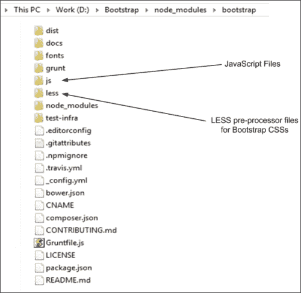
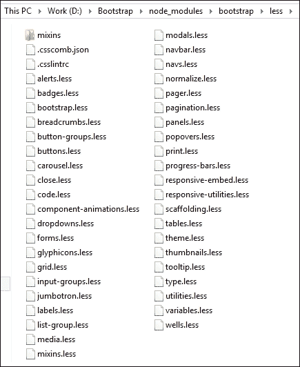
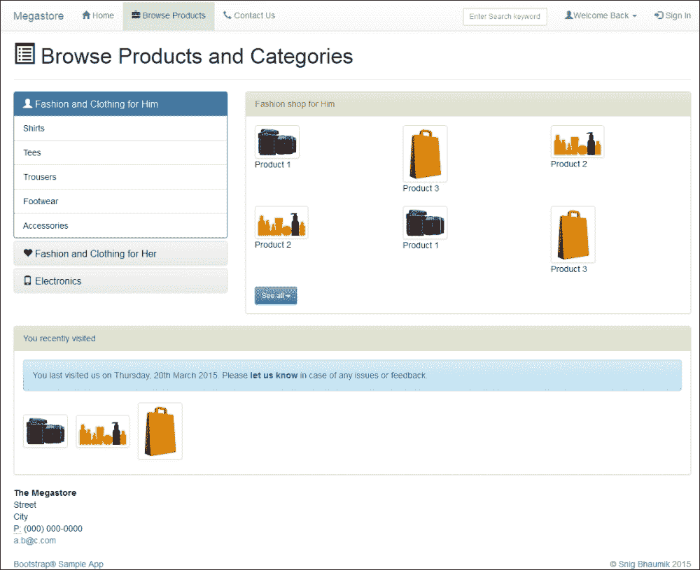
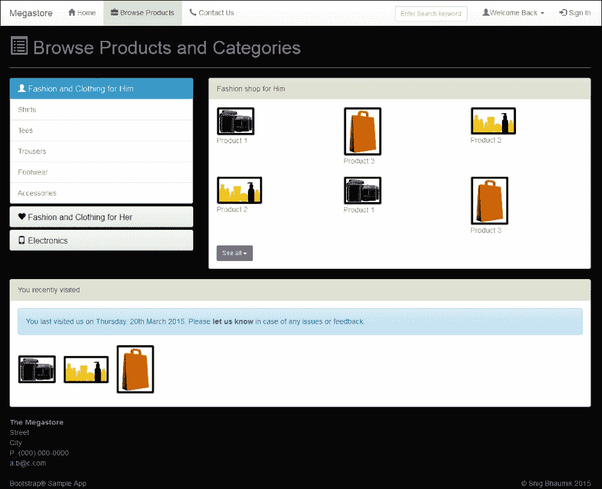
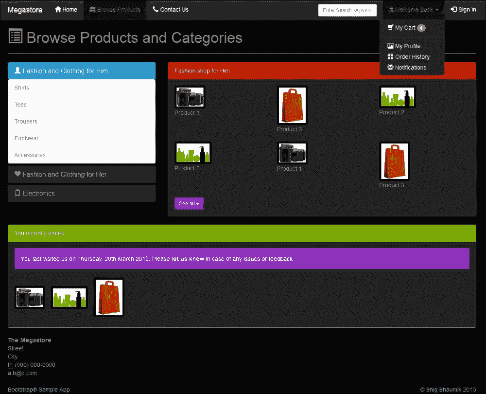
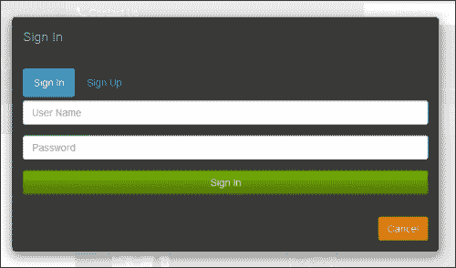
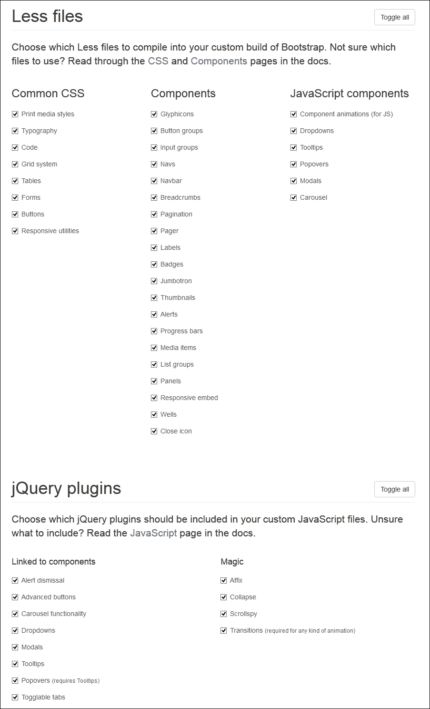
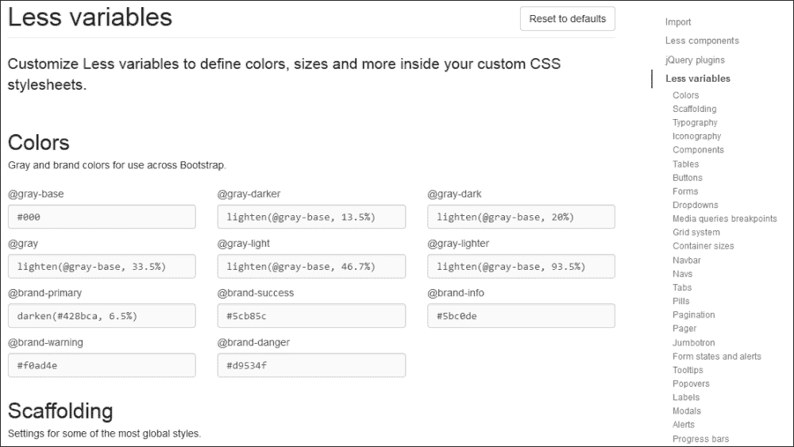

# 第七章：自定义 Bootstrap

在上一章中，我们已经完成了 Bootstrap 开发和自定义环境的设置。

在本章中，我们将看到如何自定义 Bootstrap CSS 以满足您在外观和感觉方面的需求。我们将使用我们的 Bootstrap 开发环境来自定义 CSS。

实际上，有两种方法可以自定义 Bootstrap 输出：

+   通过使用构建环境更新 Bootstrap 源代码

+   通过使用 Bootstrap 网络界面生成自定义代码

我们将在本章中探讨这两种方法。

# 使用构建环境进行自定义

只是为了回忆，这是我们上一章配置的 Bootstrap 源代码包的文件夹结构。请注意，文件和文件夹的列表可能因您使用的 Bootstrap 版本而异。

在我们的例子中，我们使用 Bootstrap 3.3.1：



如前一个截图所示，这些是我们将在自定义 Bootstrap 行为时处理的两个重要文件夹。

尽管在 JavaScript 代码（如图表中标记的 `js` 文件夹）中更改任何内容的情况非常罕见，但我们将专注于 LESS 文件（如图表中标记的前一个截图所示的 `less` 文件夹）来更改 Bootstrap CSS。

这里是 `less` 文件夹的内容：



如您所见，Bootstrap 中每个可用的 CSS 组件和对象都有一个单独的 LESS 文件，例如按钮、面板、表格、缩略图、井、面包屑、图标和网格。

然而，除了单个 LESS 文件外，我们还有通用文件，例如：

+   `bootstrap.less`

+   `theme.less`

+   `utilities.less`

+   `scaffolding.less`

+   `variables.less`

每个文件都可以如下解释：

+   `bootstrap.less` 文件是主要的协作文件，它封装了所有单个 LESS 文件并生成最终的庞大 `bootstrap.css` 文件。

+   `theme.less` 文件主要负责生成 `bootstrap-theme.css` 文件。

+   `utilities.less` 文件创建了一般实用类，例如，一些类如 [`getbootstrap.com/css/#helper-classes`](http://getbootstrap.com/css/#helper-classes) 中所示。

+   `scaffolding.less` 文件是 Bootstrap CSS 文件的主要模板。它定义了页面结构和模板，并为默认 HTML 组件（如 `html`、`body` 和 `input`）设置样式

+   `variables.less` 文件可能是我们将要处理的最重要的文件之一。此文件封装了在 Bootstrap CSS 中各个位置使用的所有 LESS 变量。

为了更改和更新 Bootstrap CSS，我们将主要更改此文件中各种变量的值。只是为了回忆，这是我们目前的 **浏览** 页面：



现在，让我们在`variables.less`文件中更改一些变量和值，以改变这个网站的外观和感觉：

1.  打开`variables.less`文件。

1.  第一部分是`Colors`。默认代码是：

    ```js
    @gray-base:              #000;
    @gray-darker:            lighten(@gray-base, 13.5%); // #222
    @gray-dark:              lighten(@gray-base, 20%);   // #333
    @gray:                   lighten(@gray-base, 33.5%); // #555
    @gray-light:             lighten(@gray-base, 46.7%); // #777
    @gray-lighter:           lighten(@gray-base, 93.5%); // #eee

    @brand-primary:         darken(#428bca, 6.5%);
    @brand-success:         #5cb85c;
    @brand-info:            #5bc0de;
    @brand-warning:         #f0ad4e;
    @brand-danger:          #d9534f;
    ```

1.  让我们将其更改为以下内容：

    ```js
    @gray-base:              #000;
    @gray-darker:            #222; 
    @gray-dark:              #282828;  
    @gray:                   #555; 
    @gray-light:             #888;   
    @gray-lighter:           #ADAFAE;

    @brand-primary:         #2A9FD6;
    @brand-success:         #77B300;
    @brand-info:            #9933CC;
    @brand-warning:         #FF8800;
    @brand-danger:          #CC0000;
    ```

1.  在下一个`Scaffolding`部分，更改此代码：

    ```js
    //** Background color for '<body>'.
    @body-bg:               #fff;
    //** Global text color on '<body>'.
    @text-color:            @gray-dark;
    ```

    变成这样：

    ```js
    //** Background color for '<body>'.
    @body-bg:               #060606;
    //** Global text color on '<body>'.
    @text-color:            @gray-light;
    ```

现在我们来看看这会给页面带来什么变化。为了实现这一点，我们将构建代码并将其部署到 Web 服务器：

1.  打开命令提示符，使用`D:\Bootstrap\node_modules\bootstrap`进入`project`文件夹。

1.  构建项目并在终端运行此命令：`grunt dist`。

1.  新的 CSS 和 JavaScript 文件集将在`dist`文件夹中生成。

1.  为了部署这个更新的代码，我们将复制`css`文件夹（只复制`css`文件夹，因为我们没有对 JavaScript 或字体进行任何更改）到应用的`bs`文件夹（参考第二章，*Bootstrap 入门*，其中我们讨论了我们正在构建的应用程序的文件夹结构）。

### 小贴士

请注意，每次你更改这些文件中的任何内容时，你不需要手动复制`css`文件夹和文件，相反，你可以使用合适的 Grunt 命令来自动执行这项工作。

这是我们的页面新外观：



你可以看到，我们页面的背景颜色和字体颜色已经改变，这是由于这一行代码：

```js
@body-bg:               #060606;
```

在这里，我们选择将主体颜色从白色（`#FFF`）改为`#060606`。

`@body-bg`元素是一个 LESS 变量，已定义；此变量用于在`scaffolding.less`文件中设置`body`元素的背景颜色，如下所示：

```js
body {
  font-family: @font-family-base;
  font-size: @font-size-base;
  line-height: @line-height-base;
  color: @text-color;
  background-color: @body-bg;
}
```

同样，文本颜色、字体族、字体大小和其他样式也是从 LESS 变量设置的。

所有这些 LESS 文件都包含按照 LESS 预处理器语言的代码行和语法。在这里，我们不会深入探讨 LESS 语法。然而，建议你在调整 Bootstrap LESS 文件之前熟悉 LESS。

### 注意

了解 LESS 的一个好起点是他们的官方网站——[`lesscss.org/`](http://lesscss.org/)。

以这种方式，我们不断在`variables.less`文件中更改各种 LESS 变量。这是我们**浏览产品**页面外观和感觉的最终版本：



这是弹出对话框的外观：



我们在`variables.less`文件中更改的一些代码如下：

```js
@dropdown-bg:                    @gray-darker;
@dropdown-border:                rgba(255,255,255,0.1);
@dropdown-fallback-border:       #444;
@dropdown-divider-bg:            rgba(255,255,255,0.1);;
@dropdown-link-color:            #FFF;

@navbar-default-link-color:       #FFF;
@navbar-default-color:            @text-color;
@navbar-default-bg:               @gray-dark;

@state-success-text:             #fff;
@state-success-bg:               @brand-success;
@state-success-border:           darken(spin(@state-success-bg, -10), 5%);

@state-info-text:                #fff;
@state-info-bg:                  @brand-info;
@state-warning-text:             #fff;
@state-warning-bg:               @brand-warning;
@state-danger-text:              #fff;
@state-danger-bg:                @brand-danger;

@modal-content-bg:            lighten(@body-bg, 20%);
@modal-backdrop-bg:           #FFF;
@modal-backdrop-opacity:      .9;
@modal-header-border-color:   @gray-dark;

@panel-bg:                    @gray-darker;
@panel-inner-border:          @gray-dark;
@panel-default-text:          @text-color;

@thumbnail-border:            transparent;
```

如果你想知道这些 LESS 文件是如何转换成合适的、浏览器可消费的 CSS 文件的，那么`less:compileCore`这个 Grunt 任务就负责这项工作。它在后台调用 LESS JavaScript 编译器，解析 LESS 文件，并最终生成 CSS 文件。

我们所讨论的 LESS JavaScript 编译器是 `less.js`，位于 `D:\Bootstrap\node_modules\bootstrap\node_modules\grunt-contrib-less\tasks` 文件夹中。

因此，我们已经看到了如何更新 Bootstrap LESS 文件以自定义默认的外观和感觉。这样，如果需要，您还可以更新任何其他 LESS 文件。更新 JavaScript 源文件的过程也是相同的。所有 JS 源文件都位于 `D:\Bootstrap\node_modules\bootstrap\js` 文件夹中。您可以更改这些 JS 源文件中的任何一个，使用 grunt 构建 Bootstrap，并将它们部署到最终应用程序位置以供使用。

### 注意

话虽如此，前面提到的方法确实会强制您更新 Bootstrap 本身的实际源文件；因此，当您下载 Bootstrap 的更新版本时，您的自定义代码将被覆盖。

因此，一个更好的方法是为每个覆盖的文件创建自定义版本，并将您的自定义代码放入其中。最后，导入并使用这些自定义文件。这样，当您下载 Bootstrap 的更新版本时，您的自定义代码将不会受到影响。

# 使用 Bootstrap 网页界面进行自定义

生成自定义 CSS 文件的第二种方法是通过使用 Bootstrap 网页界面——[`getbootstrap.com/customize/`](http://getbootstrap.com/customize/).

此界面允许您选择并添加您项目所需的 CSS 和 JavaScript 组件。例如，如果您不需要 ScrollSpy JS 组件，那么为什么要在您的生产服务器上部署相应的 JS 代码呢？代码将通过 `bootstrap.min.js` 文件加载，您的 HTML 页面大小将变得不必要地更大。因此，避免加载您实际上不会使用的所有这些 JavaScript 组件是一种良好的做法。

下面的截图是此页面的截图：



您可以通过此网页界面完成另一个（可能更重要）的要求，即通过更改 LESS 变量来自定义 Bootstrap CSS（所有那些我们在本章前一部分中自定义的相同变量）：



您需要做的只是更新此界面中这些变量的值，最后在页面底部点击 **编译** 和 **下载** 按钮。

这将生成 Bootstrap CSS 和 JS 文件，包括正常和压缩形式。当然，您需要特别注意您使用的 Bootstrap 版本，因为此界面仅对最新稳定版本起作用。如果您正在使用任何特定的（较旧）版本的 Bootstrap，您应该使用我们在此处创建的本地构建环境进行自定义。这也会使您能够正确维护您在本地源代码版本控制服务器（如 SVN）中的自定义。

# 摘要

在上一章中，我们学习了如何建立 Bootstrap 的编译和构建环境。在这一章中，我们利用这个环境生成了我们定制的 Bootstrap 文件。

我们通过使用 Bootstrap 的官方网页界面看到了另一种进行这种定制的方法。

随着我们几乎完成了对 Bootstrap 的探索之旅，在下一章和最后一章中，我们将看到如何通过使用许多其他第三方框架和组件来扩展 Bootstrap。
