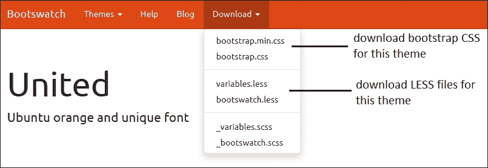
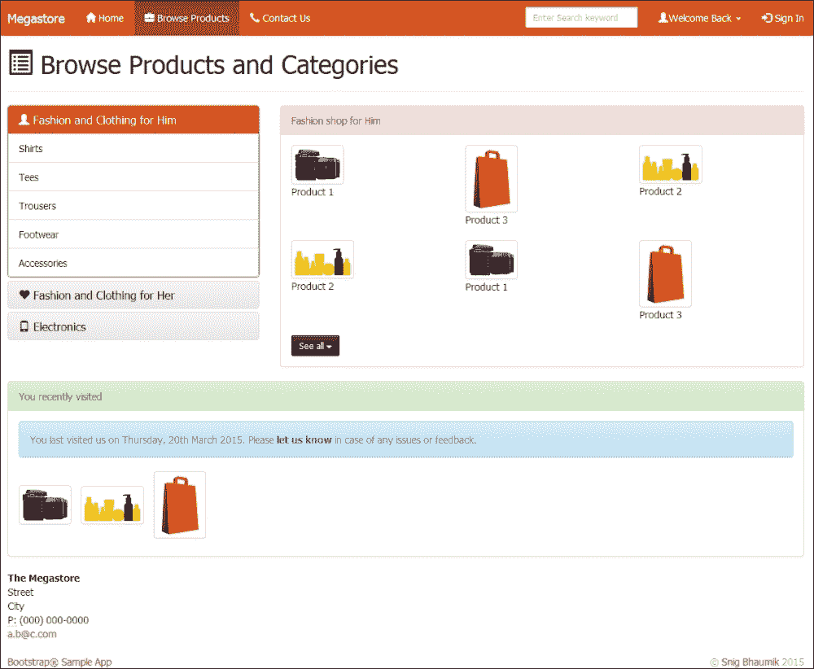
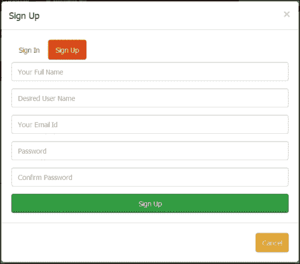
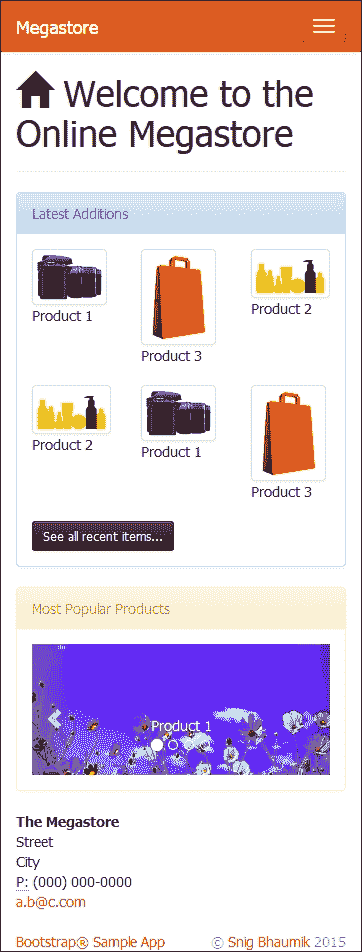
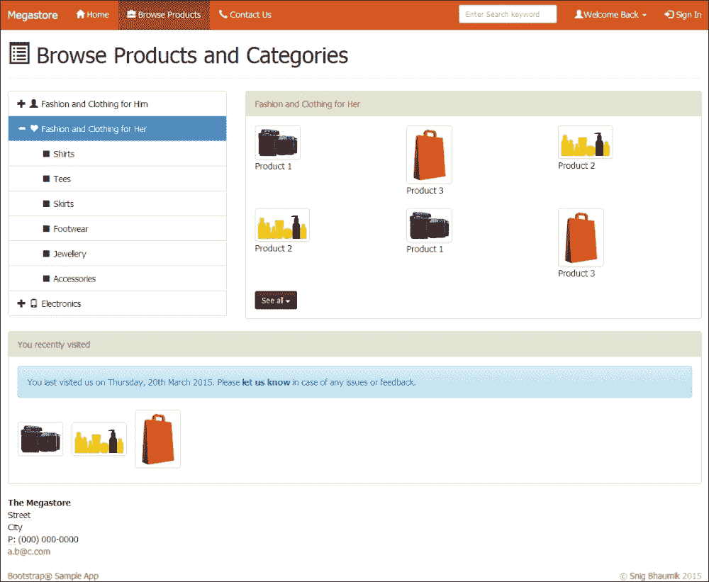
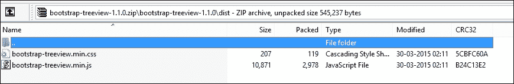
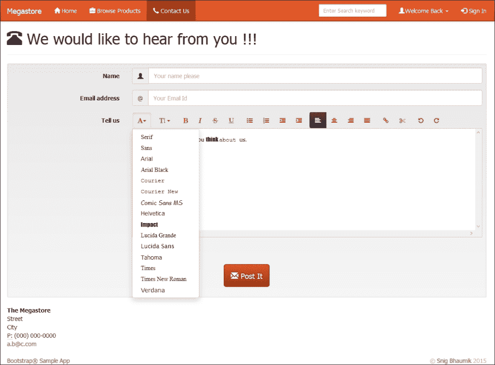
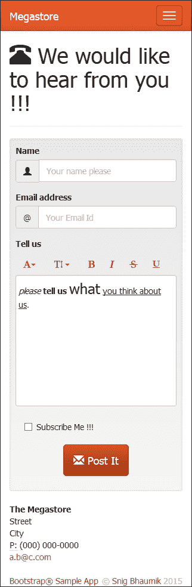

# 第八章. 扩展 Bootstrap

我们现在知道了如何使用、构建和自定义 Bootstrap。我们已经探索了 Bootstrap 在各种用例和需求中的大多数功能和实用工具。

然而，在许多场合，你可能会觉得 Bootstrap 提供的样式和组件不够用，为了创建一个高端网站并拥有丰富的用户体验，你可能还需要一些额外的功能和内置组件，这些可以帮助你快速设计和生成响应式网站。

幸运的是，开源社区中有很多 Bootstrap 的扩展，适用于各种方面和需求——例如主题、UI 组件、jQuery 插件、通知、表格和导航。

为了更好地理解场景，如果你在 jQuery 的世界里，你当然使用过 jQuery UI 的扩展([`jqueryui.com/`](https://jqueryui.com/))——这些是基于标准和默认 jQuery 的组件，旨在为你提供更多默认 jQuery 不提供的功能和控制。同样，我们也有许多基于默认 Bootstrap 的社区扩展。

### 注意

重要的是要记住，这些扩展是由社区成员和第三方供应商开发的。感谢社区和开发这些扩展并将其作为开源许可的人。然而，Bootstrap 团队不对这些扩展的性能和功能承担任何责任。

在最后一章中，我们将探索一些精选的扩展，以使我们的基于 Bootstrap 的应用程序更加功能丰富和强大。

本章将讨论以下扩展：

+   扩展默认的 Bootstrap 主题

+   安装和使用树形视图控件

+   安装和使用**所见即所得**（**WYSIWYG**）编辑器

# 主题扩展 – Bootswatch

这是基于 Bootstrap 开发并使用的一个最大的免费主题库。参考他们的网站[`bootswatch.com/`](http://bootswatch.com/)，你可以看到在这个空间中列出了许多免费的主题。

### 注意

这些免费主题是在 MIT 许可下分发的。然而，在开始使用文件之前阅读使用条款和条件会更好。

为了理解如何使用它们，我们将下载并使用这些主题。比如说，我们将继续使用*联合*主题——[`bootswatch.com/united/`](http://bootswatch.com/united/)。你可以用两种方式使用这个主题（或任何其他主题）：

+   通过下载 CSS 文件并在你的应用程序中直接使用。

+   通过下载 LESS 变量文件，并正确构建和部署。

我们将探索这两种方法。

### 注意

注意，Bootstrap 除了支持 LESS 之外，还支持 SASS 预处理器。如果你习惯使用 SASS，你也可以选择 SASS 而不是 LESS。然而，本书我们将讨论 LESS 的方法。

## 下载 CSS 文件

要下载主题，您可以访问 [`bootswatch.com/united/`](http://bootswatch.com/united/) 网址，并从顶部导航栏下载 **bootstrap.min.css** 和/或 **bootstrap.css** 选项：



执行以下步骤：

1.  下载 CSS 文件，并进入我们应用程序中 `bs` 文件夹下的 Bootstrap 的 `css` 文件夹（参考第二章，*Bootstrap 入门*以查看应用程序文件夹结构）。

1.  将下载的 *United* 主题的 CSS 文件复制到这个文件夹中（您实际上在这里覆盖了现有的 CSS 文件。所以，如果备份原始文件会更好）。

1.  在浏览器中打开应用程序，您将看到外观和感觉已经更新。

## 使用 LESS 文件

如您所想象，在这个方法中，我们将下载 LESS 变量文件，并使用构建环境生成 CSS 文件。按照以下步骤操作：

1.  首先，我们下载 LESS 文件（参考前面的截图），并将它们复制到我们的 Bootstrap 构建环境中，即在 `D:\Bootstrap\node_modules\bootstrap\less` 文件夹中。

    ### 小贴士

    在这里，我们也在覆盖现有的 `variables.less` 文件。所以如果你不在任何源代码控制服务器下，在覆盖现有文件之前进行备份会更好。

1.  接下来的步骤非常明显，我们编译并构建项目（命令 `grunt dist`）。将 CSS 文件复制到最终的应用程序部署文件夹中。

1.  在浏览器中打开应用程序，查看新的外观和感觉。它看起来可能类似于以下截图：

1.  弹出对话框的新外观如下：

1.  这里是移动设备视图：

以类似的方式，您可以下载并使用这些免费提供的任何主题。然而，正如您正确猜到的，下载和使用 LESS 文件（而不是 CSS 文件）是一个更好的方法。

# 树形视图控件

HTML 中的树形视图控件（有时也称为大纲视图）通常用于表示层次信息。视图中的每个项目都可以有多个子项（或子控件），每个子项也可以进一步有多个子控件。此外，这个层次可以向上延伸到任何级别。每个项目可以展开以显示子项，也可以折叠以隐藏它们。最常用的树形视图之一是 Windows 资源管理器，其中显示了所有文件夹和子文件夹（以及相应的文件）。

这里是建立在 Bootstrap 之上的树形视图控件的示例。这样的控件默认情况下在 Bootstrap 分发中不可用，当然，您也不想在您的网页中使用任何其他控件，这可能会挑战您的移动设备兼容性要求。

### 注意

在社区市场中，有很多这样的控件、组件和库可供选择。如果你需要任何在默认 Bootstrap 发行版中不可用的控件，始终建议实现一个基于 Bootstrap 的控件，而不是使用任何基于 jQuery 或其他 JavaScript 的组件。即使你使用这样的控件，也要确保它们不会破坏移动兼容性。

本章展示了这些示例，以指导你如何使用这些基于 Bootstrap 构建的控件。

作为例子，我们选取了这个在 Bootstrap 社区中流行的组件：[`github.com/jonmiles/bootstrap-treeview`](https://github.com/jonmiles/bootstrap-treeview)。假设，在浏览器网页中，我们将用树形视图替换类别列表的 panel-group 视图。

这里是使用该控件的 HTML 代码；这替换了整个包含类别列表的 panel-group HTML 部分：

```js
<div class="col-xs-12 col-sm-12 col-md-4 col-lg-4">
  <div id="categoryList"></div>
</div>
```

这行简单的 HTML 代码就足够了。其余的技巧在于 JavaScript 代码中。

```js
var categories = [
  {
    text: "Fashion and Clothing for Him",
    icon: "glyphicon glyphicon-user",
    state: {
      expanded: true,
      selected: true
    },
    nodes: [
    {
      text: "Shirts",
    },
    {
      text: "Tees"
    },
    {
      text: "Trousers"
    },
    {
      text: "Footwear"
    },
    {
      text: "Accessories"
    }
  ]
  },
…

];
$('#categoryList').treeview({
  data: categories,
  onNodeSelected: function(event, data) {
    $('#productHead').text(data.text);
  }
});
```

正如你所见，我们已经将嵌入到 HTML 元素中的实际数据替换成了正确的 JSON 数据格式，在 JavaScript 中。这种方法当然是更好且合适的，因为你可能想要调用一些 AJAX 或服务器端调用以获取类别列表，而它将返回 JSON 格式的数据。

我们还添加了一个小的事件处理器（**onNodeSelected**），以更改右侧部分的标题。以下是输出结果：



## 安装树形视图组件

从 GitHub URL [`github.com/jonmiles/bootstrap-treeview`](https://github.com/jonmiles/bootstrap-treeview) 下载 ZIP 存档。在这个存档的`dist`文件夹中，我们有两个文件——一个 JS 文件和一个 CSS 文件。将这些两个文件复制到我们的应用程序文件夹中，并在 HTML 页面中包含它们。以下是我们要讨论的文件：



我们已经将这些文件包含到我们的`browse.html`页面中：

```js
<link href="bootstrap-treeview.min.css" rel="stylesheet">
<script type="text/javascript" src="img/bootstrap-treeview.min.js"></script>
```

### 小贴士

作为一种常规做法，我们在包含主 Bootstrap JS 文件之后，包括所有基于 Bootstrap 和 Bootstrap 扩展的额外 JS 文件。

# WYSIWYG 编辑器和 Font Awesome

WYSIWYG 是一个非常常见且流行的组件，你期望网页用户输入一些 HTML 和格式化内容；这个控件在**内容管理系统**（**CMS**）中尤其重要。

在本节中，我们将演示一个基于 Bootstrap 且适用于移动端的编辑器。我们将使用的编辑器是`bootstrap-wysiwyg`；你可以在[`mindmup.github.io/bootstrap-wysiwyg/`](http://mindmup.github.io/bootstrap-wysiwyg/)页面上探索它。我们将用这个编辑器替换我们**联系我们**页面中的标准文本区域控件，以提供更好的用户体验。以下是 HTML 代码：

```js
<div class="btn-toolbar" data-role="editor-toolbar" data-target="#yourComments">
  <div class="btn-group">
    <a class="btn dropdown-toggle" data-toggle="dropdown" title="Font"><i class="icon-font"></i><b class="caret"></b></a>
    <ul class="dropdown-menu"></ul>
  </div>
  <div class="btn-group">
    <a class="btn dropdown-toggle" data-toggle="dropdown" title="Font Size"><i class="icon-text-height"></i>&nbsp;<b class="caret"></b></a>
    <ul class="dropdown-menu">
      <li><a data-edit="fontSize 5"><font size="5">Huge</font></a></li>
      <li><a data-edit="fontSize 3"><font size="3">Normal</font></a></li>
      <li><a data-edit="fontSize 1"><font size="1">Small</font></a></li>
    </ul>
  </div>
  <div class="btn-group">
    <a class="btn" data-edit="bold" title="Bold (Ctrl/Cmd+B)"><i class="icon-bold"></i></a>
    <a class="btn" data-edit="italic" title="Italic (Ctrl/Cmd+I)"><i class="icon-italic"></i></a>
    <a class="btn" data-edit="strikethrough" title="Strikethrough"><i class="icon-strikethrough"></i></a>
    <a class="btn" data-edit="underline" title="Underline (Ctrl/Cmd+U)"><i class="icon-underline"></i></a>
  </div>
  <div class="btn-group hidden-xs hidden-sm">
    <a class="btn" data-edit="insertunorderedlist" title="Bullet list"><i class="icon-list-ul"></i></a>
    <a class="btn" data-edit="insertorderedlist" title="Number list"><i class="icon-list-ol"></i></a>
    <a class="btn" data-edit="outdent" title="Reduce indent (Shift+Tab)"><i class="icon-indent-left"></i></a>
    <a class="btn" data-edit="indent" title="Indent (Tab)"><i class="icon-indent-right"></i></a>
  </div>
  <div class="btn-group hidden-xs hidden-sm">
    <a class="btn" data-edit="justifyleft" title="Align Left (Ctrl/Cmd+L)"><i class="icon-align-left"></i></a>
    <a class="btn" data-edit="justifycenter" title="Center (Ctrl/Cmd+E)"><i class="icon-align-center"></i></a>
    <a class="btn" data-edit="justifyright" title="Align Right (Ctrl/Cmd+R)"><i class="icon-align-right"></i></a>
    <a class="btn" data-edit="justifyfull" title="Justify (Ctrl/Cmd+J)"><i class="icon-align-justify"></i></a>
  </div>
  <div class="btn-group hidden-xs hidden-sm">
    <a class="btn dropdown-toggle" data-toggle="dropdown" title="Hyperlink"><i class="icon-link"></i></a>
    <div class="dropdown-menu input-append">
      <input class="span2" placeholder="URL" type="text" data-edit="createLink"/>
      <button class="btn" type="button">Add</button>
    </div>
    <a class="btn" data-edit="unlink" title="Remove Hyperlink"><i class="icon-cut"></i></a>
  </div>
  <div class="btn-group hidden-xs hidden-sm">
    <a class="btn" data-edit="undo" title="Undo (Ctrl/Cmd+Z)"><i class="icon-undo"></i></a>
    <a class="btn" data-edit="redo" title="Redo (Ctrl/Cmd+Y)"><i class="icon-repeat"></i></a>
  </div>
</div>    
<div id="yourComments">please tell us what you think about us.</div>
```

这是我们的控制器的 CSS 代码：

```js
#yourComments {
  background-color: white;
  border: 1px solid rgb(204, 204, 204);
  border-collapse: separate;
  border-radius: 3px;
  box-shadow: 0 1px 1px 0 rgba(0, 0, 0, 0.075) inset;
  box-sizing: content-box;
  max-height: 25em;
  min-height: 15em;
  outline: medium none;
  overflow: scroll;
  padding: 4px;
}
```

最后，JavaScript 代码如下：

```js
function initEditorToolbar() {
  var fonts = ['Serif', 'Sans', 'Arial', 'Arial Black', 'Courier', 
    'Courier New', 'Comic Sans MS', 'Helvetica', 'Impact', 'Lucida Grande', 'Lucida Sans', 'Tahoma', 'Times',
  'Times New Roman', 'Verdana'],
  fontTarget = $('[title=Font]').siblings('.dropdown-menu');

  $.each(fonts, function (idx, fontName) {
    fontTarget.append($('<li><a data-edit="fontName ' + fontName +'" style="font-family:\''+ fontName +'\'">'+fontName + '</a></li>'));
  });
  $('a[title]').tooltip({container:'body'});
  $('.dropdown-menu input')
    .click(function() {return false;})
    .change(function () {$(this).parent('.dropdown-menu').siblings('.dropdown-toggle').dropdown('toggle');})
    .keydown('esc', function () {this.value='';$(this).change();});

  $('[data-role=magic-overlay]').each(function () { 
    var overlay = $(this), target = $(overlay.data('target')); 
    overlay.css('opacity', 0).css('position', 'absolute').offset(target.offset()).width(target.outerWidth()).height(target.outerHeight());
  });
};
initEditorToolbar();
$('#yourComments').wysiwyg();
$('#yourComments').cleanHtml();
```

在桌面系统中，我们新页面的外观现在如下所示：



在移动设备上，我们新页面的外观如下：



正如你所见，标准的文本区域控件已被更丰富的所见即所得编辑器所取代。你还应该注意，在移动设备的情况下，我们已经隐藏了许多工具栏按钮；这样，在空间较小的设备上，你可以使一些不重要的按钮不可用。

## 安装和使用所见即所得组件

为了安装、配置和使用所见即所得组件，需要下载几个 JS 库。以下是我们所使用的所见即所得组件的先决条件。

### bootstrap-wysiwyg 组件

从[`github.com/mindmup/bootstrap-wysiwyg/`](https://github.com/mindmup/bootstrap-wysiwyg/) GitHub 页面下载 bootstrap-wysiwyg 组件。然而，你只需要主要的 JS 文件，因此你只需下载此文件即可，从[`raw.githubusercontent.com/mindmup/bootstrap-wysiwyg/master/bootstrap-wysiwyg.js`](https://raw.githubusercontent.com/mindmup/bootstrap-wysiwyg/master/bootstrap-wysiwyg.js)下载。将此文件复制到应用程序文件夹中，并在 HTML 页面中包含它：

```js
<script type="text/javascript" src="img/bootstrap-wysiwyg.js"></script>
```

### jQuery 热键组件

所见即所得编辑器使用热键（或快捷键）如*Ctrl* +*B*，*Ctrl* + *U*，和*Ctrl* + *I*进行标准操作。因此，我们还需要这个库。

你可以从[`github.com/jeresig/jquery.hotkeys`](https://github.com/jeresig/jquery.hotkeys) GitHub 页面下载它。然而，对于前面的情况，你只需要主要的 JS 文件。因此，你只需下载[`raw.githubusercontent.com/jeresig/jquery.hotkeys/master/jquery.hotkeys.js`](https://raw.githubusercontent.com/jeresig/jquery.hotkeys/master/jquery.hotkeys.js)文件即可。

将此文件复制到应用程序文件夹中，并在 HTML 页面中包含它：

```js
<script type="text/javascript" src="img/jquery.hotkeys.js"></script>
```

### Font Awesome

Font Awesome 是为 Bootstrap 项目设计的图标字体套件。您可以使用这些 CSS 类扩展外观、感觉和用户体验，当然，这些都是对设备友好的。

关于 Font Awesome 的更多信息，请参阅[`fortawesome.github.com/Font-Awesome/`](http://fortawesome.github.com/Font-Awesome/)。我们不会本地下载和安装它，而是将从 CDN 位置使用文件。因此，我们在 HTML 页面中写下以下内容：

```js
<link href="http://netdna.bootstrapcdn.com/font-awesome/3.0.2/css/font-awesome.css" rel="stylesheet">
```

因此，当所有依赖项和库都包含在内时，前面的 HTML 和 JavaScript 代码将在你的页面上渲染所见即所得编辑器。你已经看到了 HTML 和 JS 代码，以及编辑器如何在你的页面上渲染。

### 注意

这里有一些链接，你可以从中探索更多此类组件和库：

+   [`startbootstrap.com/bootstrap-resources/`](http://startbootstrap.com/bootstrap-resources/)

+   [`bootstraphero.com/the-big-badass-list-of-twitter-bootstrap-resources`](http://bootstraphero.com/the-big-badass-list-of-twitter-bootstrap-resources)

# 摘要

在本章的最后，我们探索了一些组件和资源，以扩展 Bootstrap 的默认行为。通过使用社区提供的库，你可以获得几乎所有的组件，以满足实现任何网站需求。

因此，你可以看到，结合这些第三方资源，Bootstrap 的功能和灵活性得到了极大的增强和扩展，而且只需要非常少的编码和实施工作，你就可以开发出一个功能齐全且适合移动端的网站。

作为额外信息，你可以通过使用 Google 网站管理工具等来检查你网站的移动友好性，例如，[`www.google.com/webmasters/tools/mobile-friendly/`](https://www.google.com/webmasters/tools/mobile-friendly/)。
