# 第三章. 使用 Bootstrap 的网格系统为 Rails 应用供电

我们现在对 Bootstrap 有了很好的了解，以及我们如何在项目中安装它。通过本章，我们将了解 Bootstrap 可以做什么。

网格系统是 Bootstrap 框架的一个基本组成部分。如果不正确理解 Bootstrap 的网格系统，您将无法制作出响应式的网站/应用。这里的“响应式”是指一个在所有尺寸的设备上都能完美运行和显示的应用。

这就是混合应用的生成！开发者希望编写一次代码，使其可以从所有设备访问。为此，他们必须首先使他们的 Web 应用具有响应性。Bootstrap 通过其最流行的功能之一——网格系统，帮助创建响应式网站。

在本章中，我们将首先了解 Bootstrap 的网格系统，然后将其应用于我们的第一个应用，即 Online Packt Shopping。我们将尝试在本书的其余部分使用这个相同的应用。

在本章中，我们将涵盖：

+   Bootstrap 的网格系统是什么？

+   在 Rails 应用中实现 Bootstrap 的网格系统

# Bootstrap 的网格系统是什么？

当我们第一次思考网格时，我们会想象垂直和水平线条的交叉，这些线条构成了网格。这里发生的情况也是如此。Bootstrap 的网格系统包含与水平线条相当的行，以及与垂直线条相当的列。当这些行和列相交时，它们就形成了网格，我们可以用它们在我们的网页中填充一些内容。简单，不是吗？

使用 Bootstrap 的网格系统的最大优点之一是它具有响应性。与 HTML 表格不同，Bootstrap 的网格系统是灵活的，并且在小屏幕上也能正确调整。Bootstrap 中的网格大小不是固定的。它们根据设备屏幕的大小而变化。因此，内容会根据可用空间重新排列。

大多数开发者未能正确理解网格系统，因此他们未能实现响应式网页设计。在本节中，我们首先创建一个静态的非 Rails 网页，展示如何创建 Bootstrap 的网格系统，然后我们将将其应用于我们的 Rails 应用中。

让我们在系统中的任何位置创建一个名为`Responsive_website_static`的文件夹。然后，创建一个名为`index.html`的 HTML 文件。我们将使用 Bootstrap 的 CDN 链接在网页中导入 Bootstrap 的 CSS 和 JavaScript 代码。现在，打开`index.html`文件，然后粘贴以下基本的 HTML 布局到其中：

```js
<!DOCTYPE html>
<html lang="en">
  <head>f
    <meta charset="utf-8">
    <meta http-equiv="X-UA-Compatible" content="IE=edge">
    <meta name="viewport" content="width=device-width, initial-scale=1">
    <title>Responsive_website_static</title>
    <!-- Bootstrap -->
    <link rel="stylesheet" href="http://maxcdn.bootstrapcdn.com/bootstrap/3.2.0/css/bootstra. min.css">
  </head>
  <body>
    <h1>Hello, world!</h1>
    <!-- jQuery (necessary for Bootstrap's JavaScript plugins) -->
    <script src="img/jquery.min.js">
    </script>
    <!-- Include all compiled plugins (below), or include individual files as needed -->
    <script src="img/bootstrap.min.js">
    </script>
  </body>
</html>
```

上述标记符符合 Bootstrap 的推荐标记符。您可以看到它还有一些额外的元标签。这些元标签用于在所有类型的设备上正确渲染网页。使用`UTF-8`字符集是为了告诉浏览器您的网页包含一些`unicode`字符。

下一个具有 `http-equiv="X-UA-Compatible"` 和 `content="IE=edge"` 属性的元标签用于 Internet Explorer。有时，Internet Explorer 会切换到兼容模式而不是使用其最佳模式。因此，这个标签告诉 Internet Explorer 在渲染你的网站时使用其最佳模式。

下一个元标签是一个 `viewport` 标签。它告诉浏览器在移动设备上缩放并适应整个屏幕。

我们没有从浏览器下载 Bootstrap 文件，而是使用了 CDN 链接来链接到 Bootstrap 的 CSS 和 JavaScript 文件。由于 Bootstrap 也依赖于 jQuery，我们同样使用了 jQuery 文件的 CDN 链接。

最后，我们有一个 `<h1>` 标签，用于在网页上显示消息 **Hello World**。因此，让我们在浏览器中打开它并检查所有文件是否已正确加载。网页现在应该看起来像以下截图：

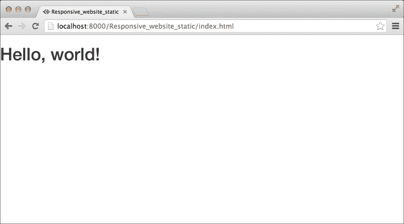

如果你使用的是 Google Chrome，你可以轻松地检查所有 CDN 文件是否已正确加载。在网页上的任何地方右键单击，并选择“检查元素”。屏幕下方将出现许多开发者工具标签。选择 **网络** 标签并重新加载页面。在 **状态文本** 列中，你将看到针对每个资源名称的许多响应代码。如果没有响应代码失败，则所有文件都已正确加载。

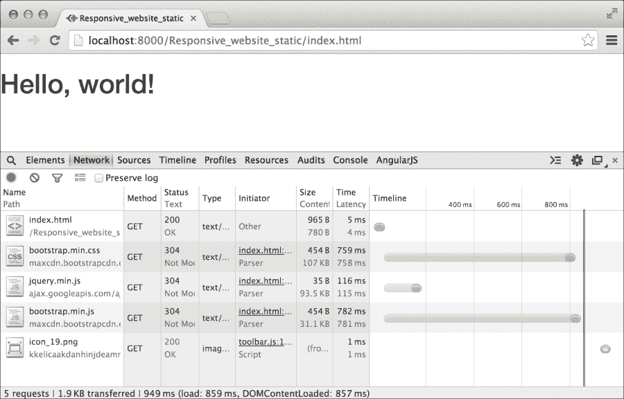

在我们开始向网页内填充任何内容之前，我们需要创建一个容器。这将用于包裹所有网页内容并将其居中到浏览器屏幕。Bootstrap 中有两种不同的容器类：`"container"` 和 `"container-fluid"`。第一个类 `"container"` 具有固定宽度并自动居中到浏览器窗口。第二个类 `"container-fluid"` 是一个全宽容器，它从浏览器窗口的左侧延伸到右侧。因此，让我们在 `index.html` 中定义一个容器并将 Hello World 消息放入其中：

```js
<div class="container">
  <h1>Hello World</h1>	
</div>
```

以下截图显示了输出：

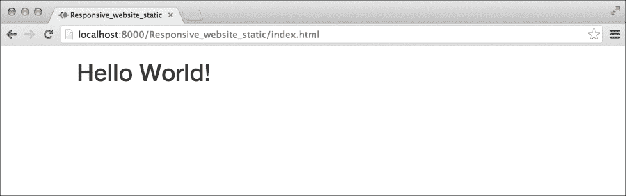

你可以看到消息是如何向中心移动的。如果我们给容器应用一个背景，它将更加清晰可见。因此，让我们给容器标记写入内联 CSS：

```js
<div class="container" style="background: cyan">
  <h1>Hello World</h1>	
</div>
```

这是前面代码的输出：

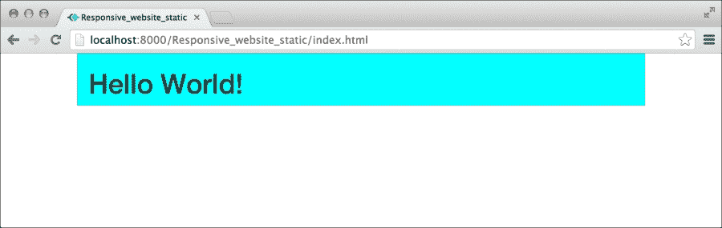

在使用 Bootstrap 的网格系统之前，你应该始终定义一个容器。现在，我们可以继续定义行。要定义一个行，我们必须使用一个名为 `row` 的类。因此，让我们继续并在容器内创建一个行：

```js
<div class="container">
  <div class="row">
  </div>
</div>
```

创建一行是告诉 Bootstrap 你想要使用其网格系统的一种方式。现在是时候在上面的行内布局垂直列了。Bootstrap 中的一个单独的列将占据行内的所有空间。创建两列将把行的空间分成两半。因此，你创建的列越多，行的空间就会平均分配。Bootstrap 的网格系统可以扩展到 12 列。如果你创建超过 12 列，剩余的列将自动移动到新的一行。所以，让我们首先创建一个单独的列：

```js
<div class="container" style="background: cyan">
  <div class="row">
    <div class="col-xs-12" style="background: green">
      <h1>Hello World</h1>
    </div>
  </div>
</div>
```

让我们来看看输出结果：

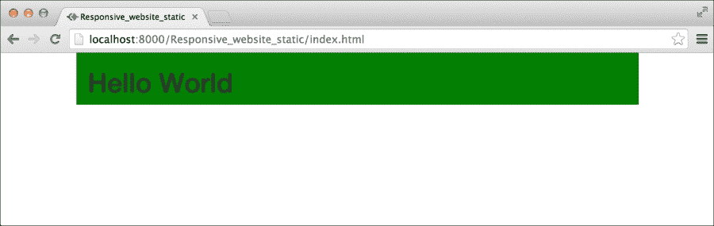

在 Bootstrap 网格系统中，列是通过它将跨越的列数来声明的。如果你想创建一个单独的列，你需要它跨越 12 个 Bootstrap 列。因此，我们得到类 `"col-xs-12"`。如果你想创建两列，你必须使用类 `"col-xs-6"`。这将使每个列跨越六个 Bootstrap 列。所以，让我们继续，在前面的标记中创建两列：

```js
<div class="container" style="background: cyan">
    <div class="row">
      <div class="col-xs-6" style="background: green">
        <h1>Hello</h1>
      </div>
    <div class="col-xs-6" style="background: red">
      <h1>World</h1>
    </div>
  </div>
</div>
```

让我们来看看输出结果：

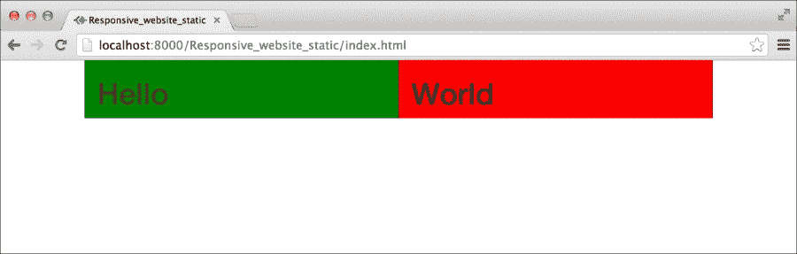

Bootstrap 为不同尺寸的设备定义了类。在前面的例子中，我们一直在使用类如 `"col-xs-*"`。在这里，字母 *xs* 代表超小设备及其以上的设备范围。因此，类 "`col-xs-"` 将在从超小设备开始的所有类型的设备上创建一个大小为 12 个 Bootstrap 列的列。Bootstrap 有四种不同类型的类，用于四种不同尺寸的设备：

+   `超小设备 ".col-xs-*"`：这些设备的屏幕尺寸小于 768 像素

+   `小设备 ".col-sm-*"`：这些设备的屏幕尺寸小于 992 像素，且大于或等于 786 像素

+   `中等设备 ".col-md-*"`：这些设备的屏幕尺寸小于 1200 像素，且大于或等于 992 像素

+   `大设备 ".col-lg-*"`：这些设备的屏幕尺寸大于 1200 像素

例如，如果你正在定义列，考虑到中等设备大于或等于 992 像素，那么这些列即使在大于或等于 992 像素和 1200 像素的大设备上看起来也相同。在小于 992 像素的小设备和 768 像素的超小设备上，它们将堆叠在一起。因此，如果你为超小设备定义列，那么它们在所有类型的设备上看起来都一样。

使用 Bootstrap，你还可以在不同设备上动态地更改列的数量。例如，使用类 `"col-xs-4"` 和 `"col-sm-6"` 一起，将使列在超小设备上跨越四个 Bootstrap 列，在小设备上跨越六个 Bootstrap 列。步骤如下：

```js
<div class="container" style="background: cyan">
  <div class="row">
    <div class="col-xs-12 col-sm-6" style="background: green">
      <h1>Hello</h1>
    </div>
    <div class="col-xs-12 col-sm-6" style="background: red">
      <h1>World</h1>
    </div>
  </div>
</div>
```

让我们来看看输出结果：

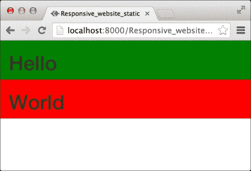

前面的截图显示了在超小设备上的网页。浏览器由于类 `"col-xs-12"` 的存在，每行渲染一列。

希望现在你已经了解了 Bootstrap 列的命名方式。那么，让我们继续探讨 Bootstrap 网格系统中的另一个重要概念，即嵌套列。

# 嵌套列

在 Bootstrap 中，可以在列内定义列。为此，您需要在列标记内声明一个新的行，然后继续在其中创建列。让我们修改之前的代码来测试嵌套列：

```js
<div class="container" style="background: cyan">
  <div class="row">
    <div class="col-xs-12 col-sm-6" style="background: green">
      <h1>Hello</h1>
      <div class="row">
        <div class="col-xs-6" style="background: orange">
          <h2>PACKT</h2>
        </div>
        <div class="col-xs-6" style="background: grey">
          <h2>PUBLISHING</h2>
        </div>
      </div>
    </div>
    <div class="col-xs-12 col-sm-6" style="background: red">
      <h1>World</h1>
    </div>
  </div>
</div>
```

让我们看看输出结果：

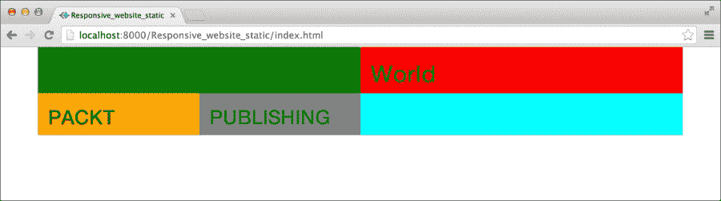

在前面的屏幕截图中，你可以清楚地看到我们在第一个列内创建了两个不同的列。由于第二个列没有嵌套列，因此主容器的背景色（青色）现在对我们可见。这样，你可以创建任意数量的嵌套列。

# 在 Rails 应用程序中实现 Bootstrap 的网格系统

现在是时候在我们的 Rails 应用程序中使用网格系统了。如前所述，我们将创建一个名为 Online Packt Shopping 的应用程序。我们将在本章中使用网格系统创建一个针对产品的 CRUD 应用程序。随着我们学习 Bootstrap 的不同功能，我们将继续开发这个应用程序。 

因此，让我们继续创建一个名为 Online Packt Shopping 的 Rails 应用程序。

```js
rails new OnlinePacktShopping

```

应用程序创建后，你应该导航到新创建的文件夹内，并启动 Rails 服务器以测试应用程序是否正确安装。那么，让我们使用以下命令进行操作：

```js
cd /OnlinePacktShopping
rails server

```

访问网页 `http://localhost:3000`。它应该显示默认的 Rails 应用程序 **欢迎板**。

我们的产品将具有以下四个属性：

+   名称

+   特色图片

+   描述

+   价格

因此，让我们相应地进行操作

现在，我们将使用以下命令构建和生成一个产品模型：

```js
rails generate scaffold Product name:string featImage:string description:text price:decimal

```

此命令将创建一个名为 **NewProduct** 的模型及其相关属性。你需要使用 rake 命令将新创建的模型迁移到数据库中。你可以使用以下命令来完成：

```js
rake db:migrate

```

一旦成功完成，运行服务器并打开：`http://localhost:3000/products`。你应该看到一个空的产品列表页面：

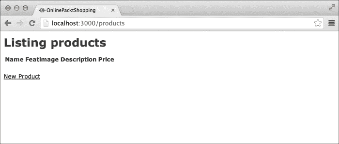

我们首先需要将 Bootstrap 包含到这个应用程序中。为此，我们将使用第二章中描述的 CDN 方法：在 *安装 Bootstrap 到 Rails 项目* 部分的 *介绍 Bootstrap 3* 中。第二章。

一旦你在你的应用程序中包含了 Bootstrap，你可以重新加载前面的网页，并看到 Bootstrap 对 HTML 元素应用的 CSS 重置。你还可以看到字体已从 `Times New Roman` 更改为 `Open Sans`。那么，让我们看看输出结果：

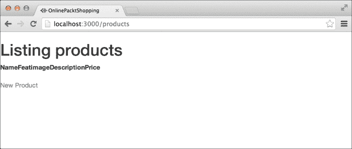

我们将遵循前一小节中讨论的所有步骤。首先，我们需要为我们的应用程序定义一个容器。打开`application.html.erb`，它位于`app/views/layouts`中。

我们需要将`<%= yield %>`包裹在 Bootstrap 容器标记内：

```js
<div class="container">
  <%= yield %>
</div>
```

让我们看看输出结果：

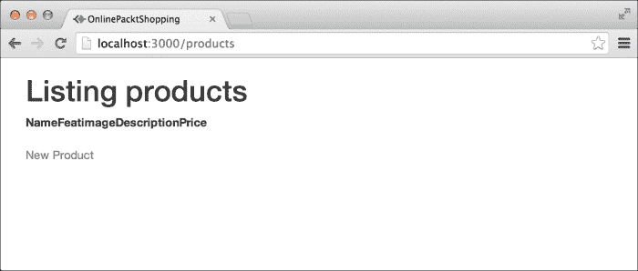

接下来，我们需要更改此页面上内容显示的方式。我们不需要一个表格来列出我们的产品。我们将使用 Bootstrap 的网格系统以响应式网格布局美观地显示产品。

打开`index.html.erb`，它位于`products`文件夹中，通过导航到`app/views/products`。如果您熟悉 Rails 开发，您必须知道在`views`文件夹内为每个模型都有一个单独的文件夹。每个模型文件夹中的`index.html.erb`文件用于显示各种模型。继续并删除该文件中所有内容。

首先，我们需要一个页面标题来告诉用户页面显示的内容。因此，让我们使用 Bootstrap 的`".page-header"`类创建一个页面标题。在`index.html.erb`中插入以下代码：

```js
<div class="page-header">
  <h3>All Products</h3>
</div>
```

接下来，我们需要创建一个行来显示产品。因此，更新标记并添加以下内容：

```js
<div class="row">
</div>
```

现在，我们将在该行内创建列。对于我们的应用程序，我们希望在布局中具有以下功能：

+   极小移动设备中的列

+   小移动设备中的列

+   中等设备中的列

+   大设备中的列

因此，我们将使用以下组合来定义我们的列：“`col-xs-12 col-sm-6 col-md-4 col-lg-3`”。让我们继续并更新前面的行标记，只使用一个列：

```js
<div class="row">
  <div class="col-xs-12 col-sm-6 col-md-4 col-lg-3">
  </div>
</div>
```

我们现在将遍历每个产品的列标记。因此，我们需要更新我们的标记如下：

```js
<div class="row">
  <% @products.each do |product| %>
  <div class="col-xs-12 col-sm-6 col-md-4 col-lg-3">
  </div>
  <% end %>
</div>
```

现在，我们需要填充这个列的产品详情：

```js
<div class="row">
  <% @products.each do |product| %>
  <div class="col-xs-12 col-sm-6 col-md-4 col-lg-3 text-center">
    <h2><%= product.name %></h2>
    />
    <p><%= product.description %></p>
    <h4>$<%= product.price %></h4>
    <%= link_to 'Show', product, :class=>"btn btn-primary" %>
  </div>
  <% end %>
</div>
```

在前面的代码中，我正在遍历`product`对象，重复打印相同的标记，但带有不同的数据。对于每个产品，我使用`<h2>`标签打印其名称，使用``标签打印图像，使用`<p>`标签打印产品描述，使用`<h4>`标签打印产品价格，最后使用`link_to`打印产品页面的链接。

您可以看到，在打印 HTML 标签中的数据时，我还添加了一些额外的类。这些类携带与它们关联的一些 CSS 样式，这些样式是由 Bootstrap 编写的。例如，将类`"img-responsive"`添加到``标签中将使图像适应网格的大小，而不管图像的大小如何。我还使用了`btn`和`btn-success`类的组合，这些类用于`<a>`和`<button>`标签。这些类给链接带来了时尚的按钮外观。我们将在后续章节中了解更多关于这些类的信息。

让我们继续并查看在我们在数据库中使用“新产品”页面填充数据后，这个页面将看起来如何：

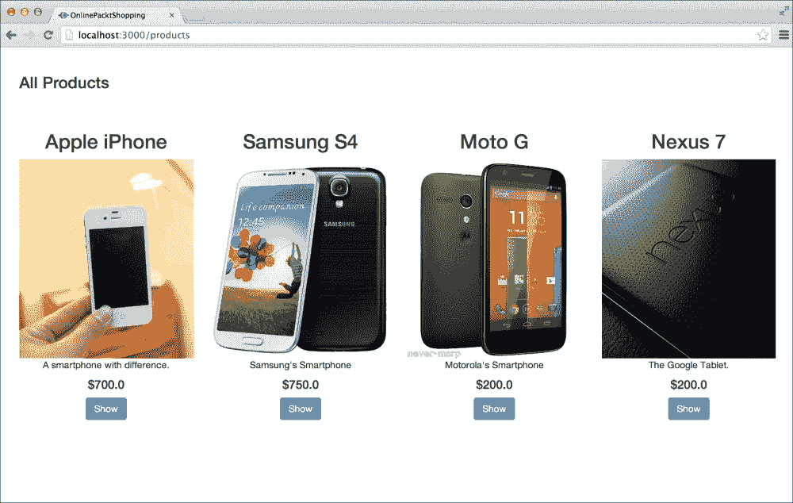

上述截图是桌面视图。

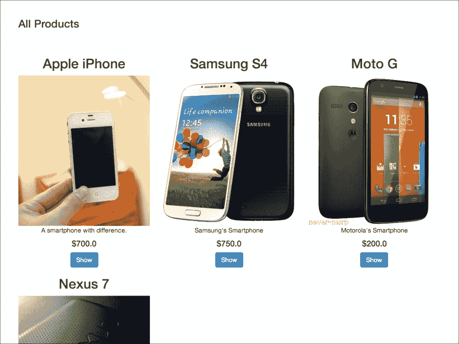

上述截图是中等尺寸设备的视图。这将是市场上大多数平板电脑的视图，输出如下：

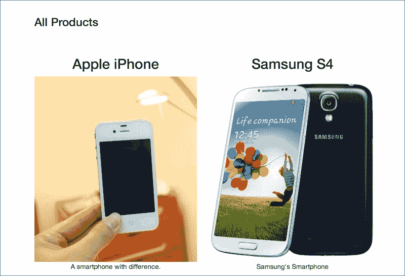

你可以看到列数正在减少，正如我们的设计要求。上述图像显示了较小设备的布局。以下截图显示了超小设备的视图：

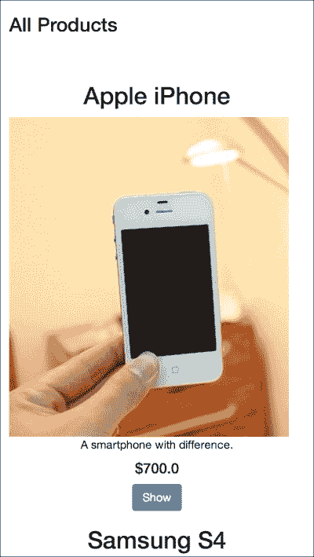

你可以看到，在超小设备中，布局已经变为单列设计。

在这个页面上，还有一些东西缺失，那就是添加新产品的链接。让我们将一个漂亮的“新产品”页面放置在页面标题的右侧。更新页面标题的标记如下：

```js
<div class="page-header">
  <%= link_to 'New Product', new_product_path, :class=>"btn btn-success pull-right" %>
  <h3>All Products</h3>
</div>
```

现在的网页应该看起来像：

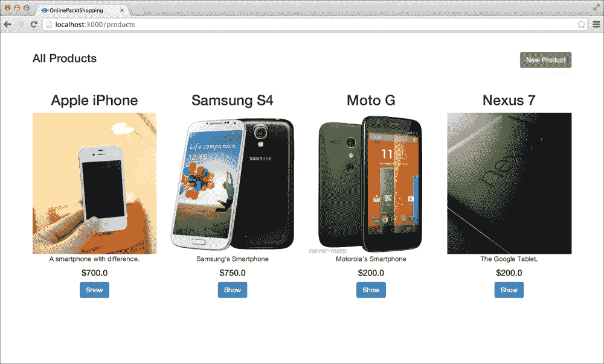

你一定在想我是如何将“新产品”按钮拉到页面右侧的。如果你正确地查看标记，我使用了额外的 Bootstrap 类名 `pull-right`。这些类在 Bootstrap 中被称为辅助类。Bootstrap 中有很多辅助类，随着我们继续阅读本书，我们将了解更多关于它们的信息。

# 摘要

在本章中，我们了解了 Bootstrap 的网格系统，并创建了两种不同类型的项目：一个静态的演示网页和一个在线购物 Rails 应用。我们看到了如何使用网格系统，并使我们的主页能够适应各种尺寸的设备。当前应用中仍有许多页面未进行样式设计：`添加产品`页面、`编辑产品`页面和`单个产品`页面。我们将在后续章节中使用 Bootstrap 对它们进行样式设计。

在下一章中，我们将了解 Bootstrap 提供的各种排版支持，玩转漂亮的 Bootstrap 按钮，并使用 Bootstrap 对图像进行更多操作。
