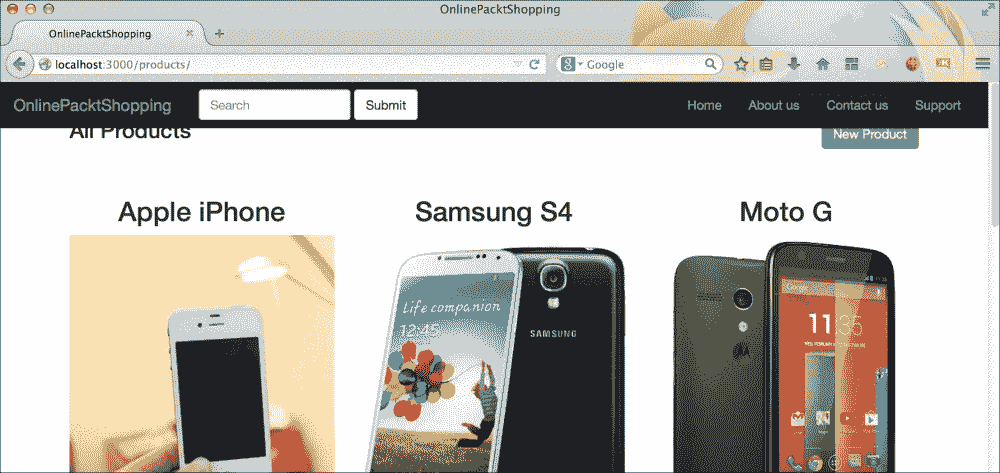

# 第六章 创建导航栏

对于初学者网页设计师或没有网页设计经验的网页开发者来说，创建导航栏一直是其中最困难的任务之一。必须注意正确对齐链接、处理溢出、设置链接样式、使整个栏响应式等。

Bootstrap 为你提供了丰富的选择来创建和设计导航栏，而不必深入研究其 CSS。就像在 Bootstrap 中创建任何其他组件一样，创建导航栏也需要我们遵循适当的标记结构。在本篇文章中，我们将学习如何创建 Bootstrap 导航栏，以及如何修改它以满足我们的需求。我们还将查看在网站中表示导航栏的多种其他方式。我们还将把固定导航栏集成到我们当前的应用程序`OnlinePacktShopping`中。

# 使用导航栏入门

和往常一样，我们将首先创建一个虚拟项目来学习和创建一个静态导航栏。创建一个名为`BootstrapNavigation`的文件夹，并在其中创建一个`index.html`文件。我们将使用 Bootstrap 推荐的 HTML 标记来创建导航栏，代码如下：

```js
<!DOCTYPE html>
<html lang="en">
  <head>
    <meta charset="utf-8">
    <meta http-equiv="X-UA-Compatible" content="IE=edge">
    <meta name="viewport" content="width=device-width, initial-scale=1">
    <title>Bootstrap Navigation Bar</title>
    <!-- Bootstrap -->
    <link rel="stylesheet" href="http://maxcdn.bootstrapcdn.com/bootstrap/3.2.0/css/bootstrap.min.css">
  </head>
  <body>
    <h1>Hello World</h1>
    <!-- jQuery (necessary for Bootstrap's JavaScript plugins) -->
    <script src="img/jquery.min.js"></script>
    <!-- Include all compiled plugins (below), or include individual files as needed -->
    <script src="img/bootstrap.min.js"></script>
  </body>
</html>
```

根据前面的代码，在某个时候，你应该在你的浏览器窗口中看到一个**Hello World**消息。让我们继续并移除这个消息。要创建导航栏，我们需要创建一个带有`navbar`属性的`div`类：

```js
<div class="navbar">
</div>
```

然后，我们需要选择我们想要使用的导航栏颜色。Bootstrap 为你提供了两种不同的颜色变体：默认灰色和反转黑色。它们可以通过使用`.navbar-default`和`.navbar-inverted`类分别应用。在我们的应用程序中，我们将使用`.navbar-default`：

```js
<div class="navbar navbar-default">
</div>
```

接下来，我们添加了一个容器来包裹导航栏的所有元素并设置适当的溢出。我们将使用`.container-fluid`来创建一个全宽度的容器而不是固定宽度的一个。这将允许我们在`.navbar`元素内部使用所有可用空间。代码如下：

```js
<div class="navbar navbar-default">
  <div class="container-fluid">
  </div>
</div>
```

你可以使用`.container`类在导航栏内部创建一个固定宽度的容器。导航栏分为两个重要部分：

+   `.navbar-header`: 这用于插入网站的标志

+   `.navbar-collapse`: 这用于收集导航栏内部的所有链接和其他有用内容

因此，让我们逐步创建每一个。在我们的标记中插入`.navbar-header`：

```js
<div class="navbar navbar-default">
  <div class="container-fluid">
    <div class="navbar-header">
    </div>
  </div>
</div>
```

我们现在将使用`anchor`标签放置网站的名称/品牌。请记住，为`index.html`添加`.navbar-brand`类以应用适当的样式。让我们尝试向其中添加更多元素：

```js
<div class="navbar navbar-default">
  <div class="container-fluid">
    <div class="navbar-header">
      <a href="#">OnlinePacktShopping</a>
    </div>
  </div>
</div>
```

如果你现在查看`index.html`文件，你应该看到如下内容：


接下来，我们将看到导航栏最重要的元素之一，即折叠图标。当网站在小浏览器中打开时，这个图标是可见的，例如手机。当点击这个图标时，它将负责打开折叠菜单。让我们尝试添加`.navbar-collapse`元素：

```js
<div class="navbar-header">
  <button type="button" class="navbar-toggle collapsed" data-toggle="collapse" data-target="#collapsibleMenu">
  <span class="icon-bar"></span>
  <span class="icon-bar"></span>
  <span class="icon-bar"></span>
  </button>
  <a href="#" class="navbar-brand">OnlinePacktShopping</a>
</div>
```

如前述代码所示，这个按钮应该放置在`.navbar-header`类内部。它应该有一个`.navbar-toggle` `collapsed`类。这里的第一个类用于应用适当的样式并将其拉到导航栏的右侧。第二个类用于跟踪按钮的状态，从折叠到非折叠。你还应该向这个元素添加两个自定义数据属性：`data-toggle`和`data-target`。第一个属性用于在 Bootstrap 的 JavaScript 中启动折叠功能，第二个属性用于识别要添加折叠功能的菜单。`data-target`属性应包含将要折叠在较小浏览器上的菜单的 ID。我们很快就会创建这个菜单。

在这个按钮内部，应该有三个不同的 HTML span 元素。这些元素具有`icon-bar`类，负责绘制小的水平线。因此，当这三个元素一起放置时，我们得到一个堆叠式的图标。如果你将浏览器窗口调整到更小的尺寸，你会发现这个按钮放置在导航栏的右侧。让我们看看输出结果：


在这里我们已经完成了`navbar-header`。让我们继续到`.navbar-collapse`元素。这个元素将包裹所有的导航栏链接、搜索字段、下拉菜单等等。确保你将这个元素添加为`.navbar-header`的兄弟元素，而不是其内部。让我们将折叠元素添加进去：

```js
<div class="collapse navbar-collapse" id="collapibleMenu">
</div>
```

这个元素应该包含与`.navbar-toggle`按钮的`data-target`属性中使用的相同 ID。当你点击**切换**按钮时，这个整个部分将会切换。接下来，我们将向我们的导航栏添加一些链接。我们将使用一个带有`nav`和`.navbar-nav`类的无序列表。这两个类都是用于样式目的。

```js
<ul class="nav navbar-nav">
</ul>
```

使用`<li>`标签和`<a>`标签插入链接，如下所示：

```js
<ul class="nav navbar-nav">
  <li><a href="#">Home</a></li>
  <li><a href="#">About us</a></li>
  <li><a href="#">Contact us</a></li>
  <li><a href="#">Support</a></li>
</ul>
```

这应该会给你一个带有一些链接的漂亮导航栏，如下面的截图所示：


如果你尝试缩小浏览器窗口并点击**切换**按钮，你应该会看到一个响应式菜单在起作用，如下面的截图所示：


将`.navbar-left`和`.navbar-right`类添加到`.navbar-nav`列表中，将链接分别对齐到导航栏的左侧和右侧，如下面的截图所示：


如前一章所学，你还可以创建一个 Bootstrap 表单并将其放置在导航栏中。你不需要添加`form-inline`来水平放置表单元素。Bootstrap 为你提供了一个特殊的导航栏表单类，`.navbar-form`。正确添加此类将根据导航栏的对齐方式对表单进行样式化。

```js
<form class="navbar-form navbar-left">
  <div class="form-group">
  <input type="text" class="form-control" placeholder="Search">
  </div>
  <button type="submit" class="btn btn-default">Submit</button>
</form>
```

确保将表单添加到`.navbar-collapse`中，因为它是所有导航栏元素的包装器。这将为你提供一个如下截图所示的导航栏：


到目前为止，导航栏的最终标记如下：

```js
<div class="navbar navbar-default">
  <div class="container-fluid">
    <div class="navbar-header">
      <button type="button" class="navbar-toggle collapsed" data-toggle="collapse" data-target="#collapibleMenu">
        <span class="icon-bar"></span>
        <span class="icon-bar"></span>
        <span class="icon-bar"></span>
      </button>
      <a href="#" class="navbar-brand">OnlinePacktShopping</a>
    </div>
    <div class="collapse navbar-collapse" id="collapibleMenu">
      <ul class="nav navbar-nav navbar-right">
      <li><a href="#">Home</a></li>
      <li><a href="#">About us</a></li>
      <li><a href="#">Contact us</a></li>
      <li><a href="#">Support</a></li>
     </ul>
      <form class="navbar-form navbar-left" role="search">
        <div class="form-group">
        <input type="text" class="form-control" placeholder="Search">
        </div>
      <button type="submit" class="btn btn-default">Submit</button>
      </form>
    </div>
  </div>
</div>
```

# 导航栏辅助类

对于导航栏元素，有许多辅助类可用。以下是一些例子：

+   `.navbar-btn`：当你想在导航栏中放置一个 Bootstrap 按钮时，使用此类来正确对齐它

+   `.navbar-text`：如果你想显示一些纯文本，使用此类使其正确可见

+   `.navbar-link`：如果你想添加一个链接，但不在`.nav`元素内，则使用此类

+   `.navbar-fixed-top`：如果你将此类添加到导航栏`navbar`的父元素中，它将在滚动时固定在浏览器窗口的顶部

+   `.navbar-fixed-bottom`：此类将导航栏固定在窗口屏幕的底部，并在滚动时保持在那里

+   `.active`：将此类添加到任何`<li>`元素上，将突出显示链接，与其他链接相比

# 将导航栏添加到 Rails 应用程序中

我们将把前面的导航栏添加到我们的应用程序中。我们将在其中放置我们商店的品牌标识，并添加一些指向我们公司页面的链接。我们还将在这里使用黑色导航栏，并使其固定在浏览器窗口的顶部。

前往**App** | **Views** | **Layout**，打开`application.html.erb`文件。我们将在这里放置导航栏，因为这将使整个网站全局可见。在这个文件中`.container`元素上方放置以下标记：

```js
  <div class="navbar navbar-inverted navbar-fixed-top">
    <div class="container-fluid">
      <div class="navbar-header">
        <button type="button" class="navbar-toggle collapsed" data-toggle="collapse" data-target="#collapibleMenu">
          <span class="icon-bar"></span>
          <span class="icon-bar"></span>
          <span class="icon-bar"></span>
        </button>
        <a href="#" class="navbar-brand">OnlinePacktShopping</a>
      </div>
      <div class="collapse navbar-collapse" id="collapibleMenu">
      <ul class="nav navbar-nav navbar-right">
      <li><a href="#">Home</a></li>
      <li><a href="#">About us</a></li>
      <li><a href="#">Contact us</a></li>
      <li><a href="#">Support</a></li>
      </ul>
      <form class="navbar-form navbar-left" role="search">
      <div class="form-group">
      <input type="text" class="form-control" placeholder="Search">
      </div>
      <button type="submit" class="btn btn-default">Submit</button>
      </form>
    </div>
  </div>
</div>
```

网站现在应该看起来如下面的截图所示：



如你所见，这里有一些重叠。这是由于`navbar-fixed-top`类引起的。由于导航栏现在浮在窗口顶部，其余的身体部分也开始从窗口顶部出现。我们需要编写我们自己的小块 CSS 代码来解决这个问题。

我们需要在`application.html.erb`页面中的`.container`元素上添加一个额外的自定义类。让我们给它一个`.bodyContent`类：

```js
<div class="container bodyContent">
  <%= yield %>
</div>
```

现在，通过导航到**App** | **Assets** | **Stylesheets**文件夹，打开`application.css`文件。向其中添加以下 CSS 代码：

```js
.bodyContent {
  margin-top: 50px;
}
```

我们将给`.bodyContent`元素添加一个`50px`的边距，以将其向下推，因为导航栏与其重叠。现在页面看起来是正确的，如下面的截图所示：


# 摘要

在本章中，我们学习了如何创建一个简单的导航栏，以及如何使其响应式。我们还看到了如何通过使用`.navbar-inverse`类来改变导航栏的外观。最后，我们将这个导航栏集成到了我们的应用程序中。希望你在创建响应式的 Bootstrap 导航栏时玩得开心。

在下一章中，我们将学习更多关于 Bootstrap 组件的内容，例如面包屑、徽章和标签、警告等。我们还将在我们当前的应用程序中使用许多这些组件。
