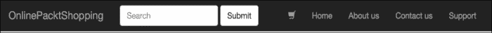
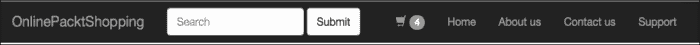
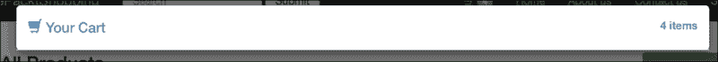
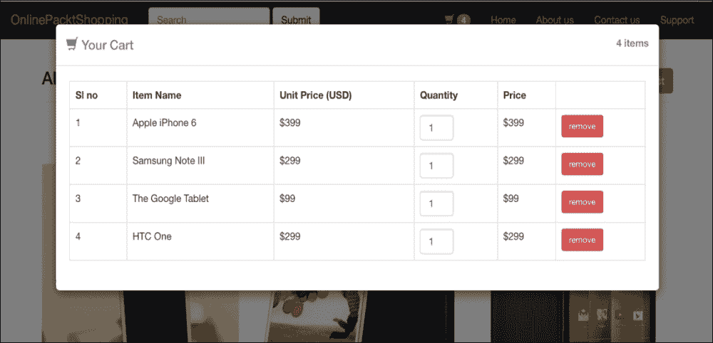
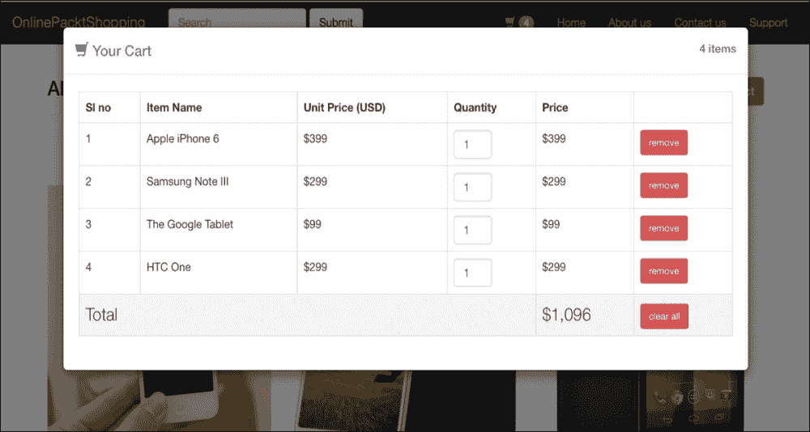
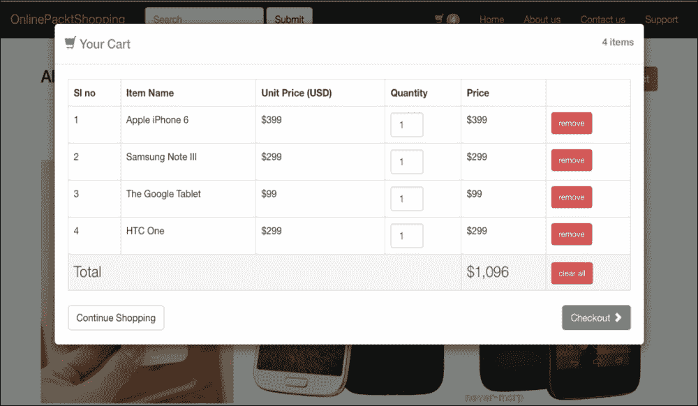

# 第十章：使用 Bootstrap 模态框创建购物车

本章主要讲解如何将我们迄今为止在 Bootstrap 中学到的知识付诸实践。在这里，我们不会学习任何新的内容，但这一章将肯定有助于澄清一些核心概念，例如使用 Bootstrap 模态框、排版、按钮和响应式表格。

在本章中，我们将创建一个 JavaScript 模态框，它将作为我们的购物应用程序中的购物车使用。这个购物车将具备任何购物网站所需的所有功能。为了演示目的，我们将在购物车中只显示静态数据。

简而言之，我们将涵盖以下主题：

+   添加购物车符号

+   使用模态框创建购物车

# 添加购物车符号

在创建我们的应用程序中的购物车之前，我们需要一个处理程序，当点击时，将显示购物车。对于我们的应用程序，我将在当前导航栏中添加一个 Glyphicon 字体图标来显示一个图标。所以，让我们继续并做出这个调整。

导航到 **app** | **views** | **layouts** 并编辑 `application.html.erb` 文件。在 **Home** 的 `<li>` 元素之前，添加另一个带有 Glyphicon 购物车图标的 `<li>` 元素，如下所示：

```js
<li><a href="#"><span class="glyphicon glyphicon-shopping-cart"></span></a></li>
```

### 小贴士

记住，Glyphicons 是 Bootstrap 默认在其仓库中提供的字体图像。

打开浏览器并检查导航栏中的购物车符号。它应该看起来像以下截图所示：



我们将在购物车图标旁边添加一个数字，以指示添加到购物车中的产品数量。我们将使用 Bootstrap 的徽章来实现这一点。添加一个具有 `.badge` 类的 `<span>` 元素将创建一个漂亮的数字指示器：

```js
<li><a href="#"><span class="glyphicon glyphicon-shopping-cart"></span> <span class="badge">4</span></a></li>
```

你应该在导航栏中有一个数字指示器，如下面的截图所示：



让我们再添加一些自定义数据属性，以触发这个购物车链接中的模态框。如前一章所述，我们需要两个自定义属性来创建模态框处理程序：`data-target` 和 `data-toggle`。所以，让我们将这些属性添加到我们的购物车链接中：

```js
<li><a href="#" data-target="#shoppingCart" data-toggle="modal"><span class="glyphicon glyphicon-shopping-cart"></span> <span class="badge">4</span></a></li>
```

在这里，提供给 data-target 的值是 `#shoppingCart`。因此，我们将使用 `shoppingCart` 作为下一节中我们将创建的模态框的 ID。

现在，我们已经准备好了一个购物车图标，当点击时将触发购物车模态框。这个图标也代表了购物车内部物品的数量。令人印象深刻！不是吗？

# 使用模态框创建购物车

如本书前面所述，要创建一个 Bootstrap 模态框，我们需要一个具有 `.modal` 类的 `<div>` 元素。我们还将添加 `.fade` 类以应用淡入淡出过渡效果。这是 Bootstrap 提供的唯一过渡动画。

1.  在 `application.html.erb` 文件的末尾，添加模态框的标记，如下所示：

    ```js
    <div class="modal fade">
    </div>
    ```

1.  在这里需要注意的最重要的事情之一是，我们在这个页面上有两个模态框。为了唯一标识它们中的每一个，我们应该给它们不同的 ID。在这种情况下，我们已经有了一个 ID，即`shoppingCart`。所以，让我们将其添加到我们的标记中：

    ```js
    <div class="modal fade" id="shoppingCart">
    </div>
    ```

1.  接下来，我们需要放置一个模态对话框和模态内容的标记：

    ```js
    <div class="modal fade" id="shoppingCart">
      <div class="modal-dialog modal-lg">
        <div class="modal-content">
        </div>
      </div>
    </div>
    ```

    与前面章节中创建的模态框相比，我们在这里使用了一个更大的模态框，这是通过`.modal-lg`类实现的。

1.  现在，我们将为我们的模态框添加一个标题。这个标题将包含**您的购物车**的标题，以及另一个指示购物车中物品数量的文本：

    ```js
    <div class="modal-header">
    <p class="pull-right text-primary"><b>4 items</b></p>
    <h4 class="modal-title text-primary"><span class="glyphicon glyphicon-shopping-cart"></span> Your Cart </h4>
    </div>
    ```

1.  将前面的内容放置在`.modal-content`元素内。使用`.pull-right`类将`<p>`元素浮动到右边，并使用`.text-primary`实用类将其染成深蓝色。它用于表示购物车中物品的数量。**您的购物车**标题使用带有`.modal-title`和`.text-primary`类的`<h4>`元素编写（以给文本添加蓝色），我们还在标题中包含了一个购物车的图标，该图标是使用 Glyphicon 图标创建的。如果您通过点击购物车图标触发此模态，您将看到如下内容：

让我们开始创建模态框的主体部分。按照以下步骤创建模态框的主体：

1.  将`.modal-header;`添加到以下标记中，作为其兄弟元素。

    ```js
    <div class="modal-body">
    </div>
    ```

1.  我们将插入一个 Bootstrap 表格，该表格将包含实际的项目详情：

    ```js
    <div class="modal-body">:
      <table class="table table-bordered">
      </table>
    </div>
    ```

1.  让我们在表格内创建多个列：

    ```js
    <div class="modal-body">
      <table class="table table-bordered">
        <tr>
          <th>Sl no</th>
          <th>Item Name</th>
          <th>Unit Price (USD)</th>
          <th>Quantity</th>
          <th>Price</th>
          <th></th>
        </tr>
      </table>
    </div>
    ```

    我们有**序列号**、**项目名称**、**单价**、**订购数量**和**项目价格**的列。我们还有一个没有标题的额外列，其中将包含一个链接，用于从表中删除特定的项目行。

1.  让我们填写第一行：

    ```js
    <div class="modal-body">
      <table class="table table-bordered">
        <tr>
          <th>Sl no</th>
          <th>Item Name</th>
          <th>Unit Price (USD)</th>
          <th>Quantity</th>
          <th>Price</th>
          <th></th>
        </tr>
        <tr>
          <td>1</td>
          <td>Apple iPhone 6</td>
          <td>$399</td>
          <td>
          <input type="text" class="form-control" value="1" placeholder="Enter Quantity" style="width: 50px;" />
          </td>
          <td>$399</td>
          <td><a href="#" class="btn btn-danger btn-sm">remove</a></td>
        </tr>
      </table>
    </div>
    ```

1.  对于数量字段，我使用了一个带有`.form-control`类的输入字段，以给它一个 Bootstrap 的外观和感觉。我还给它应用了一个 CSS 宽度为`50px`。在最后一列中，我添加了一个名为**删除**的文本链接，带有`.btn`、`.btn-danger`和`.btn-sm`类。`.btn-danger`类使按钮变红，而`.btn-sm`类用于减小正常 Bootstrap 按钮的大小。尝试在表格中填写更多项目。最后，您将得到一个如下截图所示的模态框：

1.  现在，我们只剩下最后一行，将显示物品的总计。让我们继续并添加它：

    ```js
    <tr class="active lead">
      <td colspan="4">Total</td>
        <td>$1,096</td>
        <td><a href="#" class="btn btn-danger btn-sm">clear all</a>
      </td>
    </tr>
    ```

    我没有添加所有列，而是通过在这里使用 `colspan` 属性合并了前四列。在最后一列，我将按钮的文本更改为**清除所有**。这里最重要的变化之一是添加到行的 `.active` 和 `.lead` 类。`.active` 类使用灰色背景突出显示行，而 `.lead` 类增加了文本的字体大小。现在模态框应该看起来像以下这样：

    

1.  现在我们将在模态框的末尾添加两个不同的按钮：**继续购物**和**结账**：

    ```js
    <a href="#" class="btn btn-success pull-right">Checkout <span class="glyphicon glyphicon-chevron-right">
      </span>
    </a>
    <a href="#" class="btn btn-default" data-dismiss="modal">Continue Shopping
    </a>
    ```

    第一个按钮是通过使用 `.pull-right` 工具类向右拉动的。**继续购物**按钮使用 `data-dismiss` 属性来关闭模态框，并允许用户继续使用网站。

1.  最后，我们的购物车设计完成了。现在它应该看起来像下面截图所示：

# 摘要

希望你喜欢阅读这一章。通过这一章，我们尝试使用 Bootstrap 和其组件设计一个模拟购物车。我们看到了如何在 Bootstrap 模态框中使用 Bootstrap 表格，以及如何利用 Bootstrap 的工具类。我们还看到了如何使用免费字体图标，Glyphicons，在导航栏中创建购物车图标。

在下一章，我们将学习一个非常重要的主题，*自定义 Bootstrap*。做好准备，很快我会和你一起学习。
