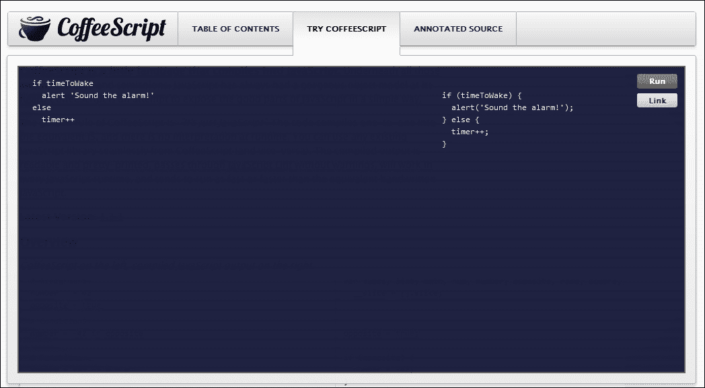

# 第一章。为什么选择 CoffeeScript？

CoffeeScript 编译成 JavaScript 并紧密遵循其惯例。完全有可能将任何 CoffeeScript 代码重写为 JavaScript，而不会看起来有太大差异。那么，为什么你想使用 CoffeeScript 呢？

作为一名经验丰富的 JavaScript 程序员，你可能会认为学习一门全新的语言根本不值得花费时间和精力。

但最终，代码是为程序员而写的。编译器并不关心代码的外观或其含义的清晰度；要么它能运行，要么就不能。我们作为程序员的目标是编写易于表达、易于阅读、引用、理解、修改和重写的代码。

如果代码过于复杂或充满了不必要的仪式，它将更难理解和维护。CoffeeScript 让我们能够清晰地表达思想，并编写更易于阅读的代码。

认为 CoffeeScript 与 JavaScript 非常不同是一种误解。虽然这里和那里可能有一些极端的语法差异，但本质上，CoffeeScript 被设计用来打磨 JavaScript 的粗糙边缘，揭示隐藏在下面的美丽语言。它引导程序员走向 JavaScript 所谓的“优点”，并对构成良好 JavaScript 的因素持有强烈的观点。

CoffeeScript 社区的一个格言是：“它只是 JavaScript”，我也发现，真正理解这门语言的最佳方式是查看它生成的输出，这实际上是一段非常可读且易于理解的代码。

在本章中，我们将突出两种语言之间的某些差异，通常集中在 JavaScript 中 CoffeeScript 试图改进的地方。

以这种方式，我不仅想给你一个关于语言主要功能的概述，还想让你在使用 CoffeeScript 时，一旦开始更频繁地使用它，就能从其生成的代码中调试 CoffeeScript，以及能够转换现有的 JavaScript。

让我们从 CoffeeScript 在 JavaScript 中修复的一些事情开始。

# CoffeeScript 语法

CoffeeScript 的一个优点是，你通常会编写比在 JavaScript 中更短、更简洁的程序。这其中的部分原因是因为语言中添加了强大的功能，但它也对 JavaScript 的一般语法进行了一些调整，使其变得更加优雅。它去掉了所有分号、花括号和其他通常导致 JavaScript 中大量“行噪声”的冗余。

为了说明这一点，让我们看一个例子。以下表格的左侧是 CoffeeScript；右侧是生成的 JavaScript：

| CoffeeScript | JavaScript |
| --- | --- |

|

```js
fibonacci = (n) ->
 return 0 if n == 0
 return 1 if n == 1
 (fibonacci n-1) + (fibonacci n-2)

alert fibonacci 10
```

|

```js
var fibonacci;

fibonacci = function(n) {
  if (n === 0) {
    return 0;
  }
  if (n === 1) {
    return 1;
  }
  return (fibonacci(n - 1)) + (fibonacci(n - 2));
}; 

alert(fibonacci(10));
```

|

要运行本章中的代码示例，你可以使用优秀的 **Try CoffeeScript** 在线工具，网址为 [`coffeescript.org`](http://coffeescript.org)。它允许你输入 CoffeeScript 代码，然后会在侧边栏中显示等效的 JavaScript 代码。你还可以直接从浏览器中运行代码（通过点击左上角的 **运行** 按钮）。如果你更喜欢在计算机上安装 CoffeeScript 后先运行示例，请跳到下一章，然后在安装好 CoffeeScript 后返回。此工具在以下屏幕截图中有展示：



起初，这两种语言可能看起来相当不同，但希望随着我们逐步了解这些差异，你会发现它们仍然是 JavaScript，只是进行了一些小的调整和很多语法糖。

## 分号和大括号

正如你可能已经注意到的，CoffeeScript 去掉了行尾的所有尾随分号。如果你想在一行上放置两个表达式，仍然可以使用分号。它还去掉了代码块（如 `if` 语句、`switch` 和 `try..catch` 块）的括号（也称为花括号）。

## 空白

你可能想知道解析器是如何确定你的代码块开始和结束的位置的。CoffeeScript 编译器通过使用语法空白来实现这一点。这意味着缩进被用来定义代码块，而不是大括号。

这可能是该语言最具争议性的特性之一。如果你这么想，在几乎所有语言中，程序员都倾向于使用代码块的缩进来提高可读性，那么为什么不将其作为语法的一部分呢？这不是一个新概念，主要是从 Python 借鉴的。如果你有任何关于显著空白语言的体验，你将不会对 CoffeeScript 的缩进有任何困难。

如果你没有这样做，可能需要一些时间来适应，但这样做可以使代码读起来非常清晰，易于扫描，同时还能减少很多按键。我敢打赌，如果你花时间克服一些最初的顾虑，你可能会逐渐爱上块缩进。

### 注意

块可以用制表符或空格缩进，但要注意保持一致性，使用其中一种，否则 CoffeeScript 将无法正确解析你的代码。

## 括号

你会看到 `if` 语句的子句不需要用括号括起来。对于 `alert` 函数也是如此；你会看到单个字符串参数在函数调用后没有括号。在 CoffeeScript 中，带有参数的函数调用、`if..else` 语句的子句以及 `while` 循环的子句中的括号都是可选的。

虽然带有参数的函数不需要括号，但在可能存在歧义的情况下使用它们仍然是一个好主意。CoffeeScript 社区提出了一种很好的习惯：将整个函数调用用括号括起来。以下表格展示了 CoffeeScript 中 `alert` 函数的使用：

| CoffeeScript | JavaScript |
| --- | --- |

|

```js
alert square 2 * 2.5 + 1

alert (square 2 * 2.5) + 1
```

|

```js
alert(square(2 * 2.5 + 1));

alert((square(2 * 2.5)) + 1);
```

|

函数是 JavaScript 中的第一类对象。这意味着当你不使用括号引用函数时，它将返回函数本身，作为一个值。因此，在 CoffeeScript 中，当你调用无参数的函数时，仍然需要添加括号。

通过对 JavaScript 语法进行这些小的调整，CoffeeScript 可以显著提高代码的可读性和简洁性，并且可以节省你很多键盘输入。

但它还有一些其他的技巧。大多数写过相当多 JavaScript 的程序员可能会同意，最频繁输入的短语之一可能是函数定义 `function(){}`。函数确实是 JavaScript 的核心，尽管它有很多瑕疵。

# CoffeeScript 有很好的函数语法

你可以将函数作为第一类对象来处理，同时也能创建匿名函数，这是 JavaScript 最强大的功能之一。然而，语法可能非常尴尬，使得代码难以阅读（尤其是当你开始嵌套函数时）。但 CoffeeScript 有一个解决方案。看看下面的代码片段：

| CoffeeScript | JavaScript |
| --- | --- |

|

```js
-> alert 'hi there!'
square = (n) -> n * n
```

|

```js
var square;
(function() {
  return alert('hi there!');
});
square = function(n) {
  return n * n;
};
```

|

在这里，我们创建了两个匿名函数，第一个只是显示一个对话框，第二个将返回其参数的平方。你可能已经注意到了那个有趣的 `->` 符号，并且可能已经猜出了它的作用。是的，这就是在 CoffeeScript 中定义函数的方法。我遇到过这个符号的几个不同名称，但似乎最被接受的术语是一个瘦箭头或者只是一个箭头。这与我们将要讨论的粗箭头相反。

注意，第一个函数定义没有参数，因此我们可以省略括号。第二个函数有一个参数，它被括号包围，放在 `->` 符号前面。根据我们现在的知识，我们可以制定一些简单的替换规则，将 JavaScript 函数声明转换为 CoffeeScript。它们如下：

+   将 `function` 关键字替换为 `->`

+   如果函数没有参数，可以省略括号

+   如果函数有参数，将整个参数列表（带括号）放在 `->` 符号前面

+   确保函数体正确缩进，然后删除包围的大括号

## 不需要 `return`

您可能已经注意到，在这两个函数中，我们都省略了 `return` 关键字。默认情况下，CoffeeScript 将返回函数中的最后一个表达式。它将在所有执行路径上尝试这样做。CoffeeScript 会尝试将任何语句（返回无值的代码片段）转换为返回值的表达式。CoffeeScript 程序员通常会通过说“一切都是表达式”来引用这种语言特性。

这意味着您不再需要键入 `return`，但请记住，在许多情况下，这可能会微妙地改变您的代码，因为您将始终返回某些内容。如果您需要在函数的最后一条语句之前从函数中返回一个值，您仍然可以使用 `return`。

## 函数参数

函数参数也可以接受一个可选的默认值。在下面的代码片段中，您将看到指定的可选值是在生成的 JavaScript 的主体中赋值的：

| CoffeeScript | JavaScript |
| --- | --- |

|

```js
square = (n=1) ->
  alert(n * n)
```

|

```js
var square;

square = function(n) {
  if (n == null) {
    n = 1;
  }
  return alert(n * n);
};
```

|

在 JavaScript 中，每个函数都有一个类似数组的结构，称为 `arguments`，每个传递给函数的参数都有一个索引属性。您可以使用 `arguments` 将可变数量的参数传递给函数。每个参数都将是一个 `arguments` 的元素，因此您不需要通过名称引用参数。

虽然 `arguments` 对象在某种程度上类似于数组，但它实际上不是一个“真正的”数组，并且缺少大多数标准数组方法。通常，您会发现 `arguments` 并不提供检查和操作其元素所需的功能，就像它们与数组一起使用时那样。

这迫使许多程序员使用一种技巧，通过使 `Array.prototype.slice` 复制 `argument` 对象元素，或者使用 `jQuery.makeArray` 方法创建一个标准数组，然后可以像正常数组一样使用。

CoffeeScript 从表示为 **splats** 的参数中借用创建数组的模式，用三个点 (`...`) 表示。这些在下面的代码片段中显示：

**CoffeeScript:**

```js
gpaScoreAverage = (scores...) ->
   total = scores.reduce (a, b) -> a + b
   total / scores.length

alert gpaScoreAverage(65,78,81)
scores = [78, 75, 79]
alert gpaScoreAverage(scores...)
```

**JavaScript:**

```js
var gpaScoreAverage, scores,
  __slice = [].slice;

gpaScoreAverage = function() {
  var scores, total;
  scores = 1 <= arguments.length ? __slice.call(arguments, 0) : [];
  total = scores.reduce(function(a, b) {
    return a + b;
  });
  return total / scores.length;
};

alert(gpaScoreAverage(65, 78, 81));
scores = [78, 75, 79];
alert(gpaScoreAverage.apply(null, scores));
```

注意，在函数定义中，参数后面跟着 `...`。这告诉 CoffeeScript 允许变量参数。函数可以通过参数列表或跟在 `...` 后面的数组来调用。

## `var` 关键字去哪里了？

在 JavaScript 中，您通过在声明前缀 `var` 关键字来创建局部变量。如果您省略它，变量将在全局作用域中创建。

您将在这些示例中看到，我们不需要使用 `var` 关键字，并且 CoffeeScript 在生成的 JavaScript 中在函数顶部创建了实际的变量声明。

如果您是经验丰富的 JavaScript 开发者，您可能会想知道您将如何创建全局变量。简单的答案是您不能。

许多人（可能包括 CoffeeScript 的作者）可能会认为这是一个好事，因为在大多数情况下应该避免全局变量。不过，别担心，我们将在稍后讨论创建顶级对象的方法。但这也巧妙地引出了 CoffeeScript 的另一个好处。

# CoffeeScript 处理作用域更好

看一下下面的 JavaScript 代码片段。注意，一个名为`salutation`的变量在两个地方被定义，在函数内部，以及在函数第一次被调用之后：

| JavaScript |
| --- |

|

```js
var greet = function(){ 
    if(typeof salutation === 'undefined') 
        salutation = 'Hi!'; 
    console.log(salutation); 
}
greet();
salutation = "Bye!";
greet();
```

|

在 JavaScript 中，当你省略声明变量时的`var`关键字，它立即成为全局变量。全局变量在所有作用域中都是可用的，因此可以从任何地方覆盖，这通常会导致混乱。

在前面的例子中，`greet`函数首先检查`salutation`变量是否已定义（通过检查`typeof`是否等于`undefined`，这是在 JavaScript 中检查变量是否已定义的常见方法）。如果之前没有定义，它将不使用`var`关键字创建它。这将立即将变量提升到全局作用域。我们可以在片段的其余部分看到这一点的后果。

第一次调用`greet`函数时，字符串**Hi!**将被记录。在问候语更改后再次调用函数，控制台将记录**Bye!**。因为变量被泄露为全局变量，其值在函数作用域之外被覆盖。

这种语言的奇怪“特性”已经成为许多疲惫的程序员头疼的原因，因为他们忘记在某处包含一个`var`关键字。即使你打算声明一个全局变量，这通常被认为是一个糟糕的设计选择，这就是为什么 CoffeeScript 不允许这样做。

CoffeeScript 会始终向任何变量声明添加`var`关键字，以确保它不会意外地成为全局声明。实际上，你永远不应该自己输入`var`，如果这样做，编译器会报错。

## 顶级变量关键字

当你在 JavaScript 脚本的最顶层声明`var`时，它仍然在全局范围内可用。当你包含许多不同的 JavaScript 文件时，这也可能造成混乱，因为你可能会覆盖在早期脚本中声明的变量。

在 JavaScript 和随后的 CoffeeScript 中，函数作为闭包工作，这意味着它们创建自己的变量作用域，同时也可以访问它们的封装作用域变量。

经过多年的发展，一个常见的模式开始出现，即库作者将整个脚本包裹在一个匿名闭包函数中，并将它分配给一个单独的变量。

CoffeeScript 编译器做类似的事情，并将脚本包裹在一个匿名函数中，以避免其作用域泄露。在以下示例中，JavaScript 是运行 CoffeeScript 编译器的输出：

| CoffeeScript | JavaScript |
| --- | --- |

|

```js
greet = -> salutation = 'Hi!'
```

|

```js
(var greet;
greet = function() {
  var salutation;
  return salutation = 'Hi!';
}).call(this);
```

|

这里您可以看到 CoffeeScript 如何将其函数定义包装在其自己的作用域中。

然而，在某些情况下，您可能希望一个变量在整个应用程序中可用。通常，将属性附加到现有的全局对象可以实现这一点。当您在浏览器中时，您只需在全局 `window` 对象上创建一个属性。

在浏览器端的 JavaScript 中，`window` 对象代表一个打开的窗口。它对所有其他对象都是全局可用的，因此可以用作全局命名空间或其他对象的容器。

当我们谈论对象时，让我们谈谈 CoffeeScript 使其变得更好的 JavaScript 的另一个部分：定义和使用对象。

# CoffeeScript 有更好的对象语法

JavaScript 语言有一个奇妙而独特的对象模型，但创建对象和从它们继承的语法和语义始终有点繁琐，并且被广泛误解。

CoffeeScript 以简单而优雅的语法清理了这一点，这种语法并没有偏离惯用的 JavaScript 太远。以下代码演示了 CoffeeScript 如何将其类语法编译成 JavaScript：

**CoffeeScript:**

```js
class Vehicle
  constructor: ->   
  drive: (km) -> 
    alert "Drove #{km} kilometres"

bus = new Vehicle()
bus.drive 5
```

**JavaScript:**

```js
var Vehicle, bus;
Vehicle = (function() {
  function Vehicle() {}
  Vehicle.prototype.drive = function(km) {
    return alert("Drove " + km + " kilometres");
  };
  return Vehicle;
})();
bus = new Vehicle();
bus.drive(5);
```

在 CoffeeScript 中，您使用 `class` 关键字来定义对象结构。在底层，这创建了一个函数对象，其原型上添加了函数方法。`constructor: operator` 将创建一个构造函数，当您的对象使用 `new` 关键字初始化时将被调用。

所有其他函数方法都是使用 `methodName: () ->` 语法声明的。这些方法是在对象的原型上创建的。

### 注意

您注意到我们的 alert 字符串中的 `#{km}` 吗？这是字符串插值语法，它借鉴了 Ruby。我们将在本章后面讨论这个问题。

## 继承

关于对象继承呢？虽然这是可能的，但在 JavaScript 中通常非常痛苦，以至于大多数程序员甚至都不愿意这样做，或者使用具有非标准语义的第三方库。

在这个例子中，您可以看到 CoffeeScript 如何使对象继承变得优雅：

**CoffeeScript:**

```js
class Car extends Vehicle
  constructor: -> 
    @odometer = 0
  drive: (km) ->
    @odometer += km
    super km
car = new Car
car.drive 5
car.drive 8

alert "Odometer is at #{car.odometer}"
```

**JavaScript:**

```js
Car = (function(_super) {
  __extends(Car, _super);
  function Car() {
    this.odometer = 0;
  }
  Car.prototype.drive = function(km) {
    this.odometer += km;
    return Car.__super__.drive.call(this, km);
  };
  return Car;
})(Vehicle);

car = new Car;
car.drive(5);
car.drive(8);
alert("Odometer is at " + car.odometer);
```

这个例子并不包含编译器将生成的所有 JavaScript 代码，但足以突出有趣的部分。`extends` 操作符用于设置两个对象及其构造函数之间的继承链。注意使用 `super` 后调用父类变得多么简单。

如您所见，`@odometer` 被翻译为 `this.odometer`。`@` 符号只是 `this` 的快捷方式。我们将在本章后面进一步讨论这个问题。

## 感到不知所措了吗？

在我看来，`class` 语法是您在 CoffeeScript 和其编译后的 JavaScript 之间找到的最大差异的地方。然而，大多数时候它都能正常工作，一旦您理解了它，您就很少需要担心细节。

## 扩展原型

如果你是一位经验丰富的 JavaScript 程序员，仍然喜欢自己完成所有这些工作，你不需要使用 `class`。CoffeeScript 仍然提供了通过 `::` 符号访问原型的便捷快捷方式，这在生成的 JavaScript 中将被 `.prototype` 替换，如下面的代码片段所示：

| CoffeeScript | JavaScript |
| --- | --- |

|

```js
Vehicle::stop=->  alert'Stopped'
```

|

```js
Vehicle.prototype.stop(function() {
  return alert('Stopped');
});
```

|

# CoffeeScript 解决的一些其他问题

JavaScript 有很多其他的小烦恼，CoffeeScript 使其变得更加友好。让我们看看其中的一些。

## 保留字和对象语法

在 JavaScript 中，你通常会需要使用保留字，或者 JavaScript 中使用的关键字。这通常发生在 JavaScript 中的字面量对象键作为数据，如 `class` 或 `for`，然后你需要用引号括起来。CoffeeScript 会自动为你引用保留字，通常你甚至不需要担心它。

| CoffeeScript | JavaScript |
| --- | --- |

|

```js
tag = 
  type: 'label' 
  name: 'nameLabel'
  for: 'name'
  class: 'label'
```

|

```js
var tag;

tag = {
  type: 'label',
  name: 'nameLabel',
  "for": 'name',
  "class": 'label'
};
```

|

注意，我们不需要花括号来创建对象字面量，并且在这里也可以使用缩进。在使用这种样式时，只要每行只有一个属性，我们甚至可以省略尾随逗号。

我们也可以用这种方式编写数组字面量：

| CoffeeScript | JavaScript |
| --- | --- |

|

```js
dwarfs = [
  "Sneezy"
  "Sleepy"
  "Dopey"
  "Doc"
  "Happy"
  "Bashful"
  "Grumpy"
]
```

|

```js
var dwarfs;

dwarfs = ["Sneezy", "Sleepy", "Dopey", "Doc", "Happy", "Bashful", "Grumpy"];
```

|

这些特性结合起来，使得编写 JSON 变得轻而易举。比较以下示例以查看差异：

**CoffeeScript：**

```js
"firstName": "John"
"lastName": "Smith"
"age": 25
"address": 
  "streetAddress": "21 2nd Street"
  "city": "New York"
  "state": "NY"
  "postalCode": "10021"
"phoneNumber": [
  {"type": "home", "number": "212 555-1234"}
  {"type": "fax", "number": "646 555-4567"}
]
```

**JavaScript：**

```js
({
  "firstName": "John",
  "lastName": "Smith",
  "age": 25,
  "address": {
    "streetAddress": "21 2nd Street",
    "city": "New York",
    "state": "NY",
    "postalCode": "10021"
  },
  "phoneNumber": [
    {
      "type": "home",
      "number": "212 555-1234"
    }, {
      "type": "fax",
      "number": "646 555-4567"
    }
  ]
});
```

## 字符串连接

对于处理大量字符串的语言，JavaScript 在构建字符串方面一直做得不太好。变量和表达式值通常被期望插入到字符串的某个位置，这通常是通过使用 `+` 运算符进行连接来完成的。如果你曾经尝试在字符串中连接几个变量，你会很快知道这很快变得繁重且难以阅读。

CoffeeScript 具有内置的字符串插值语法，这与许多其他脚本语言类似，但它是专门从 Ruby 中借用的。以下代码片段展示了这一点：

| CoffeeScript | JavaScript |
| --- | --- |

|

```js
greet = (name, time) -> 
  "Good #{time} #{name}!"

alert (greet 'Pete', 'morning')
```

|

```js
var greet;

greet = function(name, time) {
  return "Good " + time + " " + name + "!";
};

alert(greet('Pete', 'morning'));
```

|

你可以在 `#{}` 内写入任何表达式，其字符串值将被连接。请注意，你只能在双引号字符串 `""` 中使用字符串插值。单引号字符串是字面量，将按原样表示。

## 等价性

JavaScript 中的等价运算符 `==`（及其相反的 `!=`）充满了危险，很多时候并不像你期望的那样工作。这是因为它会在比较之前首先尝试将不同类型的对象强制转换为相同的类型。

它也不是传递的，这意味着它可能根据操作符左右是否是类型而返回不同的 `true` 或 `false` 值。请参考以下代码片段：

```js
'' == '0'           // false
0 == ''             // true
0 == '0'            // true

false == 'false'    // false
false == '0'        // true

false == undefined  // false
false == null       // false
null == undefined   // true
```

由于其不一致和奇怪的行为，JavaScript 社区中的尊敬成员建议完全避免使用它，而应使用身份运算符，即`===`来代替。这个运算符在两个对象类型不同时总是返回`false`，这与许多其他语言中`==`的工作方式一致。

CoffeeScript 会始终将`==`转换为`===`，将`!=`转换为`!===`，如下面的实现所示：

| CoffeeScript | JavaScript |
| --- | --- |

|

```js
'' == '0'
0 == ''  
0 == '0' 
false == 'false'
false == '0'    
false == undefined
false == null     
null == undefined 
```

|

```js
'' === '0';
0 === '';
0 === '0';
false === 'false';
false === '0';
false === void 0;
false === null;
null === void 0;
```

|

## 存在运算符

当你在 JavaScript 中尝试检查一个变量是否存在并且有值（不是`null`或`undefined`）时，你需要使用这个古怪的习惯用法：

```js
typeof a !== "undefined" && a !== null 
```

CoffeeScript 有一个很好的快捷方式，即存在运算符`?`，除非变量是`undefined`或`null`，否则它将返回`false`。

| CoffeeScript | JavaScript |
| --- | --- |

|

```js
broccoli = true;
if carrots? && broccoli?
  alert 'this is healthy'
```

|

```js
var broccoli;

broccoli = true;

if ((typeof carrots !== "undefined" && carrots !== null) && (broccoli != null)) {
  alert('this is healthy');
}
```

|

在这个例子中，由于编译器已经知道 broccoli 是已定义的，`?`运算符将只检查它是否有`null`值，而它将检查`carrots`是否是`undefined`以及`null`。

存在运算符有一个方法调用变体：`?.`或者简称为“soak”，它将允许你在方法链中吞咽`null`对象上的方法调用，如下所示：

| CoffeeScript | JavaScript |
| --- | --- |

|

```js
street = person?.getAddress()?.street
```

|

```js
var street, _ref;

street = typeof person !== "undefined" && person !== null ? (_ref = person.getAddress()) != null ? _ref.street : void 0 : void 0;
```

|

如果链中的所有值都存在，你应该得到预期的结果。如果其中任何一个应该是`null`或`undefined`，你将得到一个未定义的值，而不是抛出`TypeError`。

尽管这是一个强大的技术，但它也可能被轻易滥用，并使代码难以推理。如果你有长的方法链，可能很难确切知道 null 或 undefined 值是从哪里来的。

**迪米特法则**，一个著名的面向对象设计原则，可以用来最小化这种复杂性并提高代码的解耦。它可以概括如下：

+   你的方法可以直接调用其类中的其他方法

+   你的方法可以直接调用其自己的字段上的方法（但不能调用字段的字段）

+   当你的方法接受参数时，你的方法可以直接调用这些参数上的方法

+   当你的方法创建局部对象时，该方法可以调用这些局部对象上的方法

### 注意

虽然这并不是一个“严格的法律”，因为它不应该被违反，但它更类似于自然法则，即遵循这个法则的代码也往往更加简单和松散耦合。

现在我们已经花了一些时间来探讨 JavaScript 的一些不足和烦恼，CoffeeScript 是如何解决的，让我们来关注一些 CoffeeScript 添加的其他强大功能；一些是从其他脚本语言借用的，一些是语言独有的。

# 列表推导式

在 CoffeeScript 中，遍历集合的方式与 JavaScript 的命令式方法大不相同。CoffeeScript 从函数式编程语言中汲取灵感，使用列表推导式来转换列表，而不是通过迭代元素来遍历。

## `while` 循环

`while` 循环仍然存在，并且工作方式大致相同，只不过它可以作为一个表达式使用，这意味着它将返回一个值数组：

**CoffeeScript:**

```js
multiplesOf = (n, times) -> 
  times++
  (n * times while times -= 1 > 0).reverse()

alert (multiplesOf 5, 10)
```

**JavaScript:**

```js
var multiplesOf;

multiplesOf = function(n, times) {
  times++;
  return ((function() {
    var _results;
    _results = [];
    while (times -= 1 > 0) {
      _results.push(n * times);
    }
    return _results;
  })()).reverse();
};

alert(multiplesOf(5, 10));
```

注意，在前面的代码中，`while` 循环体位于条件之前。这是 CoffeeScript 中的一种常见惯用语，如果循环体只有一行的话。你也可以用 `if` 语句和列表推导式做同样的事情。

我们可以通过使用 `until` 关键字稍微提高前面代码的可读性，它基本上是 `while` 的否定，如下所示：

**CoffeeScript:**

```js
multiplesOf = (n, times) -> 
  times++
  (n * times until --times == 0).reverse()

alert (multiplesOf 5, 10)
```

**JavaScript:**

```js
var multiplesOf;

multiplesOf = function(n, times) {
  times++;
  return ((function() {
    var _results;
    _results = [];
    while (--times !== 0) {
      _results.push(n * times);
    }
    return _results;
  })()).reverse();
};

alert(multiplesOf(5, 10));
```

`for` 语句在 CoffeeScript 中的工作方式与 JavaScript 不同。CoffeeScript 用列表推导式替换了它，这些推导式主要借鉴了 Python 语言，并且与你在 Haskell 等函数式语言中找到的构造非常相似。推导式提供了一种更声明式的方式来过滤、转换和聚合集合，或者对每个元素执行操作。最好的说明方式是通过一些示例：

**CoffeeScript:**

```js
flavors = ['chocolate', 'strawberry', 'vanilla']
alert flavor for flavor in flavors

favorites = ("#{flavor}!" for flavor in flavors when flavor != 'vanilla')
```

**JavaScript:**

```js
var favorites, flavor, flavors, _i, _len;

flavors = ['chocolate', 'strawberry', 'vanilla'];

for (_i = 0, _len = flavors.length; _i < _len; _i++) {
  flavor = flavors[_i];
  alert(flavor);
}

favorites = (function() {
  var _j, _len1, _results;
  _results = [];
  for (_j = 0, _len1 = flavors.length; _j < _len1; _j++) {
    flavor = flavors[_j];
    if (flavor !== 'vanilla') {
      _results.push("" + flavor + "!");
    }
  }
  return _results;
})();
```

虽然它们相当简单，但推导式具有非常紧凑的格式，并且用很少的代码做了很多事情。让我们将其分解为其独立的各个部分：

```js
[action or mapping] for [selector] in [collection] when [condition] by [step]
```

推导式最好从右到左阅读，从 `in` 集合开始。`selector` 名称是在遍历集合时赋予每个元素的临时名称。`for` 关键字前面的子句描述了你想如何使用 `selector` 名称，通过将其作为参数调用方法、选择其上的属性或方法，或者为其赋值。

`when` 和 `by` 守卫子句是可选的。它们描述了迭代应该如何被过滤（只有当元素的后续 `when` 条件为 `true` 时才会返回元素），或者使用 `by` 后跟一个数字来选择集合的哪些部分。例如，`by 2` 将返回所有偶数编号的元素。

我们可以通过使用 `by` 和 `when` 重新编写我们的 `multiplesOf` 函数：

**CoffeeScript:**

```js
multiplesOf = (n, times) -> 
  multiples = (m for m in [0..n*times] by n)
  multiples.shift()
  multiples

alert (multiplesOf 5, 10)
```

**JavaScript:**

```js
var multiplesOf;

multiplesOf = function(n, times) {
  var m, multiples;
  multiples = (function() {
    var _i, _ref, _results;
    _results = [];
    for (m = _i = 0, _ref = n * times; 0 <= _ref ? _i <= _ref : _i >= _ref; m = _i += n) {
      _results.push(m);
    }
    return _results;
  })();
  multiples.shift();
  return multiples;
};

alert(multiplesOf(5, 10));
```

`[0..n*times]` 语法是 CoffeeScript 的范围语法，它借鉴了 Ruby。它将创建一个包含从第一个到最后一个数字之间所有元素的数组。当范围有两个点时，它将是包含的，意味着范围将包含指定的起始和结束元素。如果它有三个点（`…`），它将只包含中间的数字。

当我开始学习 CoffeeScript 时，列表推导是最大的新概念之一。这是一个非常强大的功能，但确实需要一些时间来习惯并学会以列表推导的方式思考。每当您想写一个使用低级 `while` 循环结构的代码时，请考虑使用列表推导。它们在处理集合时提供了您可能需要的几乎所有功能，并且与内置的 ECMAScript 数组方法（如 `.map()` 和 `.select()`）相比，它们非常快。

您可以使用列表推导来遍历对象中的键值对，使用 `of` 关键字，如下面的代码所示：

**CoffeeScript：**

```js
ages = 
  john: 25
  peter: 26
  joan: 23

alert "#{name} is #{age} years old" for name, age of ages
```

**JavaScript：**

```js
var age, ages, name;

ages = {
  john: 25,
  peter: 26,
  joan: 23
};

for (name in ages) {
  age = ages[name];
  alert("" + name + " is " + age + " years old");
}
```

# 条件子句和逻辑别名

CoffeeScript 引入了一些非常棒的逻辑和条件功能，其中一些也借鉴了其他脚本语言。`unless` 关键字是 `if` 关键字的逆；`if` 和 `unless` 可以采用后缀形式，这意味着语句可以放在行的末尾。

CoffeeScript 还为一些逻辑运算符提供了简单的英文别名。它们如下所示：

+   `is` 对应于 `==`

+   `isnt` 对应于 `!=`

+   `not` 对应于 `!`

+   `and` 对应于 `&&`

+   `or` 对应于 `||`

+   `true` 也可以表示 `yes` 或 `on`

+   `false` 可以表示 `no` 或 `off`

将所有这些放在一起，让我们看看一些代码来演示它：

**CoffeeScript：**

```js
car.switchOff() if car.ignition is on
service(car) unless car.lastService() > 15000
wash(car) if car.isDirty()
chargeFee(car.owner) if car.make isnt "Toyota"
```

**JavaScript：**

```js
if (car.ignition === true) {
  car.switchOff();
}

if (!(car.lastService() > 15000)) {
  service(car);
}

if (car.isDirty()) {
  wash(car);
}

if (car.make !== "Toyota") {
  chargeFee(car.owner);
}
```

# 数组切片和拼接

CoffeeScript 允许您使用 `..` 和 `...` 语法轻松地从数组中提取部分元素。`[n..m]` 将选择包括 `n` 和 `m` 在内的所有元素，而 `[n…m]` 将仅选择 `n` 和 `m` 之间的元素。

`[..]` 和 `[…]` 都会选择整个数组。它们在以下代码中使用：

| CoffeeScript | JavaScript |
| --- | --- |

|

```js
numbers = [0, 1, 2, 3, 4, 5, 6, 7, 8, 9]

alert numbers[0..3]

alert numbers[4...7]

alert numbers[7..]

alert numbers[..]
```

|

```js
var numbers;

numbers = [0, 1, 2, 3, 4, 5, 6, 7, 8, 9];

alert(numbers.slice(0, 4));

alert(numbers.slice(4, 7));

alert(numbers.slice(7));

alert(numbers.slice(0));
```

|

CoffeeScript 确实喜欢它的省略号。它们被 splats、范围和数组切片使用。以下是一些快速提示，如何识别它们：如果 `…` 在函数定义或函数调用的最后一个参数旁边，它是一个 splat。如果它被包含在不是索引数组的方括号中，它是一个范围。如果它是索引数组，它是一个切片。

# 解构或模式匹配

**解构** 是一个在许多函数式编程语言中都能找到的强大概念。本质上，它允许您从复杂对象中提取单个值。它可以简单地允许您一次性分配多个值，或者处理返回多个值的函数；如下所示：

**CoffeeScript：**

```js
getLocation = ->
  [
   'Chigaco' 
   'Illinois' 
   'USA'
  ]

[city, state, country] = getLocation()
```

**JavaScript：**

```js
var city, country, getLocation, state, _ref;

getLocation = function() {
  return ['Chigaco', 'Illinois', 'USA'];
};

_ref = getLocation(), city = _ref[0], state = _ref[1], country = _ref[2];
```

当您运行此代码时，您将得到三个变量 `city`、`state` 和 `country`，它们的值是从 `getLocation` 函数返回的数组中的相应元素分配的。

您可以使用解构从对象和哈希中提取值。对象中的数据可以嵌套多深没有限制。以下是一个例子：

**CoffeeScript：**

```js
getAddress = ->
   address:
     country: 'USA'
     state: 'Illinois'
     city: 'Chicago'
     street: 'Rush Street'

{address: {street: myStreet}} = getAddress()
alert myStreet
```

**JavaScript：**

```js
var getAddress, myStreet;

getAddress = function() {
  return {
    address: {
      country: 'USA',
      state: 'Illinois',
      city: 'Chicago',
      street: 'Rush Street'
    }
  };
};

myStreet = getAddress().address.street;

alert(myStreet);
```

在这个例子中，`{address: {street: ---}}` 这一部分描述了你的模式，基本上是找到所需信息的位置。当我们把 `myStreet` 变量放入我们的模式中，我们告诉 CoffeeScript 将该位置的价值分配给 `myStreet`。虽然我们可以使用嵌套对象，但我们也可以混合使用解构对象和数组，如下面的代码所示：

**CoffeeScript:**

```js
getAddress = ->
   address:
     country: 'USA'
     addressLines: [
       '1 Rush Street'
       'Chicago'
       'Illinois'
     ]

{address: 
  {addressLines: 
    [street, city, state]
  }
} = getAddress()
alert street
```

**JavaScript:**

```js
var city, getAddress, state, street, _ref;

getAddress = function() {
  return {
    address: {
      country: 'USA',
      addressLines: ['1 Rush Street', 'Chicago', 'Illinois']
    }
  };
};

_ref = getAddress().address.addressLines, street = _ref[0], city = _ref[1], state = _ref[2];

alert(street);
```

在这里，在前面的代码中，我们正在从 `addressLines` 获取的数组值中提取元素，并给它们命名。

# => 和 @

在 JavaScript 中，`this` 的值指的是当前正在执行函数的所有者，或者函数是方法的对象。与其他面向对象的语言不同，JavaScript 还有函数不是紧密绑定到对象的概念，这意味着 `this` 的值可以随意（或意外地）更改。这是语言的一个非常强大的功能，但如果使用不当，也可能导致混淆。

在 CoffeeScript 中，`@` 符号是 `this` 的快捷方式。每当编译器看到类似 `@foo` 的内容时，它将用 `this.foo` 替换它。

虽然在 CoffeeScript 中仍然可以使用这个功能，但通常不推荐使用，更习惯使用 `@`。

在任何 JavaScript 函数中，`this` 的值是函数附加到的对象。然而，当你将函数传递给其他函数或重新将函数附加到另一个对象时，`this` 的值将改变。有时这正是你想要的，但通常你希望保持 `this` 的原始值。

为了这个目的，CoffeeScript 提供了 `=>`，或称胖箭头，它将定义一个函数，同时捕获 `this` 的值，以便函数可以在任何上下文中安全地调用。这在使用回调时特别有用，例如在 jQuery 事件处理器中。

以下示例将说明这个想法：

**CoffeeScript:**

```js
class Birthday
  prepare: (action) ->
    @action = action

  celebrate: () ->
   @action()

class Person
  constructor: (name) ->
    @name = name
    @birthday = new Birthday()
    @birthday.prepare () => "It's #{@name}'s birthday!"

michael = new Person "Michael"
alert michael.birthday.celebrate() 
```

**JavaScript:**

```js
var Birthday, Person, michael;

Birthday = (function() {

  function Birthday() {}

  Birthday.prototype.prepare = function(action) {
    return this.action = action;
  };

  Birthday.prototype.celebrate = function() {
    return this.action();
  };

  return Birthday;

})();

Person = (function() {

  function Person(name) {
    var _this = this;
    this.name = name;
    this.birthday = new Birthday();
    this.birthday.prepare(function() {
      return "It's " + _this.name + "'s birthday!";
    });
  }

  return Person;

})();

michael = new Person("Michael");

alert(michael.birthday.celebrate());
```

注意，`birthday` 类上的 `prepare` 函数接受一个 `action` 函数作为参数，当生日发生时将被调用。因为我们使用箭头函数传递这个函数，所以它的作用域将固定到 `Person` 对象。这意味着即使它不存在于运行函数的 `Birthday` 对象中，我们仍然可以引用 `@name` 实例变量。

# Switch 语句

在 CoffeeScript 中，`switch` 语句采用不同的形式，看起来不像 JavaScript 的 Java 启发式语法，而更像 Ruby 的 `case` 语句。你不需要调用 `break` 来避免跌入下一个 `case` 条件。

它们具有以下形式：

```js
switch condition 
  when … then …
   ….
else …
```

这里，`else` 是默认情况。

就像 CoffeeScript 中的其他一切一样，它们是表达式，并且可以将其分配给一个值。

让我们看看一个例子：

**CoffeeScript:**

```js
languages = switch country
  when 'france' then 'french'
  when 'england', 'usa' then 'english'
  when 'belgium' then ['french', 'dutch']
  else 'swahili'
```

**JavaScript:**

```js
var languages;

languages = (function() {
  switch (country) {
    case 'france':
      return 'french';
    case 'england':
    case 'usa':
      return 'english';
    case 'belgium':
      return ['french', 'dutch'];
    default:
      return 'swahili';
  }
})();
```

CoffeeScript 不强制你添加默认的 `else` 子句，尽管始终添加一个是一个好的编程实践，以防万一。

# 连接比较

CoffeeScript 从 Python 中借鉴了链式比较。这些基本上允许你像在数学中那样编写大于或小于的比较，如下所示：

| CoffeeScript | JavaScript |
| --- | --- |

|

```js
age = 41

alert 'middle age' if 61 > age > 39
```

|

```js
var age;

age = 41;

if ((61 > age && age > 39)) {
  alert('middle age');
}
```

|

# 块字符串、块注释和字符串

大多数编程书籍都以注释开始，我想以注释结束。在 CoffeeScript 中，单行注释以 `#` 开头。注释不会出现在你的生成输出中。多行注释以 `###` 开始和结束，并且它们会被包含在生成的 JavaScript 中。

你可以使用 `"""` 三重引号来跨多行扩展字符串。

# 摘要

在本章中，我们从 JavaScript 的角度开始研究 CoffeeScript。我们看到了它如何帮助你编写比在 JavaScript 中通常要短、更干净、更优雅的代码，并避免许多其陷阱。

我们意识到，尽管 CoffeeScript 的语法似乎与 JavaScript 很不同，但实际上它与生成的输出映射得相当紧密。

之后，我们深入探讨了 CoffeeScript 的一些独特而美妙的新增功能，如列表推导、解构赋值以及它的类语法，以及许多更方便、更强大的功能，如字符串插值、范围、展开和数组切片。

我在本章的目标是说服你们，CoffeeScript 是 JavaScript 的一个更优越的替代品，我已经通过展示它们之间的差异来尝试做到这一点。尽管我之前说过“它只是 JavaScript”，但我希望你们能欣赏到 CoffeeScript 本身就是一个美妙且现代的语言，它从其他伟大的脚本语言中汲取了卓越的影响。

我还可以写很多关于语言之美的内容，但我感觉我们已经达到了可以深入一些真实世界的 CoffeeScript 并从中欣赏它的地步，换句话说。

那么，你准备好了吗？让我们开始吧，然后安装 CoffeeScript。
