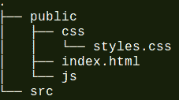
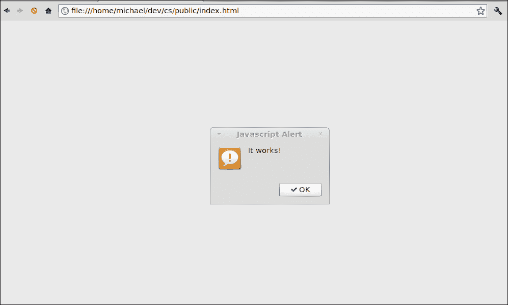
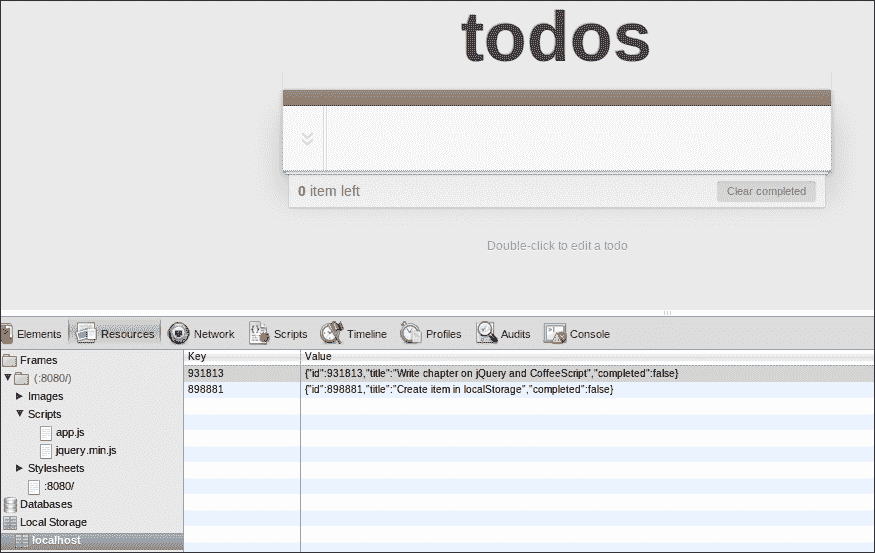

# 第三章。CoffeeScript 和 jQuery

**jQuery** 是一个跨浏览器兼容的库，旨在简化 HTML 应用程序开发者的生活。它最初由 John Resig 在 2006 年发布，并从此成为世界上最受欢迎的 JavaScript 库，被数百万个网站使用。

为什么它会变得如此流行？嗯，jQuery 有一些很好的特性，如简单的 DOM 操作和查询、事件处理和动画，以及 AJAX 支持。所有这些结合在一起，使得针对 DOM 的编程和在 JavaScript 中的编程变得更好。

该库在跨浏览器兼容性和速度方面也进行了高度优化，因此使用 jQuery 的 DOM 遍历和操作函数不仅可以让你免于编写繁琐的代码，而且通常比你自己编写的代码要快得多。

事实上，jQuery 和 CoffeeScript 一起使用得很好，并且当结合使用时，提供了一套强大的工具集，可以以简洁和表达性的方式编写网络应用程序。

在本章中，我们将做以下事情：

+   探索 jQuery 的一些高级功能，并讨论它为你提供了什么

+   学习如何在浏览器中使用 CoffeeScript 和 jQuery

+   使用 jQuery 和 CoffeeScript 构建一个简单的待办事项列表应用

让我们先详细讨论 jQuery 库，并了解它为什么如此有用。

# 查找和更改元素

在网络浏览器中，DOM（文档对象模型）是用于程序化交互的 HTML 文档中元素的表示。

在 JavaScript 中，你会发现你需要进行大量的 DOM 遍历来找到你感兴趣的元素，然后对其进行操作。

要仅使用标准的 JavaScript 库来完成这项任务，你通常需要结合使用 `document.getElementsByName`、`document.getElementById` 和 `document.getElementsById` 方法。一旦你的 HTML 结构开始变得复杂，这通常意味着你不得不将这些方法组合在一个尴尬且繁琐的迭代代码中。

以这种方式编写的代码通常对 HTML 的结构有很多假设，这意味着如果 HTML 发生变化，它通常会出问题。

## `$` 函数

使用 jQuery，许多这种命令式风格的代码通过 `$` 函数——jQuery 的工厂方法（一个创建 jQuery 类实例的方法）和进入库的主要入口点——变得更加简单。

这个函数通常需要一个 CSS 选择器字符串作为参数，它可以用来根据元素名称、ID、类属性或其他属性值选择一个或多个元素。此方法将返回一个包含一个或多个与选择器匹配的元素的 jQuery 对象。

在这里，我们将使用 `$` 函数选择具有 `address` 类的文档中的所有 `input` 标签：

```js
$('input .address')
```

您可以使用众多函数来操作或查询这些元素，这些函数通常被称为**命令**。以下是一些常见的 jQuery 命令及其用途：

+   `addClass`: 这给元素添加一个 CSS 类

+   `removeClass`: 这将从元素中移除一个 CSS 类

+   `attr`: 这从元素中获取一个属性

+   `hasClass`: 这检查元素上是否存在 CSS 类

+   `html`: 这获取或设置元素的 HTML 文本

+   `val`: 这获取或设置元素值

+   `show`: 这将显示一个元素

+   `hide`: 这将隐藏一个元素

+   `parent`: 这获取元素的父亲

+   `appendTo`: 这将子元素附加到父元素

+   `fadeIn`: 这使元素淡入

+   `fadeout`: 这使元素淡出

大多数命令都会返回一个 jQuery 对象，可以用来将其他命令链式附加到它上面。通过链式命令，您可以使用一个命令的输出作为下一个命令的输入。这种强大的技术让您可以对 HTML 文档的部分进行非常简短和简洁的转换。

假设我们想要突出显示并启用 HTML 表单中的所有`address`输入；jQuery 允许我们执行类似以下操作：

```js
$('input .address').addClass('highlighted').removeAttr('disabled')
```

在这里，我们再次选择所有具有`address`类的`input`标签。我们使用`addClass`命令给每个标签添加`highlighted`类，然后通过链式调用`removeAttr`命令来移除`disabled`属性。

# 工具函数

jQuery 还附带了一系列工具函数，这些函数通常可以改善您的日常 JavaScript 编程体验。这些函数都是以全局 jQuery 对象上的方法的形式存在的，例如：`$.methodName`。例如，最广泛使用的工具之一是`each`方法，它可以用来遍历数组或对象，如下所示（在 CoffeeScript 中）：

```js
$.each [1, 2, 3, 4], (index, value) -> alert(index + ' is ' + value)
```

jQuery 的工具方法包括数组集合辅助方法、时间字符串操作，以及许多其他有用的 JavaScript 和浏览器相关函数。许多这些函数都源于许多 JavaScript 程序员的日常需求。

通常，您会发现一个函数适用于您在编写 JavaScript 或 CoffeeScript 时遇到的一个常见问题或模式。您可以在[`api.jquery.com/category/utilities/`](http://api.jquery.com/category/utilities/)找到函数的详细列表。

# Ajax 方法

jQuery 提供了`$.ajax`方法来执行跨浏览器的 Ajax 请求。传统上，这一直是一个痛点，因为浏览器都实现了不同的接口来处理 Ajax。jQuery 负责所有这些，并提供了一种更简单、基于回调的方式来构建和执行 Ajax 请求。这意味着你可以声明性地指定 Ajax 调用应该如何进行，然后提供 jQuery 在请求成功或失败时调用的函数。

# 使用 jQuery

在浏览器中使用 jQuery 非常简单；你只需要在 HTML 文件中包含 jQuery 库。你可以从他们的网站上下载 jQuery 的最新版本（[`docs.jquery.com/Downloading_jQuery`](http://docs.jquery.com/Downloading_jQuery)）并引用它，或者你可以直接链接到库的 **内容分发网络**（**CDN**）版本。

下面是一个示例，说明你可能如何做到这一点。这个片段来自优秀的 HTML5 Boilerplate 项目（[`html5boilerplate.com/`](http://html5boilerplate.com/)）。这里我们包括来自 Google CDN 的最新压缩版 jQuery，但如果从 CDN 包含失败，我们也会包括本地版本。

```js
<script src="img/jquery.min.js"></script>
    <script>window.jQuery || document.write('<script src="img/jquery-1.7.2.min.js"><\/script>')
</script>
```

# 在浏览器中使用 CoffeeScript 和 jQuery

在我们开始用 jQuery 和 CoffeeScript 玩耍之前，让我们谈谈如何编写在浏览器中运行的 CoffeeScript 代码。

## 编译 CoffeeScript

编译 CoffeeScript 用于 Web 应用的最常见方法是运行 `coffee` 命令来监视一个或多个 CoffeeScript 文件的变化，然后将它们编译成 JavaScript。然后，输出将包含在你的 Web 应用程序中。

例如，我们将组织我们的项目文件夹结构，使其看起来类似于以下文件夹结构：



'

**src** 文件夹是放置你的 CoffeeScript 文件的地方。然后我们可以启动一个 CoffeeScript 编译器来监视该文件夹，并将 JavaScript 编译到我们的 **public/js** 文件夹。

这就是 CoffeeScript 命令的样子：

```js
coffee -co public/js -w src/
```

让这个命令在单独的终端窗口中后台运行，当你保存 CoffeeScript 文件时，它将重新编译你的 CoffeeScript 文件。

### 小贴士

**CoffeeScript 标签**

在浏览器中运行 CoffeeScript 的另一种方法是，在 `<script type="text/coffeescript">` 标签中包含 CoffeeScript 代码，然后在你的文档中包含压缩的 CoffeeScript 编译器脚本（`coffee-script.js`）。这将编译并运行页面中的所有内联 CoffeeScript 代码。

这并不是为了严肃使用，因为每次页面加载时，你将为编译步骤付出严重的性能代价。然而，有时只是快速在浏览器中玩一些 CoffeeScript 而不设置完整的编译链，这可以相当有用。

## jQuery 和 CoffeeScript

让我们在 CoffeeScript 文件中添加一些内容，看看我们是否能够成功将其与 jQuery 连接起来。在 `src` 文件夹中，创建一个名为 `app.coffee` 的文件，并包含以下代码：

```js
$ -> alert "It works!"
```

这设置了 jQuery 的 `$(document).ready()` 函数，当应用程序初始化时将被调用。这里我们使用它的简写语法，只需将匿名函数传递给 `$` 函数即可。

你现在应该在 `public/js` 文件夹中有一个 `app.js` 文件，其内容类似于以下内容：

```js
// Generated by CoffeeScript 1.3.3
(function() {
    alert('It works!');
}).call(this);
```

最后，我们还需要在我们的应用程序的 HTML 文件中包含此文件以及 jQuery。在 `public/index.html` 文件中，添加以下代码：

```js
<!doctype html>
<html lang="en">
<head>
  <meta charset="utf-8">
  <meta http-equiv="X-UA-Compatible" content="IE=edge,chrome=1">
  <title>jQuery and CoffeeScript Todo</title>
  <link rel="stylesheet" href="css/styles.css">
</head>
<body>
  <script src="img/jquery.min.js"></script>
  <script src="img/app.js"></script>
</body>
</html>
```

上述代码创建了我们 HTML 的骨架，并包含了 jQuery（使用 Google CDN）以及我们的应用程序代码。

### 小贴士

**下载示例代码**

你可以从你购买的所有 Packt 书籍的账户中下载示例代码文件，网址为 [`www.PacktPub.com`](http://www.PacktPub.com)。如果你在其他地方购买了这本书，你可以访问 [`www.PacktPub.com/`](http://www.PacktPub.com/) 支持并注册，以便将文件直接通过电子邮件发送给你。

## 测试所有内容

现在，我们应该能够通过在浏览器中打开我们的 `index.html` 文件来运行我们的应用程序。如果一切顺利，我们应该会看到如下截图所示的弹出窗口：



## 运行本地网络服务器

虽然我们现在可以从磁盘轻松测试我们的网络应用程序，但我们可能很快就会想要在本地网络服务器上托管它，特别是如果我们想要开始做 Ajax。由于我们已经安装了 Node.js，运行网络服务器应该非常简单，我们目前只需要提供静态内容。幸运的是，有一个 npm 包可以为我们做到这一点；它被称为 **http-server**，可以在 [`github.com/nodeapps/http-server`](https://github.com/nodeapps/http-server) 找到。

要安装它，只需运行以下命令：

```js
npm install http-server -g
```

然后，我们通过导航到我们的应用程序文件夹并输入以下内容来执行它：

```js
http-server
```

这将在端口 **8080** 上托管公共文件夹中的所有文件。现在，我们应该能够通过使用 URL `http://localhost:8080/` 导航到我们的托管站点。

# 我们的应用程序

在本章的剩余部分，我们将使用 CoffeeScript 构建一个 jQuery 应用程序。该应用程序是一个待办事项列表应用程序，可以用来跟踪你的日常任务以及你如何完成它们。

## TodoMVC

我已经将应用程序的大部分模型建立在一些 TodoMVC 项目的源代码上，这些源代码属于公共领域。该项目展示了不同的 JavaScript MVC 框架，它们都用于构建相同的应用程序，当评估框架时非常有用。如果你想查看它，可以在 [`addyosmani.github.com/todomvc/`](http://addyosmani.github.com/todomvc/) 找到。

### 注意

**MVC**（模型-视图-控制器）是一种广泛使用的应用程序架构模式，旨在通过将应用程序关注点拆分为三个领域对象类型来简化代码并减少耦合。我们将在本书的后面部分更多地讨论 MVC。

我们将主要基于 TodoMVC 项目构建我们的应用程序，以获取它附带的一些出色的样式表以及精心设计的 HTML5 结构。然而，大部分客户端 JavaScript 将用 CoffeeScript 重新编写，并且为了说明目的，它将被简化并修改很多。

因此，无需多言，让我们开始吧！

## 我们最初的 HTML

首先，我们将添加一些 HTML，这将允许我们输入待办事项并查看现有条目的列表。在 `index.html` 中，在包含的 `script` 标签之前，向 `body` 标签添加以下代码：

```js
<section id="todoapp">
    <header id="header">
      <h1>todos</h1>
      <input id="new-todo" placeholder="What needs to be done?" autofocus>
    </header>
    <section id="main">
      <ul id="todo-list"></ul>
    </section>
    <footer id="footer">
      <button id="clear-completed">Clear completed</button>
    </footer>
  </section> 
```

让我们简要地浏览一下前面标记的结构的结构。首先，我们有一个带有 `todoapp` ID 的部分，它将作为应用程序的主要部分。它由一个 `header` 标签组成，该标签将包含我们创建新条目的输入，一个 `main` 部分，其中将列出所有待办事项，以及一个 `footer` 部分，其中将包含 **清除已完成** 按钮。在我们打开浏览器中的此页面之前，让我们从我们的 `app.coffee` 文件中删除之前的警告行。

当你导航到这个页面时，它看起来不会太多。这是因为我们的 HTML 丝毫没有样式。下载本章的 `styles.css` 文件并将其复制到 `public/css` 文件夹。现在它应该看起来好多了。

## 初始化我们的应用程序

大多数 jQuery 应用程序，包括我们的，遵循类似的模式。我们创建一个 `$(document).ready` 处理程序，它反过来执行页面初始化，通常包括为用户操作设置事件处理程序。让我们在我们的 `app.coffee` 文件中这样做。

```js
class TodoApp
  constructor: ->
    @bindEvents()

  bindEvents: ->
    alert 'binding events'

$ ->
  app = new TodoApp()
```

在这里，在前面的代码片段中，我们创建了一个名为 `TodoApp` 的类，它将代表我们的应用程序。它有一个构造函数，该构造函数调用 `bindEvents` 方法，目前只是显示一个警告消息。

我们设置了 jQuery 的 `$(document).ready` 事件处理程序来创建我们的 `TodoApp` 实例。当你重新加载页面时，你应该看到 **绑定事件** 的弹出窗口。

### 小贴士

**没有看到预期的输出？**

记得关注在后台运行的咖啡编译器的输出。如果你有任何语法错误，编译器将输出错误消息。一旦你修复了它，编译器应该重新编译你的新 JavaScript 文件。记住，CoffeeScript 对空白字符敏感。如果你遇到任何你不理解的错误，请仔细检查你的缩进。

## 添加待办事项

现在我们可以添加事件处理程序，实际上将待办事项添加到列表中。在我们的 `bindEvents` 函数中，我们将选择 `new-todo` 输入并处理其 `keyup` 事件。我们将此绑定到调用我们的类上的 `create` 方法，我们也将定义它；这将在以下代码片段中显示：

```js
  bindEvents: ->
    $('#new-todo').on('keyup', @create)

  create: (e) ->
    $input = $(this)
    val = ($.trim $input.val())
    return unless e.which == 13 and val
    alert val
    # We create the todo item
```

`$('#new-todo')` 函数使用 jQuery CSS 选择器语法获取具有 `new-todo` ID 的输入，`on` 方法将 `create` 方法绑定到其 `'keyup'` 事件，该事件在输入具有焦点时按下任何键时触发。

在 `create` 函数中，我们可以通过使用 `$(this)` 函数来获取输入的引用，该函数将始终返回生成事件的元素。我们将此分配给 `$input` 变量。使用以 `$` 为前缀的变量名是在分配 jQuery 变量时的常见约定。然后我们可以使用 `val()` 函数获取输入的值并将其分配给一个本地的 `val` 变量。

我们可以通过检查`keyup`事件的`which`属性是否等于`13`来查看是否按下了*Enter*键。如果是这样，并且`val`变量不是`null`，我们就可以继续创建待办事项。目前，我们只是通过一个警告消息输出其值。

一旦我们创建了项目，我们应该将其放在哪里？在许多传统的 Web 应用中，这些数据通常会通过 Ajax 请求存储在服务器上。我们希望现在保持这个应用简单，所以暂时只将这些项目保留在客户端。HTML5 规范定义了一个名为**localStorage**的机制，正是为了实现这一点。

### 使用 localStorage

`localStorage`是新的 HTML5 规范的一部分，允许你在浏览器中的本地数据库中存储和检索对象。接口相当简单；在支持的浏览器中，将存在一个名为`localStorage`的全局变量。这个变量有以下三个重要的方法：

```js
localStorage.setItem(key, value)
localStorage.getItem(key)
localStorage.removeItem(key)
```

`key`和`value`参数都是字符串。存储在`localStorage`变量中的字符串即使在页面刷新后也会保留。在大多数浏览器中，你可以在`localStorage`变量中存储多达 5MB 的数据。

因为我们希望将待办事项存储为一个复杂对象而不是字符串，所以在设置和从`localStorage`获取项目时，我们使用将对象转换为 JSON 对象以及从 JSON 对象转换的常用技术。为此，我们将向`Storage`类的原型添加两个方法，这样它们就会在全局的`localStorage`对象上可用。将以下代码片段添加到我们的`app.coffee`文件顶部：

```js
Storage::setObj = (key, obj) ->
  @setItem key, JSON.stringify(obj)

Storage::getObj = (key) ->
  JSON.parse @getItem(key)
```

在这里，我们使用`::`运算符将`setObj`和`getObj`方法添加到`Storage`类。这些函数通过将对象转换为 JSON 以及从 JSON 转换来包装`localStorage`对象的`getItem`和`setItem`方法。

现在我们终于准备好创建待办事项并将其存储在`localStorage`中了。

下面是我们的`create`方法的其余部分：

```js
  create: (e)->
    $input = $(this)
    val = ($.trim $input.val())
    return unless e.which == 13 and val

 randomId = (Math.floor Math.random()*999999)

 localStorage.setObj randomId,{
 id: randomId
 title: val
 completed: false
 }
 $input.val ''

```

为了让我们能够唯一地识别任务，我们将使用最简单的方法，即生成一个大的随机数作为 ID。这不是识别文档最复杂的方法，你很可能不应该在生产环境中使用这种方法。然而，它实现起来相当简单，目前对我们的目的来说效果很好。

在生成 ID 之后，我们现在可以使用`setObj`方法将待办事项放入我们的本地数据库。我们传递一个从`input`标签值中获取的标题，并将项目默认设置为未完成。

最后，我们清除`$input`的值，以便用户能够看到`create`操作成功。

现在我们应该能够测试我们的小程序，看看待办事项是否被存储到`localStorage`中。Google Chrome 开发者工具允许你在**资源**选项卡中检查`localStorage`。添加几个任务后，你应该能够在这里看到它们，如下面的截图所示：



## 显示待办事项

现在我们能够存储待办事项列表，如果在屏幕上看到它们会很好。为此，我们将添加一个`displayItems`方法。这将遍历本地的待办事项列表并将它们显示出来。

将以下代码添加到我们的`TodoApp`中，在`create`方法之后：

```js
displayItems: ->
    alert 'displaying items'
```

现在我们应该能够从`create`方法中调用此方法，如下面的代码所示：

```js
  create: (e) ->
    $input = $(this)
    val = ($.trim $input.val())
    return unless e.which == 13 and val

    randomId = (Math.floor Math.random()*999999)

    localStorage.setObj randomId,{
      id: randomId
      title: val
      completed: false
    }
    $input.val ''
 @displayItems()

```

让我们运行这段代码看看会发生什么。当我们这样做时，我们得到以下错误：

**未捕获的类型错误：对象#<HTMLInputElement>没有方法'displayItems'**

这里发生了什么？看起来`@displayItems()`的调用试图在一个`HTMLInputElement`的实例上调用方法，而不是在`TodoApp`实例上。

这是因为 jQuery 会将`this`的值设置为引用触发事件的元素。当我们将类方法绑定到事件处理器时，jQuery 实际上会“劫持”`this`，使其不指向类本身。这是当你使用 jQuery 和 CoffeeScript 中的类时应该知道的一个重要注意事项。

为了修复它，我们可以在设置`keyup`事件处理器时使用 CoffeeScript 的胖箭头，这将确保`this`的值保持不变。让我们修改我们的`bindEvents`方法，使其看起来类似于以下代码：

```js
  bindEvents: ->
 $('#new-todo').on('keyup',(e) => @create(e))

```

但是还有一件事；在我们的`createItem`方法中，我们使用了`$(this)`来获取触发事件的`input`元素的价值。自从切换到胖箭头后，现在它将指向我们的`TodoApp`实例。幸运的是，传入的事件参数有一个目标属性，它也指向我们的输入。将`create`方法的第 1 行修改得类似于以下代码片段：

```js
  create: (e) ->
 $input = $(e.target)
    val = ($.trim $input.val())
```

现在我们创建一个项目时，我们应该看到“显示项目”的提示，这意味着`displayItems`方法已经正确连接。

我们可以做得更好。由于每次`create`方法被触发时都需要查找`$input`标签，我们可以将其存储在类变量中，以便可以重用。

最佳位置应该是在应用程序启动时。让我们创建一个`cacheElements`方法，它正好做这件事，并在构造函数中被调用——如下面的代码所示：

```js
class TodoApp

  constructor: ->
 @cacheElements()
    @bindEvents()

 cacheElements: ->
 @$input = $('#new-todo')

  bindEvents: ->
 @$input.on('keyup',(e) => @create(e))

  create: (e) ->
 val = ($.trim @$input.val())
    return unless e.which == 13 and val

    randomId = (Math.floor Math.random()*999999)

    localStorage.setObj randomId,{
      id: randomId
      title: val
        completed: false
    }
 @$input.val ''
 @displayItems()
```

`cacheElements`调用分配了一个名为`@$input`的类变量，然后在整个类中使用。这种`@$`语法一开始可能看起来很奇怪，但它确实在几键中传达了大量的信息。

## 显示待办事项

我们现在应该能够显示项目。在`displayItems`方法中，我们将遍历所有的`localStorage`键，并使用它们来获取每个相应的待办事项。对于每个项目，我们将在具有`todo-list` ID 的`ul`元素中添加一个`li`子元素。在我们开始使用`$('#todo-list')`元素之前，让我们像对`@$input`所做的那样缓存其值：

```js
  cacheElements: ->
    @$input = $('#new-todo')
 @$todoList = $('#todo-list')
  displayItems: ->
 @clearItems()
 @addItem(localStorage.getObj(id)) for id in Object.keys(localStorage)

 clearItems: ->
 @$todoList.empty()

 addItem: (item) ->
 html = """
 <li #{if item.completed then 'class="completed"' else ''} data-id="#{item.id}">
 <div class="view">
 <input class="toggle" type="checkbox" #{if item.completed then 'checked' else ''}>
 <label>#{item.title}</label>
 <button class="destroy"></button>
 </div>
 </li> 
 """
 @$todoList.append(html)

```

在这里，我们对 `displayItems` 方法进行了一些修改。首先，我们从 `$@todoList` 中删除任何现有的子列表项，然后我们遍历 `localStorage` 中的每个键，获取具有该键的对象，并将其发送到 `addItem` 方法。

`addItem` 方法构建一个待办事项的 HTML 字符串表示形式，然后使用 jQuery 的 `append` 函数将子元素附加到 `$@todoList` 上。同时，我们还创建了一个用于设置任务为完成的复选框和一个用于删除任务的按钮。

注意 `li` 元素上的 `data-id` 属性。这是一个 HTML5 数据属性，它允许你向任何元素添加任意数据属性。我们将使用它将每个 `li` 与 `localStorage` 对象中的待办事项相关联。

### 注意

虽然 CoffeeScript 可以使构建此类 HTML 字符串变得容易一些，但定义客户端代码中的标记可能会很快变得繁琐。我们在这里主要为了说明目的这样做；可能更好的做法是使用 JavaScript 模板库，例如 Handlebars ([`handlebarsjs.com/`](http://handlebarsjs.com/))。

这类库允许你在标记中定义模板，然后使用特定上下文编译它们，这会给你一个格式良好的 HTML，你可以将其附加到元素上。

最后一点，现在我们可以在创建后显示项目，让我们将 `displayItems` 调用添加到构造函数中，这样我们就可以显示现有的待办事项；下面的代码中突出显示了此调用：

```js
  constructor: ->
    @cacheElements()
    @bindEvents()
 @displayItems()

```

## 删除和完成项目

让我们连接删除任务按钮。我们为其添加了一个事件处理程序，如下所示：

```js
  bindEvents: ->
    @$input.on('keyup',(e) => @create(e))
 @$todoList.on('click', '.destroy', (e) => @destroy(e.target)) 

```

在这里，我们处理 `@$todoList` 上任何具有 `.destroy` 类的子元素的点击事件。

我们再次使用箭头函数创建处理程序，调用 `@destroy` 方法并传入目标，该目标应该是被点击的 **删除** 按钮。

我们现在需要创建 `@destroy` 方法，如下面的代码片段所示：

```js
  destroy: (elem) ->
    id = $(elem).closest('li').data('id')
    localStorage.removeItem(id)
    @displayItems()
```

`closest` 函数将找到定义在按钮本身最近的 `li` 元素。我们使用 jQuery 的 `data` 函数检索其 `data-id` 属性，然后我们可以使用它从 `localStorage` 中删除待办事项。还调用了一次 `@displayItems` 来刷新视图。

完成一项任务将遵循一个非常相似的模式；也就是说，我们添加一个事件处理程序，如下面的代码所示：

```js
  bindEvents: ->
    @$input.on('keyup',(e) => @create(e))
    @$todoList.on('click', '.destroy', (e) => @destroy(e.target))
 @$todoList.on('change', '.toggle', (e) => @toggle(e.target))

```

这次我们处理 `'change'` 事件，该事件将在完成的复选框被勾选或取消勾选时触发。这反过来会调用 `@toggle` 方法，其代码如下：

```js
  toggle: (elem) ->
    id = $(elem).closest('li').data('id')
    item = localStorage.getObj(id)
    item.completed = !item.completed
    localStorage.setObj(id, item)
```

此方法也使用 `closest` 函数获取待办事项的 ID。它从 `localStorage` 中加载对象，切换 `completed` 的值，然后使用 `setObj` 方法将其保存回 `localStorage`。

## 现在，轮到你了！

作为最后的练习，我会要求你使 **清除已完成** 按钮生效。

# 摘要

在本章中，我们学习了 jQuery 是什么，以及它的优势和好处。我们还学习了如何将 jQuery 的强大功能与 CoffeeScript 结合起来，以更少的努力和复杂性编写复杂的网络应用程序。jQuery 是一个非常庞大的库，我们只是刚刚触及了它所能提供的表面。我敦促你花更多的时间学习这个库本身，并且使用 CoffeeScript 来学习。

接下来，我们将首先看看如何使用 CoffeeScript 和 Rails 与服务器端代码进行交互。
