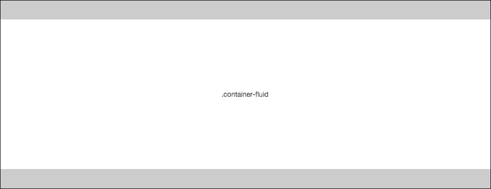
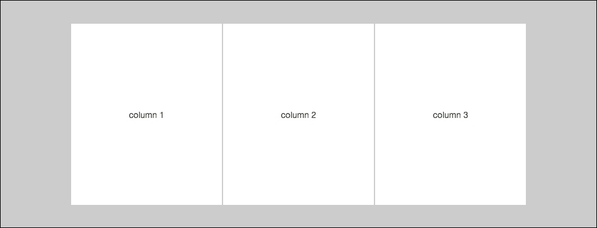
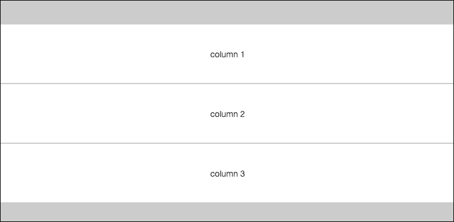
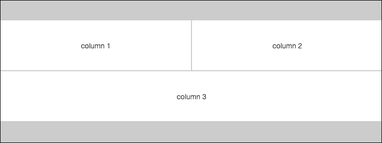
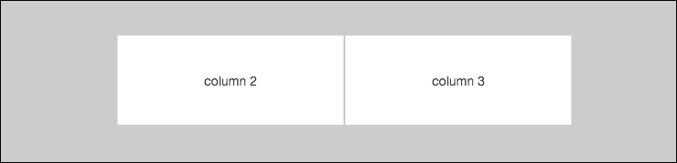
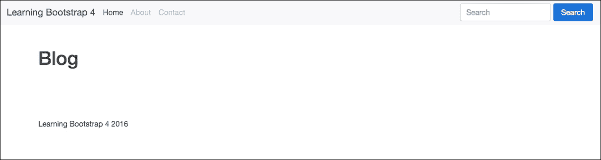
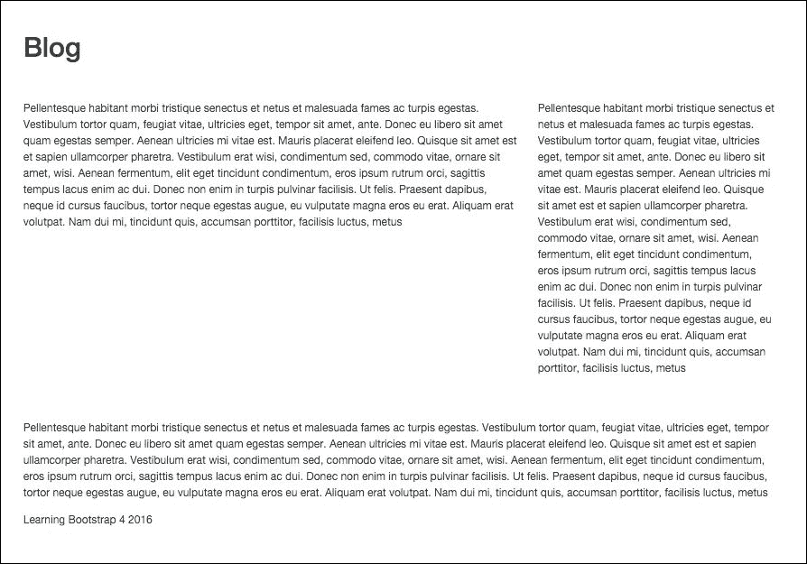
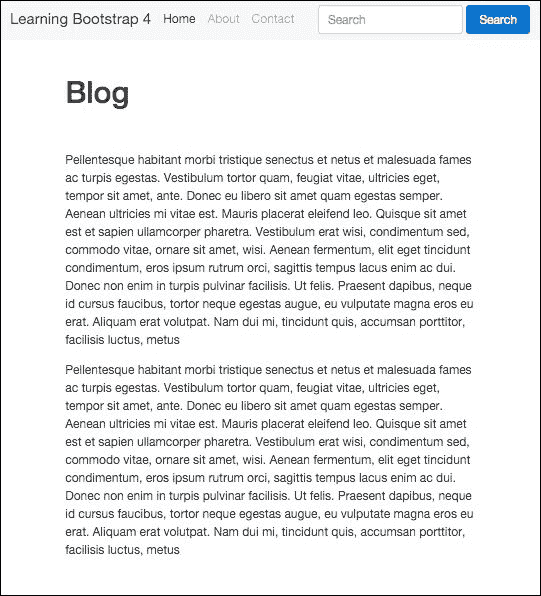
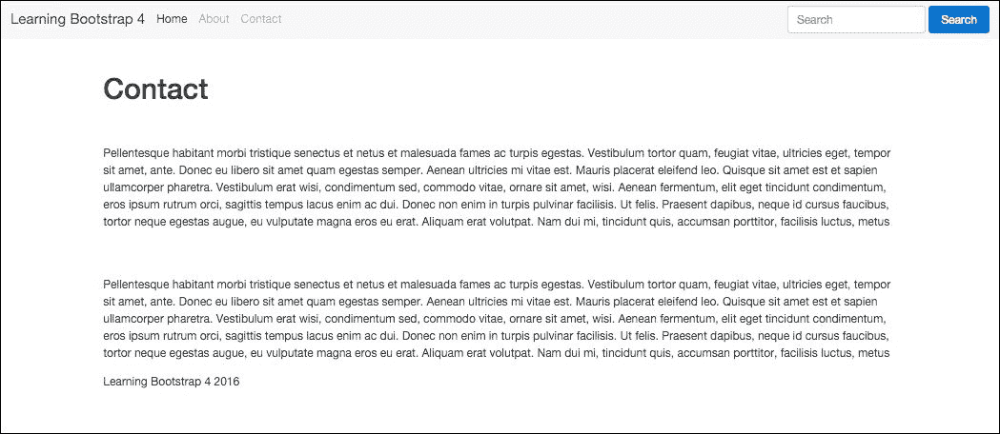
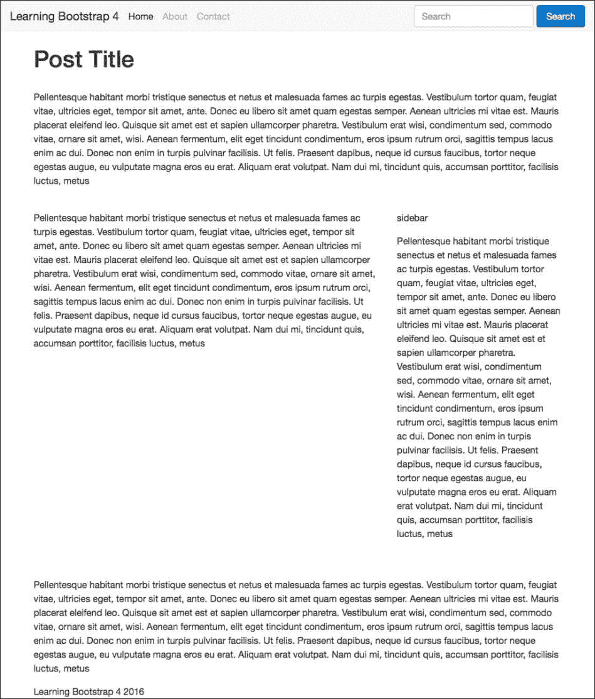

# 第三章。与布局一起工作

任何 Bootstrap 网站的核心是布局或网格组件。没有网格，网站几乎毫无用处。我们作为现代网页开发者面临的最大布局挑战之一是处理从桌面到平板电脑、移动电话，甚至苹果手表的大量屏幕分辨率。布局一个网站并不容易，我们依赖于响应式网页设计和媒体查询来采取以移动端优先的方法。Bootstrap 布局网格的最好特性之一是它以移动端优先，并使用媒体查询构建。这从构建网格的最困难部分中解脱出来，让我们能够专注于我们项目的实际设计。在我们开始布局我们博客项目的下一部分之前，让我们回顾一下 Bootstrap 4 中的布局网格基础知识。

在本章中，我们将简要讨论以下列出的主题：

+   与容器一起工作

+   向您的布局添加列

+   创建一个简单的三列布局

+   编写博客主页的代码

+   使用响应式实用类

# 与容器一起工作

任何 Bootstrap 布局的基础是一个容器类。您可以选择使用两种类型的容器。第一种是 `.container-fluid`，它是一个全宽度的盒子，并将布局扩展以适应浏览器窗口的整个宽度。

添加了一些左右填充，以便内容不会紧挨着浏览器边缘：



第二种选择是基本的 `.container` 类，它将根据您的设备视口的尺寸具有固定的宽度。Bootstrap 中有五种不同的大小，以下为宽度值：

+   非常小 <544px

+   小 >544px

+   中等 >768px

+   大 >992px

+   非常大 >1140px


让我们看看两种容器类型的标记。我将从基本的 `.container` 类开始：

```js
<div class="container"> 
  ... 
</div> 

```

这相当简单。现在让我们看看流体容器的代码：

```js
<div class="container-fluid"> 
  ... 
</div> 

```

再次，这很简单，这就是您需要了解的关于在 Bootstrap 4 中使用容器类的一切。 

## 创建没有容器的布局

现在，在某些情况下，您可能不想使用容器，这是完全可以接受的。这种情况的一个例子是，如果您想要全宽度的布局，但不想有默认的左右填充。您可能有一个想要拉伸到浏览器全宽且没有填充的图片横幅。在这种情况下，只需移除带有 `container` 类的 `<div>` 即可。

## 在单页上使用多个容器

在单个页面模板上使用多个容器是完全可行的。容器是 CSS 类，因此它们是可重用的。你可能想在较长的页面布局中这样做，比如一个着陆页设计，其中包含多个大型区域。另一个例子是使用容器来包裹你的页脚。如果你使用像 Harp 这样的模板系统，你将想要创建一个页脚部分。你可以通过给它自己的容器来使页脚组件更加自包含。这样你就不必担心在页脚中关闭在页面模板或甚至标题中打开的容器`<div>`。我建议使用多个容器来使你的设计更加模块化，并且更容易被多个用户管理。让我们快速看一下如何使用多个容器来构建一个基本页面：

```js
<div class="container"> 
   <!-- header code goes here, harp partial name would be _header.ejs //--> 
</div> 

<div class="container"> 
   <!-- template code goes here, harp file name would be index.ejs //--> 
</div> 

<div class="container"> 
   <!-- footer code goes here, harp partial name would be _footer.ejs //--> 
</div> 

```

我们有三个独立的文件，并为每个文件使用一个容器类，这使得每个部分更加模块化。你也不必担心在一个文件中打开`<div>`然后在另一个文件中关闭它。这是一种避免孤儿关闭`</div>`标签的好方法。

# 在布局中插入行

创建布局的下一步是插入至少一行的列。每个容器类可以包含一个或多个嵌套在其中的行。一行定义了一组水平列，这些列可以被分成十二份。在 Bootstrap 中，列的神奇数字是十二，你可以以任何你喜欢的方式细分它们。在我们讨论列之前，让我们回顾一下行的标记。首先让我们看看一个包含单行的容器的例子：

```js
<div class="container"> 
   <div class="row"> 
      <!-- insert column code here //--> 
   </div> 
</div> 

```

正如你所见，这是设置布局的简单下一步。就像我提到的，你可以在容器内拥有任意多的行。以下是如何编码一个五行布局的方法：

```js
<div class="container"> 
   <div class="row"> 
      <!-- insert column code here //--> 
   </div> 
   <div class="row"> 
      <!-- insert column code here //--> 
   </div> 
   <div class="row"> 
      <!-- insert column code here //--> 
   </div> 
   <div class="row"> 
      <!-- insert column code here //--> 
   </div> 
   <div class="row"> 
      <!-- insert column code here //--> 
   </div> 
</div> 

```

与容器类一样，行也是一个 CSS 类，因此它们可以在单个页面模板上重复使用任意多次。

### 注意

你永远不应该在行`<div>`中包含实际内容。所有内容都应该包含在列`<div>`中。

# 向布局中添加列

在我们实际添加列之前，让我们简要谈谈 Bootstrap 中你可以使用的不同列类。在 Bootstrap 3 中，有四种不同的列类宽度可供选择：超小、小、中和大。Bootstrap 4 引入了一个新的超大列类。这可能是为了允许使用超大显示器，比如你可以在 iMac 上找到的那种。让我们过一遍 Bootstrap 4 中每个列类的细微差别。

## 超小

最小的网格类使用命名模式`.col-xs-#`，其中`-#`等于从 1 到 12 的数字。记住，在 Bootstrap 中，你的行必须分成若干列，这些列的总数加起来必须是 12。这个例子包括`.col-xs-6`或`.col-xs-3`。超小列类用于针对最大宽度为 544 像素的移动设备。

## 小

小列类使用 `.col-sm-#` 的语法模式，一些例子包括 `.col-sm-4` 或 `.col-sm-6`。它针对分辨率大于 544 像素但小于 720 像素的设备。

## 中等

中等列类使用类似于 `.col-md-#` 的命名模式，一些例子包括 `.col-md-3` 或 `.col-md-12`。这个列类适用于大于 720 像素且小于 940 像素的设备。

## 大

大列类再次使用 `.col-lg-#` 的命名模式，一些例子包括 `.col-lg-6` 或 `.col-lg-2`。这个列类针对大于 940 像素但小于 1140 像素的设备。

## 超大

最终和新的列类是超大的，其语法为 `.col-xl-#`，例子包括 `.col-xl-1` 或 `.col-xl-10`。这个列类选项适用于所有大于或等于 1140 像素的分辨率。

# 选择列类

这是一个好问题。在所有类选项中，很难决定使用哪一个。如果你正在构建一个移动应用，那么你可能会想坚持使用超小或小列类。对于平板电脑，你可能想使用中等。如果你的应用的主要用户将在台式电脑上，那么使用大或超大类。但是，如果你正在构建一个响应式网站并且需要针对多个设备，那么情况会怎样？如果是这种情况，我通常建议使用中等或大列类。然后，如果你有一个组件需要针对特定分辨率进行额外关注，你可以根据需要调整使用更大或更小的类。

# 创建一个简单的三列布局

假设我们正在构建一个简单的响应式网站，并且我们需要为我们的模板创建一个三列布局。以下是你应该有的标记：

```js
<div class="container"> 
   <div class="row"> 
      <div class="col-md-4"> 
         <!-- column 1 //--> 
      </div> 
      <div class="col-md-4"> 
         <!-- column 2 //--> 
      </div> 
      <div class="col-md-4"> 
         <!-- column 3 //--> 
      </div> 
   </div> 
</div> 

```

如你所见，我在我的行 `<div>` 内插入了三个 `<div>`，每个都带有 `.col-md-4` 类。对于具有 768 像素或更高分辨率的设备，你会看到一个这样的三列布局：



现在，如果你在一个分辨率小于 768 像素的设备上查看这个相同的布局，每个列的宽度都会变为 100%，列会堆叠在一起。这种为较小屏幕的布局变化看起来是这样的：



那很好，但如果我们想为较小设备的列设置不同的布局而不是将它们都设置为 100% 宽度怎么办？可以通过混合列类来实现这一点。

# 为不同设备混合列类

给我们每个列 `<div>` 添加额外的类将允许我们针对不同设备的网格布局。让我们考虑我们之前的三列布局，但这次，我们想这样布局：

+   前两列应该是布局的 50%。

+   第三列应扩展到布局的 100%，并且位于前两列之下。

要实现这种布局，我们将混合一些不同的列类。以下是你的标记应该看起来像这样：

```js
<div class="container"> 
   <div class="row"> 
      <div class="col-md-4 col-xs-6"> 
         <!-- column 1 //--> 
      </div> 
      <div class="col-md-4 col-xs-6"> 
         <!-- column 2 //--> 
      </div> 
      <div class="col-md-4 col-xs-12"> 
         <!-- column 3 //--> 
      </div> 
   </div> 
</div> 

```

我给前两个列`<div>`添加了`.col-xs-6`类。现在，如果我们的设备分辨率小于 768 像素，前两个列将被设置为 50%的宽度。对于第三列，我使用了`.col-xs-12`类，这将使第三列换行并设置为布局宽度的 100%。在较小设备上的布局将看起来像这样：



这只适用于布局小于 768 像素的设备。如果你使用最新的代码查看这个网格，在更大的设备上，它仍然会显示为水平排列的三等分列。

## 如果我想偏移一列怎么办？

可能你的布局需要你将一些列偏移，并在内容开始之前留出一些水平空白空间。这可以很容易地使用 Bootstrap 的偏移网格类来实现。命名约定与常规列类类似，但我们需要添加偏移关键字，例如：`.col-lg-offset-#`。一些例子包括`.col-lg-offset-3`或`.col-md-offset-6`。让我们以前面的三列网格为例，但移除第一列。然而，我们希望第二列和第三列在布局中保持原位。这需要我们使用偏移网格类。以下是你的标记应该看起来像这样：

```js
<div class="container"> 
   <div class="row"> 
      <div class="col-md-4 col-md-offset-4"> 
         <!-- column 2 //--> 
      </div> 
      <div class="col-md-4"> 
         <!-- column 3 //--> 
      </div> 
   </div> 
</div> 

```

### 注意

注意我移除了第一个列`<div>`。我还给第二个列的`<div>`添加了类`.col-md-offset-4`。一旦你这样做，你的布局应该看起来像这样。

你看，你已经通过移除第一个列并将其他两个列滑动过来成功偏移了列：



这就结束了本章剩余部分你需要了解的 Bootstrap 网格基础。现在你对网格的工作原理有了很好的理解，让我们继续使用网格类来编写我们的博客主页布局代码。

# 编写博客主页代码

现在你已经很好地掌握了如何使用 Bootstrap 4 网格，我们将编写我们的博客主页代码。这个页面将包括帖子流、侧边栏和页面底部的时事通讯注册表单部分。让我们首先从我们在第 1 课“设置我们的第一个博客项目”中编写的代码开始，复制整个目录。将文件夹重命名为“第 3 课：处理布局或 Bootstrap 布局”。

### 注意

记住，我们接下来使用的是常规网格，而不是 Flexbox 网格。确保你使用的是`bootstrap.min.css`的默认构建版本。如果你简单地复制第二章的代码，那么你将拥有正确的文件配置。

# 编写 index.ejs 模板

好消息！由于我们在一开始就设置了 Harp 项目，现在我们可以重用其中的一些代码来构建我们的博客主页。我们不需要更新 JSON 文件和头部或尾部部分。唯一需要修改的文件是`index.ejs`。在文本编辑器中打开该文件，粘贴以下代码以开始：

```js
<div class="container"> 
  <!-- page title //--> 
  <div class="row m-t-3"> 
    <div class="col-md-12"> 
      <h1>Blog</h1> 
    </div> 
  </div> 
  <!-- page body //--> 
  <div class="row m-t-3"> 
    <div class="col-md-8"> 
      <!-- blog posts //--> 
    </div> 
    <div class="col-md-4"> 
      <!-- sidebar //--> 
    </div> 
  </div> 
  <!-- mailing list //--> 
  <div class="row m-t-3"> 
    <div class="col-md-12"> 
      <!-- form //--> 
    </div> 
  </div> 
</div> 

```

这里有几个不同的操作，让我一一为你解释：

+   我不想要全宽布局，所以我决定使用`.container`类来包裹我的模板布局。

+   我创建了三个不同的行，一个用于我们的页面标题，一个用于页面内容（博客源和侧边栏），还有一个用于邮件列表部分。

+   行`<div>`上有些类我们之前没见过，比如`m-t-3`。我将在下一节中解释这些类的作用。

+   由于我想让我的博客在所有尺寸的设备上都能阅读，我决定使用中等尺寸的列类。

+   页面标题列设置为`.col-md-12`，因此它将扩展到布局宽度的 100%。

+   我将第二行，即包含我们大部分页面内容的行，分为一个两列网格。第一列将占用布局宽度的 2/3，使用`col-md-8`类。第二列，我们的侧边栏，将占用布局宽度的 1/3，使用`col-md-4`类。

+   最后，第三行将包含邮件列表，它也使用了`col-md-12`类，并将扩展以填充布局的整个宽度。

我们博客主页的网格基本布局现在已经完成。然而，让我们回顾一下我添加到行`<div>`中的那些新 CSS 类。

# 使用间隔 CSS 类

Bootstrap 4 中新增的一个新实用工具是间隔类。它们很棒，因为它们提供了一个简单、模块化的方式来为你的布局添加额外的垂直间隔，而不必为每个区域编写自定义 CSS 类。间隔类可以应用于 CSS 的`margin`和`padding`属性。定义类的基模式如下：

```js
{property}-{sides}-{size} 

```

让我们更详细地分解一下这是如何工作的：

+   `property`等于`margin`或`padding`。

+   `sides`等于你想要添加边距或填充的盒子的边。这用单个字母表示：`t`代表顶部，`b`代表底部，`l`代表左边，`r`代表右边。

+   `size`等于你想要添加的边距或填充量。范围是 0 到 3。将大小值设置为 0 实际上会移除元素上现有的任何边距或填充。

为了更好地理解这个概念，让我们构建几个间隔类。假设我们想要给一个大小值为 1 的行添加一些顶部边距。我们的类将看起来像这样：

```js
.m-t-1 

```

应用到实际的行`<div>`上，类将看起来像这样：

```js
<div class="row m-t-1"> 

```

作为第二个例子，假设我们想要给一个值为 2 的`div`添加一些左边距。当与行`<div>`结合时，这个组合将看起来像这样：

```js
<div class="row p-l-2"> 

```

你开始看到在布局和组件周围添加间隔是多么简单了吗？

### 注意

空间类可以用于任何类型的元素，而不仅仅是 Bootstrap 网格。

现在你已经了解了这些类是如何工作的，让我们再次查看我们的博客主页模板。在这种情况下，我们的 `<div>` 看起来是这样的：

```js
<div class="row m-t-3"> 

```

在模板的三个部分，我决定使用这些类，并且它们都是顶部边距，大小值为三。保持这些一致性是个好主意，因为当你完成时，这将导致一个视觉上吸引人的布局。这也会使你在设置页面时进行数学计算变得稍微容易一些。现在我们已经审查了整个主页布局，我们需要对其进行测试。

# 测试博客主页布局

让我们在浏览器中测试一下，确保它看起来是我们想要的。在我们能够这样做之前，我们需要用 Harp 编译我们的代码。再次打开终端，导航到我们为这一章代码创建的项目目录。运行 `harp compile` 命令，这里再次列出，以防你忘记：

```js
$ harp compile

```

这应该没有错误地运行；然后，我们可以启动网络服务器来查看我们的页面。这是再次运行网络服务器的命令：

```js
$ harp server

```

服务器现在已经启动，打开网页浏览器，在 URL 栏中输入 `http://localhost:9000` 以显示博客主页。以下是你的页面应该看起来像这样：



哎呀，这看起来不太对。你可以看到页面标题，但我们看不到任何列。哦，是的！我们需要填写一些内容，以便显示列。让我们为了演示目的添加一些占位文本。在后面的章节中，我将介绍如何编写我们想要在这个页面上看到的实际组件。这一章只是关于设置我们的布局。

# 添加一些内容

回到你的文本编辑器中的 `index.ejs` 并添加一些占位文本。首先进入主内容区域的第一列，输入如下内容：

```js
<div class="col-md-8"> 
      <p>Pellentesque habitant morbi tristique senectus et netus et malesuada fames ac turpis egestas. Vestibulum tortor quam, feugiat vitae, ultricies eget, tempor sit amet, ante. Donec eu libero sit amet quam egestas semper. Aenean ultricies mi vitae est. Mauris placerat eleifend leo. Quisque sit amet est et sapien ullamcorper pharetra. Vestibulum erat wisi, condimentum sed, commodo vitae, ornare sit amet, wisi. Aenean fermentum, elit eget tincidunt condimentum, eros ipsum rutrum orci, sagittis tempus lacus enim ac dui. Donec non enim in turpis pulvinar facilisis. Ut felis. Praesent dapibus, neque id cursus faucibus, tortor neque egestas augue, eu vulputate magna eros eu erat. Aliquam erat volutpat. Nam dui mi, tincidunt quis, accumsan porttitor, facilisis luctus, metus</p> 
</div> 

```

如果你正在寻找一种快速获取 HTML 格式填充文本的方法，请访问 [`html-ipsum.com/`](http://html-ipsum.com/) 。

接下来，转到侧边栏列 `<div>` 并添加相同的段落文本，如下所示：

```js
<div class="col-md-4"> 
      <p>Pellentesque habitant morbi tristique senectus et netus et malesuada fames ac turpis egestas. Vestibulum tortor quam, feugiat vitae, ultricies eget, tempor sit amet, ante. Donec eu libero sit amet quam egestas semper. Aenean ultricies mi vitae est. Mauris placerat eleifend leo. Quisque sit amet est et sapien ullamcorper pharetra. Vestibulum erat wisi, condimentum sed, commodo vitae, ornare sit amet, wisi. Aenean fermentum, elit eget tincidunt condimentum, eros ipsum rutrum orci, sagittis tempus lacus enim ac dui. Donec non enim in turpis pulvinar facilisis. Ut felis. Praesent dapibus, neque id cursus faucibus, tortor neque egestas augue, eu vulputate magna eros eu erat. Aliquam erat volutpat. Nam dui mi, tincidunt quis, accumsan porttitor, facilisis luctus, metus</p> 
</div> 

```

最后，下拉到邮件列表 `<div>` 并再次添加相同的段落内容。它应该看起来像这样：

```js
<div class="col-md-12"> 
      <p>Pellentesque habitant morbi tristique senectus et netus et malesuada fames ac turpis egestas. Vestibulum tortor quam, feugiat vitae, ultricies eget, tempor sit amet, ante. Donec eu libero sit amet quam egestas semper. Aenean ultricies mi vitae est. Mauris placerat eleifend leo. Quisque sit amet est et sapien ullamcorper pharetra. Vestibulum erat wisi, condimentum sed, commodo vitae, ornare sit amet, wisi. Aenean fermentum, elit eget tincidunt condimentum, eros ipsum rutrum orci, sagittis tempus lacus enim ac dui. Donec non enim in turpis pulvinar facilisis. Ut felis. Praesent dapibus, neque id cursus faucibus, tortor neque egestas augue, eu vulputate magna eros eu erat. Aliquam erat volutpat. Nam dui mi, tincidunt quis, accumsan porttitor, facilisis luctus, metus</p> 
</div> 

```

现在我们已经向页面主体添加了一些实际内容，让我们重新编译项目并再次启动网络服务器：

### 注意

使用 Harp，你实际上不必在每次进行的小改动后都重新编译。你还可以在服务器运行时更改你的文件，并且它们将被浏览器拾取。定期编译是个好习惯，以防你在编译时遇到错误。这将使解决潜在问题更容易。

一旦服务器启动并运行，返回你的浏览器并刷新页面。现在你的布局应该看起来像这样：



哈哈！我们现在可以看到我们添加的列和占位文本。目前页面可能看起来不太吸引人，但重要的是要验证你的列布局是否正确。

# 关于移动设备呢？

我们需要考虑我们的布局在移动设备和较小屏幕分辨率下的表现。我使用了中等网格布局类，所以任何小于 720 像素的设备都将有一个调整后的布局。调整浏览器窗口的大小，使其更小以触发媒体查询，你会看到所有的列都将调整到容器宽度的 100%。看起来是这样的：



我打算保持我们的博客布局相当简约，所以我对此布局没有问题。在这个格式中，侧边栏将滑入主要博客帖子流下方。实际上，我对这个设计并不那么热衷，所以我将完全隐藏侧边栏，当你在较小设备上查看博客时。

# 使用响应式实用类

响应式实用类允许你根据屏幕分辨率大小有选择地隐藏`<div>`或组件。这对于创建以移动端优先的 Web 应用来说很棒，因为在很多情况下，你可能想要隐藏一些在手机或平板上表现不佳的组件。移动应用设计通常意味着更简单、更简约的体验，使用响应式实用类将允许你实现这一点。在文本编辑器中打开`index.ejs`，然后向下到侧边栏`<div>`，然后在你的代码中添加`.hidden-md-down`类：

```js
<div class="col-md-4 hidden-md-down"> 

```

添加这个类将在屏幕分辨率小于 720 像素时从浏览器中隐藏`<div>`。确保你的列类，在这种情况下是`-md`，与隐藏类匹配。现在，如果你再次缩小浏览器窗口，你会注意到侧边栏`<div>`将消失。

你可以在项目中使用许多响应式实用类。对于每个列类名都有一个`-down`版本。如果你希望在大分辨率下隐藏某些内容，你也可以使用`-up`版本。该类的示例包括`.hidden-lg-up`或`.hidden-xl-up`。要了解更多关于响应式实用类的信息，请查看 Bootstrap 文档中的页面[`v4-alpha.getbootstrap.com/layout/responsive-utilities/`](http://v4-alpha.getbootstrap.com/layout/responsive-utilities/)。

这就完成了我们博客主页的网格布局。在我们学习 Bootstrap 4 中的内容类之前，让我们设置其他我们将为博客构建的页面的布局网格。

## 编码额外的博客项目页面网格

在我们为联系和单篇博客页面创建新模板之前，我们需要更新一些 Harp 项目文件。让我们更新这些文件，然后我们将转向页面模板。

### 更新新页面用的 _data.json

记得在几章之前我们学习了如何编写`_data.json`文件，并为我们的每个模板创建了一个页面标题变量？我们需要通过为每个新页面提供`pageTitle`变量的值来更新此文件。在文本编辑器中打开`_data.json`；你可以在博客项目目录的根目录中找到该文件。一旦文件打开，插入以下代码。整个文件应如下所示：

```js
{ 
   "index": { 
      "pageTitle": "Home" 
   }, 
   "contact": { 
      "pageTitle": "Contact" 
   }, 
   "blog-post": { 
      "pageTitle": "Blog Post" 
   } 
} 

```

最初，我们只包括了`index`文件。我添加了两个条目，一个用于联系页面，一个用于博客帖子页面。我为每个页面的`pageTitle`变量输入了一个值。就这么简单。保存 JSON 文件，然后你可以关闭它。

### 创建新的页面模板

现在，`_data.json`已经更新，我们需要创建实际的页面模板 EJS 文件，就像我们处理`index`一样。在你的文本编辑器中创建两个新文件，并将它们保存为`contact.ejs`和`blog-post.ejs`。目前，只需将它们留空，我们将在下一步中填充它们。模板现在已设置好，准备好编写代码。目前，我们的两个新页面将使用与`index`文件相同的`_layout.ejs`文件，因此不需要创建更多布局。让我们开始编写联系页面模板。

## 编写联系页面模板

在你的文本编辑器中打开你刚刚创建的`contact.ejs`文件。让我们通过设置页面标题来开始模板。将以下代码输入到文件中：

```js
<div class="container"> 
  <!-- page title //--> 
  <div class="row m-t-3"> 
    <div class="col-lg-12"> 
      <h1>Contact</h1> 
    </div> 
  </div> 
</div> 

```

让我们分解一下这里代码中发生的事情：

+   我使用一个带有`.container`类的`<div>`打开了文件。

+   接下来，我添加了`.row <div>`，并添加了相同的`m-t-3`间距类，以匹配博客主页。

+   我添加了一个具有`.col-md-12`类的`<div>`列。由于这是我们页面标题，我们希望它扩展到布局的宽度。

+   最后，我添加了一个带有我们联系页面标题的`<h1>`标签。

### 添加联系页面主体

接下来，让我们插入联系页面主体的网格布局。在页面标题代码之后，插入以下网格代码：

```js
<!-- page body //--> 
  <div class="row m-t-3"> 
    <div class="col-md-12"> 
      <p>Pellentesque habitant morbi tristique senectus et netus et malesuada fames ac turpis egestas. Vestibulum tortor quam, feugiat vitae, ultricies eget, tempor sit amet, ante. Donec eu libero sit amet quam egestas semper. Aenean ultricies mi vitae est. Mauris placerat eleifend leo. Quisque sit amet est et sapien ullamcorper pharetra. Vestibulum erat wisi, condimentum sed, commodo vitae, ornare sit amet, wisi. Aenean fermentum, elit eget tincidunt condimentum, eros ipsum rutrum orci, sagittis tempus lacus enim ac dui. Donec non enim in turpis pulvinar facilisis. Ut felis. Praesent dapibus, neque id cursus faucibus, tortor neque egestas augue, eu vulputate magna eros eu erat. Aliquam erat volutpat. Nam dui mi, tincidunt quis, accumsan porttitor, facilisis luctus, metus</p> 
    </div> 
  </div> 

```

让我们回顾一下页面主体的代码：

+   我为页面主体打开了一个新的`<div>`行。它也有相同的`m-t-3`间距类，以保持一致的垂直间距。

+   我再次使用了`col-md-12`列类，因为联系页面布局将填充我们容器的整个宽度。

+   我现在添加了一些填充文本，以便我们可以验证页面布局是否正确。

在我们完成之前，让我们为我们的邮件列表部分添加一行。我希望这个部分在博客的每一页都可用。这个部分的网格代码将与我们在页面主体中使用的标记相同。以下是参考示例：

```js
<!-- mailing list //--> 
<div class="row m-t-3"> 
  <div class="col-md-12"> 
   <p>Pellentesque habitant morbi tristique senectus et netus et malesuada fames ac turpis egestas. Vestibulum tortor quam, feugiat vitae, ultricies eget, tempor sit amet, ante. Donec eu libero sit amet quam egestas semper. Aenean ultricies mi vitae est. Mauris placerat eleifend leo. Quisque sit amet est et sapien ullamcorper pharetra. Vestibulum erat wisi, condimentum sed, commodo vitae, ornare sit amet, wisi. Aenean fermentum, elit eget tincidunt condimentum, eros ipsum rutrum orci, sagittis tempus lacus enim ac dui. Donec non enim in turpis pulvinar facilisis. Ut felis. Praesent dapibus, neque id cursus faucibus, tortor neque egestas augue, eu vulputate magna eros eu erat. Aliquam erat volutpat. Nam dui mi, tincidunt quis, accumsan porttitor, facilisis luctus, metus</p> 
  </div> 
</div> 

```

由于此代码与页面主体相同，我不会再次分解它。我们的联系页面布局现在已完成。请确保保存文件，然后在我们移动到博客帖子页面之前测试它。

再次打开您的终端并导航到博客项目的根目录。一旦到达那里，运行`harp compile`命令，然后运行 Harp 服务器命令以启动本地 Web 服务器。打开您的网络浏览器并输入以下 URL 以预览页面：`http://localhost:9000/contact.html`。

您的联系页面应该加载并显示页面标题和两行填充文本。它应该看起来像这样：



我们的联系页面网格现在已完成。在我们开始创建博客文章模板之前，让我们看一下联系模板的所有代码：

```js
<div class="container"> 
  <!-- page title //--> 
  <div class="row m-t-3"> 
    <div class="col-md-12"> 
      <h1>Contact</h1> 
    </div> 
  </div> 
  <!-- page body //--> 
  <div class="row m-t-3"> 
    <div class="col-md-12"> 
      <p>Pellentesque habitant morbi tristique senectus et netus et malesuada fames ac turpis egestas. Vestibulum tortor quam, feugiat vitae, ultricies eget, tempor sit amet, ante. Donec eu libero sit amet quam egestas semper. Aenean ultricies mi vitae est. Mauris placerat eleifend leo. Quisque sit amet est et sapien ullamcorper pharetra. Vestibulum erat wisi, condimentum sed, commodo vitae, ornare sit amet, wisi. Aenean fermentum, elit eget tincidunt condimentum, eros ipsum rutrum orci, sagittis tempus lacus enim ac dui. Donec non enim in turpis pulvinar facilisis. Ut felis. Praesent dapibus, neque id cursus faucibus, tortor neque egestas augue, eu vulputate magna eros eu erat. Aliquam erat volutpat. Nam dui mi, tincidunt quis, accumsan porttitor, facilisis luctus, metus</p> 
    </div> 
  </div> 
  <!-- mailing list //--> 
  <div class="row m-t-3"> 
    <div class="col-md-12"> 
      <p>Pellentesque habitant morbi tristique senectus et netus et malesuada fames ac turpis egestas. Vestibulum tortor quam, feugiat vitae, ultricies eget, tempor sit amet, ante. Donec eu libero sit amet quam egestas semper. Aenean ultricies mi vitae est. Mauris placerat eleifend leo. Quisque sit amet est et sapien ullamcorper pharetra. Vestibulum erat wisi, condimentum sed, commodo vitae, ornare sit amet, wisi. Aenean fermentum, elit eget tincidunt condimentum, eros ipsum rutrum orci, sagittis tempus lacus enim ac dui. Donec non enim in turpis pulvinar facilisis. Ut felis. Praesent dapibus, neque id cursus faucibus, tortor neque egestas augue, eu vulputate magna eros eu erat. Aliquam erat volutpat. Nam dui mi, tincidunt quis, accumsan porttitor, facilisis luctus, metus</p> 
    </div> 
  </div> 
</div> 

```

## 编码博客文章模板

返回您的文本编辑器并打开之前创建的`blog-post.ejs`文件。像我们的联系页面模板一样，让我们首先设置页面标题部分的代码。将以下代码输入到博客文章模板文件中：

```js
<div class="container"> 
  <!-- page title //--> 
  <div class="row m-t-2 m-b-2"> 
    <div class="col-lg-12"> 
      <h1>Post Title</h1> 
    </div> 
  </div> 
</div> 

```

如您所见，此代码几乎与联系页面相同。有两个小的差异我将为您指出：

+   我已经更改了行`<div>`上的间隔类。在未来的章节中，我们将在页面标题周围添加一些不同的组件，所以我已经调整了垂直间隔以允许它们。我使用相同的顶部边距间隔，但将其设置为 2。我添加了一个带有`.m-b-2`类的第二个底部边距间隔，值为 2。将`-t`切换到`-b`将应用底部边距而不是顶部边距。

+   我已经将`<h1>`标签中的页面标题更改为`Post Title`。

### 添加博客文章功能

我们的博客文章正文将与博客主页模板有一些不同的元素。在页面标题之后，我将插入一个功能区域，该区域将用于未来章节中的图像或轮播。现在，让我们只是将网格列和一些用于测试的填充文本放入其中。在页面标题部分之后输入以下代码：

```js
<!-- feature //--> 
<div class="row"> 
  <div class="col-md-12"> 
    <p>Pellentesque habitant morbi tristique senectus et netus et malesuada fames ac turpis egestas. Vestibulum tortor quam, feugiat vitae, ultricies eget, tempor sit amet, ante. Donec eu libero sit amet quam egestas semper. Aenean ultricies mi vitae est. Mauris placerat eleifend leo. Quisque sit amet est et sapien ullamcorper pharetra. Vestibulum erat wisi, condimentum sed, commodo vitae, ornare sit amet, wisi. Aenean fermentum, elit eget tincidunt condimentum, eros ipsum rutrum orci, sagittis tempus lacus enim ac dui. Donec non enim in turpis pulvinar facilisis. Ut felis. Praesent dapibus, neque id cursus faucibus, tortor neque egestas augue, eu vulputate magna eros eu erat. Aliquam erat volutpat. Nam dui mi, tincidunt quis, accumsan porttitor, facilisis luctus, metus</p> 
  </div> 
</div> 

```

这是一个非常简单的部分。注意`row <div>`上没有间隔类，因为我们已经在页面标题部分添加了底部边距。我插入了一个全宽`col-md-12`列类，这样功能就可以扩展到布局的宽度。

### 添加博客文章正文

现在我们已经添加了博客文章功能部分，让我们添加模板的实际正文部分。这个部分将使用与我们的博客主页相同的布局。它将是一个两列布局，第一列宽度为 2/3，侧边栏为布局的 1/3。在功能部分之后插入以下代码：

```js
<!-- page body //--> 
<div class="row m-t-2"> 
  <div class="col-md-8"> 
     <p>Pellentesque habitant morbi tristique senectus et netus et malesuada fames ac turpis egestas. Vestibulum tortor quam, feugiat vitae, ultricies eget, tempor sit amet, ante. Donec eu libero sit amet quam egestas semper. Aenean ultricies mi vitae est. Mauris placerat eleifend leo. Quisque sit amet est et sapien ullamcorper pharetra. Vestibulum erat wisi, condimentum sed, commodo vitae, ornare sit amet, wisi. Aenean fermentum, elit eget tincidunt condimentum, eros ipsum rutrum orci, sagittis tempus lacus enim ac dui. Donec non enim in turpis pulvinar facilisis. Ut felis. Praesent dapibus, neque id cursus faucibus, tortor neque egestas augue, eu vulputate magna eros eu erat. Aliquam erat volutpat. Nam dui mi, tincidunt quis, accumsan porttitor, facilisis luctus, metus</p> 
   </div> 
   <!-- sidebar //--> 
   <div class="col-md-4 hidden-md-down"> 
    <p>sidebar</p> 
    <p>Pellentesque habitant morbi tristique senectus et netus et malesuada fames ac turpis egestas. Vestibulum tortor quam, feugiat vitae, ultricies eget, tempor sit amet, ante. Donec eu libero sit amet quam egestas semper. Aenean ultricies mi vitae est. Mauris placerat eleifend leo. Quisque sit amet est et sapien ullamcorper pharetra. Vestibulum erat wisi, condimentum sed, commodo vitae, ornare sit amet, wisi. Aenean fermentum, elit eget tincidunt condimentum, eros ipsum rutrum orci, sagittis tempus lacus enim ac dui. Donec non enim in turpis pulvinar facilisis. Ut felis. Praesent dapibus, neque id cursus faucibus, tortor neque egestas augue, eu vulputate magna eros eu erat. Aliquam erat volutpat. Nam dui mi, tincidunt quis, accumsan porttitor, facilisis luctus, metus</p> 
  </div> 
</div> 

```

让我们分析一下这里代码中发生的事情：

+   行`<div>`添加了`m-t-2`间隔类，以提供一些垂直间隔

+   我使用相同的`col-md-8`和`col-md-4`列类来设置布局

+   我还在侧边栏`<div>`上使用了`hidden-md-4`类，这样这个部分在较小分辨率的设备上就不会可见

+   最后，我添加了一些用于测试的临时填充文本

## 将邮件列表部分转换为部分

```js
From your text editor, create a new file called _mailing-list.ejs and save it to the partial directory in the root of your blog project. Once the file is saved, insert the following code into it:
```

```js
<div class="row m-t-3"> 
  <div class="col-md-12"> 
    <p>Pellentesque habitant morbi tristique senectus et netus et malesuada fames ac turpis egestas. Vestibulum tortor quam, feugiat vitae, ultricies eget, tempor sit amet, ante. Donec eu libero sit amet quam egestas semper. Aenean ultricies mi vitae est. Mauris placerat eleifend leo. Quisque sit amet est et sapien ullamcorper pharetra. Vestibulum erat wisi, condimentum sed, commodo vitae, ornare sit amet, wisi. Aenean fermentum, elit eget tincidunt condimentum, eros ipsum rutrum orci, sagittis tempus lacus enim ac dui. Donec non enim in turpis pulvinar facilisis. Ut felis. Praesent dapibus, neque id cursus faucibus, tortor neque egestas augue, eu vulputate magna eros eu erat. Aliquam erat volutpat. Nam dui mi, tincidunt quis, accumsan porttitor, facilisis luctus, metus</p> 
  </div> 
</div> 

```

现在回到博客帖子模板文件，在邮件列表部分应该出现的地方插入以下代码行：

```js
<%- partial("partial/_mailing-list") %> 

```

记得对索引和联系模板做同样的事情。删除硬编码的邮件列表，并用前面的部分行替换它。

这标志着博客帖子模板设置的完成。在我们进入下一章之前，让我们先测试一下，以确保新的邮件列表部分正常工作。返回终端，从根目录编译您的项目。运行 Harp 服务器命令，然后访问以下 URL：`http://localhost:9000/blog-post.html`。

如果一切按计划进行，您的博客帖子页面应该看起来像这样：



确保您不要忘记在浏览器中测试索引和联系页面模板，以确保邮件列表部分正常工作。这标志着博客帖子模板的设计布局完成。现在，我们的所有模板都已准备就绪，但在我们进入下一章关于内容组件之前，让我们回顾一下我们已经学到的内容。

# 摘要

本章详细解释了 Bootstrap 布局网格，如何使用它，以及如何构建一个示例项目。我们首先学习了 Bootstrap 容器、container-fluid 和行类的基础知识。接下来，我们学习了所有 Bootstrap 列类的区别。在列之后，我们涵盖了更多高级主题，如列偏移、间距和响应式实用工具。一旦你对网格有了坚实的理解，我们就编写了剩余的页面布局，这些布局我们将用于本书的其余部分。现在，我们已经一切就绪，我们将开始使用 Bootstrap 内容类将实际内容添加到博客中。

# 评估

1.  您可以使用哪两种容器类型为 Bootstrap 布局？

    1.  `.container-fluid`

    1.  `.container`

    1.  i 和 ii 都有

    1.  以上都不是

1.  在单个页面模板上使用多个容器是完全可行的。

    1.  正确

    1.  错误

1.  `.col-xl-1` 或 `.col-xl-10`：这个列类选项适用于所有大于或等于 ___________ 像素的分辨率。

    1.  940

    1.  1140

    1.  720

    1.  544

1.  Bootstrap 4 中 `spacing` 类的优势是什么？

    1.  为行和列添加空格

    1.  它们提供了一个简单、模块化的方式来为布局添加额外的垂直间距，而无需为每个区域编写自定义 CSS 类

    1.  可以应用于 CSS 的 `margin` 和 `padding` 属性

    1.  ii 和 iii 都有

1.  以下哪项是实用类的作用？

    1.  使用中等网格布局类，因此小于 *720 像素* 的任何设备都将有调整后的布局

    1.  多个容器使您的设计更模块化，更容易由多个用户管理

    1.  将盒子垂直排列，以便它们按升序堆叠在一起

    1.  实用类将允许您根据屏幕分辨率大小有选择地隐藏 `<div>` 标签或组件
