## 预格式化文本

这种排版样式用于在网站上使用 `<pre>` 标签显示代码块。像之前的组件一样，它的 `top-margin` 已被移除，并且有一个 `bottom margin` 为 `1rem`。

## 表格

表格组件已稍作调整，以确保所有单元格中的文本对齐一致。`<caption>` 标签的样式也进行了轻微调整，以提高可读性。

## 表单

Bootstrap 4 中的表单组件要简单得多。大多数默认样式已被移除，以便组件更容易使用和自定义。以下是您应该注意的一些亮点：

+   `<fieldset>` 标签上的大多数样式都已移除。边框、填充和边距不再存在。

+   `<legend>` 标签已被简化，现在看起来更加简约。

+   `<label>` 标签现在设置为 `display: inline-block` 以允许添加边距。

+   从以下标签中移除了默认边距：`<input>`、`<select>`、`<textarea>` 和 `<button>`。

+   `<textarea>` 现在只能垂直调整大小。它们不能水平调整大小，这通常会破坏页面布局。

这就涵盖了您需要了解的 Reboot 的关键元素。如果您想了解更多，请查看[`v4-alpha.getbootstrap.com/content/reboot/`](http://v4-alpha.getbootstrap.com/content/reboot/) 上的文档。

现在我们已经回顾了 Reboot CSS 重置，是时候真正开始介绍内容组件并将它们添加到我们的博客项目中。

### 注意

Bootstrap 4 中的内容类与版本 3 并没有太大不同。如果您精通 Bootstrap 3，您可能想在这个时候跳到下一章。

# 学习使用排版

在 Bootstrap 4 中，核心排版 HTML 标签没有发生重大变化。标题标签及其支持的 CSS 类仍然像以前一样工作。然而，有一些新的实用类可以与某些类型标签一起使用，以提供更多变体，例如标题和标题。在本书的后面部分，我们将使用许多类型标签和样式在我们的博客项目中。一些快速示例包括用于页面和帖子标题的标题标签，以及用于多个不同组件的列表。让我们首先回顾 Bootstrap 4 中的新显示标题类。

## 使用显示标题

正规的标题标签在页面流中表现良好，对于设置文章的层次结构至关重要。对于着陆页或其他显示类型模板，您可能需要额外的标题样式。这就是您可以使用新的显示标题类来创建稍微大一点的标题并应用一些不同样式的时刻。您可以使用四种不同的显示标题级别，它们的标记如下：

```js
<h1 class="display-1">Display 1</h1> 
<h1 class="display-2">Display 2</h1> 
<h1 class="display-3">Display 3</h1> 
<h1 class="display-4">Display 4</h1> 

```

请记住，你可以将这些类应用到任何你喜欢的标题标签上。`display-1` 将是最大的，随着你增加大小，标题会缩小。例如，`display-4` 将是选项中最小的。以下是浏览器中渲染的标题外观：

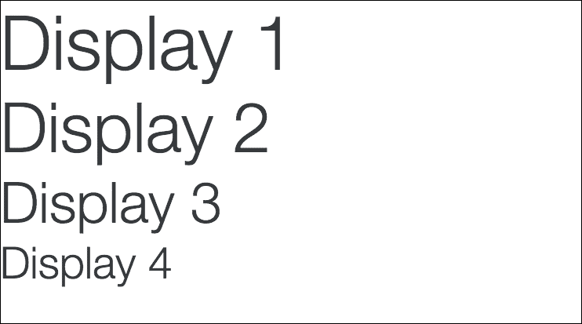

请记住，你可以将这些类应用到任何你喜欢的标题标签上。`display-1` 将是最大的，随着你增加大小，标题会缩小。例如，`display-4` 将是选项中最小的。

# 自定义标题

你可能想要给你的标题添加一些额外的上下文，你可以很容易地使用一些包含的 Bootstrap 4 实用类来实现这一点。通过使用上下文文本类，你可以将描述添加到标题，如下所示：

```js
<h3> 
  This is the main title 
  <small class="text-muted">this is a description</small> 
</h3> 

```

如你所见，我在我的标题标签内嵌套了一个 `<small>` 标签，并添加了一个 `text-muted` 类。这将使文本的描述部分看起来略有不同，从而创建一个很好的视觉效果：

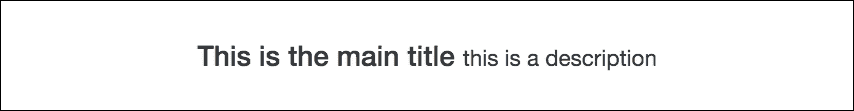

## 使用 lead 类

Bootstrap 4 中新增的一个实用文本类是 `lead` 类。当你想要使一段文本突出显示时，可以使用这个类。它将字体大小增加 25%，并将文本的字体粗细设置为轻或 300。添加它非常简单，如下面的代码所示：

```js
<p class="lead"> 
here's some text with the .lead class to make this paragraph look a bit different and standout. 
</p> 

```

上述代码的输出将看起来像这样：

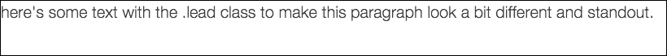

如你所见，这给文本带来了一种独特的样式。这可以用作博客文章的第一段或可能在着陆页顶部突出显示文本。

## 使用列表

Bootstrap 4 默认提供了一系列列表选项。这些 CSS 类可以应用于 `<ul>`、`<ol>` 或 `<dl>` 标签以生成一些样式。让我们从无样式列表开始。

### 编写无样式的列表

在某些情况下，你可能想要移除有序或无序列表默认的子弹或数字。当创建导航或可能只是想要创建一个不带项目符号的项目列表时，这可能很有用。你可以通过在包装列表标签上使用 `list-unstyled` 类来实现这一点。以下是一个基本的无样式无序列表的示例：

```js
<ul class="list-unstyled"> 
  <li>item</li> 
  <li>item</li> 
  <li>item</li> 
  <li>item</li> 
  <li>item</li> 
</ul> 

```

这将生成一个没有项目符号的列表，看起来如下所示：

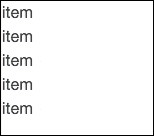

如果我们想要创建多级缩进列表，我们还可以在内部嵌套额外的列表。然而，请注意，`list-unstyled` 类只适用于列表的第一级。任何嵌套的额外列表都将有它们的项目符号或数字。这种变化的代码可能看起来像这样：

```js
<ul class="list-unstyled"> 
  <li>item 
    <ul> 
      <li>child item</li> 
      <li>child item</li> 
      <li>child item</li> 
      <li>child item</li> 
     </ul> 
  </li> 
  <li>item</li> 
  <li>item</li> 
  <li>item</li> 
  <li>item</li> 
</ul>  

```

上述变化将看起来如下所示：

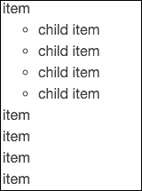

现在，如果我们在一个浏览器中查看这个代码示例，你会注意到你将看到嵌套在父列表中的子列表的项目符号。

### 创建内联列表

无样式列表可能是你用得最多的一个。下一个最有用的类是 `list-inline`，它将每个 `<li>` 排成一行。这对于在网站或应用程序中创建导航或子导航非常有用。这个列表的代码几乎与上一个相同，但我们将其类名更改为 `list-inline`。我们还需要为每个 `<li>` 标签添加一个 `list-inline-item` 类。这是 Bootstrap 4 的一个新变化，所以请确保在以下代码中不要错过它：

```js
<ul class="list-inline"> 
  <li class="list-inline-item">item</li> 
  <li class="list-inline-item">item</li> 
  <li class="list-inline-item">item</li> 
  <li class="list-inline-item">item</li> 
  <li class="list-inline-item">item</li> 
</ul> 

```

如我所述，代码与无样式列表类似，但有一些变化。以下是它在浏览器中渲染后的样子：

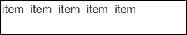

我认为你可以看到这将为你的项目设置水平导航提供一种轻量级的方式。让我们继续到最后一种列表类型，即描述列表。

### 使用描述列表

描述列表允许你为术语和描述创建水平显示。让我们看看一个基本列表的代码，然后对其进行分解：

```js
<dl class="dl-horizontal"> 
  <dt class="col-sm-3">term 1</dt> 
  <dd class="col-sm-9">this is a description</dd> 

  <dt class="col-sm-3">term 2</dt> 
  <dd class="col-sm-9">this is a different description</dd> 

  <dt class="col-sm-3 text-truncate">this is a really long term name</dt> 
  <dd class="col-sm-9">this is one last description</dd> 
</dl> 

```

这里有一些你需要注意的事情，让我为你一一解释：

+   首先，你使用 `<dl>` 标签开始一个描述列表。它需要一个 `dl-horizontal` 类来触发列表组件样式。

+   每一行由一个 `<dt>` 和 `<dd>` 标签组成。`<dt>` 代表术语，而 `<dd>` 代表描述。每个标签都应该有一个列类，并且是灵活的，具体取决于你如何布局你的列表。

+   在第三行，你会注意到一个名为 `text-truncate` 的类。这个类将截断非常长的术语或文本，以免它们超出列的宽度。这对于长文本块来说是一个很好的技术。

现在我已经解释了描述列表的所有代码，让我们看看这个示例在浏览器中的样子：

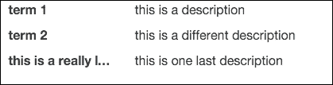

这就完成了你在 Bootstrap 4 中需要了解的所有排版样式。接下来，让我教你如何在 Bootstrap 中使用图像。

### 如何设置图像样式

Bootstrap 允许你通过使用 CSS 类来对图像进行一些有用的操作。这些操作包括：使图像响应式，将图像转换为形状，以及对齐图像。在下一节中，我将向你展示如何将这些技术应用到你的图像上。

# 使图像响应式

Bootstrap 4 带来一个新的响应式图像类，当开发网站或基于 Web 的应用程序时非常方便。当将类 `img-fluid` 应用到 `` 标签上时，它将自动将图像的 `max-width` 设置为 `100%`，并将高度设置为 `auto`。结果将是一个根据设备视口大小缩放的图像。以下是代码的样子：

```js
 

```

这就像给图像添加那个类来触发响应式控制一样简单。一个建议：我建议将你的图像设置得比你认为需要的最大尺寸稍大一些。这样，图像将适合所有屏幕尺寸。

## 使用图像形状

Bootstrap 允许你将三种不同的形状样式应用到图像上：

+   `img-rounded`将为你的图像添加圆角

+   `img-circle`将裁剪你的图像成圆形

+   `img-thumbnail`将为图像添加圆角和边框，使其看起来像缩略图

与响应式图像一样，你只需要在``标签中添加一个 CSS 类来应用这些样式。你想要使用这些类的原因是避免在像 Photoshop 这样的应用程序中实际创建这些变体。使用代码应用这种简单的图像格式要容易得多。以下是每个变体的代码：

```js
 

 

 

```

一旦你编写了这些代码，在浏览器中应该看起来像这样：

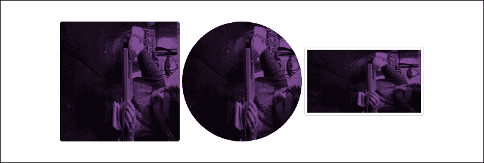

### 注意

我在这里使用的是我自己的图像；你需要在你的代码中替换图像。

## 使用 CSS 对齐图像

你可以应用到图像上的最后一个 Bootstrap 类是对齐类。它们将允许你将图像对齐到布局的左、右或中心。像之前的例子一样，你只需要在``标签中添加一个 CSS 类来应用你想要的对齐方式。对于左对齐和右对齐，你还可以在类名中提供列大小。最佳做法是使用与包含图像的列相同的尺寸。因此，如果你的图像显示在一个具有`col-xs-4`类的列中，那么在对齐类名中使用`-xs`单位。以下是使用额外小尺寸的左对齐和右对齐代码示例：

```js
 

```

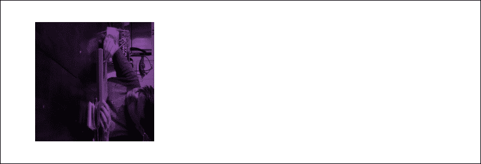

```js
 

```

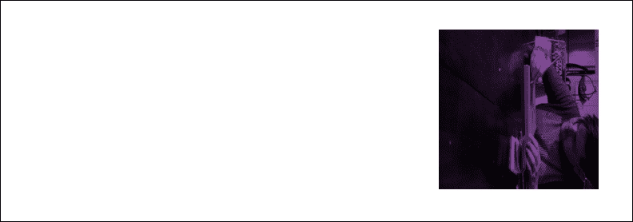

你可以使用最后一个图像对齐类来在布局中居中对齐图像。这个类的名字有点不同，就像你在这里看到的那样：

```js
 

```


这就完成了关于你可以在 Bootstrap 布局中使用图像类的部分。接下来，我们将探讨使用 Bootstrap 4 编写和渲染表格。

# 编写表格

Bootstrap 4 中的表格与框架的前一个版本基本没有变化。然而，有一些新功能，比如逆色表格选项和响应式表格。让我们从基础知识开始，并在过程中构建新功能。

## 设置基本表格

Bootstrap 中的基本表格结构利用了几乎所有可用的 HTML 表格标签。表头被包裹在`<thead>`标签中，而主体被包裹在`<tbody>`标签中。这将允许我们在逆表格布局中添加额外的样式。现在，让我们看看如何在 Bootstrap 中组合一个基本表格：

```js
<table class="table"> 
<thead> 
  <tr> 
    <th>first name</th> 
    <th>last name</th> 
    <th>twitter</th> 
  </tr> 
</thead> 
<tbody> 
  <tr> 
    <td>john</td> 
    <td>smtih</td> 
    <td>@jsmtih</td> 
  </tr> 
  <tr> 
    <td>steve</td> 
    <td>stevens</td> 
    <td>@stevens</td> 
  </tr> 
  <tr> 
    <td>mike</td> 
    <td>michaels</td> 
    <td>@mandm</td> 
  </tr> 
</tbody> 
</table> 

```

如你所见，语法相当简单。唯一应用的类是根`table`类，它应用在`<table>`标签上。这需要应用到你在 Bootstrap 中使用的任何表格变体上。这将产生一个在浏览器中看起来如下所示的表格：

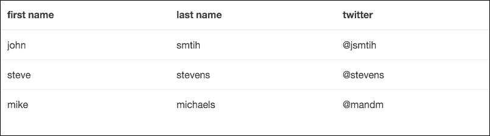

如您所见，语法相当简单。唯一应用的类是`<table>`标签上的根`table`类。这需要应用于 Bootstrap 中您使用的任何表格变化。

## 反转表格

让我快速向您展示 Bootstrap 4 中的一个新表格类。如果我们将类`table-inverse`添加到`<table>`标签中，表格颜色将反转，背景为深色，文字为浅色。以下是您需要更改的代码：

```js
<table class="table table-inverse"> 
  ... 
</table> 

```

这段代码的轻微变化将生成如下所示的表格：

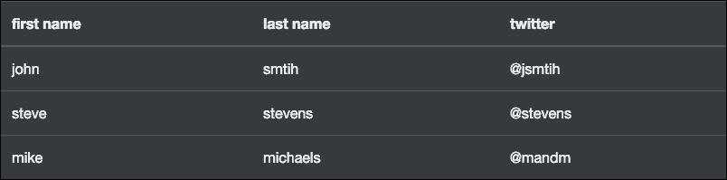

如果您需要快速获取基本表格样式的变化，这是一个相当实用的技巧。

### 反转表格标题

如果您不想反转整个表格，可以使用`thead-inverse`类在`<thead>`标签上仅反转该行：

```js
<table class="table"> 
<thead class="thead-inverse"> 
  ... 
</thead> 
  ... 
</table> 

```

如果应用了这个变化，那么您的表格将如下所示：

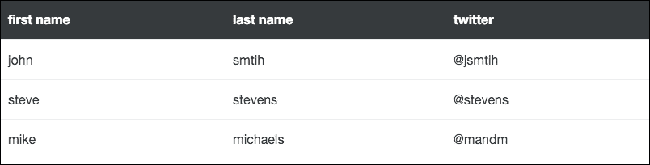

如果您在寻找一个更微妙的设计方案，这种方法可能更适合您。

## 添加条纹行

虽然不是 Bootstrap 4 的新特性，但`table-striped`类是我经常使用的。将此类应用于`<table>`标签将为您的表格添加斑马条纹，从表体中的第一行开始，并在所有奇数行上应用浅灰色背景色：

```js
<table class="table table-striped"> 

```

使用这个类将生成如下所示的表格：

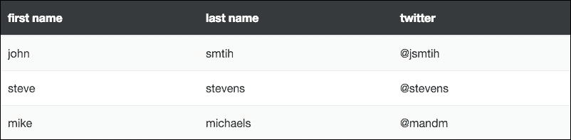

现在我们的表格开始成形。通过几个类，我们可以得到一个吸引人的布局。让我们看看我们还能用表格做什么。

## 为表格添加边框

另一种经常使用的样式是为您的表格添加边框。这可以通过与条纹相同的方式进行。只需更改或添加另一个名为`table-bordered`的类到`<table>`标签中。在这个例子中，我将移除条纹并添加边框：

```js
<table class="table table-bordered"> 

```

现在我们已经添加了边框并去掉了条纹，我们的表格应该如下所示：

```js
<table class="table table-bordered table-striped"> 

```

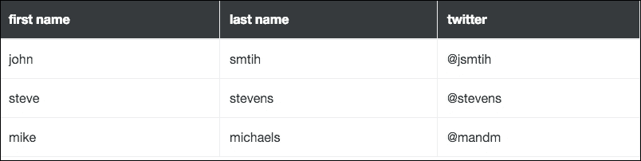

重要的是要知道您可以组合表格类并使用多个。如果您想要一个带有条纹和边框的表格，可以轻松地通过包含这两个相应的类来实现。

## 为行添加悬停状态

为您的每一行表格添加悬停状态是可能的且很容易。要做到这一点，您只需将`table-hover`类添加到`<table>`标签中。当使用时，如果鼠标悬停在表格的行上，其背景色将改变以指示状态变化：

```js
<table class="table table-hover"> 

```

在这里，我移除了其他表格类以向您展示基本的悬停表格选项。在浏览器中查看时，当鼠标悬停在行上时，表格应如下所示：

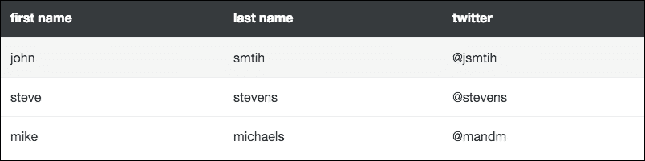

在某些情况下，你可能需要一个具有较小文本和压缩高度的表格。这可以通过向`<table>`标签添加`table-sm`类来实现。这将使表格在查看时看起来更紧凑：

```js
<table class="table table-sm"> 

```

如果你选择使用这个类，你的表格应该看起来像这样：

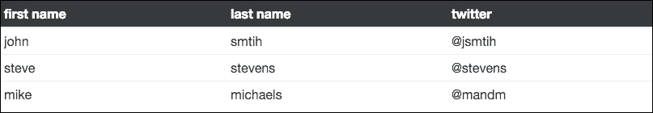

创建较小的表格

这就完成了你可以通过简单 CSS 类应用的核心表格变体。在我们继续之前，还有一些关于表格的重要点需要讨论。

## 颜色涂层的表格行

在某些情况下，你可能想要将表格行的背景颜色设置为不同的颜色。这可以通过使用一些包含的上下文类轻松实现。你可以选择五种不同的颜色变体：

+   `table-active` 是悬停颜色，默认为浅灰色

+   `table-success` 用于正面操作，颜色为绿色

+   `table-info` 用于信息高亮，颜色为蓝色

+   `table-warning` 用于引起注意，颜色为黄色

+   `table-danger` 用于负面或错误操作，颜色为红色

前面的类可以应用于`<tr>`或`<td>`标签。如果我将这些颜色变体全部应用到单个表格上，它们看起来像这样：

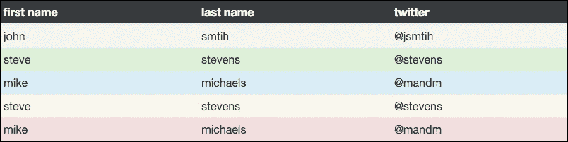

如你所见，这些类对于验证或突出显示需要更加突出的特定行非常有用。

## 使表格响应

使用 CSS 添加表格响应性从未容易过。幸运的是，Bootstrap 4 内置了一些支持，你可以轻松利用。要使表格响应，你只需将一个带有`table-responsive`类的`<div>`包裹在你的`<table>`周围：

```js
<div class="table-responsive"> 
  <table class="table"> 
    ... 
  </table> 
</div> 

```

如果你在一个小于 768px 视口的视图中查看表格，那么表格单元格将水平滚动，这样就可以全部查看。如果视口更大，你将看到与常规表格相比没有差异。

# 摘要

完成表格后，本章内容到此结束。希望这已经是一个很好的 Bootstrap 内容组件介绍，以及 Bootstrap 4 中这些类型组件的新功能的回顾。回顾一下，我们学习了：重置、排版、图片和表格。在下一章，我们将开始深入研究一些更复杂的组件，并将它们构建到我们的博客项目中。

# 评估

1.  描述列表为用户提供什么允许？

    1.  描述列表允许用户为术语和描述创建水平显示

    1.  在网站或应用程序中创建导航或子导航的允许

    1.  当创建导航，或者你可能只是想创建一个没有项目符号的项目列表

    1.  以上皆非

1.  当将 img-fluid 类应用于``标签时，图像会发生哪些变化？

    1.  它会自动将宽度设置为 100%

    1.  它会将高度设置为自动

    1.  它将自动将图片的最大宽度设置为 100%，高度自动调整

    1.  以上都不是

1.  以下哪个是图片的形状样式？

    1.  `img-border`

    1.  `img-thumbnail`

    1.  `img-pixel`

    1.  `img-round`

1.  以下代码片段将输出什么？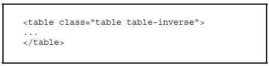

    1.  它使表格具有响应性

    1.  如果你将鼠标悬停在表格的某一行上，其背景颜色将改变以指示状态变化

    1.  将为你的表格添加斑马纹，从表格主体的第一行开始，并将所有奇数行的背景颜色设置为浅灰色

    1.  表格颜色将反转，背景为深色，文字为浅色

1.  使用左右对齐，你还可以在`class name`内提供`列大小`。

    1.  是的

    1.  不是
