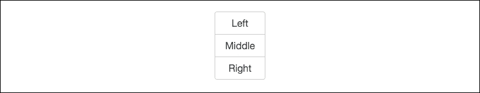

# 第五章。玩转组件

Bootstrap 的真正力量在于框架中包含的组件。在本章中，我们将探讨许多新组件和现有组件。我会向您展示如何使用它们，然后我们将它们插入到我们的示例博客项目中，以便您可以在实践中看到它们。让我们直接从最常见的组件之一——按钮——开始。

# 使用按钮组件

按钮是 Bootstrap 中最常用的组件之一。在 Bootstrap 4 版本中，按钮组件的一些新选项包括轮廓变体、切换状态以及带有复选框和单选按钮的按钮组。在我们深入探讨这些之前，让我们回顾一下基本的按钮选项和配置。以下是一些使用按钮时需要记住的几点：

+   无论你创建什么类型的按钮，它至少需要包含 `.btn` CSS 类

+   `.btn` 类可以附加到多个 HTML 标签上，例如 `<button>`、`<a>` 和 `<input>`，以渲染按钮

+   有不同的 CSS 类用于创建不同大小和颜色的按钮

# 基本按钮示例

在我们继续更高级的配置之前，让我们先了解一下创建 Bootstrap 按钮的基础知识。如果您不熟悉 Bootstrap，您可能想跳过这一部分。Bootstrap 默认提供了六种不同的按钮颜色选项。以下是它们的名字和何时使用它们的说明：

+   **主要**：在您的网站上使用的主要按钮。默认颜色为蓝色。

+   **次要**：在你的网站上使用的备用或次要按钮。默认颜色为白色。

+   **成功**：用于基于正面的操作。默认颜色为绿色。

+   **信息**：用于信息按钮。默认颜色为浅蓝色。

+   **警告**：用于基于警告的操作。默认颜色为黄色。

+   **危险**：用于基于错误的操作。默认颜色为红色。

现在我已经解释了所有按钮变体，让我们看看按钮的代码：

```js
<button type="button" class="btn btn-primary">Primary</button> 

```

如您所见，我正在使用 `<button>` 标签，并向其添加了一些 CSS 类。第一个是 `.btn` 类，我提到您需要在所有按钮上包含它。第二个是 `.btn-primary` 类，表示您想使用 **主要** 按钮变体。如果您想使用不同的按钮样式，只需更改第二个类以使用相应的关键字。让我们看看所有按钮变体的代码：

```js
<button type="button" class="btn btn-primary">Primary</button> 

<button type="button" class="btn btn-secondary">Secondary</button> 

<button type="button" class="btn btn-success">Success</button> 

<button type="button" class="btn btn-info">Info</button> 

<button type="button" class="btn btn-warning">Warning</button> 

<button type="button" class="btn btn-danger">Danger</button> 

<button type="button" class="btn btn-link">Link</button> 

```

就这么简单。请注意，最后一行是一个 **链接** 按钮选项，我还没有讨论过。这个变体在浏览器中会显示为文本链接，但在您点击或悬停时将作为按钮操作。我不经常使用这个变体，所以最初我把它留出来了。如果您在浏览器中查看此代码，您应该看到以下按钮：


# 创建轮廓按钮

从 Bootstrap 4 开始，他们引入了一种新的按钮变体，它将生成轮廓按钮而不是填充按钮。要应用这种外观和感觉，您需要更改按钮类中的一个。让我们看一下以下代码的所有变体：

```js
<button type="button" class="btn btn-primary-outline">Primary</button> 
<button type="button" class="btn btn-secondary-outline">Secondary</button> 
<button type="button" class="btn btn-success-outline">Success</button> 
<button type="button" class="btn btn-info-outline">Info</button> 
<button type="button" class="btn btn-warning-outline">Warning</button> 
<button type="button" class="btn btn-danger-outline">Danger</button> 

```

如您所见，类名已更改；以下是它们映射到每个按钮变体的方式：

+   `btn-primary-outline`

+   `btn-secondary-outline`

+   `btn-success-outline`

+   `btn-info-outline`

+   `btn-warning-outline`

+   `btn-danger-outline`

基本上，您只需将 `-outline` 追加到默认按钮变体类名中。一旦这样做，您的按钮应该看起来像这样：


# 复选框和单选按钮

Bootstrap 4 中的一个新特性是能够将复选框和单选按钮转换为常规按钮。从移动设备的角度来看，这非常方便，因为触摸按钮比勾选复选框或点击单选按钮要容易得多。如果您正在构建移动应用或响应式网站，使用此组件会是一个好主意。让我们首先查看生成三个复选框按钮组的代码：

```js
<div class="btn-group" data-toggle="buttons"> 
  <label class="btn btn-primary active"> 
    <input type="checkbox" checked autocomplete="off"> checkbox 1 
  </label> 
  <label class="btn btn-primary"> 
    <input type="checkbox" autocomplete="off"> checkbox 2 
  </label> 
  <label class="btn btn-primary"> 
    <input type="checkbox" autocomplete="off"> checkbox 3 
  </label> 
</div> 

```

让我分解代码并解释这里发生了什么：

+   要生成带有复选框的按钮组，您需要将复选框包裹在一个具有 `.btn-group` 类的 `<div>` 中。

+   要允许按钮切换开启或关闭，您还需要将数据属性 `data-toggle="buttons"` 添加到 `<div>` 中。

+   接下来，我们需要在 `<label>` 标签上使用按钮类将每个复选框转换为按钮。请注意，在第一个按钮上，我使用了 `.active` 类，这将使此复选框默认开启。这个类完全是可选的。

+   您的基本复选框 `<input>` 标签嵌套在标签内。

请记住，由于这些是复选框，您可以切换多个选项的开启或关闭。以下是按钮组在浏览器中渲染时的样子：


如您所见，这渲染了一个看起来很漂亮的按钮组，它针对移动设备和桌面设备进行了优化。同时，请注意第一个复选框具有不同的背景颜色，因为它当前处于开启状态，这是由于应用了 `.active` 类的标签。与创建带有复选框的按钮组相同，我们也可以用相同的方法处理单选按钮。

## 创建单选按钮组

创建单选按钮组与复选框非常相似。让我们首先查看生成这种不同变体的代码：

```js
<div class="btn-group" data-toggle="buttons"> 
  <label class="btn btn-primary active"> 
    <input type="radio" name="options" id="option1" autocomplete="off" checked> radio 1 
  </label> 
  <label class="btn btn-primary"> 
    <input type="radio" name="options" id="option2" autocomplete="off"> radio 2 
  </label> 
  <label class="btn btn-primary"> 
    <input type="radio" name="options" id="option3" autocomplete="off"> radio 3 
  </label> 
</div> 

```

让我解释一下这段代码中发生了什么：

+   与复选框一样，您需要将您的单选按钮集合包裹在一个具有相同类和数据属性的 `<div>` 中

+   `<label>` 标签和按钮类也以相同的方式工作

+   唯一的区别是我们将复选框 `<input>` 类型替换为单选按钮

请记住，对于单选按钮，一次只能选择一个。在这种情况下，第一个是默认选中的，但您可以轻松地移除它。以下是按钮在浏览器中的样子：


如您所见，按钮组是以与复选框相同的方式渲染的，但在这个例子中我们使用的是单选按钮。这应该是优化您在移动和桌面上的单选按钮组的预期结果。接下来，我们将基于我们关于按钮组的了解，但学习如何以其他方式使用它们。

### 注意

我们将在本章后面回顾并实际上将组件添加到我们的博客项目中。

## 使用按钮组

如果您是 Bootstrap 的新手，按钮组听起来就是这样。它们是一组按钮，水平或垂直连接以看起来像一个单一组件。让我们看看代码来渲染组件的最基本版本：

```js
<div class="btn-group" role="group" aria-label="Basic example"> 
  <button type="button" class="btn btn-secondary">Left</button> 
  <button type="button" class="btn btn-secondary">Middle</button> 
  <button type="button" class="btn btn-secondary">Right</button> 
</div> 

```

如您所见，我们有一个由 `<div>` 包围的常规按钮标签组，该 `<div>` 上有一个 `.btn-group` 类。至少，这就是您需要做的来渲染一个按钮组。在 `<div>` 标签上还有一些其他可选属性，即 `role` 和 `aria-label`。如果您需要担心可访问性，那么您应该包括这些属性，否则它们是可选的。在这段代码中还有一个小的变化，我决定使用 `.btn-secondary` 类来稍微改变一下按钮样式。让我们看看这在浏览器中会如何显示：


如您所见，我们有一个由三个按钮组成的单一组件。这个组件通常用于次要导航，或者像我之前解释的那样在表单中使用。如果您想以垂直方式显示按钮，这也是可能的，只需稍作更改即可。

## 创建垂直按钮组

如果您想以垂直方式排列您组中的按钮，这实际上相当容易做到。您不需要更改 `<button>` 标签上的任何代码，只需更新包装 `<div>` 标签上的 CSS 类名即可。以下是您需要更改的代码：

```js
<div class="btn-group-vertical"> 
  ... 
</div> 

```

如果您对代码进行那个更改，那么相同的按钮组在浏览器中会显示如下：



可能有必要将左侧按钮标签改为顶部，将右侧按钮标签改为底部。然而，我保留了它们原来的样子，因为我想向您展示您可以通过更改一个 CSS 类简单地改变组的对齐方式。这涵盖了使用按钮组组件的基本知识；在下一节中，我将向您展示如何创建按钮下拉菜单。

## 编写按钮下拉菜单

将按钮渲染为下拉菜单的代码稍微复杂一些，但仍然相当容易上手。您将结合一个按钮标签和一个 `<div>`，其中包含嵌套的链接集合。让我们看看渲染基本下拉按钮所需的代码：

```js
<div class="btn-group"> 
  <button type="button" class="btn btn-secondary dropdown-toggle" data-toggle="dropdown" aria-haspopup="true" aria-expanded="false"> 
    Dropdown 
  </button> 
  <div class="dropdown-menu"> 
    <a class="dropdown-item" href="#">Link</a> 
    <a class="dropdown-item" href="#">Link Two</a> 
    <a class="dropdown-item" href="#">Link Three</a> 
    <div class="dropdown-divider"></div> 
    <a class="dropdown-item" href="#">Link Four</a> 
  </div> 
</div> 

```

好的，这里有几个要点。让我们逐一分析并解释下拉菜单的工作原理：

+   整个组件需要被一个带有 `.btn-group` 类的 `<div>` 包裹。

+   接下来，您插入一个带有一些按钮 CSS 类的 `<button>` 标签。就像在上一节中一样，一些其他属性是可选的。然而，包含此属性是一个好主意：`aria-expanded`。它可以设置为 `false` 或 `true`，控制页面加载时下拉菜单是打开还是关闭。在大多数情况下，您会希望将其设置为 `false`。

+   在 `<button>` 标签之后，插入另一个 `<div>` 标签，该标签将包含在下拉菜单列表中出现的所有链接。请确保给这个 `<div>` 一个 `.dropdown-menu` 类。

+   在第二个 `<div>` 中，您需要插入一组 `<a>` 标签，每个标签对应列表中的一个项目。每个 `<a>` 标签都需要一个 `.dropdown-item` 类，以便应用正确的 CSS 样式。

+   如果您的链接数量很多，您可能还希望在下拉列表中插入一个分隔符。这是通过插入一个带有 `.dropdown-divider` 类的第三个 `<div>` 来实现的。

正如我提到的，这个组件稍微复杂一些，但在 Bootstrap 4 中，他们实际上简化了一些，使其更容易使用。让我们看看它在浏览器中的样子。在下面的屏幕截图中，我展示了下拉菜单展开的样子，以便您可以看到按钮和链接列表：


如您所见，我们有一个嵌套在其中的链接列表的下拉按钮。请注意，如果您想使用这个组件，确实需要在模板中包含 jQuery 和 `bootstrap.min.js`。您还可以轻松实现这个组件的其他一些变体，例如弹出菜单。

## 创建弹出菜单

在某些情况下，您可能希望菜单在按钮上方弹出而不是下方。您可以通过在组件的包装 `<div>` 上添加一个类来实现这一点。查看以下代码：

```js
<div class="btn-group dropup"> 
  .. 
</div> 

```

如您所见，我已经将 `.dropup` 类添加到了 `<div>` 上。这将使菜单出现在按钮上方，并且应该看起来像这样：


如您所见，当菜单展开时，列表出现在按钮上方。

## 创建不同尺寸的下拉按钮

通过在下拉按钮的 `<button>` 标签上添加一个类，您可以调整触发器的尺寸。让我们看看小按钮和大按钮变体的代码：

```js
<!-- large button //--> 
<div class="btn-group"> 
  <button class="btn btn-secondary btn-lg dropdown-toggle" type="button" data-toggle="dropdown" aria-haspopup="true" aria-expanded="false"> 
    Large button 
  </button> 
  <div class="dropdown-menu"> 
    ... 
  </div> 
</div> 

<!-- small button //--> 
<div class="btn-group"> 
  <button class="btn btn-secondary btn-sm dropdown-toggle" type="button" data-toggle="dropdown" aria-haspopup="true" aria-expanded="false"> 
    Small button 
  </button> 
  <div class="dropdown-menu"> 
    ... 
  </div> 
</div> 

```

如果您在第一个示例中找到按钮标签，您会看到我为它添加了一个 `.btn-lg` 类。这个类将增加按钮大小，使其比默认值更大。看看代码的第二部分，再次找到 `<button>` 标签，您会看到它上面有一个 `.btn-sm` 类。这以相同的方式工作，只是按钮现在将比默认值更小。让我们看看这些按钮在浏览器中的渲染效果。

### 注意

`.btn-lg` 和 `.btn-sm` 类不仅限于按钮下拉组件。您可以在任何您喜欢的按钮组件变体上使用它们。


这就完成了使用按钮下拉组件的基本知识。在下一节中，我们将介绍一个更复杂的组件，即表单。

# 在 Bootstrap 4 中编写表单

如果您熟悉 Bootstrap 3，那么您会注意到 CSS 表单类在版本 4 中几乎相同。我认为新版本中表单的最大变化是每个表单组使用一个 `<fieldset>` 标签而不是 `<div>`。如果您是 Bootstrap 表单的新手，一个基本的表单组由一个标签和一个输入组成。它还可以包括帮助文本，但这不是必需的。让我们直接创建一个使用多个核心组件的通用表单。

## 设置表单

至少，一个表单需要由一个输入和一个按钮组成。让我们从基础知识开始，创建一个符合这些要求的表单。以下是开始编写的代码：

```js
<form> 
  <fieldset class="form-group"> 
    <label>Text Label</label> 
    <input type="text" class="form-control" placeholder="Enter Text"> 
    <small class="text-muted">This is some help text.</small> 
  </fieldset> 
  <button type="submit" class="btn btn-primary">Submit</button> 
 </form> 

```

让我解释一下代码中发生的事情：

+   每个表单都需要从一个 `<form>` 标签开始。然而，这个标签上不需要特殊类。

+   我在单个输入上插入了一个带有 `.form-group` 类的 `<fieldset>` 标签。这个 `<fieldset>` 模式将在您添加更多输入时重复使用。

+   在 `<fieldset>` 内，我们有一个 `<label>`。同样，不需要添加特殊 CSS 类到 `<label>`。

+   在标签之后，您需要插入表单 `<input>` 标签。在这种情况下，我使用的是文本输入。在这个 HTML 标签上，您需要添加一个 `.form-control` 类。Bootstrap 中的所有输入标签都需要这个类。占位文本是可选的，但为了可用性添加它是很好的。

+   在 `<fieldset>` 的最后一行中，我包含了一个带有 `.text-muted` 类的 `<small>` 标签，这将使文本变得小且浅灰色。如果您想在表单输入中包含一些帮助文本，应使用此模式。

+   关闭 `<fieldset>` 标签，然后您需要添加一个 `<button>` 标签作为表单的提交按钮。

+   关闭 `<form>`，您就完成了。

完成代码审查后，打开您的网页浏览器，您的表单应该看起来像这样：


您已经成功编写了第一个 Bootstrap 4 表单。让我们继续，我将解释如何使用 Bootstrap 的最新版本实现其他常见表单组件。

### 添加选择下拉菜单

让我们通过添加一个选择下拉菜单来构建我们的表单代码。在我们的文本输入之后插入以下代码：

```js
<fieldset class="form-group"> 
  <label>Select dropdown</label> 
  <select class="form-control"> 
    <option>one</option> 
    <option>two</option> 
    <option>three</option> 
    <option>four</option> 
    <option>five</option> 
  </select> 
</fieldset> 

```

让我们分解一下你需要注意的代码部分：

+   注意，整个 `<select>` 都被一个具有 `.form-group` 类的 `<fieldset>` 包裹。这种模式应该为每个你添加的表单输入类型重复。

+   在 `<select>` 标签上，需要添加一个 `.form-control` 类。

+   除了这些，你应该像通常一样编码 `<select>`，遵循最佳 HTML 语法实践。

完成后，如果你在浏览器中查看表单，它现在应该看起来像这样：


这样就完成了 `<select>` 下拉菜单的设置。接下来，让我们检查 `<textarea>` 标签。

### 在你的表单中插入一个文本区域标签

接下来，让我们将一个 `<textarea>` 标签插入到我们的表单中。在 `<select>` 菜单之后，添加以下代码：

```js
<fieldset class="form-group"> 
  <label>Textarea</label> 
  <textarea class="form-control" rows="3"></textarea> 
</fieldset> 

```

使用这个输入相当简单。像我们的其他示例一样，你需要使用一个具有 `.form-group` CSS 类的 `<fieldset>` 标签来包裹整个内容。在实际的 `<textarea>` 标签上，你需要添加 `.form-control` 类。就是这样；一旦完成，你的表单现在应该看起来像这样：


现在文本区域已经完成，让我们继续到文件输入表单字段。

### 添加文件输入表单字段

从历史上看，文件输入表单字段一直是用 CSS 样式化的难题。我很高兴地说，在 Bootstrap 4 中，他们创造了一种新的方法，这是我迄今为止看到最好的。让我们首先在我们的表单中的 `<textarea>` 之后插入以下代码：

```js
<fieldset class="form-group"> 
  <label>File input</label> 
  <input type="file" class="form-control-file"> 
  <small class="text-muted">This is some help text. Supported file types are: .png</small> 
</fieldset> 

```

再次，这个表单字段是以与前面相同的方式构建的。然而，你需要注意的一个小变化是关于 **文件输入** 字段。在 `<input>` 标签上，你需要将 CSS 类更改为 `.form-control-file`。有一些特定的样式被应用来清理这个表单字段的视觉效果。一旦完成，你的表单应该看起来像这样：


这样就完成了 **文件输入** 字段，剩下两个基本表单字段输入需要介绍。它们是单选按钮和复选框。让我们学习如何添加它们。

### 向表单中插入单选按钮和复选框

这些字段非常相似，所以我将它们分组在自己的部分中。这两个字段的代码与其他输入略有不同，我将现在概述。首先，让我们在我们的表单中的“文件输入”字段之后插入以下代码：

```js
<div class="radio"> 
  <label> 
    <input type="radio" name="optionsRadios" id="optionsRadios1" value="option1" checked> 
    Option 1 
  </label> 
</div> 
<div class="radio"> 
  <label> 
    <input type="radio" name="optionsRadios" id="optionsRadios2" value="option2"> 
       Option 2 
  </label> 
</div> 

<div class="checkbox"> 
  <label> 
    <input type="checkbox"> Checkbox 
  </label> 
</div> 

```

让我们先从单选按钮的代码开始，然后我们将转到复选框：

+   字段不使用 `<fieldset>` 标签作为包装器。在这种情况下，你应该使用一个 `<div>` 并给它一个 `.radio` 或 `.checkbox` 类，具体取决于你想要使用哪种类型。

+   对于这些字段，`<label>` 标签也将围绕 `<input>` 标签包裹，使所有内容都显示在同一水平线上。我们不希望文本标签掉到单选按钮或复选框下面。

+   你不需要为这些字段中的任何一个在 `<input>` 上使用特殊类。

如你所见，这些字段的代码与我们之前学到的其他表单输入有所不同。不用担心，它们使用起来很简单，而且不需要记住很多 CSS 类。Bootstrap 4 中表单的一个非常好的变化是它们需要的 HTML 标记更少，因此更容易编写。最后，如果你在浏览器中查看我们的表单，它应该看起来像这样：


这就完成了所有核心表单字段的解释，这些字段是你在 Bootstrap 4 中需要知道如何使用的。在我们继续到一些更高级的表单字段和变体之前，为什么不把我们自己的表单添加到博客项目中呢？

### 将表单添加到博客联系页面

我知道，我知道。我说过我们会等到本章的结尾再构建组件到博客项目中。然而，我想你可能想从学习中休息一下，并将你学到的一些东西应用到你的项目中。让我们继续这样做，通过在**联系**页面上填写表单来实现这一点。

### 更新你的项目

让我们先打开我们的项目目录，找到名为 `contact.ejs` 的文件。在文本编辑器中打开该文件，我们将添加一些新的表单代码并删除一些填充代码。首先，找到页面中以下列 `<div>` 包裹的正文部分：

```js
<div class="col-md-12"> 

```

在那个 `<div>` 中目前有一些填充文本。删除该文本，并用以下表单代码替换：

```js
<form> 
  <fieldset class="form-group"> 
    <label>Email</label> 
    <input type="email" class="form-control" placeholder="Enter email"> 
    <small class="text-muted">We'll never share your email with anyone else.</small> 
  </fieldset> 
  <fieldset class="form-group"> 
    <label>Name</label> 
    <input type="text" class="form-control" placeholder="Name"> 
  </fieldset> 
  <fieldset class="form-group"> 
    <label>Message</label> 
    <textarea class="form-control" rows="3"></textarea> 
  </fieldset> 
  <button type="submit" class="btn btn-primary">Submit</button> 
</form> 

```

我已经编写了一个基本的联系表单，你通常会在博客上看到。它包含电子邮件、姓名和消息字段，以及一个**提交**按钮。保存你的文件，然后在浏览器中预览你的项目。现在**联系**页面应该看起来像这样：


这就完成了目前对**联系**页面的更新。在本书的后面，我们将向这个页面添加一些额外的组件。让我们回到学习 Bootstrap 4 中的表单，通过回顾一些额外的表单控件。

# 额外的表单字段

现在我们已经学会了如何构建基本的表单并将其添加到我们的项目中，让我们回顾一下一些更高级的表单字段和变体，你可以使用 Bootstrap 4 应用。我将首先向你展示如何以几种不同的方式布局表单。

# 创建内联表单

让我们先学习如何创建内联表单。这是一个你可能想在项目标题或登录页面中使用的布局。在这种情况下，我们将使表单的字段和按钮垂直排列在整个页面上。为了这个例子，让我们创建一个简单的登录表单，代码如下：

```js
<form class="form-inline"> 
  <div class="form-group"> 
    <label>Name</label> 
    <input type="text" class="form-control" placeholder="Mike Smith"> 
  </div> 
  <div class="form-group"> 
    <label>Email</label> 
    <input type="email" class="form-control" placeholder="mike@gmail.com"> 
  </div> 
  <button type="submit" class="btn btn-primary">Login</button> 
</form> 

```

在这个表单中发生了一些事情，所以让我为你解释一下：

+   对于内联表单，我们需要在 `<form>` 标签中添加一个名为 `.form-inline` 的 CSS 类。

+   你还会注意到 `<fieldset>` 标签已经被 `<div>` 标签替换。这样做是为了它们可以被设置为 `display` 为 `inline-block`，这在字段集中是不行的。

除了这两个区别之外，表单的编码方式与常规表单相同。一旦完成，你的表单在浏览器中应该看起来像这样：


如果你像我一样，你可能会觉得文本输入旁边的标签有点丑。好消息是有一个简单的方法可以隐藏它们。

## 在内联表单中隐藏标签

那些标签存在的原因是为了无障碍性和屏幕阅读器。我们不想完全从代码中移除它们，但我们可以通过添加一个名为 `.sr-only` 的 CSS 类来隐藏它们。这个类代表 **仅屏幕阅读器**，因此只有在可访问的屏幕阅读器上查看时才会显示标签。以下是如何添加该 CSS 类的示例：

```js
<label class="sr-only">Name</label> 

```

在你将这个 CSS 类应用到表单中的所有标签之后，现在在浏览器中应该看起来像这样：


这就完成了如何制作一个基本的内联表单。然而，如果你想在内联方式中包含其他字段怎么办？让我们看看我们如何添加复选框和单选按钮。

# 添加内联复选框和单选按钮

如果你想在内联表单中包含复选框和单选按钮，你需要对你的代码做一些修改。让我们首先来看一下复选框的代码。在表单中的最后一个文本输入之后插入以下代码：

```js
<label class="checkbox-inline"> 
  <input type="checkbox" value="option1"> Remember me? 
</label> 

```

这里有几个需要注意的地方：

+   首先，复选框周围不再有 `<div>` 包裹

+   你需要给复选框的 `<label>` 标签添加一个名为 `.checkbox-inline` 的类

一旦你这样做，保存你的表单，它应该在浏览器中看起来像这样：


现在我们已经添加了复选框，让我们看看使用单选按钮的示例。在复选框代码之后添加以下代码：

```js
<label class="radio-inline"> 
  <input type="radio" name="inlineRadioOptions" id="inlineRadio1" value="option1"> Yes 
</label> 
<label class="radio-inline"> 
  <input type="radio" name="inlineRadioOptions" id="inlineRadio2" value="option2"> No 
</label> 

```

如你所见，这里的模式完全相同。每个单选按钮周围的 `<div>` 都已被移除。取而代之的是，每个单选 `<label>` 标签需要添加一个名为 `.radio-inline` 的 CSS 类。一旦完成这一步，你的表单应该看起来像这样：


这就完成了你需要了解的所有关于内联表单的内容。现在让我们继续学习一些可以应用到你的表单字段上的更多实用类操作。

## 改变输入的大小

Bootstrap 提供了一些方便的实用 CSS 类，你可以与表单字段一起使用，使它们以不同的尺寸显示。除了默认尺寸外，你可以选择以更大的或更小的尺寸显示你的字段。让我们看看渲染所有三种尺寸变体的代码：

```js
<input class="form-control form-control-lg" type="text" placeholder="form-control-lg"> 
<input class="form-control" type="text" placeholder="Default input, No class required"> 
<input class="form-control form-control-sm" type="text" placeholder="form-control-sm"> 

```

要使用不同大小的输入，你只需在标签中添加一个额外的类：

+   对于较大的输入，使用类 `.form-control-lg`

+   对于较小的输入，使用类 `.form-control-sm`

+   默认输入大小不需要额外的 CSS 类

这是每个版本在浏览器中的样子：


如你所见，较大的输入更高，并且有一些额外的填充。较小的输入较短，填充减少。这些类仅覆盖输入的垂直尺寸。现在让我们学习如何控制输入的宽度。

## 控制表单字段的宽度

由于 Bootstrap 是一个以移动设备优先的框架，表单字段被设计为可以扩展以适应其列的宽度。因此，如果你为你的列类使用了 `.col-md-12`，字段将扩展到布局的宽度。这可能并不总是你想要的，你可能只想让输入扩展到布局宽度的一半。

如果是这样，你需要将你的字段包裹在一个带有列类的 `<div>` 中以控制宽度。让我们看看一些示例代码来阐明这个点：

```js
<div class="col-md-12"> 
    <input type="text" class="form-control" placeholder="full width"> 
</div> 
<div class="col-md-6"> 
    <input type="text" class="form-control" placeholder="half width"> 
</div> 

```

在前面的代码中，我移除了一些标签和其他表单代码，以便更容易看到正在发生的事情。以下是你需要了解的要点分解：

+   你需要将你的输入包裹在一个带有列类的 `<div>` 中

+   第一个输入将因为 `.col-md-12` 类而扩展到布局的宽度

+   第二个输入将只扩展到填充 50% 的布局，因为使用了 `.col-md-6` 类

让我们看看这将在实际浏览器中看起来如何：


如你所见，第二个输入只扩展到一半的宽度。这就是如果你不想让输入填充整个页面布局时如何控制输入宽度。在讨论表单时，我想最后讨论的是输入字段的验证。

# 添加输入验证

Bootstrap 4 为输入字段提供了一些强大且易于使用的验证样式。验证样式用于在提交实际表单时显示错误、警告和成功状态。让我们看看渲染所有三个验证状态的代码：

```js
<div class="form-group has-success"> 
  <label class="form-control-label">Input with success</label> 
  <input type="text" class="form-control form-control-success"> 
</div> 
<div class="form-group has-warning"> 
  <label class="form-control-label">Input with warning</label> 
  <input type="text" class="form-control form-control-warning"> 
</div> 
<div class="form-group has-danger"> 
  <label class="form-control-label">Input with danger</label> 
  <input type="text" class="form-control form-control-danger"> 
</div> 

```

每个验证变体的标记与常规输入非常相似，只是增加了一些 CSS 类来应用正确的状态外观和感觉。让我们逐一了解你需要注意的每个更改：

+   第一个输入是成功状态。需要将一个名为 `.has-success` 的类添加到包裹 `<div>` 中。

+   每个 `<label>` 标签都需要添加一个名为 `.form-control-label` 的类。这是为了使标签颜色与状态颜色相匹配。

+   成功输入需要添加一个名为 `.form-control-success` 的类。

+   第二个输入是警告状态。包裹 `<div>` 需要添加一个名为 `.has-warning` 的类。

+   警告输入也需要添加一个名为 `.form-control-warning` 的类。

+   最后，最后一个输入是危险或错误状态。包装 `<div>` 需要添加一个名为 `.has-danger` 的类。

+   危险输入也需要添加一个名为 `.form-control-danger` 的类。

让我们看看所有这些验证输入在浏览器中应该如何显示：


如您所见，输入和标签的颜色与它们的状态相匹配。您还会注意到每个输入的右侧都有一个图标。这些图标在包含所需的 CSS 文件时自动添加。实际上在这里不需要使用任何图像，这真是太好了。这也就结束了您需要了解的所有关于 Bootstrap 4 中表单的内容。在下一节中，我将教您关于 **Jumbotron** 组件的内容。

# 使用 Jumbotron 组件

如果您是 Bootstrap 的新手，您可能会问自己 Jumbotron 组件是什么东西。Jumbotron 用于展示内容块，通常位于页面顶部。这是您在许多网站上都会看到的标准主要功能块。如果您需要比简单的页面标题更复杂的东西，Jumbotron 就是您想要使用的组件。让我们快速看一下创建此组件所需的代码：

```js
<div class="jumbotron"> 
  <h1 class="display-3">Feature title</h1> 
  <p class="lead">This is a basic jumbrotron call to action</p> 
  <hr class="m-y-2"> 
  <p>This is some further description text for your main feature</p> 
  <p class="lead"> 
    <a class="btn btn-primary btn-lg" href="#" role="button">Learn more</a> 
  </p> 
</div> 

```

这里有一些新的 CSS 类需要我们回顾，以及一些我们已经学过的现有类。让我们分析一下代码中发生的事情：

+   Jumbotron 组件基于一个带有 `.jumbotron` CSS 类的 `<div>`。在这个 `<div>` 中，您几乎可以使用您喜欢的任何文本格式化标签。然而，有一些基本的东西您应该包括，以便使其看起来更好。

+   您首先会看到一个带有 `.display-3` 类的 `<h1>` 标签。由于 Jumbotron 更像是一个“显示”组件，您可能希望使用本书之前学到的可选类来增加 `<h1>` 的大小。

+   接下来，您将看到一个简单的 `<p>` 标签，用于功能的标语。在这个标签上，有一个名为 `.lead` 的类。这个类将基本字体大小增加 25%，并将 `font-weight` 设置为 `300`，这是一个较轻的重量。同样，这给了 Jumbotron 组件更多的“功能”外观和感觉。

+   在标语文本之后，您将看到一个带有 `.m-y-2` 类的 `<hr>` 标签。如果您还记得，这是一个实用间距类。在这种情况下，`-y` 会为 `<hr>` 标签上方和下方添加 `margin`。

+   接下来，我们还有一个带有一些附加描述文本的 `<p>` 标签。

+   最后，我们有一个 `<button>` 被一个 `<p>` 标签包裹，以便在 Jumbotron 块中有一个行动呼吁的结论。请注意，使用 `.btn-lg` 类的用户将产生一个更大尺寸的按钮。

在您编写完 Jumbotron 组件后，在浏览器中应该看起来像这样：


默认情况下，巨幕组件将扩展以适应其包含的列的宽度。在大多数情况下，您可能希望它跨越整个页面的宽度。然而，在某些情况下，您可能希望巨幕从浏览器的一边延伸到另一边，没有任何水平填充。如果是这种情况，您需要向主`<div>`添加`.jumbotron-fluid`类，并确保它位于 Bootstrap `.container`之外。让我们看看以下代码，以了解我的意思：

```js
<div class="jumbotron jumbotron-fluid"> 
  <div class="container"> 
    <h1 class="display-3">Feature title</h1> 
      <p class="lead">This is a basic jumbrotron call to action</p> 
  </div> 
</div> 

```

如您所见，`.container <div>`现在位于`Jumbotron <div>`内部。这就是如何移除该部分的水平填充。一旦完成，在浏览器中应该看起来像这样：


这就完成了 Bootstrap 4 中巨幕组件的使用。接下来，让我们继续学习如何使用标签组件。

# 添加标签组件

标签组件用于为不同类型的内容添加上下文。一个很好的例子是在应用程序中的通知。您可能会使用标签来指示电子邮件应用程序中有多少未读电子邮件。另一个例子是在表格或列表中的项目旁边插入警告标签。像按钮一样，标签有多种颜色变体，以满足您在项目中的需求。让我们看看代码，以了解如何渲染基本的标签选项：

```js
<span class="label label-default">Default</span> 
<span class="label label-primary">Primary</span> 
<span class="label label-success">Success</span> 
<span class="label label-info">Info</span> 
<span class="label label-warning">Warning</span> 
<span class="label label-danger">Danger</span> 

```

您可能会注意到这里与按钮组件 CSS 类的相似之处。当使用标签时，您应该使用`<span>`标签作为组件的基础。当使用此组件时，以下是一些更重要的事实：

+   标签组件的每个变体都需要在`<span>`标签上使用`.label`类

+   **默认**标签使用`.label-default`类，颜色为灰色

+   **主要**标签使用`.label-primary`类，颜色为蓝色

+   **成功**标签使用`.label-success`类，颜色为绿色

+   **信息**标签使用`.label-info`类，颜色为浅蓝色

+   **警告**标签使用`.label-warning`类，颜色为黄色

+   最后，**危险**标签使用`.label-danger`类，颜色为红色

编码完成后，在您的浏览器中应该看起来像这样：


默认情况下，标签将是矩形，并且角落略微圆润。如果您想以药丸格式显示它们，可以通过向`<span>`标签添加`.label-pill`类来实现。以下是一个示例，以说明我的意思：

```js
<span class="label label-pill label-default">Default</span> 
<span class="label label-pill label-primary">Primary</span> 
<span class="label label-pill label-success">Success</span> 
<span class="label label-pill label-info">Info</span> 
<span class="label label-pill label-warning">Warning</span> 
<span class="label label-pill label-danger">Danger</span> 

```

如果您将此类添加到标签中，它们在浏览器中应该看起来像这样：


这就完成了 Bootstrap 4 中的标签组件。接下来，我将教您如何使用警报组件。

# 使用警报组件

Bootstrap 中的 Alert 组件为典型的用途提供上下文信息，例如验证和一般信息，需要更加突出。像我们之前的组件一样，它有几个不同的变体，取决于你的需求。让我们先看看渲染不同警报选项所需的基本代码：

```js
<div class="alert alert-success" role="alert"> 
  A success alert 
</div> 
<div class="alert alert-info" role="alert"> 
  An info alert 
</div> 
<div class="alert alert-warning" role="alert"> 
  A warning alert 
</div> 
<div class="alert alert-danger" role="alert"> 
  A danger alert 
</div> 

```

创建警报所使用的类可以添加到任何块元素中，但为了演示目的，我们将使用`<div>`标签来实现。以下是你需要知道的关键点：

+   任何 Alert 组件的实例都需要在`<div>`标签上使用`.alert`CSS 类

+   你还需要第二个 CSS 类来指明你想要使用警报的哪个版本

+   **成功**警报使用类`.alert-success`，颜色为绿色

+   **信息**警报使用类`.alert-info`，颜色为蓝色

+   **警告**警报使用类`.alert-warning`，颜色为黄色

+   **危险**警报使用类`.alert-danger`，颜色为红色

设置好那些警报的代码后，在浏览器中它们应该看起来像这样：


这只是一个使用警报的基本示例。你可以做一些额外的事情来扩展这个组件，比如添加一个关闭按钮。

## 向警报添加关闭按钮

如果你想要使警报栏可关闭，你可以添加一个按钮来实现。为了包含链接，更新你的栏代码，如下所示：

```js
<div class="alert alert-success" role="alert"> 
    <button type="button" class="close" data-dismiss="alert" aria-label="Close"> 
    <span aria-hidden="true">&times;</span> 
  </button> 
  A success alert 
</div> 

```

之前的警报栏代码没有变化，但你确实需要在警报消息之前添加一个按钮：

+   `<button>`元素需要名为`.close`的类才能显示

+   你还需要包含`data-dismiss`属性，其值为`alert`。

+   `&times;`代码在浏览器中将被渲染为**X**

添加新代码后，你的警报栏应该看起来像这样：


现在你的警报栏有一个可关闭的**X**按钮，当你在你应用或网站中实现组件的功能时可以触发关闭。这完成了 Bootstrap 4 中的 Alert 组件。在下一节中，我将教你关于版本 4 中最好的新组件——Cards。

# 使用 Cards 进行布局

在我看来，Bootstrap 4 中最好的新特性是新的 Card 组件。如果你不熟悉 Cards，它们随着 Google Material Design 的发布而变得流行。它们是一个以移动端优先的内容容器，非常适合手机、平板电脑和桌面电脑。

在我们的博客项目中，我们将大量使用 Card 组件，所以让我们直接开始学习如何使用它们。查看以下代码以了解如何渲染一个基本的卡片：

```js
<div class="card"> 
   
  <div class="card-block"> 
    <h4 class="card-title">Card title</h4> 
    <p class="card-text">Some basic description text for your card should appear in this section.</p> 
    <a href="#" class="btn btn-primary">Button</a> 
  </div> 
</div> 

```

这里有一些新的 CSS 类你需要了解，让我们逐一介绍：

+   任何 Card 组件的实例都必须使用带有名为`.card`的 CSS 类的`<div>`标签。

+   如果您想在卡片内包含图片，它应该放在这里。图片需要一个名为 `.card-img-top` 的类来在卡片顶部显示图片。虽然不是必需的，但我还建议您为图片添加 `.img-fluid` 类。这将使图片响应式，以便它将自动调整大小以匹配卡片的宽度。

+   在图片之后，您需要开始一个新的 `<div>`，并给它一个名为 `.card-block` 的 CSS 类。这个卡片的部分将包含实际的文本内容。

+   您的卡片首先应该有一个标题。使用带有 `.card-title` CSS 类的 `<h4>` 标签来创建这个部分。

+   接下来，您可以使用 `<p>` 标签和 `.card-text` 类插入一段文本。如果您选择有多个段落，请确保每个段落都使用相同的类名。

+   最后，我插入了一个主要的 `<button>`，这样用户就有东西可以点击来查看完整的内容。

在您完成编码后，它应该在您的浏览器中看起来像这样。注意，出于演示目的，我包含了我自己的图片，以便您可以看到它是如何工作的。您需要为您的项目提供自己的图片：


如您所见，这将渲染一个看起来整洁的小内容组件，您可以用许多不同的方式使用它。让我们继续学习一些其他可以自定义卡片组件的方法。

## 移动卡片标题

也许您想将卡片的标题移动到图片上方？这实际上非常简单，您只需将 `<title>` 标签移动到组件流中的图片之前即可，就像这样：

```js
<div class="card"> 
  <div class="card-block"> 
    <h4 class="card-title">Card title</h4> 
  </div> 
   
  <div class="card-block"> 
    <p class="card-text">Some basic description text for your card should appear in this section.</p> 
    <a href="#" class="btn btn-primary">Button</a> 
  </div> 
</div> 

```

这里有一些您需要了解的事情：

+   在这个卡片中现在有两个 `<div class="card-block">` 实例。在单个卡片内重复使用这个部分是完全可行的。您会注意到标题标签被包裹在这个 `<div>` 内。这是必需的，以便在卡片中的标题周围应用适当的填充和边距。

+   第二件事您需要注意是，标题标签在卡片布局中已经被移动到图片上方。

在进行这个更改后，您的卡片应该看起来像这样：


希望这展示了在卡片中处理不同内容是多么容易。让我们继续展示您可以做的其他一些事情。

## 改变卡片中的文本对齐方式

默认情况下，文本和元素在卡片中总是左对齐。但是，您可以非常容易地更改这一点。让我们创建第二个卡片，然后我们将居中一个并右对齐另一个。我将移除图片，以便代码更容易理解：

```js
<div class="card"> 
  <div class="card-block text-xs-center"> 
    <h4 class="card-title">Card title</h4> 
    <p class="card-text">Some basic description text for your card should appear in this section.</p> 
    <a href="#" class="btn btn-primary">Button</a> 
  </div> 
</div> 
<div class="card"> 
  <div class="card-block text-xs-right"> 
    <h4 class="card-title">Card title</h4> 
    <p class="card-text">Some basic description text for your card should appear in this section.</p> 
    <a href="#" class="btn btn-primary">Button</a> 
  </div> 
</div> 

```

这里没有太多变化，但让我们来看看有什么不同：

+   首先，正如我提到的，我移除了图片以使代码更简单。

+   在第一张卡片上，我添加了一个名为 `.text-xs-center` 的类，这将使卡片中的文本居中。

+   在第二张卡片上，我添加了一个名为 `.text-xs-right` 的类，这将使所有内容右对齐。

这就是你需要做的全部。如果你在浏览器中查看它，它应该看起来像这样：


所以，通过添加一个额外的 CSS 类，我们可以轻松地控制卡片中文本和元素的对齐方式。卡片是一个非常强大的组件，所以让我们继续学习如何自定义它们。

## 添加卡片标题

如果你想给你的卡片添加一个标题，这也很容易做到。查看这个代码示例，看看它是如何工作的：

```js
<div class="card"> 
    <div class="card-header"> 
    Header 
  </div> 
  <div class="card-block"> 
    <h4 class="card-title">Card title</h4> 
    <p class="card-text">Some basic description text for your card should appear in this section.</p> 
    <a href="#" class="btn btn-primary">Button</a> 
  </div> 
</div> 

```

通过添加新的代码部分，我们可以添加一个标题：

+   在 `.card-block` 部分之前，插入一个新的 `<div>`，并给它一个名为 `.card-header` 的类

+   在这个新的 `<div>` 中，你可以添加标题

保存你的文件，并在浏览器中查看，它应该看起来像这样：


这是一种非常简单的方法，可以将标题部分添加到你的卡片中。你可以用同样的方式添加页脚。让我们添加一些额外的代码来设置页脚：

```js
<div class="card"> 
    <div class="card-header"> 
    Header 
  </div> 
  <div class="card-block"> 
    <h4 class="card-title">Card title</h4> 
    <p class="card-text">Some basic description text for your card should appear in this section.</p> 
    <a href="#" class="btn btn-primary">Button</a> 
  </div> 
  <div class="card-footer"> 
      footer 
  </div> 
</div> 

```

页脚的设置与标题非常相似；让我们将其分解：

+   这次，在 `.card-block` 部分下方，插入一个新的 `<div>`，并给它一个名为 `.card-footer` 的类

+   在这个新的 `<div>` 中，插入你的页脚文本

再次保存文件，并在浏览器中查看，它应该看起来像这样：


如此简单，我们现在也包含了我们的卡片页脚。接下来，让我们学习一种为我们的卡片应用不同外观和感觉的方法。

## 反转卡片的配色方案

在某些情况下，你可能想要为你的卡片应用不同的外观和感觉，使其更加突出。Bootstrap 包含了一些 CSS 类，允许你反转配色方案。让我们看看应用这种样式的代码：

```js
<div class="card card-inverse" style="background:#000;"> 
  <div class="card-block"> 
    <h4 class="card-title">Card title</h4> 
    <p class="card-text">Some basic description text for your card should appear in this section.</p> 
    <a href="#" class="btn btn-primary">Button</a> 
  </div> 
</div> 

```

再次，这种变化通过几个小的修改很容易应用：

+   在具有 `.card` 类的 `<div>` 上，添加一个名为 `.card-inverse` 的第二个类。

+   这只会反转卡片中的文本。你需要自己设置背景颜色。为了速度，我在演示代码中只做了内联 CSS 样式。我建议实际上在你的样式表中创建一个 CSS 类，这对于你的项目来说是一种更好的做法。

这就是你需要做的全部。一旦完成，你的卡片应该看起来像这样：


在这种情况下，你需要指定自定义的背景颜色。然而，Bootstrap 确实有一些背景颜色变体，如果你想要添加一个额外的 CSS 类，你可以使用它们。这些选项的命名约定与按钮和标签相同。让我们看看代码将是什么样子：

```js
<div class="card card-inverse card-primary"> 
  <div class="card-block"> 
    <h4 class="card-title">Card title</h4> 
    <p class="card-text">Some basic description text for your card should appear in this section.</p> 
  </div> 
</div> 
<div class="card card-inverse card-success"> 
  <div class="card-block"> 
    <h4 class="card-title">Card title</h4> 
    <p class="card-text">Some basic description text for your card should appear in this section.</p> 
  </div> 
</div> 
<div class="card card-inverse card-info"> 
  <div class="card-block"> 
    <h4 class="card-title">Card title</h4> 
    <p class="card-text">Some basic description text for your card should appear in this section.</p> 
  </div> 
</div> 
<div class="card card-inverse card-warning"> 
  <div class="card-block"> 
    <h4 class="card-title">Card title</h4> 
    <p class="card-text">Some basic description text for your card should appear in this section.</p> 
  </div> 
</div> 
<div class="card card-inverse card-danger"> 
  <div class="card-block"> 
    <h4 class="card-title">Card title</h4> 
    <p class="card-text">Some basic description text for your card should appear in this section.</p> 
  </div> 
</div> 

```

这是一堆代码，但只有几处变化是从我们之前的卡片示例来的：

+   我所做的一切只是给带有基础 `.card` 类的 `<div>` 添加了一个额外的 CSS 类。让我们在以下要点中逐一回顾。

+   **主要** 卡片使用 `.card-primary` 类，颜色为蓝色。

+   **成功** 卡片使用 `.card-success` 类，颜色为绿色。

+   **信息**卡片使用`.card-info`类，颜色为浅蓝色。

+   **警告**卡片使用`.card-warning`类，颜色为黄色。

+   **危险**卡片使用`.card-danger`类，颜色为红色。

一旦您设置了上述代码，您的卡片在浏览器中应该看起来像这样：


这就完成了您可以使用卡片组件进行的基调和高级样式。为什么我们不暂时放下学习，实际上在我们的博客项目中构建一些卡片呢。

## 在联系页面添加位置卡片

让我们通过向**联系**页面添加一个简单的卡片组件来重新进入我们的项目。在您的文本编辑器中重新打开`contact.ejs`，并找到我们最近更新过的包含联系表单的主体部分。找到该部分以下列出的列代码：

```js
<div class="col-md-12"> 

.col-md-8 and add a new <div> with a class of .col-md-4 on it. When you're done, the body of the page code should now look like this:
```

```js
<div class="col-md-8"> 
      <form> 
        <fieldset class="form-group"> 
          <label>Email</label> 
          <input type="email" class="form-control" placeholder="Enter email"> 
          <small class="text-muted">We'll never share your email with anyone else.</small> 
        </fieldset> 
        <fieldset class="form-group"> 
          <label>Name</label> 
          <input type="text" class="form-control" placeholder="Name"> 
        </fieldset> 
        <fieldset class="form-group"> 
          <label>Message</label> 
          <textarea class="form-control" rows="3"></textarea> 
        </fieldset> 
        <button type="submit" class="btn btn-primary">Submit</button> 
      </form> 
    </div> 
    <div class="col-md-4"> 
    </div> 

```

现在列已经设置好了，让我们在我们的新列中插入一个卡片组件。将以下代码输入到布局的第二列中：

```js
<div class="card"> 
  <div class="card-header"> 
    Address &amp; Phone 
  </div> 
  <div class="card-block"> 
    <ul class="list-unstyled"> 
      <li>Mike Smith</li> 
      <li>1234 Street Name</li> 
      <li>Vancouver, BC</li> 
      <li>Canada V7V 1V1</li> 
      <li>604.123.1234</li> 
    </ul> 
  </div> 
</div> 

```

一旦您插入了卡片组件代码，保存您的文件并在浏览器中查看。它应该看起来像这样：


现在**联系**页面开始呈现出更多的形状。在我们继续到下一个内容组件之前，让我们将卡片组件添加到几个其他页面上。

# 更新博客索引页面

现在我们已经涵盖了卡片组件，是时候为我们的博客索引页面设置主要布局了。设计将严重依赖于卡片组件，让我们开始吧。首先，在您的文本编辑器中打开`index.ejs`并找到页面部分的主体。左侧列将看起来像这样：

```js
<div class="col-md-8"> 

```

在这个当前存在的`<div>`中有些填充文本。删除填充文本并插入以下卡片组件，这将是我们第一篇博客文章：

```js
<div class="card"> 
   
  <div class="card-block"> 
    <h4 class="card-title">Post title</h4> 
    <p><small>Posted by <a href="#">Admin</a> on January 1, 2016 in <a href="#">Category</a></small></p> 
    <p class="card-text">Some quick example text to build on the card title and make up the bulk of the card's content.</p> 
    <a href="#" class="btn btn-primary">Read More</a> 
  </div> 
</div> 

```

现在我们已经将第一张卡片添加到博客滚动列表中，让我们来分析一下发生了什么：

+   我开始时包括了我几年前在 Nova Scotia 拍摄的照片。我给它添加了`.img-fluid`类，使其宽度拉伸到卡片。

+   从那里，我按照之前教你的方式设置了卡片，但这次我添加了一些实际的博客内容。

让我们继续添加博客滚动列表的其余卡片组件代码。在左侧第一张卡片之后插入以下代码：

```js
<div class="card"> 
  <div class="card-block"> 
    <h4 class="card-title">Post title</h4> 
    <p><small>Posted by <a href="#">Admin</a> on January 1, 2016 in <a href="#">Category</a></small></p> 
    <p>Pellentesque habitant morbi tristique...</p> 
    <a href="#" class="btn btn-primary">Read More</a> 
  </div> 
</div> 
<div class="card"> 
   
  <div class="card-block"> 
    <h4 class="card-title">Post title <span class="label label-success">Updated</span></h4> 
    <p><small>Posted by <a href="#">Admin</a> on January 1, 2016 in <a href="#">Category</a></small></p> 
    <p class="card-text">Some quick example text to build on the card title and make up the bulk of the card's content.</p> 
    <a href="#" class="btn btn-primary">Read More</a> 
  </div> 
</div> 
<div class="card"> 
  <div class="card-block"> 
    <h4 class="card-title">Post title</h4> 
    <p><small>Posted by <a href="#">Admin</a> on January 1, 2016 in <a href="#">Category</a></small></p> 
    <p>Pellentesque habitant morbi tristique senectus...</p> 
    <a href="#" class="btn btn-primary">Read More</a> 
  </div> 
</div> 

```

这是一段很长的代码。填充文本只是用来给您一个想法。您可以随意删除它或用实际文本替换它。现在我们已经用足够的内容填满了左侧列，您的页面应该看起来像这样：


现在主要博客滚动内容已经完成，让我们也添加右侧列的内容。

## 添加侧边栏

让我们通过添加侧边栏来为索引页面添加更多内容。我们也将在这里使用卡片组件，但这次是它的不同变体。回到`index.ejs`并从第二列删除填充文本。相反，插入以下卡片代码：

```js
<div class="card card-block"> 
  <h5 class="card-title">Recent Posts</h5> 
  <div class="list-group"> 
    <button type="button" class="list-group-item">Cras justo odio</button> 
    <button type="button" class="list-group-item">Dapibus ac facilisis in</button> 
    <button type="button" class="list-group-item">Morbi leo risus</button> 
    <button type="button" class="list-group-item">Porta ac consectetur ac</button> 
    <button type="button" class="list-group-item">Vestibulum at eros</button> 
  </div> 
  <div class="m-t-1"><a href="#">View More</a></div> 
</div> 

```

你会注意到在这个卡片中我使用了不同的变体，即列表组选项。要这样做，请按照以下步骤操作：

+   在你的卡片内创建一个新的 `<div>`，并给它一个 `.list-group` 类。

+   在内部，为你的列表中的每个项目插入一个带有 `.list-group-item` 类的 `<button>`。

完成后，保存你的文件，在浏览器中它应该看起来像这样：


如你所见，这将绘制一个看起来很棒的侧边栏列表组件。让我们通过在第一个卡片组件之后插入以下代码来填写侧边栏的其余部分：

```js
<div class="card card-block"> 
  <h5 class="card-title">Archives</h5> 
  <div class="list-group"> 
    <button type="button" class="list-group-item">Cras justo odio</button> 
    <button type="button" class="list-group-item">Dapibus ac facilisis in</button> 
    <button type="button" class="list-group-item">Morbi leo risus</button> 
    <button type="button" class="list-group-item">Porta ac consectetur ac</button> 
    <button type="button" class="list-group-item">Vestibulum at eros</button> 
  </div> 
  <div class="m-t-1"><a href="#">View More</a></div> 
</div> 
<div class="card card-block"> 
  <h5 class="card-title">Categories</h5> 
  <div class="list-group"> 
    <button type="button" class="list-group-item">Cras justo odio</button> 
    <button type="button" class="list-group-item">Dapibus ac facilisis in</button> 
    <button type="button" class="list-group-item">Morbi leo risus</button> 
    <button type="button" class="list-group-item">Porta ac consectetur ac</button> 
    <button type="button" class="list-group-item">Vestibulum at eros</button> 
  </div> 
  <div class="m-t-1"><a href="#">View More</a></div> 
</div> 

```

这将为你的博客项目侧边栏生成两个额外的列表组卡片组件。一旦全部完成，整个页面现在应该看起来像这样：


这就完成了在索引页面上使用卡片组件。我们需要用卡片组件设置的最后一个页面是我们的博客文章页面。

## 设置博客文章页面

索引页面是我们项目中所有博客文章的列表。我们需要设置的最后一个页面是博客文章页面，它只是我们项目中的一个单独的文章。打开你之前在书中创建的 `blog-post.ejs` 模板，让我们开始更新一些代码。转到页面主体部分，找到以下代码行：

```js
<div class="col-md-8"> 

```

目前，你会在那个 `<div>` 中看到一些填充文本；让我们用以下代码替换它：

```js
<div class="card"> 
  <div class="card-block"> 
    <p><small>Posted by <a href="#">Admin</a> on January 1, 2016 in <a href="#">Category</a></small></p> 
    <p>Pellentesque habitant morbi tristique senectus et...</p> 
    <p><code>&lt;p&gt;this is what a code sample looks like&lt;/p&gt;</code></p> 
    <p>Pellentesque habitant morbi tristique senectus et netus...</p> 
    <!-- pre sample start //--> 
    <h4>pre sample code</h4> 
    <pre>This is what code will look like</pre> 
    <!-- pre sample end //--> 
    <!-- image //--> 
    <h4>responive image</h4> 
    <p></p> 
    <!-- table //--> 
    <h4>table</h4> 
    <table class="table"> 
      <thead> 
        <tr> 
          <th>#</th> 
          <th>First Name</th> 
          <th>Last Name</th> 
          <th>Username</th> 
        </tr> 
      </thead> 
      <tbody> 
        <tr> 
          <th scope="row">1</th> 
          <td>john</td> 
          <td>smith</td> 
          <td>@jsmith</td> 
        </tr> 
        <tr> 
          <th scope="row">2</th> 
          <td>steve</td> 
          <td>stevens</td> 
          <td>@steve</td> 
        </tr> 
        <tr> 
          <th scope="row">3</th> 
          <td>mike</td> 
          <td>michaels</td> 
          <td>@mike</td> 
        </tr> 
      </tbody> 
    </table> 
  </div> 
</div> 

```

这段代码中有很多事情在进行。我加入了一些我们已经学过的其他组件，以便你可以看到它们在实际中的应用。卡片组件内部包含以下内容：

+   文本、`<code>` 和 `<pre>` 标签

+   表格

+   图片

让我们也更新这个模板，使用与索引页面相同的侧边栏代码。从索引模板复制右侧列的代码，并将其粘贴到博客文章模板中的相同位置。

完成后，页面现在应该看起来像这样：


如你所见，我们使用单个卡片组件来包含页面的所有内容。我们也使用了从索引页面复制过来的相同的卡片组件作为侧边栏。现在我们已经将卡片添加到所有页面模板中，让我们回到学习 Bootstrap 4 中的一些其他内容组件。

# 如何使用 Nav 组件

Bootstrap 中的 Nav 组件可以以几种不同的方式显示。组件的默认视图只是一个简单的无样式的链接列表。这个列表也可以转换成标签页或药丸，以组织你的内容和导航。让我们首先学习如何创建默认的 Nav 组件：

```js
<ul class="nav"> 
  <li class="nav-item"> 
    <a class="nav-link" href="#">Link 1</a> 
  </li> 
  <li class="nav-item"> 
    <a class="nav-link" href="#">Link 2</a> 
  </li> 
  <li class="nav-item"> 
    <a class="nav-link" href="#">Link 3</a> 
  </li> 
</ul> 

```

Nav 组件最基本版本是使用前面的代码构建的：

+   该组件基于一个具有 `.nav` 类的无序列表

+   列表中的每个 `<li>` 标签都需要一个 `.nav-item` 类。

+   在 `<li>` 标签内部必须嵌套一个具有 `.nav-link` 类的 `<a>` 标签。

完成添加代码后，在浏览器中应该看起来像这样：


如我所说，这只是一个基本的未加样式的链接列表。你可以做的简单更改之一是将链接列表水平显示。要实现这一点，你只需要给 `<ul>` 标签添加一个名为 `.nav-inline` 的类，就像这样：

```js
<ul class="nav nav-inline"> 

```

这将显示所有链接成一行。为什么我们不尝试一些更有趣的事情，比如将这个列表转换为标签。

## 使用 Nav 组件创建标签

通过在我们的代码中添加一些内容，将基本的列表转换为标签非常简单。看看这个示例：

```js
<ul class="nav nav-tabs"> 
  <li class="nav-item"> 
    <a class="nav-link active" href="#">Link 1</a> 
  </li> 
  <li class="nav-item"> 
    <a class="nav-link" href="#">Link 2</a> 
  </li> 
  <li class="nav-item"> 
    <a class="nav-link" href="#">Link 3</a> 
  </li> 
</ul> 

```

我对代码做了两个修改，现在让我们来回顾一下：

+   在 `<ul>` 标签上，我移除了 `.nav-inline` 类并添加了 `.nav-tabs`。这将使列表以标签的形式显示。

+   我接着给第一个链接添加了一个 `.active` 类，以便在页面加载时它成为选中的标签。

编写完代码后，在浏览器中应该看起来像这样：


就这样，你可以将列表渲染为一系列标签。接下来，你想要尝试的下一个变体是药丸。

## 创建药丸导航

将 Nav 组件的样式更改为药丸实际上非常简单。看看以下示例代码：

```js
<ul class="nav nav-pills"> 
  <li class="nav-item"> 
    <a class="nav-link active" href="#">Link 1</a> 
  </li> 
  <li class="nav-item"> 
    <a class="nav-link" href="#">Link 2</a> 
  </li> 
  <li class="nav-item"> 
    <a class="nav-link" href="#">Link 3</a> 
  </li> 
</ul> 

```

让我们分析一下这里的新变化。我对代码只做了一处修改。我从 `<ul>` 标签中移除了 `.nav-tabs` 类，并用 `.nav-pills` 类替换了它。这就是你需要做的唯一修改。

保存更改后的文件，在浏览器中应该看起来像这样：


上述示例是 Nav 药丸的默认显示。不过，你可以尝试另一种变体，即堆叠药丸。这种模式在侧边栏导航中很常见。要创建这个版本，更新以下代码行：

```js
<ul class="nav nav-pills nav-stacked"> 

```

在这里，我简单地在 `<ul>` 标签上添加了一个 `.nav-stacked` 类来堆叠药丸。在浏览器中的样子如下：


这就完成了 Bootstrap 4 中的 Nav 组件。正如你所学的，使用简单的无序列表创建几种不同的导航样式非常容易。在下一节中，我们将回顾更复杂的导航组件，即 Navbar。

## 使用 Bootstrap Navbar 组件

Navbar 组件是 Bootstrap 的一个基本组件，经常被使用。在过去，这个组件需要相当数量的标记才能使其工作。我很高兴地报告，在 Bootstrap 4 中，他们简化了这个组件，使其更容易使用。让我们从一个基本的 Navbar 示例开始：

```js
<nav class="navbar navbar-light bg-faded"> 
  <a class="navbar-brand" href="#">Navbar</a> 
  <ul class="nav navbar-nav"> 
    <li class="nav-item active"> 
      <a class="nav-link" href="#">Home</a> 
    </li> 
    <li class="nav-item"> 
      <a class="nav-link" href="#">Page 1</a> 
    </li> 
    <li class="nav-item"> 
      <a class="nav-link" href="#">Page 2</a> 
    </li> 
    <li class="nav-item"> 
      <a class="nav-link" href="#">Page 3</a> 
    </li> 
  </ul> 
</nav> 

```

你可能会注意到这里与 Nav 组件的一些相似之处。Navbar 使用了一些相同的代码，但你可以进一步扩展它，并将额外的组件组合进去。让我们先分析这个基本的示例：

+   Navbar 组件可以放在带有`.container`类的`<div>`内部或外部。如果您想让 Navbar 与浏览器边缘对齐，则不应将其包含在`.container <div>`内部。但是，如果您想应用默认的内边距和外边距，请将其放在`<div>`内部。在这个例子中，我将将其构建在容器外部。

+   Navbar 组件从 HTML5 的`<nav>`标签开始，该标签添加了以下 CSS 类。

+   `.navbar`是始终需要出现在组件上的默认类。

+   `.navbar-light`是您想要使用的组件颜色。您还可以选择其他一些变体。

+   `.bg-faded`是一个可以用来使背景变亮的实用类。这是一个可选类。

+   Navbar 内部的第一元素是品牌。品牌应该是您项目的标题。要渲染该元素，创建一个`<a>`标签并给它一个`.navbar-brand`类。此链接的锚文本应该是您项目的名称或网站名称。请注意，使用品牌是可选的。

+   Navbar 的核心部分是导航链接列表。这是使用无序列表创建的，类似于 Nav 组件。在这种情况下，您的`<ul>`标签应包含`.nav`和`.navbar-nav`类。

+   嵌套的`<li>`和`<a>`标签应使用来自 Nav 组件的相同`.nav-item`和`.nav-link`类。

这将为您创建一个基本的 Navbar 组件。这是它在浏览器中的样子：


现在您已经学会了如何构建基本的 Navbar，让我们学习如何进一步扩展该组件。

## 更改 Navbar 的颜色

在 Bootstrap 3 中，您可以反转 Navbar 的颜色方案。然而，在 Bootstrap 4 中，您有多个选项来为 Navbar 组件着色。要编辑的只是包裹组件的`<nav>`标签上的一些类。让我们看看不同颜色选项的代码：

```js
<nav class="navbar navbar-inverse"> 
  ... 
</nav> 
<nav class="navbar navbar-primary"> 
  ... 
</nav> 
<nav class="navbar navbar-success"> 
  ... 
</nav> 
<nav class="navbar navbar-warning"> 
  ... 
</nav> 
<nav class="navbar navbar-info"> 
  ... 
</nav> 
<nav class="navbar navbar-danger"> 
  ... 
</nav> 

```

如您所见，我们正在重用我们在其他组件中使用的颜色变体的关键词。让我们分解 Navbar 组件的每个变体：

+   `.navbar-inverse`将组件颜色设置为黑色和灰色

+   `.navbar-primary`将组件颜色设置为蓝色

+   `.navbar-success`将组件颜色设置为绿色

+   `.navbar-warning`将组件颜色设置为黄色

+   `.navbar-info`将组件颜色设置为浅蓝色

+   `.navbar-danger`将组件颜色设置为红色

完成编码后，在浏览器中 navbar 应该看起来像这样：


如您所见，我们现在有了一整系列可供选择的颜色来设置 Navbar。让我们来看看我们还能为这个组件添加些什么。

## 使 Navbar 响应式

由于 Bootstrap 是一个以移动设备为先的框架，因此您需要有能力使 Navbar 组件响应式。让我们看看实现这一点的基本代码：

```js
<nav class="navbar navbar-light bg-faded"> 
   <button class="navbar-toggler hidden-sm-up" type="button" data-toggle="collapse" data-target="#responsive-nav"> 
    ☰ 
  </button> 
  <div class="collapse navbar-toggleable-xs" id="responsive-nav"> 
     <a class="navbar-brand" href="#">Navbar</a> 
     <ul class="nav navbar-nav"> 
       <li class="nav-item active"> 
         <a class="nav-link" href="#">Home</a> 
       </li> 
       <li class="nav-item"> 
         <a class="nav-link" href="#">Page 1</a> 
       </li> 
       <li class="nav-item"> 
         <a class="nav-link" href="#">Page 2</a> 
       </li> 
       <li class="nav-item"> 
         <a class="nav-link" href="#">Page 3</a> 
       </li> 
     </ul> 
   </div> 
</nav> 

```

在这里，代码中有几个不同之处需要您注意：

+   在 `<nav>` 标签的打开之后，您需要插入一个带有 CSS 类 `.navbar-toggle` 和 `.hidden-sm-up` 的 `<button>`。第一个类表示此按钮将切换导航。第二个类表示仅对大于小号的尺寸显示响应式导航。您还需要包括 `data-toggle="collapse"` 数据属性，以便所有导航都可以折叠。最后，您需要添加一个数据目标，这将指向您想要可折叠的区域。我已经给它一个 ID 为 `#responsive-nav`。

+   接下来，前往您的链接列表，并将一个 `<div>` 包裹在它们周围。本节需要名为 `.collapse` 和 `.navbar-toggleable-xs` 的 CSS 类。您还需要给它一个 `responsive-nav` 的 ID，以便将其与上一步中的按钮关联起来。

就这样；一旦您编写了这段代码，缩小浏览器窗口到一个小尺寸，您的栏应该会切换成如下所示。哦，别忘了按钮中的代码 `☰` 将在响应式导航栏中渲染一个汉堡菜单图标：


这就完成了 Bootstrap 4 中的导航栏组件。我知道这已经是一个很长的章节，但我们还有几个组件需要介绍。

# 在页面中添加面包屑

面包屑组件在 Bootstrap 中使用起来相当简单。让我们看看如何渲染一个面包屑的代码：

```js
<ol class="breadcrumb"> 
  <li><a href="#">Home</a></li> 
  <li><a href="#">Page 1</a></li> 
  <li class="active">Page 2</li> 
</ol> 

```

如您所见，此组件的代码相当基础，让我们来回顾一下：

+   面包屑组件使用有序列表或 `<ol>` 标签作为其基础。

+   在有序列表中，您只需创建一个链接列表。列表中的最后一项应该有一个 `.active` 类。

## 在博客文章页面中添加面包屑

对于这个例子，让我们实际上在我们的博客文章页面模板中添加一些面包屑。打开 `blog-post.ejs` 并在顶部的容器 `<div>` 之后添加以下代码：

```js
<div class="row m-t-1"> 
    <ol class="breadcrumb"> 
      <li><a href="#">Home</a></li> 
      <li><a href="#">Blog</a></li> 
      <li class="active">Post Title</li> 
    </ol> 
  </div> 

```

此代码应位于页面标题之前，一旦您完成更新，您的页面顶部现在应如下所示：


现在，我们已经在我们的博客文章模板中添加了一个漂亮的面包屑。让我们继续在页面模板中添加分页。

## 使用分页组件

让我们继续通过学习如何使用分页组件来添加更多组件到我们的模板中。对于我们的博客项目，我们想使用组件的翻页版本。打开 `index.ejs` 并在我们博客内容中的最后一个 Card 组件之后插入以下代码：

```js
<nav> 
  <ul class="pager m-t-3"> 
    <li class="pager-prev"><a href="#">Older Posts</a></li> 
    <li class="pager-next disabled"><a href="#">Newer Posts</a></li> 
  </ul> 
</nav> 

```

翻页组件被包裹在一个 HTML5 `<nav>` 标签中，并使用无序列表作为其基础：

+   `<ul>` 标签应该添加一个名为 `.pager` 的类。

+   组合中的第一个列表项应该有一个 `.pager-prev` 类。

+   第二个列表项应该有一个 `.pager-next` 类。在这种情况下，我还添加了 `.disabled` 类，这意味着没有更多的文章可以访问。

在您将此代码添加到索引模板后，在浏览器中应该看起来像这样：


让我们也将此组件添加到博客文章页面模板中。

### 将分页器添加到博客文章模板

打开 `blog-post.ejs` 并将之前粘贴的相同代码片段放在左侧列的底部，紧接在卡片组件之后。我不会再发截图，因为它应该和之前的例子看起来一样。让我们继续学习如何使用另一个组件。

# 如何使用列表组组件

这是本章我们需要讨论的最后一个主要内容组件。让我们通过回顾渲染列表组所需的代码来直接进入正题：

```js
<ul class="list-group"> 
  <li class="list-group-item">Item 1</li> 
  <li class="list-group-item">Item 2</li> 
  <li class="list-group-item">Item 3</li> 
  <li class="list-group-item">Item 4</li> 
</ul> 

```

就像之前的组件一样，这个组件是基于无序列表的：

+   `<ul>` 标签需要在其上添加 `.list-group` 类以开始

+   每个 `<li>` 都需要在其上添加 `.list-group-item` 类

完成后，您的列表组在浏览器中应该看起来像这样：


如您所见，通过一些简单的编码，您就可以渲染出一个看起来不错的组件。您可能已经错过了，但我们在构建索引和博客文章页面模板的侧边栏时实际上已经使用了这个组件。在文本编辑器中打开其中一个，您将看到以下代码，它是一个列表组：

```js
<div class="card card-block"> 
  <h5 class="card-title">Recent Posts</h5> 
  <div class="list-group"> 
    <button type="button" class="list-group-item">Cras justo odio</button> 
    <button type="button" class="list-group-item">Dapibus ac facilisis in</button> 
    <button type="button" class="list-group-item">Morbi leo risus</button> 
    <button type="button" class="list-group-item">Porta ac consectetur ac</button> 
    <button type="button" class="list-group-item">Vestibulum at eros</button> 
  </div> 
  <div class="m-t-1"><a href="#">View More</a></div> 
</div> 

```

这就完成了列表组组件的使用。这也标志着内容组件章节的结束。

# 摘要

这是一章非常长的内容，但我希望您学到了很多。我们涵盖了包括按钮、按钮组、按钮下拉菜单、表单、输入组、下拉菜单、巨幕、标签、警告、卡片、导航、导航栏、面包屑、分页和列表组在内的 Bootstrap 组件。我们的博客项目现在也开始成形了。在下一章中，我们将深入研究 Bootstrap 4 的一些 JavaScript 组件，包括模态框、工具提示、弹出框、折叠和轮播。

# 评估

1.  `.btn` 类不能附加到以下哪个 HTML 标签？

    1.  `<button>`

    1.  `<a>`

    1.  `<p>`

    1.  `<input>`

1.  以下哪个按钮默认是蓝色的？

    1.  `主要`

    1.  `次要`

    1.  `tsInfo`

    1.  `成功`

1.  以下哪个按钮默认是黄色的？

    1.  `主要`

    1.  `警告`

    1.  `危险`

    1.  `次要`

1.  以下哪个是显示主要按钮的正确命令？

    1.  `<button type="Button" class="btn btn-primary">主要</button>`

    1.  `<button type="Button" class="btn-primary">主要</button>`

    1.  `<button type="button" class="btn-primary">主要</button>`

    1.  `<button type="button" class="btn btn-primary">主要</button>`

1.  如果一个 `<button>` 标签有 `.btn-success-outline` 类，输出将会是什么？

    1.  整个按钮将被填充具有 `.btn-success` 类的颜色

    1.  按钮的边框将获得具有 `.btn-success` 类的按钮的颜色

    1.  按钮内的文本将获得具有 `.btn-success` 类的按钮的颜色

    1.  整个按钮（包括其中的文本）将填充 `.btn-success` 类的颜色

1.  以下哪个类将按钮组合在单行上？

    1.  `.btn-group`

    1.  `.btn-group-justified`

    1.  `.btn-group-lg`

    1.  `.btn-group-vertical`

1.  以下哪个属性需要添加以允许按钮“切换开和关”？

    1.  `data-target`

    1.  `data-toggle`

    1.  `class`

    1.  `href`

1.  以下哪个标签需要添加以将每个复选框转换为按钮？

    1.  `<label>`

    1.  `<div>`

    1.  `<input>`

    1.  `<button>`

1.  以下哪些因素是包裹你的单选按钮集合在 `<div>` 中所需的？

    1.  所有 `<div>` 应该有相同的类和不同的数据属性

    1.  所有 `<div>` 应该有相同的类和相同的数据属性

    1.  所有 `<div>` 应该有相同的类和不同的数据属性

    1.  所有 `<div>` 应该有不同的类和不同的数据属性

1.  如果在 `<div>` 上应用 `.dropup` 类，输出是什么？

    1.  这使得菜单消失

    1.  这使得菜单出现在按钮下方

    1.  这使得菜单出现在按钮上方

    1.  这会显示一个弹出窗口

1.  考虑以下代码：

    这段代码的输出是什么？

    1.  下拉按钮看起来很大

    1.  下拉按钮看起来很小

    1.  下拉按钮看起来是切换的

    1.  下拉按钮具有合适的尺寸

1.  考虑以下代码：

    带有 `.text-muted` 类的 `<small>` 标签显示什么内容？

    1.  它使文本变小并呈现浅灰色

    1.  它使文本变小并呈现深灰色

    1.  它使文本变小

    1.  它以深灰色显示文本

1.  以下哪个标签用于 `<select>`？

    1.  显示下拉菜单

    1.  显示单选按钮

    1.  显示复选框

    1.  以上都不是

1.  以下哪个标签用于显示大号文本？

    1.  `<fieldset>`

    1.  `<textarea>`

    1.  `<input>`

    1.  `<form>`

1.  如果在包含元素的 `<form>` 标签上应用 `.form-inline` 类，输出是什么？

    1.  所有元素都是内联

    1.  所有元素都是内联且右对齐

    1.  所有元素都是内联且左对齐

    1.  所有元素都是内联且居中对齐

1.  以下哪个类用于隐藏标签？

    1.  `.sr-only`

    1.  `disabled`

    1.  `readonly`

    1.  `.form-control`

1.  以下哪个类将使图像响应式，以便它自动调整大小以匹配卡片宽度？

    1.  `.img-responsive`

    1.  `.card-img-top`

    1.  `.img-thumbnail`

    1.  `.img-fluid`

1.  以下哪个导航类将使组件颜色为黑色和灰色？

    1.  `.navbar-warning`

    1.  `.navbar-primary`

    1.  `.navbar-inverse`

    1.  `.navbar-info`
