# 第八章. 启动你的作品集

从这一章开始，学习体验将变得动态，因为你将经历互动的实战项目，这将让你全面了解 Bootstrap 4 和 Sass，从而大大提高你对 Bootstrap 的信心。

让我们想象我们已经准备好为我们的在线作品集进行一次全新的设计。一如既往，时间很紧张。我们需要高效，但作品集必须看起来很棒。当然，它必须是响应式的。它应该在各种形态的设备上工作，因为这是我们潜在客户的关键卖点。这个项目将使我们能够利用 Bootstrap 内置的许多功能，同时我们根据需要定制 Bootstrap。

# 我们将构建的内容

我们草拟了一些主页模拟图。虽然我们已经在大型屏幕上有了想法，但我们从手持屏幕尺寸开始，强迫自己关注重点。

你会注意到以下功能：

+   一个带有标志的折叠响应式导航栏

+   一个带有四个特色作品集项目图片的滑动轮播图

+   一个单列布局，包含三个内容块，每个内容块都有一个标题、一段简短的文字和一个邀请进一步阅读的漂亮大按钮

+   一个带有社交媒体链接的页脚

如下截图所示，这是设计模拟图：

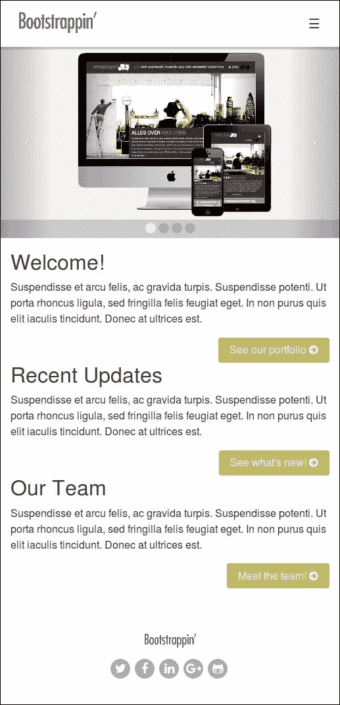

总体来说，这应该为我们的工作提供了一个良好的介绍。轮播图足够高，可以为我们的作品集图片提供足够的视觉空间。快速导航到下面的内容并不困难，用户可以高效地扫描关键选项，以便在内部采取下一步行动。通过将关键链接呈现为漂亮的按钮，我们将为关键操作项建立有用的视觉层次，并确保访客不会因为手指粗大而遇到问题。

为了便于维护，我们选择在这个设计中只有两个主要断点。我们将使用单列布局来适应小于 768 像素的屏幕尺寸。然后，我们将切换到三列布局：

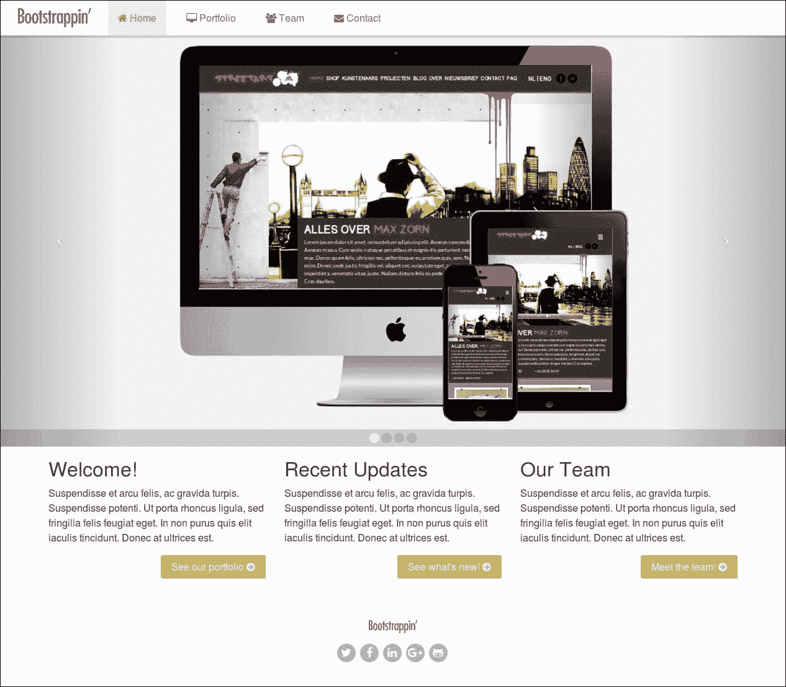

你会在平板电脑和更高版本的模拟图中注意到以下功能：

+   顶部的一个带有图标的导航栏

+   一个全屏版本的主页轮播图，图片拉伸以填充浏览器全宽

+   我们文本内容块的三列布局

+   一个内容居中的页脚

色彩方案相当简单：灰色调，加上金色绿色用于链接和突出显示。

在这些设计目标下，我们可以继续前进，将内容放置到位。

# 检查练习文件

让我们看看这个练习的前几个文件。通过使用 Bootstrap CLI 创建一个新项目。

你可以通过在控制台中运行以下命令来安装 Bootstrap CLI：

```js
npm install -g bootstrap-cli

```

然后，你可以通过运行以下命令来设置你的项目：

```js
bootstrap new 

```

再次，选择一个新的空 Bootstrap 项目。当提示时，选择 Panini、Sass 和 Gulp 选项：

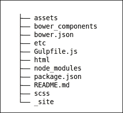

现在你需要做一些添加：

+   创建一个新的 assets/images 文件夹。

+   将 img 文件夹的文件复制到新的 assets/images 文件夹。它包含五张图像：

    +   一个名为 logo.png 的标志图像

    +   四个作品集项目图像

+   向 `Gulpfile.js` 文件中添加一个新任务：

```js
        // Copy assets
        gulp.task('copy', function() {
            gulp.src(['assets/**/*']).pipe(gulp.dest('_site'));
         });
```

+   最后，将前面的任务添加到文件末尾的默认任务中：

```js
         gulp.task('build', ['clean','copy','compile-js','compile
         sass','compile-html']); 

```

包含你的 Panini HTML 模板的 `html` 文件夹应该具有以下文件和文件夹结构：

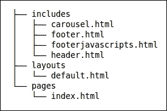

你可以在 [`github.com/zurb/panini`](https://github.com/zurb/panini) 上了解更多关于 Panini 的信息。

以下是在前一个屏幕截图中显示的文件的一些详细信息：

+   `html/pages/index.html` 文件包含以下 HTML 和模板代码：

    +   包含轮播图 (`includes/carousel.html`) 的 `{{> carousel}}` 片段

    +   内容块，如下所示：

```js
              <h2>Welcome!</h2> 
              <p>Suspendisse et a.....</p> 
              <p><a href="#">See our portfolio</a></p> 

```

+   包含在 `layouts/default.html` 中的 `includes/header.html` 文件包含我们的导航栏，并具有以下新的修改：

    +   导航栏项已更新，以反映我们新的网站结构：

```js
        <header role="banner"> 
          <nav class="navbar navbar-light bg-faded" role="navigation"> 
          <a class="navbar-brand" href="index.html">Bootstrappin'</a> 
           <button class="navbar-toggler hidden-md-up pull-xs-right"
         type="button" data-toggle="collapse"
        data-target="#collapsiblecontent"> 
            ? 
          </button> 
          <ul class="nav navbar-nav navbar-toggleable-sm collapse"
         id="collapsiblecontent"> 
            <li class="nav-item"> 
              <a class="nav-link active" href="#">Home <span class="sr-only">
         (current)</span></a> 
             </li> 
            <li class="nav-item"> 
              <a class="nav-link" href="#">Portfolio</a> 
            </li> 
             <li class="nav-item"> 
              <a class="nav-link" href="#">Team</a> 
            </li> 
            <li class="nav-item"> 
              <a class="nav-link" href="#">Contact</a> 
            </li> 
          </ul> 
          </nav> 
        </header> 

```

+   包含在 `layouts/default.html` 中的 `includes/footer.html` 文件包含以下项目：

    +   页脚中的标志

    +   社交链接：

```js
        <footer role="contentinfo"> 

            <p><a href="{{root}}index.html"></a></p> 

            <ul class="social"> 
              <li><a href="#" >Twitter</a></li> 
              <li><a href="#" >Facebook</a></li> 
              <li><a href="#" >LinkedIn</a></li> 
              <li><a href="#" >Google+</a></li> 
              <li><a href="#" >GitHub</a></li> 
            </ul> 

        </footer> 

```

除了导航栏外，还没有添加任何 Bootstrap 类来样式化轮播图、列或图标。

接下来，我们将讨论如何使用 Sass 来自定义你的项目。现在你可以看到 `app.scss` 文件导入了 `includes/_navbar.scss` 文件。

除了前面的修改，你也可以从 `Lesson 8/start` 文件夹中找到的文件开始。在这个文件夹中，首先运行 `npm install` 和 `bower install` 命令。运行 `npm` 和 bower 命令后，你可以运行 `bootstrap watch` 或 `gulp` 命令来在浏览器中查看结果。

你将看到导航栏，然后是作品集图像：

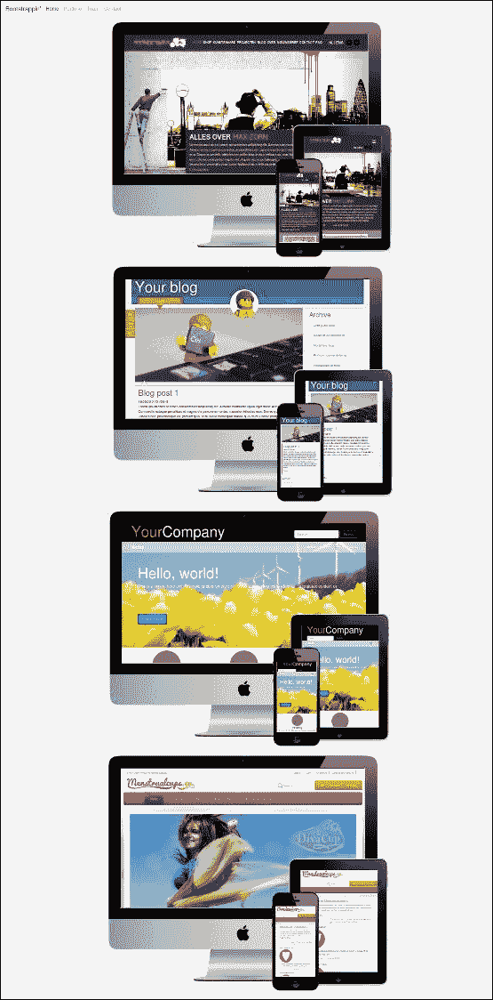

文本块和页脚，包含社交链接，在图像之后：

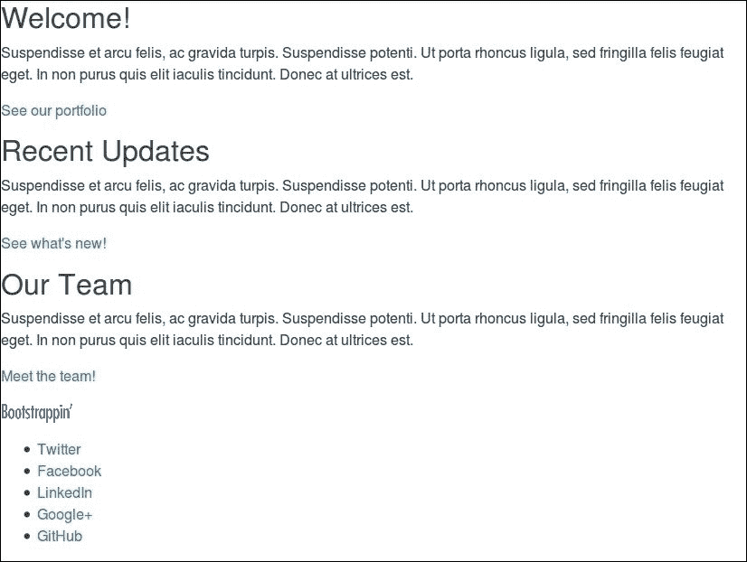

目前还没有太多可说的。让我们开始转换。

我们将首先应用 Bootstrap 类，这样我们就可以快速高效地使用 Bootstrap 的默认 CSS 样式和 JavaScript 行为来建立我们界面元素的基础。

# 标记轮播图

让我们开始制作我们的轮播图，它将在我们的作品集中旋转四张特色图像。

Bootstrap 的轮播图标记结构可以在其文档页面 [`getbootstrap.com/components/carousel/`](http://getbootstrap.com/components/carousel/) 中找到。

按照示例中使用的模式，我们将从这个结构开始设置基本元素。这将包含轮播图的全部部分，然后是进度指示器：

```js
<div id="carousel-feature" class="carousel slide" data-ride="carousel"> 
  <ol class="carousel-indicators"> 
    <li data-target="#carousel-feature" data-slide-to="0" class="active"></li> 
    <li data-target="#carousel-feature" data-slide-to="1"></li> 
    <li data-target="#carousel-feature" data-slide-to="2"></li> 
  </ol> 
</div> 

```

注意，我使用了一个带有 ID (`id="carousel-feature"`) 的 `div` 标签来建立 `carousel` 的基本上下文。`carousel` 类将 Bootstrap 的轮播 CSS 应用到轮播元素上，为轮播指示符、轮播项以及下一页和上一页控制添加适当的样式。

`carousel-feature` ID 必须用于进度指示器的 `data-target` 属性中。这表示 JavaScript 插件将更新具有 `active` 类的当前活动轮播项的指示器。我们已经为第一个指示器提供了该类以开始操作。从那里开始，JavaScript 接管一切。它移除该类，并在轮播循环时将其添加到适当的指示器上。

此外，请注意，`data-slide-to` 的值从 0 开始计数。这是 JavaScript 和其他编程语言的常规行为。只需记住：从零开始计数，而不是从一。

在指示符之后，`carousel-inner` 类的元素紧随其后。这作为包装器来包含所有的轮播项——在这种情况下，是我们的图片。

轮播项位于 `carousel-inner` 内。它们是一组 `div` 标签，每个标签都有 `class="item"`。修改第一个项，使其同时具有 `item` 和 `active` 类，以便一开始就可见。

因此，标记结构如下所示：

```js
<!-- Wrapper for slides --> 

<div class="carousel-inner" role="listbox">
    <div class="carousel-item active"> 
         
    </div> 
    <div class="carousel-item"> 
         
    </div> 
    <div class="carousel-item"> 
         
    </div> 
    <div class="carousel-item"> 
         
    </div> 
</div><!-- /.carousel-inner --> 

```

在轮播项之后，我们需要添加轮播控制。这些将在轮播的左右边缘提供下一页和上一页按钮。在控制之后，我们将使用关闭的 `div` 标签关闭整个标记结构：

```js
<!-- Controls --> 
  <a class="left carousel-control" href="#carousel-feature" role="button" data-slide="prev"> 
    <span class="icon-prev" aria-hidden="true"></span> 
    <span class="sr-only">Previous</span> 
  </a> 
  <a class="right carousel-control" href="#carousel-feature" role="button" data-slide="next"> 
    <span class="icon-next" aria-hidden="true"></span> 
    <span class="sr-only">Next</span> 
  </a> 
</div><!-- /#homepage-feature.carousel --> 

```

### 提示

轮播控制需要使用基本轮播元素的 ID (`#carousel-feature`) 作为它们的 `href` 值。然后，代码看起来是这样的：`<a class="left carousel-control" href="#carousel-feature" role="button" data-slide="prev">`

现在，你可以在文件中写下轮播的完整代码。一旦这段代码就位，如果没有运行 `bootstrap watch`，就运行 `gulp` 命令。Bootstrap 的样式和 JavaScript 应该开始工作。你的图片现在应该作为一个滑动轮播工作！

注意，轮播组件需要 jQuery 和 JavaScript 插件。Gulp 构建过程将 jQuery 和所有插件代码合并到单个 `app.js` 文件中。

默认情况下，轮播每 5 秒滑动一次。让我们将间隔设置为 2 秒，以便我们的用户有时间欣赏我们工作的全部美丽：

1.  创建一个名为 `js/main.js` 的新文件。

1.  添加以下行。我们将从检查页面元素是否就绪的 jQuery 方法开始，然后以 2,000 毫秒的间隔初始化轮播：

    ```js
          $( document ).ready(function() { 
            $('.carousel').carousel({ 
              interval: 2000 
            }); 
          }); 

    ```

1.  注意，你应该自动从 assets 文件夹复制 `js/main.js` 文件并将其链接到文件中，或者将其添加到 `Gulpfile.js` 文件中的 `compile-js` 任务中：

    ```js
          gulp.task('compile-js', function() { 
            return gulp.src([bowerpath+ 
           'jquery/dist/jquery.min.js', bowerpath+ 
           'tether/dist/js/tether.min.js', bowerpath+ 
           'bootstrap/dist/js/bootstrap.min.js','js/main.js']) 
         .pipe(concat('app.js')) 
         .pipe(gulp.dest('./_site/js/')); 
        }); 

    ```

    ### 注意

    你还应该考虑将 js/main.js 文件添加到 Gulp 监视任务中。

1.  保存并重新启动您的应用程序。您将看到间隔已增加到 2 秒。

与我们刚才通过 JavaScript 传递选项不同，您也可以通过数据属性传递它们。轮播图的间隔可以通过 `data-interval` 属性设置：

```js
<div id="carousel-feature" class="carousel slide" data-ride="carousel" data-interval="2000"> 

```

关于此和其他选项，请参阅 Bootstrap 轮播图文档，链接为 [`getbootstrap.com/javascript/#carousel`](http://getbootstrap.com/javascript/#carousel)。

我们将在本章后面部分返回来定制轮播图、其指示器和其图标的样式。在下一节中，您将学习如何使用 JavaScript 和 CSS (SCSS) 来修改轮播图的工作方式。

## 轮播图是如何工作的？

jQuery 插件更改轮播图项的 CSS 类。当页面加载时，第一个项已经具有 `active` 类；当间隔过去后，插件将 `active` 类移动到下一个项，依此类推。该插件不仅更改 `active` 类的位置，还暂时添加 `next` 和 `left` 类。与这些类上的 CSS3 动画一起，创建了滑动效果。您可以在以下 URL 上了解更多关于 CSS3 动画的信息：

[`developer.mozilla.org/en-US/docs/Web/CSS/CSS_Animations/Using_CSS_animations`](https://developer.mozilla.org/en-US/docs/Web/CSS/CSS_Animations/Using_CSS_animations)。

`transition` 被设置为 `carousel-inner` 类，如下所示：

```js
transition: transform .6s ease-in-out; 

```

在这个声明中，`ease-in-out` 值设置了动画的过渡时间函数（过渡效果）；有关更多信息，请参阅 [`developer.mozilla.org/en/docs/Web/CSS/transition-timing-function`](https://developer.mozilla.org/en/docs/Web/CSS/transition-timing-function)。本质上，它允许您建立一个加速度曲线，这样过渡的速度可以在其持续时间中变化。稍后，我们将看到您还可以使用关键帧来描述过渡的不同状态。

执行的转换是 **translate3ds**。`translate3d()` CSS 函数将元素的位置移动到 3D 空间中。更多信息可以在 [`developer.mozilla.org/en-US/docs/Web/CSS/transform-function/translate3d`](https://developer.mozilla.org/en-US/docs/Web/CSS/transform-function/translate3d) 找到。轮播图按照以下方式在 *X*-轴上移动轮播图项：

```js
      &.next, 
      &.active.right { 
        left: 0; 
        transform: translate3d(100%, 0, 0); 
      } 

```

## 通过添加新的动画来更改轮播图

当我们用上一节中描述的另一个动画替换 CSS 动画时，轮播图的滑动效果会改变。

Daniel Ede 的 `Animate.css` 项目包含了许多您可以在项目中使用的 CSS 动画。您也可以将这些动画用于我们的轮播图。您可以在 [`daneden.github.io/animate.css/`](http://daneden.github.io/animate.css/) 找到这个库。

我们可以使用 SCSS 代码创建新的动画。因为我们的构建过程已经运行了 `autoprefixer`，所以你不需要考虑供应商前缀。在我们的示例中，我们将使用 `Animate.css` 库中的 `flipInX` 动画，该动画会在 x 轴上旋转图像。

现在将以下 SCSS 代码添加到 `scss/includes/_carousel.scss` 文件的末尾：

```js
@keyframes flipInX { 
  from { 
    transform: perspective(400px) rotate3d(1, 0, 0, 90deg); 
    animation-timing-function: ease-in; 
    opacity: 0; 
  } 
  40% { 
    transform: perspective(400px) rotate3d(1, 0, 0, -20deg); 
    animation-timing-function: ease-in; 
  } 
  60% { 
    transform: perspective(400px) rotate3d(1, 0, 0, 10deg); 
    opacity: 1; 
  } 
  80% { 
    transform: perspective(400px) rotate3d(1, 0, 0, -5deg); 
  } 
  to { 
    transform: perspective(400px); 
  } 
} 
.flipInX { 
  backface-visibility: visible !important; 
  animation-name: flipInX; 
} 
.carousel-inner { 
  position: relative; 
  width: 100%; 
  overflow: hidden; 

  > .carousel-item { 
    position: relative; 
    display: none; 
    transition: none; 
    backface-visibility: visible !important; 
    animation-name: flipInX; 
    animation-duration: 0.6s; 

    // Account for jankitude on images 
    > img, 
    > a > img { 
      @extend .img-fluid; 
      line-height: 1; 
    } 
  } 
  > .active, 
  > .next, 
  > .prev { 
    display: block; 
  } 
  > .active { 
    top: 0; 
  } 
  > .next, 
  > .prev { 
    position: absolute; 
    left: 0; 
    width: 100%; 
  } 
  > .next { 
    top: 100%; 
  } 
  > .prev { 
    top: -100%; 
  } 
  > .next.left, 
  > .prev.right { 
    top: 0; 
  } 
  > .active.left { 
    top: -100%; 
  } 
  > .active.right { 
    top: 100%; 
  } 
} 
@keyframes flipInX { 
  from { 
    transform: perspective(400px) rotate3d(1, 0, 0, 90deg); 
    animation-timing-function: ease-in; 
    opacity: 0; 
  } 
  40% { 
    transform: perspective(400px) rotate3d(1, 0, 0, -20deg); 
    animation-timing-function: ease-in; 
  } 
  60% { 
    transform: perspective(400px) rotate3d(1, 0, 0, 10deg); 
    opacity: 1; 
  } 

  80% { 
    transform: perspective(400px) rotate3d(1, 0, 0, -5deg); 
  } 
  to { 
    transform: perspective(400px); 
  } 
} 
.flipInX { 
  backface-visibility: visible !important; 
  animation-name: flipInX; 
} 
.carousel-inner { 
  position: relative; 
  width: 100%; 
  overflow: hidden; 

  > .carousel-item { 
    position: relative; 
    display: none; 
    transition: none; 
    backface-visibility: visible !important; 
    animation-name: flipInX; 
    animation-duration: 0.6s; 
    // Account for jankitude on images 
    > img, 
    > a > img { 
      @extend .img-fluid; 
      line-height: 1; 
    } 
  } 
  > .active, 
  > .next, 
  > .prev { 
    display: block; 
  } 
  > .active { 
    top: 0; 
  } 
  > .next, 
  > .prev { 
    position: absolute; 
    left: 0; 
    width: 100%; 
  } 
  > .next { 
    top: 100%; 
  } 
  > .prev { 
    top: -100%; 
  } 
  > .next.left, 
  > .prev.right { 
    top: 0; 
  } 
  > .active.left { 
    top: -100%; 
  } 
  > .active.right { 
    top: 100%; 
  } 
} 

```

如果已经运行了 `bootstrap watch` 或 `gulp` 命令，你可以在浏览器中检查结果。你会发现图像现在在 *x*-轴上旋转。

## Carousel 插件的 JavaScript 事件

Bootstrap 为大多数插件的独特操作提供了自定义事件。Carousel 插件触发 `slide.bs.carousel`（在滑动过渡开始时）和 `slid.bs.carousel`（在滑动过渡结束时）事件。你可以使用这些事件来添加自定义 JavaScript 代码。例如，你可以在事件中通过将以下 JavaScript 添加到 `js/main.js` 文件中来更改页面的背景颜色：

```js
$('.carousel').on('slide.bs.carousel', function () { 
  $('body').css('background-color','#'+(Math.random()*0xFFFFFF<<0).toString(16)); 
}); 

```

注意，`gulp watch` 任务没有设置为 `js/main.js` 文件，所以你必须在完成更改后手动运行 `gulp` 或 `bootstrap watch` 命令。

对于对插件行为的更高级更改，你可以通过使用例如以下 JavaScript 代码来覆盖其方法：

```js
!function($) { 
var number = 0; 
    var tmp = $.fn.carousel.Constructor.prototype.cycle; 
    $.fn.carousel.Constructor.prototype.cycle = function (relatedTarget) {   
        // custom JavaScript code here 
        number = (number % 4) + 1; 
        $('body').css('transform','rotate('+ number * 90 +'deg)'); 
        tmp.call(this); // call the original function 
    }; 

}(jQuery); 

```

此代码设置了没有供应商前缀的 `transform` CSS 属性。autoprefixer 只为你的静态 CSS 代码添加前缀。为了实现全浏览器兼容性，你应该在 JavaScript 代码中自己添加供应商前缀。

### 小贴士

Bootstrap 专门使用 CSS3 进行动画，但 Internet Explorer 9 不支持必要的 CSS 属性。

让我们继续利用 Bootstrap 的默认样式，并为轮播图下方的内联内容设置一个响应式网格。

# 创建响应式列

我们有三个文本块，每个块都有一个标题、一个简短的段落和一个链接。在约平板宽度或更宽的屏幕尺寸下，我们希望这些内容以三列的形式布局。在较窄的屏幕宽度下，内容将组织在一个全宽度列中。

请花点时间访问并阅读 Bootstrap 移动优先响应式网格的文档。您可以在 [`getbootstrap.com/css/#grid`](http://getbootstrap.com/css/#grid) 找到它。

简而言之，网格基于一个 12 列系统。基本的类结构允许我们使用 `col-12` 类实现全宽度，`col-6` 类实现半宽度，`col-4` 类实现三分之一宽度，依此类推。

多亏了媒体查询的创造性使用，Bootstrap 的网格可以非常擅长响应不同的屏幕尺寸。回想一下，我们希望我们的欢迎信息在屏幕尺寸为平板电脑时采用单列布局，然后在约 768 像素的大屏幕上适应三列布局。方便的是，Bootstrap 在 768 像素处有一个内置的断点，这是在 `$grid-breakpoints` Sass 变量中定义的默认值。超过 768 像素是大型范围，从 992 像素开始，也在 `$grid-breakpoints` Sass 变量中定义，然后是超大型屏幕，测量值为 1,200 像素及以上。我将把这些称为 Bootstrap 的超小、小、中、大和超大断点。

使用中等断点，有一个特殊的列类，使用公式 `col-md-`。因为我们希望在小型断点之后有三个列，所以我们将使用 `class="col-md-4"`。在中等断点以下，元素将保持全宽。在其上方，它们将变为三分之一的宽度并并排排列。注意，导航栏在 768 像素处也会折叠。完整的结构如下，其中段落内容被省略以清晰起见：

```js
<div class="container"> 
  <div class="row"> 
    <div class="col-sm-4"> 
    <h2>Welcome!</h2> 
    <p>Suspendisse et arcu felis ...</p> 
    <p><a href="#">See our portfolio</a></p> 
  </div> 
  <div class="col-sm-4"> 
    <h2>Recent Updates</h2> 
    <p>Suspendisse et arcu felis ...</p> 
    <p><a href="#">See what's new!</a></p> 
  </div> 
  <div class="col-sm-4"> 
    <h2>Our Team</h2> 
    <p>Suspendisse et arcu felis ...</p> 
    <p><a href="#">Meet the team!</a></p> 
  </div> 
  </div><!-- /.row --> 
</div><!-- /.container ? 

```

### 注意

你应该在 `html/pages/index.html` 文件中编辑前面的代码。

如果你不太熟悉 `container` 和 `row` 类，以下是它们的作用：

+   `container` 类限制了内容的宽度，并使其在页面中居中

+   `row` 类为我们的列提供包装，允许额外的左右边距用于列间隙

+   `container` 类和 `row` 类都是 `clearfixed`，这样它们可以包含浮动元素并清除任何之前的浮动元素

现在，保存文件，如果你还没有这样做，运行 `bootstrap watch` 或 `gulp` 命令。当你的浏览器宽度超过 768 像素时，你应该会看到以下三列布局形成：

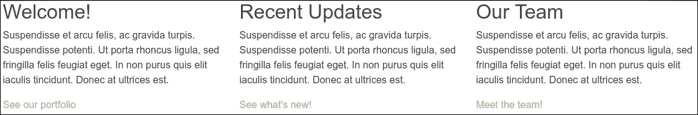

调整浏览器窗口大小至 768 像素以下，你会看到它恢复为单列布局：

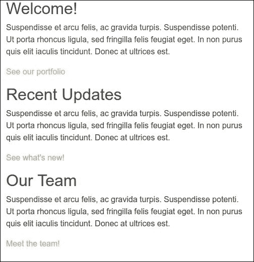

在我们的响应式网格就位后，让我们利用 Bootstrap 的按钮样式将这些链接转换为清晰的行动号召。

# 将链接转换为按钮

将我们的关键内容链接转换为视觉上有效的按钮是直接的。我们将使用的键类如下：

+   `btn` 类将链接样式化为按钮。

+   `btn-primary` 类将按钮的颜色设置为我们的主要品牌颜色。

+   `pull-xs-right` 类将链接浮动到右边，将其移动到更宽的空间，使其成为一个更有吸引力的目标。类名中的 `xs` 部分表示它应该应用于每个比超小断点 0 像素更宽的视口。`pull-md-right` 类仅在视口宽度超过 768 像素时浮动元素。

将这些类添加到我们三个内容块的末尾的链接中：

```js
<p><a class="btn btn-primary pull-xs-right" href="#">See our portfolio</a></p> 

```

保存。你应该会看到以下结果：

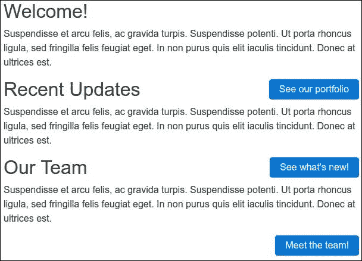

我们已经取得了很大的进步。我们的关键元素正在成形。

在我们的基本标记结构就绪后，我们可以开始处理更细致的细节。达到这个目标将需要一些自定义 CSS。我们将通过利用 Bootstrap 的 Sass 文件的力量来处理这个问题。如果你对 Sass 不熟悉，不用担心！我会一步步带你了解。

# 理解 Sass 的强大功能

在接下来的几节中，我们将组织、编辑、自定义和创建 SCSS 文件，以生成我们设计所需的 CSS。

### 注意

如果你不太熟悉 Sass 并且想了解更多关于 Sass 的信息，我建议阅读我的 *Sass and Compass Designer's Cookbook* 书籍 ([`www.packtpub.com/web-development/sass-and-compass-designers-cookbook`](https://www.packtpub.com/web-development/sass-and-compass-designers-cookbook)) 或 [`www.sass-lang.com/`](https://www.sass-lang.com/) 的文档。

简而言之，我们可以这样说，使用 Sass 预处理器生成 CSS 是一种令人兴奋和自由的体验。Sass 的工作优势将在下一节中讨论。

# 根据我们的需求自定义 Bootstrap 的 Sass

当我们与 Bootstrap 的 Sass 文件一起工作时，我们将通过以下方式对它们施加相当大的控制：

+   组织我们的 `scss` 文件夹，以便我们能够灵活自由地完成所需的工作，同时使未来的维护更加容易

+   自定义 Bootstrap 的 Sass 变量

+   创建我们自己的几个自定义 Sass 文件

+   在我们的网站资源中整合一组基于字体的图标，提供我们社交媒体链接所需的图标

换句话说，我们将做的不仅仅是学习和应用 Bootstrap 的约定。我们将使它们按照我们的意愿弯曲。

在本章的练习文件中，打开 `scss` 目录。在里面，你应该看到以下结构：

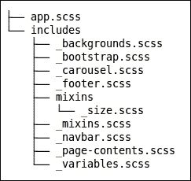

为了为接下来的内容做准备，我已经通过解释新的组织层来给你一个先发优势。所有的 Bootstrap Sass 文件都保存在 `bower_components/bootstrap/scss/` 文件夹中。你不应该修改这些文件；你可以（重新）使用它们，如下一节所述。保持原始文件不变，使你能够在不撤销修改的情况下更新 Bootstrap。

首先，`app.scss` 文件导入两个部分文件：

```js
@import "includes/variables"; 
@import "includes/bootstrap"; 

```

文件 `includes/_bootstrap.scss` 是原始 `bootstrap.scss` 文件的修改版。此文件导入所有其他原始 Bootstrap 文件，并在编译过程中使用，以从所有导入的 Sass 文件中创建一个统一的样式表。文件 `includes/_variables.scss` 是原始 `_variables.scss` 文件的修改版。此文件包含所有 Bootstrap 的 Sass 变量的声明。因为 `includes/_variables.scss` 文件在原始 `_variables.scss` 文件之前导入，所以其中的变量可以用来覆盖 Bootstrap 的默认设置。

为什么要费这个劲？因为我们很快就会修改 Bootstrap 的默认设置，并创建我们自己的自定义 Sass 文件。当我们这样做时，我们可以保持`Bootstrap`文件夹及其文件不变，同时在我们将要创建的自定义文件中进行调整。

让我们开始定制！我们将从定制 Bootstrap 的变量并添加一些我们自己的新变量开始。

## 定制变量

接下来，我们将创建 Bootstrap 变量文件的副本，并根据自己的需求进行定制：

1.  在`scss`文件夹中找到`includes/_variables.scss`文件，并在你的编辑器中打开它。

1.  在浏览这个文件的每一行时，你会看到用于设置 CSS 值的变量，从基本的颜色到主体背景、字体族、导航栏高度和背景等，应有尽有。这看起来非常美观。而且，玩弄这些变量更有趣。在我们开始玩弄之前，让我们创建这个文件的副本，这样我们就可以保留 Bootstrap 的默认变量，以防我们以后想恢复到它们。

接下来，让我们实现我们的新配色方案：

1.  在我们新的`includes/_variables.scss`文件的最顶部部分，你会看到 Bootstrap 的默认灰度和品牌颜色变量：

    ```js
          $gray-dark:                 #373a3c; 
          $gray:                      #55595c; 
          $gray-light:                #818a91; 
          $gray-lighter:              #eceeef; 
          $gray-lightest:             #f7f7f9; 

    ```

1.  我们有我们想要的特定值。所以，让我们简单地替换我们想要的值（如果你喜欢，可以自由地进行计算！）然后，我们将添加两个额外的变量来涵盖我们需要的完整范围。结果如下：

    ```js
          $gray-dark:              #454545; 
          $gray:                   #777; 
          $gray-light:             #aeaeae; 
          $gray-lighter:           #ccc; 
          $gray-lightest:          #ededed; 

    ```

1.  接下来，我们将更新`Brand colors`下的`$brand-primary`变量。我们将将其调整为我们的金色色调：

    ```js
          // Brand colors 
          // ------------------------- 
          $brand-primary:         #c1ba62;
    ```

1.  当你运行 bootstrap watch（或 gulp）命令时，浏览器会在保存`includes/_variables.scss`文件后自动重新加载。

如果这样做成功，最明显的改变将是链接颜色和具有`btn-primary`类的按钮，它们都将采用新的`$brand-primary`颜色。

## 定制导航栏

现在，让我们编辑设置导航栏高度、颜色和悬停效果的变量。

让我们从更改高度开始。默认情况下，导航栏的填充是`$spacer / 2`，总高度由字体大小和垂直填充决定。

在本地的`includes/_variables.scss`文件中，搜索`$navbar-padding-vertical`变量，并按以下方式更新它。这将扩展导航栏的高度：

```js
$navbar-padding-vertical: $spacer; 

```

现在，我们可以设置导航栏的背景颜色。原始的`html/includes/headers.html`文件中的 HTML 代码有一个`bg-faded`类。因为我们想让导航栏有白色背景，所以我们可以简单地删除这个类；主体已经有白色背景，不设置导航栏的背景属性也会使导航栏变成白色。

你也可以使用 Sass 和 Bootstrap 的混入来生成一个新的`bg-white`类。创建一个新的文件`scss/includes/_backgrounds.scss`，并将以下 SCSS 代码编辑到其中：

```js
@include bg-variant('.bg-white', #fff); 

```

注意，`bg-variant` 混合器使用 `!important` 声明了 `background-color` 和 `color` 属性。因为 `color` 属性默认设置为 `#fff`（白色），所以使用 `bg-variant` 混合器似乎不是最灵活的解决方案。在 `scss/includes/_navbar.scss` 文件中为导航栏选择器设置 `background-color` 属性是一个更好的解决方案。你可以按照以下方式设置 `background-color` 属性：

```js
.navbar { 
 background-color: #fff; 
} 

```

导航栏链接的颜色由 `.navbar-light` 或 `.navbar-dark` 类设置。你应该为具有深色背景的导航栏使用 `.navbar-dark` 类，为浅色背景使用 `.navbar-light` 类。我们 `html/includes/header.html` 文件中的导航栏已经具有 `.navbar-light` 类，因此为了更改链接颜色，你将不得不修改 `includes_variables.scss` 文件中的 `$navbar-light-*` 变量，如下所示：

```js
    $navbar-light-color:            $gray; 
    $navbar-light-hover-color:      $link-hover-color; 
    $navbar-light-active-color:     $link-hover-color; 
    $navbar-light-disabled-color:   $gray-lighter; 

```

注意，我们之前已经更改了 `$gray` 和 `$gray-lighter` 变量，并且 `$link-hover-color` 变量的值与 `$brand-primary` 变量相同，我们将其设置为 `#c1ba62;` 颜色值。

如果你喜欢为悬停和活动链接使用不同的背景颜色，你可以使用你喜欢的文本编辑器打开 `scss/includes/_navbar.scss` 文件并执行以下步骤：

1.  首先，使用以下 SCSS 代码删除垂直填充：

    ```js
          .navbar { 
            padding-top: 0; 
            padding-bottom: 0; 
          } 

    ```

1.  现在应用 `.nav-link` 选择器的填充，并设置悬停和活动状态下的背景颜色：

    ```js
            .navbar { 
              .nav-link 
              { 
                padding: $spacer;   
                &:hover, 
                &.active { 
                  background-color: $gray-lightest; 
                } 
              } 
            } 

    ```

1.  因为 `.navbar-brand` 有更大的字体大小，所以你必须为这个选择器调整填充：

    ```js
          .navbar { 
            .navbar-brand { 
              padding: ($spacer - ((($font-size-lg - $font-
                size-base) * $line-height) / 2)); 
            } 
          } 

    ```

如果你还没有运行 `bootstrap watch` 命令，现在运行它，你应该在你的导航栏中看到以下新功能：

+   它应该增加大约 16 像素（2 x 1em）的高度

+   其背景颜色应变为白色

+   导航项背景在悬停和活动状态下会改变

+   链接文本应在悬停和活动时激活我们的品牌主色，如下面的截图所示：

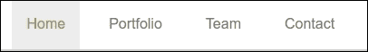

现在，让我们将我们的标志图像放置到位。

# 添加标志图像

在 `assets/images` 文件夹中找到 `logo.png` 文件。你可能注意到其尺寸很大，宽度为 900 像素。在我们的最终设计中，它将只有 120 像素宽。因为像素将被压缩到更小的空间中，这是确保图像在所有设备上看起来都很好的一种相对简单的方法，包括视网膜显示屏。同时，该图像的文件大小已经为网络优化，仅为 19 KB。

因此，让我们将其放置到位并限制其宽度：

1.  在你的文本编辑器中打开 `html/includes/header.html` 文件。

1.  在导航栏标记中搜索此行：

    ```js
          <a class="navbar-brand"
           href="index.html">Bootstrappin'</a> 

    ```

1.  将上一步的 HTML 替换为以下图像标签，包括其 `alt` 和 `width` 属性：

    ```js
          <a class="navbar-brand" href="index.html"></a> 

    ```

    ### 提示

    一定要包含宽度属性，将其宽度设置为 120 像素。否则，它将在页面上显得非常大。

如果你还没有运行 `bootstrap watch` 命令，现在运行它。你应该看到标志已经放置到位：


您可能会注意到导航栏的高度已经增加，并且其底部边缘不再与活动导航项的底部边缘对齐。这是由于之前围绕`bar-brand`类放置的填充造成的。我们需要调整适当的填充值。我们可以在几个快速步骤中做到这一点：

1.  使用您的文本编辑器再次打开`scss/includes/_navbar.scss`文件。按照以下方式更改`bar-brand`类的填充：

    ```js
    padding: ($spacer - ((2.16rem - ($font-size-base * $line-height)) / 2));
    ```

1.  当将图像宽度调整为 120 像素时，其高度变为大约 34.51 像素，34.51 / 16 = 2.16 rem。

Sass 的力量继续给人留下深刻印象。当然，我们也应该注意折叠的响应式导航，所以将浏览器窗口调整到小于 768 像素的视口大小。

导航现在应该看起来如下截图所示：

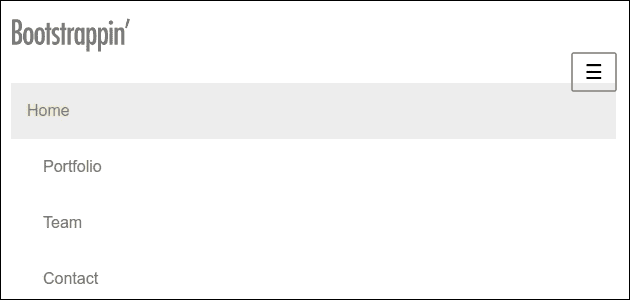

您会看到标志周围的填充不足，切换按钮也没有与标志对齐。我们将再次使用 Sass 来纠正这些问题。再次打开**s**`css/includes/_navbar.scss`文件。请记住，我们之前将导航栏的垂直填充设置为 0。现在将此声明包裹在一个 CSS 媒体查询中，如下所示，以仅适用于较大的视口：

```js
  @include media-breakpoint-up(md) { 
    padding-top: 0; 
    padding-bottom: 0; 
  } 

```

如前所述，`media-breakpoint-up`混合是 Bootstrap Sass 混合的一部分，可以根据 Bootstrap 的媒体查询范围隐藏或显示元素。前面的 SCSS 代码编译成 CSS 如下：

```js
@media (min-width: 768px) { 
  .navbar { 
    padding-top: 0; 
    padding-bottom: 0; 
  } 
} 

```

要使标志与切换按钮对齐，您必须将标志图像的`display`属性从`block`更改为`inline-block`。您可以通过编辑`scss/includes/_navbar.scss`文件中的以下 SCSS 代码来实现这一点：

```js
.navbar { 
  @include media-breakpoint-down(sm) { 
    .navbar-brand, 
    .nav-item { 
      float: none; 
      > img { 
        display: inline-block; 
      } 
    } 
  } 
} 

```

最后，检查您最新的`scss/includes/_navbar.scss`文件。在您的浏览器中，结果应该如下截图所示：

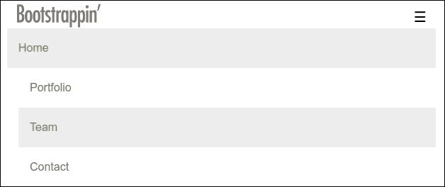

现在，让我们添加图标功能。

# 添加图标

是时候给我们的导航添加图标了。Bootstrap 3 附带的一些**Glyphicons**在 Bootstrap 4 中被删除了。在这里，我们将使用由**Font Awesome**提供的庞大图标库。其他图标字体集可以在网上找到。

Font Awesome 是在编写本书时提供 628 个图标的字体图标集。Font Awesome 图标是免费、开源的，并且旨在与 Bootstrap 良好协作。您可以在[`fortawesome.github.io/Font-Awesome/`](http://fortawesome.github.io/Font-Awesome/)查看 Font Awesome 的主页。

让我们将 Font Awesome 整合到我们的工作流程中。

在这里，我们将 Font Awesome 的 CSS 代码编译到我们的主`app.css`文件中：

1.  首先，通过在控制台中运行以下命令，在您的项目文件夹中安装 Font Awesome：

    ```js
     bower install font-awesome --save

    ```

1.  之后，您可以将 Font Awesome 的主 SCSS 文件导入到您的`scss/app.scss`文件中：

    ```js
          @import "includes/variables"; 
     @import "font-awesome/scss/font-awesome.scss"; 
          @import "includes/bootstrap"; 
          @import "includes/navbar"; 

    ```

1.  最后但同样重要的是，将字体文件复制到您的资产文件夹中：

    ```js
          cp bower_components/font-awesome/fonts/*
           assets/fonts/ 

    ```

1.  Font Awesome 的`scss`文件包括一个变量，指定了 Font Awesome 网络字体的路径。我们需要检查以确保此变量与我们的文件夹结构匹配。确保在`our scss/includes/_variables.scss`文件中将`$fa-font-path`变量设置为`../fonts`，如下所示：

    ```js
             $fa-font-path:    "../fonts"; 

    ```

    ### 注意

    此路径相对于编译后的 CSS 文件，该文件位于我们的`css`目录中

    现在，在`html/includes/header.html`文件中，让我们更新团队导航项的图标，使用名为`fa-group`的 Font Awesome 图标。我们还需要独立的`fa`类：`<i class="fa fa-group"></i> 团队`

1.  将此更改保存到`html/includes/header.html`文件中，并刷新你的浏览器。

如果一切按预期工作，你应该会看到以下结果：


### 小贴士

如果你看到一个奇怪的符号或什么都没有，那是一个迹象，表明网络字体没有通过。请确保你的图标类是正确的（包括`fa`类），Font Awesome 网络字体文件位于你的字体目录中，并且路径在`scss/includes/_variables.scss`文件中设置正确。

现在更新`html/includes/header.html`文件中的图标标记，以便使用所需的 Font Awesome 图标。

Font Awesome 图标页面[`fortawesome.github.io/Font-Awesome/icons/`](http://fortawesome.github.io/Font-Awesome/icons/)允许你扫描你的选项。我们的原型在导航栏中需要这些图标：

```js
<i class="fa fa-home"></i> Home 
<i class="fa fa-desktop"></i> Portfolio 
<i class="fa fa-group"></i> Team 
<i class="fa fa-envelope"></i> Contact 

```

这会产生以下结果：

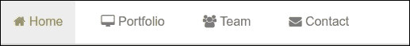

这完成了我们的导航，或者几乎完成了。我们无意中创建了一个小问题，在继续之前我们需要修复它。

是时候转向轮播了。

# 样式化轮播

我们将采用 Bootstrap 的默认轮播样式，并应用一些重要的自定义。让我们创建一个新的`_scss/includes/carousel.scss`文件，并将其导入到我们的`scss/app.scss`文件中。

现在开始定制和美化。

## 添加顶部和底部填充

让我们在`.carousel`元素本身添加一些顶部和底部填充，并使用我们的`@gray-lighter`颜色作为背景色：

```js
.carousel { 
  padding-top: 4px; // added 
  padding-bottom: 28px; // added 
  background-color: @gray-lighter; // added 
} 

```

保存更改并重新加载（运行`bootstrap watch`或`gulp`命令），你会在我们新创建的空间中看到浅灰色背景出现在轮播图像的上方和下方。这为它们提供了些许框架，使它们从上方和下方的其他元素中脱颖而出。稍后，我们将利用额外的底部填充将轮播指示器定位，以便它们能够更加清晰地突出显示。

现在来样式化轮播指示器。

## 重新定位轮播指示器

轮播指示器用于告知用户轮播中有多少张幻灯片，并突出显示当前旋转的位置。目前，这些指示器几乎看不见，位于我们投资组合图像的底部中心边缘附近：

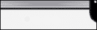

注意，我已经临时将边框颜色设置为白色，以便前面的图片如下所示：

```js
.carousel-indicators li {     
  border: 1px solid white; 
} 

```

让我们将这些指示器移动到它们自己的空间，就在图像下方：

1.  我们希望将指示器向下移动，使其更靠近底部边缘，进入我们之前添加填充所创建的浅灰色区域。因此，让我们调整底部定位。此外，我们需要通过将其设置为 0 来移除默认的底部边距。在 `_scss/includes/carousel.scss` 文件中写下以下 SCSS 代码：

    ```js
          .carousel-indicators { 
           position: absolute; 
            bottom: 0; 
            margin-bottom: 0; 
          } 

    ```

1.  保存文件；如果你已经运行了 `bootstrap watch` 命令，你的浏览器将自动重新加载。

这就得到了我们想要的结果。指示器现在在所有屏幕尺寸上都保持在期望的空间中：

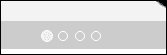

现在我们将更新它们的外观，使它们更大，更容易看到。

## 调整指示器的样式

我们将通过使用我们的灰色变量来使我们的轮播指示器更明显。我们还将稍微增加它们的大小。我们可以在 `scss/includes/_variables.scss` 文件中开始这样做：

1.  在 `scss/includes/_variables.scss` 中，在 `$carousel-control` 变量之后，你会找到两个以 `$carousel-indicator` 开头的变量：

    ```js
             $carousel-indicator-active-bg:          #fff; 
             $carousel-indicator-border-color:       #fff; 

    ```

    这些用于在默认指示器周围提供白色边框，并填充活动指示器的背景颜色。

1.  在这里添加一个默认背景颜色变量，这样我们就可以用我们的 `$gray-light` 值填充默认指示器：

    ```js
            $carousel-indicator-bg:          $gray-light; 

    ```

1.  然后，我们将更新活动背景颜色：

    ```js
            $carousel-indicator-active-bg:    $gray-lightest; 

    ```

1.  最后，我们将使边框颜色透明：

    ```js
            @carousel-indicator-border-color: transparent; 

    ```

1.  保存，编译，并刷新。

目前，这会使除了活动项之外的所有项都不可见：

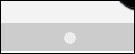

现在让我们在 `_scss/includes/_carousel.scss` 文件中做一些工作：

1.  在 `_scss/includes/_carousel.scss` 文件中，移动到之前工作的 `.carousel-indicator` 规则的第一组：

    ```js
              .carousel-indicators { 
                position: absolute; 

    ```

1.  在它下面寻找嵌套的 `li` 选择器。在这里，我们将编辑几个值。具体来说，我们将执行以下操作：

    +   将宽度和高度增加到 16px

    +   移除边距

    +   使用我们新创建的变量 `$carousel-indicator-bg` 添加背景颜色

    +   完全移除边框线（我们为边框变量设置的透明值现在只是一个安全措施）

    +   我已经在以下代码片段中实现了这些更改：

    ```js
                   .carousel-indicators {
                   position: absolute;
                   bottom: 0;
                   margin-bottom: 0;
                   li {
                   background-color: $carousel-indicator-bg;
                   &,
                  &.active {
                  border: 0;
                  height: 16px;
                  width: 16px;
                  margin: 0;
                 }
                }
                }
    ```

1.  在 Bootstrap 的默认 CSS 中，活动指示器比普通指示器（12 px）略大；因此，你必须为普通和活动指示器设置新的尺寸（16 px）。你可以通过使用 Sass 和父引用，如前面的代码片段中所做的那样来完成这个任务。考虑以下 SCSS 代码片段：

    ```js
           .selector { 
            &, 
            &.active, 
            &.otherstate { 
              property: equal-for-all-states; 
            } 
          } 

    ```

1.  这段 SCSS 代码编译成如下所示的 CSS 代码：

    ```js
          .selector, .selector.active, .selector.otherstate { 
            property: equal-for-all-states; 
          } 

    ```

保存并查看结果！

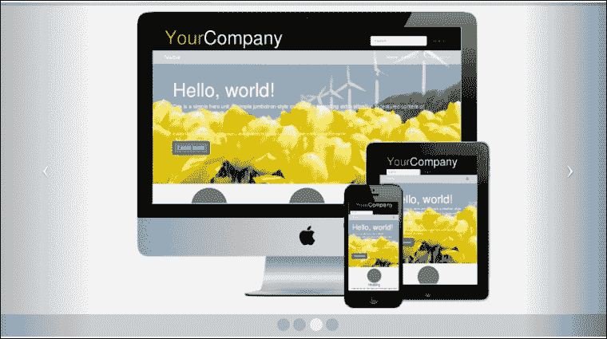

轮播调整完成！在这个过程中，我们学到了很多——关于 Bootstrap 的很多，也许还有一点关于 Sass。

让我们继续到下一部分。剩下的部分相当简单。

# 调整列及其内容

让我们进一步调整三个标题**欢迎**！、**最新更新**和**我们的团队**下的内容块：

1.  首先，让我们将这些三个块中的按钮添加上箭头圆圈图标。回想一下，我们正在使用 Font Awesome 来选择图标。

1.  访问 Font Awesome 文档，[`fortawesome.github.io/Font-Awesome/icons/`](http://fortawesome.github.io/Font-Awesome/icons/)。您将找到我们需要的图标：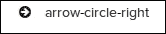

1.  在`html/pages/index.html`文件中，为每个链接内部添加一个带有适当类别的`i`标签。这是第一个例子，我已经通过在元素之间添加额外的换行符来使其间隔更开：

    ```js
          <p> 
            <a class="btn btn-primary pull-right" href="#"> 
              See our portfolio  <i class="fa fa-arrow-circle- 
                right"></i> 
            </a> 
          </p> 

    ```

1.  对每个链接重复此操作。

现在，您应该在三个按钮中看到所需的图标：

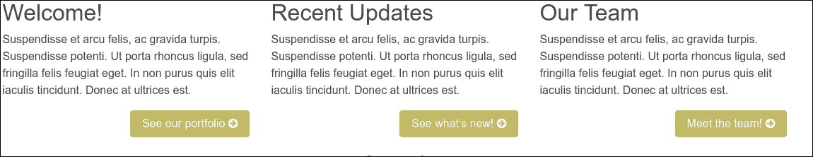

在此同时，让我们在轮播和这段文字部分之间添加一点垂直填充。目前，它们之间的间隔相当紧凑。

此时出现的问题是，在哪里最好地编写我们将需要的样式；在页面内容部分添加额外的填充可能现在和将来都会成为我们的常规做法。让我们创建一个 Sass 文件来保存这些以及其他对页面普通内容的调整（实际上，我们还需要这个文件来进行一个额外的、更重要的响应式调整，所以这样做似乎是合理的）：

1.  创建一个名为`scss/includes/_page-contents.scss`的文件。

1.  将其保存在您的`scss`文件夹中，与您的其他自定义 Sass 文件放在一起：

    ```js
          <image of the directory scss> 

    ```

1.  注释文件：

    ```js
          // 
          // Page Contents 
          // -------------------------- 

    ```

1.  现在，让我们为这个目的创建一个合理的类，并添加我们想要的填充，包括底部的一些填充：

    ```js
          .page-contents { 
            padding-top: 20px; 
            padding-bottom: 40px; 
          } 

    ```

1.  保存文件。

1.  将`scss/includes/_page-contents.scss`文件添加到`scss/main.scss`文件中的导入部分。我将在文件底部附近添加一个新的部分，并添加一个有用的注释以供定位：

    ```js
          // Other custom files 
          @import "includes/page-contents"; 

    ```

1.  现在让我们将必要的类添加到我们的标记中。打开`html/pages/index.html`文件，并将类`page-contents`添加到紧跟在轮播之后的具有`container`类的`div`中：

    ```js
                {{> carousel}}<!-- /#homepage-feature.carousel --> 
                <div class="page-contents container"> 
                  <div class="row"> 

    ```

保存，您应该看到添加的填充。

接下来，我们需要整理这些块在窄屏幕视图中的外观。注意，当以单列布局查看时，标题没有清除浮动的按钮：

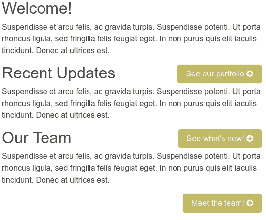

解决这个问题有点棘手。我们可能想在包含这三个块的`div`中添加一个清除浮动的样式。然而，这不会起作用，因为我们需要这些块在视窗宽度达到 768 像素或更高时并排浮动。

这需要使用媒体查询。知道我们的三列视图从中等断点开始，即 768 像素，让我们设置一个规则，当窗口宽度低于此断点 1 像素时清除浮动。如前所述，我们可以使用 Bootstrap 的 Sass 媒体查询混合来实现这一点。

在此过程中，我们还可以给我们的列添加一些底部填充，以便在堆叠时有更多的垂直空间。

在媒体查询混合中，我们将添加一个 CSS2 属性选择器来选择所有包含`col-`类的元素，以便相同的规则适用于任何大小的列：

```js
.page-contents { 
  padding-top: 20px; 
  padding-bottom: 40px; 

  @include media-breakpoint-down(sm) { 
    [class*="col-"] { 
      clear: both; 
      padding-bottom: 40px; 
    } 
  } 
} 

```

保存。结果是大幅改进！

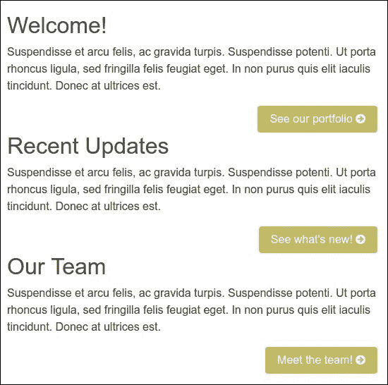

现在好多了！现在让我们继续处理页脚！

# 设置页脚样式

页脚最大的特点是我们的社交图标。Font Awesome 来帮忙！

咨询 Font Awesome 文档，我们发现**品牌图标**类别下有一系列可用的图标。这里是直接链接：[`fortawesome.github.io/Font-Awesome/icons/#brand`](http://fortawesome.github.io/Font-Awesome/icons/#brand)

现在我们只需要将页脚中每个社交链接的文本在`html/includes/footer.html`文件中替换为`i`元素，并使用适当的类：

```js
<ul class="social"> 
  <li><a href="#" ><i class="fa      fa-twitter"></i></a></li> 
  <li><a href="#" ><i class="fa      fa-facebook"></i></a></li> 
  <li><a href="#" ><i class="fa      fa-linkedin"></i></a></li> 
  <li><a href="#" ><i class="fa fa-     google-plus"></i></a></li> 
  <li><a href="#" ><i class="fa fa-     github-alt"></i></a></li> 
</ul> 

```

这个更新的标记将我们的图标放置到位：

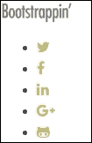

现在，执行以下步骤以水平排列它们并将它们居中对齐：

1.  创建一个新文件`scss/includes/_footer.scss`来管理这些样式。

1.  将文件保存到`scss`目录。

1.  在`__main.less`文件中为该文件添加一个导入变量：

    ```js
          // Other custom files 
          @import "includes/navbar"; 
          @import "includes/carousel"; 
          @import "includes/page-contents"; 
     @import "includes/footer";

    ```

现在我们将编写所需的样式。让我简单列出它们，然后说明它们的作用：

```js
// 
// Footer 
// -------------------------- 

ul.social { 
  margin: 0; 
  padding: 0; 
  width: 100%; 
  text-align: center; 
  > li { 
    display: inline-block; 
    > a { 
      display: inline-block; 
      font-size: 18px; 
      line-height: 30px; 
      @include square(30px); // see includes/mixins/_size.scss 
      border-radius: 36px; 
      background-color: $gray-light; 
      color: #fff; 
      margin: 0 3px 3px 0; 
      &:hover, 
    &:focus    { 
        text-decoration: none; 
        background-color: $link-hover-color; 
      } 
    } 
  } 
} 

```

因为 Bootstrap 试图在 Sass 中避免元素和子选择器，你可以考虑将前面的 SCSS 代码重写如下：

```js
.social { 
  margin: 0; 
  padding: 0; 
  width: 100%; 
  text-align: center; 
} 

.social-item { 
 display: inline-block; 
} 

.social-link { 
  display: inline-block; 
  font-size: 18px; 
  line-height: 30px; 
  @include square(30px);  
  // see includes/mixins/_size.scss 
  border-radius: 36px; 
  background-color: $gray-light; 
  color: #fff; 
  margin: 0 3px 3px 0; 
  @include hover-focus { 
    // bootstrap/scss/mixins/_hover.scss 
    text-decoration: none; 
    background-color: $link-hover-color; 
    color: #fff; 
  } 
} 

Here's what's happening:

*   The normal margin and padding is stripped away from the `ul`
*   It is stretched to 100 percent width
*   Its content is center aligned
*   The list items are displayed inline to the block, thereby centering them
*   The links are displayed inline to block, so that they fill up their available space
*   The font size and line height are increased
*   The width and height are set to 30px square, using a custom mixin (note that this mixin is copied from Bootstrap 3)
*   To see this mixin, open `includes/mixins/_size.scss`, and you'll find the following relevant lines:

```

// 尺寸快捷方式

@mixin size($width, $height) {

宽度：$width;

高度：$height;

}

@mixin square($size) {

@include size($size, $size);

}

```js

*   The `border-radius` property is set large enough to make the icons and their backgrounds appear circular
*   The `background-color`, `color`, and `margin` properties are set
*   The underline is removed from the hover and focus states, and the background color is altered to a lighter gray

With these steps done, let's polish off the footer by adding a healthy bit of top and bottom padding, and then center aligning the content in order to move our logo to the center, above the social icons:

```

footer[role="contentinfo"] {

顶部填充：24px;

底部填充：36px;

文本居中；

}

```js

The result is as follows:
```

# 推荐的下一步

我强烈建议在将此类项目投入生产之前，至少采取一个额外的步骤。你必须花时间优化你的图片、CSS 和 JavaScript。这些步骤并不困难：

+   压缩图片只需一点时间，并且它解决了页面脚部占用空间最大的单一原因。我已经使用了 Photoshop 的“保存到网页”进程选项，但很可能你还能挤出更多字节。在代码文件夹（`Build Process Manual`）中，你可以看到如何将图像压缩任务添加到你的 gulp 构建过程中。

+   此外，我们迫切需要从`scss/includes/_bootstrap.scss`文件中的导入序列中删除不必要的 Bootstrap Sass 文件，然后压缩生成的`main.css`文件。

+   最后，我们需要通过用仅使用我们实际使用的三个插件的压缩版本替换 Bootstrap 的全面`bootstrap.min.js`文件来精简我们的`plugins.js`文件：`carousel.js`、`collapse.js`和`transitions.js`。然后我们压缩最终的`plugins.js`文件。

结合这些步骤，可以将这个网站的足迹减少大约一半。在速度至上的时代——无论是为了用户保留还是为了 SEO 排名——这都意义重大。

此外，还有另一个非常合理的步骤你可能想要采取：我们知道触控设备用户欣赏能够通过滑动来前进和后退通过轮播的功能。

但是，对于当前的时刻，让我们停下来庆祝一下。

# 摘要

让我们回顾一下在本章中我们取得了哪些成果。我们通过使用 Bootstrap CLI 启动了一个新的 Bootstrap 项目，该项目由 Panini、Sass 和 Gulp 提供支持。之后，我们利用了 Bootstrap 的响应式导航栏、轮播和网格系统，并自定义了 Bootstrap 的一些 Sass 代码和混入。你还学会了如何创建自己的 Sass 文件，并将它们无缝地整合到项目中。最后但同样重要的是，你将 Font Awesome 图标整合到我们的工作流程中。最终，通过实施一个深思熟虑的文件组织方案，我们改进了网站的后期维护——这一切都没有产生代码冗余。

在积累了这些经验之后，你将能够按照自己的意愿弯曲 Bootstrap，利用其力量加速网站开发，并随心所欲地定制设计。在未来的章节中，我们将进一步扩展你的经验。然而，首先，让我们将这个设计应用到创建一个复杂的商业主页。

# 评估

1.  以下哪个类将把我们的主要品牌颜色应用到按钮上？

    1.  `btn-primary`

    1.  `button-primary`

    1.  `btn`

    1.  `bttn-primary`

1.  以下哪个是`media breakup`点的正确代码？

    1.  `.include media-breakpoint-up(md) {padding-top: 0,padding-down: 0;}`

    1.  `@include media-breakpoint-up(md) {padding-top: 0;padding-bottom: 0;}`

    1.  `$include media-breakpoint-up(md) {padding-up: 0,padding-bottom: 0;}`

    1.  `&includes media-breakpoint-up(md) {padding-top: 0,padding-bottom: 0,}`

1.  哪个类会将链接浮动到右边，使其移动到更宽的空间，从而使其成为一个更具吸引力的目标？

    1.  `pull-xs-right`

    1.  `pulls-xs-right`

    1.  `pull-right`

    1.  `pulls-xl-right`

1.  以下哪个陈述是关于使用灰色颜色在 Bootstrap 中样式化元素的正确说法？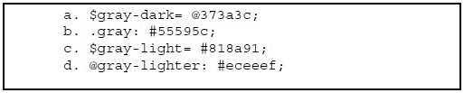

    1.  a 和 c

    1.  只有 c

    1.  只有 d

    1.  只有 a

1.  在以下语法中，`'?'`的位置应该是什么：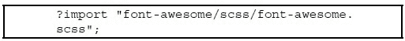

    1.  `.`

    1.  `#`

    1.  `@`

    1.  `$`
