# 第九章。启动商业

我们已经建立了我们的投资组合网站。现在，是时候用一些展示我们能力范围的项目来充实我们的投资组合了。让我们现在转向设计一个复杂的商业主页。

花点时间调查成功企业的主页，例如这些：

+   Zappos ([`www.zappos.com`](http://www.zappos.com))

+   Amazon ([`www.amazon.com`](http://www.amazon.com))

+   Adobe ([`www.adobe.com/`](http://www.adobe.com/))

+   HP ([`www.hp.com`](http://www.hp.com))

虽然每个都有自己的方法，但这些网站共同之处在于它们管理了相当大的复杂性。

我们可以通过将网站分解为以下三个类别来掌握一些常见功能，这些类别基于页面区域：

+   **横幅**/**页眉**：这部分包含标志、带有下拉菜单的主要导航、次要或实用导航，以及登录或注册选项

+   **主要内容区域**：这部分具有至少三个列的复杂布局，如果不止三个

+   **页脚**：这里充满了多列的链接和信息

让我们展示我们管理这种复杂程度的能力。为此，我们将充分利用 Bootstrap 的响应式 12 列网格系统。

在中等和宽视口中查看时，以下是我们将创建的设计：

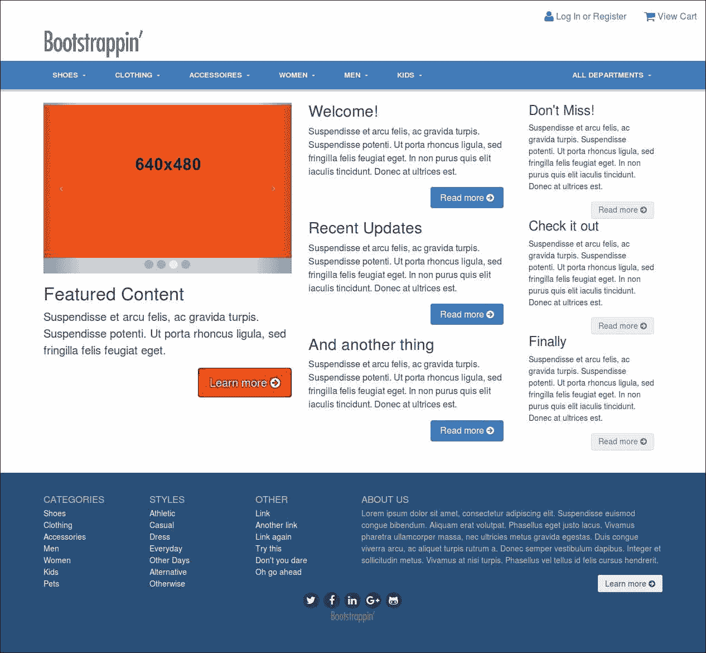

在狭窄的视口中，它将适应得相当多，如下面的截图所示：

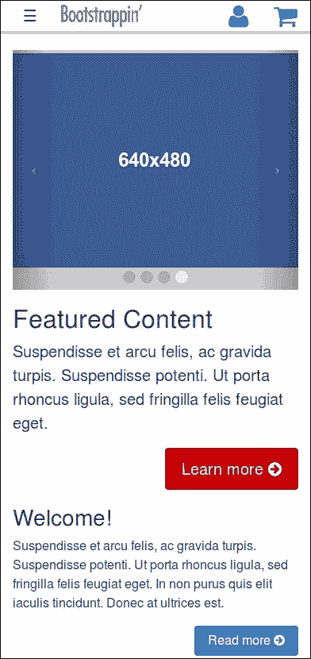

之后，我们将执行以下步骤：

1.  从 第 8 课 *启动您的投资组合* 的投资组合项目开始文件。

1.  在桌面视图中，创建一个复杂的横幅，横幅上方有标志，右上角有实用导航。

1.  对于较小的视口，我们将启用我们的实用选项仅在折叠的响应式导航的顶部作为图标出现。

1.  实施商业风格的配色方案。

1.  调整响应式和桌面版本的导航栏。

1.  为主要内容区域和页脚区域设置复杂的多列网格。

首要任务是：让我们评估我们的项目起始文件。

# 评估我们的起始文件

与本书中的所有项目一样，本项目的起始文件可以从 Packt 出版网站 [`www.packtpub.com/support`](http://www.packtpub.com/support) 下载。您可以在 `Lesson 9/start` 文件夹中找到这些文件。

这些文件是我们从第 8 课的结果的副本，*启动您的投资组合*。因此，我们享有以下关键组件的优势：

+   一个完整的构建过程，包括 Sass 编译器和 Panini 模板引擎

+   Bootstrap SCSS 和 JavaScript 文件

+   Panini HTML 模板

除了这些关键资产外，我们还有一些在第 8 课*启动你的投资组合*中创建的自定义 Sass 修改。它们可以在以下文件中找到，这些文件位于 `scss` 和 `scss/includes` 目录中：

+   `_main.scss`: 这被定制以从 `bower_components/bootstrap/scss` 目录导入 Bootstrap 的 Sass 文件，以及 Font Awesome 字体图标和我们的自定义 Sass 文件

+   `_carousel.scss`: 此文件对轮播图的填充、背景和指示器进行了自定义修改

+   `_footer.scss`: 此文件包含布局和设计标志及社交图标样式

+   `_navbar.scss`: 这文件已调整了 `.navbar-brand` 类的填充，以便使导航栏标志能够适应

+   `_page-contents.scss`: 此文件包含确保具有浮动按钮的列在窄的单列布局中清除彼此的样式

+   `_variables.scss`: 这包含自定义的灰色版本和一些对导航栏和轮播图的变量调整

Font Awesome 字体图标包括以下内容：

+   `fonts` 目录中的图标字体

+   `bower_components/font-awesome` 目录中的 Sass 文件

+   为了开始使用这些文件，你应在你的控制台中运行以下命令：

```js
 bower installing 
         npm install 

```

之后，你可以运行 `npm start` 或 `bootstrap watch` 命令来编译你的项目并开始监视浏览器中的更改。

# 设置设计的基本要素

我们开始修改第 8 课*启动你的投资组合*的结果，并最终得到以下截图所示的基本样式：

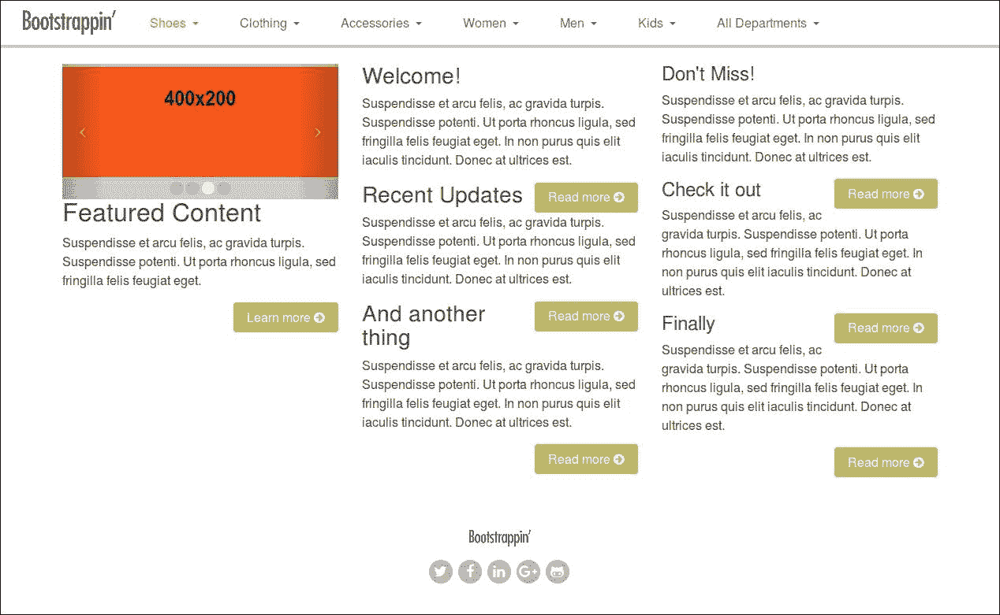

注意以下功能：

+   一个包含七个主要 `nav` 项的复杂导航栏，每个项都有一个下拉菜单

+   三个列中的第一个配备了轮播图，随后是标题、段落和按钮

+   第二列和第三列，包含标题、段落和**阅读更多 ->** 按钮

+   包含标志和社交图标的页脚

你将在第 8 课中我们已经使用过的元素中认出，*启动你的投资组合*。轮播图现在更小了——受其包含列的限制。否则，标记是相同的。

## 将下拉菜单添加到我们的导航栏中

Bootstrap 的 JavaScript 下拉插件使你能够轻松创建下拉菜单。你还可以将这些下拉菜单添加到你的导航栏中。

在您的文本编辑器中打开`html/includes/header.html`文件。注意，Gulp 构建过程使用 Panini HTML 编译器将我们的 HTML 模板编译成 HTML 页面。Panini 由 Handlebars 模板语言提供支持。在您的模板中，您可以使用辅助函数、迭代和自定义数据。在这个例子中，您将使用 Panini 的强大功能来构建带有下拉菜单的导航栏项。

首先，创建一个`html/data/productgroups.yml`文件，其中包含导航栏项的标题：

```js
- Shoes 
- Clothing 
- Accessories 
- Women 
- Men 
- Kids 
- All Departments 

```

上述代码是以 YAML 格式编写的。YAML 是一种人类可读的数据序列化语言，它从编程语言中汲取概念，从 XML 中汲取想法；您可以在以下网址了解更多信息：[`yaml.org/`](http://yaml.org/)。

使用前面的数据，您可以使用以下 HTML 和模板代码来构建导航栏项：

```js
  <ul class="nav navbar-nav navbar-toggleable-sm collapse"
  id="collapsiblecontent"> 
  {{#each productgroups}} 
    <li class="nav-item dropdown {{#ifCond this 'Shoes'}}active{{/ifCond}}"> 
      <a class="nav-link dropdown-toggle" data-toggle="dropdown" href="#"
      role="button" aria-haspopup="true" aria-expanded="false"> 
      {{ this }} 
      </a> 
        <div class="dropdown-menu"> 
          <a class="dropdown-item" href="#">Action</a> 
          <a class="dropdown-item" href="#">Another action</a> 
          <a class="dropdown-item" href="#">Something else here</a> 
          <div class="dropdown-divider"></div> 
          <a class="dropdown-item" href="#">Separated link</a> 
        </div> 
    </li> 
  {{/each}} 
  </ul> 

```

上述代码使用了一个（`for`）`each`循环来构建七个导航栏项，每个项都获得相同的下拉菜单。鞋子菜单获得活动类。Handlebars（因此也是 Panini）默认不支持条件比较。`if`语句只能处理单个值，但您可以添加自定义辅助函数来启用条件比较。使我们可以使用`ifCond`语句的自定义辅助函数可以在`html/helpers/ifCond.js`文件中找到。阅读我的*如何为不同环境设置 Panini*博客文章，在[`bassjobsen.weblogs.fm/set-panini-different-environments/`](http://bassjobsen.weblogs.fm/set-panini-different-environments/)，了解更多关于 Panini 和自定义辅助函数的信息。

下拉菜单的 HTML 代码与在[`getbootstrap.com/components/dropdowns/`](http://getbootstrap.com/components/dropdowns/)中描述的 Dropdown 插件的代码一致。

导航栏在较小屏幕尺寸时会折叠。默认情况下，下拉菜单在所有网格上看起来相同：

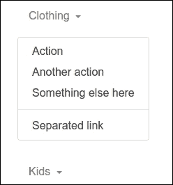

## 设置页面标题的底部边框

创建一个新的 Sass 部分文件，并向其中添加以下 SCSS 代码，以给我们的页面标题一个清晰的边界：

```js
header[role="banner"] { 
  border-bottom: 4px solid $gray-lighter; 
}   

```

## 使用 holder.js 添加图片

另一个细节是，我使用了优秀的`holder.js`JavaScript 插件来动态生成我们的轮播图的占位图。

您可以通过在控制台中运行以下命令使用 Bower 安装 holder.js 插件：

```js
bower install holderjs --save-dev

```

安装插件后，您可以在`Gulpfile.js`中使用`compile-js` Gulp 任务将其与其他 JavaScript 代码链接到`app.js`文件中，如下所示：

```js
gulp.task('compile-js', function() { 
  return gulp.src([ 
        bowerpath+ 'jquery/dist/jquery.min.js', 
        bowerpath+ 'tether/dist/js/tether.min.js', 
        bowerpath+ 'bootstrap/dist/js/bootstrap.min.js', 
        bowerpath+ 'holderjs/holder.min.js', // Holder.js for project
        development only 
        'js/main.js']) 
    .pipe(concat('app.js')) 
    .pipe(gulp.dest('./_site/js/')); 
}); 

```

如果您检查标记，您会在页面底部附近看到我包括了`holder.js`脚本，就在`plugins.js`之前，如下所示：

```js
<!-- Holder.js for project development only --> 
<script src="img/holder.js"></script> 

```

在我们的最终生产网站上，我们不会使用占位图，因此将其单独链接并添加一个显眼的注释是有意义的。

在`holder.js`就位的情况下，我们可以方便地构建引用`holder.js`作为其源的图像标签。伪 URL 的其余部分指定了尺寸、颜色和填充文本，如下所示：

```js
 

```

### 注意

关于`holder.js`的更多信息，请参阅[`github.com/imsky/holder`](https://github.com/imsky/holder)的文档。

由于这些元素已经就位，特别是得益于 Bootstrap 现成的样式和行为库，我们有一个良好的起点。让我们深入了解。

首先，我们将重新定位我们的导航栏在一个更复杂的横幅设计中。

# 创建复杂的横幅区域

让我们从顶部开始，创建具有以下功能的复杂横幅区域：

+   在桌面和更大视口中，标志位于导航栏上方的网站标志

+   一个包含许多菜单项，包括下拉菜单的导航栏

+   一个实用导航区域

+   一个带有用户名和密码的登录表单

+   注册选项

这里是我们希望在桌面宽度视口上达到的最终效果的草图：

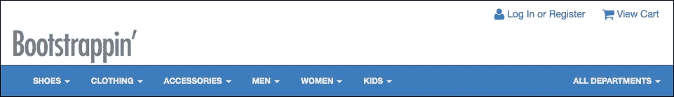

在窄视图中，它将调整为以下内容：


我们将首先着手为我们的顶部标志创建一个新的布局。

## 在导航栏上方放置标志

在这个新设计中，我们需要在两个位置放置一个标志，用于两个上下文：

+   对于桌面和宽屏视口，我们希望标志显示在导航栏上方

+   对于平板和手机视口，我们希望标志在响应式导航栏内显示

多亏了 Bootstrap 的响应式实用类，我们可以做到这两点！以下是方法：

1.  在你的编辑器中打开`html/includes/header.html`文件。

1.  将标志和切换按钮移出`nav`元素，并用`<div class="container">...</div>`包裹，以将其限制在 Bootstrap 居中网格空间内。

1.  `从标志的 ig 元素中移除宽度属性`。

1.  然后，将`<ul class="nav navbar-nav"></ul>`也包裹在`<div class="container">...</div>`中。

1.  将`navbar-toggleable-sm`和折叠类移动到第二个容器的 div 中。

1.  最后，你的 HTML 代码在`html/includes/header.html`文件中应该如下所示：

    ```js
            <header role="banner"> 
            <div class="container"> 
            <button class="navbar-toggler hidden-md-up" type="button"
            data-toggle="collapse" data-target="#collapsiblecontent"> 
            ? 
            </button> 
            <a class="navbar-brand" href="/"></a> 
            </div>      
            <nav class="navbar navbar-full" role="navigation"> 
            <div class=  "container navbar-toggleable-sm collapse"
            id="collapsiblecontent"> 
            <ul class="nav navbar-nav"> 
            ... 
            </ul> 
            </div> 
            </nav> 
            </header> 

    ```

1.  在更改 HTML 后，你可以再次使用 Sass 的力量根据视口的宽度来设置标志的样式。在`scss/includes/_header.scss`文件中编辑以下 SCSS 代码：

```js
        header[role="banner"] { 
          .navbar-brand { 
          > img { 
              width: 120px; 
              padding-left: $spacer-x; 
              @include media-breakpoint-up(md) { 
                padding-left: 0; 
                width: 180px; 
              } 
            }
          } 
        } 

```

在前面的步骤中，使用了几个预定义的 Bootstrap 类。隐藏-md-up 辅助类隐藏了中等视口及以上的内容，并确保切换按钮仅在小型视口中可见。另一方面，`navbar-toggleable-sm`类仅影响小型和超小型视口。

在窄视图中，标志的宽度为 120 像素。对于中等网格和更大的网格，移除标志的左填充，并将宽度设置为 180 像素。

### 小贴士

回想一下，我们的原始标志图像很大，大约 900 像素宽。我们将其宽度调整为 120 像素宽，通过宽度属性（我们也可以使用 CSS 规则）来使像素更紧密，以便在视网膜屏幕上显示。

保存更改并刷新页面，你应该会看到这些结果！在中型和大型视口中，将显示较大的标志：


在小和超小视口中，将显示标志的小版本：


啊，Bootstrap 的美！

现在，让我们对我们的导航栏做一些调整。

## 检查和审查导航栏下拉项

该导航栏及其七个项目和子菜单反映了大型复杂网站的需求。

下拉菜单的标记直接取自 Bootstrap 下拉文档 [`getbootstrap.com/components/dropdowns/`](http://getbootstrap.com/components/dropdowns/)。

如果你查看我们的生成标记，你会注意到这些特殊类和属性：

+   `class="dropdown"` 在父 `li`

+   `class="dropdown-toggle"` 在链接上

+   `attribute="data-toggle"` 也适用于链接

+   `class="dropdown-menu"` 在子菜单 div 元素上

+   `class="dropdown-item"` 在每个下拉菜单项上

这里是生成的标记：

```js
<li class="nav-item dropdown"> 
  <a class="nav-link dropdown-toggle" data-toggle="dropdown" href="#"
  role="button" aria-haspopup="true" aria-expanded="false"> 
    Shoes 
  </a> 
  <div class="dropdown-menu"> 
    <a class="dropdown-item" href="#">Action</a> 
    <a class="dropdown-item" href="#">Another action</a> 
    <a class="dropdown-item" href="#">Something else here</a> 
    <div class="dropdown-divider"></div> 
    <a class="dropdown-item" href="#">Separated link</a> 
  </div> 
</li> 

```

还要注意，小的下拉指示器是一个 CSS 三角形。Bootstrap 在 `bower_components/bootstrap/scss/_` 中使用以下 SCSS 代码来创建这些三角形：

```js
.dropdown-toggle { 
  // Generate the caret automatically 
  &::after { 
    display: inline-block; 
    width: 0; 
    height: 0; 
    margin-right: .25rem; 
    margin-left: .25rem; 
    vertical-align: middle; 
    content: ""; 
    border-top: $caret-width solid; 
    border-right: $caret-width solid transparent; 
    border-left: $caret-width solid transparent; 
  } 

  // Prevent the focus on the dropdown toggle when closing dropdowns 
  &:focus { 
    outline: 0; 
  } 
} 

```

### 提示

```js

```

保存更改并在浏览器中检查结果。如果您尚未运行 bootstrap watch 或 gulp 命令，现在应该运行它。您应该看到“所有部门”下拉菜单项浮动到导航栏的右手端，如下所示：

```js

Instead of modifying your HTML code, you can also use the following SCSS code to accomplish the same thing:

```

.nav-item:last-child {

float:right;

}

```js

So far so good! Now, let's add our utility navigation.
```

# 添加实用导航

此项目需要实用导航，以便用户登录或注册并查看他们的购物车。

在中型、大型和超大视口中，我们将此实用导航放置在横幅区域的右上角，如下所示：


在较小屏幕上，我们将在折叠导航栏的右侧显示图标：


注意，折叠的导航栏有不同的颜色方案；我们稍后会讨论如何做到这一点。

现在让我们设置导航栏更改。

首先，为了在 `scss/includes/_header.scss` 文件中给标志留出更多空间，只为较大的视口设置顶部填充，如下所示：

```js
header[role="banner"] { 
  .navbar-brand { 
    > img { 
      width: 120px; 
      padding-left: $spacer-x; 
      @include media-breakpoint-up(md) { 
        padding-top: $spacer-y * 3; 
        padding-left: 0; 
        width: 180px; 
      } 
    } 
  } 

Note a few things about this markup:

*   The `utility-nav` class is simply created for our use. It is not a Bootstrap-specific class and has no specific styles attached.
*   I've included Font Awesome's user and shopping cart icons and added the class of `fa-lg` to increase their size by 33 percent. See Font Awesome's documentation on this at [`fontawesome.io/examples/#larger`](http://fontawesome.io/examples/#larger).

Save the changes and inspect the results in your browser, and you should see our new `utility-nav` class appear on the right-hand side `of the` logo, as follows:Now, to complete the layout and related adjustments, we need to apply some custom styles. We need a new file to manage styles for our banner area.We need to set the position of `.utility-nav` to absolute, at the top right. We'll specify `header[role="banner"]` as the context for these styles. Add the following SCSS code to the `scss/includes/_header.scss` file:

```

header[role="banner"] {

// 标签区域样式

.utility-nav {

position: absolute;

top: $spacer-y;

right: 0;

}

}

```js

Now, let's refine the details as follows:

1.  Remove bullets from the unordered list.
2.  Float the list items on the left.
3.  Add padding to the link.
4.  Remove underlines from the hover effect.

The following lines will accomplish these goals:

```

.utility-nav {

ul {

    list-style: none;

    li {

    float: left;

    a {

        padding: 0 $spacer-x;

        @include hover {

        text-decoration: none;

        }

    }

    }

}

}

```js

Save the changes and ensure that it compiles. In the preceding code, we've set the padding for the anchors to `padding: 0 $spacer-x;`. We could accomplish this by adding Bootstrap's utility classes for spacing into the HTML code.

The following HTML code also sets a padding of `$spacer-x` on the left- and right-hand sides of the `<a>` element:

```

<a href="#"  class="p-1-x">

```js

Then make sure your browser window is at desktop width. You should see your `utility-nav` class take its place at the top right of the banner:


That takes care of medium viewports and larger. Now, let's address the needs of the collapsed responsive navbar.

# Making responsive adjustments

On small screens, the elements of our page header may overlap:


We need to move the toggle to the left-hand side of our navbar. This can be done as follows:

1.  Open the `scss/includes/_header.scss` file in your editor and add the following SCSS code to it:

    ```

            header[role="banner"] {

                .navbar-toggler {

                float: left;

                }

            }

    ```js

2.  Save and compile these changes, and you'll see the navbar toggle shift to the left end of the collapsed navbar, as shown in the following screenshot:


So far so good.

Now to address the problem of crowding by hiding the text for all devices except for screen readers on the collapsed navbar. In an uncluttered collapsed navbar, the icons will be enough to communicate the point, especially if we make the icons larger. Let's do that:

1.  In the `html/includes/_header.html` file, place `span` tags around the text within each link of our `utility-nav` class, as follows:

    ```

            <li><a href="#" ><i class="icon fa

            fa-user fa-lg"></i> <span>登录或注册</span></a></li>

            <li><a href="#" ><i class="icon fa

            fa-shopping-cart fa-lg"></i> <span>   View Cart</span></a></li>

    ```js

2.  This will give us a handle for our upcoming style adjustment.
3.  Now, in `_headers.scss`, we'll add a media query to target these `span` tags. Thanks to the power of Sass, we can nest the media query precisely where we want it to do its work. We'll use Bootstrap's `@media-breakpoint-down(sm)` mixin, setting a `max-width` query to the small breakpoint value minus one, since at this point our navbar makes the transition from collapsed to expanded. Within this media query, we'll use the `sr-only` utility class as a mixin to hide text from all devices except screen readers. (See the documentation on this class at [`getbootstrap.com/components/utilities/#screen-readers-and-keyboard-users`](http://getbootstrap.com/components/utilities/#screen-readers-and-keyboard-users).)
4.  Instead of the sr-only mixin, you can also add the `sr-only` class to your HTML. The `sr-only-focusable` mixin and `sr-only-focusable` CSS class are available to make content hidden by the the `sr-only` class visible on focus, which is useful for keyboard-only users.
5.  Here is the code snippet:

    ```

            header[role="banner"] {

            @include media-breakpoint-down(sm) {

                top: 0;

                span {

                @include sr-only;

                }

            }

            }

    ```js

6.  This will hide the text between our `span` tags, leaving us only with the icons!
7.  Now, we will increase the size of the icons and add some line height to position them vertically. We'll do this within the same media query:

```

        header[role="banner"] {

        @include media-breakpoint-down(sm) {

            top: 0;

            span {

            @include sr-only;

            }

            .icon {

            font-size: 2em;

            line-height: 1.2;

            }

        }

        }

```js

Save your changes, run the `bootstrap watch` command if you haven't already done so, and you should see the following result:


Take a minute to resize your browser window back and forth across the breakpoint. You should see the entire banner and navbar adjust seamlessly across the breakpoint.

If you're like me, it's hard not to be pleased with a framework that enables us to be this efficient at building such an adept and responsive interface.

Next up, we need to begin implementing the color scheme.

# Implementing the color scheme

We've been provided with a business-friendly palette of blue, red, and gray. Let's work these colors into our color variables:

1.  Open `scss/includes_variables.scss` in your editor. We'll be working at the beginning of the file, in the color variables.
2.  Let's review the range of grays we have available. If you've begun with the `chapter5/finish` files, you'll see we've carried these variables over from Lesson 8, *Bootstrapping Your Portfolio*. They served us well there, and we'll make use of them again here:

    ```

            x`

            // -------------------------

            @gray-darker:            #222; // edited

            @gray-dark:              #454545; // edited

            @gray:                   #777; // edited

            @gray-light:             #aeaeae; // edited

            @gray-lighter:           #ccc; // edited

            @gray-lightest:          #ededed; // edited

            @off-white:              #fafafa; // edited

    ```js

3.  Now, below the grays, let's fold in our new brand colors. We'll modify the value for `@brand-primary` and create a `@brand-feature` variable for red:

    ```

            @brand-primary:          #3e7dbd; // edited blue

            @brand-feature:          #c60004; // added new red

    ```js

4.  Now, let's adjust our link-hover color so that it will lighten (rather than darken) the `@brand-primary` color, which is already dark:

    ```

            // Links

            // -------------------------

            @link-color:            @brand-primary;

            @link-color-hover:      lighten(@link-color, 15%);

    ```js

5.  Finally, let's define the colors for our navbar. We'll create two sets of variables the `-xs-` variables for the small screens and the `-md-` variables for the larger screens:

```

// Navbar

$navbar-xs-color:             $body-color;

$navbar-xs-bg:                #fff;

$navbar-md-color:             $gray-lightest;

$navbar-md-bg:                $brand-primary;

// Navbar links

$navbar-xs-color:                $navbar-xs-color;

$navbar-xs-hover-color:          $navbar-xs-color;

$navbar-xs-hover-bg:             darken($navbar-xs-bg, 5%);

$navbar-xs-active-color:         $navbar-xs-color;

$navbar-xs-disabled-color:       $navbar-xs-hover-bg;

$navbar-md-color:                $navbar-md-color;

$navbar-md-hover-color:          $navbar-md-color;

$navbar-md-hover-bg:             darken($navbar-md-bg, 5%);

$navbar-md-active-color:         $navbar-md-color;

$navbar-md-disabled-color:       $navbar-md-hover-bg;

```js

Having set up these fundamental color variables, we're ready to work on our navbar.

# Styling the collapsed navbar

While still in `_navbar.less`, search for `// Navbar`, which will take you to the navbar variables. Note that most of the standard values specified here will affect both the collapsed responsive navbar for small viewports and the expanded navbar for wider viewports.

We want the background, text, and link colors for the collapsed responsive navbar to remain largely consistent with the default values but then change to our blue background and a light text color for medium and larger viewports.

We'll develop a responsive color scheme to accomplish the preceding color changes based on the viewport.

Open the `scss/includes/_navbar.scss` file and edit the default values for the small viewport as follows:

```

// responsive color scheme

.navbar {

background-color: $navbar-xs-bg;

color: $navbar-xs-color;

.nav-link

{

    @include hover-focus-active {

    background-color: $navbar-xs-hover-bg;

    }

}

}

```js

As you can see, we'll use the `-xs-` variables now. For medium and large viewports—where our navbar stretches out horizontally below the logo—we want our navbar to take on the blue color. Using Bootstrap's media query mixins again, we can change the colors for the larger viewports, as follows:

```

// responsive color scheme

.navbar {

background-color: $navbar-xs-bg;

color: $navbar-xs-color;

.nav-link

{

    @include hover-focus-active {

    background-color: $navbar-xs-hover-bg;

    }

}

@include media-breakpoint-up(md) {

    background-color: $navbar-md-bg;

    color: $navbar-md-color;

    .nav-link

    {

    color: $navbar-md-color;

    @include hover-focus-active {

        background-color: $navbar-md-hover-bg;

    }

    }

}

}

```js

## Customizing the drop-down menus

We will use the power of Sass again to customize the drop-down menus for smaller screens. Edit the following code in the `scss/includes/_navbar.scss` file:

```

@include media-breakpoint-down(sm) {

.navbar {

    .nav-item + .nav-item {

    margin-left: 0;

    }

    .dropdown {

    position: initial;

    }

    .dropdown-menu {

    position: initial;

    z-index: initial;

    float: initial;

    border: initial;

    border-radius: initial;

    }

}

}

```js

In the preceding code, we've used Bootstrap's media query mixins to reset the styles for screens smaller than 768 pixels. The initial value the initial value of a property to an element. So the preceding code sets the position to again and removes the float, border, and border-radius, and the drop-down menu will look like a "normal" list now:

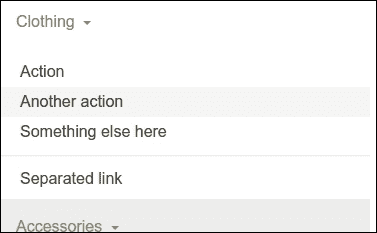

Fantastic! Now we can address the horizontal navbar.

# Styling the horizontal navbar

When you move your mouse over the navbar links, you'll find that the hover background color of the link is smaller than the height of the navbar:

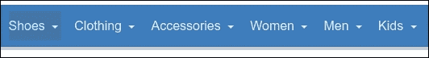

You can solve this issue by applying padding on the links instead of the navbar. Use the following SCSS code in the file to change the padding:

```

.navbar {

@include media-breakpoint-up(md) {

padding-top: 0;

padding-bottom: 0;

}

.nav-link

{

padding: $spacer;

@include media-breakpoint-only(md) {

padding: $spacer-y ($spacer-x / 2);

}

}

}

```js

Now your navbar links should look like the following screenshot:

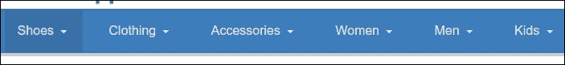

And finally, let's transform the text to upper case, reduce its size a bit, and make it bold. In `_navbar.scss`, add these highlighted lines:

```

.nav-link

{

    padding: $spacer;

    @include media-breakpoint-up(md) {

    text-transform: uppercase;

    font-size: 82%;

    font-weight: bold;

    }

}

```js

This will yield the following result:


Our banner and navbar are complete!

# Enabling Flexbox support

Bootstrap 4 comes with optional flexbox support. You can simply enable flexbox support by declaring `$enable-flex: true;` in the `scss/includes/_variables` file. If you do so, you'll have clear the floats of the container of the navbar because of we've implement flexbox support for it. You can clear the floats by adding the following SCSS code to the file:

```

header[role="banner"] {

// header container do not use the flexbox layout, so floats have to be cleared

@if $enable-flex {

    .container {

    @include clearfix();

    }

}

}

```js

Now it's time to move on to the main content of our page.

# Designing a complex responsive layout

Let's imagine we've emerged from client meetings with a plan to organize the home page content in three tiers, ranked by importance.

In medium and wide viewports, this content will be laid out in three columns, as shown in the following screenshot:

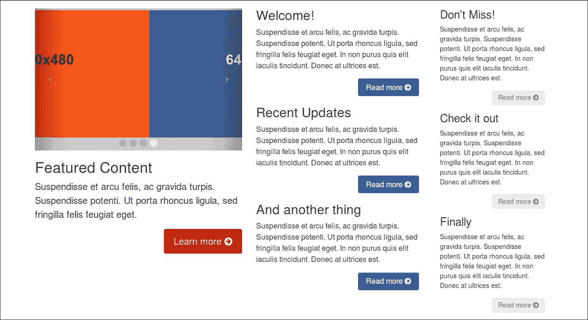

In a narrow viewport, these will be laid out one after another, in a single vertical column:

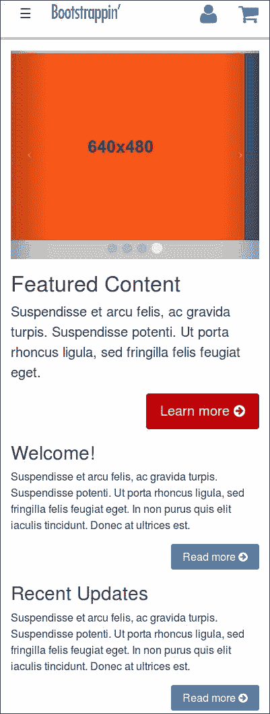

And in a small and medium `tablet-width` viewport, we'll arrange the content in two side-by-side columns, with the third tier of content laid out beneath it as a horizontal row, as shown in the following screenshot:

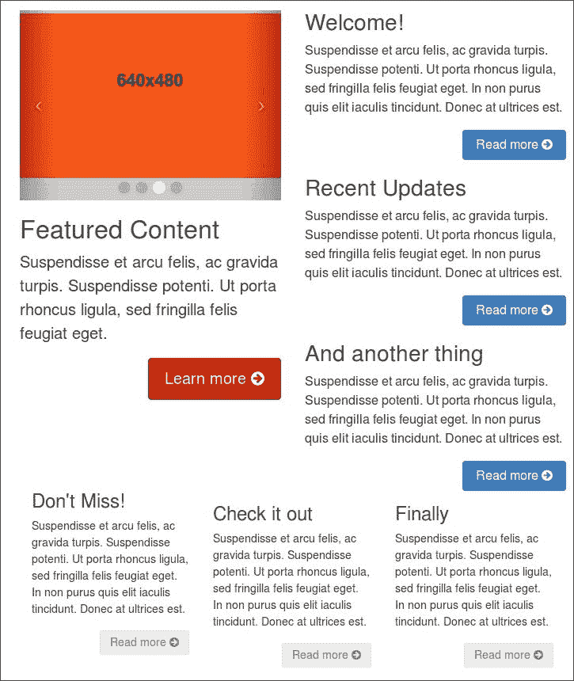

To get us started, I've provided the basic markup for three equal columns. Let's review what we have and then adapt it to the needs of this design. We'll begin with the three-column layout for medium and wide viewports.

## Adjusting the large and extra-large layout

Currently, in large and extra-large viewports, our three columns are equal in width, font size, button size, and color. As a result, the presentation lacks visual hierarchy, as seen in the following screenshot:

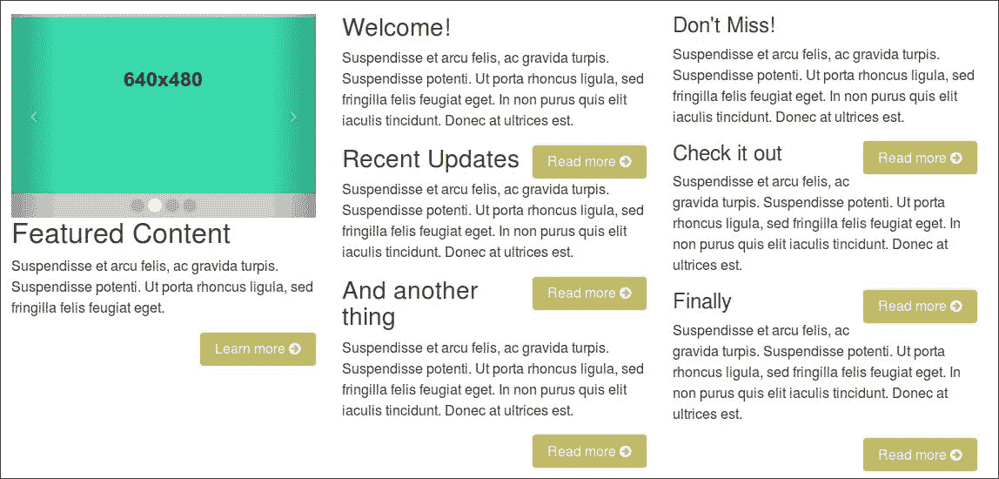

We can take significant strides by adjusting column width, font size, button size, and color to establish a clearer hierarchy between these tiers of content. Let's do that. We'll start by adjusting column widths:

1.  In `html/pages/index.html`, search for the `section` tag for the primary content:

    ```

        <section class="content-primary col-md-4">

    ```js

2.  Note that the `col-md-4` class sets the width of this column to one-third of the width of the parent element, beginning at the small viewport width (768 pixels and up).
3.  We want to save the three-column layout for the large and extra-large viewports (992 pixels and up), and we want this first column to be wider than the others.
4.  Edit the `col-md-4` class to read `col-lg-5`, as follows:

    ```

    <section class="content-primary col-lg-5">

    ```js

5.  This will set this column to 5/12 width with the medium viewport and larger.
6.  Now search and find the opening `section` tags for the next two columns and adjust the column classes to `col-lg-4` and `col-lg-3` respectively:

```

<section class="content-secondary col-lg-4">

...

<section class="content-tertiary col-lg-3">

```js

Save, refresh, and you'll see the desired visual hierarchy in the width of our columns:


You might have noticed that the headings in the middle of the secondary and tertiary columns are not clearing the buttons above them. Let's adjust these, as well as our buttons and font sizes after adjusting the medium layout.

## Adjusting the medium layout for tablet-width viewports

First notice that the navbar is too small for the number of items on the medium layout. The items render into two rows, as follows:

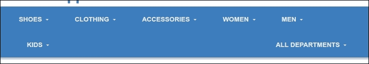

To get the items on a single row again, you may reduce the margin and padding of the navbar items or change the collapsing point of the navbar.

First, try the margin and padding solution; you can use the power of Sass again. Open the file in your editor and add the following SCSS code:

```

.navbar {

@include media-breakpoint-only(md) {

    .nav-item + .nav-item {

margin-left: 0; }

    }

    .nav-link

    {

    padding: $spacer;

    @include media-breakpoint-only(md) {

padding: $spacer-y ($spacer-x / 2);

    }

    }

}

```js

Notice that I've wrapped the code in the `media-breakpoint-only()` mixin. The `media-breakpoint-only()` mixin works just like the media-breakpoint-up and media-breakpoint-down mixins you've seen before, but only targets a single grid by setting both the min-width and max-width for the media query.

Consider the following SCSS code, for example:

```

@include media-breakpoint-only(md) {

padding: $spacer-y ($spacer-x / 2);

}

```js

The preceding SCSS code compiles into CSS code similar to the following:

```

@media (min-width: 768px) and (max-width: 991px) {

.navbar .nav-link {

padding: 1rem 0.5rem;

}

}

```js

A `media-breakpoint-between()` mixin is available too. The `media-breakpoint-between()` mixin enables you to target a range of grids between two breakpoints. The `@include media-breakpoint-only(sm,md){}` call targets both small and medium grids.

### Note

You may have noticed that your file contains a lot of media queries now. Sass does not merge media queries, so the compiled CSS code contains a lot of media queries too. Merging the same CSS media query rules into one media query rule may be a performance improvement for your CSS code. The css-mqpacker node package can process your CSS code pack's same CSS media query rules into one media query rule.

You can run the package with the gulp-postcss package just like the autoprefixer plugin. More information about css-mqpacker and how to integrate it in your Gulp build process can be found at the following URL: [`www.npmjs.com/package/css-mqpacker`](https://www.npmjs.com/package/css-mqpacker)

A `media-breakpoint-between()` mixin is available too. The `media-breakpoint-between()` mixin enables you to target a range of grids between two breakpoints. The `@include media-breakpoint-only(sm,md){}` call targets both the small and medium grids.

Alternatively, you may change the collapsing point of the navbar. First, open the html/includes/header.html file and change the appearance of the navbar toggler as follows:

```

<button class="navbar-toggler hidden-lg-up" type="button"

data-toggle="collapse" data-target="#collapsiblecontent">

<div class="container navbar-toggleable-md collapse" id="collapsiblecontent">

```js

Now you'll find a collapsed navbar on the medium grid too. Notice that we've made some changes to the navbar items and the submenus for the collapsed navbar before. You should change the media queries for these changes too. You can change the media queries in the `scss/includes/_navbar.sccs` file:

```

.navbar {

@include media-breakpoint-down(md) {

.navbar-brand,

.nav-item {

float: none;

> img {

    display: inline-block;

    }

    }

    // dropdown menus

    .nav-item + .nav-item {

    margin-left: 0;

    }

    .dropdown {

    position: initial;

    }

    .dropdown-menu {

        position: initial;

    z-index: initial;

    float: initial;

    border: initial;

    border-radius: initial;

    }

    }

}

```js

Also change the breakpoint for the navbar class in the `scss/includes/_header.scss` file:

```

.navbar-brand {

    > img {

    width: 120px;

    padding-left: $spacer-x;

    @include media-breakpoint-up(lg) {

        padding-top: $spacer-y * 3;

        padding-left: 0;

        width: 180px;

    }

    }

}

现在导航栏已经准备好用于中等网格。让我们也准备我们的内容列。在中等网格上，我们将第三列移至其他列下方，并在每列中显示每个项目。请参阅“调整中等布局以适应平板宽度视口”部分下的截图。第一行包含两个列，其总宽度为容器宽度的 50%，第二行包含三个列，宽度为容器宽度的三分之一。我们可以通过再次使用 Bootstrap 的预定义网格类来完成之前描述的布局。首先，再次打开 `html/pages/index.html` 文件，并添加中等网格的网格类，如下所示：

```js
<section class="content-primary col-md-6 col-lg-5"> 
  ... 
</section> 
<section class="content-secondary col-md-6 col-lg-4"> 
  ... 
</section> 
<section class="content-tertiary col-md-12 col-lg-3"> 
  ... 
</section> 

```

上述代码中的 `col-md-*` 类仅影响中等网格，因为 `col-lg-*` 类会覆盖它们以适应更大的网格，这是移动优先编码的结果。一个网格行包含 12 个列；在中等网格上，现在将有 24 个列（*2 x md-6 + md-12*）。列将自动分成两行。第一行包含前两个（*md-6*）列，第二行填充了 *md-12* 列。现在您需要在中等网格上布局内容-三级列的项目。Bootstrap 的网格行也可以嵌套。我们将使用嵌套将第二行分成三个等宽的列。要使用默认网格嵌套内容，请添加一个新的行类和一组 `col-*-*` 列，它们位于现有的 `col-*-*` 列内。在您的布局中，将每个列包裹在以下 HTML 结构中：

```js
<article class="col-md-4 col-lg-12">...</article>
```

您不仅需要添加一个 `col-md-4` 类，还需要添加一个 `col-lg-12` 类以确保嵌套不会影响大网格和超大网格的列。将列包裹在一个新的行中，现在三级列的 HTML 代码应如下所示：

```js
<section class="content-tertiary col-md-12 col-lg-3">
<div class="row">
<article class="col-md-4 col-lg-12">
<h4>Don't Miss!</h4>
<p>Suspendisse et arcu felis, ac gravida turpis. Suspendisse potenti.
    Ut porta rhoncus ligula, sed fringilla felis feugiat eget. In non purus
    quis elit iaculis tincidunt. Donec at ultrices est.</p>
	<p><a class="btn btn-primary pull-right" href="#">Read more
    <span class="icon fa fa-arrow-circle-right">
	</span></a></p>
	</article>
	<article class="col-md-4 col-lg-12">                    <h4>Check it out</h4>
	<p>Suspendisse et arcu felis, ac gravida turpis. Suspendisse potenti.
    Ut porta rhoncus ligula, sed fringilla felis feugiat eget. In non purus
    quis elit iaculis tincidunt. Donec at ultrices est.</p>
	<p><a class="btn btn-primary pull-right" href="#">Read more
    <span class="icon fa fa-arrow-circle-right">
	</span></a></p>
	</article>
	<article class="col-md-4 col-lg-12">                   <h4>Finally</h4><p>Suspendisse et arcu felis, ac gravida turpis. Suspendisse potenti.
    Ut porta rhoncus ligula, sed fringilla felis feugiat eget. In non purus
    quis elit iaculis tincidunt. Donec at ultrices est.</p><p><a class="btn btn-primary pull-right" href="#">Read more
    <span class="icon fa fa-arrow-circle-right"></span></a></p></article></div>  </section>
```

In the browser, the last column should look like that shown in the following screenshot: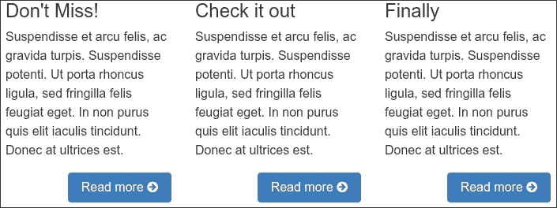

```js

## Adjusting headings, font sizes, and buttons

Let's begin by adjusting our headings so that they consistently clear the buttons above them, which have been floated to the right. For this purpose, we'll use the file we previously created to manage the details of the page contents, `_page-contents.scss`.

Here's how to do it:

1.  In `_page-contents.scss`, let's write a selector to select headings `h1` through `h4` when they're nested inside a Bootstrap column class. We'll use the CSS2 attribute selector and cover our bases by targeting any element whose classes include the `col-` string.

    ### Tip

    Later in this chapter, we will equip our footer with its own set of responsive columns. Thus, we need to make sure we nest these rules within the selector for the main element.

2.  Within this context, we'll select all heading tags we might potentially use and set them to clear floated elements, with some added padding for separation:

    ```

            [class*="col-"] {

            h1, h2, h3, h4 {

                clear: both;

                padding-top: $spacer-y;

            }

            }

    ```js

3.  This gives the necessary separation between our headings and floated buttons. But it also creates unneeded padding at the top of the secondary and tertiary columns.
4.  In the following screenshot, the lower arrows highlight the improvement accomplished now that our headings clear the floated buttons. Also, the ragged top edge of our columns, where padding causes a problem: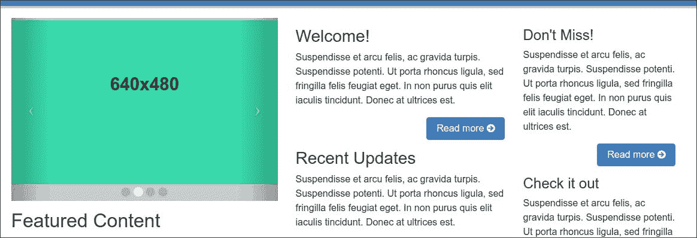
5.  Let's remove the margin and padding from the uppermost heading in each column. We'll use the `:first-child` selector for these headings, nesting these lines within our heading selectors. We'll use the `&` combinator, which in this formulation allows us to select any first-child instance of these headings:

    ```

            &:first-child {

            margin-top: 0;

            padding-top: 0;

            }

    ```js

6.  This removes the extra margin and padding and evens up the top edge of the second: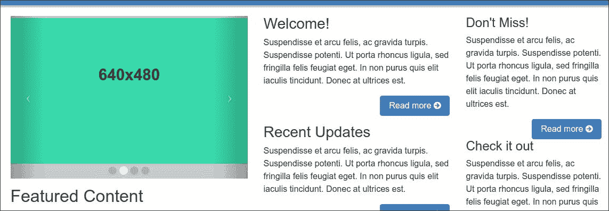
7.  But now there is a problem with the third column. The `:first-child` selector matches each `h4` element in the third column due to the nesting we added before. You can solve this issue by creating a new `h4` selector in your Sass code, as follows:

    ```

            h4 {

            clear: both;

            padding-top: $spacer-y;

            }

            > article:first-child h4 {

            margin-top: 0;

            padding-top: 0;

            }

    ```js

8.  However, we only want to remove this top margin and padding in medium, large, or extra-large viewports, which accommodate multiple columns. Thus, we need to nest this rule within a media query corresponding with the breakpoint at which our layout expands from a narrow single-column layout to a wider multi-column layout.
9.  Thus, we need to nest what we've just done within a media query for medium viewports and larger:

```

[class*="col-"] {

    h1, h2, h3, h4 {

            clear: both;

            padding-top: $spacer-y;

            @include media-breakpoint-up(md) {

            &:first-child {

                margin-top: 0;

                padding-top: 0;

        }

            }

        }

        h4 {

            clear: both;

            padding-top: $spacer-y;

        }

        @include media-breakpoint-up(md) {

            > article:first-child h4 {

            margin-top: 0;

            padding-top: 0;

            }

        }

        }

```js

With the preceding media query, we've retained the padding we need between elements in the single-column layout for narrow viewports, as seen in the following screenshot:

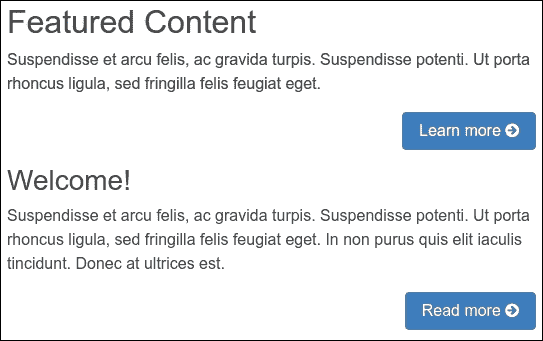

With this accomplished, we can move on to adjust buttons and font sizes to reflect the informational hierarchy of our content. Let's begin by enlarging the font size, button size, and color in our primary content area.

## Enhancing the primary column

First, let's increase the font size of our primary column content:

1.  In Bootstrap's `_variables.scss` file, the `$font-size-large` variable is set to the following by default:

    ```

    $font-size-lg: 1.25rem !default;

    ```js

2.  Now, in the `scss/includes/_page-contents.scss` file, add these lines to use this font size for our primary content:

```

.content-primary {

font-size: $font-size-lg;

}

```js

Save these changes, compile the file, and refresh your browser. You should see the font size increase accordingly!

Now, let's adjust the color of our button to utilize the red `$brand-feature` color. We'll utilize the `$brand-feature` variable we set up in the local `scss/includes/_variables.scss` file.

```

$brand-feature:        #c60004;

```js

We'll also utilize an excellent `button-variant()` mixin provided in the Bootstrap `mixins/_buttons.scss` file. You may want to take a moment to check it out. Open the `mixins/_buttons.scss` in the Bootstrap's source code in the `bower_components` directory and search for `// Button` variants. You'll find a mixin that begins as follows:

```

@mixin button-variant($color, $background, $border) {

```js

The mixin does the following:

*   Specifies the button font, background, and border colors (in other words, the three parameters that the mixin accepts)
*   Generates hover, focus, active, and disabled states for the button, adjusting font color, background color, and border

If you'd like to, you can see how Bootstrap uses this mixin in `bootstrap/_buttons.scss` under the `// Alternate buttons` comment. Here are the lines generating styles for the default and primary buttons:

```

//

// Alternate buttons

//

.btn-primary {

@include button-variant($btn-primary-color, $btn-primary-bg, $btn-primary-border);

}

.btn-secondary {

@include button-variant($btn-secondary-color, $btn-secondary-bg, $btn-secondary-border);

}

.btn-info {

@include button-variant($btn-info-color, $btn-info-bg, $btn-info-border);

}

```js

### Tip

You will find the variables beginning `with $btn-primary-` and `$btn-secondary-` in the `bower_components/bootstrap/scss/_variables.scss` file.

Following this pattern, we can generate our custom feature button in four simple steps:

1.  First, we'll set up a new set of button variables. In the `_scss/includes/_variables.scss` file, under `// Buttons`, make a copy of the three `$btn-primary-` variables, and customize them, replacing `-primary-` with `-feature-` and using `$brand-feature` as the background color:

    ```

    $btn-feature-color:              #fff;

    $btn-feature-bg:                 $brand-feature;

    $btn-feature-border:             darken($btn-feature-bg, 5%);

    ```js

2.  Next, we can make a file to keep our custom buttons. Create `scss/includes/_buttons.scss` and write a mixin based on the `.btn-primary` mixin from `bootstrap/_buttons.scss`, as follows:

    ```

    .btn-feature {

    @include button-variant($btn-feature-color, $btn-feature-bg,

            $btn-feature-border);

    ```js

3.  Save this file and add it to the import sequence in `scss/app.scss` as follows:

    ```

    @import "includes/carousel"; @import "includes/buttons"; // added

    ```js

4.  Now, in the `html/pages/index.html` file, change the button class from `btn-primary` to `btn-feature`. While we're at it, we want to make the button large, so add the `btn-lg` class:

```

<a class="btn btn-feature btn-lg pull-right" href="#">   Learn more

```js

Save your work. Run the `bootstrap watch` command, and you should see the following result. The primary column to the left now has a larger font size and a large button with our `brand-feature` color:

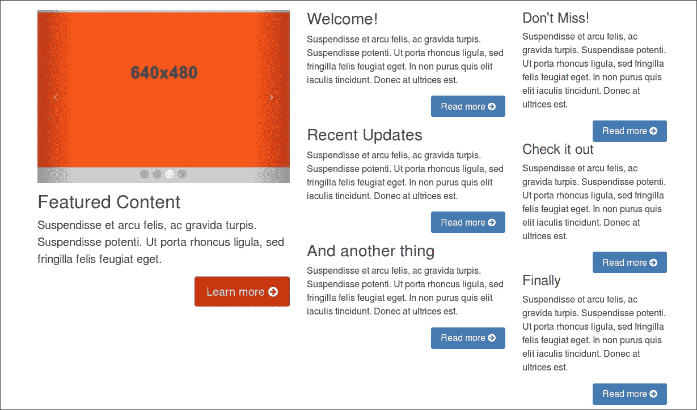

Meanwhile, the font size and button colors of the secondary (center) column are exactly what we want. What needs to happen next is this: we need to de-emphasize the tertiary column content so that it takes its appropriate place in the informational hierarchy.

## Adjusting the tertiary column

Our task for the tertiary content is fairly straightforward. We have to reduce the font size and de-emphasize the buttons. This can be accomplished as follows:

1.  First, we'll adjust the `font-size`. In Bootstrap's `_variables.scss file`, the `$font-size-sm` variable is set as follows:

    ```

    $font-size-sm:               .875rem !default;

    ```js

2.  Now we need only add these lines to the `_scss/includes/_page-contents.scss` file:

    ```

    .content-tertiary {

    font-size: $font-size-sm;

    }

    ```js

3.  If you have run the `bootstrap watch` command already, you should see the font size reduce, after saving your changes.
4.  Next, in the `html/pages/index.html` file, we need to edit our button classes. We'll change them from `btn-primary` to `btn-secondary`, and we'll reduce their size using the `btn-sm` class:

    ```

    <a class="btn btn-secondary btn-sm pull-right" href="#">Read more ...

    ```js

5.  This will reduce the button size and turn the button's background white.
6.  Let's adjust the background to a light gray and adjust the font color and border as well. In the `_variables.scss` file, adjust the values for the three `$btn-secondary-` variables as follows:

```

$btn-secondary-color:              $gray;

$btn-secondary-bg:                 $gray-lightest;

$btn-secondary-border:             darken($btn-secondary-bg, 5%);

```js

Save the changes, compile the file, and refresh your browser.

We now have a clear visual hierarchy, from the primary content (on the left), to the secondary (center), and tertiary (right):

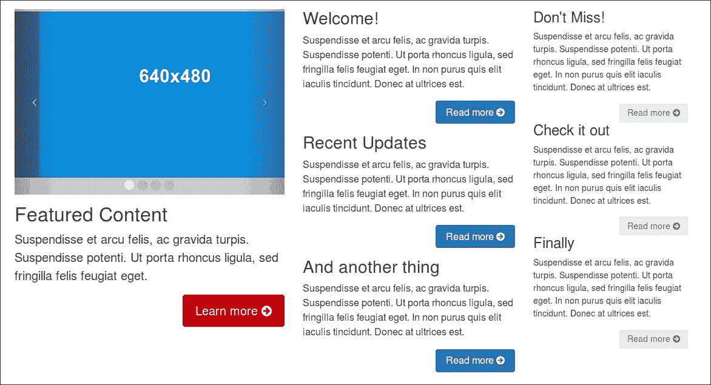

Now, take a moment to notice that our adjustments work reasonably well in the narrow single-column layout as well:

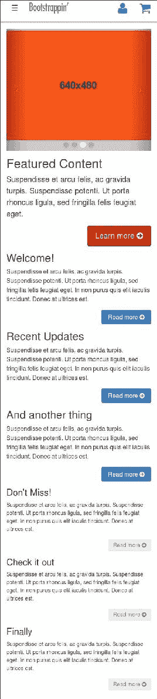

In narrow viewports, our three columns stretch out vertically, one after the other, with primary content first, followed by secondary and tertiary.

All that remains is some fine-tuning to make our content even more user friendly across devices and viewports.

## Fine touches for multiple viewports

It's always good to give our content—and our viewers' eyes—some room to breathe. Visual indicators of section boundaries are good as well. Let's fold these in:

1.  First, we'll add padding above and below our content. Add a bit of top padding to the `main` element itself. This padding will serve us well in all viewports, so we won't need a media query:

```

main {

padding-top: $spacer-y;

padding-bottom: $spacer-y * 2;

}

```js

That's it. Our main content layout is ready. Now for the complex footer area.

# Laying out a complex footer

In the following steps, we'll create a complex footer built to manage multiple goals, including three lists of links to key sections of our website, a bit of **About Us** text, social icons, and our logo.

# Setting up the markup

We will start by creating the footer markup. We want this footer to be as functional and useful for the user as possible. We'll build the markup as follows:

1.  Start with the footer of the Portfolio project from Lesson 8, *Bootstrapping Your Portfolio*. You'll find the HTML Markup code of the footer in the `html/includes/footer.html` file.
2.  Move HTML code for the logo and add it directly under the social links and create a new include for the additional footer content as follows:

    ```

    <footer role="contentinfo">

    {{> footercolumns}}

    <div class="container social-logo">

    <ul class="social">

    <li class="social-item"><a href="#" class="social-link"

    ><i class="fa fa-twitter"></i></a></li>

    <li class="social-item"><a href="#" class="social-link"

    ><i class="fa fa-facebook"></i></a></li>

    <li class="social-item"><a href="#" class="social-link"

    ><i class="fa fa-linkedin"></i></a></li>

    <li class="social-item"><a href="#" class="social-link"

    ><i class="fa fa-google-plus"></i></a></li>

    <li class="social-item"><a href="#" class="social-link"

    ><i class="fa fa-github-alt"></i></a></li>

    </ul>

    <p><a href="{{root}}index.html"></a></p>

    </div>

    </footer>

    ```js

3.  Now create a new HTML partial called `html/includes/footercolumns.html`. You can pass the additional footer content into this file.
4.  Before pasting the content, let's prepare to utilize the Bootstrap grid system. To do this, we'll wrap the area within `div class="row"`, as follows:

    ```

    <div class="container">

    <div class="row">

    ...

    </div><!-- /.row -->

    </div><!-- /.container -->

    ```js

5.  Now, paste the new content in place.
6.  Next, we'll wrap each of the three lists of links, along with their headings, in a `col-lg-2` class `div` . This way, each list will take one-sixth of the available width in medium and larger viewports. Together, these three lists will take half the available viewport width.
7.  Now, to complete our row, wrap the **About Us** heading and its paragraph in `col-lg-6` class `div` so that it takes up the remaining half of the available width:

    ```

    <div class="about col-lg-6">

    <h3>About Us</h3>

    ```js

    ### Tip

    Be sure to add the necessary closing tags for each new `div` element.

8.  Save, run the `bootstrap watch` or `gulp` command, and check your results.

After performing the preceding steps, you should end up with the following HTML code:

```

<div class="container">

<div class="row">

    <div class=col-lg-2">

    <h3>Categories</h3>

    <ul>

        <li><a href="#">Shoes</a></li>

        <li><a href="#">Clothing</a></li>

        <li><a href="#">Accessories</a></li>

        <li><a href="#">男性</a></li>

        <li><a href="#">女性</a></li>

        <li><a href="#">儿童</a></li>

        <li><a href="#">宠物</a></li>

    </ul>

    </div>

    <div class="col-lg-2">

    <h3>样式</h3>

    <ul>

        <li><a href="#">运动</a>  </li>

        <li><a href="#">休闲</a></li>

        <li><a href="#">服装</a></li>

        <li><a href="#">日常</a></li>

        <li><a href="#">其他日子</a></li>

        <li><a href="#">替代</a></li>

        <li><a href="#">否则</a></li>

    </ul>

    </div>

    <div class="col-lg-2">

    <h3>其他</h3>

    <ul>

        <li><a href="#">链接</a></li>

        <li><a href="#">另一个链接</a></li>

        <li><a href="#">再次链接</a></li>

        <li><a href="#">试试这个</a></li>

        <li><a href="#">不敢</a></li>

        <li><a href="#">哦，继续吧</a></li>

    </ul>

    </div>

    <!-- 仅在所需的视口中添加额外的清除浮动 -->

    <div class="clearfix hidden-sm-down hidden-lg-up"></div>

    <div class="about col-lg-6">

    <h3>关于我们</h3>

    <p>Lorem ipsum dolor sit amet, consectetur adipiscing elit.

    Suspendisse euismod congue bibendum. Aliquam erat volutpat.

    Phasellus eget justo lacus. Vivamus pharetra ullamcorper massa, nec

    ultricies metus gravida egestas. Duis congue viverra arcu, ac aliquet

    turpis rutrum a. Donec semper vestibulum dapibus.

    Integer et sollicitudin

    metus. Vivamus at nisi turpis. Phasellus vel tellus id felis cursus

    hendrerit.</p>

    <p><a class="btn btn-secondary btn-sm pull-right" href="#">了解更多

    <span class="fa fa-arrow-circle-right"></span></a></p>

    </div>

</div><!-- /.row -->

</div><!-- /.container -->

```js

Due to the Bootstrap grid classes we've added in our HTML in a viewport of 980 pixels and larger, our columns should organize themselves as follows:

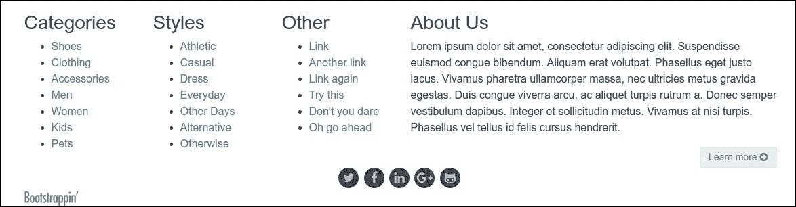

This is the layout we want in large and extra-large viewports. Extra-small screen sizes are served just fine by the single-column layout. However, for tablet-width screen sizes that fall within the range of 768 to 980 pixels, our layout can benefit from some adjustments. Let's address that.

## Adjusting for tablet-width viewports

Test the layout in a viewport that falls between 768 and 980 pixels. Bootstrap refers to this as the medium breakpoint and `col-md-` grid classes. At this width, the single-column layout leaves unnecessary white space. Here is what you'll see:

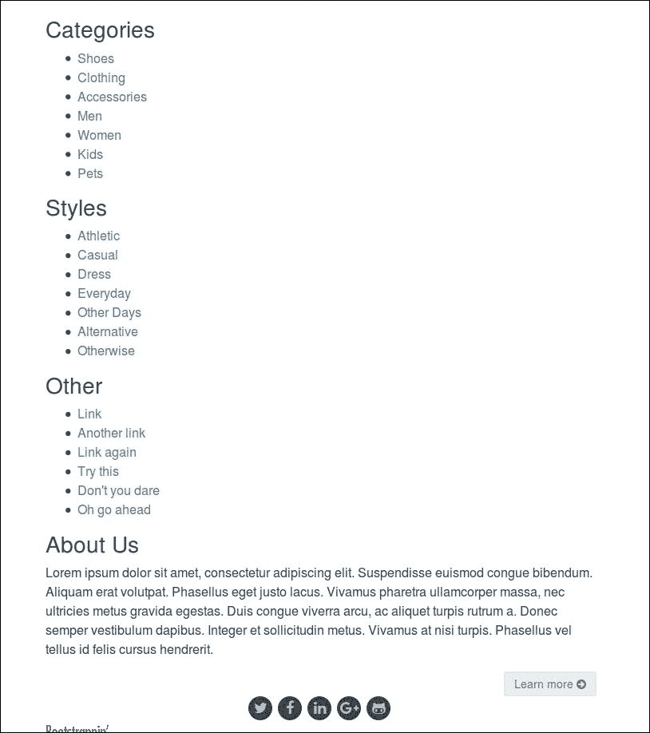

We can improve this layout by allowing our three lists of links to float next to each other. Using the Bootstrap `col-md-*` column classes for Bootstrap's grid, let's set the three lists of links to be one-third width, or `col-sm-4`, and the **About Us** column to be full width, or `col-sm-12`:

```

<div class="col-md-4 col-lg-2">

...

<div class="col-md-4 col-lg-2">

...

<div class="col-md-4 col-lg-2">

...

<div class="about col-xs-12 col-lg-6">

```js

Save this and try it out in the medium viewport range. You will see the following result:

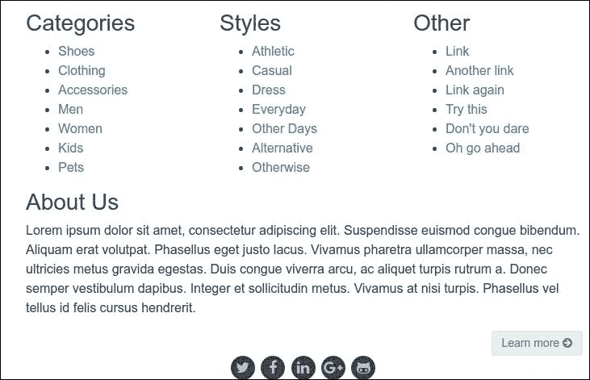

Much improved! But we're not quite finished. Try clicking on the links in the upper three columns. Chances are that you won't be able to. Inspect the element and you'll find that the fourth `div` element contains the code for the **About Us** column. This code does not clear the floated columns above it. Though the **About Us** heading and its paragraph will appear below the three floating columns, the `div` element itself will overlap them.

## Adding a targeted responsive clearfix

In a standard Bootstrap layout situation, we would use a `div` element with the `row` class to clear the floating columns. Here, we need a different solution, as we want this block of content to clear floats only within this specific breakpoint.

To accomplish this, we could write custom styles in our Sass files. But we can also use a Bootstrap responsive utility class to provide a targeted `clearfix` directly in the markup. Since we've already specified grid classes in our markup, let's use the second option in this context.

You can find the approach we'll use mentioned in Bootstrap's documentation at [`getbootstrap.com/layout/grid/#example-responsive-column-resets`](http://getbootstrap.com/layout/grid/#example-responsive-column-resets). Following that method, we'll create a `div` element with the `clearfix` class, and add a Bootstrap responsive utility class to make it visible only on small screens. We'll place this new div element immediately prior to the **About Us** column:

```

<!-- 仅在所需的视口中添加额外的清除浮动 -->

<div class="clearfix hidden-sm-down hidden-lg-up"></div>

<div class="about col-xs-12 col-lg-6">

```js

The `clearfix` class will force this element to clear the floats above it. The `hidden-sm-down` and hidden-lg-up classes will allow this `div` to display only within our targeted breakpoint. At other breakpoints, it will be as if this `div` does not exist.

Save this, and you should find that the **About Us** column now clears the floats above it and that the links are clickable.

Task complete. Now for a few finishing touches.

## Refining the details

We have a few final touches we want to implement as we finish our footer. These include the following:

*   Refining the presentation of our three lists of links
*   Adjusting margins and padding
*   Reversing the color scheme to match our navbar colors

To accomplish these refinements, we'll write some custom styles. Let's tackle this in cascading fashion, starting with general rules for the footer and moving to the specific rules:

1.  Open `_footer.scss`, the file for custom footer styles, in your editor.
2.  Here, you'll find some initial rules that includes some initial padding for the footer, as well as styles for the social icons and the footer version of the logo.
3.  Now to add the refinements we need for our new complex footer. Let's start by reducing the footer font size and inverting the color scheme to correspond with the inverted navbar—a blue background with light text. I'll begin with those colors and then darken them slightly. To do this, I'll make use of appropriate variables from Bootstrap's `_variables.scss and the local scss/includes/_variables.scss` files, including `$font-size-sm`, `$navbar-md-bg`, and `$navbar-md-color`:

    ```

    页脚[角色="内容信息"] {

    上边距: 24px;

    下边距: 36px;

    字体大小: $font-size-sm;

    背景颜色: 深化($navbar-md-bg, 18%);

    颜色: 深化($navbar-md-color, 18%);

    }

    ```js

    ### Tip

    In this and all that follows, we need to nest our new rules within `footer[role="contentinfo"]`.

4.  Next, we need to adjust our links and buttons to fit the new color scheme. Still nesting rules within `footer[role="contentinfo"]`, I've done this as follows:

    ```

    页脚[角色="内容信息"] {

    a {

        颜色: $navbar-md-color;

        @include hover-focus-active {

        颜色: $navbar-md-hover-color;

        }

    }

    .btn-secondary {

        颜色: 深化($navbar-md-bg, 18%) !important;

    }

    }

    ```js

5.  Now to address the four `h3` headings. I'll adjust font size, trim the bottom margin, and convert the text to uppercase:

    ```

    页脚[角色="内容信息"] {

    h3 {

        字体大小: 120%;

        上边距: $spacer-y;

        下边距: 4px;

        文本转换: 大写;

    }

    }

    ```js

6.  Having done this, we can next remove bullets from our list of links, and adjust their padding and margin:

    ```

    ul {

        列表样式: 无;

        内边距: 0;

        边距: 0;

    }

    ```js

7.  And we can center the logo and social icons:

    ```

    页脚[角色="内容信息"] {

    .social-logo {

        文本对齐: 居中;

    }

    }

    ```js

8.  Finally, let's adjust our social icons. We'll add a bit of top padding and then adjust their colors to work better with the new color scheme. Since these are Font Awesome icons, we can do this simply by adjusting the `color` and `background-color` values, as follows:

```

.social-link {

显示: 内联块;

字体大小: 18px;

行高: 30px;

@include square(30px); // see includes/mixins/_size.scss

边框半径: 36px;

背景颜色: 深化($navbar-md-bg, 27%);

颜色: 深化($navbar-md-color, 18%);

边距: 0 3px 3px 0;

@include hover-focus { // bootstrap/scss/mixins/_hover.scss

文字装饰: 无;

    背景颜色: 深化($navbar-md-bg, 32%);

    颜色: $navbar-md-hover-color;

}

}

```js

That's it. Save, run the `bootstrap watch` command, and enjoy! Here is our result in the large and extra-large viewports:

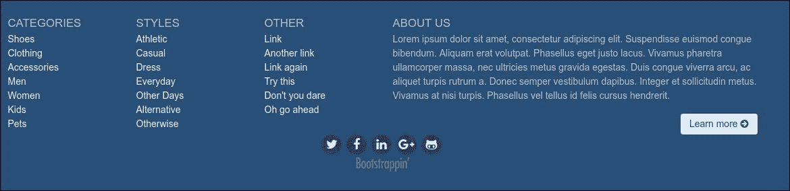

Here is the result for the medium viewport:

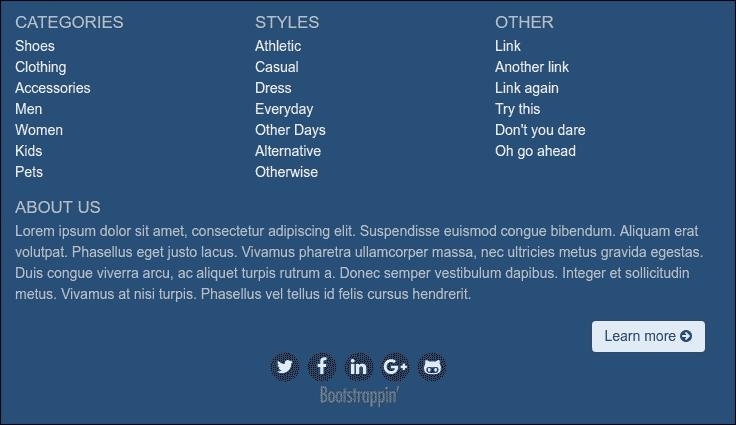

And this is for extra-small and small viewports:

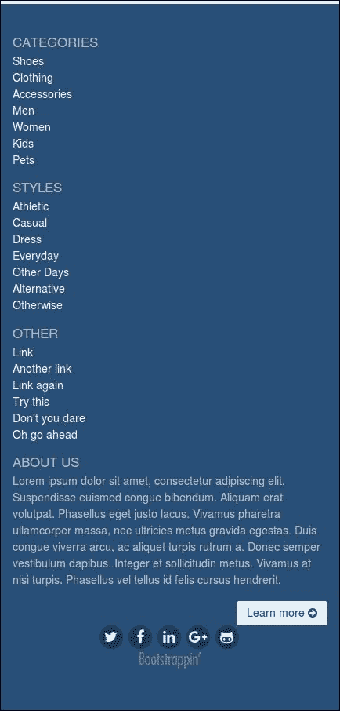

Not bad! We have built a footer capable of managing a complex array of content across the full spectrum of extra-small, small, medium, large, and extra-large viewports.

# Summary

This project has enabled us to beef up our Bootstrappin' skills in a number of ways. We've designed a responsive layout for the main content of our page, providing an appropriate visual hierarchy for three tiers of information. At the top of our page we've built a complex responsive navbar, so that it appears below the logo and banner area in medium, large, and extra-large viewports and yet collapses into a mobile-friendly navbar on smaller screens. The footer part of the project effectively manages multiple blocks of links and text across viewports.

Congratulations! In the next chapter, we'll build on these skills by designing a products page suitable for an e-commerce section for this website.

# Assessments

1.  In which of the three categories is the website broken down into?

    1.  Banner/ masthead
    2.  Footer
    3.  Header 
    4.  Both i & ii

2.  Which of the following code is correct to `right align` the `last-child`?

    1.  `.nav-item:last-child {float:right;}` 
    2.  `.nav-item:last-child {align:right;}`
    3.  `.nav-item:child-last {float:right;}`
    4.  None of the above

3.  What is the main purpose of adding utility navigation?

    1.  To display icons at the far right of the collapsed navbar 
    2.  To allow users to log in or register and to view their carts 
    3.  Both i & ii
    4.  None of the above

4.  What is the output of the following snippet?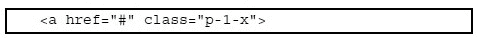

    1.  Sets a padding of `$spacer-x` on the right-hand side of the `<a>` element
    2.  Sets a padding of `$spacer-x` on the left hand side of the `<a>` element
    3.  Sets a padding of `$spacer-x` on the left- and right-hand sides of the `<a>` element
    4.  None of the above

5.  After completion of footer, which of the following final touches need to be implemented?

    1.  Refining the presentation of our three lists of links
    2.  Adjusting margins and padding
    3.  Reversing the color scheme to match our navbar colors
    4.  All of the above

```
