# 第十一章. 构建单页营销网站

我们已经掌握了 Bootstrap 的一些重要技能。现在是时候为帮助客户实现其全部在线营销潜力增添额外的美感和创意了。所以，让我们创建一个美丽、单页、高端的营销网站。

在本章中，我们将涵盖以下主题：

+   一个大型的定制响应式欢迎信息 introductory carousel

+   一个包含图片和标题的客户评价部分，采用石砌格式

+   一个带有大号 Font Awesome 图标的特性列表

+   一个带有定制设计定价表的注册部分

+   带有动画滚动行为的 ScrollSpy 导航栏

# 概览

我们遇到了一位新的潜在客户。她被单页滚动网站的美感所吸引，这些网站垂直滚动，以清晰的动作号召结束，提供视觉上令人兴奋的产品或信息展示。她想要这样的一个网站。

这位客户知识渊博且挑剔。她经常访问[`onepagelove.com`](http://onepagelove.com)，并随身携带她当前喜欢的列表。她希望的功能包括：

+   一个干净、现代、美观的网站。

+   一个带有视觉上引人入胜的背景图像的 introductory welcome message

+   以视觉上吸引人的图标突出展示她产品的主要特性。

+   以视觉上吸引人的方式展示的客户证词。

+   以直观易懂的方式概述三种基本套餐，客户可以从中选择。这些需要以清晰的方式展示，以便轻松选择合适的套餐并注册！

+   转化！一切都应该引导用户向下滚动页面，使得几乎不可能避开点击页面末尾的注册按钮。

为了保护她即将推出的产品发布的机密性，我们的客户选择不向我们透露她产品或服务的确切性质。相反，她提供了她希望我们创建的设计的样图，并使用占位符的副本。

第一部分将以一个有趣的满屏图片、一条大欢迎信息和邀请用户向下滚动页面以了解更多信息的方式开始，如以下截图所示：

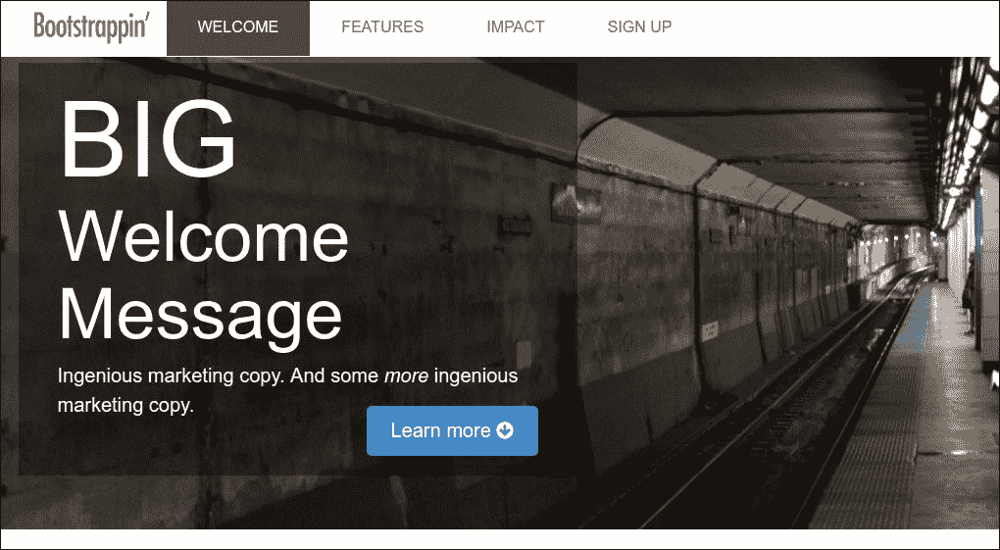

第二部分将列出产品的六个关键特性，这些特性以三列网格的形式排列，并如以下截图所示，由适当的图标说明：

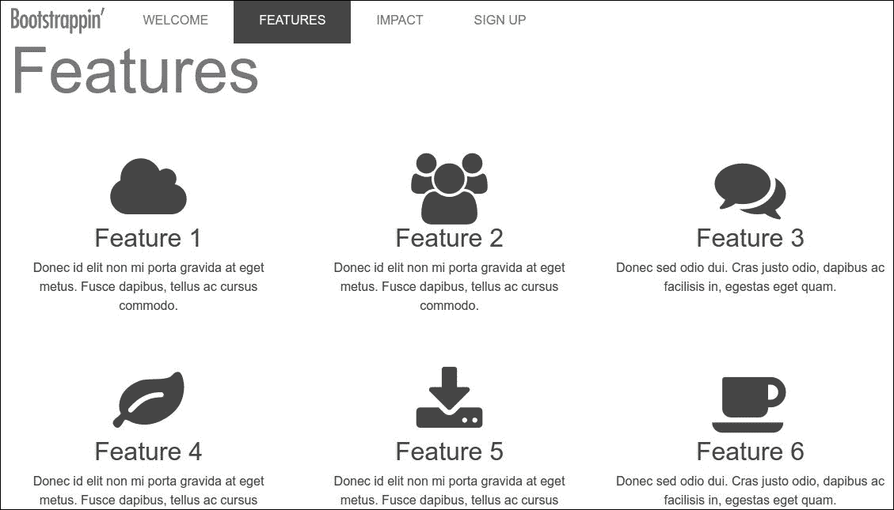

第三部分将展示带有照片和引语的客户证词，采用石砌风格布局：

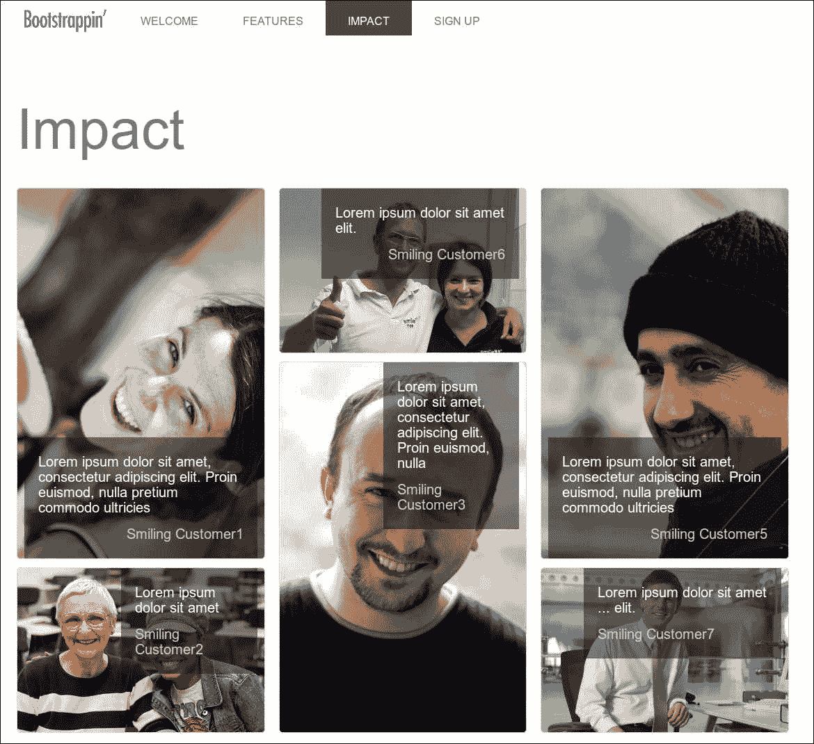

第四和最后一部分将展示三个可用的计划，每个计划都有一个定价表，并将视觉重点放在三个表格的中心，如以下截图所示：

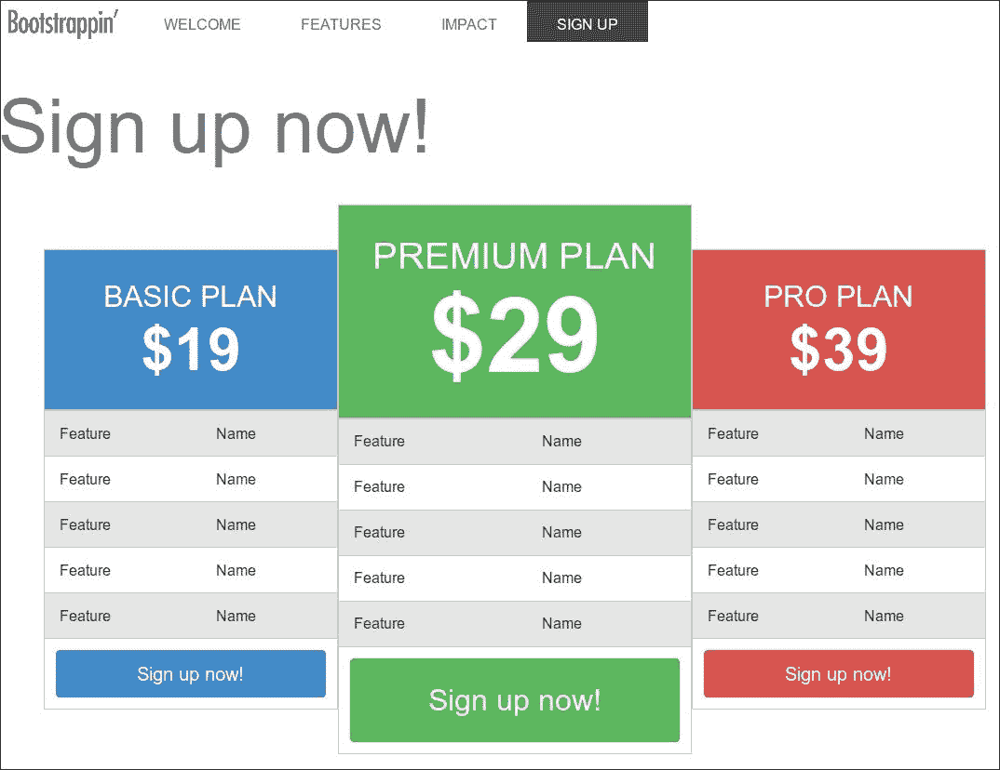

作为一位精明的客户，她还进一步要求设计能够完美适应平板电脑和手机。

一个伟大的计划。没问题。让我们开始工作。

# 检查起始文件

让我们查看这个练习的初始文件。通过使用 Bootstrap CLI 创建一个新项目。

你可以通过在控制台中运行以下命令来安装 Bootstrap CLI：

```js
npm install -g bootstrap-cli

```

然后，你可以通过运行以下命令来设置你的项目：

```js
bootstrap new

```

再次，当提示时，选择 ****一个空的新 Bootstrap 项目。由 Panini、Sass 和 Gulp 驱动**** 选项。

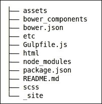

现在你需要做一些添加：

1.  创建一个新的 `assets/images` 文件夹。

1.  将 `images` 文件夹中的文件复制到新的 `assets/images` 文件夹。它包含五张图片：

    1.  一个名为 `logo.png` 的标志图片。

    1.  介绍部分的两个背景图片。

    1.  **影响**部分七张快乐的人像图片。

1.  图片会自动通过 `Gulpfile.js` 文件中的 `copy` 任务复制到 `_site` 文件夹：

```js
       // Copy assets 
       gulp.task('copy', function() { 
         gulp.src(['assets/**/*']).pipe(gulp.dest('_site')); 
        }); 

```

包含你的 Panini HTML 模板的 `html` 文件夹，应该具有以下所示文件和文件夹结构：

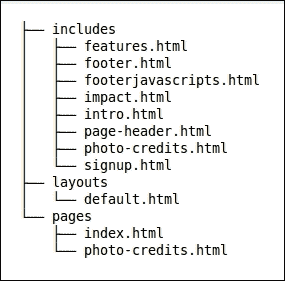

你可以在 [`github.com/zurb/panini`](https://github.com/zurb/panini) 上了解更多关于 Panini 的信息。

除了上述修改外，你也可以从 `Lesson 11/start` 文件夹中找到的文件开始。在这个文件夹中，首先运行 `npm install` 和 `bower install` 命令。运行 `npm` 和 `bower` 命令后，你可以运行 `bootstrap watch` 或 `gulp` 命令来在浏览器中查看结果。

# 查看页面内容

运行 bootstrap watch 命令，并在浏览器中查看 `http://localhost:8080/` 上的页面。你会看到以下主要组件已经就位。每个组件都有自己的 HTML 部分文件。当然，目前它们将使用默认的 Bootstrap 样式显示，等待进行必要的自定义：

+   一个固定的顶部导航栏

+   一个带有欢迎信息的巨幕

+   一个包含图标、标题和文本的三列组织的功能部分

+   **影响**部分包含六张快乐客户的照片和他们的积极证词的占位符内容

+   一个带有三个表格的 **立即注册** 部分，分别列出 **基础计划**、**高级计划** 和 **专业计划** 包，每个下面都有一个 **立即注册** 按钮

+   页脚标志

+   照片版权（图片是归属许可）

要查看标记，请打开编辑器中相应的 Panini HTML 部分文件。在接下来的步骤中，我们将非常熟悉这些标记！

# 将 Font Awesome 添加到我们的项目中

**Font Awesome** 提供可缩放的矢量图标，可以立即自定义：大小、颜色、阴影，以及任何可以用 CSS 实现的功能。

在这里，我们只是通过在 `html/layouts/default.html` HTML 模板中链接它来从 CDN 加载 Font Awesome 的 CSS 代码：

```js
<link rel="stylesheet" href="https://maxcdn.bootstrapcdn.com/font-awesome/4.6.1/css/font-awesome.min.css"> 

```

# 调整导航栏

此设计需要固定顶部的导航栏，悬停和活动链接有显著的颜色变化。我已经通过设置适当的变量应用了一些这些样式。让我指出这些，然后我们将继续对标记做一些必要的调整。

`scss/_variables.scss` 文件基于 Bootstrap 的 `variables.scss` 文件。我已经根据以前的项目自定义了灰色阴影。您将在文件的最高部分看到这些。

我已经进一步调整了以下导航栏变量，调整了其高度、边距、颜色以及悬停颜色，以适应此设计：

```js
// Navbar 
$navbar-bg:                   #fff; 

// Navbar links 
$navbar-link-color:                $gray; 
$navbar-link-bg:                   #fff; 
$navbar-link-hover-color:          #fff; 
$navbar-link-hover-bg:             $gray; 
$navbar-link-active-color:         #fff; 
$navbar-link-active-bg:            $gray-dark; 

```

导航栏的 HTML 代码位于 `html/includes/page-header.html` 文件中，如下所示：

```js
<nav class="navbar navbar-fixed-top"> 
  <div class="container">  
  <button class="navbar-toggler hidden-sm-up" type="button" data-toggle="collapse" data-target="#exCollapsingNavbar2" aria-controls="exCollapsingNavbar2" aria-expanded="false" aria-label="Toggle navigation"> 
    ? 
  </button> 
  <div class="collapse navbar-toggleable-xs" id="exCollapsingNavbar2"> 
    <a class="navbar-brand" href="index.html"></a> 
    <ul class="nav navbar-nav"> 
      <li class="nav-item active"> 
        <a class="nav-link" href="#">Welcome <span class="sr-only">(current)</span></a> 
      </li> 
      <li class="nav-item"> 
        <a class="nav-link" href="#">Features</a> 
      </li> 
      <li class="nav-item"> 
        <a class="nav-link" href="#">Impact</a> 
      </li> 
      <li class="nav-item"> 
        <a class="nav-link" href="#">Sign up</a> 
      </li> 
    </ul> 
  </div> 
  </div> 
</nav> 

```

如前述代码所示，导航栏也获得了 `navbar-fixed-top` 类，这会将导航栏固定在页面顶部。`navbar-fixed-top` 类还将 `border-radius 属性` 设置为 0。`navbar-fixed-top` 类是 Bootstrap 导航栏类之一，用于确定导航栏的位置；有静态或固定导航栏的类可用。

除了自定义变量外，我还对 `_navbar.scss` 文件做了一些调整。

我已经自定义了展开导航栏中的列表项，增加了填充，移除了链接之间的间距，并将文本转换为大写：

```js
.navbar { 
  background-color: $navbar-bg; 
  color: $navbar-link-color; 
  padding: 0 1rem;   

  .nav-item + .nav-item { 
    margin-left: 0; 
  } 
  .nav-link, .navbar-brand { 
    padding: $spacer-y * .75 $spacer-x * 2; 
  }   
} 
.navbar-brand img { 
  width: $brand-image-width; 
} 
.nav-link { 
  color: $navbar-link-color; 
  line-height: $brand-image-height; 
  text-transform: uppercase; 

  .active & { 
    background-color: $navbar-link-active-bg; 
    color: $navbar-link-active-color; 
  } 
  @include hover { 
    background-color: $navbar-link-hover-bg; 
    color: $navbar-link-hover-color; 
  } 
} 

```

### 注意

Bootstrap 预定义的 CSS 类也包含一些用于文本转换的类。有关这些文本大小写转换类的更多信息，可以在以下网址找到：[`getbootstrap.com/components/utilities/#text-transform`](http://getbootstrap.com/components/utilities/#text-transform)。

原始标志图像文件有这些设置：宽度 `900` 像素和高度 `259` 像素。我们可以使用这些值在将宽度调整为 `120` 像素时，在 Sass 中计算其高度，如下所示：

```js
$brand-image-width: 120px; 
$brand-image-height: (259 * $brand-image-width / 900); 

```

我使用 `$brand-image-height` 变量来设置导航栏链接的行高，以确保品牌图像和链接对齐。

现在，导航栏的总高度变为 `$brand-image-height + 2 * ($spacer-y * 0.75)`。我们将使用此值来设置 HTML body 元素的 `padding-top`，因为固定导航栏将覆盖 body。

`$brand-image-height` 变量使用像素单位，而 `$spacer-y` 使用 rem 单位。Sass 无法将不同维度的值相加。您可以通过除以 1rem 来移除 rem 单位。现在无单位的值乘以 `$font-size-root` 将给出像素值。

首先，在主 `scss/includes` 文件夹中创建一个新的 `_page-contents.scss`。

按照以下行所示将其导入到 `main.scss` 中：

```js
@import "_page-contents"; 

```

然后在 `scss/app.scss` 中计算 HTML body 元素的 `padding-top` 值如下所示：

```js
body { 
  padding-top: (2 * ($spacer-y * .75) / 1rem * $font-size-root) + $brand-image-height; 
} 

```

当调整后的变量和导航栏自定义一起使用时，会产生以下视觉结果：

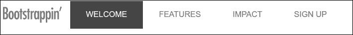

让我们继续到带有大型欢迎信息的巨型轮播。

# 自定义巨型轮播

jumbotron 是一个 Bootstrap 组件，用于突出显示您网站的关键信息。有关 jumbotron 及其 HTML 标记的更多信息，可以在以下网址找到：[`v4-alpha.getbootstrap.com/components/jumbotron`](http://v4-alpha.getbootstrap.com/components/jumbotron)/。

在本节中，我们将自定义 jumbotron 以显示我们客户的欢迎信息，并使用与她原型一致的样式。这包括添加大背景图像、放大欢迎信息文本，然后调整其多视口展示。

在 `index.html` 中，找到以下标记：

```js
    <!-- INTRO SECTION --> 
    <section class="jumbotron" id="welcome"> 
      <div class="container"> 
      <h1 class="display-3"><strong>Big</strong> Welcome Message</h1> 
      <p class="lead"> 
        Ingenious marketing copy. And some <em>more</em> ingenious marketing copy.<a href="#features" class="btn btn-lg btn-primary pull-xs-right">Learn more <span class="icon fa fa-arrow-circle-down"></span></a> 
      </p> 
      </div> 
    </section> 

```

让我们先扩展 jumbotron 的高度，并将我们想要的背景图像放置到位：

1.  在您的编辑器中打开一个新的自定义 `Sass 部分文件`，`scss/includes/_jumbotron.scss`。别忘了在 `scss/app.scss` 文件中导入它。

1.  现在，让我们设置 `#welcome` 部分的身高、背景颜色和字体颜色。在此过程中，我们还将为按钮添加一些顶部边距：

    ```js
         .jumbotron { 
           height: 300px; 
           background-color: $jumbotron-bg; 
           color: $jumbotron-color; 
           .btn { 
             margin-top: $spacer-y; 
      } 
    } 

    ```

1.  jumbotron 的背景和字体颜色在 `scss/includes/_variable.scss` 文件中设置如下：

    ```js
         // Jumbotron 
         $jumbotron-bg: #191919; 
         $jumbotron-color: contrast($jumbotron-bg); 

    ```

1.  `contrast()` Sass 函数可以在 `scss/functions_contrast.scss` 文件中找到。`contrast()` 函数使用 Sass 内置的亮度函数来返回一个亮色（白色）或暗色（黑色），这取决于输入颜色的亮度。

    ### 注意

    在设计中使用颜色对比可以提高您项目的可访问性`Using color contrasts in your design may improve the accessibility of your projects`。当您的字体颜色依赖于背景颜色，并且当您更改设计的基本颜色时自动更改，这些更改不会影响可读性和可访问性。在本章中，我们将使用简单的 `contrast()` 函数。Sass 库，如 Compass，有自己的对比函数。还可以阅读以下网址上的 *Design Accessibly, See Differently: Color Contrast Tips And Tools by Cathy O' Connor*：[`www.smashingmagazine.com/2014/10/color-contrast-tips-and-tools-for-accessibility/`](https://www.smashingmagazine.com/2014/10/color-contrast-tips-and-tools-for-accessibility/)。

1.  接下来，让我们使用媒体查询来放置大屏幕及以上的背景图像（根据当前默认的 Bootstrap 媒体查询断点值，为 991px）。

1.  如果您愿意，花几分钟时间再次打开并阅读有关 Bootstrap 响应式断点的文档。相关信息可以在以下网址找到：[getbootstrap.com/layout/overview/#responsive-breakpoints](http://getbootstrap.com/layout/overview/#responsive-breakpoints)。所有媒体查询都可通过 Sass 混合器使用。

1.  我们可以使用 Sass 的力量在 jumbotron 选择器的上下文中嵌套一个媒体查询。在这个媒体查询中，我们将指定 `subway-906x600.jpg` 图像作为背景。此图像被缩放以足够大，同时仍然加载相对较快：

    ```js
          .jumbotron { 
            @include media-breakpoint-down(md) { 
             background: url('#{$images-path}subway-906x600.jpg') center center no-repeat; 
           } 
         }

    ```

    记住，前面的 SCSS 代码编译成 CSS 代码如下：

    ```js
    @media (max-width: 991px) {
    .jumbotron {
    background: url("../images/subway-906x600.jpg") center center no-repeat;
    }
    }
    ```

1.  保存文件，运行`bootstrap watch`命令，并在浏览器中检查结果。你应该看到新背景图像出现——但仅限于窗口宽度为`991px`或更小。

1.  接下来，让我们扩展全屏高度以适应平板尺寸的视口。我们将只对中等网格编写媒体查询，将`jumbotron`元素的内部高度增加到`480px`：

    ```js
            @include media-breakpoint-only(md) { 
             height: 480px; 
            }   

    ```

1.  保存文件，运行`bootstrap watch`命令，并在浏览器中查看结果。你应该看到全屏高度增长到`480px`，适用于宽度在 768px 到`991px`之间的视口。

1.  现在，对于中等和更大的（宽度大于 992px）视口，我们将全屏的高度增加到 540px。在这个宽度上，我们将使用`subway-1600x1060.jpg`背景图像的较大版本。同时，我们将背景大小设置为`cover`：

    ```js
      @include media-breakpoint-up(lg) { 
        height: 540px; 
        background: #191919 url('#{$images-path}subway-1600x1060.jpg') center center no-repeat; 
        background-size: cover; 
      } 

    ```

1.  在这些样式规则到位后，大视口将有一个 1600px 宽的背景图像。

1.  保存文件，并在浏览器中测试它。你应该发现我们已经很好地覆盖了主要的断点。

在完成这些步骤后，全屏应该看起来像以下截图所示：

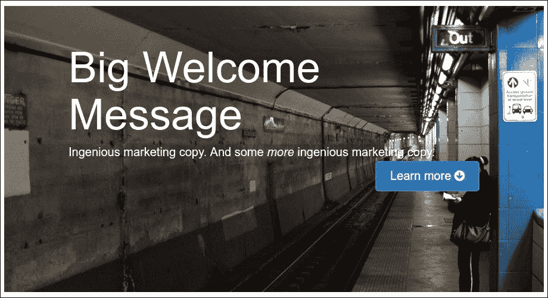

注意，我们通过使用`@include media-breakpoint-down(md)`混合调用设置了小背景图像的最大宽度。这可能会破坏 Bootstrap 的移动优先方法。可以使用媒体查询根据屏幕大小有条件地加载背景图像，从而减少手机和平板电脑的加载时间和带宽。更多信息请参阅 Tim Kadlec 的《媒体查询与资产下载结果》一文，您可以在以下 URL 找到测试结果：[`timkadlec.com/2012/04/media-query-asset-downloading-results/`](https://timkadlec.com/2012/04/media-query-asset-downloading-results/)。

接下来，我们可以为我们的大型营销消息进行样式设计，以达到最大的影响。

## 精炼全屏消息设计

我们的客户希望全屏欢迎消息更大。Bootstrap 的全屏显示-3 样式在全屏中全局增加了 350%的字体大小。我们希望进一步增强效果。我们还希望限制宽屏上消息的宽度，并在其后面放置一个深色半透明框。

在我们当前的结果中，我们应该减小小屏幕和超小屏幕的字体大小。然而，我们可以通过在文本后面放置一个半透明的深色覆盖层来提高文本的对比度。让我们在这里执行以下步骤：

1.  在`index.html`中，在全屏`container`类和`h1`标题及段落上方添加一个新的`div`标签。给这个新的`div`标签一个`welcome-message`类：

    ```js
        <section class="jumbotron"> 
          <div class="container"> 
            <div class="welcome-message">     
              <h1 class="display-3"><strong>Big</strong> Welcome Message</h1> 
              <p class="lead"> 
                 Ingenious marketing copy. And some <em>more</em> ingenious marketing copy.<a href="#features" class="btn btn-lg btn-primary pull-right">Learn more <span class="icon fa fa-arrow-circle-down"></span></a> 
              </p> 
            </div> 
          </div> 
        </section> 

    ```

1.  现在，为了为这个新的`div`创建一些样式，在`scss/includes/_jumbotron.scss`文件中我们将执行以下步骤：

    +   使用 HSLA 给它一个半透明的深色背景

    +   通过将其定位为`absolute`并设置其 top、bottom、left 和 right 值为`0`来将其拉伸以填充巨幕的整个宽度和高度

    +   使用`container`选择器将`jumbotron`本身定位为`relative`，以便它将锚定我们的绝对定位欢迎信息

    +   向欢迎信息添加内部填充

    +   使用提供的`strong`标签将单词**Big**转换为大写并增加其字体大小：

        ```js
        .jumbotron {  .container {    position: relative;    height: 100%;    .welcome-message {      background-color: hsla(0,0,1%,0.4); // translucent overlay      position: absolute;       top: 0;      left: 0;      right: 0;      @include media-breakpoint-up(lg) {        right: 50%;      }      bottom: auto;      padding: 20px 40px;      strong {        font-size: 1.5em;        text-transform: uppercase;      }      @include media-breakpoint-down(sm) {        .display-3 {          font-size: 1.5em;        }       }      }  }}
        ```

1.  保存文件，运行 bootstrap watch 命令，并在浏览器中检查结果。你应该看到以下截图所示的背景变暗，文本与背景对比更加清晰：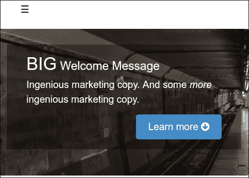

1.  最后，让我们处理中等和大型视口。我们将在`Sass`媒体查询混合中进一步限制宽度：

    ```js
             .jumbotron { 
               .container { 
                .welcome-message { 
                 right: 0; 
                  @include media-breakpoint-up(lg) { 
                    right: 50%; 
                 } 
                } 
              }     
            } 

    ```

1.  再次，保存文件，并在浏览器中查看。你应该在大视口中看到以下结果：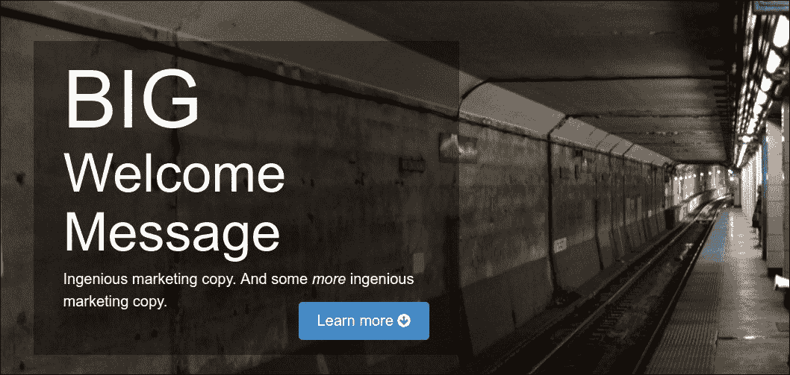

任务完成！

我们的定制巨幕已经完成，提供了客户要求的大欢迎信息，包括适应平板电脑和手机尺寸视口的能力，我们通过移动优先的方法高效地实现了这一点。

现在我们准备进入功能列表。

# 美化功能列表

我们需要放大图标，居中文本，并整理网格布局。让我们回顾功能列表的标记结构：

```js
<section id="features"> 
  <div class="container"> 
    <h1>Features</h1> 
    <div class="row"> 
      <div class="features-item col-md-4"> 
        <span class="icon fa fa-cloud"></span> 
        <h2>Feature 1</h2> 
        <p>Donec id elit non mi porta gravida at eget metus. Fusce            dapibus, tellus ac cursus commodo. </p> 
      </div> 
   ... 

```

每个功能及其图标、标题和段落都被包裹在一个带有两个类`features-item`和`col-md-4`的`div`标签中。

在这个想法的基础上，让我们编写我们需要的样式：

1.  创建`scss/includes/_features.scss`，一个新的 Sass 部分，并且不要忘记在`scss/app.scss`文件中导入它：

    ```js
            @import "includes/navbar"; 
            @import "includes/jumbotron"; 
            @import "includes/features"; 

    ```

1.  在您的编辑器中打开`scss/includes/_features.scss`，为我们的`#features`部分添加一个带有注释的新部分：

    ```js
           // Features Section 
           #features { 

            } 

    ```

1.  现在，让我们通过居中文本、添加填充、提供一个固定高度以防止浮动元素相互干扰以及将`.icon`字体大小增加到`90px`来关注`.features-item`部分：

    ```js
             #features { 
               .features-item { 
                text-align: center; 
                padding: 20px; 
                height: 270px; 
                .icon { 
                   font-size: 90px; 
                } 
                 } 
            } 

    ```

1.  保存文件，并在浏览器中测试结果。如果您还没有这样做，请先运行`bootstrap watch`命令。你应该在中等视口中看到以下结果：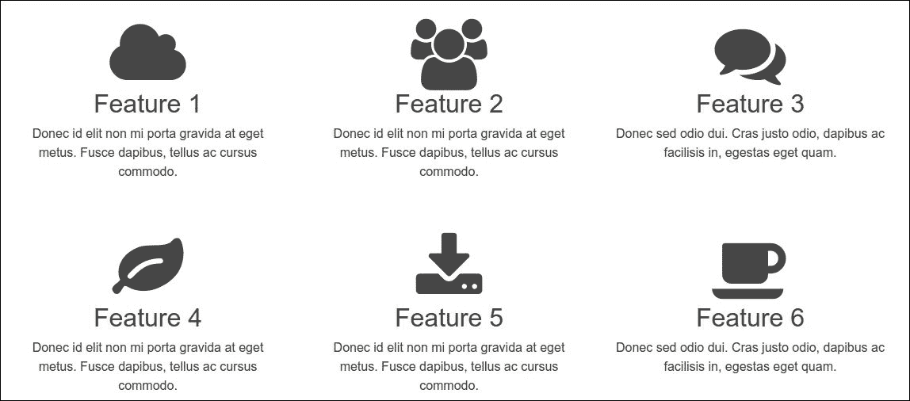

1.  这是一个很好的开始！现在让我们调整我们的功能部分以适应小屏幕。目前，我们的`.features-item`部分包含一个`col-md-4`类。我们可以通过添加一个`col-sm-6`类将我们的小屏幕布局改为两列，如下面的截图所示：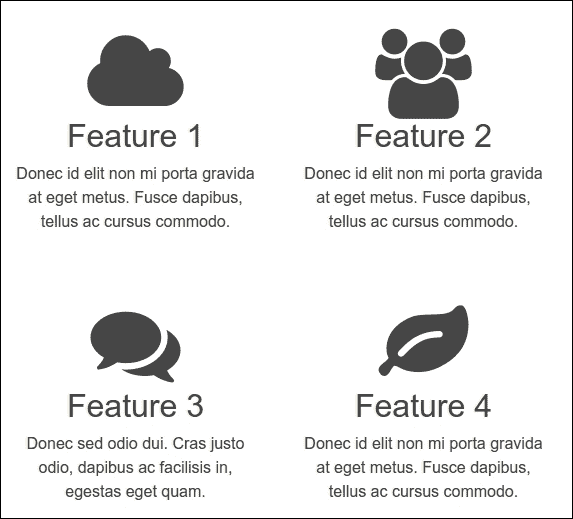

1.  然后，当然，它们将排列成单列以适应超小屏幕。

1.  不幸的是，在超小屏幕的上限，500px 到 767px，全宽布局允许描述性文本范围太宽。

1.  我们可以通过添加一个媒体查询来解决这个问题，在这个查询中我们为`.features-item`部分设置最大宽度，并通过设置水平边距为自动来居中内容：

    ```js
             // Features Section 
             #features { 
                @include media-breakpoint-only(xs) { 
                 margin: 0 auto; 
                 max-width: 320px; 
                 }   
               }   
             } 

    ```

1.  Bootstrap 还包括一个`m-x-auto`类，用于水平居中固定宽度的块级内容。`m-x-auto`类取代了 Bootstrap 3 中的 center-block 类和 mixin。

1.  在这些行设置到位后，我们的`.features-item`元素在所有视口中都保留其所需的尺寸！在小视口中，我们的功能将看起来像这样：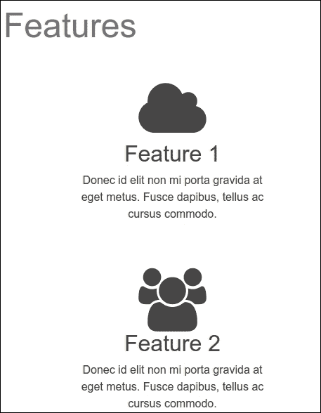

1.  到目前为止，我们已经满足了客户对她网站该部分的需求！我们准备继续进行客户评价。

# 应对客户评价

我们下一个部分，命名为**影响**，展示了快乐客户的评价。在这个部分，我们看到了快乐客户的微笑面孔以及他们对我们客户产品的评论摘录。

我们将再次使用**卡片**模块来处理这个部分。卡片模块是一个灵活且可扩展的内容容器，它取代了 Bootstrap 早期版本中使用的面板、缩略图和井。

使用卡片模块创建网格布局。网格布局通过根据可用垂直空间放置元素来优化位置，有点像石匠在墙上放置石头。您将再次为影响部分创建一个 Masonry 网格布局。Bootstrap 的网格解决方案仅使用 CSS。如果您需要一个在旧浏览器中也工作的 JavaScript 解决方案，您可以使用一个可用的 JavaScript masonry 插件，该插件位于[`masonry.desandro.com`](http://masonry.desandro.com)。

卡片列使用 CSS 多列布局；您可以在以下 URL 了解更多信息：[`developer.mozilla.org/en-US/docs/Web/CSS/CSS_Columns/Using_multi-column_layouts`](https://developer.mozilla.org/en-US/docs/Web/CSS/CSS_Columns/Using_multi-column_layouts)。

在 IE9 及以下版本中，无法使用网格布局，因为它们不支持`column-*` CSS 属性。

因此，初始标记开始如下：

```js
<!-- IMPACT SECTION --> 
   <section id="impact"> 
   <div class="container"> 
         <h1>Impact</h1> 
   <div class="reviews card-columns">
```

每个评价都使用`hreview`微格式标记如下：

### 注意

微格式是 HTML 的扩展，用于标记诸如人物、组织、产品和评价等事物。使用微格式的网站发布一个标准 API，可以被搜索引擎、浏览器和其他工具消费。**h-review**是一个简单的、开放的格式，用于在网络上发布评价。更多信息可以在以下 URL 找到：[`microformats.org/`](http://microformats.org/)。

```js
            <div class="hreview review-item-1 card"> 
               
              <div class="caption card-img-overlay"> 
                <blockquote class="description card-img-overlayquote"> 
                  <p>Lorem ipsum dolor sit amet, consectetur adipiscing elit. Proin euismod, nulla pretium commodo ultricies</p> 
                  <footer>Smiling Customer1</footer> 
                </blockquote> 
              </div> 
            </div> 

```

每张卡片图像都获得`img-fluid`类，以使图像响应式并适应卡片。

该类将图像转换为卡片背景，并通过将图像的位置属性设置为绝对和卡片的定位属性设置为相对来覆盖卡片的文本。

每张卡片（具有卡片类）将自动排列在网格中，这是由于选择器的`card-columns`类。

`card-columns`类默认为小网格及以上创建 CSS 列。在超小网格上，网格项将堆叠。在`scss/includes/_impact.scss`文件中使用以下 SCSS 代码为小网格上的两列：

```js
.card-columns { 
  column-gap: $card-columns-sm-up-column-gap; 
  @include media-breakpoint-up(sm) { 
    column-count: 2; 
  } 
  @include media-breakpoint-up(md) { 
    column-count: 3; 
  } 
  > .card { 
    // see: https://github.com/twbs/bootstrap/pull/18255#issuecomment-237034763 
    display: block; 
  }   
} 

```

你可以在[`microformats.org/wiki/hreview-examples`](http://microformats.org/wiki/hreview-examples)上了解关于`hreview`微格式的信息。

保存你的修改并运行`bootstrap watch`命令。你会发现影响部分现在应该看起来像以下截图：

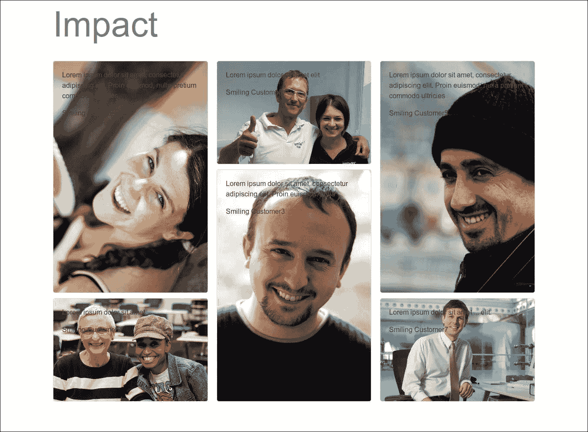

从语义和呈现起点来看，我们有一个良好的开端。

因为我们想要达到一个类似杂志的布局，我们的图片是肖像和横幅宽高比的混合。我们使它们都具有相同的宽度，以便为明亮的面孔和带有简短赞美语句的文本叠加提供足够的空间。

在处理更大视口布局之前，让我们先解决标题问题。

## 定位和样式化标题

让我们从将我们的标题定位为各自客户照片上的叠加层开始：

1.  在编辑`scss/includes/_impact.scss`文件时，为`#impact`部分添加一个新的注释和选择器：

    ```js
             // Impact Section 
             #impact { 

             } 

    ```

1.  现在，我们可以着手处理标题。我们将添加半透明背景，并将它们定位在每个图像的底部作为绝对位置：

    ```js
            .hreview { 
              .caption { 
                position: absolute; 
                 top: auto; 
                 left: 10px; 
                 right: 10px; 
                bottom: 0; 
                line-height: 1.1; 
                background: hsla(0,0,10%,0.55); 
              } 

    ```

1.  现在我们可以专注于评价文本，并指定边距、边框、字体家族、字体大小和颜色：

    ```js
              blockquote { 
                margin-top: 4px; 
                border: none; 
                 font-family: @font-family-serif; 
                 font-size: @font-size-large; 
                   color: #fff; 
              } 

    ```

1.  接下来，指定出现在评价文本下方评论者名称的样式：

    ```js
              .reviewer { 
                 margin-top: 2px; 
                 margin-bottom: 4px; 
                 text-align: right; 
                color: $gray-lighter; 
               } 

    ```

1.  保存文件，运行`bootstrap watch`命令，并检查你的进度。

1.  你最终应该得到一个像以下截图所示的**影响**部分：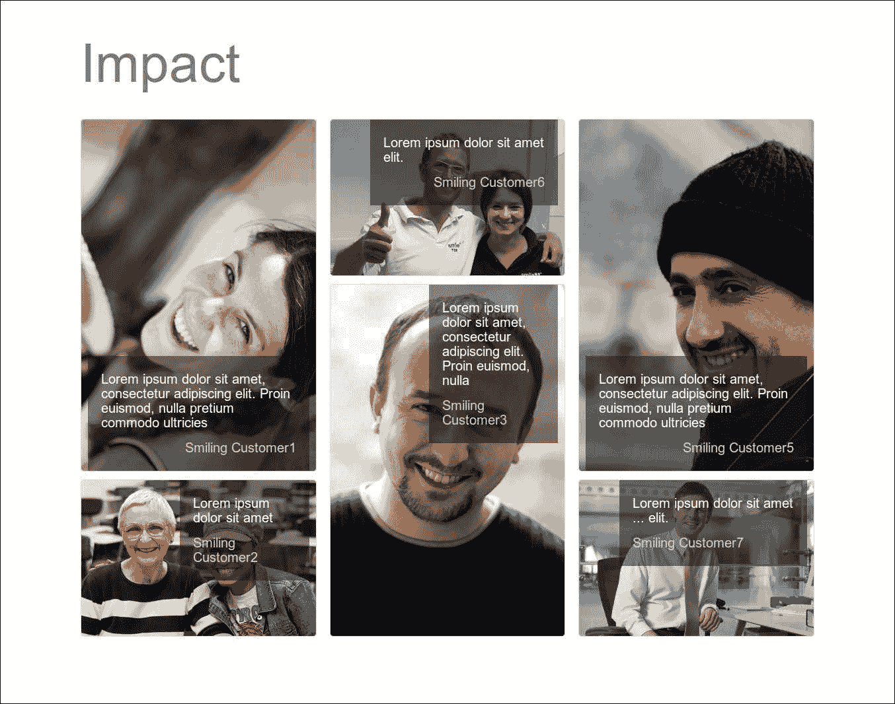

还不错！然而，我们可以做得更好一步。

## 优化标题位置

仔细观察前述截图中的可用开放空间，并检查响应式网格中各种视口宽度下的重叠变化，你可能希望以最适合每位客户照片的方式定位每个标题。

这就是`review-item-1`、`review-item-2`等类变得相关和有用的地方，因为我们可以使用这些特定的类以最适合其图像的方式定位每个标题。

为了展示标题的位置，我在`scss/includes/_impact.scss`文件中添加了以下行：

```js
  .hreview:nth-child(2n) .caption { 
    top: 0; 
    left: 62%; 
    right: 10px; 
    bottom: auto; 
    .reviewer { 
      margin-top: 6px; 
      text-align: left; 
    } 
  } 
  .hreview:nth-child(3n) .caption { 
    top: 0; 
    left: 17%; 
    right: 10px; 
    bottom: auto; 
  }   

```

前述标记调整了每个第二个和第三个标题的绝对定位，从而产生了以下截图所示的结果：

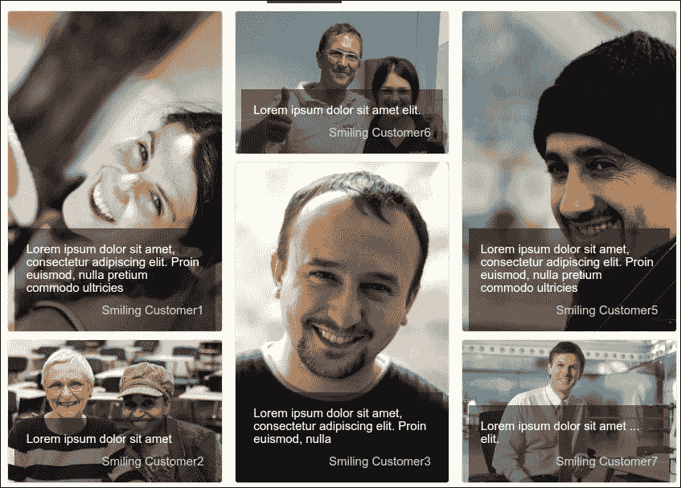

在上述内容中，除了使用`:nth-child()`选择器外，你也可以编写自己的 SCSS 来定位每个特定的标题。

### 调整小屏幕

在超小网格上，评价是堆叠的，而在小网格上，我们将它们排列成两列。

首先，我们将减小小网格中标题的字体大小。要减小字体大小，请将以下 SCSS 代码插入到 `scss/includes/_impact.scss` 文件中：

```js
#impact { 
  .caption { 
    blockquote { 
      font-size: $font-size-sm; 
      @include media-breakpoint-only(sm) { 
        font-size: $font-size-lg; 
      } 
    } 
  } 
}       

```

在小和超小网格中，我们只显示前四个评论。默认隐藏最后评论，可以使用以下 SCSS 代码：

```js
// Impact Section 
#impact { 
 .hreview:nth-child(5), .hreview:nth-child(6) { 
   display: none; 
   @include media-breakpoint-only(md) { 
     display: block; 
   } 
 } 
} 

```

保存文件，然后在浏览器中测试结果。

哇！客户评论现在完全符合我们客户的期望。

现在来处理我们客户希望主页设计中最后一个重要项目：定价表格。

# 创建引人注目的定价表格

让我们回顾一下客户希望桌面屏幕大小的定价表格的布局：

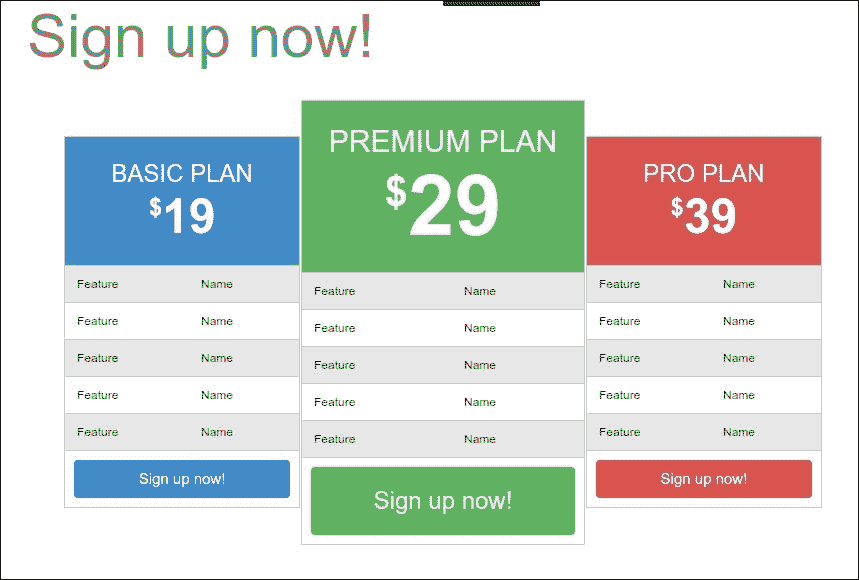

让我们看看我们能否接近期望的结果，以及我们可以为其他视口大小做些什么。

## 设置变量、文件和标记

如前一张截图所示，这个设计中包含几个表格。我们可以先调整所有表格的一些基本变量。这些变量可以在 Bootstrap 的 `_variables.scss` 文件中找到。搜索表格部分，并根据需要调整背景、强调行和边框的变量。我已经按照以下代码行进行了调整，并将它们保存在本地的 `scss/includes/_variables.scss` 文件中：

```js
// Tables 
// 
// Customizes the `.table` component with basic values, each used across all table variations. 

$table-cell-padding:            .75rem; 
$table-sm-cell-padding:         .3rem; 

$table-bg:                      transparent; 
$table-bg-accent:              hsla(0,0,1%,.1); // for striping 
$table-bg-hover:                hsla(0,0,1%,.2); 
$table-bg-active:               $table-bg-hover; 

$table-border-width:           1px; 
$table-border-color:            $gray-lighter; 

```

保存文件，并运行 `bootstrap watch` 命令以查看以下截图所示的结果：

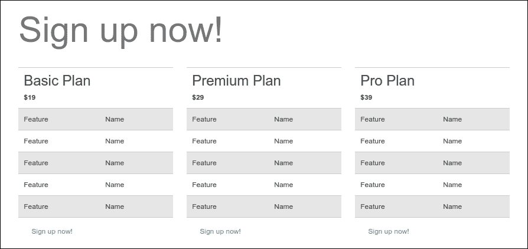

这只是一个开始。现在我们需要编写更具体的样式。

为了携带自定义样式，让我们为这些定价表格创建一个新的 Sass 文件：

1.  在主 `scss/includes` 文件夹中创建 `_pricing-tables.scss`。

1.  在以下行中将其导入到 `main.scss` 中，紧接在 `_impact.scss 文件导入之后，如下所示：

    ```js
        @import "_pricing-tables";
    ```

1.  在您的编辑器中打开 `_pricing-tables.less` 文件并开始编写您的新样式。

在我们开始编写样式之前，让我们回顾一下我们将要处理的标记。

我们已经在每个相应表格的父元素上提供了以下特殊类：

+   `package package-basic`

+   `package package-premium`

+   `package package-pro`

因此，对于第一个表格，您将在其父 `div` 上看到以下标记：

```js
<div class="package package-basic col-lg-4"> 
   <table class="table table-striped"> 
... 

```

注意到上述 HTML 代码中的 `table` 和 `table-striped` 类是 Bootstrap 样式的一部分，用于显示内容。您可以通过仅向任何 `<table>` 元素添加表格基本类来使用这些样式，通过扩展基本类添加自定义样式，或者通过包括修饰类（如 `table-striped` 类）来实现。有关 Bootstrap 中的表格的更多信息，请参阅以下网址：[`getbootstrap.com/content/tables/http://v4-alpha.getbootstrap.com/content/tables/`](http://getbootstrap.com/content/tables/http://v4-alpha.getbootstrap.com/content/tables/)。

同样，我们将分别使用 `package package-premium` 和 `package package-pro` 为第二和第三个表格。

这些父容器显然也使用 `col-md-4` 类在中等视口及以上设置了一个三列布局的基本布局指令。

接下来，我们将观察每个表格的标记。我们看到已经应用了基本的 `table` 和 `table-striped` 类：

```js
<table class="table table-striped"> 

```

表格使用 `<thead>` 元素作为其最顶部的块。在这个块中，有一个跨越两列的 `<th>` 元素，其中包含用于包名的 `<h2>` 标题和 `<div class="price">` 用于标记美元金额：

```js
  <thead> 
    <tr> 
      <th colspan="2"> 
        <h2>Basic Plan</h2> 
        <div class="price">$19</div> 
      </th> 
    </tr> 
  </thead> 

```

接下来是包含“现在注册！”按钮的 `tfoot` 标签：

```js
  <tfoot> 
    <tr><td colspan="2"><a href="#" class="btn">Sign up        now!</a></td></tr> 
  </tfoot> 

```

然后是包含特性列表的 `tbody` 标签，这些特性以两列的行以直接的方式排列：

```js
  <tbody> 
    <tr><td>Feature</td><td>Name</td></tr> 
    <tr><td>Feature</td><td>Name</td></tr> 
    <tr><td>Feature</td><td>Name</td></tr> 
    <tr><td>Feature</td><td>Name</td></tr> 
    <tr><td>Feature</td><td>Name</td></tr> 
  </tbody> 

```

最后，当然，`table` 和父 `div` 标签的闭合标签：

```js
  </table> 
</div><!-- /.package .package-basic --> 

```

每个表格都重复这种基本结构。这为我们开始工作提供了所需的内容！

## 美化表格标题

为了美化所有表格的 `thead` 元素，我们将执行以下操作：

+   居中对齐文本

+   添加背景颜色；目前，添加一个灰色，它大约是中间色调，类似于我们将应用到最终版本中的颜色

+   将字体颜色改为白色

+   将 `h2` 标题转换为大写

+   增加价格表的大小

+   在表格周围添加必要的填充

我们可以用以下 SCSS 代码应用许多这些细节。我们将指定 `#signup` 部分为这些特殊表格样式的上下文：

```js
#signup { 
  table { 
    border: 1px solid $table-border-color; 
    thead th { 
      text-align: center; 
      background-color: $gray-light; 
      color: #fff; 
      padding: 2 * $spacer-y 0; 

      h2 { 
        text-transform: uppercase; 
        font-size: 2em; 
      } 
    } 
  } 
} 

```

简而言之，我们已经完成了所有的事情，除了增加价格表的大小。我们可以通过添加以下代码行开始这项工作，这些代码仍然嵌套在 `#signup table` 选择器中：

```js
.price { 
      font-size: 4em; 
      line-height: 1; 
} 

```

这会产生以下结果：

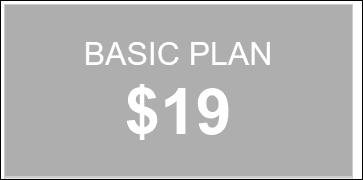

这已经接近我们期望的结果，但我们需要减小美元符号的大小。我们可以在 `.price` 样式中嵌套第一个字母：

```js
  .price { 
    font-size: 4em; 
    line-height: 1; 
    &::first-letter { 
      font-size: .5em; 
      vertical-align: super;    
    } 
  } 

```

`::first-letter` 是一个伪元素，它允许你在不需要在 HTML 中的第一个字母周围放置 `<span>` 标签的情况下，为元素中的第一个字母设置样式。你可以在以下网址了解更多关于这个伪元素的信息：[`css-tricks.com/almanac/selectors/f/first-letter/`](https://css-tricks.com/almanac/selectors/f/first-letter/).

这些行将美元符号的大小减半并对其顶部对齐。以下截图显示了结果：

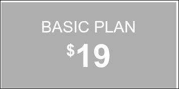

## 样式化表格主体和页脚

继续关注适用于所有三个定价表格的样式，让我们做出以下调整：

+   为特性列表添加左右内边距

+   将按钮拉伸到全宽

+   增加按钮大小

我们可以通过添加以下规则来实现这一点：

```js
#signup { 
  table { 
    tbody { 
      td { 
        padding-left: $spacer-x; 
        padding-right: $spacer-x; 
      } 
    } 
    a.btn { 
      @extend .btn-lg; 
      font-size: 1.25em; 
      display: block; 
      width: 100%; 
      background-color: $gray-light; 
      color: #fff; 
    } 
  } 
} 

```

在前面的 SCSS 代码中，Sass 的 `@extend` 功能已被用来扩展按钮以使用 Bootstrap 的大按钮样式。Bootstrap 本身避免使用 `@extend` 功能，但你也可以使用它。

### 小贴士

或者，您可以使用 Bootstrap 的 `button-size()` 混合来设置大按钮样式。请注意，我在此之后设置了 font-size: 1.25em;。按钮混合使用 rem 单位设置字体大小，而我们希望字体大小与其父元素成比例。

保存文件，运行 `bootstrap watch` 命令，您应该看到以下结果：

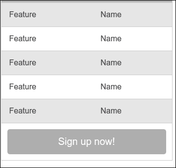

现在，我们准备好为我们的三个包装添加样式以区分它们。

## 区分包装

让我们先为每个包装指定表格头部和 **立即注册！** 按钮的所需颜色。我们的提供的原型使用蓝色为 **基础**，绿色为 **高级**，红色为 **专业**。让我们通过以下代码行中的所选颜色值来准备我们的颜色方案，为一级、二级和三级品牌颜色创建新的变量，如下所示：

```js
$brand-primary:             #428bca; 
$brand-secondary:           #5cb85c; 
$brand-tertiary:            #d9534f; 

```

在设置了这些颜色后，我们可以高效地将它们应用到适当的 `thead` 和 `button` 元素上。我们将使用之前应用到每个表格父元素上的独特类，即 `package-basic`、`package-premium` 和 `package-pro`：

1.  在 `scss/includes/_pricing-tables.scss` 文件中，以注释开始一个新的部分：

    ```js
                // Pricing Table Colors 

    ```

1.  我们将使用 $`brand-primary` 变量将主品牌颜色应用到 `.package-basic` 表格上；我们首先尝试将其应用到 `thead th` 元素上：

    ```js
            #signup .package-basic table { 
             thead th { 
                background-color: $brand-primary; 
             } 

    ```

1.  然后，将主品牌颜色应用到 `thead th` 元素的按钮上。在这里，我们将使用来自 `bootstrap/mixins.less` 文件的 `.button-variant()` 混合来高效地应用 `:hover` 和 `:active` 状态的样式。该混合函数接受三个参数：颜色、背景颜色和边框颜色。我们将如下定义它们：

    ```js
              ... 
              .btn { 
                @include button-variant(#fff, $brand-primary, darken($brand-primary, 5%)); 
              } 
             } 

    ```

1.  当编译时，这个简洁的混合将生成按钮及其悬停和活动状态的样式！

    ### 小贴士

    为了了解 `button-variant()` 混合的工作方式，请参考定义该混合的 `bootstrap/scss/mixins/_buttons.scss` 文件，然后是使用该混合定义默认 Bootstrap 按钮类的 `bootstrap/scss/_buttons.scss` 文件。

1.  现在，我们需要为我们的 `.package-premium` 表格重复此操作；然而，这次使用 $`brand-secondary` 变量：

    ```js
             #signup .package-premium table { 
              thead th { 
                background-color: $brand-secondary; 
               } 
              .btn { 
                 @include button-variant(#fff, $brand-secondary, darken($brand-secondary, 
                 5%)); 
               } 
             } 

    ```

1.  最后，我们将使用 $`brand-tertiary` 变量将三级品牌颜色应用到 `.package-pro` 表格上：

    ```js
             #signup .package-pro table { 
              thead th { 
                 background-color: $brand-tertiary; 
               } 
              .btn { 
                @include button-variant(#fff, $brand-tertiary, darken($brand-tertiary, 
                5%)); 
               } 
              } 

    ```

1.  您可能已经注意到，前面的步骤和代码非常重复。Sass 可以帮助您编写 CSS 代码 DRY（**D**o not **R**epeat **Y**ourself）。通过将名称包裹在 Sass 映射中并使用 `@each` 循环，您只需编写一次代码。

    ### 注意

    您还可以阅读我的 *Sass 和 Compass 设计师食谱*，了解如何使用 Sass 为您的 Web 开发项目编写高效、可维护和可重用的 CSS 代码。您可以在以下网址找到它：[`www.packtpub.com/web-development/sass-and-compass-designers-cookbook`](https://www.packtpub.com/web-development/sass-and-compass-designers-cookbook)。

1.  保存文件，如果你还没有运行，请运行`bootstrap watch`命令。你应该能看到我们应用到表格中的新颜色：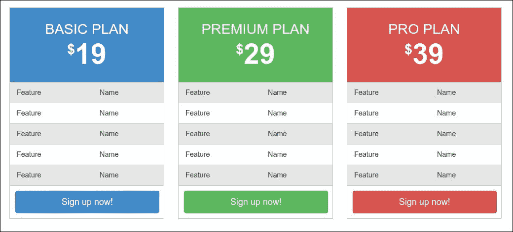

很好！

现在，让我们检查我们的表格如何响应不同的视口宽度。

## 调整小视口

感谢 Bootstrap 对响应式设计的关注，我们的表格在视口断点处表现相当好。我们已经看到了表格在中断点范围内的表现。在大屏幕上，表格会扩展得更宽。在窄视口中，表格垂直堆叠，相当不错。

然而，在约 480px 到 768px 的尴尬宽度范围内，表格会扩展以填充整个屏幕宽度。显然，它们变得太宽了。

由于我们有三个表格，在这个尺寸下有两个列布局没有好处。相反，让我们限制表格的宽度，并通过设置左右边距为`auto`来将它们居中对齐。我们将使用`media-breakpoint-down()`媒体查询混合器将最大宽度设置为`400px`，并将水平边距设置为自动，以保持表格在窗口中心：

```js
// 
// Constrain width for small screens and under 
// ------------------------------------------ 

@include media-breakpoint-down(sm) { 
  #signup .package { 
      max-width: 400px; 
      margin: 0 auto; 
    } 
} 

```

你不能使用 Sass 的`@extend`功能来通过扩展`.m-x-auto`类来居中表格，因为你不能在`@media`内部从外部选择器中@extend。

在中等网格中，表格的宽度超过了网格列的宽度，因此我们通过以下 SCSS 代码仅减少中等网格的总字体大小：

```js
#signup { 
  font-size: 100%; 
  @include media-breakpoint-only(md) { 
    font-size: 70%; 
  } 
} 

```

保存文件，并在浏览器中测试结果。你应该看到在窗口中居中对齐的、很好地约束的表格！以下截图显示了我们的结果：

到目前为止，我们的表格通过颜色区分，并且是响应式的。然而，还有一个最后的步骤。在中等和大型视口宽度下，我们希望高级计划脱颖而出。

## 为我们的表格提供视觉层次

如果我们回顾一下原型，我们会看到设计——至少对于桌面大小的视口——要求通过增加大小并将其视觉上带到前景来对中心的高级计划进行视觉强调。

这可以通过调整填充、边距和字体大小来实现。我们将在中等视口及以上的媒体查询中完成这项工作：

```js
// 
// Visually enhance the premium plan 
// ------------------------------------------ 
@include media-breakpoint-up(md) { 

} 

```

我们的首要目标是让表格彼此更靠近。这可以通过移除网格列之间的填充（网格的沟槽）来实现：

```js
#signup { 
  // Squeeze tables together 
  .col-md-4 { 
    padding: 0; 
  } 
} 

```

然后，我们可以将高级块中的价格信息字体大小放大，如下所示：

```js
#signup { 
  .package-premium .price { 
    font-size: 7em; 
  }   
} 

```

在这个媒体查询内部，我们可以首先减少基本表格和高级表格（第一和第三个）的宽度，并在顶部添加一点边距以稍微将其推下：

```js
  // Size down the basic and pro 
  #signup .package-basic { 
    padding-left: 4 * $spacer-y; 
  } 
  #signup .package-pro { 
    padding-right: 4 * $spacer-y; 
  } 
  #signup .package-basic table, 
  #signup .package-pro table { 
    margin-top: 3 * $spacer-x; 
  }    

```

接下来，让我们增强我们的高级表格的字体大小，并为其按钮添加填充：

```js
  // Size up the premium 
  #signup .package-premium table { 
    thead th { 
      h2 { 
        font-size: 2.5em; 
      } 
    } 
    a.btn { 
      font-size: 2em; 
      padding-top: 1.5 * $spacer-x; 
      padding-bottom: 1.5 * $spacer-x; 
    } 
  } 

```

保存文件，并在浏览器中检查结果。你应该在大于或等于 1,200px 的大视口中看到以下结果：

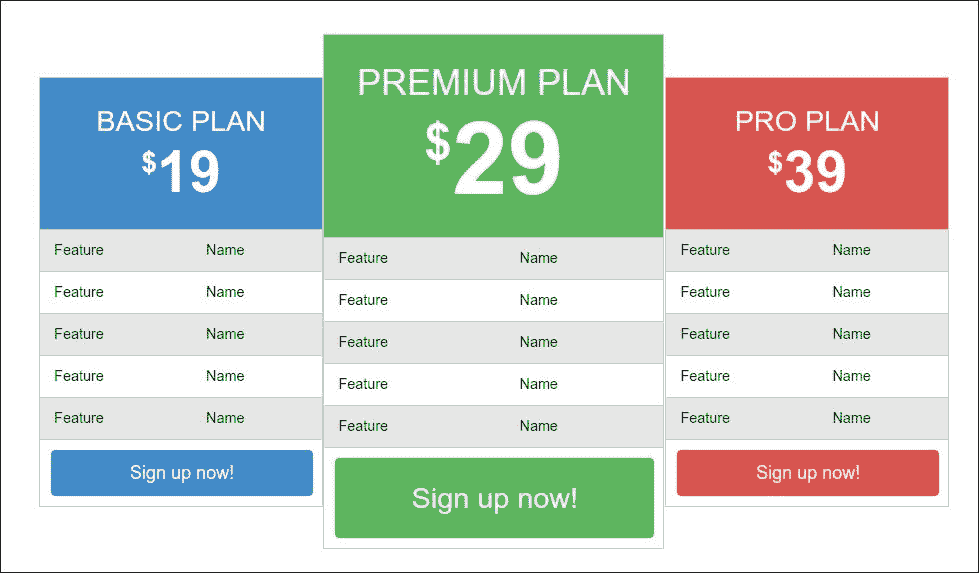

就这样！我们已经完成了客户设计中最后一个主要挑战。现在让我们通过应用那些使其完整的小细节来整理一下。

# 添加最终细节

在本节中，我们将增强保持我们设计一致性的细节。首先，我们将增强我们每个主要部分的`h1`标题，并为每个部分添加一些必要的顶部和底部填充。然后，我们将通过向 navbar 添加 ScrollSpy 和使用 jQuery 在点击 navbar 项时触发滚动动作来增强导航体验。

让我们先从增强每个部分的`h1`标题的大小和对比度开始，并增加顶部和底部填充。如果你停下来看看这些`h1`标题，你可能会注意到它们相当平淡。

扩大这些标题，稍微降低对比度，并添加额外的填充，这将产生很大的影响。我们只想将这些规则应用于**功能**、**影响**和**注册**部分。我们将通过 ID 选择这些部分：

1.  再次在你的编辑器中打开`scss/includes/_page-contents.scss`文件。

1.  在文件顶部，在应用顶部填充的规则之后，添加以下行：

    ```js
          #features, #impact, #signup { 
            padding-top: $spacer-y * 2.5; 
            padding-bottom: $spacer-y * 3; 
            h1 { 
              font-size: 5em; 
              color: $gray; 
              line-height: 1.3; 
              padding-bottom: $spacer-y * 1.5; 
           } 
          } 

    ```

1.  这里，我们做了以下几件事：

    +   为这些部分添加了顶部和底部填充

    +   显著增加了`h1`标题的大小

    +   减少了那个标题的强烈对比

    +   通过设置行高和底部填充确保标题有足够的空间呼吸

1.  保存你的工作，并在浏览器中注意差异：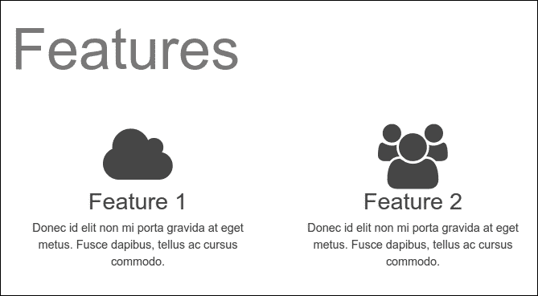

这几乎在所有视口大小上都会产生很好的结果。对于小视口，`h1`字体大小现在有点大。所以，让我们调整一下。由于我们不想这些样式流向更大的视口，我们将通过限制它们只适用于更大的视口来包裹我们已编写的样式。最后，重构的以移动优先的 SCSS 代码应该看起来像这样：

```js
#features, #impact, #signup { 
  padding-top: $spacer-y * 1.5; 
  padding-bottom: $spacer-y * 1; 
  h1 { 
    font-size: 3em; 
    color: $gray; 
    line-height: 1.3; 
    padding-bottom: $spacer-y; 
  } 

  @include media-breakpoint-up(md) { 
    padding-top: $spacer-y * 2.5; 
    padding-bottom: $spacer-y * 3; 
    h1 { 
      font-size: 5em; 
      padding-bottom: $spacer-y * 1.5; 
    } 
  } 
} 

```

以下截图显示了我们的结果：

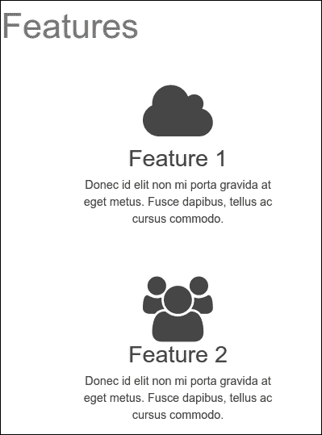

这是一个大幅改进的结果！现在我们将增强导航体验。

# 向 navbar 添加 ScrollSpy

让我们配置我们的顶部 navbar 以指示我们在页面上的位置。我们将向 navbar 添加 Bootstrap 的 ScrollSpy 行为。

### 注意

参考 Bootstrap 的 ScrollSpy 插件文档[`getbootstrap.com/javascript/#scrollspy`](http://getbootstrap.com/javascript/#scrollspy)。

默认情况下，ScrollSpy 插件需要 Bootstrap 导航组件。Bootstrap 的 navbar 已经包含了一个导航组件。还需要相对定位。你应该在你的 CSS 中为你要监视的元素设置`position:relative;`。在我们的情况下，我们将必须为 body 元素设置相对定位。

您可以通过在 HTML 代码中添加 data-attributes 轻松启动 ScrollSpy 插件。首先，将 data-spy="scroll"添加到您想要监视的元素，然后添加 data-target 属性，并指定任何 Bootstrap .nav 组件父元素的 ID 或 class。

### 注意

HTML5 中的 data-attributes 允许我们在标准语义 HTML 元素中存储额外信息。有关 HTML5 中 data-attributes 的更多信息，请参阅以下网址：[`developer.mozilla.org/en-US/docs/Web/Guide/HTML/Using_data_attributes`](https://developer.mozilla.org/en-US/docs/Web/Guide/HTML/Using_data_attributes)。

ScrollSpy 在我们的 HTML 代码中需要一个可解析的 ID 目标。我们已经在前面步骤中添加了目标。例如，简介部分在元素中具有`id="welcome"`，如下所示：

```js
    <section class="jumbotron" id="welcome"> 

```

上述 HTML 代码可以在`html/includes/intro.html`文件中找到。`id="welcome"`声明与 navbar 链接中的可解析 id 目标相对应，如`html/includes/page-header.html`文件中所示。现在`Welcome`的 HTML 代码应如下所示：

```js
        <a class="nav-link active" href="#welcome">Welcome <span class="sr-only">(current)</span></a> 

```

现在执行以下步骤以在我们的项目中启动 ScrollSpy 插件：

1.  编辑`scss/app.scss`文件以设置 body 元素的相对位置。在文件末尾添加以下 SCSS 代码：

    ```js
          body { 
            position: relative; 
          } 

    ```

1.  然后，在您的编辑器中打开`index.html`。

1.  将以下 ScrollSpy data-attributes 添加到`body`标签中：

    ```js
          <body data-spy="scroll" data-target=".navbar"> 

    ```

1.  编辑文件并设置 navbar 链接中的可解析 ID 目标。最后，您的 HTML 代码应如下所示：

    ```js
        <ul class="nav navbar-nav"> 
          <li class="nav-item"> 
            <a class="nav-link active" href="#welcome">Welcome <span
                class="sr-only">(current)</span></a> 
          </li> 
          <li class="nav-item"> 
            <a class="nav-link" href="#features">Features</a> 
          </li> 
          <li class="nav-item"> 
            <a class="nav-link" href="#impact">Impact</a> 
          </li> 
          <li class="nav-item"> 
            <a class="nav-link" href="#signup">Sign up</a> 
          </li> 
        </ul> 

    ```

    在设置了可解析的 id 目标和新的 data-attributes 后，保存文件，刷新浏览器，并上下滚动页面。您应该看到主导航如预期的那样响应，显示您在页面上的位置，如下面的截图所示：

    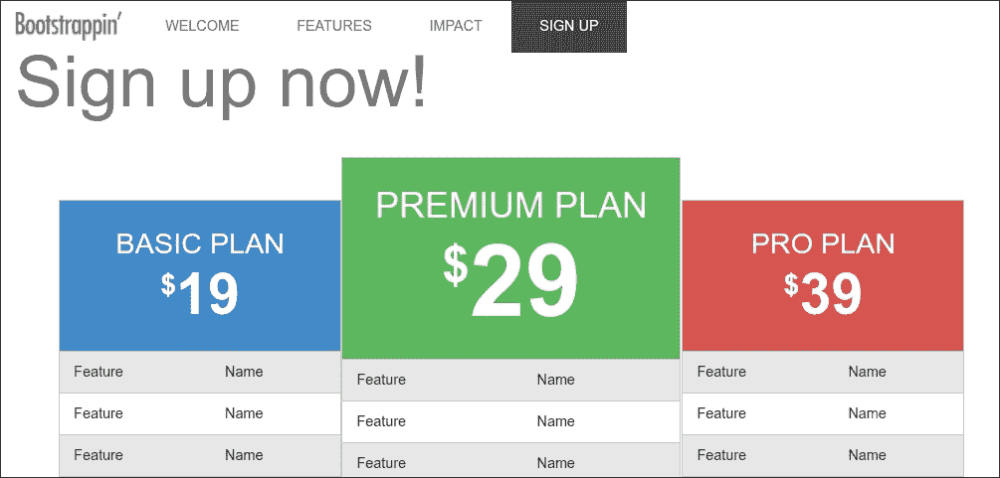

在前面的步骤中，我们使用了 data-attributes 来启动 Bootstrap ScrollSpy 行为。您也可以通过执行以下步骤通过 JavaScript 启动插件：

1.  首先为 body 元素添加`position: relative`;声明到您的 CSS/SCSS 中：

    ```js
          body { 
            position: relative; 
          } 

    ```

1.  然后，通过以下方式通过 JavaScript/jQuery 调用 ScrollSpy：

    ```js
    $('body').scrollspy({ target: '.navbar' })
    ```

## 滚动动画

现在，让我们动画化由点击 navbar 页面锚点触发的页面滚动。我们将使用 jQuery 来完成此操作。

### 注意

jQuery 是一个 JavaScript 库，它为您提供了 HTML 文档遍历和操作、事件处理和动画的 API。`jQuery animate()` API 调用允许您创建 CSS 属性的定制动画。有关 jQuery 动画的更多信息，请参阅以下网址：[`api.jquery.com/animate/`](http://api.jquery.com/animate/)。

要实现页面滚动动画，需要在我们的`main.js`文件中添加几行代码：

1.  打开`js/main.js`。

1.  在`$(document).ready(function() {`内添加以下行：

    ```js
          $('#nav-main [href^=#]').click(function (e) { 
            e.preventDefault(); 
            var div = $(this).attr('href'); 
            $("html, body").animate({ 
            scrollTop: $(div).position().top 
           }, "slow"); 
         }); 

    ```

1.  保存文件并刷新浏览器。

```js
Click on one of the nav items and you should see it animate the scroll!
```

# 摘要

请花点时间来回滚动我们的页面，欣赏其细节，并调整其大小以查看它如何适应视口尺寸。

当我们考虑这个页面中包含的各种功能——并且它们都在桌面、平板和手机尺寸的视口中响应式工作——这真是一个不错的成就！

回顾一下，我们为我们的客户提供了一个美丽的一页营销网站，其中包含使用 Bootstrap 的 jumbotron 样式的宽敞欢迎部分，一个醒目的背景图像和响应式定制，一个使用大号 Font Awesome 图标的特性列表，一个包含图像和标题的顾客评论部分，这些图像和标题以瀑布流格式排列，完美适应各种视口。我们最终得到了一个包含自定义设计的定价表和基于 Bootstrap 样式的注册部分，并进一步增强了它以提供中大型视口的视觉层次结构。作为最后的点缀，我们添加了一个带有动画滚动行为的 ScrollSpy 导航栏，这是通过一点额外的 jQuery 实现的。有了这个设计，我们已经达到了一个点，即我们几乎可以用 Bootstrap 做到任何事情。

在这个和之前的项目中，我们取得了巨大的成就。我们学习了 Bootstrap 的方方面面，并将 Bootstrap Sass 和 JavaScript 整合到我们自己的项目文件集中。然后我们使用了强大的 Font Awesome 图标。我们还调整、定制并创新了 Bootstrap 样式，以实现我们寻求的确切结果。

通过这种方式，我们结束了这次学习之旅。我希望你有一个顺利的旅程，并在 Bootstrap 上获得了大量的知识。

我祝愿你们在未来的项目中一切顺利。继续学习和探索！

# 评估

1.  以下哪个命令用于安装 Bootstrap CLI？

    1.  `npm install -i bootstrap-cli`

    1.  `npm install -g bootstrap-cli`

    1.  `npm install -d bootstrap-cli`

    1.  `npm install -w bootstrap-cli`

1.  以下哪个代码用于将源文件夹中的资产复制到目标文件夹？

    1.  `gulp.task('copy', function() { gulp.src(['assets/*/**']).pipe(gulp.dest('_site')); });`

    1.  `gulp.task('copy', function() { gulp.src('assets/**/*').pipe(gulp.dest('_site')); });`

    1.  `gulp.task('copy', function() { gulp.src('assets/*/**').pipe(gulp.dest('_site')); });`

    1.  `gulp.task('copy', function() { gulp.src(['assets/**/*']).pipe(gulp.dest('_site')); });`

1.  以下哪个命令用于从 CDN 加载 Font Awesome 的 CSS 代码？

    1.  `<link rel="stylesheet" href="https://maxcdn.bootstrapcdn.com/font-awesome/4.6.1/css/font-awesome.min.css">`

    1.  `<a href="https://maxcdn.bootstrapcdn.com/font-awesome/4.6.1/css/font-awesome.min.css">`

    1.  `<link href="https://maxcdn.bootstrapcdn.com/font-awesome/4.6.1/css/font-awesome.min.css">`

    1.  `<a rel="stylesheet" href="https://maxcdn.bootstrapcdn.com/font-awesome/4.6.1/css/font-awesome.min.css">`

1.  哪个 Bootstrap 的导航栏类决定了导航栏的位置？

    1.  `navbar-fixed-bottom`

    1.  `navbar-fixed-left`

    1.  `navbar-fixed-top`

    1.  `navbar-fixed-right`

1.  以下哪个使用了 Sass 内置的亮度函数来根据输入颜色的亮度返回浅色（白色）或深色（黑色）？

    1.  `contrast()`

    1.  `lighten()`

    1.  `darken()`

    1.  `saturate()`
