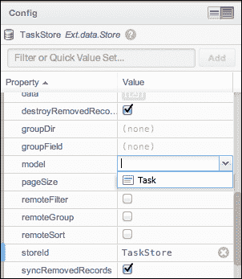
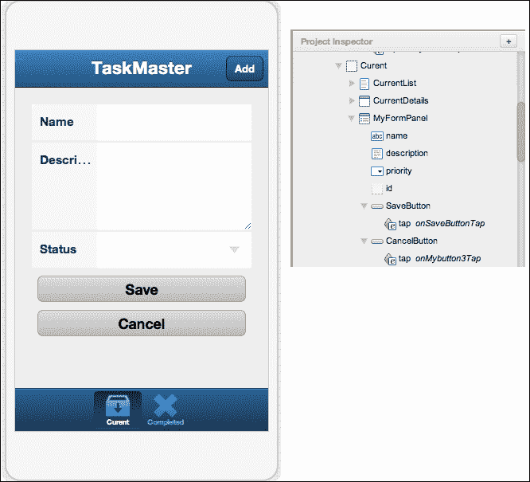

# 第一章。简单的任务列表

在其核心，大多数编程任务可以分为三类：数据展示、数据输入和数据存储。我们的第一个项目将以涵盖 Sencha Touch 如何处理这三个基本类别为目标。为此，我们将创建一个常见的编程应用，待办事项列表或任务列表。

在这个应用程序中，我们将使用 HTML5 中可用的本地存储来存储任务，包括名称、描述、创建日期、完成日期和优先级。然后我们将创建一个任务列表来显示当前任务以及我们的已完成任务。我们将讨论测试显示和管理错误的方法。然后我们将创建输入新任务、编辑现有任务和标记任务完成的表单。

最后，在我们的加分部分，我们将探讨一些此类应用可能的其他附加功能。

# Sencha Architect 的简要概述

Sencha Architect 是一个跨平台的视觉开发工具，用于 Sencha Touch 和 Ext JS。Sencha Architect 可用于 Mac、Windows 和 Linux，可以通过以下链接下载：

[`www.sencha.com/products/architect`](http://www.sencha.com/products/architect)

在本书的大部分章节中，我们将结合使用 Sencha Architect 和标准编码来创建我们的项目。这将让你了解设计师的一些强大优势，同时不会隐藏任何实际代码。

这实际上是 Sencha Architect 的关键优势之一；虽然它允许你快速创建界面并测试它们，但在幕后，设计师正在生成标准的 JavaScript 文件，你可以使用任何文本编辑器来编辑这些文件。这种优势允许你快速组装应用程序的基本元素，同时保持根据需要手动调整代码的能力。我们将在稍后对此进行更多介绍，但现在让我们看看 Sencha Architect 的设置。

当你首次启动 Sencha Architect 时，你会看到一个对话框，你可以选择开始一个新的 Ext JS 项目或一个新的 Sencha Touch 项目，或者你可以从现有项目列表中选择：


由于我们在这本书中关注 Sencha Touch，你应该选择一个新的 Sencha Touch 2.1 项目。

### 小贴士

**Ext JS 和 Sencha Touch 之间的区别**

ExtJS 和 Sencha Touch 都是 Sencha Inc. 公司的产品。Sencha Touch 用于为各种设备开发移动应用程序，而 Ext JS 用于创建桌面浏览器（如 Firefox、Chrome 或 Internet Explorer）的 Web 应用程序。对于这本书，我们将坚持使用 Sencha Touch。

一旦你选择了你的新项目类型，Sencha Architect 窗口将打开。这个窗口包含应用程序的视觉展示，并允许我们通过拖放以及直接输入代码来修改应用程序。


## 工具箱

Sencha Architect 的**工具箱**部分是您将找到所有由 Sencha Touch 提供的组件的地方。这些组件按字母顺序列在**工具箱**部分的右侧，而基本组件类型则列在左侧。点击这些组件类型之一将限制列表只显示该特定类型的组件。


默认提供的类型如下：

+   **行为**: 它为函数和控制器提供空容器

+   **图表**: 它是一组可以直接从存储库中提取数据的图表和图形

+   **容器**: 它包含面板、选项卡面板、轮播图和字段集等元素

+   **数据**: 它包含数据驱动的组件，如存储库、代理、读取器、写入器和过滤器

+   **表单**: 它包含基本表单元素，如文本字段、单选按钮、选择字段和按钮

+   **模型**: 它包括基本数据模型、验证、字段、代理、读取器和写入器

+   **资源**: 它允许您添加 JavaScript 和 CSS 的外部文件，以及编译应用的打包文件

+   **树**: 树是嵌套树组件所需的存储类型

+   **视图**: 它包含 Sencha Touch 中所有基本可查看组件，如容器、表单字段、媒体、选择器、工具栏、列表和按钮

此外，还有**所有内容**选项以显示列表中的所有类型。

您还可以在**自定义**部分使用**+**按钮添加您自己的自定义类型以限制列表。这对于常用组件或简单地根据您自己的个人习惯定制列表非常有帮助。

创建自定义类型后，您只需从右侧的列表中拖动组件，并将它们拖放到自定义类型中。

您还可以使用工具箱区域顶部的**过滤...**字段直接按名称搜索组件。

## 帮助部分

当从工具箱中选择任何组件时，直接位于其下方的帮助部分将显示有关该组件的信息。

在帮助区域的底部还有一个蓝色链接，上面写着**查看类文档**。点击此链接将带您到 Sencha 网站上所选特定组件的文档。这些文档是信息宝贵的来源，您应尽快熟悉它们。

## 设计区域

设计区域是我们开始创建第一个应用程序的地方。默认情况下，Sencha Touch 应用程序以 iPhone 320 x 480 布局开始。此布局可以更改以显示 iPad、Nexus S 或 Kindle Fire 显示尺寸。这允许您在多个设备下查看您的设计。您还可以设置设备的方向并放大或缩小设计视图区域。


设计区域还提供了一个查看和操作设计背后代码的选项。如果你刚开始接触移动编程，这是一个非常好的学习工具。通过在**设计**和**代码**视图之间切换，你可以检查复杂的布局，并确切地看到 JavaScript 代码是如何用来创建它们的。

## 项目检查器区域

项目检查器区域为你提供了项目代码的另一种视图。当你将组件拖动到设计区域时，它们也会出现在**项目检查器**中。**项目检查器**区域将以分层列表的形式显示这些组件。这通常非常有帮助，可以查看哪些组件嵌套在其他组件内部。


组件也可以从**工具箱**列表拖动到**项目检查器**中。通过将组件拖放到**项目检查器**中，而不是设计区域，通常更容易管理某些组件。这可以确保你正确地将组件放置在所需的容器中。

### 注意

**资源**部分是 2.1 版本中的新增功能，它允许你将外部文件添加到你的项目中。如果你有一个较旧的 2.0 版本 Sencha Touch 项目，你可以右键点击**库**并选择**升级**，将项目更改为较新的 Sencha Touch 2.1 项目。

## 配置区域

**配置**区域将显示设计区域或**项目检查器**中选定的任何组件的所有配置选项。所有典型的配置选项，如高度、宽度、布局、ID、填充、边距、事件和函数，都可以从**配置**区域访问。


配置名称列在左侧，值在右侧。点击值将允许你编辑它。你还可以点击某些部分旁边的**+**，例如**函数**和**事件**，向**配置**中添加新项目。

# 开始使用任务列表

要了解所有这些组件如何协同工作以创建一个应用程序，让我们首先为任务管理器应用程序创建数据存储。将你打开的新文件保存为`TaskList`，然后开始添加一些组件。

## 创建数据存储

要将组件添加到项目中，我们需要从工具箱中拖动组件，并将其放置在项目或项目检查器的适当部分。对于我们的第一个组件，让我们选择一个普通的数据存储。

从**工具箱**中选择**数据**，然后点击**存储**并将其拖动到设计区域中的我们的 iPhone 上。你现在应该能在**属性****检查器**下的**存储**列表中看到一个名为**MyStore**的存储：


你也会注意到，在我们的商店旁边有一个红色的警告图标。这告诉我们我们的商店缺少一些必需的组件。在这种情况下，商店需要一个代理来控制数据的发送和接收，并且需要一个模型来告诉它期望哪些数据。

从**工具箱**列表中选择**LocalStorage Proxy**对象，并将其拖动到我们的商店上。

你可能会注意到，某些组件只能放置在其他组件内部。例如，当你拖动代理时，你不能像之前那样直接将其拖放到 iPhone 图表中。代理组件将仅作为数据存储的一部分存在。这意味着你必须将代理组件拖放到**属性检查器**中的数据存储上，以便它能够正确地添加到商店中。

一旦将代理拖放到商店中，我们需要添加一个模型，并将其链接到我们的商店。

## 添加模型、字段和字段类型

在我们的**工具箱**的**数据**部分中，向上滚动以找到**模型**的列表。将**模型**对象拖动到我们的**项目检查器**的**模型**部分。这将创建一个名为**MyModel**的新模型。

在**项目检查器**中，选择**MyModel**，查看**配置**部分。我们可能首先想要更改的是名称。点击列出的**userClassName**的值，将**MyModel**更改为`Task`，然后按键盘上的*Enter*键。模型现在应在**配置**和**项目检查器**中均列为准**Task**。

接下来，我们需要向我们的模型添加一些字段。选择**Task**模型后，你应该在**配置**区域中看到**字段**的列表。点击**字段**旁边的**+**按钮，在出现的文本区域中输入`id`。在屏幕上点击**完成**或按键盘上的*Enter*键。

你的**配置**区域现在应该看起来像这样：


重复之前的步骤，将以下字段添加到任务模型中：

+   **名称**

+   **描述**

+   **创建**

+   **完成**

+   **优先级**

+   **是否完成**

现在你已经拥有了所有字段，我们需要为每个字段定义数据类型。

在**项目检查器**中，点击名为**id**的字段。这将打开该字段的配置，你应该看到目前没有为**类型**列出任何值。点击**类型**旁边的值。将出现一个下拉菜单，您可以从列表中选择**int**。

现在我们需要为我们的其他字段做同样的事情。依次选择每个字段，并按以下方式设置它们：

+   **名称**：将其设置为**字符串**

+   **描述**：将其设置为**字符串**

+   **创建**：将其设置为**日期**

+   **完成**：将其设置为**日期**

+   **优先级**：将其设置为**整数**

+   **是否完成**：将其设置为**布尔值**

现在你已经定义了所有模型字段和类型，我们需要将模型添加到商店中。

## 将模型添加到商店

点击**Project Inspector**中的**MyStore**。就像我们对模型所做的那样，我们可能想要更改存储的名称，以便在代码中更容易引用并跟踪。点击**userClassName**和**storeID**旁边的值，并将两者都更改为**taskStore**。

接下来，您需要点击并编辑存储中的模型**Config**以选择我们的**Task**模型。完成后，您的存储配置应该看起来像这样：



## 制作副本

现在我们已经有了我们的存储和模型，我们需要复制一份以保存我们的已完成任务。这两个存储将使用相同的模型和大部分相同的设置信息。我们只需要复制存储并更改**id**和**userClassName**的值。完成这些后，我们将为存储创建过滤器，以便它只获取我们需要的资料。

要复制**TaskStore**，在**Project Inspector**中右键单击它并选择**Duplicate**。将出现一个新的存储，称为**MyStore2**，具有相同的代理和模型信息。在**Project Inspector**中选择**MyStore2**，并在**Config**部分将**id**和**userClassName**的值都更改为`CompletedStore`。

## 添加过滤器

现在我们有了两个存储，我们需要设置一些过滤器以确保**TaskStore**只加载当前任务，而**CompletedStore**只加载已完成任务。

您可以在每个存储的**Config**部分添加过滤器。首先，选择**TaskStore**，然后点击**Config**部分旁边**Filters**旁边的**+**按钮。这将添加一个名为**MyFilter**的新过滤器。点击**MyFilter**旁边的箭头以显示其**Config**选项。

我们需要向这个过滤器添加一个函数，以便告诉它要获取哪些记录。点击**filterFn**旁边的**+**按钮以添加一个新的过滤器函数。在**Project Inspector**区域的上方，**filterFn**应该位于**MyFilter**下方。在**Property Inspector**中点击**filterFn**以打开该函数的代码编辑器。

编辑器应该出现以下代码：

```js
filterFn: function(item) {

}
```

这设置了过滤器的基本功能，并将存储中的每个记录作为**item**传递给我们。如果我们的函数返回`true`，则记录包含在存储中，如果返回`false`，则记录被忽略。

我们的模式有一个名为`isComplete`的布尔值。我们可以在函数中这样检查这个值：

```js
return !item.data.isComplete;
```

这将接受我们传递的记录作为`item`，并检查记录的数据中的`isComplete`。如果任务记录已完成，这将变为`true`，因此我们在前面放置`!`字符以仅获取`isComplete`为`false`的记录。过滤器现在已完成。

按照相同的步骤为`CompletedStore`添加一个过滤器：

1.  为`CompletedStore`添加一个过滤器。

1.  使用`filterFn`向过滤器添加一个函数。

1.  添加过滤器函数的代码。

在这种情况下，我们的函数只需要查找`isComplete`为`true`的任务（这次不要使用`!`字符）：

```js
return item.data.isComplete;
```

两个存储库现在都将正确地根据完成情况过滤任务。

当我们在屏幕上移动这些组件时，Sencha Architect 在后端为我们做了一些繁重的工作。让我们揭开幕布，看看实际代码中发生了什么。

# 注意幕后的那个人

首先要查看的是你在硬盘上保存的任务管理器项目文件。你会注意到设计师在这里创建了许多文件：`app.html`、`app.js` 和 `TaskManager.xds`。我们还有 app 和元数据文件夹。

Sencha Architect 使用 `TaskManager.xds` 和 `metadata` 文件夹。`TaskManager.xds` 文件是你目前正在工作的主要项目文件，而 `metadata` 文件夹包含该项目文件的资源。我们现在可以忽略这些文件，因为有趣的内容在其他文件中。

让我们从 `app.html` 文件开始。如果你用你最喜欢的代码编辑器打开这个文件，你应该会看到类似这样的内容：

```js
<!DOCTYPE html>

<!-- Auto Generated with Sencha Architect -->
<!-- Modifications to this file will be overwritten. -->
<html>
<head>
    <meta http-equiv="Content-Type" content="text/html; charset=utf-8" />
    <title>Chapter1</title>
    <link rel="stylesheet" type="text/css" href="http://extjs.cachefly.net/touch/sencha-touch-2.1.0/resources/css/sencha-touch.css"/>
    <script type="text/javascript" src="img/sencha-touch-all-debug.js"></script>
    <script type="text/javascript" src="img/app.js"></script>
    <script type="text/javascript">
        if (!Ext.browser.is.WebKit) {
            alert("The current browser is unsupported.\n\nSupported browsers:\n" +
                "Google Chrome\n" +
                "Apple Safari\n" +
                "Mobile Safari (iOS)\n" +
                "Android Browser\n" +
                "BlackBerry Browser"
            );
        }
    </script>
</head>
<body></body>
</html>
```

这应该对熟悉 HTML 和 JavaScript 的人来说很熟悉。该文件创建了一个基本的 HTML 页面，包含了 Sencha Touch 的 JavaScript 和 CSS 文件，并且还包含了我们的 `app.js` 文件（我们稍后会讨论）。 

文件随后设置了一些浏览器检测，以便如果用户尝试使用非 WebKit 浏览器访问应用程序，他们将会被告知他们的浏览器不兼容，并会得到一个兼容浏览器的列表。

### 注意

Chrome 和 Safari 是 WebKit 浏览器，可在 Windows 和 Mac 上使用。Chrome 也可在 Linux 上使用。在这本书中，我们将使用 Safari 进行测试，但示例同样适用于 Chrome。

还有一点需要注意，是 `app.html` 文件顶部注释中的信息。这个特定的文件每次你保存 TaskManager 项目时都会自动生成。如果你在代码编辑器中对其进行了修改，它们将在下一次保存时被覆盖。

### 小贴士

**关于 CacheFly 的一些建议**

CacheFly 是一个 **CDN**（**内容分发网络**）。他们拥有全球各地的计算机，可以从离用户较近的服务器发送文件，这样文件在互联网上的传输时间更短，因此加载时间也更短。这也意味着，通过不自己提供这些文件，你可以节省自己的服务器带宽。

接下来，让我们看一下我们的 `app.js` 文件：

```js
/*
 * File: app.js
 *
 * This file was generated by Sencha Architect version 2.0.0.
 * http://www.sencha.com/products/designer/
 *
 * This file requires use of the Sencha Touch 2.0.x library, under independent license.
 * License of Sencha Architect does not include license for Sencha Touch 2.1.x. For more
 * details see http://www.sencha.com/license or contact license@sencha.com.
 *
 * This file will be auto-generated each and every time you save your project.
 *
 * Do NOT hand edit this file.
 */

Ext.Loader.setConfig({
    enabled: true
});

Ext.application({
    models: [
        'Task'
    ],
    stores: [
        'TaskStore', 'CompletedStore'
    ],
    name: 'MyApp'
});
```

就像我们的 HTML 文件一样，我们在顶部有一个关于手动编辑文件的严厉警告。

### 小贴士

**关于手动编辑的一些建议**

Sencha Architect 会为你做很多工作，但这意味着它也可能意外覆盖你手动编写的代码。最好的办法是在使用 Architect 首先完全布局和配置好应用程序的所有组件后再添加任何代码。

如果我们跳过那个部分，我们会看到一个 Ext.Loader 的设置函数，然后是我们的应用程序定义。这包括所有模型和存储的链接，以及我们应用程序的名称（我们完成代码审查后可能需要更改一次）。

### 注意

Ext.Loader 是 Sencha Touch 的一个特殊部分，它会在需要时加载 JavaScript 文件。而不是在 HTML 文件中包含所有 JavaScript 文件，Ext.Loader 只会在需要时加载它们。这大大减少了应用程序的启动时间。你可以在[`www.sencha.com/blog/using-ext-loader-for-your-application`](http://www.sencha.com/blog/using-ext-loader-for-your-application)了解更多关于 Ext.Loader 的信息。

关闭`app.js`文件，打开`app`文件夹。正如你所见，我们有两个名为`model`和`store`的文件夹。当然，这些文件夹中包含了我们模型和存储的代码。

首先打开`store/TaskStore.js`文件：

```js
Ext.define('MyApp.store.TaskStore', {
    extend: 'Ext.data.Store',
    requires: [
        'MyApp.model.Task'
    ],

    config: {
        autoLoad: true,
        model: 'MyApp.model.Task',
        storeId: 'TaskStore',
        proxy: {
            type: 'localstorage',
            id: 'Tasks'
        }
    },
        filters: {
            filterFn: function(item) {
                return !item.data.isComplete;
            }
        }
});
```

除了始终存在的关于手动编辑的警告之外，你还会看到我们的存储定义以纯 JavaScript 的形式编写。请注意，存储定义不仅包含我们的代理代码，还包括过滤函数，并列出我们的任务模型作为存储的模型。

### 小贴士

**为什么是"MyApp.model.Task"**？

Ext.Loader 通过将点号转换为斜杠，将你的组件名称转换为文件名。这意味着如果你的组件是`MyApp.model.Task`，那么 Ext.Loader 将在你的应用程序文件夹中查找一个名为`MyApp`的文件夹。它将在该`MyApp`文件夹中查找一个包含`Task.js`文件的`model`文件夹。

这也是保持应用程序文件夹组织良好的好方法。如果你将所有模型放在`model`文件夹中，所有视图放在`view`文件夹中，那么当你需要查找它们时就会知道它们在哪里。

关闭`TaskStore.js`文件，让我们看看最后一个文件，`model/Task.js`。这是我们的模型文件：

```js
Ext.define('MyApp.model.Task', {
    extend: 'Ext.data.Model',
    config: {
        fields: [
            {
                name: 'id',
                type: 'int'
            },
            {
                name: 'name',
                type: 'string'
            },
            {
                name: 'description',
                type: 'string'
            },
            {
                name: 'created',
                type: 'date'
            },
            {
                name: 'completed',
                type: 'date'
            },
            {
                name: 'isCompleted',
                type: 'boolean'
            }

        ]
    }
});
```

注意，存储和模型中的内容有相当大的重叠。这种重复允许模型和存储独立于彼此工作，同时仍然保持数据本身的一致性。当我们处理应用程序的表单时，我们将更详细地探讨这一点。

# 架构与手动编码

正如你所见，Sencha Architect 为我们生成代码，但我们也可以选择手动创建完全相同的代码。Sencha Architect 通过允许以可视化的方式构建应用程序和允许开发者按需探索代码，为新手程序员提供了便利。设计师还会根据 Sencha Touch 最佳实践生成代码。这有助于新手用户避免学习坏习惯，并在程序员需要手动编程时鼓励编写更干净的代码。

对于经验丰富的程序员来说，Sencha Touch 提供了快速原型化和为客户创建模拟界面的方法。这些模拟界面背后的代码可以在设计师之外使用，以创建可能对 Sencha Architect 来说既困难又不可能完成的复杂应用程序。

通过结合使用 Sencha Architect 和传统的基于文本的编码，我们希望这本书能为读者在速度和一致性方面提供额外的益处。

# 创建视图

到目前为止，我们的代码实际上还没有在屏幕上创建任何内容。现在我们需要创建一些用户可以与之交互的视觉组件，从包含我们应用程序的主要面板开始。

从左侧的 **工具箱** 列表中拖动一个 **标签面板** 对象并将其拖放到设计师中的 iPhone 屏幕上。现在在 **项目检查器** 中将出现一个 **面板** 选项。选择 **标签面板** 并将以下信息添加到 **配置** 区域：

+   确保勾选 **initialView** 复选框

+   将 **userClassName** 从 **myTabPanel** 更改为 `mainView`

+   通过右键单击并选择 **删除** 来删除第三个标签

保存项目，然后让我们再次查看您项目的代码。在 `app.js` 文件中，您现在将看到以下代码：

```js
Ext.Loader.setConfig({
    enabled: true
});

Ext.application({
    models: [
        'Task'
    ],
    stores: [
        'TaskStore'
    ],
    views: [
        'MainView'
    ],
    name: 'MyApp',
    launch: function() {
        Ext.create('MyApp.view.MainView', {fullscreen: true});
    }
});
```

设计师现在添加了一个 `launch` 函数，它创建了一个 `MainView` 面板的实例并将其设置为全屏。

如果我们查看 `app` 文件夹，现在我们看到一个名为 `view` 的文件夹。这个文件夹包含我们的 `MainView.js` 文件：

```js
Ext.define('MyApp.view.MainView', {
    extend: 'Ext.tab.Panel',

   config: {
        items: [
            {
                xtype: 'container',
                title: 'Tab 1'
            },
            {
                xtype: 'container',
                title: 'Tab 2'
            }
        ]
    }
});
```

目前这个文件只是将 `MainView` 定义为标准 `Ext.tab.Panel` 函数的扩展，并设置了包含我们两个标签的配置。当我们向面板添加更多组件时，它们将在这里的代码中显示。让我们回到设计师，并做同样的事情。

## 配置标签面板

我们可能首先应该做的是重命名标签。在 **项目检查器** 中选择 **Tab 1**，然后点击 **配置** 部分的 **标题** 值。将标题从 **Tab 1** 更改为 `Current` 并按键盘上的 *Enter*。对 **Tab 2** 也做同样的事情，将其标题更改为 `Completed`。


我们应该做的一件额外的事情是将标签移至底部。这将使我们的应用程序看起来更像经典的 iPhone。要做出这个更改，在 **项目检查器** 中选择 **mainView**，然后在 **配置** 部分找到 **标签栏配置** 列表。点击 **标签栏配置** 旁边的 **+** 按钮，新的 **标签栏** 选项将出现在下方。点击新 **标签栏** 选项旁边的箭头，将出现其配置选项。

定位到停靠的**配置**区域，并将其从顶部改为底部。选项卡应下拉到底部，给我们带来大多数 iPhone 用户熟悉的图标。您可以通过在**项目检查器**中点击**当前**或**完成**选项卡并更改**配置**中的**iconCls**值来更改这些图标。选择您喜欢的图标并保存项目（我选择了**organize**作为**当前**选项卡的图标，**delete**作为**完成**选项卡的图标）。

完成后，在**属性检查器**中选择**主视图**，然后在设计器的右上角点击**代码**。这将使设计器切换到代码视图，显示我们的`MainView.js`文件内容。

```js
Ext.define('MyApp.view.MainView', {
  extend: 'Ext.tab.Panel',
  config: {
  items: [
    {
        xtype: 'container',
        title: 'Current',
        iconCls: 'organize'
    },
    {
        xtype: 'container',
        title: 'Completed',
        iconCls: 'delete'
    }
  ],
  tabBar: {
    docked: 'bottom'
  }
  }
}); 
```

您现在可以看到，选项卡面板及其两个选项卡已添加到我们的`MainView.js`文件中。我们还看到了我们的`tabBar`配置和选择的`iconCls`值。

## 添加列表和详情

接下来，我们想要在每个选项卡上添加一个列表和一个面板。列表将显示当前和已完成任务的名称。面板将在我们点击列表中的任务时显示任务的详细信息。

让我们从选择每个选项卡并设置**配置**中的**布局**属性为**卡片**开始。这将使我们能够轻松地在每个选项卡的**列表**和**详情**部分之间切换。

接下来，从**工具箱**列表中取一个**列表**组件，并将其拖放到**属性检查器**中的每个选项卡上。

### 小贴士

**在属性检查器中放置项目**

虽然大多数组件可以直接拖放到设计区域，但通常将组件拖放到**项目检查器**中会更好。使用**属性检查器**确保您将组件放入正确的容器中要容易得多。

接下来，您需要从**工具箱**中取一个面板，并将其拖放到每个选项卡上，就像我们处理列表时做的那样。这个面板将是我们的详情容器，并且它不会在设计视图中出现，因为列表在前。我们将在稍后创建一些代码来在用户点击列表中的任务时交换列表和容器。

您的**属性检查器**区域现在应该看起来像这样：


注意，选项卡（**当前**和**完成**）都缩进在**mainView**选项卡面板下。每个选项卡下也有一个列表和一个面板。选项卡是**mainView**选项卡面板的子项，每个选项卡有两个子项；一个列表和一个面板。

由于我们将在代码中处理列表和面板，我们可能需要将它们命名为比**MyList**和**MyPanel**更具有描述性的名称。为了做到这一点，您需要选择这些项目中的每一个，并在**配置**中更改**id**属性。让我们按以下方式重命名它们：

在**当前**选项卡中，我们将它们命名为`CurrentList`和`CurrentDetails`，而在**完成**选项卡中，我们将它们命名为`CompletedList`和`CompletedDetails`。

## 设置模板

接下来，我们需要设置列表和详情的模板（在**配置**区域中称为**itemTpl**）。这些模板控制我们的数据如何在屏幕上布局。记住，我们有以下数据项：

+   **id**

+   **name**

+   **description**

+   **已创建**

+   **已完成**

+   **priority**

我们可以通过将它们放在大括号中（如下所示）将它们包含在我们的模板中，从而使用这些值：

```js
<div>{name}</div>
```

我们还可以将任何 HTML 样式或标签作为模板的一部分使用。这为我们控制应用程序布局提供了很大的灵活性。

要编辑我们的**CurrentList**组件的模板，在**项目检查器**中选择它，然后在我们的**设计**视图中列表旁边会出现一个齿轮图标。点击齿轮，你将看到一个弹出窗口，其中包含一些配置选项，包括弹出窗口底部的**编辑模板**。

当你点击**编辑模板**时，将出现一个文本区域，其中包含以下文本：

```js
<div>List Item {string}</div>
```

将此文本更改为：

```js
<div class="priority_{priority}">{name}</div> 
```

当你完成编辑时，点击**完成编辑**。目前列表项将显示为空，但我们稍后会解决这个问题。

接下来，在**项目检查器**中点击**CurrentDetails**面板，并以与**CurrentList**相同的方式编辑模板。将**CurrentDetails**的模板设置为：

```js
<div class="taskName">{name}</div> 
<div class="taskDescription">{description}</div> 
<div class="taskCreated">Created: {created}</div>
```

当你完成编辑时，点击**完成编辑**。

当你完成**CurrentDetails**的编辑后，我们希望对**CompletedList**和**CompletedDetails**执行相同的步骤。你可以保持列表模板不变，但我们应该在我们的详情页上包含完成日期，如下所示：

```js
<div class="taskName">{name}</div> 
<div class="taskDescription">{description}</div> 
<div class="taskCreated">Created: {created}</div>
<div class="taskCompleted">Completed: {completed}</div>
```

## 使用启动数据测试

你会注意到，由于我们没有记录，我们没有什么可以展示的。这可能会使测试我们的应用程序变得困难，因此我们打算使用`launch`方法在我们的应用程序中添加一些测试记录。

在**项目检查器**中选择**应用程序**，然后在**配置**部分中找到**launch**。点击**launch**旁边的**+**按钮以添加新的启动函数，然后点击新启动函数旁边的箭头以打开它。这将打开代码编辑器，显示：

```js
launch: function() {

}
```

在`launch`函数内部添加以下代码：

```js
var TaskStore = Ext.data.StoreManager.lookup('TaskStore');
var CompletedStore = Ext.data.StoreManager.lookup('CompletedStore');
if(CompletedStore.getCount()+TaskStore.getCount() === 0) {
    console.log('we have no records');
    TaskStore.add({name: 'Here Is A Task', description: 'You can mark the task complete by clicking the Completed button below.', priority: 1, created: Date.now(), completed: '', isComplete: false});
    TaskStore.add({name: 'How To Edit A Task', description: 'You can edit the task by clicking the Edit button below.', priority: 2, created: Date.now(), completed: '', isCompleted: false});
    TaskStore.add({name: 'How To Add A Task', description: 'Add a task by clicking the Add button in the upper right corner.', priority: 3, created: Date.now(), completed: '', isComplete: false});
    TaskStore.sync();
} else {
    console.log('we have records');
}
```

此代码将获取我们的两个存储库，任务存储库和完成存储库，并检查是否有任何记录。如果没有记录，该函数将添加三条新记录，然后同步存储库以保存记录。这些任务记录也可以作为一组三条指令，供首次打开应用程序的新用户使用。

### 小贴士

**控制台日志**

`console.log` 命令是编程时的最佳朋友。它将在 Safari 或 Chrome 的错误控制台中打印文本和对象。这对于调试任何问题至关重要。在前面的代码中，控制台日志将根据我们是否获取回记录而打印。我们也可以使用 `console.log(TaskStore)` 来获取该存储对象每个属性的显示。这实际上非常方便，以确保你确实拥有你认为自己拥有的对象。

现在当你在浏览器中打开 `app.html` 文件时，你应该在 **TaskMaster** 应用程序中看到以下内容：


我们现在有任务可以查看，但我们仍然无法获取详细信息。我们需要添加一个函数来在列表和详细信息之间切换视图。

在 Sencha Architect 中，点击 **项目检查器** 中的 **CurrentList**，然后在 **配置** 部分的顶部查找 **事件**。点击 **事件** 旁边的 **+** 按钮以添加新的事件监听器。使用出现的菜单选择 **select** 事件。点击新 **select** 事件旁边的箭头以编辑代码。代码编辑器将出现以下代码：

```js
onCurrentListSelect: function(dataview, record, options) {

}
```

将以下代码添加到 `select` 事件：

```js
  var currentTab = this.getActiveItem();

  var currentDetails = currentTab.down('panel');

  currentDetails.setRecord(record);
  currentTab.setActiveItem(currentDetails);
```

第一行获取我们的 `Current` 选项卡，第二行获取我们的 `CurrentDetails` 面板。然后我们将详细信息面板上的记录设置为作为 `select` 函数一部分传递给我们的记录（列表中的记录）。最后，我们将当前选项卡的卡片布局切换到 `CurrentDetails` 面板，隐藏 `CurrentList`。

我们还需要对 `CompletedList` 组件做同样的事情。添加新的 **select** 事件，并将代码设置为：

```js
var completedTab = this.getActiveItem();

var completedDetails = completedTab.down('panel');

completedDetails.setRecord(record);
completedTab.setActiveItem(completedDetails);
```

如果我们在浏览器中测试这个，我们应该能够在点击列表中的项目时看到我们的详细信息面板。这也带我们到了下一个挑战；我们需要一种方法回到我们的列表。

在本章中，我们将手动创建返回按钮，在下一章中，我们将介绍解决这个问题的另一种方法。现在，让我们在我们的工具栏中添加一个新按钮。

## 添加返回按钮

从 **工具箱** 中获取一个 **toolbar** 对象并将其拖动到 **mainView** 选项卡面板上。从 **工具箱** 中获取一个 **button** 对象并将其拖动到新的 **toolbar** 面板上。

接下来，我们想要给我们的工具栏添加一个标题。让我们选择工具栏，并在 **配置** 部分中将标题更改为 `TaskMaster`。

接下来，我们需要对我们的按钮做一些更改。选择 **Button** 对象，并在其 **配置** 部分进行以下更改：

+   将 **text** 改为 **Back**

+   将 **id** 改为 **backButton**

+   将 **ui** 改为 **back**（这将使其看起来像典型的返回按钮）

+   检查 **hidden** 属性旁边的框（我们希望按钮默认隐藏）

    ### 小贴士

    **我找不到一个配置选项**

    如果您找不到一些这些属性，您可能需要使用**Config**部分右上角的两个按钮在**Show Common Configs**和**Show All Configs**之间切换。

现在我们有了返回按钮，我们需要让它执行一些操作。通过点击按钮的**Config**部分旁边的事件旁边的**+**按钮，添加一个点击监听器。选择**tap**，然后点击出现的点击事件旁边的箭头。

将返回按钮代码编辑如下：

```js
onBackButtonTap: function(button, e, options) {
  var currentTab = this.getActiveItem();
  currentTab.setActiveItem(0);
  button.hide();
}
```

通过获取`this.getActiveItem()`，我们获取了`MainView`标签面板中的活动标签，这确保了按钮可以正确地为我们的两个列表工作。我们将活动项设置为活动标签中的第一个项。最后，我们隐藏按钮，以确保它不会出现在我们的列表视图中。

我们需要最后处理的部分是在点击列表中的项时显示按钮。点击当前面板的**select**事件，并将以下内容添加到我们的`select`函数中：

```js
var backButton = Ext.getCmp('backButton');
backButton.show();
```

您希望将完全相同的按钮代码添加到**CompletedList**组件的**select**事件中。只需复制，打开**CompletedList**的 select 事件，然后粘贴。

我们现在已经完成了列表和详情。现在我们需要能够添加、编辑和标记任务为完成。

# 创建表单

在我们开始创建表单之前，我们需要向**MainView**工具栏添加一个按钮，用于显示添加新任务的表单。

从**Toolbox**列表中拖出一个**Button**对象，并将其拖放到**TaskMaster**工具栏上。新按钮应出现在**backButton**旁边。我们可能希望将其移到标题的另一侧，因此我们需要从**Toolbox**中拖出一个**Spacer**并将其放置在新按钮和**backButton**之间。**Spacer**将新按钮推到屏幕的右侧。

接下来，我们需要更改新按钮的以下**Config**属性：

+   将**text**设置为**Add**

+   将**itemId**设置为**addButton**

我们将在完成表单后回来添加一个`tap`函数。

## 添加任务表单

要创建我们的添加任务表单，我们将向**Current**选项卡添加一个新的表单面板。从工具箱中拖出一个**Form Panel**并将其拖放到我们的**Current**选项卡上。面板应出现在我们的**CurrentList**和**CurrentDetails**面板下方。

接下来，我们需要将一些字段拖入我们的表单中，所以让我们先在**MyFormPanel**面板上放置一个**Text Field**对象，并更改以下**Config**属性：

+   将**name**设置为**name**

+   将**label**设置为**Name**

+   将**id**设置为**name**

+   将**margin**设置为**3**

接下来，将一个**Text Area**对象添加到**MyFormPanel**面板中，并设置以下**Config**属性：

+   将**name**设置为**description**

+   将**label**设置为**Description**

+   将**id**设置为**description**

+   将**margin**设置为**3**

现在，我们需要向**MyFormPanel**添加一个**Select Field**对象，并设置以下**Config**属性：

+   将**name**设置为**priority**

+   将**label**设置为**Priority**

+   将**id**设置为**priority**

+   将**边距**设置为 3

我们还需要为**选择字段**添加一些选项。在**Config**属性中找到**Options**并点击编辑。**Options**属性期望一个对象作为其值，在这种情况下是一个类似这样的名称-值对的数组：

```js
[{text: 'High',  value: 1},
{text: 'Medium', value: 2},
{text: 'Low',  value: 3}]
```

默认情况下，**选择字段**使用文本进行显示，使用值作为提交的值。您可以通过编辑**Config**属性中的**displayField**和**valueFields**来更改此设置，但我们可以将它们保留为我们的应用程序的默认值。

如果我们使用此表单来添加新任务和编辑现有任务，我们可以节省很多工作。为此，我们还需要添加一个隐藏字段来保存我们编辑的任何现有任务的 ID 值。

将一个**隐藏字段**对象添加到**MyFormPanel**中，并在**Config**部分将**id**和**name**的属性设置为**id**。我们将在保存表单时使用它。

在我们的表单中，我们还需要两个按钮；一个用于保存，一个用于取消。添加按钮并做出以下更改：

+   将**按钮 1**的**文本**设置为**保存**

+   将**按钮 1**的**itemID**设置为**SaveButton**

+   将**按钮 1**的**边距**设置为**10**

+   将**按钮 2**的**文本**设置为**取消**

+   将**按钮 2**的**itemID**设置为**CancelButton**

+   将**按钮 2**的**边距**设置为**10**

结构和表单应该看起来像这样：



接下来，我们将像之前一样使用**Config**的**Event**部分为每个按钮添加一个点击事件处理程序。

对于我们的**取消**按钮，将`event`函数设置为：

```js
var currentTab = this.getActiveItem(); 
currentTab.setActiveItem(0);
```

此代码获取我们的**当前**标签页并将活动面板重置为**CurrentList**。

**保存**按钮稍微复杂一些。如我们之前提到的，我们希望使用此表单来添加新任务和编辑现有任务。这意味着我们需要检查表单的**隐藏字段**值是否已设置，并正确保存任务。

将以下代码添加到**SaveButton**的点击事件函数中：

```js
var currentTab = this.getActiveItem();
var formPanel = currentTab.getActiveItem();

var values = formPanel.getValues();

var store = Ext.data.StoreManager.lookup('TaskStore');

if(values.id === null) {
    var record = Ext.ModelMgr.create(values, 'MyApp.model.Task');
    record.set('created', new Date());
    store.add(record);
} else {
    var record = store.getById(values.id);
    record.set('name', values.name);
    record.set('description', values.description);
    record.set('priority', values.priority);
}

store.sync();
formPanel.reset();
currentTab.setActiveItem(0);
```

我们的前两行获取`currentTab`和`formPanel`。然后，我们获取`formPanel`和`store`中的值，以便将数据保存到我们的数据中。

我们检查隐藏字段的值以查看它是否已设置。如果我们正在编辑，这将返回`true`，但如果我们正在添加新任务则不会。

如果我们正在添加新任务，我们使用表单字段中的`values`表单创建一个新的`record`选项，设置创建日期，并将`record`添加到`store`。

如果我们正在编辑现有记录，我们使用`store`中的`id`值从`store`获取`record`。然后，我们从表单`values`设置`record`的`name`、`description`和`priority`值。

最后，我们将`store`同步以保存`record`，清除表单`values`，并通过将活动项重置为我们的`CurrentList`视图（`0`）来关闭表单。

## 编辑和完成任务

对于编辑任务，我们将使用我们刚刚创建的表单，但我们需要用当前选定的记录加载它。对于完成任务，我们只需要一个按钮。

要做到这一点，我们将在我们的**当前详情**面板中添加一个带有两个按钮的工具栏。我们可能需要在两个按钮之间添加一个**间隔**对象，就像我们在之前的工具栏中所做的那样。

每个按钮也需要在**配置**部分下的**事件**中添加一个**点击**事件。

对于**编辑**按钮，设置**点击**函数为：

```js
var currentTab = this.getActiveItem();
var DetailsPanel = currentTab.getActiveItem();

currentTab.setActiveItem(2);
var formPanel = currentTab.getActiveItem();
formPanel.setRecord(DetailsPanel.getRecord());

this.setActiveItem(currentTab);

var backButton = Ext.getCmp('backButton');
backButton.hide();
```

此代码从`DetailsPanel`面板中获取`record`并将其加载到`formPanel`中。将此`record`设置在表单上也会设置我们隐藏字段的正确`id`值。然后我们像之前一样显示表单并隐藏**返回**按钮。

对于我们的**完成任务**按钮，我们需要从`DetailsPanel`获取`record`并设置`completed`（一个日期）和`isCompleted`（一个布尔值）的值。我们通过将点击事件函数设置为以下内容来实现：

```js
var currentTab = this.getActiveItem();
var detailsPanel = currentTab.getActiveItem();

var record = detailsPanel.getRecord();

record.set('completed', new Date());
record.set('isComplete', true);

var store = Ext.data.StoreManager.lookup('TaskStore');
store.sync();

this.setActiveItem(1);
var completedList = this.getActiveItem();
var completedStore = completedList.getActiveItem().getStore();
completedStore.add(record);
completedList.getActiveItem().refresh();

currentTab.setActiveItem(0);

var backButton = Ext.getCmp('backButton');
backButton.hide();
```

这就像之前一样获取我们的`record`，设置我们的两个值，并同步`TaskStore`。此同步还将导致`TaskStore`上的过滤器阻止记录在**当前**列表中显示。

接下来，我们将记录添加到`CompletedStore`中，并刷新我们的`completed`列表视图。最后，我们将用户返回到**当前**列表并隐藏**返回**按钮。

## 测试应用程序

如果我们一切都做得正确，你应该能够在 Safari（或 Chrome）中打开`app.html`文件并测试应用程序。尝试将编辑和标记任务标记为已完成。务必使用浏览器中的 JavaScript 控制台来追踪问题并查看错误。


# 额外加分

任务管理应用程序的设计多种多样，功能丰富。似乎每个人都对跟踪任务有自己的偏好。您可以使用此应用程序作为您自己的个人任务管理应用程序的基础。以下是将应用程序提升到下一个级别的几个想法：

+   根据列表和详情中的任务优先级在 CSS 文件中添加样式

+   添加一种按日期和优先级对任务进行排序的方法

+   自定义`CurrentDetails`和`CompletedDetails`模板以添加优先级的图标

# 摘要

在本章中，我们讨论了使用本地存储的应用程序的基本设置，包括：

+   Sencha Architect 应用程序的基本知识

+   创建用于本地存储和任务模型的数据存储

+   为我们的数据存储创建列表和详情

+   创建事件以在**列表**和**详情**视图之间切换

+   创建按钮以控制导航并启动我们的表单

+   创建用于编辑和添加新任务的表单

在下一章中，我们将探讨使用布局和模板创建更复杂和视觉上吸引人的应用程序。
