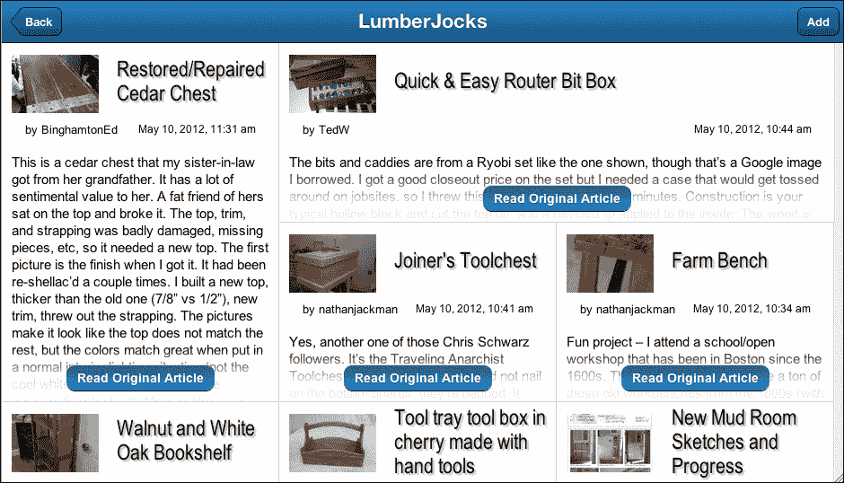
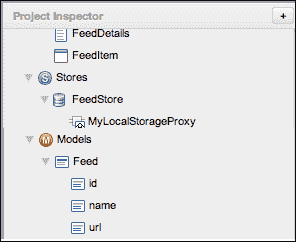
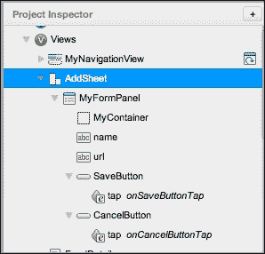
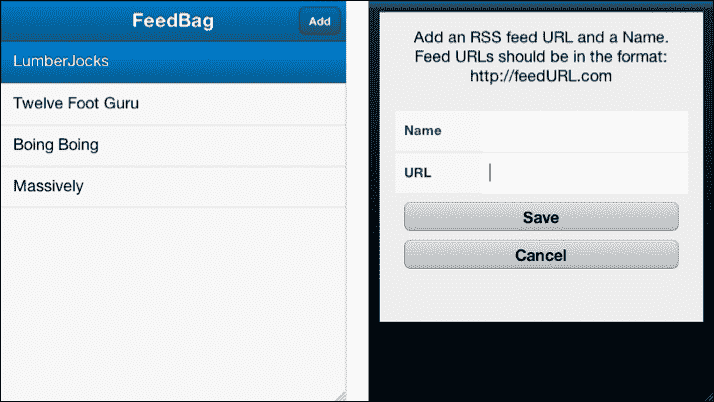
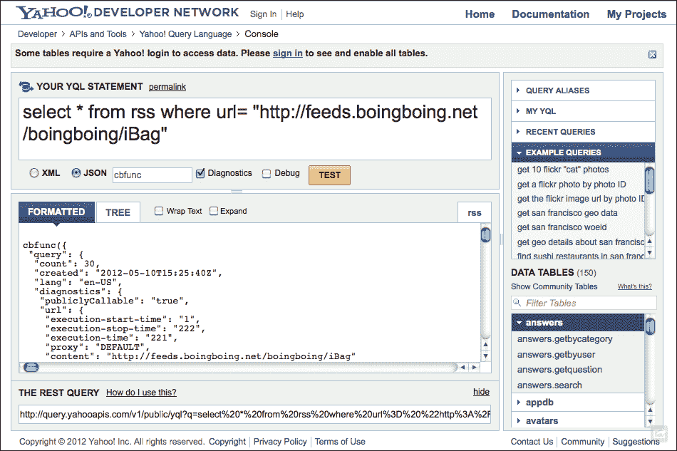
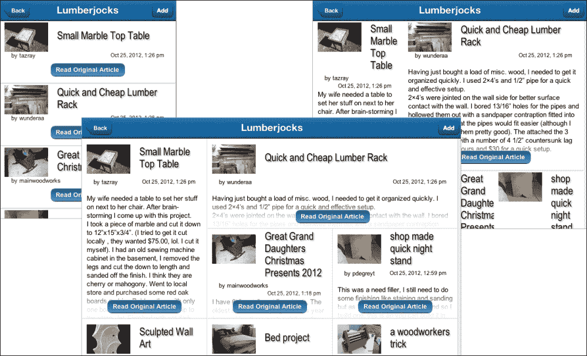
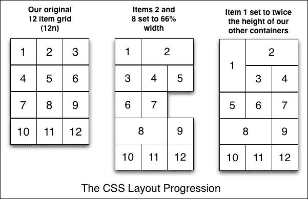

# 第二章。源阅读器

在我们的第一个项目，任务管理器中，我们探讨了 Sencha Architect 的一些基础知识。我们还介绍了在 Sencha Touch 中存储、编辑和显示数据的一些方法。

本章将探讨三个新的领域：

+   导航视图

+   加载远程数据

+   使用 Sencha XTemplate 创建复杂布局

在本章中，我们将构建一个 RSS 阅读器，从一系列网站抓取新闻源，并以复杂的行列模式显示这些源的内容：



新闻阅读器也将基于 Sencha Touch 的 `NavigationView` 组件，为触摸设备自动化许多有用的导航元素。

# 基本应用程序

我们的基本应用程序将与我们之前的应用程序以几乎相同的方式开始：

+   一个用于包含所有视图组件的 `NavigationView` 组件

+   一个用于显示源列表

+   一个用于存储列表数据的存储

+   一个用于描述数据的模型

+   一个用于向列表添加项目的表单

我们将花费大部分时间设置 `NavigationView`，以及更简短的时间介绍其他组件，因为这些组件与我们在 第一章，*简单任务列表* 中所做的是非常相似的。

## 导航视图概述

在 第一章，*简单任务列表* 中，我们手动将返回按钮编码到我们的详细信息视图中。默认情况下，返回按钮是隐藏的，并且仅在点击列表中的项目并出现详细信息视图时显示。返回按钮将用户返回到主要任务列表，然后再次隐藏，直到再次需要。

在我们的新源阅读器应用程序中，我们将使用 `NavigationView`，它自动处理所有这些功能。`NavigationView` 的功能类似于卡片布局，其中可以根据视图的活动项目隐藏或显示多个面板。

然而，与卡片布局不同，其中项目通常在布局创建时声明，`NavigationView` 通常使用 `push()` 函数动态添加项目，用于显示面板和其他项目。例如，假设我们有一个名为 `MainView` 的 `NavigationView` 组件，它包含一个带有项目列表的列表视图。我们还有一个名为 `Details` 的详细信息面板。当用户点击列表中的项目时，我们可以调用：

```js
var main = Ext.getCmp('MainView');
var details = Ext.create('MyApp.view.Details', {
    title: 'Something Cool'
});
main.push(details);
```

此代码将我们的详细信息视图的副本推送到 `NavigationView` (`MainView`)。`NavigationView` 将使用动画过渡将新的详细信息面板滑入位置，为我们自动创建返回按钮，并将我们的导航栏标题设置为 `Something Cool`。它还处理所有幕后代码，在点击返回按钮时带我们返回到主要列表。

这使得 `NavigationView` 成为一个非常适合作为我们应用程序基础的组件。

让我们从在 Sencha Architect 中创建一个新的 Sencha Touch 应用程序开始。对于这个应用程序，我们将针对 iPad 平板电脑大小的屏幕。这将给我们更多的空间来创建有趣的显示。我们还将向您展示如何动态调整 iPhone 和手机用户的屏幕。

使用设计区域底部的**大小**菜单选择 iPad 作为我们的屏幕大小，并将一个**NavigationView**对象从工具箱拖动到显示区域中的 iPad 图像上。在**配置**部分，将**userAlias**设置为**MainView**，以便我们稍后可以引用它。

接下来，我们需要向**MainView**添加一个**列表**视图，并给它一个**存储**（带有**LocalStorage**代理）和**模型**，就像我们在第一章中做的那样，*一个简单的任务列表*：

1.  首先，添加一个模型并按以下方式配置它：

    +   将`userClassName`设置为`Feed`

    +   添加三个字段：

        +   `id`作为`int`

        +   `name`作为`string`

        +   `url`作为`string`

1.  接下来，添加存储并按以下方式配置它：

    +   一个`LocalStorage`代理

    +   将`userClassName`设置为`FeedStore`

    +   将`storeId`设置为`FeedStore`

    +   将`model`设置为`Feed`

1.  最后配置列表：

    +   将`title`设置为`Feed Bag`

    +   将`itemTpl`设置为`<div>{name}</div>`

    +   将`id`设置为`FeedList`

    +   将`store`设置为`FeedStore`

    

## 添加表单

由于我们的表单这次相当简单（并且为了增加一些多样性），我们将使用一个工作表来显示我们的表单。工作表可以设置为从屏幕的顶部、底部或侧面滑入。它也可以设置为从中心弹出。

在此情况下，我们不希望工作表成为我们的**MainView**容器的子项；我们只想在我们需要时创建它，而不是在应用程序启动时。为此，我们将**Sheet**对象拖动到**项目检查器**上，并将其放置在**视图**图标上。这将创建一个与我们的**MainView**容器分开的**Sheet**视图。

按以下方式配置工作表：

+   将`userClassName`设置为`AddSheet`

+   将`enter`设置为`top`

+   将`exit`设置为`bottom`

+   将`stretch`设置为`true`

+   将`stretchY`设置为`true`

接下来，我们需要在我们的工作表中添加一个**表单面板**对象，包含以下项目：一个**容器**，两个**文本字段**和两个**按钮**对象。

容器只是一个为用户提供一些说明的地方。将**html**属性设置为：

```js
'Add an RSS feed URL and a Name. Feed URLs should be in the format: http://feedURL.com'
```

按以下方式配置两个文本字段：

+   对于**字段 1**：

    +   将`id`设置为`name`

    +   将`name`设置为`name`

    +   将`label`设置为`名称`

    +   将`margin`设置为`3 0 3 0`

+   对于**字段 2**：

    +   将`id`设置为`url`

    +   将`name`设置为`url`

    +   将`label`设置为`URL`

    +   将`margin`设置为`3 0 3 0`

按照以下方式配置两个按钮：

+   对于**按钮 1**：

    +   将`id`设置为`SaveButton`

    +   将`text`设置为`保存`

    +   将`margin`设置为`10`

+   对于**按钮 2**：

    +   将`id`设置为`CancelButton`

    +   将`text`设置为`取消`

    +   将`margin`设置为`10`

接下来，我们需要为我们的两个按钮添加触摸监听器。在每个按钮的**配置**中的**事件**部分，点击**+**按钮并选择**基本事件绑定**。当菜单出现时，选择**触摸**：



对于取消按钮，我们的点击功能相当简单：

```js
this.down('formpanel').reset(); 
this.hide();
```

在函数内部，`this` 指的是我们的表单视图。代码向下传递到表单中，找到表单并清除所有字段值。然后表单会隐藏自己。

保存按钮的工作方式与上一章中的按钮类似：

```js
var formPanel = this.down('formpanel');

var values = formPanel.getValues();

var store = Ext.data.StoreManager.lookup('FeedStore');

var record = Ext.ModelMgr.create(values, 'MyApp.model.Feed');
store.add(record);
store.sync();

this.hide();
```

我们从表单视图（`this`）向下移动以获取表单面板。然后我们从表单中获取值并找到我们的存储库。接下来，使用模型管理器创建一个新的内容记录，并用表单中的值填充它。最后，我们将记录添加到存储库中，同步存储库以保存它，然后隐藏表单。

接下来，我们需要一种方法来显示添加内容项的表单。

## 返回导航视图

在我们的**主视图**组件中，我们需要使用**导航栏**旁边的**+**按钮，将一个**导航栏**对象添加到**配置**部分。这个导航栏将显示我们的后退按钮和标题。它还将提供一个放置添加按钮的位置，该按钮将显示用于添加内容项的表单。

我们不需要更改导航栏的任何配置选项，所以只需将一个新的**按钮**对象拖放到它上面作为添加按钮。设置按钮的配置如下：

+   将 `align` 设置为 `right`

+   将 `text` 设置为 `Add`

+   将 `id` 设置为 `addButton`

然后我们需要添加一个点击事件监听器，就像我们为其他按钮所做的那样。我们的点击事件代码需要创建一个新的 `AddSheet` 实例并显示它。它还必须在创建表单之前进行一些思考，以确保没有已经存在的表单。

```js
var sheet = Ext.getCmp('AddSheet');
if(!Ext.isDefined(sheet)) {
    sheet = Ext.create('MyApp.view.AddSheet');
    Ext.Viewport.add(sheet);
}
sheet.show();
```

我们首先调用 `Ext.getCmp` 来查看是否已经存在一个表单。这是因为我们设置了保存和取消按钮来隐藏表单，但不会销毁它。它仍然是应用程序的一部分（仍在内存中），但不会被显示。

如果我们之前已经使用了添加按钮，那么 `Ext.getCmp` 将返回一个有效的组件。这就是我们在第二行检查 `!Ext.isDefined(sheet)` 的内容。如果表单尚未定义（尚未创建），我们使用 `Ext.create('MyApp.view.AddSheet');` 来创建我们的表单，然后将其添加到视图中。

到目前为止，我们应该有一个有效的表单组件，然后我们可以直接调用 `sheet.show();`。

我们的应用程序现在应该能够添加并显示新的内容项到列表中。通过使用 Safari 打开保存项目文件夹中的 `app.html` 文件来测试应用程序，以确保一切正常工作：



接下来，我们需要为主视图导航视图添加逻辑，以便我们可以为每个内容源显示一个漂亮的布局页面。

# 添加控制器

通过将其拖放到**项目检查器**的**控制器**部分来向项目中添加一个控制器。您可以在**工具箱**下的**行为**中找到它。将控制器的 **userClassName** 属性设置为 `FeedController`。

我们还希望在控制器中为**mainView**添加一个**Reference**属性。点击**Reference**旁边的**Add**按钮，将**ref**属性设置为**mainView**，并将**Selector**设置为**MainView**（选择器需要与主要导航视图的**userAlias**实例匹配）。

添加这个引用将允许我们通过调用`this.getMainView()`在控制器内部任何地方轻松获取 MainView 导航。

### 小贴士

**等等，它不应该写成 getmainView 而不是 getMainView 吗？**

在这个例子中应该指出的一点是，当创建引用时，Sencha 会自动为引用组件创建一个“getter”函数。尽管我们的引用有一个小写的`m`，但`getMainView`函数将其改为大写，`M`。鉴于 JavaScript 的大小写敏感性，这种自动的大小写转换可能会导致大量的烦恼和彩色语言。

现在我们有了参考，我们需要添加一个在用户点击订阅列表时执行的操作。点击**Actions**旁边的**+**按钮，并设置以下信息：

+   将`controlQuery`设置为`#FeedList`

+   将`targetType`设置为`Ext.dataview.List`

+   将`fn`设置为`onListItemTap`

+   将`name`设置为`itemtap`

接下来，我们需要双击**itemtap**操作来打开我们的代码编辑器。这是当列表被点击时将触发的代码。注意，函数已经设置好，可以传递给我们一些有用的项目，包括数据视图本身和用户点击的项目记录。我们将设置此操作调用另一个函数，如下所示：

```js
onListItemTap: function(dataview, index, target, record, e, options) {
    this.createFeedDetailsView(record.get('name'), record.get('url'));
}
```

我们将通过使用`record.get()`将记录`name`和`url`传递给新的`createFeedDetailsView`函数。

如果我们查看控制器的**Code**视图，它应该看起来像这样：

```js
Ext.define('MyApp.controller.FeedController', {
    extend: 'Ext.app.Controller',
    config: {
        refs: {
            mainView: 'MainView'
        },

        control: {
            "#FeedList": {
                itemtap: 'onListItemTap'
            }
        }
    },

    onListItemTap: function(dataview, index, target, record, e, options) {
        this.createFeedDetailsView(record.get('name'), record.get('url'));
    }
});
```

在这里，我们看到 Sencha 已经设置了我们的`FeedController`函数，使其扩展主要的`Ext.app.Controller`组件。这意味着它继承了`Ext.app.Controller`组件的所有基本功能。

在`config`部分，我们在`refs`部分看到了我们的引用设置。`controls`部分告诉控制器监听哪个组件（`#FeedList`），监听哪个事件（`itemtap`），以及当事件发生时调用哪个函数（`onListItemTap`）。

在这里，我们需要做的最后一件事是为我们的`createFeedDetailsView`函数创建代码。这段代码需要使用 URL 获取 RSS 源，创建一个新的视图，并将其推送到主要导航视图。

在我们进行之前，有一些事情需要考虑：我们如何从远程源获取数据，以及我们如何将其格式化为易于使用的结构（JSON）？

为了回答这些问题，我们需要更好地理解 Sencha Touch 如何与外部服务器通信，以及这些交易类型中涉及的一些限制。

# 从远程源获取数据

由于安全原因，JavaScript（以及因此 Sencha Touch）不允许向其他域发起 AJAX 请求。这意味着如果您的应用程序位于`myCoolApp.com`，并且您向[boingboing.net](http://boingboing.net)的 RSS 源发起 AJAX 请求，它将被拒绝。

这是因为**同源策略**，它指出某些浏览器功能（如 cookies 和 AJAX 请求）不能在不同服务器之间共享。理由是 JavaScript 在用户计算机上的浏览器中执行。这赋予了 JavaScript 一些独特的与用户交互的能力，而无需始终与 Web 服务器保持联系。一旦 Web 浏览器加载了初始 JavaScript 文件，它们就会存储在用户的机器上，直到缓存被清除。这意味着应用程序可以在离线状态下继续运行。

然而，正如我们所知，权力越大，责任越大。在用户的计算机上运行远程代码的能力可能导致人们做非常糟糕的事情。特别是 AJAX 请求，因为它们可以在没有任何直接用户请求的情况下发生。

因此，JavaScript 中的跨域 AJAX 请求是一个非常糟糕的想法。虽然可能很容易确定自己的代码有正当意图，但来自另一个域的未经检查的代码可能具有潜在的恶意。

### 注意

如果您想了解更多关于同源策略的信息，这篇维基百科文章是一个很好的起点：

[`en.wikipedia.org/wiki/Same_origin_policy`](http://en.wikipedia.org/wiki/Same_origin_policy)

## 进入 JSONP 代理

我们可以通过使用 Sencha 的 JSONP 代理组件来绕过同源策略发送请求。该组件直接将包含代理 URL 的`<script>`标签注入 DOM 中，以绕过跨域限制。脚本标签看起来像常规的 JavaScript 嵌入标签，类似于这样：

```js
<script src="img/articles?callback=someFunction"></script>
```

响应被包含，就像任何其他 JavaScript 包含一样。JSONP 代理使用自动生成的`callback`函数来处理这些数据并将其发送回代理。这里的一个注意事项是，响应必须是 JSON 格式，以便`callback`函数能够正确处理它。

### 注意

关于跨站脚本问题的完整解释可以在这里找到：[`en.wikipedia.org/wiki/Cross-site_scripting`](http://en.wikipedia.org/wiki/Cross-site_scripting)，以及 JSONP 代理组件的概述可以在这里找到：[`docs.sencha.com/touch/2-0/#!/api/Ext.data.proxy.JsonP`](http://docs.sencha.com/touch/2-0/#!/api/Ext.data.proxy.JsonP)。

这引出了我们将在 RSS 源中遇到的其他问题：它们是以 XML 格式而不是 JSON 格式编写的。由于我们需要 JSONP 存储进行跨站请求，以及 JSON 编码的响应供`callback`函数处理，因此没有更多的调整，XML 对我们来说将不起作用。

这基本上给我们提供了两个选项。第一个选项是使用另一种编程语言编写一些代码，以便为我们发出代理请求。这包括 PHP、Ruby、ASP 和 Perl 等语言，这些语言在本地服务器上与我们的应用程序一起运行，并且不受 JavaScript 相同的安全限制。

本地代理将从我们的存储中接收请求以及变量，然后使用我们的变量向远程服务器发出请求。然后远程服务器将请求发送回我们的本地代理，本地代理再将它以我们需要的任何格式传递回存储。这是一种足够好的完成任务的方式，但对于我们的简单应用程序来说可能有些过度。不用担心，我们稍后会讨论这个问题。

我们还有一个名为 **YQL** 的第二个选项，即 **Yahoo 查询语言**，我们将在应用程序中使用它。

## Yahoo 查询语言 (YQL)

**Yahoo 查询语言**（**YQL**）是为了以类似于 **结构化查询语言**（**SQL**）的语言搜索公开数据源而开发的，SQL 是处理数据库信息的一种标准语言。

一个典型的 SQL 请求可能看起来像这样：

```js
select * from users where lastname = 'Scalzi';
```

这将获取 `users` 表中姓氏为 `Scalzi` 的所有记录。`*` 字符告诉我们的查询获取该记录的所有数据。

一个 YQL 请求的结构类似，可能看起来像这样：

```js
select * from rss where url= "http://feeds.boingboing.net/boingboing/iBag" 
```

这个请求将返回来自 [boingboing.net](http://boingboing.net) 的 RSS 源数据。

### 注意

YQL 可以访问大量的公开数据源。要了解这些数据源并更好地了解 YQL 的可能性，请访问：[`developer.yahoo.com/yql/`](http://developer.yahoo.com/yql/)。

现在我们已经可以从数据源获取信息，我们需要弄清楚如何以我们的 Sencha Touch 应用程序能够理解的方式发送它。

YQL 带来的一个额外好处是，我们的结果可以设置为以多种不同的格式返回，包括我们应用程序需要的 JSON 格式。在我们为应用程序设置 YQL 查询之前，我们应该查看查询返回的实际 JSON。我们可以使用 YQL 控制台来完成这个操作。

### YQL 控制台

YQL 控制台（位于：[`developer.yahoo.com/yql/console/`](http://developer.yahoo.com/yql/console/））提供了一个简单的方式来测试各种 YQL 命令，并立即看到结果：



将之前截图中的查询输入到控制台，选择 JSON，然后点击 **TEST** 按钮。

你将得到一个以以下内容开始的 JSON 大包作为回应：

```js
cbfunc({
 "query": {
  "count": 30,
  "created": "2012-05-10T15:25:40Z",
  "lang": "en-US"…
```

`cbfunc` 头是 JSONP 存储将要使用的回调函数来处理响应。我们不需要担心这个问题，因为存储会自动处理它。我们需要的第一条信息是 `query` 数组中列出的 `count` 参数。我们可以在代码中引用它为 `query.count`。

在结果下方，您将看到我们需要用于 dataview 的实际项目：

```js
"results": {
   "item": [
    {
     "title": "Minecraft heads to consoles",
     "link": "http://feeds.boingboing.net/~r/boingboing/iBag/~3/iyy5tLpUCpU/minecraft-heads-to-consoles.html",
     "category": [
      "Short",
      "Games",
      "minecraft"
     ],
     "creator": {
      "dc": "http://purl.org/dc/elements/1.1/",
      "content": "Rob Beschizza"
     }…
```

由于这些结果嵌套在`query`数组中，我们需要告诉存储将我们的`rootProperty`属性设置为`query.results.item`。这个`item`数组包含了我们的查询返回的 30 个列表。

当这些项目成为存储的一部分时，我们将可以通过名称访问每个单独的项目。例如，从之前的代码中的`title`将给我们`Minecraft heads to consoles`，而`creator.content`将给我们`Rob Beschizza`。所有这些数据都将可在我们的 dataview 项目模板中访问。

您需要设置一个数据模型来获取您感兴趣的信息片段。对于我们的目的，我们将使用以下数据模型：

```js
Ext.define('MyApp.model.FeedItem', {
    extend: 'Ext.data.Model',
    config: {
        fields: [
            {
                name: 'title'
            },
            {
                name: 'link'
            },
            {
                name: 'pubDate',
                type: 'date'
            },
            {
                mapping: 'encoded.content',
                name: 'content'
            },
            {
                mapping: 'creator.content',
                name: 'creator'
            },
            {
                name: 'description'
            },
            {
                name: 'thumbnail'
            },
            {
                name: 'author'
            }
        ]
    }
});
```

注意，我们需要映射一些更深层次的项，例如`encoded.content`和`creator.content`。这个模型将为我们提供我们视图所需的所有数据项。

让我们看看这一切是如何结合在一起的。

## 同时，回到控制器

如果您还记得，在我们的`FeedController`函数中，我们有一个看起来像这样的触摸处理程序：

```js
onListItemTap: function(dataview, index, target, record, e, options) {
        this.createFeedDetailsView(record.get('name'), record.get('url'));
    }
```

我们现在需要设置`createFeedDetailsView`函数，并使其创建我们的数据存储以连接到 YQL 服务器。

通过点击**functions**旁边的**+**按钮，并设置**fn**的**Config**值为`createFeedDetailsView`来添加新函数。然后添加两个**params**：`name`和`url`。

在代码编辑器中，我们希望我们的函数能够抓取从我们的触摸函数传递过来的名称和 URL，并创建一个新的数据存储。然后我们将加载存储，并使用它向新的 dataview 提供数据。最后，我们将这个新的 dataview 推送到我们的主导航视图中进行显示。

代码看起来像这样：

```js
createFeedDetailsView: function(name, url) {
    var newURL = 'http://query.yahooapis.com/v1/public/yql?',
        yql = {
            q: 'select * from rss where url="' + url + '"',
            format: 'json'
        };

    newURL += Ext.Object.toQueryString(yql);
    var details = Ext.create(
    'MyApp.view.FeedDetails', {
        title: name,
        store: Ext.create('MyApp.store.FeedItemStore', {
            proxy: {
                type: 'jsonp',
                url: newURL,
                reader: {
                    type: 'json',
                    rootProperty: 'query.results.item',
                    totalProperty: 'query.count'
                }
            }
        })
    });
    details.getStore().load();
    this.getMainView().push(details);
}
```

我们的第一行设置我们的 URL 为主连接点：

```js
var newURL = 'http://query.yahooapis.com/v1/public/yql?'
```

我们然后使用 YQL 所需的格式设置我们的变量。这包括一个查询字符串（`q`）和返回值的格式类型，它将是 JSON：

```js
yql = {
q: 'select * from rss where url="' + url + '"',
            format: 'json'
};
```

接下来，我们将我们的变量转换为查询字符串，并将其添加到我们的 URL 中，如下所示：

```js
newURL += Ext.Object.toQueryString(yql);
```

接下来，我们需要在我们的主导航视图中添加一个新的 dataview。我们将在下一节创建实际视图，但在此期间，我们可以像这样输入代码来显示它：

```js
var details = Ext.create(
    'MyApp.view.FeedDetails', {
        title: name,
        store: Ext.create('MyApp.store.FeedItemStore', {
            proxy: {
                type: 'jsonp',
                url: newURL,
                reader: {
                    type: 'json',
                    rootProperty: 'query.results.item',
                    totalProperty: 'query.count'
                }
            }
        })
    });
```

这将使用`MyApp.view.FeedDetails`（我们稍后会添加的视图）创建`details`视图，并使用我们在函数开头创建的`newURL`字符串设置其存储。

我们的`reader`配置设置为`json`，而`rootProperty`和`totalProperty`配置设置为 YQL 服务器为每个属性返回的默认值。`rootProperty`告诉读取器在哪里开始查找结果，而`totalProperty`告诉读取器我们获得了多少结果。

最后，我们加载我们的存储并将新的 dataview 添加到我们的主导航面板中：

```js
details.getStore().load();
this.getMainView().push(details);
```

现在我们已经设置了存储代码，是时候为 `MyApp.view.FeedDetails` 创建数据视图了，这是显示源数据所需的。

# 详情数据视图

当使用 Sencha Touch 时，很容易将数据视图视为一个花哨的列表。然而，这往往会让人们陷入数据视图的列表方面，而忽略了更复杂布局的可能性。

例如，报纸风格的布局非常适合使用数据视图。布局是一系列包含标题、日期、作者和内容的文章集合。然而，它避开了列表的标准概念，并使用更直观的布局来代替：



报纸风格的布局在大尺寸平板屏幕上效果很好，但在小尺寸手机屏幕上阅读起来会很困难。我们需要一种根据用户设备更改应用程序布局的方法。

幸运的是，Sencha Touch 不仅理解设备之间的差异，还利用了 HTML5 标准的强大功能，该标准也理解不同的平台和设备。

我们将在后面的章节中介绍 Sencha Touch 如何管理不同的设备。现在，我们将使用 CSS 媒体查询根据设备加载不同的样式表。在我们深入探讨这个话题之前，我们需要创建数据视图和 XTemplate。

**XTemplate** 实际上是一个带有一些额外功能的 HTML 模板。XTemplate 接收你提供的数据，并使用它通过替换花括号中的任何值来填充模板，以匹配数据中的相应值。

例如，假设你有一个看起来像这样的 XTemplate：

```js
<div class="name">{name}</div>
```

在这个例子中，XTemplate 将在数据中搜索一个名为 `name` 的变量，并将其插入到 `{name}` 的模板位置。你可以使用这些花括号来引用数据记录中的任何字段。

XTemplate 还为我们提供了在 HTML 模板中添加逻辑（如 "if...then" 语句、简单数学等）的机会。

让我们为我们的数据视图创建一个，看看它是如何组合在一起的。

在 Sencha Architect 中创建一个新的数据视图，并将 `userAlias` 设置为 `feeddetails`，将 `userClassName` 设置为 `FeedDetails`。将存储配置设置为使用我们之前创建的 `FeedItemStore`。

接下来，我们需要创建一个 `itemTpl` XTemplate。你应该在 **Project Inspector** 下的新 **FeedDetails** 数据视图下看到 **itemTpl** 的列表，如果你选择它，**Code** 编辑器将显示默认的 **itemTpl** 以供编辑。

我们的 `itemTpl` 需要考虑 RSS 源中可能缺失的数据（RSS 源通常缺少描述、图标和其他元素）。我们还需要将日期转换为 Sencha Touch 能够理解的形式，并且需要遍历 YQL 请求返回的一些嵌套数组元素。

让我们先看看完整的模板，然后我们将逐一介绍不同的部分，以了解我们在做什么：

```js
itemTpl: [
    '<tpl if="thumbnail">',
    '  <article class="hasThumbnail">',
    '    <tpl else>',
    '      <article>',
    '    </tpl>',
    '    <header>',
    '      <div class="headline">',
    '        <tpl if="thumbnail">',
    '          <tpl for="thumbnail">',
    '            ',
    '          </tpl>',
    '        </tpl>',
    '        <h2>{title}</h2>',
    '      </div>',
    '      <tpl if="creator"><p class="creator">by {creator}</p>',
    '        <tpl elseif="author"><p class="creator">by {author}</p></tpl>',
    '        <tpl if="pubDate"><time datetime="{pubDate:date("c")}">{pubDate:date("M j, Y, g:i a")}</time></tpl>',
    '    </header>',
    '    <div class="description">{description}</div>',
    '    <div class="content">',
    '      <tpl if="content.length &gt; 0">',
    '        <tpl for="content">',
    '          <tpl if="xindex == 2">{.}</tpl>',
    '        </tpl>',
    '        <tpl else>',
    '          {description}',
    '        </tpl>',
    '    </div>',
    '    <footer>',
    '      <a href="{link}">Read Original Article</a>',
    '    </footer>',
    '    </article>'
] 
```

我们的第一部分是检查是否有文章的缩略图，使用`<tpl if="thumbnail">`。如果有，我们就用`hasThumbnail`类来样式化文章容器，如果没有，我们就只用基本的`<article>`标签。这样我们就可以根据是否有缩略图使用 CSS 做不同的处理。

接下来，我们开始构建我们的页眉部分，创建一个包含文章的`thumbnail`和`title`变量的`<div>`标签，并具有`headline`类。我们还检查是否有`thumbnail`，然后通过`<tpl for="thumbnail">`遍历缩略图数据，以访问`thumbnail`数组中的单个元素（`height`、`width`、`url`）。

接下来，我们关闭标题`div`标签，并将作者/创建者和日期添加到模板中。RSS 源可以使用作者或创建者来指代撰写文章的人。我们使用`<tpl if="creator">`和`<tpl elseif="author">`来确保如果它们可用，我们得到其中一个。

然后，我们检查是否有日期，并将其转换为我们喜欢的格式：

```js
<tpl if="pubDate"><time datetime="{pubDate:date("c")}">{pubDate:date("M j, Y, g:i a")}</time></tpl>
```

注意，我们还在 HTML5 `<time>` 元素内部包装了日期，这为浏览器提供了上下文数据，允许使用本地化、视觉时间线以及将事件添加到日历等特性。我们将`datetime`设置为浏览器能理解的格式，然后我们将显示的日期和时间设置为更符合用户习惯的形式。

接下来我们格式化描述和内容。描述相当直接，但内容则稍微复杂一些。

根据设备的尺寸，我们可能不想显示完整的内容 div，而只想显示较短的描述 div。我们可以设置 CSS 只显示`<div class="description">`或`<div class="content">`块，具体取决于设备。然而，内容元素是可选的，所以如果没有内容，我们需要在`<div class="content">`块中显示描述。

为了使事情更复杂，我们 YQL 查询返回的内容是一个包含两个元素的嵌套数组：一个内容定义链接，我们可以忽略它，以及我们想要的实际内容。为此，我们遍历内容并使用内置的`xindex`变量来计数循环，将第二个数据元素添加到我们的 XTemplate 中（`{.}`是循环中的当前数据元素）。

```js
    '        <tpl for="content">',
    '          <tpl if="xindex == 2">{.}</tpl>',
    '        </tpl>'
```

最后，我们用页脚和指向原始文章的链接来关闭我们的 XTemplate。

我们将在后面的章节中查看一些其他的 XTemplate 选项，或者您可以在在线文档中查看完整的选项列表：

[`docs.sencha.com/touch/2-0/#!/api/Ext.XTemplate`](http://docs.sencha.com/touch/2-0/#!/api/Ext.XTemplate)

## 现在，是 CSS 的时间了

由于我们的容器目前存在，显示不会很有趣。它只是简单的数据块一个接一个。虽然这对小设备如手机来说是可以的，但对于更大的平板显示器来说则有点单调。

我们将通过创建这三个单独的 CSS 文件来解决这个问题：

+   `feedbag.css`

+   `feedbag-tablet-portrait.css`

+   `feedback-tablet-landscape.css`

我们将在`app.html`文件中这样链接这些文件：

```js
    <link rel="stylesheet" type="text/css" href="feedbag.css"/>
    <link rel="stylesheet" type="text/css" href="feedbag-tablet-portrait.css" media="only screen and (min-device-width : 700px)"/>
    <link rel="stylesheet" type="text/css" href="feedbag-tablet-landscape.css" media="only screen and (min-device-width : 700px) and (orientation : landscape)"/>
```

第一个文件，`feedbag.css`，包含我们所有的默认样式，如颜色、字体大小等。它还包含小手机屏幕样式，在列表视图中只显示我们的图片和标题。

这组样式被下一个文件覆盖，该文件包含平板电脑的肖像样式（最小设备宽度：700 像素）。此文件使用与上一个文件相同的样式，但将我们的内容组织成两列的块。它还在列表视图中显示描述块。

最后一个文件用于横向排列的平板设备。与之前一样，它将覆盖前几个文件中的某些样式以进一步增强布局。在这种情况下，我们将所有块浮动并设置不同的宽度，以给布局带来更自然的感受。

我们不想翻遍整个 CSS 文件，而是想专注于最后一个文件，因为它是文件中最复杂的——`feedback-tablet-landscape.css`。

在这个 CSS 文件中，我们将采取一系列步骤来实现这个布局，从 12 项的网格开始，修改宽度和高度以给我们一个更流畅的布局。看看下面的图，以了解我们的意思：



在`feedback-tablet-landscape.css`中，我们的第一个 CSS 块看起来像这样：

```js
div.x-dataview-item {
    width: 33%;
    float: left;
}
```

在横向模式下，我们可以在屏幕上放置三个内容块，因此我们将每个项目设置为默认宽度 33%。

下一个 CSS 块使用 nth-of-type 选择器来改变一些项目块的大小：

```js
div.x-dataview-item:nth-of-type(12n+2), div.x-dataview-item:nth-of-type(12n+8) {
    width: 66%;
}
```

这个看起来相当复杂的 CSS 实际上是这样说的：

1.  我们只查看带有`div.x-dataview-item`标签的项（这些是我们的项目块）。

1.  我们想要`nth-of-type(12n+2)`，在这种情况下意味着我们在查看 12 项的块（`12n`）。在这 12 项中，我们想要将此样式应用于第二项（`+2`）。

1.  我们还想要对十二个成员中的第八个成员（`nth-of-type(12n+8)`）做同样的事情。

1.  对于我们的两个项目，我们想要将宽度设置为 66%（是我们正常文章宽度的两倍）。

通过以 12 项的块处理这些项目，我们使我们的布局看起来更加随机和自然，而不是如果我们简单地将每个第三个项目设置为更宽的尺寸。

下两个样式确保我们不会在布局的末尾留下一个或两个项目。首先，我们给列表中的最后一个项目一个 99%的宽度：

```js
div.x-dataview-item:last-child {
    width: 99%;
}
```

然而，如果我们的最后一个项目是三行中的最后一个，我们不希望它有 99%的宽度，因为这会将它推到下一行，使事物看起来很奇怪。它应该只是常规大小（33%）：

```js
div.x-dataview-item:nth-of-type(12n+7), div.x-dataview-item:nth-of-type(12n) {
    width: 33% !important;
}
```

`12n+7`（第七项和第十二项）是我们 12 项集中可能成为三行最后一项的唯一两个项目。

### 小贴士

我们在 CSS 中使用 `!important` 来确保我们的 `width` 定义覆盖了其他（父）类可能应用的任何其他 `width` 值。

我们也不希望它是 99%，如果它是只有两个项目的行中的最后一个项目。在这种情况下，最后一个项目只需要 66%的宽度：

```js
div.x-dataview-item:nth-of-type(12n+6):last-child {
    width: 66% !important;
}
```

最后，为了在布局的垂直节奏中给我们一个休息，我们将 12 个项目集中的第一个项目的高度设置为其他项目的两倍：

```js
div.x-dataview-item:nth-of-type(12n+1), div.x-dataview-item:nth-of-type(12n+1) article {
    min-height: 400px;
    max-height: 400px;
}
```

虽然这些类型的 CSS 选择器一开始可能看起来有些令人畏惧，但它们提供了比标准 Sencha Touch 选项更广泛的布局选项。

如果你查看其他两个样式表，你会发现样式变得更加简单。`feedbag-tablet-portrait.css` 文件是一个简单的两列布局，而普通的 `feedbag.css` 文件是一个单列布局，描述内容块被隐藏，适用于像 iPhone 这样的小设备。根据设备或屏幕像素密度进一步自定义布局是可能的，但我们将其留作你的练习。

# 作业

在本章的支持文件中，我们还添加了一个名为 `FeedItem.js` 的详情视图，这是一个简单的面板，当我们的 dataview 中的项目被点击时由控制器调用。面板以与我们的 feed 详情视图相同的方式推送到导航视图中。面板包含一个从传递给 tap 函数的记录加载的简单 XTemplate。如果你探索这段代码，你也会看到我们添加了一些动画来使过渡更加流畅。

这种类型的应用程序可以很容易地修改为任何具有 RSS 源网站的移动版本。你还可以使用 RSS 源中的附加数据来添加更多显示信息，或通过 CSS 修改外观和感觉。

# 摘要

在本章中，我们讨论了：

+   Feed Reader 应用程序的基本应用设置

+   创建数据以使用远程数据源

+   向远程服务器发送 Ajax 请求可能存在的问题

+   使用 YQL 系统从网络查询数据并将其作为 JSON 返回

+   为我们的 dataview 设置一个复杂的 XTemplate

+   使用 CSS 样式和选择器创建一个视觉上有趣且可适应的 dataview 显示

在下一章中，我们将探讨使用编译后的 Sencha Touch 应用程序来利用超出标准基于 Web 应用程序的功能。
