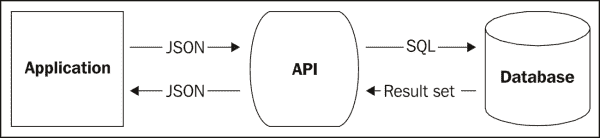
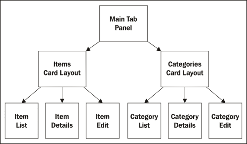
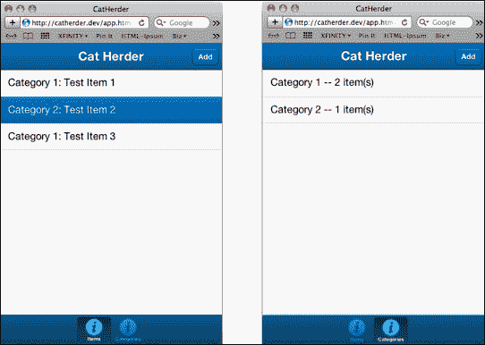

# 第六章。目录应用程序和 API

在本章中，我们将创建一个简单的目录应用程序，允许您输入待售项目并将它们分配到类别。从界面和功能角度来看，这将与之前我们创建的应用程序相似。这里的区别在于，我们将探索创建自己的 API 来从应用程序中创建、读取、更新和删除数据。

本章我们将涵盖：

+   什么是 API？

+   创建基本应用程序

+   开始使用 API

+   使用 PHP 创建 API

+   连接 API 和应用

# 什么是 API？

**API**（应用程序编程接口）是一种将存储在一个地方的数据提供给远程应用程序的简单方式。

记得我们关于本地存储的第一个问题吗？数据存储在设备上，这限制了它在许多方面的有用性。如果我们将数据与设备分开存储（在服务器上），我们可以允许多个设备访问数据，我们可以通过身份验证限制和确保数据的安全，并且我们可以为所有用户备份整个数据集。

当我们将数据与应用程序分开存储时，我们需要一种方法来访问它并对其进行更改。这就是 API 发挥作用的地方。在上一个章节中，我们使用了 Sencha.io API 来存储和检索数据。在本章中，我们将探讨如何创建自己的 API。

API 是一组用服务器端语言（如 PHP、Ruby、ASP 或 Perl）编写的代码文件。JavaScript 代码将这些数据作为 HTTP 请求（`GET`、`POST`、`PUT`或`DELETE`）的一部分发送到这些文件。在 Sencha Touch 的情况下，这些数据通常以 JSON 或 XML 格式发送。然后服务器端语言将解析数据，将其作为 SQL 语句发送到数据库。数据库返回一个结果，该结果由服务器端语言转换回 JSON，并返回到浏览器。

整个过程看起来像这样：



这一段落中有许多缩写，让我们将其分解成更小的部分。假设您想添加一些新的用户数据：姓名、电子邮件地址和电话号码。在其最基本的形式中，我们可以使用浏览器 URL 发送这些信息，如下所示：

[`mydomain.com/myapifile.php?action=add&&name=john&&email=john@mydomain.com&&phone=555-1212`](http://mydomain.com/myapifile.php?action=add&&name=john&&email=john@mydomain.com&&phone=555-1212)

这将允许我们的服务器端语言（我们将使用 PHP 作为示例）获取我们发送的数据并正确处理它。这可能看起来像这样：

```js
<?php
 $action = $_GET["action"];
 $name = $_GET["name"];
 $email = $_GET["email"];
 $phone = $_GET["phone"];
?>
```

### 注意

请注意，这只是一个示例；您几乎肯定想要过滤和检查任何传入的数据。由于我们不会在这里涵盖所有 PHP，我们将仅以非常通用的方式讨论服务器端代码。这不是实际使用，而是一个关于事物如何工作的通用概念。

现在 PHP 已经有了我们的变量，它可以将其转换为服务器端数据库可以理解的内容：

```js
if($action == "add") {
 $sql = "INSERT INTO users VALUES($name, $email, $phone)";
 $results = $db->query($sql);
}
```

这会将数据从 PHP 传递到数据库（如 MySQL）。然后数据库返回一个结果，我们可以遍历它以创建一个新的数组，该数组符合我们需要的格式。然后我们可以将结果格式化为 JSON 并将其回显：

```js
foreach($results as $result) {
  $newArray[$result['key']] = $result['value'];
}
json_encode($newArray);

print $result;
```

如前所述，这是一个非常原始的通用示例，API 可能会非常复杂，而且会很快变得复杂。幸运的是，Sencha Touch 自动处理了一些这项工作。

## 在 Sencha Touch 中使用远程 API

当使用 Sencha Touch 时，API 的 JavaScript 方面变得更容易管理。我们可以使用存储和模型完成我们需要的几乎所有事情。按照我们之前的例子，我们会创建一个看起来像这样的模型：

```js
Ext.define('MyApp.model.User', {
    extend: 'Ext.data.Model',
    config: {
        idProperty: 'id',
        fields: [
            {name: 'id', type: 'int'},
            {name: 'name', type: 'string'},
            {name: 'email', type: 'string'},
            {name: 'phone', type: 'string'}
        ]
    }
});
```

这设置了我们的简单模型，具有唯一的 `id`、`name`、`email` 和 `phone` 字段。然而，我们也可以向这个（在我们完成字段声明后）添加 `proxy` 设置和 `api` 定义：

```js
proxy: {
  type: 'scripttag',
  url: 'api/Users.php',
  reader: {
    type: 'json',
    root: 'children'
  },
  api: {
    create: 'api/Users.php?action=create',
    read: 'api/ Users.php?action=read',
    update: 'api/ Users.php?action=update',
    destroy: 'api/ Users.php?action=destroy'
  }
}
```

在这个例子中，我们使用一个 `scripttag` 代理。在章节的后面，我们将使用一个不同的代理，称为 `rest` 代理，用于实际的应用程序。你应该熟悉 Sencha Touch 提供的各种代理类型，并使用最适合你应用程序和需求的一个。

`scripttag` 代理允许我们与另一个域进行通信（如果 PHP 和 Sencha Touch 代码在同一个域上运行，则应使用 `ajax` 代理）。

### 注意

如我们在 第二章 中提到的，*阅读器*，这是由于同源策略，它防止 JavaScript 中的跨域攻击。如果你想了解更多关于这个同源策略的信息，这个维基百科文章是一个很好的起点：

[`en.wikipedia.org/wiki/Same_origin_policy`](http://en.wikipedia.org/wiki/Same_origin_policy)

`url` 属性告诉模型将信息发送到创建、读取、更新和删除用户的位置（通常称为 **CRUD** 函数）。

`reader` 属性告诉模型在接收到一个 JSON 编码的用户列表时在哪里查找数据。

最后，`api` 部分告诉模型为我们的每个 CRUD 函数使用哪个 URL。这种 API 设置允许我们完成诸如：

```js
var user = Ext.create('User', {
    name : 'Stacy McClendon',
    email  : 'stacy@superhappyfuntimego.com',
    phone: '555-555-5555'
});

user.save();
```

我们使用所有信息创建一个新的用户，然后调用 `save`。通过调用 `save`，信息被提交到我们在模型中之前设置的 `create` URL。

注意我们没有发送一个 ID。当我们创建一个新用户时，数据库实际上会设置唯一的 ID。一个正确编写的 API 应该在交易成功时返回这个值以及用户信息的其余部分。返回给我们的 JSON 应该看起来像这样：

```js
{
"totalCount":1,
"children":[
  {
      id:1,
      name : 'Stacy McClendon',
      email  : 'stacy@superhappyfuntimego.com',
      phone: '555-555-5555'
  }
 ]
}
```

我们可以使用这些信息进行任何所需的后期处理。

我们也可以通过调用以下方式保存现有用户的更改，或删除用户：

```js
user.destroy();
```

我们在设置用户存储时也使用相同的代理：

```js
Ext.define('MyApp.store.UserStore', {
  extend: 'Ext.data.Store',
  model: ' MyApp.model.User',
  requires: [' MyApp.model.User'],
  storeID: 'UserStore',
  emptyText: 'No Users To List',
  proxy: {
    type: 'ajax',
    url: 'api/users.php',
    reader: {
      type: 'json',
      root: 'children'
    },
    api: {
      create: 'api/users.php?action=create',
      read: 'api/users.php?action=read',
      update: 'api/users.php?action=update',
      destroy: 'api/users.php?action=destroy'
    }
  }
});
```

这将使我们能够一次性创建、读取、更新和删除多个用户。

当我们加载或同步商店时，将会调用 `api` 部分，如下所示：

+   在商店上调用 `load()` 将会联系 `users.php`，它应该返回用户列表

+   在商店中添加新的用户记录并调用 `sync()` 将会联系 `users.php` 并保存新用户

+   在商店中更新现有用户记录并调用 `sync()` 将会联系 `users.php`，并更新每个用户记录

+   从商店中删除用户并调用 `sync()` 将会联系 `users.php`，并在数据库中销毁指定的用户记录

    ### 小贴士

    在模型和商店上定义 `proxy` 设置并不是严格必要的。如果你的模型有定义 `proxy` 设置而你的商店没有，那么商店将自动使用模型的 `proxy`。

如果你使用的是你没有编写的 API，你需要确保你发送的数据和请求是以正确的格式进行的。查看你所使用的 API 文档，以了解是否有任何额外的要求。

如你所注意到的，我们在 API 端的事情上有点含糊。这是因为每个 API 在期望的数据和返回的数据方面都有所不同。

大多数公开可访问的 API 都有相当好的文档，但了解制作 API 的基本概念也是有帮助的。

## 创建自己的 API

在最基本的情况下，API 执行三个核心功能：

+   从远程源接收数据

+   连接到并修改数据库（或其他数据源）

+   向远程应用程序发送数据

当你创建自己的 API 时，你需要考虑这些函数中的每一个。你可以使用任何你想要的服务器端语言来创建你的 API，只要它能处理这三个基本的事情。让我们从高层次的角度来看每个这些函数。

### 接收数据

当你从应用程序接收数据时，你需要弄清楚用户在询问什么，以及他们期望如何返回答案。

当你使用标准的 Sencha Touch API 对模型和商店进行请求时，会触发 `create`、`read`、`update` 和 `destroy` 函数，导致请求被发送到你在代理配置中指定的 URL，以及交易相关的任何数据。你也可以使用 `params` 配置发送额外的数据，如下所示：

```js
store.load({
 params:{paramName: paramValue}
});
```

你的 API 需要设置好以接收和转换数据和任何额外的参数，以便它可以决定采取什么行动以及返回什么数据。

你首先需要做的是确定变量是否作为 `GET` 或 `POST` 请求的一部分发送。你选择的服务器端语言应该有处理这两种传输类型的方法。

如前所述，PHP 可以使用`$_GET["variableName"]`和`$_POST["variableName"]`来收集这些数据。你选择的语言将有类似的功能。这些数据也将被编码为 JSON，因此在你能够获取到单个数据项之前，你需要对其进行解码。

大多数服务器端语言都有处理此问题的函数。例如，PHP 使用`json_decode($myJSONData)`将 JSON 数据转换为 PHP 数组。

数据收集完毕后，应该检查以确保它是我们预期的。例如，如果我们的 API 接收到的`action`值为`read`，而`id`值为`DELETE * FROM users`，我们可能不希望将此发送到我们的数据库。大多数语言也有验证数据类型和清理任何潜在有害值的方法。

此外，存储可以经常将多个请求组合成数据数组。你的代码需要检查传递的数据是数组还是单个项目，并相应地处理。

### 与数据库通信

一旦你有了变量，并且理解了用户需要完成什么，你可能会需要连接到你的数据库以获取或修改数据。例如，如果你得到一个`action`值为`read`，而`id`值为`45`，你可能会想要查询数据库以获取任何`id`值为`45`的用户。

执行此操作需要了解你使用的服务器端语言如何连接到数据库，以及你的数据库如何接受信息查询。你需要查阅你语言和数据库的参考指南，以确定如何完成此操作。

### 将数据发送回应用程序

一旦你与数据库进行了通信，并且准备将信息发送回应用程序，你需要正确地编码它，以便 Sencha Touch 能够处理它。

需要注意的是，Sencha Touch 期望接收编码为 JSON 的数据。大多数服务器端语言都有处理这种数据的函数。例如，PHP 使用`json_encode($myArrayOfData)`将信息捆绑成 JSON 格式。

一旦你有了 JSON 编码的数据，你可以直接使用类似 PHP 的`print`或`echo`函数将其输出到浏览器。

### 关于 API 的更多信息

现在你已经对 API 的工作方式有了些了解，你可以收集你想要使用的服务器端语言的特定数据。获取更具体的信息，请参阅：

[`www.webresourcesdepot.com/how-to-create-an-api-10-tutorials/`](http://www.webresourcesdepot.com/how-to-create-an-api-10-tutorials/)

# 构建基本应用程序

对于这一章，我们不会详细介绍整个应用程序的构建过程。相反，我们将主要关注模型、存储和基本 API。应用程序本身由一个带有两个标签的标签布局组成。我们两个标签中的每一个都是一个带有卡片布局的面板，一个用于项目，一个用于类别。反过来，这两个面板都有自己的子面板，用于列出、显示详细信息和管理（分别是一个列表、一个面板和一个表单面板）。



您可以查看应用程序代码以了解这些组件是如何布局的。主选项卡面板和用于项目和类别的两个卡片布局面板都是`Main.js`文件的一部分。列表、详细信息和管理面板都是`app/views`文件夹内的独立视图。我们稍后会回到视图，但对我们这一章真正感兴趣的是存储和模型。

## 创建项目模型

模型是大多数有趣事情发生的地方。在模型中，我们将使用两个新的选项：一个`rest`代理和模型关系。

```js
Ext.define('CatHerder.model.Item', {
    extend: 'Ext.data.Model',
    uses: [
        'CatHerder.model.Category'
    ],
    config: {
        idProperty: 'itemID',
        fields: [
            {
                name: 'itemID',
                type: 'int'
            },
            {
                name: 'name'
            },
            {
                name: 'description'
            },
            {
                name: 'price',
                type: 'float'
            },
            {
                name: 'photoURL'
            },
            {
                name: 'categoryID',
                type: 'int'
            }
        ],
        hasOne: {
         model: 'CatHerder.model.Category',
         name: 'category',
         primaryKey: 'categoryID'
           },
            proxy: {
             type: 'rest',
        url: '/api/item'
       }
    }
});
```

这与我们的先前模型以相同的方式开始，但我们有一个新的配置选项称为`uses`。此选项设置为我们的另一个模型`CatHerder.model.Category`，并告诉我们我们将有一个`Item`模型和`Category`模型之间的关系。

在我们的`fields`下方，我们还有一个新的选项，称为`hasOne`。此选项告诉我们每个`Item`都与一个`Category`相关联。

### 注意

您还可以使用`hasMany`选项。这将允许您为项目设置多个类别。为了简单起见，我们将在这个例子中使用`hasOne`。要查看`hasMany`的一些示例，请参阅[`docs.sencha.com/touch/2-0/#!/api/Ext.data.association.HasMany`](http://docs.sencha.com/touch/2-0/#!/api/Ext.data.association.HasMany)。

`hasOne`选项包括：

+   我们要关联的模型：`CatHerder.model.Category`

+   我们将引用以获取相关信息的`name`属性：`category`

+   `primaryKey`属性表示是`Item`模型的一部分的字段，我们将使用它来匹配为相关模型`categoryID`设置的`id`属性。

此配置将使我们能够以使用`Item`模型的其他属性相同的方式使用`Category`模型中的字段。

我们还有一个新的代理类型，称为`rest`代理。与之前我们讨论的`scripttag`代理不同，`rest`代理使用不同类型的 HTTP 请求来表示我们是在创建、读取、更新还是删除数据。

不同的请求类型包括：

+   创建新记录将以`POST`请求发送

+   读取数据将以`GET`请求发送

+   更新现有记录将以`PUT`请求发送

+   删除记录将以`DELETE`请求发送

每种请求类型都将发送到 `api/item` 进行处理。我们在 URL 上做了一些技巧，使它们对用户看起来更干净。

### RewriteRule 和 .htaccess

通常我们会在早期 `scripttag` 代理示例中指向特定的文件，就像这样：

```js
proxy: {
  type: 'rest',
  url: '/api/item.php'
}
```

当我们想要查看特定项目时，URL 看起来像这样：

[`myapp.com/api/item.php?item=143`](http://myapp.com/api/item.php?item=143)

然而，通过一点配置，我们可以将其更改，使 URL 看起来像这样：

[`myapp.com/api/item/143`](http://myapp.com/api/item/143)

这更简洁，也更易于阅读。只需一个 `RewriteRule` 指令和一个 `.htaccess` 文件即可。

`.htaccess` 文件由 Apache 网络服务器用于确定您所使用的服务器的一组选项和配置。这些选项可以通过在应用程序的 `api` 目录中创建或编辑 `.htaccess` 文件来设置。在这种情况下，我们将创建一个包含以下信息的文件：

```js
RewriteEngine on
# Send item requests to item.php
RewriteRule ^item(/.*)?$ /api/item.php [L]

# Send category requests to category.php
RewriteRule ^category(/.*)?$ /api/category.php [L]
```

第一行启用了重写 URL 的功能。这意味着虽然用户的地址栏显示的是一件事，但我们将请求重定向到不同的文件。正如前面的注释所述，下一个块将任何对 `item` 的请求发送到 `item.php`，下一个块将请求发送到 `category.php`。`[L]` 指令表示如果规则与当前请求的 URL 匹配，则不再检查更多规则，因为这将是最后一个匹配的规则。这是一个非常简单的更改，使应用程序看起来更加专业和友好。

### 注意

如果您想了解更多关于 `.htaccess` 和 Apache 的信息，一个好的起点是 [`www.addedbytes.com/for-beginners/url-rewriting-for-beginners/`](http://www.addedbytes.com/for-beginners/url-rewriting-for-beginners/)。

保存文件并关闭它。现在，我们所有的不同 HTTP 请求都将发送到 `api/item` 和 `api/category`。

为了理解我们的 API 如何区分不同的 HTTP 请求类型以便理解如何处理数据，我们将在下一部分进行说明，但首先让我们快速看一下存储。

## 项目存储

对于这个项目，项目存储非常简单：

```js
Ext.define('CatHerder.store.itemStore', {
    extend: 'Ext.data.Store',
    requires: [
        'CatHerder.model.Item'
    ],

    config: {
        model: 'CatHerder.model.Item',
        storeId: 'itemStore',
        autoLoad: true
    }
});
```

由于我们没有声明代理，存储将自动使用我们在模型上设置的存储。除此之外，我们只需要求我们的模型给存储提供一个 `storeId` 值，并将 `autoLoad` 设置为 `true`。

## 创建分类模型和存储

我们的分类模型和存储只是我们项目模型和存储的变体。该模型使用 `hasMany` 而不是 `hasOne`：

```js
Ext.define('CatHerder.model.Category', {
    extend:'Ext.data.Model',
    config:{
        idProperty:'categoryID',
        fields:[
            {
                name:'categoryID',
                type:'int'
            },
            {
                name:'name'
            }
        ],
        hasMany:{
            model:'CatHerder.model.Item',
            name:'items',
            autoLoad:false
        },
        proxy:{
            type:'rest',
            url:'/api/category'
        }
    }
});
```

我们使用 `hasMany` 是因为我们将在单个分类中拥有多个项目。除此之外，模型的基本结构与我们的项目模型相同，使用 `rest` 代理并联系我们的 PHP API 在 `/api/category`。

我们的 `categoryStore` 也是 `itemStore` 的虚拟副本：

```js
Ext.define('CatHerder.store.categoryStore', {
    extend: 'Ext.data.Store',
    requires: [
        'CatHerder.model.Category'
    ],
    config: {
        model: 'CatHerder.model.Category',
        storeId: 'categoryStore',
        autoLoad: true
    }
});
```

如前所述，我们只是扩展了基本存储组件，声明我们正在使用的模型(`'CatHerder.model.Category'`)，并给存储一个我们可以稍后引用的 ID。

一旦我们有了这两部分，就到了进行一些测试的时候了。

## 测试存储和模型

当为您的应用程序创建 API 时，通常从只是一个平面文本文件开始是个好主意。这将让您测试存储的读取能力，并帮助您更好地理解数据将如何格式化以适应您的 API。

对于这个测试文件，我们将创建几个非常基础的 PHP 文件。这些文件将简单地创建一个静态数据数组，将其编码为 JSON，并将其回显到应用程序中。

### 注意

您可以使用任何您喜欢的服务器端语言；Sencha Touch 并不关心，只要它能接受和返回 JSON 即可。如果您想使用 PHP 作为您的服务器代码，但需要一个起点，请尝试[`phpmaster.com/`](http://phpmaster.com/)。PHP Master 为所有级别的 PHP 程序员提供了大量的教程。

我们将从`item.php`文件开始：

```js
<?PHP

$test = array(
  array(
    'itemID' => 1,
    'name' => 'Test Item 1',
    'description' => 'Lorem Ipsum',
    'price' => 1.00,
    'photoURL' => 'http://placekitten.com/200/300',
    'categoryID' => 1,
    'category' => array(
      'categoryID' => 1, 'name' => 'Category 1', 'itemID' => 1
    )
  ),
  array(
    'itemID' => 2,
    'name' => 'Test Item 2',
    'description' => 'Lorem Ipsum',
    'price' => 2.00,
    'photoURL' => 'http://placekitten.com/400/300',
    'categoryID' => 2,
    'category' => array(
      'categoryID' => 2, 'name' => 'Category 2', 'itemID' => 2
    )
  ),
  array(
    'itemID' => 3,
    'name' => 'Test Item 3',
    'description' => 'Lorem Ipsum',
    'price' => 3.50,
    'photoURL' => 'http://placekitten.com/200/200',
    'categoryID' => 1,
    'category' => array(
      'categoryID' => 1, 'name' => 'Category 1', 'itemID' => 3
    )
  )
);

echo json_encode($test);
?>
```

此文件创建了一个名为`$test`的数组。`$test`数组在其内部嵌套了三个数组，每个数组对应我们的一个项目。这些数组包含各种字段，如`itemID`、`name`、`description`、`price`、`photoURL`和`categoryID`。它们还包含作为附加嵌套数组一部分的类别数据。我们将类别数据包含在项目数据中，以便我们的存储可以通过`hasOne`关系访问它，而无需对每个项目进行额外的 AJAX 调用以从服务器加载类别数据。

当您为应用程序编写最终的 PHP 代码时，它将查询数据库以获取关于项目和类别的信息。然后 PHP 需要以这种格式格式化它。

### 注意

PHP 以类似于 Sencha Touch 的方式格式化数组，其中 Sencha Touch 使用`key: value`，而 PHP 使用`'key' => value`。

PHP 文件的最后一行将我们的数组编码为 JSON。然后我们使用`echo`将数据发送回我们的应用程序。

我们在`category.php`中对类别数组做完全相同的事情：

```js
<?PHP

$test = array(
  array(
    'categoryID' => 1,
    'name' => 'Category 1',
    'items' => array(
      array(
        'itemID' => 1,
        'name' => 'Test Item 1',
        'description' => 'Lorem Ipsum',
        'price' => 1.00,
        'photoURL' => 'http://placekitten.com/200/300',
        'categoryID' => 1
      ),
      array(
        'itemID' => 3,
        'name' => 'Test Item 3',
        'description' => 'Lorem Ipsum',
        'price' => 3.50,
        'photoURL' => 'http://placekitten.com/200/200',
        'categoryID' => 1
      )
    )
  ),
  array(
    'categoryID' => 2,
    'name' => 'Category 2',
    'items' => array(
      array(
        'itemID' => 2,
        'name' => 'Test Item 2',
        'description' => 'Lorem Ipsum',
        'price' => 2.00,
        'photoURL' => 'http://placekitten.com/400/300',
        'categoryID' => 2	
      )
    )
  ) 
);

echo json_encode($test);
?>
```

注意，在这种情况下，我们只有两个类别，但我们还包含了与每个类别关联的项目。这使得我们可以在稍后对数据进行更多操作（例如显示类别中的项目数量）。

虽然这些可能看起来像大而杂乱的数组，但最终的 PHP 代码将为您做大部分工作。这只是为了测试并确保您已经正确地格式化了初始数据。



当您加载应用程序时，现在您可以看到包含平面数据的两个列表。让我们快速看一下我们用于这些数据的 XTemplates。

## 创建 XTemplates

现在我们已经看到了数据是如何发送到应用程序的，我们需要了解我们如何在 XTemplates 中使用它。在我们的列表视图中，`itemTpl`看起来像这样：

```js
itemTpl: [
  '{category.name}: {name}',
  '<p class="delete hidden" style="position: absolute; right: 10px; top: 12px;">',
  '',
  '</p>'
]
```

我们的类别和项目都包含名称字段值。由于项目是我们这里的主要数据，我们可以将项目的名称值称为 `{name}`。由于类别与项目相关（并且我们的 PHP 将其作为每个项目的嵌套数组返回），我们将类别名称值称为 `category.name`。

我们使用的类别列表 XTemplate 采用类似的格式来提供类别名称，但它使用了一种稍微不同的方法来获取每个类别中的项目数量：

```js
itemTpl:[
    '<div>{name} -- {[values.items.length]} item(s)</div>'
]
```

由于类别是我们这里的主要数据，名称指的是类别名称。我们可以通过执行 `item.propertyName` 来获取任何项目的属性，但我们真正想知道的是类别中的项目数量。

记住，在我们的 PHP 平面文件中，我们将单个项目作为嵌套数组的一部分包含在我们的类别中。这个嵌套数组被称为 `items`。我们可以通过使用 `items[0].name` 来打印第一个项目的名称，或者通过使用 `items[1].name` 来打印第二个项目的名称，以此类推，为每个不同的项目和属性。我们还可以使用 JavaScript 的 `length` 属性来找出 `items` 数组中有多少个单独的项目。

为了做到这一点，我们需要在我们的模板中使用内联 JavaScript 代码。这就是为什么我们同时使用花括号和方括号的原因：`{[function goes here]}`。当你在模板中使用内联代码时，你必须通过 `values` 数组而不是通过名称来访问模板变量。

在这种情况下，`values.items.length` 返回 `items` 数组中的元素数量。

现在我们已经可以看到 PHP 如何格式化值并在 XTemplate 中显示，让我们看看我们如何在数据库中工作以存储和检索这些数据。

# API 和数据库

首先，我们需要用一些新的代码替换我们的平面 PHP 文件。这段代码将包含三个基本任务：

+   决定传入的是哪种类型的请求

+   联系数据库并发出适当的请求

+   格式化要返回给 Sencha Touch 应用程序的数据

    ### 注意

    请注意，从现在开始，我们将查看 PHP 代码。虽然其中一些看起来与 JavaScript 类似，但此代码完全独立于 JavaScript 和 Sencha Touch。

这三个基本函数无论你的 API 用什么语言编写都成立，尽管实现方式会有所不同。在我们的 PHP 中，第一个任务可能看起来像这样：

```js
include_once 'dbSetup.inc';

switch ($_SERVER['REQUEST_METHOD']) {
case "GET":
    doGet();
    break;
case "POST":
    doPost();
    break;
case "PUT":
    doPut();
    break;
case "DELETE":
    doDelete();
    break;
default:
    doGet();
}
```

在这里，我们包含我们的数据库设置文件，它处理数据库和我们的代码之间的基本连接。接下来，我们使用特殊变量 `$_SERVER['REQUEST_METHOD']`，它告诉我们请求是通过 `GET`、`POST`、`PUT` 还是 `DELETE` 发送的。

### 注意

`GET`、`POST`、`PUT` 和 `DELETE` 被称为 **HTTP 方法** 或 **动词**，用于表示用户与 Web 服务器之间的交互。要了解更多关于 HTTP 动词的信息，请查看 RFC [`www.w3.org/Protocols/rfc2616/rfc2616-sec9.html`](http://www.w3.org/Protocols/rfc2616/rfc2616-sec9.html)。

我们使用`switch`语句（就像 JavaScript 中的那样）将不同的请求发送到不同的函数。每个函数将联系数据库并执行请求。

我们不会深入到执行此操作的 PHP 代码的细节，但我们将查看不同请求的基本操作。

## GET 请求

`GET`请求用于从数据库中读取，并在 API 中有两种基本用途：获取单个项目或获取项目列表。首先我们需要确定请求是针对单个项目还是所有项目。

在 REST API 中，对单个项目的请求看起来是这样的：

[`mydomain.com/api/items/123`](http://mydomain.com/api/items/123)

在这种情况下，我们想要返回一个 ID 为 123 的单个项目。然而，如果我们得到一个看起来像这样的请求：

[`mydomain.com/api/items/`](http://mydomain.com/api/items/)

我们只是将数据库中的所有项目发送回去。

因此，我们的`doGet()`函数首先需要检查 URL，看看我们的请求 URL 的末尾是否有额外的数字：

```js
function doGet() {
    $db = dbSetup();

    if (preg_match('/item\/(\d+)[\/]*$/', $_SERVER['REQUEST_URI'], $matches)) {
        /* We've got a single item to grab. */
        $itemID = array($matches[1]); // execute() expects an array.
        $stmt = $db->prepare("select * from `items` where itemID = ?");
        if (is_object($stmt) && $stmt->execute($itemID)) {
            /* We only asked for one. */
            $row = $stmt->fetch();
            $row['category'] = getCategory($row['categoryID'], $db);
            doJson($row);
        } else {
            doJson(array(), false, $stmt->errorInfo());
        }
    }
```

第一行设置我们的数据库，以便我们可以进行请求。

### 注意

我们已经将数据库的设置文件包含在本章的示例代码中。对于这个应用程序，我们假设使用 MySQL 数据库，它是免费可用的。有一个`dbSetup.inc`文件用于处理数据库的基本设置和配置，还有一个`setup.sql`文件，可以导入 MySQL 以设置应用程序的初始表。更多信息请访问[`dev.mysql.com/doc/`](http://dev.mysql.com/doc/).

PHP 代码的下一部分使用正则表达式匹配来检查我们作为请求的一部分接收到的 URL (`$_SERVER['REQUEST_URI']`)。

### 注意

正则表达式是匹配字符串、数字和字符的极其强大的工具。您可以使用它来查找不仅仅是单词或字母，还可以查找任何字符串中的模式。更多信息请访问：

[`www.regular-expressions.info/`](http://www.regular-expressions.info/).

如果我们得到匹配，这意味着我们正在寻找单个项目。然后我们取我们的单个项目并使用它向 MySQL 发送请求以获取相关数据。我们获取 MySQL 返回的`row`数据。我们使用`row`数据中的`categoryID`值，通过另一个名为`getCategory()`的函数将分类数据附加到行数据上。然后整个数据传递给一个名为`doJson()`的函数进行最终格式化。

这个`doJson()`函数将在我们的代码的多个地方使用。它简单地将一个数组、一个成功值和一个可选的消息转换成 Sencha Touch 可以处理的 JSON 编码格式：

```js
function doJson($data, $success = true, $message = '') {
    $output = array('success' => $success, 'data' => $data);
    if ($message != '') {
        $output['message'] = $message;
    }
    echo json_encode($output);
}
```

在我们的`doGet()`函数中，我们已经处理了单个项目的请求，现在我们需要处理所有项目的请求。这意味着除了我们原来的`if`语句（处理我们的单个项目请求）之外，我们还需要一个`else`语句：

```js
} else {
        $data = array();
        $categories = array();
        $filters = json_decode($_GET['filter'], TRUE);
        $start = intval($_GET['start']);
        $limit = intval($_GET['limit']);
        /* For simplicity, just use one filter */
        $filterColumn = $filters[0]['property'];
        $filterValue = $filters[0]['value'];
        $sql = "select * from `items`";
        if (!is_null($filterValue) && $filterValue != 'null' && $filterValue != "") {
            $sql .= " where `$filterColumn` = '$filterValue'";
        }
        if ($limit > 0) {
            $sql .= " limit $start,$limit";
        }
        foreach ($db->query($sql) as $row) {
            /* Only fetch categories once. */
            if (!isset($categories[$row['categoryID']])) {
                $categories[$row['categoryID']] = getCategory($row['categoryID'], $db);
            }
            $row['category'] = $categories[$row['categoryID']];

            $data[] = $row;
        }

        echo json_encode($data);
        exit;
    }
```

这个操作的工作方式略有不同，因为我们正在获取多个结果。这意味着我们需要通过循环遍历我们的结果（使用 `foreach`），并将它们放入一个我们可以使用 `json_encode()` 处理的单个数组中。我们还需要在循环的每一轮中使用我们的 `getCategory()` 函数来获取 `category` 数据并将其添加到我们的每个条目中。

一旦我们有了所有这些，我们就回显编码后的数组并退出。这将发送 JSON 回到我们的应用程序，以便在 XTemplate 中显示。

我们还包含了一些可选的组件，我们可以在以后使用：过滤器以及起始/限制。这将允许我们传递过滤器的值（作为一个数组），以及起始和限制作为单独的值。然后我们可以将这些传递给 MySQL，控制我们获取的结果数量或通过特定的列过滤结果。在 API 中构建这种灵活性总是一个好主意。当您开始向应用程序添加新功能时，这可以真正为您节省时间。

## POST 请求

`POST` 请求是我们需要处理新项目创建的地方。这次变量作为 `POST` 请求传递给我们，而不是作为 URL 的一部分（如我们之前的 `GET` 方法）。

### 小贴士

**发送 POST 请求时使用零为新项目**

在我们的 `item` 模型中，我们将 `itemID` 设置为我们的 `id` 属性。这是我们的数据记录的唯一 `id`。有一种旧的编程习惯，当你想要创建一个新的数据记录时，将 `id` 设置为 `0`。然而，如果你在你的模型中将 `id` 设置为 `0`，Sencha Touch 会将其视为一个有效的 ID，并确定你正在更新一个记录，这将使你的请求作为一个 `PUT` 请求，而不是 `POST` 请求。

我们的 `doPost()` 函数需要获取请求发送的数据并解码 Sencha Touch 发送的 JSON。由于我们还需要在我们的 `doPut()` 和 `doDelete()` 函数中这样做，我们将创建一个单独的函数来执行解码：

```js
function getJsonPayload() {
    return json_decode(file_get_contents('php://input'), true);
}
```

在 PHP 中，我们可以使用 `file_get_contents('php://input')` 获取请求的原始数据流。然后我们可以使用 `json_decode()` 将此流从 JSON 解码为一个关联数组 `('key' => 'val')`。每当函数被调用时，我们简单地返回这个关联数组。

这个新函数在 `doPost()` 函数的顶部被调用：

```js
function doPost() {
    $data = getJsonPayload();
    $sql = "insert into `items` (`itemID`, `name`, `description`, `price`, `photoURL`, `categoryID`) values (NULL, :name, :description, :price, :photoURL, :categoryID)";

    $db = dbSetup();
    /* Prepare our data. Here is where you should add filtering, etc. */
    $insert = array();
    foreach ($data as $key => $val) {
        if ($key != "category_id") {
            $insert[':'.$key] = $val;
        }
    }

    $stmt = $db->prepare($sql);
    $stmt->execute($insert);
    $data['itemID'] = $db->lastInsertId();
    $data['category'] = getCategory($data['categoryID'],$db);
    doJson($data);
}
```

接下来，我们创建将用于将数据放入我们数据库的 SQL 语句。然后我们需要格式化我们的数据，以确保它能够正确地与我们的 MySQL 语句匹配。

我们这样做是通过遍历我们的数据并创建一个修改后的数组，该数组将适用于 `execute()` 命令，将数据与 `sql` 语句结合并插入我们的新数据记录。

我们然后使用 `$db->lastInsertId()` 获取新数据行的唯一 ID，并将其添加到我们的数据数组中，这样我们就可以通过 `doJson()` 函数将其传递回 Sencha Touch 应用程序。我们就是这样做的。

我们的 `PUT` 请求遵循一个非常相似的格式。

## PUT 请求

当我们在 Sencha Touch 中保存一个具有有效 `id` 属性的对象时，会执行 `PUT` 请求，在这种情况下，是一个 `itemID` 值。当 Sencha Touch 发送此类预存在对象的 `save` 请求时，它使用 `PUT` 请求。

我们的 API 函数 `doPut()` 与我们的 `doPost()` 函数执行相同的基本操作：

```js
function doPut() {
    $data = getJsonPayload();
    $sql = "update `items` set `itemID` = :itemID, `name` = :name, `description` = :description, `price` = :price, `photoURL` = :photoURL, `categoryID` = :categoryID where `itemID` = :itemID";

    $db = dbSetup();

    /* Prepare our data. Here is where you should add filtering, etc. */
    $insert = array();
    foreach ($data as $key => $val) {
        if ($key != "category_id") {
            $insert[':'.$key] = $val;
        }
    }

    $stmt = $db->prepare($sql);
    $stmt->execute($insert);
   ata['category'] = getCategory($data['categoryID'],$db);
    doJson($data);
}
```

由于我们已经有唯一的 `itemID`，我们不需要在更新行后从数据库中获取它。除此之外，基本结构是相同的。我们只是在 MySQL 中输入 `update` 命令而不是 `insert`。

## DELETE 请求

当我们在 Sencha Touch 中的模型记录上调用 `erase()` 时，会发送一个 `DELETE` 请求。在这种情况下，我们的 API 只关心唯一的 `itemID`，因此我们不需要创建一个新的数组来与我们的 `execute()` 语句一起使用。我们仍然使用 `getJsonPayload()` 来获取数据，并在执行后，回显 JSON 编码的数据。

```js
function doDelete() {
    $db = dbSetup();
    $data = getJsonPayload();
    $itemID = array($data['itemID']);
    $sql = 'delete from items where itemID = ?';
    $stmt = $db->prepare($sql);
    $stmt->execute($itemID);
    echo json_encode($data);
} 
```

在 Sencha Touch 的另一侧，您需要重新加载存储以查看从列表中删除的记录。

## API 的其余部分

API 的分类部分与刚刚我们讨论的项目部分工作方式完全相同。您可以在本章的示例代码中查看，但逻辑都是一样的。顶部有一个 `switch` 语句，用于确定请求是如何接收的。然后我们有相同的基本函数集来响应每种类型的请求。

这种简单的可重复结构可以用来生成适用于任何应用程序的基本 API。

如果您需要在您的 API 中使用除基本 CRUD 函数之外的功能，您还可以使用 AJAX 存储，将请求发送到 API 文件，在那里它可以被适当处理。API 需要执行相同的基本功能：

+   根据发送的变量或请求的类型确定请求的类型

+   通过数据库处理请求

+   将必要的请求编码成 JSON 并将其发送回 Sencha Touch 应用程序

+   在失败的情况下，也应该发送一条消息以帮助调试或向用户提供一些帮助解决问题的信息

# 摘要

在本章中，我们使用了一个简单的目录应用程序来构建我们自己的 API。此外，我们还涵盖了：

+   如何设置 Sencha 模型关联

+   使用 `.htaccess` 和 `mod_rewrite` 的技巧来为我们的 API 创建更漂亮的 URL

+   使用 `Ext.data.proxy.Rest` 通过基本的 CRUD 交互与 API 进行通信

在下一章中，我们将使用来自几个第三方 API 的数据来增强我们的应用程序。
