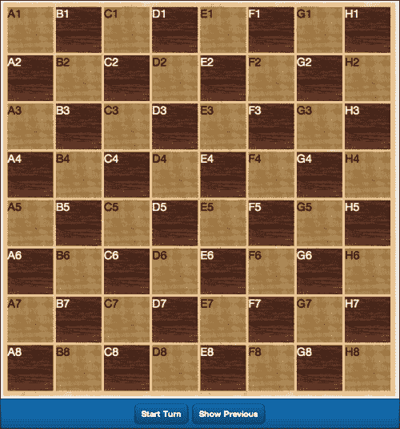
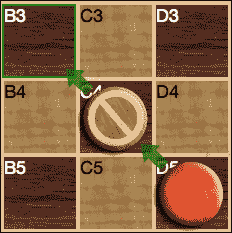
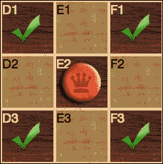
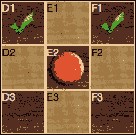
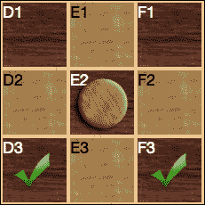
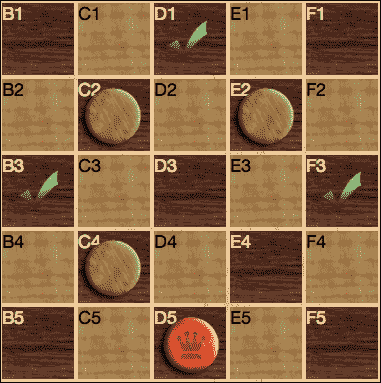
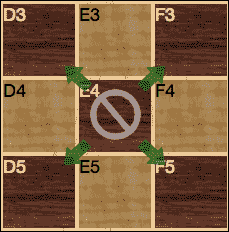
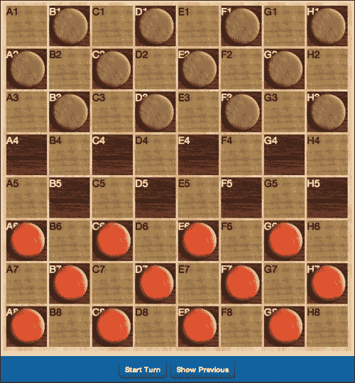
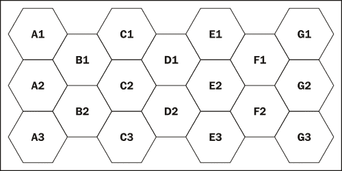

# 第十章。游戏开始

快速浏览任何在线应用商店都会迅速显示，移动应用程序市场最大的部分属于游戏。虽然大多数程序员在开发游戏时不会想到 JavaScript，但实际上它非常适合各种游戏，包括回合制策略游戏。

这些游戏只需要有限的动画，并且可以很容易地使用 Sencha Touch 框架和 Sencha.io 平台进行通信。对于回合制策略游戏，我们只需要做几件基本的事情，例如：

+   构建游戏棋盘

+   构建单个棋子

+   处理移动

+   处理一个棋子攻击另一个棋子的结果

+   处理玩家在回合结束时移动的通信

+   定义游戏的结束

虽然这种游戏风格可能看起来很微不足道，但它涵盖了从井字棋到国际象棋、扑克、围棋、风险以及互联网时代之前的复杂桌面策略游戏（如轴心国与同盟国）的一切。

### 备注

如果你真的想了解这些游戏有多复杂，请查看 [`boardgamegeek.com/`](http://boardgamegeek.com/) 并查看策略部分。

由于我们没有一本整本书来专门讨论这个单一主题，我们将从一个相对简单的跳棋游戏开始。我们还将探讨一些将这个简单游戏扩展并创建更复杂游戏的可能方法。

# 构建基本棋盘

在任何类型的回合制策略游戏中，一切始于棋盘。棋盘决定了棋子放置的位置以及它们可以移动的位置。

跳棋或国际象棋的棋盘由一个 8x8 的方格网格组成。方格在浅色和深色（通常为跳棋棋盘的红色和黑色）之间交替。

此外，只有深色方格可以被跳棋的棋子使用。

你可以使用许多不同的 Sencha Touch 组件来创建这样的棋盘，但出于这些目的，一个 DataView 可能是最合适的选择。DataView 将允许我们点击并选择我们想要移动的棋子以及我们想要将其移动到的位置。这些选择方法已经内置在 DataView 中。我们还可以根据这些选择应用样式，让用户知道哪些移动是有效的。

## 创建方格模型

我们的 DataView 将由一个我们称为 `Square` 的模型提供数据。它看起来像这样：

```js
Ext.define('Checkers.model.Square', {
    extend: 'Ext.data.Model',
    config: {
        fields: [
            {name: 'squareID', type: 'string'},
            {name: 'occupiedBy', type: 'string'},
            {name: 'pieceType', type: 'string'},
            {name: 'decoration', type: 'string'},
            {name: 'background', type: 'string'}
        ],
        idProperty: 'squareID'
    }
});
```

此模型包含五个关键信息：

+   `squareID` 告诉我们方格在我们棋盘上的确切位置。

+   `occupiedBy` 的值告诉我们方格目前是否被红色棋子、黑色棋子占据，或者是否为空（`none`）。

+   `pieceType` 将告诉我们我们是在处理普通棋子还是国王。

+   `decoration` 设置将允许我们指示棋子的当前移动路径以及是否有特定的棋子被跳过。

+   `background` 设置控制棋子的背景颜色。我们将使用它来为 DataView 设置样式。

我们初始加载数据看起来可能像这样：

```js
{squareID: 'A1', occupiedBy: 'none', pieceType: 'none', decoration: '', background: 'light'},
{squareID: 'B1', occupiedBy: 'black', pieceType: 'Piece', decoration: '', background: 'dark'},
{squareID: 'C1', occupiedBy: 'none', pieceType: 'none', decoration: '', background: 'light'},
{squareID: 'D1', occupiedBy: 'black', pieceType: 'Piece', decoration: '', background: 'dark'},
{squareID: 'E1', occupiedBy: 'none', pieceType: 'none', decoration: '', background: 'light'},
{squareID: 'F1', occupiedBy: 'black', pieceType: 'Piece', decoration: '', background: 'dark'},
{squareID: 'G1', occupiedBy: 'none', pieceType: 'none', decoration: '', background: 'light'},
{squareID: 'H1', occupiedBy: 'black', pieceType: 'Piece', decoration: '', background: 'dark'},
{squareID: 'A2', occupiedBy: 'black', pieceType: 'Piece', decoration: '', background: 'dark'},
{squareID: 'B2', occupiedBy: 'none', pieceType: 'none', decoration: '', background: 'light'},
{squareID: 'C2', occupiedBy: 'black', pieceType: 'Piece', decoration: '', background: 'dark'},
{squareID: 'D2', occupiedBy: 'none', pieceType: 'none', decoration: '', background: 'light'},
{squareID: 'E2', occupiedBy: 'black', pieceType: 'Piece', decoration: '', background: 'dark'},
{squareID: 'F2', occupiedBy: 'none', pieceType: 'none', decoration: '', background: 'light'},
{squareID: 'G2', occupiedBy: 'black', pieceType: 'Piece', decoration: '', background: 'dark'},
{squareID: 'H2', occupiedBy: 'none', pieceType: 'none', decoration: '', background: 'light'}…
```

这将继续，给我们每行八个方格的八行。方格用 A 到 H 表示，行用 1 到 8 编号。这些数据还将按照国际跳棋游戏开始的标准布局排列初始棋子。

你也会注意到，当我们交替背景时，我们保持行的最后一个项目和下一行的第一个项目颜色相同（`H1`和`A2`都是`dark`）。这给了我们我们的棋盘图案。



实际的棋盘图像本身是一个单独的背景图像。我们已经安排了我们的 DataView 覆盖棋盘并与单个方格对齐。这将使我们能够使用 CSS 将元素放置在我们选择的任何方格上。`dataview`代码作为我们`view/Main.js`文件中的一个项目包含在内：

```js
{
    xtype: 'dataview',
    itemTpl: ['<div class="gameSquare {background} {decoration}">{squareID}',
              "<tpl if='occupiedBy != \"none\" && pieceType != \"none\"'></tpl>",
              '</div>'],
    store: 'BoardStore',
    height: 619,
    width: 619,
    scrollable: false,
    cls: 'board',
    margin: 5,
    padding: 5,
    mode: 'MULTI'
}
```

这个 DataView 有一个`cls`值为`board`，因此我们可以将背景图像设置为我们的`resources/css/app.css`文件中的大棋盘图像。

## 探索`itemTpl`

我们还在`itemTpl`配置中广泛使用了类。让我们逐行查看模板：

```js
'<div class="gameSquare {background} {decoration}">{squareID}'
```

第一行设置了一个`div`元素，其`class`值为`gameSquare`。每个`gameSquare`在`app.css`文件中设置为：

```js
.gameSquare {
  height: 72px;
  width: 72px;
  margin: 2px;
  float: left;
  position: relative;
}
```

这将我们的 DataView 中的单个项目设置为与游戏板对齐。通过设置`position: relative`，我们还可以在`gameSquare`内绝对定位项目。

我们还添加了一个`{background}`类。这个值将从我们的数据存储中提取，它将是浅色或深色。我们添加这个类，以便我们可以将深色方格的字体颜色更改为白色。在 CSS 中，这看起来像：

```js
.gameSquare.dark {
    color: white;
}
```

我们设置的下一个类是`decoration`。`decoration`类将用于显示移动时的箭头和当棋子作为移动的一部分将被跳过时的否定符号，如下面的截图所示：



这些图像可以使用`before` CSS 选择器插入到样式表中。这个选择器将在我们的`div`元素之前插入内容。在这种情况下，我们将插入一个绿色箭头以指示棋子移动的方向。

例如，一个向上向左移动的棋子将它的`decoration`值设置为`up_left`，并在我们的`app.css`文件中应用以下样式：

```js
.up_left:before {
    content: '';
    background: url("../images/up_left.png");
    height: 32px;
    width: 32px;
    margin: 0;
    padding: 0;
    position: absolute;
    top: -16px;
    left: -16px;
    z-index: 1000;
}
```

通过使用`position: absolute`，我们可以将图像的`top`和`left`位置设置为任何我们喜欢的值，包括负数。负数将其放置在实际方格的上方和左侧（覆盖左上角的方格）。高`z-index`值确保图像出现在其他图像和文本之上。

我们为`.up_right`、`.down_left`和`.down_right`创建了类似的 CSS 样式。这为我们提供了四个对角方向移动的指示器。

### 注意

我们所有的图片都保存在`resources/images`目录下。如果你更改图片的位置，你需要调整 CSS 文件以匹配你的设置。

我们还有一个名为`removed`的装饰类。这个类使用 CSS 选择器`after`在`div`元素之后插入内容，并在当前移动过程中将被跳过的棋子上的否定符号显示出来。CSS 看起来像这样：

```js
.removed:after {
    content: '';
    background: url("../images/removed.png");
    height: 72px;
    width: 72px;
    position:absolute;
    top: 0;
    left: 0;
    z-index: 1001;
}
```

它类似于我们箭头的样式，但我们需要这个符号显示在棋子上方。我们将它的`top`和`left`属性设置为`0`，因为图像与我们的方格大小相同，它浮在棋子图像的上方。更高的 z-index 确保它是顶层元素。

`itemTpl`的下一行控制占据方格的棋子：

```js
<tpl if='occupiedBy != \"none\" && pieceType != \"none\"'></tpl>
```

我们在这里使用`tpl if`语句来检查方格是否被占据，以及如果被占据，是由哪种类型的棋子占据。我们使用我们两个数据值来确定这个值。

第一个是`occupiedBy`，可以是`red`、`black`或`none`。

第二个是`pieceType`，可以是`regular`、`king`或`none`。

如果两个数据值都设置为`none`，则我们不在方格中放置棋子。如果我们已经在方格中放置了棋子，我们使用`occupiedBy`和`pieceType`的组合来确定我们的图像。


这些 CSS 值以及我们的 DataView 中的单个方格允许我们通过使用数据存储中存储的值来设置棋盘上每个方格的外观。

我们可以使用 DataView 中的`select`事件创建单个移动。通过将`mode`属性设置为`MULTI`，用户可以点击他们想要移动的棋子，然后点击他们想要移动到的方格。如果他们处于可以跳过多个棋子的位置，他们可以继续点击方格。我们还可以使用 DataView 内置的`x-item-selected`类来突出显示用户点击的方格。

我们只需将高亮样式添加到我们的样式表中：

```js
.x-item-selected .gameSquare {
    outline: 3px solid rgba(0,175,0,0.75);
    color: rgb(0,175,0);
}
.x-item-selected .gameSquare.dark {
    color: rgb(0,255,0);
}
```

这给我们一个与箭头匹配的绿色边框，并更改了文本颜色。我们还在我们的深色方格中设置了一个稍微不同的文本颜色以提高可读性。

现在我们已经将所有不同的显示可能性绘制出来，我们需要设置游戏的逻辑。

# 创建游戏控制器

游戏控制器是我们游戏逻辑所在的地方。在这里，我们将遵循跳棋的基本规则：

+   首先在棋盘的相对两侧的三行中排列棋子，只位于黑色方格上

+   棋子可以斜着移动

+   棋子只能移动到空方格

+   普通棋子只能向前移动

+   棋子只能移动一个方格，除非跳过一个相邻的棋子

+   棋子一次只能跳过一个棋子

+   被跳过的棋子从棋盘上移除

+   皇后棋子可以向前和向后移动

+   一枚到达棋盘另一侧的普通棋子被改变为皇后棋子，结束它们的当前回合

+   当一方的所有棋子都被跳过并移除后，游戏结束

我们的控制器将检查每一步移动是否符合这些规则，并移除被跳过的棋子。为了本章的目的，我们只创建一个本地游戏。这是一种两个玩家通过互相传递一个单一设备来进行的游戏。然而，这个游戏可以很容易地修改为允许使用 Sencha.io 或外部 API 进行网络游戏。

在我们深入研究控制器代码之前，我们需要在我们的主视图中添加一些东西。我们需要一种方式让每个用户开始和结束一轮。我们还需要一种方式来显示上一轮，以便用户可以看到在上一个移动中发生了什么。

为了做到这一点，我们将在主视图的底部添加一个带有两个按钮的工具栏：

```js
{
    xtype : 'toolbar',
    docked: 'bottom',
    items: [
        {
            xtype: 'spacer'
        },
        { text: 'Start Turn', action: 'mainButton' },
        { text: 'Show Previous', action: 'altButton' },
        {
        xtype: 'spacer'
        }
    ]
}
```

我们将在控制器中扩展这两个按钮的功能，以便它们还可以允许我们在完成之前改变主意时完成一轮或清除当前选定的移动。

现在我们来看看所有这些在控制器中是如何组合在一起的。

和往常一样，我们首先通过设置 `control` 和 `refs` 部分来设置我们的控制器：

```js
Ext.define('Checkers.controller.Game', {
 extend: 'Ext.app.Controller',
 config: {
  control: {
   board: {
    select: 'doSelect',
    deselect: 'doDeselect'
   },
   mainBtn: {
    tap: 'doMainBtn'
   },
   altBtn: {
    tap: 'doAltBtn'
   }
  },
  refs: {
   board: 'main dataview',
   mainBtn: 'button[action="mainButton"]',
   altBtn: 'button[action="altButton"]'
  }
 }
});
```

我们为我们的棋盘和两个按钮创建引用。在 `control` 部分，我们为棋盘添加 `select` 和 `deselect` 函数，并为两个按钮添加 `tap` 函数。`mainBtn` 函数将开始一轮并执行完成的移动。`altBtn` 函数将显示上一轮或清除当前选定的移动。我们将适当交换 `tap` 函数中的文本和功能。

为了跟踪回合，我们将在控制器中添加两个自定义变量。这些变量位于我们的 `refs` 部分下方（在 `config` 部分内部）：

```js
previousTurn: {
 player: null,
 piece: null,
 moves: [],
 removedPieces: []
},
currentTurn: {
 player: 'black',
 piece: null,
 moves: [],
 removedPieces: [],
 endOfTurn: false,
 hasJumped: false,
 started: false,
 kingable: false
}
```

`previousTurn` 变量将存储 `player`（玩家）、`piece`（移动的棋子）、`moves`（移动的步骤——作为一个数组）和 `removedPieces`（移除的棋子——作为一个数组）。这将允许我们在用户点击 **显示上一轮** 按钮时突出显示上一轮的方格。

`currentTurn` 变量存储与 `previousTurn` 相同的信息，但它还添加了 `Boolean` 数据用于：

+   `endOfTurn`: 用户是否确认并完成了当前移动？

+   `hasJumped`: 用户是否在他们的回合中跳过一个棋子？

+   `started`: 用户是否按下了 **开始回合** 按钮？

+   `kingable`: 用户是否在当前移动中到达了棋盘的对角端？

我们还将玩家的默认值设置为 `black`，因为在跳棋中黑色传统上先移动。

通过将这些 `previousTurn` 和 `currentTurn` 变量作为 `config` 的一部分声明，我们自动为两者创建了获取器和设置器。这意味着我们可以在任何控制器函数中执行类似 `this.getPreviousTurn()` 和 `this.setCurrentTurn()` 的操作。我们将在控制器中广泛使用这些函数。

## 理解基本控制器功能

在这个控制器中，我们还将大量使用**从属函数**的概念。这些是由其他函数调用的函数。虽然一开始可能感觉有些反直觉，但将较大的函数拆分成较小的子函数可以使逻辑更容易理解。

这在游戏逻辑的情况下尤其如此，因为游戏规则可以迅速演变成一系列难以理解的“如果…那么”语句。通过将逻辑拆分成更小的函数，逻辑检查变得更加容易。你可以简单地使用`console.log()`来输出每个较小函数开始和结束时的值。这使得判断哪些棋子按预期工作变得容易得多。

对于这个应用，我们有一些较小的函数帮助我们处理游戏逻辑。我们不会详细介绍这些较小的函数，但它们可以在`controller/Game.js`文件中找到。这些函数包括：

+   `nextLetter`和`previousLetter`：给定一个字母和距离，这两个函数会返回序列中的下一个或前一个字母。例如，调用`nextLetter('c', 2)`会返回`e`。这些将帮助我们确定棋盘上的位置。

+   `getIntermediateSquare`：给定一个**起始位置**和一个**目标位置**，这个函数将返回位于两个方格之间的方格。当棋子跳过时使用此功能，这样我们可以确定移动是否有效，并正确地应用装饰到方格上（箭头和跳过的棋子的否定符号）。

+   `isKingable`: 给定棋子移动到的位置，它是否有资格成为国王？

+   `clearTurn`：清除当前术语中的任何旧数据，并在 DataView 中选择任何选中方格。

+   `clearDecorations`：清除数据存储中的任何装饰（清除这些数据也会将其从显示中移除）。

除了这些较小的函数之外，棋盘的主要逻辑由`select`事件处理。这个事件需要检查是否有有效的移动，然后向棋盘添加适当的装饰。这些装饰将显示选中的棋子、移动的方向以及任何受影响的方格或棋子。

# 游戏棋盘逻辑

游戏逻辑将按以下方式工作：

1.  玩家点击**开始回合**按钮。

1.  游戏会通过一个警告框告诉玩家现在是黑方或红方的回合。

1.  玩家点击一个棋子。

1.  游戏会检查是否点击了有效的棋子，并将信息存储在`currentMove`变量中。

1.  玩家点击目标方格。

1.  游戏会检查目标位置是否有效，并将信息存储在`currentMove`变量中。

1.  玩家可以点击**完成回合**以完成回合，或者点击更多方格以跳过多个棋子（最后点击**完成回合**以完成所有回合的移动）。

1.  一旦玩家点击**Finish Turn!**，系统将移除任何跳过的棋子，移除所有关于这次走法的装饰，并将走法存储在`previousMove`变量中。

我们将从游戏逻辑中最合理的地方开始我们的旅程，即当用户点击**Start Turn**按钮时触发的函数。

## 开始回合

我们的**Start Turn**按钮实际上处理了两个功能，即开始和结束回合。这意味着我们将根据按钮的当前状态（文本）切换功能。在控制器中，这个按钮被称为`mainBtn`，点击函数看起来像这样：

```js
doMainBtn: function(btn) {
 var turn = this.getCurrentTurn();
 if (btn.getText() == 'Start Turn') {
  btn.setText('Finish Turn!');
  this.getAltBtn().setText('Clear Moves');
  turn.started = true;
  this.setCurrentTurn(turn);
  this.clearTurn();
  Ext.Msg.alert("Ready to play!", "It is "+turn.player[0].toUpperCase() + turn.player.slice(1)+"'s turn!");
 } else {
  if (turn.moves.length > 1) {
  this.commitTurn(turn);
  turn.player = (turn.player == 'red')?'black':'red';
  this.setCurrentTurn(turn);
  this.clearTurn();
  btn.setText('Start Turn');
  this.getAltBtn().setText('Show Previous');
   }
 }
}
```

我们首先通过调用`this.getCurrentTurn()`来获取我们的`currentTurn`变量。如果游戏刚刚开始，回合属于黑方。此时，我们其他的所有值都将为空或为假。

我们然后检查按钮的文本值，以便我们可以确定下一步要做什么。如果文本是`Start Turn`，我们需要将按钮的文本更改为`Finish Turn!`。

我们的其他按钮（`altBtn`）也会根据当前回合的状态改变其文本。如果我们正在开始一个新的回合，`altBtn`将被设置为`Clear Move`。这将允许玩家在完成之前改变主意时清除走法。

接下来，我们将`turn`的`started`值更新为`true`。这让我们知道当前走法已经开始。我们使用名为`clearTurn()`的函数清除任何旧的回合数据并从棋盘上移除任何先前的选择。然后我们通知当前玩家现在是他们的回合。

如果按钮的文本设置为`Finish Turn!`，按钮将使用另一个名为`commitTurn()`的子函数提交当前回合所选的走法。然后我们更改当前玩家，清除回合数据，并重置两个按钮的文本。我们稍后会回到结束回合的话题，但首先我们需要看看回合开始后会发生什么。

## 检查回合

一旦回合开始，用户会点击 DataView 来移动棋子。然后我们需要确保他们所做的每个选择都是有效的。我们通过使用名为`doSelect()`的函数监听 DataView 的`select`事件来实现这一点。

我们首先要确保用户已经选择了一个有效的棋子，所以我们首先获取当前回合：

```js
doSelect: function (view, record) {
 var turn = this.getCurrentTurn();
```

接下来，我们有一些已知的非法走法，在这种情况下，我们可以返回 false 来防止玩家选择这些走法：

```js
if (turn.endOfTurn || !turn.started) {
  return false;
 }
```

这防止了用户在回合开始之前或结束之后移动。我们也不希望用户选择棋盘上的任何或亮色的方格：

```js
if (record.get('background') == 'light') {
  return false;
}
```

在将明显的非法走法排除之后，我们开始检查允许的走法，从这一步开始：

```js
if (turn.moves.length == 0 && record.get('occupiedBy') != turn.player) {
 return false;
}
```

这检查我们是否处于回合的开始（`turn.moves.length == 0`）以及玩家是否没有点击他或她的对手的棋子。如果是这样，我们返回 false 来防止选择。

```js
} else if (turn.moves.length == 0) {
  turn.moves.unshift(record);
  turn.piece = record;
  this.setCurrentTurn(turn);
  return true;
}
```

如果我们在移动的开始处，并且用户点击了正确的棋子，我们将记录添加到我们的`moves`数组的开始处。

### 注意

我们以相反的顺序存储`moves`，这样列表中的第一个移动就是最后一步移动。这是因为从数组中获取第一个元素（始终是`turns.moves[0]`）比计算数组元素以获取数组末尾的元素要容易得多。

然后我们使用新的信息设置当前回合并返回 true，这样选择事件就会触发，并且棋子所在的方格会高亮显示。

如果这不是第一次移动（`turn.moves.length`大于零），这意味着用户之前已经选择了一个棋子，现在正在选择一个方格来移动棋子。如果是这种情况，我们继续到下一个`else`语句，该语句检查在游戏规则下移动是否合法：

```js
} else if (this.isLegalMove(turn.moves[0], record)) {
  turn.moves.unshift(record);

  if (this.isKingable(record)) {
   turn.kingable = true;
   this.setEndOfTurn();
   Ext.Msg.alert("King me!", "Landing here would cause you to be kinged and end your turn.");
  }

  this.setCurrentTurn(turn);
  this.decorateCurrentTurn();
  return true;
 } else {
  return false;
}
```

如果移动是合法的，我们还会检查`isKingable()`以查看玩家是否到达了棋盘的另一侧。如果移动是合法的，我们将适当地设置回合并使用`decorateCurrentTurn()`函数添加移动的箭头。我们稍后会更详细地了解`decorateCurrentTurn()`函数的工作原理，但首先我们想要介绍`isLegalMove()`函数背后的逻辑。

## 检查一个移动是否合法

当用户选择了一个有效的棋子并尝试将其移动到新的方格时，会调用`isLegalMove()`函数。在这个函数中，移动实际上并没有被提交，我们只是检查玩家点击的方格是否是一个有效的移动。如果是，我们通过返回 true 允许 DataView 的`select`事件触发。

### 注意

此应用程序的源代码在此函数中包含大量的控制台日志。这些日志将在 Safari 或 Chrome 中打印到控制台，并有助于跟踪此函数中的逻辑。尝试在查看控制台的同时点击有效和无效的移动，以查看哪些函数部分正在响应，以及如何验证移动。

为了做出这个判断，我们遵循跳棋的基本规则，并使用以下标准检查移动：

+   目标方格不能被占据

+   移动必须在正确的方向上（普通棋子只能向前移动）

+   移动可以距离当前位置一个方格

+   移动可以距离当前位置两个方格，*前提是两个方格之间有一个对手的棋子

由于这是一个相当大的函数，我们将分几个部分来介绍，从整体框架开始，然后逐步填充细节。

我们开始我们的函数，通过传递`from`和`to`位置的值来移动。然后我们获取当前回合并设置一些后续使用的变量：

```js
isLegalMove: function (from, to) {
 var turn = this.getCurrentTurn(),
 fromID, toID, distance, intermediate;

 if (to.get('occupiedBy') != 'none') {
  return false;
 }

 fromID = from.get('squareID').split('');
 toID = to.get('squareID').split(''); 
 // This makes the letter element 0, and the number element 1.

 distance = Math.abs(toID[1] - fromID[1]);

 if (distance == 1 && !turn.hasJumped) {
  // here we will check for our different piece types: king, black or red
 }
 if (distance == 2) {
  // here we will check for our different piece types: king, black or red
 }

 return false;
}
```

我们首先检查目标方格是否被占用，使用`to.get('occupiedBy')`。如果方格是空的，这个变量应该是`none`，如果它被占用，它将是`red`或`black`。如果我们得到`red`或`black`，我们立即返回 false，这将退出我们的`isLegalMove()`函数。

接下来，我们使用`split`函数来获取`to`和`from`的值，并将它们拆分成一个数组。由于我们在`''`上拆分，它将字母（A-H）分配给数组的第一个元素（`fromID[0]`和`toID[0]`），并将数字（1-8）分配给数组的第二个元素（`fromID[1]`和`toID[1]`）。

然后我们使用`Math.abs`来给出两个数值之间的距离。`abs`是绝对值，这确保了我们即使`fromID[1]`大于`toID[1]`也能得到一个正数。

### 注意

重要的是要注意，这个距离是行距离，而不是移动开始和结束之间的实际方格数。

接下来，我们需要确保我们的距离是一行（不跳跃）或两行（跳跃）。如果不是这两者之一，我们返回 false，不允许移动。这两个部分目前是空的，所以让我们用一些代码来填充它们。

事实上，这两个选项也有一些我们需要考虑的可能性。我们将从一个可能的单行移动开始：

```js
if (distance == 1 && !turn.hasJumped) {
```

这检查了我们的一行距离，并确保用户不会跳跃一个棋子，然后作为同一移动的一部分尝试移动一行。

在这个`if`语句内部，我们需要检查三种可能性：

+   这件棋子是王吗？

+   这件棋子是红色吗？

+   这件棋子是黑色吗？

这些标准决定了棋子可以移动的方向，并允许我们检查移动是否有效。对于王，我们检查以下条件：

```js
if (turn.piece.get('pieceType') == 'King') {
    if (toID[0] == this.nextLetter(fromID[0])) {
        this.setEndOfTurn();
        return true;
    } else if (toID[0] == this.previousLetter(fromID[0])) {
        this.setEndOfTurn();
        return true;
    }
} 
```

在这里，我们使用`nextLetter()`和`previousLetter()`函数作为检查移动是否在斜线上的部分：



在上面的例子中，位于棋盘**2**行的王可以移动到**1**行或**3**行，在**D**或**F**列。由于我们之前的`doSelect()`函数已经检查确保我们没有选择浅色背景，我们知道这些都是有效的移动。这对任何颜色的王都适用。

然后我们调用`setEndOfTurn()`并返回 true 以触发选择函数并选择方格。

对于常规的红色和黑色棋子，我们需要确保移动的方向是正确的。对于红色棋子，这看起来是这样的：

```js
} else if (turn.piece.get('occupiedBy') == 'red') {
 if (toID[1] < fromID[1]) {
  if (toID[0] == this.nextLetter(fromID[0])) {
   this.setEndOfTurn();
   return true;
  } else if (toID[0] == this.previousLetter(fromID[0])) {
   this.setEndOfTurn();
   return true;
  }
 }
}
```

由于我们的行是从上到下编号为 1-8，红色从下往上移动，我们需要确保我们来的行号小于我们要去的行号（`toID[1] < fromID[1]`）。



我们还需要确保在调用`setEndOfTurn()`并返回 true 以选择 DataView 中的方格之前，我们将前往下一个或上一个字母。

对于黑色棋子，我们将从上到下移动，所以我们需要确保目标行大于起始行。这将关闭我们关于单行距离（无跳跃）的`if`语句：

```js
} else {
 if (toID[1] > fromID[1]) {
  if (toID[0] == this.nextLetter(fromID[0])) 
   { 
    this.setEndOfTurn();
    return true;
   } else if (toID[0] == this.previousLetter(fromID[0])) {
    this.setEndOfTurn();
    return true;
   }
 }
}
```

和之前一样，这也检查我们的行字母，以确保我们只移动到相邻的行，调用`setEndOfTurn()`并返回 true 来选择方格：



现在我们已经记录了单行移动，我们需要看看当我们尝试移动两行距离时会发生什么。

从用户的视角来看，他们将通过点击选择一个棋子，然后选择一个空方格，其中有一个对手的棋子位于两个方格之间。如果还有其他跳跃可用，玩家在点击**完成移动**按钮之前也会点击这些方格：



在这个例子中，玩家会点击红色的国王棋子，然后点击三个方格（此处用勾号表示），最后点击**完成移动**按钮。让我们看看代码是如何检查这个移动的。

这是我们填充`isValidMove()`函数内部的第二个`if`语句的地方：

```js
if (distance == 2) {
 intermediate = this.getIntermediateSquare(from, to);
```

这将检查我们的行距离，并使用`getIntermediateSquare()`函数获取位于`from`和`to`位置之间的正方形。在先前的例子中，从**D5**移动到**B3**会抓取**C4**作为中间正方形。

就像之前一样，我们还需要检查棋子是黑色、红色还是国王，以确保跳跃方向正确。然而，还有一些新的细节需要考虑。

首先，我们必须确保在`from`和`to`位置之间有一个对手的棋子。其次，我们需要允许多次跳跃。

如果你记得在控制器的顶部，我们有两个变量`currentTurn`和`previousTurn`。在这些变量内部，我们有空数组`moves`和`removedPieces`。我们将使用这些数组来存储多次跳跃。

对于国王棋子，我们在抓取中间方格的下方打开一个新的`if`语句：

```js
if (turn.piece.get('pieceType') == 'King') {
  if (intermediate.get('occupiedBy') == 'red' && turn.piece.get('occupiedBy') == 'black') {
   turn.moves.unshift(intermediate);
   turn.removedPieces.push(intermediate);
   turn.hasJumped = true;
   this.setCurrentTurn(turn);
   return true;
  } else if (intermediate.get('occupiedBy') == 'black' && turn.piece.get('occupiedBy') == 'red') {
   turn.moves.unshift(intermediate);
   turn.removedPieces.push(intermediate);
   turn.hasJumped = true;
   this.setCurrentTurn(turn);
   return true;
  }
 }
```

一旦我们知道我们有一个`King`棋子，我们不需要检查跳跃方向，我们只需要确保`intermediate`棋子与移动的棋子（我们的`occupiedBy`棋子）颜色相反。一旦我们确定这是一个有效的国王跳跃，我们使用`unshift`将移动添加到我们的移动数组开头。

### 注意

记得我们需要将东西添加到`moves`数组的开头，这样我们就可以通过在其他函数中使用`moves[0]`来快速访问这些移动中的最新移动。这对于放置箭头装饰（我们稍后将看到）是必要的。对于放置否定符号直接在棋子上的`removedPieces`数组来说，这不太重要。因此，对于`removedPieces`，我们使用`push()`函数。

我们还将 `intermediate` 位置添加到我们的 `removedPieces` 数组中，并将 `hasJumped` 设置为 `true`。这让我们知道可能还有更多需要执行的移动。最后，我们使用 `setCurrentTurn()` 记录用户选择的位置，并返回 `true` 以在 DataView 中选择该方格。

对于移动红色棋子，我们运行一个检查，以确保棋子是向前跳跃的，这需要确保 `toID[1] < fromID[1]`：

```js
} else if (turn.piece.get('occupiedBy') == 'red') {
 if (toID[1] < fromID[1]) {
  if (intermediate.get('occupiedBy') == 'black') {
   turn.moves.unshift(intermediate);
   turn.removedPieces.push(intermediate);
   turn.hasJumped = true;
   this.setCurrentTurn(turn);
   return true;
  }
 }
}
```

我们还检查被跳过的棋子是否是黑色的。其余的代码遵循国王跳跃代码相同的模式。

我们添加相同的代码块来检查黑色棋子的跳跃：

```js
} else {
  if (toID[1] > fromID[1]) {
   if (intermediate.get('occupiedBy') == 'red') {
    turn.moves.unshift(intermediate);
    turn.removedPieces.push(intermediate);
    turn.hasJumped = true;
    this.setCurrentTurn(turn);
    return true;
   }
  }
 }
```

再次，我们使用 `toID[1] > fromID[1]` 来检查我们的方向，并检查中间方格是否有红色棋子。其余的代码遵循红色和国王跳跃代码相同的模式。

在 `isValidMove()` 函数的底部，在所有 `if` 语句之后，我们使用 `return false` 结束函数。这涵盖了当用户做了完全超出我们 `if…then` 规则范围的事情时的情况。

一旦我们确定移动是否有效，我们需要向我们的游戏棋盘添加正确的类，以便用户知道他们选择了一个有效的移动，以及移动完成后会发生什么。

## 装饰移动

一旦用户开始一个回合并点击一个方格，就需要有一些指示来表明已选择了一个有效的移动。这作为 `doSelect()` 函数的一部分发生，并且以两种不同的方式发生。

第一种方式是，当我们验证所选移动时，我们返回 `true` 或 `false`。当我们返回 `true` 时，DataView 触发 `select` 事件，所选方格被高亮显示（这是 DataView 的默认行为）。

当我们返回 `false` 时，实际上阻止了 `select` 事件的发生，该方格不会被高亮显示。

如我们本章前面提到的，高亮颜色由 CSS 样式和 `x-item-selected` 类控制。这个类会自动应用到 DataView 中的任何所选项。我们可以使用类似的方法为我们的方格添加额外的 CSS 装饰，这将使用户更好地了解游戏中的情况。

这发生在 `decorateCurrentTurn()` 函数中。

本章前面我们讨论了我们的装饰类：

+   `up_left`: 这表示一个指向左上角的箭头

+   `up_right`: 这表示一个指向右上角的箭头

+   `down_left`: 这表示一个指向左下角的箭头

+   `down_right`: 这表示一个指向右下角的箭头

+   `removed`: 这表示方格中间的否定中心

在游戏棋盘上，它们看起来是这样的：



`decorateTurn()` 函数将遍历一个回合的移动数组并应用正确的样式。

我们首先获取移动的 `fromID` 和 `toID` 值，并将它们拆分为一个包含两个元素的数组：一个数字和一个字母。然后我们比较它们以创建一个与我们的四个箭头之一对应的类名：

```js
decorateTurn: function(turn) {
        var i, from, to, fromID, toID, cls;

        for (i = turn.moves.length - 1; i > 0; i--) {
            from = turn.moves[i];
            to = turn.moves[i - 1];
            fromID = from.get('squareID').split('');
            toID = to.get('squareID').split(''); 
            if (fromID[1] < toID[1]) {
                cls = 'down';
            } else {
                cls = 'up';
            }
            if (fromID[0] < toID[0]) {
                cls += '_right';
            } else {
                cls += '_left';
            }
            from.set('decoration', cls);
        }

        for (i = 0; i < turn.removedPieces.length; i++) {
            cls = turn.removedPieces[i].get('decoration');
            cls += ' removed';
            turn.removedPieces[i].set('decoration', cls);
        }

        this.getBoard().refresh();
    }
```

例如，假设我们有一个棋子从 **E4** 移动到 **D3**。如果我们拆分这些值并在前面的代码中检查它们，我们会看到：

+   4 < 3 是错误的，我们会将 `cls` 的值设置为 `up`

+   D < C 也是错误的，我们会将文本 `_left` 添加到我们的 `cls` 值中

这使得我们的方格应用了 `up_left` 类，并在左上角有一个箭头。

### 注意

在 JavaScript 中，比较文本值的大于/小于比较字母的 ASCII 值。如果你比较的是相同大小写的单个字母，这是可以的，但在许多情况下可能会出现问题。例如，"Z" < "a" 在 JavaScript 中实际上是正确的，因为所有大写字母的 ASCII 值都低于小写字母。在这种情况下，我们正在比较单个大写字母和另一个单个大写字母，这可以正常工作。

一旦我们使用 `from.set('decoration', cls);` 设置了箭头来指示方向，我们需要考虑任何要移除的棋子。我们通过遍历我们的 `turn` 变量的一部分 `removedPieces` 数组来处理这个问题。我们为这个数组中的所有棋子添加 `'removed'` 到类中。字符串前面的空格意味着它将作为额外的类添加到方格上。

这意味着 CSS 类将类似于 `"up_left removed"`，如果回合跳过一个位于当前位置上方和左方的棋子。这两种样式都会应用于该方格，给它一个上左箭头和一个否定符号。

一旦我们为每个移动应用了我们的样式，我们就调用 `this.getBoard().refresh();` 来刷新棋盘并显示所有内容。

为 `decorateTurn()` 创建一个单独函数的美丽之处在于，我们可以用它来装饰上一个回合以及当前的回合：

```js
decoratePreviousTurn: function() {
 var turn = this.getPreviousTurn();
 if (turn.player == null && turn.piece == null) {
  Ext.Msg.alert('Game not started', 'There is no previous turn to show');
 return false;
}
 this.getBoard().select(turn.moves, false, true);
 return this.decorateTurn(turn);
}
```

这个函数会检查我们是否有上一个回合。如果有，我们就将它传递给我们的装饰回合函数，让它处理显示适当的装饰。如果你特别雄心勃勃，你可以存储所有的回合并通过循环将每个回合传递给 `decorateTurn()` 函数来重新播放每一个。

然而，在我们过于雄心勃勃之前，让我们看看我们是如何清除移动及其装饰的。

## 清除移动

当我们清除一个移动时，我们需要完成两个主要任务：清除 `currentTurn` 变量中的数据，并清除存储中的装饰值。我们将此分为两个单独的函数，以便更容易更新和维护。第一个函数处理重置 `currentTurn` 变量的值，然后在棋盘上取消选择所有内容：

```js
clearTurn: function() {
 var turn = this.getCurrentTurn();
 turn.piece = null;
 turn.moves = [];
 turn.removedPieces = [];
 turn.endOfTurn = false;
 turn.hasJumped = false;
 turn.kingable = false;
 this.setCurrentTurn(turn);
 this.getBoard().deselectAll(true);
 this.clearDecorations();
},
clearDecorations: function() {
 var store = this.getBoard().getStore();
 store.each(function(square) {
  square.set('decoration', '');
 });
}
```

第二个函数清除存储中的所有装饰。您可能还记得在本章之前，装饰是指示移动的箭头和用来指定跳过的棋子的否定符号。这些都是作为 CSS 样式应用到我们的 DataView 中的方块上。当我们清除存储中每个方块上的装饰值时，DataView 将自动从显示中移除箭头和符号。

# 超越完成的游戏

玩过完成的游戏可以带来一些修改和改进的有趣想法。



这些方块可以很容易地适应大多数桌面角色扮演游戏中使用的传统六边形网格。



即使是六边形布局，游戏的基本逻辑流程仍然保持不变：

+   用户选择一个棋子，我们检查这个选择是否有效

+   用户选择一个目的地，我们检查这个目的地是否有效

+   如果这是一个有效的移动，我们通过 CSS 提供视觉反馈来告诉用户

+   我们确定移动的结果，并适当地移除或修改棋子

+   我们检查游戏是否结束，如果没有，我们为下一位玩家重复这个过程

验证仍然是数学和一些基本的`if…then`逻辑的问题。诚然，这种逻辑可以变得更加复杂，但基本的规则和游戏流程将保持不变。

此外，可以使用 CSS 过渡来为游戏玩法添加更多的视觉吸引力。在[`docs.sencha.com/touch/2-0/#!/api/Ext.Anim`](http://docs.sencha.com/touch/2-0/#!/api/Ext.Anim)的文档中可以找到许多选项。

这些变化允许您将一个简单的游戏模型真正变成自己的。

# 摘要

在本章中，我们介绍了国际象棋基本游戏的创建：

+   我们构建了基本的游戏板

+   探索了 CSS 和 HTML 结构以创建我们的布局

+   我们构建了基本的游戏控制器并覆盖了游戏板逻辑

+   我们向您展示了如何开始、验证、装饰和清除板上的移动

+   我们还讨论了一些扩展游戏并使其成为您自己原创想法的选项
