# 第二章：使用代码创建图像的 SVG

SVG 元素是在网页内创建图像的一种方式，是 D3 及其工作方式的基础。它们使用代码来创建形状，而不是定义图像的每个像素。本章将介绍如何在网页内创建各种 SVG 元素。其中，我们将涵盖以下主题：

+   基础标签

+   基本元素

+   定位

+   样式

+   重要 SVG 元素

本节完整的代码可以在以下位置找到：[`github.com/PacktPublishing/D3.js-Quick-Start-Guide/tree/master/Chapter02`](https://github.com/PacktPublishing/D3.js-Quick-Start-Guide/tree/master/Chapter02)。

# 基础标签

在浏览器中查看 SVG 图形时，在 HTML 页面中嵌入一个`<svg>`标签非常重要。让我们创建一个`index.html`文件，并将其添加到其中：

```js
<!DOCTYPE html>
<html lang="en" dir="ltr">
    <head>
    </head>
    <body>
        <svg></svg>
    </body>
</html>
```

现在启动一个网络浏览器并打开该文件（通常，文件 | 打开文件）。对于这本书，建议读者使用 Google Chrome，但在开发和生产中，任何浏览器都可以。如果我们检查 Chrome 的开发者工具（视图 | 开发者 | 开发者工具）中的 HTML，我们会看到以下内容：

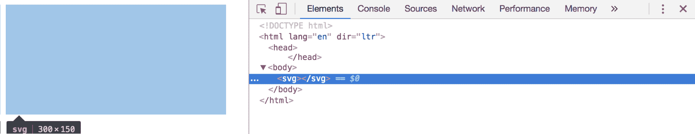

# 基本元素

我们可以通过向`<svg>`元素添加各种预定义标签作为子元素来绘制我们的元素。这与我们在 HTML 中添加`<div>`、`<a>`和``标签到`<body>`标签中的做法一样。有许多标签，如`<circle>`、`<rect>`和`<line>`，我们将在稍后探讨。这里只是一个例子：

```js
<!DOCTYPE html>
<html lang="en" dir="ltr">
    <head>
    </head>
    <body>
        <svg>
            <circle></circle>
        </svg>
    </body>
</html>
```

注意，我们看不到圆，因为它没有半径，如下面的截图所示：

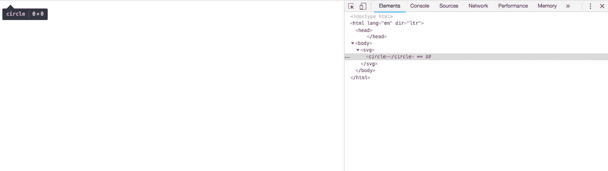

我们将在稍后讨论这个问题，但，目前，如果我们想看到圆，我们可以添加一个特殊的属性，这是所有`<circle>`元素都有的：

```js
<circle r=50></circle>
```

这告诉浏览器给圆一个`50`像素的半径，如下面的截图所示：

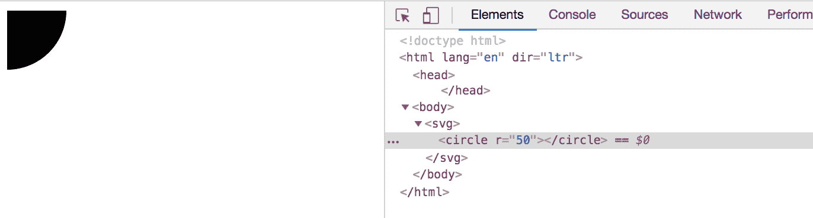

然而，目前我们只能看到圆的右下四分之一。这是因为圆的中心被绘制在`<svg>`的非常左上角，其余部分被裁剪在`<svg>`之外。我们可以通过改变圆的位置来改变这一点，我们将在下一部分做。

# 元素定位

`<svg>`标签是一个内联元素，例如一个图片（与`<div>`这样的块元素相对）。`<svg>`内的元素定位类似于 Photoshop，使用一组遵循`(x,y)`形式的坐标。一个例子可以是`(10,15)`，这表示`x=10`和`y=15`。这与 HTML 不同，在 HTML 中元素是相对于彼此布局的。以下是一些需要注意的重要事项：

+   点`(0,0)`是`<svg>`元素的左上角。

+   随着`y`值的增加，点沿着`<svg>`元素垂直向下移动。

+   不要与具有 `(0,0)` 在左下角且点向上移动的典型坐标系混淆，随着 *y* 值的增加。此图显示了传统坐标系和 SVG 坐标系之间的差异：

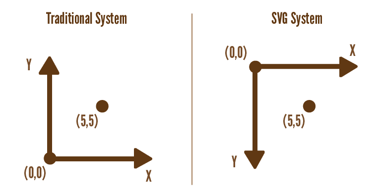

我们可以使用负的 *x*/*y* 值：

+   *-x*: 向左移动

+   *-y* : 向上移动

让我们通过调整 `cx` 和 `cy` 值（元素的 *x* 和 *y* 中心值）来调整我们之前章节中圆的位置：

```js
<!DOCTYPE html>
<html lang="en" dir="ltr">
    <head>
    </head>
    <body>
        <svg>
            <circle r=50 cx=50 cy=50></circle>
        </svg>
    </body>
</html>
```

现在我们看到了完整的圆：

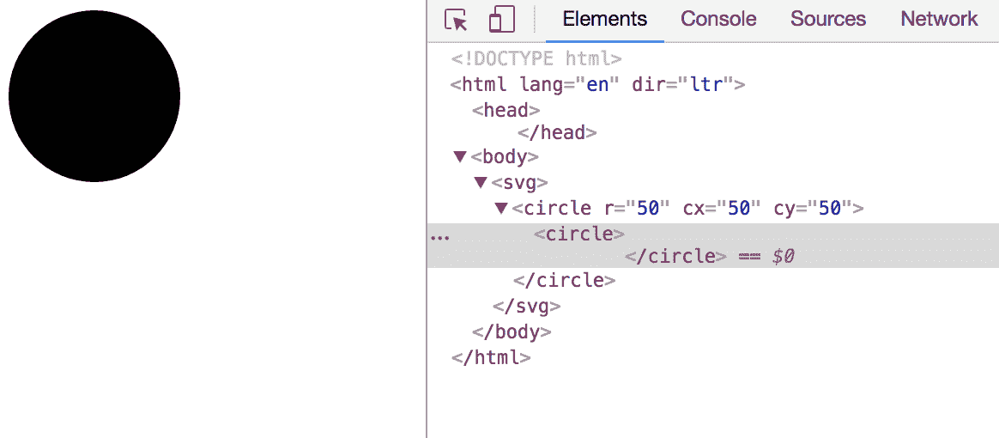

# 元素样式化

任何 `<svg>` 标签内的标签都可以使用以下属性进行样式化（以下带有示例值的属性）：

+   `fill=red` 或 `fill=#ff0000` 将改变形状的颜色。

+   `stroke=red` 或 `stroke=#ff0000` 将改变线条颜色。线条是围绕每个元素的线条。

+   `stroke-width=4` 将调整线条的宽度。

+   `fill-opacity=0.5` 将调整填充颜色的透明度。

+   `stroke-opacity=0.5` 将调整线条颜色的透明度。

+   `transform = "translate(2,3)"` 将按给定的 *x*、*y* 值平移元素。

+   `transform = "scale(2.1)"` 将按给定比例（例如，`2.1` 倍大）缩放元素的大小。

+   `transform = "rotate(45)"` 将按给定度数旋转元素。

让我们样式化我们之前定位的圆：

```js
<circle r=50 cx=50 cy=50 fill=red stroke=blue stroke-width=5></circle>
```

现在我们得到这个：

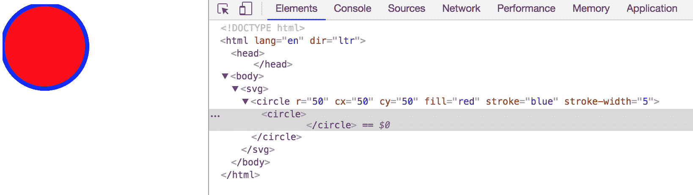

注意，前一个屏幕截图中的线条正在被裁剪。这是因为线条是在元素外部创建的。如果我们想看到完整的线条，我们可以调整圆的大小：

```js
<circle r=45 cx=50 cy=50 fill=red stroke=blue stroke-width=5></circle>
```

现在我们得到以下输出：

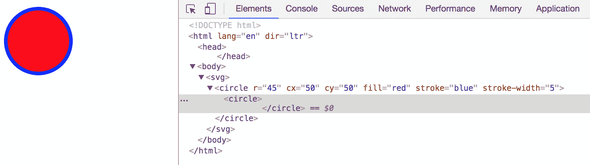

样式也可以使用 CSS 完成。以下步骤将指导你如何使用 CSS 样式化 `<svg>` 元素：

1.  在与你的 `index.html` 文件相同的文件夹中创建一个名为 `app.css` 的外部文件，并包含以下内容：

```js
      circle {
         fill:red;
         stroke:blue;
         stroke-width:3;
         fill-opacity:0.5;
         stroke-opacity:0.1;
         transform:rotate(45deg) scale(0.4) translate(155px, 
         1px);
         r:50px;
     }
```

1.  在 `index.html` 的 `<head>` 标签中链接文件：

```js
      <head> <link rel="stylesheet" href="app.css"> </head>
```

1.  最后，移除我们之前在 `<circle>` 标签上设置的行内样式：

```js
      <circle></circle>
```

现在我们得到这个结果：

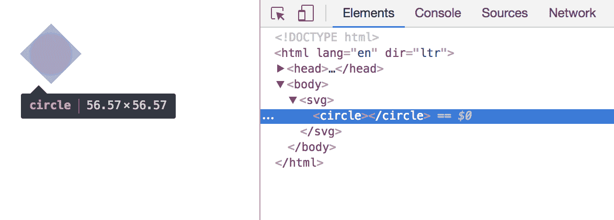

注意，我已经在开发者工具中悬停在元素上以显示元素已被旋转 45 度。这就是蓝色框的作用。

# 重要的 SVG 元素

为了演示每个元素，我们将使用以下代码作为起点，然后在 `<svg>` 标签内添加每个元素：

```js
<!DOCTYPE html>
<html lang="en" dir="ltr">
    <head>
    </head>
    <body>
        <svg width=800 height=600>
        </svg>
    </body>
</html>
```

现在我们继续到每个元素。请注意，你可以像我们之前使用 `<circle></circle>` 一样，以 `<element></element>` 的形式编写每个标签，或者使用自闭合形式 `<element/>`，你将在下面看到 `<circle/>`。

# 圆形

圆形具有以下属性：

+   `r`: 半径

+   `cx`: *x* 位置

+   `cy`: *y* 位置

```js
<circle r="50" cx="200" cy="300"/>
```

上述代码的输出将如下所示：

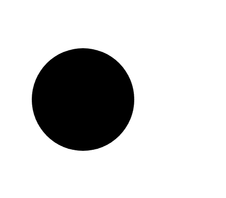

# 线条

线条具有以下属性：

+   `x1`: 起始 *x* 位置

+   `y1`: 起始 *y* 位置

+   `x2`: 结束 *x* 位置

+   `y2`: 结束 *y* 位置

这里有两个例子：

```js
<!--
the first element won't be visible because it doesn't have a stroke
the second will be visible because it does have a stroke
-->
<line x1="0" y1="0" x2="100" y2="100"/>
<line x1="0" y1="0" x2="100" y2="100" stroke="purple"/>
```

以下输出将被显示：

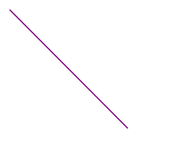

# 矩形

矩形有以下属性：

+   `x`: 元素左上角的 *x* 位置

+   `y`: 左上角的 *y* 位置

+   `width`: 宽度

+   `height`: 高度

这里有一个例子：

```js
<rect x="50" y="20" width="150" height="150"/>

```

这段代码会产生以下结果：

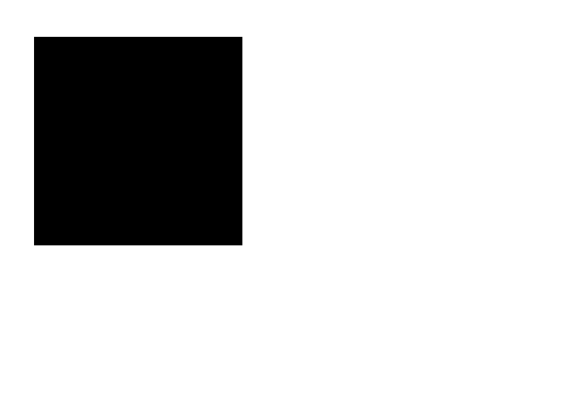

# 椭圆

椭圆有以下属性：

+   `cx`: *x* 位置

+   `cy`: *y* 位置

+   `rx`: *x* 半径

+   `ry`: *y* 半径

属性将如下所示：

```js
<ellipse cx="200" cy="80" rx="100" ry="50"/>
```

输出结果如下所示：

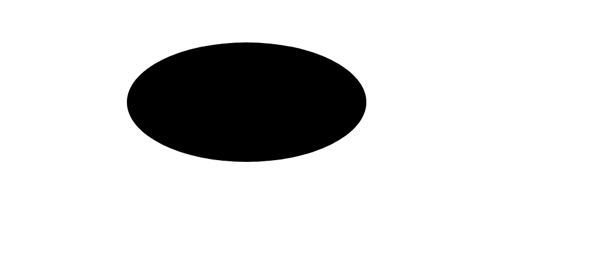

# 多边形

多边形有以下属性：

+   `points`，它是一组坐标对

+   每一对点的形式为 `x,y`

属性将如下所示：

```js
<polygon points="200,10 250,190 160,210" />
```

输出结果如下所示：


# 折线

**折线**是一系列连接的线。它可以填充，就像多边形一样，但它不会自动重新连接：

```js
<polyline points="20,20 40,25 60,40 80,120 120,140 200,180" stroke="blue" fill="none"/>
```

输出结果如下所示：

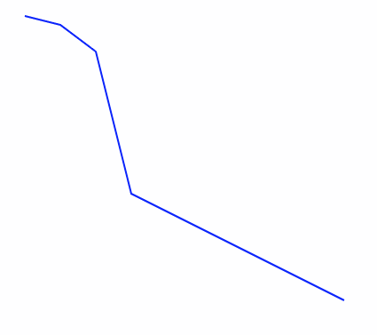

# 文本

标签的内容是要显示的文本。它有以下属性：

+   `x`, 元素左上角的 *x* 位置

+   `y`, 元素左上角的 *y* 位置

属性可以使用如下：

```js
<text x="0" y="15">I love SVG!</text>
```

你可以使用 `font-family` 和 `font-size` CSS 样式化这个元素。

# 组

这个元素没有特殊属性，所以我们将使用转换来定位它。你可以将多个元素放入其中，并且所有定位都将应用于其子元素。这对于将多个元素一起移动非常有用：

```js
<g transform = "translate(20,30) rotate(45) scale(0.5)"></g>
```

# 贝塞尔曲线

如果我们想绘制复杂的有机形状呢？为了做到这一点，我们需要使用路径。不过，首先，为了理解路径，你必须了解**贝塞尔曲线**。

# 三次贝塞尔曲线

贝塞尔曲线有两种类型：

+   贝塞尔曲线 ([`blogs.sitepointstatic.com/examples/tech/svg-curves/cubic-curve.html`](http://blogs.sitepointstatic.com/examples/tech/svg-curves/cubic-curve.html))

+   二次贝塞尔曲线 ([`math.hws.edu/eck/cs424/notes2013/canvas/bezier.html`](http://math.hws.edu/eck/cs424/notes2013/canvas/bezier.html))

每条曲线由四个点组成：

+   起始点

+   结束点

+   起始控制点

+   结束控制点

起始/结束点是曲线开始和结束的位置。控制点定义了曲线的形状。以下图表可以帮助你理解：

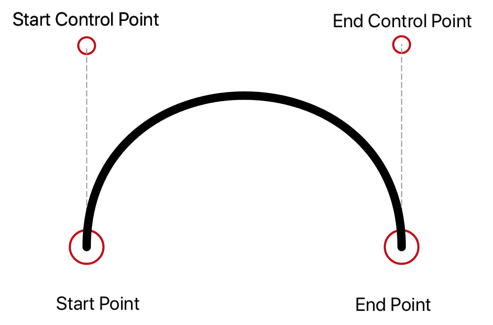

当我们操纵控制点时，我们可以看到曲线形状是如何受到影响的：

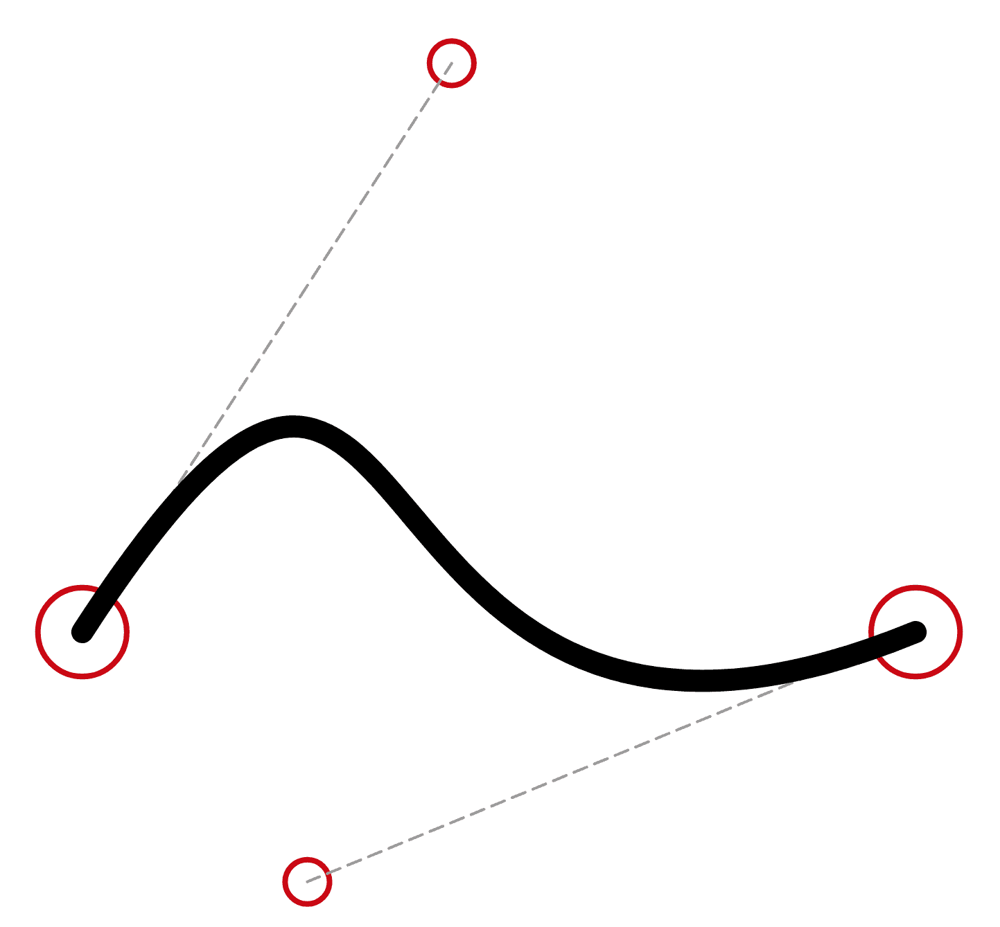

你甚至可以将多个贝塞尔曲线连接起来，如图所示：

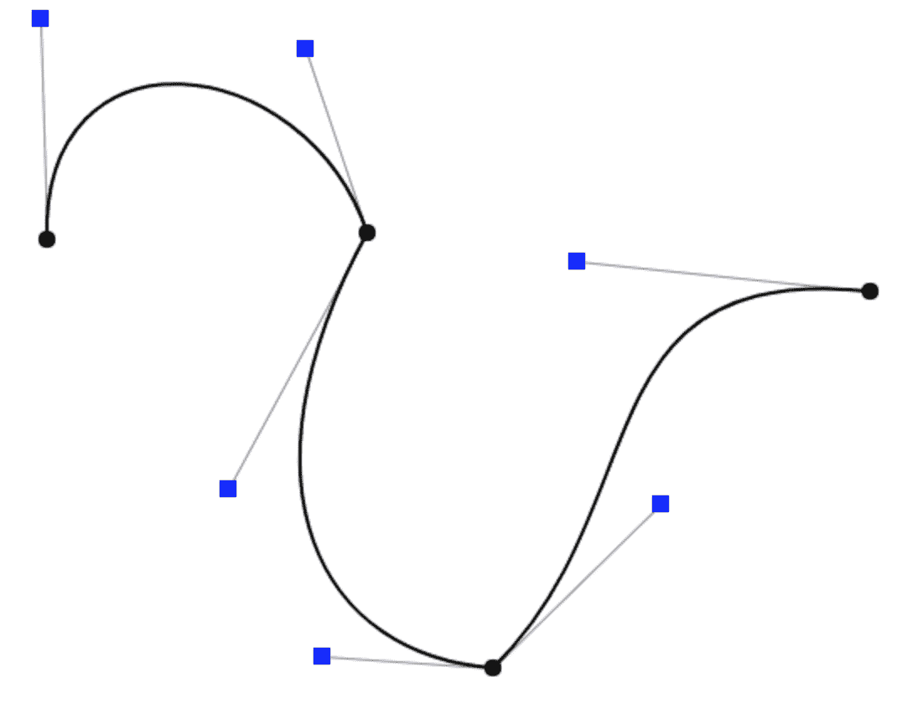

# 平滑三次贝塞尔曲线

平滑三次贝塞尔曲线只是当它们连接在一起时简化某些三次贝塞尔曲线的一种方式。看看这个图中红色正方形中显示的两个控制点：

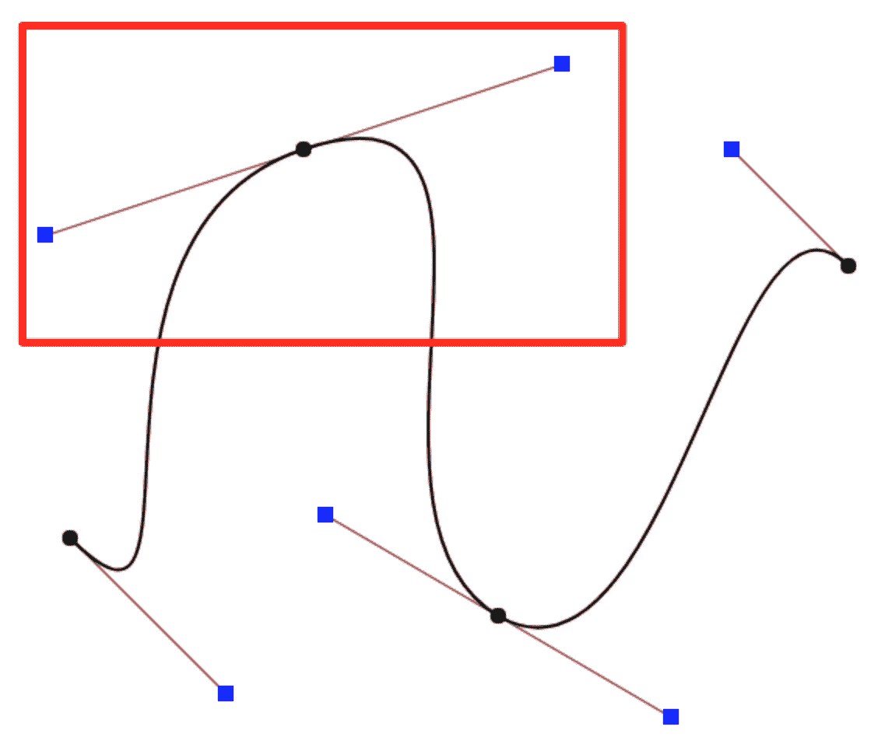

正方形的左下角点是第一条曲线的终点控制点。正方形的右上角点是第二条曲线的起点控制点。

注意，这两个点在中心黑色圆点周围是彼此的反射，这个黑色圆点是第一条曲线的终点和第二条曲线的起点。这两个点彼此正好相差 180 度，并且它们与中心点的距离相同。

在这种情况下，一个曲线的起点控制点是前一个曲线的终点控制点的反射，我们可以省略第二个曲线的起点控制点的声明。相反，我们让浏览器根据第一个曲线的终点控制点来计算它：

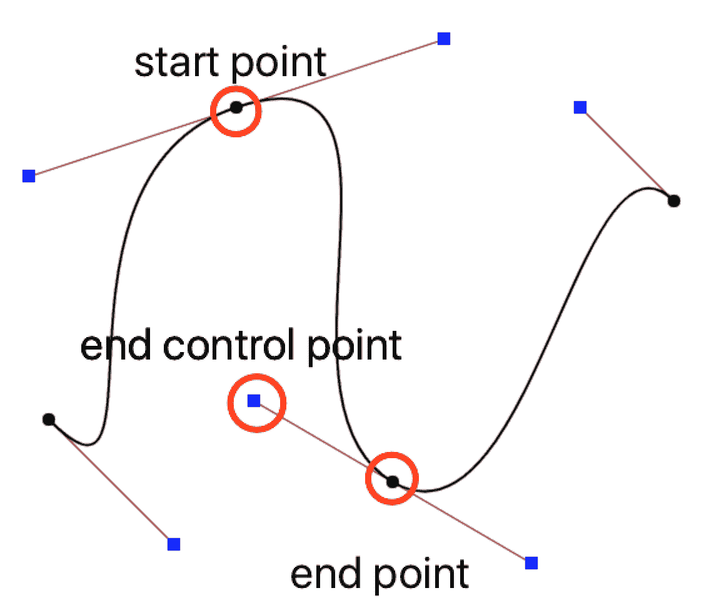

我们还可以省略起点，因为浏览器知道它将与前一个曲线的终点相同。总之，为了定义第二个曲线，我们只需要两个点：

+   终点

+   终点控制点

# 二次贝塞尔曲线

我们可以简化定义贝塞尔曲线的另一种情况是，当起点控制点和终点控制点相同时：

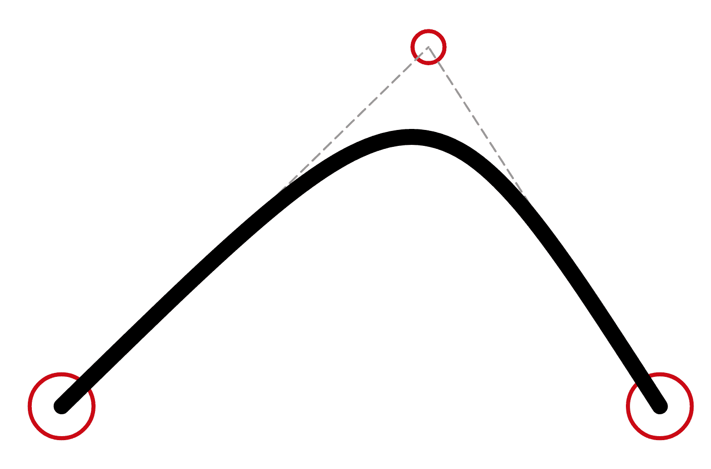

在这里，我们只需要三个点来定义曲线：

+   起点

+   终点

+   一个既作为起点控制点又作为终点控制点的单个控制点

# 平滑二次贝塞尔曲线

我们可以简化定义贝塞尔曲线的最终情况是，我们有一个二次贝塞尔曲线（一个单独的控制点），它是前一个曲线的终点控制点的反射：

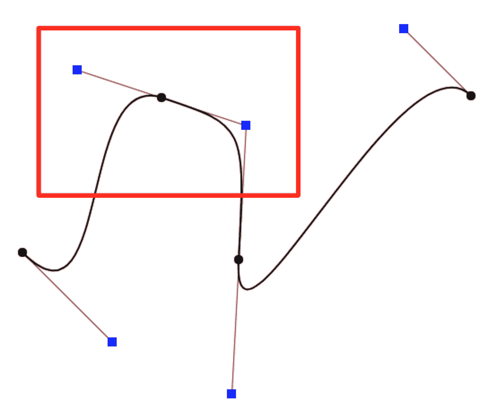

在这种情况下，浏览器知道曲线的起点（前一个曲线的终点），并且它可以基于前一个曲线的终点控制点计算出所需的单个控制点（因为它是一个二次贝塞尔曲线）。这是一个平滑的二次贝塞尔曲线，您只需要一个点来定义它：

+   终点

# 绘制路径

现在我们已经理解了贝塞尔曲线，我们可以在我们的 SVG 中使用 `<path>` 元素来使用它们。

文档可以在这里找到：[`developer.mozilla.org/en-US/docs/Web/SVG/Tutorial/Paths`](https://developer.mozilla.org/en-US/docs/Web/SVG/Tutorial/Paths).

这些标签接受一个 `d` 属性，该属性代表一组绘图命令。此属性的值是以下组合中的任何一种：

+   M = moveto: 将绘图点移动到给定的坐标

    +   M *x y*

+   L = lineto: 从 `d` 命令中的前一个点绘制到给定点的线

    +   L *x y*

+   C = curveto: 从 `d` 命令中的前一个点绘制曲线到给定控制点的点

    +   C *x*1 *y*1, *x*2 *y*2, *x y*

    +   第一对是第一个控制点

    +   第二对是第二个控制点

    +   最后一对是曲线的最终终点

+   S = 平滑曲线：

    +   S *x*2 *y*2, *x y*

    +   遵循另一个曲线

    +   使用前一个 S 或 C 命令的*x*2 *y*2 的反射作为*x*1 *y*1

+   Q = 二次贝塞尔曲线：

    +   Q *x*1 *y*1, *x y*

    +   使用一个控制点作为起始和结束控制（*x*1, *y*1）

+   T = 平滑二次贝塞尔曲线：

    +   T *x y*

    +   遵循另一个曲线

    +   使用前一个二次曲线的控制点的反射作为其控制点

+   Z = 关闭路径：从`d`命令中的前一个点画一条线到`d`命令中的第一个点

注意，所有这些命令也可以用小写字母表示。如果使用大写字母，这意味着绝对定位（相对于 SVG 元素的左上角）；小写字母表示所有点都相对于`d`命令中的前一点表示。

让我们用线条来画一个三角形：

```js
<path d="M150 0 L75 200 L225 200 Z" stroke="black" fill="transparent"/>
```

将显示以下输出：

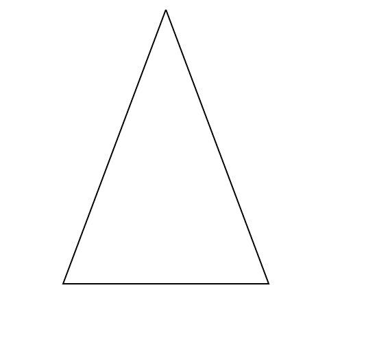

接下来，我们将绘制一个贝塞尔曲线：

```js
<path d="M0 70 C 0 120, 50 120, 50 70 S 100 20, 100 70" stroke="black" fill="transparent"/>
```

将显示以下输出：

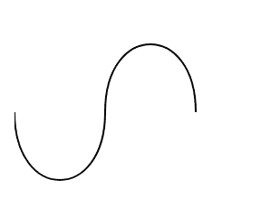

这是一个二次贝塞尔曲线：

```js
<path d="M0 100 Q 50 50, 100 100 T 200 100 Z" stroke="black" fill="transparent"/>
```

将显示以下输出：

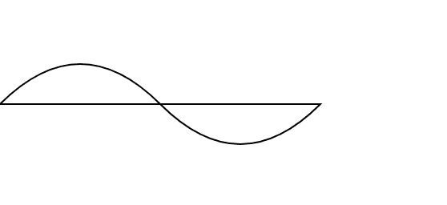

# 弧线

**弧**是一个可以添加到路径中的命令，可以绘制椭圆的一部分。为此，我们开始时只有两个点：

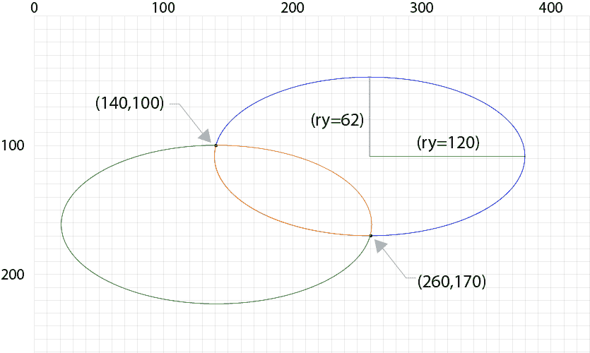

对于任意两个点，只有两个具有相同宽高和旋转的椭圆包含这两个点。在上一个图中，尝试想象在不旋转或缩放椭圆的情况下移动椭圆。一旦这样做，它们就会至少失去与两个给定点中的一个的接触。一个点可能在椭圆上，但另一个则不会。

我们可以使用这些信息来绘制上一个图中显示的四个彩色弧线中的任何一个。

将以下代码部分作为`<path>`元素上的`d`属性的值：

```js
A rx ry x-axis-rotation large-arc-flag sweep-flag x y
```

让我们看看弧线的各种属性：

+   `A`: 创建一个弧线绘制命令

+   `rx`: 两个椭圆的*x*半径（以 px 为单位）

+   `ry`: 两个椭圆的*y*半径（以 px 为单位）

+   `x-axis-rotation`: 旋转两个椭圆一定角度

+   `large-arc-flag`: 指示是否沿着包含超过 180 度的弧线移动（1 表示移动，0 表示不移动）

+   `sweep-flag`: 指示是否沿着顺时针方向的弧线移动（1 表示移动，0 表示不移动）

+   `x`: 目标*x*值（以 px 为单位）

+   `y`: 目标*y*值（以 px 为单位）

`large-arc-flag`确定是否绘制大于 180 度的弧线。以下是一个没有它的示例（注意，红色显示绘制的弧线，而绿色弧线是使用`large-arc-flag`和`sweep-flag`组合可以绘制的其他可能的弧线）：

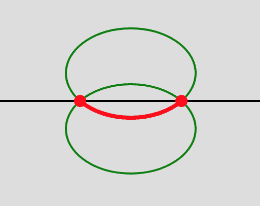

注意，它选择两个较小弧线中的一个。以下是一个将`large-arc-flag`设置为的示例：

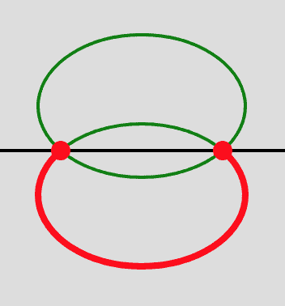

注意，它选择了两个较大弧中的其中一个。

在上一个例子中，对于`large-arc-flag`被设置或未设置的情况，还有一个其他的弧可以选择。为了确定选择这两个弧中的哪一个，我们使用`sweep-flag`，它决定了是否从起点顺时针移动到终点。以下是一个`large-arc-flag`被设置但没有设置`sweep-flag`的例子：

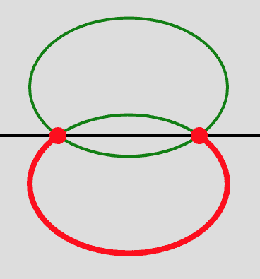

注意，我们从起点到终点（从左到右）是逆时针移动的。如果我们设置`sweep-flag`，我们将按顺时针方向移动：

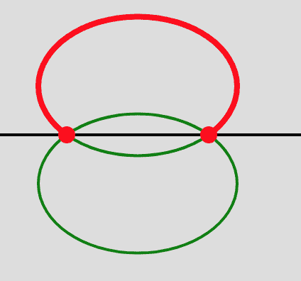

这里是`sweep-flag`和`large-arc-flag`的所有可能组合：

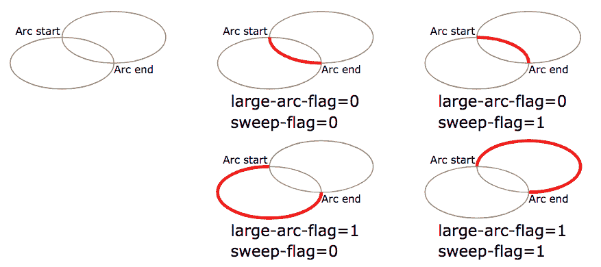

下面是一个使用`d`属性中的弧的`path`示例代码：

```js
<path d="M10 10 A 50 50 0 0 0 50 10" stroke="black" fill="transparent"/>
```

看起来是这样的：

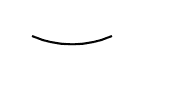

在这里尝试不同的弧值：[`codepen.io/lingtalfi/pen/yaLWJG`](http://codepen.io/lingtalfi/pen/yaLWJG)。

# 文档

如果需要，您可以在以下位置找到 SVG 元素的完整文档：[`developer.mozilla.org/en-US/docs/Web/SVG/Element`](https://developer.mozilla.org/en-US/docs/Web/SVG/Element)。

# 摘要

在本章中，我们介绍了 SVG 的基础知识（基础标签、基本元素、定位和样式）。我们还探讨了贝塞尔曲线以及如何使用它们绘制有机形状。现在我们准备好学习如何使用 D3 来修改这些元素。在第三章《构建交互式散点图》中，我们将深入了解`D3.js`的基础并创建一个交互式散点图。
