# 第五章：使用数据文件创建条形图

**AJAX** 代表 **Asynchronous JavaScript And XML**。基本上，我们可以使用 JavaScript 在页面加载后加载数据。这是一种根据用户交互生成图表的绝佳方式。在本章中，我们将使用 AJAX 来构建条形图。到本章结束时，你应该能够做到以下事情：

+   使用 AJAX 对外部数据文件进行异步调用

+   创建条形图

本节完整的代码可以在以下位置找到：[`github.com/PacktPublishing/D3.js-Quick-Start-Guide/tree/master/Chapter05`](https://github.com/PacktPublishing/D3.js-Quick-Start-Guide/tree/master/Chapter05)。

# 设置我们的应用程序

让我们在 `index.html` 中创建我们的标准设置：

```js
<!DOCTYPE html>
<html lang="en" dir="ltr">
    <head>
        <link rel="stylesheet" href="app.css">
    </head>
    <body>
        <svg></svg>
        <script src="img/d3.v5.min.js"></script>
        <script src="img/app.js" charset="utf-8"></script>
    </body>
</html>
```

现在将以下代码添加到 `app.js` 中：

```js
var WIDTH = 800;
var HEIGHT = 600;

d3.select('svg')
    .style('width', WIDTH)
    .style('height', HEIGHT);
```

现在将以下代码添加到 `app.css` 中：

```js
svg {
    border:1px solid black;
}
```

这应该是我们应有的结果：

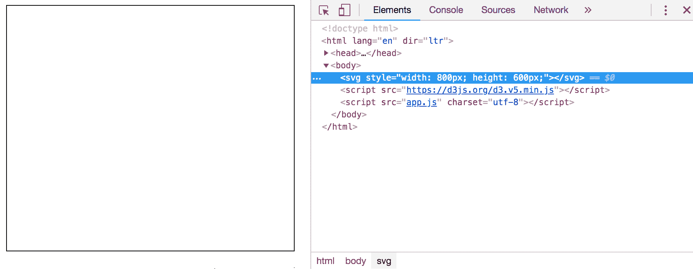

# 创建一个外部文件来保存我们的数据

让我们创建一个 `data.json` 文件，它将保存有关工作帖子需要某些技能频率的虚假数据。该文件的内容应该是这样的：

```js
[
  {
    "name": "HTML",
    "count": 21
  },
  {
    "name": "CSS",
    "count": 17
  },
  {
    "name": "Responsive Web Design",
    "count": 17
  },
  {
    "name": "JavaScript",
    "count": 17
  },
  {
    "name": "Git",
    "count": 16
  },
  {
    "name": "Angular.js",
    "count": 9
  },
  {
    "name": "Node.js",
    "count": 9
  },
  {
    "name": "PostgreSQL",
    "count": 8
  },
  {
    "name": "Agile Project Management",
    "count": 8
  },
  {
    "name": "MongoDB",
    "count": 7
  },
  {
    "name": "Trello",
    "count": 7
  },
  {
    "name": "Testing / TDD",
    "count": 7
  },
  {
    "name": "jQuery",
    "count": 7
  },
  {
    "name": "User Testing",
    "count": 6
  },
  {
    "name": "MySQL",
    "count": 6
  },
  {
    "name": "PHP",
    "count": 6
  },
  {
    "name": "React.js",
    "count": 6
  },
  {
    "name": "AJAX",
    "count": 6
  },
  {
    "name": "Express.js",
    "count": 5
  },
  {
    "name": "Heroku",
    "count": 5
  },
  {
    "name": "Wireframing",
    "count": 5
  },
  {
    "name": "Sass/SCSS",
    "count": 5
  },
  {
    "name": "Mobile Web",
    "count": 4
  },
  {
    "name": "Rails",
    "count": 4
  },
  {
    "name": "WordPress",
    "count": 4
  },
  {
    "name": "Drupal",
    "count": 3
  },
  {
    "name": "Ruby",
    "count": 3
  },
  {
    "name": "Ember.js",
    "count": 3
  },
  {
    "name": "Python",
    "count": 3
  },
  {
    "name": "Amazon EC2",
    "count": 2
  },
  {
    "name": "Computer Science degree",
    "count": 1
  },
  {
    "name": "Backbone.js",
    "count": 1
  },
  {
    "name": "Less",
    "count": 1
  },
  {
    "name": "Prototyping",
    "count": 1
  },
  {
    "name": "Redis",
    "count": 1
  }
]
```

# 发起 AJAX 请求

现在我们将使用 JavaScript 来请求一些数据。

# 编写基本代码

D3 有许多不同的方法用于向不同数据类型的文件发起 AJAX 请求：

```js
d3.json('path').then(function(data){
    //do something with the json data here
});
d3.csv('path').then(function(data){
    //do something with the csv data here
});
d3.tsv('path').then(function(data){
    //do something with the tsv data here
});
d3.xml('path').then(function(data){
    //do something with the xml data here
});
d3.html('path').then(function(data){
    //do something with the html data here
});
d3.text('path').then(function(data){
    //do something with the text data here
});
```

由于我们的数据是 JSON 格式，我们将使用第一种调用方式。将以下内容添加到 `app.js` 的末尾：

```js
d3.json('data.json').then(function(data){ console.log(data); });
```

# 处理文件访问

如果你直接在 Chrome 中打开了 `index.html` 文件，而不是通过 web 服务器提供服务，你会注意到我们遇到了一个错误。检查你的开发者控制台：

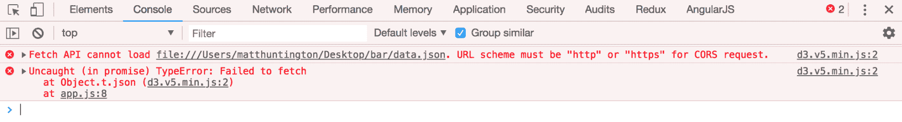

这里的问题是，网络浏览器不应该向你的电脑上的文件发起 AJAX 请求。如果它们可以这样做，这将是一个巨大的安全漏洞，因为任何网站都可以访问你的电脑上的文件。让我们创建一个基本的文件服务器。为此，你需要安装 `Node.js` ([`nodejs.org/en/`](https://nodejs.org/en/))。一旦完成，打开你的电脑的终端：

+   对于 Mac：按住 command + *Space*，然后输入 `terminal` 并按 *Enter*。

+   对于 Windows：点击开始，输入 `cmd` 并按 *Enter*。

接下来，在你的终端中输入以下内容：

```js
npm install -g http-server
```

如果你收到错误消息，尝试这样做：

```js
sudo npm install -g http-server
```

这安装了一个使用 `Node.js` 构建的 `http-server`。要运行它，使用终端导航到保存代码的目录（在终端中输入 `cd` 以更改文件夹）并运行以下命令：

```js
http-server .
```

你应该看到类似以下的内容：

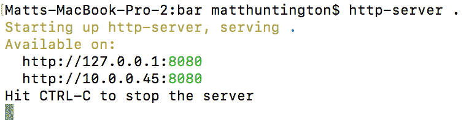

现在请在浏览器中访问 `http://localhost:8080/`。你应该现在能看到你的 AJAX 调用正在成功执行（如果你遇到问题，按住 shift 键并点击刷新按钮，强制浏览器重新加载可能已被缓存的全部文件）：

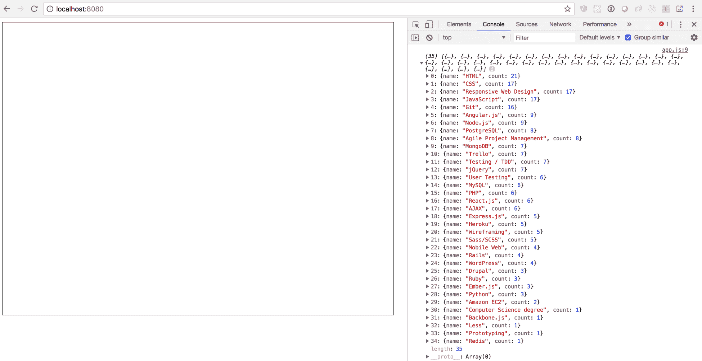

# 使用 AJAX 数据创建 SVG 元素

现在我们 AJAX 调用成功，让我们开始构建我们的应用。从现在开始，我们将使用基本的 JavaScript 和 D3。请注意，本节课剩余部分我们将要在 AJAX 请求的成功回调中编写代码。在生产环境中，我们可能希望将此代码移至其他位置，但为了学习，这样做更简单。让我们为条形图创建一些矩形。现在`app.js`（AJAX 请求的回调）的底部应该如下所示：

```js
d3.json('data.json').then(function(data){
    d3.select('svg').selectAll('rect')
        .data(data)
        .enter()
        .append('rect');
});
```

我们开发工具中的**元素**标签页应该看起来像这样：

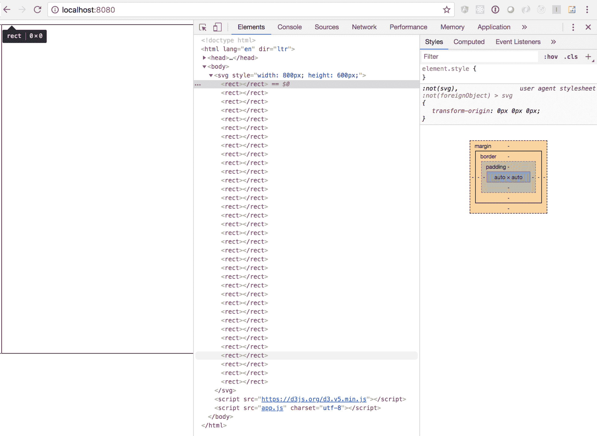

# 调整条形的高度和宽度

让我们创建一个比例尺，将`data`中每个元素的`count`属性映射到相应条形的视觉高度。我们将使用线性比例尺。记住将图表的`HEIGHT`映射到非常低的数据点，并将图表的顶部（范围中的`0`）映射到非常高的数据值。将此代码添加到 AJAX 回调的底部：

```js
var yScale = d3.scaleLinear();
yScale.range([HEIGHT, 0]);
var yMin = d3.min(data, function(datum, index){
    return datum.count;
})
var yMax = d3.max(data, function(datum, index){
    return datum.count;
})
yScale.domain([yMin, yMax]);
```

我们可以使用`d3.extent`，但稍后我们需要单独的最小值。在上一段代码之后，让 D3 使用`yScale`调整矩形的高度。记住，*y*轴是反转的。低数据值产生高范围值。尽管范围很高，条形本身应该很小。我们需要仅对高度重新翻转值，以便低数据值产生小的条形，高数据值产生大的条形。为此，让我们从图表的`HEIGHT`中减去范围点。这样，如果`yScale(datum.count)`产生，比如说，500，条形的高度将是 100。我们可以在调整条形位置时正常使用`yScale(datum.count)`。将以下内容添加到 AJAX 回调的底部：

```js
d3.selectAll('rect')
    .attr('height', function(datum, index){
        return HEIGHT-yScale(datum.count);
    });
```

现在我们的矩形有了高度，但没有宽度：

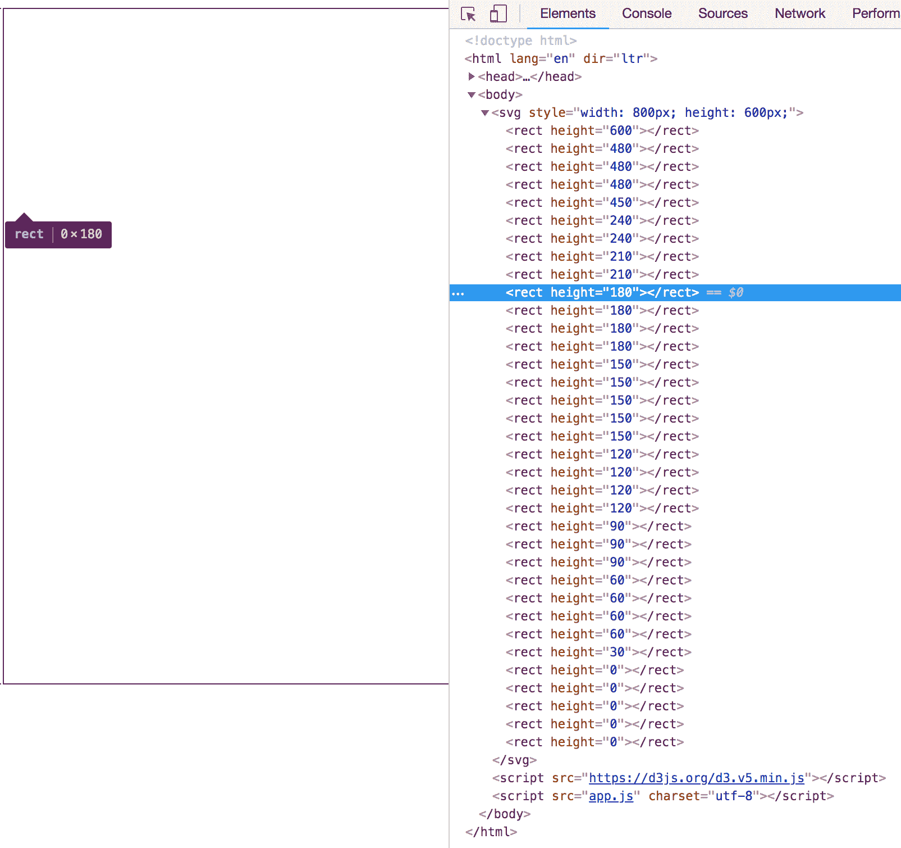

在`app.css`的底部，让我们给所有条形设置相同的宽度：

```js
rect {
    width: 15px;
}
```

现在我们应该在 Chrome 中看到以下内容：

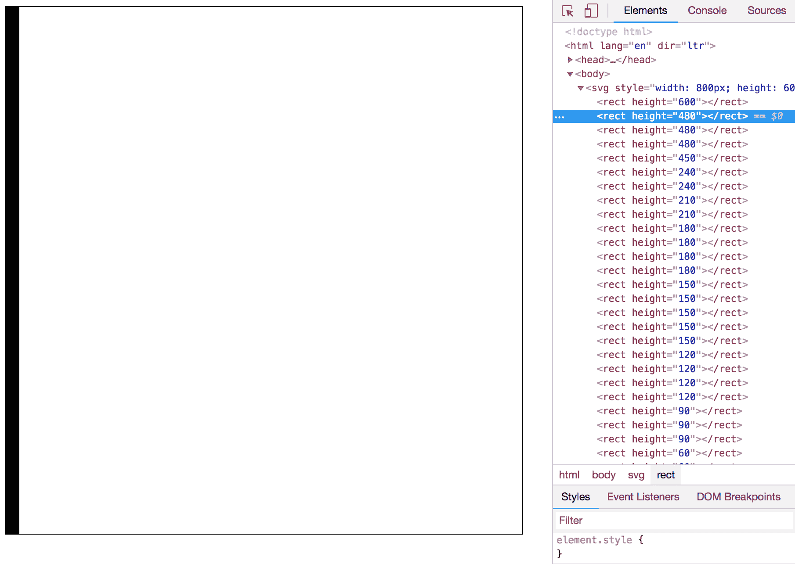

# 调整条形的水平和垂直位置

我们的所有条形目前都相互重叠。让我们通过将*x*的位置映射到数据数组的索引来使它们分散。在 AJAX 回调的底部添加以下内容：

```js
var xScale = d3.scaleLinear(); xScale.range([0, WIDTH]); xScale.domain([0, data.length]); d3.selectAll('rect') .attr('x', function(datum, index){ return xScale(index); });
```

这将数组中的索引映射到水平范围点。Chrome 应该如下所示：

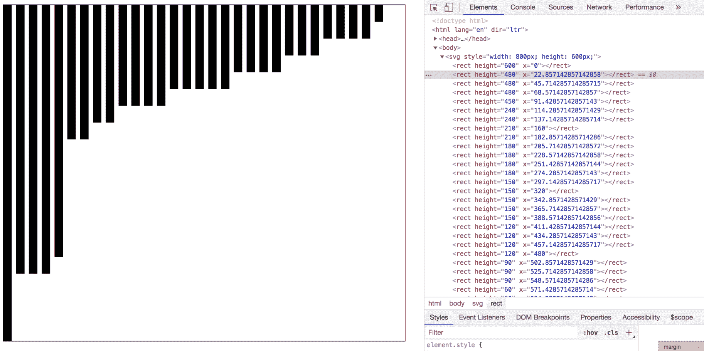

现在让我们将条形移动，使它们从底部生长，而不是从顶部悬挂。将以下内容添加到 AJAX 回调的末尾：

```js
d3.selectAll('rect')
    .attr('y', function(datum, index){
        return yScale(datum.count);
    });
```

使用我们的`yScale`函数，高数据值产生低范围值，这不会使大条形下降很多。低数据点产生高范围值，这会使小条形下降很多。

我们最后几条形没有任何高度，因为我们已经将数据的最小计数属性映射到`yScale`中的视觉范围值 0。让我们调整此代码的最后一行：

```js
var yScale = d3.scaleLinear();
yScale.range([HEIGHT, 0]);
var yMin = d3.min(data, function(datum, index){
    return datum.count;
})
var yMax = d3.max(data, function(datum, index){
    return datum.count;
})
yScale.domain([yMin, yMax]);
```

我们将将其更改为以下代码：

```js
var yScale = d3.scaleLinear();
yScale.range([HEIGHT, 0]);
var yMin = d3.min(data, function(datum, index){
    return datum.count;
})
var yMax = d3.max(data, function(datum, index){
    return datum.count;
})
yScale.domain([yMin-1, yMax]); //adjust this line
```

现在的域最小值比我们数据集中实际存在的值少一个。具有原始最小值的域被视为高于图形最小值预期的值。我们得到以下结果：

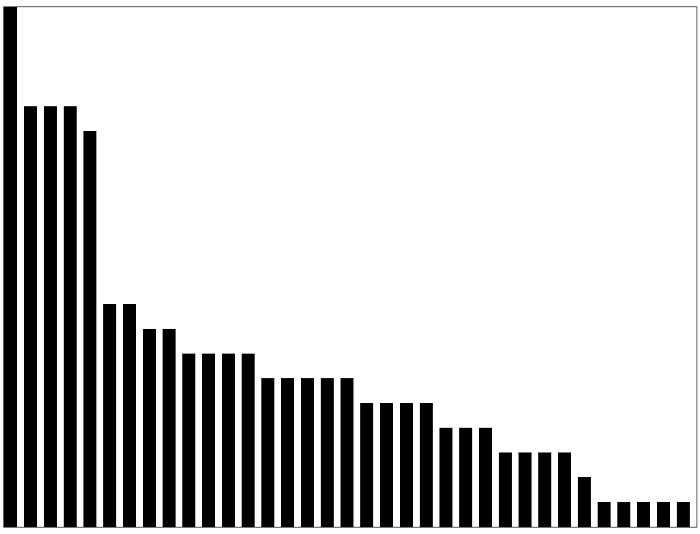

# 使条形宽度动态化

目前，我们的条形宽度是固定的。无论我们有多少个元素，它们的宽度都是 15 px。如果我们有更多的数据元素，条形可能会重叠。让我们改变这一点。由于每个`rect`的宽度都相同，无论数据如何，我们只需将`width`分配一个计算值即可。将以下代码添加到 AJAX 回调的末尾：

```js
d3.selectAll('rect')
    .attr('width', WIDTH/data.length);
```

现在让我们调整我们的`rect` CSS，使我们的条形更明显：

```js
rect {
    /*  remove the width rule that was here */
    stroke:white;
    stroke-width:1px;
}
```

输出将如下所示：

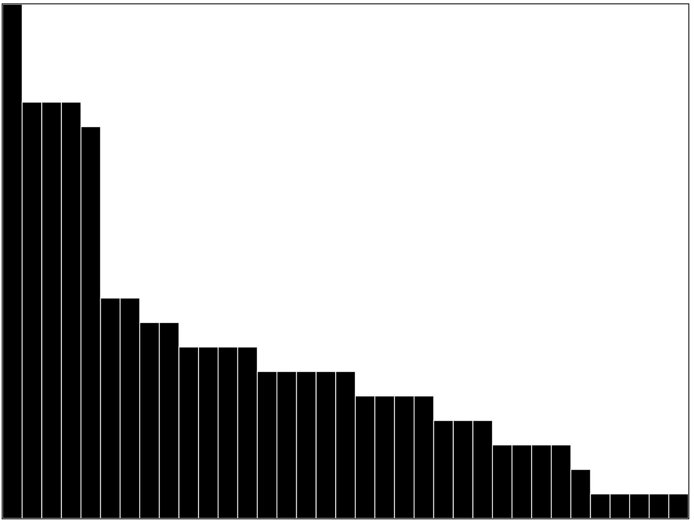

# 根据数据更改条形颜色

目前，条形是黑色的。线性比例尺将在颜色之间进行插值，就像常规数字一样。将以下代码添加到 AJAX 回调的末尾：

```js
var yDomain = d3.extent(data, function(datum, index){
    return datum.count;
})
var colorScale = d3.scaleLinear();
colorScale.domain(yDomain)
colorScale.range(['#00cc00', 'blue'])
d3.selectAll('rect')
    .attr('fill', function(datum, index){
        return colorScale(datum.count)
    })
```

注意我们使用`d3.extent`来计算域，以便使用数据集的真实最小值来映射`#00cc00`：

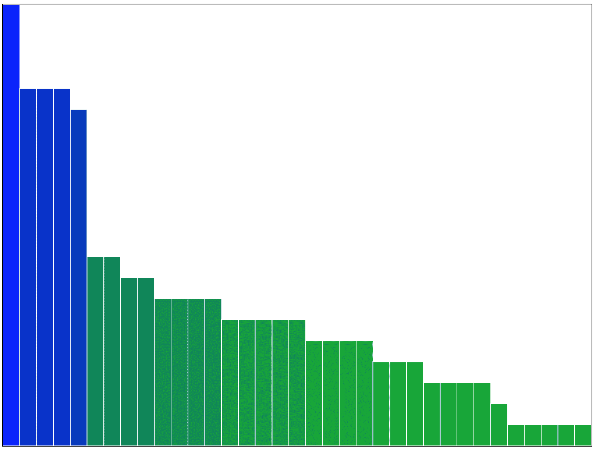

# 添加轴

左轴与第四章中所示相同，*制作基本散点图交互式*。将以下代码添加到 AJAX 回调的底部：

```js
var leftAxis = d3.axisLeft(yScale);
d3.select('svg')
    .append('g').attr('id', 'left-axis')
    .call(leftAxis);
```

要创建底部轴，我们需要能够将字符串映射到域上的点。我们将为此使用一个带状比例尺，它只是将范围分割成相等的部分，并将其映射到一个离散值数组（例如，不能插值的值）。将以下代码添加到 AJAX 回调的底部：

```js
var skillScale = d3.scaleBand();
var skillDomain = data.map(function(skill){
    return skill.name
});
skillScale.range([0, WIDTH]);
skillScale.domain(skillDomain);
```

注意我们使用了`data.map()`。这是常规 JavaScript，它只是遍历一个数组并根据给定的函数修改每个元素。然后它返回结果数组，同时保持原始数组不变。在上一个例子中，`skillDomain`将是一个包含每个数据元素各种名称属性的数组。

一旦我们有了每个技能的数组，我们就使用它作为域，并将每个技能映射到范围内的一个点。记住，范围中的点是通过根据域中元素的数量将整个范围平均分割来创建的。

现在我们有一个将每个技能文本映射到*x*范围内一个点的比例尺，我们可以像以前一样创建底部轴。将以下代码添加到 AJAX 回调的底部：

```js
var bottomAxis = d3.axisBottom(skillScale);
d3.select('svg')
    .append('g').attr('id', 'bottom-axis')
    .call(bottomAxis)
    .attr('transform', 'translate(0,'+HEIGHT+')');
```

我们仍然需要停止`<svg>`元素裁剪轴。更改`app.css`中`svg`的 CSS：

```js
svg {
    overflow: visible;
}
```

以下为结果：

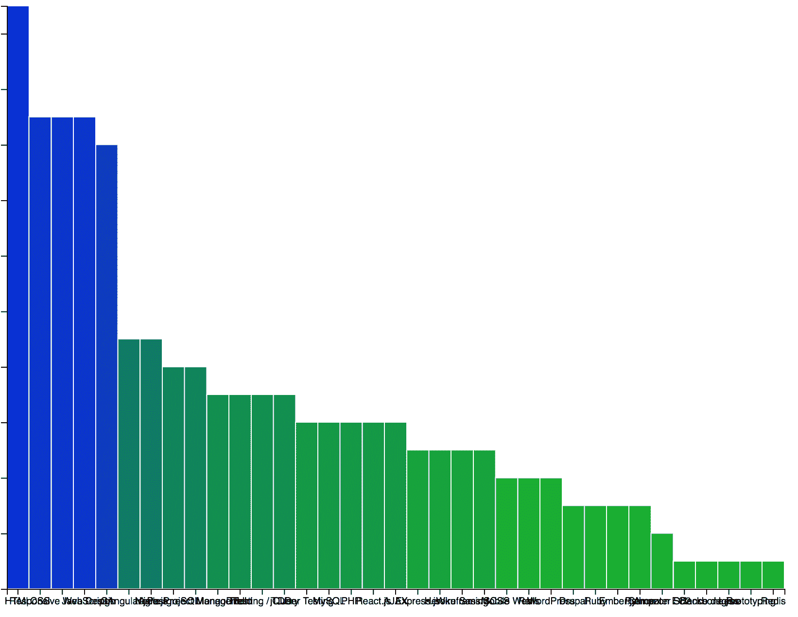

底部轴文本非常混乱。让我们在`app.css`的底部添加一些 CSS 来修复这个问题：

```js
#bottom-axis text {
    transform:rotate(45deg);
}
```

输出将如下所示：

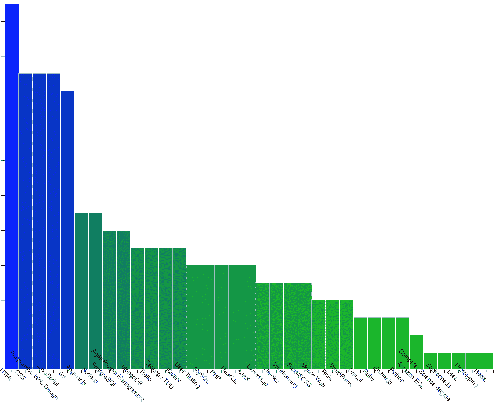

它是旋转的，但它围绕元素的中心旋转。让我们在刚才写的代码中添加一行，使其围绕文本的起始位置旋转：

```js
#bottom-axis text {
    transform:rotate(45deg);
    text-anchor: start; /* add this line */
}
```

输出将如下所示：

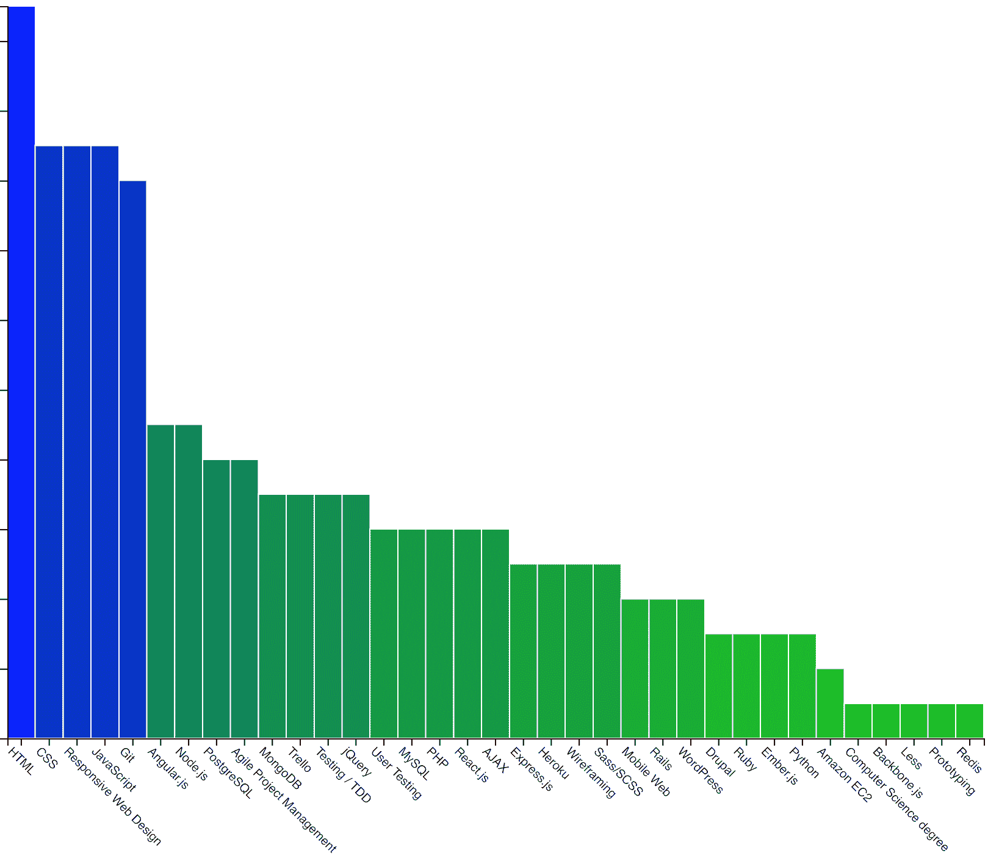

让我们将图表移动到右边，这样我们就可以看到左侧轴的值。调整我们的 `svg` CSS 代码，使其看起来如下所示：

```js
svg {
    overflow: visible;
    margin-left: 20px; /* add this line */
}
```

# 摘要

在本章中，我们学习了如何使用 AJAX 来发送异步请求，以便填充条形图。在第六章，“通过动画 SVG 元素创建交互式饼图”，我们将创建一个当你从其中移除部分时动画显示的饼图。
