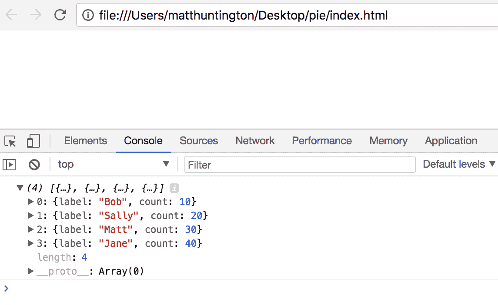
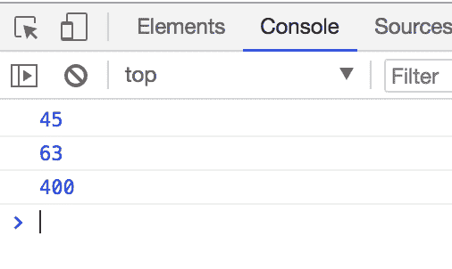
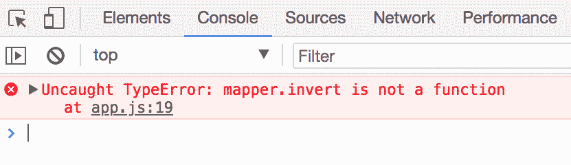
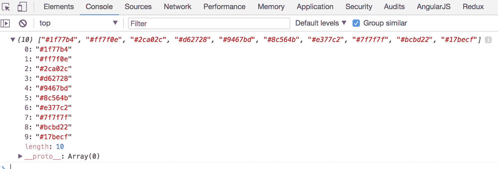
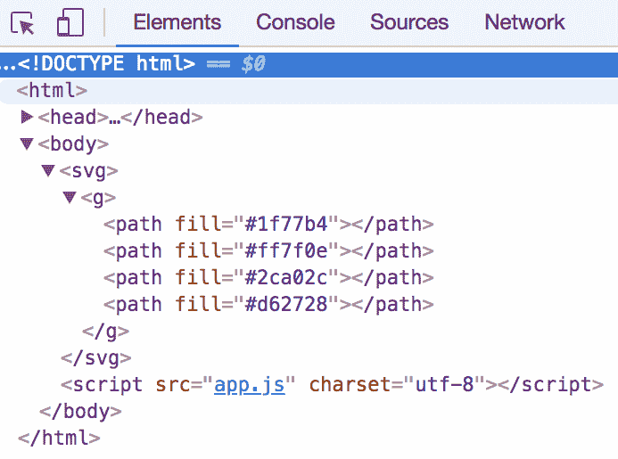
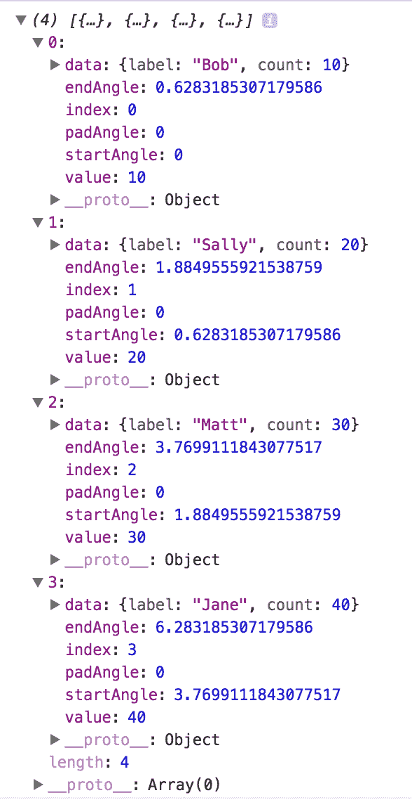
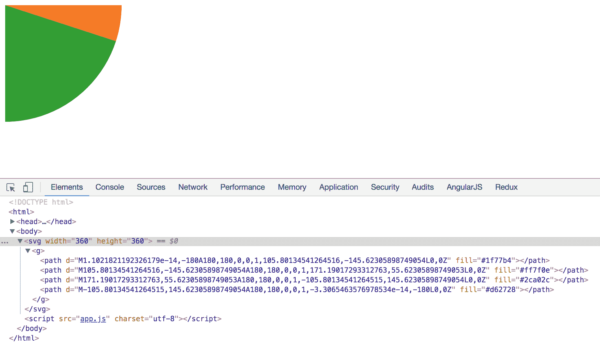
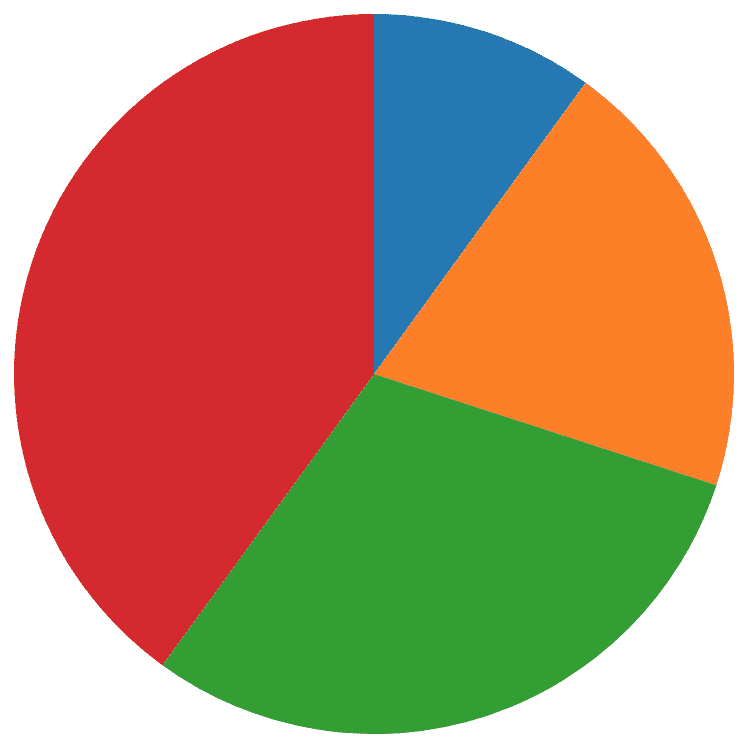
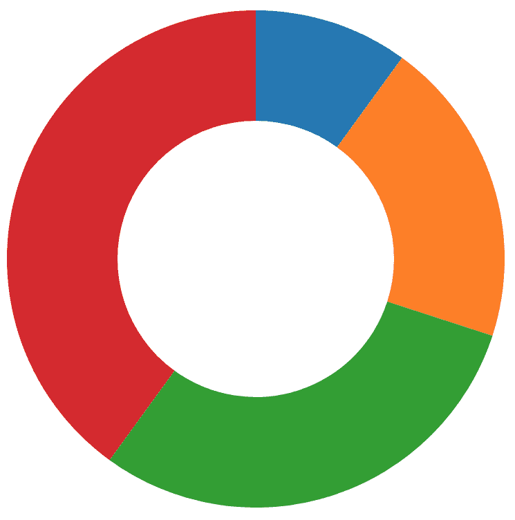
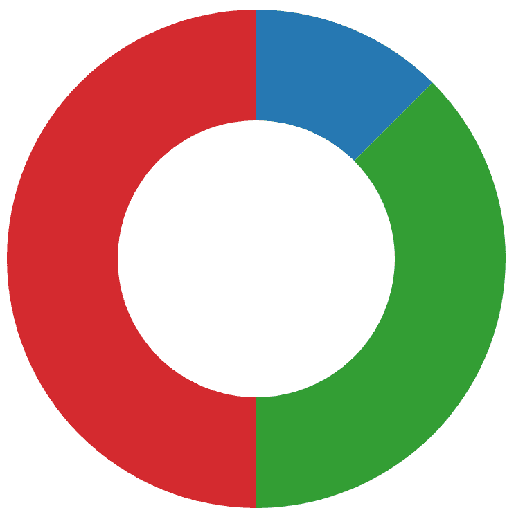

# 通过动画 SVG 元素创建交互式饼图

在本章中，我们将使用动画使我们的图表移动。这可以使你的可视化看起来更加精致和专业。

在本节中，我们将涵盖以下主题：

+   创建序数尺度

+   创建颜色尺度

+   为每个饼图部分添加路径

+   生成创建弧线的函数

+   格式化用于弧线的数据

+   调整饼图的位置

+   制作一个环形图

+   移除饼图的部分

本节完整的代码可以在[`github.com/PacktPublishing/D3.js-Quick-Start-Guide/tree/master/Chapter06`](https://github.com/PacktPublishing/D3.js-Quick-Start-Guide/tree/master/Chapter06)找到。

# 设置应用程序

和往常一样，我们需要一个`index.html`文件来存放我们的 SVG 代码。让我们创建这个文件，并将以下代码添加到其中：

```js
<!DOCTYPE html>
<html>
    <head>
        <meta charset="utf-8">
        <title></title>
        <script src="img/d3.v5.min.js"></script>
    </head>
    <body>
        <svg>
            <g></g>
        </svg>
        <script src="img/app.js" charset="utf-8"></script>
    </body>
</html>
```

# 创建数据/配置变量

在`<body>`标签的底部，我们引用了一个`app.js`文件。让我们创建这个文件，并将以下代码添加到其中：

```js
var WIDTH = 360;
var HEIGHT = 360;
var radius = Math.min(WIDTH, HEIGHT) / 2;

var dataset = [
    { label: 'Bob', count: 10 },
    { label: 'Sally', count: 20 },
    { label: 'Matt', count: 30 },
    { label: 'Jane', count: 40 }
];
console.log(dataset);
```

为了确保它正在正常工作并且正确链接，我们在底部添加了`console.log(dataset)`。让我们在 Chrome 中打开`index.html`并查看开发者控制台，以确保一切按预期连接：



一旦我们确定它正在正常工作，我们可以移除`console.log(dataset)`;，如下所示：

```js
var WIDTH = 360;
var HEIGHT = 360;
var radius = Math.min(WIDTH, HEIGHT) / 2;

var dataset = [
    { label: 'Bob', count: 10 },
    { label: 'Sally', count: 20 },
    { label: 'Matt', count: 30 },
    { label: 'Jane', count: 40 }
];
```

# 创建序数尺度

一个序数尺度将一个离散值映射到另一个值。离散值是那些不能被分割的东西。之前，我们使用过可以分割和插值的数值，比如数字。插值只是意味着对于任意两个数字，我们可以在它们之间找到其他数字。例如，给定 10 和 5，我们可以在它们之间找到值（6，8.2，7，9.9 等等）。现在，我们想要映射那些不能插值的值——我们数据集中的标签属性（Bob，Sally，Matt 和 Jane）。Bob 和 Sally 之间有什么值？Bob 和 Matt 之间呢？没有。这些只是字符串，不是可以分割和插值的数值。

我们想要做的是将这些离散值映射到其他值。以下是一个使用序数尺度如何做到这一点的示例。将以下内容添加到`app.js`的底部：

```js
var mapper = d3.scaleOrdinal();
mapper.range([45, 63, 400]); //list each value for ordinal scales, not just min/max
mapper.domain(['Bob', 'Sally', 'Zagthor']); //list each value for ordinal scales, not just min/max

console.log(mapper('Bob'));
console.log(mapper('Sally'));
console.log(mapper('Zagthor'));
```

之前的代码应该产生以下结果：



注意，当你使用序数尺度时，你需要列出域和范围的所有值。即使其中一个集合是数值的（在前一个例子中，范围），你仍然必须列出每个值。如果我们只列出了范围的 min/max，省略了 63，D3 将不知道将 Sally 映射到哪个值。毕竟，Sally 与 Bob 有多接近，作为一个值？Sally 与 Zagth 有多接近，作为一个值？没有办法计算这个距离，因为它们都是文本字符串，不是数字。

令人惊讶的一点是，你无法反转序数刻度。移除之前的三个 `console.log()` 语句，并暂时将以下内容添加到 `app.js` 的底部：

```js
console.log(mapper.invert(45));
```

以下内容将被显示：



D3 只能单向运行：从领域到范围。你现在可以移除 `console.log()` 语句。

# 创建将标签映射到颜色的颜色刻度

现在，我们想要将数据集的标签属性映射到颜色，而不是像上一节中那样映射随机数。我们可以制定自己的颜色方案，或者从 D3 的颜色集中选择一个，请参阅 [`github.com/d3/d3-scale-chromatic#categorical`](https://github.com/d3/d3-scale-chromatic#categorical)。

如果我们愿意，我们可以看到这些颜色方案只是数组。暂时，将以下内容添加到 `app.js` 的底部：

```js
console.log(d3.schemeCategory10)
```

以下内容将被显示：



因此，我们可以在设置范围时使用颜色方案。用以下内容替换之前的 `console.log()` 语句：

```js
var colorScale = d3.scaleOrdinal();
colorScale.range(d3.schemeCategory10);
```

我们可以通过使用 JavaScript 的原生 `map` 函数为该领域生成一个标签数组。将以下内容添加到 `app.js` 的底部：

```js
colorScale.domain(dataset.map(function(element){
    return element.label;
}));
```

以下是我们到目前为止的代码：

```js
var WIDTH = 360;
var HEIGHT = 360;
var radius = Math.min(WIDTH, HEIGHT) / 2;

var dataset = [
    { label: 'Bob', count: 10 },
    { label: 'Sally', count: 20 },
    { label: 'Matt', count: 30 },
    { label: 'Jane', count: 40 }
];

var colorScale = d3.scaleOrdinal();
colorScale.range(d3.schemeCategory10);
colorScale.domain(dataset.map(function(element){
    return element.label;
}));
```

# 设置 SVG

下一个代码块相当标准。将以下代码添加到 `app.js` 的底部：

```js
d3.select('svg')
    .attr('width', WIDTH)
    .attr('height', HEIGHT);
```

# 为每个饼图段添加路径

让我们为数据集中的每个元素添加路径元素。将以下代码添加到 `app.js` 的底部：

```js
var path = d3.select('g').selectAll('path')
    .data(dataset)
    .enter()
    .append('path')
    .attr('fill', function(d) {
        return colorScale(d.label);
    });
```

如果我们在开发者工具中检查我们的元素，我们会看到路径已被添加，并且每个路径都有一个填充值，这是由 `colorScale(d.label)` 决定的，它将每个数据对象的标签映射到一个颜色：



# 生成创建弧的函数

路径有填充颜色，但没有形状。如果你还记得，`<path>` 元素有一个 `d=` 属性，它决定了它们的绘制方式。我们想要设置某种将数据映射到 `d=` 字符串的方法，如下面的代码（你不需要添加下一个代码片段；它只是为了参考）：

```js
.attr('d', function(datum){
    //return path string here
})
```

幸运的是，D3 可以生成我们需要的匿名函数，用于上一代码片段中 `.attr()` 的第二个参数。将以下内容添加到 `app.js` 中，就在我们之前的 `var path = d3.select('g').selectAll('path')...` 代码之前：

```js
var arc = d3.arc()
    .innerRadius(0) //to make this a donut graph, adjust this value
    .outerRadius(radius);
```

让我们将这个函数插入到我们之前的 `var path = d3.select('g').selectAll('path')...` 代码的正确位置（尽管现在它还不起作用）：

```js
var path = d3.select('g').selectAll('path')
    .data(dataset)
    .enter()
    .append('path')
    .attr('d', arc) //add this
    .attr('fill', function(d) {
        return colorScale(d.label);
    });
```

# 格式化用于弧的数据

我们的原因是`arc()`函数不会工作，因为数据格式不正确，不适合该函数。我们生成的弧函数期望数据对象具有起始角度、结束角度等。幸运的是，D3 可以重新格式化我们的数据，使其与我们的生成`arc()`函数兼容。为此，我们将生成一个`pie`函数，它将接受一个数据集，并添加必要的属性，如起始角度、结束角度等。在`var path = d3.select('g').selectAll('path')...`代码之前添加以下内容：

```js
var pie = d3.pie()
    .value(function(d) { return d.count; }) //use the 'count' property each value in the original array to determine how big the piece of pie should be
    .sort(null); //don't sort the values
```

我们的`pie`变量是一个函数，它接受一个值数组作为参数，并返回一个格式化以供我们的`arc`函数使用的对象数组。暂时将以下代码添加到`app.js`底部，并在 Chrome 的开发者工具中的控制台中查看：

```js
console.log(pie(dataset));
```

以下内容将被显示：



你现在可以移除`console.log(pie(dataset))`调用。我们可以使用这个`pie()`函数来将数据附加到我们的路径上。调整`app.js`底部的`var path = d3.select('g').selectAll('path')`代码，如下所示：

```js
var path = d3.select('g').selectAll('path')
    .data(pie(dataset)) //adjust this line to reformat data for arc
    .enter()
    .append('path')
    .attr('d', arc)
    .attr('fill', function(d) {
        return colorScale(d.label);
    });
```

不幸的是，现在，附加到我们路径元素的数据数组中的每个对象都没有`.label`属性，所以我们的`.attr('fill', function(d) {})`代码出错了。幸运的是，我们的数据确实有一个`.data`属性，它反映了我们在传递给`pie()`函数之前的数据外观。让我们调整`var path = d3.select('g').selectAll('path')`代码，使用以下代码，如下所示：

```js
var path = d3.select('g').selectAll('path')
    .data(pie(dataset))
    .enter()
    .append('path')
    .attr('d', arc)
    .attr('fill', function(d) {
        return colorScale(d.data.label); //use .data property to access 
        original data
    });
```

到目前为止，我们的代码如下：

```js
var WIDTH = 360;
var HEIGHT = 360;
var radius = Math.min(WIDTH, HEIGHT) / 2;

var dataset = [
    { label: 'Bob', count: 10 },
    { label: 'Sally', count: 20 },
    { label: 'Matt', count: 30 },
    { label: 'Jane', count: 40 }
];

var mapper = d3.scaleOrdinal();
var colorScale = d3.scaleOrdinal();
colorScale.range(d3.schemeCategory10);
colorScale.domain(dataset.map(function(element){
    return element.label;
}));

d3.select('svg')
    .attr('width', WIDTH)
    .attr('height', HEIGHT);

var arc = d3.arc()
    .innerRadius(0)
    .outerRadius(radius);

var pie = d3.pie()
    .value(function(d) { return d.count; })
    .sort(null);

var path = d3.select('g').selectAll('path')
    .data(pie(dataset))
    .enter()
    .append('path')
    .attr('d', arc)
    .attr('fill', function(d) {
        return colorScale(d.data.label);
    });
```

上述代码产生以下结果：



# 调整派对的定位

目前，我们只能看到派对图的右下四分之一。这是因为派对从(`0,0`)开始，但我们可以通过调整我们的`d3.select('svg')`代码来移动包含派对的`group`元素，如下所示：

```js
d3.select('svg')
    .attr('width', WIDTH)
    .attr('height', HEIGHT);
var container = d3.select('g') //add this line and the next:
    .attr('transform', 'translate(' + (WIDTH / 2) + ',' + (HEIGHT / 2) + ')'); //add this line
```

派对图现在看起来如下：



# 制作甜甜圈图

如果你想要在派对的中心有一个洞，只需调整`arc()`函数的内半径，如下所示：

```js
var arc = d3.arc()
    .innerRadius(100) //to make this a donut graph, adjust this value
    .outerRadius(radius);
```

图表现在将看起来如下：



# 移除派对的某些部分

我们希望能够点击派对的某个部分来移除它。首先，让我们给数据添加 ID，以便更容易地移除。调整`app.js`顶部的`var dataset`代码：

```js
var dataset = [
    { id: 1, label: 'Bob', count: 10 }, //add id property
    { id: 2, label: 'Sally', count: 20 }, //add id property
    { id: 3, label: 'Matt', count: 30 }, //add id property
    { id: 4, label: 'Jane', count: 40 } //add id property
];
```

现在，让我们在将数据映射到路径时使用这些 ID。调整`app.js`底部的`var path = d3.select('g').selectAll('path')`代码的`.data()`部分，如下所示：

```js
var path = d3.select('g').selectAll('path')
    .data(pie(dataset), function(datum){ //attach datum.data.id to each element
        return datum.data.id
    })
```

让我们通过给每个元素添加一个`_current`属性来保存每个元素当前数据的记录（我们稍后会用到）。将`.each(function(d) { this._current = d; });`添加到`app.js`底部`var path = d3.select('g')`代码的末尾：

```js
var path = d3.select('g').selectAll('path')
    .data(pie(dataset), function(datum){
        return datum.data.id
    })
    .enter()
    .append('path')
    .attr('d', arc)
    .attr('fill', function(d) {
        return colorScale(d.data.label);
    })//watch out! remove the semicolon here
    .each(function(d) { this._current = d; }); //add this
```

通过在`app.js`底部添加以下代码来创建点击处理程序：

```js
path.on('click', function(clickedDatum, clickedIndex){
});
```

使用 JavaScript 的原生 `filter` 函数从数据集中移除选定的数据。调整我们刚刚添加的代码，如下所示：

```js
path.on('click', function(clickedDatum, clickedIndex){
    dataset = dataset.filter(function(currentDatum, currentIndex){ //new
        return clickedDatum.data.id !== currentDatum.id //new
    }); //new
});
```

通过在我们的点击处理函数中添加以下内容，从 SVG 中移除 `path` 元素：

```js
path.on('click', function(clickedDatum, clickedIndex){
    dataset = dataset.filter(function(currentDatum, currentIndex){
        return clickedDatum.data.id !== currentDatum.id
    });
    path //new
        .data(pie(dataset), function(datum){ //new
            return datum.data.id //new
        }) //new
        .exit().remove(); //new
});
```

现在，如果我们点击橙色部分，我们应该得到以下结果：


让我们关闭甜甜圈并添加一个过渡效果。将以下内容添加到我们的点击处理函数的底部。查看以下代码中的注释，以了解每一行的作用：

```js
path.on('click', function(clickedDatum, clickedIndex){
    dataset = dataset.filter(function(currentDatum, currentIndex){
        return clickedDatum.data.id !== currentDatum.id
    });
    path
        .data(pie(dataset), function(datum){
            return datum.data.id
        })
        .exit().remove();

    path.transition() //create the transition
        .duration(750) //add how long the transition takes
        .attrTween('d', function(d) { //tween the d attribute
            var interpolate = d3.interpolate(this._current, d); 
            //interpolate 
            from what the d attribute was and what it is now
            this._current = interpolate(0); //save new value of data
            return function(t) { //re-run the arc function:
                return arc(interpolate(t));
            };
        });
});
```

现在，当我们点击橙色部分时，甜甜圈会平滑地关闭，如下所示：



# 摘要

在本章中，我们创建了一个饼图，当你从其中移除部分时，它会动画显示。你学习了如何从数据生成路径，这样你就可以在不直接在路径元素中指定绘图命令的情况下获取饼图的不同部分。你还学习了如何使用动画使可视化看起来更专业。最后，你学习了如何移除饼图的部分，并让其他路径元素重新绘制自己，从而使结果是一个完整的饼图。

在下一章中，我们将使用 D3 创建一个可视化数据中各个节点之间关系的图表。
