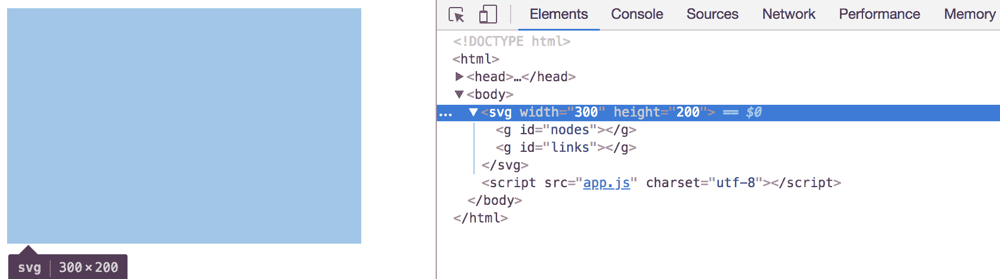
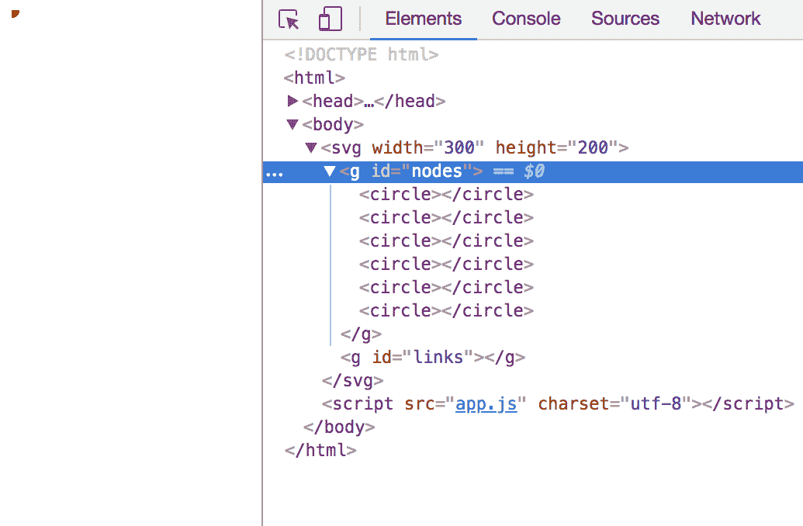
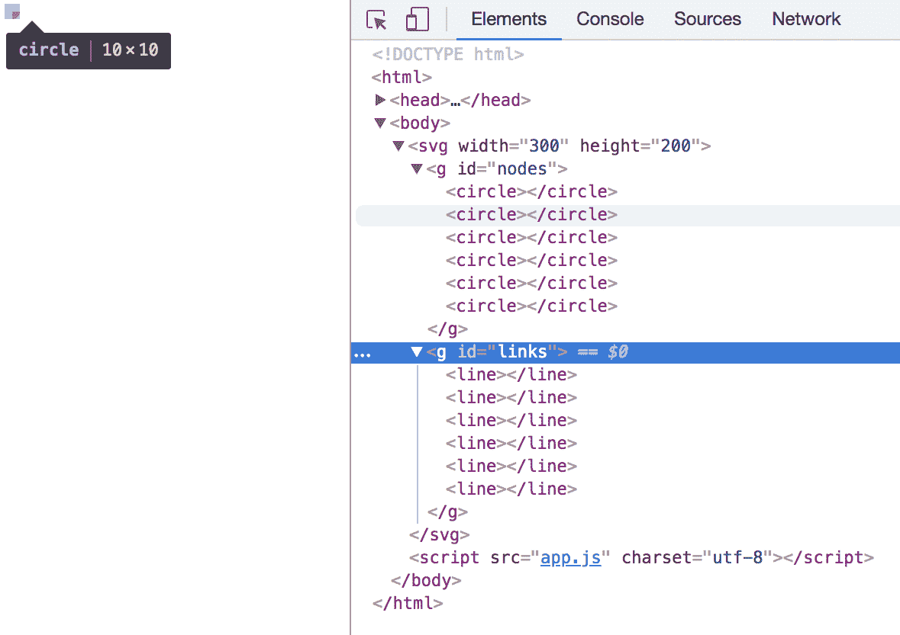
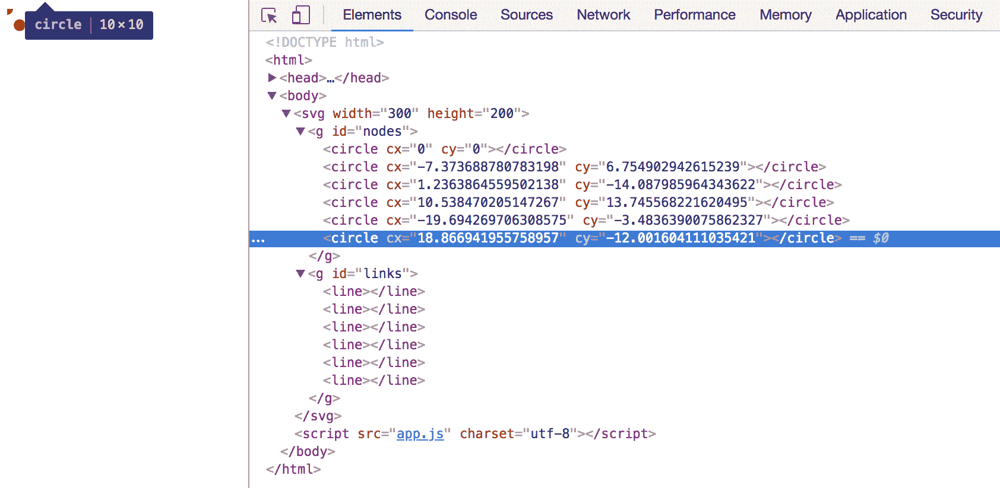
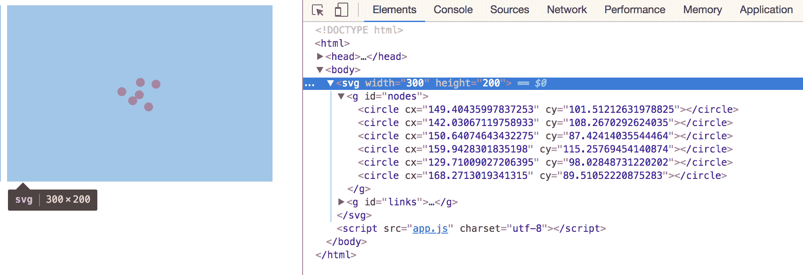
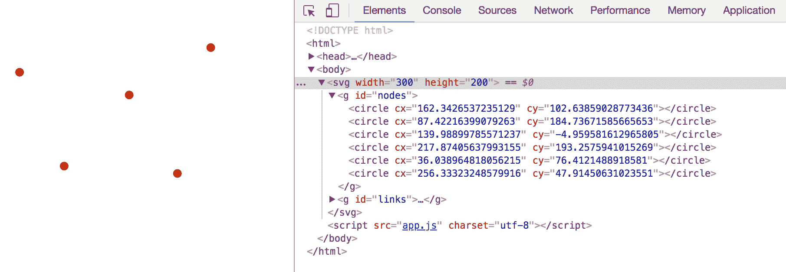

# 第七章：使用物理创建力导向图

本章将介绍如何制作一个力导向图，以可视化各个节点之间的关系。

在本课中，你将学习以下主题：

+   创建一个基于物理的力，使节点居中

+   创建一个基于物理的力，使节点相互排斥

+   创建一个基于物理的力，将节点链接起来以显示它们的关系

本节完整的代码可以在[`github.com/PacktPublishing/D3.js-Quick-Start-Guide/tree/master/Chapter07`](https://github.com/PacktPublishing/D3.js-Quick-Start-Guide/tree/master/Chapter07)找到。

# 什么是力导向图？

**力导向**图是一种受各种力（如重力和排斥力）影响的图。在创建关系图时，它可能非常有帮助。

# 如何设置关系图

以下部分将概述我们将要构建的内容。概述将涵盖实现的显示方面和物理方面。

# 显示

显示方面控制我们看到的内容；显示将包括以下内容：

+   一个表示人员的节点列表，以圆形的形式显示

+   表示人员之间连接的链接列表，以线条的形式显示

# 物理

模拟的物理控制元素如何交互，如下所示：

+   SVG 中心的居中力将使所有节点向其移动

+   每个节点上的排斥力将防止节点彼此靠得太近

+   链接力将连接每个节点，以便它们不会相互排斥得太厉害

# 设置 HTML

我们的文件将是一个相当标准的`index.html`文件，但我们需要两个`<g>`元素，如下所示：

+   一个用于包含节点（**人员**：圆形）

+   一个用于包含链接（**关系**：线条）

这是我们代码应该看起来像的：

```js
<!DOCTYPE html>
<html>
    <head>
        <meta charset="utf-8">
        <title></title>
        <script src="img/d3.v5.min.js"></script>
    </head>
    <body>
        <svg>
            <g id="nodes"></g>
            <g id="links"></g>
        </svg>
        <script src="img/app.js" charset="utf-8"></script>
    </body>
</html>
```

# 为节点和链接设置样式

为我们的圆形（节点/人员）和线条（链接/关系）创建一个`app.css`文件，如下所示：

```js
circle {
    fill: red;
    r: 5;
}

line {
    stroke: grey;
    stroke-width: 1;
}
```

不要忘记在`index.html`文件中创建指向它的链接，如下所示：

```js
<head>
    <link rel="stylesheet" href="app.css">
    <script src="img/d3.v5.min.js"></script>
</head>
```

# 设置 SVG

在我们的`app.js`文件顶部添加以下内容：

```js
var WIDTH = 300;
var HEIGHT = 200;

d3.select("svg")
    .attr("width", WIDTH)
    .attr("height", HEIGHT);
```

如果我们在 Chrome 中打开`index.html`并查看开发者工具中的元素，我们应该看到以下内容：



# 添加人员的数据

让我们在`app.js`文件的底部创建一个人员数组，如下所示：

```js
var nodesData =  [
    {"name": "Charlie"},
    {"name": "Mac"},
    {"name": "Dennis"},
    {"name": "Dee"},
    {"name": "Frank"},
    {"name": "Cricket"}
];
```

# 添加关系的数据

现在，让我们通过在`app.js`文件的底部添加以下数组来创建关系。请注意，属性必须是`source`和`target`，以便 D3 执行其魔法：

```js
var linksData = [
    {"source": "Charlie", "target": "Mac"},
    {"source": "Dennis", "target": "Mac"},
    {"source": "Dennis", "target": "Dee"},
    {"source": "Dee", "target": "Mac"},
    {"source": "Dee", "target": "Frank"},
    {"source": "Cricket", "target": "Dee"}
];
```

# 将圆形添加到 SVG 中

将以下内容添加到`app.js`文件的底部：

```js
var nodes = d3.select("#nodes")
    .selectAll("circle")
    .data(nodesData)
    .enter()
    .append("circle");
```

这将为`nodesData`数组中的每个元素创建一个圆形。我们的开发者工具应该看起来如下所示：



# 将线条添加到 SVG 中

将以下内容添加到`app.js`文件的底部：

```js
var links = d3.select("#links")
    .selectAll("line")
    .data(linksData)
    .enter()
    .append("line");
```

这将为我们的 `linksData` 数组中的每个元素创建一条线。我们的开发者工具应该如下所示：


# 创建一个模拟

现在，我们将在 `app.js` 的底部添加以下内容来生成一个模拟：

```js
d3.forceSimulation()
```

注意，这仅仅创建了一个模拟；它没有指定模拟应该如何运行。让我们通过修改之前的代码行来告诉它应该作用于哪些数据，如下所示：

```js
d3.forceSimulation()
    .nodes(nodesData) // add this line
```

# 指定模拟如何影响视觉元素

在这个阶段，我们的可视化效果仍然看起来一样，如下面的截图所示：



让我们的模拟影响我们创建的圆圈/线条，如下所示：

+   模拟运行 **ticks**，它们运行得非常快。想象一下这是一系列非常快速发生的步骤，就像秒表的滴答声，但更快。

+   每当发生一个新的 tick 时，你可以更新视觉元素。这允许我们的模拟进行动画。

+   D3 将计算并将位置数据附加到我们的常规数据上，以便我们可以使用它。

将以下内容添加到 `app.js` 的底部：

```js
d3.forceSimulation()
    .nodes(nodesData)
    .on("tick", function(){
        nodes.attr("cx", function(datum) {return datum.x;})
            .attr("cy", function(datum) {return datum.y;});

        links.attr("x1", function(datum) {return datum.source.x;})
            .attr("y1", function(datum) {return datum.source.y;})
            .attr("x2", function(datum) {return datum.target.x;})
            .attr("y2", function(datum) {return datum.target.y;});
    });
```

现在，我们的圆圈彼此之间稍微远离一些，但这只是没有附加任何力的副作用。我们将添加力：



# 创建力

让我们在屏幕中心创建一个中心力，它将把所有元素拉向它。调整我们在上一步中添加的代码，使其看起来如下。注意我们只向之前的代码中添加了 `.force("center_force", d3.forceCenter(WIDTH / 2, HEIGHT / 2))`：

```js
d3.forceSimulation()
    .nodes(nodesData)
    // add the line below this comment
    .force("center_force", d3.forceCenter(WIDTH / 2, HEIGHT / 2))             .on("tick", function(){
        nodes.attr("cx", function(datum) {return datum.x;})
            .attr("cy", function(datum) {return datum.y;});

        links.attr("x1", function(datum) {return datum.source.x;})
            .attr("y1", function(datum) {return datum.source.y;})
            .attr("x2", function(datum) {return datum.target.x;})
            .attr("y2", function(datum) {return datum.target.y;});
    });
```

现在，我们的圆圈被拉向 SVG 元素的中心：



在每个节点上创建一个力，使它们相互排斥。就像在上一步中一样，我们将在之前的代码中只添加 `.force("charge_force", d3.forceManyBody())`：

```js
d3.forceSimulation()
    .nodes(nodesData)
    .force("center_force", d3.forceCenter(WIDTH / 2, HEIGHT / 2))
    // add the line below this comment
    .force("charge_force", d3.forceManyBody())
    .on("tick", function(){
        nodes.attr("cx", function(datum) {return datum.x;})
            .attr("cy", function(datum) {return datum.y;});

        links.attr("x1", function(datum) {return datum.source.x;})
            .attr("y1", function(datum) {return datum.source.y;})
            .attr("x2", function(datum) {return datum.target.x;})
            .attr("y2", function(datum) {return datum.target.y;});
    });
```

你会注意到圆圈的 `cx`/`cy` 值最初会迅速变化，最终停止。这是因为 D3 正在运行一个模拟。注意 `center_force` 正在尝试与 `charge_force` 达到一个平衡状态。你甚至会注意到当你第一次加载页面时，圆圈会从中心向外移动。这也是由于同样的原因：



最后，我们将创建节点之间的链接，以便它们不会相互排斥得太厉害。就像在上一步中一样，我们将添加以下代码到之前的代码中：

```js
.force("links", d3.forceLink(linksData).id(function(datum){
    return datum.name
}).distance(160))
```

我们最后的代码块现在应该如下所示：

```js
d3.forceSimulation()
    .nodes(nodesData)
    .force("center_force", d3.forceCenter(WIDTH / 2, HEIGHT / 2))
    .force("charge_force", d3.forceManyBody())
    //add the three lines below this comment
    .force("links", d3.forceLink(linksData).id(function(datum){
        return datum.name
    }).distance(160))
    .on("tick", function(){
        nodes.attr("cx", function(datum) {return datum.x; })
            .attr("cy", function(datum) {return datum.y; });

        links.attr("x1", function(datum) {return datum.source.x;})
            .attr("y1", function(datum) {return datum.source.y;})
            .attr("x2", function(datum) {return datum.target.x;})
            .attr("y2", function(datum) {return datum.target.y;});
    });
```

+   d3.forceLink 函数接受链接数组。然后它使用每个链接数据对象的源和目标属性，通过它们的 `.name` 属性（如我们刚刚编写的函数的返回值中指定）将节点连接起来。

+   你可以通过添加 `.distance()` 来指定每条线在视觉上有多长。

最后，我们的图表看起来如下：


# 摘要

在本章中，我们使用了 D3 来创建一个图形，用于可视化数据中各个节点之间的关系。这在诸如绘制朋友网络、展示母公司和子公司关系或显示公司员工层级等场景中非常有用。

在第八章 *映射*中，我们将介绍如何从 GeoJSON 数据创建地图。
