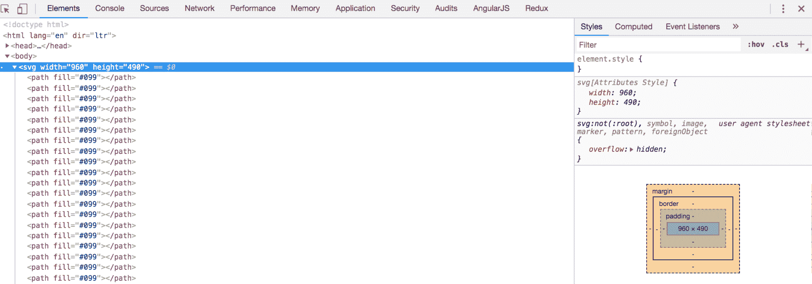
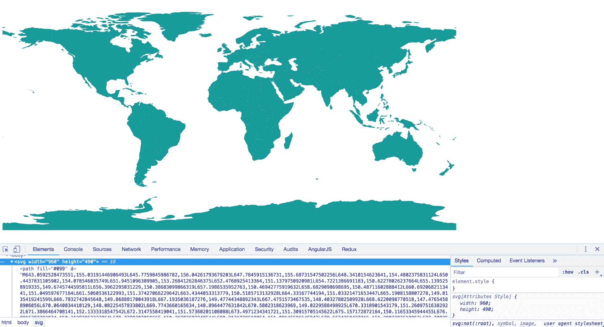

# 映射

D3 是生成地图的强大工具。为此，我们使用特殊格式的 JSON 数据来生成 `<path>` SVG 元素。这种特殊格式的 JSON 数据称为 **GeoJSON**，在本章中，我们将使用它来创建世界地图。

在本章中，我们将涵盖以下主题：

+   创建地图

+   定义 GeoJSON

+   使用投影

+   使用投影和 GeoJSON 数据生成 `<path>`

本章的完整代码可以在以下网址找到：[`github.com/PacktPublishing/D3.js-Quick-Start-Guide/tree/master/Chapter08`](https://github.com/PacktPublishing/D3.js-Quick-Start-Guide/tree/master/Chapter08).

# 定义 GeoJSON

GeoJSON 只是具有特定属性的 JSON 数据，这些属性被分配了特定的数据类型。以下是一个 GeoJSON 的示例：

```js
{
    "type": "Feature",
    "geometry": {
        "type": "Point",
        "coordinates": [125.6, 10.1]
    },
    "properties": {
        "name": "Dinagat Islands"
    }
}
```

在这个例子中，我们有一个 `Feature`，其 `geometry` 是一个坐标为 `[125.6, 10.1]` 的 `Point`。它的名字是 `Dinagat Islands`。每个 `Feature` 都将遵循这种通用结构。以下是一个类型为 `STRING` 的示例：

```js
{
    "type": STRING,
    "geometry": {
        "type": STRING,
        "coordinates": ARRAY
    },
    "properties": OBJECT
}
```

我们还可以有一个 `FeatureCollection`，它包含一个 `features` 数组中分组在一起的许多特征。在以下代码片段中，你可以看到一个具有不同 `geometry` 的 `FeatureCollection` 示例：

```js
{
    "type": "FeatureCollection",
    "features": [
        {
            "type": "Feature",
            "geometry": {
                "type": "Point",
                "coordinates": [102.0, 0.5]
            },
            "properties": {
                "prop0": "value0"
            }
        },
        {
            "type": "Feature",
            "geometry": {
                "type": "LineString",
                "coordinates": [
                    [102.0, 0.0], [103.0, 1.0], [104.0,   
                     0.0], [105.0, 1.0]
                ]
            },
            "properties": {
                "prop0": "value0",
                "prop1": 0.0
            }
        },
        {
            "type": "Feature",
            "geometry": {
                "type": "Polygon",
                "coordinates": [
                    [
                       [100.0, 0.0], [101.0, 0.0], 
                       [101.0, 1.0], [100.0, 1.0], 
                        [100.0, 0.0]
                    ]
                ]
            },
            "properties": {
                "prop0": "value0",
                "prop1": { "this": "that" }
            }
        }
    ]
}
```

这里是通用形式：

```js
{
    "type": "FeatureCollection",
    "features": ARRAY
}
```

`features` 属性是一个之前定义的特征对象的数组。

# 设置 HTML

让我们设置一个基本的 D3 页面，使用以下代码：

```js
<!DOCTYPE html>
<html lang="en" dir="ltr">
<head>
    <meta charset="utf-8">
    <title></title>
    <script src="img/d3.v5.min.js" charset="utf-8">
    </script>
    <script src="img/map_data3.js" charset="utf-8">
    </script>
</head>
<body>
    <svg></svg>
    <script src="img/app.js" charset="utf-8"></script>
</body>
</html>
```

与之前章节中使用的设置相比，唯一不同的是以下行：

```js
<script src="img/map_data3.js" charset="utf-8">
</script>
```

前一行只是加载一个外部 JavaScript 文件，该文件将我们的 GeoJSON 数据设置到一个变量中。代码的开始部分如下所示：

```js
var map_json = {
    type: "FeatureCollection",
    features: [
        {
            type: "Feature",
            id: "AFG",
            properties: {
                name: "Afghanistan"
            },
            geometry: {
                type: "Polygon",
                coordinates: [
                    //lots of coordinates
                ]
            }
        }
        // lots of other countries
    ]
}
```

注意，`map_json` 变量只是一个遵循 GeoJSON 结构的 JavaScript 对象（它添加了一个可选的 `idproperty`）。这非常重要。如果对象不遵循 GeoJSON 结构，D3 就不会按预期工作。

在生产环境中，你可能需要通过 AJAX 调用来获取这些数据，或者至少创建自己的 GeoJSON 文件，类似于托管在 [`rawgit.com/`](https://rawgit.com/) 上的文件。前面的设置是为了简化学习，降低与 AJAX 相关的复杂性。

# 使用投影

现在，让我们开始我们的 `app.js` 文件，如下所示：

```js
var width = 960;
var height = 490;

d3.select('svg')
    .attr('width', width)
    .attr('height', height);
```

在 `app.js` 的底部，让我们添加以下代码：

```js
var worldProjection = d3.geoEquirectangular();
```

这生成了一个投影，它决定了我们在平面上如何显示一个圆形的世界。我们可以使用很多不同类型的投影，这些投影可以在 [`github.com/d3/d3-geo/blob/master/README.md#azimuthal-projections`](https://github.com/d3/d3-geo/blob/master/README.md#azimuthal-projections) 中看到。

前一行告诉 D3 创建一个 `equirectangular` 投影 ([`github.com/d3/d3-geo/blob/master/README.md#geoEquirectangular`](https://github.com/d3/d3-geo/blob/master/README.md#geoEquirectangular)).

# 使用投影和 GeoJSON 数据生成路径

现在我们有了我们的投影，我们将为 `map_json.features` 数组中的每个数据元素生成 `<path>` 元素。然后，我们将每个元素的填充设置为 `#099`。将以下内容添加到 `app.js` 的末尾：

```js
d3.select('svg').selectAll('path')
    .data(map_json.features)
    .enter()
    .append('path')
    .attr('fill', '#099');
```

以下截图显示了如果我们打开 `index.html` 并在开发者工具中的元素标签页中查看，它应该看起来像什么：



我们创建了路径元素，但每个元素都需要一个 `d` 属性，这将决定它们如何被绘制（即它们的形状）。

我们想要的是以下这样的东西：

```js
d3.selectAll('path').attr('d', function(datum, index){
    //use datum to generate the value for the 'd' attributes
});
```

编写前面注释中描述的那种代码将会非常困难。幸运的是，D3 可以为我们生成整个函数。我们只需要指定之前创建的投影。在 `app.js` 的底部添加以下代码：

```js
var dAttributeFunction = d3.geoPath()
    .projection(worldProjection);

d3.selectAll('path').attr('d', dAttributeFunction);
```

`geoPath()` 生成我们将用于 `d` 属性的函数，并且投影 (`worldProjection`) 告诉它使用之前创建的 `worldProjection` 变量，这样路径元素就会以等经纬投影的形式出现，如下所示：



# 摘要

在本章中，我们讨论了 GeoJSON，它的用途以及为什么它与更通用的 JSON 数据不同。我们还介绍了如何使用 D3 创建投影并将 GeoJSON 数据渲染为地图。利用这些信息，我们可以创建各种有趣的地图，如国家、城市、镇或任何我们有 GeoJSON 数据的区域。我们可以使用不同的投影以有趣的方式查看这些数据。

恭喜！你已经到达了这本书的结尾。现在，去创建令人惊叹的可视化吧。
