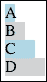
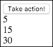

# 第二章。选择和数据绑定

在本章中，你将学习如何使用 D3.js 根据数据选择和操作 HTML 页面的 DOM。D3.js 中的视觉渲染采用声明式方法，其中你告知 D3.js 如何可视化数据片段，而不是命令式地编程如何绘制视觉并遍历数据。这个过程在 D3.js 术语中被称为 **选择** 和 **数据绑定**。

为了展示如何使用 D3.js 创建由数据驱动的 DOM 元素，我们将通过一系列示例来演示如何创建 DIV 元素以显示各种整数值数组。我们首先将检查如何使用选择来提取现有的 DOM 元素，以及 D3.js 如何将数据关联到每个 DOM 元素。然后我们将探讨指导 D3.js 从数据中创建新 DOM 元素的方法。接下来，我们将讨论更新现有元素以及当特定数据项被移除时移除视觉元素的过程。

我们将专注于 HTML DOM 元素，并在后面的章节中介绍 SVG 的使用。具体来说，在本章中我们将探讨以下主题：

+   使用 D3.js 选择器修改 DOM 元素

+   使用 D3.js 选择器修改 DOM 元素的样式

+   使用 `.data()` 将数据绑定到 DOM

+   使用 `.enter()` 从新数据项创建 DOM 元素

+   根据数据变化更新现有 DOM 元素

+   使用 `.exit()` 在关联数据不再需要可视化时移除 DOM 元素

+   D3.js 进行数据绑定的技巧清单

# D3.js 选择器

在其核心，D3.js 是关于选择，这是一个寻找和创建可视化数据的 DOM 元素的过程。在简单层面上，选择可以仅仅是一种在 DOM 中查找和操作已存在元素的手段。然而，D3.js 选择器也可以用来显式创建 DOM 中的新元素，以及根据底层数据模型的变化隐式创建和删除 DOM 元素。

在 第一章 中，我们看到了一个简单的选择示例，其中我们使用选择来制作 D3.js 版本的经典 Hello World 应用程序。现在我们将更深入地探讨选择的力量。我们将查看两个选择 DOM 元素并更改其样式的示例。

## 更改 DOM 元素的样式

在这个第一个示例中，我们将创建一个包含四个 `div` 元素的页面，每个 `div` 元素都有一个唯一的 ID。然后我们将使用 D3.js 找到第一个 `div` 标签，并更改其背景颜色。

### 注意

bl.ock (2.1): [`goo.gl/EnAQBc`](http://goo.gl/EnAQBc)

文档的 `body` 标签包含以下代码：

```js
<div id='div1'>A</div>
<div id='div2'>B</div>
<div id='div3'>C</div>
<div id='div4'>D</div>
<script>
  d3.select('div').style('background-color', 'lightblue')
</script>
```

上述代码的结果如下：


此示例使用 `d3.select()` 函数，它返回 DOM 中与给定标签匹配的第一个元素——在这种情况下，是 `'DIV'`。`d3.select()` 的结果是代表已识别的 DOM 元素及其数据的 D3.js 对象。

在 D3.js 中，这个概念被称为 **选择器**。函数 `d3.select()` 总是代表单个 DOM 元素，如果找不到元素，则返回 null 值。

选择器有如 `.style()` 这样的方法，可以用来更改底层元素的 CSS 样式属性，使用 `.attr()` 更改属性，以及使用 `.text()` 函数更改文本属性。

在这种情况下，我们使用 `.style()` 函数将 DIV 元素的 `background-color` 属性样式设置为 `lightblue`。

### 更改多个项目的样式

要在 DOM 中选择多个项目，我们可以使用 `d3.selectAll()` 函数。结果是选择器，它可以表示匹配特定标准的多个 DOM 元素。

为了演示，我们将之前示例中的单行 D3.js 代码更改为以下内容：

```js
d3.selectAll('div').style('background-color', 'lightblue')
```

因此，`.selectAll()` 的调用将代表文档中的每个四个 `div` 元素。`.style()` 的调用将应用于每个表示的 DOM 元素，从而产生以下输出：


### 注意

bl.ock (2.2): [`goo.gl/61p8Nv`](http://goo.gl/61p8Nv)

这展示了使用 D3.js 进行选择的一个优点。链式函数调用将被应用于由 D3.js 选择产生的所有 DOM 元素。因此，我们不需要显式地遍历所有项目。这节省了我们大量的编码工作，并有助于减少潜在的错误。

### 注意

注意，默认情况下，选择器中的项目在创建 D3.js 选择器时是固定的。如果我们选择之后添加另一个 `div`，则现有选择器中的元素将不会添加新的 `div` 标签。

传递给 `d3.select()` 和 `d3.selectAll()` 函数的参数也可以包括查询的一部分 CSS 规则。例如，要选择所有具有特定 ID 的元素，请将参数以 `#` 开头。以下示例仅选择那些 ID 为 `div2` 的 DOM 元素：

```js
d3.selectAll('#div2').style('background-color', 'lightblue')
```

这将产生以下输出：


### 注意

bl.ock (2.3): [`goo.gl/TC4Yox`](http://goo.gl/TC4Yox)

注意，此选择将返回所有具有 ID `div2` 的 DOM 元素，无论它们是 `div` 还是其他类型的 DOM 元素。此示例只有 `div` 标签，所以我们只会检索这些。此外，在页面上使用相同的 ID 值是不良的做法。但查询的方式是可行的。

如果我们想确保此查询只返回 `div` 元素，则可以使用以下查询，它将元素的类型放在井号符号之前：

```js
d3.selectAll("div#div3").style('background-color', 'lightblue')
```

上述查询的结果如下：


### 注意

bl.ock (2.4): [`goo.gl/xVwV1O`](http://goo.gl/xVwV1O)

现在我们来分析一个场景，其中我们希望为选择器中的每个 DOM 元素应用不同的样式。为此，我们可以将访问器函数传递给 `.style()` 而不是值。例如，以下代码将在 `div` 标签的背景颜色之间交替 `lightblue` 和 `lightgray`。

```js
d3.selectAll("div")
    .style('background-color', function (d, i) {
        return (i % 2 === 0) ? "lightblue" : "lightgray";
    });
```

上述代码产生以下输出：


### 注意

bl.ock (2.5): [`goo.gl/PdohHx`](http://goo.gl/PdohHx)

访问器函数通常通过 D3.js 使用。访问器函数有两个参数，第一个参数代表 D3.js 与 DOM 元素关联的数据（我们将在本章后面回到这一点）。第二个参数代表在选择结果的 0 基数数组位置中的 DOM 元素。

### 注意

访问器函数的第二个参数是可选的。

选择器函数的返回值在许多情况下是另一个选择器（或相同的选择器）。这允许我们将方法调用链在一起。我们可以这样做，以便方便地为选择器表示的所有 DOM 元素设置多个样式。

例如，以下代码首先设置背景颜色，然后设置每个 DIV 的宽度为递增值：

```js
d3.selectAll("div")
  .style('width', function(d, i) {
    return (10 + 10 * i) + "px";
  })
  .style('background-color', function (d, i) {
    return (i % 2 === 0) ? 'lightblue' : 'lightgray';
  });
```

上述代码的输出将如下所示：



### 注意

bl.ock (2.6): [`goo.gl/ukFFYL`](http://goo.gl/ukFFYL)

在单个 `.style()` 调用中也可以设置多个样式属性，通过传递一个包含属性名称和值的哈希表。以下示例与上一个示例具有相同的结果：

```js
d3.selectAll("div").style({
    width: function (d, i) { return (10 + 10 * i) + "px" },
    'background-color': function (d, i) {
        return (i % 2 === 0) ? 'lightblue' : 'lightgray';
    }
});
```

### 注意

bl.ock (2.7): [`goo.gl/17FVJs`](http://goo.gl/17FVJs)。输出图像被省略，因为它与上一个 bl.ock 相同。

# D3.js 和数据绑定

上一个章节中的示例依赖于 DOM 中已经存在的元素。通常，在 D3.js 中，我们会从一个数据集开始，然后根据这些数据构建可视化。我们还想在数据发生变化时更改可视化，无论是添加更多数据项、删除一些或全部数据，还是更改现有对象的属性。

管理数据到视觉元素映射的过程通常被称为**数据绑定**，在 D3.js 术语中，它被称为**数据连接**（不要与 SQL 连接混淆）。D3.js 中的绑定是通过选择器的 `.data()` 函数执行的。

让我们深入探讨，并详细检查一些数据绑定示例。

## 数据绑定

对于 D3.js 的新手来说，数据绑定可能是最难适应的事情之一。即使是那些使用其他提供数据绑定的语言和框架的人，D3.js 绑定数据的方式也略有不同，了解它是如何做到的将节省很多时间。因此，我们将花时间详细检查它，因为它对于创建有效的 D3.js 可视化至关重要。

在 D3.js 中，我们通过以下选择器的函数使用绑定来驱动数据的可视化。

| 函数 | 目的 |
| --- | --- |
| `.data()` | 指定用于驱动可视化的数据 |
| `.enter()` | 返回一个表示将要显示的新项的选择器 |
| `.exit()` | 返回一个表示不再显示的项的选择器 |

这种使用测试函数的模式在 D3.js 代码中如此根深蒂固，以至于通常被称为**进入**/**更新**/**退出**模式或**通用更新**模式。它提供了一种强大的声明性方式来告诉 D3.js 你希望如何显示动态数据，并让 D3.js 处理渲染。

我们将在稍后回到这些关于进入/更新/退出的具体细节。现在，让我们先从本章早期的一个选择示例开始，其中我们选择了文档中的所有`div`对象。这将帮助我们理解选择器如何促进渲染过程的基础。

我们将使用之前示例中`d3.selectAll()`函数的一个轻微变体。在这里，我们将结果分配给一个名为`selector`的变量：

```js
<div id='div1'>A</div>
<div id='div2'>B</div>
<div id='div3'>C</div>
<div id='div4'>D</div>
<script>
    var selector = d3.select('body')
                     .selectAll('div');
</script>
```

### 注意

bl.ock (2.8): [`goo.gl/etDgJV`](http://goo.gl/etDgJV)。输出没有显示，因为代码给出了与之前示例不同的视觉结果。

在这个先前的语句与之前的例子之间有两个细微的差别。第一个是我们选择了 body DOM 元素，第二个是我们对 div 标签链式调用了`.selectAll()`。

使用这种函数链的模式，我们指示 D3.js 选择所有作为`body`标签子标签的`div`标签。这种选择函数调用的链式调用使我们能够遍历 HTML 文档以查找特定位置上的标签，并且正如我们将很快看到的，指定放置新视觉元素的位置。

为了帮助概念化选择器，我认为可以将选择器视为 D3.js 与那些元素关联的数据之间的映射集合。我发现用以下之类的图表来心理想象选择器是有用的：


上一张图中的橙色部分代表我们选择的结果的整体选择器。这个选择器包含四个由白色、圆形矩形表示的项目，每个`div`一个，我们可以将其视为从 0 到 3 编号。

### 注意

不要将选择器与数组混淆——这个图中的单个元素不能使用 `[]` 访问。

排序很重要，正如我们更新数据时将看到的，默认情况下，排序取决于在选择的点 DOM 元素在 DOM 中的顺序（在这种情况下，`body` 标签的子元素）。

选择器中的每个项目可以被认为由两个其他对象组成。第一个是实际由选择器识别的 DOM 元素，在前面的图中用蓝色方块表示。在这个方块内部是 DOM 元素类型（`div`），以及其 `id` 属性的值。

第二个是与该 DOM 元素关联的 D3.js 数据，用绿色方块表示。在这种情况下，D3.js 没有绑定任何数据，因此每个的数据都是 null（或图中的空）。这是因为这些 DOM 元素是在 HTML 中创建的，而不是使用 D3.js 创建的，因此没有关联的数据。

让我们改变这一点，并将一些数据绑定到这些 `div` 标签上。我们通过在选择函数之后立即链式调用 `.data()` 来做这件事。这个函数传递一个值或对象的集合，并通知 D3.js 你想要将每个数据与由后续函数调用创建的特定视觉表示关联起来。

为了演示这一点，让我们修改代码如下，将整数数组绑定到 `div` 标签上：

```js
var selector = d3.select('body')
                 .selectAll('div')
                 .data([10, 20, 30, 40]);
```

### 注意

bl.ock (2.9): [`goo.gl/h1O1wX`](http://goo.gl/h1O1wX)。输出被省略，因为与上一个示例在视觉上没有区别。

`.data()` 调用的链式调用结果告诉 D3.js，对于选择器中识别的每个项目，数据中相同索引处的数据应该被分配。在这个例子中，这并没有改变视觉。它只是将数据分配给每个 `div` 元素。

为了验证这一点，让我们使用开发者工具检查结果。如果你在浏览器中右键点击 **A**，然后选择检查元素，工具将打开。接下来，打开属性面板，如下面的截图所示：


在前面的屏幕截图中的突出显示的红色矩形表明，`div` 标签现在有一个 `__data__` 属性，其值为 `10`。这就是 D3.js 通过在 DOM 元素上创建这个属性并分配数据来绑定数据到视觉的方式。如果你检查其他三个 `div` 标签，你会看到它们都具有这个属性和相关的值。

使用我们的选择器的视觉，我们得到以下值：


你现在可能会问，如果在调用 `.data()` 时项目的数量不等于选择器中的项目数量会发生什么？让我们看看这些场景，从选择器中 DOM 元素数量少于数据项的情况开始：

```js
 var selector = d3.select('body')
                  .selectAll('div')
                  .data([10, 20, 30]);
```

### 注意

bl.ock (2.10): [`goo.gl/89NReN`](http://goo.gl/89NReN)。输出再次被省略，因为视觉没有变化。

在运行此示例后打开开发者工具，并检查每个 `div` 标签的属性，你会注意到前三个有一个带有分配值的 `__data__` 属性。第四个标签没有添加属性。这是因为 D3.js 遍历数据中的项目，逐个分配它们，并且忽略选择器中的任何额外 DOM 元素。

从概念上讲，选择器看起来如下：


现在让我们将代码修改为比 DOM 元素更多的数据项：

```js
var selector = d3.select('body')
                 .selectAll('div')
                 .data([10, 20, 30, 40, 50]);
```

### 注意

bl.ock (2.11): [`goo.gl/CvuxNJ`](http://goo.gl/CvuxNJ). 由于视觉没有变化，输出再次被省略。

在开发者工具中检查生成的 DOM，你可以看到仍然只有四个 `div` 元素，分别分配了 `10` 到 `40` 的值。没有为额外的数据项创建新的视觉元素。


为什么在这种情况下没有创建视觉元素？这是因为 `.data()` 的调用只将数据分配给选择器中现有的视觉元素。由于 `.data()` 遍历它传递的项目，它会在最后一个项目处停止，并且忽略选择器中的额外 DOM 元素。

### 注意

在下一节中，我们将探讨如何为这些散乱的数据项添加视觉元素。

我认为还有一个情况值得探讨。到目前为止的 `.data()` 示例都使用了文档中预先存在的 `div` 标签。现在让我们尝试在没有现有 `div` 标签的情况下绑定一些数据项。这个代码的主体如下：

```js
    var selector = d3.select('body')
                     .selectAll('div')
                     .data([10, 20, 30]);
```

### 注意

bl.ock (2.12): [`goo.gl/5gsEGe`](http://goo.gl/5gsEGe). 输出已被省略，因为没有视觉元素。

这不会创建任何 DOM 元素，因为我们没有在 `.data()` 之后链式调用任何函数来创建它们。然而，变量选择器是一个有效的选择器，有三个项目。在我们的视觉中，它看起来像以下图表，其中蓝色方块是空的：


如果你查看控制台创建的输出，你会看到这个选择器确实有一个包含三个项目的数组：

```js
[[undefined, undefined, undefined]]
```

输出不一定显示数据，但它确实表明选择器由三个项目组成。我们的概念模型显示更多，但毕竟它只是一个概念模型，旨在理解和表示底层数据结构，而不是实际的数据结构。

现在让我们看看我们如何指导 D3.js 为数据项创建一些视觉元素来填充那些蓝色方块，并将它们显示在屏幕上。

### 使用 .enter() 指定进入元素

要使用 D3.js 创建视觉元素，我们需要在调用 `.data()` 方法之后调用选择器的 `.enter()` 方法。然后我们将其他方法调用链式连接起来，以添加一个或多个 DOM 元素，并且通常还会调用各种函数来设置这些 DOM 元素的属性。

为了说明 `.enter()` 的用法，让我们看看上一节中的最后一个示例，其中我们从页面的 `div` 标签开始，并使用 D3.js 绑定了三个整数：

```js
var selector = d3.select('body')
    .selectAll('div')
    .data([10, 20, 30]);
```

现在通过选择器变量，我们调用 `.enter()` 函数并将其分配给一个名为 `entering` 的变量：

```js
var entering = selector.enter();
```

`entering` 的值将代表选择器中需要创建的新项目。`selector` 没有选择任何 `div` 标签，并且因为我们绑定了三个项目，所以这个变量代表选择器中需要创建的三个新项目。

我们可以使用进入值并调用函数来指定每个项目的视觉渲染方式：

```js
entering.append('div')
    .text(function(d) { return d; });
```

### 注意

bl.ock (2.13): [`goo.gl/HFdspR`](http://goo.gl/HFdspR).

执行后，`selector` 的值包含三个项目，其中值已分配并且 DOM 元素已创建：


页面上生成的输出将如下所示：


检查生成的 DOM，我们看到创建了三个 `div` 标签：


### 注意

我将把这个作为练习留给你，检查这些元素的属性以验证 `__data__` 属性的创建和值的分配。

## 使用 .enter() 添加新项目

现在我们已经从数据中创建了没有现有视觉的 DOM 元素，让我们修改代码，通过按按钮添加新数据来更新数据。

在 D3.js 中，需要创建新视觉数据的称为 *entering* 状态的数据。在调用 `.data()` 之后，我们可以在同一个结果选择器上调用 `.enter()` 方法。此方法识别选择器中进入的项目，因此需要创建视觉元素。然后我们只需在 `.enter()` 的结果上链式调用方法，告诉 D3.js 每个数据项应该如何可视化。

让我们稍微修改一下代码，以展示这一过程。

### 注意

bl.ock (2.14): [`goo.gl/TuVYQu`](http://goo.gl/TuVYQu)

此代码对前面的示例进行了一些修改。首先我们添加了一个按钮，可以按下。此按钮将调用名为 `render()` 的函数，并向它传递一个包含四个值的数组，其中前三个值相同。在末尾还有一个新的数据项：

```js
<button onclick='render([10, 20, 30, 40])'>Take action!</button>
```

`render` 函数本身执行选择和创建新视觉元素的操作，但它使用传递给函数的值而不是硬编码的值数组。

```js
  function render(dataToRender) {
    var selector = d3.select('body')
                     .selectAll('div')
                     .data(dataToRender);

    var entering = selector.enter();
    entering.append('div')
            .text(function(d) { return d; });
  }
```

当页面首次加载时，我们调用 `render`，告诉它在一个不同的数组中创建元素。

```js
  render([10, 20, 30]);
```

加载的初始页面将包含以下内容：


当我们按下按钮时，我们再次调用 `render`，但传递四个值。这导致页面上的内容如下所示：


这可能看起来像是之前存在的`div`标签被四个新的标签替换了，但实际上发生的事情要微妙得多。当第二次调用`render()`时，对`.selectAll('div')`的调用创建了一个有三个项目的选择器，每个项目都有 DOM 元素和它们绑定的数据：


然后，`.data([10, 20, 30, 40])`被执行。D3.js 遍历这个数组，并将每个数据项的值与选择器中相同索引的项目进行比较。在这种情况下，位置 0、1 和 2 的项目具有`10`、`20`和`30`的值，这些值分别等于数据中相同位置上的值。因此，D3.js 对这些项目没有任何操作。但是第四个值`40`在选择器中没有关联的项目。


因此，D3.js 将为数据 40 在选择器中创建一个新项目，然后应用创建视觉的函数，结果如下：


D3.js 保留了前三个项目（及其 DOM 元素）不变，并为只有`40`数据项添加了新的 DOM 元素。

### 注意

在这个例子中，有一点需要指出的是，我没有设置 ID 属性，因此概念选择器没有显示该属性。

### 更新值

现在我们来看一个例子，我们改变数据中几个项目的值。在这种情况下，我们不想在 DOM 中删除和插入一个新的视觉元素，而是简单地更新 DOM 中的属性以表示底层值的改变。

### 注意

这种更新的一个例子可能是需要更新的股票价格。

为了演示这一点，让我们快速修改之前的例子，当我们点击按钮时，我们现在将执行以下操作：

```js
<button onclick='render([20, 30, 50])'>Take action!</button>
```

### 注意

bl.ock (2.15): [`goo.gl/nyUrRL`](http://goo.gl/nyUrRL)

按下按钮后，我们得到以下结果：


页面上没有任何变化！难道页面不应该显示 20、30 和 50 吗？

这涉及到 D3.js 数据绑定的一些微妙之处。让我们逐步解释这个结果：

```js
            var selector = d3.select('body')
                .selectAll('div')
                .data(dataToRender);
```

当页面加载时，`.selectAll('div')`的调用识别了三个`div`标签：


在此之后，对 `.data()` 的调用将新值绑定到选择器中的每个项目：


D3.js 已经改变了绑定的值，但是所有项目都被重用了，因此没有被标记为进入。因此，以下语句的结果是一个空的进入项目集。

```js
            var entering = selector.enter();
```

因此，链式方法没有被执行，DOM 元素也没有被更新。

我们如何解决这个问题？实际上非常简单：我们需要处理进入元素和已存在元素的情况。为此，将渲染函数更改为以下内容：

```js
function render(dataToRender) {
    var selector = d3.select('body')
        .selectAll('div')
        .data(dataToRender);

    var entering = selector.enter();

    entering.append('div')
        .text(function(d) { return d; });

    selector.text(function(d) { return d; });
}
```

唯一的不同之处在于我们添加了以下行：

```js
    selector.text(function(d) { return d; });
```

当我们将方法链接到原始选择器时，链接的函数将应用于选择器中既不是进入也不是退出的所有项目（我们将在下一节中介绍退出）。结果是我们所期望的：


### 使用 .exit() 移除项目

现在我们来讨论当从绑定数据的集合中移除项目时，视觉如何变化。为了处理退出，我们只需要在`.data()`的结果上使用`.exit()`函数。`.exit()`的返回值是 D3.js 根据数据变化确定需要从可视化中移除的项目选择器集合。

为了演示项目的移除，我们将对之前的示例进行一些简单的修改。首先，让我们更改按钮代码，以便在点击时渲染以下数组：

```js
<button onclick='render([5, 15])'>Take action!</button>
```

当我们执行这个更改后的页面时，我们得到以下结果：



从概念上讲，我们本应期望得到一个只有 5 和 15 的页面，而不是 5、15 和 30。

这种结果的原因再次是因为 D3.js 处理数据绑定的方式。当我们调用`.data()`并使用更新后的数据时，D3.js 试图解决以下问题：


由于`.data()`所做的只是更新选择器中每个项目的绑定值，并且由于值比选择器项目少，所以我们得到以下选择器作为结果：


然后我们调用我们的代码来处理进入和更新状态。在这种情况下，没有进入的项目，而位置 0 和 1 的项目被安排进行更新。因此，前两个 div 标签获得新的文本值，第三个 div 在 DOM 中保持不变。

为了解决这个问题，我们只需要调用`.exit()`，并使用这个调用的结果从 DOM 中移除这些项目。我们可以将`render()`修改如下，这样我们就得到了期望的结果：

### 注意

bl.ock (2.16): [`goo.gl/IkIjGY`](http://goo.gl/IkIjGY)

```js
function render(dataToRender) {
    var selector = d3.select('body')
        .selectAll('div')
        .data(dataToRender);

    var entering = selector.enter();

    entering.append('div')
        .text(function(d) { return d; });

    selector.text(function(d) { return d; });

    var exiting = selector.exit();
    exiting.remove();
}
```

唯一的改变是最后两行的添加。现在当我们按下按钮时，我们得到期望的结果：


## 关于一般更新模式的几点注意事项

为了结束这一章，我想强调一些关于使用 D3.js 基于数据管理视觉的要点。我相信这绝对会帮助你避免在学习 D3.js 时遇到问题。由于我从其他开发平台（在这些平台上数据绑定以不同的方式工作）过来，我确实遇到了这些问题，我想分享我所学到的见解，以节省你很多压力。这有点长，但我相信它非常有价值。

+   可视化几乎总是基于数据，而不仅仅是显式编码。

+   通常，D3.js 应用程序在页面加载时会对文档执行 `.selectAll()`，以表示数据的 DOM 元素。通常，这个选择的结果没有任何元素，因为页面刚刚加载。

+   然后调用 `.data()` 将数据绑定到选择的结果选择器。

+   `.data()` 遍历传递给它的数据值，并确保选择器中有项目可以关联数据到视觉上。数据值的值被复制到这个项目上。DOM 元素不是通过 `.data()` 调用创建的。

+   在许多应用程序中，数据会随着时间动态变化，而无需重新加载页面，无论是通过用户交互还是通过基于其他事件的代码更新数据。当这种情况发生时，你希望更新可视化。因此，你需要多次调用 `.data()`。

+   如果数据中的项目数量多于应用到的选择器中的项目数量，那么在选择器的末尾将创建更多的选择器项。这些项将被标记为进入状态。你可以通过选择器的 `.enter()` 函数访问它们。然后，你可以链式调用函数来为选择器中的每个新项目创建 DOM 元素。

+   如果数据中的项目数量少于选择器中的项目数量，那么选择器的末尾将移除选择器项。这些项将被标记为退出状态。这些选择器项可以通过调用 `.exit()` 函数获得。这些 DOM 元素不会自动从 DOM 中移除，你需要调用 `.remove()` 来实现这一点。

+   为了优化这个过程，D3.js 实际上只关注确保选择器中的项目数量与通过 `.data()` 指定的数据量相匹配。

+   与选择器项关联的数据是通过值而不是引用。因此，`.data()` 方法会将数据复制到 DOM 元素的 `__data__` 属性上。在随后的 `.data()` 调用中，不会对数据值与 `__data__` 属性的值进行比较。

+   要更新数据，你需要编写代码来链式调用生成 DOM 的方法，这些方法基于选择的结果，以及链式调用 `.enter()` 和 `.exit()` 函数的代码。

+   如果新的数据值与已关联到选择器项的值相同，D3.js 并不关心。即使值没有改变，你仍然会重新渲染它，但会重用 DOM 元素。你需要提供自己的设施来管理在数据相同的情况下不再次设置属性，以优化浏览器重新渲染元素。

+   如果你有一百万个数据项，然后只更改其中一个并再次调用 `.data()`，D3.js 将固有的迫使你遍历所有一百万个项。可能只有一组视觉元素会进行视觉更新，但你的应用程序每次都会努力遍历所有内容。然而，如果你有一百万个数据项，你可能在可视化之前应该寻找另一种总结数据的方法。

+   D3.js 优化了视觉元素的复用。其假设是一个可视化只会定期更新现有项目，并且添加或删除项目相对较少。因此，一般的更新模式将包括退出、更新和退出，而不是比较数据。

+   通常，经验法则是，一千或两千个数据项及其相关视觉元素可以通过 D3.js 非常有效地处理。

好吧，这是一个相当长的列表。但随着我们通过这本书的进展，所有示例都将遵循这些指南。到那时，这些将变得习以为常。

# 摘要

在本章中，我们通过许多示例展示了如何使用 D3.js 创建数据驱动的可视化。我们从 D3.js 的选择器概念示例开始，使用它们从 DOM 中选择元素，并讨论了选择器是如何用于将数据项映射到 D3.js 创建的视觉元素。然后，我们检查了绑定新数据、更新数据和从 D3.js 可视化中删除数据的好几种场景。

在本章中，我们使用 D3.js 创建的视觉元素是纯 HTML 对象，主要是 `div` 标签。尽管我们改变了这些 `div` 标签的大小、背景颜色，并在其中包含了文本，但示例只是图形表示的一种非常基本的形式。

在下一章中，我们将通过将示例的重点转向处理 SVG、创建真实图形（而不仅仅是 HTML `div` 标签）以及为我们在本书后面创建的丰富可视化设置框架，开始显著增加图形内容。
