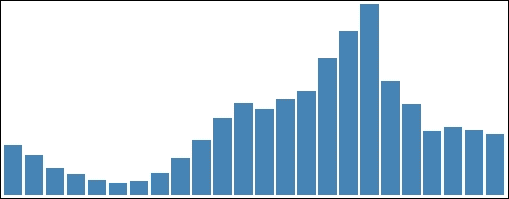
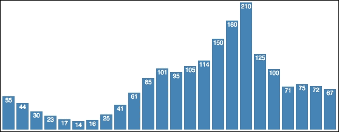
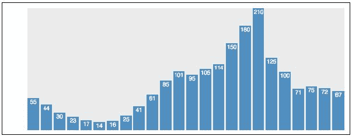
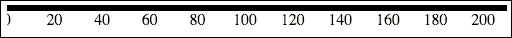
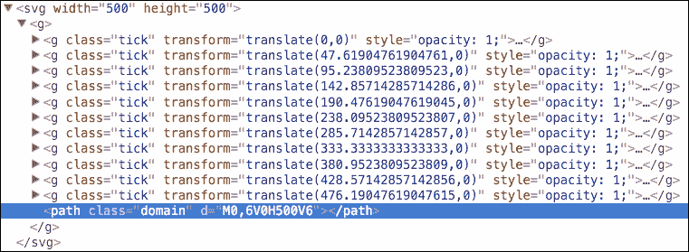
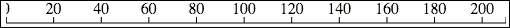
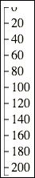
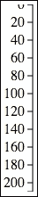
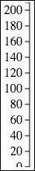
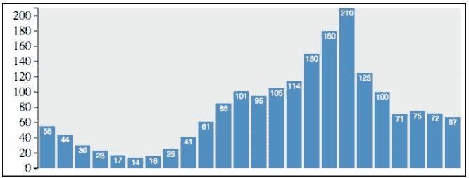

# 第四章。创建条形图

现在我们已经检查了绑定数据和用 D3 生成 SVG 视觉元素，我们将在本章中关注使用 SVG 创建条形图。本章的示例将使用一个静态整数数组，并使用该数据来计算条形的高度、位置，为条形添加标签，以及添加边距和坐标轴以帮助用户理解数据中的关系。

在本章中，我们将涵盖以下主题：

+   创建与数据绑定的条形系列

+   计算条形的位置和高度

+   使用组来均匀定位表示条形的多个元素

+   向图表添加边距

+   创建和操作坐标轴的样式和标签

+   向图表添加坐标轴

# 基本条形图

我们已经探讨了在第一、二、三章中基于数据绘制一系列条形所需的所有内容。本章的第一个例子将利用 SVG 矩形来绘制条形。我们现在需要做的是根据数据计算条形的大小和位置。

我们条形图的代码可在以下位置找到。在您的浏览器中打开此链接，我们将逐步讲解代码是如何创建随后的视觉效果的。

### 注意

bl.ock (4.1): [`goo.gl/TQo2sX`](http://goo.gl/TQo2sX)



代码从声明要表示为图的数据库开始。这个例子使用了一个硬编码的整数数组。我们将在本书的后面部分探讨更复杂的数据类型；现在，我们只是从这开始，以便熟悉绑定过程以及创建条形的过程：

```js
var data = [55, 44, 30, 23, 17, 14, 16, 25, 41, 61, 85,
            101, 95, 105, 114, 150, 180, 210, 125, 100, 71,
            75, 72, 67];
```

现在我们定义两个变量，分别定义每个条形的宽度和每个条形之间的间距：

```js
var barWidth = 15, barPadding = 3;
```

我们需要将每个条形的高度相对于数据中的最大值进行缩放。这是通过使用`d3.max()`函数来确定的。

```js
var maxValue = d3.max(data);
```

现在我们通过将其放置在文档的主体内部来创建主要的 SVG 元素，并分配一个宽度和高度，我们知道这将容纳我们的视觉元素。最后，作为一个将在整本书中使用的实践，我们将在 SVG 标签中附加一个顶级组元素。然后，我们将条形放置在这个组内，而不是直接放置在 SVG 元素中：

```js
var graphGroup = d3.select('body')
    .append('svg')
    .attr({ width: 1000, height: 250 })
    .append('g');
```

### 小贴士

我发现使用顶级组进行这种做法很有用，因为它便于在同一 SVG 中放置多个复杂的视觉元素，例如在创建仪表板的情况下。

在这个例子中，我们不会缩放数据，并假设容器是适当的大小以容纳图表。我们将在第五章中探讨更好的方法来做这件事，包括计算条形的位置，*使用数据和比例*。我们只是力求目前保持简单。

我们需要执行两步数学运算才能计算出条形的*x*和*y*位置。我们将这些条形定位在`graphGroup`的底部和左侧的像素位置。我们需要两个函数来计算这些值。第一个函数计算条形左侧的*x*位置：

```js
function xloc(d, i) { return i * (barWidth + barPadding); }
```

在绑定过程中，这将传递当前数据项及其在`data`数组中的位置。实际上我们不需要这个值来进行计算。我们只需根据数组位置计算条形宽度与填充之和的倍数。

由于 SVG 使用左上角为原点，我们需要计算从图表顶部到我们开始绘制条形向下到视觉底部位置的距离：

```js
function yloc(d) { return maxValue - d; }
```

当我们定位每个条形时，我们将使用一个 translate 变换，利用这些函数中的每一个。我们可以通过声明一个函数来实现这一点，该函数给定当前数据项及其数组位置，根据这些数据和函数返回计算出的 transform 属性字符串：

```js
function translator(d, i) {
    return "translate(" + xloc(d, i) + "," + yloc(d) + ")";
   }
```

现在我们需要做的是从数据中生成 SVG 视觉元素：

```js
barGroup.selectAll("rect")
    .data(data)
    .enter()
    .append('rect')
    .attr({
        fill: 'steelblue',
        transform: translator,
        width: barWidth,
        height: function (d) { return d; }
    });
```

只用几行代码就做得相当不错。但从图表中我们只能看出数据的相对大小。为了得到有效的数据可视化，我们需要比这更多的信息。

## 为条形添加标签

现在，我们将在每个条形的顶部添加一个标签，该标签包含数据项的值。此示例的代码可在以下链接找到：

### 注意

bl.ock (4.2): [`goo.gl/3ltkHT`](http://goo.gl/3ltkHT)

以下图像展示了生成的视觉效果：



为了实现这一点，我们将修改我们的 SVG 生成方式：

1.  每个条形都由一个 SVG 组而不是`rect`表示。

1.  在代表条形的每个组内部，我们添加一个 SVG 元素和一个文本元素。

1.  然后将该组定位，因此也定位了子元素。

1.  `rect`的大小设置如前，导致包含组扩展到相同的大小。

1.  文本相对于其包含组的左上角定位。

通过以这种方式将这些元素分组，我们可以重用之前的定位代码，并利用组定位所有条形子视觉元素的优势。此外，我们只需要根据它们自己的组来调整子元素的大小和位置，这使得数学运算非常简单。此代码与之前的示例通过声明定位函数是相同的。

第一个变化是在创建表示条形的选择器：

```js
var barGroups = g.selectAll('g')
    .data(data)
    .enter()
    .append('g')
    .attr('transform', translator);
```

代码现在不是创建`rect`，而是创建一个组元素。该组最初为空，并赋予将其移动到适当位置的变换。

使用`barGroups`引用的选择器，代码现在将`rect`追加到每个组中，同时设置适当的属性。

```js
barGroups.append('rect')
    .attr({
        fill: 'steelblue',
        width: barWidth,
        height: function(d) { return d; }
    });
```

下一步是添加一个 `text` 元素来显示数据的值。我们将把这个文本放置在条形的最上方，并在条形中居中。

为了实现这一点，我们需要一个表示条形中点偏移的平移变换。这对于每个条形都是常见的，因此我们可以定义一个可重复使用的变量：

```js
var textTranslator = "translate(" + barWidth / 2 + ",0)";
```

接下来，我们在每个组中添加一个文本元素，设置其文本（数据的字符串值）、适当的文本属性，最后是字体样式。

```js
barGroups.append('text')
    .text(function(d) { return d; })
    .attr({
        fill: 'white',
        'alignment-baseline': 'before-edge',
        'text-anchor': 'middle',
        transform: textTranslator
    })
    .style('font', '10px sans-serif');
```

这相当简单，而且条形上的标签看起来很漂亮，但我们的图表仍然非常需要轴。我们将在下一节中探讨如何添加这些轴。

# 边距和轴

在图表中添加轴将使读者更好地理解图表的范围和数据值之间的关系。D3.js 内置了非常强大的结构，允许我们创建轴。

D3.js 中的轴是基于另一个称为刻度的概念。虽然刻度本身非常有用（我们将在第五章使用数据和刻度中更详细地介绍刻度），但在本章的剩余部分，我们将探讨如何使用它们在我们的条形图中创建基本轴。

然而，在我们讨论轴之前，我们首先简要但重要地探讨一下边距的概念，以及为我们的条形图添加边距以留出空间的概念。

## 在条形图中创建边距

在图表中，边距有几个实际用途。它们可以用来在图表和其他页面内容之间提供空间，使读者在他们的可视化内容和其他内容之间有清晰的视线。然而，边距的实际用途是为一或多个边的可视化提供空间，以便提供轴。

以下图像展示了我们希望通过边距实现的效果：


灰色部分是我们将放置现有图表的位置。然后，根据我们决定使用的轴（左、上、右、下），我们需要在我们的可视化中为渲染这些轴提供空间。请注意，单个图表可以使用任何或所有边距为不同的轴，因此为所有这些构建代码是一个好习惯。

在 D3.js 应用中，这通常是通过一个称为 **边距约定** 的概念来执行的。我们将通过一个示例来展示如何使用这个概念为我们的图表添加边距。此外，我们不会使用布局的静态大小，而是将根据示例中的数据点的数量计算图表的高度和宽度。

要开始，请从以下信息框中加载示例。

### 注意

bl.ock (4.3): [`goo.gl/HTZ2NG`](http://goo.gl/HTZ2NG)

代码的结果可视化可以在以下图表中看到：



除了边距之外，这个例子还在图表后面的区域添加了一个灰色背景。这突出了用于图表的区域，并相对于添加的边距强调了它。它还在主要 SVG 元素周围添加了一个矩形，以突出其边界，因为它有助于我们看到添加到图形中的边距范围。

让我们逐步分析这个示例，并检查它与上一个示例有何不同。我们首先计算条形区域的实际宽度：

```js
var graphWidth = data.length * (barWidth + barPadding)
                 - barPadding;
```

现在我们声明一个代表我们边距大小的 JavaScript 对象：

```js
var margin = { top: 10, right: 10, bottom: 10, left: 50 };
```

使用这些值，我们可以计算整个可视化的总大小：

```js
var totalWidth = graphWidth + margin.left + margin.right;
var totalHeight = maxValue + margin.top + margin.bottom;
```

现在我们可以创建主要的 SVG 元素，并将其设置为所需的精确大小：

```js
    var svg = d3.select('body')
        .append('svg')
        .attr({ width: totalWidth, height: totalHeight });
```

为了视觉效果，以下代码添加了一个矩形，显示了主要 SVG 元素的边界：

```js
svg.append('rect').attr({
    width: totalWidth,
    height: totalHeight,
    fill: 'white',
    stroke: 'black',
    'stroke-width': 1
});
```

现在我们添加一个组来包含图形的主要部分：

```js
var graphGroup = svg
    .append('g')
    .attr('transform', 'translate(' + margin.left + ',' +
                                      margin.top + ")");
```

为了强调实际图形的区域，我们在组中添加了一个灰色的 `rect`：

```js
graphGroup.append('rect').attr({
    fill: 'rgba(0,0,0,0.1)', 
    width: totalWidth – (margin.left + margin.right),
    height: totalHeight - (margin.bottom + margin.top)
});
```

代码的其余部分保持不变。

到目前为止，我们已经在图形周围添加了边距，并在左侧为绘制坐标轴腾出了空间。在我们将其放入可视化之前，让我们先看看创建坐标轴的示例，以了解其中涉及的一些概念。

## 创建坐标轴

为了演示坐标轴的创建，我们将从创建一个适合放置在图形底部的坐标轴开始，称为**底部坐标轴**。这是 D3.js 默认创建的坐标轴类型。因此，我们将从这里开始，然后在查看一些与坐标轴相关的概念之后，再检查如何更改方向。

以下是我们将要逐步讲解的示例代码，它将生成后续的坐标轴：

### 注意

bl.ock (4.4): [`goo.gl/TyDAH6`](http://goo.gl/TyDAH6)



在我们的示例中，我们使用以下代码行创建比例和坐标轴：

```js
var scale = d3.scale
    .linear()
    .domain([0, maxValue])
    .range([0, width]);

var axis = d3.svg.axis().scale(scale);
svg.call(axis);
```

要创建坐标轴，我们首先需要使用 `d3.scale()` 创建一个**比例**对象。比例会告知坐标轴它将表示的值的范围（称为**域**），以及坐标轴在视觉中应该渲染的整体大小（称为**范围**）。在这个例子中，我们使用的是**线性**比例。线性比例会告知坐标轴，值将从较低值线性插值到较高值，在这种情况下，从 0 到 210。

### 注意

D3.js 比例除了用于坐标轴之外还有其他用途。我们将在第五章使用数据和比例中探讨这些用途。

然后使用 `d3.svg.axis()` 函数创建坐标轴，并通过调用 `.scale()` 方法传递比例。

坐标轴比例随后需要与一个选择关联，这通过使用 `.call()` 函数来完成。这通知 D3.js，当它渲染视觉元素时，应该调用坐标轴函数来渲染自身。

这种感觉与我们迄今为止创建视觉元素的方式略有不同。D3.js 使用这种技术，因为坐标轴是一组复杂的 SVG 元素，需要生成。`.call()` 的使用允许我们在渲染管道中将复杂的渲染逻辑分离成函数调用，D3.js 的设计就是为了以这种方式渲染坐标轴。

坐标轴上的标签是由 D3.js 自动生成的，并基于域的值。坐标轴的可视化大小由范围指定。在这种情况下，由于这是一个底部坐标轴，标签从 0 的最小值开始，D3.js 使用 20 的间隔来生成标签。最后一个适合的标签是 200，因此 D3.js 实际上并没有为 210 的最大值创建标签。

### 注意

在输出中，标签 0 被裁剪了。这是因为坐标轴位于 SVG 元素的左侧。这种方向使得轴上的线是平齐的。由于第一个标签的文本在刻度上是居中对齐的，其左半部分被裁剪了。这可以通过平移轻松修复，我们将在将坐标轴放置在我们图表旁边时进行考察。

使用开发者工具检查渲染后的坐标轴，你会看到 D3.js 在生成坐标轴上所付出的努力：



D3.js 所做的是为坐标轴上的每个刻度生成一个组，以及一个渲染坐标轴线的单个路径。每个刻度组本身由表示坐标轴刻度的线和刻度上的标签组成。

检查输出，你会注意到实际上我们没有在轴上看到任何刻度。这使你难以意识到与标签关联的实际坐标轴上的点。这是由于默认的样式造成的。我们将在下一节中使这个坐标轴看起来更好。

我们为什么看不到坐标轴上的刻度，是因为表示坐标轴的路径的默认厚度。我们可以通过简单地修改表示坐标轴的路径以及刻度的样式来更改它。

在你的浏览器中打开以下示例，了解如何完成这项任务：

### 注意

bl.ock (4.5): [`goo.gl/xmSf2g`](http://goo.gl/xmSf2g)


此代码进行了一些小的修改，以便能够像以下代码部分所示那样更改样式：

```js
var axisGroup = svg.append('g');
var axis = d3.svg.axis().scale(scale);

var axis = d3.svg.axis().scale(scale);
var axisNodes = axisGroup.call(axis);
var domain = axisNodes.selectAll('.domain');
domain.attr({
    fill: 'none',
    'stroke-width': 1,
    stroke: 'black'
});
var ticks = axisNodes.selectAll('.tick line');
ticks.attr({
    fill: 'none',
    'stroke-width': 1,
    stroke: 'black'
});
```

第一个变化是，我们创建了一个组，用变量 `axisGroup` 表示，来保存生成的坐标轴。这将用于选择表示刻度和坐标轴线的 SVG 元素，并更改它们的样式。

### 提示

总是将轴放入一个组中是一个好的做法。这有助于进行像我们在本例中执行的风格更改。此外，几乎总是需要将轴转换到可视化中的特定位置。轴本身不能转换，所以将其放入一个组元素中，然后转换组来完成这个任务。

其次，代码捕获了在 `axisNodes` 变量中生成的轴的节点。使用 `axisNode`，我们可以进行两个额外的选择来找到轴中的特定元素：一个用于具有 `domain` 类的元素，另一个用于具有 `line` 类的线条元素。使用这两个选择的每个结果，代码随后设置 `fill`、`stroke` 和 `stroke-width` 属性，使它们都变成一像素厚的黑色线条。

### 改变轴的方向

D3.js 轴可以使用 `.orient()` 函数渲染成四种不同的方向，该函数将方向名称传递给轴。以下表格显示了可以使用的方向名称：

| `'top'` | 水平轴，刻度和标签位于轴线的上方。 |
| --- | --- |
| `'bottom'` | 水平轴，刻度和标签位于轴线的下方（默认） |
| `'left'` | 垂直轴，刻度和标签位于轴线的左侧 |
| `'right'` | 垂直轴，刻度和标签位于轴线的右侧 |

实际上，这些都与图表的四个侧面之一有关，例如之前提到的边距。这个函数对轴在视觉中的位置没有影响（我们必须自己完成）。相反，它决定了轴线的水平或垂直，以及水平轴的标签是在顶部还是底部，或者垂直轴的标签是在左侧还是右侧。

为了演示这一点，我们将快速检查顶部、右侧和左侧的方向。打开以下链接查看顶部轴的示例：

### 注意

bl.ock (4.6): [`bl.ocks.org/d3byex/8791783ee37ab76a8517`](http://bl.ocks.org/d3byex/8791783ee37ab76a8517)

与前一个示例相比，这里有两个小的修改。主要变化是我们创建轴时调用了 `.orient('top')`：

```js
var axis = d3.svg.axis()
    .orient('top')
    .scale(scale);
```

第二个变化是我们需要将轴沿 *Y* 轴向下平移。我们使用以下语句来完成这个操作：

```js
axisGroup.attr('transform', 'translate(0,50)');
```

上述示例的结果如下：



方向的改变使得标签和刻度移动到了轴线的顶部而不是下方。

转换的需求可能稍微有点微妙。如果轴没有被转换，我们在渲染结果中看到的将是一条位于顶部的黑色线条。这是因为轴的位置是相对于绘制轴线的路径而言的。在这种情况下，线条将位于 *y = 0*，刻度和文本会被裁剪，因为它们位于线条之上且不可见。

现在打开以下示例的代码，它渲染了一个右侧方向的坐标轴。我们不会检查代码，因为它只是调用 `.orient('right')` 的一个简单更改。

### 注意

bl.ock (4.7): [`goo.gl/H16kEo`](http://goo.gl/H16kEo)

上述代码的结果如下：



以下示例演示了一个左侧方向的坐标轴。这又是一个简单的参数更改到 `.orient()`。此外，代码还将坐标轴向右移动一点，因为刻度和标签会被截断在左侧。

### 注意

bl.ock (4.8): [`goo.gl/CNEFyV`](http://goo.gl/CNEFyV)

结果如下：



## 反转坐标轴上的标签

我们想在条形图上放置一个左侧坐标轴，本质上就是示例 *4.8* 的输出。但如果你检查坐标轴，你会注意到标签是从上到下递增的。我们的图表在底部表示 **0**，值向上递增。这个坐标轴对我们图表来说不合适。

这种标签反转是代码中的一个非常简单的更改。打开以下示例：

### 注意

bl.ock (4.9): [`goo.gl/wsm9Ab`](http://goo.gl/wsm9Ab)

代码与示例 *4.8* 相同，除了一个更改。

```js
var scale = d3.scale
    .linear()
    .domain([maxValue, 0])
    .range([0, maxValue]);
```

我们更改传递给域的值的顺序，这将基本上反转标签的顺序。这给我们以下结果：



标签已经反转成我们想要的顺序。注意现在标签 0 在底部被截断。我们将在下一个示例中修复这个问题，当我们把坐标轴与条形图结合起来时。

## 将坐标轴添加到图表中

现在我们已经拥有了创建带有坐标轴的条形图所需的一切。基本上，我们只需要将示例 *4.3* 中的代码与示例 *4.9* 中的坐标轴代码结合起来。以下示例正是这样做的：

### 注意

bl.ock (4.10): [`goo.gl/MsKhUk`](http://goo.gl/MsKhUk)

结果如下所示，这正是我们想要的图表：



本示例中的代码与示例 *4.3* 中的代码相同，直到我们创建包含坐标轴的组为止：

```js
var leftAxisGroup = svg.append('g');
var axisPadding = 3;
leftAxisGroup.attr({ 
    transform: 'translate(' + (margin.left - axisPadding) + ',' 
                            + margin.top + ')' });
```

这里的更改是将坐标轴沿 *X* 轴平移左边缘的宽度，沿 *Y* 轴平移顶边缘的大小。为了美观，代码只是简单地用三个像素的填充渲染坐标轴。

### 注意

还要注意，由于我们在底部有边距空间，**0** 标签不再被截断。

# 摘要

在本章中，你扩展了使用 D3 从整数集合创建条形图的知识。你学习了如何根据数据定位和调整每个元素的大小，以及如何定位包含多个表示单个条形的多视觉数据组——具体来说，如何在条形的顶部添加表示底层数据的值的标签。

我们随后检查了 D3.js 中用于创建坐标轴的功能。我们介绍了比例的概念，这是实现坐标轴的一个重要方面。我们进一步探讨了坐标轴的不同方向，以及如何反转坐标轴上标签的顺序。最后，我们将坐标轴和条形图结合起来，有效地展示了数据可视化。

尽管我们的条形图在这个例子中看起来很棒，但我们仍然会面临几个问题。图表的整体大小与数据的实际值相关。这对于演示条形图可视化的构建是方便的，但如果我们处理的数据不是整数，或者数据值非常小或非常大呢？我们可能根本看不到条形，或者条形可能太大，以至于超过了主 SVG 元素的大小。

在下一章中，我们将通过学习更多关于比例的知识来解决这些问题。比例将提供一种特别简单的方法，将数据映射到可视化的物理尺寸。你还将了解如何从外部源加载数据，以及如何处理比简单整数结构更复杂的数据。
