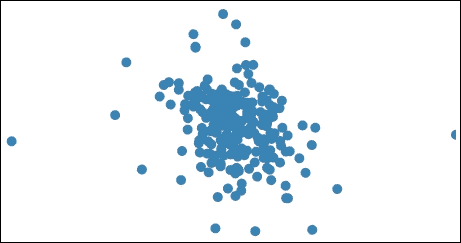
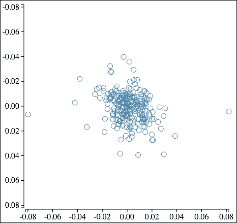
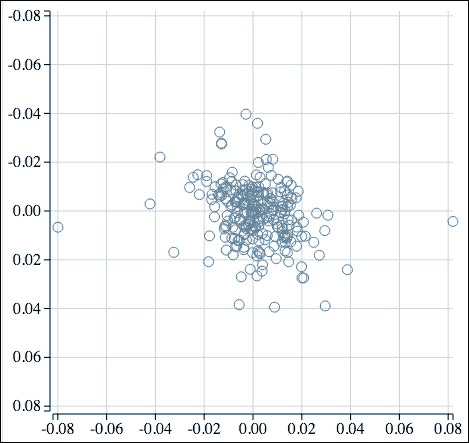
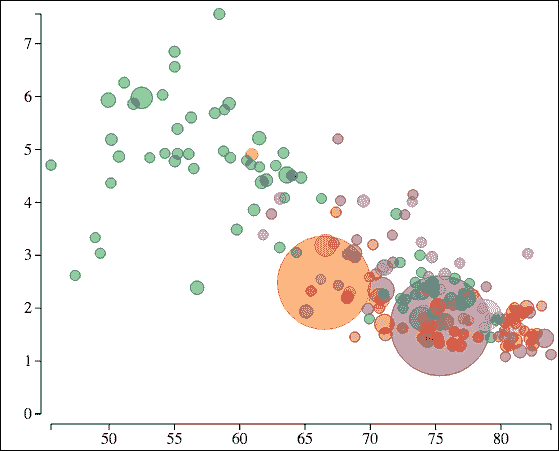

# 第六章：创建散点图和气泡图

在本章中，我们扩展了使用 D3.js 绘制数据的示例，以解释如何创建散点图和气泡图。与通过条形图可视化的单变量数据相比，散点图和气泡图可视化多变量数据。多变量数据由两个或更多变量组成，散点图使我们能够可视化两个变量，而气泡图将此扩展到三个或四个变量。

我们将首先创建一个简单的散点图，使用固定符号，基于股票相关性数据。我们开始使用实心圆作为符号，并将通过几个增强功能进行进展，包括使用颜色、轮廓和不透明度。我们将通过一个示例结束散点图，该示例使用多个重叠的数据集，每个数据集使用不同的符号和颜色。

当我们完成对气泡图创建的检查后，我们将扩展该示例以根据数据更改点的尺寸，然后根据分类信息着色点。最后一个示例将展示我们如何在单一的可视化中可视化四个不同的变量，以及视觉的使用如何帮助我们从底层信息中提取意义。

具体来说，在本章中，我们将涵盖以下主题：

+   使用固定大小和实心点创建基本散点图

+   使用轮廓而不是实心填充来使图表更易读

+   添加网格线以帮助确定点的位置

+   将散点图代码扩展到创建气泡图

# 创建散点图

散点图由两个轴组成，每个轴对应一个变量。每个轴可以是连续变量或分类变量。对于每个测量值（一个**测量值**是 *X* 和 *Y* 值的配对组合），在指定的位置在图上放置一个符号。最终结果是这样一个图，它允许观看者确定一个变量受另一个变量影响的程度。

我们前几个示例的基础将是一个数据集，该数据集表示 AAPL 和 MSFT 股票在 2014 年的每日相关性。为了创建散点图，这些数据的意义并不重要——它只是代表二维数据，其中每个股票的价值代表相应轴上的一个位置。

本例的数据可在[`goo.gl/BZkC8B`](https://goo.gl/BZkC8B)找到。

在浏览器中打开此链接，您将看到以下数据的前几行：

```js
Date,AAPL,MSFT
2014-01-02,-0.01406,-0.00668
2014-01-03,-0.02197,-0.00673
2014-01-06,0.00545,-0.02113
2014-01-07,-0.00715,0.00775
2014-01-08,0.00633,-0.01785
2014-01-09,-0.01277,-0.00643
2014-01-10,-0.00667,0.01435
2014-01-13,0.00524,-0.02941
2014-01-14,0.0199,0.02287
2014-01-15,0.02008,0.02739
```

## 绘制点

我们的第一个示例将演示在散点图中绘制点的过程。为了保持简单，它省略了轴和其他风格元素（这些将在下一个示例中添加）。

示例可在以下位置找到：

### 注意

bl.ock (6.1): [`goo.gl/Uv6aSj`](http://goo.gl/Uv6aSj)

结果图如下所示：



现在我们来检查这是如何创建的。示例首先加载数据：

```js
var url = "https://gist.githubusercontent.com/d3byex/520e6dcb30e673c149cc/raw/432623f00f6740021bdc13141612ac0b6196b022/corr_aapl_msft.csv";
d3.csv(url, function (error, rawData) {
```

### 注意

整个 URL 必须指定，因为显然，数据加载函数不会遵循重定向。

我们需要将 AAPL 和 MSFT 这两个属性从字符串转换为数字。我们通过创建一个新的包含`X`和`Y`属性的对象数组来实现这一点，其中 AAPL 映射到`X`，MSFT 映射到`Y`，这也转换了数据类型：

```js
    var data = rawData.map(function(d) {
        return { X: +d.AAPL, Y: +d.MSFT }
    });
```

为了有效地缩放散点图，我们需要知道`X`和`Y`系列中数据的范围：

```js
    var xExtents = d3.extent(data, function(d) { return d.X; });
    var yExtents = d3.extent(data, function(d) { return d.Y; });
```

这些值将帮助我们创建图表两个维度所需的刻度。实际上，这个图表将使用这四个范围的最大绝对值。我们可以用以下方法确定这个值：

```js
var maxExtent = d3.max(
    xExtents.concat(yExtents), 
    function(d) { return Math.abs(d); 
});
```

现在我们已经准备好创建图表的属性，包括其宽度、高度以及代表点的圆的半径大小：

```js
    var graphWidth = 400, graphHeight = 400;
    var radius = 5;
```

现在我们有了创建将数据映射到渲染位置所需的刻度所需的所有信息：

```js
    var scale = d3.scale.linear()
        .domain([-maxExtent, maxExtent])
        .range([0, graphWidth]);
```

### 注意

这个示例（以及本章剩余的部分）将数据缩放，使得域是范围绝对值的负数和正数。简单来说，这个刻度确保了当渲染到正方形画布时，所有点都是可见的，并且沿*X*维度的任何特定距离代表与沿*Y*维度相同的数据值的变化。

渲染开始于创建主要的 SVG 元素：

```js
    var svg = d3.select('body')
        .append('svg')
        .attr('width', graphWidth)
        .attr('height', graphHeight);
```

最后，我们创建一个指定半径的圆来代表每个点：

```js
    svg.selectAll('circle')
        .data(data)
        .enter()
        .append('circle')
        .attr({
            cx: function(d) { return xScale(d.AAPL); },
            cy: function(d) { return yScale(d.MSFT); },
            r: radius,
            fill: 'steelblue'
        });
}); // closing the call to d3.csv
```

恭喜你，你已经创建了你的第一个散点图！

## 整理散点图

在前一个示例的图表中存在几个问题。首先，注意有一个圆被剪切到右侧边界。按照当前的代码，一个点，即最大范围的点，将有它面积的一半被剪切。这可以通过包括至少为圆半径一半的边距来轻松解决。

另一个问题是有很多圆重叠，这会混淆数据的视觉理解。在散点图中解决这个问题的常见方法是不在圆中使用实心填充，而是简单地使用轮廓。

最后一个问题，实际上是一个为了保持前一个示例简单而做出的决定，那就是不要有任何坐标轴。以下链接中的示例解决了这些关注点：

### 注意

bl.ock (6.2): [`goo.gl/4T1aGZ`](http://goo.gl/4T1aGZ)

前面的示例有以下的输出：



这个结果是一个更有效的散点图。我们可以理解之前被遮挡的点，坐标轴也给我们每个点的值提供了一个感觉。

代码的更改相对较小。除了使用我们在其他示例中看到的代码添加轴（包括为各种主要元素分组）以及调整主 SVG 元素的大小以适应这些轴之外，唯一的更改是在创建圆圈的方式上：

```js
graphGroup.selectAll('circle')
    .data(data)
    .enter()
    .append('circle')
    .attr({
        cx: function(d) { return scale(d.X); },
        cy: function(d) { return scale(d.Y); },
        r: radius,
        fill: 'none',
        stroke: 'steelblue'
    });
```

### 添加网格线

如果我们的散点图有网格线，那么它将更加有效。在 D3.js 中添加网格线到图表的方式实际上是一个小技巧：网格线实际上是轴的刻度，刻度是图形的宽度和高度，其中轴的标签和主线都被隐藏了。

要在我们的图表中添加网格线，我们将创建两个额外的轴。水平网格线将通过创建一个位于右侧边距的左向轴来渲染。我们将设置这个轴的标签为空，并将轴的线隐藏。然后刻度的大小被设置为延伸到左侧边距的另一个轴。我们将执行一个类似的过程来创建垂直网格线，除了将底部轴放置在顶部边距。

### 注意

bl.ock (6.3): [`goo.gl/ZmrY4H`](http://goo.gl/ZmrY4H)

结果图如下所示：



与前一个示例的唯一区别是创建这些新轴的几行代码和一个用于样式化的函数：

```js
var yGridlinesAxis = d3.svg.axis().scale(scale).orient("left");
var yGridlineNodes = svg.append('g')
    .attr('transform', 'translate(' + (margins.left + graphWidth)
                       + ',' + margins.top + ')')
    .call(yGridlinesAxis
          .tickSize(graphWidth + axisPadding, 0, 0)
          .tickFormat(""));
styleGridlineNodes(yGridlineNodes);
```

代码开始于创建一个左向轴，然后在一个被平移到右侧边距的组中渲染它。

我们不是简单地通过`.call()`传递轴对象，而是首先调用它的两个函数。第一个是`.tickSize()`，它设置刻度的大小以跨越将要渲染点的整个区域。调用`.tickFormat("")`通知轴标签应为空。

现在我们只需要对轴进行一点样式化。这是通过`styleGridLineNodes()`函数完成的：

```js
function styleGridlineNodes(axisNodes) {
    axisNodes.selectAll('.domain')
        .attr({
            fill: 'none',
            stroke: 'none'
        });
    axisNodes.selectAll('.tick line')
        .attr({
            fill: 'none',
            'stroke-width': 1,
            stroke: 'lightgray'
        });
}
```

这设置了轴主线的填充和描边，使其不可见。然后使实际的刻度变为浅灰色。

垂直网格线是通过一个类似的过程创建的：

```js
var xGridlinesAxis = d3.svg.axis().scale(scale).orient("bottom");
var xGridlineNodes = svg.append('g')
    .attr('transform', 'translate(' + margins.left + ',' + 
            (totalHeight - margins.bottom + axisPadding) + ')')
    .call(xGridlinesAxis
          .tickSize(-graphWidth - axisPadding, 0, 0)
          .tickFormat(""));
styleGridlineNodes(xGridlineNodes);
```

关于这个过程的最后一点是渲染的顺序：网格线，然后是轴，然后是点。这确保了这些元素中的每一个都出现在其他元素之上。最重要的是点要位于网格线和轴之上，但网格线也位于可见轴的后面是一种良好的实践。这给你在网格线上留出了一些微调的空间。

# 创建气泡图

气泡图帮助我们可视化三个或四个维度的数据。气泡图中的每个数据点不仅由用于与 X 轴和 Y 轴作图的两个值组成，还包括一个或两个额外的值，这些值通常通过不同大小的符号和/或颜色来表示。

为了演示气泡图，以下图像显示了我们的示例结果：



此图表背后的数据是从世界银行的三个不同数据集中汇总而来的数据集。这些数据关联了 2013 年世界银行数据中所有国家的出生预期寿命与出生率。

此图表沿*X*轴绘制年龄，沿*Y*轴绘制出生率。一个国家的相对人口由圆圈的大小表示，圆圈的颜色代表由世界银行按类别划分的国家经济区域。

我们不会深入探讨这些数据。它们可在[`goo.gl/K3yuuy`](https://goo.gl/K3yuuy)找到。

数据的前几行如下：

```js
CountryCode,CountryName,LifeExp,FertRate,Population,Region
ABW,Aruba,75.33217073,1.673,102911,Latin America & Caribbean
AFG,Afghanistan,60.93141463,4.9,30551674,South Asia
```

### 注意

如果你想查看原始数据，可以使用以下链接：

+   出生时的预期寿命（年）：[`data.worldbank.org/indicator/SP.DYN.LE00.IN`](http://data.worldbank.org/indicator/SP.DYN.LE00.IN)

+   出生率：[`data.worldbank.org/indicator/SP.DYN.TFRT.IN`](http://data.worldbank.org/indicator/SP.DYN.TFRT.IN)

+   总人口：[`data.worldbank.org/indicator/SP.POP.TOTL`](http://data.worldbank.org/indicator/SP.POP.TOTL)

示例的代码可在以下链接找到：

### 注意

bl.ock（6.4）：[`goo.gl/KQJceE`](http://goo.gl/KQJceE)

示例从加载数据和转换数据类型开始：

```js
var url = "https://gist.githubusercontent.com/d3byex/30231953acaa9433a46f/raw/6c7eb1c562de92bdf8d0cd99c6912048161c187e/fert_pop_exp.csv";
    var data = rawData.map(function(d) {
        return {
            CountryCode: d.CountryCode,
            CountryName: d.CountryName,
            LifeExp: +d.LifeExp,
            FertRate: +d.FertRate,
            Population: +d.Population,
            Region: d.Region
        }
    });
```

现在我们定义了几个变量来定义最小和最大气泡大小以及边距，我们将它们设置为最大气泡半径的一半：

```js
var minBubbleSize = 5, maxBubbleSize = 50;
var margin = { left: maxBubbleSize/2, top: maxBubbleSize/2,
               bottom: maxBubbleSize/2, right: maxBubbleSize/2
};
```

此特定图表需要基于以下四个数据系列的三条线性尺度和一个顺序尺度：

```js
var lifeExpectancy = data.map(function(d) { return d.LifeExp; });
var fertilityRate = data.map(function(d) { return d.FertRate; });
var population = data.map(function(d) { return d.Population; });
var regions = data.map(function(d) { return d.Region; });
```

*X*轴的尺度将从最小预期寿命到最大预期寿命：

```js
var xScale = d3.scale.linear()
    .domain([d3.min(lifeExpectancy), d3.max(lifeExpectancy)])
    .range([0, graphWidth]);
```

*Y*轴的范围将从顶部的最大出生率到底部的`0`：

```js
var yScale = d3.scale.linear()
    .domain([d3.max(fertilityRate), 0])
    .range([0, graphHeight]);
```

每个气泡的大小代表人口，半径范围将从之前配置的最小值到最大值：

```js
var popScale = d3.scale.linear()
    .domain(d3.extent(population))
    .range([minBubbleSize, maxBubbleSize]);
```

每个气泡的颜色将基于地区的值。为此，我们为每个独特的地区名称和 10 色分类尺度之间建立映射：

```js
var uniqueRegions = d3.set(regions).values();
var regionColorMap = d3.scale.ordinal()
    .domain(uniqueRegions)
    .range(d3.scale.category10().range());
```

现在我们可以开始渲染视觉效果，从轴开始：

```js
var yAxis = d3.svg.axis().scale(yScale).orient('left');
var yAxisNodes = svg.append('g')
    .attr('transform', 'translate(' + 
          (margin.left - axisPadding) + ',' + margin.top + ')')
    .call(yAxis);
styleAxisNodes(yAxisNodes);

var xAxis = d3.svg.axis().scale(xScale).orient('bottom');
var xAxisNodes = svg.append('g')
    .attr('transform', 'translate(' + margin.left + ',' +
          (totalHeight - margin.bottom + axisPadding) + ')')
    .call(xAxis);
styleAxisNodes(xAxisNodes);
```

最终任务是渲染气泡：

```js
svg.append('g')
    .attr('transform', 'translate(' + margin.left + ',' +
                                      margin.top + ')')
    .selectAll('circle')
    .data(data)
    .enter()
    .append('circle')
    .each(function(d) {
        d3.select(this).attr({
            cx: xScale(d.LifeExp),
            cy: yScale(d.FertRate),
            r: popScale(d.Population),
            fill: regionColorMap(d.Region),
            stroke: regionColorMap(d.Region),
            'fill-opacity': 0.5
        });
    });
```

# 摘要

在本章中，我们汇集了创建散点图和气泡图的几个示例。你学习了使用轴来组织表示两个到四个不同维度的数据的技术，其中两个维度使用轴，然后使用颜色和点的大小作为另外两个。

在下一章中，我们将从动画开始。我们将从动画的基础开始，到本章结束时，我们将扩展本章的最终示例，并使用动画来表示一个额外的维度，第五维度——时间。
