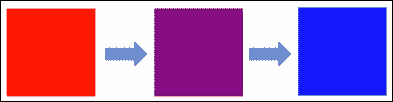
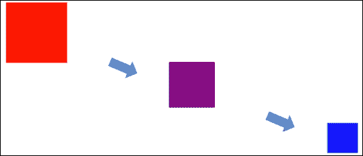
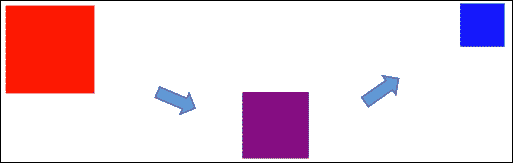
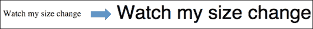
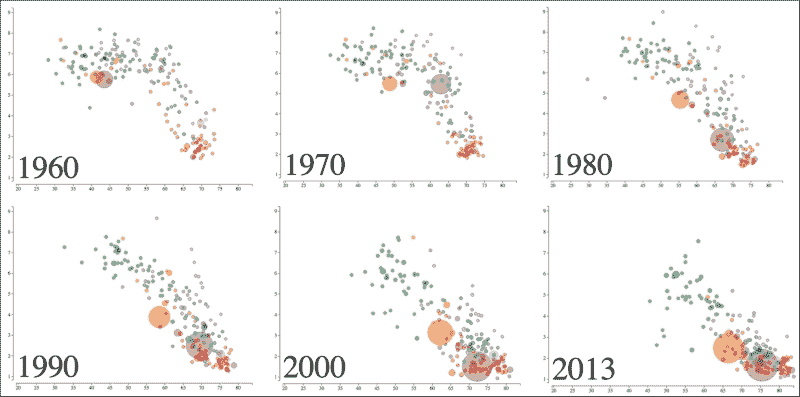

# 第七章。创建动画可视化

现在，我们将探讨使用 D3.js 转换来表示视觉信息下的变化。我们将从几个概念的示例开始，这些概念涉及使用 D3.js 动画化视觉元素从一个状态到另一个状态的性质。

到本章结束时，我们将从第六章，*创建散点图和气泡图*，扩展气泡可视化，以展示我们如何随着通过多年的数据移动来动画化我们的气泡。这将展示一个相对复杂的动画构建过程，用户可以轻松地从中推断出信息中的趋势。

在本章中，我们将通过以下示例涵盖以下主题：

+   使用转换进行动画

+   动画矩形填充颜色

+   同时动画化多个属性

+   延迟动画

+   创建链式转换

+   处理转换的开始和结束事件

+   使用缓动改变文本的内容和大小

+   使用定时器安排动画的步骤

+   通过动画添加气泡图的第五维：时间

# 动画简介

D3.js 提供了广泛的动画化可视化能力。通过使用动画，我们可以为观众提供一种理解数据随时间变化的方式。

在 D3.js 中，动画全部关于随时间改变视觉对象的属性。当这些属性改变时，DOM 被更新，视觉被修改以表示新的状态。

为了动画化属性，D3.js 提供了以下能力，我们将对其进行检查：

+   转换

+   插值器和缓动

+   缓动

+   定时器

## 使用转换进行动画

D3.js 动画通过**转换**的概念实现。转换提供指令和信息给 D3.js，以便在特定的时间段内改变一个或多个视觉属性值。

当 D3.js 在一个视觉元素上开始转换时，它会计算正在转换的元素的初始样式和结束样式。这些通常被称为开始和结束**关键帧**。每个关键帧是一组你可以指定为动画一部分的样式和其他属性。然后 D3.js 将这些属性从起始值动画化到结束值。

### 动画矩形填充颜色

为了演示转换的实际操作，我们将从一个示例开始，并动画化矩形的颜色从一种颜色转换到另一种颜色。此示例的代码可在以下链接找到：

### 注意

bl.ock (7.1)：[`goo.gl/oNJOQ9`](http://goo.gl/oNJOQ9)

在此示例中，我们首先创建以下 SVG 矩形，并将其初始 `fill` 设置为 `red`，然后在五秒内过渡到 `blue` 颜色。

运行示例时，您将看到一个矩形在五秒内从红色变为蓝色。在这段时间内，它平滑地通过中间颜色，如紫色，正如以下图像所示：



此代码的主要部分负责动画，它首先创建矩形并将其初始颜色设置为红色：

```js
svg.append('rect')
    .attr({
        x: '10px',
        y: '10px',
        width: 80,
        height: 80,
        fill: 'red'
    })
    .transition()
    .duration(5000)
    .attr({ fill: 'blue' });
```

`.transition()` 调用通知 D3.js 我们想要过渡 `rect` 元素的一个或多个属性，这些属性是通过调用 .style() 或 .attr() 对 rect 元素的属性所做的更改。

`.transition()` 调用指示 D3.js 跟踪使用 `.style()` 或 `.attr()` 调用对 SVG 元素的属性所做的任何更改。

在这种情况下，我们指定矩形的 `fill` 在过渡结束时应该是 `blue`。D3.js 使用此信息来计算起始和结束关键帧，跟踪矩形上的填充应该从红色变为蓝色。

当这些元素的渲染开始时，D3.js 也会开始动画，并在指定期间平滑地改变填充属性。

### 同时动画多个属性

在过渡期间可以对对象上的多个属性进行动画。要完成此操作，只需在 `.transition()` 调用之后设置多个属性即可。

例如，以下代码在五秒内动画化矩形的定位和大小：

### 注意

bl.ock (7.2): [`goo.gl/2qG0EV`](http://goo.gl/2qG0EV)

代码扩展了之前的示例，不仅动画化填充，还将位置改变为使矩形沿对角线移动，并修改大小，使矩形在过渡结束时宽度和高的一半：

```js
svg.append('rect')
    .attr({
        x: 10,
        y: 10,
        width: 80,
        height: 80,
        fill: 'red'
    })
    .transition()
    .duration(5000)
    .attr({
        x: 460,
        y: 150,
        width: 40,
        height: 40,
        fill: 'blue'
    });
```

结果动画看起来如下所示，其中矩形沿着箭头的路径移动，同时改变颜色和大小：



### 延迟过渡

如果您不想动画立即开始，可以使用延迟。延迟将过渡的开始延迟指定的时间。

以下示例将过渡的开始延迟一秒，然后运行四秒的过渡，总共完成五秒的过渡。

### 注意

bl.ock (7.3): [`goo.gl/Vyd6Pd`](http://goo.gl/Vyd6Pd)

之前示例的代码与之前的代码相同，除了以下行：

```js
.transition()
.delay(1000)
.duration(4000)
```

### 创建链式过渡

单个过渡只改变一组关键帧之间的属性。然而，可以将过渡链接起来，以提供多个动画序列。以下示例演示了两个过渡的链接（以及开始时的延迟）。

### 注意

bl.ock (7.4): [`goo.gl/IfYJmY`](http://goo.gl/IfYJmY)

第一个转换执行了二秒钟，并使矩形的大小、颜色和位置动画化到 SVG 区域的中间。然后第二个转换将矩形移动到右上角，持续另外二秒钟，同时继续改变其颜色和大小。总的执行时间保持为五秒钟：

```js
svg.append('rect')
    .attr({
        x: 10,
        'y': 10,
        width: 80,
        height: 80,
        fill: 'red'
    })
    .transition()
    .delay(1000)
    .duration(2000)
    .attr({
        x: 240,
        y: 80,
        width: 60,
        height: 60,
        fill: 'purple'
    })
    .transition()
    .duration(2000)
    .attr({
        width: 40,
        height: 40,
        x: 460,
        y: 10,
        fill: 'blue'
    });
```



### 处理转换的开始和结束事件

使用 `.each()` 函数可以处理转换的开始和结束事件。这对于确保转换的开始或结束样式与您期望的完全一致非常有用。当插值器（下一节将介绍）达到精确的预期值时，这可能会成为一个问题，此时起始值直到动画运行时才知道，或者存在需要解决的浏览器特定问题。

### 注意

浏览器问题的例子之一是透明颜色被表示为 `rgba(0,0,0,0)`。这是黑色，但完全透明。然而，使用这种颜色进行的动画始终以完全不透明的黑色开始。可以使用开始事件来修复动画开始时的颜色。

以下示例通过修改前一个示例，展示了如何连接到第一个转换的开始事件和第二个转换的结束事件：

### 注意

bl.ock (7.5): [`goo.gl/746hLo`](http://goo.gl/746hLo)

在此示例中，有两个基本的变化。第一个转换的开始事件的处理改变了矩形颜色为绿色。这导致矩形在延迟结束后从红色闪烁到绿色：

```js
.each('start', function() {
    d3.select(this).attr({ fill: 'green' });
})
```

以下代码显示了第二个变化，它将矩形在第二个动画结束时变为黄色：

```js
.each('end', function() {
    d3.select(this).attr({ fill: 'yellow' });
});
```

注意，当使用 `.each()` 函数时，被调用的函数会失去选择上下文，并且不知道当前项。我们可以通过调用 `d3.select(this)` 来恢复这一点，它将返回函数正在应用到的当前数据。

### 注意

根据我的经验，我发现转换前后属性的设置必须使用一致的符号。如果你在转换之前使用 `.style()`，然后在之后使用 `.attr()`，即使是在相同的属性上，该属性上的转换也不会工作。所以，如果你在 `.transition()` 之前使用 `.style()`，确保在之后使用 `.style()`（反之亦然对于 `.attr()`）。

## 使用缓动改变文本的内容和大小

**缓动**为 D3.js 提供了一种在转换期间计算属性值的方式，而不需要 D3.js 跟踪关键帧。当动画化大量项目时，关键帧可能会成为性能问题，因此缓动在这种情况下非常有帮助。

缓动动画给了我们连接自己的**插值器**的机会，在动画的每个步骤中提供值。插值器是一个函数，它接收一个介于 0.0 和 1.0 之间的单个值，该值表示过渡完成的当前百分比。插值器的实现然后使用此值来计算该时间点的值。

我们将探讨两个缓动动画的示例。第一个示例可在以下链接中找到，它在一个十秒的周期内将文本项的值从 0 动画到 10：

### 注意

bl.ock (7.6): [`goo.gl/SlWBdp`](http://goo.gl/SlWBdp)

这实际上是一些不能使用属性动画来完成的事情。我们必须调用 DOM 元素的`.text()`函数来设置文本，因此我们不能使用那种技术来动画化内容的改变。我们必须使用缓动动画。以下示例代码片段创建了一个在动画过程中设置文本内容的缓动动画：

```js
svg.append('text')
    .attr({ x: 10, y: 50 })
    .transition()
    .duration(10000)
    .tween("mytween", function () {
        return function(t) {
            this.textContent = d3.interpolateRound(0, 10)(t);
        }
    });
```

`.tween()`的第一个参数只是这个缓动的名称。第二个参数是一个工厂函数，它返回一个函数给 D3.js，该函数将在过渡的每个步骤中被调用，传递给它过渡完成的当前百分比。

工厂函数在动画开始时为每个数据项调用一次。它返回的函数会被重复调用，并使用`d3.interpolateRound()`函数根据`t`的值返回介于 0 和 10 之间的舍入数字。

D3.js 提供了一些插值函数，例如：

+   `d3.interpolateNumber`

+   `d3.interpolateRound`

+   `d3.interpolateString`

+   `d3.interpolateRgb`

+   `d3.interpolateHsl`

+   `d3.interpolateLab`

+   `d3.interpolateHcl`

+   `d3.interpolateArray`

+   `d3.interpolateObject`

+   `d3.interpolateTransform`

+   `d3.interpolateZoom`

D3.js 还有一个函数`d3.interpolate(a, b)`，它根据最终值`b`的类型，从上一个列表中返回适当的插值函数，使用以下算法：

+   如果`b`是一个颜色，则使用`interpolateRgb`

+   如果`b`是一个字符串，则使用`interpolateString`

+   如果`b`是一个数组，则使用`interpolateArray`

+   如果`b`是一个对象且不能转换为数字，则使用`interpolateObject`

+   否则，使用`interpolateNumber`

要演示`d3.interpolate()`和一些底层智能，请打开以下示例：

### 注意

bl.ock (7.7): [`goo.gl/792lpH`](http://goo.gl/792lpH)

此示例使用`.styleTween()`函数来改变文本样式的字体属性，在五秒内将字体大小从 12 px 增加到 36 px。



```js
svg.append("text")
    .attr({ x: 10, y: 50 })
    .text('Watch my size change')
    .transition()
    .duration(5000)
    .styleTween('font', function() {
        return d3.interpolate('12px Helvetica', '36px Helvetica');
    });
```

`.styleTween()` 函数的操作方式与 `.tween()` 类似，除了第一个参数指定了将被设置为通过工厂方法提供的插值函数返回的值的属性名称。还有一个 `.attrTween()` 函数，它执行相同的操作，但是在属性上而不是在样式上。

`d3.interpolate()` 函数足够智能，可以确定应该使用 `d3.interpolateString()`，并且可以识别出这两个字符串代表字体大小和名称，除了执行适当的插值。

## 定时器

D3.js 使用定时器来管理过渡，这些定时器内部安排代码在特定时间运行。这些定时器也对外公开供你使用。

使用 `d3.timer(yourFunction, [delay], [mark])` 可以创建一个定时器，它接受一个要调用的函数、一个延迟和一个起始时间。这个起始时间被称为 **mark**，其默认值为 `Date.now`。

D3.js 定时器不是以固定间隔执行——它们不是周期性定时器。定时器在 `mark + delay` 指定的时间开始执行。然后，D3.js 将尽可能频繁地调用该函数，直到它调用的函数返回 `true`。

使用 `mark` 和 `delay` 可以允许非常具体地声明启动执行的时间。例如，以下命令安排了一个在 2015 年 9 月 1 日之前四小时的事件：

```js
d3.timer(notify, -4 * 1000 * 60 * 60, +new Date(2015, 09, 01));
```

要实现一次性定时器，只需在函数第一次调用时返回 `true`。

关于定时器的最后一点，如果你想定期使用定时器来提醒你，通常更好的做法是使用 JavaScript 内置的 `setInterval()` 函数。我们将在下一节中检查定期使用定时器。

# 在气泡图中添加第五维——时间

现在让我们将我们所学到的关于动画的知识应用到一些真实数据上。我们将回顾第六章中关于创建散点图和气泡图的气泡图可视化，从单一年份（2013）的数据集扩展到所有可用的年份（1960 年至 2013 年）。我们将修改视觉呈现，使其定期更新并基于数据值的变化将气泡动画到新的位置和大小。

扩展的数据集可在[`goo.gl/rC5WS0`](https://goo.gl/rC5WS0)找到。基本区别是包含了一个年份列，以及涵盖 54 年的数据。

示例的代码和演示可在以下链接找到：

### 注意

bl.ock (7.7): [`goo.gl/iYCNbG`](http://goo.gl/iYCNbG)

当你运行这个命令时，你会看到数据随年份变化的平滑动画。显然，在像书籍这样的静态媒介中很难有效地展示这一点。但为了演示，我在每个十年开始时提供了可视化的截图，除了 2010 年，它被替换为 2013 年：



随着年份的推进，所有国家都有向增加预期寿命以及降低生育率的方向发展的强烈趋势。不同国家的发展速度不同。但它确实给人一种强烈的印象，即某种正在发生的事情导致了这种效果。由于在气泡图中添加了时间这一额外维度，解读图表变得更加容易。

现在我们来检查这是如何在示例中实现的。大部分代码与第六章中的示例相同，即*创建散点图和气泡图*，它基于此示例。由于 URL 不同以及需要处理数据中的`Year`列，因此数据的加载和清洗略有不同：

```js
var url = "https://gist.githubusercontent.com/d3byex/8fcf43e446b1e4dd0146/raw/7a11679cb4a810061dee660be0d30b6a9fe69f26/lfp_all.csv";
d3.csv(url, function (error, rawData) {
    var data = rawData.map(function (d) {
        return {
            CountryCode: d.CountryCode,
            CountryName: d.CountryName,
            LifeExp: +d.LifeExp,
            FertRate: +d.FertRate,
            Population: +d.Population,
            Region: d.Region,
            Year: d.Year
        };
    });
```

我们将逐个渲染每年的数据。作为这个过程的一部分，我们只需要提取每个特定年份的数据。我们可以以多种方式做到这一点。D3.js 提供了一个非常强大的函数来帮我们完成这个任务：`d3.nest()`。此函数将`Year`列旋转为关联数组的索引：

```js
var nested = d3.nest()
    .key(function (d) { return d.Year; })
    .sortKeys(d3.ascending)
    .map(data);
```

我们可以使用数组语义（如`nested[1975]`）访问特定年份的所有数据，这将给我们 1975 年的数据（只有行）。

### 注意

更多关于`d3.nest()`的信息，请参阅[`github.com/mbostock/d3/wiki/Arrays#-nest`](https://github.com/mbostock/d3/wiki/Arrays#-nest)。

代码在创建轴时保持一致。接下来新的代码片段是在图表上添加一个文本标签来显示数据所代表的年份。这个标签位于将要渲染气泡的区域左下角：

```js
var yearLabel = svg.append('g')
    .append('text')
    .attr('transform', 'translate(40, 450)')
    .attr('font-size', '75');
```

然后创建一个组来包含气泡。渲染函数将在每次被调用时选择这个组：

```js
var bubblesHolder = svg.append('g');
```

这标志着渲染和动画气泡的代码的开始。它首先声明了每个年份应该绘制的间隔（每秒 10 次）：

```js
var interval = 100;
```

由于气泡必须反复渲染，我们创建了一个函数，可以调用以仅渲染指定年份的气泡：

```js
function render(year) {
    var dataForYear = nested[year];

    var bubbles = bubblesHolder
        .selectAll("circle")
        .data(dataForYear, function (datum) { 
             return datum.CountryCode; 
        });

    bubbles.enter()
        .append("circle")
        .each(setItemAttributes);

    bubbles
        .transition()
        .duration(interval)
        .each(setItemAttributes);

    bubbles.exit().remove();

    yearLabel.text(year);
};
```

此函数首先提取特定年份的行，然后将数据绑定到`bubblesHolder`组中的圆圈。对`.data()`的调用还指定了`CountryCode`将用作键。这非常重要，因为当我们从一年移动到另一年时，D3.js 将使用此键将现有的气泡映射到新数据，并基于此键做出决策，以确定如何进入-更新-退出圆圈。

下一个语句执行 enter 函数，创建新的圆圈并调用一个函数来设置圆圈的各个属性：

```js
function setItemAttributes(d) {
    d3.select(this).attr({
        cx: xScale(d.LifeExp),
        cy: yScale(d.FertRate),
        r: popScale(d.Population),
        style: "fill:" + regionColorMap(d.Region) + ";" +
            "fill-opacity:0.5;" +
            "stroke:" + regionColorMap(d.Region) + ";"
    });
};
```

我们使用一个函数，因为代码也用它来更新。最后，偶尔会有一个国家从数据中消失，所以我们将删除任何在这种情况下的气泡。

我们需要做的最后一件事是执行时间动画。这是通过在指定间隔内迭代每个年份来完成的。为此，我们需要知道起始年份和结束年份，我们可以通过以下方式获得：

```js
var minYear = d3.min(data, function (d) { return d.Year; });
var maxYear = d3.max(data, function (d) { return d.Year; });
```

这一步是设置一个变量来表示当前年份，并渲染该年份：

```js
var currentYear = minYear;
render(currentYear);
```

现在我们创建一个由计时器调用的函数。这个函数返回另一个函数，它增加年份，如果年份小于最大年份，则再次调用渲染，然后安排另一个计时器实例以毫秒为间隔运行。这种模式有效地使用了一系列 D3.js 计时器来实现周期性计时器：

```js
var callback = function () {
    return function () {
        currentYear++;
        console.log(currentYear);
        if (currentYear <= maxYear) {
            render(currentYear);
            d3.timer(callback(), interval);
        }
        return true;
    }
}
```

### 注意

注意，此代码每次调用时都返回`true`。这使得它成为一个一次性计时器。但在返回`true`之前，如果我们需要渲染另一年，我们将启动另一个计时器。

最后要完成的事情是启动计时器：

```js
d3.timer(callback(), interval);
```

# 摘要

在本章中，你学习了 D3.js 中动画的基础知识，并在本章结束时，将这些简单概念应用于制作看似非常复杂的数据可视化。

我们从过渡的例子开始，使用它们在一段时间内将属性从一个状态动画到另一个状态，并将动画链接在一起。接下来，我们探讨了不使用关键帧处理动画的方法，即使用 tweening。我们还快速浏览了插值的概念。

我们通过检查计时器结束，然后应用本章的所有概念，逐步渲染大量数据，给可视化观看者一种通过动画时间来观察数据变化的感觉。

在下一章中，我们将探讨当用户与应用程序交互时更改视觉效果的技巧，学习基于交互事件的数据拖拽和过滤等概念。
