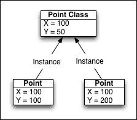
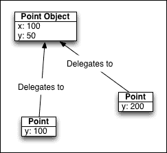
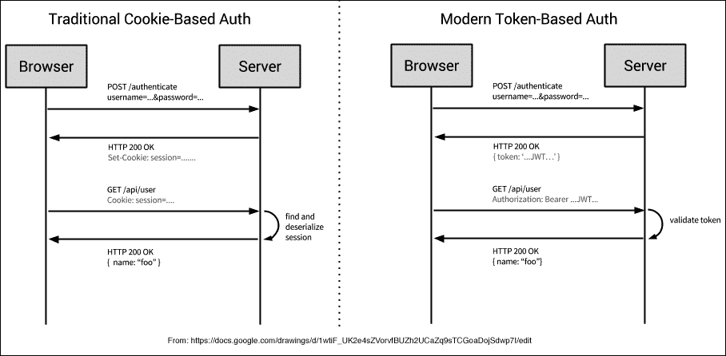

# 第四章 管理内存和空间

今天的开发者可以轻松访问令人惊讶的低成本存储解决方案。从单体系统向由多个组件组成的分布式系统的转变具有某些优势，但不可避免地引入了一些新问题。例如，便宜的存储不应成为将所有东西无限制地推入内存或磁盘的借口。此外，在这种系统中状态存储在哪里？服务器集群是否共享一个公共数据库连接？在这种设置中数据是如何同步的？如果你使用的是*无共享的 NoSQL*架构，状态变化是如何在所有参与者之间通信的？

有许多需要考虑的因素。始终寻求使用最少的资源是一个好的指导原则。在本章中，我们将探讨降低 Node 程序中数据存储成本的方法，包括编写高效、优化代码的技巧。将讨论一些在分布式服务器之间高效共享数据的策略，包括缓存策略、微服务、进程间消息传递以及其他保持系统快速、轻量级和可扩展的技术。使用令牌高效管理用户会话数据以及使用 Redis 紧凑地存储大量用户活动数据的示例将帮助您将这些想法付诸实践。

# 应对大量人群

由于 Node 被设计用来简化网络应用程序的编写，因此使用 Node 的人通常在构建由许多通过消息队列、套接字、REST API 等连接的独立服务组成的应用程序。我将这些描述为由独立服务组成、通过网络耦合和协调的系统，这些系统对客户端来说似乎是集成的。在本节及随后的章节中，我们将考虑如何设计独立服务以实现内存效率，并具有较小的占用空间。

在本节及随后的内容中，当提到由许多小型协作服务组成的应用架构时，我们将使用**微服务**这个词。通常，我们将探讨如何通过维护表达性、可扩展性和可测试的系统来帮助系统保持可理解性，从而常常有助于保持系统不变得难以理解。

然后，我们将通过使用 Richard Rogers 为 Node 编写的微服务工具包**Seneca** ([`github.com/rjrodger/seneca`](https://github.com/rjrodger/seneca))来将微服务理论付诸实践。最后，我们将探讨如何使用 Redis pub/sub 作为跨进程通信系统，从而展示另一种构建自己的微服务集群的方法。

## 微服务

任何非平凡的基于网络的程序都是由几个独立的子系统组成的，这些子系统必须协作以实现更大系统的商业或其他需求。例如，许多 Web 应用程序提供基于浏览器的界面，由一个或多个库和/或 UI 框架组成，将用户操作转换为针对多个 Web 协议发出的正式化网络请求。这些最终与运行实现各种类型业务逻辑的程序的服务器进行通信——所有这些共享一个或多个数据库，可能分布在几个数据中心。这些数据库启动并协调甚至更长的请求链。

因为没有绝对正确的软件构建方式，每个设计都偏向于一个或几个关键原则，特别是指导系统如何扩展的原则，这通常会影响其部署方式。Node 社区中的一些关键原则——由执行单一任务且表现良好的小程序组成的模块化系统，以事件驱动、I/O 关注和网络关注为特点——与支撑微服务的基础原则紧密一致。

微服务架构设计通常遵循以下原则：

+   应将系统分解成许多小的服务，每个服务只做一件事。这有助于提高清晰度。

+   驱动服务的代码应该简短且简单。Node 社区中的一个常见准则是将程序限制在约 100 行代码左右。这有助于可维护性。

+   没有一个服务应该依赖于另一个服务的存在，甚至不应该知道其他服务的存在。服务是解耦的。这有助于可扩展性、清晰度和可维护性。

+   数据模型应该是去中心化的，采用一个共同的（但不是必需的）微服务模式——即每个服务维护自己的数据库或类似模型。服务是无状态的（这加强了前面的观点）。

+   独立的服务易于复制（或淘汰）。可扩展性（在两个方向上）是微服务架构的自然特性，因为可以根据需要添加或删除新的*节点*。这也使得易于实验，例如，原型服务可以被测试，新功能可以被测试或临时部署等。

+   独立的无状态服务可以独立替换或升级（或降级），无论它们构成的部分系统的状态如何。这为更专注的、离散的部署和重构打开了可能性。

+   失败是不可避免的，因此系统应该被设计成能够优雅地失败。定位故障点（本列表的第一和第二点），隔离故障（本列表的第三和第四点），并实施恢复机制（当错误边界明确、规模小且非关键时更容易实现）。通过减少不可靠性的范围来提高系统的鲁棒性。

+   测试对于任何非平凡的系统都是至关重要的。明确的简单无状态服务很容易测试。测试的一个关键方面是模拟——为了测试服务互操作性而对服务的 *存根化* 或 *模拟*。明确界定的服务也容易模拟，因此可以智能地组合到可测试的系统中。

这个想法很简单：较小的服务单独推理起来更容易，鼓励规格的正确性（几乎没有灰色区域）和 API 的清晰性（受限的输出集跟随受限的输入集）。由于是无状态的和解耦的，服务促进了系统的可组合性，有助于扩展和维护，并且更容易部署。此外，对这类系统进行非常精确的离散监控也是可能的。

## Redis 发布/订阅

在上一章中，我们讨论了消息队列的使用，这是一种快速跨进程通信的优秀技术。Redis 提供了一个接口，允许连接的客户端订阅特定的通道并向该通道广播消息。这通常被描述为发布/订阅范式。当你不需要更复杂的消息交换和代理，而只需要一个简单快速的通知网络时，发布/订阅工作得很好。

让我们设置一个基本的发布/订阅示例，然后继续探讨如何使用发布/订阅创建一个微服务架构的示例，在这个架构中，许多执行特定任务的组件会传递服务请求并返回结果——所有这些协调都通过 Redis 完成。

首先，让我们看看发布/订阅最基础的示例——一个脚本，演示了如何订阅一个通道以及如何向该通道发布消息：

```js
var redis = require("redis");

var publisher = redis.createClient();
var subscriber = redis.createClient();

subscriber.subscribe('channel5');

subscriber.on('message', function(channel, message) {
  console.log('channel: ', channel)
  console.log('message: ', message)
})

subscriber.on('subscribe', function() {
  publisher.publish('channel5', 'This is a message')
})
```

### 注意

我们正在使用 Matt Ranney 的 **Redis** npm 模块。更多信息请访问 [`github.com/mranney/node_redis`](https://github.com/mranney/node_redis)。

要创建一个发布者和一个订阅者，我们需要创建两个 Redis 客户端。请注意，一旦向客户端发出 `subscribe` 或 `psubscribe`（稍后会更详细地介绍 `psubscribe`），该客户端将进入 *订阅者模式*，不再接受标准 Redis 命令。通常，你会创建两个客户端：一个用于监听订阅通道上的消息，另一个用于执行所有其他命令的标准 Redis 客户端。

还要注意，在发布任何消息之前，我们必须等待 `subscriber` 客户端上的 `subscribe` 事件被触发。Redis 不会保留已发布消息的队列，这涉及到等待订阅者。对于没有订阅者的消息，它会被简单地丢弃。以下内容基于 Redis 文档：

> *"…发布消息被分类到通道中，而不了解可能存在哪些（如果有的话）订阅者。订阅者表达对一个或多个通道的兴趣，并且只接收感兴趣的消息，而不了解可能存在哪些（如果有的话）发布者。这种发布者和订阅者的解耦可以允许更大的可伸缩性和更动态的网络拓扑。"*

因此，我们必须在发布之前等待订阅者。一旦完成订阅，我们就可以向 `channel5` 频道发布，监听该频道的 `subscriber` 处理器接收我们的消息：

```js
channel: channel5
message: This is a message

```

让我们进一步通过创建两个不同的 Node 进程来实现这一点，每个进程执行一个简单的（微）服务。我们将构建一个具有两个操作——加法和减法的计算器服务。一个单独的、专用的进程将执行每个操作，计算器服务与其辅助服务之间的双向通信将由 Redis pub/sub 管理。

首先，我们设计两个 Node 程序，一个用于加法，一个用于减法。这里我们只展示加法器：

```js
var redis = require("redis");
var publisher = redis.createClient();
var subscriber = redis.createClient();

subscriber.subscribe('service:add');
subscriber.on('message', function(channel, operands) {
  var result = JSON.parse(operands).reduce(function(a, b) {
    return a + b;
  })
  publisher.publish('added', result);
})
subscriber.on('subscribe', function() {
  process.send('ok')
})
```

减法程序几乎相同，只是在它监听的频道和执行的运算上有所不同。这两个服务存在于 `add.js` 和 `subtract.js` 文件中。

我们可以看到这个服务做了什么。当它接收到 `service:add` 频道上的消息时，它会获取传递给它的两个操作数，将它们相加，并将结果发布到 `added` 频道。正如我们很快将看到的，计算器服务将在 `added` 频道上监听结果。您还会注意到一个对 `process.send` 的调用——这是用来通知计算器服务加法服务已准备就绪的。这很快就会变得更有意义。

现在，让我们构建 `calculator.js` 服务本身：

```js
var redis = require("redis");
var publisher = redis.createClient();
var subscriber = redis.createClient();

var child_process = require('child_process');
var add = child_process.fork('add.js');
var subtract = child_process.fork('subtract.js');

add.on('message', function() {
  publisher.publish('service:add', JSON.stringify([7,3]))
})
subtract.on('message', function() {
  publisher.publish('service:subtract', JSON.stringify([7,3]))
})
subscriber.subscribe('result:added')
subscriber.subscribe('result:subtracted')
subscriber.on('message', function(operation, result) {
  console.log(operation + ' = ', result);
});
```

主要的计算器服务创建了两个运行 `add.js` 和 `subtract.js` 微服务的新的进程。通常，在一个真实系统中，这些其他服务的创建将是独立完成的，甚至可能是在完全不同的机器上。这种简化对我们的示例很有用，但它确实展示了一种在核心之间创建垂直扩展的简单方法。显然，在 Node 中使用 `fork` 的每个子进程都内置了一个通信通道，允许子进程与其父进程进行通信，正如计算器服务中使用 `add.on(…)` 和 `substract.on(...)` 以及我们的计算服务中使用 `process.send(…)` 所见的那样。

一旦计算器服务收到其依赖服务准备就绪的通知，它将通过传递操作数在 `service:add` 和 `service:subtract` 频道上发布一个请求工作。正如我们之前看到的，每个服务都在自己的频道上监听，并执行请求的工作，发布一个结果，这个计算器服务可以接收并使用。当执行 `calculator.js` 时，您的终端将显示以下内容：

```js
result:subtracted = 4
result:added = 10

```

之前，我们提到了 `psubscribe` 方法。`p` 前缀表示 *模式*，当您想使用典型的 glob 模式订阅频道时非常有用。例如，而不是计算器服务订阅带有公共 `result:` 前缀的两个频道，我们可以将其简化如下：

```js
subscriber.psubscribe('result:*')
subscriber.on('pmessage', function(operation, result) {
  console.log(operation + ' = ', result);
})
```

现在，任何额外的服务都可以使用 `result:` 前缀发布结果，并且可以被我们的计算器捕获。请注意，`p` 前缀也必须在 `pmessage` 事件监听器中体现。

## 使用 Seneca 的微服务

Seneca 是一个基于 Node 的微服务构建工具，它帮助您将代码组织成由 **patterns** 触发的 **actions**。Seneca 应用程序由可以接受 JSON 消息并可选地返回 JSON 的服务组成。服务注册对具有特定特征的消息感兴趣。例如，一个服务可能会在显示 `{ cmd: "doSomething" }` 的 JSON 消息广播时运行。

首先，让我们创建一个响应两个模式的服务，一个模式返回 `"Hello!"`，另一个返回 `"Goodbye!"`。创建一个包含以下代码的 `hellogoodbye.js` 文件：

```js
var seneca = require('seneca')();
var client = seneca.client(8080);

require('seneca')()
.add({
  operation:'sayHello'
},
function(args, done) {
  done(null, {message: "Hello!"})
})
.add({
  operation:'sayGoodbye'
},
function(args, done) {
  done(null, {message: "Goodbye!"})
})
.listen(8080);

client.act({ operation: "sayHello" }, function(err, result) {
  console.log(result.message);
})

client.act({ operation: "sayGoodbye" }, function(err, result) {
  console.log(result.message);
})
```

对 `seneca()` 的调用启动了一个服务，该服务将在 `localhost` 的 `8080` 端口上监听以 JSON 格式呈现的模式——要么是 `{ operation: "sayHello" }`，要么是 `{ operation: "sayGoodbye" }`。我们还创建了一个连接到 `8080` 上 Seneca 服务的 `client` 对象，并让该客户端针对这些模式进行操作。当程序执行时，您将在终端看到 `Hello!` 和 `Goodbye!` 的显示。

因为 Seneca 服务默认监听 HTTP，所以您可以通过直接通过 HTTP 调用 `/act` 路由来达到相同的结果：

```js
curl -d '{"operation":"sayHello"}' http://localhost:8080/act
// {"message":"Hello!"}

```

现在，让我们复制之前开发的计算器应用程序，这次使用 Seneca。我们将创建两个服务，每个服务监听不同的端口，一个执行加法，另一个执行减法。与之前的计算器示例一样，每个服务都将作为一个独立进程启动并远程调用。

创建一个名为 `add.js` 的文件，如下所示：

```js
require('seneca')()
.add({
  operation:'add'
},
function(args, done) {
  var result = args.operands[0] + args.operands[1];
  done(null, {
    result : result
  })
})
.listen({
  host:'127.0.0.1',
  port:8081
})
```

接下来，创建一个与 `add.js` 相同的 `subtract.js` 文件，只需更改其操作参数及其算法：

```js
...
.add({
  operation:'subtract'
},
...
  var result = args.operands[0] - args.operands[1];
...
```

打开两个终端，并启动两个服务：

```js
node add.js
...
node subtract.js

```

为了演示这些服务的使用，创建一个 `calculator.js` 文件，将客户端绑定到每个服务的唯一端口，并对它们进行操作。请注意，您必须创建不同的 Seneca 客户端：

```js
var add = require('seneca')().client({
  host:'127.0.0.1',
  port:8081
})
var subtract = require('seneca')().client({
  host:'127.0.0.1',
  port:8082
})
add.act({
  operation:'add',
  operands: [7,3]
},
function(err, op) {
  console.log(op.result)
})
subtract.act({
  operation:'subtract',
  operands: [7,3]
},
function(err, op) {
  console.log(op.result)
})
```

执行此程序将产生以下结果：

```js
10 // adding
4 // subtracting

```

就像之前的例子一样，我们可以直接进行 HTTP 调用：

```js
curl -d '{"operation":"add","operands":[7,3]}' http://127.0.0.1:8081/act
// {"result":10}

```

通过这种方式构建您的计算器，每个操作都可以隔离到自己的服务中，并且您可以根据需要添加或删除功能，而不会影响整个程序。如果某个服务出现错误，您可以修复并替换它，而无需停止通用计算器应用程序。如果一个操作需要更强大的硬件或更多内存，您可以将其转移到自己的服务器上，而无需停止计算器应用程序或更改您的应用程序逻辑——您只需更改目标服务的 IP 地址。同样，很容易看出，通过将数据库、身份验证、事务、映射和其他服务连接起来，它们可以比所有这些都耦合到一个中心服务管理器时更容易进行建模、部署、扩展、监控和维护。

# 减少内存使用

JavaScript 诞生并成长于浏览器环境中。在其大部分历史中，这也意味着 JavaScript 程序是在拥有巨大内存池的桌面系统上运行的。因此，许多 JavaScript 程序员在传统上并没有太多考虑在他们的应用程序中管理内存。

在 Node 的世界里，内存并不便宜。根据 Joyent（[`github.com/joyent/node/wiki/FAQ#what-is-the-memory-limit-on-a-node-process`](https://github.com/joyent/node/wiki/FAQ#what-is-the-memory-limit-on-a-node-process)）：

> *"目前，默认情况下，v8 在 32 位系统上的内存限制为 512 MB，在 64 位系统上的内存限制为 1 GB。可以通过将--max_old_space_size 设置为最大值~1024 (~1 GB) (32 位)和~1741 (~1.7 GiB) (64 位)来提高限制，但如果你遇到内存限制，建议将单个进程拆分为多个工作者进程。"*

让我们探讨一些可能的策略来减少您的 Node 程序消耗的内存量。我们将以讨论如何在开发项目时利用 Redis 支持的两种内存高效数据结构来结束。

## 使用流，而不是缓冲区

Node.js 原生模块的设计和实现遵循一个简单的指令：保持一切异步。这个设计原则，按照惯例，也影响了 Node 社区贡献的模块的设计。

当一个进程以同步方式运行时，它会持有或锁定它完成所需的总内存量，此时所持有的内存会被刷新，通常将此结果返回给调用方法或进程。例如，以下操作会在返回之前将整个文件加载到内存中：

```js
var http = require('http')
var fs = require('fs')
http.createServer(function(req, res) {
  fs.readFile('./somefile.js', function(err, data) {
    res.writeHead(200);
    res.end(data)
  })
}).listen(8000)
```

当请求`localhost:8000`时，`somefile.js`文件会从文件系统中完整地读取并返回给客户端。这是期望的效果——但是存在一个小问题。因为整个文件在返回之前被推入缓冲区，所以每个请求都需要分配与文件字节大小相等的内存量。虽然这个操作本身是异步的（允许其他操作进行），但仅仅对一个非常大的文件（例如几个 MB）进行几次请求就可能导致内存溢出并使 Node 进程崩溃。

Node 在创建可扩展的 Web 服务方面表现出色。其中一个原因是对提供健壮的`Stream`接口的关注。

一个更好的策略是将文件直接流式传输到 HTTP 响应对象（它是一个可写流）：

```js
http.createServer(function(req, res) {
  fs.createReadStream('./static_buffered.js').pipe(res);
}).listen(8000)
```

除了需要更少的代码外，数据会直接发送（通过管道）到输出流，使用的内存非常少。

另一方面，我们可以使用 Stream 来启用一个非常优雅且可组合的转换管道。有几种方法可以实现这个目标（例如使用`Transform Stream`），但我们将只创建自己的转换器。

此脚本将从`process.stdin`获取输入，并将接收到的内容转换为大写，然后将结果通过管道返回到`process.stdout`：

```js
var Stream = require('stream')
var through = new Stream;
through.readable = true;
through.writable = true;
through.write = function(buf) {
  through.emit('data', buf.toString().toUpperCase())
}
through.end = function(buf) {
  arguments.length && through.write(buf)
  through.emit('end')
}
process.stdin.pipe(through).pipe(process.stdout);
```

尽可能地将您的程序逻辑转换为离散的流转换，并构建有用的管道，这些管道可以对数据进行有益的操作，而不触及内存。

## 理解原型

JavaScript 是一种**面向对象**（**OO**）的基于原型的语言。了解这意味着什么以及这种设计在正确使用时如何比许多传统的面向对象语言设计更节省内存，这对您来说很重要。由于在 Node 进程内部存储状态数据是一种常见做法（例如，套接字服务器内的连接数据查找表），我们应该利用语言的原型特性来最小化内存使用。以下是对基于经典继承的对象模型和 JavaScript 提供的对象系统在内存使用和效率方面的简要但尖锐的比较。

在基于类的系统中，一个**类**包含创建自身实例的指令。换句话说，一个类描述了一个包含根据类规范构建的对象的集合，这包括诸如构造对象属性默认值之类的东西。要创建类的实例，必须有一个描述如何构建该实例的类定义。类也可以相互继承属性，创建具有与其他蓝图共享特征的新实例蓝图——一个描述对象来源的继承模型。

任何面向对象系统的首要目的是促进相关对象之间共享通用知识。例如，这就是使用继承模型创建两个点实例的方式：



注意，现在这两个实例都维护了相同的属性结构。此外，两个点实例的属性 x 都是从基点类复制的。重要的是要注意，尽管这个属性值在这两个实例中是相同的，但 x 的值已经被复制到每个实例中。

在原型语言中，对象不需要类来定义它们的组成。例如，JavaScript 中的对象可以按字面意思创建：

```js
var myPoint = {
  x : 100,
  y : 50
}
```

不需要在创建对象实例之前存储类定义，这已经更加节省内存。现在，考虑使用原型来复制之前讨论的基于继承的示例。在下面的代码中，我们看到单个对象`myPoint`作为第一个对象传递给`Object.create`，它返回一个以`myPoint`作为其原型的新的对象：

```js
 var myPoint = {
  x: 100,
  y: 50
}
var pointA = Object.create(myPoint, {
  y: 100
})
var pointA = Object.create(myPoint, {
  y: 200
})
```

### 注意

`Object.create`是现代 JavaScript（ES5+）中创建对象的推荐方法。较老的浏览器将不支持这种语法。有关兼容性的更多信息，请访问[`kangax.github.io/compat-table/es5/#Object.create`](http://kangax.github.io/compat-table/es5/#Object.create)。

这创建了以下对象结构：



注意，每个点实例*不存储*那些值未显式声明的属性的副本。原型系统使用消息委派，而不是继承。当一个点实例收到消息 *给我 x*，并且它无法满足这个请求时，它将满足该消息的责任委派给它的原型（在这种情况下，原型确实有 x 的值）。在现实世界的场景中，对于大型和复杂对象，能够在不冗余复制相同字节的情况下跨许多实例共享默认值，这将导致更小的内存占用。此外，这些实例本身也可以作为其他对象的原型，无限期地继续委派链，并使用仅足以区分唯一对象属性的内存量来实现优雅的对象图。

内存效率还可以加快实例化速度。从前面的代码中应该很明显，将消息的责任委派给原型意味着你的扩展接收器需要更小的实例占用——每个对象需要分配的槽位更少。以下是有两个构造函数定义：

```js
var rec1 = function() {}
rec1.prototype.message = function() { ... }
var rec2 = function() {
  this.message = function() { ... }
}
```

即使有这些简单的定义，由第一个构造函数构建的实例在内存消耗上通常会比由第二个构造函数构建的相同数量的实例少得多——`new Rec1()` 由于第二个无原型构造函数中看到的冗余复制，将比 `new Rec2()` 完成得更快。

### 注意

你可以在 [`jsperf.com/prototype-speeds`](http://jsperf.com/prototype-speeds) 上看到两种实例化方法的性能比较。

智能地使用原型来减少对象中的内存使用和降低实例化时间。确定对象的静态或很少改变的属性和方法，并将它们放入原型中。这将允许你快速创建成千上万的对象，同时减少冗余。

## 使用 Redis 的内存高效数据结构

虽然你应该使用每个 Node 进程分配给你的内存，但可能还需要更多的内存。在本节中，我们将探讨 Redis，一个内存中、高速的数据库，以及它如何被用来有效地扩展程序可用的内存量。

在最基本的意义上，Redis 是一个快速的键值存储。我们稍后将会看到它如何被用作常用数据的缓存。然而，它还提供了强大的数据结构和 API，允许对这些结构进行复杂操作，从而帮助建模数据集及其之间的关系。在这里，我们将讨论如何使用 Redis 对 **位操作**（**bitops**）和 **HyperLogLog** 的支持——两种空间高效且，更重要的是，空间可预测的内存结构来存储和分析数据的活动。

### 使用位操作分析用户随时间的行为

Redis 提供的一个更有趣的特性是能够将二进制数字作为键的值存储。可以使用 **位运算符** AND、OR 和 XOR 来比较包含二进制值的多个键。通过应用位掩码将一系列位映射到其他二进制值，你可以进行非常快速且内存高效的比较分析。在本节中，我们将学习一些如何使用这种技术的典型示例。

Redis 数据库中的任何键都可以存储 `(2³² - 1)` 位或略小于 512 MiB。这意味着每个键可以设置大约 42.9 亿个列，或偏移量。这是一个由单个键引用的大量数据点。我们可以设置这些范围内的位来描述我们想要跟踪的项目特征，例如查看特定文章的用户数量。此外，我们可以使用位运算来收集其他维度的信息，例如文章观看者中女性的百分比。让我们看看几个例子。

#### 设置、获取和计数位

假设我们正在提供许多不同的文章，并且每篇文章都分配了一个唯一的标识符。还假设我们网站上活跃着 100,000 名成员，并且每个用户也都有一个唯一的标识符——一个介于 1 和 100,000 之间的数字。使用位运算，我们可以轻松跟踪特定一天的文章观看活动，通过在 Redis 中创建一个键来实现，这可以通过组合文章的唯一键和日期字符串，并在该键上设置与文章观看关联的用户 ID 对应的位来完成。例如：

```js
article:324:01-03-2014 : 00010100111010001001111...
```

这个键代表特定日期上的第 324 篇文章，通过在用户分配的 ID 对应的偏移量处 *翻转位*，有效地存储了那天观看者的唯一用户 ID。每当用户观看一篇文章时，获取该用户的 ID，使用该数字作为偏移值，并使用 `setbit` 命令在该偏移量处设置位：

```js
redis.setbit('article:324:01-03-2014', userId, 1)
```

在接下来的内容中，我们将演示如何使用 Redis 位运算来高效地存储和分析数据。首先，让我们为三篇文章创建数据：

```js
var redis = require('redis');
var client = redis.createClient();
var multi = client.multi();
//  Create three articles with randomized hits representing user views
var id = 100000;
while(id--) {
  multi.setbit('article1:today', id, Math.round(Math.random(1)));
  multi.setbit('article2:today', id, Math.round(Math.random(1)));
  multi.setbit('article3:today', id, Math.round(Math.random(1)));
}
multi.exec(function(err) {
  // done
})
```

在这里，我们简单地创建了三个 Redis 键，`'article (1-3):today'`，并在每个键上随机设置了 100,000 个位——要么是 0，要么是 1。使用基于用户 ID 偏移量存储用户活动的技术，我们现在有了针对三个文章的假设性一天流量的样本数据。

### 注意

我们正在使用 Matt Ranney 的`node_redis`模块([`github.com/mranney`](https://github.com/mranney))，它支持 Redis **multi**构造，允许在一个管道中执行多个指令，而不是单独调用每个指令所付出的成本。在执行多个操作时始终使用`multi`以加快操作速度。注意 Redis 提供的排序保证确保了有序执行，以及它的原子性保证，即事务中的所有或没有指令将成功。参见[`redis.io/topics/transactions`](http://redis.io/topics/transactions)。

要计算查看文章的用户数量，我们可以使用`bitcount`：

```js
client.bitcount('article1:today', function(err, count) {
  console.log(count)
})
```

这很简单：看到文章的用户数量等于键上设置的位数量。现在，让我们计算文章的总阅读次数：

```js
client.multi([
  ["bitcount", "article1:today"],
  ["bitcount", "article2:today"],
  ["bitcount", "article3:today"]
]).exec(function(err, totals) {
  var total = totals.reduce(function(prev, cur) {
    return prev + cur;
  }, 0);
  console.log("Total views: ", total);
})
```

一旦`multi`返回一个数组，其中包含每个操作（位计数）对应的 Redis 返回的结果，我们就`reduce`计数到一个表示我们所有文章总阅读次数的求和。

如果我们感兴趣的是用户 123 今天看了多少篇文章，我们可以使用`getbit`，它简单地返回给定偏移量的值（要么是 0 要么是 1）。结果将在 0–3 的范围内：

```js
client.multi([
  ["getbit", "article1:today", 123],
  ["getbit", "article2:today", 123],
  ["getbit", "article3:today", 123]
]).exec(function(err, hits) {
  var total = hits.reduce(function(prev, cur) {
    return prev + cur;
  }, 0);
  console.log(total); // 0, 1, 2 or 3
})
```

这些是从位表示中获取信息非常有用且直接的方法。让我们更进一步，了解如何使用位掩码和 AND、OR 和 XOR 运算符进行位过滤。

#### 位掩码和过滤结果

之前，我们学习了如何计算用户 123 看到的文章数量。如果我们想检查用户 123 是否阅读了这两篇文章呢？使用 bitop AND，这很容易实现：

```js
client.multi([
  ['setbit', 'user123', 123, 1],
  ['bitop', 'AND','123:sawboth','user123','article1:today','article3:today'], 
  ['getbit', '123:sawboth', 123]
]).exec(function(err, result) {
  var sawboth = result[2];
  console.log('123 saw both articles: ', !!sawboth);
});
```

首先，我们创建一个掩码，它隔离了存储在键`'user123'`中的特定用户，该掩码在偏移量 123 处有一个单独的正位（再次表示用户的 ID）。两个或多个位表示的 AND 操作的结果不是由 Redis 作为值返回，而是写入到指定的键，在先前的例子中给出为`'123:sawboth'`。这个键包含位表示，回答了文章键是否*同时*包含在`user123`键相同偏移量处也有正位的位表示。

如果我们想找到至少看过一篇文章的总用户数呢？在这种情况下，bitop OR 工作得很好：

```js
client.multi([
  ['bitop', 'OR','atleastonearticle','article1:today','article2:today','article3:today'],
  ['bitcount', 'atleastonearticle']
]).exec(function(err, results) {
  console.log("At least one: ", results[1]);
});
```

这里，`'atleastonearticle'`键标记了在三个文章中的任何一个中设置的偏移量上的位。

我们可以使用这些技术来创建一个简单的推荐引擎。例如，如果我们能够通过其他方式确定两篇文章是相似的（基于标签、关键词等），我们可以找到所有阅读了一篇并推荐另一篇的用户。为此，我们将使用 XOR 来找到所有阅读了第一篇文章或第二篇文章，但没有同时阅读两篇的用户。然后我们将该集合分成两个列表：阅读了第一篇文章的人和阅读了第二篇文章的人。然后我们可以使用这些列表来提供推荐：

```js
client.multi([
  ['bitop','XOR','recommendother','article1:today','article2:today'], 
['bitop','AND','recommend:article1','recommendother','article2:today'], 
  ['bitop','AND','recommend:article2','recommendother','article1:today'], 
  ['bitcount', 'recommendother'], 
  ['bitcount', 'recommend:article1'], 
  ['bitcount', 'recommend:article2'], 
  ['del', 'recommendother', 'recommend:article1', 'recommend:article2'] 
]).exec(function(err, results) { 
  //  Note result offset due to first 3 setup ops 
  console.log("Didn't see both articles: ", results[3]); 
  console.log("Saw article2; recommend article1: ", results[4]); 
  console.log("Saw article1; recommend article2: ", results[5]); 
})
```

虽然不是必需的，但我们也会获取每个列表的计数，并在完成后删除结果键。

在 Redis 中，一个二进制值占用的总字节数是通过将最大偏移量除以 8 来计算的。这意味着存储一篇文章的 1,000,000 个用户的访问数据只需要 125 KB——并不是很多。如果你在数据库中有 1,000 篇文章，你可以用 125 MB 存储 1,000,000 个用户的完整访问数据——再次强调，这不是一个很大的内存或存储量，可以用来换取这样丰富的一套分析数据。此外，所需的存储量可以提前精确计算。

### 注意

查看代码包以了解如何构建一个*喜欢此页面*服务的示例，其中我们使用书签来触发任何 URL 上的*喜欢*，使用位操作来存储每次*喜欢*发生的时间（相对于给定日期的当前秒数）。

其他部署位操作想法的有用方式也容易找到。考虑如果我们为键分配 86,400 位（一天中的秒数）并设置与当天当前秒相对应的位，每当执行特定操作（如登录）时，我们就花费了*86400 / 8 / 1000 = 10.8 KB*来存储登录数据，这些数据可以很容易地使用位掩码进行过滤以提供分析数据。

作为练习，使用位掩码来展示文章阅读者的性别分布。假设我们在 Redis 中存储了两个键，一个反映被识别为女性的用户 ID，另一个反映男性：

```js
users:female  : 00100001011000000011110010101...
users:male  : 11011110100111111100001101010...
```

使用位操作，我们通过性别过滤文章。

### 使用 HyperLogLog 来计数独特的匿名访客

使用数据库最常见的事情之一是存储和计数独特的事物。特定类型的事件发生了多少次？创建了多少标签？

考虑每个营销人员几乎都会做的任务：计算访问网页的独特访客数量。传统上，计数是通过在数据库中写入一行数据或在日志中写入一行文本来完成的，每当访客访问页面时。每次独特的访问都会使集合长度增加一。这些是简单直接的技术。

然而，存在一个问题：如果同一个人多次访问同一页面怎么办？每当用户 *John* 访问一个页面时，必须做一些工作来确定这是首次出现（记录它），还是重复出现（不记录它）。还有一个问题：表示唯一标识符的字节序列——通常是一个非常长的哈希——必须被存储。每个唯一的项目都会增加用于跟踪集合基数项目计数的总内存消耗。由于我们无法预先知道会有多少唯一点击，因此我们无法知道存储这种潜在活动所需的内存量；因此，当某个页面或另一个页面一夜之间变得非常受欢迎、病毒式传播等情况发生时，我们的系统可能会被压垮。

HyperLogLog 是一种概率数据结构，它允许在固定的内存分配内计数几乎无限数量的唯一项目。正如 Salvatore Sanfilippo 在 [`antirez.com/news/75`](http://antirez.com/news/75) 中所说：

> *"HyperLogLog 是一个显著的算法，因为它即使在只使用非常小的内存量时，也能提供集合基数的一个非常好的近似值。在 Redis 的实现中，它每个键只使用 12k 字节来计数，标准误差为 0.81%，并且你可以计数的项目数量没有限制，除非你接近 2⁶⁴ 个项目（这似乎不太可能）。"*

在您的代码包中，您将找到一个包含简单计数应用的 `/hyperloglog` 文件夹。通过运行 `server.js` 来启动此应用，然后在浏览器中访问 `localhost:8080`。当您到达那里时，点击 **发送特定值** 按钮。您应该看到以下输出：


您已将值 `123` 插入到 HyperLogLog 键中，返回的数字（`1`）是该键集合的基数。点击相同的按钮几次——鉴于这种结构维护了唯一值的计数，数字不应改变。现在，尝试添加随机值。您将看到返回的数字增加。无论您在日志键中输入多少条记录，使用的内存量都是相同的。这种可预测性在扩展您的应用时非常好。

您可以在代码包中找到描述此客户端界面的 `index.html` 页面。客户端需要做的只是向 `localhost:8080/log/<some value>` 发送一个 XHR 请求。请随意浏览代码。更重要的是，让我们看看服务器上如何定义相关路由处理程序来插入值到 HyperLogLog 并检索日志基数：

```js
var http   = require('http');
var redis  = require('redis');
var client = redis.createClient();
var hyperLLKey = 'hyper:uniques';

...

http.createServer(function(request, response) {

  var route  = request.url;
  var val    = route.match(/^\/log\/(.*)/);

...

  if(val) {
    val = val[1];
    return client.pfadd(hyperLLKey, val, function() {
      client.pfcount(hyperLLKey, function(err, card) {
        respond(response, 200, JSON.stringify({
          count: err ? 0 : card
        }))
      })
    });
  }
}).listen(8080)
```

在验证我们在 `/log` 路由上收到新值后，我们使用 `PFADD` 命令（在 Redis 中，如果在插入操作时键不存在，则自动创建）将该值添加到 `hyperLLKey`。一旦成功插入，就查询键的 `PFCOUNT`，并将更新后的集合基数返回给客户端。

此外，`PFMERGE` 命令允许您合并（创建多个 HyperLogLog 集合的并集）并获取结果集合的基数。以下代码将产生基数值为 `10`：

```js
var redis  = require('redis');
var client= redis.createClient();
var multi  = client.multi();

client.multi([
  ['pfadd', 'merge1', 1, 2, 3, 4, 5, 6, 10],
  ['pfadd', 'merge2', 1, 2, 3, 4, 5, 6, 7, 8, 9],
  ['pfmerge', 'merged', 'merge1', 'merge2'],
  ['pfcount', 'merged'],
  ['del', 'merge1', 'merge2', 'merged']
]).exec(function(err, result) {
  console.log('Union set cardinality', result[3]);
});
```

近似合并集合基数的能力让人联想到我们在探索位运算时看到的那些高效的分析可能性。当许多唯一值的计数在分析中很有用，并且一个不精确但非常接近的计数足够时（例如，跟踪今天登录的用户数量、查看的总页面数等），请考虑使用 HyperLogLog。

# 驯服 V8 和优化性能

V8 管理 Node 的主进程线程。当执行 JavaScript 时，V8 在其自己的进程中执行，并且其内部行为**不**受 Node 控制。然而，我们可以编写 JavaScript 代码来帮助 V8 实现最佳的编译结果。在本节中，我们将重点介绍如何编写高效的 JavaScript，并查看我们可以传递给 V8 的特殊配置标志，这些标志有助于保持我们的 Node 进程快速且轻量。

### 小贴士

您可以通过输入以下命令来查看您的 Node 安装使用的 V8 版本：

```js
node –e "console.log(process.versions.v8)"

```

## 优化 JavaScript

动态语言的便利性在于避免了编译语言强加的严格性。例如，您不需要显式定义对象属性类型，实际上可以随意更改这些属性类型。这种动态性使得传统的编译变得不可能，但为探索性语言（如 JavaScript）开辟了有趣的新机会。然而，与静态编译语言相比，动态性在执行速度方面引入了显著的惩罚。JavaScript 的有限速度经常被识别为其主要弱点之一。

V8 试图以编译语言的速度实现 JavaScript。V8 试图将 JavaScript 编译成原生机器代码，而不是解释字节码或使用其他即时技术。由于 JavaScript 程序的确切运行时拓扑结构无法提前知道（该语言是动态的），编译包括一个两阶段、推测性的方法：

1.  最初，一次编译器尽可能快地将您的代码转换为可运行状态。在此步骤中，类型分析和代码的其他详细分析被推迟，以实现快速编译——您的 JavaScript 可以尽可能快地开始执行。进一步的优化在第二步完成。

1.  一旦程序运行起来，优化编译器就开始执行其工作，监视程序运行情况并尝试确定其当前和未来的运行特性，根据需要优化和重新优化。例如，如果一个函数被多次以相似的一致类型参数调用，V8 会重新编译该函数以使用优化代码。虽然第一次编译步骤在未知和未类型化的函数签名上较为保守，但这个*热点*函数可预测的纹理促使 V8 假设一个特定的最优配置文件并据此重新编译。

假设帮助我们更快地做出决定，但可能导致错误。如果 V8 编译器刚刚针对某个类型签名优化了热点函数，现在却用违反该优化配置文件的参数调用该函数，那会怎样？在这种情况下，V8 别无选择：它必须去优化该函数——V8 必须承认其错误并撤销所做的工作。如果将来看到新的模式，它将重新优化。然而，如果 V8 在以后的时间必须再次去优化，并且这种优化/去优化的二进制切换持续进行，V8 将简单地*放弃*，并让你的代码保持在去优化状态。

V8 团队关注的两个重点是实现快速的属性访问和动态创建高效的机器代码。让我们看看如何设计数组的声明、对象和函数，以便你能够帮助而不是阻碍编译器。

### 数字和跟踪优化/去优化

ECMA-262 规范将`Number`值定义为*与双精度、64 位二进制格式 IEEE 754 值相对应的原始值*。重点是 JavaScript 中没有整数类型；有一个`Number`类型定义为双精度浮点数。

由于性能原因，V8 内部使用 32 位数字来表示*所有*值，这里不讨论过于技术性的原因。可以说，如果需要更大的宽度，则使用一个位来指向另一个 32 位数字。无论如何，很明显，V8 将数值分为两种类型，并在这些类型之间切换将消耗一些资源。尽可能将需求限制在 31 位有符号整数。

由于 JavaScript 的类型歧义性，允许将分配给槽位的数字类型进行切换。以下代码不会抛出错误：

```js
var a = 7;
a = 7.77;
```

然而，像 V8 这样的投机编译器将无法优化这个变量赋值，因为其*猜测*`a`始终是整数的结果证明是错误的，迫使去优化。

我们可以通过使用在执行代码时提供的强大 V8 选项来演示这一点：在 Node 程序中执行 V8 原生命令并跟踪 V8 如何优化/去优化你的代码。

考虑以下 Node 程序：

```js
var someFunc = function foo(){}
console.log(%FunctionGetName(someFunc));
```

如果您尝试正常运行，您会收到一个 `Unexpected Token` 错误——JavaScript 中不能在标识符名称中使用取模符号（`%`）。这个以 `%` 前缀为前缀的奇怪方法是什么？这是一个 V8 本地命令，我们可以通过使用 `--allow-natives-syntax` 标志来执行这些类型的函数，如下所示：

```js
node --allow-natives-syntax program.js
// foo

```

### 注意

您可以通过浏览 V8 源代码了解可用的本地函数，[`code.google.com/p/v8/source/browse/trunk/src/runtime.cc?r=22500`](https://code.google.com/p/v8/source/browse/trunk/src/runtime.cc?r=22500)，并搜索 **runtime_function**。

现在，考虑以下代码，它使用本地函数通过 `%OptimizeFunctionOnNextCall` 本地方法断言关于 `square` 函数优化状态的信息：

```js
var operand = 3;
function square() {
  return operand * operand;
}
//  Make first pass to gather type information
square();
//  Ask that the next call of #square trigger an optimization attempt;
//  Call
%OptimizeFunctionOnNextCall(square);
square();
```

使用前面的代码创建一个文件，并使用以下命令执行它：

```js
node --allow-natives-syntax --trace_opt --trace_deopt myfile.js

```

您将看到以下类似输出返回：

```js
[deoptimize context: c39daf14679]
[optimizing: square / c39dafca921 - took 1.900, 0.851, 0.000 ms]

```

我们可以看到，V8 没有问题优化 `square` 函数，因为操作数只声明了一次且从未改变。现在，将以下行添加到您的文件中，并再次运行它：

```js
%OptimizeFunctionOnNextCall(square);
operand = 3.01;
square();
```

在这次执行中，根据之前给出的优化报告，您现在应该收到以下类似输出：

```js
**** DEOPT: square at bailout #2, address 0x0, frame size 8
[deoptimizing: begin 0x2493d0fca8d9 square @2]
...
[deoptimizing: end 0x2493d0fca8d9 square => node=3, pc=0x29edb8164b46, state=NO_REGISTERS, alignment=no padding, took 0.033 ms]
[removing optimized code for: square]

```

这个非常表达性的优化报告清楚地讲述了故事——之前优化的 `square` 函数在改变一个数字类型后进行了去优化。您被鼓励花时间编写代码，并使用这些方法现在以及您通过本节进行测试。

### 对象和数组

当我们调查数字时，我们了解到 V8 在您的代码可预测时工作得最好。这与数组和对象相同。以下所有 *不良做法* 几乎都是因为它们创造了不可预测性。

记住，在 JavaScript 中，对象和数组在底层非常相似。我们不会讨论这些差异，但只会讨论重要的相似之处，特别是关于这两种数据结构如何从类似的优化技术中受益。

避免在数组中混合类型。始终最好有一个一致的数据类型，例如 *所有整数* 或 *所有字符串*。如果可能，避免在初始化后更改数组或属性赋值中的类型。V8 通过创建隐藏类来跟踪类型来创建对象的 *蓝图*，当这些类型发生变化时，优化蓝图将被销毁并重建——如果您幸运的话。有关更多信息，请参阅以下链接：

[`developers.google.com/v8/design`](https://developers.google.com/v8/design)

不要创建带有间隙的数组，以下是一个示例：

```js
var a = [];
a[2] = 'foo';
a[23] = 'bar';
```

稀疏数组因为这个原因不好：V8 可以使用非常高效的*线性存储*策略来存储（和访问）你的数组数据，或者它可以使用哈希表（这要慢得多）。如果你的数组是稀疏的，V8 必须选择两种中效率较低的一种。出于同样的原因，始终从零索引开始你的数组。此外，永远不要使用`delete`从数组中删除元素。你只是在那个位置插入一个`undefined`值，这实际上是创建稀疏数组的一种方式。同样，小心使用空值填充数组——确保你推送到数组中的外部数据不是不完整的。

尽量不要预先分配大数组——随着需要增长。同样，不要预先分配一个数组然后超过那个大小。你总是想避免让 V8 将你的数组转换成哈希表。

每当向对象构造函数添加新属性时，V8 都会创建一个新的隐藏类。尽量在对象实例化后避免添加属性。在构造函数中初始化所有成员的顺序应相同。*相同的属性 + 相同的顺序 = 相同的对象*。

记住 JavaScript 是一种动态语言，允许在实例化后修改对象（和对象原型）。因此，对象的形状和体积可以在事后改变，那么 V8 是如何为对象分配内存的呢？它做出了一些合理的假设。从给定的构造函数实例化了一定数量的对象（我相信是 8 个是触发数），其中最大的被认为是最大大小，所有后续实例都分配了这么多内存（初始对象也会相应地调整大小）。然后根据这个假设的最大大小为每个实例分配总共 32 个*快速属性槽位*。任何*额外属性*都会放入一个（较慢的）溢出属性数组中，该数组可以调整大小以适应任何进一步的新属性。

就像数组一样，对于对象，尽可能以*未来兼容*的方式定义你的数据结构的形状，包括一组属性、类型等。

### 函数

函数通常会被频繁调用，因此应该是你优化重点之一。包含 try-catch 结构的函数*不可优化*，包含其他*不可预测*结构的函数也不可优化，例如`with`和`eval`。如果由于某种原因你的函数不可优化，请尽量减少其使用。

一个非常常见的优化错误涉及多态函数的使用。接受可变函数参数的函数将被优化。避免使用多态函数。

# 缓存策略

**缓存**，通常，是创建易于访问的资产中间版本的战略。当检索资产代价高昂——从时间、处理器周期、内存等方面来看——你应该考虑缓存该资产。例如，如果每次加拿大人访问时都必须从数据库中检索加拿大省份的列表，那么将这个列表存储在静态格式中，从而避免每次访问都执行昂贵的数据库查询操作，这是一个好主意。良好的缓存策略对于任何基于 Web 的应用程序至关重要，这些应用程序为大量渲染的数据视图提供服务，无论是 HTML 页面还是 JSON 结构。缓存内容可以以低廉的成本和速度提供服务。

无论何时部署不经常更改的内容，你很可能希望缓存你的文件。常见的两种**静态**资产类型包括：像公司标志这样的资产，作为内容文件夹中现有的文件，几乎不会改变。其他资产虽然更频繁地改变，但远不如每次请求资产时那么频繁。这类资产包括 CSS 样式表、用户联系名单、最新头条新闻等等。创建一个可靠且高效的缓存系统是一个非同小可的问题：

|   | *"在计算机科学中，只有两件难事：缓存失效和命名事物。"* |   |
| --- | --- | --- |
|   | --*Phil Karlton* |

在本节中，我们将探讨两种缓存应用程序内容的方法。首先，我们将探讨使用 Redis 作为内存中的键值缓存来存储常用 JSON 数据，了解 Redis 键过期和键扫描。最后，我们将研究如何使用 CloudFlare **内容分发网络**（**CDN**）来管理你的内容，在这个过程中，我们将学习如何使用 Node 监控文件更改，并在检测到更改事件时使 CDN 缓存失效。

## 使用 Redis 作为缓存

在之前实现的示例 session-store 中，cookie 值存储在 Redis 中，并与传入的值进行匹配以提供简单的会话管理。这种对小型内存值进行定期检查的模式在多用户环境中很常见，为此开发了像**memcached**这样的技术。

Redis 完全能够作为一个类似的内存缓存系统运行。让我们实现一个简单的缓存层，使用 Redis 智能管理键关联和过期。

由于许多类型的信息将被缓存，为缓存键命名空间是一个好主意。我们将构建我们的缓存库，以便可以实例化单个命名空间感知的缓存 API：

```js
var redis  = require('redis');
var util   = require('util');
var Promise = require('bluebird');
var Cache = function(config) {
  config = config || {};
  this.prefix = config.prefix ? config.prefix + ':' : 'cache:';

  var port = config.port || 6379;
  var host = config.host || 'localhost';

  this.client = redis.createClient(port, host, config.options || {});

  config.auth && this.client.auth(config.auth);
};
```

通常，我们的缓存层将与任何特定的服务器解耦，因此在这里我们设计了一个构造函数，它期望 Redis 的连接和认证信息。注意前缀参数。要实例化一个缓存实例，请使用以下代码：

```js
var cache = new Cache({ prefix: 'articles:cache' });
```

还请注意，我们将通过`bluebird`库（[`github.com/petkaantonov/bluebird`](https://github.com/petkaantonov/bluebird)）使用**Promises**来实现缓存 API。

获取缓存值很简单：

```js
Cache.prototype.get = function(key) {
  key = this.prefix + key;
  var client = this.client;
  return new Promise(function(resolve, reject) {
    client.hgetall(key, function(err, result) {
      err ? reject() : resolve(result);
    });
  });
};
```

所有缓存键都将实现为 Redis 哈希，因此`GET`操作将涉及在键上调用`hmget`。由 Promises 支持的 API 现在允许以下易于理解的语法：

```js
cache.get('sandro').then(function(val) {
  console.log('cached: ' + val);
}).catch() {
  console.log('unable to fetch value from cache');
})
```

设置值只是传递一个对象的问题：

```js
Cache.prototype.set = function(key, val, ttl) {
  var _this = this;
  var pkey = this.prefix + key;
  var client = this.client;
  var setArr = [];

  for(var k in val) {
    setArr[k] = val[k];
  }
  return new Promise(function(resolve, reject) {
    client.hmset(pkey, setArr, function(err) {
      err ? reject() : resolve();
      ttl && _this.expire(key, ttl);
    });
  });
};
```

当接收到`val`时，我们将它的键值映射反映在存储在`key`的 Redis 哈希中。可选的第三个参数`ttl`允许在 Redis 中设置一个标志，在经过一定秒数后使该键过期，并标记为删除。`this.expire`中的关键代码如下：

```js
client.expire(key, ttl, function(err, ok) { // ...flagged for removal }
```

更多关于 Redis `expire`的信息，请访问 [`redis.io/commands/expire`](http://redis.io/commands/expire)。

`remove`方法只是对 Redis 键空间进行`del`操作，因此这里无需解释。更有趣的是`clear`方法的实现，用于从 Redis 中删除所有具有给定前缀的键：

```js
Cache.prototype.clear = function() {
 var prefixMatch = this.prefix + '*';
 var client   = this.client;
 return new Promise(function(resolve, reject) {
  var multi = client.multi();
  (function scanner(cursor) {
   client.scan([+cursor, 'match', prefixMatch], function(err, scn) {
    if(err) {
     return reject();
    }
    // Add new delete candidates
    multi.del(scn[1]);
    // More? Continue scan.
    if(+scn[0] !== 0) {
     return scanner(scn[0]);
    }
    // Delete candidates, then resolve.
    multi.exec(resolve);
   })
  })(0);
 });
};
```

注意我们使用的`scan`方法来定位和删除匹配我们缓存前缀的键。Redis 被设计为高效，其设计者尽可能避免添加缓慢的功能。与其他数据库不同，Redis 没有高级的*查找*方法来搜索其键空间，开发者只能限于使用*keys*和基本通配符模式匹配。由于 Redis 键空间中通常有数百万个键，使用*keys*的操作不可避免地或由于粗心大意，可能会变得非常昂贵，因为长时间的操作会阻塞其他操作——事务是原子的，Redis 是单线程的。

`scan`方法允许您以迭代方式获取键空间的一定范围，从而实现（非阻塞）异步键空间扫描。扫描对象本身是无状态的，只传递一个指示是否有更多记录要获取的光标。使用这种技术，我们能够清除所有以我们的目标缓存键（模式：`this.prefix + '*'`）为前缀的键。在每次扫描迭代中，我们使用`multi.del`函数将返回的任何键排队以供删除，直到扫描器返回零值（表示所有要查找的键都已返回），此时我们使用一个命令删除所有这些键。

将这些方法结合起来：

```js
cache.set('deploying', { foo: 'bar' })
.then(function() {
 return cache.get('deploying');
})
.then(function(val) {
 console.log(val); // foo:bar
 return cache.clear();
})
.then(cache.close.bind(cache));
```

这是一个简单的缓存策略，可以帮助您入门。虽然自己管理键的过期时间是一种完全有效的技术，但随着您进入更大的生产实施，考虑直接配置 Redis 的驱逐策略。例如，您可能希望将`redis.conf`中的`maxmemory`值设置为缓存内存的最大上限，并配置 Redis 在内存限制达到时使用六种文档中记录的驱逐策略之一，例如**最近最少使用**（**LRU**）。更多信息，请访问：[`redis.io/topics/lru-cache`](http://redis.io/topics/lru-cache)。

## 将 CloudFlare 部署为 CDN

CDN 通常是一个全球性的服务器网络，这些服务器被租给无法自己出资和建设自己网络的公司。CDN 的设置是为了确保你的应用程序或其他内容对任何希望访问它的人来说都是可用的，无论他们选择在世界上的哪个地方访问，并且你的内容能够快速交付。Akamai 可能是最著名的 CDN，而 CloudFlare 是一个最近加入的，特别关注安全和“攻击防护”网络。

对于我们的目的来说，CloudFlare 提供了一个免费的服务层，这满足了大多数部署应用的需求。在接下来的示例中，你将学习如何使用 CloudFlare 启用缓存。然后我们将使用 `cloudflare` 模块在文件更改时清除你的域名文件，在这个过程中学习如何使用 Node 的 `fs.watch` 方法来监视文件更改。

### 注意

CloudFlare 还开始了一个雄心勃勃的努力，在其 CDN 上托管所有 JS，网址为 [`cdnjs.com/`](https://cdnjs.com/)。与其他只托管最流行 JavaScript 库的流行托管服务不同，CloudFlare 托管了在 [`github.com/cdnjs/cdnjs`](https://github.com/cdnjs/cdnjs) 的 GitHub 开放项目中表示的所有项目。考虑通过此服务部署你的 JavaScript 文件。

首先，访问 [`www.cloudflare.com/sign-up`](https://www.cloudflare.com/sign-up) 并设置一个免费账户。你需要一个域名来托管文件——遵循说明来配置你的域名服务器和其他 DNS 信息。一旦注册，你将收到一个身份验证令牌，并使用此令牌将 CDN 支持添加到你的应用程序中。CloudFlare 默认不缓存 HTML 文件。要启用 HTML 缓存，请访问你的仪表板，找到你的域名，打开选项菜单，并选择 **页面规则**。如果你的域名是 `foo.com`，以下页面规则将启用完全缓存：`*foo.com/*`。最后，在页面规则管理页面上找到 **自定义缓存** 下拉菜单并选择 **缓存一切**。

现在，让我们与 CloudFlare 建立连接：

```js
var http = require('http');
var fs = require('fs');
var cloudflare = require('cloudflare');
var config = {
  "token": "your token",
  "email": "your account email",
  "domain": "yourdomain.com",
  "subdomain": "www",
  "protocol": "http"
};
var cloudflareClient = cloudflare.createClient({
  email: config.email,
  token: config.token
});
```

在我们的示例中，我们将提供（并修改）一个单独的 `index.html` 文件。对于这个示例，我们将创建一个简单的服务器：

```js
var indexFile = './index.html';
http.createServer(function(request, response) {
  var route = request.url;
  if(route === "/index.html") {
    response.writeHead(200, {
      "content-type": "text/html",
      "cache-control": "max-age=31536000"
    });
    return fs.createReadStream(indexFile).pipe(response);
  }
}).listen(8080);
```

注意 `max-age` 是如何在 `cache-control` 头部设置的。这将向 CloudFlare 指示我们希望缓存此文件。

服务器设置完成后，我们现在将添加以下 `purge` 方法：

```js
function purge(filePath, cb) {
  var head = config.protocol + '://';
  var tail = config.domain + '/' + filePath;
  //  foo.com && www.foo.com each get a purge call
  var purgeFiles = [
    head + tail,
    head + config.subdomain + '.' + tail
  ];
  var purgeTrack = 2;
  purgeFiles.forEach(function(pf) {
    cloudflareClient.zoneFilePurge(config.domain, pf, function(err) {
      (--purgeTrack === 0) && cb();
    });
  });
};
```

当此方法传递一个文件路径时，它会要求 CloudFlare 清除该文件的缓存。注意我们如何必须使用两个清除操作来适应子域名。

在清除设置完成后，剩下的就是监视文件系统中的更改。这可以通过 `fs.watch` 命令来完成：

```js
fs.watch('./index.html', function(event, filename) {
  if(event === "change") {
    purge(filename, function(err) {
      console.log("file purged");
   });
  }
});
```

现在，每当`index.html`文件发生变化时，我们的 CDN 将刷新其缓存的版本。创建该文件，启动服务器，并将你的浏览器指向`localhost:8080`，打开你的索引文件。在你的浏览器开发者控制台中检查响应头——你应该看到一个`CF-Cache-Status: MISS`记录。这意味着**CloudFlare**（**CF**）已经从你的服务器获取并服务了原始文件——在第一次调用时，还没有缓存的版本，因此缓存未命中。重新加载页面。现在相同的响应头应该读取为`CF-Cache-Status: HIT`。你的文件已缓存！

尝试以某种方式更改索引文件。当你重新加载浏览器时，更改后的版本将被显示——其缓存的版本已被清除，文件再次从你的服务器获取，你将再次看到`MISS`头值。

你可能希望扩展此功能以包括更多的文件和文件夹。要了解更多关于`fs.watch`的信息，请访问[`nodejs.org/api/fs.html#fs_fs_watch_filename_options_listener`](http://nodejs.org/api/fs.html#fs_fs_watch_filename_options_listener)。

# 管理会话

HTTP 协议是无状态的。任何给定的请求都没有关于之前请求的信息。对于服务器来说，这意味着在没有进一步工作的前提下，确定两个请求是否来自同一浏览器是不可能的。这对于一般信息来说是可以的，但针对特定交互则需要通过某种唯一标识符来验证用户。唯一标识的客户可以接收针对特定内容的服务——从朋友列表到广告。

这种半永久性的客户端（通常是浏览器）与服务器之间的通信会持续一段时间——至少直到客户端断开连接。这段时间被称为**会话**。管理会话的应用程序必须能够创建一个唯一的用户会话标识符，跟踪会话期间已识别用户的活动，并在请求或由于某些其他原因（例如达到会话限制）时断开该用户。

在本节中，我们将实现一个用于会话管理的**JSON Web Token**（**JWT**）系统。JWT 相对于基于 cookie 的传统会话有优势，因为它们不需要服务器维护会话存储，因为 JWT 是自包含的。这极大地帮助了部署和扩展。它们也适合移动设备，并且可以在客户端之间共享。虽然是一个新标准，但 JWT 应被视为一个简单且可扩展的应用程序会话存储解决方案。

## JSON Web Token 身份验证和会话管理

基本认证系统可能要求客户端在每次请求时发送用户名和密码。为了启动基于令牌的认证会话，客户端只需发送一次凭证，然后收到一个令牌作为交换，并在随后的请求中只发送那个令牌，从而获得该令牌提供的任何访问权限。不再需要不断传递敏感凭证，如下面的图示所示：



JWT 的一个特定优点是服务器不再负责维护对共享凭证数据库的访问，因为只有**发行机构**需要验证初始登录。当使用 JWT 时，无需维护会话存储。因此，发行的令牌（可以将其视为访问卡）可以在任何认可并接受它的域（或服务器）中使用。在性能方面，请求的成本现在是解密哈希的成本与调用数据库验证凭证的成本之比。我们还避免了在移动设备上使用 cookie 可能遇到的问题，例如跨域问题（cookie 是域绑定的）、某些类型的请求伪造攻击等。

让我们看看 JWT 的结构，并构建一个简单的示例，演示如何发行、验证以及其他如何使用 JWT 来管理会话。

JWT 令牌具有以下格式：

```js
<base64-encoded header>.<base64-encoded claims>.<base64-encoded signature>
```

每个部分都以 JSON 格式进行描述。

**头部**简单地描述了令牌——它的类型和加密算法。以下代码作为示例：

```js
{
  "typ":"JWT",
  "alg":"HS256"
}
```

这里，我们声明这是一个 JWT 令牌，它使用`HMAC SHA-256`进行加密。

### 注意

有关加密和如何在 Node 中执行加密的更多信息，请参阅[`nodejs.org/api/crypto.html`](http://nodejs.org/api/crypto.html)。JWT 规范本身可以在[`self-issued.info/docs/draft-ietf-oauth-json-web-token.html`](http://self-issued.info/docs/draft-ietf-oauth-json-web-token.html)找到。请注意，JWT 规范在撰写本文时处于草案状态，因此将来可能会有所变动。

**声明**部分概述了任何接收 JWT 的服务应检查的安全和其他约束。请参阅规范以获取完整说明。通常，JWT 声明将希望表明 JWT 何时被发行，谁发行的，何时过期，JWT 的主题是谁，以及谁应该接受 JWT：

```js
{
  "iss" : "http://blogengine.com",
  "aud" : ["http://blogsearch.com", "http://blogstorage"],
  "sub" : "blogengine:uniqueuserid",
  "iat" : "1415918312",
  "exp" : "1416523112",
  "sessionData" : "<some data encrypted with secret>"
}
```

`iat`（签发时间）和`exp`（过期时间）声明都设置为表示自 Unix 纪元以来秒数的数值。`iss`（发行者）应该是一个描述 JWT 发行者的 URL。任何接收 JWT 的服务都必须检查`aud`（受众），并且如果 JWT 不在受众列表中，该服务必须拒绝 JWT。JWT 的`sub`（主题）标识 JWT 的主题，例如应用程序的用户——一个永远不会重新分配的唯一值，例如发行服务的名称和唯一的用户 ID。

最后，使用你选择的键值对附加有用的数据。在这里，让我们称令牌数据为`sessionData`。请注意，我们需要加密这些数据——JWT 的签名段可以防止篡改会话数据，但 JWT 本身并不是加密的（尽管你可以加密整个令牌）。

最后一步是创建一个签名，正如之前提到的，这可以防止篡改——JWT 验证器会特别检查签名与接收到的数据包之间的不匹配。

接下来是一个框架服务器和客户端示例，演示如何实现一个 JWT 驱动的认证系统。我们不会手动实现各种签名和验证步骤，而是使用`jwt-simple`包。请随意浏览你的代码包中的`/jwt`文件夹，其中包含我们将要解包的完整代码。

要请求令牌，我们将使用以下客户端代码：

```js
var token;

function send(route, formData, cb) {
  if(!(formData instanceof FormData)) {
    cb = formData;
    formData = new FormData();
  }
  var caller = new XMLHttpRequest();
  caller.onload = function() {
    cb(JSON.parse(this.responseText));
  };
  caller.open("POST", route);
  token && caller.setRequestHeader('Authorization', 'Bearer ' + token);
  caller.send(formData);
}
// ...When we have received a username and password in some way
formData = new FormData();
formData.append("username", username);
formData.append("password", password);

send("/login", formData, function(response) {
  token = response.token;
  console.log('Set token: ' + token);
});
```

我们将在下一节实现服务器代码。现在，请注意，我们有一个`send`方法，它期望在某个时刻有一个全局的`token`设置，以便在发出请求时传递。初始的`/login`是我们请求该令牌的地方。

使用 Express 网络框架，我们创建了以下服务器和`/login`路由：

```js
var express = require('express');
...
var jwt = require('jwt-simple');
var app = express();

app.set('jwtSecret', 'shhhhhhhhh');

app.post('/login', auth, function(req, res) {
  var nowSeconds   = Math.floor(Date.now()/1000);
  var plus7Days   = nowSeconds + (60 * 60 * 24 * 7);
  var token = jwt.encode({
    "iss" : "http://blogengine.com",
    "aud" : ["http://blogsearch.com", "http://blogstorage"],
    "sub" : "blogengine:uniqueuserid",
    "iat" : nowSeconds,
    "exp" : plus7Days
  }, app.get('jwtSecret'));

  res.send({
    token : token
  })
})
```

注意，我们在应用服务器上存储`jwtsecret`。这是我们在签名令牌时使用的密钥。当进行登录尝试时，服务器将返回`jwt.encode`的结果，该结果编码了之前讨论的 JWT 声明。就这样。从现在开始，任何提及此令牌并指向正确受众的客户端都将被允许在从签发日期起 7 天有效期内与任何受众成员提供的服务进行交互。这些服务将实现类似以下代码：

```js
app.post('/someservice', function(req, res) {
  var token = req.get('Authorization').replace('Bearer ', '');
  var decoded = jwt.decode(token, app.get('jwtSecret'));
  var now = Math.floor(Date.now()/1000);
  if(now > decoded.exp) {
    return res.end(JSON.stringify({
      error : "Token expired"
    }));
  }
  res.send(<some sort of result>);
})
```

在这里，我们只是获取`Authorization`头（移除`Bearer`）并通过`jwt.decode`进行解码。一个服务至少必须检查令牌过期，我们在这里通过比较从`epoch`到令牌的**过期时间**的当前秒数来实现这一点。

使用这个简单的框架，你可以创建一个易于扩展的认证/会话系统，使用一个安全标准。不再需要维护与公共凭证数据库的连接，单个服务（可能作为微服务部署）可以使用 JWT 来验证请求，从而产生很少的 CPU 延迟或内存成本。

# 摘要

在本章中，我们涵盖了大量的内容。概述了 V8 解释器能够正确处理的编写高效 JavaScript 的最佳实践，包括对垃圾回收的探讨、Node 流的优势，以及如何部署 JavaScript 原型以节省内存。继续探讨降低存储成本的主题，我们研究了 Redis 如何以空间高效的方式帮助存储大量数据的各种方法。

此外，我们还探讨了构建可组合、分布式系统的策略。在关于微服务的讨论中，我们提到了将多个服务网络化并构建它们之间通信的网络的方法，从 pub/sub 到 Seneca 的模式和动作模型。结合缓存技术的例子，我们建立了一个相对完整的图景，展示了在规划应用程序资源管理时你可能需要考虑的问题。

在构建了一个相对复杂的架构之后，越来越有必要构建探针和其他监控工具来保持对正在发生的事情的掌控。在下一章中，我们将构建帮助您追踪运行应用程序拓扑变化的工具。
