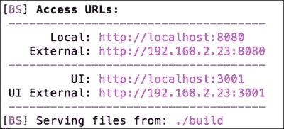
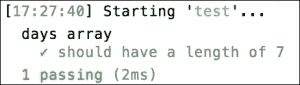
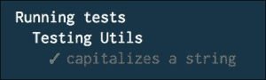
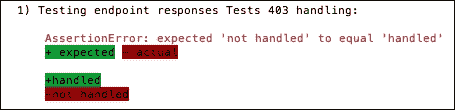
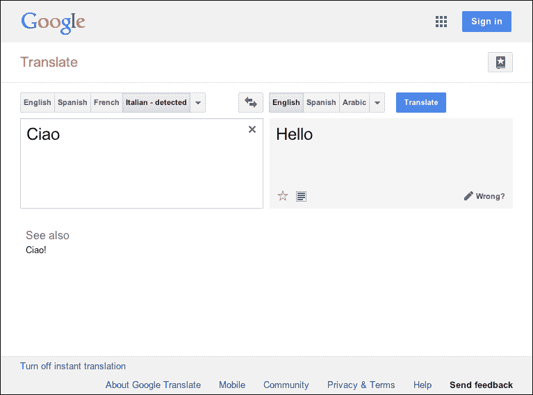

# 第六章。构建和测试

完美的代码是独角兽；优秀开发者所做的就是引入尽可能少的坏代码。因此，任何代码多少都有缺陷，错误和低效是软件开发中不可避免的病理。相应地，**技术债务**会随着代码量的增加而自然累积。以下是现代应用程序开发中一些更昂贵的技术现实：

+   存在一些严格耦合的组件，它们在技术层面或业务层面都不容易改变。允许这种无原则的渗透会导致复杂的毛细血管网络在你的代码主体中生长。这些网络的边缘几乎无法追踪，具体化了纠缠，掩盖了某个函数的变化可能如何影响其他函数。

+   糟糕的守门人让未经测试的代码进入生产环境，通常会导致快速修复，这反过来又可能导致难以解决的补丁和桥接代码，以及不断出现的顽固错误。

+   存在一些在并行中独立构建的代码单元，没有客观的 *大局观* 指南，它们被粗略地合并到一个代码库中，并通过未记录的、临时的绑定连接在一起。

+   重构的需求达到临界点，任何意义上的进一步开发几乎都变得不可能。扩展天花板是这种情况的典型，全面重写是不可避免的，并且几乎总是注定要失败。

债务会累积利息。软件，就像许多长期追求一样，需要不断的债务管理。减少债务对你有利。在前一章中，我们学习了如何以足够的详细程度分析 *已部署* 应用程序，以暴露错误、弱点和其他不受欢迎的特征。在本章中，我们将探讨帮助软件开发者和团队在应用程序的膜被突破之前捕捉错误的策略。我们还将探讨管理独立编写的程序集成的流程。

# 使用 Gulp、Browserify 和 Handlebars 构建

你正在工作的 JavaScript 代码在进入生产之前可能会被转换和增强。至少，它将被检查错误、压缩、打包等。只有在之后才会部署。因此，部署遵循构建步骤，并且必须明确定义构建中每个步骤的仪器化。

随着时间的推移，Node 社区内部已经出现了一些发展模式。其中许多模式映射到其他环境中，而另一些则是 *全栈 JavaScript* Node.js 世界的独特之处。在客户端和服务器上运行相同代码的能力可能是最突出的例子。由于部署的代码库通常包含编译后的最终结果（例如，CoffeeScript 和 SASS），因此部署工作流程被组装起来以运行预处理器、合并文件、创建源映射、压缩图像等。

在本节中，我们将探讨在 Node 构建和部署过程中经常遇到的三种技术。我们将使用 **Gulp** 来创建构建系统，使用 **Browserify** 来打包应用程序代码，以及使用 **Handlebars** 作为静态页面的模板语言。最后，我们将探讨如何通过使用 **BrowserSync** 来提升我们的开发体验。

## 使用 Gulp

创建一个新的文件夹，并在该文件夹中使用 `npm init` 初始化一个 `package.json` 文件。完成此操作后，你将得到一个看起来类似于以下内容的 `package.json` 文件：

```js
{
  "name": "building",
  "version": "1.0.0",
  "description": "",
  "main": "index.js",
  "scripts": {
    "test": "echo \"Error: no test specified\" && exit 1"
  },
  "author": "",
  "license": "ISC"
}
```

随着我们继续前进，这个基本框架将被完善并解释。重点是，你现在将使用 npm 将应用程序的模块和其他依赖项挂载在这个框架上，整洁地描述依赖项、测试工具等。由于我们将使用 Gulp 构建系统，因此首先安装 Gulp 模块并将其声明为该包的依赖项是合理的。运行以下两个命令：

```js
npm install gulp --global
npm install gulp --save-dev

```

第一个命令全局安装 Gulp，这意味着你现在可以直接从命令行使用 `gulp` 命令（你也可以用 `-g` 简写 `--global`）。下一个命令本地安装 Gulp，向 `package.json` 文件添加以下新属性：

```js
  "devDependencies": {
    "gulp": "³.8.10"
  }
```

Gulp 已被安装并保存为依赖项。我们已准备好构建构建系统。

构建系统的一个目标是在你的开发环境中进行仪表化，这样你可以在开发时自然地使用未压缩、未优化的代码，稍后可以发出命令将你的 *原始* 代码和资源转换为适合预演环境、生产环境等优化的状态。为开发者提供一个表达性和简单的语法来描述如何将源代码转换为可部署的代码是 Gulp 力求实现的。

在你的工作目录中创建两个新的文件夹：一个名为 `/source` 的文件夹和一个名为 `/build` 的文件夹。我们将创建一组指令，用于将 `source/` 中的文件转换为 `/build` 中的文件。这组指令存储在一个特定命名为 `gulpfile.js` 的文件中。创建该文件并插入以下代码：

```js
"use strict";
var fs = require('fs');
var gulp = require('gulp');
var buildDirectory = './build';
gulp.task('default', function(cb) {
  fs.exists(buildDirectory, function(yes) {
    if(yes) {
      return cb();
    }
    fs.mkdirSync(buildDirectory);
    cb();
  });
});
```

Gulp 基于运行一系列任务按特定顺序执行的理念。一般格式是 `gulp.task(<任务名称>, <任务执行器>)`。Gulpfile 通常通过添加多个此类任务定义来扩展。正如我们将看到的，任务可以命名为任何你想要的名称，但必须始终有一个名为 *default* 的默认任务，并且前面的代码建立了一个这样的任务来执行一个简单的事情：确保存在一个 `/build` 文件夹，如果不存在，则创建一个。

需要注意的一点是任务运行器函数接收的第一个参数：一个回调函数，这里命名为`cb`。由于 Node 程序通常运行异步代码，因此有一个机制来*告知* `gulp` 任务已完成是很重要的。我们正在运行异步代码来检查文件夹的存在，因此我们使用这个回调系统，但请注意，如果你的代码是同步运行的，或者任务完成的时刻对后续任务无关紧要，你可以跳过运行回调，Gulp 将在任务运行器退出后立即继续执行下一个任务。

在包含你的 Gulpfile 的文件夹中运行`gulp`命令。你应该会看到以下类似的内容：

```js
Using gulpfile ~/building/gulpfile.js
Starting 'default'...
Finished 'default' after 720 μs

```

为了检查任务是否正确执行其工作，删除`/build`文件夹并再次运行`gulp`。你会看到文件夹被重新创建。

### 小贴士

由于 Gulp 期望其 Gulpfile 包含一个*默认*任务，因此`gulp`命令只是`gulp default`的快捷方式。你可以通过运行`gulp <taskname>`来执行特定的任务。

在典型的构建过程中，将运行许多任务。每个任务应该尽可能简单和具体，Gulpfile 应该整齐地组织它们，以便它们按特定顺序执行。因此，默认任务通常本身不做什么，而是用作提示将要运行的任务列表的方式。让我们以前述代码更直接的方式重写代码：

```js
gulp.task('initialize',function(cb) {
  fs.exists(buildDirectory, function(yes) {
    ...
    cb();
  });
});

gulp.task('default', ['initialize'], function() {
  console.log('Build is complete');
});
```

在这里，我们可以更清楚地看到`gulp`是如何工作的。将第二个数组参数传递给`gulp`任务的定义，列出当前任务所依赖的其他任务——一个任务将在所有依赖任务完成后才运行。让我们向这个执行链添加另一个任务，该任务将`/source`文件夹中的文件复制到`/build`文件夹。将以下内容添加到你的 Gulpfile 中：

```js
gulp.task('move', function() {
  gulp
  .src('./source/**')
  .pipe(gulp.dest('./build'))
});
```

现在，告诉`gulp`关于这个新任务的信息：

```js
gulp.task('default', ['initialize', 'move'], function() ...)
```

除了`task`之外，你还将频繁使用`src`、`pipe`和`dest` Gulp 命令。Gulp 是一个*流式*构建系统——在任务中，你通常将一组文件识别出来，对它们运行一系列转换，并将转换后的文件放置在有用的位置，通常是包含可部署应用程序的文件夹。`src`命令用于识别这个集合，并将包含的文件转换为可流式传输的对象，以便可以使用`pipe`对它们进行操作以使用 gulp 插件。我们将在稍后提供更多相关信息。

### 注意

Gulp 的`src`命令的参数通常包含*通配符*（例如，`/source/**`），这是一种用于在文件夹内定位文件的模式匹配方式。更多关于它们如何工作的信息可以在[`github.com/isaacs/node-glob#glob-primer`](https://github.com/isaacs/node-glob#glob-primer)找到。

上述代码在`/source`目录中创建一组文件，并将它们通过（内置的）`dest` gulp 插件管道传输，该插件将它们写入`/build`。再次运行 gulp。你会看到以下类似的内容：

```js
Starting 'initialize'...
Starting 'move'...
Finished 'move' after 3.66 ms
Finished 'initialize' after 4.64 ms
Starting 'default'...
Build is complete
Finished 'default' after 19 μs
```

你看到了什么问题吗？`move`任务在`initialize`完成之前运行，这会创建一个竞争条件——在`move`尝试向其中添加文件之前，`/build`目录会被创建吗？构建应该尽可能快，为此，Gulp 旨在实现最大并发性——除非你指定了其他方式，否则 Gulp 将并发运行所有任务。如前述代码所示，`initialize`和`move`是同时开始的。如何强制执行特定的顺序？

传递给`default`的依赖项列表的顺序**并不**反映它们的执行顺序。然而，它确实代表了一个列表，这些任务必须在执行`default`之前完成。为了确保`move`在`initialize`之后执行，只需将`initialize`作为`move`的依赖项即可：

```js
gulp.task('move', ['initialize'], function() {
  ...
});
```

## 建立构建脚手架

既然你已经了解了 Gulp 的工作原理，让我们构建一个代表性的构建过程。我们将逐步开发一个 Gulpfile。首先，使用以下代码：

```js
"use strict";

//  npm install coffee-script -> this is used for test task
require('coffee-script/register');

var path = require('path');
var mkdirp = require('mkdirp');
var del  = require('del');
var source = require('vinyl-source-stream');
var buffer = require('vinyl-buffer');
var browserSync = require('browser-sync');
var gulp = require('gulp');
var coffee = require('gulp-coffee');
var coffeelint = require('gulp-coffeelint');
var sourcemaps = require('gulp-sourcemaps');
var changed = require('gulp-changed');
var concat = require('gulp-concat');
var handlebars = require('gulp-handlebars');
var browserify = require('browserify');
var sass = require('gulp-sass');
var wrap = require('gulp-wrap');
var mocha = require('gulp-mocha');
var uglify = require('gulp-uglify');
var minifyHTML = require('gulp-minify-html');

//  A map of relevant source/build folders
var buildDir     = './build';
var sourceDir     = './source';
var s_scriptsDir   = './source/scripts';
var b_scriptsDir   = './build/js';
var s_stylesDir   = './source/styles';
var b_stylesDir   = './build/css';
var s_templatesDir   = './source/templates';
var b_templatesDir   = './build/templates';
var s_testsDir    = './source/tests';

//  Clean out build directories before each build
gulp.task('clean', function(cb) {
  del([
    path.join(b_scriptsDir, '**/*.js'),
    path.join(b_stylesDir, '**/*.css'),
    path.join(b_templatesDir, '*.js'),
    path.join(buildDir, '*.html')
  ], cb);
});
gulp.task('scaffold', ['clean'], function() {
  mkdirp.sync(s_scriptsDir);
  mkdirp.sync(b_scriptsDir);
  mkdirp.sync(s_stylesDir);
  mkdirp.sync(b_stylesDir);
  mkdirp.sync(s_templatesDir);
  mkdirp.sync(b_templatesDir);
  mkdirp.sync(s_testsDir);
});

...

gulp.task('default', [
  'clean',
  'scaffold',
  'lint',
  'scripts',
  'styles',
  'templates',
  'browserify',
  'views',
  'test',
  'watch',
  'server'
]);
```

在此文件的顶部，你会看到很多 require 语句。除了`path`之外，它们都将被用作 Gulp 插件或辅助工具。你可以直接复制你代码包`/building`文件夹中找到的`package.json`文件，或者继续使用`--save-dev`指令安装它们：`npm install --save-dev gulp-coffee gulp-changed [...]`。

此外，使用`npm install --save jquery handlebars`命令安装`jquery`和`handlebars`npm 模块作为依赖项。当我们讨论 Browserify 时，我们将提供更多关于为什么这样做的原因。

`clean`和`scaffold`任务存在是为了为你的应用程序构建文件夹结构，并在每次新构建发生时清理相关的构建目录（为新构建的文件腾出空间，而不留下旧文件的残留）。看看那些任务；它们最终确保以下文件夹结构：

```js
build
  css
  js
  templates
source
  scripts
  styles
  templates
tests
```

在接下来的演示中，我们将使用**CoffeeScript**编写我们的 JavaScript 代码，将`.coffee`文件存储在`source/scripts`目录中，这些文件将被编译并移动到`build/js`目录。`build/css`目录将接收存储在`source/styles`中的转换后的`.scss`文件。Handlebars 模板将被预编译并从`source/templates`移动到`build/templates`。最后，构成我们应用程序主要“页面”的`.html`文件将位于`/source`，并移动到根目录`/build`。稍后，我们将添加任务以通过 Web 服务器公开这些 HTML 视图。

在代码片段的底部，你会看到我们将定义的任务列表，这些任务将作为默认 Gulp 任务的依赖项绑定。让我们逐一过一遍这些任务。

文件检查涉及在脚本上运行语法检查器，强制执行各种规则，例如缩进、是否允许某些结构、是否强制使用分号等。我们将仅使用 CoffeeScript，因此我们使用`gulp-coffeelint`插件实现一个检查任务：

```js
gulp.task('lint', ['scaffold'], function() {
  return gulp.src(path.join(s_scriptsDir, '**/*.coffee'))
  .pipe(coffeelint('./coffeelint.json'))
  .pipe(coffeelint.reporter('default'))
});
```

我们只是检查将要转换成 `/js` 构建文件夹中 JavaScript 文件的 CoffeeScript 文件的语法。任何差异都会报告到 `stdout`，但不会停止构建。应用包含语法规则的 `coffeelint.json` 文件。你应该调查此文件，并根据需要修改它——更多信息可以在 [`www.coffeelint.org`](http://www.coffeelint.org) 找到。

下一步是构建这些新清理过的脚本：

```js
gulp.task('scripts', ['lint'], function() {
  return gulp.src(path.join(s_scriptsDir, '**/*.coffee'))
  .pipe(changed(b_scriptsDir, {extension: '.js'}))
  .pipe(sourcemaps.init())
  .pipe(coffee({bare: true}))
  .pipe(sourcemaps.write())
  .pipe(gulp.dest(b_scriptsDir))
});
```

这里正在进行几个构建步骤。我们可以简单地转换 CoffeeScript 文件到 JavaScript 文件，并将它们复制到 `build/scripts` 文件夹。然而，由于转换后的 JavaScript 文件不是原始源文件，我们需要创建一个 **源映射**——这是一个将错误映射到生成该 JavaScript 的 **原始 CoffeeScript 源** 的基本工具。这在我们在浏览器中进行调试时非常有价值。正如你在代码中所看到的，我们简单地使用 `gulp-sourcemaps` 插件来跟踪编译步骤，并且它会自动将源映射附加到生成的 JavaScript 文件，其外观大致如下：

```js
//# sourceMappingURL=data:application/json;base64,eyJ2ZXJzaW9uIjozLCJzb3VyY2VzIjpbInNhbXBsZS5jb2ZmZWUiXSwibmFtZXMiOltdLCJtYXBwaW5ncyI6IkFBQUEsSUFBQSxJQUFBOztBQUFBLElBQUEsR0FBTyxxQkFBUCxDQUFBIiwiZmlsZSI6InNhbXBsZS5qcyIsInNvdXJjZVJvb3QiOiIvc291cmNlLyIsInNvdXJjZXNDb250ZW50IjpbImRheXMgPSBbMS4uN11cbiJdfQ==
```

`gulp-changed` 插件智能地跟踪是否有任何目标文件已更改，如果没有，则插件会将其从处理中移除。此插件可以显著减少处理大量文件的任务的执行时间。请注意，我们将扩展名参数设置为 `.js` 作为选项，因为原始文件扩展名（`.coffeescript`）将更改，并且插件必须被告知这种命名更改。

我们将使用 **Sass** CSS 预处理器（通过 `.scss` 扩展名表示）在我们的系统中创建样式。在以下任务定义中，它们被转换为标准 CSS。此外，它们使用 `gulp-concat` 插件捆绑成一个单独的输出文件（`app.css`）：

```js
gulp.task('styles', function() {
  return gulp.src(path.join(s_stylesDir, '**/*.scss'))
  .pipe(sass())
  .pipe(concat('app.css'))
  .pipe(gulp.dest(b_stylesDir));
});
```

在构建步骤中捆绑成一个单独的文件，全局样式可以通过单个 `<link>` 标签添加到任何视图中，同时在开发过程中保持样式文档的必要分离。

下一步稍微复杂一些。我们将使用 Handlebars 模板，它们（可能）看起来像这样：

```js
<ul>
  {{#each days}}
    <li>{{this}}</li>
  {{/each}}
</ul>
```

为了让 Handlebars 向前面的迭代器提供一些 JSON 以进行处理，模板必须通过 `Handlebars.template` 方法编译成 JavaScript 函数。虽然这可以在客户端完成，但在构建步骤中简单地预编译我们的模板会更有效率。所以，我们将做的是将每个模板导出为一个单独的 Node 模块，这样就可以像使用模块一样使用它们。为了实现这一点，我们将使用 `gulp-wrap` 插件：

```js
gulp.task('templates', function () {
  return gulp.src(path.join(s_templatesDir, '/**/*.hbs'))
  .pipe(handlebars())
  .pipe(wrap('var Handlebars = require("handlebars/runtime")["default"];module.exports = Handlebars.template(<%= contents %>);'))
  .pipe(gulp.dest(b_templatesDir));
});
```

这个任务将每个源文件包裹在将使用 Handlebars 运行时将源代码编译成可导出 JavaScript 函数的代码中。现在，模板可以在你的客户端代码中使用，而无需在运行时加载 Handlebars 或使用它进行编译。例如，使用以下代码：

```js
var myTemplate = require("build/templates/myTemplate.js");
$(document.body).append(myTemplate({days: ['mon','tue','wed'...]}));
```

你可能会对自己说，“但是等等……客户端 JavaScript 没有`require`语句！”……你是对的！这就是 Browserify 的强大之处：

```js
gulp.task('browserify', ['scripts', 'templates', 'views'], function() {
  return browserify(b_scriptsDir + '/app.js')
  .bundle()
  // Converts browserify out to streaming vinyl file object
  .pipe(source('app.js'))
  // uglify needs conversion from streaming to buffered vinyl file object
  .pipe(buffer())
  .pipe(uglify())
  .pipe(gulp.dest(b_scriptsDir));
});
```

如[`browserify.org/`](http://browserify.org/)所述：

> *"使用 Browserify，你可以像在 Node 中使用一样使用 require。"*

这允许我们像在 Node 中运行一样编写我们的客户端应用程序代码，同时加入一个 DOM 文档。在前面的任务中，Browserify 自动获取所有`app.js`依赖（`require`的实例），将它们捆绑成一个将在客户端运行的文件，运行`gulp-uglify`插件来压缩生成的 JavaScript，并用 Browserified 捆绑包替换旧文件。`app.js`文件可以包含我们需要的所有代码，在一个文件中，从而简化并标准化客户端集成。

Browserify 不仅仅关于连接。重点是，使用 Browserify，我们可以在客户端和服务器上使用 npm 模块，*标准化*我们的流程，因此利用智能包管理来处理客户端 JavaScript。这是新的且重要的：我们在客户端获得了包管理和其标准加载系统的力量。虽然一些客户端框架提供了类似模块管理系统的东西，但没有任何这些*黑客*可以取代稳固的 npm 系统。考虑以下示例`source/scripts/app.coffee`文件：

```js
$ = require("jquery")
days = require("../../build/js/sample.js")
complimentTemplate = require("../../build/templates/compliment.js")
helloTemplate = require("../../build/templates/hello.js")
daysTemplate = require("../../build/templates/days.js")
$ ->
  $("#hello").html helloTemplate(name: "Dave")
  $("#compliment").html complimentTemplate(compliment: "You're great!")
  $("#days").html daysTemplate(days: days)
```

如果你检查你的代码包，你会找到这个文件。注意我们是如何`require` jQuery 的 npm 模块版本，以及我们之前从 Handlebars 模板创建的预编译模板。然而，我们在客户端运行，因此我们可以使用 jQuery 操作将 HTML 添加到 DOM 中——这是两者的最佳结合。

`views`的任务非常简单：

```js
gulp.task('views', ['scaffold'], function() {
  return gulp.src(path.join(sourceDir, '*.html'))
  .pipe(minifyHTML({
    empty: true
  }))
  .pipe(gulp.dest(buildDir))
});
```

我们只是在压缩 HTML 并将文件移动到构建目录，没有进行任何其他更改。

## 运行和测试你的构建

到目前为止，我们已经设置了所有任务来管理我们仓库的关键文件。让我们使用`browser-sync`来自动启动一个服务器和一个浏览器窗口，该窗口将从我们的构建目录加载`index.html`文件：

```js
gulp.task('server', ['test','watch'], function() {
  browserSync({
    notify: false,
    port: 8080,
    server: {
      baseDir: buildDir
    }
  });
});
```

下一个任务将解释`test`和`watch`任务。现在，请注意添加服务器到构建过程是多么容易。这个任务在提供的端口上启动一个服务器，并自动将`baseDir`中找到的`index.html`加载到一个自动生成的浏览器窗口中。`notify`选项告诉 BrowserSync 不要在连接的浏览器中显示调试通知。现在，每次我们运行 Gulp，我们的应用程序都会在浏览器中加载。你的终端应该显示类似以下的信息：



BrowserSync 允许多个客户端查看你的构建，因此提供了一个外部访问 URL。此外，他们还将看到你的交互。例如，如果你滚动页面，连接的客户端的页面也会滚动。此外，UI URL 将暴露一个用于构建的仪表板，允许你控制连接的客户端、重新加载他们的视图等等。当你为团队或客户进行演示时，这是一个非常好的工具。要了解更多关于 BrowserSync 及其配置的信息，请访问 [`www.browsersync.io/`](http://www.browsersync.io/)。

一个好的构建系统应该提供一个测试框架作为构建是否应该获得认证的最终裁决者。我们将在本章后面深入探讨使用 **Mocha**、**Chai** 和 **Sinon** 进行测试，所以在这里我们只演示一个非常简单的测试占位符，你可以在设计 Gulp 工作流程时在此基础上构建：

```js
gulp.task('test', ['browserify'], function() {
  return gulp.src(path.join(s_testsDir, '**/*.coffee'), {
    read: false
  })
  .pipe(coffee({bare: true}))
  .pipe(mocha({
  reporter: 'spec'
  }));
});
```

在测试目录中有一个用 CoffeeScript 编写的测试文件：

```js
days = require('../../build/js/sample.js')
assert = require("assert")
describe "days() data", ->
  it "should have a length of 7", ->
    assert.equal days().length, 7
```

这个测试将加载我们的模板模块之一，该模块导出一个包含七个成员的数组——一周中的日子。测试使用 Node 的核心 `assert` 库（将在本章后面详细讨论）来测试这个数组是否具有正确的七个字符长度。Mocha 通过 `describe` 和 `it` 提供测试框架，允许你设计看起来像自然语言的测试。当你运行 Gulp 时，你应该看到类似以下内容（如果一切顺利）：



最后的任务由另一个本地的 Gulp 方法提供：`watch`。`watch` 的目的是将文件监视器绑定到特定的目录，以便任何文件更改都会自动触发相关构建任务的重新运行。例如，如果你发现 `source/scripts` 目录中的任何文件发生了变化，你可能希望再次运行 `scripts` 任务。以下代码演示了如何（更改）某些文件夹自动触发一系列构建任务：

```js
gulp.task('watch', ['scaffold'], function() {
  gulp.watch(path.join(s_scriptsDir, '**/*'), [
    'browserify', browserSync.reload
  ]);
  gulp.watch(path.join(s_templatesDir, '**/*'), [
    'browserify', browserSync.reload
  ]);
  gulp.watch(path.join(s_stylesDir, '**/*'), [
    'styles', browserSync.reload
  ]);
  gulp.watch(path.join(sourceDir, '*.html'), [
    'views', browserSync.reload
  ]);
});
```

你会注意到 BrowserSync 也会绑定到更改上，从而创建一个非常自然的发展过程。一旦你在浏览器中显示了一个正在运行的构建，你对例如 `index.html` 所做的任何更改都会 *自动* 反映在该视图中。当你更改 CSS 时，你会立即看到更改，依此类推。在开发过程中将不再需要不断重新加载；BrowserSync 会为你推送更改。

你可能还需要做许多其他事情。例如，你可能希望在将图像推送到生产之前压缩它们。作为一个练习，在你的源目录和构建目录中创建相关的图像文件夹，并使用 `gulp-imagemin` 实现一个 `images` 任务（[`github.com/sindresorhus/gulp-imagemin`](https://github.com/sindresorhus/gulp-imagemin)）。

### 注意

Gulp 背后的团队提供了一组建议的模式，用于在[`github.com/gulpjs/gulp/tree/master/docs/recipes`](https://github.com/gulpjs/gulp/tree/master/docs/recipes)中实现常见的构建任务。

这里有一个最后的注意事项：你将经常*手动编码*这类构建系统，通常重用相同的模式。因此，已经创建了某些自动化工具，这些工具通常可以将创建样板构建代码的过程简化为几个命令。其中之一是**Yeoman**([`yeoman.io/`](http://yeoman.io/))，它使得构建常见的“堆栈”构建步骤、数据库、服务器和框架变得容易。其他值得注意的解决方案包括**Brunch**([`brunch.io/`](http://brunch.io/))和**Mimosa**([`mimosa.io/`](http://mimosa.io/))。

# 使用 Node 的本地测试工具

测试仅仅是检查你对某物状态的假设是否错误的行为。这样，测试软件遵循科学方法，即你将表达一个理论，做出预测，并运行一个实验来查看数据是否与你的预测相符。

与科学家不同，软件开发者可以改变现实——爱因斯坦关于改变事实以适应理论的笑话实际上毫无讽刺意味地适用于测试过程。事实上，这是必需的！当你的测试（理论）失败时，你必须改变“世界”，直到测试不再失败。

在本节中，你将学习如何使用 Node 的本地调试器进行*实时*代码测试，以及如何使用`assert`模块进行预测、运行实验和测试结果。

## Node 调试器

大多数开发者都使用 IDE 进行开发。所有良好开发环境的关键特性之一是访问调试器，它允许在程序中设置断点，以便在需要检查状态或其他运行时方面的地方。

V8 与一个强大的调试器一起分发（通常用于 Google Chrome 浏览器开发者工具面板），并且 Node 可以访问它。它通过`debug`指令调用，如下所示：

```js
> node debug somescript.js

```

简单的逐步调试和检查现在可以在 Node 程序中实现。考虑以下程序：

```js
myVar = 123;
setTimeout(function () {
  debugger;
  console.log("world");
}, 1000);
console.log("hello");
```

注意`debugger`指令。在不使用`debug`指令的情况下执行此程序将导致显示`"hello"`，一秒后显示`"world"`。当使用指令时，你会看到以下内容：

```js
> node debug somescript.js
< debugger listening on port 5858
connecting... ok
break in debug-sample.js:1
 1 myVar = 123;
 2 setTimeout(function () {
 3   debugger;
debug>

```

一旦遇到断点，我们将获得一个到调试器本身的 CLI，从其中我们可以执行标准的调试和其他命令：

+   `cont, c`：这将从最后一个断点继续执行，直到下一个断点

+   `step, s`：进入步骤——这将一直运行，直到遇到新的源行（或断点）；之后，将控制权返回给调试器

+   `next, n`：这与前面的命令类似，但新源行上的函数调用将执行而不停止

+   `out, o`: 跳出——这将执行当前函数的剩余部分并返回到父函数

+   `backtrace, bt`: 这将以类似于以下方式追踪到当前执行帧的步骤：

    ```js
    ...
    #3 Module._compile module.js:456:26
    #4 Module._extensions..js module.js:474:10
    #5 Module.load module.js:356:32
    ... etc.
    ```

+   `setBreakpoint(), sb()`: 这将在当前行设置一个断点

+   `setBreakpoint(Integer), sb(Integer)`: 这将在指定的行设置一个断点

+   `clearBreakpoint(), cb()`: 这将在当前行清除一个断点

+   `clearBreakpoint(Integer), cb(Integer)`: 这将在指定的行清除一个断点

+   `run`: 如果调试器的脚本已终止，这将再次启动它

+   `restart`: 这将终止并重新启动脚本

+   `pause, p`: 这将暂停正在运行的代码

+   `kill`: 这将终止正在运行的脚本

+   `quit`: 这将退出调试器

+   `version`: 这将显示 V8 版本

+   `scripts`: 这将列出所有已加载的脚本

    ### 提示

    要重复最后的调试器命令，只需在键盘上按 *Enter* 键。

返回到我们正在调试的脚本，在调试器中输入 `cont` 将产生以下输出：

```js
debug> cont
< hello // ... a pause of 1000 ms will now occur, then...
break in debug-sample.js:3
 1 myVar = 123;
 2 setTimeout(function () {
 3   debugger;
 4   console.log("world");
 5 }, 1000);
debug>

```

注意，当我们开始调试器时，尽管你可能会期望在 `setTimeout` 回调中的断点被达到之前执行 `console.log('hello')` 命令，但 `"hello"` 并没有被打印出来。调试器在运行时不会执行；它在编译时以及运行时进行评估，让你深入了解你的程序的字节码是如何被组装的，最终将如何执行，而不仅仅是编译后的打印输出，这是 `console.log` 提供的。

通常在断点处进行一些检查是有用的，例如检查变量的值。调试器还有一个额外的命令 `repl`，它允许这样做。目前，我们的调试器在成功解析脚本并执行 `console.log('hello')`，即第一个推入事件循环的函数后停止。如果我们想检查 `myVar` 的值呢？使用 `repl`：

```js
debug> repl
Press Ctrl + C to leave debug repl
> myVar
123

```

在这里尝试使用 REPL，实验它可能的使用方式。

在这一点上，我们的程序只剩下一个要执行的指令——打印 `"world"`。立即的 `cont` 命令将执行这个最后的命令，事件循环将没有其他事情要做，我们的脚本将终止：

```js
debug> cont
< world
program terminated
debug>

```

作为实验，再次 `run` 脚本，在执行这个最终上下文之前使用 `next` 而不是 `cont`。继续按 *Enter* 并尝试跟随正在执行的代码。你将看到，在打印 `"world"` 之后，`timers.js` 脚本将被引入这个执行上下文，因为 Node 在触发超时后进行清理。在这个时候在调试器中运行 `scripts` 命令。你将看到类似以下的内容：

```js
debug> next
break in timers.js:125
 123
 124   debug(msecs + ' list empty');
 125   assert(L.isEmpty(list));
 126   list.close();
 127   delete lists[msecs];
debug> scripts
* 37: timers.js
 46: debug-sample.js
debug>

```

实验各种方法将是有用的，了解 Node 在深层执行脚本时会发生什么，以及 Node 如何帮助满足你的调试需求。

### 注意

阅读以下文档可能会有所帮助，该文档描述了如何使用 Google Chrome 调试器接口：[`developers.google.com/chrome-developer-tools/docs/javascript-debugging#breakpoints`](https://developers.google.com/chrome-developer-tools/docs/javascript-debugging#breakpoints)。

强烈推荐使用 Miroslav Bajtos 的 **node-inspector** 模块进行调试，它允许开发者从 Chrome 浏览器远程调试 Node 应用程序。您可以在[`github.com/node-inspector/node-inspector`](https://github.com/node-inspector/node-inspector)上找到更多相关信息。

## 'assert' 模块

Node 的 assert 模块用于简单的单元测试。在许多情况下，它足以作为测试的基本脚手架，或者用作测试框架（如我们稍后将看到的 Mocha）的断言库。其用法简单；我们想要断言某事的真实性，如果我们的断言不正确，则抛出错误。例如，使用以下命令：

```js
> require('assert').equal(1,2,"Not equal!")
AssertionError: Not equal!
 at repl:1:20
 ...

```

如果断言为 `true`（两个值相等），则不会返回任何内容：

```js
> require('assert').equal(1,1,"Not equal!")
undefined

```

遵循 UNIX 的沉默规则，*当程序没有令人惊讶、有趣或有用的内容要说时，它应该保持沉默*，断言仅在断言失败时返回值。返回的值可以通过使用可选的消息参数进行自定义，如前述代码所示。

`assert` 模块 API 由一组具有相同调用签名的比较操作组成——实际值、预期值以及当比较失败时显示的可选消息。还提供了作为快捷方式或特殊情况的处理器的方法。

必须区分 **身份比较（===）** 和 **相等比较（==）**；前者通常被称为*严格相等比较*（如 `assert` API 的情况）。由于 JavaScript 使用动态类型，当使用等号操作符 == 比较不同类型的两个值时，会尝试将一个值强制转换为另一个值——这是一种*通分*操作。例如，使用以下代码：

```js
1 == "1" // true
false == "0" // true
false == null // false
```

如您所预期的那样，这类比较可能会导致令人惊讶的结果。注意当使用身份比较时，结果更加可预测：

```js
1 === "1" // false
false === "0" // false
false === null // false
```

需要记住的是，=== 操作符在比较之前不执行类型强制转换，而等号操作符在类型强制转换之后进行比较。此外，由于 JavaScript 中的对象是通过引用传递的，因此具有相同值的两个对象的身份是不同的——对于对象来说，身份要求两个操作数都*引用同一个对象*：

```js
var a = function(){};
var b = new a;
var c = new a;
var d = b;
console.log(a == function(){}) // false
console.log(b == c) // false
console.log(b == d) // true
console.log(b.constructor === c.constructor); // true
```

最后，对于不需要精确身份的对象比较，使用了 *深度相等* 的概念。如果两个对象都具有相同数量的自有属性、相同的原型、相同的键集（尽管不一定按相同的顺序），并且每个属性的值都等效（但不相同），则这两个对象是深度相等的：

```js
var a = [1,2,3];
var b = [1,2,3];
assert.deepEqual(a, b);  // passes
assert.strictEqual(a, b);  // throws AssertionError: [1,2,3] === [1,2,3]
```

通过设计断言测试来测试你对值之间相互理解的假设是有用的。结果可能会让你感到惊讶。

以下是对使用此模块可以进行的断言的总结：

+   `assert.equal(actual, expected, [message])`: 这用于测试使用 == 进行强制相等性。

+   `assert.notEqual(actual, expected, [message])`: 这用于测试使用 != 进行强制相等性。

+   `assert.deepEqual(actual, expected, [message])`: 这用于测试深度相等性。

+   `assert.notDeepEqual(actual, expected, [message])`: 这用于测试深度不等性。

+   `assert.strictEqual(actual, expected, [message])`: 这用于测试身份等价 ===。

+   `assert.notStrictEqual(actual, expected, [message])`: 这用于测试身份不匹配 !==。

+   `assert(value, [message])`: 如果发送的值不是真实的，则抛出错误。

+   `assert.ok(value, [message])`: 这与 `assert(value)` 相同。

+   `assert.ifError(value)`: 如果值是真实的，则抛出错误。

+   `assert.throws(block, [error], [message])`: 这用于测试提供的代码块是否抛出错误。可选的错误值可以是错误构造函数、正则表达式或返回布尔值的验证函数。

+   `assert.doesNotThrow(block, [error], [message])`: 这用于测试提供的代码块是否没有抛出错误。

+   `assert.fail(actual, expected, message, operator)`: 这会抛出异常。这在异常被 try/catch 块捕获时最有用。

在 `console` API 中有一个快捷方法来记录断言结果：

```js
> console.assert(1 == 2, "Nope!")
AssertionError: Nope!

```

### 注意

对于如何在 JavaScript 中进行比较的更详细解释，请参阅 [`developer.mozilla.org/en-US/docs/Web/JavaScript/Reference/Operators/Comparison_Operators`](https://developer.mozilla.org/en-US/docs/Web/JavaScript/Reference/Operators/Comparison_Operators)。

现在，让我们看看使用更高级的测试框架和工具进行测试。

# 使用 Mocha、Chai、Sinon 和 npm 进行测试

为你的代码编写测试的一个巨大好处是，你将被迫思考你所写的内容是如何工作的。难以编写的测试可能表明代码难以理解。另一方面，全面的测试覆盖和良好的测试有助于他人（和你）理解应用程序的工作方式。

在设置测试环境时，至少有三个概念需要考虑。

测试的目的是比较接收到的值和应用程序代码期望的值。如我们之前所见，Node 的 `assert` 模块是为了这个目的而设计的，但它的功能仅限于单个、孤立的断言。我们将使用 Chai 库 ([`chaijs.com`](http://chaijs.com))，它为你提供了更丰富的语言和成语来做出断言。

一个应用程序被数百个测试覆盖并不罕见。当断言被分组，例如按功能或业务单元分组时，这些组可以为你提供关于应用程序状态的更清晰图景。设计和实施工具来进行这种分组，尤其是在异步代码中，是困难的。幸运的是，存在几个知名且设计良好的测试运行器供你使用。我们将使用 Mocha ([`mochajs.org`](http://mochajs.org))，它使得组织、控制和显示测试结果变得更加容易。

测试通常在开发环境中进行，而不是在实时生产环境中。你如何为不在真实环境中运行的代码编写测试？例如，我如何测试我的代码处理无法本地连接的网络端点的响应的能力？我如何检查函数被发送的参数，而无需重写该函数？我们将使用 Sinon ([`sinonjs.org/`](http://sinonjs.org/))，它允许你创建合成方法和其他模拟。

### 注意

其他流行的测试运行器包括 Jasmine ([`github.com/jasmine/jasmine`](https://github.com/jasmine/jasmine)) 和 Vows ([`github.com/vowsjs/vows`](https://github.com/vowsjs/vows))。Should ([`github.com/shouldjs/should.js`](https://github.com/shouldjs/should.js)) 是一个流行的断言库。

首先，设置一个包含以下结构的文件夹：

```js
scripts
spec
  helpers
```

`/scripts` 文件夹包含我们将要测试的 JavaScript 代码。`/spec` 文件夹包含配置和测试文件。

现在，使用 `npm init` 初始化一个 `package.json` 文件。你可以在提示时直接按 *Enter*，但当你被要求输入测试命令时，请输入以下内容：

```js
mocha ./spec --require ./spec/helpers/chai.js --reporter spec

```

随着我们继续前进，这会更有意义。现在，认识到这个分配给 npm 的 `test` 属性断言我们将使用 Mocha 进行测试。Mocha 的测试报告将是 `spec` 类型，并且该测试将存在于 `/spec` 目录中。我们还将需要一个 Chai 的配置文件，这将在接下来的某个部分中解释。重要的是，这已经在 npm 中创建了一个脚本声明，允许你使用 `npm test` 命令运行你的测试套件。在接下来的部分中，你需要运行 Mocha 测试时，请使用该命令。

如果你还没有安装，请使用 `npm install mocha -g` 全局安装 Mocha。同时，使用 `npm install mocha chai sinon redis --save-dev` 命令安装我们需要的本地测试模块。

## Mocha

Mocha 是一个不关心测试断言本身的测试运行器。Mocha 用于组织和运行你的测试，主要通过使用 `describe` 和 `it` 操作符。以下代码展示了这一点：

```js
 describe("Test of Utility Class", function() {
  it("Running #date should return a date", function(){
    // Test date function
  });
  it("Running #parse should return JSON", function() {
    // Run some string through #parse
  });
});
```

如上图所示，Mocha 测试框架留出了测试的描述和组织方式，并且不对测试断言的设计做出任何假设。

你可以设置同步运行的测试，如前述代码所述，或者使用传递给所有 `it` 回调的完成处理程序异步运行：

```js
describe("An asynchronous test", function() {
  it("Runs an async function", function(done) {
    // Run async test, and when finished call...
    done();
  });
});
```

块也可以嵌套：

```js
describe("Main block", function() {
  describe("Sub block", function() {
    it("Runs an async function", function() {
      // A test running in sub block
    });
  });
  it("Runs an async function", function() {
    // A test running in main block
  });
});
```

最后，Mocha 提供 *hooks*，允许你在测试前后运行代码：

+   `beforeEach()` 在 `describe` 块中的每个测试之前运行

+   `afterEach()` 在 `describe` 块中的每个测试之后运行

+   `before()` 在任何测试之前运行代码——在 `beforeEach` 任何运行之前

+   `after()` 在所有测试运行之后运行代码——在 `afterEach` 任何运行之后

通常，这些用于设置测试上下文，例如在特定测试之前创建变量，并在某些其他测试之前清理这些变量。

这个简单的工具集合足以处理大多数测试需求。此外，Mocha 提供了各种测试报告器，提供不同格式的结果。当我们构建实际的测试场景时，我们将在后面看到这些报告器的实际应用。

## Chai

如我们之前在 Node 的原生 `assert` 模块中看到的，在基础层面，测试涉及断言我们期望代码块执行的操作，执行该代码，并检查我们的期望是否得到满足。Chai 是一个具有更丰富语法的断言库，提供三种断言风格：**expect**、**should** 和 **assert**。我们将使用 Chai 为 Mocha `it` 语句提供断言（测试），优先使用 *expect* 断言风格。

### 注意

注意，虽然 `Chai.assert` 是基于核心 Node `assert` 语法构建的，但 Chai 通过添加额外的方法增强了该对象。

首先，我们将创建一个名为 `chai.js` 的配置文件：

```js
var chai = require('chai');
chai.config.includeStack = true;
global.sinon = require('sinon');
global.expect = chai.expect;
global.AssertionError = chai.AssertionError;
global.Assertion = chai.Assertion;
```

将此文件放在 `/spec/helpers` 文件夹中。这将告诉 Chai 显示任何错误的完整堆栈跟踪，并将 `expect` 断言风格作为 `global` 变量暴露。同样，Sinon 也作为 `global` 变量暴露。此文件将增强 Mocha 测试运行上下文，这样我们就可以使用这些工具而无需在每个测试文件中重新声明它们。

`expect` 风格的断言读起来像一句话，由像 *to*, *be*, *is* 这样的单词组成的 *句子*。以下代码作为例子：

```js
expect('hello').to.be.a('string')
expect({ foo: 'bar' }).to.have.property('foo')
expect({ foo: 'bar' }).to.deep.equal({ foo: 'bar' });
expect(true).to.not.be.false
expect(1).to.not.be.true
expect(5).to.be.at.least(10) // fails
```

要探索创建 `expect` 测试链时可用的大量 *单词*，请参阅完整的文档[`chaijs.com/api/bdd/`](http://chaijs.com/api/bdd/)。

如前所述，Mocha 对你如何创建断言没有意见。我们将使用 `expect` 在接下来的测试中创建断言。

考虑测试以下对象中的 `capitalize` 函数：

```js
var Utils = function() {
  this.capitalize = function(str) {
    return str.split('').map(function(char) {
      return char.toUpperCase();
    }).join('');
  };
};
```

我们可能会做类似这样的事情：

```js
describe('Testing Utils', function() {
  var utils = new Utils();
  it('capitalizes a string', function() {
    var result = utils.capitalize('foobar');
    expect(result).to.be.a('string').and.equal('FOOBAR');
  });
});
```

这个 Chai 断言将是 `true`，Mocha 将报告相同的结果。这在上面的屏幕截图中有显示：



接下来，我们将看看如何将 Sinon 添加到我们的测试过程中。

## Sinon

在测试环境中，你通常会模拟生产环境的现实情况，因为访问真实用户、数据或其他实时系统是不安全或不可取的。因此，能够模拟环境是测试的重要部分。此外，你通常会想检查的不仅仅是调用结果——你可能想测试某个函数是否在正确的上下文中被调用，或者是否使用了正确的示例。Sinon 是一个帮助你模拟外部服务、模拟函数、跟踪函数调用等的工具。

### 提示

`sinon-chai`模块扩展了 Chai，增加了 Sinon 断言。有关`sinon-chai`的更多信息，请访问[`github.com/domenic/sinon-chai`](https://github.com/domenic/sinon-chai)。

关键的 Sinon 技术是**间谍**、**存根**和**模拟**。此外，你可以设置假的计时器，创建假的服务器等（见[`sinonjs.org/`](http://sinonjs.org/)）。本节重点介绍前三者。让我们逐一介绍每个的示例。

### 间谍

查看以下来自 Sinon 文档的文本，它定义了一个测试间谍：

> *"测试间谍是一个记录所有调用参数、返回值、`this`的值以及抛出的异常（如果有）的函数。测试间谍可以是一个匿名函数，或者它可以包装一个现有的函数。"*

间谍收集它跟踪的函数的信息。例如：

```js
var sinon = require('sinon');
var argA = "foo";
var argB = "bar";
var callback = sinon.spy();

callback(argA);
callback(argB);

console.log(
  callback.called,
  callback.callCount,
  callback.calledWith(argA),
  callback.calledWith(argB),
  callback.calledWith('baz')
);
```

这将记录以下内容：

```js
true 2 true true false

```

间谍被调用了两次，一次是使用`foo`，一次是使用`bar`，从未使用`baz`。

假设我们想测试我们的代码是否正确连接到 Redis 的 pub/sub 功能：

```js
var redis = require("redis");
var client1 = redis.createClient();
var client2 = redis.createClient();

//  Testing this
function nowPublish(channel, msg) {
  client2.publish(channel, msg);
};
describe('Testing pub/sub', function() {
  before(function() {
    sinon.spy(client1, "subscribe");
  });
  after(function() {
    client1.subscribe.restore();
  });
  it('tests that #subscribe works', function() {
    client1.subscribe("channel");
    expect(client1.subscribe.calledOnce);
  });
  it('tests that #nowPublish works', function(done) {
    var callback = sinon.spy();
    client1.subscribe('channel', callback);
    client1.on('subscribe', function() {
      nowPublish('channel', 'message');
      expect(callback.calledWith('message'));
      expect(client1.subscribe.calledTwice);
      done();
    });
  });
});
```

在这个例子中，我们使用间谍和 Mocha 做了更多的事情。我们将间谍部署为代理`client1`的本地`subscribe`方法，重要的是在 Mocha 的`before`和`after`方法中设置和拆除间谍代理（恢复原始功能）。Chai 断言证明了`subscribe`和`nowPublish`都正常工作，并接收了正确的参数。

### 注意

更多关于间谍的信息可以在[`sinonjs.org/docs/#spies`](http://sinonjs.org/docs/#spies)找到。

### 存根

当用作间谍时，存根可以围绕现有函数包装，以便它可以模拟该函数的行为（而不仅仅是像我们之前看到的那样记录函数执行）。查看以下来自 Sinon 文档的测试存根定义：

> *"测试存根是具有预编程行为的函数（间谍）。它们支持完整的测试间谍 API，以及可以用来改变存根行为的其他方法。"*

假设你的应用程序中有一个功能，它调用 HTTP 端点。代码可能如下所示：

```js
http.get("http://www.example.org", function(res) {
  console.log("Got status: " + res.statusCode);
}).on('error', function(e) {
  console.log("Got error: " + e.message);
});
```

当调用成功时，将记录`Got status: 200`。如果端点不可用，你将看到类似`Got error: getaddrinfo ENOTFOUND`的内容。

很可能你需要测试你的应用程序处理替代状态码的能力，当然，还有显式错误。你可能无法强制端点发出这些错误，但如果你遇到这些错误，你必须做好准备。在这里，存根很有用，可以创建合成响应，以便可以全面测试响应处理程序。

我们可以使用存根来模拟响应，而不实际调用`http.get`方法：

```js
var http = require('http');
var sinon = require('sinon');
sinon.stub(http, 'get').yields({
  statusCode: 404
});
// This URL is never actually called
http.get("http://www.example.org", function(res) {
  console.log("Got response: " + res.statusCode);
  http.get.restore();
});
```

这个存根通过包装原始方法（该方法从未被调用）来产生模拟响应，导致从通常返回状态码 200 的调用返回`404`错误。重要的是要注意，我们在完成时如何将存根方法恢复到其原始状态。

例如，以下*伪代码*描述了一个模块，该模块执行 HTTP 调用，解析响应，并在一切顺利时响应`'handled'`，如果 HTTP 响应意外，则响应`'not handled'`：

```js
var http = require('http');
module.exports = function() {
  this.makeCall = function(url, cb) {
    http.get(url, function(res) {
      cb(this.parseResponse(res));
    }.bind(this))
  }
  this.parseResponse = function(res) {
    if(!res.statusCode) {
      throw new Error('No status code present');
    }
    switch(res.statusCode) {
      case 200:
      return 'handled';
      break;
      case 404:
      return 'handled';
      break;
      default:
      return 'not handled';
      break;
    }
  }
}
```

以下 Mocha 测试确保`Caller.parseReponse`方法可以使用存根模拟整个预期的响应范围来处理我们需要的所有响应代码：

```js
var Caller = require('../scripts/Caller.js');

describe('Testing endpoint responses', function() {
  var caller = new Caller();
  function setTestForCode(code) {
    return function(done) {
      sinon.stub(caller, 'makeCall').yields(caller.parseResponse({
        statusCode: code
      }));
      caller.makeCall('anyURLWillDo', function(h) {
        expect(h).to.be.a('string').and.equal('handled');
        done();
      });
    }
  }
  afterEach(function() {
    caller.makeCall.restore();
  });
  it('Tests 200 handling', setTestForCode(200));
  it('Tests 404 handling', setTestForCode(404));
  it('Tests 403 handling', setTestForCode(403));
});
```

通过代理原始的`makeCall`方法，我们可以测试`parseResponse`对一系列状态码的响应，而无需强制远程网络行为。注意，前面的测试应该失败（没有处理 403 代码的处理程序），这个测试的输出应该类似于以下内容：



存根的完整 API 可以在[`sinonjs.org/docs/#stubs`](http://sinonjs.org/docs/#stubs)中看到。

### 模拟

与在事后检查期望不同，模拟可以用来检查被测试的单元是否被正确使用——它们强制实施实现细节。看看以下从 Sinon 文档中摘取的模拟定义：

> *"模拟（以及模拟期望）是具有预编程行为（如存根）的假方法（如间谍），以及预编程的期望。如果模拟没有被按预期使用，它将使你的测试失败。"*

在以下示例中，我们不仅检查一个特定函数被调用的次数（通过间谍很容易做到），还检查它是否以特定的、预期的参数被调用。具体来说，我们再次测试`Utils`的`capitalize`方法，这次使用模拟：

```js
var sinon = require('sinon');
var Utils = require('./Utils.js');
var utils = new Utils();
var arr = ['a','b','c','d','e'];
var mock = sinon.mock(utils);

// Expectations
mock.expects("capitalize").exactly(5).withArgs.apply(sinon,arr);

arr.map(utils.capitalize);
console.log(mock.verify());
```

在`utils`上设置模拟后，我们将一个包含五个元素的数组映射到`capitalize`，期望`capitalize`被精确地调用五次，数组元素作为参数（使用`apply`将数组展开为单独的参数）。然后检查命名良好的`mock.verify`函数，看我们的期望是否得到满足。像往常一样，当我们完成时，我们使用`mock.restore`解包`utils`对象。你应该在你的终端看到`true`被记录。

现在，从测试的数组中移除一个元素，使期望变得令人沮丧。当你再次运行测试时，你应该在输出顶部附近看到以下内容：

```js
ExpectationError: Expected capitalize([...]) 5 times (called 4 times)

```

这应该可以阐明模拟旨在产生的测试结果类型。

### 注意

注意到模拟函数不会执行——`mock` 会覆盖其目标。在上一个例子中，没有任何数组成员会通过 `capitalize` 执行。

让我们回顾一下之前的例子，这次我们将使用模拟来测试 Redis pub/sub：

```js
var redis = require("redis");
var client = redis.createClient();

describe('Mocking pub/sub', function() {
  var mock = sinon.mock(client);
  mock.expects('subscribe').withExactArgs('channel').once();
  it('tests that #subscribe is being called correctly', function() {
    client.subscribe('channel');
    expect(mock.verify()).to.be.true;
  });
});
```

而不是检查结论，这里我们断言模拟的 `subscribe` 方法将只接收精确的参数 `channel` 一次。Mocha 期望 `mock.verify` 返回 `true`。为了使这个测试失败，添加一行更多的 `client.subscribe('channel')`，产生如下所示的内容：

```js
ExpectationError: Unexpected call: subscribe(channel)

```

### 注意

关于如何使用模拟的更多信息可以在 [`sinonjs.org/docs/#mocks`](http://sinonjs.org/docs/#mocks) 找到。

# 使用 PhantomJS 和 CasperJS 进行自动化浏览器测试

测试 UI 是否正常工作的一种方法是为几个人支付费用，让他们通过浏览器与网站交互并报告他们发现的任何错误。这可以成为一个非常昂贵且最终不可靠的过程。此外，它还需要将可能失败的业务代码投入生产以进行测试。在发布任何视图之前，最好在构建过程中本身测试应用程序视图是否正确渲染。PhantomJS 就是为此需求而创建的，以及其他需求。

去掉了按钮和其他控制按钮的浏览器，本质上是一个验证和运行 JavaScript、HTML 和 CSS 的程序。验证的 HTML 在你的屏幕上以视觉形式呈现，这只是人类只能用眼睛看到的结果。服务器可以解释编译代码的逻辑并看到与该代码交互的结果，而不需要视觉组件。也许因为眼睛通常在人的头部，运行在服务器上的浏览器通常被称为无头浏览器。PhantomJS 提供了一个可由 JavaScript API 脚本化的 WebKit 引擎的无头版本。

## 使用 PhantomJS 进行无头测试

PhantomJS ([`phantomjs.org/build.html`](http://phantomjs.org/build.html)) 允许你创建可以在无头浏览器上下文中执行的脚本。它允许你在可脚本化的环境中捕获浏览器上下文，从而实现各种操作，例如将 HTML 页面加载到该上下文中。这允许你在该浏览器上下文中执行操作，例如操作已加载页面的 DOM。

例如，通过在浏览器中访问以下端点来获取 Twitter 用户的最新推文：`http://mobile.twitter.com/<twitter user>`。我们也可以使用 PhantomJS 在无头、可脚本化的环境中做同样的事情，然后编写代码来获取这些推文。创建一个包含以下代码的 `phantom-twitter.js` 文件：

```js
var page = require('webpage').create();
var system = require('system');
var fs = require('fs');
var twitterId = system.args[1];

page.open(encodeURI("http://mobile.twitter.com/" + twitterId), function(status) {
  if(!status) {
    throw new Error("Can't connect to Twitter!");
  }
  var tweets = page.evaluate(function() {
    var _tweets = [];
    var coll = Array.prototype.slice.call(document.querySelectorAll('div.tweet-text'))
    coll.forEach(function(tweet) {
      _tweets.push(tweet.innerText);
    });
    return _tweets
  });
  fs.write(twitterId + '.json', JSON.stringify(tweets));
  phantom.exit();
});
```

现在，使用 CLI 将该脚本传递给 PhantomJS，发送你想要阅读的人的 Twitter 处理符作为参数：

```js
phantomjs phantom-twitter.js kanyewest

```

将创建一个名为 `kanyewest.json` 的新文件，其中包含最近的推文，格式为 JSON。让我们来看看代码。

我们首先需要引入一些 PhantomJS 的核心模块，重要的是 `page` 库，它允许我们加载页面，以及 `system` 和 `fs` 模块（分别类似于 Node 的 `process` 和 `fs` 模块）。我们将使用 `system` 来获取命令行参数，并使用 `fs` 将获取的推文写入文件系统。

`page.open` 命令执行了你预期的操作——将网页加载到 PhantomJS 上下文中。我们现在可以对渲染的 DOM 执行操作。在这种情况下，我们将在该页面的 JavaScript 上下文中使用 `evaluate`，获取由 `div.tweet-text` CSS 选择器标识的包含推文的元素，并移除 `innerText`。因为 `evaluate` 在无头 WebKit 的上下文中运行，我们无法访问外部的 PhantomJS 作用域，所以我们只需将评估作用域内找到的内容返回到外部作用域，在那里可以使用 `fs` 生成文件。

PhantomJS 提供了一个广泛的 API 来与 WebKit 交互([`phantomjs.org/api/`](http://phantomjs.org/api/))，允许脚本注入、创建屏幕截图、导航渲染页面等。可以使用这些工具创建一系列客户端测试。

当编写服务器测试时，你可能不想从命令行使用 PhantomJS。因此，已经编写了各种 Node-PhantomJS 桥接器，让你可以通过 Node 模块与 PhantomJS 交互。一个好的选择是 `phantomjs` ([`github.com/sgentle/phantomjs-node`](https://github.com/sgentle/phantomjs-node))。例如，以下代码将加载一个页面，如前所述，并执行 JavaScript 来获取页面的标题属性：

```js
var phantom = require('phantom');
phantom.create(function(ph) {
  ph.createPage(function(page) {
    page.open("http://www.example.org", function(status) {
      page.evaluate(function() {
        return document.title;
      }, function(title) {
        console.log('Page title: ' + title);
        ph.exit();
      });
    });
  });
});
```

运行前面的代码应该会记录下类似以下内容：

```js
Page title: Example Domain

```

## 使用 CasperJS 的导航场景

由于 PhantomJS 并非专门设计为测试运行器，其他人已经创建了工具来简化使用 PhantomJS 的测试。**CasperJS** ([`casperjs.org/`](http://casperjs.org/)) 是 PhantomJS 和 **SlimerJS**（使用 Firefox 的 Gecko 引擎）的导航和测试实用工具。

CasperJS 提供了一个广泛的工具集，使用表达式的 Promises-like 接口创建复杂的交互链。使用 CasperJS 描述页面交互测试需要更少的代码，并且更清晰。例如，前面的 `phantom` 示例演示了如何获取页面标题，可以简化如下：

```js
casper.start('http://example.org/', function() {
  this.echo('Page title: ' + this.getTitle());
});
casper.run();
```

如果将前面的代码保存为名为 `pagetitle.js` 的文件，并使用 `casperjs test pagefile.js` 命令运行，你会看到以下记录：

```js
Page title: Example Domain

```

一种更简洁的语法会产生相同的结果。让我们看看另一个示例，它演示了如何获取一页内容，点击该页上的链接，并从结果页面读取一些信息：

```js
casper.start('http://google.com/', function() {
  this
  .thenEvaluate(function(term) {
    document.querySelector('input[name="q"]').setAttribute('value', term);
    document.querySelector('form[name="f"]').submit();
  }, 'node.js')
  .then(function() {
    this.click('h3.r a');
  })
  .then(function() {
    this.echo('New location: ' + this.getCurrentUrl());
  });
});
casper.run();
```

在这里，我们可以看到如何通过交互的 Promise-like 链式调用产生清晰和表达性强的代码。在获取 Google 的搜索页面后，我们将评估一段将`node.js`字符串插入其著名的搜索框并提交搜索表单的 JavaScript 代码。然后，CasperJS 被要求点击第一个结果链接(`h3.r a`)，并最终显示当前 URL：

```js
New location: http://nodejs.org/

```

这证明了发生了全页导航，此时我们可以链式调用更多的交互步骤。

最后，让我们使用一些 CasperJS 测试断言并演示如何在测试 Google 翻译服务时捕获网页快照：

```js
casper.start('http://translate.google.com/', function() {
  this
  .sendKeys('#source', 'Ciao')
  .waitForText('Hello')
  .then(function() {
    this.test.assertSelectorHasText('#result_box', 'Hello');
  })
  .then(function() {
    this.capture('snapshot.png');
  });
});
casper.run();
```

Google 的翻译页面是动态的。当你输入翻译框时，服务会检测键盘事件，尝试根据任何可用的文本推断你使用的语言，并在“实时”提供翻译，所有这些都不需要刷新页面。换句话说，我们不是提交表单并等待结果页面。

因此，一旦页面加载完成，我们就向`#source`输入框输入意大利语单词`"Ciao"`的按键(`sendKeys`)。为了测试这会导致正确的翻译，我们等待出现`"Hello"`——当传递的文本出现在页面上时，`waitForText`会被触发。为了确保文本已到达正确的位置，我们断言具有`#result_box`选择器的元素包含`"Hello"`。如果一切顺利，你将看到以下日志：

```js
PASS Find "Hello" within the selector "#result_box"

```

此外，在同一个文件夹中，你将找到`snapshot.png`图像，它可视化地展示了刚刚执行的基于 DOM 的交互：



希望这能展示出 CasperJS 如何在你编写客户端测试时利用 PhantomJS 的力量。如果你想将 CasperJS 作为 Node 模块使用，可以尝试 SpookyJS ([`github.com/SpookyJS/SpookyJS`](https://github.com/SpookyJS/SpookyJS))。

# 摘要

在本章中，我们探讨了测试和构建你的应用程序，以便你可以对其在生产环境中的能力有一个良好的认识。我们通过一个代表性的构建系统，使用 Gulp 和 Browserify，以及一些其他工具，展示了代码库如何被优化和打包以供部署。此外，你还了解了 Node 的本地调试工具和断言库。

从一开始，Node 社区就接受了测试，并为开发者提供了许多测试框架和原生工具。你学习了如何使用 Gulp、Mocha、Chai 和 Sinon 设置一个合适的测试系统，在这个过程中，你尝试了无头浏览器测试。

下一章将专注于将您已测试的构建部署到生产服务器。您将学习如何在虚拟机上设置本地开发环境，配置远程服务器，使用 webhooks 和 Jenkins 设置持续集成，维护应用程序依赖项，以及通常情况下，在做出更改时保持应用程序平稳运行。
