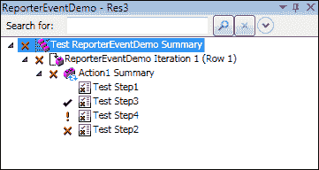

# 第五章 部署和维护框架

在上一章中，我们学习了如何设计和创建测试框架。在部署框架时的关键考虑因素是可移植性和底层环境的配置。调试是一个重要的预部署活动。在本章中，我们将讨论以下内容：

+   QTP 中的脚本调试技术

+   预部署审查清单

+   自定义日志和过滤日志消息

+   部署框架

+   维护框架

# 预部署

一旦框架测试完成并且已经提出错误，我们将开始调试。此过程试图通过查看以下内容来找出框架中出了什么问题：

+   失败的原因

+   失败的地方

+   如何修复错误

在设计阶段计划调试，并通过开发自定义和错误日志来实现。提供过滤、启用和禁用日志和功能的机制。这有助于在框架设计的开发和维护阶段调试脚本。QTP 为调试脚本、动作和功能库提供了各种选项。

## 使用 QTP 进行调试

QTP 为调试属于功能库或动作的脚本提供了各种方法。要调试脚本，从脚本或动作的开始执行到某个步骤，或从某个步骤执行到脚本或动作的结束。以下部分描述了 QTP 提供的各种调试脚本的技术。在开始调试脚本之前，请确保应用程序已打开相关位置。

### 运行到步骤

当点击此选项时，它将从脚本或动作的开始（仅限**专家视图**）运行测试到测试或动作的当前位置，并在特定步骤停止执行。要从开始运行测试，导航到**资源** | **运行到步骤**或按*Ctrl* + *F10*。

### 从步骤调试

要从步骤进行调试，而不是从脚本或动作的开始，使用**从步骤调试**选项；它允许您从测试或动作的特定步骤进行调试。要从特定步骤进行调试，导航到**资源** | **从步骤调试**。

### 从步骤运行

指示 QTP 从特定步骤而不是从脚本的开始或动作的开始运行动作。为此，导航到**资源** | **从步骤运行**。

在**专家视图**中，**从步骤运行**选项将从所选脚本运行到动作的结束（或直到达到断点）。在此模式下使用**从步骤运行**选项将忽略任何迭代。然而，如果动作包含嵌套动作，QTP 将运行嵌套动作，直到达到嵌套动作定义的迭代次数。

### 从动作运行

此选项将从脚本的开始运行测试到所选动作的开始，然后暂停运行会话。导航到**测试流程**面板，右键单击**从动作运行**。

### 从动作调试

指示 QTP 从所选动作的开始处开始调试会话并暂停。导航到**测试流程**面板，然后右键单击**从动作开始调试**。

### 运行到动作

指示 QTP 从所选动作的开始处开始运行会话。导航到**测试流程**面板，然后右键单击**运行到动作**。

### 调试函数库

创建框架需要创建单独的函数库。为了更好的维护，调试函数库的步骤如下：

1.  将函数库与一个测试关联起来。

1.  在你的测试中，插入对函数库中定义的至少一个函数的调用。

1.  运行测试，挂起运行会话，并调试函数库。

    ### 小贴士

    在调试会话期间，所有文档都是只读的，不能编辑。要在调试会话期间编辑文档，我们必须停止调试会话。

    当测试脚本使用`ExecuteFile`语句时，执行标记可能无法正确显示。

### 部署前的检查清单审查

在部署之前，确保我们审查以下点（存在于脚本中或已妥善处理）以降低框架的维护成本：

+   测试应该始终有一个已知的起点。

+   应始终以相同的起点结束。

    测试应该从特定点开始，并确保整个基础设施已准备好执行。如果脚本通过启动 AUT 并在执行结束时关闭应用程序来开始其执行，则下一次迭代或测试将从打开应用程序的起点开始。

+   测试应该清理资源：例如，关闭 MS Excel、关闭文件、关闭测试等。

+   配置值而不是硬编码；使用代码片段中显示的环境变量，或使用字典对象：

    ```js
    <Environment>
      <Variable>
        <Name>AppPath</Name>
        <Value>C:\Program Files\HP\QuickTest Professional\samples\flight\app\flight4a.exe</Value>
      </Variable>
      <Variable>
        <Name>ErrFileExtn</Name>
        <Value>.bmp</Value>
      </Variable>

    </Environment>
    ```

+   适当的注释和脚本头部

    标头允许我们阅读关于函数或脚本的简要描述，如下所示。这有助于使脚本和函数易于阅读和维护：

    ```js
    '**************************************************
    'Author
    'Description
    'Date Creation
    'Parameters    in   out 
    'Change History
    'Changed By Date Description
    '***************************************************
    ```

+   可读性和适当的文档。

+   脚本应该是可维护的和易于修改的

    脚本和函数头部提高了可读性，并允许轻松修改代码，因为它揭示了关键信息并减少了维护时间。

+   错误处理和错误快照

    确保脚本包含使用自定义库、`CaptureBitmap`方法或桌面实用程序的`CaptureBitmap`来捕获快照的代码。

+   如果发生错误，测试应该揭示最大信息。

    错误信息应该是清晰和简洁的。

+   日志工具

    日志工具是必须的，以提供信息和错误日志。

+   代码应该有适当的同步

    确保代码能够通过使用`wait`、`wait`属性、`exist`、`enable`和`sync`来处理同步问题。

+   优雅退出

    确保代码能够适当地使用`Exit` `Function`、`Exit` `For`、`Exit` `Test`和`Exit` `Action`实现优雅退出。

## 自定义日志

所有的这些技术都对测试脚本有用，但当我们设计框架时，必须有某些抽象和一系列层来达到实际错误点。自定义日志揭示了错误条件发生的方式和位置。良好的日志机制会显示相关的消息和错误的快照。自定义日志应提供以下内容：

+   启用日志记录

+   禁用日志记录

+   过滤日志

### 启用日志记录

调试的最简单方法是使用`print`或`MsgBox`语句。`Print`语句在 QTP 日志窗口中显示消息，而`MsgBox`显示消息框，用户需要明确点击**确定**。通常不推荐使用`MsgBox`选项，因为它需要人工干预，但在某些情况下它有助于快速解决问题。

框架的调试版本允许我们打印或显示消息以揭示查找问题所需的信息。QTP 还提供了`Reporter`对象，可以将消息报告到**运行结果**窗口。除了`print`和`MsgBox`语句外，日志记录是调试的重要工具。以下示例演示了如何启用或禁用日志记录：

+   使用`Reporter`对象的`Filter`属性和`rfEnableAll`选项，通过`Reporter`对象显示所有消息

+   使用环境中的`Debug`变量将日志消息`ON`

+   使用`MsgBox`语句在窗口中显示消息

+   使用`print`语句在 QTP 的打印日志中打印值

    ```js
    Public Function ActLogin (ldata)
       'Author 
       'Description
       'Create Date
       'Set the environment variable as rfEnableAll or 0
        Reporter.Filter = Environment("DebugOption") '
       SyncPage "LoginPage","LoginPage"
       userdata = Split(ldata,";")
       name = Mid(userdata(0), InStr(userdata(0),"=") + 1 )
      print name
       password =Mid(userdata(1), Instr(userdata(1),"=") + 1 )
      print password
       Browser("LoginPage").Page("LoginPage").WebEdit("userName").Set name
       Browser("LoginPage").Page("LoginPage").WebEdit("password").Set password
       Browser("LoginPage").Page("LoginPage").Image("Sign-In").Click
      If Environment("Debug")  = ON  
       Reporter.ReportEvent micPass ,"Login", "Pass" 
       WriteToLog logfilepath, "Pass","Login","username "& username  & and password"& password
    Else
    End Function
    ```

### 禁用日志

禁用日志消息与启用消息正好相反：

+   使用`Reporter`对象的`Filter`属性和`rfDisableAll`选项显示所有消息

+   使用环境中的`Debug`变量将日志消息`OFF`

+   使用`MsgBox`语句进行注释

+   使用`print`语句进行注释

### 过滤日志

当测试步骤执行后，日志消息会显示以下状态之一：

+   错误

+   警告

+   失败

+   完成或信息

在某些情况下，致命也是日志消息类型的分类之一。

QTP 的`Reporter`对象允许我们使用`ReportEvent`方法显示四种类型的消息。`ReportEvent`的语法如下所示：

```js
Reporter.ReportEvent EventStatus, ReportStepName, Details [, ImageFilePath] 

```

`ReportEvent`方法将事件报告到**运行结果**窗口。此方法允许我们通知用户各种事件。

以下为**运行结果**窗口的状态：

| 事件状态 | 操作 |
| --- | --- |
| `0`或`micPass` | 这会将通过的消息报告到**运行结果**窗口 |
| `1`或`micFail` | 这会将失败的消息报告到**运行结果**窗口 |
| `2`或`micDone` | 这会在**运行结果**窗口中报告步骤的完成 |
| `3`或`micWarning` | 这会将警告消息发送到**运行结果**窗口 |

以下是一个使用`ReportEvent`方法的示例：

```js
Reporter.ReportEvent micDone, "Test Step1", "Step Done..."
Reporter.ReportEvent micPass,"Test Step3", "Step Pass"
Reporter.ReportEvent micWarning, "Test Step4", "Step Warning"
Reporter.ReportEvent micFail,"Test Step2", "Step Fail"
```

一旦执行了`ReportEvent`方法，结果将在**运行结果**窗口中显示。以下截图显示了图标以及表示可能结果的提示信息：



以下表格列出了`Reporter`对象中的`Filter`选项：

| 事件状态 | 操作 |
| --- | --- |
| `0` 或 `rfEnableAll` | 将所有事件报告到**运行结果**窗口 |
| `1` 或 `rfEnableErrorsAndWarnings` | 向**运行结果**窗口报告警告和失败状态 |
| `2` 或 `rfEnableErrorsOnly` | 向**运行结果**窗口报告失败状态 |
| `3` 或 `rfDisableAll` | 不向**运行结果**窗口报告任何状态 |

### 测试版本与调试版本的区别

在框架测试自动化中，我们编写不会在最终程序中发布的调试支持代码（调试代码）。调试代码确保代码在某个点上正确，或者具有正确的值。调试代码也可以进行注释和取消注释。这可能会很耗时，因此我们更喜欢开启/关闭调试。调试代码在测试版本中不执行，但如果我们需要调试代码，我们可以启用调试代码。这变成了调试版本。以下示例代码显示了我们可以如何启用和禁用日志记录：

```js
Function WritetoLog ( Err_number, Err_description, custom_message)
If environment("Debug") = ON then
   Const ForReading=1 , ForAppending=8, ForWriting =2
   Dim FilesysObj, logfile,logfilepath
   logfilepath = Environment("LogFile")

   Set FilesysObj = CreateObject("Scripting.FileSystemObject")
   Set logfile = FilesysObj.OpenTextFile(logfilepath &"\log.txt",ForAppending , true)
   logfile.WriteLine(now() &"   " &Err_number & "    "& Err_description& "   "& custom_message)
   logfile.close()
else
endif
End Function
```

## 部署

在测试自动化框架完成并测试后，需要将其发布给自动化工程师、领域专家或甚至业务用户。发布活动从完成后的开发流程中继而来。它包括所有为组装系统做准备并将系统用于使用的操作。因此，它必须确定操作所需的资源并收集信息以执行部署过程的后续活动。部署是在发布之后开始的过程。在发布过程中，以下工件将被交付，但可能根据项目的需求而有所不同：

+   发布说明

+   文档映射（可追溯性矩阵）

+   设计/架构文档

+   配置文件

+   部署指南

+   用户指南

部署是一系列使脚本（框架）可供使用的活动。在部署过程中，确保安装了 QTP 所需的补丁和插件。确保所有必需的参数都已配置。部署后，测试自动化存储库将在本地驱动器的文件夹或测试管理工具中创建。

# 维护

维护包括错误纠正、功能增强、删除过时功能以及优化。这是一个评估、控制和进行修改的过程，导致代码、GUI 和应用程序流程以及自动化脚本的更改。在典型的软件项目生命周期中，维护导致增强。维护的常见观念是它仅涉及修复缺陷。所有维护活动都可以分为以下四个类别：

+   **适应性**：这修改了系统以应对环境或 AUT 的变化。

+   **完善性**：这实现了新的或更改的用户需求，这些需求涉及功能增强。

+   **纠正性**：这涉及诊断和修复错误，可能是用户发现的错误。

+   **预防性**：这增加了软件的可维护性或可靠性，以防止未来出现问题。

随着自动测试（AUT）随时间更新，以下之一或多个将保持最新：

+   **测试对象**：当发布新版本或补丁时，可能需要更改测试对象、它们的属性，以及添加或删除测试对象。

+   **OR 中的参数**：可能需要更改反映 AUT 变化的 OR 参数。随着对象属性可能发生变化，更新对象描述；这可以通过以下两种方式完成：

    +   手动更改对象属性

    +   在**更新运行**模式或**维护运行**模式下运行测试

这两种模式将在以下部分中解释。

我们可以删除、更改或添加测试对象的新版本；这导致测试对象的删除或添加。测试对象被添加或删除，并随着更改重新分配到 OR 中。

## 脚本/库维护

随着流程的变化，功能性和脚本和库的修改需要更新。在设计框架时，考虑脚本和功能库应该如何更改。在设计阶段，确保设计足够健壮，足以适应最小或无变化。

## 自动化测试库维护

为了维护框架，我们需要定期清理过时的资源或文档，例如日志文件、结果文件夹和测试数据。

QTP 提供了两种维护脚本的方法。这些将在以下部分中解释。

### **维护运行模式**

当脚本在**维护运行**模式下运行且对象发生变化时，它会提供更新属性和步骤或保持原始对象和步骤不变的选择。如果 QTP 无法识别测试对象，它会要求用户在 AUT 中指向对象，然后提供更新属性或保持原始对象或步骤的选项。如果更改的检查点值未更新，它们将在不匹配的情况下失败。

### **更新运行模式**

**更新运行**模式允许我们执行以下操作：

+   更新测试对象描述

+   更新检查点和输出值

+   更新活动屏幕图像和值

决定需要更新什么，并选择前面列表中所示选项。如果 QTP 无法识别对象，它将抛出错误。如果对象已更改，它将更新对象而不会通知用户。

## 增强

增强过程始于分析变更对脚本的影响。增强测试，调试它，然后发布。

增强过程中的关键步骤如下所示：

+   理解变更及其影响

+   修改脚本并对其进行文档化

+   测试

+   调试并修复错误

+   发布

总体目标是实现低维护成本。维护阶段的问题既包括管理问题也包括技术问题。测试自动化面临各种管理问题，例如估算成本、改变客户优先级和人员配置，而技术问题的例子包括理解有限、影响分析和测试。该框架由于其测试自动化存储库结构和添加、删除和修改脚本和库的标准方式，允许低维护成本。

# 摘要

本章重点介绍了维护框架所需的技术。调试是快速识别和修复问题的关键技术。下一章将讨论使用 JavaScript，它允许与网页中的 DOM 进行交互，并使用 XPath 创建脚本。
