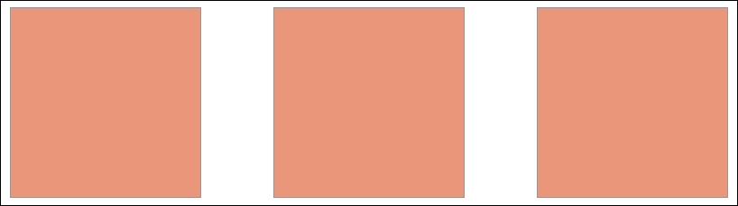
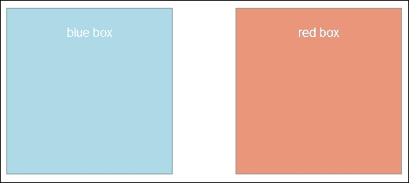
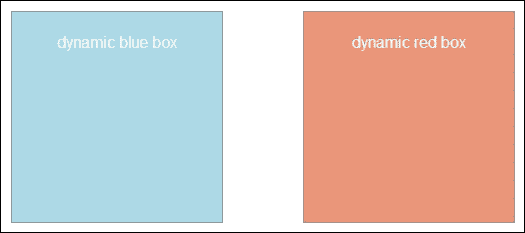
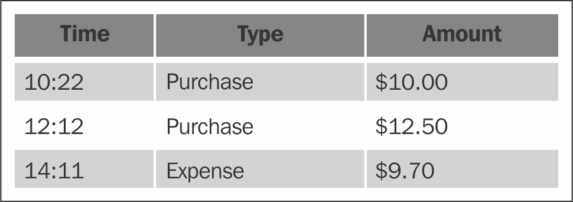

# 第二章：选择

在本章中，我们将介绍：

+   选择单个元素

+   选择多个元素

+   遍历选择

+   执行子选择

+   函数链式调用

+   操作原始选择

# 简介

在使用 D3 进行任何数据可视化项目时，你需要执行的最基本任务之一就是选择。选择可以帮助你定位页面上的某些视觉元素。如果你已经熟悉 W3C 标准化的 CSS 选择器或其他类似的选择器 API，例如 jQuery 和 Zepto.js，那么你会发现 D3 的选择器 API 非常容易上手。如果你之前没有使用过选择器 API，不要担心；本章旨在通过一些非常直观的食谱分步骤介绍这个主题。它将涵盖你数据可视化需求的所有常见用例。

## 介绍选择

选择器支持由 W3C 标准化，因此所有现代网络浏览器都内置了对选择器 API 的支持。然而，当涉及到 Web 开发时，特别是数据可视化领域，基本的 W3C 选择器 API 存在局限性。标准的 W3C 选择器 API 只提供选择器，而不提供选择。这意味着选择器 API 可以帮助你在文档中选择元素；然而，要操作选中的元素，你仍然需要遍历每个元素。考虑以下使用标准选择器 API 的代码片段：

```js
var selector = document.querySelectorAll("p"); 
selector.forEach(function(p){ 
    // do something with each element selected 
    console.log(p); 
}); 

```

上述代码实际上选择了文档中的所有`<p>`元素，然后遍历每个元素执行某些任务。这显然会很快变得繁琐，尤其是在你需要在页面上不断操作许多不同元素时，这是我们通常在数据可视化项目中做的事情。这就是为什么 D3 引入了自己的选择器 API，使得开发变得更加轻松。在本章的其余部分，我们将介绍 D3 的选择器 API 是如何工作的以及它的一些强大功能。

## CSS3 选择器基础

在我们深入探讨 D3 的选择器 API 之前，需要对 W3C 第三级选择器 API 进行一些基本介绍。如果你已经熟悉 CSS3 选择器，可以自由跳过这一部分。D3 的选择器 API 是基于第三级选择器构建的，也更为人所知的是 CSS3 选择器支持。在本节中，我们计划介绍一些理解 D3 选择器 API 所必需的常见 CSS3 选择器语法。以下列表包含了一些在数据可视化项目中通常会遇到的常见 CSS3 选择器约定：

+   `#foo`：选择具有`id`值为`foo`的元素

    ```js
         <div id="foo"> 

    ```

+   `foo`：选择元素`foo`

    ```js
         <foo> 

    ```

+   `.foo`：选择具有`class`值为`foo`的元素

    ```js
         <div class="foo"> 

    ```

+   `[foo=goo]`：选择具有`foo`属性值并将其设置为`goo`的元素

    ```js
         <div foo="goo"> 

    ```

+   `foo goo`：选择`foo`元素内部的`goo`元素

    ```js
         <foo><goo></foo> 

    ```

+   `foo#goo`：选择具有`id`值为`goo`的`foo`元素

    ```js
         <foo id="goo"> 

    ```

+   `foo.goo`：选择具有`goo`作为`class`值的`foo`元素

    ```js
         <foo class="goo"> 

    ```

+   `foo:first-child`：选择`foo`元素的第一个子元素

    ```js
         <foo> // <-- this one 
         <foo> 
         <foo>  

    ```

+   `foo:nth-child(n)`：选择`foo`元素的第`n`个子元素（`n`是从 1 开始的，第一个子元素为 1）

    ```js
         <foo> 
         <foo> // <-- foo:nth-child(2) 
         <foo> // <-- foo:nth-child(3) 

    ```

CSS3 选择器是一个相当复杂的话题。在这里，我们只列出了一些您需要理解和掌握的常见选择器，这些选择器在您使用 D3 时非常有效。有关此主题的更多信息，请访问 W3C 第 3 级选择器 API 文档[`www.w3.org/TR/css3-selectors/`](http://www.w3.org/TR/css3-selectors/)。

### 注意

如果您正在针对不支持选择器的旧版浏览器，可以在 D3 之前包含 Sizzle 以实现向后兼容。您可以在[`sizzlejs.com/`](http://sizzlejs.com/)找到 Sizzle。

目前，下一代选择器 API 的第 4 级正处于 W3C 的草案阶段。您可以查看它提供的内容及其当前草案[`drafts.csswg.org/selectors-4/`](https://drafts.csswg.org/selectors-4/)。

主要浏览器厂商已经开始了对第 4 级选择器的实现；如果您想了解您浏览器对选择器的支持程度，可以尝试访问这个实用的网站：[`css4-selectors.com/browser-selector-test/`](http://css4-selectors.com/browser-selector-test/)。

# 选择单个元素

有时您可能需要在页面上选择单个元素以执行某些视觉操作。这个配方将向您展示如何使用 CSS 选择器在 D3 中执行有针对性的单个元素选择。

## 准备工作

在您的网络浏览器中打开以下文件的本地副本：

[`github.com/NickQiZhu/d3-cookbook-v2/blob/master/src/chapter2/single-selection.html`](https://github.com/NickQiZhu/d3-cookbook-v2/blob/master/src/chapter2/single-selection.html)。

## 如何实现...

让我们选择一些东西（比如一个`paragraph`元素）并在屏幕上生成经典的*hello world*。

```js
<p id="target"></p> <!-- A --> 

<script type="text/javascript"> 
    d3.select("p#target") // <-- B 
    .text("Hello world!"); // <-- C 
</script> 

```

这个配方简单地在您的屏幕上生成文本**Hello world!**。

## 工作原理...

`d3.select`命令用于在 D3 中执行单个元素选择。此方法接受一个表示有效 CSS3 选择器的字符串，或者如果您已经有了要选择的元素的引用，则接受一个元素对象。`d3.select`命令返回一个 D3 选择对象，您可以在其上链式调用修改函数来操作此元素的属性、内容或内部 HTML。

### 注意

可以使用选择器选择多个元素，只要在选中时只返回第一个元素即可。

在这个例子中，我们简单地选择了`target`值为`id`的段落元素，并在第`B`行将其文本内容设置为`Hello world!`。所有 D3 选择都支持一组标准修改函数。在这个特定例子中我们展示的`text`函数就是其中之一。以下是在本书中你将遇到的一些最常见的修改函数：

+   `selection.attr`：此函数允许你检索或修改选定元素（或元素集）上的给定属性：

    ```js
         // set foo attribute to goo on p element 
         d3.select("p").attr("foo", "goo");  
         // get foo attribute on p element 
         d3.select("p").attr("foo"); 

    ```

+   `selection.classed`：此函数允许你为选定的元素（或元素集）添加或删除 CSS 类：

    ```js
         // test to see if p element has CSS class goo 
         d3.select("p").classed("goo"); 
         // add CSS class goo to p element 
         d3.select("p").classed("goo", true); 
         // remove CSS class goo from p element. classed function 
         // also accepts a function as the value so the decision  
         // of adding and removing can be made dynamically 
         d3.select("p").classed("goo", function(){return false;}); 

    ```

+   `selection.style`：此函数允许你为选定的元素（或元素集）设置具有特定名称的 CSS 样式值：

    ```js
         // get p element's style for font-size 
         d3.select("p").style("font-size"); 
         // set font-size style for p to 10px 
         d3.select("p").style("font-size", "10px"); 
         // set font-size style for p to the result of some  
         // calculation. style function also accepts a function as  
         // the value can be produced dynamically 
         d3.select("p").style("font-size", function(){  
             return parseFloat(d3.select(this).style('font-size')) + 
                 10 + 'px'; 
         }); 

    ```

+   在前面的匿名函数中的变量`this`是选定元素`<p>`的 DOM 元素对象；因此，需要再次将其包裹在`d3.select`中，以便访问其`style`属性。

+   `selection.text`：此函数允许你访问和设置选定元素（或元素集）的文本内容，如下所示：

    ```js
         // get p element's text content 
         d3.select("p").text(); 
         // set p element's text content to "Hello" 
         d3.select("p").text("Hello"); 
         // text function also accepts a function as the value,  
         // thus allowing setting text content to some dynamically  
         // produced content 
         d3.select("p").text(function(){ 
           return Date(); 
         }); 

    ```

+   `selection.html`：此函数允许你修改元素的内部 HTML 内容，如下所示：

    ```js
         // get p element's inner html content 
         d3.select("p").html(); 
         // set p element's inner html content to "<b>Hello</b>" 
         d3.select("p").html("<b>Hello</b>"); 
         // html function also accepts a function as the value,  
         // thus allowing setting html content to some dynamically  
         // produced message 
         d3.select("p").html(function(){ 
           return d3.select(this).text() +  
             " <span style='color: blue;'>D3.js</span>"; 
         }); 

    ```

这些修改函数适用于单元素和多元素选择结果。当应用于多元素选择时，这些修改将应用于每个选定的元素。我们将在本章稍后的更复杂食谱中看到它们的实际应用。

当一个函数用作这些修改函数的值时，实际上有一些内置参数传递给这些函数，以启用数据驱动的计算。这种数据驱动的方法赋予了 D3 其力量和名称（**数据驱动文档**），将在下一章中详细讨论。

# 选择多个元素

通常选择单个元素是不够的，而是你想要同时将某些更改应用于页面上的元素集。在这个食谱中，我们将使用 D3 多元素选择器和其选择 API 进行操作。

## 准备工作

在你的网络浏览器中打开以下文件的本地副本：

[`github.com/NickQiZhu/d3-cookbook-v2/blob/master/src/chapter2/multiple-selection.html`](https://github.com/NickQiZhu/d3-cookbook-v2/blob/master/src/chapter2/multiple-selection.html) .

## 如何操作...

这正是`d3.selectAll`函数的设计目的。在下面的代码片段中，我们将选择三个不同的`div`元素，并使用一些 CSS 类来增强它们：

```js
<div></div> 
<div></div> 
<div></div> 

<script type="text/javascript"> 
    d3.selectAll("div") // <-- A 
    .attr("class", "red box"); // <-- B 
</script> 

```

以下代码片段生成以下视觉效果：



多元素选择

## 工作原理...

在这个例子中，您可能首先注意到 D3 选择 API 的使用与单元素版本是多么相似。这是 D3 选择 API 的强大设计选择之一。无论您要针对和操作多少个元素，是一个还是多个，修改函数都是完全相同的。我们之前章节中提到的所有修改函数都可以直接应用于多元素选择；换句话说，D3 选择是基于集合的。

现在，话虽如此，让我们更仔细地看看本节中所示的代码示例，尽管它通常很简单且具有自我描述性。在行`A`，使用了`d3.selectAll`函数来选择页面上的所有`div`元素。此函数调用的返回值是一个包含所有三个`div`元素的 D3 选择对象。紧接着，在行`B`，对这个选择调用了`attr`函数，将所有三个`div`元素的`class`属性设置为`red box`。正如本例所示，选择和操作代码非常通用，即使现在页面上有超过三个`div`元素，代码也不会改变。现在这似乎是一个微不足道的便利，但在后面的章节中，我们将展示这种便利如何使您的可视化代码更简单、更容易维护。

# 遍历选择项

有时能够遍历选择项中的每个元素并根据它们的位置不同地修改每个元素是非常方便的。在本菜谱中，我们将向您展示如何使用 D3 选择迭代 API 实现这一点。

## 准备工作

在您的网页浏览器中打开以下文件的本地副本：

[`github.com/NickQiZhu/d3-cookbook-v2/blob/master/src/chapter2/selection-iteration.html`](https://github.com/NickQiZhu/d3-cookbook-v2/blob/master/src/chapter2/selection-iteration.html) .

## 如何做到这一点...

D3 选择对象提供了一个简单的迭代接口，以便以类似于遍历 JavaScript 数组的方式执行迭代。在本例中，我们将遍历我们在前一个菜谱中使用的三个选定的`div`元素，并按如下方式用索引数字标注它们：

```js
<div></div> 
<div></div> 
<div></div> 

<script type="text/javascript"> 
d3.selectAll("div") // <-- A 
            .attr("class", "red box") // <-- B 
            .each(function (d, i) { // <-- C 
                d3.select(this).append("h1").text(i); // <-- D 
            }); 
</script> 

```

上述代码片段生成了以下视觉效果：


选择项迭代

## 它是如何工作的...

此示例基于我们在前一个部分中已经看到的内容构建。除了在行`A`选择页面上的所有`div`元素并在行`B`设置它们的类属性之外，在本例中，我们将对选择调用`each`函数，以展示我们如何遍历多元素选择并分别处理每个元素：

### 注意

在另一个函数的返回值上调用函数的形式称为 **函数链式调用**。如果您不熟悉这种调用模式，请参阅 第一章，*D3.js 入门*，其中解释了该主题。

以下列表解释了 `select`、`each` 和 `append` 函数：

+   `selection.each(function)`: `each` 函数接受一个迭代函数作为其参数。给定的迭代函数可以接收两个可选参数 `d` 和 `i`，以及一个作为 `this` 引用传递的隐藏参数，该引用指向当前 DOM 元素对象。第一个参数 `d` 代表绑定到该特定元素的数值（如果您觉得这很困惑，不用担心，我们将在下一章深入探讨数据绑定）。第二个参数 `i` 是正在迭代的当前元素对象的索引号。这个索引是从零开始的，意味着它从零开始，每次遇到新元素时增加。

+   `selection.append(tagName)`: 在本例中引入的另一个新功能是 `append` 函数。此函数使用给定的元素名称创建一个新元素，并将其作为当前选择中每个元素的最后一个子元素附加。它返回一个包含新附加元素的新选择。现在，有了这些知识，让我们更仔细地看看这个菜谱中的代码示例：

```js
     d3.selectAll("div") // <-- A 
         .attr("class", "red box") // <-- B 
         .each(function (d, i) { // <-- C 
             d3.select(this).append("h1").text(i); // <-- D 
         }); 

```

迭代函数定义在第 `C` 行，其中包含 `d` 和 `i` 参数。第 `D` 行稍微有趣一些。在第 `D` 行的开始处，`this` 引用被 `d3.select` 函数包装。这种包装实际上产生了一个包含当前 DOM 元素的单一元素选择，`this` 变量代表该元素。一旦包装，标准 D3 选择操作 API 就可以在 `d3.select(this)` 上使用。之后，对当前元素选择调用 `append("h1")` 函数，将新创建的 `h1` 元素附加到当前元素上。之后，它简单地设置这个新创建的 `h1` 元素的文本内容为当前元素的索引号。这产生了本菜谱中所示的可视化编号框。再次提醒，索引从 0 开始，每次遇到新元素时增加 1。

### 注意

DOM 元素对象本身具有非常丰富的接口。如果您想了解更多关于迭代函数中它能做什么的信息，请参阅 [`developer.mozilla.org/en-US/docs/Web/API/element`](https://developer.mozilla.org/en-US/docs/Web/API/element) 上的 DOM 元素 API。

# 执行子选择

在处理可视化时，您可能需要执行范围选择。例如，选择特定 `section` 元素内的所有 `div` 元素是范围选择的一个用例。在这个菜谱中，我们将展示如何通过不同的方法和它们的优缺点来实现这一点。

## 准备工作

在您的网络浏览器中打开以下文件的本地副本：

[`github.com/NickQiZhu/d3-cookbook-v2/blob/master/src/chapter2/sub-selection.html`](https://github.com/NickQiZhu/d3-cookbook-v2/blob/master/src/chapter2/sub-selection.html) .

## 如何做...

以下代码示例使用 D3 支持的不同子选择器样式选择了两个不同的 `div` 元素：

```js
<section id="section1"> 
    <div> 
        <p>blue box</p> 
    </div> 
</section> 
<section id="section2"> 
    <div> 
        <p>red box</p> 
    </div> 
</section> 

<script type="text/javascript"> 
    d3.select("#section1 > div") // <-- A 
            .attr("class", "blue box"); 

    d3.select("#section2") // <-- B 
            .select("div") // <-- C 
            .attr("class", "red box");  
</script> 

```

此代码生成以下视觉输出：



子选择

## 它是如何工作的...

虽然它产生了相同的效果，但这个例子展示了两种非常不同的子选择技术。我们将分别讨论它们，这样您可以了解它们的优缺点以及何时使用一种而不是另一种：

+   **选择器级别-3 组合器**: 在行 `A`，`d3.select` 使用了一个看起来特殊的字符串，该字符串由一个标签名和一个使用大于号（U+003E, >）连接的另一个标签名组成。这种语法称为 *组合器*（这里的大于号表示它是一个子组合器）。级别-3 选择器支持几种不同的结构组合器。在这里，我们将简要介绍其中最常见的一些。

+   **后代组合器**: 这个组合器的语法与 `selector selector` 相同。正如其名称所暗示的，后代组合器用于描述两个选择之间的松散父子关系。之所以称之为松散的父子关系，是因为后代组合器不关心第二个选择是否是父选择器的子元素、孙子元素或曾孙元素。让我们通过一些例子来阐述这种松散关系概念：

    ```js
         <div> 
         <span> 
         The quick <em>red</em> fox jumps over the lazy brown dog 
            </span> 
         </div> 

    ```

    如果我们使用以下选择器：

    ```js
            div em 

    ```

    它将选择 `em` 元素，因为 `div` 是 `em` 元素的祖先元素，而 `em` 是 `div` 元素的子元素。

+   **子组合器**: 这个组合器的语法类似于 `selector > selector`。子组合器提供了一种更严格的方式来描述两个元素之间的父子关系。子组合器是通过使用大于号（U+003E, >）字符分隔两个选择器来定义的，如下所示：

    ```js
             span > em
    ```

    它将选择 `em` 元素，因为在我们这个例子中 `em` 是 `span` 元素的直接子元素。选择器 `div > em` 不会产生任何有效选择，因为 `em` 不是 `div` 元素的直接子元素。

    ### 注意

    第三级选择器也支持兄弟组合器；然而，由于它不太常见，我们在这里不会涉及；感兴趣的读者可以参考 W3C 第三级选择器文档，网址为 [`www.w3.org/TR/css3-selectors/#sibling-combinators`](http://www.w3.org/TR/css3-selectors/#sibling-combinators) 。W3C 第四级选择器提供了一些有趣的附加组合器，即后续兄弟和引用组合器，这些组合器可以提供一些非常强大的目标选择能力；更多详情请参阅 [`drafts.csswg.org/selectors-4/#combinators`](https://drafts.csswg.org/selectors-4/#combinators)。

+   **D3 嵌套子选择**：在行`B`和`C`上，使用了不同类型的子选择技术。在这种情况下，首先在行`B`上通过选择`section #section2`元素进行简单的 D3 选择。紧接着，在行`C`上又进行了一次`select`操作来选择一个`div`元素。这种嵌套选择定义了一个作用域选择。用简单的话来说，这基本上意味着选择嵌套在`#section2`下的`div`元素。在语义上，这本质上等同于使用后代组合器`#section2 div`。然而，这种子选择形式的优势在于，由于父元素是单独选择的，它允许你在选择子元素之前处理父元素。为了演示这一点，让我们看一下以下代码片段：

    ```js
         d3.select("#section2") // <-- B 
             .style("font-size", "2em") // <-- B-1 
             .select("div") // <-- C 
             .attr("class", "red box"); 

    ```

    如前述代码片段所示，您可以看到在选中`div`元素之前，我们可以在行`B-1`上对`#section2`应用一个修改器函数。这种灵活性将在下一节中进一步探讨。

# 函数链

如我们所见，D3 API 完全围绕函数链的概念设计。因此，它形成了一个用于动态构建 HTML/SVG 元素的领域特定语言（DSL）。在这个代码示例中，我们将看看如何仅使用 D3 构建上一个示例的整个主体结构。

### 注意

如果 DSL 对您来说是一个新概念，我强烈推荐您查看由*马丁·福勒*在其书籍《领域特定语言》中的摘录形式提供的关于 DSL 的出色解释。摘录可以在 [`www.informit.com/articles/article.aspx?p=1592379`](http://www.informit.com/articles/article.aspx?p=1592379) 找到。

## 准备工作

在您的网络浏览器中打开以下文件的本地副本：

[`github.com/NickQiZhu/d3-cookbook-v2/blob/master/src/chapter2/function-chain.html`](https://github.com/NickQiZhu/d3-cookbook-v2/blob/master/src/chapter2/function-chain.html)。

## 如何操作...

让我们看看如何使用函数链来生成简洁且易于阅读的代码，这些代码可以生成动态的视觉内容：

```js
<script type="text/javascript"> 
  var body = d3.select("body"); // <-- A 

  body.append("section") // <-- B 
      .attr("id", "section1") // <-- C 
    .append("div") // <-- D 
      .attr("class", "blue box") // <-- E 
    .append("p") // <-- F 
      .text("dynamic blue box"); // <-- G 

  body.append("section") 
      .attr("id", "section2") 
    .append("div") 
      .attr("class", "red box") 
    .append("p") 
      .text("dynamic red box"); 
</script> 

```

此代码生成以下视觉输出（类似于我们在上一章中看到的）：



函数链

## 它是如何工作的...

尽管与上一个例子在视觉上相似，但在这个例子中，DOM 元素的构建过程与上一个菜谱有显著不同。正如代码示例所示，与上一个菜谱中同时存在`section`和`div`元素不同，页面上没有静态的 HTML 元素。

让我们仔细看看这些元素是如何动态创建的。在第 A 行，对顶级`body`元素进行了通用选择。使用名为`body`的局部变量缓存了`body`选择结果。然后，在第 B 行，向 body 中添加了一个新的`section`元素。记住，`append`函数返回一个包含新添加元素的新选择；因此，在第 C 行，可以将新创建的`section`元素的`id`属性设置为`section1`。之后，在第 D 行，创建了一个新的`div`元素并将其附加到`#section1`上，其 CSS 类在 E 行设置为`blue box`。对于下一步，类似于上一行，在第 F 行，将一个`paragraph`元素附加到`div`元素上，其文本内容在 G 行设置为`dynamic blue box`。

如此例所示，此链式过程可以继续创建任意复杂度的结构。实际上，这就是典型的基于 D3 的数据可视化结构创建方式。许多可视化项目仅包含 HTML 骨架，并依赖于 D3 创建其余部分。如果您想高效地使用 D3 库，熟悉这种函数链式方法至关重要。

### 注意

D3 的一些修改函数返回一个新的选择，例如`select`、`append`和`insert`函数。使用不同级别的缩进区分函数链正在应用的选择是一个好习惯。

# 操作原始选择

有时，在开发过程中访问 D3 原始选择数组可能有益，无论是用于调试目的还是与其他需要访问原始 DOM 元素的 JavaScript 库集成。在这个菜谱中，我们将向您展示如何做到这一点。我们还将看到 D3 选择对象的一些内部结构。

## 准备工作

在您的网页浏览器中打开以下文件的本地副本：

[`github.com/NickQiZhu/d3-cookbook-v2/blob/master/src/chapter2/raw-selection.html`](https://github.com/NickQiZhu/d3-cookbook-v2/blob/master/src/chapter2/raw-selection.html) .

## 如何做...

当然，您可以使用`nth-child`选择器或选择迭代函数`each`来实现这一点，但在某些情况下，这些选项可能过于繁琐和不方便。这时，您可能会发现处理原始选择数组是一种更方便的方法。在这个例子中，我们将看到如何访问和利用原始选择数组：

```js
<table class="table"> 
    <thead> 
    <tr> 
        <th>Time</th> 
        <th>Type</th> 
        <th>Amount</th> 
    </tr> 
    </thead> 
    <tbody> 
    <tr> 
        <td>10:22</td> 
        <td>Purchase</td> 
        <td>$10.00</td> 
    </tr> 
    <tr> 
        <td>12:12</td> 
        <td>Purchase</td> 
        <td>$12.50</td> 
    </tr> 
    <tr> 
        <td>14:11</td> 
        <td>Expense</td> 
        <td>$9.70</td> 
    </tr> 
    </tbody> 
</table> 

<script type="text/javascript"> 
    var trSelection = d3.selectAll("tr"); // <-- A 
    var headerElement = trSelection.nodes()[0]; // <-- B 
    d3.select(headerElement).attr("class", "table-header"); // <-     
    - C 
    var rows = trSelection.nodes(); 
    d3.select(rows[1]).attr("class", "table-row-odd"); // <-- D 
    d3.select(rows[2]).attr("class", "table-row-even"); // <-- E 
    d3.select(rows[3]).attr("class", "table-row-odd"); // <-- F 
</script> 

```

此菜谱生成以下视觉输出：



原始选择操作

## 它是如何工作的...

在这个例子中，我们遍历了一个现有的 HTML 表格来着色表格。这并不是一个很好的例子，说明你如何使用 D3 来着色表格中的奇数行和偶数行。相反，这个例子旨在展示如何访问原始选择数组。

### 注意

在表格中为奇数和偶数行着色的一个更好的方法就是使用`each`函数，然后依靠索引参数`i`来完成这项工作。

在行`A`上，我们选择所有行并将选择存储在`trSelection`变量中。D3 选择有一个方便的`node()`函数，它返回一个包含所选元素节点的数组。因此，为了访问第一个选中的元素，你需要使用`d3.selectAll("tr").nodes()[0]`，第二个元素可以通过`d3.selectAll("tr").nodes()[1]`访问，依此类推。正如我们在行`B`上所看到的，可以使用`trSelection.nodes()[0]`来访问表格的表头元素，这将返回一个 DOM 元素对象。同样，正如我们在前面的章节中所展示的，任何 DOM 元素都可以直接使用`d3.select`来选择，如行`C`所示。行`D`、`E`和`F`演示了如何直接索引和访问选择中的每个元素。

在某些情况下，原始选择访问可能很有用，尤其是当你需要与其他 JavaScript 库一起使用 D3 时，因为其他库无法与 D3 选择一起工作，而只能与原始 DOM 元素一起工作。

### 注意

此外，这种方法在测试环境中通常非常有用，因为在测试环境中，快速知道每个元素的绝对索引并获得它们的引用可能会很方便。我们将在稍后的章节中更详细地介绍单元测试。

在本章中，我们介绍了许多不同的方法，说明了如何使用 D3 的选择 API 来选择和操作 HTML 元素。在下一章中，我们将探讨如何将数据绑定到这样的选择上，以动态驱动选中元素的可视外观，这是数据可视化的基本步骤。
