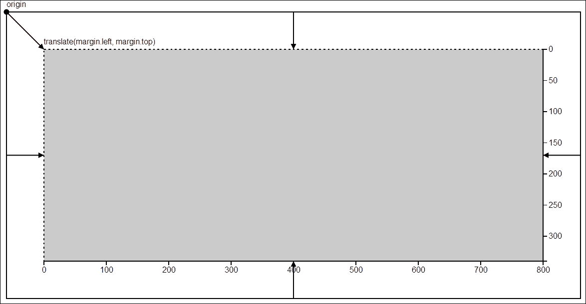
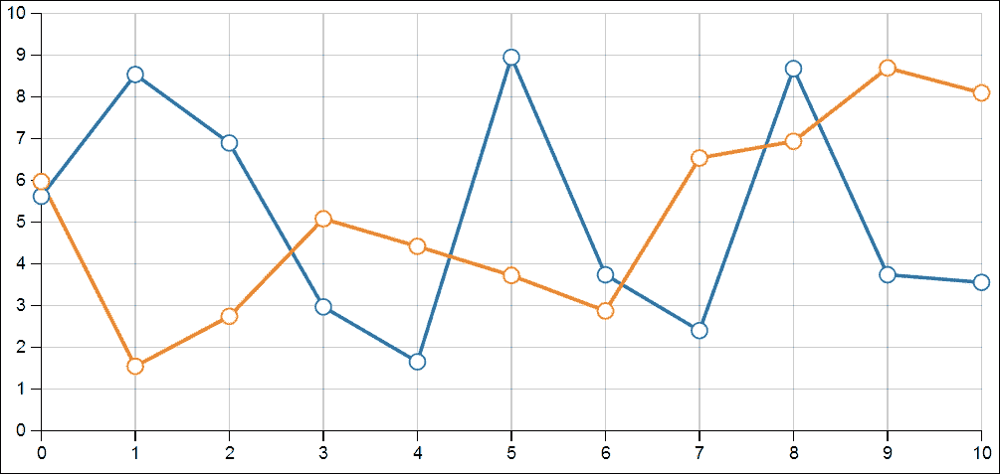
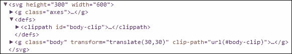
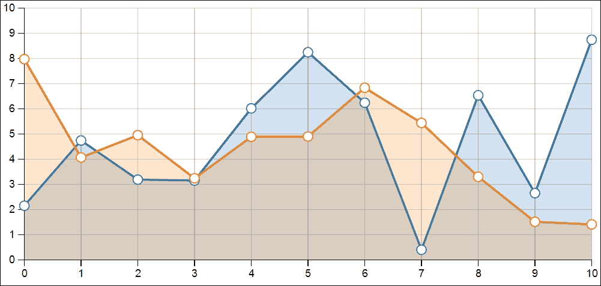
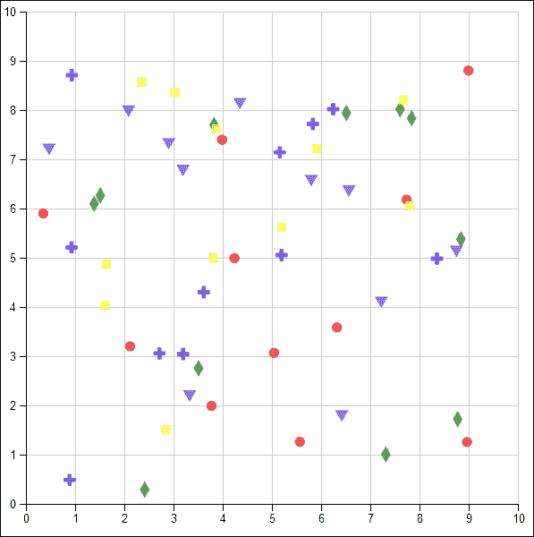
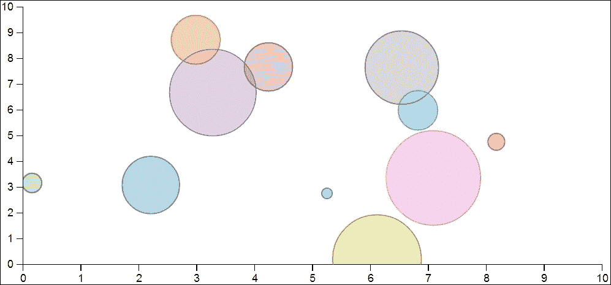
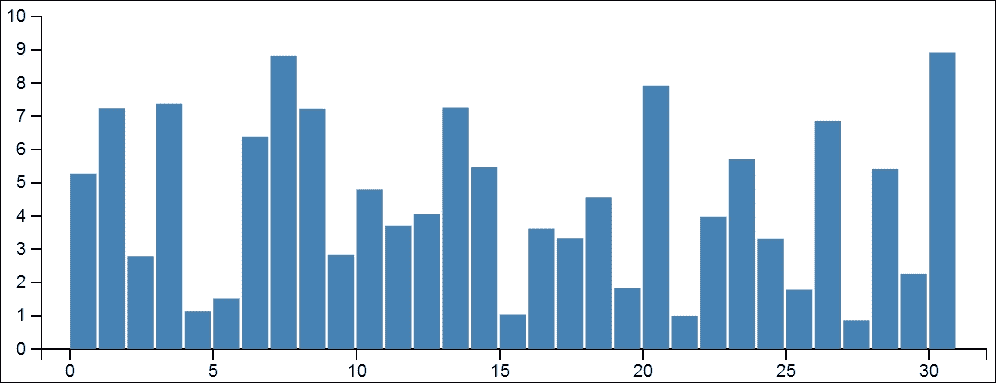

# 第八章. 图表化

在本章中，我们将涵盖：

+   创建折线图

+   创建面积图

+   创建散点图图表

+   创建气泡图

+   创建柱状图

# 简介

在本章中，我们将关注数据可视化中最古老且最值得信赖的伴侣之一——图表。图表是对数据进行良好定义和理解的图形表示；以下定义以最简单的术语表达了这一点：

> *(在图表中)数据通过符号表示，例如柱状图中的柱子、折线图中的线条或饼图中的切片。*
> 
> *Jensen C. & Anderson L. (1991)*

当图表用于数据可视化时，它们被广泛理解的图形语义和语法减轻了观众从学习图形隐喻的含义中的负担。因此，他们可以专注于数据本身以及通过可视化生成的信息。本章的目标不仅是介绍一些常用的图表类型，而且还展示您迄今为止学到的各种主题和技术如何结合并利用，以使用 D3 制作出简洁、交互式的图表。

本章中的食谱比我们迄今为止遇到的食谱要长得多，因为它们旨在实现功能齐全且可重用的图表。我已经尝试将这些内容分成不同的部分，并保持一致的图表结构，以简化您的阅读体验。然而，仍然强烈建议您在阅读本章时，同时在浏览器和文本编辑器中打开配套的代码示例，以最大限度地减少潜在的混淆并最大化收益。

## D3 图表约定

在您开始创建第一个可重用的 D3 图表之前，我们需要介绍一些在 D3 社区中普遍接受的图表约定；否则，您可能会创建出可能会让用户感到困惑而不是帮助他们的图表库。

### 注意

如您所想象，D3 图表通常使用 SVG 而不是 HTML 来实现；然而，我们在这里将要讨论的约定也适用于基于 HTML 的图表，尽管实现细节将有所不同。

让我们先看看以下图表：



D3 图表约定

如此图表所示，SVG 图像中的原点 *(0, 0)* 位于其最左上角，正如预期的那样；然而，这个约定的最重要方面是关于如何定义图表边距，以及轴线的位置。

+   **边距**：首先，让我们看看这个约定最重要的方面——边距。正如您所看到的，对于每个图表，都有四种不同的边距设置：左边距、右边距、上边距和下边距。灵活的图表实现应该允许用户为这些边距中的每一个设置不同的值，我们将在后面的食谱中看到如何实现这一点。

+   **坐标转换**：其次，这种约定还建议使用 SVG 平移变换来定义图表主体（灰色区域）的坐标参考，**translate(margin.left, margin.top)**。这种平移有效地将图表主体区域移动到所需的位置；并且这种方法的另一个额外好处是，通过改变图表主体坐标的参考框架，简化了在图表主体内部创建子元素的工作，因为边距大小变得无关紧要。对于图表主体内部的任何子元素，其原点 *(0, 0)* 现在是图表主体区域的左上角。

+   **轴**：最后，此约定的最后一个方面是关于图表轴如何以及在哪里放置。如图所示，图表轴放置在图表边距内部，而不是作为图表主体的一部分。这种方法的优势在于将轴视为图表中的外围元素，因此不会使图表主体实现复杂化，并且还使轴渲染逻辑与图表独立且易于重用。

现在，让我们利用迄今为止所学的所有知识和技巧，创建我们的第一个可重用 D3 图表。

### 小贴士

要了解 D3 创建者的解释，请访问[`bl.ocks.org/mbostock/3019563`](http://bl.ocks.org/mbostock/3019563)。

# 创建折线图

折线图是一种常见的基本图表类型，在许多领域得到广泛应用。此图表由一系列通过直线段连接的数据点组成。折线图通常由两条垂直轴包围：*x* 轴和 *y* 轴。在此食谱中，我们将探讨如何使用 D3 实现这种基本图表，作为一个可配置为在不同尺度上显示多个数据系列的可重用 JavaScript 对象。除此之外，我们还将展示实现具有动画的动态多数据系列更新的技术。

## 准备工作

在您的网络浏览器中打开以下文件的本地副本：

[`github.com/NickQiZhu/d3-cookbook-v2/blob/master/src/chapter8/line-chart.html`](https://github.com/NickQiZhu/d3-cookbook-v2/blob/master/src/chapter8/line-chart.html)

阅读此食谱时，强烈建议您打开配套的代码示例。

## 如何操作...

让我们看一下以下实现此图表类型的代码；由于食谱的长度，我们在这里只展示代码的概要，而详细内容将在*工作原理...*部分中介绍：

```js
<script type="text/javascript"> 
// First we define the chart object using a functional object 

function lineChart() { // <-1A 
    ... 
    // main render function  
    _chart.render = function () { // <-2A 
    ... 
    }; 

    // axes rendering function 
    functionrenderAxes(svg) { 
        ... 
    } 
    ... 

    // function to render chart body 
    function renderBody(svg) { // <-2D         
    ... 
    } 

    // function to render lines 
    function renderLines() { 
    ... 
    } 

    // function to render data points 
    function renderDots() { 

    } 

    return _chart; // <-1E 
} 

```

此食谱生成以下图表：



折线图

## 工作原理...

如您所见，这个食谱比我们迄今为止遇到的任何内容都要复杂得多；因此，现在，我将将其分解成多个具有不同重点的详细部分。

### 图表对象和属性

首先，我们将看看这个图表对象是如何创建的，以及如何在以下代码中检索和设置其关联的属性：

```js
function lineChart() { // <-1A 
        var _chart = {}; 

        var _width = 600, _height = 300, // <-1B 
            _margins = {top: 30, left: 30, right: 30, bottom: 30}, 
            _x, _y, 
            _data = [], 
            _colors = d3.scaleOrdinal(d3.schemeCategory10), 
            _svg, 
            _bodyG, 
            _line; 

      ... 

      _chart.width = function (w) { 
            if (!arguments.length) return _width; 
            _width = w; 
            return _chart; 
        }; 

        _chart.height = function (h) { // <-1C 
            if (!arguments.length) return _height; 
            _height = h; 
            return _chart; 
        }; 

        _chart.margins = function (m) { 
            if (!arguments.length) return _margins; 
            _margins = m; 
            return _chart; 
        }; 

        ... 

       _chart.addSeries = function (series) { // <-1D 
            _data.push(series); 
            return _chart; 
        }; 

        return _chart; // <-1E 
} 

... 

var chart = lineChart() 
            .x(d3.scaleLinear().domain([0, 10])) 
            .y(d3.scaleLinear().domain([0, 10])); 

data.forEach(function (series) { 
    chart.addSeries(series); 
}); 

chart.render(); 

```

如您所见，图表对象是在第 1A 行使用名为`lineChart`的函数定义的，遵循我们在第一章中讨论的*理解 D3 风格的 JavaScript*配方中的功能对象模式，*使用 D3.js 入门*。利用功能对象模式提供的信息隐藏的更大灵活性，我们定义了一系列内部属性，所有属性名都以下划线开头（第 1B 行）。其中一些属性通过提供访问器函数（第 1C 行）公开。公开可访问的属性如下：

+   `width`：图表 SVG 总宽度（以像素为单位）

+   `height`：图表 SVG 总高度（以像素为单位）

+   `margins`：图表边距

+   `colors`：用于区分不同数据系列的图表序数颜色刻度

+   `x`：*x*轴刻度

+   `y`：*y*轴刻度

访问器函数是使用我们在第一章中介绍的技术实现的，*使用 D3.js 入门*，有效地将获取器和设置器函数结合在一个函数中，当没有提供参数时表现为获取器，当提供参数时表现为设置器（第 1C 行）。此外，`lineChart`函数及其访问器都返回一个图表实例，从而允许函数链式调用。最后，图表对象还提供了一个`addSeries`函数，该函数简单地将数据数组（`series`）推入其内部数据存储数组（`_data`），请参阅第 1D 行。

### 图表主体框架渲染

在介绍完基本的图表对象及其属性后，此可重用图表实现的下一个方面是图表主体`svg:g`元素的渲染及其剪辑路径的生成：

```js
_chart.render = function () { // <-2A 
  if (!_svg) { 
    _svg = d3.select("body").append("svg") // <-2B 
      .attr("height", _height) 
      .attr("width", _width); 

    renderAxes(_svg); 

    defineBodyClip(_svg); 
  } 

  renderBody(_svg); 
}; 
... 
function defineBodyClip(svg) { // <-2C 
  var padding = 5; 

  svg.append("defs") 
    .append("clipPath") 
    .attr("id", "body-clip") 
    .append("rect") 
    .attr("x", 0 - padding) 
    .attr("y", 0) 
    .attr("width", quadrantWidth() + 2 * padding) 
    .attr("height", quadrantHeight()); 
  } 

function renderBody(svg) { // <-2D 
  if (!_bodyG) 
    _bodyG = svg.append("g") 
      .attr("class", "body") 
      .attr("transform", "translate("  
        + xStart() + ","  
        + yEnd() + ")") // <-2E 
      .attr("clip-path", "url(#body-clip)");         

  renderLines(); 

  renderDots(); 
} 
... 

```

第 2A 行定义的`render`函数负责创建`svg:svg`元素并设置其`width`和`height`（第 2B 行）。之后，它创建一个覆盖整个图表主体区域的`svg:clipPath`元素。`svg:clipPath`元素用于限制可以应用绘画的区域。在我们的例子中，我们使用它来限制可以绘制的线条和点（仅限于图表主体区域）。此代码生成了以下 SVG 元素结构，用于定义图表主体：



### 小贴士

想了解更多关于剪切和遮罩的信息，请访问 [`www.w3.org/TR/SVG/masking.html`](https://www.w3.org/TR/SVG/masking.html) 。

第 2D 行定义的`renderBody`函数生成`svg:g`元素，该元素将所有图表主体内容包裹在一个根据我们在上一节中讨论的图表边距约定设置的平移中（第 2E 行）。

### 渲染坐标轴

坐标轴在`renderAxes`函数（第 3A 行）中渲染：

```js
function renderAxes(svg) { // <-3A 
    varaxesG = svg.append("g") 
                   .attr("class", "axes"); 

    renderXAxis(axesG); 

    renderYAxis(axesG); 
} 

```

如前一章所述，*x*轴和*y*轴都在图表边距区域内渲染。我们不会详细介绍轴的渲染，因为我们已经在第五章中详细讨论了这一主题，*玩转坐标轴*。

### 渲染数据系列

到目前为止，我们在这个食谱中讨论的内容并不仅限于这种图表类型，而是一个与其他基于笛卡尔坐标的图表类型共享的框架。最后，现在我们可以讨论这个食谱的核心——如何为多个数据系列创建线段和点。让我们看看以下负责数据系列渲染的代码片段：

```js
function renderLines() { 
        _line = d3.line() //<-4A 
                        .x(function (d) { return _x(d.x); }) 
                        .y(function (d) { return _y(d.y); }); 

         var pathLines = _bodyG.selectAll("path.line") 
                    .data(_data); 

        pathLines 
                .enter() //<-4B 
                    .append("path") 
                .merge(pathLines) 
                    .style("stroke", function (d, i) { 
                        return _colors(i); //<-4C 
                    }) 
                    .attr("class", "line") 
                .transition() //<-4D 
                    .attr("d", function (d) {  
                                return _line(d);  
                    }); 
} 

function renderDots() { 
    _data.forEach(function (list, i) { 
        var circle = _bodyG.selectAll("circle._" + i) //<-4E 
                .data(list); 

        circle.enter() 
                .append("circle") 
            .merge(circle) 
                .attr("class", "dot _" + i) 
                .style("stroke", function (d) { 
                    return _colors(i); //<-4F 
                }) 
            .transition() //<-4G 
                .attr("cx", function (d) { return _x(d.x); }) 
                .attr("cy", function (d) { return _y(d.y); }) 
                .attr("r", 4.5); 
    }); 
} 

```

线段和点是通过我们在第七章中介绍的技术生成的，*进入形状*。`d3.line`生成器在第 4A 行创建，用于创建映射数据系列的`svg:path`。使用 Enter-and-Update 模式在第 4B 行创建数据线。第 4C 行根据索引为每条数据线设置不同的颜色。最后，第 4E 行在更新模式下设置过渡，使数据线在每次更新时都能平滑移动。`renderDots`函数执行类似的渲染逻辑，生成一组代表每个数据点的`svg:circle`元素（第 4E 行），根据数据系列索引（第 4F 行）协调其颜色，并在第 4G 行上启动过渡，这样点就可以在数据更新时与线一起移动。

如本食谱所示，创建一个可重用的图表组件实际上需要做很多工作。然而，超过三分之二的代码用于创建外围图形元素和访问器方法。因此，在实际项目中，你可以提取这部分逻辑，并将此实现的大部分用于其他图表；尽管我们没有在我们的食谱中这样做以降低复杂性，但你仍然可以快速掌握图表渲染的所有方面。由于本书的范围有限，在后面的食谱中，我们将省略所有外围渲染逻辑，仅关注与每种图表类型相关的核心逻辑。如果你在阅读本章后面的食谱时需要再次检查外围渲染逻辑，请随时回到这个食谱。

# 创建面积图

面积图或面积图与折线图非常相似，主要基于折线图实现。面积图与折线图的主要区别在于，在面积图中，轴和线之间的区域将被填充颜色或纹理。在本食谱中，我们将探讨实现一种称为**分层面积图**的面积图的技术。

## 准备工作

在您的网络浏览器中打开以下文件的本地副本：

[`github.com/NickQiZhu/d3-cookbook-v2/blob/master/src/chapter8/area-chart.html`](https://github.com/NickQiZhu/d3-cookbook-v2/blob/master/src/chapter8/area-chart.html)

## 如何操作...

面积图的实现主要基于折线图的实现，并且共享许多共同的图形元素，例如坐标轴和裁剪路径；因此，在这个菜谱中，我们只展示与面积图实现具体相关的代码：

```js
... 

function renderBody(svg) { 
        if (!_bodyG) 
            _bodyG = svg.append("g") 
                    .attr("class", "body") 
                    .attr("transform", "translate("  
                        + xStart() + ","  
                        + yEnd() + ")")  
                    .attr("clip-path", "url(#body-clip)");         

        renderLines(); 

        renderAreas(); 

        renderDots(); 
    } 

    function renderLines() { 
        _line = d3.line() 
                        .x(function (d) { return _x(d.x); }) 
                        .y(function (d) { return _y(d.y); }); 

        var pathLines = _bodyG.selectAll("path.line") 
                .data(_data); 

        pathLines.enter() 
                    .append("path") 
                .merge(pathLines) 
                    .style("stroke", function (d, i) { 
                        return _colors(i); 
                    }) 
                    .attr("class", "line") 
                .transition() 
                    .attr("d", function (d) { return _line(d); }); 
    } 

    function renderDots() { 
        _data.forEach(function (list, i) { 
            var circle = _bodyG.selectAll("circle._" + i) 
                    .data(list); 

            circle.enter() 
                    .append("circle") 
                .merge(circle) 
                    .attr("class", "dot _" + i) 
                    .style("stroke", function (d) { 
                        return _colors(i); 
                    }) 
                .transition() 
                    .attr("cx", function (d) { return _x(d.x); }) 
                    .attr("cy", function (d) { return _y(d.y); }) 
                    .attr("r", 4.5); 
        }); 
    } 

    function renderAreas() { 
        var area = d3.area() // <-A 
                    .x(function(d) { return _x(d.x); }) 
                    .y0(yStart()) 
                    .y1(function(d) { return _y(d.y); }); 

        var pathAreas = _bodyG.selectAll("path.area") 
                .data(_data); 

        pathAreas.enter() // <-B 
                .append("path") 
            .merge(pathAreas) 
                .style("fill", function (d, i) {  
                    return _colors(i);  
                }) 
                .attr("class", "area") 
            .transition() // <-D 
                .attr("d", function (d) {  
                    return area(d); // <-E 
                }); 
    } 
... 

```

这个菜谱生成了以下层次面积图：



层次面积图

## 工作原理...

正如我们之前提到的，由于面积图的实现基于我们的折线图实现，实现的大部分内容与折线图相同。实际上，面积图需要渲染折线图中实现的精确线条和点。关键的区别在于`renderAreas`函数。在这个菜谱中，我们依赖于第七章中讨论的面积生成技术，即*“形状入门”*。在行`A`上创建了`d3.area`生成器，其上边线与线条匹配，而下边线（`y0`）固定在 x 轴上。

```js
var area = d3.area() // <-A 
  .x(function(d) { return _x(d.x); }) 
  .y0(yStart()) 
  .y1(function(d) { return _y(d.y); }); 

```

一旦定义了面积生成器，就采用经典的“进入-更新”模式来创建和更新面积。在进入情况下（行`B`），为每个数据系列创建了一个`svg:path`元素。在行`B2`中，我们将`pathAreas.enter()`和`pathAreas`合并；因此，所有后续代码都将应用于进入和更新模式；所有面积都使用其系列索引进行着色，因此将与我们的线和点匹配颜色（行`C`）：

```js
Var pathAreas = _bodyG.selectAll("path.area") 
                .data(_data); 

pathAreas.enter() // <-B 
.append("path") 
.merge(pathAreas) // <-B2 
.style("fill", function (d, i) {  
    return _colors(i); // <-C 
  }) 
  .attr("class", "area") 
.transition() // <-D 
  .attr("d", function (d) {  
       return area(d); // <-E 
  }); 

```

当数据更新时，以及对于新创建的面积，我们开始一个过渡（行 D）来更新面积`svg:path`元素的`d`属性到所需的形状（行 E）。由于我们知道折线图实现更新时同时动画化线和点，我们这里的面积更新过渡有效地允许面积根据图表中的线和点进行动画化和移动。

最后，我们还添加了`path.area`的 CSS 样式以降低其不透明度，使区域变得透明，从而实现我们想要的`分层效果`：

```js
.area { 
  stroke: none; 
  fill-opacity: .2; 
} 

```

# 创建散点图图表

散点图或散点图是另一种常见的图表类型，用于在笛卡尔坐标系上显示具有两个不同变量的数据点。散点图在探索扩散、聚类和分类问题时特别有用。在这个菜谱中，你将学习如何在 D3 中实现多系列散点图图表。

## 准备工作

在你的网络浏览器中打开以下文件的本地副本：

[`github.com/NickQiZhu/d3-cookbook-v2/blob/master/src/chapter8/scatterplot-chart.html`](https://github.com/NickQiZhu/d3-cookbook-v2/blob/master/src/chapter8/scatterplot-chart.html)

## 如何做...

散点图是另一种使用笛卡尔坐标系的图表。因此，其实现的大部分内容与我们之前介绍过的图表非常相似；因此，为了节省空间，本书中省略了有关外围图形元素的代码。请参考配套代码以获取完整的实现。现在让我们看看这个菜谱的实现：

```js
... 

_symbolTypes = d3.scaleOrdinal() // <-A 
                  .range([d3.symbolCircle, 
                            d3.symbolCross, 
                            d3.symbolDiamond, 
                            d3.symbolSquare, 
                            d3.symbolStar, 
                            d3.symbolTriangle, 
                            d3.symbolWye 
                ]); 

... 

function renderBody(svg) { 
    if (!_bodyG) 
        _bodyG = svg.append("g") 
            .attr("class", "body") 
            .attr("transform", "translate(" 
                            + xStart() + "," 
                            + yEnd() + ")") 
            .attr("clip-path", "url(#body-clip)"); 

            renderSymbols(); 
} 

function renderSymbols() { // <-B 
    _data.forEach(function (list, i) { 
        var symbols = _bodyG.selectAll("path._" + i) 
                        .data(list); 

        symbols.enter() 
                .append("path") 
            .merge(symbols) 
                .attr("class", "symbol _" + i) 
                .classed(_symbolTypes(i), true) 
            .transition() // <-C 
                .attr("transform", function(d){ 
                           return "translate(" // <-D 
                                    + _x(d.x) 
                                    + "," 
                                    + _y(d.y) 
                                    + ")"; 
                }) 
                .attr("d", 
                        d3.symbol() // <-E 
                            .type(_symbolTypes(i)) 
                ); 
        }); 
} 
... 

```

这个菜谱生成了以下散点图图表：



散点图图表

## 它是如何工作的...

散点图图表的内容主要由行`B`上的`renderSymbols`函数渲染。你可能已经注意到，`renderSymbols`函数的实现与我们之前在*创建折线图*菜谱中讨论的`renderDots`函数非常相似。这不是偶然的，因为两者都试图在笛卡尔坐标系上使用两个变量（x 和 y）绘制数据点。在绘制点的情况下，创建了`svg:circle`元素，而在散点图中，你需要创建`d3.symbol`元素。D3 提供了一系列预定义的符号，可以轻松生成并使用`svg:path`元素渲染。如线`A`所示，我们定义了一个序数尺度，允许将数据系列索引映射到不同的符号类型：

```js
_symbolTypes = d3.scaleOrdinal() // <-A 
                        .range([d3.symbolCircle, 
                            d3.symbolCross, 
                            d3.symbolDiamond, 
                            d3.symbolSquare, 
                            d3.symbolStar, 
                            d3.symbolTriangle, 
                            d3.symbolWye 
                        ]); 

```

使用符号绘制数据点相当直接。首先，我们将遍历数据系列数组，对于每个数据系列，我们将创建一组`svg:path`元素，代表系列中的每个数据点，如下所示：

```js

_data.forEach(function (list, i) { 
    var symbols = _bodyG.selectAll("path._" + i) 
                        .data(list); 

    symbols.enter() 
            .append("path") 
        .merge(symbols) 
            .attr("class", "symbol _" + i) 
            .classed(_symbolTypes(i), true) 
        .transition() // <-C 
            .attr("transform", function(d){ 
                            return "translate(" // <-D 
                                    + _x(d.x) 
                                    + "," 
                                    + _y(d.y) 
                                    + ")"; 
            }) 
            .attr("d",d3.symbol() // <-E 
                                .type(_symbolTypes(i)) 
            ); 
}); 

```

通过合并`symbols.enter()`和`symbols`选择，我们确保在数据系列更新时，以及对于新创建的符号，我们使用过渡（线`C`）进行更新，将它们放置在正确的坐标上，使用 SVG 平移变换（线 D）。最后，每个`svg:path`元素的`d`属性是通过`d3.svg.symbol`生成函数生成的，如线`E`所示。

# 创建气泡图

气泡图是一种典型的可视化工具，能够显示三个数据维度。每个具有三个数据点的数据实体在笛卡尔坐标系上被可视化为一个气泡（或圆盘），其中两个不同的变量使用*x*轴和*y*轴表示，类似于散点图图表，而第三个维度则使用气泡的半径（圆盘的大小）表示。当用于促进数据实体之间关系的理解时，气泡图尤其有用。

## 准备工作

在您的网络浏览器中打开以下文件的本地副本：

[`github.com/NickQiZhu/d3-cookbook-v2/blob/master/src/chapter8/bubble-chart.html`](https://github.com/NickQiZhu/d3-cookbook-v2/blob/master/src/chapter8/bubble-chart.html)

## 如何做...

在这个配方中，我们将探讨使用 D3 实现典型气泡图的技术和方法。以下代码示例展示了气泡图的重要实现方面，省略了访问器和外围图形实现细节：

```js
... 

var _width = 600, _height = 300, 
                _margins = {top: 30, left: 30, right: 30, bottom: 30}, 
                _x, _y, _r, // <-A 
                _data = [], 
                _colors = d3.scaleOrdinal(d3.schemeCategory10), 
                _svg, 
                _bodyG; 

        _chart.render = function () { 
            if (!_svg) { 
                _svg = d3.select("body").append("svg") 
                        .attr("height", _height) 
                        .attr("width", _width); 

                renderAxes(_svg); 

                defineBodyClip(_svg); 
            } 

            renderBody(_svg); 
        }; 
... 
function renderBody(svg) { 
        if (!_bodyG) 
            _bodyG = svg.append("g") 
                    .attr("class", "body") 
                    .attr("transform", "translate(" 
                            + xStart() 
                            + "," 
                            + yEnd() + ")") 
                    .attr("clip-path", "url(#body-clip)"); 

           renderBubbles(); 
} 

function renderBubbles() { 
        _r.range([0, 50]); // <-B 

        _data.forEach(function (list, i) { 
            var bubbles = _bodyG.selectAll("circle._" + i) 
                   .data(list); 

            bubbles.enter() 
                        .append("circle") // <-C 
                    .merge(bubbles) 
                        .attr("class", "bubble _" + i) 
                        .style("stroke", function (d, j) { 
                            return _colors(j); 
                        }) 
                        .style("fill", function (d, j) { 
                            return _colors(j); 
                        }) 
                    .transition() 
                        .attr("cx", function (d) { 
                            return _x(d.x); // <-D 
                        }) 
                        .attr("cy", function (d) { 
                            return _y(d.y); // <-E 
                        }) 
                        .attr("r", function (d) { 
                            return _r(d.r); // <-F 
                        }); 
        }); 
} 
... 

```

这个配方生成了以下可视化：



气泡图

## 它是如何工作的...

总体而言，气泡图的实现遵循本章迄今为止介绍的其他图表实现的相同模式。然而，由于我们想要可视化三个不同的维度（x、y 和半径），而不是气泡图中通常的两个维度，因此在这个实现中添加了一个新的刻度`_r`（行`A`），如下所示：

```js
var _width = 600, _height = 300, 
  _margins = {top: 30, left: 30, right: 30, bottom: 30}, 
  _x, _y, _r, // <-A 
  _data = [], 
  _colors = d3.scale.category10(), 
  _svg, 
  _bodyG; 

```

大多数气泡图相关的实现细节都由`renderBubbles`函数处理。它从设置半径刻度上的范围开始（行`B`）。当然，我们也可以在我们的图表实现中使半径范围可配置；然而，为了简单起见，我们选择在以下代码中显式设置它：

```js

function renderBubbles() { 
        _r.range([0, 50]); // <-B 

        _data.forEach(function (list, i) { 
            var bubbles = _bodyG.selectAll("circle._" + i) 
                   .data(list); 

            bubbles.enter() 
                        .append("circle") // <-C 
                    .merge(bubbles) 
                        .attr("class", "bubble _" + i) 
                        .style("stroke", function (d, j) { 
                            return _colors(j); 
                        }) 
                        .style("fill", function (d, j) { 
                            return _colors(j); 
                        }) 
                    .transition() 
                        .attr("cx", function (d) { 
                            return _x(d.x); // <-D 
                        }) 
                        .attr("cy", function (d) { 
                            return _y(d.y); // <-E 
                        }) 
                        .attr("r", function (d) { 
                            return _r(d.r); // <-F 
                        }); 
        }); 
} 

```

一旦设置了范围，我们就遍历我们的数据系列，并为每个系列创建一组`svg:circle`元素（行`C`）。最后，在最后一节中处理新创建的气泡及其更新，其中使用其`cx`和`cy`属性将`svg:circle`元素着色并放置到正确的坐标（行`D`和`E`）。最后，使用我们之前定义的`_r`刻度来控制气泡大小，通过其半径属性`r`映射（行`F`）。

### 小贴士

在一些气泡图实现中，实现者还利用每个气泡的颜色来可视化第四个数据维度，尽管有些人认为这种视觉表示难以理解且多余。

# 创建柱状图

柱状图是一种使用水平（行图）或垂直（柱状图）矩形条来表示的视觉化，其长度与它们所代表的值成比例。在这个配方中，我们将使用 D3 实现柱状图。柱状图能够使用其*y*轴同时可视化两个变量；换句话说，条形的高度和它的*x*轴。*x*轴的值可以是离散的或连续的（例如，直方图）。在我们的例子中，我们选择在 x 轴上可视化连续值。然而，当您处理离散值时，也可以应用相同的技巧。

## 准备工作

在您的网络浏览器中打开以下文件的本地副本：

[`github.com/NickQiZhu/d3-cookbook-v2/blob/master/src/chapter8/bar-chart.html`](https://github.com/NickQiZhu/d3-cookbook-v2/blob/master/src/chapter8/bar-chart.html)

## 如何做到...

以下代码示例展示了直方图的重要实现方面，省略了访问器和外围图形实现细节：

```js
... 

var _chart = {}; 

    var _width = 600, _height = 250, 
            _margins = {top: 30, left: 30, right: 30, bottom: 30}, 
            _x, _y, 
            _data = [], 
            _colors = d3.scaleOrdinal(d3.schemeCategory10), 
            _svg, 
            _bodyG; 

    _chart.render = function () { 
        if (!_svg) { 
            _svg = d3.select("body").append("svg") 
                    .attr("height", _height) 
                    .attr("width", _width); 

            renderAxes(_svg); 

            defineBodyClip(_svg); 
        } 

        renderBody(_svg); 
    }; 
... 
function renderBody(svg) { 
        if (!_bodyG) 
            _bodyG = svg.append("g") 
                    .attr("class", "body") 
                    .attr("transform", "translate("  
                            + xStart()  
                            + ","  
                            + yEnd() + ")") 
                    .attr("clip-path", "url(#body-clip)"); 

        renderBars(); 
    } 

    function renderBars() { 
        var padding = 2; // <-A 

        var bars = _bodyG.selectAll("rect.bar") 
                .data(_data); 
        bars.enter() 
                .append("rect") // <-B 
            .merge(bars) 
                .attr("class", "bar") 
            .transition() 
                .attr("x", function (d) {  
                    return _x(d.x); // <-C 
                }) 
                .attr("y", function (d) {  
                    return _y(d.y); // <-D  
                }) 
                .attr("height", function (d) {  
                    return yStart() - _y(d.y);  
                }) 
                .attr("width", function(d){ 
                    return Math.floor(quadrantWidth() /                              
                              _data.length) - padding; 
                }); 
    } 
... 

```

这个配方生成了以下可视化：



柱状图（直方图）

## 它是如何工作的...

这里的一个主要区别是条形图实现不支持多个数据系列。因此，与迄今为止我们使用其他图表一样，我们在这个实现中，`_data`数组简单地直接存储一组数据点。主要的条形图相关可视化逻辑位于`renderBars`函数中：

```js
functionrenderBars() { 
  var padding = 2; // <-A 
  ... 
} 

```

在第一步中，我们定义了条形之间的填充（线`A`），以便稍后我们可以自动计算每个条形的宽度。之后，我们为每个数据点（线`B`）生成一个`svg:rect`元素（条形），如下所示：

```js
var bars = _bodyG.selectAll("rect.bar") 
                .data(_data); 

        bars.enter() 
                .append("rect") // <-B 
            .merge(bars) 
                .attr("class", "bar") 
            .transition() 
                .attr("x", function (d) {  
                    return _x(d.x); // <-C 
                }) 
                .attr("y", function (d) {  
                    return _y(d.y); // <-D  
                }) 
                .attr("height", function (d) {  
                    return yStart() - _y(d.y);  
                }) 
                .attr("width", function(d){ 
                    return Math.floor(quadrantWidth() / 
                           _data.length) - padding; 
                }); 

```

然后，在更新部分，我们使用每个条形的`x`和`y`属性（线`C`和`D`）将每个条形放置在正确的坐标上，并使用线 E 上计算的适应性`高度`将每个条形延伸到底部，使其接触到`x`轴。最后，我们使用条形数量和我们之前定义的填充值计算每个条形的最佳宽度：

```js
.attr("width", function(d){ 
    returnMath.floor(quadrantWidth() / _data.length) - padding; 
}); 

```

当然，在更灵活的实现中，我们可以使填充可配置，而不是固定为 2 像素。

## 参见

在计划实现您下一个可视化项目的自定义可重用图表之前，请确保您还检查以下基于 D3 的开源可重用图表项目：

+   NVD3：[`nvd3.org/`](http://nvd3.org/).

+   维度图表：[`dc-js.github.io/dc.js/`](https://dc-js.github.io/dc.js/).

+   手推车：[`code.shutterstock.com/rickshaw/`](http://code.shutterstock.com/rickshaw/).
