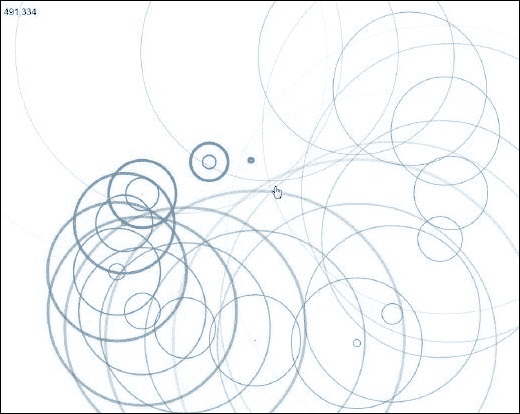
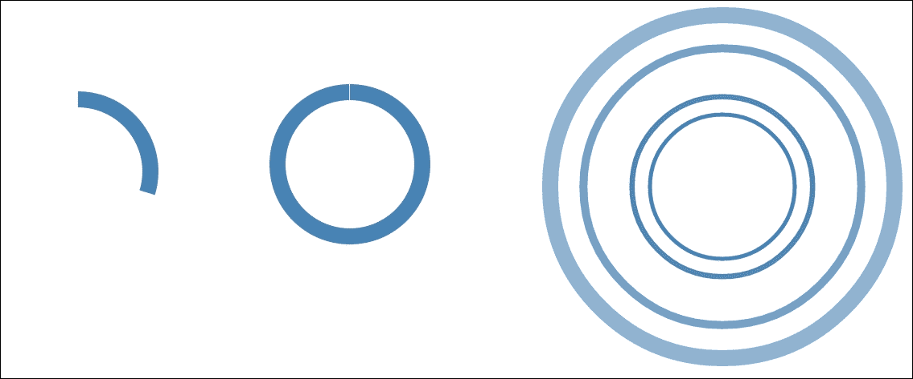
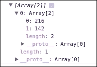
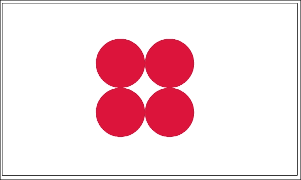
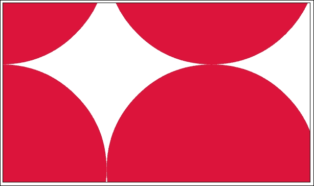
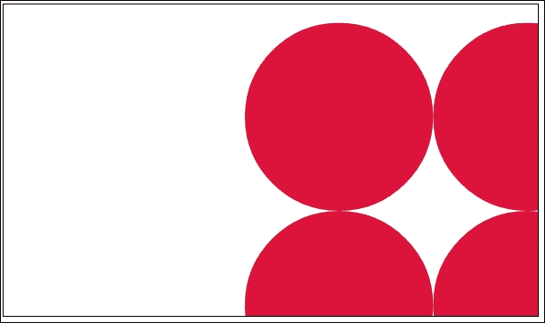
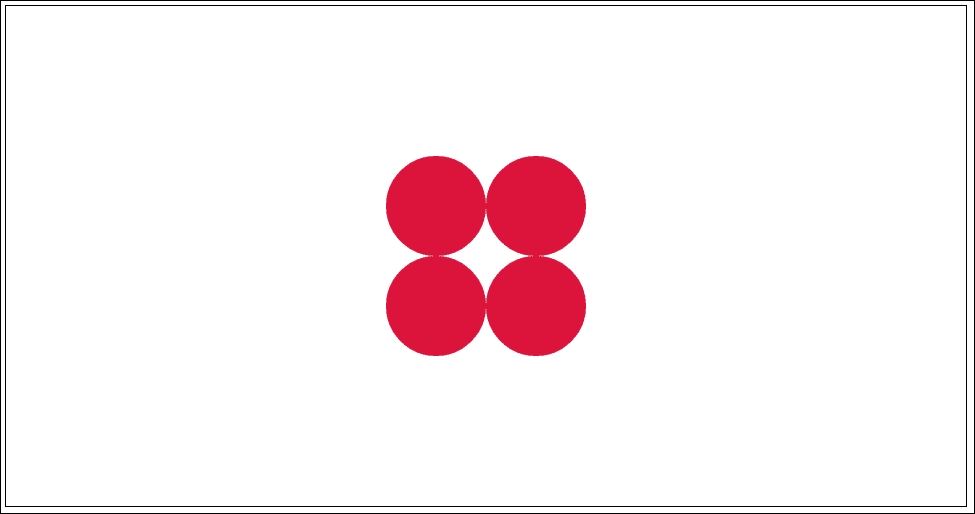
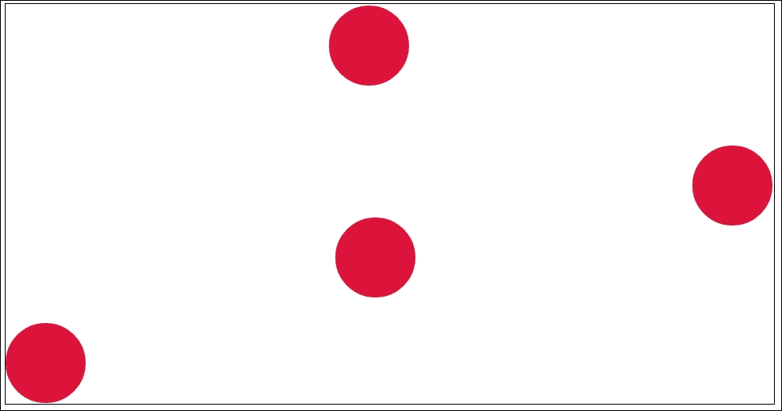

# 第十章。与您的可视化交互

在本章中，我们将涵盖：

+   与鼠标交互

+   与多触控设备交互

+   实现缩放和平移行为

+   实现拖拽行为

# 简介

> *可视化设计的最终目标是优化应用程序，以便它们能帮助我们更有效地完成认知工作。*
> 
> *Ware C. (2012)*

数据可视化的目标是帮助观众通过隐喻、心智模型对齐和认知放大，快速有效地从大量原始数据中获取信息。到目前为止，在这本书中，我们已经介绍了各种技术，通过实现多种类型的可视化来利用 D3 库。然而，我们还没有触及可视化的重要方面：人机交互。各种研究已经得出结论，人机交互在信息可视化中具有独特的价值。

> *将可视化与计算引导相结合，可以更快地分析更复杂的场景……本案例研究充分证明了复杂模型与引导和交互式可视化的交互可以扩展建模的应用范围，超越研究领域*
> 
> *Barrass I. & Leng J (2011)*

在本章中，我们将专注于 D3 的人机可视化交互支持；或者，如前所述，您将学习如何将计算引导能力添加到您的可视化中。

# 与鼠标事件交互

鼠标是大多数桌面和笔记本电脑上最常见的、最受欢迎的人机交互控制方式。即使今天，随着多点触控设备逐渐占据主导地位，触摸事件仍然通常通过鼠标事件来模拟。在本食谱中，我们将学习如何在 D3 中处理标准鼠标事件。

## 准备工作

在您的网络浏览器中打开以下文件的本地副本：

[`github.com/NickQiZhu/d3-cookbook-v2/blob/master/src/chapter10/mouse.html`](https://github.com/NickQiZhu/d3-cookbook-v2/blob/master/src/chapter10/mouse.html)

## 如何实现...

在以下代码示例中，我们将探讨在 D3 中注册和处理鼠标事件的技术。尽管在这个特定的例子中我们只处理了`click`和`mousemove`，但这里使用的技术可以轻松应用于现代浏览器支持的所有其他标准鼠标事件：

```js
<script type="text/javascript"> 
    var r = 400; 

    var svg = d3.select("body") 
            .append("svg"); 

    var positionLabel = svg.append("text") 
            .attr("x", 10) 
            .attr("y", 30); 

    svg.on("mousemove", function () { //<-A 
        printPosition(); 
    }); 

    function printPosition() { //<-B 
        var position = d3.mouse(svg.node()); //<-C 
        positionLabel.text(position); 
    }   

    svg.on("click", function () { //<-D 
        for (var i = 1; i < 5; ++i) { 
            var position = d3.mouse(svg.node()); 

            var circle = svg.append("circle") 
                    .attr("cx", position[0]) 
                    .attr("cy", position[1]) 
                    .attr("r", 0) 
                    .style("stroke-width", 5 / (i)) 
                    .transition() 
                        .delay(Math.pow(i, 2.5) * 50) 
                        .duration(2000) 
                        .ease(d3.easeQuadIn) 
                    .attr("r", r) 
                    .style("stroke-opacity", 0) 
                    .on("end", function () { 
                        d3.select(this).remove(); 
                    }); 
        } 
    }); 
</script> 

```

当您点击 SVG 图像时，本食谱将生成以下交互式可视化：



鼠标交互

## 工作原理...

在 D3 中，要注册事件监听器，我们需要在特定的选择上调用`on`函数。给定的事件监听器将被附加到所有选定的元素上，用于指定的事件（参见图 A）。本食谱中的以下代码附加了一个`mousemove`事件监听器，它显示当前鼠标位置（参见图 B）：

```js
svg.on("mousemove", function () { //<-A 
    printPosition(); 
}); 

function printPosition() { //<-B 
    var position = d3.mouse(svg.node()); //<-C 
    positionLabel.text(position); 
}   

```

在第 C 行，我们使用`d3.mouse`函数获取相对于给定容器元素的当前鼠标位置。此函数返回一个包含两个元素的数组[x, y]。之后，我们还在第 D 行使用相同的`on`函数注册了一个鼠标`click`事件监听器：

```js
svg.on("click", function () { //<-D 
        for (var i = 1; i < 5; ++i) { 
            var position = d3.mouse(svg.node()); 

        var circle = svg.append("circle") 
                .attr("cx", position[0]) 
                .attr("cy", position[1]) 
                .attr("r", 0) 
                .style("stroke-width", 5 / (i)) // <-E 
                .transition() 
                    .delay(Math.pow(i, 2.5) * 50) // <-F 
                    .duration(2000) 
                    .ease('quad-in') 
                .attr("r", r) 
                .style("stroke-opacity", 0) 
                .each("end", function () { 
                    d3.select(this).remove(); // <-G 
                }); 
        } 
}); 

```

### 注意

再次使用`d3.mouse`函数检索当前鼠标位置，然后生成五个同心扩大的圆来模拟涟漪效果。涟漪效果是通过几何级数增加的延迟（参见图 F）和减少的`stroke-width`（参见图 E）来模拟的。最后，当过渡效果完成后，使用过渡`end`监听器（参见图 G）移除圆圈。如果您不熟悉这种类型的过渡控制，请参阅第六章，*以风格过渡*，以获取更多详细信息。

## 还有更多...

尽管我们在这个食谱中只演示了如何监听`click`和`mousemove`事件，但您可以通过`on`函数监听浏览器支持的任何事件。以下是在构建您的交互式可视化时有用的一些鼠标事件列表：

+   `click`: 当用户点击鼠标按钮时触发

+   `dbclick`: 当鼠标按钮被连续点击两次时触发

+   `mousedown`: 当鼠标按钮被按下时触发

+   `mouseenter`: 当鼠标按钮移入元素边界或其任何后代元素的边界时触发

+   `mouseleave`: 当鼠标按钮移出元素及其所有后代元素的边界时触发

+   `mousemove`: 当鼠标按钮在元素上移动时触发

+   `mouseout`: 当鼠标按钮移出元素边界时触发

+   `mouseover`: 当鼠标按钮移入元素边界时触发

+   `mouseup`: 当鼠标按钮在元素上释放时触发

## 参见

+   有关本食谱中使用的涟漪效果技术的更多详细信息，请参阅第六章，*以风格过渡*。

+   有关事件类型的完整列表，请参阅 W3C DOM Level 3 Events 规范[`www.w3.org/TR/DOM-Level-3-Events/`](https://www.w3.org/TR/DOM-Level-3-Events/)。

+   有关鼠标检测的更多详细信息，请参阅[d3.mouse API 文档](https://github.com/d3/d3-selection/blob/master/README.md#mouse)。

# 与多触控设备交互

现在，随着多触控设备的普及，任何面向大众消费的可视化都需要考虑其交互性，不仅通过传统的指针设备，还要通过多触控和手势。在本食谱中，我们将探索 D3 提供的触摸支持，看看它如何被利用来生成一些与多触控设备非常有趣的交互。

## 准备中

在您的网络浏览器中打开以下文件的本地副本：

[`github.com/NickQiZhu/d3-cookbook-v2/blob/master/src/chapter10/touch.html`](https://github.com/NickQiZhu/d3-cookbook-v2/blob/master/src/chapter10/touch.html) .

## 如何做...

在本配方中，我们将围绕用户的触摸生成进度圆环，一旦进度完成，就会在圆环周围触发后续的波纹效果。然而，如果用户提前结束触摸，我们应停止进度圆环而不生成波纹：

```js
<script type="text/javascript"> 
    var initR = 100,  
        r = 400,  
        thickness = 20; 

    var svg = d3.select("body") 
            .append("svg"); 

    d3.select("body") // <-A 
            .on("touchstart", touch) 
            .on("touchend", touch); 

    function touch() { 
        d3.event.preventDefault(); // <-B 

        var arc = d3.arc() 
                .outerRadius(initR) 
                .innerRadius(initR - thickness); 

        var g = svg.selectAll("g.touch") // <-C 
                .data(d3.touches(svg.node()), function (d, i) { 
                    return i; 
                }); 

        g.enter() 
            .append("g") 
            .attr("class", "touch") 
            .attr("transform", function (d) { 
                return "translate(" + d[0] + "," + d[1] + ")"; 
            }) 
            .append("path") 
                .attr("class", "arc") 
                .transition().duration(2000).ease(d3.easeLinear) 
                .attrTween("d", function (d) { // <-D 
                    var interpolate = d3.interpolate( 
                            {startAngle: 0, endAngle: 0}, 
                            {startAngle: 0, endAngle: 2 * Math.PI} 
                        ); 
                    return function (t) { 
                        return arc(interpolate(t)); 
                    }; 
                }) 
                .on("end", function (d) { 
                    if (complete(d)) // <-E 
                        ripples(d); 
                    g.remove(); 
                }); 

        g.exit().remove().each(function (d) { 
            console.log("Animation stopped"); 
            d[2] = "stopped"; // <-F 
        }); 
    } 

    function complete(d) { 
        console.log("Animation completed? " + (d.length < 3)); 
        return d.length < 3; 
    } 

    function ripples(position) { 
        console.log("Producing ripple effect..."); 

        for (var i = 1; i < 5; ++i) { 
            var circle = svg.append("circle") 
                    .attr("cx", position[0]) 
                    .attr("cy", position[1]) 
                    .attr("r", initR - (thickness / 2)) 
                    .style("stroke-width", thickness / (i)) 
                .transition() 
                    .delay(Math.pow(i, 2.5) * 50) 
                    .duration(2000).ease(d3.easeQuadIn) 
                    .attr("r", r) 
                    .style("stroke-opacity", 0) 
                    .on("end", function () { 
                        d3.select(this).remove(); 
                    }); 
        } 
    } 
</script> 

```

此配方在触摸设备上生成以下交互式可视化：



触摸交互

## 工作原理...

通过 D3 选择器的 `on` 函数注册触摸事件监听器，这与我们在前一个示例中处理鼠标事件的方式类似（参考行 A）：

```js
d3.select("body") // <-A 
            .on("touchstart", touch) 
            .on("touchend", touch); 

```

这里的一个关键区别是我们将触摸事件监听器注册在 `body` 元素上而不是 `svg` 元素上，因为许多操作系统和浏览器定义了默认的触摸行为，我们希望用我们的自定义实现来覆盖它。这是通过以下函数调用实现的（参考行 B）：

```js
d3.event.preventDefault(); // <-B 

```

一旦触发触摸事件，我们将使用 `d3.touches` 函数检索多个触摸点数据，如下面的代码片段所示：

```js
var g = svg.selectAll("g.touch") // <-C 
                .data(d3.touches(svg.node()), function (d, i) { 
                    return i; 
                });  

```

与 `d3.mouse` 函数返回的二维数组不同，`d3.touches` 返回一个二维数组的数组，因为每个触摸事件可能有多个触摸点。每个触摸位置数组的数据结构如下所示：



触摸位置数组

在这里，我们还在本配方中使用了数组索引来建立对象一致性。一旦触摸数据绑定到选择器，进度圆环就会在每个触摸点周围生成：

```js
        g.enter() 
            .append("g") 
            .attr("class", "touch") 
            .attr("transform", function (d) { 
                return "translate(" + d[0] + "," + d[1] + ")"; 
            }) 
            .append("path") 
                .attr("class", "arc") 
                .transition().duration(2000).ease(d3.easeLinear) 
                .attrTween("d", function (d) { // <-D 
                    var interpolate = d3.interpolate( 
                            {startAngle: 0, endAngle: 0}, 
                            {startAngle: 0, endAngle: 2 * Math.PI} 
                        ); 
                    return function (t) { 
                        return arc(interpolate(t)); 
                    }; 
                }) 
                .on("end", function (d) { 
                    if (complete(d))  
                        ripples(d); // <-E 
                    g.remove(); 
                }); 

```

### 注意

这是通过标准的弧形过渡和弧形属性插值（参考行 D）实现的，如第七章“形状塑造”中所述。如果进度圆环尚未被用户取消，即使过渡已经完成，则在线 E 上生成类似于我们在前一个示例中所做的波纹效果。由于我们在 `touchstart` 和 `touchend` 事件上注册了相同的 `touch` 事件监听器，我们可以使用以下行来移除进度圆环并设置一个标志以指示此进度圆环已提前停止：

```js
        g.exit().remove().each(function (d) { 
            console.log("Animation stopped"); 
            d[2] = "stopped"; // <-F 
        }); 
     ... 
     function complete(d) { 
        console.log("Animation completed? " + (d.length < 3)); 
        return d.length < 3; 
    } 

```

我们需要在 `d` 上设置这个状态标志，即触摸数据数组，因为没有方法可以取消已经开始的过渡；因此，即使您从 DOM 树中移除了进度圆环元素，过渡仍然会完成并触发行 E。

## 更多...

我们已经通过 `touchstart` 和 `touchend` 事件演示了触摸交互；然而，你可以使用相同的模式来处理浏览器支持的任何其他触摸事件。以下列表包含了 W3C 推荐的触摸事件类型：

+   `touchstart`：当用户在触摸表面上放置一个触摸点时，它会被触发。

+   `touchend`：当用户从触摸表面上移除一个触摸点时，它会被触发。

+   `touchmove`：当用户在触摸表面上移动一个触摸点时，它会被触发。

+   `touchcancel`：当触摸点以一种特定于实现的方式被干扰时，它会被触发。

## 参考内容

+   请参考 第六章，*过渡风格*，以获取关于在此配方中使用对象恒定和涟漪效果技术的更多详细信息。

+   请参考 第七章，*进入形状*，以获取关于在此配方中使用进度圆环属性缓动过渡技术的更多详细信息

+   请参考 W3C 触摸事件建议的推荐，以获取触摸事件类型的完整列表，链接为 [`www.w3.org/TR/touch-events`](https://www.w3.org/TR/touch-events/)

+   请参考 `d3.touch` API 文档，以获取关于多触摸检测的更多详细信息，链接为 [`github.com/d3/d3-selection/blob/master/README.md#touches`](https://github.com/d3/d3-selection/blob/master/README.md#touches)

# 实现缩放和滚动行为

缩放和滚动是数据可视化中常见且有用的技术，与基于 SVG 的可视化配合得非常好，因为矢量图形不会像位图那样受到像素化的影响。当处理大型数据集时，放大特别有用，因为无法或不可能可视化整个数据集，因此需要采用缩放和钻取的方法。在此配方中，我们将探索 D3 内置的缩放和滚动支持。

## 准备工作

在您的网络浏览器中打开以下文件的本地副本：

[`github.com/NickQiZhu/d3-cookbook-v2/blob/master/src/chapter10/zoom.html`](https://github.com/NickQiZhu/d3-cookbook-v2/blob/master/src/chapter10/zoom.html)

## 如何操作...

在此配方中，我们将使用 D3 缩放支持实现几何放大和滚动。让我们看看以下代码是如何实现的：

```js
<script type="text/javascript"> 
    var width = 600, height = 350, r = 50; 

    var data = [ 
        [width / 2 - r, height / 2 - r], 
        [width / 2 - r, height / 2 + r], 
        [width / 2 + r, height / 2 - r], 
        [width / 2 + r, height / 2 + r] 
    ]; 

    var svg = d3.select("body").append("svg") 
            .attr("style", "1px solid black") 
            .attr("width", width) 
            .attr("height", height) 
            .call( // <-A 
                    d3.zoom() // <-B 
                    .scaleExtent([1, 10]) // <-C 
                    .on("zoom", zoomHandler) // <-D 
            ) 
            .append("g"); 

    svg.selectAll("circle") 
            .data(data) 
            .enter().append("circle") 
            .attr("r", r) 
            .attr("transform", function (d) { 
                return "translate(" + d + ")"; 
            }); 

    function zoomHandler() { 
        var transform = d3.event.transform; 

        svg.attr("transform", "translate(" 
            + transform.x + "," + transform.y 
            + ")scale(" + transform.k + ")"); 
    } 
</script> 

```

此配方生成以下缩放和滚动效果：



原始

上一张图像显示了可视化的原始状态，而下一张图像显示了当用户通过在桌面上的鼠标滚轮滚动或使用触摸屏设备的多手势放大时发生了什么。



放大

以下截图显示了当用户用鼠标或手指拖动（滚动）图像时发生了什么。



滚动

## 工作原理...

在这个阶段，你可能会惊讶地看到实现这个完全功能的缩放和拖动效果所需的代码是多么少。如果你在浏览器中打开了这份食谱，你也会注意到缩放和拖动对鼠标滚轮和多指触摸手势都反应得非常好。大部分的重活都是由 D3 库完成的。我们在这里需要做的只是简单地定义缩放行为是什么。让我们看看代码中是如何实现的；首先，我们需要在 SVG 容器上定义缩放行为：

```js
var svg = d3.select("body").append("svg") 
            .attr("style", "1px solid black") 
            .attr("width", width) 
            .attr("height", height) 
            .call( // <-A 
                d3.behavior.zoom() // <-B 
                    .scaleExtent([1, 10]) // <-C 
                    .on("zoom", zoomHandler) // <-D 
            ) 
            .append("g"); 

```

如我们在行 A 中看到的，创建了一个 `d3.zoom` 函数（参考行 B），并在 `svg` 容器上调用它。`d3.zoom` 将自动创建事件监听器来处理关联的 SVG 容器（在我们的例子中，是 `svg` 元素本身）上的低级缩放和拖动手势。低级缩放手势随后将被转换为高级 D3 缩放事件。默认的事件监听器支持鼠标和触摸事件。在行 C 中，我们使用一个包含两个元素 [1, 10]（一个范围）的数组定义了 `scaleExtent`。缩放范围定义了允许缩放的程度（在我们的例子中，我们允许 10 倍缩放）。最后，在行 D 中，我们注册了一个自定义的缩放事件处理器来处理 D3 缩放事件。现在，让我们看看这个缩放事件处理器执行了什么任务：

```js
function zoomHandler() { 
    var transform = d3.event.transform; 

    svg.attr("transform", "translate(" 
        + transform.x + "," + transform.y 
        + ")scale(" + transform.k + ")"); 
} 

```

在 `zoom` 函数中，我们只是将实际的缩放和拖动委托给 SVG 转换。为了进一步简化这个任务，D3 缩放事件也计算了必要的平移和缩放。所以，我们只需要将它们嵌入到 SVG 转换属性中。以下是缩放事件中包含的属性：

+   `transform.x` 和 `transform.y`：当前平移向量

+   `transform.k`：表示当前缩放比例的数字

在这个阶段，你可能想知道拥有这个 `zoomHandler` 函数的目的是什么。为什么 D3 不能为我们处理这一步呢？原因在于 D3 的缩放行为并不是专门为 SVG 设计的，而是作为一个通用的缩放行为支持机制设计的。因此，这个缩放函数实现了将通用的缩放和拖动事件转换为 SVG 特定的转换。

## 更多...

缩放函数还能够执行除了简单的坐标系统转换之外的其他任务。例如，一种常见的技巧是在用户发出缩放手势时加载额外的数据，从而在缩放函数中实现钻取功能。一个著名的例子是数字地图；当你增加地图的缩放级别时，更多的数据和细节就可以被加载和展示。

## 参见

+   参考第二章 选择性地使用，*选择性地使用*，了解更多关于 `d3.selection.call` 函数和选择操作的信息

+   参考 W3C SVG 坐标系统转换规范，了解更多关于在 SVG 中如何实现缩放和拖动效果的信息，请访问 [`www.w3.org/TR/SVG/coords.html#EstablishingANewUserSpace`](https://www.w3.org/TR/SVG/coords.html#EstablishingANewUserSpace)

+   请参考`d3.zoom` API 文档以获取有关 D3 缩放支持的更多详细信息，[`github.com/d3/d3-zoom/blob/master/README.md#zoom`](https://github.com/d3/d3-zoom/blob/master/README.md#zoom)

# 实现拖动行为

在本章中，我们将探讨的另一个常见交互式可视化行为是**拖动**。拖动对于提供可视化中的图形重新排列或甚至通过力量提供用户输入的能力非常有用；我们将在下一章中讨论这一点。在此菜谱中，我们将探讨如何在 D3 中支持拖动行为。

## 准备工作

在您的网络浏览器中打开以下文件的本地副本：

[`github.com/NickQiZhu/d3-cookbook-v2/blob/master/src/chapter10/drag.html`](https://github.com/NickQiZhu/d3-cookbook-v2/blob/master/src/chapter10/drag.html)

## 如何做到这一点...

在这里，我们将生成四个可以使用 D3 拖动行为支持拖动的圆圈，并且在拖动过程中还带有 SVG 边界检测。现在，让我们看看如何在代码中实现这一点：

```js
<script type="text/javascript"> 
    var width = 960, height = 500, r = 50; 

    var data = [ 
        [width / 2 - r, height / 2 - r], 
        [width / 2 - r, height / 2 + r], 
        [width / 2 + r, height / 2 - r], 
        [width / 2 + r, height / 2 + r] 
    ]; 

    var svg = d3.select("body").append("svg") 
            .attr("width", width) 
            .attr("height", height) 
            .append("g"); 

    var drag = d3.drag() // <-A 
            .on("drag", move); 

    svg.selectAll("circle") 
            .data(data) 
            .enter().append("circle") 
            .attr("r", r) 
            .attr("transform", function (d) { 
                return "translate(" + d + ")"; 
            }) 
            .call(drag); // <-A 

    function move(d) { 
        var x = d3.event.x, // <-C 
            y = d3.event.y; 

        if(inBoundaries(x, y)) 
            d3.select(this)  
                .attr("transform", function (d) { // <-D 
                    return "translate(" + x + ", " + y + ")"; 
                }); 
    } 

    function inBoundaries(x, y){ 
        return (x >= (0 + r) && x <= (width - r))  
            && (y >= (0 + r) && y <= (height - r)); 
    } 
</script> 

```

此菜谱在以下四个圆圈上生成拖动行为：



原始

上一张图片显示了此菜谱在其原始状态下渲染的内容，而下一张图片显示了当用户将每个圆圈从中心拖动时会发生什么。



拖动

## 它是如何工作的...

如我们所见，拖动支持遵循与 D3 缩放支持类似的模式。主要的拖动能力由`d3.drag`函数提供（参考行 A）。D3 拖动行为自动创建适当的低级事件监听器来处理给定元素上的拖动手势，然后将低级事件转换为高级 D3 拖动事件。支持鼠标和触摸事件，如下所示：

```js
var drag = d3.behavior.drag() // <-A 
            .on("drag", move); 

```

在此菜谱中，我们关注的是`drag`事件，它由我们的`move`函数处理。与缩放行为类似，D3 拖动行为支持是事件驱动的，因此，它允许在实现中具有最大的灵活性，不仅支持 SVG，还支持 HTML 画布。一旦定义，该行为可以通过在给定的选择上调用它来附加到任何元素：

```js
svg.selectAll("circle") 
            .data(data) 
            .enter().append("circle") 
            .attr("r", r) 
            .attr("transform", function (d) { 
                return "translate(" + d + ")"; 
            }) 
            .call(drag); // <-B 

```

接下来，在`move`函数中，我们简单地使用 SVG 转换将拖动的元素移动到合适的位置（参考行 D），这是基于拖动事件传递的信息（参考行 C）：

```js
   function move(d) { 
        var x = d3.event.x, // <-C 
            y = d3.event.y; 

        if(inBoundaries(x, y)) 
            d3.select(this)  
                .attr("transform", function (d) { // <-D 
                    return "translate(" + x + ", " + y + ")"; 
                }); 
} 

```

我们在这里检查的另一个附加条件是计算 SVG 边界约束，以便用户不能将元素拖动到 SVG 之外。这是通过以下检查实现的：

```js
    function inBoundaries(x, y){ 
        return (x >= (0 + r) && x <= (width - r))  
            && (y >= (0 + r) && y <= (height - r)); 
    } 

```

## 还有更多...

除了拖动事件之外，D3 拖动行为还支持两种其他事件类型。以下列表显示了所有支持的拖动事件类型及其属性：

+   `dragstart`：当拖动手势开始时触发。

+   `drag`: 当元素被拖动时触发。`d3.event` 对象将包含代表元素当前绝对拖动坐标的 *x* 和 *y* 属性。它还将包含代表元素相对于手势开始时位置的 *dx* 和 *dy* 属性。

+   `dragend`: 当拖动手势完成时触发。

## 参见

+   有关 `d3.selection.call` 函数和选择操作的更多详细信息，请参阅第二章 *选择*。

+   有关 D3 拖动支持的更多详细信息，请参阅 `d3.behavior.drag` API 文档，链接为 [`github.com/d3/d3-drag/blob/master/README.md#drag`](https://github.com/d3/d3-drag/blob/master/README.md#drag)。
