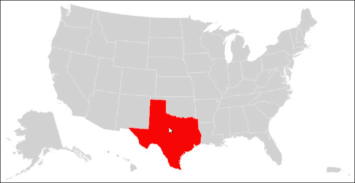
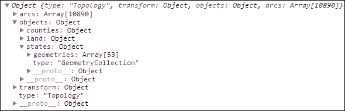
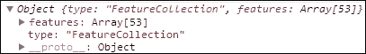
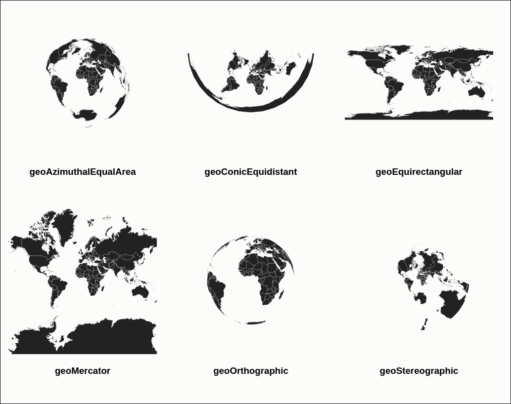
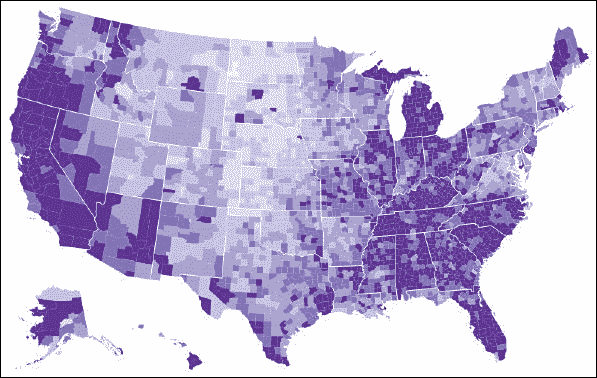

# 第十二章. 了解你的地图

在本章中，我们将涵盖：

+   投影美国地图

+   投影世界地图

+   构建渐变地图

# 简介

在许多类型的可视化中，将数据点投影并关联到地理区域的能力至关重要。地理可视化是一个复杂的话题，许多与今天网络技术相关的标准正在出现和成熟。D3 提供了几种不同的方法来可视化地理和制图数据。在本章中，我们将介绍基本的 D3 制图可视化技术，以及如何在 D3 中实现一个功能齐全的渐变地图（一种特殊用途的彩色地图）。

# 投影美国地图

在这个菜谱中，我们将从使用 D3 GEO API 投影美国地图开始，同时熟悉几种不同的 JSON 数据格式，用于描述地理数据。让我们首先看看地理数据在 JavaScript 中通常是如何呈现和消费的。

## GeoJSON

我们将要接触的第一个标准 JavaScript 地理数据格式被称为 **GeoJSON**。GeoJSON 格式最初由一个开发者的互联网工作组编写和维护。后来，它由 **互联网工程任务组**（**IETF**）通过 RFC 7946 标准化，并于 2016 年 8 月发布。

> *GeoJSON 是一种用于编码各种地理数据结构的格式。GeoJSON 支持以下几何类型：点（Point）、线字符串（LineString）、多边形（Polygon）、多点（MultiPoint）、多线字符串（MultiLineString）和多多边形（MultiPolygon）。具有附加属性的几何对象是特征对象。特征集合包含在特征集合对象中。*
> 
> *来源：[`www.geojson.org/`](http://www.geojson.org/)*

GeoJSON 格式是编码 GIS 信息的一个非常流行的标准，得到了众多开源和商业软件的支持。GeoJSON 格式使用经纬度点作为其坐标；因此，它要求任何软件，包括 D3，找到适当的投影、比例和转换方法，以便可视化其数据。以下 GeoJSON 数据描述了以特征坐标表示的阿拉巴马州的状态：

```js
{ 
  "type":"FeatureCollection", 
  "features":[{ 
    "type":"Feature", 
    "id":"01", 
    "properties":{"name":"AL"}, 
    "geometry":{ 
      "type":"Polygon", 
      "coordinates":[[ 
        [-87.359296,35.00118], 
        [-85.606675,34.984749], 
        [-85.431413,34.124869], 
        [-85.184951,32.859696], 
        ... 
        [-88.202745,34.995703], 
        [-87.359296,35.00118] 
      ]] 
  }] 
} 

```

GeoJSON 目前是 JavaScript 项目中事实上的 GIS 信息标准，并且得到了 D3 的良好支持；然而，在我们直接跳入使用这种数据格式进行 D3 地理可视化之前，我们还想向您介绍与 GeoJSON 密切相关的另一种新兴技术。

### TopoJSON

> *TopoJSON 是 GeoJSON 的一个扩展，它编码了拓扑信息。与离散表示几何形状不同，TopoJSON 文件中的几何形状是由称为弧的共享线段拼接而成的。这种技术与 Matt Bloch 的 MapShaper 和 Arc/Info 导出格式 .e00 类似。*
> 
> *TopoJSON Wiki [`github.com/topojson/topojson`](https://github.com/topojson/topojson)*

TopoJSON 是由 D3 的作者 *Mike Bostock* 创造的，最初是为了克服 GeoJSON 的一些缺点，同时在描述地理信息时提供类似的功能集。在大多数涉及地图可视化的情况下，TopoJSON 可以作为 GeoJSON 的直接替代品，具有更小的体积和更好的性能。因此，在本章中，我们将使用 TopoJSON 而不是 GeoJSON。尽管如此，本章中讨论的所有技术也可以与 GeoJSON 完美地工作。我们不会在这里列出 TopoJSON 的示例，因为其基于弧的格式不太适合人类阅读。然而，您可以使用 GDAL 提供的 ogr2ogr 命令行工具轻松地将您的 **shapefiles**（流行的开源地理矢量格式文件）转换为 TopoJSON（[`www.gdal.org/ogr2ogr.html`](http://www.gdal.org/ogr2ogr.html)）。

现在我们有了这些背景信息，让我们看看如何在 D3 中制作地图。

## 准备工作

在你的本地 HTTP 服务器上托管的网络浏览器中打开以下文件的本地副本：

[`github.com/NickQiZhu/d3-cookbook-v2/blob/master/src/chapter12/usa.html`](https://github.com/NickQiZhu/d3-cookbook-v2/blob/master/src/chapter12/usa.html)

## 如何做...

在这个配方中，我们将加载美国 TopoJSON 数据并使用 D3 地理 API 进行渲染。以下是代码示例：

```js
<script type="text/javascript"> 
    var width = 960, 
            height = 500; 

    var projection = d3.geoAlbersUsa(); 

    var path = d3.geoPath() 
            .projection(projection); 

    var svg = d3.select("body").append("svg") 
            .attr("width", width) 
            .attr("height", height); 

    var g = svg.append('g') 
            .call(d3.zoom() 
                    .scaleExtent([1, 10]) 
                    .on("zoom", zoomHandler)); 

    d3.json("../../data/us.json", function (error, us) { // <- A 
        g.insert("path") 
                .datum(topojson.feature(us, us.objects.land)) 
                .attr("class", "land") 
                .attr("d", path); 

        g.selectAll("path.state") 
                    .data(topojson.feature(us,  
                          us.objects.states).features) 
                .enter() 
                    .append("path") 
                    .attr("class", "state") 
                    .attr("d", path); 
    }); 

    function zoomHandler() { 
        var transform = d3.event.transform; 

        g.attr("transform", "translate(" 
                + transform.x + "," + transform.y 
                + ")scale(" + transform.k + ")"); 
    } 
</script> 

```

此配方使用 Albers USA 模式投影美国地图：



使用 Albers USA 模式投影的美国地图

## 如何工作...

如您所见，使用 TopoJSON 和 D3 投影美国地图所需的代码相当简短，尤其是关于地图投影的部分。这是因为 D3 地理 API 和 TopoJSON 库都是专门构建的，以便尽可能简化开发者的这项工作。要制作地图，首先您需要加载 TopoJSON 数据文件（行 `A`）。以下截图显示了加载后的拓扑数据的外观：



TopoJSON 的拓扑数据

一旦加载了拓扑数据，我们只需使用 TopoJSON 库的 `topojson.feature` 函数将拓扑弧转换为类似于 GeoJSON 格式提供的坐标，如下截图所示：



使用 topojson.feature 函数转换的要素集合

然后 `d3.geo.path` 将自动识别并使用坐标来生成以下代码片段中突出显示的 `svg:path`：

```js
var path = d3.geoPath() // <- A 
            .projection(d3.geoAlbersUsa()); 
... 
g.insert("path") // <-B 
                .datum(topojson.feature(us, us.objects.land)) 
                .attr("class", "land") 
                .attr("d", path); 

        g.selectAll("path.state")                        
                 .data(topojson.feature(us, 
                      us.objects.states).features) // <-C 
                .enter() 
                    .append("path") 
                    .attr("class", "state") 
                    .attr("d", path); 

```

在行 `A` 上，我们首先创建了一个配置为 Albers USA 投影模式的 D3 GEO 路径对象。然后我们插入一个 `svg:path` 元素来描述美国的轮廓，因为可以通过单个 `svg:path` 元素（在行 `B` 上）实现这一点。对于每个州的轮廓，我们使用行 `C` 上生成的要素集合来为每个州创建一个 `svg:path`，这样我们就可以在悬停时突出显示该州。使用代表各州的单独 SVG 元素还可以让您响应用户交互，如点击和触摸。

就这样！这就是你使用 TopoJSON 在 D3 中投影地图所需做的所有事情。此外，我们还向父`svg:g`元素附加了一个缩放处理程序：

```js
var g = svg.append('g') 
            .call(d3.zoom() 
                    .scaleExtent([1, 10]) 
                    .on("zoom", zoomHandler)); 

```

这允许用户对我们的地图执行简单的几何缩放。

## 参考以下内容

+   GeoJSON v1.0 规范：[`geojson.org/geojson-spec.html`](http://geojson.org/geojson-spec.html)

+   TopoJSON Wiki: [`github.com/topojson/topojson/wiki`](https://github.com/topojson/topojson/wiki)

+   第三章, *处理数据*，了解更多关于异步数据加载的信息

+   第十章, *与你的可视化交互*，了解更多关于如何实现缩放的信息

+   基于此配方基于 Mike Bostock 的关于 Albers USA 投影的帖子 [`bl.ocks.org/mbostock/4090848`](http://bl.ocks.org/mbostock/4090848)

# 投影世界地图

如果我们的可视化项目不仅仅是关于美国，而是关注整个世界呢？不用担心，D3 提供了各种内置投影模式，这些模式与我们将在此配方中探索的世界地图配合得很好。

## 准备工作

在你的本地 HTTP 服务器上，使用你的网络浏览器打开以下文件的本地副本：

[`github.com/NickQiZhu/d3-cookbook-v2/blob/master/src/chapter12/world.html`](https://github.com/NickQiZhu/d3-cookbook-v2/blob/master/src/chapter12/world.html)

## 如何做...

在此配方中，我们将使用各种不同的 D3 内置投影模式来投影世界地图。以下是代码示例：

```js
<script type="text/javascript"> 
    var width = 300, 
        height = 300, 
        translate = [width / 2, height / 2]; 

    var projections = [ // <-A 
        {name: 'geoAzimuthalEqualArea', fn: d3.geoAzimuthalEqualArea() 
                .scale(50) 
                .translate(translate)}, 
        {name: 'geoConicEquidistant', fn: d3.geoConicEquidistant() 
                .scale(35) 
                .translate(translate)}, 
        {name: 'geoEquirectangular', fn: d3.geoEquirectangular() 
                .scale(50) 
                .translate(translate)}, 
        {name: 'geoMercator', fn: d3.geoMercator() 
                .scale(50) 
                .translate(translate)}, 
        {name: 'geoOrthographic', fn: d3.geoOrthographic() 
                        .scale(90) 
                        .translate(translate)}, 
        {name: 'geoStereographic', fn: d3.geoStereographic() 
                                .scale(35) 
                                .translate(translate)} 
    ]; 

d3.json("../../data/world-50m.json",  
           function (error, world) { // <-B 
        projections.forEach(function (projection) { 
            var path = d3.geoPath() // <-C 
                    .projection(projection.fn); 

            var div = d3.select("body") 
                    .append("div") 
                    .attr("class", "map"); 

            var svg = div 
                    .append("svg") 
                    .attr("width", width) 
                    .attr("height", height); 

            svg.append("path") // <-D 
                    .datum(topojson.feature(world,  
                             world.objects.land)) 
                    .attr("class", "land") 
                    .attr("d", path); 

            svg.append("path") // <-E 
                    .datum(topojson.mesh(world,  
                             world.objects.countries)) 
                    .attr("class", "boundary") 
                    .attr("d", path); 

            div.append("h3").text(projection.name); 
        }); 
    }); 
</script> 

```

此配方生成了具有不同投影模式的世界地图，如下面的截图所示：



世界地图投影

## 它是如何工作的...

在此配方中，我们首先在行`A`上定义了一个包含六个不同 D3 投影模式的数组。在行`B`上加载了世界拓扑数据。类似于之前的配方，我们在行`C`上定义了一个`d3.geoPath`生成器。我们还通过调用其`projection`函数自定义了地理路径生成器的投影模式。配方剩余部分几乎与之前的配方相同。使用`topojson.feature`函数将拓扑数据转换为地理坐标，以便`d3.geoPath`可以生成用于地图渲染所需的`svg:path`（行`D`）。在行`E`，使用了一个值得注意的新函数`mesh`，来自 TopoJSON。`topojson.mesh`函数返回表示复杂拓扑的 GeoJSON `MultiLineString`几何对象。这是一个渲染复杂几何形状的非常紧凑的方式，因为所有共享的弧只包含一次。在我们的情况下，由于我们实际上不需要单独可视化每个大陆的国家轮廓，并且它们共享边界，因此这是渲染中最有效的方法。

## 参考以下内容

+   D3 wiki 地理投影页面 ([`github.com/d3/d3-geo/blob/master/README.md#projections`](https://github.com/d3/d3-geo/blob/master/README.md#projections) ) 了解更多关于不同投影模式以及如何实现原始自定义投影的信息。

# 构建面状图

面状图是一种专题地图，换句话说，是一种专门设计的地图，而不是通用目的的地图，它通过不同的颜色阴影或图案在地图上展示统计变量的测量值；或者有时也被称为地理热图。在前两个食谱中，我们已经看到在 D3 中的地理投影由一组`svg:path`元素组成，因此，它们可以被像其他`svg`元素一样操作，包括着色。我们将在本食谱中探索这一特性并实现一个面状图。

## 准备工作

在您的本地 HTTP 服务器上托管您的本地副本的以下文件，并在您的网络浏览器中打开：

[`github.com/NickQiZhu/d3-cookbook-v2/blob/master/src/chapter12/choropleth.html`](https://github.com/NickQiZhu/d3-cookbook-v2/blob/master/src/chapter12/choropleth.html).

## 如何操作...

在面状图中，不同的地理区域根据它们对应的变量着色，在本例中基于 2008 年美国各县的失业率。现在，让我们看看如何在代码中实现它：

```js
<script type="text/javascript"> 
    var width = 960, 
            height = 500; 

    var color = d3.scaleThreshold() 
            .domain([.02, .04, .06, .08, .10]) // <-A 
            .range(["#f2f0f7", "#dadaeb", "#bcbddc", 
                    "#9e9ac8", "#756bb1", "#54278f"]); 

    var projection = d3.geoAlbersUsa(); 

    var path = d3.geoPath() 
            .projection(projection); 

    var svg = d3.select("body").append("svg") 
            .attr("width", width) 
            .attr("height", height); 

    var g = svg.append("g") 
            .call(d3.zoom() 
            .scaleExtent([1, 10]) 
            .on("zoom", zoomHandler)); 

    d3.json("../../data/us.json", function (error, us) { // <-B 
        d3.tsv("../../data/unemployment.tsv", 
                function (error, unemployment) { 
            var rateById = {}; 

            unemployment.forEach(function (d) { // <-C 
                rateById[d.id] = +d.rate; 
            }); 

            g.append("g") 
                    .attr("class", "counties") 
                    .selectAll("path") 
                    .data(topojson.feature(us, 
                            us.objects.counties).features) 
                    .enter().append("path") 
                    .attr("d", path) 
                    .style("fill", function (d) { 
                        return color(rateById[d.id]); // <-D 
                    }); 

            g.append("path") 
                    .datum(topojson.mesh(us, // <-E 
                            us.objects.states, 
                             function(a, b) {  
                                 return a !== b;  
                     }))  
                    .attr("class", "states") 
                    .attr("d", path); 
        }); 
    }); 

    function zoomHandler() { 
        var transform = d3.event.transform; 

        g.attr("transform", "translate(" 
                + transform.x + "," + transform.y 
                + ")scale(" + transform.k + ")"); 
    } 
</script> 

```

本食谱生成了以下面状图：



2008 年失业率面状图

## 它是如何工作的...

在本食谱中，我们加载了两个不同的数据集：一个用于美国拓扑结构，另一个包含 2008 年各县的失业率（行`B`）。这种技术通常被认为是分层，并不一定仅限于两层。失业数据通过它们的 ID 与各县连接（行`B`和`C`）。区域着色是通过在行`A`上定义的阈值比例尺实现的。

## 参考信息

+   TopoJSON Wiki 了解更多关于网格函数的信息：[`github.com/topojson/topojson-client#mesh`](https://github.com/topojson/topojson-client#mesh)

+   D3 Wiki 了解更多关于阈值比例尺的信息：[`github.com/d3/d3-scale/blob/master/README.md#scaleThreshold`](https://github.com/d3/d3-scale/blob/master/README.md#scaleThreshold)

+   本食谱基于 Mike Bostock 关于面状图的帖子：[`bl.ocks.org/mbostock/4090848`](http://bl.ocks.org/mbostock/4090848)
