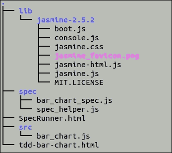
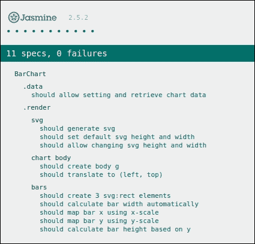
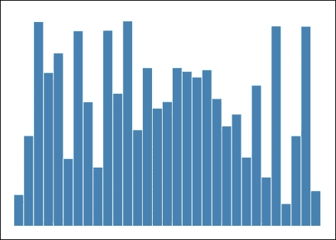

# 第十三章。测试驱动你的可视化

在本章中，我们将涵盖：

+   获取 Jasmine 并设置测试环境

+   测试驱动你的可视化 - 图表创建

+   测试驱动你的可视化 - SVG 渲染

+   测试驱动你的可视化 - 像素级完美的条形图渲染

# 简介

每当我们以专业程序员的身份进行编程时，测试我们所编写的程序总是非常重要的，以确保它按设计运行并产生预期的结果。D3 数据可视化主要是由 JavaScript 程序组成的，因此就像我们编写的任何其他程序一样，数据可视化也需要进行测试，以确保它准确地表示底层数据。显然，我们可以通过视觉检查和手动测试来进行验证，这始终是构建数据可视化过程中的一个关键部分，因为视觉观察不仅给我们提供了验证正确性的机会，还可以验证美学、可用性以及许多其他有用的方面。然而，手动视觉检查可能相当主观，因此，在本章中，我们将专注于自动化单元测试。通过单元测试充分覆盖的可视化可以免除创作者手动验证正确性的劳动，同时允许创作者更多地关注美学、可用性以及其他难以自动化的重要方面。

## 单元测试简介

单元测试是一种方法，其中通过另一个称为测试用例的程序测试和验证程序的最小单元。单元测试背后的逻辑是，在单元级别，程序通常是更简单且更容易测试的。如果我们能够验证程序中的每个单元都是正确的，那么将这些正确的单元组合在一起将使我们更有信心，集成程序也是正确的。此外，由于单元测试通常成本低且执行速度快，一组单元测试用例可以快速频繁地执行，以提供反馈，告诉我们程序是否正在正确执行。

软件测试是一个复杂的话题，到目前为止我们只是触及了皮毛；然而，由于本章范围有限，我们现在必须停止介绍并深入到单元测试的开发中。

### 注意

关于软件测试中的一些重要概念，请查看以下链接：单元测试：[`zh.wikipedia.org/wiki/单元测试`](https://zh.wikipedia.org/wiki/单元测试) 测试驱动开发：[`zh.wikipedia.org/wiki/测试驱动开发`](https://zh.wikipedia.org/wiki/测试驱动开发) 代码覆盖率：[`zh.wikipedia.org/wiki/代码覆盖率`](https://zh.wikipedia.org/wiki/代码覆盖率)

# 获取 Jasmine 并设置测试环境

在我们开始编写单元测试用例之前，我们需要设置一个环境，以便我们的测试用例可以被执行以验证我们的实现。在这个食谱中，我们将展示如何为可视化项目设置此环境和必要的库。

## 准备工作

Jasmine ([`jasmine.github.io/`](https://jasmine.github.io/)) 是一个用于测试 JavaScript 代码的 **行为驱动开发**（**BDD**）框架。

### 注意

BDD 是一种软件开发技术，它将 **测试驱动开发**（**TDD**）与领域驱动设计相结合。

我们选择 Jasmine 作为我们的测试框架，因为它在 JavaScript 社区中非常受欢迎，并且它的 BDD 语法很好。您可以从 [`github.com/jasmine/jasmine/releases`](https://github.com/jasmine/jasmine/releases) 下载 Jasmine 库。

下载后，您需要将其解压缩到 `lib` 文件夹中。除了 `lib` 文件夹外，我们还需要创建 `src` 和 `spec` 文件夹来存储源文件以及测试用例（在 BDD 术语中，测试用例被称为规范）。请参阅以下截图以了解文件夹结构：



测试目录结构

## 如何做...

现在，我们的环境中已经有了 Jasmine，接下来要做的事情是设置一个 HTML 页面，该页面将包括 Jasmine 库以及我们的源代码和测试用例，以便它们可以被执行以验证我们的程序。这个文件在我们的设置中被称为 `SpecRunner.html`，它包含以下代码：

```js
<!DOCTYPE html> 
<html> 
<head> 
  <meta charset="utf-8"> 
  <title>Jasmine Spec Runner v2.5.2</title> 

  <link rel="shortcut icon" type="image/png"  
            href="lib/jasmine-2.5.2/jasmine_favicon.png"> 
  <link rel="stylesheet" href="lib/jasmine-2.5.2/jasmine.css"> 

  <script src="img/jasmine.js"></script> 
  <script src="img/jasmine-html.js"></script> 
  <script src="img/boot.js"></script> 

  <!-- include source files here... --> 
  <script src="img/bar_chart.js"></script> 

  <!-- include spec files here... --> 
  <script src="img/spec_helper.js"></script> 
  <script src="img/bar_chart_spec.js"></script> 

</head> 

<body> 
</body> 
</html> 

```

## 它是如何工作的...

此代码遵循标准的 Jasmine 规范运行器结构，并直接在我们的 HTML 页面上生成执行报告。现在，您已经为您的可视化开发设置了一个完全功能化的测试环境。如果您用浏览器打开 `SpecRunner.html` 文件，您现在会看到一个空白页面；然而，如果您查看我们的代码示例，您将看到以下报告：



Jasmine 报告

## 参见

+   **Jasmine**：[`jasmine.github.io/`](https://jasmine.github.io/)

+   **Jasmine 2.5 参考文档**：[`jasmine.github.io/2.5/introduction`](https://jasmine.github.io/2.5/introduction)

+   **行为驱动开发**：[`en.wikipedia.org/wiki/Behavior-driven_development`](https://en.wikipedia.org/wiki/Behavior-driven_development)

# 测试驱动您的可视化 - 图表创建

在测试环境准备就绪后，我们可以继续开发一个简单的条形图，这与我们在第八章“Chart Them Up”中“创建条形图”食谱中所做的工作非常相似，不过这次是采用测试驱动的模式。您可以通过打开 `tdd-bar-chart.html` 页面来查看条形图的外观：



测试驱动条形图

到现在为止，我们所有人都非常清楚如何使用 D3 实现条形图；然而，构建条形图并不是这个菜谱的重点。相反，我们想展示我们如何一步一步地构建测试用例，并自动验证我们的条形图实现是否做了它应该做的事情。这个菜谱的源代码是使用测试驱动开发方法构建的；然而，由于本书的范围有限，我们不会展示 TDD 过程中的每个步骤。相反，我们将多个步骤组合成三个更大的部分，每个部分都有不同的重点，这个菜谱是我们采取的第一步。

## 准备工作

在您的文本编辑器中打开以下文件的本地副本：

+   [`github.com/NickQiZhu/d3-cookbook-v2/blob/master/src/chapter13/src/bar_chart.js`](https://github.com/NickQiZhu/d3-cookbook-v2/blob/master/src/chapter13/src/bar_chart.js)

+   [`github.com/NickQiZhu/d3-cookbook-v2/blob/master/src/chapter13/spec/bar_chart_spec.js`](https://github.com/NickQiZhu/d3-cookbook-v2/blob/master/src/chapter13/spec/bar_chart_spec.js)

## 如何操作...

我们需要采取的第一步是确保我们的条形图实现存在并且可以接收数据。我们开发的起点可以是任意的，我们决定从这个最简单的函数开始，为我们的对象设置骨架。以下是测试用例的样子：

```js
describe('BarChart', function () { 
    var div, 
        chart, 
        data = [ 
            {x: 0, y: 0}, 
            {x: 1, y: 3}, 
            {x: 2, y: 6} 
        ]; 

    beforeEach(function () { 
        div = d3.select('body').append('div'); 
        chart = BarChart(div); 
    }); 

    afterEach(function () { 
        div.remove(); 
    }); 

    describe('.data', function () { 
        it('should allow setting and retrieve chart data',  
        function () { 
            expect(chart.data(data).data()).toBe(data); 
        }); 
    }); 
}); 

```

## 它是如何工作的...

在这个第一个测试用例中，我们使用了几个 Jasmine 构造：

+   `describe`：此函数定义了一组测试用例；在 `describe` 内可以嵌套子套件，并可以定义测试用例

+   `it`：此函数定义了一个测试用例

+   `beforeEach`：此函数定义了一个执行前钩子，它将在每个测试用例执行前执行给定的函数

+   `afterEach`：此函数定义了一个执行后钩子，它将在每个测试用例执行后执行给定的函数

+   `expect`：此函数在您的测试用例中定义了一个期望，然后可以通过匹配器（例如，`toBe` 和 `toBeEmpty`）进行链式调用以在测试用例中执行断言

在我们的例子中，我们使用 `beforeEach` 钩子为每个测试用例设置一个 `div` 容器，然后在 `afterEach` 钩子中删除 `div` 以提高不同测试用例之间的隔离性。测试用例本身几乎是微不足道的；它检查条形图是否可以接收数据，并且也能正确返回数据属性。在这个时候，如果我们运行我们的 `SpecRunner`，它将显示一条红色的消息，抱怨没有 `BarChart` 对象，所以让我们创建我们的对象和函数：

```js
function BarChart(p) { 
    var that = {}; 
    var _parent = p, _data; 
    that.data = function (d) { 
        if (!arguments.length) return _data; 
        _data = d; 
        return that; 
    }; 

    return that; 
} 

```

现在，如果您再次运行 `SpecRunner.html`，它将显示一条愉快的绿色消息，表明我们的唯一测试用例已经通过。

# 测试驱动您的可视化 - SVG 渲染

现在我们已经创建了条形图对象的基本骨架，我们感觉我们已经

准备尝试渲染一些内容，因此在这个第二次迭代中，我们将尝试生成 `svg:svg` 元素。

## 准备工作

在您的文本编辑器中打开以下文件的本地副本：

+   [`github.com/NickQiZhu/d3-cookbook-v2/blob/master/src/chapter13/src/bar_chart.js`](https://github.com/NickQiZhu/d3-cookbook-v2/blob/master/src/chapter13/src/bar_chart.js)

+   [`github.com/NickQiZhu/d3-cookbook-v2/blob/master/src/chapter13/spec/bar_chart_spec.js`](https://github.com/NickQiZhu/d3-cookbook-v2/blob/master/src/chapter13/spec/bar_chart_spec.js)

## 如何做到...

渲染`svg:svg`元素不仅应该简单地将`svg:svg`元素添加到 HTML 主体中，还应该将我们的图表对象的宽度和高度设置转换为适当的 SVG 属性。以下是我们在测试用例中如何表达我们的期望：

```js
describe('.render', function () { 
        describe('svg', function () { 
            it('should generate svg', function () { 
                chart.render(); 
                expect(svg()).not.toBeEmpty(); 
            }); 

            it('should set default svg height and width',  
              function () { 
                chart.render(); 
                expect(svg().attr('width')).toBe('500'); 
                expect(svg().attr('height')).toBe('350'); 
            }); 

            it('should allow changing svg height and width',  
              function () { 
                chart.width(200).height(150).render(); 
                expect(svg().attr('width')).toBe('200'); 
                expect(svg().attr('height')).toBe('150'); 
            }); 
        }); 
    }); 

    function svg() { 
        return div.select('svg'); 
    } 

```

## 它是如何工作的...

到目前为止，所有这些测试都将失败，因为我们甚至还没有渲染函数；然而，它清楚地说明了我们期望渲染函数生成`svg:svg`元素，并正确设置`width`和`height`属性。第二个测试用例还确保，如果用户没有提供`height`和`width`属性，我们将提供一组默认值。以下是我们将如何实现渲染方法以满足这些期望：

```js
... 
var _parent = p, _width = 500, _height = 350 
        _data; 

    that.render = function () { 
        var svg = _parent 
            .append("svg") 
            .attr("height", _height) 
            .attr("width", _width); 
    }; 

    that.width = function (w) { 
        if (!arguments.length) return _width; 
        _width = w; 
        return that; 
    }; 

    that.height = function (h) { 
        if (!arguments.length) return _height; 
        _height = h; 
        return that; 
}; 
... 

```

到目前为止，我们的`SpecRunner.html`再次全部显示为绿色和愉快。然而，它仍然没有做太多，因为它只是在页面上生成一个空的`svg:` `svg`元素，甚至没有使用任何数据。

# 测试驱动可视化 - 像素级精确的条形图渲染

在这次迭代中，我们将最终使用我们拥有的数据生成条形图。通过我们的测试用例，我们将确保所有条形图不仅被渲染，而且渲染得像素级精确。

## 准备工作

在您的文本编辑器中打开以下文件的本地副本：

+   [`github.com/NickQiZhu/d3-cookbook-v2/blob/master/src/chapter13/src/bar_chart.js`](https://github.com/NickQiZhu/d3-cookbook-v2/blob/master/src/chapter13/src/bar_chart.js)

+   [`github.com/NickQiZhu/d3-cookbook-v2/blob/master/src/chapter13/spec/bar_chart_spec.js`](https://github.com/NickQiZhu/d3-cookbook-v2/blob/master/src/chapter13/spec/bar_chart_spec.js)

## 如何做到...

让我们看看如何测试它：

```js
describe('chart body', function () { 
        it('should create body g', function () { 
            chart.render(); 
            expect(chartBody()).not.toBeEmpty(); 
        }); 

        it('should translate to (left, top)', function () { 
            chart.render(); 
             expect(chartBody().attr('transform')). 
             toBe('translate(30,10)') 
        }); 
}); 

describe('bars', function () { 
        beforeEach(function () { 
            chart.data(data).width(100).height(100) 
                .x(d3.scaleLinear().domain([0, 3])) 
                .y(d3.scaleLinear().domain([0, 6])) 
                .render(); 
        }); 

        it('should create 3 svg:rect elements', function () { 
            expect(bars().size()).toBe(3); 
        }); 

        it('should calculate bar width automatically',  
          function () { 
            bars().each(function () { 
              expect(d3.select(this).attr('width')). 
              toBe('18'); 
            }); 
        }); 

        it('should map bar x using x-scale', function () { 
            expect(bar(0).attr('x')).toBe('0'); 
            expect(bar(1).attr('x')).toBe('20'); 
            expect(bar(2).attr('x')).toBe('40'); 
         }); 

         it('should map bar y using y-scale', function () { 
             expect(bar(0).attr('y')).toBe('60'); 
             expect(bar(1).attr('y')).toBe('30'); 
             expect(bar(2).attr('y')).toBe('0'); 
          }); 

          it('should calculate bar height based on y', function () { 
              expect(bar(0).attr('height')).toBe('10'); 
              expect(bar(1).attr('height')).toBe('40'); 
              expect(bar(2).attr('height')).toBe('70'); 
           }); 
       }); 
    }); 

    function svg() { 
        return div.select('svg'); 
    } 

    function chartBody() { 
        return svg().select('g.body'); 
    } 

    function bars() { 
        return chartBody().selectAll('rect.bar'); 
    } 

    function bar(index) { 
        return d3.select(bars().nodes()[index]); 
    } 
}); 

```

## 它是如何工作的...

在先前的测试套件中，我们描述了对图表主体`svg:g`元素正确转换和正确数量的条形图以及适当属性（`width`、`x`、`y`、`height`）设置的期望。实际上，实现将比我们的测试用例短得多，这在经过良好测试的实现中很常见：

```js
... 
var _parent = p, _width = 500, _height = 350, 
        _margins = {top: 10, left: 30, right: 10, bottom: 30}, 
        _data, 
        _x = d3.scaleLinear(), 
        _y = d3.scaleLinear(); 

that.render = function () { 
        var svg = _parent 
            .append("svg") 
            .attr("height", _height) 
            .attr("width", _width); 

        var body = svg.append("g") 
            .attr("class", 'body') 
            .attr("transform", "translate(" + _margins.left + ","  
             + _margins.top + ")") 

        if (_data) { 
            _x.range([0, quadrantWidth()]); 
            _y.range([quadrantHeight(), 0]); 

            body.selectAll('rect.bar') 
                .data(_data).enter() 
                .append('rect') 
                .attr("class", 'bar') 
                .attr("width", function () { 
                    return quadrantWidth() / _data.length -  
                    BAR_PADDING; 
                }) 
                .attr("x", function (d) {return _x(d.x); }) 
                .attr("y", function (d) {return _y(d.y); }) 
                .attr("height", function (d) { 
                    return _height - _margins.bottom - _y(d.y); 
                }); 
        } 
}; 
... 

```

我想你已经明白了，现在你可以一遍又一遍地重复这个周期来驱动你的实现。D3 可视化建立在 HTML 和 SVG 之上，两者都是简单的标记语言，可以轻松验证。精心设计的测试套件可以确保你的可视化是像素级精确的，甚至是亚像素级精确的。

## 参见

+   **测试驱动开发**：[`en.wikipedia.org/wiki/Test-driven_development`](https://en.wikipedia.org/wiki/Test-driven_development)
