# 第三章：使数据有用

在核心上，d3.js 是一个数据操作库。我们将探讨如何使用 d3.js 和普通的 JavaScript 使我们的数据集变得有用。

我们首先快速了解一下函数式编程，以便让每个人都能跟上进度。如果你使用 Haskell、Scala 或 Lisp，或者已经以函数式风格编写 JavaScript，你可以跳过这部分内容。

我们继续加载外部数据，更仔细地研究我无法停止谈论的刻度，并以一些时间和地理数据结束。

# 以函数式思维考虑数据

由于 d3.js 的函数式设计，我们不得不开始用函数式思维来思考我们的代码和数据。

好消息是，JavaScript 几乎可以算作是一种函数式语言；它有足够的功能来获得函数式风格的好处，同时也提供了足够的自由度，可以以命令式或面向对象的方式做事。坏消息是，与真正的函数式语言不同，环境对我们的代码没有任何保证。

在本节中，我们将介绍函数式编程的基础，并查看如何处理数据，使其更容易处理。如果你想尝试真正的函数式编程，我建议查看 Haskell 和 [`learnyouahaskell.com/`](http://learnyouahaskell.com/) 上的 *Learn You a Haskell for Great Good*。

函数式编程背后的想法很简单——通过仅依赖函数参数来计算。简单，但其后果是深远的。

最大的后果是我们不必依赖于状态，这反过来又给了我们引用透明性。这意味着使用相同参数执行的功能将始终给出相同的结果，无论何时或如何调用。

实际上这意味着我们设计代码和数据流，即获取数据作为输入，执行一系列函数，将更改后的数据传递到链中，并最终得到一个结果。

你在之前的例子中已经见过这个了。

我们的数据集开始和结束都是一个值数组。我们对每个项目执行了一些操作，并且在决定做什么时只依赖于当前项。我们还拥有当前索引，因此我们可以通过向前和向后查看流来稍微作弊，采用命令式方法。

## 内置数组函数

JavaScript 带有一系列数组操作函数。我们将关注那些更具有函数性质的函数，即迭代方法。

有位智者曾告诉我，你可以通过使用 `map` 和 `reduce` 来模拟任何算法。但他错了。你需要的是递归，一种将两个数组相加的方法，获取数组中第一和第二个元素的能力，一个相等比较器，以及决定某物是值还是数组的方法。实际上这正是 LISP 的定义方式。

但通过结合使用 `map`、`reduce` 和 `filter` 以及它们的谓词，你将能走得很远。

`map` 命令对数组中的每个元素应用一个函数，并返回一个包含更改后值的新数组：

```js
> [1,2,3,4].map(function (d) { return d+1; })
[ 2, 3, 4, 5 ]
```

`reduce` 函数使用一个组合函数和一个起始值来将数组折叠成一个单一值：

```js
> [1,2,3,4].reduce(function (accumulator, current) { return accumulator+current; }, 0)
10
```

`filter` 函数遍历一个数组，并保留那些谓词返回 `true` 的元素：

```js
> [1,2,3,4].filter(function (d) { return d%2; })
[ 1, 3 ]
```

两个更有用的函数是 `.every()` 和 `.some()`，如果数组中的每个或某些元素都为真，则这两个函数返回真。有时，使用 `.forEach()` 而不是 `.map()` 更好，因为 `forEach` 在原始数组上操作而不是创建一个副本，这对于处理大型数组非常重要，并且主要用于副作用。

这些函数相对较新，而 `map` 和 `filter` 自 JavaScript 1.7 以来就存在了，`reduce` 自 1.8 以来就存在了；它们也是新兴的 ECMAScript 6 标准的一部分，因此不支持旧浏览器。您可以使用库，如 underscore.js 或各种 es6 shims 之一来支持旧浏览器。

## d3.js 的数据函数

d3.js 自带了许多自己的数组函数。它们大多与处理数据有关；它包括计算平均值、排序、分割数组以及许多关联数组的辅助函数。

让我们玩一玩数据函数，并绘制一个未解决的数学问题——乌拉姆螺旋。乌拉姆螺旋是在 1963 年被发现的，它揭示了二维平面上质数分布的规律。到目前为止，还没有人找到解释它们的公式。

我们将通过模拟乌拉姆的笔和纸方法来构建螺旋；我们将以螺旋模式写下自然数，然后移除所有非质数。

我们不是用数字来画，而是用点。我们实验的第一阶段看起来如下：

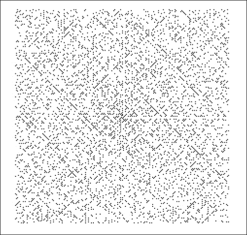

看起来并不多，但这只是螺旋中的前 5,000 个质数。注意对角线吗？有些可以用多项式来描述，这带来了关于预测质数以及由此延伸出的密码学安全性的有趣含义。

我们从一个绘图区域开始：

```js
var width = 768,
  height = 768,
  svg = d3.select('#graph')
    .append('svg')
    .attr({width: width,
                  height: height});
```

然后我们在函数的底部定义生成数字及其在网格上螺旋坐标的算法。我们开始时使用一些有用的变量：

```js
var spiral = function (n) {
  var directions = {up: [0, -1],
                      left: [-1, 0],
                      down: [0, 1],
                      right: [1, 0]};

  var x = 0,
    y = 0,
      min = [0, 0],
      max = [0, 0],
      add = [0, 0],
      direction = 0;

  var spiral = [];
});
```

我们定义了一个 `spiral` 函数，它接受一个单一的界限参数 `n`。该函数从四个旅行方向和一些算法变量开始。`min` 和 `max` 已知坐标的组合将告诉我们何时转弯；`x` 和 `y` 将是当前位置，而 `direction` 将告诉我们我们正在追踪螺旋的哪个部分。

接下来我们将算法本身添加到函数的底部：

```js
d3.range(1, n).forEach(function (i) {
    spiral.push({x: x, y: y, n: i});

    add = directions[['up', 'left', 'down', 'right'][direction]];
    x += add[0], y += add[1];

    if (x < min[0]) {
      direction = (direction+1)%4;
      min[0] = x;
    }
    if (x > max[0]) {
      direction = (direction+1)%4;
      max[0] = x;
    }
    if (y < min[1]) {
      direction = (direction+1)%4;
      min[1] = y;
    }
    if (y > max[1]) {
      direction = (direction+1)%4;
      max[1] = y;
    }
  });

  return spiral;
```

`d3.range()` 生成一个介于两个参数之间的数字数组，我们用 `forEach` 来迭代。每次迭代都会将一个新的 `{x: x, y: y, n: i}` 三元组添加到螺旋数组中。其余的只是使用 `min` 和 `max` 来改变螺旋角落的方向。是的，这很重复，但并不总是需要我们很聪明。

现在我们开始绘制：

```js
var dot = d3.svg.symbol().type('circle').size(3),
  center = 400,
    x = function (x, l) { return center+l*x; },
    y = function (y, l) { return center+l*y; };
```

我们定义了一个`dot`生成器，以及两个帮助我们将螺旋函数中的网格坐标转换为像素位置的函数。`l`是网格中一个方块的长度和宽度。

我们可以通过在线获取一个列表来避免计算素数的繁琐工作。我在[`www.mathsisfun.com/`](http://www.mathsisfun.com/)找到一个列表，并将其放在 GitHub 上，与代码示例[`github.com/Swizec/d3.js-book-examples/blob/master/ch3/primes-to-100k.txt`](https://github.com/Swizec/d3.js-book-examples/blob/master/ch3/primes-to-100k.txt)并列放置。

```js
d3.text('primes-to-100k.txt', function (data) {
  var primes = data.split('\n').slice(0, 5000).map(Number),
    sequence = spiral(d3.max(primes)).filter(function (d) {
    return _.indexOf(primes, d['n'], true) > -1;
    });
  var l = 2;

  svg.selectAll('path')
    .data(sequence)
    .enter()
    .append('path')
    .attr('transform',
         function (d) { return 'translate('+x(d['x'], l)+', '+y(d['y'], l)+')'; })
    .attr('d', dot);
});
```

我们将素数作为文本文件加载，将其拆分为行，使用`.slice()`获取前`5000`个元素，然后使用`.map(Number)`将它们转换为数字。我们将使用`l`来告诉`x`和`y`函数网格有多大。

我们用列表中的最大素数（`d3.max()`）调用`spiral`，生成数字的螺旋序列，然后使用`.filter()`从螺旋中移除所有非素数，当它们被输入到绘图代码中时。

我们使用 underscore.js 的`_.indexOf`来搜索素数，因为它使用二分搜索，使我们的代码更快。但要注意，我们必须知道我们的列表是有序的。你可以从[`underscorejs.org`](http://underscorejs.org)获取 underscore.js。

我那台老机器仍然需要大约两秒钟的时间来绘制有趣的像素化图像。

让我们通过可视化素数的密度来让它更有趣。我们将定义一个具有更大方块的网格，然后根据它们包含的点数来着色。当素数少于中位数时，方块为红色，当素数多于中位数时，方块为绿色。阴影将告诉我们它们离中位数有多远。

首先，我们将使用 d3.js 的`nest`结构定义一个新的网格：

```js
var scale = 8;

  var regions = d3.nest()
    .key(function (d) { return Math.floor(d['x']/scale); })
    .key(function (d) { return Math.floor(d['y']/scale); })
    .rollup(function (d) { return d.length; })
     .map(sequence);
```

我们以`8`的倍数进行缩放，也就是说，每个新的方块包含 64 个旧的方块。

`d3.nest()`根据一个键将数据转换为嵌套字典，这非常方便。第一个`.key()`函数创建我们的列；每个`x`都映射到新网格中对应的`x`。第二个`.key()`函数对`y`做同样的处理。然后我们使用`.rollup()`将结果列表转换成一个单一值，即点的数量。

数据通过`.map()`输入，我们得到以下结构：

```js
{
    "0": {
        "0": 5,
        "-1": 2
    },
    "-1": {
        "0": 3,
        "-1": 4
    }
}
```

这不是很直观，但这是一个包含行的列的集合。`(0, 0)`的方块包含`5`个素数，`(-1, 0)`包含`2`，以此类推。

要得到中位数和阴影数量，我们需要在数组中有这些计数：

```js
var values = d3.merge(d3.keys(regions).map(function (_x) {
      return d3.values(regions[_x]);
    }));

  var median = d3.median(values),
    extent = d3.extent(values),
      shades = (extent[1]-extent[0])/2;
```

我们通过遍历区域的键（`x`坐标）来获取每个列的值列表，然后使用`d3.merge()`将结果数组的数组展平。

`d3.median()`给我们数组的中间值，`d3.extent()`给我们最低和最高的数字，我们用这些来计算所需的阴影数量。

最后，我们再次遍历坐标来为新网格着色：

```js
d3.keys(regions).forEach(function (_x) {
    d3.keys(regions[_x]).forEach(function (_y) {

      var color,
        red = '#e23c22',
        green = '#497c36';

      if (regions[_x][_y] > median) {
        color = d3.rgb(green).brighter(regions[_x][_y]/shades);
      }else{
        color = d3.rgb(red).darker(regions[_x][_y]/shades);
      }

      svg.append('rect')
        .attr({x: x(_x, a*scale),
                  y: y(_y, a*scale),
                  width: a*scale,
                  height: a*scale})
        .style({fill: color,
                 'fill-opacity': 0.9});
    });
  });
```

我们的形象看起来像那些 Chiptunes 专辑封面：

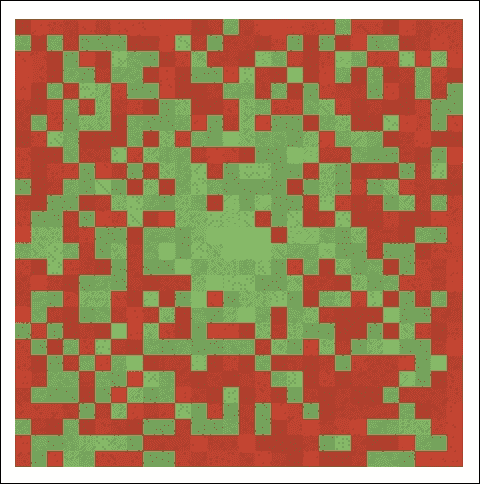

# 加载数据

d3.js 最伟大的特性之一是它可以在没有任何第三方库或程序员的帮助下异步加载外部数据。我们已经浏览了数据加载，但现在需要更仔细地研究。

我们想要从外部加载数据的原因是，将大量数据集通过预定义变量加载到页面中并不太实用。加载数百千字节的数据需要一段时间，而异步加载则允许在同时渲染页面的其余部分。

为了进行 HTTP 请求，d3.js 使用 XMLHttpRequests（简称 XHR）。由于浏览器的安全模型，这限制了我们只能访问单个域名，但如果服务器发送了`Access-Control-Allow-Origin: *`头部，我们就可以进行跨域请求。

## 核心内容

所有这些加载的核心是谦逊的`d3.xhr()`，这是手动发出 XHR 请求的方式。

它需要一个 URL 和一个可选的回调函数。如果存在，回调函数将立即触发请求，并在请求完成后将数据作为参数接收。

如果没有回调函数，我们可以调整请求；从头部到请求方法的一切都可以调整。

要进行请求，你可能需要编写以下代码：

```js
var xhr = d3.xhr('<a_url>');
xhr.mimeType('application/json');
xhr.header('User-Agent', 'our example');
xhr.on('load', function (request) { … });
xhr.on('error', function (error) { … });
xhr.on('progress', function () { … });
xhr.send('GET');
```

这将发送一个期望 JSON 响应的 GET 请求，并告诉服务器我们是一个示例。缩短这一点的办法是立即定义一个回调，但这样就不能定义自定义头部或监听其他请求事件。

另一种方法是便利函数。我们将在整本书中使用这些函数。

## 便利函数

d3.js 附带了一些便利函数，这些函数在幕后使用`d3.xhr()`，并在将其返回给我们之前解析响应。这使得我们可以将我们的工作流程限制为调用适当的函数并定义一个回调，该回调接受一个`error`和一个`data`参数。d3.js 足够好，让我们可以抛掉谨慎，使用只有一个`data`参数的回调，在出错的情况下该参数将是未定义的。

我们可以选择多种数据格式，如 TEXT、JSON、XML、HTML、CSV 和 TSV。JSON 和 CSV/TSV 使用得最多：JSON 用于小型结构化数据，CSV/TSV 用于我们想要节省空间的大型数据转储。

我们的大部分代码将遵循这种模式：

```js
d3.json('a_dataset.json', function (data) {
  // draw stuff
});
```

# 规模

规模是映射定义域到值域的函数。是的，我一直在说这个，但真的没有更多可说的。

我们使用它们的原因是为了避免数学。这使得我们的代码更短，更容易理解，并且更健壮，因为高中数学中的错误是一些最难追踪的 bug。

如果你没有在学校里听过四年的数学，一个函数的定义域是它定义的值（输入），值域是它返回的值。

下面的图是从维基百科借用的：

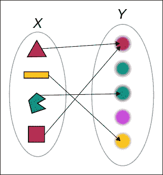

在这里，**X**是定义域，**Y**是值域，箭头是函数。

我们需要一大堆代码来手动实现这一点：

```js
var shape_color = function (shape) {
  if (shape == 'triangle') {
    return 'red';
  }else if (shape == 'line') {
    return 'yellow';
  }else if (shape == 'pacman') {
    return 'green';
  }else if (shape == 'square') {
    return 'red';
  }
};
```

您也可以使用字典来做，但 `d3.scale` 总是更加优雅和灵活：

```js
var scale = d3.scale.ordinal()
    .domain(['triangle', 'line', 'pacman', 'square'])
    .range(['red', 'yellow', 'green', 'red']);
```

好多了！

规模分为三种类型；序数尺度具有离散域，定量尺度具有连续域，时间尺度具有基于时间的连续域。

## 序数尺度

序数尺度是最简单的，本质上就是一个字典，其中键是域，值是范围。

在前面的例子中，我们通过显式设置输入域和输出范围来定义序数尺度。如果我们不定义域，它将从使用中推断出来，但这可能会产生不可预测的结果。

序数尺度的一个有趣之处在于，当范围小于域时，尺度会循环值。此外，如果范围只是 `['red', 'yellow', 'green']`，我们也会得到相同的结果。但是，将连续区间切割成块可以创建一个更好的范围，例如直方图。

让我们试试。

首先，我们需要一个绘图区域：

```js
var width = 800,
  height = 600,
  svg = d3.select('#graph')
    .append('svg')
    .attr({width: width,
           height: height});
```

然后我们定义了我们需要的三个尺度，并生成了一些数据：

```js
var data = d3.range(30),
  colors = d3.scale.category10(),
  points = d3.scale.ordinal().domain(data)
                 .rangePoints([0, height], 1.0),
  bands = d3.scale.ordinal().domain(data)
                 .rangeBands([0, width], 0.1);
```

我们的数据只是一个包含 `30` 个数字的列表，而 `colors` 尺度来自第二章，*DOM、SVG 和 CSS 入门*。它是一个预定义的序数尺度，具有未定义的域和十个颜色的范围。

然后我们定义了两个尺度，将我们的绘图分成相等的部分。`points` 使用 `.rangePoints()` 在绘图高度上分布 `30` 个等间距的点。我们使用因子 `1.0` 设置边缘填充，这设置了最后一个点到边缘的距离为点之间距离的一半。端点使用 `point_distance*padding/2` 从范围边缘向内移动。

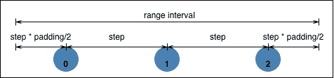

`bands` 使用 `.rangeBands()` 将宽度划分为 `30` 个等宽的带，带之间的填充因子为 `0.1`。这次我们设置带之间的距离，使用 `step*padding`，第三个参数将使用 `step*outerPadding` 设置边缘填充。

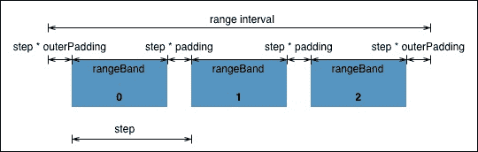

我们将使用您在第二章中已经了解的代码，*DOM、SVG 和 CSS 入门*，来使用这些尺度绘制两条线：

```js
svg.selectAll('path')
  .data(data)
  .enter()
  .append('path')
  .attr({d: d3.svg.symbol().type('circle').size(10),
      transform: function (d) { 
        return 'translate('+(width/2)+', '+points(d)+')'; }
    })
  .style('fill', function (d) { return colors(d); });

svg.selectAll('rect')
  .data(data)
  .enter()
  .append('rect')
  .attr({x: function (d) { return bands(d); },
     y: height/2,
     width: bands.rangeBand(),
     height: 10})
  .style('fill', function (d) { return colors(d); });
```

要获取每个点或矩形的坐标，我们调用尺度作为函数，并使用 `bands.rangeBand()` 获取矩形宽度。

图片看起来如下：

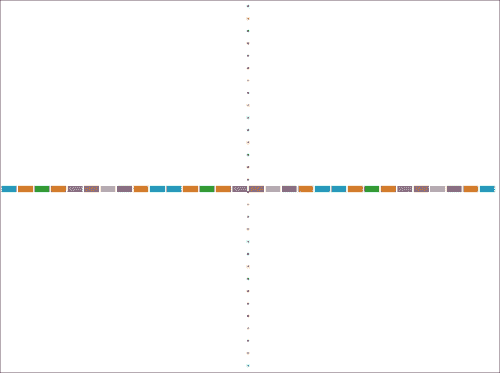

## 定量尺度

定量尺度有多种不同的风味，但它们都有一个共同的特征，即输入域是连续的。连续尺度可以用一个简单的函数来建模，而不是一组离散值。七种定量尺度是线性、恒等、幂、对数、量化、分位数和阈值。它们定义了输入域的不同转换。前四种具有连续的输出范围，而后三种映射到离散范围。

为了了解它们的行为，我们将使用所有这些刻度在绘制`weierstrass`函数时操纵`y`坐标；这是第一个在所有地方连续但无处可微分的函数。这意味着尽管你可以不抬起笔来绘制函数，但你永远无法定义你正在绘制的角度（计算导数）。

我们从一个绘图区域和维基百科上找到的`weierstrass`函数开始，如下所示：

```js
var width = 800,
  height = 600,
  svg = d3.select('#graph')
    .append('svg')
    .attr({width: width,
           height: height});

var weierstrass = function (x) {
  var a = 0.5,
    b = (1+3*Math.PI/2)/a;

  return d3.sum(d3.range(100).map(function (n) {
    return Math.pow(a, n)*Math.cos(Math.pow(b, n)*Math.PI*x);
  }));
};
```

一个绘图函数将帮助我们避免代码重复：

```js
var draw_one = function (line) {
  return svg.append('path')
    .datum(data)
    .attr("d", line)
    .style({'stroke-width': 2,
            fill: 'none'});
};
```

我们生成一些数据，获取`weierstrass`函数的`extent`，并使用线性刻度来表示`x`：

```js
var data = d3.range(-100, 100).map(function (d) { return d/200; }),
  extent = d3.extent(data.map(weierstrass)),
  colors = d3.scale.category10(),
  x = d3.scale.linear().domain(d3.extent(data)).range([0, width]);
```

### 连续范围刻度

我们可以使用以下代码来绘制：

```js
var linear = d3.scale.linear().domain(extent).range([height/4, 0]),
  line1 = d3.svg.line()
    .x(x)
    .y(function(d) { return linear(weierstrass(d)); });

draw_one(line1)
  .attr('transform', 'translate(0, '+(height/16)+')')
  .style('stroke', colors(0));
```

我们定义了一个线性刻度，其定义域包含`weierstrass`函数返回的所有值，范围从零到绘图宽度。该刻度将使用线性插值在输入和输出之间进行转换，甚至可以预测其定义域之外的价值。如果我们不希望发生这种情况，我们可以使用`.clamp()`。在定义域和范围内使用超过两个数字，我们可以创建一个多线性刻度，其中每个部分都像是一个独立的线性刻度。

线性刻度创建了以下截图：

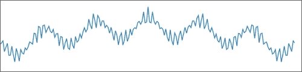

让我们一次性添加其他连续刻度：

```js
var identity = d3.scale.identity().domain(extent),
  line2 = line1.y(function (d) { return identity(weierstrass(d)); });

draw_one(line2)
  .attr('transform', 'translate(0, '+(height/12)+')')
  .style('stroke', colors(1));

var power = d3.scale.pow().exponent(0.2).domain(extent).range([height/2, 0]),
  line3 = line1.y(function (d) { return power(weierstrass(d)); });

draw_one(line3)
  .attr('transform', 'translate(0, '+(height/8)+')')
  .style('stroke', colors(2));

var log = d3.scale.log().domain(
  d3.extent(data.filter(function (d) { return d > 0 ? d : 0; }))).range([0, width]),
  line4 = line1.x(function (d) { return d > 0 ? log(d) : 0; })
    .y(function (d) { return linear(weierstrass(d)); });
draw_one(line4)
  .attr('transform', 'translate(0, '+(height/4)+')')
  .style('stroke', colors(3));
```

我们继续重复使用相同的`line`定义，改变用于`y`的刻度，除了`power`刻度，因为改变`x`可以更好地说明例子。

我们还考虑了`log`仅在正数上有定义，但你通常不会用它来表示周期函数。它在同一张图上显示大数和小数方面做得更好。

现在我们的图片看起来如下所示：

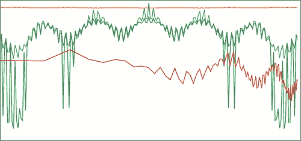

`identity`刻度是橙色，几乎不跳动，因为我们输入到函数中的数据只从-0.5 到 0.5，`power`刻度是绿色，而`logarithmic`刻度是红色。

### 离散范围刻度

我们比较中有趣的刻度是`quantize`和`threshold`。`quantize`刻度将输入域划分为相等的部分，并将它们映射到输出范围中的值，而`threshold`刻度允许我们将任意域部分映射到离散值：

```js
var quantize = d3.scale.quantize().domain(extent)
                        .range(d3.range(-1, 2, 0.5).map(function (d) { return d*100; })),
  line5 = line1.x(x).y(function (d) { return quantize(weierstrass(d)); }),
  offset = 100

draw_one(line5)
  .attr('transform', 'translate(0, '+(height/2+offset)+')')
  .style('stroke', colors(4));

var threshold = d3.scale.threshold().domain([-1, 0, 1]).range([-50, 0, 50, 100]),
  line6 = line1.x(x).y(function (d) { return threshold(weierstrass(d)); });

draw_one(line6)
  .attr('transform', 'translate(0, '+(height/2+offset*2)+')')
  .style('stroke', colors(5));
```

`quantize`刻度将`weierstrass`函数划分为 1 到 2 之间的离散值，步长为 0.5（-1, -0.5, 0，等等），而阈值将小于-1 的值映射到-50，-1 映射到 0，等等。

结果如下所示：

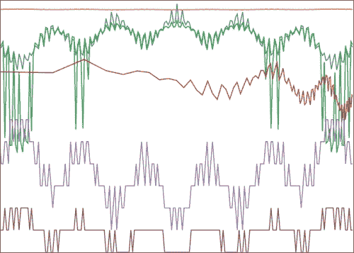

# 时间

你不理解时间。你可能认为你理解了，但你并没有。

下次当你想要将 3,600 秒加到时间戳上以推进一小时，或者基本上`now+24*3600`就是明天时，请记住这一点。

时间是一个复杂的生物。一小时可以是 3600 秒或 3599 秒，如果有闰秒。明天可以是 23 到 25 小时，月份从 28 到 31 天不等，一年可以是 365 天或 366 天。有些十年比其他十年天数少。

考虑到许多数据集与时间紧密相关，这可能会成为一个大问题。你该如何处理时间呢？

幸运的是，d3.js 提供了一系列处理时间的功能。

## 格式化

你可以通过给`d3.time.format()`提供一个格式字符串来创建一个新的格式化器。然后你可以用它将字符串解析为`Date`对象，反之亦然。

整个语言都在 d3.js 的文档中解释，但让我们看看一些例子：

```js
> format = d3.time.format('%Y-%m-%d')
> format.parse('2012-02-19')
Sun Feb 19 2012 00:00:00 GMT+0100 (CET)
```

我们使用`d3.time.format()`定义了一个新的格式化器（年-月-日），然后解析了数据集中常见的日期。这给了我们一个带有默认小时、分钟和秒的适当`date`对象。

同样的格式化器也可以反过来使用：

```js
> format(new Date())
"2013-02-19"
```

你可以在`d3.time.format.iso`找到完整的 ISO 标准时间格式化器。这通常很有用。

## 时间算术

我们还得到了一套完整的时间算术函数，它们与 JavaScript 的`Date`对象一起工作，并遵循一些简单的规则：

1.  `d3.time.interval`，其中`interval`可以是`second`、`minute`、`hour`等。它返回一个新的时间间隔。例如，`d3.time.hour`将是一个小时的长度。

1.  `d3.time.interval`(`Date`)是一个`interval.floor()`的别名，它将`Date`向下取整，使得比`interval`更具体的单位被设置为零。

1.  `interval.offset`(`Date`, `step`)将根据指定的步数将日期移动到正确的单位。

1.  `interval.range`(`Date_start`, `Date_stop`)将返回两个指定日期之间的每个`interval`。

1.  `d3.time.intervals`，其中`interval`是`seconds`、`minutes`、`hours`等。它们是`interval.range`的有用别名。

例如，如果你想找到一小时后的时间，你会这样做：

```js
> d3.time.hour.offset(new Date(), 1)
Tue Feb 19 2013 06:09:17 GMT+0100 (CET)
```

发现已经很晚了，你应该停止写关于 JavaScript 的书，去睡觉了。

# 地理学

其他有用的数据类型是地理坐标，通常用于天气或人口数据；任何需要绘制地图的地方。

d3.js 为我们提供了三个用于地理数据的工具：路径生成最终像素，投影将球坐标转换为笛卡尔坐标，流加速处理。

我们将使用的主要数据格式是 TopoJSON，它是 GeoJSON 的一个更紧凑的扩展，由 Mike Bostock 创建。从某种意义上说，TopoJSON 是 GeoJSON 相对于视频的 DivX。虽然 GeoJSON 使用 JSON 格式来编码地理数据，包括点、线和多边形，但 TopoJSON 使用弧线来编码基本特征，并重复使用它们来构建越来越复杂的特征。因此，文件可以比使用 GeoJSON 时小 80%以上。

## 获取地理数据

现在，与许多其他数据集不同，地理数据不能在互联网上随意找到。特别是在像 TopoJSON 这样的边缘格式中。我们将找到一些 Shapefile 或 GeoJSON 格式的数据，然后使用`topojson`命令行工具将它们转换为 TopoJSON。找到详细数据可能很困难，但并非不可能，查找您国家的统计局。例如，美国人口普查局在[`www.census.gov/geo/www/cob/index.html`](http://www.census.gov/geo/www/cob/index.html)提供了许多有用的数据集。

Natural Earth 是另一个提供不同细节级别地理数据的出色资源。最大的优势是不同的层（海洋、国家、道路等）被精心制作以相互匹配，没有差异，并且经常更新。您可以在[`www.naturalearthdata.com/`](http://www.naturalearthdata.com/)找到这些数据集。

让我们为下一个示例准备一些数据。访问[`www.naturalearthdata.com/`](http://www.naturalearthdata.com/)并下载 50 米细节级别的`ocean`、`land`、`rivers and lake centerlines`和`land boundary lines`数据集，以及 10 米的`urban areas`数据集。您可以在**下载**标签页中找到它们。这些文件也位于 GitHub 上的示例中，可在[`github.com/Swizec/d3.js-book-examples/tree/master/ch3/data`](https://github.com/Swizec/d3.js-book-examples/tree/master/ch3/data)找到。

解压这五个文件。我们将它们合并成三个 TopoJSON 文件以节省请求时间，三个大文件比五个小文件更快，我们更喜欢 TopoJSON，因为它文件大小更小。

我们将按类别合并，这样我们以后可以重用这些文件；一个用于水数据，另一个用于土地数据，第三个用于文化数据。

您需要安装`topojson`，它需要 node.js。按照`nodejs.org`上您电脑的安装说明进行操作，然后打开终端，并运行以下命令：

```js
> npm install -global topojson
```

`npm`是 node 的内置包管理器。它全局下载并安装`topojson`库。您可能需要以超级用户身份运行此命令。

接下来，我们使用三个简单的命令转换这些文件：

```js
> topojson -o water.json ne_50m_rivers_lake_centerlines.shp ne_50m_ocean.shp
> topojson -o land.json ne_50m_land.shp
> topojson -o cultural.json ne_50m_admin_0_boundary_lines.shp ne_10m_urban_areas.shp
```

`topojson`库将形状文件转换为 TopoJSON 文件，并合并我们想要合并的文件。我们使用`-o`指定了结果存放的位置；其他参数是源文件。

我们已生成三个文件：`water.json`、`land.json`和`cultural.json`。您可以随意查看它们，但它们并不非常适合人类阅读。

## 绘制地理数据

`d3.geo.path()`将成为我们地理绘图的得力助手。它与之前我们了解的 SVG 路径生成器类似，但它绘制的是地理数据，并且足够智能，能够决定是绘制线条还是区域。

为了将球形对象（如行星）展平为二维图像，`d3.geo.path()`使用投影。不同的投影类型被设计来展示数据的不同方面，但最终结果是，你只需更改投影或移动其焦点，就可以完全改变地图的外观。

使用正确的投影，你甚至可以使欧洲的数据看起来像美国。遗憾的是，默认投影是专门为绘制标准地图而设计的`albersUsa`。

让我们绘制一个以欧洲为中心并放大到欧洲的地图，因为这是我来自的地方。我们将在第四章*让事物移动*中使其可导航。

我们首先需要向我们的标准 HTML 文件中添加一些内容。

在主`div`上方添加一个空的`style`定义；我们稍后会用它来使我们的地图看起来更好：

```js
<style></style>
```

我们还需要在 d3.js 之后立即添加两个更多的 JavaScript 文件：

```js
<script src="img/topojson.v0.min.js"></script>
<script src="img/queue.v1.min.js"></script>
```

这些内容加载了 TopoJSON 解析器和队列工具，以帮助我们加载多个数据集。

我们在 JavaScript 文件中继续使用绘图区域：

```js
var width = 1800,
  height = 1200,
  svg = d3.select('#graph')
    .append('svg')
    .attr({width: width,
             height: height});
```

接下来，我们定义地理`投影`：

```js
var projection = d3.geo.equirectangular()
    .center([8, 56])
    .scale(800);
```

`等角投影`是 d3.js 附带十二种投影之一，可能是我们自高中以来最常见的一种投影。

`等角投影`的问题在于它不保留面积或很好地表示地球表面。关于将球体投影到二维表面的全面讨论需要太多时间，所以我建议查看 d3.js 的维基百科页面以及投影插件中实现的所有投影的可视比较。它可在[`github.com/mbostock/d3/wiki/Geo-Projections`](https://github.com/mbostock/d3/wiki/Geo-Projections)找到。

接下来的两行定义了地图的中心位置和缩放程度。通过调整，我得到了三个值：纬度为`8`，经度为`56`，缩放因子为`800`。尝试调整以获得不同的外观。

现在我们加载我们的数据：

```js
queue()
  .defer(d3.json, 'data/water.json')
  .defer(d3.json, 'data/land.json')
  .defer(d3.json, 'data/cultural.json')
  .await(draw);
```

我们使用 Mike Bostock 的`queue`库按顺序运行三个加载操作。每个操作都将使用`d3.json`来加载和解析数据，当它们全部完成后，`queue`将使用结果调用`draw`。

在我们开始绘图之前，我们还需要一个函数，该函数可以向地图添加一个功能，这将帮助我们减少代码重复：

```js
function add_to_map(collection, key) {
  return svg.append('g')
    .selectAll('path')
    .data(topojson.object(collection,
                   collection.objects[key]).geometries)
        .enter()
    .append('path')
    .attr('d', d3.geo.path().projection(projection));
}
```

此函数接受一个对象集合和一个键，用于选择要显示的对象。`topojson.object()`将 TopoJSON 拓扑转换为 GeoJSON，以便`d3.geo.path()`使用。

是否将数据转换为 GeoJSON 比在目标表示中传输数据更高效，取决于你的使用情况。转换数据需要一些计算时间，但将兆字节而不是千字节传输可以大大提高响应速度。

最后，我们创建一个新的 `d3.geo.path()`，并告诉它使用我们的投影。除了生成 SVG 路径字符串外，`d3.geo.path()` 还可以计算我们特征的不同属性，如面积 (`.area()`) 和边界框 (`.bounds()`).

现在我们可以开始绘制：

```js
function draw (err, water, land, cultural) {
  add_to_map(water, 'ne_50m_ocean')
    .classed('ocean', true);
};
```

我们的 `draw` 函数接收加载数据返回的错误，以及三个数据集，然后让 `add_to_map` 执行繁重的工作。

给 HTML 添加一些样式：

```js
.ocean {
  fill: #759dd1;
}
```

刷新页面将显示一些海洋。

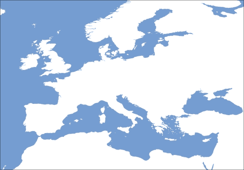

我们在 `draw` 函数中添加了四个额外的 `add_to_map` 调用，以填充其他功能：

```js
  add_to_map(land, 'ne_50m_land')
    .classed('land', true);

  add_to_map(water, 'ne_50m_rivers_lake_centerlines')
    .classed('river', true);

  add_to_map(cultural, 'ne_50m_admin_0_boundary_lines_land')
    .classed('boundary', true);

  add_to_map(cultural, 'ne_10m_urban_areas')
    .classed('urban', true);
```

添加以下样式定义：

```js
.river {
  fill: none;
  stroke: #759dd1;
  stroke-width: 1;
}

.land {
  fill: #ede9c9;
  stroke: #79bcd3;
  stroke-width: 2;
}

.boundary {
  stroke: #7b5228;
  stroke-width: 1;
  fill: none;
}

.urban {
  fill: #e1c0a3;
}
```

现在我们有一个缓慢渲染的欧洲地区放大地图，显示世界城市区域作为斑点：

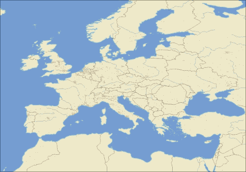

有很多原因导致它如此缓慢。我们在每次调用 `add_to_map` 时都在 TopoJSON 和 GeoJSON 之间转换。即使使用相同的数据集，我们也使用过于详细的数据来绘制如此缩放的地图，并且我们渲染整个世界来查看一个小部分。我们为了渲染速度而牺牲了灵活性。

### 使用地理作为基础

地理不仅仅是绘制地图。地图通常是我们构建的基础，用于展示一些数据。

让我们将其转换为世界机场地图。最初我想制作机场之间的路线图，但它看起来太拥挤了。

第一步是从 [`openflights.org/data.html`](http://openflights.org/data.html) 获取 `airports.dat` 和 `routes.dat` 数据集。你也可以在 GitHub 上的示例中找到它：[`github.com/Swizec/d3.js-book-examples/blob/master/ch3/data/airports.dat`](https://github.com/Swizec/d3.js-book-examples/blob/master/ch3/data/airports.dat)。

在 `draw` 的底部添加对 `add_airlines()` 的调用。我们将使用它来加载更多数据并绘制机场：

```js
function add_airlines() {
  queue()
    .defer(d3.text, 'data/airports.dat')
    .defer(d3.text, 'data/routes.dat')
    .await(draw_airlines);
};
```

函数加载了两个数据集，然后调用 `draw_airlines` 来绘制它们。我们使用 `d3.text` 而不是 `d3.csv`，因为文件没有标题行，所以我们必须手动解析。

在 `draw_airlines` 中，我们首先将数据整理成 JavaScript 对象，通过 `id` 将机场整理成字典，并将路线整理成源到目标机场的映射：

```js
function draw_airlines(err, _airports, _routes) {
  var airports = {},
    routes = {};

  d3.csv.parseRows(_airports).forEach(function (airport) {
    var id = airport[0];

    airports[id] = {
      lat: airport[6],
      lon: airport[7]
    };
  });

  d3.csv.parseRows(_routes).forEach(function (route) {
    var from_airport = route[3];

    if (!routes[from_airport]) {
      routes[from_airport] = [];
    }

    routes[from_airport].push({
      to: route[5],
      from: from_airport,
      stops: route[7]
    });
  });
}
```

我们使用 `d3.csv.parseRows` 将 CSV 文件解析成数组，并手动将它们转换为字典。不幸的是，数组索引不太易读，但当你查看原始数据时它们是有意义的：

```js
1,"Goroka","Goroka","Papua New Guinea","GKA","AYGA",-6.081689,145.391881,5282,10,"U"
2,"Madang","Madang","Papua New Guinea","MAG","AYMD",-5.207083,145.7887,20,10,"U"
```

每个机场圆圈的半径将显示有多少路线从这里出发。因此，我们需要一个比例：

```js
var route_N = d3.values(routes).map(function (routes) {
  return routes.length;
  }),
    r = d3.scale.linear().domain(d3.extent(route_N)).range([2, 15]);
```

我们将路线计数数组转换为线性比例。

现在我们可以绘制机场：

```js
svg.append('g')
    .selectAll('circle')
    .data(d3.keys(airports))
    .enter()
    .append('circle')
    .attr("transform", function (id) {
      var airport = airports[id];
      return "translate("+projection([airport.lon, airport.lat])+")";
    })
    .attr('r', function (id) { return routes[id] ? r(routes[id].length) : 1; })
    .classed('airport', true);
```

困难的部分在于我们使用了与`d3.geo.path()`相同的`projection`，将机场位置转换为圆坐标。我们避免了`cx`和`cy`属性，以便我们可以利用`projection`同时处理两个坐标。到目前为止，其他所有内容都应该来自第二章, *DOM、SVG 和 CSS 入门*。

没有航线的机场将是非常小的点。

之后，我们在我们的 HTML 中添加了一些更多的 CSS：

```js
.airport {
  fill: #9e56c7;
  opacity: 0.6;
  stroke: #69349d;
}
```

以下截图显示了结果：

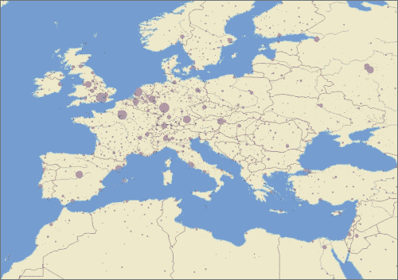

# 摘要

你已经完成了关于数据的章节！

我们真正触及了 d3.js 的核心，即数据处理。关于函数式编程的部分可能激发了你尝试函数式风格的编程，如果你还在犹豫不决的话。在了解数据处理的过程中，我们看到了一些素数的有趣属性，学习了如何加载外部数据，并有效地使用比例来避免计算。

最后，我们制作了一张酷炫的地图，来学习一旦掌握了良好的数据源并将其转换为更好的格式，简单的地理数据可以变得多么简单。
