# 第五章。布局 – d3 的黑色魔法

我们中的大多数人都在互联网上寻找灵感和代码示例。你找到一些看起来很棒的东西，看看代码，然后你的眼睛就会变得模糊。它没有任何意义。

常见的罪魁祸首是 d3 对任何稍微复杂的事情都依赖于布局。从一些数据调用一个函数，然后 voilà——可视化！这种优雅使布局看起来欺骗性地困难，但当你掌握了它们，它们会使事情变得容易得多。

在本章中，我们将带着我们迄今为止所学的一切，全速前进，创建同一数据集的 11 个可视化。

# 布局是什么以及为什么你应该关心

d3 布局是模块，将数据转换为绘图规则。最简单的布局可能只是将对象数组转换为坐标，就像一个比例尺。

但我们通常使用布局来创建更复杂的可视化——例如绘制一个力导向图或一棵树。在这些情况下，布局帮助我们分离计算坐标和将像素放置在页面上的过程。这不仅使我们的代码更干净，而且还可以让我们为截然不同的可视化重用相同的布局。

理论是无聊的，让我们深入挖掘。

## 内置布局

默认情况下，d3 附带 12 个内置布局，涵盖了大多数常见的可视化。它们可以大致分为普通布局和层次布局。普通布局如下：

+   `histogram`

+   `pie`

+   `stack`

+   `chord`

+   `force`

层次布局如下：

+   `partition`

+   `tree`

+   `cluster`

+   `pack`

+   `treemap`

为了了解它们的行为，我们将为每种类型创建一个示例。我们将从谦逊的饼图和直方图开始，然后过渡到力导向图和花哨的树。我们使用相同的数据集来展示所有示例，这样我们就可以感受到不同的展示方式如何影响数据的感知。

这些是本书中的最后几个示例，所以我们将使它们特别出色。这将创建大量的代码，所以每次我们想到可重用的东西，我们都会将其作为一个函数放入`helpers.js`文件中。

让我们创建一个空的`helper.js`文件：

```js
window.helpers = {
};
```

我们将把函数作为全局对象的成员添加。在包含正常代码之前，将以下行添加到 HTML 中。

```js
<script src="img/helpers.js"></script>
```

让我们同意所有示例都以绘图区域和数据获取开始。

```js
var width = 1024,
    height = 1024,
    svg = d3.select('#graph')
        .append('svg')
        .attr({width: width,
               height: height});

d3.json('data/karma_matrix.json', function (data) {
});
```

示例代码将放在`d3.json`加载监听器中。

### 数据集

我们将要玩的数据集是从我最喜欢的 IRC 频道的日志中抓取的，追溯到 2011 年末。该频道的特殊功能是 karma 机器人。

当有人做我们喜欢的事情时，我们用`nick++`给他们 karma，机器人将其计为对该人的投票。就像在 Reddit 上一样，karma 本来是用来衡量社区对某人的喜爱程度的，但实际上它只是关于谁最活跃。

我们感兴趣的是 karma。

您可以在 [`raw.github.com/Swizec/d3.js-book-examples/master/ch5/data/karma_matrix.json`](https://raw.github.com/Swizec/d3.js-book-examples/master/ch5/data/karma_matrix.json) 获取数据集。该数据集由表示给予 karma 实例的对象组成。每个对象看起来像以下代码：

```js
{"to": "smotko",
 "from": "Swizec",
 "time": "2012-02-28 23:44:40"}
```

每个对象都告诉我们某人在何时（`time`）向某人（`from`）给予 karma。为了处理通常附加到昵称上的杂项——例如，`smotko` 是来自他手机的 `smotko-nexus`——在抓取数据集时只考虑昵称的前四个字母。

这为我们创建了一个干净的数据集来工作。您可以将其视为图中边的一个列表，其中用户是节点，`to` 和 `from` 创建一个有向边。

是时候绘制了！

### 使用直方图布局

我们将使用 `histogram` 布局来创建人们收到的 karma 的条形图。布局本身将处理从收集值到区间，再到计算条形的高度、宽度和位置的所有事情。

直方图通常表示连续数值域上的概率分布，但昵称是序数的。为了使 `histogram` 布局符合我们的意愿，我们必须将昵称转换为数字——我们将使用一个刻度。

由于感觉这可能在其他示例中很有用，我们将代码放入 `helpers.js`：

```js
uniques: function (data, nick) {
        var uniques = [];

        data.forEach(function (d) {
            if (uniques.indexOf(nick(d)) < 0) {
                uniques.push(nick(d));
            }
        });

        return uniques;
    },

    nick_id: function (data, nick) {
        var uniques = helpers.uniques(data, nick);

        return d3.scale.ordinal()
            .domain(uniques)
            .range(d3.range(uniques.length));
    },
```

这些是两个简单的函数。`uniques` 遍历数据并返回一个唯一昵称的列表。我们通过 `nick` 访问器帮助它。`nick_id` 创建一个序数刻度，我们将使用它将昵称转换为数字。

现在我们可以告诉直方图如何使用 `nick_id` 处理我们的数据。

```js
var nick_id = helpers.nick_id(data, function (d) { return d.to; });

var histogram = d3.layout.histogram()
            .bins(nick_id.range())
            .value(function (d) { return nick_id(d.to); })(data);
```

使用 `d3.layout.histogram()` 我们创建一个新的直方图，并使用 `.bins()` 定义每个区间的上限。给定 `[1,2,3]`，小于 `1` 的值进入第一个区间，介于 `1` 和 `2` 之间的值进入第二个区间，依此类推。

`.value()` 访问器告诉直方图如何在我们的数据集中查找值。

另一种指定区间的方法是指定所需的区间数量，并让直方图将连续的数值输入域均匀地划分为区间。对于此类域，您甚至可以通过将 `.frequency()` 设置为 `false` 来创建概率直方图。您可以使用 `.range()` 限制考虑的区间的范围。

最后，我们使用布局作为我们数据上的一个函数来获取一个类似这样的对象数组：

```js
{0: {from: "HairyFotr",
         time: "2011-10-11 18:38:17",
         to: "notepad"},
     1: {from: "HairyFotr",
        time: "2012-01-09 10:41:53",
        to: "notepad"},
     dx: 1,
     x: 0,
     y: 2}
```

区间宽度在 `dx` 属性中，`x` 是水平位置，`y` 是高度。我们使用常规数组函数访问区间中的元素。

现在用这些数据绘制条形图应该很容易了。我们将为每个维度定义一个刻度，标注两个轴，并放置一些矩形作为条形。

为了使事情更简单，我们首先设置一些边距。记住，所有这些代码都放在我们之前定义的数据加载监听器中：

```js
var margins = {top: 10,
               right: 40,
               bottom: 100,
               left: 50};
```

并且两个刻度。

```js
var x = d3.scale.linear()
            .domain([0, d3.max(histogram, function (d) { return d.x; })])
            .range([margins.left, width-margins.right]),
        y = d3.scale.log()
            .domain([1, d3.max(histogram, function (d) { return d.y; })])
            .range([height-margins.bottom, margins.top]);
```

使用垂直轴的对数刻度将使图表更容易阅读，尽管 karma 变化很大。

接下来，在左侧放置一个垂直轴：

```js
var yAxis = d3.svg.axis()
            .scale(y)
            .tickFormat(d3.format('f'))
            .orient('left');

    svg.append('g')
        .classed('axis', true)
        .attr('transform', 'translate(50, 0)')
        .call(yAxis);
```

我们为每个条形及其标签创建一个分组元素：

```js
var bar = svg.selectAll('.bar')
            .data(histogram)
            .enter()
            .append('g')
            .classed('bar', true)
            .attr('transform',
                  function (d) { return 'translate('+x(d.x)+', '+y(d.y)+')'; });
```

将分组移动到位置，如下面的代码所示，意味着在定位条形及其标签时工作量更少：

```js
bar.append('rect')
        .attr({x: 1,
               width: x(histogram[0].dx)-margins.left-1,
               height: function (d) { return height-margins.bottom-y(d.y); }
              });
```

因为分组已经到位，我们可以将条形图放置在分组边缘的一个像素处。所有条形图的宽度将是`histogram[0].dx`，我们将使用每个数据点的`y`位置和总图高度来计算高度。最后，我们创建标签：

```js
bar.append('text')
        .text(function (d) { return d[0].to; })
        .attr({transform: function (d) {
                   var bar_height = height-margins.bottom-y(d.y);

                   return 'translate(0, '+(bar_height+7)+') rotate(60)'; }
        });
```

我们将标签移动到图的底部，旋转 60 度以避免重叠，并将它们的文本设置为数据点的`.to`属性。

为 HTML 添加一些 CSS 样式：

```js
<style>
.axis path, .axis line {
  fill: none;
  stroke: #000;
  shape-rendering: crispEdges;
}

.axis text {
  font-size: 0.75em;
}

rect {
  fill: steelblue;
  shape-rendering: crispEdges;
}
</style>
```

我们的可视化条形图看起来像这样：

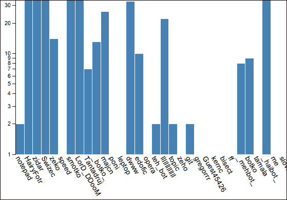

好吧，整个图表放不进这本书里。运行示例。

### 美味的饼图

之前的条形图显示**HairyFotr**的 karma 最多。让我们找出是谁让他如此受欢迎。

我们将使用饼图布局将**HairyFotr**的 karma 分割成块，显示他从其他人那里得到多少 karma。在过滤了要给**HairyFotr**的 karma 数据集之后，我们必须按捐赠者对条目进行分类，最后将它们输入饼图布局以生成饼图。

我们可以使用`histogram`布局根据`.from`属性将数据放入桶中。让我们在`helpers.js`中添加一个函数：

```js
    bin_per_nick: function (data, nick) {
        var nick_id = helpers.nick_id(data, nick);

        var histogram = d3.layout.histogram()
                .bins(nick_id.range())
                .value(function (d) { return nick_id(nick(d)); });

        histogram(data);

        return histogram;
    },
```

与`uniques`和`nick_id`函数类似，`bin_per_nick`接受数据和`nick`访问器，并返回直方图数据。

我们现在可以在饼图的监听器中这样做：

```js
    filtered = data.filter(
                function (d) { return d.to == 'HairyFotr'; });

    var per_nick = helpers.bin_per_nick(filtered,
                              function (d) { return d.from; });
```

`per_nick`变量中的条目将告诉我们**HairyFotr**从某人那里得到了多少 karma。

要制作一个饼图，我们调用`pie`布局并提供一个值访问器：

```js
var pie = d3.layout.pie()
            .value(function (d) { return d.length; })(per_nick);
```

`pie`布局现在充满了切片对象，每个对象都持有`startAngle`和`endAngle`值以及原始值。

条目看起来像这样：

```js
    {data: Array[135],
    endAngle: 2.718685950221936,
    startAngle: 0,
    value: 135}
```

我们可以指定一个`.sort()`函数来改变切片的组织方式，或者一个`.startAngle()`或`.endAngle()`函数来限制饼图的大小。

现在剩下的只是绘制饼图。我们需要一个`arc`生成器，就像第二章中提到的那些，*DOM、SVG 和 CSS 简介*，以及一些颜色来区分切片。

找到 24 种看起来很棒且不同的颜色很难；幸运的是，`@ponywithhiccups`接受了挑战并做出了选择。谢谢！

让我们在`helpers.js`中添加这些颜色：

```js
color:  d3.scale.ordinal()
        .range(['#EF3B39', '#FFCD05', '#69C9CA', '#666699', '#CC3366', '#0099CC',
                '#CCCB31', '#009966', '#C1272D', '#F79420', '#445CA9', '#999999',
                '#402312', '#272361', '#A67C52', '#016735', '#F1AAAF', '#FBF5A2',
                '#A0E6DA', '#C9A8E2', '#F190AC', '#7BD2EA', '#DBD6B6', '#6FE4D0']),
```

`color`刻度是一个没有域的顺序刻度。为了确保昵称总是得到相同的颜色，`helpers.js`中的一个函数将帮助我们固定域，如下面的代码所示：

```js
fixate_colors: function (data) {
        helpers.color.domain(helpers.uniques(data,
                                function (d) { return d.from; }));
    }
```

现在，我们可以定义`arc`生成器并固定颜色：

```js
var arc = d3.svg.arc()
            .outerRadius(150)
            .startAngle(function (d) { return d.startAngle; })
            .endAngle(function (d) { return d.endAngle; });

helpers.fixate_colors(data);
```

每个弧形及其标签都由一个分组元素持有，如下面的代码所示：

```js
var slice = svg.selectAll('.slice')
            .data(pie)
            .enter()
            .append('g')
            .attr('transform', 'translate(300, 300)');
```

为了简化定位，我们将每个分组移动到饼图的中心。创建切片的工作方式与第二章中提到的相同，*DOM、SVG 和 CSS 简介*：

```js
slice.append('path')
        .attr({d: arc,
                  fill: function (d) { return colors(d.data[0].from); }
              });
```

我们通过`d.data[0].from`获取一个切片的颜色——原始数据集在`.data`中，其中所有的`.from`属性都是相同的。这是我们按其分组的。

标签需要做更多的工作。它们需要旋转到合适的位置，有时还需要翻转，以免出现颠倒的情况。

在以后标记弧线也会很有用，所以让我们在`helpers.js`中创建一个通用函数：

```js
arc_labels: function (text, radius) {
        return function (selection) {
            selection.append('text')
                .text(text)
                .attr('text-anchor', function (d) {
                    return helpers.tickAngle(d) > 100 ? 'end' : 'start';
                })
                .attr('transform', function (d) {
                    var degrees = helpers.tickAngle(d);

                    var turn = 'rotate('+degrees+') translate('+(radius(d)+10)+', 0)';

                    if (degrees > 100) {
                        turn += 'rotate(180)';
                    }

                    return turn;
                });
        }
    },
```

我们使用部分应用来生成一个在 d3 选择上操作的功能。这意味着我们可以使用它与`.call()`一起，同时仍然定义我们自己的参数。

我们将为`arc_labels`提供一个`text`访问器和`radius`访问器，它将返回一个我们可以使用`.call()`在选择上调用的函数，以便在正确的位置显示标签。主要部分附加一个文本元素，根据是否需要翻转调整其`text-anchor`元素，并使用`tickAngle`函数将元素旋转到特定的位置。

让我们添加`tickAngle`函数的内容：

```js
tickAngle: function (d) {
        var midAngle = (d.endAngle-d.startAngle)/2,
            degrees = (midAngle+d.startAngle)/Math.PI*180-90;

        return degrees;
    }
```

`helpers.tickAngle`计算`d.startAngle`和`d.endAngle`之间的中间角度，并将结果从弧度转换为度，以便 SVG 可以理解它。

这只是基本的三角学，所以我就不详细说明了，但你的高中好友应该能够解释这个数学。

我们在加载监听器中再次使用`arc_labels`：

```js
slice.call(helpers.arc_labels(
                  function (d) { return d.data[0].from; },
                  arc.outerRadius()));
```

如以下截图所示，我们的美味饼图已经完成：

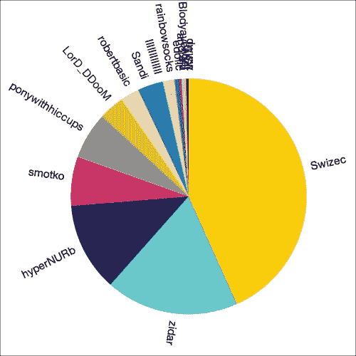

显然，最小的值可以在其他值下进行分组，但你可以自己尝试一下。

### 通过堆叠显示随时间推移的流行度

D3 的官方文档说：

> “堆叠布局接受一个二维数组的数据，并计算一个基线；然后，基线被传播到上面的层，以产生一个堆叠图。”

完全不清楚，但我实在想不出更好的方法。`stack`布局计算一个层结束和另一个层开始的位置。一个例子应该会有帮助。

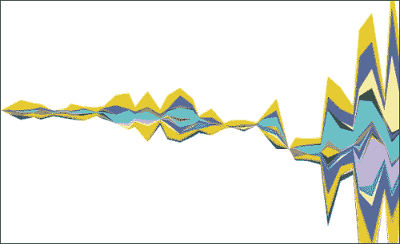

我们将制作一个从 2011 年开始的 karma 层次时间线，每个层的宽度告诉我们用户在特定时间有多少 karma。这个时间线被称为**流图**。

为了标记层级，我们将创建一个`mouseover`行为，该行为会突出显示一个层级并显示带有用户昵称的工具提示。通过调整直到图表看起来很漂亮，我发现我们应该将数据分入 12 天的时段。

让我们开始分桶：

```js
var time = d3.time.format('%Y-%m-%d %H:%M:%S'),
        extent = d3.extent(data.map(function (d) { return time.parse(d.time); })),
        time_bins = d3.time.days(extent[0], extent[1], 12);
```

为了将时间戳解析为日期对象，我们指定了类似`2012-01-25 15:32:15`的字符串格式。然后，我们使用这个格式通过`d3.extent`找到最早和最晚的时间。告诉`d3.time.days()`从开始到结束，以 12 天为步长创建一系列的桶。

我们使用`histogram`布局将我们的数据集转换成更有用的形式：

```js
var per_nick = helpers.bin_per_nick(data, function (d) { return d.to; });

    var time_binned  = per_nick.map(function (nick_layer) {
        return {to: nick_layer[0].to,
                     values: d3.layout.histogram()
                                 .bins(time_bins)
                                 .value(function (d) {
                                            return time.parse(d.time); })(nick_layer)};
    });
```

你已经知道`helpers.bin_per_nick`的作用。

为了将数据分入时间槽，我们遍历了`nick`访问器的每一层，并将其转换为一个具有两个属性的对象。`.to`属性告诉我们哪一层代表谁，`.values`是时间槽的直方图，条目告诉我们用户在某个 12 天期间获得了多少 karma。

是时候使用`stack`布局了：

```js
    var layers = d3.layout.stack()
            .order('inside-out')
            .offset('wiggle')
            .values(function (d) { return d.values; })(time_binned);
```

`d3.layout.stack()`创建了一个新的`stack`布局。我们告诉它如何使用`.order('inside-out')`（你也应该尝试`default`和`reverse`）来排序层，并决定最终图形的样式使用`.offset('wiggle')`。`wiggle`最小化了斜率的变化。其他选项包括`silhouette`、`zero`和`expand`。试试它们。

再次，我们告诉布局如何使用`.values()`访问器找到值。

我们现在`layers`数组中填充了如下对象：

```js
{to: "notepad",
   values: Array[50]}
```

`values`是一个数组的数组。外部数组中的条目是时间桶，看起来像这样：

```js
{dx: 1036800000,
   length: 1,
   x: Object(Thu Oct 13 2011 00:00:00 GMT+0200 (CEST)),
   y: 1,
   y0: 140.16810522517937}
```

这个数组的重要部分如下：

`x`是水平位置，`y`是厚度，`y0`是基线。`d3.layout.stack`总是会返回这些。

为了开始绘制，我们需要一些边距和两个比例尺：

```js
var margins = {
        top: 220,
        right: 50,
        bottom: 0,
        left: 50
    };

    var x = d3.time.scale()
            .domain(extent)
            .range([margins.left, width-margins.right]),
        y = d3.scale.linear()
            .domain([0, d3.max(layers, function (layer) {
                return d3.max(layer.values, function (d) {
                    return d.y0+d.y;
                });
            })])
            .range([height-margins.top, 0]);
```

难办的是找到垂直比例的域。我们通过遍历每一层的每个值，寻找最大`d.y0+d.y`值——基线加上厚度。

我们将为层使用一个`area`路径生成器；

```js
    var offset = 100,
        area = d3.svg.area()
            .x(function(d) { return x(d.x); })
            .y0(function(d) { return y(d.y0)+offset; })
            .y1(function(d) { return y(d.y0 + d.y)+offset; });
```

没有什么太复杂的，基线定义了底部边缘，加上厚度给出了顶部边缘。调整确定两者都应该向下推 100 像素。

首先让我们画一个轴：

```js
    var xAxis = d3.svg.axis()
            .scale(x)
            .tickFormat(d3.time.format('%b %Y'))
            .ticks(d3.time.months, 2)
            .orient('bottom');

    svg.append('g')
        .attr('transform', 'translate(0, '+(height-100)+')')
        .classed('axis', true)
        .call(xAxis);
```

和往常一样——我们定义了一个轴，在一个选择上调用它，并让 d3 做它的事情。我们只通过自定义的`.tickFormat()`函数让它更漂亮，并使用`.ticks()`表示我们想要每两个月有一个新的刻度。

好的，现在对于流图，添加以下代码：

```js
svg.selectAll('path')
        .data(layers)
        .enter()
        .append('path')
        .attr('d', function (d) { return area(d.values); })
        .style('fill', function (d, i) { return helpers.color(i); })
        .call(helpers.tooltip(function (d) { return d.nick; });
```

没有什么特别的。我们使用了`area`生成器来绘制每一层，使用`helpers.color`定义了颜色，并调用了一个`tooltip`函数，我们将在`helpers.js`中稍后定义。

图形看起来像这样：

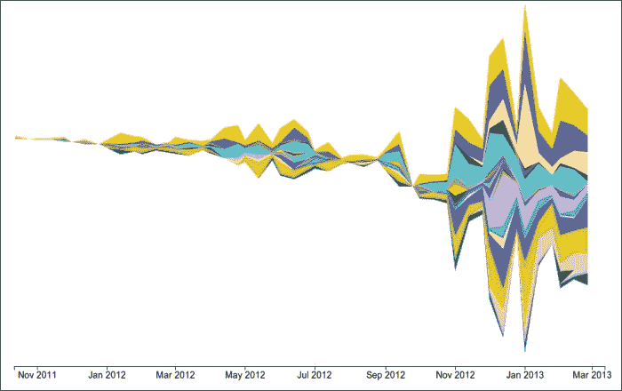

它看起来很漂亮，但毫无用处。让我们将那个`tooltip`函数添加到`helpers.js`中：

```js
tooltip: function (text) {
        return function (selection) {
            selection.on('mouseover.tooltip', mouseover)
                .on('mousemove.tooltip', mousemove)
                .on('mouseout.tooltip', mouseout);
         }
}
```

我们使用`.tooltip`命名空间定义了事件监听器，这样我们就可以在相同的事件上定义多个监听器。

`mouseover`函数将突出显示流并创建工具提示，`mousemove`将移动工具提示，`mouseout`将一切恢复原状。

让我们把三个监听器放在内部函数中：

```js
function mouseover(d) {
    var path = d3.select(this);
     path.classed('highlighted', true);
}
```

这是`mouseover`的简单部分。它选择当前区域并将其类更改为`highlighted`。这将使其变亮并添加一个红色轮廓。

在同一个函数中，添加主要内容：

```js
var mouse = d3.mouse(svg.node());
    var tool = svg.append('g')
            .attr({'id': "nicktool",
                   transform: 'translate('+(mouse[0]+5)+', '+(mouse[1]+10)+')'});

    var textNode = tool.append('text')
                       .text(text(d)).node();

    tool.append('rect')
        .attr({height: textNode.getBBox().height,
               width: textNode.getBBox().width,
               transform: 'translate(0, -16)'});

    tool.select('text')
        .remove();

    tool.append('text')
        .text(d.nick);
```

它更长，带有一点魔法，但一点也不可怕！

首先，我们找到鼠标的位置，然后创建一个组元素，并将其放置在鼠标的下方和右侧。我们在组中添加一个文本元素，并在其节点上调用 SVG 的 `getBBox()` 函数。这给我们文本元素的边界框，并帮助我们确定背景矩形的尺寸。

最后，我们移除文本，因为它被背景覆盖，然后再次添加。我们可能可以通过使用 div 来避免所有这些麻烦，但我想要展示纯 SVG 工具提示。因此，考虑以下代码：

```js
function mousemove () {
    var mouse = d3.mouse(svg.node());
    d3.select('#nicktool')
        .attr('transform', 'translate('+(mouse[0]+15)+', '+(mouse[1]+20)+')');
}
```

以下代码中的 `mousemove` 监听器非常简单。它只是找到 `#nicktool` 元素，并将其移动到跟随光标的位置。

```js
function mouseout () {
    var path = d3.select(this);
    path.classed('highlighted', false);

    d3.select('#nicktool').remove();
}
```

`mouseout` 函数选择当前路径，移除其 `highlighted` 样式，并移除工具提示。

哇！工具提示

非常基础——它们不理解边缘，也不会因为外观而打动人心，但它们能完成任务。让我们给 HTML 添加一些 CSS：

```js
<style>
.axis path, .axis line {
  fill: none;
  stroke: #000;
  shape-rendering: crispEdges;
}

path.highlighted {
  fill-opacity: 0.5;
  stroke: red;
  stroke-width: 1.5;
}
#nicktool {
  font-size: 1.3em;
}

#nicktool rect {
  fill: white;
}
</style>
```

现在我们手中有一个可能很有用的流图。

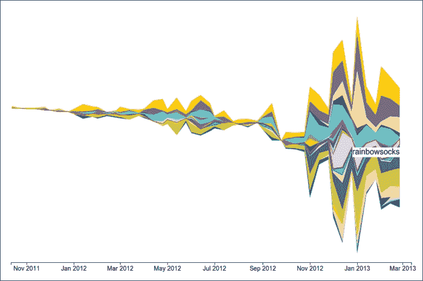

### 用弦线突出显示朋友

我们已经看到了人们有多少 karma 以及他们何时获得它，但数据中还有一个隐藏的宝石——连接。我们可以使用 `chord` 布局来可视化谁是某人的朋友。

我们将绘制一个弦图——用户之间连接的圆形图。弦图常用于遗传学，甚至出现在杂志的封面上([`circos.ca/intro/published_images/`](http://circos.ca/intro/published_images/))。

我们将有一个外环显示用户释放了多少 karma，以及弦线显示 karma 去向何方。

首先，我们需要一个用于弦图的连接矩阵，然后我们将走熟悉的路径，使用路径生成器并添加元素。矩阵代码将以后有用，所以让我们将其放在 `helpers.js` 中：

```js
connection_matrix: function (data) {
        var nick_id = helpers.nick_id(data, function (d) { return d.from; }),
            uniques = nick_id.domain();

        var matrix = d3.range(uniques.length).map(function () {
            return d3.range(uniques.length).map(function () { return 0; });
        });

        data.forEach(function (d) {
            matrix[nick_id(d.from)][nick_id(d.to)] += 1;
        });

        return matrix;
    }
```

我们从熟悉的 `uniques` 列表和 `nick_id` 缩放开始，然后创建一个零矩阵，并通过数据循环增加单元格中的连接计数。行是 *来自谁*，列是 *给谁*——如果第一行的第五个单元格包含 `10`，则第一个用户向第五个用户提供了十个 karma。这被称为 **邻接矩阵**。

在加载监听器中，我们可以这样做：

```js
    var uniques = helpers.uniques(data, function (d) { return d.from; }),
        matrix = helpers.connection_matrix(data);
```

我们将需要 `uniques` 标签和 `innerRadius`、`outerRadius` 变量：

```js
var innerRadius = Math.min(width, height)*0.3,
        outerRadius = innerRadius*1.1;
```

是时候让 `chord` 布局为我们服务了：

```js
var chord = d3.layout.chord()
            .padding(.05)
            .sortGroups(d3.descending)
            .sortSubgroups(d3.descending)
            .sortChords(d3.descending)
            .matrix(matrix);
```

它与其他布局略有不同。`chord` 布局通过 `.matrix()` 方法获取数据，不能作为一个函数调用。

我们从 `d3.layout.chord()` 开始，并在组之间添加一些 `.padding()` 方法以提高可读性。为了进一步提高可读性，一切都被排序了。`.sortGroups` 按边缘排序组，`.sortSubgroups` 在组中排序弦附件，`.sortChords` 按弦绘制顺序排序，以便较小的弦重叠在较大的弦上。

最后，我们使用 `.matrix()` 将数据馈入布局：

```js
var diagram = svg.append('g')
            .attr('transform', 'translate('+width/2+','+height/2+')');
```

我们添加一个居中的分组元素，这样我们的所有坐标都将从现在起相对于中心。

绘制图表分为三个步骤——弧、标签和和弦，如下面的代码所示：

```js
var group = diagram.selectAll('.group')
            .data(chord.groups)
            .enter()
            .append('g'),
    arc = d3.svg.arc()
                     .innerRadius(innerRadius)
                     .outerRadius(outerRadius);

    group.append('path')
        .attr('d', arc)R
        .attr('fill', function (d) {
               return helpers.color(d.index); });
```

这创建了外环。我们使用 `chord.groups` 从布局中获取分组数据，为每个和弦组创建一个新的分组元素，然后添加一个弧。我们使用饼图示例中的 `arc_labels` 来添加标签：

```js
group.call(helpers.arc_labels(
              function (d) { return uniques[d.index]; },
              function () { return outerRadius+10; }));
```

尽管半径是恒定的，但我们必须使用以下代码将其定义为函数，因为我们没有使 `arc_labels` 足够灵活以适应常数。我们真是自作自受！

```js
diagram.append('g')
        .classed('chord', true)
        .selectAll('path')
        .data(chord.chords)
        .enter()
        .append('path')
        .attr('d', d3.svg.chord().radius(innerRadius))
        .attr('fill', function (d, i) { return helpers.color(d.target.index); });
```

我们从 `chord.chords` 获取和弦数据，并使用 `chord path` 生成器来绘制和弦。我们使用 `d.target.index` 来选择颜色，因为这样图表看起来更好，但和弦颜色并不具有信息性。

我们添加一些 CSS 来使和弦更容易追踪：

```js
<style>
.chord path {
   stroke: black;
   stroke-width: 0.2;
   opacity: 0.6;
}
</style>
```

我们的图表看起来完美无瑕：

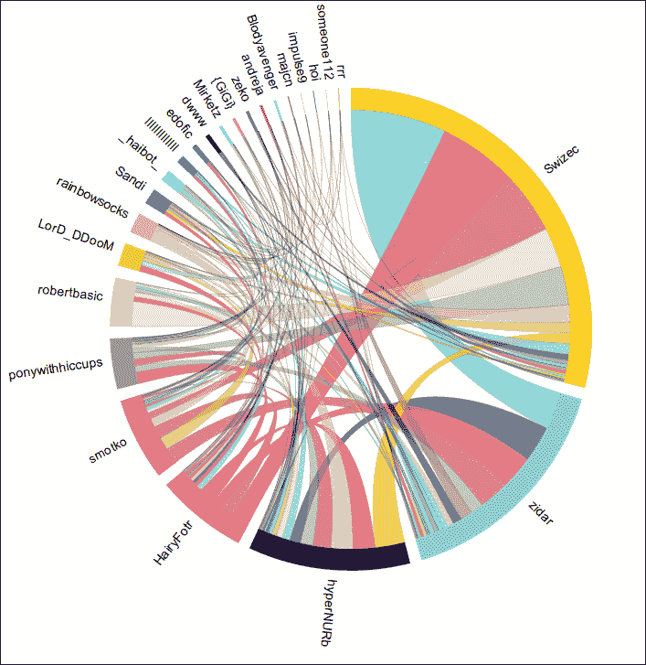

它看起来很漂亮但不够直观。在我们弄清楚之前，我们在 IRC 上争论了好几个小时。

首先，和弦颜色没有任何意义！它们只是让区分和弦变得更简单。此外，这个图表显示了每个人给予的 Karma 量。

从我的弧的大小可以看出，我给出了这个频道所有 Karma 的约 30%。我可能太慷慨了。

接触我的弧和弦的宽度告诉你有多少 Karma 将流向谁。

在每个和弦的另一端，情况完全相同。和弦宽度告诉你该用户给了我多少 Karma。和弦是用户之间的双向连接。

### 使用力布局绘制

`force` 布局是非层次布局中最复杂的。它允许你使用物理模拟来绘制复杂的图表——如果你愿意，可以称之为力导向图。你绘制的所有内容都将内置动画。

我们将绘制用户之间连接的图表。每个用户将是一个节点，其大小将与用户的 Karma 相对应。节点之间的链接将告诉我们谁给了谁 Karma。

为了使事情更清晰，我们将添加工具提示并确保将鼠标悬停在节点上时突出显示连接的节点。

让我们开始吧。

就像和弦示例一样，我们从一个连接矩阵开始。我们不会直接将其提供给 `force` 布局，但我们将使用它来创建它喜欢的数据类型：

```js
var nick_id = helpers.nick_id(data, function (d) { return d.from; }),
        uniques = nick_id.domain(),
        matrix = helpers.connection_matrix(data);
```

`force` 布局期望一个节点和链接的数组。让我们来创建它们：

```js
    var nodes = uniques.map(function (nick) {
        return {nick: nick};
    });
    var links = data.map(function (d) {
        return {source: nick_id(d.from),
                     target: nick_id(d.to),
                     count: matrix[nick_id(d.from)][nick_id(d.to)]};
    });
```

我们定义了我们需要的最基本的东西，布局将计算所有困难的部分。

`nodes` 告诉我们它们代表谁，`links` 使用 `nodes` 数组中的索引将一个 `source` 对象连接到一个 `target` 对象——布局将把它们转换为正确的引用，如下面的代码所示。每个链接还包含一个 `count` 对象，我们将用它来定义其强度。

```js
var force = d3.layout.force()
            .nodes(nodes)
            .links(links)
            .gravity(0.5)
            .size([width, height]);

    force.start();
```

我们使用 `d3.layout.force()` 创建一个新的 `force` 布局；就像 `chord` 布局一样，它也不是一个函数。我们通过 `.nodes()` 和 `.links()` 提供数据。

重力将图表拉向图像的中心；我们使用`.gravity()`定义了其强度。我们告诉`force`布局我们图片的大小使用`.size()`。

直到调用`force.start()`之前，不会发生任何计算，但我们需要结果来定义一些后续的刻度。

还有几个参数可以调整：整体的`.friction()`（节点稳定到的最小的`.linkDistance()`值），`.linkStrength()`用于链接的弹性，以及`.charge()`用于节点之间的吸引力。玩一玩它们。

`nodes`成员现在看起来是这样的：

```js
{index: 0,
  nick: "HairyFotr",
  px: 497.0100389553633,
  py: 633.2734045531992,
  weight: 458,
  x: 499.5873097327753,
  y: 633.395804766377}
```

`weight`告诉我们有多少链接与这个节点相连，`px`和`py`是它的前一个位置，而`x`和`y`是当前的位置。

`links`成员要简单得多：

```js
{count: 2
  source: Object
  target: Object}
```

`source`和`target`对象是直接引用到正确节点的。

现在布局已经完成了第一步计算，我们有数据来定义一些刻度；

```js
    var weight = d3.scale.linear()
            .domain(d3.extent(nodes.map(function (d) { return d.weight; })))
            .range([5, 30]),
        distance = d3.scale.linear()
            .domain(d3.extent(d3.merge(matrix)))
            .range([300, 100]),
        given = d3.scale.linear()
            .range([2, 35]);
```

我们将使用`weight`刻度来调整节点大小，`distance`来调整链接长度，以及`given`来调整节点以实现突出显示效果：

```js
    force.linkDistance(function (d) {
            return distance(d.count);
        });

    force.start();
```

我们使用`.linkDistance()`根据`.count`属性动态定义链接长度。为了使更改生效，我们使用`force.start()`重新启动布局。

最后！是时候在纸上（或者说屏幕上的像素）画一些东西了：

```js
var link = svg.selectAll("line")
            .data(links)
            .enter()
            .append("line")
            .classed('link', true);
```

链接很简单——遍历链接列表并画一条`line`。

为每个节点画一个圆圈，并给它正确的尺寸和颜色。奇怪的`nick_`类将帮助我们完成在两个鼠标事件监听器中进行的突出显示：

```js
var node = svg.selectAll("circle")
            .data(nodes)
            .enter()
            .append("circle")
            .classed('node', true)
            .attr({r: function (d) { return weight(d.weight); },
                   fill: function (d) { return helpers.color(d.index); },
                   class: function (d) { return 'nick_'+nick_id(d.nick); }})
            .on('mouseover', function (d) {
                highlight(d, uniques, given, matrix, nick_id);
            })
            .on('mouseout', function (d) {
                dehighlight(d, weight);
            });
```

我们使用熟悉的`helpers.tooltip`函数添加工具提示，而`force.drag`将自动使节点可拖动：

```js
node.call(helpers.tooltip(function (d) { return d.nick; }));
node.call(force.drag);
```

经过所有这些工作后，我们仍然需要在`force`布局动画的每一帧更新：

```js
force.on("tick", function() {
        link.attr("x1", function(d) { return d.source.x; })
            .attr("y1", function(d) { return d.source.y; })
            .attr("x2", function(d) { return d.target.x; })
            .attr("y2", function(d) { return d.target.y; });

        node.attr("cx", function(d) { return d.x; })
            .attr("cy", function(d) { return d.y; });
    });
```

在`tick`事件上，我们将每个`link`端点和`node`移动到它们的新位置。很简单。

是时候定义我们之前提到的两个突出显示函数了：

```js
function highlight (d, uniques, given, matrix, nick_id) {
    given.domain(d3.extent(matrix[nick_id(d.nick)]));

    uniques.map(function (nick) {
        var count = matrix[nick_id(d.nick)][nick_id(nick)];

        if (nick != d.nick) {
            d3.selectAll('circle.nick_'+nick_id(nick))
                .classed('unconnected', true)
                .transition()
                .attr('r', given(count));
        }
    });
}
```

`highlight`函数将根据我们从鼠标接触的节点获得的 karma 增长所有连接的节点。它首先设置`given`对象的域，然后遍历`uniques`列表，使用`given`刻度调整相应节点的大小，并使用`nick_id`找到节点。

当前节点保持不变。

`dehighlight`将移除我们造成的所有麻烦：

```js
function mouseout (d, weight) {
    d3.selectAll('.node')
        .transition()
        .attr('r', function (d) { return weight(d.weight); });
}
```

给 HTML 添加一些样式：

```js
<style>
line {
  stroke: lightgrey;
  stroke-width: 0.3;
}

#nicktool {
  font-size: 1.3em;
}
</style>
```

哇！我们得到了用户连接的力导向图。

运行这个示例看起来很愚蠢，因为它在稳定下来之前旋转了很多。但一旦稳定，图表看起来就像这样：

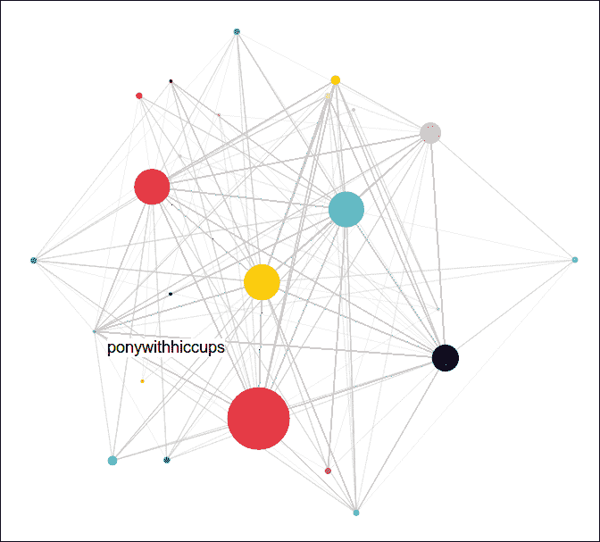

如果所有节点都不相连，图表会更有趣，但悬停在较小的节点上会揭示有趣的连接。

我们本应该添加一些代码来打印出高亮节点旁边的名称，但示例已经足够长。让我们说这留作读者的练习。

我们现在将转向层次布局！

### 层次布局

所有分层布局都是基于一个抽象的分层布局，该布局是为了表示分层数据——数据中的数据中的数据中的数据中的数据……你明白这个意思。

`partition`、`tree`、`cluster`、`pack`和`treemap`布局的所有常见代码都定义在`d3.layout.hierarchy()`中，并且它们都遵循类似的设计模式。布局非常相似，官方文档明显地复制粘贴了大部分的解释。让我们先看看共同的东西，然后我们将专注于差异。

首先，我们需要一些分层数据。我花了一个下午的时间尝试将我们的 karma 数据集分层。结果是，这个方案与三种布局配合得很好，但看起来对另外两种布局有些牵强。对此表示歉意。

实际上很简单，我们杀死了蝙蝠侠。

我们将有一个名为`karma`的根节点，它将包含所有曾经给予 karma 的 24 个用户。对于`tree`和`cluster`布局，每个都将包含他们给予 karma 的每个人的节点。对于`partition`、`pack`和`treemap`布局，子节点将告诉我们谁为父节点的 karma 做出了贡献。

最终的数据结构将看起来像这样：

```js
{
    "nick": "karma",
    "children": [
        {
            "nick": "HairyFotr",
            "count": 312,
            "children": [
                {
                    "nick": "notepad",
                    "count": 2,
                    "children": []
                },
                {
                    "nick": "LorD_DDooM",
                    "count": 6,
                    "children": []
                },
```

虽然它可能永远继续下去，但在我们的情况下这并不合理。

默认访问器期望有一个`.children`属性，但我们可以轻松地做一些疯狂的事情，比如在自定义访问器中动态生成一个分形结构。

如同往常，有一个`.value()`访问器可以帮助布局在节点中找到数据。我们将使用它来设置`.count`属性——以检查用户有多少 karma。

要运行分层布局，我们调用`.nodes()`并传入我们的数据集。这立即返回一个列表，你以后无法获取到这些节点。要获取连接列表，我们调用`.links()`并传入我们的节点列表。返回列表中的节点将具有布局计算的一些额外属性。大多数布局会告诉我们如何使用`.x`和`.y`放置某个东西，然后使用`.dx`和`.dy`来告诉我们布局应该有多大。

所有分层布局都支持使用`.sort()`进行排序，它接受一个排序函数，如`d3.ascending`或`d3.descending`。

理论已经足够多了，让我们向`helpers.js`添加一个数据处理函数：

```js
make_tree: function (data, filter1, filter2, nick1, nick2) {
        var tree = {nick: 'karma',
                    children: []};
        var uniques = helpers.uniques(data, function (d) { return d.from; });

        tree.children = uniques.map(
            function (nick) {
                var my_karma = data.filter(function (d) { return filter1(d, nick); }).length,
                    given_to = helpers.bin_per_nick(
                        data.filter(function (d) { return filter2(d, nick); }),
                        nick1
                    );

                return {nick: nick,
                        count: my_karma,
                        children: given_to.map(function (d) {
                            return {nick: nick2(d),
                                    count: d.length,
                                    children: []};
                        })};
            });

        return tree;
    },
```

哇，这里发生了很多事情。我们避免了递归，因为我们知道我们的数据永远不会嵌套超过两层。

`tree`最初持有一个空的根节点。我们使用`helpers.uniques`来获取昵称列表，然后遍历数组，通过计算每个人的 karma 值并使用`helpers.bin_per_nick`来获取子节点数组，从而定义根节点的子节点。

代码之所以会摇摆不定，是因为我们使用了`filter1`、`filter2`、`nick1`和`nick2`作为数据访问器，但使这个函数变得灵活使其在所有分层示例中都很有用。

### 绘制一棵树

`tree` 布局使用整洁的 **Reingold-Tilford** 算法以树的形式显示数据。我们将用它来显示我们的数据集，以一个大圆形树的形式，每个节点通过一条曲线与其父节点相连。

我们从固定颜色开始，将数据转换为树，并定义绘制曲线的方法：

```js
helpers.fixate_colors(data);

var tree = helpers.make_tree(data,
                   function (d, nick) { return d.to == nick; },
                   function (d, nick) { return d.from == nick; },
                   function (d) { return d.to; },
                   function (d) { return d[0].to; });

var diagonal = d3.svg.diagonal.radial()
     .projection(function(d) { return [d.y, d.x / 180 * Math.PI]; });
```

你之前已经知道 `fixate_colors`，我们定义 `make_tree` 不久前，我们已经在 第二章 中讨论了 `diagonal` 生成器，*DOM、SVG 和 CSS 入门*。

```js
var layout = d3.layout.tree()
            .size([360, width/2 - 120]);

    var nodes = layout.nodes(tree),
        links = layout.links(nodes);
```

我们通过调用 `d3.layout.tree()` 创建一个新的树布局。使用 `.size()` 定义其大小，并通过 `.nodes()` 执行它。`size()` 告诉布局它有多少空间——在这种情况下，我们使用 `x` 作为角度（`360` 度）和 `y` 作为半径。尽管布局本身并不真正关心这一点。

为了避免以后担心居中对齐的问题，我们放置了一个分组元素作为中心：

```js
var chart = svg.append('g')
            .attr('transform', 'translate('+width/2+','+height/2+')');
```

首先，我们将绘制链接，然后是节点及其标签：

```js
    var link = chart.selectAll(".link")
            .data(links)
            .enter()
            .append("path")
            .attr("class", "link")
            .attr("d", diagonal);
```

你现在应该熟悉这个了；通过数据并使用 `diagonal` 生成器添加新的路径：

```js
var node = chart.selectAll(".node")
            .data(nodes)
            .enter().append("g")
            .attr("class", "node")
            .attr("transform", function(d) { return "rotate(" + (d.x - 90) + ")translate(" + d.y + ")"; });
```

对于数据中的每个节点，我们创建一个新的分组元素，并使用 `rotate` 对角度和 `translate` 对半径位置进行移动。

现在只需要添加一个圆圈和一个标签：

```js
     node.append("circle")
        .attr("r", 4.5)
        .attr('fill', function (d) { return helpers.color(d.nick); });

    node.append("text")
        .attr("dy", ".31em")
        .attr("text-anchor", function(d) { return d.x < 180 ? "start" : "end"; })
        .attr("transform", function(d) { return d.x < 180 ? "translate(8)" : "rotate(180)translate(-8)"; })
        .text(function(d) { return d.nick; })
        .style('font-size', function (d) { return d.depth > 1 ? '0.8em' : '1.1em'; });
```

每个节点都使用用户的原生颜色着色，文本的转换方式与早期的饼图和弦图示例类似。最后，我们将叶节点的文本缩小以避免重叠。

然后，我们将添加一些样式：

```js
<style>
.link {
  fill: none;
  stroke: lightgrey;
}
</style>
```

我们的树看起来像这样：

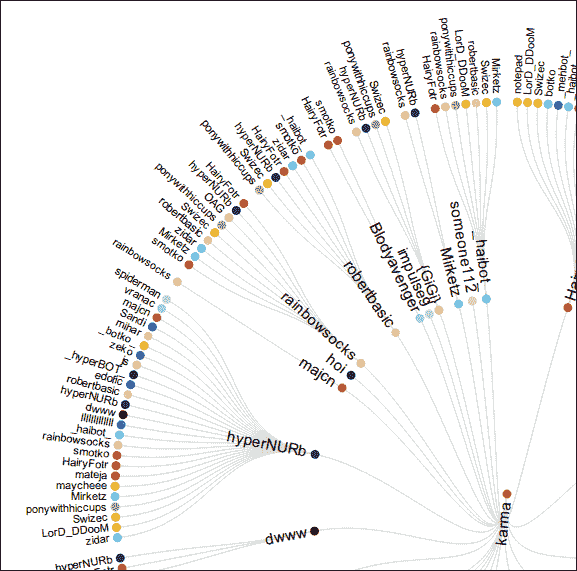

它相当大，所以你应该在浏览器中尝试一下。只需记住，内环是用户对外环给予的 karma。

### 显示集群

`cluster` 布局与 `tree` 布局相同，只是叶节点排列整齐。

你看到那个 **hoi** 用户在树示例的内环中闲逛吗？在集群布局中，他们最终出现在外部，与其他叶节点一起。

代码上，这个例子与上一个相同，所以我们不会再次讲解。实际上，唯一的区别是我们不需要在特定角度翻转标签。你可以在 GitHub 示例存储库中查看代码 [`github.com/Swizec/d3.js-book-examples/blob/master/ch5/cluster.js`](https://github.com/Swizec/d3.js-book-examples/blob/master/ch5/cluster.js)。

我们最终得到一个非常高的图表，看起来像这样：

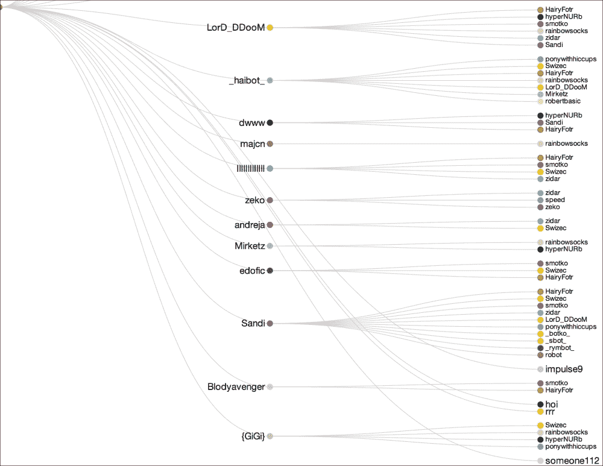

### 分割饼图

现在我们正在取得进展！接下来的三个布局完美地适合我们的数据——我们正在从三个角度来看我们的核心用户的 karma 结构。

`partition` 布局创建邻接图，其中你不需要在节点之间画线，而是将它们并排放置，使其看起来像子节点分割父节点。

我们将绘制一个双层甜甜圈图。用户将在第一层，顶层将显示 karma 的来源。

我们首先对数据集进行整理并固定颜色：

```js
    var tree = helpers.make_tree(data,
                   function (d, nick) { return d.to == nick; },
                   function (d, nick) { return d.to == nick; },
                   function (d) { return d.from; },
                   function (d) { return d[0].from; });
    helpers.fixate_colors(data);
```

然后使用`partition`布局：

```js
    var partition = d3.layout.partition()
            .value(function (d) { return d.count; })
            .sort(function (a, b) {
                return d3.descending(a.count, b.count);
            })
            .size([2*Math.PI, 300]);

    var nodes = partition.nodes(tree);
```

我们使用`.value()`告诉布局我们关心`.count`值，如果我们`.sort()`输出，我们会得到更好的图像。同样，对于`tree`布局，`x`将代表角度——这次是弧度，而`y`将是半径。

我们还需要一个`arc`生成器，如下面的代码所示：

```js
    var arc = d3.svg.arc()
            .innerRadius(function (d) { return d.y; })
            .outerRadius(function (d) {
                                 return d.depth ? d.y+d.dy/d.depth : 0; });
```

生成器将使用每个节点的`.y`属性作为内半径，并添加`.dy`作为外半径。调整后显示外层应该更薄，因此我们将其除以树深度。

注意，没有`.startAngle`和`.endAngle`的访问器，它们存储为`.x`和`.dx`。直接固定数据会更简单：

```js
    nodes = nodes.map(function (d) {
        d.startAngle = d.x;
        d.endAngle = d.x+d.dx;
        return d;
    });

    nodes = nodes.filter(function (d) { return d.depth; });
```

这就像映射数据并定义角度属性，然后过滤数据以确保根节点不被绘制。

我们使用熟悉的分组技巧来居中我们的图表。

```js
    var chart = svg.append('g')
            .attr('transform', 'translate('+width/2+','+height/2+')');
```

准备工作已完成。现在是绘图时间：

```js
    var node = chart.selectAll('g')
            .data(nodes)
            .enter()
            .append('g');

    node.append('path')
        .attr({d: arc,
               fill: function (d) { return helpers.color(d.nick); }});
```

为每个节点绘制一个弧，颜色选择如常：

```js
    node.filter(function (d) { return d.depth > 1 && d.count > 10; })
        .call(helpers.arc_labels(function (d) { return d.nick; },
                                 arc.outerRadius()));

    node.call(helpers.tooltip(function (d) { return d.nick; }));
```

我们使用之前准备的函数添加标签和工具提示。我们避免为非常薄的切片添加标签，以免它们重叠并造成混乱。添加一些 CSS：

```js
<style>
path {
  stroke: white;
  stroke-width: 2;
}

#nicktool {
  font-size: 1.3em;
}

#nicktool rect {
  fill: white;
}
</style>
```

邻接图看起来是这样的：

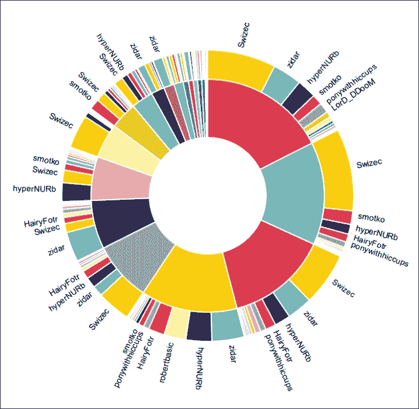

### 将圆圈打包成圆圈

`pack`布局使用打包来直观地表示层次结构。它将子节点塞入父节点中，试图节省空间并为每个节点指定大小，使其成为其子节点的累积大小。

从概念上讲，它与`treemap`布局非常相似，所以我将跳过所有代码，只展示图片。你仍然可以在 GitHub 上看到代码[`github.com/Swizec/d3.js-book-examples/blob/master/ch5/pack.js`](https://github.com/Swizec/d3.js-book-examples/blob/master/ch5/pack.js)。

### 备注

代码相当熟悉——生成树，固定颜色，创建布局，调整一些参数，获取计算后的节点，绘制节点，并添加工具提示。很简单。

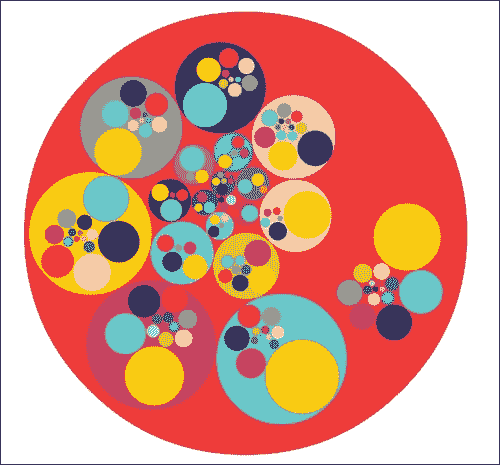

它看起来非常漂亮，但不太具有信息量。添加标签帮助不大，因为大多数节点太小。

### 使用 treemap 细分

`treemap`布局通过水平和垂直切片来细分节点，本质上就像`pack`布局一样将子节点打包到父节点中，但使用矩形。因此，每一层的节点大小可以直接比较，这使得它成为分析细分累积效应的最佳布局之一。

我们将在这个例子中玩得开心。工具提示将命名父节点——父节点几乎完全被子节点遮挡——将鼠标悬停在节点上会使无关的节点变亮，使图表更不容易混淆（至少在理论上）。

这也是一个很酷的效果，也是结束这一章布局的绝佳方式。

我们从无聊的事情开始；准备数据和固定颜色：

```js
    var tree = helpers.make_tree(data,
                       function (d, nick) { return d.to == nick; },
                       function (d, nick) { return d.to == nick; },
                       function (d) { return d.from; },
                       function (d) { return d[0].from; });
    helpers.fixate_colors(data);
```

创建`treemap`布局遵循熟悉的模式：

```js
var treemap = d3.layout.treemap()
            .size([width, height])
            .padding(3)
            .value(function (d) { return d.count; })
            .sort(d3.ascending);

var nodes = treemap.nodes(tree)
            .filter(function (d) { return d.depth; });
```

我们使用 `.padding()` 添加了一些填充，给节点留出呼吸的空间。

每个节点都将成为一个包含矩形的组元素。叶子节点也将包含标签：

```js
var node = svg.selectAll('g')
            .data(nodes)
            .enter()
            .append('g')
            .classed('node', true)
            .attr('transform', function (d) { return 'translate(    node.a'+d.x+','+d.y+')'; });

ppend('rect')
        .attr({width: function (d) { return d.dx; },
               height: function (d) { return d.dy; },
               fill: function (d) { return helpers.color(d.nick); }});
```

现在是第一个有趣的部分。让我们将标签尽可能放入尽可能多的节点中：

```js
var leaves = node.filter(function (d) { return d.depth > 1; });

    leaves.append('text')
        .text(function (d) { return d.nick; })
        .attr('text-anchor', 'middle')
        .attr('transform', function (d) {
            var box = this.getBBox(),
                transform = 'translate('+(d.dx/2)+','+(d.dy/2+box.height/2)+')';

            if (d.dx < box.width && d.dx > box.height && d.dy > box.width) {
                transform += 'rotate(-90)';
            }else if (d.dx < box.width || d.dy < box.height) {
                d3.select(this).remove();
            }

            return transform;
        });
```

最后！这是一些有趣的代码！

我们找到了所有叶子节点，并开始添加文本。为了将标签放入节点，我们使用 `this.getBBox()` 获取它们的尺寸，然后将它们移动到节点的中间，并检查是否适合。

如果标签太宽但垂直方向可以容纳，我们会将其旋转；否则，在再次确认它无法容纳后，我们会移除标签。确保高度是很重要的，因为一些节点非常细小。

我们使用 `helpers.tooltip` 添加工具提示：

```js
    leaves.call(helpers.tooltip(function (d) { return d.parent.nick; }));
```

另一个有趣的部分——部分隐藏来自不同父节点的节点：

```js
    leaves.on('mouseover', function (d) {
        var belongs_to = d.parent.nick;

        svg.selectAll('.node')
            .transition()
            .style('opacity', function (d) {
                if (d.depth > 1 && d.parent.nick != belongs_to) {
                    return 0.3;
                }
                if (d.depth == 1 && d.nick != belongs_to) {
                    return 0.3;
                }
                return 1;
            });
    })
        .on('mouseout', function () {
            d3.selectAll('.node')
                .transition()
                .style('opacity', 1);
        });
```

我们使用了两个鼠标事件监听器：一个创建效果，另一个移除效果。`mouseover` 监听器遍历所有节点，使具有不同父节点或不是父节点的节点变亮（`d.parent.nick` 和 `d.nick` 不同）。`mouseout` 监听器移除所有更改。

然后，添加一些 CSS：

```js
<style>
#nicktool {
  font-size: 1.3em;
}

#nicktool rect {
  fill: white;
}

.node text {
  font-size: 0.9em;
}

.name text {
  font-size: 1.5em;
}

.name rect {
  fill: white;
}
</style>
```

最终结果看起来像一幅抽象画：

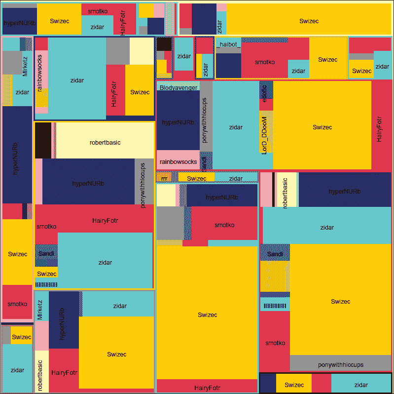

使用鼠标点击区域可以恢复一些理智，如下面的截图所示：

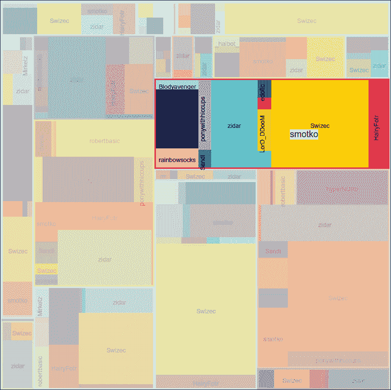

尽管如此，并没有我们期望的那么理智。

# 摘要

尽管 d3 布局具有近乎神话般的力量，但它们实际上只是将你的数据转换成坐标集合的辅助工具。

在这些示例中全力以赴之后，我们几乎用到了迄今为止学到的所有技巧。我们甚至写了这么多代码，以至于不得不创建一个单独的库！通过一些泛化，其中一些函数可以成为自己的布局。对于各种类型的图表，有一个完整的社区开发的布局世界。GitHub 上的 d3-plugins 仓库（[`github.com/d3/d3-plugins`](https://github.com/d3/d3-plugins)）是一个开始探索的好方法。

你现在已经了解了所有默认布局的目的，我希望你已经开始考虑将它们用于原始开发者最疯狂的梦想之外的目的。
