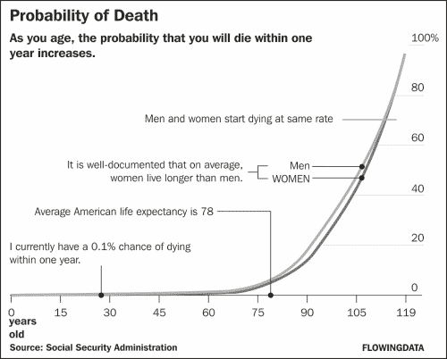
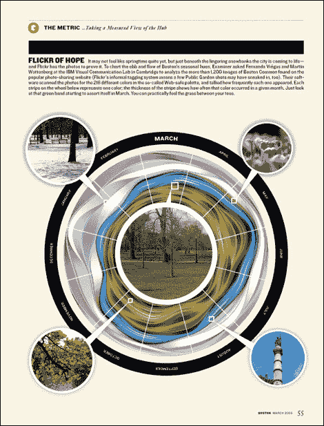
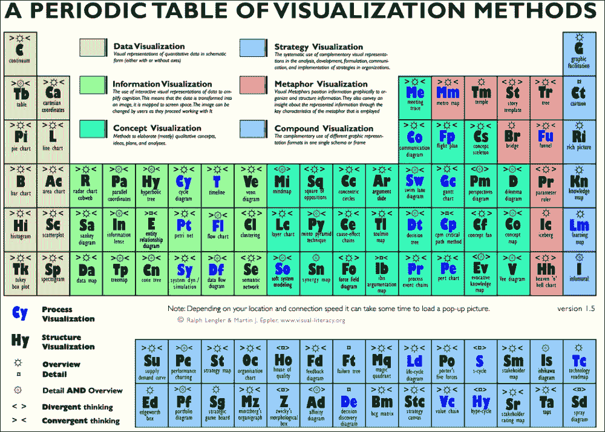
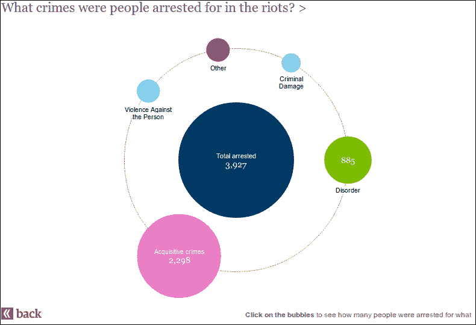
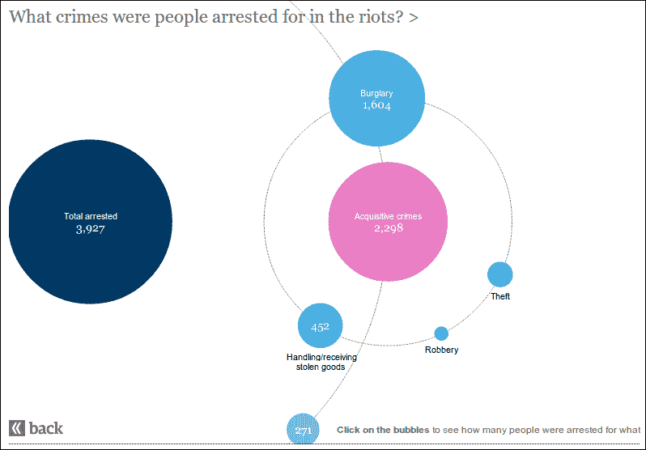
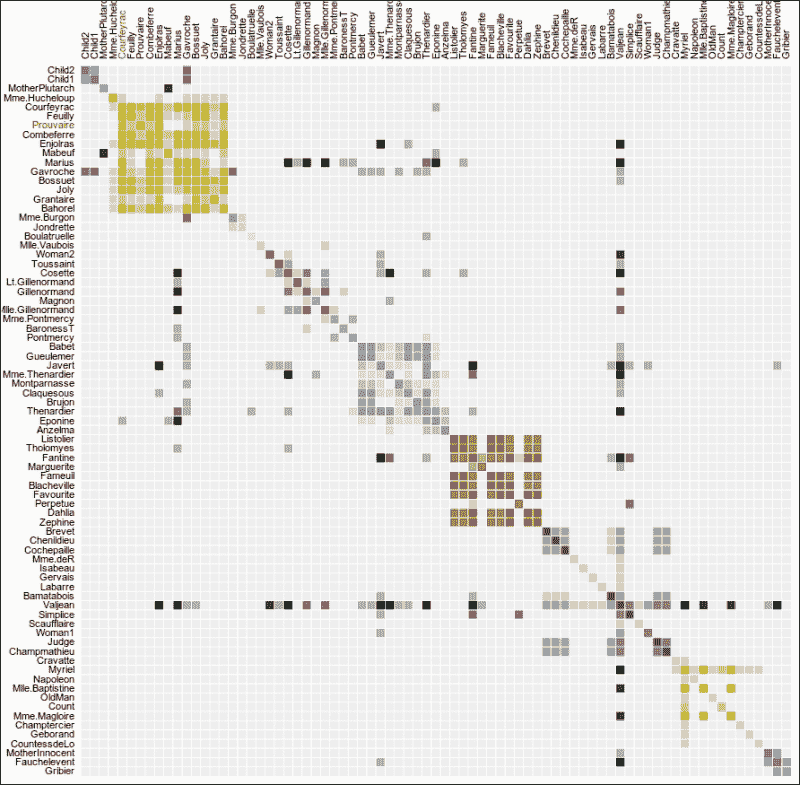
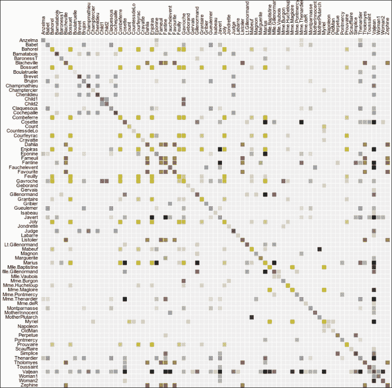
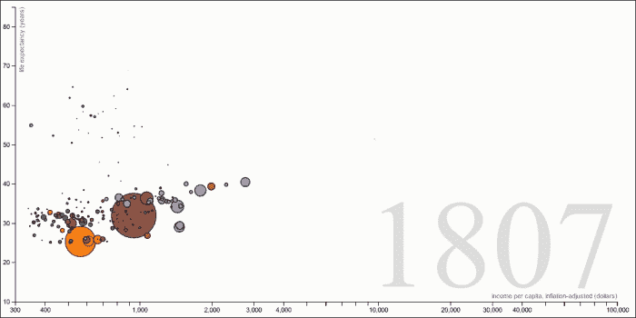
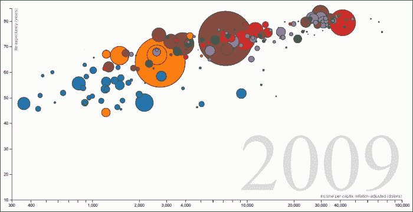

# 第六章：设计良好的可视化

一个好的可视化不仅仅是关于用 JavaScript 玩乐。可视化应该用数据讲故事，并且做得很好。你希望用你的美学吸引和吸引观众，用你的故事揭示世界。

完全诚实地说，这一章似乎是最难写的一章。但如果我们不讨论是什么让可视化变得美丽和有效，那么关于制作美丽视觉化的书会是什么样子呢？

我是一个程序员，不是一个设计师，但我已经看过很多可视化，好的和不好的。让我向你展示一些我发现的令人惊叹的例子。

# 什么是可视化？

可视化只是基于数据的一张图片。每次你将数据转化为图片时，你就创造了一个可视化。

如 19 世纪经典书籍《经济与工业幻想：关于保护案例的讨论》的作者 Farquhar, Arthur B 所说：

> “图形方法在展示统计数据方面相对于表格方法具有相当的优势。一大堆数字对眼睛和大众思维来说都是一种折磨，就像从黄瓜中提取阳光一样，人们无法从中得出任何有用的教训。”

但是，旧图表和 d3.js 示例画廊中的视觉杰作之间存在着天壤之别。这种新媒体让我们能够用数据做更多的事情，因此可视化技术的普及增长几乎不足为奇。

与一个好的现代可视化相比，图表仅仅展示了原始数据。它没有告诉你任何东西，但可视化却可以。

你甚至不需要全力以赴。有时候，添加标签就足以将一个无聊的图表变成吸引人的可视化——这是《纽约时报》经常使用的一个技巧。

一个只有两条指数上升线的简单图表：无聊。添加一些标签，它就变成了引人入胜的故事。在图表的左上角放置你所看到的解释，突出图表上的故事点，甚至图例也包含关于故事的一个有趣点。

《纽约时报》的图形编辑 Amanda Cox 称这为注释层。查查她；她关于视觉化的演讲很棒。

与我们迄今为止的视觉化相比。它们很有趣，有很好的震撼效果，但并不擅长讲述故事。它们作为例子和制作不错的艺术作品很棒，但我们经常没有时间正确地标注它们。

更好的是，看看 d3.js 关于堆叠布局的文档中引用的这种可视化。

美丽！你能猜到这显示的是 Flickr 照片中颜色的季节性涨落吗？可能不会。

在设计师的帮助下，作者们在《波士顿》杂志的最终印刷版中改进了这个概念，通过标注圆形时间轴和添加典型照片到图像的关键点。

优秀的可视化似乎在静态图表和数据艺术之间的快乐中找到了平衡。一个好的可视化应该既美丽又富有信息。

# 一些很好的例子

许多艰苦的学术研究都投入到了可视化设计中。当你寻找特定内容时——比如如何最好地在散点图和直方图之间过渡([`vis.berkeley.edu/papers/animated_transitions/`](http://vis.berkeley.edu/papers/animated_transitions/))——阅读一些材料是个好主意，但要掌握这样一个广泛的领域需要时间。

要全面了解可视化方法，请查看 KPI 图书馆开发的周期表。您可以在[`www.visual-literacy.org/periodic_table/periodic_table.html`](http://www.visual-literacy.org/periodic_table/periodic_table.html)找到它。

周期表使用六个类别——**数据**、**信息**、**概念**、**策略**、**隐喻**和**复合**可视化。将鼠标悬停在单元格上会显示一个示例类别。

表本身是一个做得很好的可视化。它可能不美丽或富有艺术性，但完美地模仿了常见的周期表。它立即吸引了我们的注意力，并因为熟悉而留在我们的脑海中，并且很好地展示了数据。另一方面，内容太多，没有重点。与其说是一个故事，不如说是一个“这里有一切；处理它”。

更重要的是，这个周期表是一个位图图像——这是你在网上绝对不应该做的事情，原因从搜索引擎到可用性都有。

## 暴乱逮捕

《卫报》在 2012 年伦敦暴乱期间对暴乱逮捕的报道是一个简单而强大的可视化示例。

直方图是比较类别大小的明显选择，但你可能会遇到人们看到并不存在的趋势的问题。人们也被迫阅读标签，因为所有条形看起来都一样。

当你想比较子类别或只是显示所有类别的总和时，直方图会进一步分解。

《卫报》使用颜色来区分类别，并使用圆面积来显示这些类别的规模。这之所以有效，是因为经过多年的图表和图表，每个人都知道颜色是类别。甚至在看到数字之前，读者就能认出较大的圆圈是较大的类别。但请注意，使用面积来表示值，而不是直径——直径减半的圆面积只有四分之一那么大！

唯一一眼就能看出的信息是，较小的圆圈是中心大圆的子类别。点击任何一个较小的圆圈就可以快速回答这个问题。

您可以在[`www.guardian.co.uk/uk/datablog/interactive/2011/dec/06/england-riots-crimes-arrested`](http://www.guardian.co.uk/uk/datablog/interactive/2011/dec/06/england-riots-crimes-arrested)找到这个可视化。

## 《悲惨世界》共现

另一种颜色的大妙用是显示强度。这种方法最常用于矩阵图，其中较暗表示更多，较亮表示更少。这是一个非常自然的效果——空单元格是白色的，你在一个单元格中放入的点越多，它就越暗。用笔试试吧。

*迈克·博斯特克*在《悲惨世界》图中使用了这种效果，展示了出现在同一章节中的角色。

与图表和树状图不同，矩阵图不会因为许多连接而变得过于繁忙。记住我们的弦图，那些难以阅读的细线丛林？这里不会发生这种情况。

然而，矩阵图对边缘排序很敏感。当边缘使用聚类算法——社区发现——进行排序时，我们得到一幅美丽的画面。

但矩阵图在按字母顺序排序的边缘下看起来非常不同。

它比集群版本要混乱得多，描绘的画面也更糟糕。

矩阵图面临的另一个问题是，在两个节点之间追踪路径几乎是不可能的。明智地选择你的可视化。

您可以在[`bost.ocks.org/mike/miserables/`](http://bost.ocks.org/mike/miserables/)找到《悲惨世界》共现矩阵。

## 《国家财富与健康》

可视化面临的另一个有趣问题是将太多维度压缩到二维介质中。你将如何绘制一个国家人均收入与预期寿命之间的关系？一个简单的折线图，对吧？但是如何融入时间，增加更多国家，人口，以及……为了使事情更有趣，让我们加上地区。这就是五个维度！

Gapminder 的《国家财富与健康》是一个将五个维度压缩到两个维度而不显得拥挤的美丽例子。每个国家在图上都是一个气泡，其中垂直轴表示预期寿命，水平轴是人均收入。时间以动画形式显示，地区用颜色表示，人口用圆面积表示。

也许我对数据过于兴奋，但看着那些点随着时间流逝而舞动并变大真的很有趣。您可以探索整个国家的历史！

您可以看到一个国家财富与其预期寿命之间的直接相关性。此外，随着时间的推移，每个人的预期寿命都在上升，所有国家都在变大。

我尝试的另一个有趣的游戏是确定历史上的重大事件。例如，日本在 1945 年左右财富和健康急剧下降，但很快又恢复了。

你可以在 [`bost.ocks.org/mike/nations/`](http://bost.ocks.org/mike/nations/) 找到 Mike Bostock 对该可视化的 d3.js 再现。

## 更多精彩内容

我们可以一起分析更多例子，但那样有什么乐趣呢？在互联网上找到你自己的灵感。d3.js 的例子画廊有很多宝藏，例如使用圆形直方图展示机场风速历史的可视化 ([`windhistory.com/map.html#9.00/33.5876/-118.1257`](http://windhistory.com/map.html#9.00/33.5876/-118.1257)) 或通过在分形模式中分割圆圈绘制的考拉：[`www.koalastothemax.com/`](http://www.koalastothemax.com/)。

*《纽约时报》* 列出的 *2012 年：图形年鉴* 是另一个很好的资源。关于奥运会的可视化是我最喜欢的。它们可以在 [`www.nytimes.com/interactive/2012/12/30/multimedia/2012-the-year-in-graphics.html`](http://www.nytimes.com/interactive/2012/12/30/multimedia/2012-the-year-in-graphics.html) 找到。

*《卫报》* 将他们的可视化列表与数据集一起发布。你可以通过 [`www.guardian.co.uk/data`](http://www.guardian.co.uk/data) 访问。

# 摘要

我们尝试涉足设计领域，观察了一些优秀的例子，并试图了解它们是如何工作的。作为一个非设计师，我就是这样接近任何我想创建的新可视化——查看大量例子，并找出哪些适合我的数据集。

然后就是实验，实验，再实验，直到找到有效的方法。

要深入了解设计可视化，我建议阅读专门介绍这一主题的书籍。*《数据可视化：成功的设计流程》*，*Andy Kirk* 和他的博客 *Visualizing Data* 是一个很好的起点。我还没有读过这本书，但博客在这章中帮助了我很多。

另一个很好的资源是 *《可视化这》*，*Nathan Yau*。前几章是关于设计的；其余部分是关于使用 R——一种统计分析语言。阅读 *《网络交互式数据可视化》*，*Scott Murray* 也会很有帮助。
