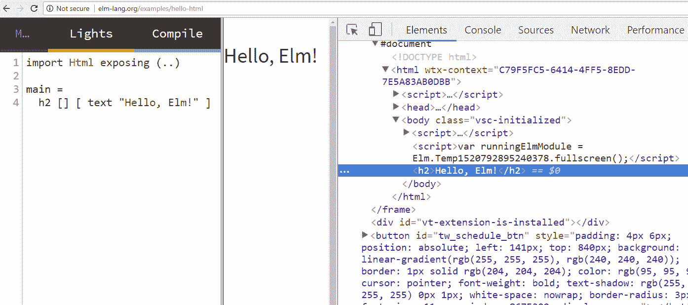

# 为什么现在是学习 Elm 的好时机？

欢迎来到第一章。本章是对 Elm 语言的温和介绍。我们本章的目标是理解以下内容：

+   什么是 Elm？

+   Elm 在竞争激烈的前端开发领域中有什么独特之处

+   Elm 与 JavaScript 如何比较？

+   如何在 Ellie-app、Cloud9 和 Atom 编辑器的帮助下快速入门

完成本章后，你将能够：

+   在基本层面上比较 Elm 代码与 JavaScript 代码

+   以几种不同的方式设置和使用 Elm

# 什么是 Elm？

Elm 是一种面向前端网页开发的函数式编程语言。用 Elm 的发明者埃文·查普利斯基的话说：

“我想做前端工作，但我想……让前端编程感觉真的、真的愉快。”

埃文是一位函数式程序员，他希望在实践中应用一些函数式编程的学术概念，目标是使前端网页开发的整体体验更加愉快。

当前前端开发方式的一个重要问题是开发过程中意外引入和累积小错误的问题。在开发前端 JavaScript 时，我们的代码中会出现错误，而且非常常见的是，这些错误会被忽视。

在稍后的某个时间点，这些错误将导致我们的代码出错。这会导致我们在修复我们开发者无意中通过一系列晦涩的错误引入到代码中的问题上浪费很多时间。

Elm 使我们几乎无法将错误引入到我们的代码中。通过结合非晦涩的编译时错误和有用的类型系统，将错误引入我们的代码几乎变得不可能。

如果我们只需要指出 Elm 的一个令人惊叹的特点，那就是它缺乏运行时错误。想象一下在 JavaScript 中工作却从未看到运行时错误，你可能会开始欣赏使用 Elm 可以实现的时间节省。

在使用 Elm 了一段时间之后，你开始感觉 Elm 似乎不断缩小了错误出现在你代码中的机会窗口，从它的结构到你与之交互的方式。你可以感觉到，有意识的努力被放在了使错误发生的可能性降低上。

例如，Elm 是围绕函数式编程范式构建的，它使用纯函数。纯函数是没有副作用的功能。换句话说，纯函数没有状态。它们接受参数，并返回一个值。这就是它们所做的一切！

他们不会出去发起 HTTP 请求。他们不会修改变量。他们不会以任何方式改变世界的*状态*。他们只是返回一个值。这带给我们一个有趣的效果——只要我们在 Elm 中向一个函数提供相同的值，它就会返回相同的结果。

Elm 中纯函数的另一个美妙好处是，你可以确信你在代码中做出的所有更改都是局部的。更改应用中的代码不会导致应用中的其他代码停止工作。

公平地说，以这种限制性的函数式风格编写纯 JavaScript 应用程序是可能的。然而，语言本身并没有内置的错误处理机制，如果我们失去了注意力并开始编写非纯函数，它将抛出错误。此外，当与第三方库一起工作时，你无法确定它们是否遵循了函数式风格的纯度。与 Elm 相比，Elm 只强制执行纯函数。

对于纯函数的讨论有一个需要注意的地方。你可能知道，一个完全无状态的程序是没有意义的。Elm 的独创性在于它处理应用程序更新的一种非常严格的方式。从这个角度来看，Elm 不仅通过强制我们使用纯函数来强制执行函数式编程范式，而且还限制了处理外部世界的方法。

Elm 自然具有的数据不可变性带来另一个巨大的好处：调试。由于你可以确信你的代码中的任何随机部分都无法影响其他部分，因此根本不可能出现不知道代码的哪个部分破坏了应用程序的问题；也就是说，代码的哪个部分导致了错误。在 JavaScript 中，这是一个常见的问题，在 Elm 中实际上是不存在的。

Elm 的另一个特点是它以允许我们应对应用中发生的事件的同时，仍然保持不可变性。Elm 也是一个很好的开始学习函数式编程的方法，而不必理解很多高级概念（这在尝试学习其他更困难的函数式编程语言时是必须的）。

# 为什么学习 Elm 值得？

在本节中，我们将讨论一些原因，说明为什么 Elm 是一门如此令人兴奋的语言去学习。

这些原因如下：

+   风驰电掣的虚拟 DOM

+   友好的编译时错误

+   零运行时异常

+   约束作为保证

+   管道语法

+   容易重构

+   提高生产力

+   有用的类型系统

+   时间旅行调试器

现在我们已经概述了 Elm 带来的令人兴奋的概念，让我们更深入地检查每一个。

# 风驰电掣的虚拟 DOM

为了能够讨论虚拟**文档对象模型**（**DOM**），我们首先需要了解*DOM*本身是什么。它是由**万维网联盟**（**W3C**）提出并维护的一个标准。

如 W3C 在其网站上定义的：

“文档对象模型是一个平台和语言中立的接口，它将允许程序和脚本动态地访问和更新文档的内容、结构和样式。文档可以进一步处理，处理结果可以合并回显示的页面。”

根据 W3C 的 DOM 规范第 3 级核心，DOM 是一种以树状结构访问和操作文档的方式，该结构由节点组成。我们可以将 DOM 总结为具有以下特性：

+   DOM 是语言无关的，这意味着在理论上，任何语言都可以用来操作它

+   DOM 被设置为允许实时操作自身

+   DOM 由一组对象（一个嵌套的、树状的对象层次结构）组成

+   DOM 还有一些方法可以操作这个层次结构；换句话说，DOM 是一个**应用程序编程接口**（**API**）

在我们继续讨论 DOM 之前，非常重要的一点是要清楚地了解什么是 API。为了解释 API 缩写代表什么，我们可以使用开关灯泡的类比。为了开关灯泡，我们不需要知道它是由什么材料制成的，需要多少电力来运行，或者它有多亮。我们只需要知道如何让它照亮房间，以及如何关闭它；也就是说，如何控制它的行为。

当然，正如我们非常清楚的那样，要控制灯泡，我们需要使用开关。在前面的例子中，我们可以说开关是灯泡的 API。为了*操作*灯泡（使其做我们想要的事情），我们需要通过它的*API*（开关）来访问它。

更广义地说，我们可以将 API 视为一种以结构化方式访问和操作（或控制）我们想要与之工作的任何事物的途径。

在 DOM 的情况下，它的目的是双重的。首先，DOM 是 HTML 的 API。使用灯泡类比，HTML 就是灯泡，DOM 就是开关，而 JavaScript 几乎是访问开关的唯一方式。

其次，DOM 是网页的一种表示。上一句话对于我们理解 DOM 的工作方式至关重要，所以我们将再次重复它。

DOM 是网页的一种表示。这种表示是一个由构建块——节点对象——组成的树状结构。在 DOM 中，总共有 12 种类型的节点。然而，这种网页的表示不是静态的，这意味着它不仅是一个静态的网页层次结构的表示。每个节点还包含所有使我们能够改变这个树状结构内容（API 部分）的属性和方法。

实际上，访问 DOM 的唯一方式是通过 JavaScript。对此也有一些例外。例如，在 IE 10 及以下版本中，我们可以使用 VBScript，但就实际应用而言，可以说只有 JavaScript 能够直接与 DOM 交互。

为了更好地理解网页、HTML、DOM、JavaScript 和浏览器之间的相互作用，我们需要了解当你将你的 Web 浏览器指向一个网页时会发生什么。以下是一个非常简化的解释。

首先，浏览器会调用服务器，服务器会返回一些 HTML。然后，浏览器的渲染引擎会将原始 HTML 解析为其 DOM 表示形式。解析是将一种格式转换为另一种格式的过程。从网页上提供的原始 HTML 不能直接操作。而不是直接操作原始 HTML，我们必须使用 DOM API，因此，网页的 HTML 需要由浏览器的渲染引擎内部解析为其 DOM 表示形式。

一旦浏览器的渲染引擎将 HTML 文档解析为其对象表示形式（DOM），它现在就可以供 JavaScript 使用，JavaScript 可以操作 HTML 文档的 DOM 表示形式。

另一种看待 HTML、DOM 和浏览器之间关系的方式是理解 HTML 仅仅是文本。只有当浏览器将其解析为其 DOM 表示形式后，我们才能在显示器上看到它。

几年前，浏览器并没有遵守 W3C 制定的标准。近年来，它们赶上了这个步伐，所有主流浏览器的 DOM API 基本上是符合标准的。然而，DOM 存在一些问题。

HTML 和 CSS 并不是为现代 Web 应用设计的，这些应用有数千个节点，有时需要根据某些标准进行更新。然而，今天，现代网页上的这种行为正是用户所期望的。**单页应用（SPA**）是这方面的一个很好的例子。在 SPA 中，DOM 需要不断更新，而 DOM 的工作方式使得直接操作成本高昂。

几年前，我们会使用 jQuery 作为处理网页交互的默认标准。因此，如果我们想根据点击事件更新页面，我们会告诉 jQuery 首先找到所有需要对该点击事件做出反应的节点。然后，我们会更新这些节点。

因此，jQuery 范式是我们直接与 DOM 交互。例如，为了在点击时针对所有`div`元素执行某种更改，我们首先需要设置我们的`div`选择器，然后为其提供事件处理程序和要执行的操作，如下所示：

```js
$("div").on("click", performAction())
```

这种情况的问题是，在你的 Web 应用中可能需要监听至少六种事件。可能还会有很多 DOM 节点需要更新。

直接修改 DOM 很慢。你的应用程序越大，直接 DOM 操作的资源需求就越高，因为当 DOM 发生变化时，需要进行更多的布局重新计算和重排。累积这些更改和网页重排可能会导致页面不如用户期望的那样迅速。

另一个问题是我们随着 Web 应用程序的增长，更难避免错误，因为当直接与 DOM 工作的时候，很难分离关注点。虚拟 DOM 的想法在简单性上非常出色。而不是不断触摸 DOM，一个更好的方法是将整个 DOM 结构以虚拟方式表示出来，然后保持 DOM 的快照，这些快照以虚拟 DOM 节点表示。

当页面需要根据事件重新渲染时，会对比之前的 DOM 快照和新 DOM 结构，然后只对实际 DOM 执行达到最终结果所需的变化。

为了更好地解释直接 DOM 操作和虚拟 DOM 之间的区别，让我们看看两种编程范式：**命令式编程**和**声明式编程**。

在命令式编程中，我们解释如何得到“什么”。换句话说，我们需要给我们的程序一套详细的指令，精确说明需要执行哪些步骤才能达到预期结果。

在声明式编程中，我们只需请求要执行的内容；程序如何达到预期结果的内幕运作不是我们的关注点。SQL 就是一种声明式语言的例子。例如，我们可以说：

```js
SELECT * FROM Customers
 WHERE Car='Mercedes' AND Color='Green';
```

我们不给出 SQL 指令来执行操作；我们只是告诉它我们想要的结果。换句话说，我们不需要指定 SQL 需要采取的所有步骤来搜索拥有绿色梅赛德斯的车主数据库。我们只需告诉它我们想要什么，但实现方式（SQL 在幕后是如何做的）不是我们必须知道的事情。

这与 Elm 中虚拟 DOM 的工作方式非常相似。我们指定我们的更改结果，然后让 Elm 运行时决定最有效的方式来实现。

为了总结本节内容，值得注意的是，Elm 拥有所有主要 JavaScript 框架中最快的虚拟 DOM 实现，这是一项相当了不起的成就。

# 友好的编译时错误

真是挺有意思的，竟然有一个围绕用户体验（UX）和用户界面（UI）等理念的整个运动。我们这些网络工匠努力为用户提供与我们的网站和应用程序互动时可能获得的最佳体验。但是，除了作为网络的建造者之外，我们最终也是用户。

在我们查看 JavaScript 消息的例子之前，让我们记住，我们之所以在这些例子中使用 JavaScript，仅仅是因为，正如我们在本章前面讨论的那样，它实际上是唯一一种可以与 DOM API 一起工作的语言。看看一些 JavaScript 错误消息，我们发现我们仍然被这些难以理解的错误所困扰，例如：

```js
Uncaught TypeError: undefined is not a function
```

为什么这样的错误信息如此简短？显然不是面向初学者的。

让我们分解这个错误信息，从 `Uncaught` 开始。显然，我们的应用程序未能捕获这个特定的错误。接下来是 `TypeError`。这只是几种错误类型中的一种。其他还包括 `SyntaxError`、`URIError`、`RangeError` 等等。

最后，信息是 `undefined is not a function`。了解 `undefined` 是 JavaScript 的原始类型之一很有帮助。其他还有字符串、数字、null、布尔值和符号。当一个变量被声明但没有分配值时，JavaScript 引擎会将其分配为 `undefined`。`undefined` 值是 `undefined` 类型的唯一可能值。因此，`undefined` 永远不能是一个函数。

换句话说，你的代码试图调用一个值，就像这个值是一个函数一样。显然，你不能调用一个非函数，因此错误信息中的 `not a function` 部分就出现了。有了这些知识，让我们重新表述我们的错误，使其更加用户友好。

怎么样，这个怎么样？

```js
Type Mismatch: Your code was trying to run a function call on the primitive type of undefined. That is not possible, since only functions can be called, and undefined is not a function. 
```

不更好吗？这有助于我们更好地理解错误。但如果编译器能更进一步呢？如果它不仅告诉我们错误是如何发生的，还能指出我们代码中最可能的原因呢？

这正是 Elm 所追求的。以下是一个来自 Elm 文档的错误信息的简化示例：

```js
-- TYPE MISMATCH -------------------------------------- types/list.elm
The 3rd element of this list is an unexpected type of value.
15| [ alice, bob, "/users/chuck/pic" ]
 ^^^^^^^^^^^^^^^^^^
All elements should be the same type of value so that we can iterate over the list without running into unexpected values.

As I infer the type of values flowing through your program, I see a conflict between these two types:
 HTML
 String
```

`As I infer` 感觉好像我们在这里有一个朋友，他/她在积极地试图帮助我们。关于 Elm 错误的另一个了不起的事情是，随着语言新版本的发布，我们可以看到持续改进编译器错误友好性和有用性的努力。这个想法在 Elm 官方网站上用一句话很好地总结了：

"编译器应该是助手，而不是对手。"

例如，在 Elm 0.15.1 中，错误信息得到了改进，以便列出行号和实际代码，就像我们在前面的例子中看到的那样。此外，它们还突出显示了导致错误的代码的精确部分（使用插入符号）。

另一个改进是向错误信息中引入有用的提示。因此，我们得到了具有精确定位的错误信息，这些提示和上下文有助于减少开发者找到错误根本原因和最可能解决问题的所需时间。相反，编译器为我们做了所有这些工作。

在 0.16 版本中，Elm 引入了类型 `diffs`，它借鉴了 Git 的一个想法。然而，编译器比较的是类型，而不是提交。它还引入了有用的初学者提示、更好的错误信息和许多其他改进，这进一步加强了 Elm 的编译时错误只会随着语言新版本的发布而变得更好的观点。

# 零运行时异常

与 JavaScript 相比，Elm 的编程范式更加限制性。它迫使我们以一种更加健壮且错误率更低的方式进行思考和操作。在编译时，Elm 会捕获错误，并通过有用的消息建议如何纠正这些错误。通过确保我们没有 null 值，Elm 消除了 JavaScript 的 *十亿美元错误*。

如果我们的程序确实出现了错误，它将无法编译。所有这些都导致 Elm 社区的资深成员大胆地宣称零运行时异常。根据我迄今为止使用 Elm 的经验，这一点确实是真的。

错误仍然可能发生。即逻辑错误。当开发者编写的代码能够运行但毫无意义时，就会发生逻辑错误。例如，有一个年龄为负数的用户。零运行时异常的重要之处在于，一旦编译成功，应用程序将始终平稳运行。不会出现运行时崩溃的情况。

然而，即使在未来某个时刻，出于某种奇怪的原因， Elm 极少出现运行时异常成为可能，我也会对此感到高兴，因为那仍然会比 Elm 开发者日常面临的状况要好得多。

# 约束作为保证

对于函数式编程方法的最简单解释是——函数式编程是一种函数没有副作用编程风格的编程方式。

最终，这意味着如果你有使用 JavaScript 的经验，开始使用 Elm 会更困难。为什么？简单来说，JavaScript 不会强迫你遵守某些约定或约束。因此，在 JavaScript 中做事的方法更多，当你第一次开始使用 Elm 时，没有那种选择自由可能会感觉有些不自在。

相反，一旦出现问题，JavaScript 初始感觉良好的选择自由现在却以一个简单的问题的形式回到我们面前——是什么依赖项破坏了我的代码？在 JavaScript 中，经常搜索这个依赖项会是一种令人沮丧的经历。

因此，当你第一次开始使用 Elm 时，一开始可能会有一些约束感，但当你未来的自己回来重新审视代码时，你会很高兴自己不得不与它们一起工作。

当你第一次开始使用 Elm 时，其函数式编程范式感觉像是一种约束，但它也充当了保证事情只能以特定方式工作的保证。有限的可能性去做事情是一个坚实的 *保证*，即我们可能会以有限的方式搞砸事情。简单来说，约束是好的。

# 管道语法

让我们在 JavaScript 中定义一个乘法函数：

```js
function multiply(a, b) {
  return a * b;
}
```

现在按照以下代码所示调用它：

```js
multiply(8, "10");
```

在 JavaScript 中，像我们刚才那样混合类型会正常工作，因为 JS 引擎会将字符串 `"10"` 强制转换为数字 10。

现在让我们看看 Elm。导航到在线 Elm 编辑器[`elm-lang.org/try`](http://elm-lang.org/try)，并将以下代码输入其中：

```js
import HTML exposing (text)

multiplyNumber x y = 
  x * y

main =
  text ( toString ( multiplyNumber 8 10 ) )
```

首先，我们导入`HTML`库。然后，我们使用关键字`exposing`使`text`函数对我们可用。`text`函数将 Elm 的文本字符串转换为 HTML 字符串。

接下来，我们定义`multiplyNumber`函数。它接受两个参数，`x`和`y`。然后，在我们的应用程序入口点`main`中，我们只需将`multiplyNumber`的结果传递给`toString`函数，因为我们需要将`multiplyNumber`返回的数字转换为字符串，以便`text`函数能够使用它。是`text`函数将转换后的`multiplyNumber`的结果打印到网页上。

让我们再次看看我们的主入口点：

```js
main =
  text ( toString ( multiplyNumber 8 10 ) )
```

在这里使用括号，我们指定了运算的顺序。与 JavaScript 不同，Elm 不使用括号来列出要传递给函数的参数。它使用空格。因此，为了告诉`multiplyNumber`函数将`8`和`10`相乘，我们只需写下这段代码：

```js
multiplyNumber 8 10
```

使用括号的唯一原因是在将前一个函数的结果传递给另一个函数时避免歧义，在我们的例子中，是`toString`函数：

```js
toString ( multiplyNumber 8 10 )
```

如果我们没有使用括号，我们的代码将看起来像这样：

```js
toString multiplyNumber 8 10
```

因此，编译器会认为我们在向`toString`函数传递三个参数——`multiplyNumber`、`8`和`10`，这显然不是我们想要做的。让我们再次看看这一行代码：

```js
  text ( toString ( multiplyNumber 8 10 ) )
```

显然，表达式是从`multiplyNumber`函数评估的。然后结果被返回，因此用作`toString`函数的参数，最后，`toString`函数返回的值用作`text`函数的参数，该函数在屏幕上打印数字`80`。

前面的表达式仍然很容易阅读。但如果我们在其他函数内部嵌套更多的函数呢？如果我们为了看到“到处都是括号”的效果，将数字 8 替换为 2 的倍数呢？换句话说，如果我们这样做：

```js
  text ( toString ( multiplyNumber 2 ( multiplyNumber 2 ( multiplyNumber 2 10 ) ) ) )
```

好的，那么让我们按照执行顺序来分析表达式，也就是说，从最内层的括号开始：

```js
 multiplyNumber 2 10
```

前面的表达式返回了`20`的值。然后我们将这个值作为下一个`multiplyNumber`函数的第二个参数传递：

```js
multiplyNumber 2 ( multiplyNumber 2 10 )
```

这次，我们将数字 2 与最内层的`multiplyNumber`函数返回的值相乘（该值为 20）。最后，我们运行第三个`multiplyNumber`函数，然后是`toString`函数，最后是`text`函数以获取最终结果，该结果仍然是 80。

这是一个简单的例子，事情已经开始变得有些杂乱。如果我们以这种方式运行 20 个不同的函数呢？我们的一行代码会变成 500 个字符长吗？或者我们应该在文本编辑器中使用自动换行？即使我们这样做，它看起来和感觉也会很笨拙。

这就是管道语法发挥作用的地方。我们不需要像前面代码片段中描述的那样推理我们的代码，我们只需简单地将第一个函数的结果传递给下一个函数。就像这样：

```js
import HTML exposing (text)

multiplyNumber x y = 
  x * y

main =
  multiplyNumber 2 10
    |> multiplyNumber 2
    |> multiplyNumber 2
    |> toString
    |> text
```

随意花点时间思考一下在 Elm 中编写这种管道语法所减轻的认知负担。与 JavaScript 相反，管道函数只是 Elm 语言的一部分。为了总结本章的这一部分，让我们重写起始示例。这次，我们将使用管道语法：

```js
import HTML exposing (text)

multiplyNumber x y = 
  x * y

main =
  multiplyNumber 8 10
    |> toString
    |> text
```

喜欢管道语法的另一个原因是，如果我们有一个包含 20 个函数的列表，每个函数都连接到下一个函数，然后我们决定，比如说，删除第 5、7 和 15 个函数，我们只需简单地擦除那些有管道的相应行。对比一下，处理括号并确保它们都正确打开和关闭的混乱情况。

注意，当我们添加多个管道操作符，就像前面代码片段中做的那样，实际上发生的事情是前面的管道操作符 `|>`（正式称为*前向函数应用操作符*）评估其左侧的表达式，并将其作为右侧函数的最后一个参数传递。

# 简单的重构

简而言之，重构是一个术语，指的是在不改变代码产生的结果的情况下改变代码外观的简单过程。例如，假设你的代码中有一个函数变得越来越长。你可以用两个较小的函数替换掉这个长函数，每个函数执行一个更专业的任务。然而，这段代码的外部行为不会改变。通过替换应用程序代码的一部分，你可以使代码更容易使用、更容易理解、更容易推理或更容易维护。所有这些因素都是重构的重要原因。

Elm 中的重构之所以更容易，是因为编译器的工作方式。编译器会不断地提醒你所有你破坏的地方，直到你修复它们。此外，由于 Elm 是静态类型语言，它所具有的类型系统将处理你通常在使用 JavaScript 时必须自己处理的大多数怪癖。正如我们在上一节中看到的，管道语法是语言的核心特性，在某些情况下，这也可以加快重构的速度。

# 有用的类型系统

如前所述，Elm 是静态类型语言。它有一个类型注解的概念。这些注解不是强制性的，但出于清晰起见，推荐使用。如果你查看别人写的代码，能够看到类型签名总是很好的。那么，让我们看看我们的这个小乘法数字应用，这次添加了类型注解：

```js
import HTML exposing (text)

multiplyNumber: Int -> Int -> Int
multiplyNumber x y = 
  x * y

main =
  multiplyNumber 8 10
    |> toString
    |> text
```

与其他语言相比，它们的类型系统有冗长的类型声明和奇怪的错误信息，并且仍然存在运行时错误，而 Elm 的类型系统不仅有帮助，它真正增加了开发者的幸福感。查看 `multiplyNumber` 函数的函数签名，我们可以看到它接受两个 `Int` 值，并返回一个 `Int`，所以快速浏览就能确切地知道发生了什么。

# 提高生产力

这一点是我们从前一节提到的所有点中可以得出的逻辑结论。有了超级快速的虚拟 DOM、友好的编译时错误、零运行时异常、约束作为保证、管道语法和有帮助的类型系统，Elm 真正是一个令人愉快的合作伙伴。编译器是你的朋友，你会发现自己在编写代码时更加自信。由于不需要进行不必要的心理体操，编写 Elm 代码的效率更高。

# 开始编写 Elm 代码

导航到官方网站上的“Hello World”示例：

[`elm-lang.org/examples/hello-HTML`](http://elm-lang.org/examples/hello-html).

代码如下：

```js
import HTML exposing (text)

main =
 text "Hello, World!"
```

前面的代码编译为简单的 `Hello, World!` 输出。但这个输出是什么？是一个 HTML 元素吗？不是。它实际上只是一个 DOM 文本节点。由于文本节点需要附加到一个元素上，这个文本节点就附加到了实际渲染的最顶层元素上，即 `<body>` 元素。你可以通过在浏览器开发者工具中检查渲染的文本来验证这一点。

让我们在这里做些其他的事情。让我们在页面上渲染一个实际的 HTML 元素。为此，我们需要将一个带有一些属性的函数传递给我们的主变量。例如，我们可以这样做：

```js
import HTML exposing (..)
 main =
 h1 [] [ text "Hello, Elm!" ]
```

我们在这里做了什么？我们将 `h1` 函数传递给 `main`。`h1` 函数接受两个参数；第一个参数是空的，第二个参数接受 `text` 函数作为属性。这个 `text` 函数接受一个字符串作为自己的参数，在这种情况下，是 `"Hello, Elm!"`。

让我们在这次更改后检查开发者工具。我们可以看到，文本节点的父节点现在确实是一个 `h1` HTML 标签。请确保保持开发者工具开启；我们稍后会使用它。

让我们将函数从 `h1` 改为 `h2`：

```js
h2 [] [ text "Hello, Elm!" ]
```

在在线编辑器上按下编译按钮，你会得到预期的结果——文本现在略小，开发者工具显示我们的文本节点的父节点现在确实是一个 `<h2>` HTML 标签：



让我们尝试一个不同的标签，例如，一个 `anchor` 标签：

```js
main =
 a [] [ text "Hello, Elm!" ]
```

那么 `li` 呢？参考以下代码片段：

```js
main =
 li [] [ text "Hello, Elm!" ]
```

我们能否将其添加为一个段落？参考以下代码片段：

```js
main =
 p [] [ text "Hello, Elm!" ]
```

嵌套组件很容易。例如，如果我们想渲染一个包含两个段落的 `div`，我们将调用一个 `div` 函数，并在其括号内调用两个 `p` 函数，如下所示：

```js
import HTML exposing (..)

main =
 div []
 [ p [] [text "1st paragraph" ]
 , p [] [text "2nd paragraph" ]
 ]
```

在所有之前的例子中，我们都留空了第一个参数。这个参数用于添加 HTML 属性，例如，`class`。那么，现在让我们尝试给我们的`div`上色：

```js
import HTML exposing (..)
import HTML.Attributes exposing (class)

main =
 div [ class "danger" ]
 [ p [] [text "1st paragraph" ]
 , p [] [text "2nd paragraph" ]
 ]
```

我们给我们的`div`添加了`danger`类，并且我们还想给它添加 CSS 声明`background: red`。但是我们应该在哪里添加它？

做这件事最快的方式是使用一个在线的优秀的 Elm 编辑器，那就是 Ellie。

# 快速开始使用 Ellie-app

在您的网络浏览器中导航到以下地址：[`ellie-app.com/new`](https://ellie-app.com/new)。在代码的 Elm 部分，粘贴我们在上一节末尾讨论的 Elm 代码，其中我们将`div`的类设置为`danger`。在我们的代码的 HTML 部分，在已经包含的关闭`</style>`标签上方添加以下 CSS：

```js
.danger {
  background: red;
}
```

点击编译按钮，您将在 Ellie 右侧的窗口中看到结果。

现在我们已经成功完成并编译了这个非常简单的应用程序，让我们看看为什么 Ellie 编辑器比官方网站上提供的默认*Try Elm*编辑器更好用。

# 添加类型注解

尽管我们能够向我们的应用程序添加 CSS，但不幸的是，在 Ellie 中没有可用的编译器建议。

如果 Ellie 中可用一个 linter，我们会注意到`main`函数上的警告，因为 linter 会将其显示为下划线。如果我们有 linter 可用，将鼠标悬停在警告下划线上会弹出一个显示以下消息的提示：

```js
Top-level value main does not have a type annotation.
 I inferred the type annotation so you can copy it into your code:
 main : HTML msg
```

有趣的是，Ellie 应用程序之前自动启用了 linter，但出于某种原因，目前它没有在 Ellie 编辑器中使用。在本章的后面部分，我们将看到如何为我们的 Elm 应用程序设置一个更健壮的开发环境。

让我们假设我们确实在我们的 Ellie 应用程序中有一个 linter，并包含前面的类型注解，这样我们的代码将看起来像这样：

```js
import HTML exposing (..)
import HTML.Attributes exposing (class)

main : HTML msg
main =
  div [ class "danger" ]
  [ p [] [text "1st paragraph" ]
  , p [] [text "2nd paragraph" ]
  ]
```

注意，我们还在前面的代码中暴露了`class`函数。再次点击编译按钮。如前所述，添加类型注解虽然不是强制性的，但被认为是最佳实践。

到这一点，故意省略了`main : HTML msg`的含义。本章的目标是向您介绍 Elm 中事物工作的一般思想，而不涉及所有细节，这样您可以掌握最重要的概念，然后再查看其他更复杂的设计模式。

Ellie 还有更多功能，使其成为开始熟悉 Elm 的最佳编辑器。

然而，为了确保您充分利用这一章的介绍，我们还将查看如何使用神奇的`create-elm-app` npm 包来设置 Elm。

最后，我们将通过查看如何在您的计算机上设置 Elm 以与代码编辑器（GitHub 的 Atom）一起工作来结束这一章。

# 快速开始使用 create-elm-app

要快速使用 npm 创建 Elm 应用程序，您需要在您的计算机上安装 Node 和 npm。使用 `elm-app` npm 包的优势在于设置非常简单。

您只需通过命令行使用以下命令进行安装：

```js
npm install create-elm-app -g
```

上述命令将在您的系统上全局安装 `create-elm-app` 包。

接下来，打开您希望安装 Elm 应用的文件夹。假设您想将您的应用命名为 `elm-fun`。在这种情况下，运行以下命令来安装您的 Elm 应用：

```js
create-elm-app elm-fun
```

最后，要运行您的应用程序，请切换到 `elm-fun` 文件夹，并运行以下命令：

```js
elm-app start
```

由于您的应用还没有代码，您将只会看到一个 Elm 标志。这是确认一切运行正常的一个信号。如果您想看到您的应用至少做些其他事情，尝试在 `Main.elm` 中添加以下代码片段：

```js
import HTML exposing (..)
import HTML.Attributes exposing (class)

import HTML exposing (..)

main : HTML msg
main =
  div [ ]
  [ h1 [] [text "Elm is fun!" ]
  , p [] [text "Let's learn some more!" ]
  ]
```

当您的 `elm-app start` 命令在控制台中运行时，它会在保存时重新编译项目，并显示一个简单的网页。

要了解更多关于此 npm 包的信息，请将您的浏览器指向此 URL：[`www.npmjs.com/package/create-elm-app`](https://www.npmjs.com/package/create-elm-app)

# 在 Windows 10 上开始使用 Elm

不幸的是，要在 Windows 上设置 Elm 开发环境需要涉及许多步骤。幸运的是，一旦设置完成，使用起来就非常愉快。在本节中，我们将介绍所有必要的步骤，以便尽可能容易地在 Windows 10 上设置您的 Elm 开发环境。

首先，打开您的命令提示符并运行以下命令：

```js
npm install -g elm
```

从 [`atom.io`](https://atom.io) 下载 Atom 并运行安装程序。通过 Atom 包管理器（*CTRL* + ，）安装 language-elm 以进入设置，点击“安装包”，并输入 language-elm。输入以下命令：

```js
npm install -g elm-oracle
```

在 PowerShell 中，`where.exe elm-oracle` 将返回以下内容：

`C:\Users\PC\AppData\Roaming\npm\elm-oracle`

`C:\Users\PC\AppData\Roaming\npm\elm-oracle.cmd`

在 Atom 中，按 `CTRL ,` 进入设置。一旦进入设置，点击“包”，然后在“已安装包”中按包名过滤：`elm`。将打开 package-language-elm 窗口；点击其设置，并在该包的设置中粘贴 elm-oracle 可执行文件的路径。

# 安装 apm (Atom 包管理器)

这是 Atom 默认安装 apm 的位置：

`C:\User\PC\AppData\Local\atom\app-1.19.7`

`C:\User\PC\AppData\Local\atom\app-1.19.7\resources\app\apm\bin`

现在，在 PowerShell 中输入 `apm` 将会显示一系列 `apm` 命令选项，这意味着它已经成功添加到路径中。让我们通过控制台中的 `apm` 命令来安装 `atom-beautify`：

```js
apm install atom-beautify
```

继续安装 `elm-format`：

```js
apm install elm-format
```

从[`guide.elm-lang.org/install.HTML`](https://guide.elm-lang.org/install.html)获取 Elm 平台的 Windows 安装程序，点击 Windows 安装程序链接，它将下载`Elm-Platform-0.18.exe`。运行它以安装 Elm 平台。安装完成后，点击完成按钮关闭安装窗口。确保将其添加到`C:\Program Files (x86)\Elm Platform\0.18\bin`的路径中。

现在是下载 elm-format 的时候了。要获取 Windows 版本的`elm-format.exe`，请导航到[`github.com/avh4/elm-format/releases`](https://github.com/avh4/elm-format/releases)，然后滚动到下载部分。点击与你的操作系统相关的链接。在我们的例子中，我们使用的是 Windows（具体是 Windows 10），因此我们将点击`elm-format-0.18-0.7.0-exp-win-i386.zip`下载链接。

为了在 Windows 上使用 elm-format，我们需要将我们的 PATH 变量指向 elm-format 的可执行文件。然而，由于 Elm 平台安装程序会自动指向其可执行文件（在安装过程中，它会向 PATH 添加一个新的变量），我们只需将未压缩的可执行文件粘贴到`C:\Program Files (x86)\Elm Platform\0.18\bin`。换句话说，我们需要将其解压缩到包含 Elm 安装的文件夹中。

如果你不确定你的 Elm 程序安装在哪里，请在 PowerShell 中运行`where.exe elm`。

现在打开 Atom 编辑器，转到设置 | 包，并在已安装包搜索字段中输入`elm`。

包含的包列表应该包括`elm-format`包；点击其设置。当`elm-format`包设置打开时，在二进制路径字段中粘贴你的 elm 可执行文件路径`C:\Program Files (x86)\Elm Platform\0.18\bin\elm-format.exe`，然后关闭设置标签。无需保存，Atom 会自动完成。

现在，你可以通过在任意 Elm 文档上运行它来测试`elm-format`是否工作。为了论证，让我们创建一个新的格式不佳的 Elm 文档：

```js
module Main exposing (..)
import HTML exposing (HTML, text)
main =
text "Hello, Elm!"
```

让我们在控制台中运行`elm-format`对此文件进行格式化。首先，你需要将你的控制台指向包含格式错误的 Elm 文件的文件夹，然后运行：

```js
elm-format .\poorly-formatted-file.elm
```

你将收到以下警告：

```js
This cannot be undone! Make sure to back up these files before proceeding.
Are you sure you want to overwrite these files with formatted versions? (y/n)
```

输入`y`以执行格式化，然后检查文件以查看结果。现在让我们继续安装。为了继续，我们将在控制台中运行以下命令来安装 apm linter：

```js
apm install linter
```

确保 Atom 保持开启状态，因为它将从 Atom 界面直接安装一些依赖项，即`linter-ui-default`及其默认依赖项（intentions, busy-signal）。一旦完成，你就可以在控制台中运行以下命令：

```js
apm install linter-elm-make
```

上述命令将`linter-elm-make`安装到类似以下的位置：

```js
C:\Users\PC\.atom\packages
```

注意：在先前的示例中，`PC`是用户名。

现在，让我们对我们的设置进行测试。创建一个新的文件夹，让我们称它为`elmtest`。在文件夹内创建一个文件，命名为`Main.elm`，并在 Atom 编辑器中打开它。

一旦你这样做，你将收到以下警报：

```js
No elm-package.json beneath or above the edited file.
You can generate an 'elm-package.json' file by running elm-package install' from the command line.
```

因此，让我们运行`elm-package install`。首先，我们将控制台指向`elmtest`文件夹，然后执行：

```js
elm-package install -y
```

控制台将报告：“`Packages configured successfully!`”。它还将列出已安装的包。

现在，让我们向`Main.elm`添加一些代码以确保其正常工作：

```js
module Main exposing (..)
import HTML exposing (HTML, text)

main =
    text "Hello, Elm!"
```

# 摘要

在本章中，我们讨论了许多重要主题，具体包括：

+   什么是 Elm？

+   在竞争激烈的前端 Web 开发领域，Elm 有什么独特之处？

+   Elm 与 JavaScript 相比如何？

+   如何借助 Ellie-app、create-elm-app 和 Atom 编辑器快速入门

在下一章中，我们将探讨如何使用`elm-reactor`、`elm-make`、`elm-repl`和`elm-package`，并开始编写 Elm 代码。
