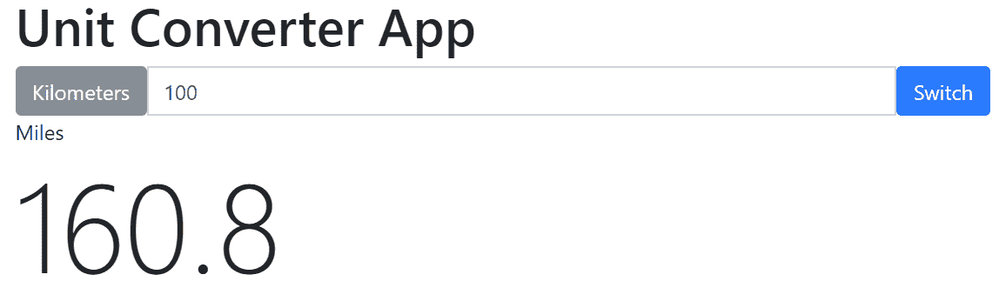
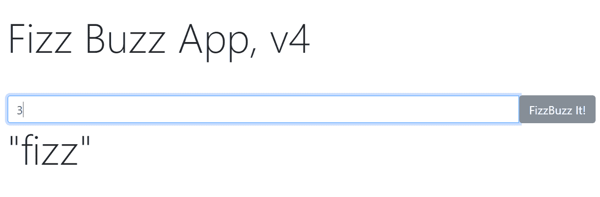
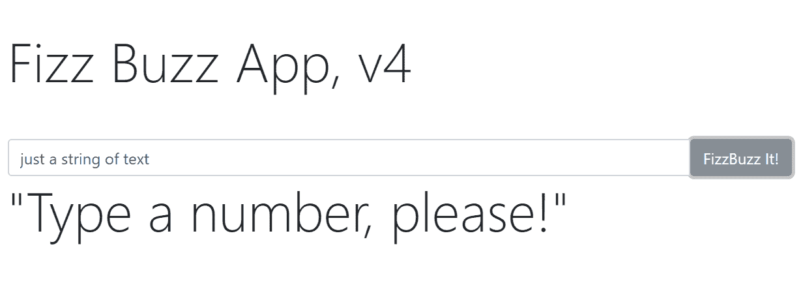

# 在 Elm 中准备一个单位转换网站

欢迎来到第四章，*在 Elm 中准备一个单位转换网站*。本章的目标是创建一个网站，将英里转换为公制系统测量，即千米。通过完成本章，你将获得 Elm 工作中不可或缺的实用技能，全部在一个有趣的项目中。

我们将涵盖的主题包括：

+   用于构建网站的 Elm 语言特性，包括类型注解、`case` 表达式、联合类型和消息

+   理解 `Result` 作为处理错误的方式

+   讨论 Elm 架构和工作流程概念以构建网站

完成本章后，你将能够：

+   与类型注解、情况表达式、联合类型和消息一起工作

# 我们要构建什么？

在本章中，我们将构建一个简单单位转换网站的核心。我们将介绍许多新概念，并立即在实践中使用它们。为了将所有内容都放入一章中，我们只设置基本的基础设施。

在下一章中，我们将扩展我们已构建的内容，以创建一个更复杂的结构。为了开始，我们将启动一个新的 Elm 应用。

要做到这一点，请在您的控制台中运行以下命令：

```js
create-elm-app unit-converter-simple
```

记住，为了运行你的应用，你需要将你的控制台指向你的新应用文件夹，然后在控制台中运行 `elm-app start` 命令。现在我们已经为开发设置了一切，是时候开始构建应用了。

# 构建我们的单位转换应用

首先，让我们删除 `Main.elm` 中的所有内容。接下来，让我们设置一个工作基础应用：

```js
module Main exposing (..)

import Html exposing (..)
import Html.Attributes exposing (..)
import Html.Events exposing (..)

-- Model
init =
    {}

-- Update
type Msg
    = Nothing

update msg model =
    model

-- View
view model =
    div [] [ text "Everything will go here" ]

-- Main
main =
    beginnerProgram
        { model = init
        , view = view
        , update = update
        }
```

到目前为止，我们有一个可以工作的应用，也就是说，它在屏幕上显示。然而，它实际上并没有做什么。尽管如此，看看前面代码的每一行实际上做了什么仍然是有价值的。我们像往常一样开始，通过声明 `main` 模块并导入我们应用中使用的所有其他模块。

`init` 函数是我们应用的初始模型，我们将其设置为空的 `Record`。接下来，我们设置一个 `Msg` 的联合类型，并给它 `Nothing` 的值。`Nothing` 简单地就是没有——我们的 `Msg` 联合类型目前没有任何值。

接下来，我们向 `update` 函数传递两个参数，`msg` 和 `model`，并返回 `model`。`view` 函数只是一个包含其第二个 `List` 中的文本节点的 `div`。

最后，让我们看看我们应用的入口点，即 `main` 函数。我们只需将其传递给 `beginnerProgram`，将 `model` 设置为 `init` 的值，`view` 设置为 `view`，`update` 设置为 `update`。接下来，让我们更新 `init` 函数。

# 更新 `init` 函数

我们的 `init` 函数将是我们的应用初始状态。让我们这样更新它：

```js
init = 
    { unit1 = "Kilometers"
    , unit2 = "Miles"
    , ratio = 1.608
    , convertedValue = 0.0
    }
```

`init` 函数被分配了一个包含两个 `Strings` 和两个 `Floats` 的 `Record` 的值。基本上，我们在这里模拟了应用将使用的数据。

# 类型注解和类型别名

在这个阶段，我们可能想要在`init`函数上方添加类型注解。如果你在使用 Atom 中的 lint 工具，你应该在编辑器中看到以下警告：

```js
Top-level value 'init' does not have a type annotation.
I inferred the type annotation so you can copy it into your code:
init : { convertedValue : Float, ratio : Float, unit1 : String, unit2 : String }
```

注意，类型注解内部命名值的顺序与我们分配给`init`函数的`Record`的顺序不匹配。原因很简单：Elm 中的记录不是基于索引的。

因此，我们可以选择在`init`函数上方添加建议的类型注解，编译器将会很高兴。

然而，我们还可以做一件更好的事情：使用类型别名。使用类型别名，我们可以缩短类型注解，使其更容易在任何需要的地方使用。在这种情况下，我们需要创建一个类型别名来在`init`函数上使用。由于`init`函数基本上只是初始模型，因此创建一个名为`Model`的类型别名并按需使用是有意义的。

因此，让我们在我们的代码中`init`函数上方设置一个类型别名`Model`，如下所示：

```js
type alias Model = 
    { convertedValue : Float
    , ratio : Float
    , unit1 : String
    , unit2 : String 
    }
```

现在，我们的更新后的`Main.elm`将看起来像这样：

```js
module Main exposing (..)

import Html exposing (..)
import Html.Attributes exposing (..)
import Html.Events exposing (..)

-- MODEL

type alias Model =
    { convertedValue : Float
    , ratio : Float
    , unit1 : String
    , unit2 : String 
    }

init : Model
init =
    { unit1 = "Kilometers"
    , unit2 = "Miles"
    , ratio = 1.608
    , convertedValue = 0.0
    }
```

看看前面的代码，我们可以看到`init`的类型注解很简单，就是`init : Model`，因为我们现在正在使用`Model`的类型别名。现在让我们把注意力转向`view`和`update`函数。

# 更新视图和更新函数

重要的是要理解`view`和`update`函数是通过消息连接的。`view`函数发送的任何消息都会被`update`函数接收。这就是为什么`view`函数发送的消息类型应该与接收到的`update`消息类型相同。这看起来可能很明显，但对此没有疑问将使你成为一个更好的 Elm 开发者。

首先，让我们在我们的`view`函数中添加一些更多内容：

```js
view model =
    div []
        [ p []
            [ label [ for "unit1Input" ] [ text "Kilometers" ]
            , br [] []
            , input [ id "unit1Input" ] []
            , button [ onClick Nothing ] [ text "Switch to Miles Input" ]
            , p [ id "unit2Value" ] [ text "Result of calculation" ]
            ]
        ]
```

在这个阶段，我们的`view`视图已经在屏幕上显示，按钮向`update`发送了`Nothing`消息。如果我们在这个时候编译并运行应用程序，我们将在页面上看到一个改进的用户界面。然而，一切仍然是静态的，点击按钮在这个阶段不会做任何事情。

让我们从将`Nothing`值替换为不同的值开始，我们将它称为`Swap`：

```js
view model =
    div []
        [ p []
            [ label [ for "unit1Input" ] [ text "Kilometers" ]
            , br [] []
            , input [ id "unit1Input" ] []
            , button [ onClick Swap] [ text "Switch to Miles Input" ]
            , p [ id "unit2Value" ] [ text "Result of calculation" ]
            ]
        ]
```

由于我们的`view`函数现在正在向按钮的`onClick`发送`Swap`消息，让我们在`update`函数上方更新我们的联合类型`Msg`，添加值为`Swap`：

```js
type Msg
    = Swap 
```

最后，让我们告诉`update`函数如何处理`Swap`消息：

```js
update msg model =
    case msg of
        Swap ->
            { model | unit1 = model.unit2, unit2 = model.unit1 }
```

在前面的代码片段中，我们使用了一些之前没有见过的代码。让我们看看它是如何工作的。如果`update`函数接收到值为`Swap`的消息，它将运行以下表达式：

```js
{ model | unit1 = model.unit2, unit2 = model.unit1 }
```

前面的代码做了什么？让我们从这一段代码开始：

```js
{ model | ... }
```

前面的代码意味着——返回与之前相同的模型，只是更新了管道字符右侧的代码中的指定更新。

管道字符右侧的代码执行以下操作：将`unit1`的值设置为`model.unit2`，将`unit2`的值设置为`model.unit1`。

如果你在这一点上保存你的应用并运行它，你将看到它在浏览器中渲染 HTML 之后，没有其他变化。为了确保代码实际上做了些什么，我们需要将`view`中的`text`函数内的硬编码`Strings`替换为适当的`model`值，如下所示：

```js
view model =
    div []
        [ div []
            [ label [ for "unit1Input" ] [ text model.unit1 ]
            , input [ id "unit1Input" ] []
            , button [ onClick Swap ] [ text "Switch" ]
            , label [ for "unit2" ] [ text model.unit2 ]
            , div [ id "unit2Value" ] [ text "1234" ]
            ]
        ]
```

现在，运行我们的代码并点击按钮实际上会从`view`发送`Swap`消息到`update`，用户会在屏幕上看到“千米”和“英里”在按钮点击时交换位置。

# 添加转换逻辑

现在，我们可以使我们的应用在按钮点击时转换它接收到的输入。让我们首先更新我们的`view`函数，以便它显示初始转换值，即 0.0 的值，因为这是我们传递给`init`函数的`Record`的值。请注意，以下代码将无法编译：

```js
view model =
    div []
        [ div []
            [ label [ for "unit1Input" ] [ text model.unit1 ]
            , input [ id "unit1Input" ] []
            , button [ onClick Swap ] [ text "Switch" ]
            , label [ for "unit2" ] [ text model.unit2 ]
            , div [ id "unit2Value" ] [ text model.convertedValue ]
            ]
        ]
```

使用前面的`update`运行我们的应用会导致编译器抛出错误。为什么？简单地说，`text`函数必须始终接收一个`String`。因此，我们需要首先在`model.convertedValue`上运行`toString`函数，然后将该表达式的结果传递给`text`函数。如下所示：

```js
...
            , div [ id "unit2Value" ] [ text (toString model.convertedValue) ]
            ]
        ]
```

在这一点上运行应用只会使屏幕上出现微小的变化。屏幕上会显示一个零。然而，如果用户在输入字段中输入，这不会影响零——它仍然会静止在那里。现在让我们通过改进`view`中的`input`函数来修复这个问题。

# 优化输入函数

为了使我们的应用能够转换输入文本字段中输入的值，我们需要能够对那个输入做些什么。换句话说，我们需要将输入的值发送到`update`函数，然后告诉`update`函数如何处理它接收到的消息。

因此，首先，让我们向我们的`view`函数添加一些内容，以便当用户输入某些内容时，它将发送一个包含该事件的`message`到`update`函数：

```js
view model =
    div []
        [ div []
            [ label [ for "unit1Input" ] [ text model.unit1 ]
            , input [ id "unit1Input", onInput Convert ] []
            , button [ onClick Swap ] [ text "Switch" ]
            , label [ for "unit2" ] [ text model.unit2 ]
            , div [ id "unit2Value" ] [ text (toString model.convertedValue) ]
            ]
        ]
```

在前面的代码中，我们只是向`input`函数的第一个`List`中添加了另一个项目。我们添加的项目是`onInput`函数，它接收一个我们称之为`Convert`的参数。

# 障碍

到目前为止，在我们的应用开发中，我们没有遇到任何重大问题。我们即将遇到一个小小的障碍，并且重要的是要像后续部分中那样缓慢地走过这个障碍。

我们已经完成了`view`。现在，我们可以相应地更改我们的`update`函数：

```js
update msg model =
    case msg of
        Swap ->
            { model | unit1 = model.unit2, unit2 = model.unit1, ratio = 1 / model.ratio }

        Convert newValue ->
            { model | convertedValue = newValue }
```

如果我们现在运行我们的应用，它将无法编译。尽管前面的代码是有效的，但还缺少一部分。看看错误信息，并尝试理解这个错误的原因：

```js
NAMING ERROR
 Line 28, Column 9
 Cannot find pattern Convert
NAMING ERROR
 Line 36, Column 48
 Cannot find variable Convert
```

显然，在第`28`行，我们的`update`函数正在尝试对名为`Convert`的模式进行模式匹配，但它找不到它。同样，在第`36`行，我们的`view`函数正在尝试使用一个名为`Convert`的变量，但它也找不到它。

为了解决这个错误，让我们简要地思考一下我们的`view`函数可以发送的消息。有多少个？

当然，这里只有两条信息：`Swap` 和 `Convert`。

如果你查看`Swap`消息，你会在我们的代码中看到它在三个地方被使用：在`view`函数中，作为`onClick`函数的参数。在`update`函数的`case`表达式中，它被用作`Swap`模式，并且在`Msg`联合类型中，它被用作其唯一可能的值。

因此，为了解决我们的错误，我们需要将`Convert`值作为`Msg`联合类型的另一个可能值添加进去，如下所示：

```js
type Msg 
    = Swap
    | Convert
```

现在运行应用程序将导致另一个错误，但解决这个问题的方法应该更加明显。以下是错误文本：

```js
TOO MANY ARGUMENTS
Line 29, Column 9
Pattern Main.Convert has too many arguments.
Expecting 0, but got 1.
```

正如错误信息所示，编译器正在查看`Convert`模式，并看到它有一个我们称为`newValue`的参数。但是当它查看`Msg`联合类型时，它只看到`Convert`。那里没有参数！

为了修复当前的错误，我们需要指定`Convert`值必须携带的参数：

```js
type Msg
    = Swap
    | Convert String
```

将前面的更改保存到我们的应用程序中，将使我们更接近完全工作的代码。

即使目前的代码经过改进，我们的应用程序仍然无法编译。此时，一个不耐烦的读者可能会开始对编译器感到有些恼火，尽管编译器很有帮助。

然而，接下来的内容可能是本章中最重要的知识点。它涉及到在我们应用程序中切换原始值——这个主题在在线资源中很少讨论，也许是因为它被认为是另一种“预期的理解”。

那么，让我们解决这个难题。首先，让我们回顾一下我们的`model`，即`Model`的类型别名：

```js
type alias Model =
    { convertedValue : Float
    , ratio : Float
    , unit1 : String
    , unit2 : String 
    }
```

正如我们在前面的代码中所看到的，`convertedValue`是一个`Float`，而不是一个`String`。我们可能会认为解决方案就是简单地将传递给`Convert`的值从`String`更改为`Float`，在我们的`Msg`联合类型中：

```js
type Msg
    = Swap
    | Convert Float
```

不幸的是，这只会导致另一个错误：

```js
TYPE MISMATCH
 Line 37, Column 48
 The argument to function onInput is causing a mismatch. 
Function onInput is expecting the argument to be:

String -> msg
 But it is:
Float -> Main.Msg
```

因此，显然，我们的`onInput`消息需要是一个`String`。让我们尝试将`newValue`转换为`Float`，它是一个`String`：

```js
        Convert newValue ->
            { model | convertedValue = String.toFloat newValue }
```

前面的代码将抛出另一个错误，这个错误一开始可能会看起来有些吓人：

```js
TYPE MISMATCH
 Line 47, Column 9
 The argument to function beginnerProgram is causing a mismatch.
Function beginnerProgram is expecting the argument to be:
{ ..., update : Main.Msg -> Main.Model -> Main.Model }
 But it is:
{ ...
 , update :
 Main.Msg
 -> { convertedValue : Result.Result String Float
 , ratio : Float
 , unit1 : String
 , unit2 : String
 }
 -> { convertedValue : Result.Result String Float
 , ratio : Float
 , unit1 : String
 , unit2 : String
 }
 }
 Hint: Problem at update.convertedValue...
```

这个消息可能看起来不如我们习惯的那样直观，原因有两个。首先，这个消息报告了一个与我们的类型别名`Model`相关的错误，它曾擅长隐藏应用程序的复杂性，但现在可能阻碍了我们理解问题的努力。其次，在错误信息中，我们可以看到一个新出现的 Elm 关键字：`Result`。

让我们一步一步地解决错误。我们首先尝试通过注释掉`Model`的类型别名以及`init`函数的类型注解来产生一个更易于理解的错误：

```js
module Main exposing (..)

import Html exposing (..)
import Html.Attributes exposing (..)
import Html.Events exposing (..)

-- Model
{--
type alias Model = 
    { convertedValue : Float
    , ratio : Float
    , unit1 : String
    , unit2 : String 
    }

init : Model
--}
```

现在，让我们尝试重新编译应用，以获得一个稍微不同的错误信息，如下所示：

```js
TYPE MISMATCH
 Line 49, Column 9
 The argument to function beginnerProgram is causing a mismatch.
Function beginnerProgram is expecting the argument to be:
{ ...
 , update :
 Main.Msg
 -> { ..., convertedValue : Float }
 -> { ..., convertedValue : Float }
 }
 But it is:
{ ...
 , update :
 Main.Msg
 -> { ..., convertedValue : Result.Result String Float }
 -> { ..., convertedValue : Result.Result String Float }
 }
 Hint: Problem at update.convertedValue...
```

前面的错误信息使问题稍微明显一些。我们遇到了这个`Result.Result`问题。它究竟是什么？

# 处理`Result.Result`错误

`Result`是一个类型。每当我们的函数可能返回一个错误时，我们就使用`Result`类型。

在我们前面的例子中，我们有一个输入字段。用户在输入字段中输入，我们期望输入是`Float`类型。然而，如果用户输入一个或多个字母，或者字母和数字的组合，或者任何其他非数字的奇怪字符怎么办？

从概念上讲，这归结为两种可能性——一个函数通过用户在输入字段中输入意外的字符来返回一个*错误*，或者通过用户输入我们期望的`Floats`来返回一个*结果*。

这就是官方文档中定义的`Result`包的样式，可在以下链接找到：[`package.elm-lang.org/packages/elm-lang/core/latest/Result`](http://package.elm-lang.org/packages/elm-lang/core/latest/Result)

“一个`Result`是可能失败的计算的结果。这是在 Elm 中管理错误的好方法。”

官方文档给出了以下联合类型定义：

```js
type Result error value
    = Ok value
    | Err error
```

因此，如果我们的函数成功，我们将得到一个包含值的`Ok`；否则，我们将得到一个包含错误的`Err`。这引发了一个问题：我们如何在程序中使用`Result`来处理错误？

在其核心，解决方案简单而优雅，就像 Elm 中的其他一切一样：如果我们得到一个`Ok`，函数应该返回一个值；如果我们得到一个`Err`，函数应该返回一个*默认*值。让我们从官方文档中再举一个例子，并在 REPL 中运行它：

```js
Result.withDefault 0 (String.toInt "123") == 123
```

在前面的代码中，我们正在将字符串`"123"`解析为`Int`类型，但为了安全起见，以防我们得到一个`Err`，我们将默认值设置为零。

这是 REPL 返回的内容：

```js
True : Bool
```

现在我们来尝试第二个例子：

```js
Result.withDefault 0 (String.toInt "abc") == 0
```

那么，REPL 现在会返回什么？正是同样的东西：

```js
True : Bool
```

结论是，无论我们在双引号内写什么，只要我们为`Err`值提供一个默认解决方案，Elm 都会处理它。

现在我们已经理解了`Result.Result`是什么，让我们回到修复我们的应用。

# 使用`Result`类型修复我们的应用

在处理了大量的错误信息和一些枯燥的理论之后，让我们将新技能付诸实践，通过将`update`函数更改为以下代码：

```js
update msg model =
    case msg of
        Swap ->
            { model | unit1 = model.unit2, unit2 = model.unit1 }

        Convert newValue ->
            { model | convertedValue = Result.withDefault 10 (String.toFloat newValue) }
```

前面的代码现在应该更容易理解了。如果我们的`update`函数接收到与`Convert`模式匹配的消息，并且包含`newValue`字符串，我们将执行箭头后的代码。

箭头后面的代码表示：使用现有的模型，只需对模型的 `convertedValue` 进行更改。要分配给 `convertedValue` 的更新值是以下表达式的结果：

```js
Result.withDefault 10 (String.toFloat newValue)
```

Elm 从括号开始评估表达式：它将 `newValue` 字符串转换为 `Float`。

如果操作成功，它返回评估表达式的给定 `Float` 值。如果操作不成功，它返回数字 `10`，如果你在运行的应用程序中的输入字段中输入除数字以外的任何内容，你确实会在屏幕上看到这个数字。

剩下的唯一一件事是：取消注释类型别名 `Model` 和 `init` 函数的类型注解。经过我们所有的更改，这是到目前为止我们应用程序的完整代码：

```js
module Main exposing (..)

import Html exposing (..)
import Html.Attributes exposing (..)
import Html.Events exposing (..)

-- Model
type alias Model = 
    { convertedValue : Float
    , ratio : Float
    , unit1 : String
    , unit2 : String 
    }

init : Model

init = 
    { unit1 = "Kilometers"
    , unit2 = "Miles"
    , ratio = 1.608
    , convertedValue = 0.0
    }

-- Update
type Msg
    = Swap
    | Convert String

update msg model =
    case msg of
        Swap ->
            { model | unit1 = model.unit2, unit2 = model.unit1 }

        Convert newValue ->
            { model | convertedValue = Result.withDefault 10 (String.toFloat newValue) }

-- View
view model =
    div []
        [ div []
            [ label [ for "unit1Input" ] [ text model.unit1 ]
            , input [ id "unit1Input", onInput Convert ] []
            , button [ onClick Swap ] [ text "Switch" ]
            , label [ for "unit2" ] [ text model.unit2 ]
            , div [ id "unit2Value" ] [ text (toString model.convertedValue) ]
            ]
        ]

-- Main
main =
    beginnerProgram
        { model = init
        , view = view
        , update = update
        }
```

运行应用程序并测试它。

如果你将数字输入到输入字段中，你将在下一行看到相同的数字。然而，如果你在输入字段中输入任何其他字符，你将在下一行看到数字 10——这是一个明显的迹象，表明我们的函数的 `Result` 是 `Err`。

在下一节中，我们将使我们的应用程序实际上将接收到的输入字段中的值进行转换。

# 计算转换

让我们更新 `update` 函数的 `case` 表达式中的 `Convert` 模式。我们新的代码将如下所示：

```js
        Convert newValue ->
            { model | convertedValue = (Result.withDefault 10 (String.toFloat newValue)) * model.ratio }
```

更新后，保存应用程序并测试输入字段的性能。一旦你开始输入数字，你将立即看到它被转换为千米单位的转换值。

然而，我们还需要进行另一项改进。由于我们的 `Result.withDefault` 现在是 10，所以当用户输入除数字以外的任何内容，或者在他们开始输入之前，我们都会在屏幕上看到数字 `16.08`。

这是一个简单的修复。我们不再使用 10，而是简单地使用 0 作为默认的 `Result`。更新代码如下：

```js
        Convert newValue ->
            { model | convertedValue = (Result.withDefault 0 (String.toFloat newValue)) * model.ratio }
```

现在，应用程序具有预期的行为。

然而，`->` 操作符后面的表达式有点难以处理。我们将通过使用 `let` 表达式使我们的代码看起来更美观，并在过程中学习 Elm 语言的一个新特性。

# 使用 `let` 表达式重构我们的应用程序

到目前为止，我们已准备好使用 `let` 表达式来改进 `update` 函数的 `case` 表达式中的 `Convert` 模式。

Elm 中的 `let` 表达式由两部分组成：`let` 和 `in`。`let` 部分允许我们声明将在 `let` 表达式的 `in` 部分中使用的变量和函数。需要注意的是，这里声明的变量仅限于它们被使用的函数的作用域内。我们的程序的其他部分对此一无所知。换句话说，这些变量是局部的，并不存在于我们的程序的其他部分。  与 `update` 或 `view` 函数等全局作用域中的函数形成对比。

`let` 表达式的 `in` 部分应该返回一个值，无论放置了什么表达式。

让我们看看我们如何将`Convert`模式写成`let`表达式。首先，让我们再次看看它：

```js
        Convert newValue ->
            { model | convertedValue = (Result.withDefault 0 (String.toFloat newValue)) * model.ratio }
```

现在，让我们考虑将前面代码的一部分放入一个变量中，该变量作用域为`let`表达式。一个明显的候选者是这段代码：

```js
(Result.withDefault 0 (String.toFloat newValue))
```

我们能给前面的代码片段起什么名字？

`floatValue`怎么样？这是一个很好的、描述性的名字，因为我们确实将现有的`newValue`字符串转换为`Float`，并给它默认值零。因此，我们的更新后的代码将看起来像这样：

```js
floatValue =
   Result.withDefault 0 (String.toFloat newValue)
```

接下来，让我们将我们的`Convert`模式重写为一个`let`表达式：

```js
Convert newValue ->
    let
        floatValue =
            Result.withDefault 0 (String.toFloat newValue)
    in
        { model | convertedValue = floatValue * model.ratio }
```

那里，好多了。

我们将尝试解读之前那个长的一行表达式的认知负荷减少，变成一个更易于推理的`let`表达式。使用`let`表达式将很快让你觉得如此自然，以至于你会想知道在没有它们的情况下是如何做到的。为什么？因为以这种方式编写我们的代码，在`let`表达式的`let`部分声明的变量和它的`in`部分的实际表达式之间做出了清晰的分离。

# 使我们的应用看起来更美观

在本章中，我们涵盖了大量的理论，并且也将其付诸实践。现在，让我们看看我们应用在这个阶段的完整代码：

```js
module Main exposing (..)

import Html exposing (beginnerProgram, div, button, input, text, label, span)
import Html.Attributes exposing (for, id, value)
import Html.Events exposing (onClick, onInput)

type alias Model =
    { unit1 : String
    , unit2 : String
    , ratio : Float
    , convertedValue : Float
    }

initModel : Model
initModel =
    { unit1 = "Kilometers"
    , unit2 = "Miles"
    , ratio = 1.608
    , convertedValue = 0.0
    }

main =
    beginnerProgram { model = initModel, view = view, update = update }

view model =
    div []
        [ div []
            [ label [ for "unit1Input" ] [ text model.unit1 ]
            , input [ id "unit1Input", onInput Convert ] []
            , button [ onClick Swap ] [ text "Switch" ]
            , label [ for "unit2" ] [ text model.unit2 ]
            , div [ id "unit2Value" ] [ text (toString model.convertedValue) ]
            ]
        ]

type Msg
    = Swap
    | Convert String

update msg model =
    case msg of
        Swap ->
            { model | unit1 = model.unit2, unit2 = model.unit1, ratio = 1 / model.ratio }

        Convert newValue ->
            let
                floatValue =
                    Result.withDefault 0 (String.toFloat newValue)
            in
                { model | convertedValue = floatValue * model.ratio }
```

接下来，我们将通过使用 Bootstrap 4 来使应用看起来更美观。

# 添加 Bootstrap 样式

首先，导航到项目`public`文件夹中的`index.html`，并添加以下代码行：

```js
<link rel="stylesheet" href="https://maxcdn.bootstrapcdn.com/bootstrap/4.0.0-alpha.6/css/bootstrap.min.css" integrity="sha384-rwoIResjU2yc3z8GV/NPeZWAv56rSmLldC3R/AZzGRnGxQQKnKkoFVhFQhNUwEyJ" crossorigin="anonymous">
```

我们代码更新的起点将是一个简单的 HTML 代码片段，从官方 Bootstrap 文档网站复制而来。我们将使用的代码是基于 Bootstrap 的输入组：

```js
  <div class="col-lg-offset-3 col-lg-6">
    <div class="input-group">
      <span class="input-group-btn">
        <button class="btn btn-secondary" type="button">Hate it</button>
      </span>
      <input type="text" class="form-control" placeholder="Product name">
      <span class="input-group-btn">
        <button class="btn btn-secondary" type="button">Love it</button>
      </span>
    </div>
  </div>
```

让我们将前面的代码片段转换为 Elm 代码，使用在[`mbylstra.github.io/html-to-elm/`](https://mbylstra.github.io/html-to-elm/)可用的 HTML 到 Elm 页面。在 HTML 被解析后，我们得到以下内容：

```js
div [ class "col-lg-offset-3 col-lg-6" ]
    [ div [ class "input-group" ]
        [ span [ class "input-group-btn" ]
            [ button [ class "btn btn-secondary", type_ "button" ]
                [ text "Hate it" ]
            ]
        , input [ class "form-control", placeholder "Product name", type_ "text" ]
            []
        , span [ class "input-group-btn" ]
            [ button [ class "btn btn-secondary", type_ "button" ]
                [ text "Love it" ]
            ]
        ]
    ]
```

现在，我们需要将现有的 Elm 代码映射到前面的 Elm 代码。为了更容易工作，我们还将将其分配给一个变量。完成之后，我们的`view`函数将看起来像这样：

```js
view model =
 div []
 [ div [ class "col-lg-offset-3 col-lg-6 mt5 pt5" ]
 [ h1 []
        [ text "Unit Converter App" ]
 , div [ class "input-group" ]
 [ span [ class "input-group-btn" ]
 [ button [ class "btn btn-secondary", type_ "button" ]
 [ text model.unit1 ]
 ]
 , input [ onInput Convert, class "form-control", placeholder "Type a number to convert", type_ "text" ] []
 , span [ class "input-group-btn" ]
 [ button [ onClick Swap, class "btn btn-primary", type_ "button" ] [ text "Switch" ]
 ]
 ]
 , div [ class "mt5 pt5" ] [ text model.unit2 ]
 , div [ id "unit2Value" ] [ text (toString model.convertedValue) ] 
 ]
 ]
```

之前的代码给出了与我们之前所用的略有不同的 HTML 结构，但它也更加语义化，并且对最终用户来说看起来更美观。现在，让我们看看我们应用的完整代码：

```js
module Main exposing (..)

import Html exposing (beginnerProgram, div, button, input, text, label, span, h1)
import Html.Attributes exposing (for, id, value, class, placeholder, type_)
import Html.Events exposing (onClick, onInput)

type alias Model =
    { unit1 : String
    , unit2 : String
    , ratio : Float
    , convertedValue : Float
    }

initModel : Model
initModel =
    { unit1 = "Kilometers"
    , unit2 = "Miles"
    , ratio = 1.608
    , convertedValue = 0.0
    }

main =
    beginnerProgram { model = initModel, view = view, update = update }

view model =
 div []
 [ div [ class "col-lg-offset-3 col-lg-6 mt5 pt5" ]
 [ h1 []
        [ text "Unit Converter App" ]
 , div [ class "input-group" ]
 [ span [ class "input-group-btn" ]
 [ button [ class "btn btn-secondary", type_ "button" ]
 [ text model.unit1 ]
 ]
 , input [ onInput Convert, class "form-control", placeholder "Type a number to convert", type_ "text" ] []
 , span [ class "input-group-btn" ]
 [ button [ onClick Swap, class "btn btn-primary", type_ "button" ] [ text "Switch" ]
 ]
 ]
 , div [ class "mt5 pt5" ] [ text model.unit2 ]
 , div [ id "unit2Value" ] [ text (toString model.convertedValue) ] 
 ]
 ]

type Msg
    = Swap
    | Convert String

update msg model =
    case msg of
        Swap ->
            { model | unit1 = model.unit2, unit2 = model.unit1, ratio = 1 / model.ratio }

        Convert newValue ->
            let
                floatValue =
                    Result.withDefault 0 (String.toFloat newValue)
            in
                { model | convertedValue = floatValue * model.ratio }
```

在这个阶段，我们的应用应该看起来像这样：



在这个阶段，我们可以对我们的应用进行一些改进。例如，切换按钮只切换单位名称在公里和英里之间，但当切换按钮被按下时，它不会更新输入字段中已经存在的值。此外，页面布局和样式，虽然比我们之前的好，但仍需要更多改进。

在下一章中，我们将添加这些功能并进一步改进应用，使其具有多个输入以转换多个单位。现在，我们将把重点转向查看如何应用本章学到的知识并更新我们的 *FizzBuzz* 应用。

# 重新审视 FizzBuzz 应用

在我们开始改进我们的 *FizzBuzz* 应用之前，让我们提醒自己上一章我们停在了哪里：

```js
module Main exposing (main)

import Html exposing (Html, text)

ourList = [1,2,3,4,5,6,7,8,9,10,11,12,13,14,15,16]

fizzBuzzCheck fizz buzz fizzBuzz num =
    if num % 15 == 0 then
        toString fizzBuzz
    else if num % 5 == 0 then
        toString buzz
    else
        toString num

main =
    List.map (fizzBuzzCheck "fizz" "buzz" "fizz buzz") ourList
    |> String.concat
    |> text
```

让我们将前面的应用转换为使用 Elm 架构，并使其根据用户输入打印出一个数字或一个单词。我们将从之前使用的裸骨应用开始，该应用利用 `beginnerProgram` 函数：

```js
module Main exposing (..)

import Html exposing (..)
import Html.Attributes exposing (..)
import Html.Events exposing (..)

-- Model
initModel =
    {}

-- Update
type Msg
    = Nothing

update msg model =
    model

-- View
view model =
    div [] [ text "Everything will go here" ]

-- Main
main =
    beginnerProgram
        { model = initModel
        , view = view
        , update = update
        }
```

接下来，让我们填充我们的初始模型：

```js
initModel =
    { inputValue = ""
    , outputValue = 0.0
    }
```

现在，让我们添加一个 `Model` 的类型别名，并相应地更新 `initModel` 的类型注解：

```js
type alias Model =
    { inputValue : String
    , outputValue : Float
    }

initModel : Model
initModel =
    { inputValue = ""
    , outputValue = 0.0
    }
```

接下来，让我们给 `view` 函数添加一些 HTML：

```js
-- View
view model =
    div []
        [ div [ class "col-lg-6" ]
            [ div [ class "input-group" ]
                [ input 
                    [ onInput DisplayInput, class "form-control", placeholder "Enter sth", type_ "text" ]
                    []
                , span [ class "input-group-btn" ]
                    [ button [ class "btn btn-secondary", type_ "button" ]
                        [ text "FizzBuzz It!" ]
                    ]
                ]
            , div [ class "display-4" ] [ text (toString model.outputValue) ]
            ]
        ]
```

如果我们现在编译应用，我们将在浏览器中看到一个输入和一个按钮。在本版本的 *FizzBuzz* 应用中，我们希望用户在输入框中输入一个数字，然后点击按钮后，应用将根据游戏规则打印出一个数字或一个单词。

现在，我们可以开始让应用接收用户输入了。让我们通过添加一个 `onInput` 消息来更新 `view` 函数内部的嵌套 `input` 函数：

```js
[ input [ onInput DisplayInput, class "form-control", placeholder "Enter a number", type_ "text" ]
```

现在，我们需要允许 `update` 函数接收该消息：

```js
update msg model =
    case msg of
        DisplayInput newValue->
           { model | outputValue = Result.withDefault 0 (String.toFloat newValue) }
```

当然，我们仍然需要修改 `Msg` 联合类型：

```js
type Msg
    = DisplayInput String
```

如果我们现在运行应用，我们将看到一个输入、一个按钮，以及其下方的数字零。如果我们输入字母，则不会发生变化；然而，如果我们输入数字，它们将显示在零的位置。

# 给我们的 FizzBuzz 应用添加一些逻辑

在本节中，我们将为我们的 *FizzBuzz* 应用添加一些逻辑，以便根据用户输入显示结果。让我们通过在更新函数的 `case` 表达式的 `DisplayInput` 模式中添加逻辑来实现这一点：

```js
update msg model =
    case msg of
        DisplayInput newValue ->
            let
              condition = 
                  if (Result.withDefault 1 (String.toInt newValue) % 15) == 0 then
                      "fizzBuzz"
                  else if (Result.withDefault 1 (String.toInt newValue) % 5) == 0 then
                      "buzz"
                  else if (Result.withDefault 1 (String.toInt newValue) % 3) == 0 then
                      "fizz"
                  else
                      newValue
            in
              { model | outputValue = condition }
```

之前代码中所做的可以解释为以下几点：

+   我们已经给 `DisplayInput` 模式赋予了一个我们称之为 `condition` 的作用域变量。

+   `condition` 变量将根据用户输入到 `input` 字段中的数字（存储在 `newValue` 变量中）评估为其中的一个 `if` 表达式。

+   在 `let` 表达式的 `in` 部分，我们简单地返回相同的模型加上基于条件变量在 `let` 表达式的 `let` 部分等价的价值更新的 `outputValue`。

我们现在可以保存并运行我们的应用，观察它如何根据用户输入动态更新输入字段下 `div` 的文本节点。

我们可以观察到以下行为：

+   输入一个数字将导致从 *FizzBuzz* 游戏中正确计算出数字或单词。

+   输入任何其他内容将在输入下方的 `div` 中返回相同的字符串

这意味着我们的应用仍有更多改进的空间。我们将通过简单地添加另一个 `if` 表达式到我们的条件变量中，并将剩余的解析为一个消息给用户，告诉他们需要输入一个数字，而不是其他字符。

我们需要进行的更新足够简单：

```js
update msg model =
    case msg of
        DisplayInput newValue ->
            let
              condition = 
                  if (Result.withDefault 1 (String.toInt newValue) % 15) == 0 then
                      "fizzBuzz"
                  else if (Result.withDefault 1 (String.toInt newValue) % 5) == 0 then
                      "buzz"
                  else if (Result.withDefault 1 (String.toInt newValue) % 3) == 0 then
                      "fizz"
                  else if (Result.withDefault 0 (String.toInt newValue)) /= 0 then
                      newValue
                  else
                      "Type a number, please!"
            in
              { model | outputValue = condition }
```

到目前为止，我们的 *FizzBuzz* 应用表现得要好得多。让我们看看这个阶段应用的完整代码：

```js
module Main exposing (..)

import Html exposing (..)
import Html.Attributes exposing (..)
import Html.Events exposing (..)

type alias Model =
    { inputValue : String
    , outputValue : String
    }

initModel : Model
initModel =
    { inputValue = ""
    , outputValue = ""
    }

-- Update
type Msg
    = DisplayInput String

update msg model =
    case msg of
        DisplayInput newValue ->
            let
              condition = 
                  if (Result.withDefault 1 (String.toInt newValue) % 15) == 0 then
                      "fizzBuzz"
                  else if (Result.withDefault 1 (String.toInt newValue) % 5) == 0 then
                      "buzz"
                  else if (Result.withDefault 1 (String.toInt newValue) % 3) == 0 then
                      "fizz"
                  else if (Result.withDefault 0 (String.toInt newValue)) /= 0 then
                      newValue
                  else
                      "Type a number, please!"
            in
              { model | outputValue = condition }
-- View
view model =
    div []
        [ div [ class "col-lg-6" ]
            [ div [ class "pt-5 pb-5 display-4" ] [text "Fizz Buzz App, v4" ]
            , div [ class "input-group" ]
                [ input 
                    [ onInput DisplayInput, class "form-control", placeholder "Enter sth", type_ "text" ]
                    []
                , span [ class "input-group-btn" ]
                    [ button [ class "btn btn-secondary", type_ "button" ]
                        [ text "FizzBuzz It!" ]
                    ]
                ]
            , div [ class "display-4" ] [ text (toString model.outputValue) ]
            ]
        ]

-- Main
main =
    beginnerProgram
        { model = initModel
        , view = view
        , update = update
        }
```

这是我们的改进版 *FizzBuzz* 应用的欢迎屏幕：


输入一个数字会产生期望的结果：



输入其他任何内容都会产生一个用户友好的错误信息：



我们还有很多可以改进的地方，正如我们在第五章，“在 Elm 中完成单位转换网站”中将会看到的。

# 摘要

在第四章，“在 Elm 中准备单位转换网站”中，我们学习了许多重要的概念，例如：

+   使用 `Msg` 联合类型

+   使用 `Records` 设置我们模型的数据

+   使用类型注解和类型别名

+   使用管道字符在我们的表达式中仅更新模型的一部分

+   使用 `Result` 联合类型来处理我们应用中的潜在错误

+   使用 `let` 表达式

在下一章中，我们将通过添加多个输入来改进我们的单位转换网站，以便转换各种单位。
